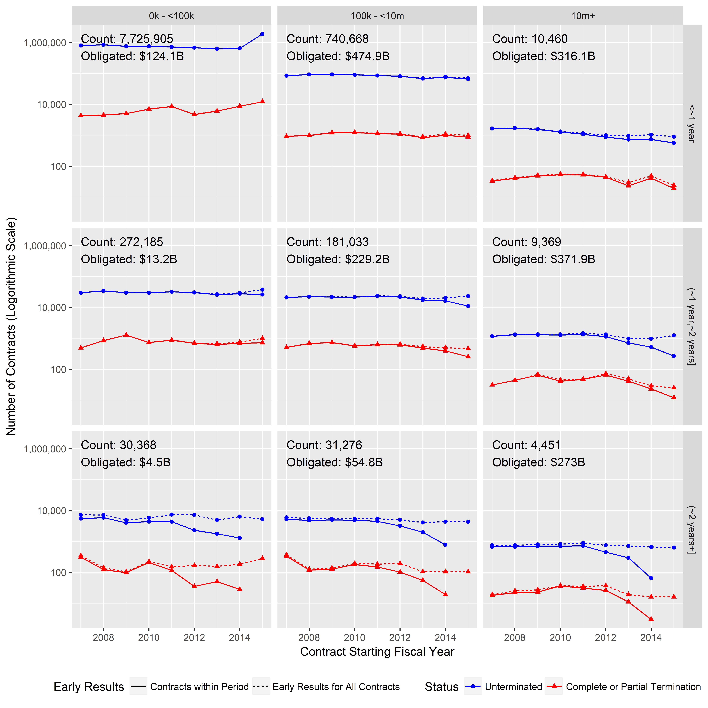
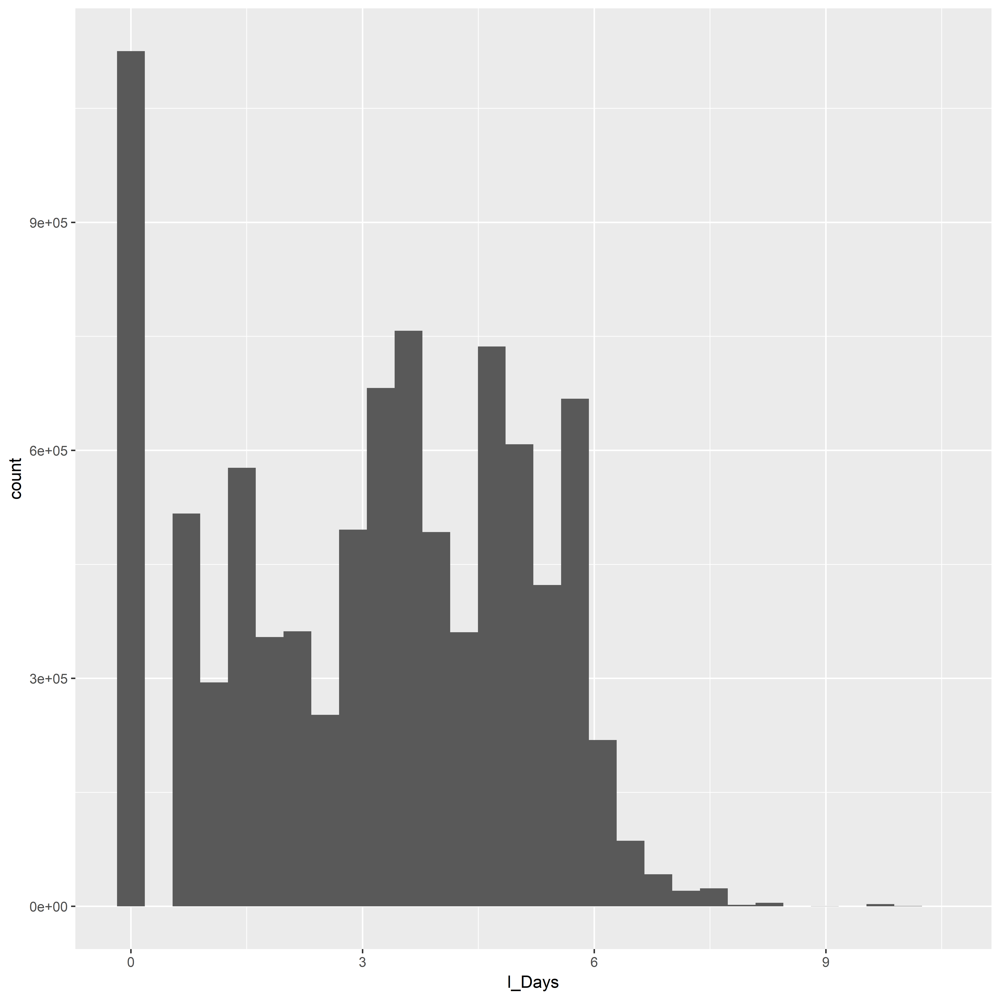
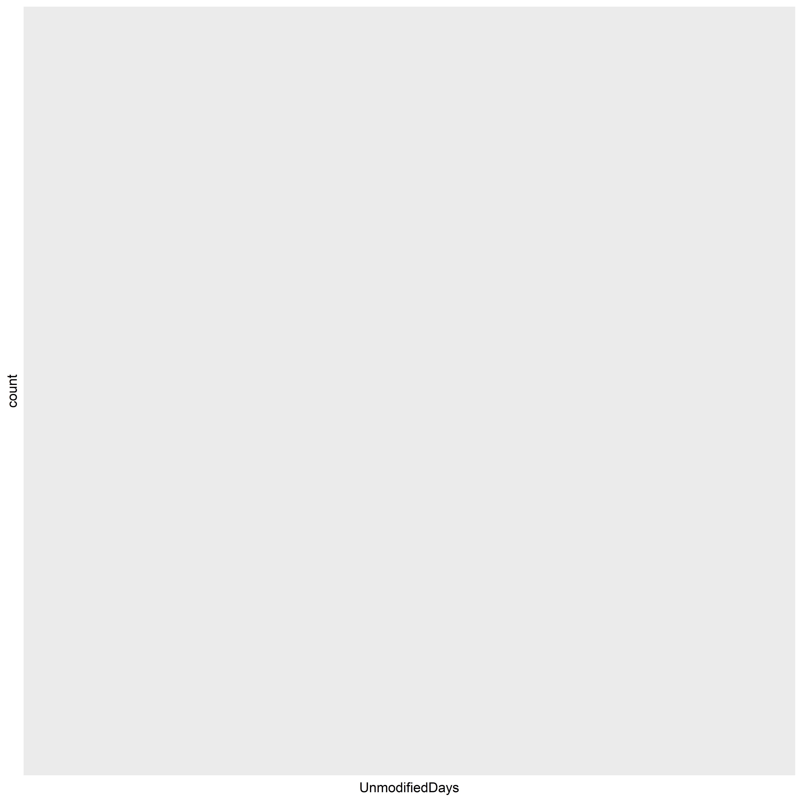

---
title: "ContractTermination"
author: "Greg Sanders"
date: "Wednesday, February 8, 2017"
output:
  html_document:
    keep_md: yes
--- 

Is Terminated exploration
============================================================================


#Setup

```r
source("https://raw.githubusercontent.com/CSISdefense/R-scripts-and-data/master/helper.r")
```

```
## 
## Attaching package: 'lubridate'
```

```
## The following object is masked from 'package:plyr':
## 
##     here
```

```
## The following object is masked from 'package:base':
## 
##     date
```

```r
source("https://raw.githubusercontent.com/CSISdefense/R-scripts-and-data/master/lookups.r")
source("DIIGstat.r")
```

```
## Loading required package: MASS
```

```
## Loading required package: Matrix
```

```
## Loading required package: lme4
```

```
## 
## arm (Version 1.10-1, built: 2018-4-12)
```

```
## Working directory is H:/Users/Greg/Repositories/Vendor
```

```
## 
## Attaching package: 'arm'
```

```
## The following object is masked from 'package:scales':
## 
##     rescale
```

```
## 
## Attaching package: 'dplyr'
```

```
## The following object is masked from 'package:MASS':
## 
##     select
```

```
## The following objects are masked from 'package:lubridate':
## 
##     intersect, setdiff, union
```

```
## The following objects are masked from 'package:plyr':
## 
##     arrange, count, desc, failwith, id, mutate, rename, summarise,
##     summarize
```

```
## The following objects are masked from 'package:stats':
## 
##     filter, lag
```

```
## The following objects are masked from 'package:base':
## 
##     intersect, setdiff, setequal, union
```

```
## Loading required package: carData
```

```
## 
## Attaching package: 'car'
```

```
## The following object is masked _by_ '.GlobalEnv':
## 
##     Boxplot
```

```
## The following object is masked from 'package:dplyr':
## 
##     recode
```

```
## The following object is masked from 'package:arm':
## 
##     logit
```

```r
source("https://raw.githubusercontent.com/CSISdefense/Crisis-Funding/master/ContractCleanup.r")
```

```
## Loading required package: lattice
```

```
## Loading required package: survival
```

```
## Loading required package: Formula
```

```
## 
## Attaching package: 'Hmisc'
```

```
## The following object is masked _by_ '.GlobalEnv':
## 
##     subplot
```

```
## The following objects are masked from 'package:dplyr':
## 
##     src, summarize
```

```
## The following objects are masked from 'package:plyr':
## 
##     is.discrete, summarize
```

```
## The following objects are masked from 'package:base':
## 
##     format.pval, units
```

```r
library(csis360)
library(ggplot2)
library(scales)
library(Hmisc)
library(dplyr)
# Coloration<-read.csv(
#     paste(Path,"Lookups\\","lookup_coloration.csv",sep=""),
#     header=TRUE, sep=",", na.strings="", dec=".", strip.white=TRUE, 
#     stringsAsFactors=FALSE
#     )
# 
# Coloration<-ddply(Coloration
#                   , c(.(R), .(G), .(B))
#                   , mutate
#                   , ColorRGB=as.character(
#                       if(min(is.na(c(R,G,B)))) {NA} 
#                       else {rgb(max(R),max(G),max(B),max=255)}
#                       )
#                   )

axis.text.size<-10
strip.text.size<-10
legend.text.size<-8
# table.text.size<-5.75
title.text.size<-12
geom.text.size<-12

main.text.size<-1
note.text.size<-1.40
```


Contracts are classified using a mix of numerical and categorical variables. While the changes in numerical variables are easy to grasp and summarize, a contract may have one line item that is competed and another that is not. As is detailed in the exploration on R&D, we are only considering information available prior to contract start. The percentage of contract obligations that were competed is a valuable benchmark, but is highly influenced by factors that occured after contract start..

## Contract Terminations


Contract terminations and the number of change orders can be calculated for the entire sample.  Contract termination is determined using the *Reason for Modification* field in FPDS.  A contract is considered to be terminated if it has at least one modification with the following values:

* "Terminate for Default (complete or partial)"
* "Terminate for Convenience (complete or partial)"
* "Terminate for Cause"
* "Legal Contract Cancellation"

These four catetegories and the "Close Out" category are used to mark a contract as closed.  Many contracts in FPDS and in the sample are never marked closed.  


```r
load(file="Data/defense_contract_all.RData")
undebug(transform_contract)
```

```
## Warning in undebug(transform_contract): argument is not being debugged
```

```r
def_all<-transform_contract(def_all)


def_all<-FormatContractModel(def_all)
```

```
## Warning: Unknown or uninitialised column: 'LowCeil'.
```

```
## Warning: Unknown or uninitialised column: 'LowCeil'.
```

```
## Warning: Unknown or uninitialised column: 'CRai'.
```

```
## Warning: Unknown or uninitialised column: 'NChg'.
```

```r
head(def_all)
```

```
## # A tibble: 6 x 35
## # Groups:   Ceil [2]
##   CSIScontractID StartFY Action.Obligation LastCurrentCompletionDate
##            <int>   <int>             <dbl> <date>                   
## 1        3375818    2006            92160  2006-09-30               
## 2        4000840    2006             3097  2006-09-23               
## 3       21538471    2005             3574  2004-11-08               
## 4       10123906    2006         20613770. 2008-12-31               
## 5        5261947    2011             6500  2011-10-29               
## 6       63603967    2016             3470. 2015-12-09               
## # ... with 31 more variables:
## #   UnmodifiedContractBaseAndAllOptionsValue <dbl>, UnmodifiedDays <dbl>,
## #   Dur <ord>, Ceil <ord>, CBre <ord>,
## #   ChangeOrderBaseAndAllOptionsValue <dbl>,
## #   UnmodifiedNumberOfOffersReceived <int>,
## #   UnmodifiedCurrentCompletionDate <date>, IsClosed <fct>, Term <fct>,
## #   SumOfisChangeOrder <int>, b_CBre <dbl>, j_CBre <dbl>, b_Term <dbl>,
## #   j_Term <dbl>, n_CBre <dbl>, l_CBre <dbl>, l_Ceil <dbl>,
## #   ceil.median.wt <dbl>, Ceil.Simple <ord>, Ceil.Big <ord>, l_Days <dbl>,
## #   UnmodifiedYearsFloat <dbl>, UnmodifiedYearsCat <dbl>,
## #   Dur.Simple <ord>, cl_Ceil <dbl>, cl_Days <dbl>, TermNum <int>,
## #   ObligationWT <dbl>, NChg <fct>, ContractCount <dbl>
```

```r
write.csv(subset(def_all,Term=="Terminated"),"Terminated.csv")
def_all<-subset(def_all,  StartFY>=2007 & 
                                               StartFY<=2015)
```

**A Histogram of the IsTerminated data** showing the distribution of whether or not a contract was terminated each year from 2007.  


```r
# TerminatedDurSummary<-ddply(subset(def_all,StartFY>=2007 & 
#                   !is.na(Ceil)&
#                   UnmodifiedCompletionDate<=as.Date("2015-09-30")&
#                       !is.na(Term)),
#                             .(Ceil,
#                               Dur,
#                               StartFY,
#                               Term
#                             ),
#                             dplyr::summarise,
#                             Action.Obligation=sum(Action.Obligation),
#                             Count=length(CSIScontractID)
#                   )
# 
# 
# TerminatedDurSummary<-ddply(TerminatedDurSummary,.(Ceil,
#                                                   Dur,
#                                              StartFY
#                                              ),transform,
#                       pContractCeilDurStart=Count/sum(Count),
#                       pObligationCeilDurStart=Action.Obligation/sum(Action.Obligation)
#       )
# 
# 
# ggplot(TerminatedDurSummary,
#        aes(x=StartFY,
#            y=Count,
#            color=Term))+geom_line()+    geom_point(aes(shape=metric))+facet_grid(Ceil ~ Dur ) +scale_y_log10(labels=scales::comma)
# 
# 
# 
# 
# 
# 
# ggplot(
#   data = TerminatedEndSummary,
#   aes_string(x = "Term"),
#   ) + geom_bar() + 
#     facet_grid( Ceil ~ .,
#                 scales = "free_y",
#                 space = "free_y") + scale_y_continuous(expand = c(0,50)) 
# 
# 
# 
# 
# 
# ggplot(
#   data = subset(TerminatedEndSummary,Term=="Terminated"),
#   aes_string(x = "Ceil")
#   )+ geom_bar()+
#     scale_x_discrete("Original Ceiling (Current $ Value)")+scale_y_continuous("Number of Partially or Completely \nTerminated Contracts",labels = comma)+theme(axis.text.x=element_text(angle=90,size=12))
# 
# 
# 
# 
# 
# 
# TerminatedEndSummary$Graph[TerminatedEndSummary$Term=="Terminated"]<-TRUE
# 
# TerminatedEndSummary$Graph[TerminatedEndSummary$Term=="Unterminated"]<-FALSE
# 
# 
# head(TerminatedEndSummary)
# 
# ggplot(
#   data = subset(TerminatedEndSummary,Term=="Terminated"),
#   aes(x = Ceil,weight=Action.Obligation/1000000000)
#   )+ geom_bar()+
#     scale_x_discrete("Original Ceiling (Current $ Value)")+scale_y_continuous("Obligations to Partially or Completely\nTerminated Contracts (Current $ Billions)",labels = comma)+theme(axis.text.x=element_text(angle=90,size=12))
# 
# 
# ggplot(
#   data = subset(TerminatedEndSummary,Term=="Terminated"),
#   aes_string(x = "Ceil",weight="pContract")
# #   main="Percentage of Contracts going to Partially or Completely Terminated Contracts\nBy Initial Contract Ceiling"
#   )+ geom_bar()+ scale_y_continuous("Percent of Contracts Partially or Completely Terminated\nby Original Ceiling Category", labels=percent)+
#     scale_x_discrete("Original Ceiling (Current $ Value)")+theme(axis.text.x=element_text(angle=90,size=12))
# 
# 
# ggplot(
#   data = subset(TerminatedEndSummary,Term=="Terminated"),
#   aes_string(x = "Ceil",weight="pObligation"),
#   main="Percentage of Contract Obligations going to Partially or Completely Terminated Contracts\nBy Initial Contract Ceiling"
#   )+ geom_bar()+ scale_y_continuous("Percent of Obligations to Terminated Contracts \nin Original Ceiling Category", labels=percent)+
#     scale_x_discrete("Original Ceiling (Current $ Value)")+theme(axis.text.x=element_text(angle=90,size=12))
# 
# 
# # 
# # LatticePercentLineWrapper("VAR.name"
# #                                     ,"VAR.proper.name"
# #                                     ,"VAR.X.label"
# #                                     ,"VAR.Y.label"
# #                                     ,Coloration
# #                                     ,subset(TerminatedEndSummary,!is.na(Term))
# #                                     ,NULL
# #                                     ,"Ceil"
# #                                     ,"Count"
# #                                     ,"Term"
# #                                     ,NA
# #                                     ,NA
# #                                     )
# 
# # 
# # + 
# #     facet_grid( Ceil ~ .,
# #                 scales = "free_y",
# #                 space = "free_y") 
# # 

head(def_all)
```

```
## # A tibble: 6 x 35
## # Groups:   Ceil [2]
##   CSIScontractID StartFY Action.Obligation LastCurrentCompletionDate
##            <int>   <int>             <dbl> <date>                   
## 1        5261947    2011             6500  2011-10-29               
## 2       22544223    2009             7687  2009-07-20               
## 3        9334467    2010            22000  2010-11-20               
## 4       61736309    2015              779. 2014-12-18               
## 5       22071327    2009             4406  2010-08-16               
## 6       62898001    2015              248. 2015-02-13               
## # ... with 31 more variables:
## #   UnmodifiedContractBaseAndAllOptionsValue <dbl>, UnmodifiedDays <dbl>,
## #   Dur <ord>, Ceil <ord>, CBre <ord>,
## #   ChangeOrderBaseAndAllOptionsValue <dbl>,
## #   UnmodifiedNumberOfOffersReceived <int>,
## #   UnmodifiedCurrentCompletionDate <date>, IsClosed <fct>, Term <fct>,
## #   SumOfisChangeOrder <int>, b_CBre <dbl>, j_CBre <dbl>, b_Term <dbl>,
## #   j_Term <dbl>, n_CBre <dbl>, l_CBre <dbl>, l_Ceil <dbl>,
## #   ceil.median.wt <dbl>, Ceil.Simple <ord>, Ceil.Big <ord>, l_Days <dbl>,
## #   UnmodifiedYearsFloat <dbl>, UnmodifiedYearsCat <dbl>,
## #   Dur.Simple <ord>, cl_Ceil <dbl>, cl_Days <dbl>, TermNum <int>,
## #   ObligationWT <dbl>, NChg <fct>, ContractCount <dbl>
```


```r
# 
# ggplot(TerminatedEndSummary,
#        aes(x=StartFY,
#            y=Count,
#            color=Term))+geom_line()+    geom_point(aes(shape=metric))+facet_grid(Ceil ~ EndAfterPeriod ) +scale_y_log10()
```


```r
# 
# TerminatedUnmodifiedYearsCatStat<-rbind(ddply(subset(def_all,
#                                 !is.na(Dur) & StartFY>=2007 & 
#                                     !is.na(UnmodifiedYearsCat) &
#                                     UnmodifiedCurrentCompletionDate<as.Date("2015-09-30")&
#                                     !is.na(Term)),
#                          .(UnmodifiedYearsCat,
#                            StartFY
#                          ),
#                          
#                          dplyr::summarise,
#                          Action.Obligation=sum(Action.Obligation),
#                          Count=length(CSIScontractID),
#                          mean = mean(TermNum),
#                          sd   = NA ,# sd(TermNum),
#                          se   = NA, #sd / sqrt(Count),
#                          metric="Unweighted"
#                           # ceil.mean = wtd.mean(TermNum,UnmodifiedContractBaseAndAllOptionsValue),
#                          # ceil.cat.mean = wtd.mean(TermNum,ceil.median.wt)
# ))
# 
# 
# 
# TerminatedUnmodifiedYearsCatStat<-rbind(TerminatedUnmodifiedYearsCatStat,
#                          ddply(subset(def_all,
#                                 !is.na(Dur) & StartFY>=2007 & 
#                                     !is.na(Ceil) &
#                                     UnmodifiedCurrentCompletionDate<as.Date("2015-09-30")&
#                                     !is.na(Term)),
#                          .(UnmodifiedYearsCat,
#                            StartFY
#                          ),
#                          
#                          dplyr::summarise,
#                          Action.Obligation=sum(Action.Obligation),
#                          Count=length(CSIScontractID),
#                          mean = wtd.mean(TermNum,ObligationWT),
#                          sd   = NA ,# sd(TermNum),
#                          se   = NA, #sd / sqrt(Count),
#                          metric="Obligation Weighted"
#                           # ceil.mean = wtd.mean(TermNum,UnmodifiedContractBaseAndAllOptionsValue),
#                          # ceil.cat.mean = wtd.mean(TermNum,ceil.median.wt)
# 
# ))
# 
# TerminatedUnmodifiedYearsCatStat<-rbind(TerminatedUnmodifiedYearsCatStat,
#                          ddply(subset(def_all,
#                                 !is.na(Dur) & StartFY>=2007 & 
#                                     !is.na(Ceil) &
#                                     UnmodifiedCurrentCompletionDate<as.Date("2015-09-30")&
#                                     !is.na(Term)),
#                          .(UnmodifiedYearsCat,
#                            StartFY
#                          ),
#                          
#                          dplyr::summarise,
#                          Action.Obligation=sum(Action.Obligation),
#                          Count=length(CSIScontractID),
#                          mean = wtd.mean(TermNum,UnmodifiedContractBaseAndAllOptionsValue),
#                          sd   = NA ,# sd(TermNum),
#                          se   = NA, #sd / sqrt(Count),
#                          metric="Ceiling Weighted"
#                          # obl.mean = ,
#                          # ceil.mean = wtd.mean(TermNum,UnmodifiedContractBaseAndAllOptionsValue),
#                          # ceil.cat.mean = wtd.mean(TermNum,ceil.median.wt)
# 
# ))
# 
# 
# TerminatedUnmodifiedYearsCatStat<-rbind(TerminatedUnmodifiedYearsCatStat,
#                          ddply(subset(def_all,
#                                 !is.na(Dur) & StartFY>=2007 & 
#                                     !is.na(Ceil) &
#                                     UnmodifiedCurrentCompletionDate<as.Date("2015-09-30")&
#                                     !is.na(Term)),
#                          .(UnmodifiedYearsCat,
#                            StartFY
#                          ),
#                          
#                          dplyr::summarise,
#                          Action.Obligation=sum(Action.Obligation),
#                          Count=length(CSIScontractID),
#                          mean = wtd.mean(TermNum,ceil.median.wt),
#                          sd   = NA ,# sd(TermNum),
#                          se   = NA, #sd / sqrt(Count),
#                          metric="Ceiling Category Weighted"
# 
# ))
# 
# 
# # 
# # pd <- position_dodge(0.1) # move them .05 to the left and right
# # 
# # ggplot(tgc, aes(x=dose, y=len, colour=supp)) + 
# #     geom_errorbar(aes(ymin=len-se, ymax=len+se), width=.1, position=pd) 
# 
# ggplot(TerminatedUnmodifiedYearsCatStat,aes(x=StartFY,y=mean,color=metric))+
#     geom_line()+
#         geom_point(aes(shape=metric))+
#     facet_grid(.~ UnmodifiedYearsCat ) +
#     scale_x_continuous("Contract Starting Fiscal Year")+
#     scale_y_continuous(label=percent)+
#     geom_errorbar(aes(ymin=mean-se, ymax=mean+se), width=.1)+
#     theme(legend.position="bottom") #, position=pd
```


```r
# 
# TerminatedDurStat<-rbind(                         ddply(subset(def_all,
#                                 !is.na(Dur) & StartFY>=2007 & 
#                                     StartFY<=2014 & 
#                                     !is.na(Ceil) &
#                                     UnmodifiedCurrentCompletionDate<as.Date("2015-09-30")&
#                                     !is.na(Term)),
#                          .(Dur,
#                            StartFY
#                          ),
#                          
#                          dplyr::summarise,
#                          Action.Obligation=sum(Action.Obligation),
#                          Count=length(CSIScontractID),
#                          mean = mean(TermNum),
#                          sd   = sd(TermNum),
#                          se   = sd / sqrt(Count),
#                          metric="Unweighted"
#                           # ceil.mean = wtd.mean(TermNum,UnmodifiedContractBaseAndAllOptionsValue),
#                          # ceil.cat.mean = wtd.mean(TermNum,ceil.median.wt)
# ))
# 
# 
# TerminatedDurStat<-rbind(TerminatedDurStat,
#                          ddply(subset(def_all,
#                                 !is.na(Dur) & StartFY>=2007 & 
#                                     StartFY<=2014 & 
#                                     !is.na(Ceil) &
#                                     UnmodifiedCurrentCompletionDate<as.Date("2015-09-30")&
#                                     !is.na(Term)),
#                          .(Dur,
#                            StartFY
#                          ),
#                          
#                          dplyr::summarise,
#                          Action.Obligation=sum(Action.Obligation),
#                          Count=length(CSIScontractID),
#                          mean = wtd.mean(TermNum,ObligationWT),
#                          sd   = sqrt(wtd.var(TermNum,ObligationWT)) ,
#                          se   = sd / sqrt(Count),
#                          metric="Obligation Weighted"
#                           # ceil.mean = wtd.mean(TermNum,UnmodifiedContractBaseAndAllOptionsValue),
#                          # ceil.cat.mean = wtd.mean(TermNum,ceil.median.wt)
# ))
# 
# TerminatedDurStat<-rbind(TerminatedDurStat,
#                          ddply(subset(def_all,
#                                 !is.na(Dur) & StartFY>=2007 & 
#                                     StartFY<=2014 & 
#                                     !is.na(Ceil) &
#                                     UnmodifiedCurrentCompletionDate<as.Date("2015-09-30")&
#                                     !is.na(Term)),
#                          .(Dur,
#                            StartFY
#                          ),
#                          
#                          dplyr::summarise,
#                          Action.Obligation=sum(Action.Obligation),
#                          Count=length(CSIScontractID),
#                          mean = wtd.mean(TermNum,UnmodifiedContractBaseAndAllOptionsValue),
#                          sd   = sqrt(wtd.var(TermNum,UnmodifiedContractBaseAndAllOptionsValue)) ,
#                          se   = sd / sqrt(Count),
#                          metric="Ceiling Weighted"
#                          # obl.mean = ,
#                          # ceil.mean = wtd.mean(TermNum,UnmodifiedContractBaseAndAllOptionsValue),
#                          # ceil.cat.mean = wtd.mean(TermNum,ceil.median.wt)
# 
# ))
# 
# 
# TerminatedDurStat<-rbind(TerminatedDurStat,
#                          ddply(subset(def_all,
#                                 !is.na(Dur) & StartFY>=2007 & 
#                                     StartFY<=2014 & 
#                                     !is.na(Ceil) &
#                                     UnmodifiedCurrentCompletionDate<as.Date("2015-09-30")&
#                                     !is.na(Term)),
#                          .(Dur,
#                            StartFY
#                          ),
#                          
#                          dplyr::summarise,
#                          Action.Obligation=sum(Action.Obligation),
#                          Count=length(CSIScontractID),
#                          mean = wtd.mean(TermNum,ceil.median.wt),
#                          sd   = sqrt(wtd.var(TermNum,ceil.median.wt)) ,
#                          se   = sd / sqrt(Count),
#                          metric="Ceiling Category Weighted"
# 
# ))
# 
# 
# # 
# # pd <- position_dodge(0.1) # move them .05 to the left and right
# # 
# # ggplot(tgc, aes(x=dose, y=len, colour=supp)) + 
# #     geom_errorbar(aes(ymin=len-se, ymax=len+se), width=.1, position=pd) 
# 
# ggplot(subset(TerminatedDurStat,!metric %in% c("Ceiling Weighted")),
#        aes(x=StartFY,y=mean,color=metric))+
#     geom_line()+
#         geom_point(aes(shape=metric))+
#     facet_grid( Dur  ~.) +
#     scale_x_continuous("Contract Starting Fiscal Year")+
#     scale_y_continuous(label=percent)+
#     geom_errorbar(aes(ymin=mean-se, ymax=mean+se), width=.1)+
#     theme(legend.position="bottom") #, position=pd
# 
# ggplot(subset(TerminatedDurStat,!metric %in% c("Ceiling Weighted","Ceiling Category Weighted")),
#        aes(x=StartFY,y=mean,color=metric))+
#     geom_line()+
#         geom_point(aes(shape=metric))+
#     facet_grid( Dur  ~., space = "free_y", scales="free_y") +
#     scale_x_continuous("Contract Starting Fiscal Year")+
#     scale_y_continuous(label=percent)+
#     geom_errorbar(aes(ymin=mean-se, ymax=mean+se), width=.1)+
#     theme(legend.position="bottom") #, position=pd
# 
# 
```


```r
# TerminatedDur.SimpleStatCount<-ddply(subset(def_all,
#                                 !is.na(Dur) & StartFY>=2007 & 
#                                     StartFY<=2014 & 
#                                     !is.na(Ceil) &
#                                     UnmodifiedCurrentCompletionDate<as.Date("2015-09-30")&
#                                     !is.na(Term)),
#                          .(Dur.Simple,
#                            StartFY,
#                            Term
#                          ),
#                          
#                          dplyr::summarise,
#                          Action.Obligation=sum(Action.Obligation),
#                          Count=length(CSIScontractID)
# )
# 
# ggplot(TerminatedDur.SimpleStatCount,
#        aes(x=StartFY,y=Count,color=Term))+
#     geom_line()+
#     geom_point(aes(shape=Term))+
#     facet_grid( Dur.Simple  ~.) +
#     scale_x_continuous("Contract Starting Fiscal Year")+
#     scale_y_log10("Number of Contracts",label=comma)
#     geom_errorbar(aes(ymin=mean-se, ymax=mean+se), width=.1)+
#     # theme(legend.position="bottom") #, position=pd
# 
# ggplot(TerminatedDur.SimpleStatCount,
#        aes(x=StartFY,y=Count,color=Term))+
#     geom_line()+
#         geom_point(aes(shape=Term))+
#     facet_grid( Dur.Simple  ~., ) +#
#     scale_x_continuous("Contract Starting Fiscal Year")+
#         
#     scale_y_log10("Number of Contracts (Variable Scale)",label=comma)
#     # geom_errorbar(aes(ymin=mean-se, ymax=mean+se), width=.1)+
#     theme(legend.position="bottom") #, position=pd
#     
```


```r
# ddply(TerminatedDurStat,
#       .(Dur),
#       dplyr::summarise,
#       Count=sum(Count),
#       Action.Obligation=sum(Action.Obligation))
# 
# 
# 
# TerminatedDur.SimpleStat<-rbind(                         ddply(subset(def_all,
#                                 !is.na(Dur) & StartFY>=2007 & 
#                                     StartFY<=2014 & 
#                                     !is.na(Ceil) &
#                                     UnmodifiedCurrentCompletionDate<as.Date("2015-09-30")&
#                                     !is.na(Term)),
#                          .(Dur.Simple,
#                            StartFY
#                          ),
#                          
#                          dplyr::summarise,
#                          Action.Obligation=sum(Action.Obligation),
#                          Count=length(CSIScontractID),
#                          mean = mean(TermNum),
#                          sd   = sd(TermNum),
#                          se   = sd / sqrt(Count),
#                          metric="Unweighted"
#                           # ceil.mean = wtd.mean(TermNum,UnmodifiedContractBaseAndAllOptionsValue),
#                          # ceil.cat.mean = wtd.mean(TermNum,ceil.median.wt)
# ))
# 
# 
# TerminatedDur.SimpleStat<-rbind(TerminatedDur.SimpleStat,
#                          ddply(subset(def_all,
#                                 !is.na(Dur) & StartFY>=2007 & 
#                                     StartFY<=2014 & 
#                                     !is.na(Ceil) &
#                                     UnmodifiedCurrentCompletionDate<as.Date("2015-09-30")&
#                                     !is.na(Term)),
#                          .(Dur.Simple,
#                            StartFY
#                          ),
#                          
#                          dplyr::summarise,
#                          Action.Obligation=sum(Action.Obligation),
#                          Count=length(CSIScontractID),
#                          mean = wtd.mean(TermNum,ObligationWT),
#                          sd   = sqrt(wtd.var(TermNum,ObligationWT)) ,
#                          se   = sd / sqrt(Count),
#                          metric="Obligation Weighted"
#                           # ceil.mean = wtd.mean(TermNum,UnmodifiedContractBaseAndAllOptionsValue),
#                          # ceil.cat.mean = wtd.mean(TermNum,ceil.median.wt)
# ))
# 
# TerminatedDur.SimpleStat<-rbind(TerminatedDur.SimpleStat,
#                          ddply(subset(def_all,
#                                 !is.na(Dur) & StartFY>=2007 & 
#                                     StartFY<=2014 & 
#                                     !is.na(Ceil) &
#                                     UnmodifiedCurrentCompletionDate<as.Date("2015-09-30")&
#                                     !is.na(Term)),
#                          .(Dur.Simple,
#                            StartFY
#                          ),
#                          
#                          dplyr::summarise,
#                          Action.Obligation=sum(Action.Obligation),
#                          Count=length(CSIScontractID),
#                          mean = wtd.mean(TermNum,UnmodifiedContractBaseAndAllOptionsValue),
#                          sd   = sqrt(wtd.var(TermNum,UnmodifiedContractBaseAndAllOptionsValue)) ,
#                          se   = sd / sqrt(Count),
#                          metric="Ceiling Weighted"
#                          # obl.mean = ,
#                          # ceil.mean = wtd.mean(TermNum,UnmodifiedContractBaseAndAllOptionsValue),
#                          # ceil.cat.mean = wtd.mean(TermNum,ceil.median.wt)
# 
# ))
# 
# 
# TerminatedDur.SimpleStat<-rbind(TerminatedDur.SimpleStat,
#                          ddply(subset(def_all,
#                                 !is.na(Dur) & StartFY>=2007 & 
#                                     StartFY<=2014 & 
#                                     !is.na(Ceil) &
#                                     UnmodifiedCurrentCompletionDate<as.Date("2015-09-30")&
#                                     !is.na(Term)),
#                          .(Dur.Simple,
#                            StartFY
#                          ),
#                          
#                          dplyr::summarise,
#                          Action.Obligation=sum(Action.Obligation),
#                          Count=length(CSIScontractID),
#                          mean = wtd.mean(TermNum,ceil.median.wt),
#                          sd   = sqrt(wtd.var(TermNum,ceil.median.wt)) ,
#                          se   = sd / sqrt(Count),
#                          metric="Ceiling Category Weighted"
# 
# ))
# 
# 
# # 
# # pd <- position_dodge(0.1) # move them .05 to the left and right
# # 
# # ggplot(tgc, aes(x=dose, y=len, colour=supp)) + 
# #     geom_errorbar(aes(ymin=len-se, ymax=len+se), width=.1, position=pd) 
# 
# ggplot(subset(TerminatedDur.SimpleStat,!metric %in% c("Ceiling Weighted","Ceiling Category Weighted")),
#        aes(x=StartFY,y=mean,color=metric))+
#     geom_line()+
#     geom_point(aes(shape=metric))+
#     facet_grid( Dur.Simple  ~.) +
#     scale_x_continuous("Contract Starting Fiscal Year")+
#     scale_y_continuous(label=percent)+
#     geom_errorbar(aes(ymin=mean-se, ymax=mean+se), width=.1)+
#     theme(legend.position="bottom") #, position=pd
# 
# ggplot(subset(TerminatedDur.SimpleStat,!metric %in% c("Ceiling Weighted","Ceiling Category Weighted")),
#        aes(x=StartFY,y=mean,color=metric))+
#     geom_line()+
#         geom_point(aes(shape=metric))+
#     facet_grid( Dur.Simple  ~., space = "free_y", scales="free_y") +
#     scale_x_continuous("Contract Starting Fiscal Year")+
#     scale_y_continuous("Percent Terminated",label=percent)+
#     geom_errorbar(aes(ymin=mean-se, ymax=mean+se), width=.1)+
#     theme(legend.position="bottom")+ #, position=pd
```


```r
# TerminatedSDurSCeilStatCount<-ddply(subset(def_all,
#                                 !is.na(Dur) & StartFY>=2007 & 
#                                     StartFY<=2014 & 
#                                     !is.na(Ceil) &
#                                     UnmodifiedCurrentCompletionDate<as.Date("2015-09-30")&
#                                     !is.na(Term)),
#                          .(Dur.Simple,
#                            Ceil,
#                            StartFY,
#                            Term
#                          ),
#                          
#                          dplyr::summarise,
#                          Action.Obligation=sum(Action.Obligation),
#                          Count=length(CSIScontractID)
# )
# 
# 
# 
# ggplot(TerminatedSDurSCeilStatCount,
#        aes(x=StartFY,y=Count,color=Term))+
#     geom_line()+
#     geom_point(aes(shape=Term))+
#     facet_grid( Dur.Simple  ~ Ceil) +
#     scale_x_continuous("Contract Starting Fiscal Year")+
#     scale_y_log10("Number of Contracts",label=comma)
#     # theme(legend.position="bottom") #, position=pd
# 
# ggplot(TerminatedSDurSCeilStatCount,
#        aes(x=StartFY,y=Count,color=Term))+
#     geom_line()+
#         geom_point(aes(shape=Term))+
#     facet_grid( Dur.Simple  ~ Ceil ) +#
#     scale_x_continuous("Contract Starting Fiscal Year")+
#         
#     scale_y_log10("Number of Contracts (Variable Scale)",label=comma)
#     # geom_errorbar(aes(ymin=mean-se, ymax=mean+se), width=.1)+
#     theme(legend.position="bottom") #, position=pd
#     
```


## Termination Timeline


```r
TerminatedSDurSCeilStatCount<-
  subset(def_all,
         !is.na(Dur.Simple) & 
           !is.na(Ceil.Simple) &
           !is.na(Term) &
           # StartFY>=2007 & 
           # (StartFY<=2014 |
              # (StartFY==2015 & Dur.Simple!="(~2 years+]")) &
           (LastCurrentCompletionDate<=as.Date("2016-09-30") |
              IsClosed==1) &
           UnmodifiedCurrentCompletionDate<as.Date("2016-09-30")) %>%
  group_by(Dur.Simple,
      Ceil.Simple,
      StartFY,
      Term
    ) %>%
    dplyr::summarise(
    Action.Obligation=sum(Action.Obligation),
    Count=length(CSIScontractID),
    metric="Contracts within Period"
)

TerminatedSDurSCeilStatCount<-rbind(TerminatedSDurSCeilStatCount,
                                    subset(def_all,
                                           !is.na(Dur.Simple) & 
                                               !is.na(Ceil.Simple) &
                                               !is.na(Term)) %>%                
                                    group_by(Dur.Simple,
                                      Ceil.Simple,
                                      StartFY,
                                      Term
                                    ) %>%
                                    dplyr::summarise(
                                    Action.Obligation=sum(Action.Obligation),
                                    Count=length(CSIScontractID),
                                    metric="Early Results for All Contracts"
))

TerminatedSDurSCeilStatCount$metric<-factor(TerminatedSDurSCeilStatCount$metric,
                                            levels=c("Contracts within Period",
                                                   "Early Results for All Contracts"),
                                            ordered=TRUE)

TerminatedSDurSCeilStatCount$Term<-factor(TerminatedSDurSCeilStatCount$Term,
                                          levels=c("Unterminated",
                                                   "Terminated"),
                                          labels=c("Unterminated",
                                                   "Complete or Partial Termination"),
                                            ordered=TRUE)


TerminatedSDurSCeilLabels<-
    subset(TerminatedSDurSCeilStatCount,metric=="Contracts within Period") %>%
    group_by(Dur.Simple,Ceil.Simple) %>%
    dplyr::summarise(
    FacetCount=paste("Count:",prettyNum(sum(Count),big.mark=",")),
    FacetValue=paste(FacetCount,"\nObligated: $",round(sum(Action.Obligation)/1000000000,1),"B",sep="")
    )

Ypos<-max(TerminatedSDurSCeilStatCount$Count)


ggplot(TerminatedSDurSCeilStatCount,
       aes(x=StartFY,y=Count,color=Term))+
    geom_line(aes(linetype=metric))+
    geom_point(aes(shape=Term))+
    geom_text(data=TerminatedSDurSCeilLabels,
              aes(x=2007,y=Ypos,label=FacetValue),
              # parse=TRUE,
              hjust=0,
              vjust=1,
              color="black")+
    facet_grid( Dur.Simple  ~ Ceil.Simple ) +#
    scale_x_continuous("Contract Starting Fiscal Year")+
    scale_color_manual("Status", values=c("blue","red"))+
    scale_linetype_discrete("Early Results")+
    scale_shape_discrete("Status")+
    scale_y_log10("Number of Contracts (Logorithmic Scale)",label=scales::comma)+
    # geom_errorbar(aes(ymin=mean-se, ymax=mean+se), width=.1)+
    theme(legend.position="bottom") #, position=pd
```

<!-- -->

```r
summary(def_all$StartFY
        )
```

```
##    Min. 1st Qu.  Median    Mean 3rd Qu.    Max. 
##    2007    2009    2011    2011    2014    2015
```

```r
ggplot(def_all,aes(x=l_Days))+geom_histogram()
```

```
## `stat_bin()` using `bins = 30`. Pick better value with `binwidth`.
```

```
## Warning: Removed 174983 rows containing non-finite values (stat_bin).
```

<!-- -->

```r
ggplot(subset(def_all,UnmodifiedDays<1),aes(x=UnmodifiedDays))+geom_histogram()
```

<!-- -->


```r
# summary(def_all$Dur)
# 
# TerminatedDur.SimpleIntlStat<-rbind(                         ddply(subset(def_all,
#                                 !is.na(Dur) & StartFY>=2007 & 
#                                     StartFY<=2014 & (LastCurrentCompletionDate<=strptime("2015-09-30","%Y-%m-%d") | IsClosed==1) &
#                                     !is.na(Ceil) &
#                                     !is.na(Intl) &
#                                     UnmodifiedCurrentCompletionDate<as.Date("2015-09-30")&
#                                     !is.na(Term)),
#                          .(Dur.Simple,
#                            StartFY,
#                            Intl
#                          ),
#                          
#                          dplyr::summarise,
#                          Action.Obligation=sum(Action.Obligation),
#                          Count=length(CSIScontractID),
#                          mean = mean(TermNum),
#                          sd   = sd(TermNum),
#                          se   = sd / sqrt(Count),
#                          metric="Unweighted"
#                           # ceil.mean = wtd.mean(TermNum,UnmodifiedContractBaseAndAllOptionsValue),
#                          # ceil.cat.mean = wtd.mean(TermNum,ceil.median.wt)
# ))
# 
# 
# 
# TerminatedDur.SimpleIntlStat<-rbind(TerminatedDur.SimpleIntlStat,
#                          ddply(subset(def_all,
#                                 !is.na(Dur) & StartFY>=2007 & 
#                                     StartFY<=2014 & (LastCurrentCompletionDate<=strptime("2015-09-30","%Y-%m-%d") | IsClosed==1) &
#                                     !is.na(Ceil) &
#                                     !is.na(Intl) &
#                                     UnmodifiedCurrentCompletionDate<as.Date("2015-09-30")&
#                                     !is.na(Term)),
#                          .(Dur.Simple,
#                            StartFY,
#                            Intl
#                          ),
#                          
#                          dplyr::summarise,
#                          Action.Obligation=sum(Action.Obligation),
#                          Count=length(CSIScontractID),
#                          mean = wtd.mean(TermNum,ObligationWT),
#                          sd   = sqrt(wtd.var(TermNum,ObligationWT)) ,
#                          se   = sd / sqrt(Count),
#                          metric="Obligation Weighted"
#                           # ceil.mean = wtd.mean(TermNum,UnmodifiedContractBaseAndAllOptionsValue),
#                          # ceil.cat.mean = wtd.mean(TermNum,ceil.median.wt)
# ))
# 
# TerminatedDur.SimpleIntlStat<-rbind(TerminatedDur.SimpleIntlStat,
#                          ddply(subset(def_all,
#                                 !is.na(Dur) & StartFY>=2007 & 
#                                     StartFY<=2014 & (LastCurrentCompletionDate<=strptime("2015-09-30","%Y-%m-%d") | IsClosed==1) &
#                                     !is.na(Ceil) &
#                                     !is.na(Intl) &
#                                     UnmodifiedCurrentCompletionDate<as.Date("2015-09-30")&
#                                     !is.na(Term)),
#                          .(Dur.Simple,
#                            StartFY,
#                            Intl
#                          ),
#                          
#                          dplyr::summarise,
#                          Action.Obligation=sum(Action.Obligation),
#                          Count=length(CSIScontractID),
#                          mean = wtd.mean(TermNum,UnmodifiedContractBaseAndAllOptionsValue),
#                          sd   = sqrt(wtd.var(TermNum,UnmodifiedContractBaseAndAllOptionsValue)) ,
#                          se   = sd / sqrt(Count),
#                          metric="Ceiling Weighted"
#                          # obl.mean = ,
#                          # ceil.mean = wtd.mean(TermNum,UnmodifiedContractBaseAndAllOptionsValue),
#                          # ceil.cat.mean = wtd.mean(TermNum,ceil.median.wt)
# 
# ))
# 
# 
# TerminatedDur.SimpleIntlStat<-rbind(TerminatedDur.SimpleIntlStat,
#                          ddply(subset(def_all,
#                                 !is.na(Dur) & StartFY>=2007 & 
#                                     StartFY<=2014 & (LastCurrentCompletionDate<=strptime("2015-09-30","%Y-%m-%d") | IsClosed==1) &
#                                     !is.na(Ceil) &
#                                     !is.na(Intl) &
#                                     UnmodifiedCurrentCompletionDate<as.Date("2015-09-30")&
#                                     !is.na(Term)),
#                          .(Dur.Simple,
#                            StartFY,
#                            Intl
#                          ),
#                          
#                          dplyr::summarise,
#                          Action.Obligation=sum(Action.Obligation),
#                          Count=length(CSIScontractID),
#                          mean = wtd.mean(TermNum,ceil.median.wt),
#                          sd   = sqrt(wtd.var(TermNum,ceil.median.wt)) ,
#                          se   = sd / sqrt(Count),
#                          metric="Ceiling Category Weighted"
# 
# ))
# 
# 
# # 
# # pd <- position_dodge(0.1) # move them .05 to the left and right
# # 
# # ggplot(tgc, aes(x=dose, y=len, colour=supp)) + 
# #     geom_errorbar(aes(ymin=len-se, ymax=len+se), width=.1, position=pd) 
# 
# ddply(TerminatedDur.SimpleIntlStat,
#       .(Dur.Simple,
#         Intl,
#         metric),
#       dplyr::summarise,
#       Count=sum(Count),
#       Action.Obligation=sum(Action.Obligation))
# 
# TermLabels<-ddply(
#     subset(TerminatedDur.SimpleIntlStat,
#            !metric %in% c("Ceiling Weighted",
#                           "Ceiling Category Weighted")),
#     .(Dur.Simple,Intl,metric),
#     dplyr::summarise,
#     FacetCount=paste("Count:",prettyNum(sum(Count),big.mark=",")),
#     FacetValue=paste(FacetCount,"\nObligated: $",round(sum(Action.Obligation)/1000000000,1),"B",sep=""),
#     FacetY=max(mean+se))
# 
# TermLabels<-ddply(TermLabels,
#       .(Dur.Simple),
#       dplyr::mutate,
#       FacetY=max(FacetY))
# 
# ggplot(subset(TerminatedDur.SimpleIntlStat,!metric %in% c("Ceiling Weighted","Ceiling Category Weighted")),
#        aes(x=StartFY,y=mean,color=metric))+
#     geom_line()+
#         geom_point(aes(shape=metric))+
#     geom_text(data=TermLabels,
#               aes(x=2007,y=FacetY,label=FacetValue),
#               # parse=TRUE,
#               hjust=0,
#               vjust=1,
#               color="black")+
#     
#     facet_grid( Dur.Simple  ~ Intl, space = "free_y", scales="free_y") +
#     scale_x_continuous("Contract Starting Fiscal Year")+
#     scale_y_continuous("Percent Terminated",label=percent)+
#     geom_errorbar(aes(ymin=mean-se, ymax=mean+se), width=.1)+
#     theme(legend.position="bottom") #, position=pd
# 
# 
# 
# ggplot(subset(TerminatedDur.SimpleIntlStat,!metric %in% c("Ceiling Weighted","Ceiling Category Weighted")),
#        aes(x=StartFY,y=mean,color=metric))+
#     geom_line()+
#         geom_point(aes(shape=metric))+
#     geom_text(data=TermLabels,
#               aes(x=2007,y=FacetY,label=FacetValue),
#               # parse=TRUE,
#               hjust=0,
#               vjust=1,
#               color="black")+
#     facet_grid( Dur.Simple  ~ Intl, space = "free_y", scales="free_y") +
#     scale_x_continuous("Contract Starting Fiscal Year")+
#     scale_y_continuous("Percent Terminated",label=percent)+
#     geom_errorbar(aes(ymin=mean-se, ymax=mean+se), width=.1)+
#     theme(legend.position="bottom") #, position=pd
# 
```


```r
# 
# TerminatedDurCeilStat<-ddply(subset(def_all,
#                                 !is.na(Dur) & StartFY>=2007 & 
#                                     !is.na(Ceil) &
#                                     UnmodifiedCurrentCompletionDate<as.Date("2015-09-30")&
#                                     !is.na(Term)),
#                          .(Ceil,
#                            Dur,
#                            StartFY
#                          ),
#                          
#                          dplyr::summarise,
#                          Action.Obligation=sum(Action.Obligation),
#                          Count=length(CSIScontractID),
#                          N    = length(TermNum),
#                          mean = mean(TermNum),
#                          sd   = sd(TermNum),
#                          se   = sd / sqrt(N),
#                          obl.mean = wtd.mean(TermNum,ObligationWT,na.rm=TRUE),
#                          ceil.mean = wtd.mean(TermNum,UnmodifiedContractBaseAndAllOptionsValue)
# )
# # 
# # pd <- position_dodge(0.1) # move them .05 to the left and right
# # 
# # ggplot(tgc, aes(x=dose, y=len, colour=supp)) + 
# #     geom_errorbar(aes(ymin=len-se, ymax=len+se), width=.1, position=pd) 
# 
# ggplot(TerminatedDurCeilStat,aes(x=StartFY))+
#     geom_line(aes(y=mean))+
#     # geom_line(aes(y=ceil.mean))+
#     geom_line(aes(y=obl.mean))+
#     geom_point(aes(y=mean))+
#     facet_grid(Ceil ~ Dur ) +
#     scale_x_continuous("Contract Starting Fiscal Year")+
#     scale_y_continuous("Percent Terminated",label=percent)+
#     geom_errorbar(aes(ymin=mean-se, ymax=mean+se), width=.1) #, position=pd
# 
# 
# ggplot(TerminatedDurCeilStat,
#        aes(x=StartFY,
#            y=obl.mean))+geom_line()+    geom_point()+facet_grid(Ceil ~ Dur ) +
#     scale_x_continuous("Contract Starting Fiscal Year")+
#     scale_y_continuous("Percent Terminated",label=percent)
#          # geom_errorbar(aes(ymin=mean-se, ymax=mean+se), width=.1) #, position=pd
# 
# 
# ggplot(TerminatedDurCeilStat,
#        aes(x=StartFY,
#            y=ceil.mean))+geom_line()+    geom_point()+facet_grid(Ceil ~ Dur ) +
#     scale_x_continuous("Contract Starting Fiscal Year")+
#     scale_y_continuous("Percent Terminated",label=percent)
#          # geom_errorbar(aes(ymin=mean-se, ymax=mean+se), width=.1) #, position=pd
# 
# 
# ```
# 
# 
# 
# 
# 
# ```{r FxCBcategories, fig.width=3,fig.height=9, dpi=600}
# 
# 
# 
# 
# TerminatedFxCb<-rbind(                         ddply(subset(def_all,
#                                 !is.na(FxCb) & StartFY>=2007 & 
#                                     StartFY<=2014 & (LastCurrentCompletionDate<=strptime("2015-09-30","%Y-%m-%d") | IsClosed==1) &
#                                     !is.na(Ceil) &
#                                     UnmodifiedCurrentCompletionDate<as.Date("2015-09-30")&
#                                     !is.na(Term)),
#                          .(FxCb,
#                            StartFY
#                          ),
#                          
#                          dplyr::summarise,
#                          Action.Obligation=sum(Action.Obligation),
#                          Count=length(CSIScontractID),
#                          mean = mean(TermNum),
#                          sd   = sd(TermNum),
#                          se   = sd / sqrt(Count),
#                          metric="Unweighted"
#                           # ceil.mean = wtd.mean(TermNum,UnmodifiedContractBaseAndAllOptionsValue),
#                          # ceil.cat.mean = wtd.mean(TermNum,ceil.median.wt)
# ))
# 
# 
# TerminatedFxCb<-rbind(TerminatedFxCb,
#                          ddply(subset(def_all,
#                                 !is.na(FxCb) & StartFY>=2007 & 
#                                     StartFY<=2014 & (LastCurrentCompletionDate<=strptime("2015-09-30","%Y-%m-%d") | IsClosed==1) &
#                                     !is.na(Ceil) &
#                                     UnmodifiedCurrentCompletionDate<as.Date("2015-09-30")&
#                                     !is.na(Term)),
#                          .(FxCb,
#                            StartFY
#                          ),
#                          
#                          dplyr::summarise,
#                          Action.Obligation=sum(Action.Obligation),
#                          Count=length(CSIScontractID),
#                          mean = wtd.mean(TermNum,ObligationWT),
#                          sd   = sqrt(wtd.var(TermNum,ObligationWT)) ,
#                          se   = sd / sqrt(Count),
#                          metric="Obligation Weighted"
#                           # ceil.mean = wtd.mean(TermNum,UnmodifiedContractBaseAndAllOptionsValue),
#                          # ceil.cat.mean = wtd.mean(TermNum,ceil.median.wt)
# ))
# 
# TerminatedFxCb<-rbind(TerminatedFxCb,
#                          ddply(subset(def_all,
#                                 !is.na(FxCb) & StartFY>=2007 & 
#                                     StartFY<=2014 & (LastCurrentCompletionDate<=strptime("2015-09-30","%Y-%m-%d") | IsClosed==1) &
#                                     !is.na(Ceil) &
#                                     UnmodifiedCurrentCompletionDate<as.Date("2015-09-30")&
#                                     !is.na(Term)),
#                          .(FxCb,
#                            StartFY
#                          ),
#                          
#                          dplyr::summarise,
#                          Action.Obligation=sum(Action.Obligation),
#                          Count=length(CSIScontractID),
#                          mean = wtd.mean(TermNum,UnmodifiedContractBaseAndAllOptionsValue),
#                          sd   = sqrt(wtd.var(TermNum,UnmodifiedContractBaseAndAllOptionsValue)) ,
#                          se   = sd / sqrt(Count),
#                          metric="Ceiling Weighted"
#                          # obl.mean = ,
#                          # ceil.mean = wtd.mean(TermNum,UnmodifiedContractBaseAndAllOptionsValue),
#                          # ceil.cat.mean = wtd.mean(TermNum,ceil.median.wt)
# 
# ))
# 
# 
# TerminatedFxCb<-rbind(TerminatedFxCb,
#                          ddply(subset(def_all,
#                                 !is.na(FxCb) & StartFY>=2007 & 
#                                     StartFY<=2014 & (LastCurrentCompletionDate<=strptime("2015-09-30","%Y-%m-%d") | IsClosed==1) &
#                                     !is.na(Ceil) &
#                                     UnmodifiedCurrentCompletionDate<as.Date("2015-09-30")&
#                                     !is.na(Term)),
#                          .(FxCb,
#                            StartFY
#                          ),
#                          
#                          dplyr::summarise,
#                          Action.Obligation=sum(Action.Obligation),
#                          Count=length(CSIScontractID),
#                          mean = wtd.mean(TermNum,ceil.median.wt),
#                          sd   = sqrt(wtd.var(TermNum,ceil.median.wt)) ,
#                          se   = sd / sqrt(Count),
#                          metric="Ceiling Category Weighted"
# 
# ))
# 
# 
# # 
# # pd <- position_dodge(0.1) # move them .05 to the left and right
# # 
# # ggplot(tgc, aes(x=dose, y=len, colour=supp)) + 
# #     geom_errorbar(aes(ymin=len-se, ymax=len+se), width=.1, position=pd) 
# 
# ggplot(subset(TerminatedFxCb,!metric %in% c("Ceiling Weighted","Ceiling Category Weighted")),
#        aes(x=StartFY,y=mean,color=metric))+
#     geom_line()+
#     geom_point(aes(shape=metric))+
#     facet_grid( FxCb  ~.) +
#     scale_x_continuous("Contract Starting Fiscal Year")+
#     scale_y_continuous(label=percent)+
#     geom_errorbar(aes(ymin=mean-se, ymax=mean+se), width=.1)+
#     theme(legend.position="bottom") #, position=pd
# 
# ggplot(TerminatedFxCb,#subset(TerminatedFxCb,!metric %in% c("Ceiling Weighted","Ceiling Category Weighted")),
#        aes(x=StartFY,y=mean,color=metric))+
#     geom_line()+
#         geom_point(aes(shape=metric))+
#     facet_grid( FxCb  ~., space = "free_y", scales="free_y") +
#     scale_x_continuous("Contract Starting Fiscal Year")+
#     scale_y_continuous("Percent Terminated",label=percent)+
#     geom_errorbar(aes(ymin=mean-se, ymax=mean+se), width=.1)+
#     theme(legend.position="bottom") #, position=pd
```
