---
title: "Contract Termination"
author: "Greg Sanders"
date: "Wednesday, February 8, 2017"
output:
  html_document:
    keep_md: yes
--- 

Modeling Likelihood of Contract Termination
============================================================================

#Setup

```
## 
## Attaching package: 'dplyr'
```

```
## The following objects are masked from 'package:stats':
## 
##     filter, lag
```

```
## The following objects are masked from 'package:base':
## 
##     intersect, setdiff, setequal, union
```

```
## Loading required package: MASS
```

```
## 
## Attaching package: 'MASS'
```

```
## The following object is masked from 'package:dplyr':
## 
##     select
```

```
## Loading required package: Matrix
```

```
## Loading required package: lme4
```

```
## 
## arm (Version 1.9-3, built: 2016-11-21)
```

```
## Working directory is H:/Users/Greg/Documents/Repositories/Vendor
```

```
## Loading required package: coda
```

```
## 
## Attaching package: 'coda'
```

```
## The following object is masked from 'package:arm':
## 
##     traceplot
```

```
## Loading required package: boot
```

```
## 
## Attaching package: 'boot'
```

```
## The following object is masked from 'package:arm':
## 
##     logit
```

Contracts are classified using a mix of numerical and categorical variables. While the changes in numerical variables are easy to grasp and summarize, a contract may have one line item that is competed and another that is not. As is detailed in the exploration on R&D, we are only considering information available prior to contract start. The percentage of contract obligations that were competed is a valuable benchmark, but is highly influenced by factors that occured after contract start..

## Contract Terminations

Contract terminations and the number of change orders can be calculated for the entire sample.  Contract termination is determined using the *Reason for Modification* field in FPDS.  A contract is considered to be terminated if it has at least one modification with the following values:

* "Terminate for Default (complete or partial)"
* "Terminate for Convenience (complete or partial)"
* "Terminate for Cause"
* "Legal Contract Cancellation"

These four catetegories and the "Close Out" category are used to mark a contract as closed.  Many contracts in FPDS and in the sample are never marked closed.  


##Prepare Data
First we load the data. The dataset used is a U.S. Defense Contracting dataset derived from   FPDS.


###Data Transformations
After the data is loaded, we perform a series of transformations, creating derived variables that fit our purposes.

* l_Ceil is the natural log of the initial contract cost ceiling (UnmodifiedContractBaseAndAllOptionsValue).
* l_Days is the natural log of the initial maximum contract duration in days (UnmodifiedDays)
* Changing the unlabeled option for International to NA as it should not be seperately computed.
* b_Term transforms the factor that reports whether a contract was terminated (Term) to a numerical variable, 0 for no terminations, 1 for any partial or complete terminations.
* n_Fixed transforms the factor that reports whether a contract was fixed price or cost-based (FxCB) to a numberical value. 0 for cost-based, 0.5 or "combination or other", 1 for any fixed price (excluding fixed-price level of effort which is classified as cost-based).
* nIncent transforms the factor that reports the fee type (Fee) to a numerical value. 1 for incentive fee or cost sharing, 0.5 or "combination or other", 0 for all remaining types
*  nComp transforms the factor that reports the fee type (cb_Comp) to a numerical value. 1 for Competed, 0 for not competed.
*  n_UCA transforms the factor that reports the use of undefinitized contract awards (UCA) to a numerical value. 1 for UCA, 0 for otherwise.
*  lOffer is the natural log of the number of offers received. Uncompeted contracts are classified as having received one offer.


In addition, l_Ceil and l_Days are rescaled to have an average value of 0 and a standard deviation of one. This standardizes interpretation and prevents a "very large eigen value" error later when l_Ceil:lDay is introduced.


```r
  load(file="Data/defense_contract_CSIScontractID_detail.Rdata")
  

head(DefenseModelAndDetail)
```

```
##   CSIScontractID                 FxCb                      Fee Comp
## 1        5261947          Fixed-Price            FFP or No Fee    1
## 2       63603967          Fixed-Price Combination or Other Fee    1
## 3       22544223 Combination or Other Combination or Other Fee    0
## 4        9334467          Fixed-Price            FFP or No Fee    1
## 5       61736309          Fixed-Price            FFP or No Fee    1
## 6       22071327          Fixed-Price            FFP or No Fee    0
##             Who                        What      Intl      PSR
## 1     Other DoD Facilities and Construction Just U.S. Products
## 2 Uncategorized                       Other Unlabeled Products
## 3     Other DoD         Aircraft and Drones Just U.S. Products
## 4          Army Facilities and Construction Just U.S. Services
## 5     Other DoD                       Other Just U.S. Products
## 6     Other DoD         Aircraft and Drones Just U.S. Products
##               LowCeil                Ceil             Dur SingleOffer
## 1 [0.00e+00,1.50e+04) [0.00e+00,1.50e+04) [-43558,    61)       Multi
## 2 [0.00e+00,1.50e+04) [0.00e+00,1.50e+04) [-43558,    61)       Multi
## 3 [0.00e+00,1.50e+04) [0.00e+00,1.50e+04) [   214,   366)      Single
## 4 [1.50e+04,1.00e+05) [1.50e+04,1.00e+05) [    61,   214)       Multi
## 5 [0.00e+00,1.50e+04) [0.00e+00,1.50e+04) [-43558,    61)       Multi
## 6 [0.00e+00,1.50e+04) [0.00e+00,1.50e+04) [   366,   732)      Single
##        Offr     UCA            CRai NChg          Veh
## 1 [  3,  5) Not UCA [-0.001, 0.001)    0      Def/Pur
## 2 [  3,  5)    <NA> [-0.001, 0.001)    0         <NA>
## 3         1 Not UCA [-0.001, 0.001)    0 SINGLE AWARD
## 4 [  3,  5) Not UCA [-0.001, 0.001)    0 SINGLE AWARD
## 5 [  5,999]    <NA> [-0.001, 0.001)    0 SINGLE AWARD
## 6         1 Not UCA [-0.001, 0.001)    0 SINGLE AWARD
##   UnmodifiedNumberOfOffersReceived         Term
## 1                                4 Unterminated
## 2                                3 Unterminated
## 3                                1 Unterminated
## 4                                3 Unterminated
## 5                                5 Unterminated
## 6                                1 Unterminated
##   UnmodifiedContractBaseAndAllOptionsValue SumOfisChangeOrder
## 1                                  6500.00                  0
## 2                                  3469.78                  0
## 3                                  7687.00                  0
## 4                                 22000.00                  0
## 5                                   778.72                  0
## 6                                  4406.00                  0
##   pChangeOrderUnmodifiedBaseAndAll UnmodifiedDays MinOfEffectiveDate
## 1                                0       31.00000         2011-09-29
## 2                                0        3.00000         2015-12-07
## 3                                0      271.00000         2008-10-23
## 4                                0       63.04167         2010-09-19
## 5                                0        1.00000         2014-12-18
## 6                                0      468.00000         2009-05-06
##   Action.Obligation StartFY
## 1           6500.00    2011
## 2           3469.78    2016
## 3           7687.00    2009
## 4          22000.00    2010
## 5            778.72    2015
## 6           4406.00    2009
```


Next, we eliminate missing data entries and then draw a sample. The final computation uses all of the data, but as a computation shortcut, only a subset of the data is needed to allow for processing of models in minutes rather than hours.

###Computational Sample Creation

```r
DefenseModelAndDetail<-transform_contract(DefenseModelAndDetail)
```

```
## Warning in log(contract$UnmodifiedDays): NaNs produced
```

```r
Term_smp<-DefenseModelAndDetail[!is.na(DefenseModelAndDetail$b_Term)&
                                  !is.na(DefenseModelAndDetail$Comp),]


Term_smp<-Term_smp[sample(nrow(Term_smp),250000),]


Term_smp$cl_Ceil<-scale(Term_smp$l_Ceil)
Term_smp$cl_Days<-scale(Term_smp$l_Days)
Term_smp$cb_Comp<-scale(Term_smp$b_Comp)
Term_smp$cn_Comp<-scale(Term_smp$n_Comp)
Term_smp$cn_Offr<-scale(Term_smp$n_Offr)
Term_smp$cl_Offer<-scale(Term_smp$l_Offer)


head(Term_smp)
```

```
##          CSIScontractID        FxCb           Fee Comp       Who
## 2194587         1216694 Fixed-Price FFP or No Fee    1 Air Force
## 11787004       25389820 Fixed-Price FFP or No Fee    1 Other DoD
## 10684397        4954243 Fixed-Price FFP or No Fee    1 Other DoD
## 9800314        60554794 Fixed-Price FFP or No Fee    1      Navy
## 4316617        61401442 Fixed-Price FFP or No Fee    1 Other DoD
## 7672408         4304092 Fixed-Price FFP or No Fee    1 Other DoD
##                                    What              Intl      PSR
## 2194587     Facilities and Construction         Just U.S. Products
## 11787004                  Land Vehicles         Just U.S. Products
## 10684397 Electronics and Communications         Just U.S. Products
## 9800314     Facilities and Construction Any International Services
## 4316617                           Other         Just U.S. Products
## 7672408             Aircraft and Drones         Just U.S. Products
##                      LowCeil                Ceil             Dur
## 2194587  [1.50e+04,1.00e+05) [1.50e+04,1.00e+05) [-43558,    61)
## 11787004 [1.50e+04,1.00e+05) [1.50e+04,1.00e+05) [    61,   214)
## 10684397 [0.00e+00,1.50e+04) [0.00e+00,1.50e+04) [    61,   214)
## 9800314  [0.00e+00,1.50e+04) [0.00e+00,1.50e+04) [-43558,    61)
## 4316617  [0.00e+00,1.50e+04) [0.00e+00,1.50e+04) [-43558,    61)
## 7672408  [0.00e+00,1.50e+04) [0.00e+00,1.50e+04) [    61,   214)
##          SingleOffer      Offr     UCA            CRai NChg          Veh
## 2194587        Multi [  3,  5) Not UCA [-0.001, 0.001)    0      Def/Pur
## 11787004      Single         1 Not UCA [-0.001, 0.001)    0      Def/Pur
## 10684397      Single         1 Not UCA [-0.001, 0.001)    0      Def/Pur
## 9800314        Multi [  3,  5) Not UCA [-0.001, 0.001)    0 SINGLE AWARD
## 4316617        Multi         2    <NA> [-0.001, 0.001)    0 SINGLE AWARD
## 7672408        Multi [  5,999] Not UCA [-0.001, 0.001)    0      Def/Pur
##          UnmodifiedNumberOfOffersReceived         Term
## 2194587                                 3 Unterminated
## 11787004                                1 Unterminated
## 10684397                                1 Unterminated
## 9800314                                 3 Unterminated
## 4316617                                 2 Unterminated
## 7672408                                 6 Unterminated
##          UnmodifiedContractBaseAndAllOptionsValue SumOfisChangeOrder
## 2194587                                  20966.82                  0
## 11787004                                 27950.52                  0
## 10684397                                  5958.00                  0
## 9800314                                    500.00                  0
## 4316617                                    293.14                  0
## 7672408                                   4588.98                  0
##          pChangeOrderUnmodifiedBaseAndAll UnmodifiedDays
## 2194587                                 0         1.0000
## 11787004                                0       189.9583
## 10684397                                0       181.0417
## 9800314                                 0         3.0000
## 4316617                                 0        22.0000
## 7672408                                 0        91.0000
##          MinOfEffectiveDate Action.Obligation StartFY
## 2194587          2012-07-02          20966.82    2012
## 11787004         2012-11-08          27950.52    2013
## 10684397         2010-08-10           5958.00    2010
## 9800314          2014-11-24            207.00    2015
## 4316617          2015-07-21            293.14    2015
## 7672408          2012-06-21           4588.98    2012
##                                         PSR_What b_Crai     j_Crai b_Term
## 2194587     Products.Facilities and Construction      0 0.01310675      0
## 11787004                  Products.Land Vehicles      0 0.02367903      0
## 10684397 Products.Electronics and Communications      0 0.04579125      0
## 9800314     Services.Facilities and Construction      0 0.03703859      0
## 4316617                           Products.Other      0 0.02842038      0
## 7672408             Products.Aircraft and Drones      0 0.02918785      0
##               j_Term n_Crai l_Crai    l_Ceil   l_Days n_Fixed n_Incent
## 2194587  0.024860312      0     NA  9.950696 0.000000       1        0
## 11787004 0.039136986      0     NA 10.238191 5.246805       1        0
## 10684397 0.038075200      0     NA  8.692490 5.198727       1        0
## 9800314  0.008647903      0     NA  6.214608 1.098612       1        0
## 4316617  0.036452609      0     NA  5.680650 3.091042       1        0
## 7672408  0.001926498      0     NA  8.431413 4.510860       1        0
##          b_Comp n_Comp n_Offr n_Intl n_UCA   l_Offer IDV SIDV MIDV OIDV
## 2194587       1      2      3      0     0 1.0986123   0    0    0    0
## 11787004      1      1      1      0     0 0.0000000   0    0    0    0
## 10684397      1      1      1      0     0 0.0000000   0    0    0    0
## 9800314       1      2      3      1     0 1.0986123   1    1    0    0
## 4316617       1      2      2      0    NA 0.6931472   1    1    0    0
## 7672408       1      2      4      0     0 1.7917595   0    0    0    0
##              cl_Ceil    cl_Days   cb_Comp    cn_Comp    cn_Offr   cl_Offer
## 2194587   0.56866563 -1.5002730 0.4264364  0.6029924  0.4647553  0.0198967
## 11787004  0.68036752  1.2615271 0.4264364 -0.7370026 -0.9476600 -1.0340986
## 10684397  0.07980765  1.2362202 0.4264364 -0.7370026 -0.9476600 -1.0340986
## 9800314  -0.88293779 -0.9219882 0.4264364  0.6029924  0.4647553  0.0198967
## 4316617  -1.09039941  0.1267823 0.4264364  0.6029924 -0.2414523 -0.3691016
## 7672408  -0.02163010  0.8741421 0.4264364  0.6029924  1.1709629  0.6848937
```

#Estimate Model

##Study Variable: Competition
Competition has the potential to reduce terminations by giving the government more options in vendors and encouraging better behavior from the contractor that was chosen. 
###Model 01A: No Competition / Competition

```r
#Frequency Plot
freq_discrete_term_plot(Term_smp,"Comp")
```

```
## Warning: Ignoring unknown parameters: binwidth, bins, pad
```

<!-- -->

```r
#Percent Terminated Plot
discrete_percent_term_plot(Term_smp,"b_Comp")
```

<!-- -->

```r
#Model
Term_01A <- glm (data=Term_smp,
                 b_Term ~ cb_Comp, family=binomial(link="logit"))
display(Term_01A)
```

```
## glm(formula = b_Term ~ cb_Comp, family = binomial(link = "logit"), 
##     data = Term_smp)
##             coef.est coef.se
## (Intercept) -4.82     0.02  
## cb_Comp     -0.02     0.02  
## ---
##   n = 250000, k = 2
##   residual deviance = 23305.7, null deviance = 23306.9 (difference = 1.1)
```

```r
#Plot the new variable and coefficients
#Add the fitted regression line
discrete_fitted_term_model(Term_smp,"cb_Comp") + 
  stat_function(fun = fit_curve, args=list(a=coef(Term_01A)[1],                                                        b=coef(Term_01A)[2]),color="blue")
```

<!-- -->

```r
#Save this for a future GLM
# Term_data_01A<-data.frame(fitted=fitted(Term_01A),
#                        residuals=residuals(Term_01A),
#                        nTerm=Term_01A@frame$nTerm,
#                        cb_Comp=Term_01A@frame$cb_Comp
#                        )
```
Competition alone has a very slight, but significant, negative correlation with terminations. The next step is to check alternate formulations. There's not yet enough in this model for any meaningful residual models. The next step is to look at a more detailed model, where single offer competition is broken out as a middle option between competition and no competion.

###Model 01B: No Competition / Single Offer / Competition

```r
#Frequency Plot
freq_discrete_term_plot(Term_smp,"n_Comp")
```

```
## Warning: Ignoring unknown parameters: binwidth, bins, pad
```

```
## Warning: Removed 1360 rows containing non-finite values (stat_count).
```

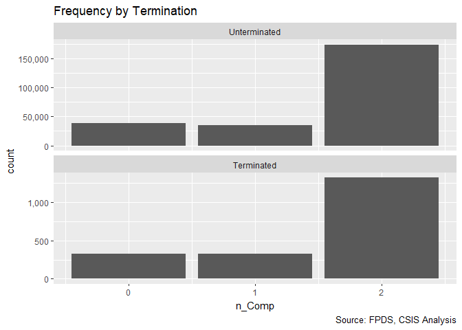<!-- -->

```r
#Percent Terminated Plot
discrete_percent_term_plot(Term_smp,"n_Comp")
```

```
## Warning: Removed 1 rows containing missing values (geom_point).
```

<!-- -->

```r
#Model
Term_01B <- glm (data=Term_smp,
                 b_Term ~ cn_Comp, family=binomial(link="logit"))
display(Term_01B)
```

```
## glm(formula = b_Term ~ cn_Comp, family = binomial(link = "logit"), 
##     data = Term_smp)
##             coef.est coef.se
## (Intercept) -4.83     0.02  
## cn_Comp     -0.06     0.02  
## ---
##   n = 248640, k = 2
##   residual deviance = 22959.8, null deviance = 22966.6 (difference = 6.9)
```

```r
#Plot the Fitted
#Add the fitted regression line
discrete_fitted_term_model(Term_smp,"n_Comp") +
  stat_function(fun = fit_curve, args=list(a=coef(Term_01B)[1],
                                           b=coef(Term_01B)[2]),
                color="blue")
```

```
## Warning: Removed 1360 rows containing missing values (geom_point).
```

<!-- -->


The correltion between the three categories of competition has a smaller coefficent, but is still signficant. In the next step, the multiple award competition is broken down in greater detail.

###Model 01C: No Competition / Number of Offer Categories 

```r
#Frequency Plot
freq_discrete_term_plot(Term_smp,"n_Offr")
```

```
## Warning: Ignoring unknown parameters: binwidth, bins, pad
```

```
## Warning: Removed 1360 rows containing non-finite values (stat_count).
```

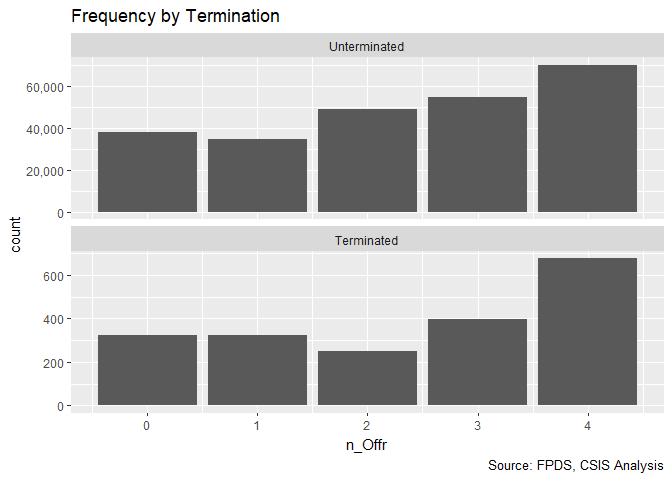<!-- -->

```r
#Percent Terminated Plot
discrete_percent_term_plot(Term_smp,"n_Offr")
```

```
## Warning: Removed 1 rows containing missing values (geom_point).
```

<!-- -->

```r
#Model
Term_01C <- glm (data=Term_smp,
                 b_Term ~ cn_Offr, family=binomial(link="logit"))
display(Term_01C)
```

```
## glm(formula = b_Term ~ cn_Offr, family = binomial(link = "logit"), 
##     data = Term_smp)
##             coef.est coef.se
## (Intercept) -4.83     0.02  
## cn_Offr      0.04     0.02  
## ---
##   n = 248640, k = 2
##   residual deviance = 22964.0, null deviance = 22966.6 (difference = 2.7)
```

```r
#Plot the Fitted
#Add the fitted regression line
discrete_fitted_term_model(Term_smp,"n_Comp") +
  stat_function(fun = fit_curve, args=list(a=coef(Term_01C)[1],
                                           b=coef(Term_01C)[2]),
                color="blue")
```

```
## Warning: Removed 1360 rows containing missing values (geom_point).
```

<!-- -->

As measured by residual deviance, this variable has slightly less predictive power than random noise. That can likely be attributed to the fact that 5+ offers category has a higher termination rate than 2 and 3-4. In theory, this could be because of non-liner relationship, for example higher number of offers competition may be more vulnerable to aggressive bidding beavior. However, this explaination would likely be better captured by other hidden variables such as competition methods rather than having a direct relationship with an increased number of offers. As a result, we are not testing offers as a categorical variable with dummies. 

Instead, the last variant to be checked is the number of offers directly. This is handled logarithmicly because the differences between number of offers at the bottom end of the scale mtters much more than at the high end of the scale. In this method, contracts that were not open to competition are grouped with contracts that received only a single offer.


###Model 01D: Number of Offer Categories 

```r
#Frequency Plot
freq_continuous_term_plot(Term_smp,"l_Offer")
```

```
## Warning: Removed 2038 rows containing non-finite values (stat_bin).
```

<!-- -->

```r
#Percent Terminated Plot 
binned_percent_term_plot(Term_smp,"l_Offer")
```

<!-- -->

```r
#Percent Terminated Plot
Term_smp$bin_Offer_FxCb<-bin_df(Term_smp,rank_col="l_Offer",group_col="FxCb")
ggplot(data=subset(Term_smp,!is.na(l_Offer) & !is.na(FxCb)) %>% 
  group_by(bin_Offer_FxCb,FxCb) %>% 
  summarise (mean_Term = mean(b_Term),
             mean_l_Offer =mean(l_Offer)),
       aes(y=mean_Term,x=mean_l_Offer))+geom_point()+facet_wrap(~FxCb)
```

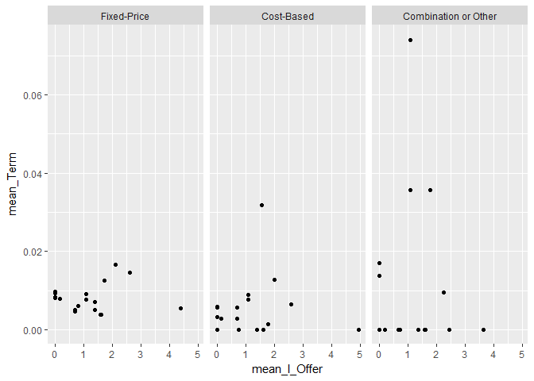<!-- -->

```r
#Percent Terminated Plot
Term_smp$bin_Offer_PSR<-bin_df(Term_smp,rank_col="l_Offer",group_col="PSR")
ggplot(data=subset(Term_smp,!is.na(l_Offer) & !is.na(PSR)) %>% 
  group_by(bin_Offer_PSR,PSR) %>% 
  summarise (mean_Term = mean(b_Term),
             mean_l_Offer =mean(l_Offer)),
       aes(y=mean_Term,x=mean_l_Offer))+geom_point()+facet_wrap(~PSR)
```

<!-- -->

```r
#Percent Terminated Plot
Term_smp$bin_Offer_Veh<-bin_df(Term_smp,rank_col="l_Offer",group_col="Veh")
ggplot(data=subset(Term_smp,!is.na(l_Offer) & !is.na(Veh) ) %>% 
  group_by(bin_Offer_Veh,Veh) %>% 
  summarise (mean_Term = mean(b_Term),
             mean_l_Offer =mean(l_Offer)),
       aes(y=mean_Term,x=mean_l_Offer))+geom_point()+facet_wrap(~Veh)
```

<!-- -->

```r
#Model
Term_01D <- glm (data=Term_smp,
                 b_Term ~ cl_Offer, family=binomial(link="logit"))
display(Term_01D)
```

```
## glm(formula = b_Term ~ cl_Offer, family = binomial(link = "logit"), 
##     data = Term_smp)
##             coef.est coef.se
## (Intercept) -4.83     0.02  
## cl_Offer     0.03     0.02  
## ---
##   n = 247962, k = 2
##   residual deviance = 22915.3, null deviance = 22917.2 (difference = 2.0)
```

```r
#Variant Model
Term_smp$clsqr_Offer<-Term_smp$cl_Offer^2
Term_01E <- glm (data=Term_smp,
                 b_Term ~ cl_Offer +clsqr_Offer, family=binomial(link="logit"))
display(Term_01E)
```

```
## glm(formula = b_Term ~ cl_Offer + clsqr_Offer, family = binomial(link = "logit"), 
##     data = Term_smp)
##             coef.est coef.se
## (Intercept) -4.79     0.03  
## cl_Offer     0.09     0.03  
## clsqr_Offer -0.04     0.01  
## ---
##   n = 247962, k = 3
##   residual deviance = 22905.9, null deviance = 22917.2 (difference = 11.3)
```

```r
#Plot the data and fitted curve
Term_01D_plot<-ggplot(data=Term_smp,
       aes(y=j_Term,x=cl_Offer))+geom_jitter(alpha=0.01,height=0)+scale_y_sqrt() +
  labs(title="Fitted Linear Model", caption="Source: FPDS, CSIS Analysis")

#Plot the Fitted
#Add the fitted regression line
discrete_fitted_term_model(Term_smp,"cl_Offer") +
  stat_function(fun = fit_curve, args=list(a=coef(Term_01D)[1],
                                           b=coef(Term_01D)[2]),
                             color="blue")
```

```
## Warning: Removed 2038 rows containing missing values (geom_point).
```

<!-- -->

```r
#Plot the fitted data versus actual outcomes
Term_01D_data<-data.frame(fitted=fitted(Term_01D),
                       residuals=residuals(Term_01D),
                       b_Term=Term_01D$model$b_Term,
                       cl_Offer=Term_01D$model$cl_Offer
                       )


#Plot the fitted values vs actual results
Term_01D_data$bin_fitted<-bin_df(Term_01D_data,rank_col="fitted")
ggplot(data=subset(Term_01D_data,!is.na(fitted) & !is.na(b_Term) ) %>% 
  group_by(bin_fitted) %>% 
  summarise (mean_Term = mean(b_Term),
             mean_fitted =mean(fitted)),
       aes(y=mean_Term,x=mean_fitted))+geom_point()+
  labs(title="Binned Fitted Linear Model",
          caption="Source: FPDS, CSIS Analysis")
```

<!-- -->

```r
#Plot the Residualts
Term_01D_res<-binned.resids (Term_01D_data$fitted,
                              Term_01D_data$fitted-Term_01D_data$b_Term, nclass=3)$binned

ggplot(data=Term_01D_res,
       aes(x=xbar,y-ybar))+
  geom_point(aes(y=ybar))+ #Residuals
  geom_line(aes(y=se2),col="grey")+
  geom_line(aes(y=-se2),col="grey")+
  labs(title="Binned residual plot",
       x="Estimated  Pr (Termination)",
       y="Average residual")
```

<!-- -->

Closer examination further undercuts the idea that more offers is associated with a lower termination risk. As measured by deviance, the number offers adds less to the model than random noise. A quick experiment also found that use of number of offer squared only made the model slightly better than noise.

A variety of binned percent terminated graphs found that in the middle range of the number of offers, there is often an increase in the percent terminated. The study team had expected that this phenomenon may prove isolated to a certain type of contracting mechanism or product/service, but that did not prove to be the case.

The difference between single-offer and effective competition is worth exploring, even if it lowers the significance of the starting model. Happily, this decision is supported by the fact that this three category variable offers the greatest reduction in residual deviance. However, lacking a specific theoretical argument for the importance of a greater number of offers, and given the results, the more detailed competition breakdowns will not be used. This may be an issue worth exploring more in a future work.

The greatest distinctiveness can be found in types of indefinite delivery vehicles. Definitive contracts and purchase orders show a higher termination rate as the number of offers increase. However, for single and multiple award IDVs, there's a decline in terminations rates correlated with low levels of competition, that often fades and even reverses as the number of offers increases. However, the results do not seem consistent with am exponential relationship.

##Scope Variables
###Model 02A: Cost Ceiling

The model starts by examing the influence of large ceilings on contracts, the core idea here, as observed in the fixed priced paper, is that larger contracts are at greater risk of termination. This can be explained by both the inherent risk in the contract and high transaction costs of contract termination which discourage making the effort for smaller contracts.


```r
#Frequency Plot for unlogged ceiling
freq_continuous_term_plot(Term_smp,"UnmodifiedContractBaseAndAllOptionsValue",
               bins=1000)
```

<!-- -->

```r
freq_continuous_term_plot(subset(Term_smp,UnmodifiedContractBaseAndAllOptionsValue<100000000),
               "UnmodifiedContractBaseAndAllOptionsValue",
               bins=1000)
```

<!-- -->

```r
#Frequency Plot for logged ceiling
freq_continuous_term_plot(Term_smp,"l_Ceil")
```

```
## Warning: Removed 380 rows containing non-finite values (stat_bin).
```

<!-- -->

```r
#Percent Terminated Plot
binned_percent_term_plot(Term_smp,"l_Ceil")
```

<!-- -->

```r
#Model
Term_02A <- glm (data=Term_smp,
                 b_Term ~n_Comp + cl_Ceil, family=binomial(link="logit"))
display(Term_02A)
```

```
## glm(formula = b_Term ~ n_Comp + cl_Ceil, family = binomial(link = "logit"), 
##     data = Term_smp)
##             coef.est coef.se
## (Intercept) -4.96     0.05  
## n_Comp       0.00     0.03  
## cl_Ceil      0.51     0.02  
## ---
##   n = 248266, k = 3
##   residual deviance = 22373.7, null deviance = 22873.7 (difference = 500.0)
```

```r
#Plot the fitted model plot
Term_02A_curve<-function(x, Comp){invlogit(cbind(1,Comp,x) %*%  coef(Term_02A))}

#Competition curves
fitted_term_model(Term_smp,"cl_Ceil") + stat_function(fun = Term_02A_curve, 
                             args=list(Comp=0),color="blue")+
  stat_function(fun = Term_02A_curve, 
                             args=list(Comp=2),color="blue")
```

```
## Warning: Removed 380 rows containing missing values (geom_point).
```

<!-- -->

```r
#Plot the fitted values vs actual results
binned_fitted_versus_residuals(Term_02A)
```

<!-- -->

```r
#Plot residuals versus fitted
residuals_term_plot(Term_02A)+
  labs(x="Estimated  Pr (Termination)")
```

<!-- -->

```r
residuals_term_plot(Term_02A,"cl_Ceil")+
  labs(x="Centered Log(Ceiling)")
```

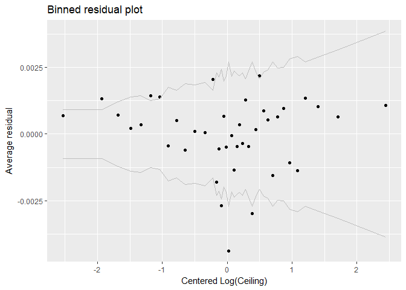<!-- -->

Contract ceiling has a significant relationship, though the residuals show a possible non-linear patterns. When the initial contract ceiling is particularly low or high, the fitted model underestimates the risk of terminations. This suggests that addding the log(Ceil)^2 might better capture the underlying data.


###Model 02B: Cost Ceiling Squared


```r
Term_smp$clsqr_Ceil<-Term_smp$cl_Ceil^2

#Frequency Plot
ggplot(data=Term_smp,
       aes(x=l_Ceil^2))+geom_histogram(bins=20) + scale_y_continuous(labels = scales::comma) + facet_wrap(~Term,ncol=1,scales="free_y")+
  labs(title="Frequency by Termination",
          caption="Source: FPDS, CSIS Analysis")
```

```
## Warning: Removed 380 rows containing non-finite values (stat_bin).
```

<!-- -->

```r
#Percent Terminated Plot
Term_smp$bin_Offer<-bin_df(Term_smp,"cl_Ceil")
ggplot(data=subset(Term_smp,!is.na(l_Ceil)) %>% 
  group_by(bin_Offer) %>% 
  summarise (mean_Term = mean(b_Term),
             mean_lsqr_Ceil =mean(l_Ceil^2)),
       aes(y=mean_Term,x=mean_lsqr_Ceil))+geom_point()+
  labs(title="Average Termination Rate",
          caption="Source: FPDS, CSIS Analysis")
```

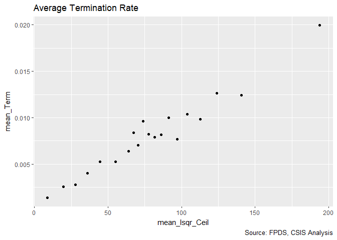<!-- -->

```r
Term_02B <- glm (data=Term_smp,
                 b_Term ~n_Comp + cl_Ceil + clsqr_Ceil, family=binomial(link="logit"))
display(Term_02B)
```

```
## glm(formula = b_Term ~ n_Comp + cl_Ceil + clsqr_Ceil, family = binomial(link = "logit"), 
##     data = Term_smp)
##             coef.est coef.se
## (Intercept) -4.95     0.05  
## n_Comp       0.01     0.03  
## cl_Ceil      0.56     0.03  
## clsqr_Ceil  -0.04     0.01  
## ---
##   n = 248266, k = 4
##   residual deviance = 22363.9, null deviance = 22873.7 (difference = 509.8)
```

```r
Term_02B_plot<-ggplot(data=Term_smp,
       aes(y=j_Term,x=cl_Ceil))+geom_point(alpha=0.01)+scale_y_sqrt() +
  labs(title="Fitted Linear Model", caption="Source: FPDS, CSIS Analysis")

Term_02B_curve<-function(x, Comp){invlogit(cbind(1,Comp,x, x^2) %*%  coef(Term_02B))}

#Competition curves
fitted_term_model(Term_smp,"cl_Ceil") + stat_function(fun = Term_02B_curve, 
                             args=list(Comp=0),color="blue")+
  stat_function(fun = Term_02B_curve, 
                             args=list(Comp=2),color="blue")
```

```
## Warning: Removed 380 rows containing missing values (geom_point).
```

<!-- -->

```r
#Plot the fitted values vs actual results
binned_fitted_versus_residuals(Term_02B)
```

<!-- -->

```r
#Plot residuals versus fitted
residuals_term_plot(Term_02B)+
  labs(x="Estimated  Pr (Termination)")
```

<!-- -->

```r
residuals_term_plot(Term_02B,"cl_Ceil")+
  labs(x="Centered Log(Ceiling)")
```

<!-- -->

Contracts with very small or very large ceilings appear have a negative coefficient for calculating termination. On the upper end, this might represent contracts that are "too large to fail"" or simply that above a certain size, risk stops rising. Adding the log(Ceiling) squared greatly reduces the apparent pattern in the residuals, although more than 5 percent of the binned residuals still fall outside the 95% confidence interval.

###Model 02C: Cost Ceiling and Competition


```r
#Frequency Plot
ggplot(data=subset(Term_smp,!is.na(n_Comp)),
       aes(x=l_Ceil))+geom_histogram(bins=20) + scale_y_continuous(labels = scales::comma) + facet_grid(Term~n_Comp,scales="free_y")+
  labs(title="Initial Cost Ceiling Frequency by Competition Termination",
          caption="Source: FPDS, CSIS Analysis")
```

```
## Warning: Removed 374 rows containing non-finite values (stat_bin).
```

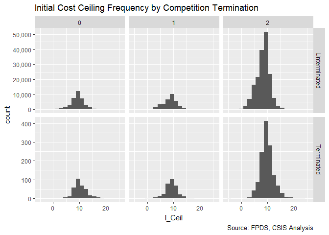<!-- -->

```r
#Plot the percent terminated across cost ceiling and competition
Term_smp$bin_Ceil_Comp<-bin_df(Term_smp,"l_Ceil")
ggplot(data=subset(Term_smp,!is.na(n_Comp)&!is.na(bin_Ceil_Comp)) %>% 
  group_by(bin_Ceil_Comp,n_Comp) %>% 
  summarise (mean_Term = mean(b_Term),
             mean_l_Ceil =mean(l_Ceil)),
       aes(y=mean_Term,x=mean_l_Ceil))+geom_point()+facet_wrap(~n_Comp)+
  labs(title="Average Termination Rate",
          caption="Source: FPDS, CSIS Analysis")
```

```
## Warning: Removed 3 rows containing missing values (geom_point).
```

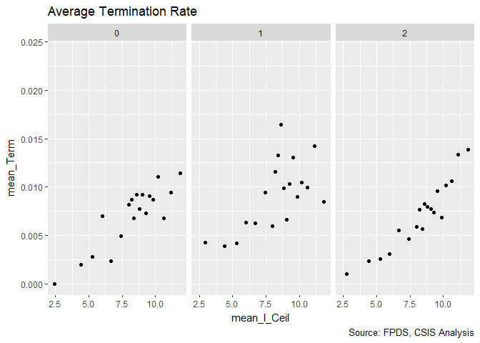<!-- -->

```r
#Create the model
Term_02C <- glm (data=Term_smp,
                 b_Term ~n_Comp + cl_Ceil + clsqr_Ceil + n_Comp:cl_Ceil, family=binomial(link="logit"))
display(Term_02C)
```

```
## glm(formula = b_Term ~ n_Comp + cl_Ceil + clsqr_Ceil + n_Comp:cl_Ceil, 
##     family = binomial(link = "logit"), data = Term_smp)
##                coef.est coef.se
## (Intercept)    -4.83     0.06  
## n_Comp         -0.07     0.03  
## cl_Ceil         0.37     0.06  
## clsqr_Ceil     -0.04     0.01  
## n_Comp:cl_Ceil  0.12     0.03  
## ---
##   n = 248266, k = 5
##   residual deviance = 22348.5, null deviance = 22873.7 (difference = 525.2)
```

```r
Term_02C_curve<-function(x, Comp){invlogit(cbind(1,Comp,x,x^2,Comp*x) %*%  coef(Term_02C))}

#Competition Curves
fitted_term_model(Term_smp,"cl_Ceil") + stat_function(fun = Term_02C_curve, 
                             args=list(Comp=0),color="blue")+
  stat_function(fun = Term_02C_curve, 
                             args=list(Comp=2),color="blue")
```

```
## Warning: Removed 380 rows containing missing values (geom_point).
```

<!-- -->

```r
#Plot the fitted values vs actual results
binned_fitted_versus_residuals(Term_02C)
```

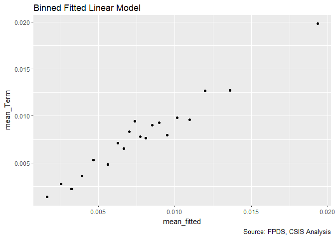<!-- -->

```r
#Plot residuals versus fitted
residuals_term_plot(Term_02C)+
  labs(x="Estimated  Pr (Termination)")
```

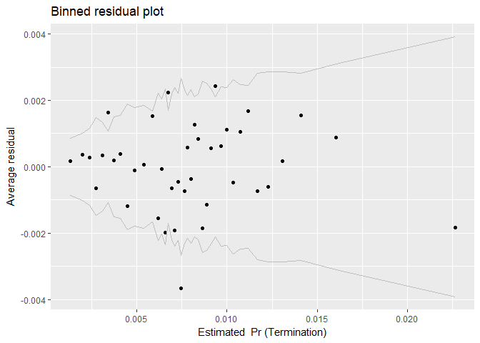<!-- -->

```r
residuals_term_plot(Term_02C,"cl_Ceil")+
  labs(x="Centered Log(Ceiling)")
```

<!-- -->
The interaction went in the expected direction, but is surprisingly powerful. Competition heightens the importance of contract ceiling, and larger contract ceilings mitigate the importance of competition. The other powerful part of this interaction was the dramatic increase in the coefficient for competition and the comparative reduction in the correlation of ceiling.

###Model 02D: Maximum Duration


```r
#Frequency Plot for max duration
freq_continuous_term_plot(Term_smp,"UnmodifiedDays",
               bins=1000)
```

```
## Warning: Removed 12 rows containing non-finite values (stat_bin).
```

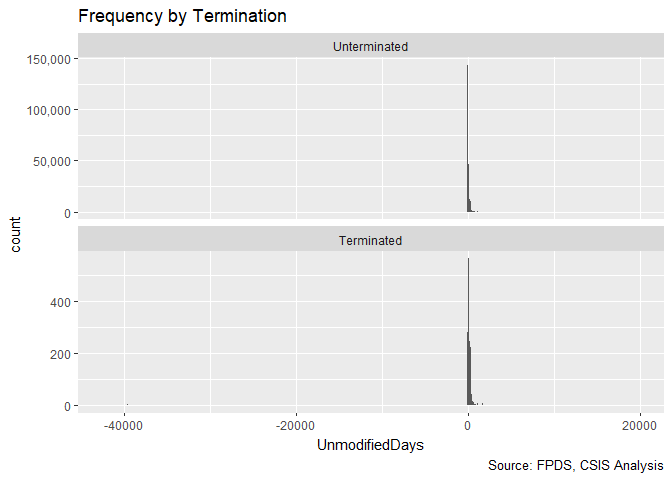<!-- -->

```r
#Frequency Plot for logged max duration
freq_continuous_term_plot(Term_smp,"l_Days")
```

```
## Warning: Removed 1622 rows containing non-finite values (stat_bin).
```

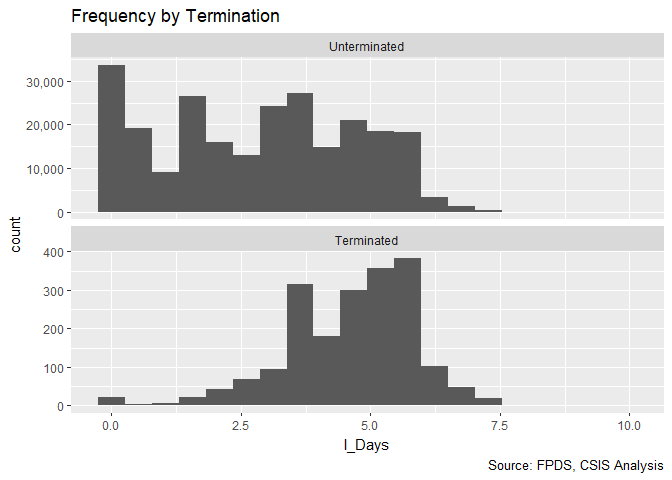<!-- -->

```r
#Percent Terminated Plot
binned_percent_term_plot(Term_smp,"l_Days")
```

<!-- -->

```r
#Model
Term_02D <- glm (data=Term_smp,
                 b_Term ~n_Comp + 
                   cl_Ceil + clsqr_Ceil + cl_Days + clsqr_Ceil +
                   n_Comp:cl_Ceil , family=binomial(link="logit"))
display(Term_02D)
```

```
## glm(formula = b_Term ~ n_Comp + cl_Ceil + clsqr_Ceil + cl_Days + 
##     clsqr_Ceil + n_Comp:cl_Ceil, family = binomial(link = "logit"), 
##     data = Term_smp)
##                coef.est coef.se
## (Intercept)    -5.63     0.07  
## n_Comp          0.16     0.04  
## cl_Ceil        -0.05     0.06  
## clsqr_Ceil     -0.03     0.01  
## cl_Days         1.10     0.03  
## n_Comp:cl_Ceil  0.09     0.03  
## ---
##   n = 246862, k = 6
##   residual deviance = 20689.8, null deviance = 22600.0 (difference = 1910.2)
```

```r
Term_02D_curve<-function(x, Comp,Ceil){invlogit(cbind(1,Comp,Ceil,Ceil^2,x,Comp*Ceil) %*%  coef(Term_02D))}

#Competition Curves
fitted_term_model(Term_smp,"cl_Days") + stat_function(fun = Term_02D_curve, 
                             args=list(Comp=0,Ceil=0),color="blue")+
  stat_function(fun = Term_02D_curve, 
                             args=list(Comp=2,Ceil=0),color="blue")
```

```
## Warning: Removed 1622 rows containing missing values (geom_point).
```

<!-- -->

```r
#Ceiling Curves
fitted_term_model(Term_smp,"cl_Days") +  stat_function(fun = Term_02D_curve, 
                             args=list(Comp=0,Ceil=0),color="blue")+
  stat_function(fun = Term_02D_curve, 
                             args=list(Comp=0,Ceil=1),color="blue")
```

```
## Warning: Removed 1622 rows containing missing values (geom_point).
```

<!-- -->

```r
#Plot the fitted values vs actual results
binned_fitted_versus_residuals(Term_02D)
```

<!-- -->

```r
#Plot residuals versus fitted
residuals_term_plot(Term_02D)+
  labs(x="Estimated  Pr (Termination)")
```

<!-- -->

```r
# debug(binned.resids)
# residuals_term_plot(Term_02D,"cl_Days")+
  # labs(x="Centered Log(Ceiling)")
```
The initial model results are surprising as ceiling change direction, reducing and correlates with a lower risk of termiation now, although the interaction between competition and ceiling remains roughly the same. The graph of the fitted values shows that this model The next step will be to look at the interaction of ceiling and duration. The difference in deviance for residual difference has more than trippled, an indication of the correlative power of duration. However, the residuals do show a clear pattern that indicates another exponential variable may be necessary. However, the interaction between ceiling and duration is a more important analytical question and will be the next variable added.

###Model 02E: Interation of Ceiling and Duration

```r
#First a quick scatter plot for terminations by duration and ceiling
ggplot(data=subset(Term_smp,!is.na(l_Ceil)),
       aes(x=l_Days,y=l_Ceil))+geom_point(alpha=0.1)+facet_grid(Term~.)+
  labs(title="Frequency by Termination",
          caption="Source: FPDS, CSIS Analysis")
```

```
## Warning: Removed 1404 rows containing missing values (geom_point).
```

<!-- -->

```r
#Create the model
Term_02E <- glm (data=Term_smp,
                 b_Term ~n_Comp + 
                   cl_Ceil + clsqr_Ceil + cl_Days+
                   n_Comp:cl_Ceil  + cl_Ceil:cl_Days, family=binomial(link="logit"))
display(Term_02E)
```

```
## glm(formula = b_Term ~ n_Comp + cl_Ceil + clsqr_Ceil + cl_Days + 
##     n_Comp:cl_Ceil + cl_Ceil:cl_Days, family = binomial(link = "logit"), 
##     data = Term_smp)
##                 coef.est coef.se
## (Intercept)     -5.73     0.07  
## n_Comp           0.19     0.04  
## cl_Ceil          0.23     0.07  
## clsqr_Ceil       0.06     0.01  
## cl_Days          1.22     0.04  
## n_Comp:cl_Ceil   0.05     0.03  
## cl_Ceil:cl_Days -0.33     0.03  
## ---
##   n = 246862, k = 7
##   residual deviance = 20607.5, null deviance = 22600.0 (difference = 1992.5)
```

```r
Term_02E_curve<-function(x, Comp,Ceil){invlogit(
  cbind(1,Comp,Ceil,Ceil^2,x,
        Comp*Ceil,x*Ceil) %*%  coef(Term_02E))}


#Competition Curves
fitted_term_model(Term_smp,"cl_Days") + stat_function(fun = Term_02E_curve, 
                             args=list(Comp=0,Ceil=0),color="blue")+
  stat_function(fun = Term_02E_curve, 
                             args=list(Comp=2,Ceil=0),color="blue")
```

```
## Warning: Removed 1622 rows containing missing values (geom_point).
```

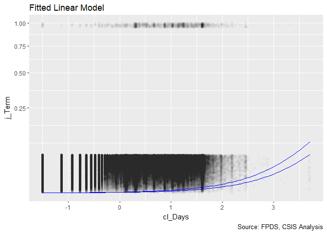<!-- -->

```r
#Ceiling Curves
fitted_term_model(Term_smp,"cl_Days") +  stat_function(fun = Term_02E_curve, 
                             args=list(Comp=0,Ceil=0),color="blue")+
  stat_function(fun = Term_02E_curve, 
                             args=list(Comp=0,Ceil=1),color="blue")
```

```
## Warning: Removed 1622 rows containing missing values (geom_point).
```

<!-- -->

```r
#Plot the fitted values vs actual results
binned_fitted_versus_residuals(Term_02E)
```

<!-- -->

```r
#Plot residuals versus fitted
residuals_term_plot(Term_02E)+
  labs(x="Estimated  Pr (Termination)")
```

<!-- -->

```r
# debug(binned.resids)
# residuals_term_plot(Term_02E,"cl_Days")+
  # labs(x="Centered Log(Ceiling)")
```


The interaction of ceiling and duration is correlated with a lower rate of termination, which is to say that when either factor is high, the other has less effect. Thus long contracts with fewer dollars or high ceiling contract with shorter durations are at higher risk than more balanced contracts. This interaction also restores the positive coefficient for ceiling and switches ceiling squared to positive. The residuals still show a pattern tht could be explained by an exponential. Examining that possibility will be the next step.

###Model 02F: Duration Squared


```r
Term_smp$clsqr_Days<-Term_smp$cl_Days^2

#Frequency Plot
ggplot(data=Term_smp,
       aes(x=l_Days^2))+geom_histogram(bins=20) + scale_y_continuous(labels = scales::comma) + facet_wrap(~Term,ncol=1,scales="free_y")+
  labs(title="Frequency by Termination",
          caption="Source: FPDS, CSIS Analysis")
```

```
## Warning: Removed 1622 rows containing non-finite values (stat_bin).
```

<!-- -->

```r
#Percent Terminated Plot
Term_smp$bin_Offer<-bin_df(Term_smp,"cl_Days")
ggplot(data=subset(Term_smp,!is.na(l_Days)) %>% 
  group_by(bin_Offer) %>% 
  summarise (mean_Term = mean(b_Term),
             mean_lsqr_Ceil =mean(l_Days^2)),
       aes(y=mean_Term,x=mean_lsqr_Ceil))+geom_point()+
  labs(title="Average Termination Rate",
          caption="Source: FPDS, CSIS Analysis")
```

<!-- -->

```r
#Create the model
Term_02F <- glm (data=Term_smp,
                 b_Term ~n_Comp + 
                   cl_Ceil + clsqr_Ceil + cl_Days+ clsqr_Days +
                   n_Comp:cl_Ceil  + cl_Ceil:cl_Days, family=binomial(link="logit"))
display(Term_02F)
```

```
## glm(formula = b_Term ~ n_Comp + cl_Ceil + clsqr_Ceil + cl_Days + 
##     clsqr_Days + n_Comp:cl_Ceil + cl_Ceil:cl_Days, family = binomial(link = "logit"), 
##     data = Term_smp)
##                 coef.est coef.se
## (Intercept)     -5.66     0.07  
## n_Comp           0.18     0.04  
## cl_Ceil          0.20     0.07  
## clsqr_Ceil       0.05     0.01  
## cl_Days          1.44     0.06  
## clsqr_Days      -0.21     0.03  
## n_Comp:cl_Ceil   0.05     0.03  
## cl_Ceil:cl_Days -0.28     0.04  
## ---
##   n = 246862, k = 8
##   residual deviance = 20564.7, null deviance = 22600.0 (difference = 2035.3)
```

```r
Term_02F_curve<-function(x, Comp,Ceil){invlogit(
  cbind(1,Comp,Ceil,Ceil^2,x,x^2,
        Comp*Ceil,x*Ceil) %*%  coef(Term_02F))}

#Competition curves
fitted_term_model(Term_smp,"cl_Ceil") + stat_function(fun = Term_02F_curve, 
                             args=list(Comp=0),color="blue")+
  stat_function(fun = Term_02F_curve, 
                             args=list(Comp=2),color="blue")
```

```
## Warning: Computation failed in `stat_function()`:
## argument "Ceil" is missing, with no default
```

```
## Warning: Computation failed in `stat_function()`:
## argument "Ceil" is missing, with no default
```

```
## Warning: Removed 380 rows containing missing values (geom_point).
```

<!-- -->

```r
#Plot the fitted values vs actual results
binned_fitted_versus_residuals(Term_02F)
```

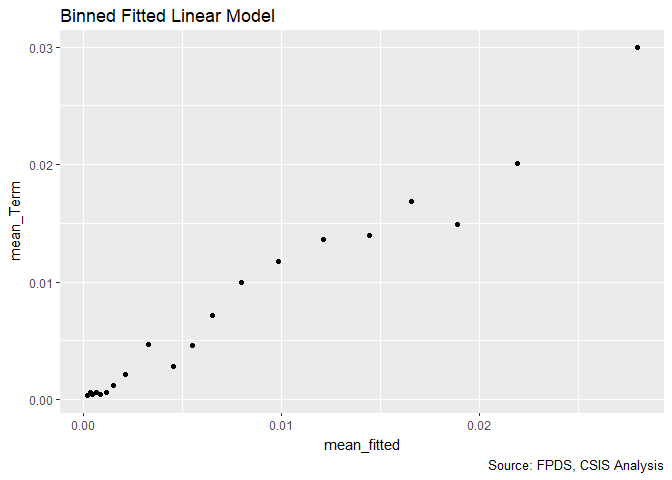<!-- -->

```r
#Plot residuals versus fitted
residuals_term_plot(Term_02F)+
  labs(x="Estimated  Pr (Termination)")
```

<!-- -->

```r
# residuals_term_plot(Term_02F,"cl_days")+
#   labs(x="Centered Log(Days)")


residuals_term_plot(Term_02F,"cl_Ceil")+
  labs(x="Centered Log(Ceiling)")
```

<!-- -->
Adding log(initial duration)^2 does seem to address the troubling pattern present in the residuals, namely the parabolic curve and the large number of data bins falling outside of the 95% confidence interval. Both of the ceiling coefficients remain positive but they are no longer coefficient. The next step is to see whether log(initial cost ceiling)^2 is still useful in this model now that the square of duration is included.

###Model 02G: Testing the removal of Ceiling^2 


```r
#Create the model
Term_02G <- glm (data=Term_smp,
                 b_Term ~n_Comp + 
                   cl_Ceil + cl_Days+ clsqr_Days +
                   n_Comp:cl_Ceil  + cl_Ceil:cl_Days, family=binomial(link="logit"))
display(Term_02G)
```

```
## glm(formula = b_Term ~ n_Comp + cl_Ceil + cl_Days + clsqr_Days + 
##     n_Comp:cl_Ceil + cl_Ceil:cl_Days, family = binomial(link = "logit"), 
##     data = Term_smp)
##                 coef.est coef.se
## (Intercept)     -5.61     0.07  
## n_Comp           0.17     0.04  
## cl_Ceil          0.17     0.07  
## cl_Days          1.42     0.06  
## clsqr_Days      -0.21     0.03  
## n_Comp:cl_Ceil   0.06     0.04  
## cl_Ceil:cl_Days -0.20     0.04  
## ---
##   n = 246862, k = 7
##   residual deviance = 20576.6, null deviance = 22600.0 (difference = 2023.4)
```

```r
Term_02G_curve<-function(x, Comp,Ceil){invlogit(
  cbind(1,Comp,Ceil,x,x^2,
        Comp*Ceil,x*Ceil) %*%  coef(Term_02E))}

#Competition curves
fitted_term_model(Term_smp,"cl_Ceil") + stat_function(fun = Term_02G_curve, 
                             args=list(Comp=0),color="blue")+
  stat_function(fun = Term_02G_curve, 
                             args=list(Comp=2),color="blue")
```

```
## Warning: Computation failed in `stat_function()`:
## argument "Ceil" is missing, with no default

## Warning: Computation failed in `stat_function()`:
## argument "Ceil" is missing, with no default
```

```
## Warning: Removed 380 rows containing missing values (geom_point).
```

<!-- -->

```r
#Plot the fitted values vs actual results
binned_fitted_versus_residuals(Term_02G)
```

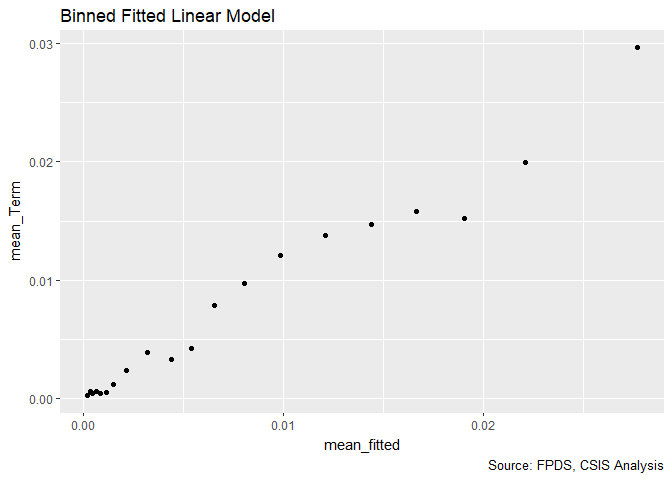<!-- -->

```r
#Plot residuals versus fitted
residuals_term_plot(Term_02G)+
  labs(x="Estimated  Pr (Termination)")
```

<!-- -->

```r
residuals_term_plot(Term_02G,"cl_Ceil")+
  labs(x="Centered Log(Ceiling)")
```

<!-- -->

While the effect on the residual deviance is fairly minor, it does still appear that the ceiling^2 does reduce the incidence of non-linear patterns in the residuals. So for now we will be leaving it in.

###Model 02H: Interation of Duration and Competition

```r
#Frequency Plot
ggplot(data=subset(Term_smp,!is.na(n_Comp)),
       aes(x=l_Days))+geom_histogram(bins=20)+facet_grid(Term~n_Comp,scales="free_y")+
  labs(title="Frequency by Termination",
          caption="Source: FPDS, CSIS Analysis")
```

```
## Warning: Removed 1622 rows containing non-finite values (stat_bin).
```

<!-- -->

```r
#Plot the percent terminated across duration and competition
Term_smp$bin_Days_Comp<-bin_df(Term_smp,"l_Days")
ggplot(data=subset(Term_smp,!is.na(n_Comp)&!is.na(bin_Days_Comp)) %>% 
  group_by(bin_Days_Comp,n_Comp) %>% 
  summarise (mean_Term = mean(b_Term),
             mean_l_Days =mean(l_Days)),
       aes(y=mean_Term,x=mean_l_Days))+geom_point()+facet_wrap(~n_Comp)+facet_wrap(~n_Comp)+
  labs(title="Average Termination Rate",
          caption="Source: FPDS, CSIS Analysis")
```

```
## Warning: Removed 3 rows containing missing values (geom_point).
```

<!-- -->

```r
#Create the model
Term_02H <- glm (data=Term_smp,
                 b_Term ~n_Comp + 
                   cl_Ceil + clsqr_Ceil + cl_Days+ clsqr_Days +
                   n_Comp:cl_Ceil  + cl_Ceil:cl_Days  + n_Comp:cl_Days, family=binomial(link="logit"))
display(Term_02H)
```

```
## glm(formula = b_Term ~ n_Comp + cl_Ceil + clsqr_Ceil + cl_Days + 
##     clsqr_Days + n_Comp:cl_Ceil + cl_Ceil:cl_Days + n_Comp:cl_Days, 
##     family = binomial(link = "logit"), data = Term_smp)
##                 coef.est coef.se
## (Intercept)     -5.28     0.09  
## n_Comp          -0.07     0.05  
## cl_Ceil          0.31     0.07  
## clsqr_Ceil       0.06     0.01  
## cl_Days          0.98     0.09  
## clsqr_Days      -0.18     0.03  
## n_Comp:cl_Ceil  -0.02     0.04  
## cl_Ceil:cl_Days -0.29     0.04  
## n_Comp:cl_Days   0.28     0.05  
## ---
##   n = 246862, k = 9
##   residual deviance = 20529.9, null deviance = 22600.0 (difference = 2070.1)
```

```r
Term_02H_curve<-function(x, Comp,Ceil){invlogit(
  cbind(1,Comp,Ceil,Ceil^2,x,x^2,
        Comp*Ceil,x*Ceil,x*Comp) %*%  coef(Term_02H))}

#Competition curves
fitted_term_model(Term_smp,"cl_Days") + stat_function(fun = Term_02H_curve, 
                             args=list(Comp=0,Ceil=0),color="blue")+
  stat_function(fun = Term_02H_curve, 
                             args=list(Comp=2,Ceil=0),color="blue")
```

```
## Warning: Removed 1622 rows containing missing values (geom_point).
```

<!-- -->

```r
#Plot the fitted values vs actual results
binned_fitted_versus_residuals(Term_02G)
```

<!-- -->

```r
#Plot residuals versus fitted
residuals_term_plot(Term_02G)+
  labs(x="Estimated  Pr (Termination)")
```

<!-- -->

```r
# residuals_term_plot(Term_02F,"cl_days")+
#   labs(x="Centered Log(Days)")
```
The interaction of competition and duration is significant in itself and also has interesting consequences for other variables, notably boosting the cooeficient for ceiling and reducing the coefficient for duration. Competed contracts have a greater coefficient for termination. For short duration contracts, competition has a negative and significant coefficient but for long duration the relationship reverses itself. This would be consistent with the benefits of competition fading as the competition slipped further into the past. Unfortunately the residuals still show questionable patterns that merit continued observation.

##Contract Vehicle
Our dataset includes both stand alone contract awards and task orders that are under larger indefinite delivery vehilces (IDVs). 

###Model 03A: Single-Award, Multi-Award, and Other Indefinite Delivery Vehicles


```r
#Frequency Plot
freq_discrete_term_plot(Term_smp,"Veh")
```

```
## Warning: Ignoring unknown parameters: binwidth, bins, pad
```

<!-- -->

```r
#Percent Terminated Plot 
discrete_percent_term_plot(Term_smp,"Veh")
```

<!-- -->

```r
#Create the model
Term_03A <- glm (data=Term_smp,
                 b_Term ~n_Comp + 
                   cl_Ceil + clsqr_Ceil + cl_Days+ clsqr_Days +
                   SIDV + MIDV + OIDV +
                   n_Comp:cl_Ceil  + cl_Ceil:cl_Days  + n_Comp:cl_Days, family=binomial(link="logit"))
display(Term_03A)
```

```
## glm(formula = b_Term ~ n_Comp + cl_Ceil + clsqr_Ceil + cl_Days + 
##     clsqr_Days + SIDV + MIDV + OIDV + n_Comp:cl_Ceil + cl_Ceil:cl_Days + 
##     n_Comp:cl_Days, family = binomial(link = "logit"), data = Term_smp)
##                 coef.est coef.se
## (Intercept)     -4.91     0.10  
## n_Comp          -0.09     0.06  
## cl_Ceil          0.20     0.08  
## clsqr_Ceil       0.04     0.02  
## cl_Days          0.72     0.09  
## clsqr_Days      -0.09     0.04  
## SIDV            -0.71     0.06  
## MIDV            -0.40     0.11  
## OIDV            -0.23     0.09  
## n_Comp:cl_Ceil   0.05     0.04  
## cl_Ceil:cl_Days -0.15     0.05  
## n_Comp:cl_Days   0.23     0.05  
## ---
##   n = 184500, k = 12
##   residual deviance = 15901.2, null deviance = 17366.7 (difference = 1465.5)
```

```r
#Plot the model and Vehicle for SIDV
Term_03A_SIDV_curve<-function(x, Comp,Ceil,Days,MIDV,OIDV){invlogit(
  cbind(1,Comp,Ceil,Ceil^2,Days,Days^2,x,MIDV,OIDV,
        Comp*Ceil,Days*Ceil,Days*Comp) %*%  coef(Term_03A))}

#Competition curves
discrete_fitted_term_model(Term_smp,"SIDV") +
  stat_function(fun = Term_03A_SIDV_curve, 
                             args=list(Comp=0,Ceil=0,Days=0,
                                       MIDV=0,OIDV=0),color="blue")+
  stat_function(fun = Term_03A_SIDV_curve, 
                             args=list(Comp=2,Ceil=0,Days=0,
                                       MIDV=0,OIDV=0),color="blue")
```

```
## Warning: Removed 62385 rows containing missing values (geom_point).
```

<!-- -->

```r
Term_03A_MIDV_curve<-function(x, Comp,Ceil,Days,SIDV,OIDV){invlogit(
  cbind(1,Comp,Ceil,Ceil^2,Days,Days^2,SIDV,x,OIDV,
        Comp*Ceil,Days*Ceil,Days*Comp) %*%  coef(Term_03A))}

#Plot the model and Vehicle for MIDV
#Competition curves
discrete_fitted_term_model(Term_smp,"MIDV") +
  stat_function(fun = Term_03A_MIDV_curve, 
                             args=list(Comp=0,Ceil=0,Days=0,
                                       SIDV=0,OIDV=0),color="blue")+
  stat_function(fun = Term_03A_MIDV_curve, 
                             args=list(Comp=2,Ceil=0,Days=0,
                                       SIDV=0,OIDV=0),color="blue")
```

```
## Warning: Removed 62385 rows containing missing values (geom_point).
```

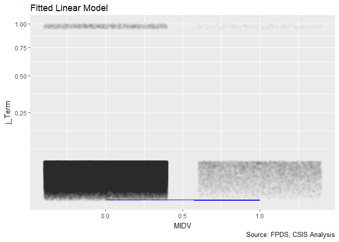<!-- -->

```r
Term_03A_OIDV_curve<-function(x, Comp,Ceil,Days,SIDV,MIDV){invlogit(
  cbind(1,Comp,Ceil,Ceil^2,Days,Days^2,SIDV,MIDV,x,
        Comp*Ceil,Days*Ceil,Days*Comp) %*%  coef(Term_03A))}

#Plot the model and Vehicle for OIDV
#Competition curves
discrete_fitted_term_model(Term_smp,"OIDV") +
  stat_function(fun = Term_03A_OIDV_curve, 
                             args=list(Comp=0,Ceil=0,Days=0,
                                       SIDV=0,MIDV=0),color="blue")+
  stat_function(fun = Term_03A_OIDV_curve, 
                             args=list(Comp=2,Ceil=0,Days=0,
                                       SIDV=0,MIDV=0),color="blue")
```

```
## Warning: Removed 62385 rows containing missing values (geom_point).
```

<!-- -->

```r
#Plot the fitted values vs actual results
binned_fitted_versus_residuals(Term_03A)
```

<!-- -->

```r
#Plot residuals versus fitted
residuals_term_plot(Term_03A)+
  labs(x="Estimated  Pr (Termination)")
```

<!-- -->

```r
# residuals_term_plot(Term_02F,"cl_days")+
#   labs(x="Centered Log(Days)")
```

The first check lumps looks at three categories of IDVs, each facing a notably lower a risk of termination. The largest negative coefficient is for single award IDCs, multiple award IDVs second, and other IDVs third. The deviation residual notably creeps up after this addition, though this is likely attributable to a missing data problem rather than the new information not being useful. Unfortunately, while the for both ceiling^2 and duration^2 were notably reduced in magnitude, the residuals show significant patterns, underestimating the risk of termination in the fitted range from around 0.005 to 0.01 and overestimating by 0.02. There's no exponential term that makes sense to add here, which leaves the hope that interactions may address this phenomenon.

This may reflect that the Ceiling and Days entries reflect only the task order and not the larger contract. The next step is to check the intersections with ceiling.


###Model 03B: Any IDV and contract duration

```r
#Frequency Plot
freq_discrete_term_plot(Term_smp,"Veh")
```

```
## Warning: Ignoring unknown parameters: binwidth, bins, pad
```

<!-- -->

```r
#Percent Terminated Plot 
discrete_percent_term_plot(Term_smp,"Veh")
```

<!-- -->

```r
#Create the model
Term_03B <- glm (data=Term_smp,
                 b_Term ~n_Comp + 
                   cl_Ceil + clsqr_Ceil + cl_Days+ clsqr_Days +
                   SIDV + MIDV + OIDV +
                   n_Comp:cl_Ceil  + cl_Ceil:cl_Days  + n_Comp:cl_Days +
                 SIDV:cl_Days+MIDV:cl_Days+OIDV:cl_Days, family=binomial(link="logit"))
display(Term_03B)
```

```
## glm(formula = b_Term ~ n_Comp + cl_Ceil + clsqr_Ceil + cl_Days + 
##     clsqr_Days + SIDV + MIDV + OIDV + n_Comp:cl_Ceil + cl_Ceil:cl_Days + 
##     n_Comp:cl_Days + SIDV:cl_Days + MIDV:cl_Days + OIDV:cl_Days, 
##     family = binomial(link = "logit"), data = Term_smp)
##                 coef.est coef.se
## (Intercept)     -4.81     0.10  
## n_Comp           0.01     0.06  
## cl_Ceil          0.16     0.08  
## clsqr_Ceil       0.05     0.02  
## cl_Days          0.57     0.10  
## clsqr_Days      -0.06     0.03  
## SIDV            -1.23     0.11  
## MIDV            -0.98     0.25  
## OIDV            -0.08     0.14  
## n_Comp:cl_Ceil   0.05     0.04  
## cl_Ceil:cl_Days -0.14     0.05  
## n_Comp:cl_Days   0.14     0.05  
## cl_Days:SIDV     0.53     0.09  
## cl_Days:MIDV     0.52     0.18  
## cl_Days:OIDV    -0.22     0.13  
## ---
##   n = 184500, k = 15
##   residual deviance = 15844.8, null deviance = 17366.7 (difference = 1521.8)
```

```r
#Plot the model and Vehicle for SIDV
# Term_03B_SIDV_curve<-function(x, Comp,Ceil,Days,MIDV,OIDV){invlogit(
#   cbind(1,Comp,Ceil,Ceil^2,Days,Days^2,x,MIDV,OIDV,
#         Comp*Ceil,Days*Ceil,Days*Comp) %*%  coef(Term_03B))}
# 
# #Competition curves
# discrete_fitted_term_model(Term_smp,"SIDV") +
#   stat_function(fun = Term_03B_SIDV_curve, 
#                              args=list(Comp=0,Ceil=0,Days=0,
#                                        MIDV=0,OIDV=0),color="blue")+
#   stat_function(fun = Term_03B_SIDV_curve, 
#                              args=list(Comp=2,Ceil=0,Days=0,
#                                        MIDV=0,OIDV=0),color="blue")
# 
# Term_03B_MIDV_curve<-function(x, Comp,Ceil,Days,SIDV,OIDV){invlogit(
#   cbind(1,Comp,Ceil,Ceil^2,Days,Days^2,SIDV,x,OIDV,
#         Comp*Ceil,Days*Ceil,Days*Comp) %*%  coef(Term_03B))}
# 
# #Plot the model and Vehicle for MIDV
# #Competition curves
# discrete_fitted_term_model(Term_smp,"MIDV") +
#   stat_function(fun = Term_03B_MIDV_curve, 
#                              args=list(Comp=0,Ceil=0,Days=0,
#                                        SIDV=0,OIDV=0),color="blue")+
#   stat_function(fun = Term_03B_MIDV_curve, 
#                              args=list(Comp=2,Ceil=0,Days=0,
#                                        SIDV=0,OIDV=0),color="blue")
# 
# Term_03B_OIDV_curve<-function(x, Comp,Ceil,Days,SIDV,MIDV){invlogit(
#   cbind(1,Comp,Ceil,Ceil^2,Days,Days^2,SIDV,MIDV,x,
#         Comp*Ceil,Days*Ceil,Days*Comp) %*%  coef(Term_03B))}
# 
# #Plot the model and Vehicle for OIDV
# #Competition curves
# discrete_fitted_term_model(Term_smp,"OIDV") +
#   stat_function(fun = Term_03B_OIDV_curve, 
#                              args=list(Comp=0,Ceil=0,Days=0,
#                                        SIDV=0,MIDV=0),color="blue")+
#   stat_function(fun = Term_03B_OIDV_curve, 
#                              args=list(Comp=2,Ceil=0,Days=0,
#                                        SIDV=0,MIDV=0),color="blue")


#Plot the fitted values vs actual results
binned_fitted_versus_residuals(Term_03B)
```

<!-- -->

```r
#Plot residuals versus fitted
residuals_term_plot(Term_03B)+
  labs(x="Estimated  Pr (Termination)")
```

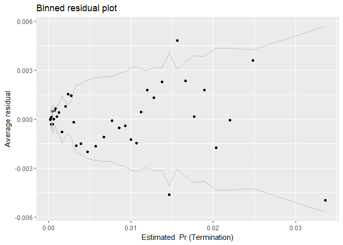<!-- -->

```r
# residuals_term_plot(Term_02F,"cl_days")+
#   labs(x="Centered Log(Days)")
```

The vast majority of very short duration contracts are IDVs

The lower rate of task order termination did not prove to be relevant to contract ceiling. The next step is to see whether there is any relationship to maximum duration. Under this theory, the fact that IDVs make it simpler to do multiple short task orders could mask any risk when task order duratioN grows longer.

###Model 03C: Any IDV and Maximum Duration

```r
# Term_03C <- glmer (data=Term_smp,
#                  b_Term ~ l_Ceil + l_Days + l_Ceil:l_Days + 
#                    IDV + IDV:l_Days+
#                (1 | Who) + (1 | PSR_What) + (1 | StartFY), family=binomial(link="logit"))
# display(Term_03C)
```

The results a dramatic, longer IDVs do face higher risks of termination. That said, the termination risk reduction for all IDVs has grown even further as a result, so even longer task orders may not face greater termination risks than comparable contract awards. With this addition, the intersection of contract ceiling and maximum duration is no longer significant, the next step will be testing its removal from the equation.

###Model 03D: Trimming the intersection of duration and ceiling

```r
# Term_03D <- glmer (data=Term_smp,
#                  b_Term ~ l_Ceil + l_Days + 
#                    IDV + IDV:l_Days+
#                (1 | Who) + (1 | PSR_What) + (1 | StartFY), family=binomial(link="logit"))
# display(Term_03D)
```

The removal has little effect on the AIC or DIC but does simplify the model.

Subsequent steps will explore the difference between multiple-award IDVs, where the government can choose from a pre-qualified pool of vendors, and single-award IDVs, where the government only has one option. 

###Model 03E: Single-Award IDV

```r
# Term_03E <- glmer (data=Term_smp,
#                  b_Term ~ l_Ceil + l_Days + 
#                    SIDV + 
#                (1 | Who) + (1 | PSR_What) + (1 | StartFY), family=binomial(link="logit"))
# display(Term_03E)
```

Single-award IDVs closely align with the role played by IDVs as a whole, and increase the predictive power of the model, as measured by AIC and DIC. 

###Model 03F: Multiple-Award IDVs

```r
# Term_03F <- glmer (data=Term_smp,
#                  b_Term ~ l_Ceil + l_Days + 
#                    SIDV + MIDV +
#                (1 | Who) + (1 | PSR_What) + (1 | StartFY), family=binomial(link="logit"))
# display(Term_03F)
```

Multiple-Award IDVs also reduce the termination rate, but not to nearly the same extent as single-awrd IDVs. However, coefficient is sufficient to merit inclusion in the model.

###Model 03G: Other IDVs

```r
# Term_03G <- glmer (data=Term_smp,
#                  b_Term ~ l_Ceil + l_Days + 
#                    SIDV + MIDV + OIDV +
#                (1 | Who) + (1 | PSR_What) + (1 | StartFY), family=binomial(link="logit"))
# display(Term_03G)
```
Other IDVs has the weakest relationship of the three, but still is significant. The next step is to test if interactions with maximum duration still add value to the model, starting with single-award.


###Model 03H: Single-Award IDVs and Maximum duration

```r
# Term_03H <- glmer (data=Term_smp,
#                  b_Term ~ l_Ceil + l_Days + 
#                    SIDV + MIDV + OIDV + SIDV:l_Days +
#                (1 | Who) + (1 | PSR_What) + (1 | StartFY), family=binomial(link="logit"))
# display(Term_03H)
```

The pattern for single-award IDVs and duration is a slightly magnified version of the phenonemon for IDVs overall shown in mdel 2C. 

###Model 03I: Single-Award IDVs and Maximum duration


```r
# 
# Term_03I <- glmer (data=Term_smp,
#                  b_Term ~ l_Ceil + l_Days + 
#                    SIDV + MIDV + OIDV + SIDV:l_Days + MIDV:l_Days +
#                (1 | Who) + (1 | PSR_What) + (1 | StartFY), family=binomial(link="logit"))
# display(Term_03I)
```
The error is a bit higher for multiple source IDVs interacting with duration, as compared to single-award IDVs. In addition, the model failed to converge, so leaving out this interaction.

###Model 03J: Other IDVs and Maximum duration


```r
# Term_12J <- glmer (data=Term_smp,
#                  b_Term ~ l_Ceil + l_Days + 
#                    SIDV + MIDV + OIDV + SIDV:l_Days + OIDV:l_Days +
#                (1 | Who) + (1 | PSR_What) + (1 | StartFY), family=binomial(link="logit"))
# display(Term_12J)
```
Interesting enough, other IDVs have the opposite interaction with single-award IDVs as does single-award IDVs. Shorter duration other IDVs slightly raise termination risks while longer reduce them relative to other sorts of vehicles. However, the coefficient for other IDVs no longer exceeds the standard error, so leaving this parameter out.

##Type of Contract
###Model 13A: Fixed-Price Contracts

The next step adds a measure for whether the contract was cost-based or fixed-price. Prior CSIS research has found that fixed-price contracts do face a higher risk of termination across the board.


```r
# Term_13A <- glmer (data=Term_smp,
#                  b_Term ~ l_Ceil + l_Days + 
#                    SIDV + MIDV + OIDV + SIDV:l_Days + 
#                    n_Fixed +
#                (1 | Who) + (1 | PSR_What) + (1 | StartFY), family=binomial(link="logit"))
# display(Term_13A)
```

And fixed price contracts do indeed have a appreciably higher average termination rate. This does not improve the overall AIC of the model, but it captures another important dynamic and has a coefficient that greatly exceeds its standard error. 

###Model 13B: Fixed-Price and Maximum Duration
Past CSIS research has found that fixed-price contracts do appear to be at higher risk if they have a longer maximum duration. Fixed-price contracting does require upfront estimation of likely costs, and thus a longer duration means more opportunity for changed circumstance.


```r
# Term_13B <- glmer (data=Term_smp,
#                   b_Term ~ l_Ceil + l_Days + 
#                    SIDV + MIDV + OIDV + SIDV:l_Days + 
#                    n_Fixed + l_Days:n_Fixed +
#                (1 | Who) + (1 | PSR_What) + (1 | StartFY), family=binomial(link="logit"))
# display(Term_13B)
```
The model failed to converge and the coefficient, while large, did not exceed the standard error. That said, it is worth noting that the sign went in the opposite direction from what was expected, with longer fixed-price contracts not being associated with disproprtionately higher terminations rates. Thus, the earlier finding is not replicated. 

###Model 13C: Incentive Fees

In the performance of the defense acquisition system report, the benefits found were reduced cost overruns. That could help avoid terminations, but it's an indirect connection at best. 


```r
# Term_13C <- glmer (data=Term_smp,
#                   b_Term ~ l_Ceil + l_Days + 
#                    SIDV + MIDV + OIDV + SIDV:l_Days + 
#                    n_Fixed + nIncent +
#                (1 | Who) + (1 | PSR_What) + (1 | StartFY), family=binomial(link="logit"))
# display(Term_13C)
```

###Model 13D: Undefinitized Contract Awards
Undefinitized Contract Awards allow for quick action in situations where there is not time or information to establish all of a contracts properties at the time of signing. They have been found by the GAO and the Performance of the Defense Acquisition studies to contain notable risks, primarily relating to cost overruns. Will these risks also carry into terminations?


```r
#Run through stopped here
# Term3D <- glmer (data=Term_smp,
#                   b_Term ~ l_Ceil + l_Days + 
#                    SIDV + MIDV + OIDV + SIDV:l_Days + 
#                    n_Fixed  + n_UCA +
#                (1 | Who) + (1 | PSR_What) + (1 | StartFY), family=binomial(link="logit"))
# display(Term3D)
```

Use of UCA significantly increases risks of termination, well in excess of the error term. Interestingly, while this addition further reduceds the AIC and DIC of the model, it also increases the coefficient for fixed price contracts.

##Place of Performance
###Model 14A: Any International


```r
# Term4A <- glmer (data=Term_smp,
#                   b_Term ~ l_Ceil + l_Days + 
#                    SIDV + MIDV + OIDV + SIDV:l_Days + 
#                    n_Fixed  + n_UCA +
#                    nIntl +
#                (1 | Who) + (1 | PSR_What) + (1 | StartFY), family=binomial(link="logit"))
# display(Term4A)
```

International performance of contract proved to not be an effective predictor of contract termination. In addition, the model failed to converge. This variable will not be added.

##Competition Variables
###Model 15A: Competition


###Model 15C: Competition and Fixed Price 


```r
# Term_02C <- glmer (data=Term_smp,b_Term ~ l_Ceil + l_Days + 
#                    SIDV + MIDV + OIDV + SIDV:l_Days + 
#                    n_Fixed  + n_UCA +
#                    cb_Comp + cb_Comp:n_Fixed +
#                (1 | Who) + (1 | PSR_What) + (1 | StartFY), family=binomial(link="logit"))
# display(Term_02C)
```
THese results are not sufficiently signficiant to justify inclusion, but the interaction between fixed price and competition is potentially interesting and suggests that the demographics of competed contrats may be one factor driving their increase in termination risk. Specifically, one possibility may be that competitive fixed-price contracts are at greater risk of aggressive bids that increase contract risk. 

###Model 15D: Fixed Price and Number of Offers for Competed Contracts


```r
# Term_02D <- glmer (data=subset(Term_smp,cb_Comp==1),
#               b_Term ~ l_Ceil + l_Days + 
#                 SIDV + MIDV + OIDV + SIDV:l_Days + 
#                    n_Fixed  + n_UCA +  lOffer + lOffer:n_Fixed +
#                (1 | Who) + (1 | PSR_What) + (1 | StartFY), family=binomial(link="logit"))
# display(Term_02D)
```

Focusing again on only those contracts that were competed, there does not appear to be a relationship between fixed price contracting and the number of offers. This undercuts the idea that the competition dynamics can be explained as simply relating to aggressive bidding on fixed price contracts.

###Model 15E: Competition and Contract Ceiling

```r
# Term_15E <- glmer (data=Term_smp,
#                  b_Term ~ l_Ceil + l_Days +
#                    SIDV + MIDV + OIDV + SIDV:l_Days +
#                 n_Fixed  + n_UCA +  
#                   cb_Comp + cb_Comp:l_Ceil +
#                (1 | Who) + (1 | PSR_What) + (1 | StartFY), family=binomial(link="logit"))
# display(Term_15E)
```
The coefficient for the interaction of Ceiling and Competition exceeds the standard error, but only minimally. The model also fails to converge, so we'll leave out this interaction.

###Model 15F: Single-Award IDVs and Competition 
The next step is to check interactions with the contract vehicles. Each has a slightly different approach to competition. For example, the competition for a Single-Award IDV happens at the start of the IDV, after that, contracts awarded through that vehicle go to that single winning vendor.


```r
# Term_15F <- glmer (data=Term_smp,
#                 b_Term ~ l_Ceil + l_Days +
#                 SIDV + MIDV + OIDV + SIDV:l_Days +
#                 n_Fixed  + n_UCA +  
#                 cb_Comp + cb_Comp:SIDV + 
#                (1 | Who) + (1 | PSR_What) + (1 | StartFY), family=binomial(link="logit"))
# display(Term_15F)
# 
```
That result proved stronger than expected and does seem to show that that competed IDVs do have a lower average risk of terminations. However, the model failed to converge.

Next, we'll check the same relationship, but with number of offers instead.

###Model 15G: Single-Award IDVs and Number of Offers 


```r
# Term_15G <- glmer (data=Term_smp,
#                  b_Term ~ l_Ceil + l_Days +
#                 SIDV + MIDV + OIDV + SIDV:l_Days +
#                 n_Fixed  + n_UCA +
#                 lOffer + lOffer:SIDV + 
#                (1 | Who) + (1 | PSR_What) + (1 | StartFY), family=binomial(link="logit"))
# display(Term_15G)
```
The model likewise failed to converge with number of offers and the number of offers proved a less powerful interaction variable than extent of competition.


###Model 15H: Multiple-Award IDVs and Competition


```r
# Term_15H <- glmer (data=Term_smp,
#                  b_Term ~ l_Ceil + l_Days +
#                 SIDV + MIDV + OIDV + SIDV:l_Days +
#                 n_Fixed  + n_UCA +
#                 cb_Comp + cb_Comp:MIDV + 
#                (1 | Who) + (1 | PSR_What) + (1 | StartFY), family=binomial(link="logit"))
# display(Term_15H)
# nrow(Term_smp[!is.na(Term_smp$l_Ceil) &
#                 !is.na(Term_smp$lDays) &
#                 !is.na(Term_smp$IDV) &
#               !is.na(Term_smp$nUCA) & 
#                 !is.na(Term_smp$Fixed)
#                 !is.na(Term_smp$cb_Comp),])
```
The combination of competition and multiple-award IDVs is powerful. Multiple-award IDVs entirely explains the competition 

###Model 15I: Multiple-Award IDVs and Number of Offers

```r
# Term_15I <- glmer (data=Term_smp,
#                  b_Term ~ l_Ceil + l_Days +
#                 SIDV + MIDV + OIDV + SIDV:l_Days +
#                 n_Fixed  + n_UCA +
#                 lOffer + MIDV:lOffer + 
#                (1 | Who) + (1 | PSR_What) + (1 | StartFY), family=binomial(link="logit"))
# display(Term_15I)
```
###Model 15J: Other IDVs and Competition

Unlike the existance of competition, having more offers does not have the same dramatic relationship with multi-award IDVs that it does with competition. This does raise the question as to whether the long tail of high numbers of offers might be undercutting the relationship. However, for now, we will stick with competition. 


```r
# Term_15J <- glmer (data=Term_smp,
#                  b_Term ~ l_Ceil + l_Days +
#                 SIDV + MIDV + OIDV + SIDV:l_Days +
#                 n_Fixed  + n_UCA +
#                 cb_Comp + cb_Comp:MIDV + cb_Comp:OIDV +
#                (1 | Who) + (1 | PSR_What) + (1 | StartFY), family=binomial(link="logit"))
# display(Term_15J)
```
Competition and Other IDVs only slightly exceeds the standard error.


##Selection: Model 05H

While the direction of competition is still puzzling, the interaction with Multiple-Award clarifies it somewhat. The study team will use model 05A going forward.


```r
# TermModel<-Term_15H
# display(Term_15H)
```
