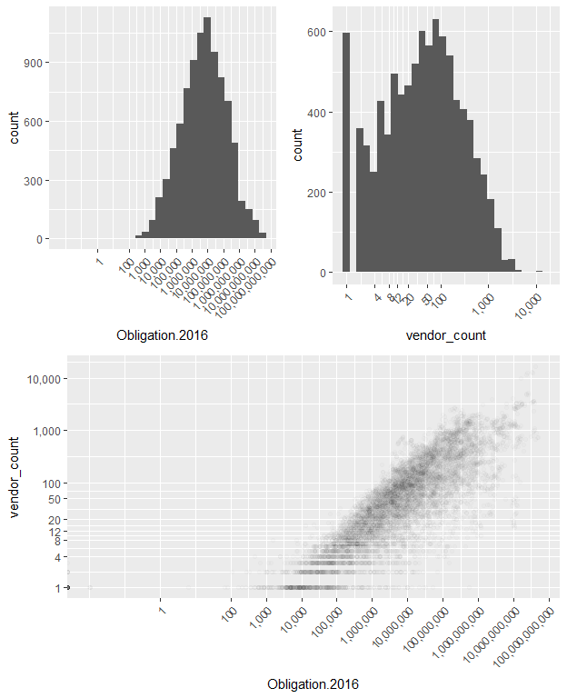
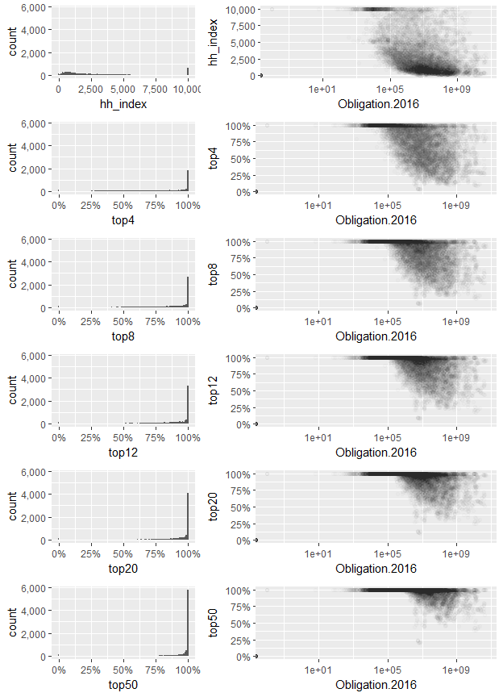
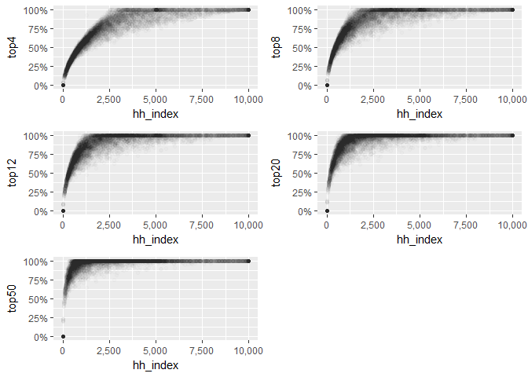

##Sector Size

The present unit of analysis is the dyad of fiscal year and industrial sector, as defined by 6 digit NAICS code. The average annual obligations for is hundreds of millions of dollars (383,893,111).

However, there is a fair amount of diversity in the obligations by sector. A fair number of these categories have minimal DoD contract spending, e.g. 31.3% under \$1,000,000 and 56.7% under \$10,000,000. For the 596 cases with only a single vendor, the average size is 1,372,961 which suggests that smaller cases will often be high consolidated in a manner that likely reflects a minimal number of contracts rather than a genuinely consolidated industrial sector.

The study team is presently considering ways to handle these small datasets, for example eliminating them from the sample, or bundling them to a higher level on the heirarchy of NACIS codes.


```
## [1] 48630752303
```

```
## # A tibble: 1 x 12
## # Groups:   Fiscal.Year [1]
##   Fiscal.Year NAICS_Code Action.Obligation Obligation.2016 vendor_count
##   <date>           <int>             <dbl>           <dbl>        <int>
## 1 2012-01-01      336411      46597986857.    48630752303.          746
## # ... with 7 more variables: hh_index <dbl>, pct_sum_check <dbl>,
## #   top4 <dbl>, top8 <dbl>, top12 <dbl>, top20 <dbl>, top50 <dbl>
```

```
## Warning in self$trans$transform(x): NaNs produced
```

```
## Warning: Transformation introduced infinite values in continuous x-axis
```

```
## `stat_bin()` using `bins = 30`. Pick better value with `binwidth`.
```

```
## Warning: Removed 238 rows containing non-finite values (stat_bin).
```

```
## `stat_bin()` using `bins = 30`. Pick better value with `binwidth`.
```

```
## Warning in self$trans$transform(x): NaNs produced

## Warning in self$trans$transform(x): Transformation introduced infinite
## values in continuous x-axis
```

```
## Warning: Removed 166 rows containing missing values (geom_point).
```

<!-- -->

## Examining consolidation measures

The study team has replicated a ranged of measures used by the U.S. census department. The Herfindahl-Hirschman index (HH-index) is calculated by taking the square of the market share percentage of each participant in a sector. The other measures used are concentration ratios which are based on calculating the share held by the top vendors in a sector (i.e. top 4, top 8, top 12, top 20, and top 50). 


```
## Warning in self$trans$transform(x): NaNs produced
```

```
## Warning: Transformation introduced infinite values in continuous x-axis
```

```
## Warning: Removed 166 rows containing missing values (geom_point).
```

```
## Warning in self$trans$transform(x): NaNs produced
```

```
## Warning: Transformation introduced infinite values in continuous x-axis
```

```
## Warning: Removed 166 rows containing missing values (geom_point).
```

```
## Warning in self$trans$transform(x): NaNs produced
```

```
## Warning: Transformation introduced infinite values in continuous x-axis
```

```
## Warning: Removed 166 rows containing missing values (geom_point).
```

```
## Warning in self$trans$transform(x): NaNs produced
```

```
## Warning: Transformation introduced infinite values in continuous x-axis
```

```
## Warning: Removed 166 rows containing missing values (geom_point).
```

```
## Warning in self$trans$transform(x): NaNs produced
```

```
## Warning: Transformation introduced infinite values in continuous x-axis
```

```
## Warning: Removed 166 rows containing missing values (geom_point).
```

```
## Warning in self$trans$transform(x): NaNs produced
```

```
## Warning: Transformation introduced infinite values in continuous x-axis
```

```
## Warning: Removed 166 rows containing missing values (geom_point).
```

<!-- -->


## Comparing Consolidation Measures
The HH-index is correlated with the marketshare held by top firms, but is also a more granular measure. However, the census bureau only provides the HH-index for manufacturing sectors. As a result when comparing defense industry consolidation to consolidation in the wider economy, it will be necessary to mix and match measures or to lose the granularity availabile for the defense sector. These comparison graphs are used to help determine which of the available measures to use.

Upon examination, the consolidation ratio for the top 4 firms appears to offer the most granularity. Mathematically, all of the concentration ratios top out at 100% and provide no differentiating detail between different markets with the same ratio (for example the both a market dominated by a single firm and evenly divided between 8 firms would have a top 8 concentration ratio of 100%). A top 4 ratio of 100% lines up with a minimum HH-index of 2,500. That is also the threshhold for a highly concentrated market. This suggests that the top 4 concentration ratio is the best choice for comparison with the HH-index, because all of the other concentration ratios used by the census bureau sometimes regularly  100% concentration when the HH-index would report only a moderately concentrated market (HH-index 1,500 to 2,500).

<!-- -->


```r
save(annual_naics_summary,file="annual_naics_summary.Rdata")
```
