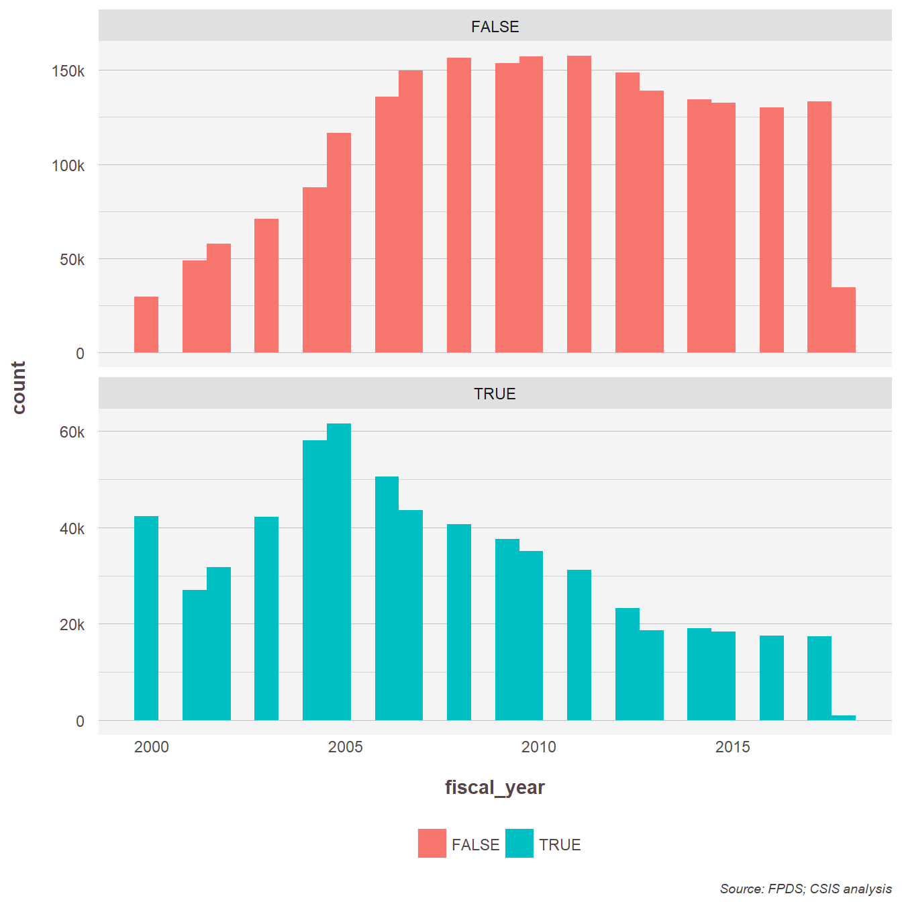
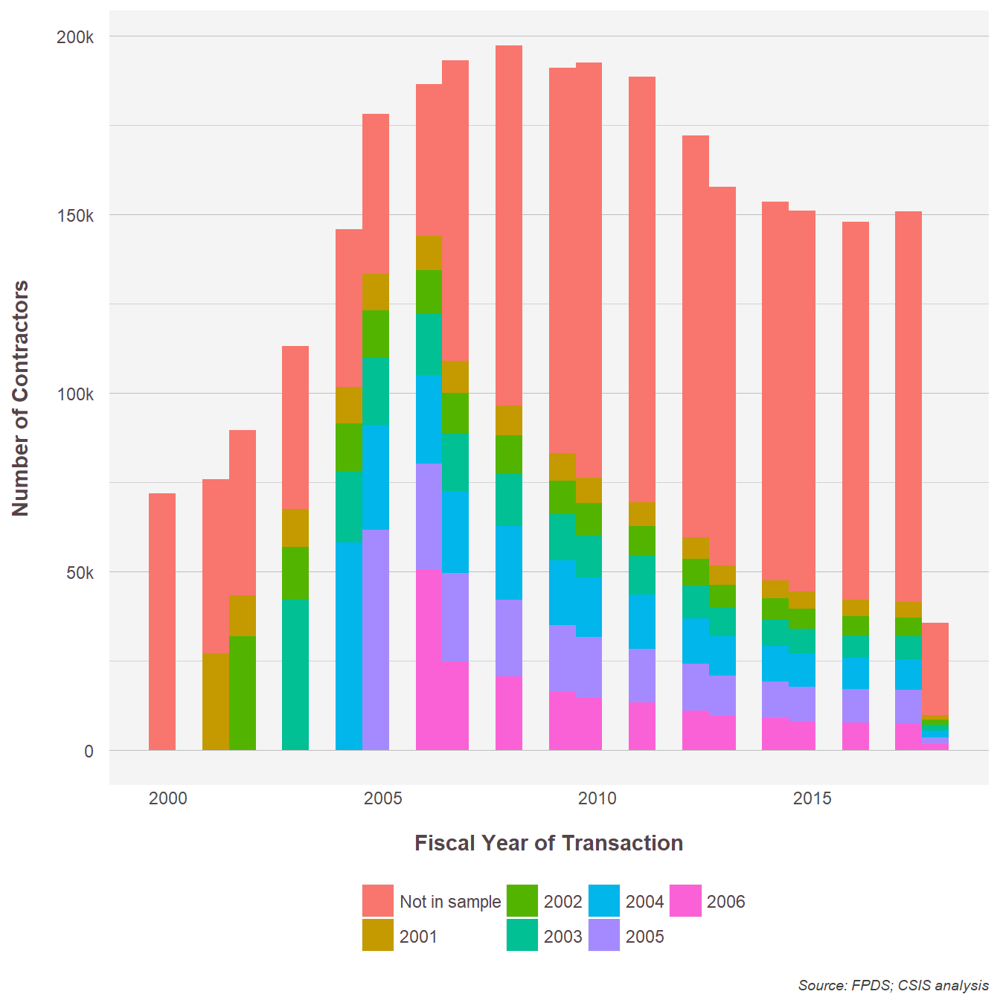

## Setup


```r
load(file = file.path("../Cleaning Data/FPDS/FPDS_datapull_all_v3.Rda"))
load(file = file.path("../Cleaning Data/FPDS/FPDS_cleaned_unique_wtotalobligations.Rda"))

file.exists("Raw Data/FPDS/Vendor.SP_DunsnumberNewEntrants_all.txt")
```

```
## [1] FALSE
```

```r
dir.exists("Cleaning Data/")
```

```
## [1] FALSE
```

```r
dir.exists("Analysis")
```

```
## [1] FALSE
```

```r
file.exists("New Entrants.Rproj")
```

```
## [1] FALSE
```

```r
list.files("../")
```

```
## [1] "Analysis"           "Cleaning Data"      "New Entrants.Rproj"
## [4] "Raw Data"
```

```r
FPDS_data <- read.delim(file.path("../Raw Data/FPDS","Vendor.SP_DunsnumberNewEntrants_all.txt"), fill = TRUE, header=TRUE,  na.strings = c("", "NULL"))
FPDS_data<-as.data.frame(FPDS_data)
```


## Prepare the raw data

```r
FPDS_data<-csis360::remove_bom(FPDS_data)
# FPDS_data<-subset(FPDS_data,fiscal_year>=2000)

FPDS_data<-csis360::deflate(FPDS_data,money_var="obligatedAmount",
                            fy_var="fiscal_year")
```

```
## 
##  Applying
##  Deflator.2017 
##  in 
##  Lookup_Deflators.csv 
##  from
##  https://raw.githubusercontent.com/CSISdefense/Lookup-Tables/master/
```

```
## Warning: Missing column names filled in: 'X10' [10], 'X11' [11], 'X12' [12]
```

```
## Parsed with column specification:
## cols(
##   Fiscal.Year = col_integer(),
##   Deflator.2005 = col_double(),
##   Deflator.2011 = col_double(),
##   Deflator.2012 = col_double(),
##   Deflator.2013 = col_double(),
##   Deflator.2014 = col_double(),
##   Deflator.2015 = col_double(),
##   Deflator.2016 = col_double(),
##   Deflator.2017 = col_double(),
##   X10 = col_character(),
##   X11 = col_character(),
##   X12 = col_double()
## )
```

```r
FPDS_data<-FPDS_data %>%
  group_by(Dunsnumber) %>%
  dplyr::mutate(first_year=min(fiscal_year),
    entrant=ifelse(min(fiscal_year)==fiscal_year,TRUE,FALSE) )

FPDS_duns_fyear<-subset(FPDS_data,fiscal_year>=2000) %>%
  group_by(Dunsnumber,fiscal_year,entrant,first_year) %>%
  dplyr::summarize(obligatedAmount.2017=sum(obligatedAmount.Deflator.2017,na.rm=TRUE))

FPDS_duns_fyear$sample_year<-FPDS_duns_fyear$first_year
FPDS_duns_fyear$sample_year[FPDS_duns_fyear$sample_year<2001 | FPDS_duns_fyear$sample_year>2006]<-"Not in sample"
FPDS_duns_fyear$sample_year<-factor(FPDS_duns_fyear$sample_year,levels=c("Not in sample","2001","2002","2003","2004","2005","2006"))

FPDS_summary<-FPDS_duns_fyear %>%
  group_by(fiscal_year,entrant,first_year,sample_year) %>%
  dplyr::summarize(obligatedAmount.2017=sum(obligatedAmount.2017,na.rm=TRUE))
```

## Benchmark plots

First lets look at the total number of vendors.


```
## Warning in add_preassigned_scales(mainplot, labels_and_colors, var =
## color_var): entrant not found in labels_and_colors
```

```
## Warning in grid.Call(C_textBounds, as.graphicsAnnot(x$label), x$x, x$y, :
## font family not found in Windows font database

## Warning in grid.Call(C_textBounds, as.graphicsAnnot(x$label), x$x, x$y, :
## font family not found in Windows font database

## Warning in grid.Call(C_textBounds, as.graphicsAnnot(x$label), x$x, x$y, :
## font family not found in Windows font database

## Warning in grid.Call(C_textBounds, as.graphicsAnnot(x$label), x$x, x$y, :
## font family not found in Windows font database

## Warning in grid.Call(C_textBounds, as.graphicsAnnot(x$label), x$x, x$y, :
## font family not found in Windows font database

## Warning in grid.Call(C_textBounds, as.graphicsAnnot(x$label), x$x, x$y, :
## font family not found in Windows font database

## Warning in grid.Call(C_textBounds, as.graphicsAnnot(x$label), x$x, x$y, :
## font family not found in Windows font database

## Warning in grid.Call(C_textBounds, as.graphicsAnnot(x$label), x$x, x$y, :
## font family not found in Windows font database

## Warning in grid.Call(C_textBounds, as.graphicsAnnot(x$label), x$x, x$y, :
## font family not found in Windows font database
```

```
## Warning in grid.Call.graphics(C_text, as.graphicsAnnot(x$label), x$x, x
## $y, : font family not found in Windows font database

## Warning in grid.Call.graphics(C_text, as.graphicsAnnot(x$label), x$x, x
## $y, : font family not found in Windows font database
```

<!-- -->

```
## Warning in add_preassigned_scales(mainplot, labels_and_colors, var =
## color_var): entrant not found in labels_and_colors
```

```
## Warning in grid.Call(C_textBounds, as.graphicsAnnot(x$label), x$x, x$y, :
## font family not found in Windows font database

## Warning in grid.Call(C_textBounds, as.graphicsAnnot(x$label), x$x, x$y, :
## font family not found in Windows font database

## Warning in grid.Call(C_textBounds, as.graphicsAnnot(x$label), x$x, x$y, :
## font family not found in Windows font database

## Warning in grid.Call(C_textBounds, as.graphicsAnnot(x$label), x$x, x$y, :
## font family not found in Windows font database

## Warning in grid.Call(C_textBounds, as.graphicsAnnot(x$label), x$x, x$y, :
## font family not found in Windows font database

## Warning in grid.Call(C_textBounds, as.graphicsAnnot(x$label), x$x, x$y, :
## font family not found in Windows font database
```

```
## Warning in grid.Call.graphics(C_text, as.graphicsAnnot(x$label), x$x, x
## $y, : font family not found in Windows font database

## Warning in grid.Call.graphics(C_text, as.graphicsAnnot(x$label), x$x, x
## $y, : font family not found in Windows font database
```

<!-- -->

```
## Warning in add_preassigned_scales(mainplot, labels_and_colors, var =
## color_var): sample_year not found in labels_and_colors
```

```
## Warning in grid.Call(C_textBounds, as.graphicsAnnot(x$label), x$x, x$y, :
## font family not found in Windows font database

## Warning in grid.Call(C_textBounds, as.graphicsAnnot(x$label), x$x, x$y, :
## font family not found in Windows font database

## Warning in grid.Call(C_textBounds, as.graphicsAnnot(x$label), x$x, x$y, :
## font family not found in Windows font database

## Warning in grid.Call(C_textBounds, as.graphicsAnnot(x$label), x$x, x$y, :
## font family not found in Windows font database

## Warning in grid.Call(C_textBounds, as.graphicsAnnot(x$label), x$x, x$y, :
## font family not found in Windows font database

## Warning in grid.Call(C_textBounds, as.graphicsAnnot(x$label), x$x, x$y, :
## font family not found in Windows font database

## Warning in grid.Call(C_textBounds, as.graphicsAnnot(x$label), x$x, x$y, :
## font family not found in Windows font database

## Warning in grid.Call(C_textBounds, as.graphicsAnnot(x$label), x$x, x$y, :
## font family not found in Windows font database

## Warning in grid.Call(C_textBounds, as.graphicsAnnot(x$label), x$x, x$y, :
## font family not found in Windows font database
```

```
## Warning in grid.Call.graphics(C_text, as.graphicsAnnot(x$label), x$x, x
## $y, : font family not found in Windows font database

## Warning in grid.Call.graphics(C_text, as.graphicsAnnot(x$label), x$x, x
## $y, : font family not found in Windows font database
```

<!-- -->

```
## Warning in add_preassigned_scales(mainplot, labels_and_colors, var =
## color_var): sample_year not found in labels_and_colors
```

```
## Warning in grid.Call(C_textBounds, as.graphicsAnnot(x$label), x$x, x$y, :
## font family not found in Windows font database

## Warning in grid.Call(C_textBounds, as.graphicsAnnot(x$label), x$x, x$y, :
## font family not found in Windows font database

## Warning in grid.Call(C_textBounds, as.graphicsAnnot(x$label), x$x, x$y, :
## font family not found in Windows font database

## Warning in grid.Call(C_textBounds, as.graphicsAnnot(x$label), x$x, x$y, :
## font family not found in Windows font database

## Warning in grid.Call(C_textBounds, as.graphicsAnnot(x$label), x$x, x$y, :
## font family not found in Windows font database

## Warning in grid.Call(C_textBounds, as.graphicsAnnot(x$label), x$x, x$y, :
## font family not found in Windows font database
```

```
## Warning in grid.Call.graphics(C_text, as.graphicsAnnot(x$label), x$x, x
## $y, : font family not found in Windows font database

## Warning in grid.Call.graphics(C_text, as.graphicsAnnot(x$label), x$x, x
## $y, : font family not found in Windows font database
```

<!-- -->

```
## Warning in grid.Call(C_textBounds, as.graphicsAnnot(x$label), x$x, x$y, :
## font family not found in Windows font database
```

```
## Warning in grid.Call(C_textBounds, as.graphicsAnnot(x$label), x$x, x$y, :
## font family not found in Windows font database

## Warning in grid.Call(C_textBounds, as.graphicsAnnot(x$label), x$x, x$y, :
## font family not found in Windows font database

## Warning in grid.Call(C_textBounds, as.graphicsAnnot(x$label), x$x, x$y, :
## font family not found in Windows font database

## Warning in grid.Call(C_textBounds, as.graphicsAnnot(x$label), x$x, x$y, :
## font family not found in Windows font database

## Warning in grid.Call(C_textBounds, as.graphicsAnnot(x$label), x$x, x$y, :
## font family not found in Windows font database

## Warning in grid.Call(C_textBounds, as.graphicsAnnot(x$label), x$x, x$y, :
## font family not found in Windows font database

## Warning in grid.Call(C_textBounds, as.graphicsAnnot(x$label), x$x, x$y, :
## font family not found in Windows font database
```

```
## Warning in grid.Call.graphics(C_text, as.graphicsAnnot(x$label), x$x, x
## $y, : font family not found in Windows font database
```

<!-- -->

Then the vendor spend.


```r
build_plot(
  data=FPDS_summary,
  chart_geom = "Bar Chart",
  # share = FALSE,
  x_var="fiscal_year",
  y_var="obligatedAmount.2017", #Name of variable to plot on y-axis
  color_var="entrant",       # name of coloration variable, as string
  # facet_var="entrant",        # name of facet variable, as string
  legend=TRUE, #Include a legend
  caption=TRUE, #Include a source caption
  labels_and_colors=NULL,
  column_key=NULL
)+labs(x="Fiscal Year of Transaction",y="Obligations 2017 $")
```

```
## Warning in add_preassigned_scales(mainplot, labels_and_colors, var =
## color_var): entrant not found in labels_and_colors
```

```
## Warning in grid.Call(C_textBounds, as.graphicsAnnot(x$label), x$x, x$y, :
## font family not found in Windows font database

## Warning in grid.Call(C_textBounds, as.graphicsAnnot(x$label), x$x, x$y, :
## font family not found in Windows font database

## Warning in grid.Call(C_textBounds, as.graphicsAnnot(x$label), x$x, x$y, :
## font family not found in Windows font database

## Warning in grid.Call(C_textBounds, as.graphicsAnnot(x$label), x$x, x$y, :
## font family not found in Windows font database

## Warning in grid.Call(C_textBounds, as.graphicsAnnot(x$label), x$x, x$y, :
## font family not found in Windows font database

## Warning in grid.Call(C_textBounds, as.graphicsAnnot(x$label), x$x, x$y, :
## font family not found in Windows font database

## Warning in grid.Call(C_textBounds, as.graphicsAnnot(x$label), x$x, x$y, :
## font family not found in Windows font database

## Warning in grid.Call(C_textBounds, as.graphicsAnnot(x$label), x$x, x$y, :
## font family not found in Windows font database

## Warning in grid.Call(C_textBounds, as.graphicsAnnot(x$label), x$x, x$y, :
## font family not found in Windows font database
```

```
## Warning in grid.Call.graphics(C_text, as.graphicsAnnot(x$label), x$x, x
## $y, : font family not found in Windows font database

## Warning in grid.Call.graphics(C_text, as.graphicsAnnot(x$label), x$x, x
## $y, : font family not found in Windows font database
```

<!-- -->

```r
build_plot(
  data=FPDS_summary,
  chart_geom = "Bar Chart",
  # share = FALSE,
  x_var="fiscal_year",
  y_var="obligatedAmount.2017", #Name of variable to plot on y-axis
  color_var="entrant",       # name of coloration variable, as string
  facet_var="entrant",        # name of facet variable, as string
  legend=TRUE, #Include a legend
  caption=TRUE, #Include a source caption
  labels_and_colors=NULL,
  column_key=NULL
)+facet_wrap(~entrant,scales="free_y",ncol=1)+labs(x="Fiscal Year of Transaction",y="Obligations 2017 $")
```

```
## Warning in add_preassigned_scales(mainplot, labels_and_colors, var =
## color_var): entrant not found in labels_and_colors
```

```
## Warning in grid.Call(C_textBounds, as.graphicsAnnot(x$label), x$x, x$y, :
## font family not found in Windows font database

## Warning in grid.Call(C_textBounds, as.graphicsAnnot(x$label), x$x, x$y, :
## font family not found in Windows font database

## Warning in grid.Call(C_textBounds, as.graphicsAnnot(x$label), x$x, x$y, :
## font family not found in Windows font database

## Warning in grid.Call(C_textBounds, as.graphicsAnnot(x$label), x$x, x$y, :
## font family not found in Windows font database

## Warning in grid.Call(C_textBounds, as.graphicsAnnot(x$label), x$x, x$y, :
## font family not found in Windows font database

## Warning in grid.Call(C_textBounds, as.graphicsAnnot(x$label), x$x, x$y, :
## font family not found in Windows font database
```

```
## Warning in grid.Call.graphics(C_text, as.graphicsAnnot(x$label), x$x, x
## $y, : font family not found in Windows font database

## Warning in grid.Call.graphics(C_text, as.graphicsAnnot(x$label), x$x, x
## $y, : font family not found in Windows font database
```

<!-- -->

```r
build_plot(
  data=FPDS_summary,
  chart_geom = "Bar Chart",
  # share = FALSE,
  x_var="fiscal_year",
  y_var="obligatedAmount.2017", #Name of variable to plot on y-axis
  color_var="sample_year",       # name of coloration variable, as string
  # facet_var="sample_year",        # name of facet variable, as string
  legend=TRUE, #Include a legend
  caption=TRUE, #Include a source caption
  labels_and_colors=NULL,
  column_key=NULL
)+labs(x="Fiscal Year of Transaction",y="Obligations 2017 $")
```

```
## Warning in add_preassigned_scales(mainplot, labels_and_colors, var =
## color_var): sample_year not found in labels_and_colors
```

```
## Warning in grid.Call(C_textBounds, as.graphicsAnnot(x$label), x$x, x$y, :
## font family not found in Windows font database

## Warning in grid.Call(C_textBounds, as.graphicsAnnot(x$label), x$x, x$y, :
## font family not found in Windows font database

## Warning in grid.Call(C_textBounds, as.graphicsAnnot(x$label), x$x, x$y, :
## font family not found in Windows font database

## Warning in grid.Call(C_textBounds, as.graphicsAnnot(x$label), x$x, x$y, :
## font family not found in Windows font database

## Warning in grid.Call(C_textBounds, as.graphicsAnnot(x$label), x$x, x$y, :
## font family not found in Windows font database

## Warning in grid.Call(C_textBounds, as.graphicsAnnot(x$label), x$x, x$y, :
## font family not found in Windows font database

## Warning in grid.Call(C_textBounds, as.graphicsAnnot(x$label), x$x, x$y, :
## font family not found in Windows font database

## Warning in grid.Call(C_textBounds, as.graphicsAnnot(x$label), x$x, x$y, :
## font family not found in Windows font database

## Warning in grid.Call(C_textBounds, as.graphicsAnnot(x$label), x$x, x$y, :
## font family not found in Windows font database
```

```
## Warning in grid.Call.graphics(C_text, as.graphicsAnnot(x$label), x$x, x
## $y, : font family not found in Windows font database

## Warning in grid.Call.graphics(C_text, as.graphicsAnnot(x$label), x$x, x
## $y, : font family not found in Windows font database
```

<!-- -->

```r
build_plot(
  data=FPDS_summary,
  chart_geom = "Bar Chart",
  # share = FALSE,
  x_var="fiscal_year",
  y_var="obligatedAmount.2017", #Name of variable to plot on y-axis
  color_var="sample_year",       # name of coloration variable, as string
  facet_var="sample_year",        # name of facet variable, as string
  legend=TRUE, #Include a legend
  caption=TRUE, #Include a source caption
  labels_and_colors=NULL,
  column_key=NULL
)+facet_wrap(~sample_year,scales="free_y",ncol=1)+
  labs(x="Fiscal Year of Transaction",y="Obligations 2017 $")
```

```
## Warning in add_preassigned_scales(mainplot, labels_and_colors, var =
## color_var): sample_year not found in labels_and_colors
```

```
## Warning in grid.Call(C_textBounds, as.graphicsAnnot(x$label), x$x, x$y, :
## font family not found in Windows font database

## Warning in grid.Call(C_textBounds, as.graphicsAnnot(x$label), x$x, x$y, :
## font family not found in Windows font database

## Warning in grid.Call(C_textBounds, as.graphicsAnnot(x$label), x$x, x$y, :
## font family not found in Windows font database

## Warning in grid.Call(C_textBounds, as.graphicsAnnot(x$label), x$x, x$y, :
## font family not found in Windows font database

## Warning in grid.Call(C_textBounds, as.graphicsAnnot(x$label), x$x, x$y, :
## font family not found in Windows font database

## Warning in grid.Call(C_textBounds, as.graphicsAnnot(x$label), x$x, x$y, :
## font family not found in Windows font database
```

```
## Warning in grid.Call.graphics(C_text, as.graphicsAnnot(x$label), x$x, x
## $y, : font family not found in Windows font database

## Warning in grid.Call.graphics(C_text, as.graphicsAnnot(x$label), x$x, x
## $y, : font family not found in Windows font database
```

<!-- -->

```r
build_plot(
  data=FPDS_cleaned_unique,
  chart_geom = "Bar Chart",
  # share = FALSE,
  x_var="FYear",
  y_var="total_obligations", #Name of variable to plot on y-axis
  # color_var="entrant",       # name of coloration variable, as string
  # facet_var="entrant",        # name of facet variable, as string
  legend=TRUE, #Include a legend
  caption=TRUE, #Include a source caption
  labels_and_colors=NULL,
  column_key=NULL
)+labs(x="Fiscal Year of Contractor First Appearance",y="Obligations 2017 $")
```

```
## Warning in grid.Call(C_textBounds, as.graphicsAnnot(x$label), x$x, x$y, :
## font family not found in Windows font database
```

```
## Warning in grid.Call(C_textBounds, as.graphicsAnnot(x$label), x$x, x$y, :
## font family not found in Windows font database

## Warning in grid.Call(C_textBounds, as.graphicsAnnot(x$label), x$x, x$y, :
## font family not found in Windows font database

## Warning in grid.Call(C_textBounds, as.graphicsAnnot(x$label), x$x, x$y, :
## font family not found in Windows font database

## Warning in grid.Call(C_textBounds, as.graphicsAnnot(x$label), x$x, x$y, :
## font family not found in Windows font database

## Warning in grid.Call(C_textBounds, as.graphicsAnnot(x$label), x$x, x$y, :
## font family not found in Windows font database

## Warning in grid.Call(C_textBounds, as.graphicsAnnot(x$label), x$x, x$y, :
## font family not found in Windows font database

## Warning in grid.Call(C_textBounds, as.graphicsAnnot(x$label), x$x, x$y, :
## font family not found in Windows font database
```

```
## Warning in grid.Call.graphics(C_text, as.graphicsAnnot(x$label), x$x, x
## $y, : font family not found in Windows font database
```

<!-- -->

Note that the `echo = FALSE` parameter was added to the code chunk to prevent printing of the R code that generated the plot.
