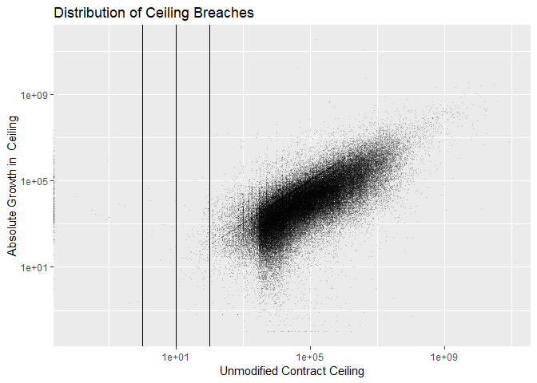
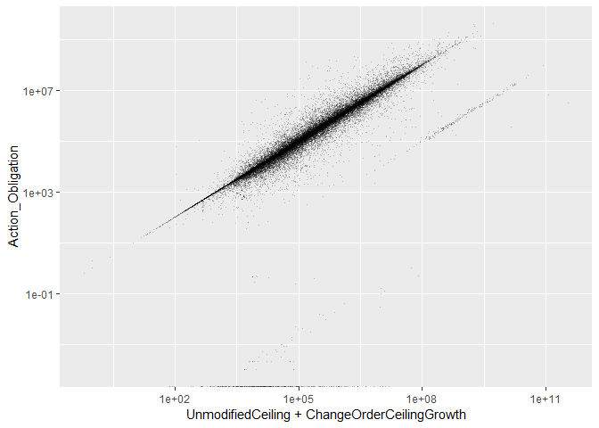
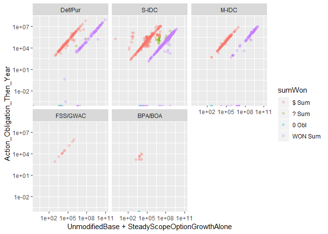
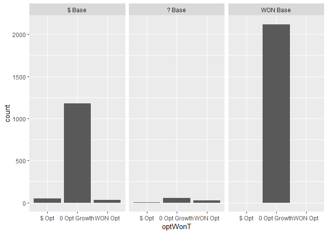

#Setup

```
## Warning: replacing previous import 'Hmisc::summarize' by 'dplyr::summarize'
## when loading 'csis360'
```

```
## Warning: replacing previous import 'Hmisc::src' by 'dplyr::src' when
## loading 'csis360'
```

```
## Warning: replacing previous import 'dplyr::intersect' by
## 'lubridate::intersect' when loading 'csis360'
```

```
## Warning: replacing previous import 'dplyr::union' by 'lubridate::union'
## when loading 'csis360'
```

```
## Warning: replacing previous import 'dplyr::setdiff' by 'lubridate::setdiff'
## when loading 'csis360'
```

```
## 
## Attaching package: 'dplyr'
```

```
## The following objects are masked from 'package:stats':
## 
##     filter, lag
```

```
## The following objects are masked from 'package:base':
## 
##     intersect, setdiff, setequal, union
```

```
## Loading required package: MASS
```

```
## 
## Attaching package: 'MASS'
```

```
## The following object is masked from 'package:dplyr':
## 
##     select
```

```
## Loading required package: Matrix
```

```
## Loading required package: lme4
```

```
## 
## arm (Version 1.10-1, built: 2018-4-12)
```

```
## Working directory is C:/Users/gsand/Repositories/Vendor/scripts
```

```
## Loading required package: coda
```

```
## 
## Attaching package: 'coda'
```

```
## The following object is masked from 'package:arm':
## 
##     traceplot
```

```
## Loading required package: boot
```

```
## 
## Attaching package: 'boot'
```

```
## The following object is masked from 'package:arm':
## 
##     logit
```

```
## 
## Please cite as:
```

```
##  Hlavac, Marek (2018). stargazer: Well-Formatted Regression and Summary Statistics Tables.
```

```
##  R package version 5.2.2. https://CRAN.R-project.org/package=stargazer
```

```
## Version:  1.36.23
## Date:     2017-03-03
## Author:   Philip Leifeld (University of Glasgow)
## 
## Please cite the JSS article in your publications -- see citation("texreg").
```

```
## 
## Attaching package: 'texreg'
```

```
## The following object is masked from 'package:arm':
## 
##     coefplot
```

```
## Loading required package: carData
```

```
## 
## Attaching package: 'car'
```

```
## The following object is masked from 'package:boot':
## 
##     logit
```

```
## The following object is masked from 'package:arm':
## 
##     logit
```

```
## The following object is masked from 'package:dplyr':
## 
##     recode
```

```
## 
## Attaching package: 'scales'
```

```
## The following object is masked from 'package:arm':
## 
##     rescale
```


```r
load(file="..\\data\\clean\\defense_contract_complete_detail.Rdata")

# load(file="../Data/Clean/transformed_def.Rdata")
load(file="..\\data\\semi_clean\\CBre_pre_clean.rdata")
# W912UM <- def %>% filter(Office=="W912UM")
# W912UMtrans<-read.delim(file="..\\data\\semi_clean\\W912UM_trans.csv", sep=",")
# W912UMtrans<-remove_bom(W912UMtrans)
cbre_preclean<-def_detail %>% filter(ChangeOrderCeilingGrowth>0 &
                                       MinOfSignedDate>=as.Date("2008-01-01") &
                                       MinOfSignedDate<=as.Date("2015-12-31"))

rm(def_detail)
# save(W912UM,W912UMtrans,cbre_preclean,file="..\\data\\semi_clean\\CBre_pre_clean.rdata")

# colnames(W912UM)[colnames(W912UM)=="UnmodifiedCeiling_Then_Year"]<-"UnmodifiedCeiling"
# debug(input_contract_delta)
# W912UM<-input_contract_delta(W912UM,
#              file="Contract.SP_ContractModificationDeltaCustomer.txt")
# colnames(W912UM)[colnames(W912UM)=="UnmodifiedCeiling"]<-"UnmodifiedCeiling_Then_Year"
# debug(read_and_join_experiment)
  # W912UM<-read_and_join_experiment( W912UM,
  #                                       "Contract.sp_ContractExercisedOptions.txt",
  #                                       path="",
  #                                       directory="..\\data\\semi_clean\\",
  #                                       by=c("CSIScontractID"),
  #                                       add_var=c("AnyUnmodifiedUnexercisedOptions",
  #                                                 "AnyUnmodifiedUnexercisedOptionsWhy",
  #                                                 "UnmodifiedBase",
  #                                                 "SteadyScopeOptionGrowthAlone",
  #                                                 "SteadyScopeOptionRescision",
  #                                                 "AdminOptionModification"),
  #                                       new_var_checked=FALSE,
  #                                       create_lookup_rdata=TRUE,
  #                                       lookup_char_as_factor=TRUE)
```


# Before Cleaning


## Ceiling Change Checksum

```r
# load(file="..\\data\\clean\\defense_contract_all_detail.Rdata")
# 
# if(any(
#   def_all$UnmodifiedCeiling+
#   def_all$ChangeOrderCeilingGrowth+
#   def_all$ChangeOrderCeilingRescision+
#     def_all$AdminCeilingModification+
#     def_all$EndingCeilingModification+
#     def_all$OtherCeilingModification!=
#     def_all$SumOfBaseandalloptionsvalue
# )) stop("Ceiling Modification Checksum failure.")
  # rm(def_all)
#Cn't do this yet, need SumOfBaseandalloptionsvalue
```


## Examining Ceiling Modifications
### Ceiling Modification Metrics

```r
summary(cbre_preclean$ChangeOrderCeilingRescision)
```

```
##       Min.    1st Qu.     Median       Mean    3rd Qu.       Max. 
## -510889128          0          0     -79406          0          0
```

```r
summary(cbre_preclean$AdminCeilingModification)
```

```
##       Min.    1st Qu.     Median       Mean    3rd Qu.       Max. 
## -3.447e+11  0.000e+00  0.000e+00 -3.666e+06  0.000e+00  9.141e+08
```

```r
(
  ggplot(cbre_preclean, aes(x=ChangeOrderCeilingGrowth,y=abs(ChangeOrderCeilingRescision))) +#,color=qGrowth
    geom_point(alpha=0.25,shape=".")+
    # theme(axis.text.x = element_text(angle = 90, hjust = 1))+
    scale_x_log10()+scale_y_log10()+
    #+
    geom_vline(xintercept = c(1,10,100))+#+geom_vline(xintercept = 0.1)+
    # facet_wrap(~qHighCeiling,scales="free_y")+#+, space="free_y"
    labs(title="Distribution of Ceiling Breaches",
         y="abs(Change Order Ceiling Rescision)",
         x="Change Order Ceiling Growth")#,
  # fill="Termination Completion"
)
```

```
## Warning: Transformation introduced infinite values in continuous y-axis
```

<!-- -->

```r
(
  ggplot(cbre_preclean, aes(x=ChangeOrderCeilingGrowth,y=abs(AdminCeilingModification),
                                                             color=ifelse(AdminCeilingModification>=0,'0 or +','negative'))) +#,color=qGrowth
    geom_point(alpha=0.25,shape=".")+
    # theme(axis.text.x = element_text(angle = 90, hjust = 1))+
    scale_x_log10()+scale_y_log10()+
    #+
    geom_vline(xintercept = c(1,10,100))+#+geom_vline(xintercept = 0.1)+
    # facet_wrap(~qHighCeiling,scales="free_y")+#+, space="free_y"
    labs(title="Distribution of Ceiling Breaches",
         y="Change Order Ceiling Growth + Admin Reduction",
         x="Change Order Ceiling Growth")#,
  # fill="Termination Completion"
)
```

```
## Warning: Transformation introduced infinite values in continuous y-axis
```

<!-- -->

```r
# cbre_preclean$n_CBre<-cbre_preclean$ChangeOrderCeilingGrowth + 
#   ifelse(cbre_preclean$AdminCeilingModification<0,cbre_preclean$AdminCeilingModification,0)+1
# cbre_preclean$n_CBre[cbre_preclean$n_CBre<1]<-NA
# summary(cbre_preclean$ChangeOrderCeilingGrowth)
# summary(cbre_preclean$n_CBre)
cbre_preclean$p_ChangeOrderCeilingGrowth<-((cbre_preclean$ChangeOrderCeilingGrowth-1)/
                          cbre_preclean$UnmodifiedCeiling)+1
# cbre_preclean$qGrowth<-Hmisc::cut2(cbre_preclean$p_ChangeOrderCeilingGrowth-1,c(1,10))
# summary(cbre_preclean$qGrowth)
cbre_preclean$qGrowth<-Hmisc::cut2(cbre_preclean$p_ChangeOrderCeilingGrowth-1,c(1,10))
```

### Outlier Labeling


```r
nrow(cbre_preclean %>% filter((p_ChangeOrderCeilingGrowth-1)>1))
```

```
## [1] 11854
```

```r
nrow(cbre_preclean %>% filter((p_ChangeOrderCeilingGrowth-1)>10))
```

```
## [1] 1479
```

```r
nrow(cbre_preclean %>% filter((p_ChangeOrderCeilingGrowth-1)>100))
```

```
## [1] 427
```

```r
nrow(cbre_preclean %>% filter((p_ChangeOrderCeilingGrowth-1)>100 & UnmodifiedCeiling<=0))
```

```
## [1] 236
```

```r
summary(cbre_preclean$qHighCeiling[(cbre_preclean$p_ChangeOrderCeilingGrowth-1)>10 & cbre_preclean$UnmodifiedCeiling>0])
```

```
## [0.0e+00,1.5e+04) [1.5e+04,1.0e+05) [1.0e+05,1.0e+06) [1.0e+06,1.0e+07) 
##               871               214               120                34 
## [1.0e+07,7.5e+07) [7.5e+07,1.0e+13] 
##                 4                 0
```

```r
summary(cbre_preclean$qHighCeiling[(cbre_preclean$p_ChangeOrderCeilingGrowth-1)>100 & cbre_preclean$UnmodifiedCeiling>0])
```

```
## [0.0e+00,1.5e+04) [1.5e+04,1.0e+05) [1.0e+05,1.0e+06) [1.0e+06,1.0e+07) 
##               141                33                15                 2 
## [1.0e+07,7.5e+07) [7.5e+07,1.0e+13] 
##                 0                 0
```

```r
cbre_preclean$Why_Outlier<-NA
cbre_preclean$Why_Outlier[cbre_preclean$UnmodifiedCeiling<=0]<-"No Unmodified Ceiling"
cbre_preclean$Why_Outlier[is.na(cbre_preclean$Why_Outlier)&
                            cbre_preclean$Action_Obligation*2>=cbre_preclean$UnmodifiedCeiling+
                            cbre_preclean$ChangeOrderCeilingGrowth]<-
  "Obligations at least half Orig+CRai"
cbre_preclean$Why_Outlier[is.na(cbre_preclean$Why_Outlier)&
                            cbre_preclean$Action_Obligation*2>=
                            (cbre_preclean$ChangeOrderCeilingGrowth+cbre_preclean$AdminCeilingModification)]<-
  "At Least 1/2 After Admin Rescision"
cbre_preclean$Why_Outlier[is.na(cbre_preclean$Why_Outlier)&
                            cbre_preclean$Action_Obligation*2>=
                            (cbre_preclean$ChangeOrderCeilingGrowth+cbre_preclean$EndingCeilingModification)]<-
  "At Least 1/2 After Ending Rescision"
cbre_preclean$Why_Outlier[is.na(cbre_preclean$Why_Outlier)&
                            cbre_preclean$Action_Obligation*2>=
                            (cbre_preclean$ChangeOrderCeilingGrowth+cbre_preclean$SteadyScopeCeilingModification)]<-
  "At Least 1/2 After Steady Scope Rescision"
cbre_preclean$Why_Outlier[is.na(cbre_preclean$Why_Outlier)&
                            cbre_preclean$Action_Obligation*2>=
                            (cbre_preclean$ChangeOrderCeilingGrowth+cbre_preclean$ChangeOrderCeilingRescision)]<-
  "At Least 1/2 After Change Order Rescision"
cbre_preclean$Why_Outlier[is.na(cbre_preclean$Why_Outlier)&
                            cbre_preclean$Action_Obligation*2>=
                            (cbre_preclean$ChangeOrderCeilingGrowth+cbre_preclean$OtherCeilingModification)]<-
  "At Least 1/2 After Other Rescision"
cbre_preclean$Why_Outlier[is.na(cbre_preclean$Why_Outlier)&
                            cbre_preclean$topContractingOfficeID=="W912UM"]<-
  "Korean Office W912UM"
cbre_preclean$Why_Outlier[is.na(cbre_preclean$Why_Outlier)&
                            cbre_preclean$ChangeOrderCeilingGrowth>=2.5e8]<-
  ">=$250M, Inspect"
cbre_preclean$Why_Outlier[is.na(cbre_preclean$Why_Outlier)&
                            cbre_preclean$p_ChangeOrderCeilingGrowth-1>10]<-
  "Other Unexplained 10x Ceiling Breach"
cbre_preclean$Why_Outlier<-factor(cbre_preclean$Why_Outlier,
                                  levels=c(
                                    "No Unmodified Ceiling",
                                    "Obligations at least half Orig+CRai",
                                    "At Least 1/2 After Admin Rescision",
                                    "At Least 1/2 After Ending Rescision",
                                    "At Least 1/2 After Steady Scope Rescision",
                                    "At Least 1/2 After Change Order Rescision",
                                    "At Least 1/2 After Other Rescision",
                                    "Korean Office W912UM",
                                    ">=$250M, Inspect",
                                    "Other Unexplained 10x Ceiling Breach"
                                  ))

summary(cbre_preclean$Why_Outlier)
```

```
##                     No Unmodified Ceiling 
##                                       237 
##       Obligations at least half Orig+CRai 
##                                     96334 
##        At Least 1/2 After Admin Rescision 
##                                      2570 
##       At Least 1/2 After Ending Rescision 
##                                       237 
## At Least 1/2 After Steady Scope Rescision 
##                                        55 
## At Least 1/2 After Change Order Rescision 
##                                       197 
##        At Least 1/2 After Other Rescision 
##                                         2 
##                      Korean Office W912UM 
##                                       187 
##                          >=$250M, Inspect 
##                                         2 
##      Other Unexplained 10x Ceiling Breach 
##                                        27 
##                                      NA's 
##                                       315
```

```r
p_outlier_summary<-cbre_preclean %>% filter(p_ChangeOrderCeilingGrowth-1>10) %>% group_by(Why_Outlier) %>%
  dplyr::summarise(nContract=length(ChangeOrderCeilingGrowth),
                   SumOfChangeOrderCeilingGrowth=sum(ChangeOrderCeilingGrowth),
                   MaxOfChangeOrderCeilingGrowth=max(ChangeOrderCeilingGrowth),
                   SumOfAction_Obligation_Then_Year=sum(Action_Obligation))


n_outlier_summary<-cbre_preclean %>% filter(ChangeOrderCeilingGrowth>2.5e8) %>% group_by(Why_Outlier) %>%
  dplyr::summarise(nContract=length(ChangeOrderCeilingGrowth),
                   SumOfChangeOrderCeilingGrowth=sum(ChangeOrderCeilingGrowth),
                   MaxOfChangeOrderCeilingGrowth=max(ChangeOrderCeilingGrowth),
                   SumOfAction_Obligation_Then_Year=sum(Action_Obligation))


summary(Hmisc::cut2(cbre_preclean$ChangeOrderCeilingGrowth,c(1e3,
                                           1e6,
                                           1e7,
                                           1e8,
                                           2.5e8,
                                           1e9,
                                           1e10,
                                           2e10
)))
```

```
## [1.00e-02,1.00e+03) [1.00e+03,1.00e+06) [1.00e+06,1.00e+07) 
##               20366               75486                3610 
## [1.00e+07,1.00e+08) [1.00e+08,2.50e+08) [2.50e+08,1.00e+09) 
##                 587                  70                  32 
## [1.00e+09,1.00e+10) [1.00e+10,2.00e+10) [2.00e+10,3.45e+11] 
##                   9                   1                   2
```

```r
summary(cbre_preclean$qHighCeiling[cbre_preclean$ChangeOrderCeilingGrowth>=1e6])
```

```
## [0.0e+00,1.5e+04) [1.5e+04,1.0e+05) [1.0e+05,1.0e+06) [1.0e+06,1.0e+07) 
##                60                98               489              1800 
## [1.0e+07,7.5e+07) [7.5e+07,1.0e+13] 
##              1420               444
```

```r
summary(cbre_preclean$qHighCeiling[cbre_preclean$ChangeOrderCeilingGrowth>=1e9])
```

```
## [0.0e+00,1.5e+04) [1.5e+04,1.0e+05) [1.0e+05,1.0e+06) [1.0e+06,1.0e+07) 
##                 0                 1                 1                 2 
## [1.0e+07,7.5e+07) [7.5e+07,1.0e+13] 
##                 0                 8
```

```r
write.csv(file="..\\Data\\semi_clean\\p_CBre_outliers.csv",cbre_preclean %>% filter((p_ChangeOrderCeilingGrowth-1)>10),row.names = FALSE)
write.csv(file="..\\Data\\semi_clean\\n_CBre_outliers.csv",cbre_preclean %>% filter(ChangeOrderCeilingGrowth>=2.5e8),row.names = FALSE)
```
Examining cases of large ceiling growth, 1479 contracts experienced greater than 10 fold growth. An increase of that side strains credulity, even in high risk defense contracting. While by no means impossible, the more likely explaination is a misrecorded initial ceiling.

The study team broke down the outliers into 6 categories:


Why_Outlier                                  nContract   SumOfChangeOrderCeilingGrowth   MaxOfChangeOrderCeilingGrowth   SumOfAction_Obligation_Then_Year
------------------------------------------  ----------  ------------------------------  ------------------------------  ---------------------------------
No Unmodified Ceiling                              236                    8.167884e+07                    2.086281e+07                       3.858640e+08
Obligations at least half Orig+CRai               1148                    4.418689e+09                    7.697895e+08                       8.935369e+09
At Least 1/2 After Admin Rescision                   9                    3.455750e+11                    3.447396e+11                       7.148418e+07
At Least 1/2 After Ending Rescision                  5                    7.916516e+05                    5.007609e+05                       7.971426e+04
At Least 1/2 After Steady Scope Rescision            4                    1.161107e+11                    1.160931e+11                       1.326282e+07
At Least 1/2 After Change Order Rescision           36                    8.371512e+07                    3.761755e+07                       2.077179e+06
At Least 1/2 After Other Rescision                   1                    1.502467e+05                    1.502467e+05                       6.673660e+03
Korean Office W912UM                                11                    7.681225e+09                    5.364187e+09                       1.696901e+07
>=$250M, Inspect                                     2                    1.472351e+10                    1.443441e+10                       1.304025e+06
Other Unexplained 10x Ceiling Breach                27                    2.937186e+08                    7.487936e+07                       2.758867e+07


* No Unmodified Ceiling: Contracts with an initial ceiling <=0. These are eliminated from the sample as missing data.
* Obligations at least half Orig+CRai: For this category, total obligations of the contract were at least half the value of the initial ceiling plus ceiling growth under change orders. These contrats have had spending that massively exceeded their original ceiling, so the growth in absolute terrms seems plausible. This category accounts for the overwhelming majority of outlier spending but only a tiny fraction of change order growth.
* Later Deobligated: The change order growth metrics only counts increases. These may simply have been mistaken increases, as when including deobligation the growth no longer exceeded 10x the original ceiling. The number, obligations, and change order growth of these contracts are comparatively small, and thus should not distort the overall data.
* Korean Office W912UM refers to a contracting office that sometimes records base and all options values in Korean Won, approximate exchange rate 1,000 Won : 1 USD. 
* There are 2 contracts with ceiling growth of over $250 million that account for hundreds of billions in change order growth. These merit manual inspection.
* Finally a few score contrats have unexplained growth, but remain below the $10M threshold. The quantity and magnitude of these contrats is not sufficient to risk the overall model.

This examination left the study team less confident in percentage growth as a metric, especially in extreme cases, while increasing the study team's confidence in measures of growth in absoute term. In the worst case, simply removing all of the unexplained over  10 million contracts from the sample would reduce the number of contracts by a tiny amount and reduce the spending accounted for by  1.304025\times 10^{6}.

Shifting the focus to all contracts with growth of at least 250 million, there are far fewer contracts that account for far more money.


Why_Outlier                                  nContract   SumOfChangeOrderCeilingGrowth   MaxOfChangeOrderCeilingGrowth   SumOfAction_Obligation_Then_Year
------------------------------------------  ----------  ------------------------------  ------------------------------  ---------------------------------
Obligations at least half Orig+CRai                 11                      5525269281                       992698908                        16999937992
At Least 1/2 After Admin Rescision                   4                    348084268765                    344739578535                         1534853842
At Least 1/2 After Steady Scope Rescision            1                    116093071716                    116093071716                            6649389
At Least 1/2 After Change Order Rescision            1                       296534102                       296534102                           68972740
Korean Office W912UM                                24                     27401542851                      5364187370                          197697808
>=$250M, Inspect                                     2                     14723509952                     14434412736                            1304025


Inspecting W912UM, either to remove or fix its oversized growth, is an imperative as it accounts for the majority of these contracts or task orders. Even so, there are still 2 that merit special inspection for given that there growth far outpaces their spending.


### Ceiling Growth

```r
(
  ggplot(cbre_preclean, aes(x=UnmodifiedCeiling,y=p_ChangeOrderCeilingGrowth-1)) +#,color=qGrowth
    geom_point(alpha=0.25,shape=".")+
    # theme(axis.text.x = element_text(angle = 90, hjust = 1))+
    scale_x_log10()+scale_y_log10()+
    #+
    geom_vline(xintercept = c(1,10,100))+#+geom_vline(xintercept = 0.1)+
    # facet_wrap(~qHighCeiling,scales="free_y")+#+, space="free_y"
    labs(title="Distribution of Ceiling Breaches",
         y="Percent of Growth in  Ceiling",
         x="Unmodified Contract Ceiling")#,
  # fill="Termination Completion"
)
```

```
## Warning: Transformation introduced infinite values in continuous x-axis
```

```
## Warning in self$trans$transform(x): NaNs produced
```

```
## Warning: Transformation introduced infinite values in continuous y-axis
```

```
## Warning: Removed 297 rows containing missing values (geom_point).
```

<!-- -->

```r
(
  ggplot(cbre_preclean, aes(x=UnmodifiedCeiling,y=ChangeOrderCeilingGrowth)) +#,color=qGrowth
    geom_point(alpha=0.25,shape=".")+
    # theme(axis.text.x = element_text(angle = 90, hjust = 1))+
    scale_x_log10()+scale_y_log10()+
    #+
    geom_vline(xintercept = c(1,10,100))+#+geom_vline(xintercept = 0.1)+
    # facet_wrap(~qHighCeiling,scales="free_y")+#+, space="free_y"
    labs(title="Distribution of Ceiling Breaches",
         y="Absolute Growth in  Ceiling",
         x="Unmodified Contract Ceiling")#,
  # fill="Termination Completion"
)
```

```
## Warning: Transformation introduced infinite values in continuous x-axis
```

<!-- -->

```r
(
  ggplot(cbre_preclean, aes(x=UnmodifiedCeiling+ChangeOrderCeilingGrowth,y=Action_Obligation)) +#,color=qGrowth
    geom_point(alpha=0.25,shape=".")+
    # theme(axis.text.x = element_text(angle = 90, hjust = 1))+
    scale_x_log10()+scale_y_log10()#+
  #+
  #   geom_vline(xintercept = c(1,10,100))+#+geom_vline(xintercept = 0.1)+
  # # facet_wrap(~qHighCeiling,scales="free_y")+#+, space="free_y"
  #   labs(title="Distribution of Ceiling Breaches",
  #        y="Percent of Growth in  Ceiling",
  #        x="Unmodified Contract Ceiling")#,
  #        # fill="Termination Completion"
)
```

```
## Warning in self$trans$transform(x): NaNs produced
```

```
## Warning: Transformation introduced infinite values in continuous y-axis
```

```
## Warning: Removed 32 rows containing missing values (geom_point).
```

<!-- -->

```r
(
  ggplot(cbre_preclean, aes(x=ChangeOrderCeilingGrowth,y=Action_Obligation-UnmodifiedCeiling)) +#,color=qGrowth
    geom_point(alpha=0.25,shape=".")+
    # theme(axis.text.x = element_text(angle = 90, hjust = 1))+
    scale_x_log10()+scale_y_log10()#+
  #+
  #   geom_vline(xintercept = c(1,10,100))+#+geom_vline(xintercept = 0.1)+
  # # facet_wrap(~qHighCeiling,scales="free_y")+#+, space="free_y"
  #   labs(title="Distribution of Ceiling Breaches",
  #        y="Percent of Growth in  Ceiling",
  #        x="Unmodified Contract Ceiling")#,
  #        # fill="Termination Completion"
)
```

```
## Warning in self$trans$transform(x): NaNs produced
```

```
## Warning: Transformation introduced infinite values in continuous y-axis
```

```
## Warning: Removed 12110 rows containing missing values (geom_point).
```

<!-- -->

```r
(
  ggplot(cbre_preclean, aes(x=p_ChangeOrderCeilingGrowth,y=Action_Obligation/UnmodifiedCeiling)) +#,color=qGrowth
    geom_point(alpha=0.25,shape=".")+
    # theme(axis.text.x = element_text(angle = 90, hjust = 1))+
    scale_x_log10()+scale_y_log10()#+
  #+
  #   geom_vline(xintercept = c(1,10,100))+#+geom_vline(xintercept = 0.1)+
  # # facet_wrap(~qHighCeiling,scales="free_y")+#+, space="free_y"
  #   labs(title="Distribution of Ceiling Breaches",
  #        y="Percent of Growth in  Ceiling",
  #        x="Unmodified Contract Ceiling")#,
  #        # fill="Termination Completion"
)
```

```
## Warning in self$trans$transform(x): NaNs produced
```

```
## Warning: Transformation introduced infinite values in continuous x-axis
```

```
## Warning in self$trans$transform(x): NaNs produced
```

```
## Warning: Transformation introduced infinite values in continuous y-axis
```

```
## Warning: Removed 63 rows containing missing values (geom_point).
```

<!-- -->

```r
(
  ggplot(cbre_preclean, aes(x=p_ChangeOrderCeilingGrowth-1,fill=qGrowth)) +
    geom_histogram(bins=100)+
    theme(axis.text.x = element_text(angle = 90, hjust = 1))+
    scale_x_log10()+
    #+
    geom_vline(xintercept = c(1,10,100))+#+geom_vline(xintercept = 0.1)+
    facet_wrap(~qHighCeiling,scales="free_y")+#+, space="free_y"
    labs(title="Distribution of Ceiling Breaches",
         y="Contract Count",
         x="Percent of Growth in  Ceiling")#,
  # fill="Termination Completion"
)
```

```
## Warning in self$trans$transform(x): NaNs produced
```

```
## Warning: Transformation introduced infinite values in continuous x-axis
```

```
## Warning: Removed 552 rows containing non-finite values (stat_bin).
```

<!-- -->

```r
(
  ggplot(cbre_preclean, aes(x=ChangeOrderCeilingGrowth,fill=qGrowth)) +
    geom_histogram(bins=100)+
    theme(axis.text.x = element_text(angle = 90, hjust = 1))+
    scale_x_log10()+
    #+
    geom_vline(xintercept = 1)#+geom_vline(xintercept = 0.1)+
  #facet_grid(NoPreTermObl~.,scales="free_y", space="free_y")+
  # labs(title="Distribution of Contracts with Obligations After Last termination",
  #      y="Contract Count",
  #      x="Percent of Obligations After Day of Termination",
  #      fill="Termination Completion"
)
```

<!-- -->

```r
(
  ggplot(cbre_preclean, aes(x=ChangeOrderCeilingGrowth,fill=qGrowth)) +
    geom_histogram(bins=100)+
    theme(axis.text.x = element_text(angle = 90, hjust = 1))+
    scale_x_log10()+
    #+
    geom_vline(xintercept = 1)+
    facet_wrap(~qHighCeiling,scales="free_y")#+, space="free_y"
  #+geom_vline(xintercept = 0.1)+
  #facet_grid(NoPreTermObl~.,scales="free_y", space="free_y")+
  # labs(title="Distribution of Contracts with Obligations After Last termination",
  #      y="Contract Count",
  #      x="Percent of Obligations After Day of Termination",
  #      fill="Termination Completion"
)
```

<!-- -->
## Adjusting Ceiling Growth

###  >250 Inspect

```r
inspect250<-cbre_preclean %>% filter(!Why_Outlier %in% 
                                       c("Obligations at least half Orig+CRai","Korean Office W912UM") &
                                       ChangeOrderCeilingGrowth >= 2.5e8)
inspect250trans<-read.delim(file="..\\data\\semi_clean\\gt250m_change_outliers.txt", sep="\t")
```

```
## Warning in scan(file = file, what = what, sep = sep, quote = quote, dec =
## dec, : EOF within quoted string
```

```r
inspect250trans %>% group_by(CSIScontractID)
```

```
## # A tibble: 1,650 x 253
## # Groups:   CSIScontractID [38]
##    ï..unique_trans~ transaction_sta~ obligatedamount baseandexercise~
##    <fct>            <fct>                      <dbl> <fct>           
##  1 ac2536aa-30dc-8~ Active                     16575 16575.0000      
##  2 6bae985b-4b98-7~ Active                     18000 18000.0000      
##  3 3e6ea0c8-a014-3~ Active                     20000 20000.0000      
##  4 2bb243e2-0402-c~ Active                     10000 10000.0000      
##  5 f90f4eaa-f037-e~ Active                     31206 31206.0000      
##  6 9d6487bc-6406-b~ Active                         0 0.0000          
##  7 3a9992fb-54c1-9~ Active                      1000 1000.0000       
##  8 4155b758-8fb8-0~ Active                      7500 7500.0000       
##  9 39d11f2e-9ddd-0~ Active                     15000 15000.0000      
## 10 2eaffa03-47e6-f~ Active                     18000 18000.0000      
## # ... with 1,640 more rows, and 249 more variables:
## #   baseandalloptionsvalue <dbl>, maj_agency_cat <int>, mod_agency <fct>,
## #   maj_fund_agency_cat <int>, contractingofficeagencyid <fct>,
## #   contractingofficeid <fct>, fundingrequestingagencyid <fct>,
## #   fundingrequestingofficeid <fct>, fundedbyforeignentity <fct>,
## #   signeddate <fct>, effectivedate <fct>, currentcompletiondate <fct>,
## #   ultimatecompletiondate <fct>, lastdatetoorder <fct>,
## #   contractactiontype <fct>, reasonformodification <fct>,
## #   typeofcontractpricing <fct>, priceevaluationpercentdifference <fct>,
## #   subcontractplan <fct>, lettercontract <fct>, multiyearcontract <fct>,
## #   performancebasedservicecontract <fct>, majorprogramcode <fct>,
## #   contingencyhumanitarianpeacekeepingoperation <fct>,
## #   contractfinancing <fct>, costorpricingdata <fct>,
## #   costaccountingstandardsclause <fct>,
## #   descriptionofcontractrequirement <fct>,
## #   purchasecardaspaymentmethod <fct>, nationalinterestactioncode <fct>,
## #   progsourceagency <int>, progsourceaccount <int>,
## #   progsourcesubacct <int>, account_title <lgl>, rec_flag <lgl>,
## #   typeofidc <fct>, multipleorsingleawardidc <fct>, programacronym <lgl>,
## #   vendorname <fct>, vendoralternatename <fct>,
## #   vendorlegalorganizationname <fct>, vendordoingasbusinessname <fct>,
## #   divisionname <lgl>, divisionnumberorofficecode <lgl>,
## #   ccrexception <lgl>, streetaddress <fct>, streetaddress2 <lgl>,
## #   streetaddress3 <lgl>, city <fct>, zipcode <int>,
## #   vendorcountrycode <fct>, vendor_state_code <fct>, vendor_cd <int>,
## #   vendorsitecode <fct>, vendoralternatesitecode <int>, dunsnumber <int>,
## #   parentdunsnumber <int>, phoneno <dbl>, faxno <dbl>,
## #   registrationdate <fct>, renewaldate <fct>, mod_parent <fct>,
## #   locationcode <int>, statecode <fct>, pop_state_code <fct>,
## #   placeofperformancecountrycode <fct>, placeofperformancezipcode <int>,
## #   placeofperformancecongressionaldistrict <fct>, psc_cat <fct>,
## #   productorservicecode <fct>, systemequipmentcode <fct>,
## #   claimantprogramcode <fct>, principalnaicscode <int>,
## #   informationtechnologycommercialitemcategory <fct>, gfe_gfp_code <fct>,
## #   useofepadesignatedproducts <fct>, recoveredmaterialclauses <fct>,
## #   seatransportation <fct>, contractbundling <fct>,
## #   consolidatedcontract <fct>, countryoforigin <fct>,
## #   placeofmanufacture <fct>, manufacturingorganizationtype <fct>,
## #   agencyid <int>, piid <fct>, modnumber <fct>, transactionnumber <int>,
## #   fiscal_year <int>, idvagencyid <int>, idvpiid <fct>,
## #   idvmodificationnumber <fct>, solicitationid <fct>,
## #   extentcompeted <fct>, reasonnotcompeted <fct>,
## #   numberofoffersreceived <int>,
## #   commercialitemacquisitionprocedures <fct>,
## #   commercialitemtestprogram <int>,
## #   smallbusinesscompetitivenessdemonstrationprogram <fct>,
## #   a76action <fct>, solicitationprocedures <fct>, ...
```

```r
inspect250trans<-left_join(inspect250  %>% 
                             dplyr::select(CSIScontractID,
                                           Why_Outlier),
                           inspect250trans, 
                           by="CSIScontractID")

write.csv(file="..\\data\\semi_clean\\gt250m_change_outliers_why_origin.csv", 
          inspect250trans,
          row.names = FALSE)
```

**Contract (CSIScontractID):** 1431340
**PIID:** FA881111C0001 - Firm Fixed Price Federal Contract Award to United Launch Services
**Product/Service Code (ProdServ):** 1810 – Space Vehicles
**NAICS Code (NAICS):** 336414 – Guided Missile and Space Vehicle Manufacturing
Amounts seem realistic – they either amount to reasonable additions (for new payload launches) or administrative shifts in money into/out of this contract from/to other contracts.  See breakout file for transaction details.

This is a MDAP "LETTER CONTRACT FOR MUOS-2, WGS-6, NROL-65" The massive change order is for "FY 12 ATLAS-V MISSIONS AND FY12 DELTA IV MISSIONS" This is later descreased for "TRANSFER THE FY-12 MISSIONS OFF THIS CONTRACT AND RE-ALIGN ONTO CONTRACT FA8811-13-C-0002 FOR ADMINISTRATIVE PURPOSES." and "DEFINITIZATION OF DELTA IV ELS UCA MISSIONS: NROL-65, WGS-6, AND WGS-5" before being increased again for "DEFINITIZE ATLAS FY 12 LAUNCH SERVICE MISSIONS INITIALLY AWARDED VIA P00012". Thus the amounts seem entirely realistic.

**Contract (CSIScontractID):** 8341560
**PIID:** W912GB09C0090 – Description unavailable
**Product/Service Code (ProdServ):** Y112 – Construction of Conference Space and Facilities
**NAICS Code (NAICS):** 238990 – All other specialty trade contractors
Large ceiling change caused by transaction 36322433 worth ~$344, which is immediately corrected in transaction 36441698 for administrative reasons (incorrect procedure followed).  Classified as adusted automatically.  See breakout file for transaction details.

"FIELD MODIFICATION A00002, CR 002 CONVOY LIVE FIRE RANGE" with 344 billion increase immediately rescinded "ADMINISTRATIVE MODIFICATION TO CORRECT TYPOGRAPHICAL ERROR ON PRIOR MODIFICATION. THIS CONTRACT ACTION IS GOVERNED BY THE ABG75 PROCESS AND NOT THE FAR." which was an other administrative action. 


**Contract (CSIScontractID):** 10090818
**IDVPIID:** FA860410D7045 / PIID 1 – Firm Fixed Price Federal Contract IDV Award to Triune Software
**Product/Service Code (ProdServ):** D302 – Automatic Data Processing Systems Development
**NAICS Code (NAICS):** 541512 - Computer Systems Design Services
Large ceiling change caused almost solely by transaction 9893024, which is more than an order of magnitude greater than other transactions associated with the contract.  Moreover, Triune Software is an IT/HR service provider, and publicly available aggregate data for the IDDVPIID associated with the contract does not seem to reflect the large increase from transaction 9893024.  

"DESCOPE CLINS 1001,2001,3001,4001,  5001 AND ADD NEW REVISED PWS 0001" is a single transaction responsible for  289,097,216 increase. Software development "ADP SYSTEMS DEVELOPMENT SERVICES" Seems improbable, especially considering there's a ceiling increase that's literally one percent of the size in the next transaction, but the evidence isn't overwhelmiing. Transaction is qualified as questionable.

**Contract (CSIScontractID):** 19005830
**IDVPIID:** N4008005D3501 / PIID 87 – Firm Fixed Price Federal Contract IDV Award to Lbm, Inc., funded by the Naval Facilities Engineering Command
**Product/Service Code (ProdServ):** 3590 – Miscellaneous Service and Trade Equipment
**NAICS Code (NAICS):** 561210 – Facilities Support Services
Large ceiling change caused almost solely by transaction 2676817, for more than USD 13B, an order of magnitude larger than any other transaction associated with this contract.  This seems like an inordinate amount of money for NAVFAC.  This transaction is explicitly described as "NAVFAC WASHINGTON."  The website for NAVFAC Washington declares that it manages only around ~$1B in annual business volume, so this transaction is classified as an error.

$13 billion ceiling for "MISC SERVICE & TRADE EQ" / "FFP BASE OPERATIONS SUPPORT SERVICES FOR PHASE IN PERIOD OF 01/01/2012 - 02/29/2012." 

**Contract (CSIScontractID):** 24719937
**IDVPIID:** W9126G08D0016 / PIID 1 - Firm Fixed Price Federal Contract IDV Award to Hensel Phelps Construction Company
**Product/Service Code (ProdServ):** Y199 – Construction of Misc. Building
**NAICS Code (NAICS):** 236220 – Commercial and Institutional Building Construction

Large ceiling change caused by transactions 18949835 and 20056794.  Transaction 18949835 listed with a description of ‘CONSTRUCTION OF THE STUDENT DORMITORY 2.’  Transaction 13118696 has the same description, and almost entirely rescinds transaction 18949835.  

Construction of "STUDENT DORMITORIES 1 & 2" 447M corrected by the next transaction in an other administrative action. Adjusted automatically.

**Contract (CSIScontractID):** 24807877
**IDVPIID:** W912ER04D0004 / PIID 21- Cost Plus Award Fee Federal Contract IDV Award to 
**Product/Service Code (ProdServ):** AD25 – R&D: Defense Services-Operational System Development
**NAICS Code (NAICS):** 236220 – Commercial and Institutional Building Construction

Large ceiling change caused mostly by transaction 2771200.  Transaction 15994427 rescinds (with a million-dollar excess) 2771200.  These transactions do not have the same descriptions, but 15994427 almost exactly matches 2771200 in amount (since these transactions are on the order of ~100 billion), and 15994427 immediately follows 2771200.  Thus, comfortable coding these as an error, especially as these two transactions exceed all others in size by several orders of magnitude.

116B added in all three categories in  a definitized change order for HOME OFFICE SUPPORT and  then removed by a funding only action for IN-THEATRE OPERATIONS SUPPORT. Classified as an adjusted automatically.

**Contract (CSIScontractID):** 24816950
**IDVPIID:** W912HN07D0061 - Order Dependent (IDV only) Federal Contract IDV Award to Sauer Incorporated
**Product/Service Code (ProdServ):** Z199 – Maintenance, Repair or Alteration of Misc. Buildings
**NAICS Code (NAICS):** 236200 – Commercial and Institutional Building Construction

Large ceiling change caused by a series of numerous transactions all described as for “BUILDING 11000 REPAIR.”  Again, these transactions are then largely rescinded by several large negative transactions described as the same.  While there is still ~$14 million remaining in the black after these negative transactions are included, given the sheer number of negative and positive contracts, and what seems to be at least a large negative revision done via change order. Classified as questionable.

"PROJECT NUMBER 71657, STARSHIP 11000 REPAIR, FORT JACKSON, SC" Adjusted by ceiling breach. 

**Contract (CSIScontractID):** 24905030
**IDVPIID:** W917PM08D0001 / PIID 1- Firm Fixed Price Federal Contract Award, funded by ENDIST Afghanistan
**Product/Service Code (ProdServ):** R499 – Other Professional Services
**NAICS Code (NAICS):** 561612 – Security Guards and patrol Services

Large ceiling change caused entirely by transaction 31507239, which is exactly rescinded by transaction 21282329.  These transactions do not share the same descriptions, but given that the dollar amounts match perfectly, I feel comfortable coding this as an error and a correction, respectively.

Added under AIRCRAFT-ROTARY WING, HOURLY RATE and rescinded under SECURITY LIASON TEAM - MONTHLY RATE. Automatically adjusted.

### Considering Alternate Labeling Systems


```r
summary(cbre_preclean$Why_Outlier)
```

```
##                     No Unmodified Ceiling 
##                                       237 
##       Obligations at least half Orig+CRai 
##                                     96334 
##        At Least 1/2 After Admin Rescision 
##                                      2570 
##       At Least 1/2 After Ending Rescision 
##                                       237 
## At Least 1/2 After Steady Scope Rescision 
##                                        55 
## At Least 1/2 After Change Order Rescision 
##                                       197 
##        At Least 1/2 After Other Rescision 
##                                         2 
##                      Korean Office W912UM 
##                                       187 
##                          >=$250M, Inspect 
##                                         2 
##      Other Unexplained 10x Ceiling Breach 
##                                        27 
##                                      NA's 
##                                       315
```

```r
# Step 1, Change Order Ceiling Growth
cbre_preclean$n_CBre_test <- cbre_preclean$ChangeOrderCeilingGrowth
cbre_preclean$p_CBre_test <- cbre_preclean$n_CBre_test/cbre_preclean$UnmodifiedCeiling


# Step 2, No non-whole number ceilings
cbre_preclean$p_CBre_test <- cbre_preclean$n_CBre_test/ifelse(cbre_preclean$UnmodifiedCeiling>0,
                                                    cbre_preclean$UnmodifiedCeiling,NA)
cbre_preclean$qp_CBre <-Hmisc::cut2(cbre_preclean$p_CBre_test,c(0,1,5,10))
cbre_preclean$qp_CBre<-factor(cbre_preclean$qp_CBre,levels=c(levels(cbre_preclean$qp_CBre),"W912UM"))
cbre_preclean$qp_CBre[cbre_preclean$topContractingOfficeID=="W912UM"]<-"W912UM"
summary(cbre_preclean$qp_CBre)
```

```
## [       0,       1) [       1,       5) [       5,      10) 
##               87852                9447                1107 
## [      10,20440194]              W912UM                NA's 
##                1231                 289                 237
```

```r
cbre_preclean %>% group_by(qp_CBre) %>% dplyr::summarise(
  nContract=length(CSIScontractID),
  OblOverCeil=sum(ifelse(Action_Obligation>UnmodifiedCeiling,1,0)/length(CSIScontractID)),
  AvgOblToCeil=mean(Action_Obligation/UnmodifiedCeiling,na.rm=TRUE),
  # MaxOfChangeOrderCeilingGrowth=max(ChangeOrderCeilingGrowth),
  OblM=sum(Action_Obligation)/1000000,
  SumOfn_CBreM=sum(n_CBre_test)/1000000,
  SumOfCOCGM=sum(ChangeOrderCeilingGrowth)/1000000,
  AvgOfp_CBre=mean(p_CBre_test,na.rm=TRUE),
  AvgOfp_COCG=mean(p_ChangeOrderCeilingGrowth,na.rm=TRUE))
```

```
## Warning: Factor `qp_CBre` contains implicit NA, consider using
## `forcats::fct_explicit_na`
```

```
## # A tibble: 6 x 9
##   qp_CBre nContract OblOverCeil AvgOblToCeil   OblM SumOfn_CBreM SumOfCOCGM
##   <fct>       <int>       <dbl>        <dbl>  <dbl>        <dbl>      <dbl>
## 1 [     ~     87852       0.857         1.29 2.59e5      22111.     22111. 
## 2 [     ~      9447       0.974         4.02 2.06e4      11245.     11245. 
## 3 [     ~      1107       0.973        12.5  3.79e3       2149.      2149. 
## 4 [     ~      1231       0.972    118967.   9.05e3     481206.    481206. 
## 5 W912UM        289       0.280       742.   7.50e2      38727.     38727. 
## 6 <NA>          237       0.869       NaN    3.86e2         81.7       81.7
## # ... with 2 more variables: AvgOfp_CBre <dbl>, AvgOfp_COCG <dbl>
```

```r
#Step 3 Rescinding Net-Negative Admin Adjustments

cbre_preclean$n_CBre_test <- cbre_preclean$ChangeOrderCeilingGrowth + ifelse(cbre_preclean$AdminCeilingModification<0,
                                                      cbre_preclean$AdminCeilingModification,0)

cbre_preclean$p_CBre_test <- cbre_preclean$n_CBre_test/ifelse(cbre_preclean$UnmodifiedCeiling>0,
                                                    cbre_preclean$UnmodifiedCeiling,NA)
cbre_preclean$qp_CBre <-Hmisc::cut2(cbre_preclean$p_CBre_test,c(0,1,5,10))
cbre_preclean$qp_CBre<-factor(cbre_preclean$qp_CBre,levels=c(levels(cbre_preclean$qp_CBre),"W912UM"))
cbre_preclean$qp_CBre[cbre_preclean$topContractingOfficeID=="W912UM"]<-"W912UM"

cbre_preclean %>% group_by(qp_CBre) %>% dplyr::summarise(
  nContract=length(CSIScontractID),
  OblOverCeil=sum(ifelse(Action_Obligation>UnmodifiedCeiling,1,0)/length(CSIScontractID)),
  AvgOblToCeil=mean(Action_Obligation/UnmodifiedCeiling,na.rm=TRUE),
  # MaxOfChangeOrderCeilingGrowth=max(ChangeOrderCeilingGrowth),
  OblM=sum(Action_Obligation)/1000000,
  SumOfn_CBreM=sum(n_CBre_test)/1000000,
  SumOfCOCGM=sum(ChangeOrderCeilingGrowth)/1000000,
  AvgOfp_CBre=mean(p_CBre_test,na.rm=TRUE),
  AvgOfp_COCG=mean(p_ChangeOrderCeilingGrowth,na.rm=TRUE))
```

```
## Warning: Factor `qp_CBre` contains implicit NA, consider using
## `forcats::fct_explicit_na`
```

```
## # A tibble: 7 x 9
##   qp_CBre nContract OblOverCeil AvgOblToCeil   OblM SumOfn_CBreM SumOfCOCGM
##   <fct>       <int>       <dbl>        <dbl>  <dbl>        <dbl>      <dbl>
## 1 [   -1~      1290       0.212        15.5  1.16e4      -15195.      320. 
## 2 [     ~     86702       0.867         1.29 2.51e5       22332.    25748. 
## 3 [     ~      9323       0.977         4.04 1.76e4        7962.     8091. 
## 4 [     ~      1098       0.973        12.7  3.63e3        2083.     2086. 
## 5 [     ~      1223       0.974    119730.   8.89e3      135706.   480465. 
## 6 W912UM        289       0.280       742.   7.50e2       37179.    38727. 
## 7 <NA>          238       0.870       NaN    3.96e2      -10604.       82.4
## # ... with 2 more variables: AvgOfp_CBre <dbl>, AvgOfp_COCG <dbl>
```

```r
#Step 4 Rescinding Net-Negative Steady Scope Adjustments
cbre_preclean$n_CBre_test <- cbre_preclean$ChangeOrderCeilingGrowth +
  ifelse(cbre_preclean$SteadyScopeCeilingModification+cbre_preclean$AdminCeilingModification<0,
         cbre_preclean$SteadyScopeCeilingModification+cbre_preclean$AdminCeilingModification,0)

cbre_preclean$p_CBre_test <- cbre_preclean$n_CBre_test/ifelse(cbre_preclean$UnmodifiedCeiling>0,
                                                    cbre_preclean$UnmodifiedCeiling,NA)

cbre_preclean$qp_CBre <-Hmisc::cut2(cbre_preclean$p_CBre_test,c(0,1,5,10))
cbre_preclean$qp_CBre<-factor(cbre_preclean$qp_CBre,levels=c(levels(cbre_preclean$qp_CBre),"W912UM"))
cbre_preclean$qp_CBre[cbre_preclean$topContractingOfficeID=="W912UM"]<-"W912UM"

cbre_preclean %>% group_by(qp_CBre) %>% dplyr::summarise(
  nContract=length(CSIScontractID),
  OblOverCeil=sum(ifelse(Action_Obligation>UnmodifiedCeiling,1,0)/length(CSIScontractID)),
  AvgOblToCeil=mean(Action_Obligation/UnmodifiedCeiling,na.rm=TRUE),
  # MaxOfChangeOrderCeilingGrowth=max(ChangeOrderCeilingGrowth),
  OblM=sum(Action_Obligation)/1000000,
  SumOfn_CBreM=sum(n_CBre_test)/1000000,
  SumOfCOCGM=sum(ChangeOrderCeilingGrowth)/1000000,
  AvgOfp_CBre=mean(p_CBre_test,na.rm=TRUE),
  AvgOfp_COCG=mean(p_ChangeOrderCeilingGrowth,na.rm=TRUE))
```

```
## Warning: Factor `qp_CBre` contains implicit NA, consider using
## `forcats::fct_explicit_na`
```

```
## # A tibble: 7 x 9
##   qp_CBre nContract OblOverCeil AvgOblToCeil   OblM SumOfn_CBreM SumOfCOCGM
##   <fct>       <int>       <dbl>        <dbl>  <dbl>        <dbl>      <dbl>
## 1 [   -1~      2971      0.0263        0.789 1.66e4      -16618.      847. 
## 2 [     ~     85131      0.886         1.30  2.43e5       20910.   138842. 
## 3 [     ~      9241      0.979         4.09  2.03e4        9314.    10669. 
## 4 [     ~      1079      0.974        12.8   3.76e3        1976.     1982. 
## 5 [     ~      1214      0.975    120633.    9.03e3       19593.   364371. 
## 6 W912UM        289      0.280       742.    7.50e2       27971.    38727. 
## 7 <NA>          238      0.870       NaN     3.89e2        -823.       81.7
## # ... with 2 more variables: AvgOfp_CBre <dbl>, AvgOfp_COCG <dbl>
```

```r
#Step 4 Change Order Rescisions  
cbre_preclean$n_CBre_test <- cbre_preclean$n_CBre_test + ifelse(cbre_preclean$ChangeOrderCeilingRescision<0,
                                                      cbre_preclean$ChangeOrderCeilingRescision,0)

cbre_preclean$p_CBre_test <- cbre_preclean$n_CBre_test/ifelse(cbre_preclean$UnmodifiedCeiling>0,
                                                    cbre_preclean$UnmodifiedCeiling,NA)

cbre_preclean$qp_CBre <-Hmisc::cut2(cbre_preclean$p_CBre_test,c(0,1,5,10))
cbre_preclean$qp_CBre<-factor(cbre_preclean$qp_CBre,levels=c(levels(cbre_preclean$qp_CBre),"W912UM"))
cbre_preclean$qp_CBre[cbre_preclean$topContractingOfficeID=="W912UM"]<-"W912UM"

cbre_preclean %>% group_by(qp_CBre) %>% dplyr::summarise(
  nContract=length(CSIScontractID),
  OblOverCeil=sum(ifelse(Action_Obligation>UnmodifiedCeiling,1,0)/length(CSIScontractID)),
  AvgOblToCeil=mean(Action_Obligation/UnmodifiedCeiling,na.rm=TRUE),
  # MaxOfChangeOrderCeilingGrowth=max(ChangeOrderCeilingGrowth),
  OblM=sum(Action_Obligation)/1000000,
  SumOfn_CBreM=sum(n_CBre_test)/1000000,
  SumOfCOCGM=sum(ChangeOrderCeilingGrowth)/1000000,
  AvgOfp_CBre=mean(p_CBre_test,na.rm=TRUE),
  AvgOfp_COCG=mean(p_ChangeOrderCeilingGrowth,na.rm=TRUE))
```

```
## Warning: Factor `qp_CBre` contains implicit NA, consider using
## `forcats::fct_explicit_na`
```

```
## # A tibble: 7 x 9
##   qp_CBre nContract OblOverCeil AvgOblToCeil   OblM SumOfn_CBreM SumOfCOCGM
##   <fct>       <int>       <dbl>        <dbl>  <dbl>        <dbl>      <dbl>
## 1 [   -1~      7889      0.0845         3.73 3.68e4      -18507.     1483. 
## 2 [     ~     80669      0.933          1.32 2.24e5       18788.   138704. 
## 3 [     ~      8884      0.984          4.08 1.97e4        8655.    10271. 
## 4 [     ~      1030      0.984         13.2  3.76e3        1927.     1982. 
## 5 [     ~      1164      0.985     125796.   8.84e3       19413.   364271. 
## 6 W912UM        289      0.280        742.   7.50e2       24920.    38727. 
## 7 <NA>          238      0.870        NaN    3.89e2        -826.       81.7
## # ... with 2 more variables: AvgOfp_CBre <dbl>, AvgOfp_COCG <dbl>
```

```r
write.csv(file="..\\Data\\semi_clean\\p_CBre_outliers_post_cleaning.csv",cbre_preclean %>% filter((p_ChangeOrderCeilingGrowth-1)>10),row.names = FALSE)
write.csv(file="..\\Data\\semi_clean\\n_CBre_outliers_post_cleaning.csv",cbre_preclean %>% filter(ChangeOrderCeilingGrowth>=2.5e8),row.names = FALSE)
```

### Implementing the change

```r
cbre_preclean$n_CBre <- cbre_preclean$ChangeOrderCeilingGrowth +
  ifelse(cbre_preclean$SteadyScopeCeilingModification+cbre_preclean$AdminCeilingModification<0,
         cbre_preclean$SteadyScopeCeilingModification+cbre_preclean$AdminCeilingModification,0)+1
cbre_preclean$n_CBre[cbre_preclean$n_CBre<=1 & cbre_preclean$ChangeOrderCeilingGrowth>0]<-NA
summary(cbre_preclean$n_CBre)
```

```
##      Min.   1st Qu.    Median      Mean   3rd Qu.      Max.      NA's 
## 1.000e+00 1.501e+03 8.809e+03 9.295e+05 5.097e+04 1.443e+10      3223
```

```r
cbre_preclean$p_CBre <- cbre_preclean$n_CBre/ifelse(cbre_preclean$UnmodifiedCeiling>0,
                                                    cbre_preclean$UnmodifiedCeiling,NA)+1
summary(cbre_preclean$p_CBre)
```

```
##     Min.  1st Qu.   Median     Mean  3rd Qu.     Max.     NA's 
##        1        1        1      521        1 20440196     3457
```

```r
inspect250<-cbre_preclean %>% filter(!Why_Outlier %in% 
                                       c("Obligations at least half Orig+CRai","Korean Office W912UM") &
                                       n_CBre >= 2.5e8)
```


## W912IM

### Contract Initial Examination

#### Ceiling/Change Orders  

```r
sum(W912UM$Action_Obligation_Then_Year[])
```

```
## [1] 1441699342
```

```r
(
  ggplot(W912UM, aes(x=UnmodifiedCeiling_Then_Year+ChangeOrderCeilingGrowth+ChangeOrderCeilingRescision,y=Action_Obligation_Then_Year)) +#,color=qGrowth
    geom_point(alpha=0.25,shape=".")+
    # theme(axis.text.x = element_text(angle = 90, hjust = 1))+
    scale_x_log10()+scale_y_log10()+
    #+
    #   geom_vline(xintercept = c(1,10,100))+#+geom_vline(xintercept = 0.1)+
    facet_wrap(~StartFY,scales="free_y")#+, space="free_y"
  #   labs(title="Distribution of Ceiling Breaches",
  #        y="Percent of Growth in  Ceiling",
  #        x="Unmodified Contract Ceiling")#,
  #        # fill="Termination Completion"
)
```

```
## Warning in self$trans$transform(x): NaNs produced
```

```
## Warning: Transformation introduced infinite values in continuous x-axis
```

```
## Warning: Transformation introduced infinite values in continuous y-axis
```

```
## Warning: Removed 4 rows containing missing values (geom_point).
```

<!-- -->

```r
summary(W912UM$UnmodifiedCeiling_Then_Year)
```

```
##      Min.   1st Qu.    Median      Mean   3rd Qu.      Max. 
## 0.000e+00 6.052e+04 4.989e+05 4.717e+08 1.341e+08 8.548e+10
```

```r
W912UM$unmodWon<-NA
W912UM$unmodWon[W912UM$UnmodifiedCeiling_Then_Year>=W912UM$Action_Obligation_Then_Year*400&
                  W912UM$Action_Obligation_Then_Year>0]<-'WON Unm'
W912UM$unmodWon[is.na(W912UM$unmodWon) &
                  W912UM$UnmodifiedCeiling_Then_Year>=W912UM$Action_Obligation_Then_Year*20 &
                  W912UM$UnmodifiedCeiling_Then_Year>10000
                ]<-'? Unm'
W912UM$unmodWon[is.na(W912UM$unmodWon) &
                  (W912UM$UnmodifiedCeiling_Then_Year<W912UM$Action_Obligation_Then_Year*20|
                     W912UM$UnmodifiedCeiling_Then_Year<10000)]<-'$ Unm'
summary(factor(W912UM$unmodWon))
```

```
##   $ Unm   ? Unm WON Unm 
##    1083      48     805
```

```r
W912UM$changeWon<-NA
W912UM$changeWon[abs(W912UM$ChangeOrderCeilingGrowth+W912UM$ChangeOrderCeilingRescision)==0]<-'0 Chg'
W912UM$changeWon[abs(W912UM$ChangeOrderCeilingGrowth+W912UM$ChangeOrderCeilingRescision)>=W912UM$Action_Obligation_Then_Year*100&
                   W912UM$ChangeOrderCeilingGrowth+W912UM$ChangeOrderCeilingRescision>10000]<-'WON Chg'
W912UM$changeWon[is.na(W912UM$changeWon) &
                   abs(W912UM$ChangeOrderCeilingGrowth+W912UM$ChangeOrderCeilingRescision)>=W912UM$Action_Obligation_Then_Year*10&
                   W912UM$ChangeOrderCeilingGrowth+W912UM$ChangeOrderCeilingRescision>10000]<-'? Chg'
W912UM$changeWon[is.na(W912UM$changeWon) &
                   (abs(W912UM$ChangeOrderCeilingGrowth+W912UM$ChangeOrderCeilingRescision)<W912UM$Action_Obligation_Then_Year*10|
                      W912UM$ChangeOrderCeilingGrowth+W912UM$ChangeOrderCeilingRescision<=10000)]<-'$ Chg'
summary(factor(W912UM$changeWon))
```

```
##   $ Chg   ? Chg   0 Chg WON Chg 
##     177      95    1587      77
```

```r
W912UM$sumWon<-NA
W912UM$sumWon[W912UM$Action_Obligation_Then_Year==0]<-'0 Obl'
W912UM$sumWon[W912UM$UnmodifiedCeiling_Then_Year+
                W912UM$ChangeOrderCeilingGrowth+W912UM$ChangeOrderCeilingRescision>=W912UM$Action_Obligation_Then_Year*400&
                W912UM$UnmodifiedCeiling_Then_Year+
                W912UM$ChangeOrderCeilingGrowth+W912UM$ChangeOrderCeilingRescision>10000]<-'WON Sum'
W912UM$sumWon[is.na(W912UM$sumWon) &
                W912UM$UnmodifiedCeiling_Then_Year+
                W912UM$ChangeOrderCeilingGrowth+W912UM$ChangeOrderCeilingRescision>=W912UM$Action_Obligation_Then_Year*20&
                W912UM$UnmodifiedCeiling_Then_Year+
                W912UM$ChangeOrderCeilingGrowth+W912UM$ChangeOrderCeilingRescision>10000]<-'? Sum'
W912UM$sumWon[is.na(W912UM$sumWon) &
                (W912UM$UnmodifiedCeiling_Then_Year+
                   W912UM$ChangeOrderCeilingGrowth+W912UM$ChangeOrderCeilingRescision<W912UM$Action_Obligation_Then_Year*20|
                   W912UM$UnmodifiedCeiling_Then_Year+
                   W912UM$ChangeOrderCeilingGrowth+W912UM$ChangeOrderCeilingRescision>10000)]<-'$ Sum'
summary(factor(W912UM$sumWon))
```

```
##   $ Sum   ? Sum   0 Obl WON Sum 
##    1062      22      11     841
```

```r
(
  ggplot(W912UM, aes(x=UnmodifiedCeiling_Then_Year+ChangeOrderBaseAndAllOptionsValue,y=Action_Obligation_Then_Year,color=sumWon)) +#,color=qGrowth
    geom_point(alpha=0.25)+
    # theme(axis.text.x = element_text(angle = 90, hjust = 1))+
    scale_x_log10()+scale_y_log10()+
    #+
    #   geom_vline(xintercept = c(1,10,100))+#+geom_vline(xintercept = 0.1)+
    facet_grid(unmodWon~changeWon)#+, space="free_y"
  #   labs(title="Distribution of Ceiling Breaches",
  #        y="Percent of Growth in  Ceiling",
  #        x="Unmodified Contract Ceiling")#,
  #        # fill="Termination Completion"
)
```

```
## Warning in self$trans$transform(x): NaNs produced
```

```
## Warning: Transformation introduced infinite values in continuous x-axis
```

```
## Warning: Transformation introduced infinite values in continuous y-axis
```

```
## Warning: Removed 4 rows containing missing values (geom_point).
```

<!-- -->

```r
(
  ggplot(W912UM, aes(x=UnmodifiedCeiling_Then_Year+ChangeOrderBaseAndAllOptionsValue,y=Action_Obligation_Then_Year,color=sumWon)) +#,color=qGrowth
    geom_point(alpha=0.25)+
    # theme(axis.text.x = element_text(angle = 90, hjust = 1))+
    scale_x_log10()+scale_y_log10()+
    #+
    #   geom_vline(xintercept = c(1,10,100))+#+geom_vline(xintercept = 0.1)+
    facet_wrap(~Veh)#+, space="free_y"
  #   labs(title="Distribution of Ceiling Breaches",
  #        y="Percent of Growth in  Ceiling",
  #        x="Unmodified Contract Ceiling")#,
  #        # fill="Termination Completion"
)
```

```
## Warning in self$trans$transform(x): NaNs produced
```

```
## Warning: Transformation introduced infinite values in continuous x-axis
```

```
## Warning: Transformation introduced infinite values in continuous y-axis
```

```
## Warning: Removed 4 rows containing missing values (geom_point).
```

<!-- -->

```r
(
  ggplot(W912UM, aes(x=UnmodifiedCeiling_Then_Year+ChangeOrderCeilingGrowth+ChangeOrderCeilingRescision,y=Action_Obligation_Then_Year,color=sumWon)) +#,color=qGrowth
    geom_point(alpha=0.25)+
    # theme(axis.text.x = element_text(angle = 90, hjust = 1))+
    scale_x_log10()+scale_y_log10()+
    #+
    #   geom_vline(xintercept = c(1,10,100))+#+geom_vline(xintercept = 0.1)+
    facet_wrap(~Intl)#+, space="free_y"
  #   labs(title="Distribution of Ceiling Breaches",
  #        y="Percent of Growth in  Ceiling",
  #        x="Unmodified Contract Ceiling")#,
  #        # fill="Termination Completion"
)
```

```
## Warning in self$trans$transform(x): NaNs produced
```

```
## Warning: Transformation introduced infinite values in continuous x-axis
```

```
## Warning: Transformation introduced infinite values in continuous y-axis
```

```
## Warning: Removed 4 rows containing missing values (geom_point).
```

<!-- -->

```r
summary(W912UM$Intl)
```

```
## Just U.S. Any Intl. 
##       111      1825
```

```r
W912UM$unmodWon<-factor(W912UM$unmodWon)
summary(W912UM$Veh)
```

```
##  Def/Pur    S-IDC    M-IDC FSS/GWAC  BPA/BOA 
##      354     1290      271       10       11
```

```r
summary(W912UM$unmodWon)
```

```
##   $ Unm   ? Unm WON Unm 
##    1083      48     805
```

```r
summary(factor(W912UM$changeWon))
```

```
##   $ Chg   ? Chg   0 Chg WON Chg 
##     177      95    1587      77
```

```r
statsummary_discrete(c("unmodWon"), W912UM %>% filter(Intl=="Any Intl."&
                                                        !Veh %in% c("FSS/GWAC","BPA/BOA")),
                     value_col="Action_Obligation_Then_Year")
```

```
##   unmodWon %of records % of $s
## 1    $ Unm      52.80%  35.56%
## 2    ? Unm       2.66%   0.40%
## 3  WON Unm      44.55%  64.03%
```

All of the questionable contracts take place internationally and none use BPA/BOA or FSS/GWACs. That makes sense and raises confidence, but given that the clearly USD contract categories are less common, this doesn't help in resolving the ambiguous cases. That said, Single Award IDCs appear to have most of the ambigious cases, which suggests that this might be resolvable by looking at parent IDVs in those cases. 

#### Base/Options

```r
(
  ggplot(W912UM, aes(x=UnmodifiedBase+SteadyScopeOptionGrowthAlone,y=Action_Obligation_Then_Year)) +#,color=q_OptGrowth
    geom_point(alpha=0.25,shape=".")+
    # theme(axis.text.x = element_text(angle = 90, hjust = 1))+
    scale_x_log10()+scale_y_log10()+
    #+
    #   geom_vline(xintercept = c(1,10,100))+#+geom_vline(xintercept = 0.1)+
    facet_wrap(~StartFY,scales="free_y")#+, space="free_y"
  #   labs(title="Distribution of Exercised Options",
  #        y="Percent of Options Growth from Base",
  #        x="Unmodified Contract Base")#,
  #        # fill="Termination Completion"
)
```

```
## Warning: Transformation introduced infinite values in continuous x-axis
```

```
## Warning: Transformation introduced infinite values in continuous y-axis
```

<!-- -->

```r
summary(W912UM$UnmodifiedBase)
```

```
##      Min.   1st Qu.    Median      Mean   3rd Qu.      Max. 
## 0.000e+00 5.884e+04 4.772e+05 4.694e+08 1.316e+08 8.548e+10
```

```r
W912UM$baseWon<-NA
W912UM$baseWon[W912UM$UnmodifiedBase>=W912UM$Action_Obligation_Then_Year*400&
                 W912UM$Action_Obligation_Then_Year>0]<-'WON Base'
W912UM$baseWon[is.na(W912UM$baseWon) &
                 W912UM$UnmodifiedBase>=W912UM$Action_Obligation_Then_Year*20 &
                 W912UM$UnmodifiedBase>10000
               ]<-'? Base'
W912UM$baseWon[is.na(W912UM$baseWon) &
                 (W912UM$UnmodifiedBase<W912UM$Action_Obligation_Then_Year*20|
                    W912UM$UnmodifiedBase<10000)]<-'$ Base'
summary(factor(W912UM$baseWon))
```

```
##   $ Base   ? Base WON Base 
##     1086       52      798
```

```r
W912UM$optWon<-NA
W912UM$optWon[abs(W912UM$SteadyScopeOptionGrowthAlone)==0]<-'0 Opt'
W912UM$optWon[abs(W912UM$SteadyScopeOptionGrowthAlone)>=W912UM$Action_Obligation_Then_Year*100&
                W912UM$SteadyScopeOptionGrowthAlone>10000]<-'WON Opt'
W912UM$optWon[is.na(W912UM$optWon) &
                abs(W912UM$SteadyScopeOptionGrowthAlone)>=W912UM$Action_Obligation_Then_Year*10&
                W912UM$SteadyScopeOptionGrowthAlone>10000]<-'? Opt'
W912UM$optWon[is.na(W912UM$optWon) &
                (abs(W912UM$SteadyScopeOptionGrowthAlone)<W912UM$Action_Obligation_Then_Year*10|
                   W912UM$SteadyScopeOptionGrowthAlone<=10000)]<-'$ Opt'
summary(factor(W912UM$optWon))
```

```
##   $ Opt   0 Opt WON Opt 
##      14    1914       8
```

```r
W912UM$sumWon<-NA
W912UM$sumWon[W912UM$Action_Obligation_Then_Year==0]<-'0 Obl'
W912UM$sumWon[W912UM$UnmodifiedBase+
                W912UM$SteadyScopeOptionGrowthAlone>=W912UM$Action_Obligation_Then_Year*400&
                W912UM$UnmodifiedBase+
                W912UM$SteadyScopeOptionGrowthAlone>10000]<-'WON Sum'
W912UM$sumWon[is.na(W912UM$sumWon) &
                W912UM$UnmodifiedBase+
                W912UM$SteadyScopeOptionGrowthAlone>=W912UM$Action_Obligation_Then_Year*20&
                W912UM$UnmodifiedBase+
                W912UM$SteadyScopeOptionGrowthAlone>10000]<-'? Sum'
W912UM$sumWon[is.na(W912UM$sumWon) &
                (W912UM$UnmodifiedBase+
                   W912UM$SteadyScopeOptionGrowthAlone<W912UM$Action_Obligation_Then_Year*20|
                   W912UM$UnmodifiedBase+
                   W912UM$SteadyScopeOptionGrowthAlone>10000)]<-'$ Sum'
summary(factor(W912UM$sumWon))
```

```
##   $ Sum   ? Sum   0 Obl WON Sum 
##    1073      19      10     834
```

```r
(
  ggplot(W912UM, aes(x=UnmodifiedBase+SteadyScopeOptionGrowthAlone,y=Action_Obligation_Then_Year,color=sumWon)) +#,color=q_OptGrowth
    geom_point(alpha=0.25)+
    # theme(axis.text.x = element_text(angle = 90, hjust = 1))+
    scale_x_log10()+scale_y_log10()+
    #+
    #   geom_vline(xintercept = c(1,10,100))+#+geom_vline(xintercept = 0.1)+
    facet_grid(baseWon~optWon)#+, space="free_y"
  #   labs(title="Distribution of Exercised Options",
  #        y="Percent of Options Growth from Base",
  #        x="Unmodified Contract Base")#,
  #        # fill="Termination Completion"
)
```

```
## Warning: Transformation introduced infinite values in continuous x-axis

## Warning: Transformation introduced infinite values in continuous y-axis
```

<!-- -->

```r
(
  ggplot(W912UM, aes(x=UnmodifiedBase+SteadyScopeOptionGrowthAlone,y=Action_Obligation_Then_Year,color=sumWon)) +#,color=q_OptGrowth
    geom_point(alpha=0.25)+
    # theme(axis.text.x = element_text(angle = 90, hjust = 1))+
    scale_x_log10()+scale_y_log10()+
    #+
    #   geom_vline(xintercept = c(1,10,100))+#+geom_vline(xintercept = 0.1)+
    facet_wrap(~Veh)#+, space="free_y"
  #   labs(title="Distribution of Exercised Options",
  #        y="Percent of Options Growth from Base",
  #        x="Unmodified Contract Base")#,
  #        # fill="Termination Completion"
)
```

```
## Warning: Transformation introduced infinite values in continuous x-axis

## Warning: Transformation introduced infinite values in continuous y-axis
```

<!-- -->

```r
(
  ggplot(W912UM, aes(x=UnmodifiedBase+SteadyScopeOptionGrowthAlone,y=Action_Obligation_Then_Year,color=sumWon)) +#,color=q_OptGrowth
    geom_point(alpha=0.25)+
    # theme(axis.text.x = element_text(angle = 90, hjust = 1))+
    scale_x_log10()+scale_y_log10()+
    #+
    #   geom_vline(xintercept = c(1,10,100))+#+geom_vline(xintercept = 0.1)+
    facet_wrap(~Intl)#+, space="free_y"
  #   labs(title="Distribution of Exercised Options",
  #        y="Percent of Options Growth from Base",
  #        x="Unmodified Contract Base")#,
  #        # fill="Termination Completion"
)
```

```
## Warning: Transformation introduced infinite values in continuous x-axis

## Warning: Transformation introduced infinite values in continuous y-axis
```

<!-- -->

```r
summary(W912UM$Intl)
```

```
## Just U.S. Any Intl. 
##       111      1825
```

```r
W912UM$baseWon<-factor(W912UM$baseWon)
summary(W912UM$Veh)
```

```
##  Def/Pur    S-IDC    M-IDC FSS/GWAC  BPA/BOA 
##      354     1290      271       10       11
```

```r
summary(W912UM$baseWon)
```

```
##   $ Base   ? Base WON Base 
##     1086       52      798
```

```r
summary(factor(W912UM$optWon))
```

```
##   $ Opt   0 Opt WON Opt 
##      14    1914       8
```

```r
statsummary_discrete(c("baseWon"), W912UM %>% filter(Intl=="Any Intl."&
                                                       !Veh %in% c("FSS/GWAC","BPA/BOA")),
                     value_col="Action_Obligation_Then_Year")
```

```
##    baseWon %of records % of $s
## 1   $ Base      52.96%  35.79%
## 2   ? Base       2.88%   0.44%
## 3 WON Base      44.16%  63.77%
```

All of the questionable contracts take place internationally and none use BPA/BOA or FSS/GWACs. That makes sense and raises confidence, but given that the clearly USD contract categories are less common, this doesn't help in resolving the ambiguous cases. That said, Single Award IDCs appear to have most of the ambigious cases, which suggests that this might be resolvable by looking at parent IDVs in those cases. 

### Transaction
#### Unmodified Transactions
##### Ceiling

```r
# W912UMtrans<-read.delim(file="..\\data\\semi_clean\\W912UM_complete.txt", sep="\t")


W912UMtrans<-inner_join(W912UMtrans,W912UM %>% group_by() %>%
                          dplyr::select(CSIScontractID,
                                        unmodWon,sumWon,changeWon,baseWon,optWon,
                                        ChangeOrderCeilingGrowth,
                                        ChangeOrderCeilingRescision,
                                        UnmodifiedCeiling_Then_Year,
                                        Action_Obligation_Then_Year,
                                        UnmodifiedBase,
                                        SteadyScopeOptionGrowthAlone,
                                        n_CBre),
                        by="CSIScontractID")

W912UMtrans$unmodWonT<-NA
W912UMtrans$unmodWonT[W912UMtrans$baseandalloptionsvalue>=W912UMtrans$obligatedamount*400&
                        W912UMtrans$baseandalloptionsvalue>10000&
                        W912UMtrans$baseandalloptionsvalue>=W912UMtrans$Action_Obligation_Then_Year*400&
                        (W912UMtrans$obligatedamount>0 | W912UMtrans$Action_Obligation_Then_Year>0)& 
                        W912UMtrans$modnumber=='0']<-'WON Unm'
W912UMtrans$unmodWonT[is.na(W912UMtrans$unmodWonT) &
                        W912UMtrans$baseandalloptionsvalue>=W912UMtrans$obligatedamount*20&
                        W912UMtrans$baseandalloptionsvalue>10000&
                        W912UMtrans$baseandalloptionsvalue>=W912UMtrans$Action_Obligation_Then_Year*20&
                        W912UMtrans$modnumber=='0']<-'? Unm'
W912UMtrans$unmodWonT[is.na(W912UMtrans$unmodWonT) &
                        (W912UMtrans$baseandalloptionsvalue<W912UMtrans$obligatedamount*20|
                           W912UMtrans$baseandalloptionsvalue<W912UMtrans$Action_Obligation_Then_Year*20|
                           W912UMtrans$baseandalloptionsvalue<=10000) &
                        W912UMtrans$modnumber=='0']<-'$ Unm'
W912UMtrans$unmodWonT[W912UMtrans$modnumber!='0']<-"Not Unmodified Transaction"


summary(factor(W912UMtrans$unmodWonT))
```

```
##                      $ Unm                      ? Unm 
##                       1099                         25 
## Not Unmodified Transaction                    WON Unm 
##                       3465                        812
```

```r
if(any(is.na(W912UMtrans$unmodWonT))) stop("Unclassified unmodWonT")
# View(W912UMtrans[is.na(),])
# write.csv(file="..\\Data\\semi_clean\\NA_unmodWonT.csv",W912UMtrans[is.na(W912UMtrans$unmodWonT),],row.names = FALSE)

#Examining disagreements
# View(W912UMtrans %>% filter(unmodWonT=='WON Unm'& unmodWon!='WON Unm') )
# View(W912UMtrans %>% filter(unmodWonT!='WON Unm'& unmodWon=='WON Unm') )
#Examining ?s
# View(W912UMtrans %>% filter(unmodWonT=='? Unm'& obligatedamount>0) )
# View(W912UMtrans %>% filter(unmodWonT=='? Unm'& obligatedamount==0) )


statsummary_discrete(c("unmodWon"),W912UMtrans %>% filter(modnumber=='0'),
                     value_col="Action_Obligation_Then_Year")
```

```
##   unmodWon %of records % of $s
## 1    $ Unm      55.94%  36.22%
## 2    ? Unm       2.48%   0.40%
## 3  WON Unm      41.58%  63.39%
```

```r
grouped_barplot(c("unmodWon"),W912UMtrans %>% filter(modnumber=='0'),
                value_col="Action_Obligation_Then_Year")
```

<!-- -->

```r
UnmodDisagree<-W912UMtrans %>% filter(unmodWonT=='WON Unm'& unmodWon!='WON Unm') 
# View(W912UM %>% filter(CSIScontractID %in% UnmodDisagree$CSIScontractID))
CSIScontractID_ceil_to_na<-W912UMtrans$CSIScontractID[W912UMtrans$unmodWonT == 'WON Unm'&
                                                        !is.na(W912UMtrans$unmodWonT)]


#Spreading  the labeled values to modified entries, which helps in the next step.
W912UMtrans$unmodWonT[W912UMtrans$unmodWonT=="Not Unmodified Transaction" &
                        W912UMtrans$CSIScontractID %in% CSIScontractID_ceil_to_na]<-'WON Unm'
# 
W912UMtrans$unmodWonT[W912UMtrans$unmodWonT=="Not Unmodified Transaction" &
                        W912UMtrans$CSIScontractID %in% W912UMtrans$CSIScontractID[W912UMtrans$unmodWonT == '? Unm'&
                                                                                     !is.na(W912UMtrans$unmodWonT)]]<- '? Unm'
W912UMtrans$unmodWonT[W912UMtrans$unmodWonT=="Not Unmodified Transaction" &
                        W912UMtrans$CSIScontractID %in%
                        W912UMtrans$CSIScontractID[W912UMtrans$unmodWonT == '$ Unm'& 
                                                     !is.na(W912UMtrans$unmodWonT)]]<- '$ Unm'

summary(factor(W912UMtrans$unmodWonT))
```

```
##   $ Unm   ? Unm WON Unm 
##    2325      71    3005
```


Contracts ceilings are marked null if:
* Contracting office W912UM 
* Initial transaction has a ceiling 400 times obligations.
* Initial ceiling 400 times total obligations.
* Initial or total obligations are positive.
Then it the ceiling is set to NA and it will not be in the sample.

##### Base

```r
# W912UMtrans<-read.delim(file="..\\data\\semi_clean\\W912UM_complete.txt", sep="\t")


W912UMtrans$SteadyScopeOptionGrowthAlone[is.na(W912UMtrans$SteadyScopeOptionGrowthAlone)]<-0
W912UMtrans$baseandexercisedoptionsvalue<-as.numeric(as.character(W912UMtrans$baseandexercisedoptionsvalue))
W912UMtrans$baseWonT<-NA
W912UMtrans$baseWonT[W912UMtrans$baseandexercisedoptionsvalue>=W912UMtrans$obligatedamount*400&
                       W912UMtrans$baseandexercisedoptionsvalue>10000&
                       W912UMtrans$baseandexercisedoptionsvalue>=W912UMtrans$Action_Obligation_Then_Year*400&
                       (W912UMtrans$obligatedamount>0 | W912UMtrans$Action_Obligation_Then_Year>0)& 
                       W912UMtrans$modnumber=='0']<-'WON Base'
W912UMtrans$baseWonT[is.na(W912UMtrans$baseWonT) &
                       W912UMtrans$baseandexercisedoptionsvalue>=W912UMtrans$obligatedamount*20&
                       W912UMtrans$baseandexercisedoptionsvalue>10000&
                       W912UMtrans$baseandexercisedoptionsvalue>=W912UMtrans$Action_Obligation_Then_Year*20&
                       W912UMtrans$modnumber=='0']<-'? Base'
W912UMtrans$baseWonT[is.na(W912UMtrans$baseWonT) &
                       (W912UMtrans$baseandexercisedoptionsvalue<W912UMtrans$obligatedamount*20|
                          W912UMtrans$baseandexercisedoptionsvalue<W912UMtrans$Action_Obligation_Then_Year*20|
                          W912UMtrans$baseandexercisedoptionsvalue<=10000) &
                       W912UMtrans$modnumber=='0']<-'$ Base'
W912UMtrans$baseWonT[W912UMtrans$modnumber!='0']<-"Not Unmodified Transaction"


summary(factor(W912UMtrans$baseWonT))
```

```
##                     $ Base                     ? Base 
##                       1101                         30 
## Not Unmodified Transaction                   WON Base 
##                       3465                        805
```

```r
if(any(is.na(W912UMtrans$baseWonT))) stop("Unclassified baseWonT")
# View(W912UMtrans[is.na(),])
# write.csv(file="..\\Data\\semi_clean\\NA_baseWonT.csv",W912UMtrans[is.na(W912UMtrans$baseWonT),],row.names = FALSE)

#Examining disagreements
# View(W912UMtrans %>% filter(baseWonT=='WON Base'& unmodWon!='WON Base') )
# View(W912UMtrans %>% filter(baseWonT!='WON Base'& unmodWon=='WON Base') )
#Examining ?s
# View(W912UMtrans %>% filter(baseWonT=='? Base'& obligatedamount>0) )
# View(W912UMtrans %>% filter(baseWonT=='? Base'& obligatedamount==0) )


statsummary_discrete(c("baseWonT"),W912UMtrans %>% filter(modnumber=='0'),
                     value_col="Action_Obligation_Then_Year")
```

```
##   baseWonT %of records % of $s
## 1   $ Base      56.87%  36.44%
## 2   ? Base       1.55%   0.44%
## 3 WON Base      41.58%  63.12%
```

```r
grouped_barplot(c("baseWonT"),W912UMtrans %>% filter(modnumber=='0'),
                value_col="Action_Obligation_Then_Year")
```

<!-- -->

```r
UnmodDisagree<-W912UMtrans %>% filter(baseWonT=='WON Base'& unmodWon!='WON Base') 
# View(W912UM %>% filter(CSIScontractID %in% UnmodDisagree$CSIScontractID))
CSIScontractID_ceil_to_na<-W912UMtrans$CSIScontractID[W912UMtrans$baseWonT == 'WON Base'&
                                                        !is.na(W912UMtrans$baseWonT)]


#Spreading  the labeled values to modified entries, which helps in the next step.
W912UMtrans$baseWonT[W912UMtrans$baseWonT=="Not Unmodified Transaction" &
                       W912UMtrans$CSIScontractID %in% CSIScontractID_ceil_to_na]<-'WON Base'
# 
W912UMtrans$baseWonT[W912UMtrans$baseWonT=="Not Unmodified Transaction" &
                       W912UMtrans$CSIScontractID %in% W912UMtrans$CSIScontractID[W912UMtrans$baseWonT == '? Base'&
                                                                                    !is.na(W912UMtrans$baseWonT)]]<- '? Base'
W912UMtrans$baseWonT[W912UMtrans$baseWonT=="Not Unmodified Transaction" &
                       W912UMtrans$CSIScontractID %in% W912UMtrans$CSIScontractID[W912UMtrans$baseWonT == '$ Base'&
                                                                                    !is.na(W912UMtrans$baseWonT)]]<- '$ Base'

summary(factor(W912UMtrans$baseWonT))
```

```
##   $ Base   ? Base WON Base 
##     2366      112     2923
```


Contracts bases are marked null if:
* Contracting office W912UM 
* Initial transaction has a base 400 times obligations.
* initial base 400 times total obligations.
* Initial or total obligations are positive.
Then it the base is set to NA and it will not be in the sample.

#### Modified Transactions
##### Change Order Transactions

```r
W912UMtrans$changeWonT<-NA
W912UMtrans$changeWonT[W912UMtrans$modnumber=='0']<-"Unmodified Transaction"
W912UMtrans$changeWonT[is.na(W912UMtrans$changeWonT)&
                         (W912UMtrans$baseandalloptionsvalue==0 | 
                            W912UMtrans$n_CBre==0)
                       &W912UMtrans$modnumber!='0']<-'0 Chg Growth'
W912UMtrans$changeWonT[is.na(W912UMtrans$changeWonT)&
                         abs(W912UMtrans$baseandalloptionsvalue)>=abs(W912UMtrans$obligatedamount*400)&
                         (abs(W912UMtrans$ChangeOrderCeilingGrowth+W912UMtrans$ChangeOrderCeilingRescision)+
                            W912UMtrans$UnmodifiedCeiling_Then_Year)>=
                         W912UMtrans$Action_Obligation_Then_Year*10&
                         abs(W912UMtrans$ChangeOrderCeilingGrowth+W912UMtrans$ChangeOrderCeilingRescision)>10000
                       # (W912UMtrans$baseandalloptionsvalue>=
                       #    W912UMtrans$UnmodifiedCeiling_Then_Year*100 |
                       #   (!is.na(W912UMtrans$unmodWonT) & W912UMtrans$unmodWonT %in% c('WON Unm','? Unm')))&
                       # # (W912UMtrans$obligatedamount>0 | W912UMtrans$Action_Obligation_Then_Year>0)& 
                       # abs(W912UMtrans$baseandalloptionsvalue)>0 & W912UMtrans$ChangeOrderCeilingGrowth+W912UMtrans$ChangeOrderCeilingRescision>0
                       ]<-'WON Chg'
W912UMtrans$changeWonT[is.na(W912UMtrans$changeWonT) &
                         abs(W912UMtrans$baseandalloptionsvalue)>=abs(W912UMtrans$obligatedamount*20)&
                         (abs(W912UMtrans$ChangeOrderCeilingGrowth+W912UMtrans$ChangeOrderCeilingRescision)+
                            W912UMtrans$UnmodifiedCeiling_Then_Year)>=
                         W912UMtrans$Action_Obligation_Then_Year*5&
                         abs(W912UMtrans$ChangeOrderCeilingGrowth+W912UMtrans$ChangeOrderCeilingRescision)
                       # (W912UMtrans$baseandalloptionsvalue>=
                       #    W912UMtrans$UnmodifiedCeiling_Then_Year*10 |
                       #  (!is.na(W912UMtrans$unmodWonT) & W912UMtrans$unmodWonT %in% c('WON Unm','? Unm')))&
                       # abs(W912UMtrans$baseandalloptionsvalue)>0 & W912UMtrans$ChangeOrderCeilingGrowth+W912UMtrans$ChangeOrderCeilingRescision>0
                       ]<-'? Chg'
W912UMtrans$changeWonT[is.na(W912UMtrans$changeWonT) &
                         (abs(W912UMtrans$baseandalloptionsvalue)<abs(W912UMtrans$obligatedamount*20)|
                            (abs(W912UMtrans$ChangeOrderCeilingGrowth+W912UMtrans$ChangeOrderCeilingRescision)+
                               W912UMtrans$UnmodifiedCeiling_Then_Year)<
                            W912UMtrans$Action_Obligation_Then_Year*5 |
                            abs(W912UMtrans$ChangeOrderCeilingGrowth+W912UMtrans$ChangeOrderCeilingRescision)<=10000)
                       # (W912UMtrans$baseandalloptionsvalue<
                       #    W912UMtrans$UnmodifiedCeiling_Then_Year*10 |
                       #  (!is.na(W912UMtrans$unmodWonT) & W912UMtrans$unmodWonT %in% c('WON Unm','? Unm')))&
                       # abs(W912UMtrans$baseandalloptionsvalue)>0 & W912UMtrans$ChangeOrderCeilingGrowth+W912UMtrans$ChangeOrderCeilingRescision>0
                       ]<-'$ Chg'

summary(factor(W912UMtrans$changeWonT))
```

```
##                  $ Chg                  ? Chg           0 Chg Growth 
##                    265                      2                   2142 
## Unmodified Transaction                WON Chg 
##                   1936                   1056
```

```r
if(any(is.na(W912UMtrans$changeWonT))) stop("Unclassified changeWonT")
# View(W912UMtrans[is.na(is.na(W912UMtrans$changeWonT)),])
write.csv(file="..\\Data\\semi_clean\\changeWonT.csv",W912UMtrans %>% filter(changeWonT=="WON Chg"),row.names = FALSE)
```
##### Exercised  Options Transactions

```r
W912UMtrans$optWonT<-NA
W912UMtrans$optWonT[W912UMtrans$modnumber=='0']<-"Unmodified Transaction"
W912UMtrans$optWonT[is.na(W912UMtrans$optWonT)&
                      (W912UMtrans$baseandexercisedoptionsvalue==0 | 
                         W912UMtrans$SteadyScopeOptionGrowthAlone==0)
                    &W912UMtrans$modnumber!='0']<-'0 Opt Growth'
W912UMtrans$optWonT[is.na(W912UMtrans$optWonT)&
                      abs(W912UMtrans$baseandexercisedoptionsvalue)>=abs(W912UMtrans$obligatedamount*400)&
                      (abs(W912UMtrans$SteadyScopeOptionGrowthAlone)+
                         W912UMtrans$UnmodifiedBase)>=
                      W912UMtrans$Action_Obligation_Then_Year*10&
                      abs(W912UMtrans$SteadyScopeOptionGrowthAlone)>10000
                    # (W912UMtrans$baseandexercisedoptionsvalue>=
                    #    W912UMtrans$UnmodifiedBase*100 |
                    #   (!is.na(W912UMtrans$baseWonT) & W912UMtrans$baseWonT %in% c('WON Base','? Base')))&
                    # # (W912UMtrans$obligatedamount>0 | W912UMtrans$Action_Obligation_Then_Year>0)& 
                    # abs(W912UMtrans$baseandexercisedoptionsvalue)>0 & W912UMtrans$SteadyScopeOptionGrowthAlone>0
                    ]<-'WON Opt'
W912UMtrans$optWonT[is.na(W912UMtrans$optWonT) &
                      abs(W912UMtrans$baseandexercisedoptionsvalue)>=abs(W912UMtrans$obligatedamount*20)&
                      (abs(W912UMtrans$SteadyScopeOptionGrowthAlone)+
                         W912UMtrans$UnmodifiedBase)>=
                      W912UMtrans$Action_Obligation_Then_Year*5&
                      abs(W912UMtrans$SteadyScopeOptionGrowthAlone)
                    # (W912UMtrans$baseandexercisedoptionsvalue>=
                    #    W912UMtrans$UnmodifiedBase*10 |
                    #  (!is.na(W912UMtrans$baseWonT) & W912UMtrans$baseWonT %in% c('WON Base','? Base')))&
                    # abs(W912UMtrans$baseandexercisedoptionsvalue)>0 & W912UMtrans$SteadyScopeOptionGrowthAlone>0
                    ]<-'? Opt'
W912UMtrans$optWonT[is.na(W912UMtrans$optWonT) &
                      (abs(W912UMtrans$baseandexercisedoptionsvalue)<abs(W912UMtrans$obligatedamount*20)|
                         (abs(W912UMtrans$SteadyScopeOptionGrowthAlone)+
                            W912UMtrans$UnmodifiedBase)<
                         W912UMtrans$Action_Obligation_Then_Year*5 |
                         abs(W912UMtrans$SteadyScopeOptionGrowthAlone)<=10000)
                    # (W912UMtrans$baseandexercisedoptionsvalue<
                    #    W912UMtrans$UnmodifiedBase*10 |
                    #  (!is.na(W912UMtrans$baseWonT) & W912UMtrans$baseWonT %in% c('WON Base','? Base')))&
                    # abs(W912UMtrans$baseandexercisedoptionsvalue)>0 & W912UMtrans$SteadyScopeOptionGrowthAlone>0
                    ]<-'$ Opt'

summary(factor(W912UMtrans$optWonT))
```

```
##                  $ Opt           0 Opt Growth Unmodified Transaction 
##                     54                   3352                   1936 
##                WON Opt 
##                     59
```

```r
if(any(is.na(W912UMtrans$optWonT))) stop("Unclassified optWonT")
# View(W912UMtrans[is.na(W912UMtrans$optWonT),])
write.csv(file="..\\Data\\semi_clean\\optWonT.csv",W912UMtrans %>% filter(optWonT=="WON Opt"),row.names = FALSE)
```


#### Examining International Related Vars

```r
levels(W912UMtrans$vendorcountrycode)<-list(
  # ""="",
  "ABW: ARUBA"="ABW: ARUBA",
  "JPN: JAPAN"="JPN: JAPAN",
  "KOR: KOREA, REPUBLIC OF"=c("KOR: KOREA, REPUBLIC OF","KOR","SOUTH KOREA"),
  "USA: UNITED STATES OF AMERICA"=c("USA: UNITED STATES OF AMERICA","UNITED STATES","USA")
)

summary(W912UMtrans$changeWonT)
```

```
##    Length     Class      Mode 
##      5401 character character
```

```r
#Ceiling and Change Orders
ggplot(W912UMtrans %>% filter(modnumber=='0') ,aes(x=unmodWonT))+geom_bar()+facet_wrap(~vendorcountrycode)
```

<!-- -->

```r
ggplot(W912UMtrans %>% filter(modnumber!='0'),aes(x=changeWonT))+geom_bar()+facet_wrap(~vendorcountrycode)
```

<!-- -->

```r
ggplot(W912UMtrans %>% filter(modnumber!='0'),aes(x=changeWonT))+geom_bar()+facet_wrap(~unmodWonT)
```

<!-- -->

```r
ggplot(W912UMtrans,aes(x=sumWon))+geom_bar()+facet_wrap(~vendorcountrycode)
```

<!-- -->

```r
#Base and Options
ggplot(W912UMtrans %>% filter(modnumber=='0') ,aes(x=baseWonT))+geom_bar()+facet_wrap(~vendorcountrycode)
```

<!-- -->

```r
ggplot(W912UMtrans %>% filter(modnumber!='0'),aes(x=optWonT))+geom_bar()+facet_wrap(~vendorcountrycode)
```

<!-- -->

```r
ggplot(W912UMtrans %>% filter(modnumber!='0'),aes(x=optWonT))+geom_bar()+facet_wrap(~baseWonT)
```

<!-- -->

```r
ggplot(W912UMtrans,aes(x=sumWon))+geom_bar()+facet_wrap(~vendorcountrycode)
```

<!-- -->

```r
#Ceiling and Change Order
ggplot(W912UMtrans %>% filter(modnumber=='0'),aes(x=unmodWon))+
  geom_bar()+facet_wrap(~placeofmanufacture)
```

<!-- -->

```r
ggplot(W912UMtrans %>% filter(modnumber=='0'),aes(x=unmodWon))+
  geom_bar()+facet_wrap(~countryoforigin)
```

<!-- -->

```r
ggplot(W912UMtrans %>% filter(modnumber=='0'),aes(x=unmodWon))+
  geom_bar()+facet_wrap(~placeofperformancecountrycode)
```

<!-- -->

```r
#Base and Options

ggplot(W912UMtrans %>% filter(modnumber=='0'),aes(x=baseWon))+
  geom_bar()+facet_wrap(~placeofmanufacture)
```

<!-- -->

```r
ggplot(W912UMtrans %>% filter(modnumber=='0'),aes(x=baseWon))+
  geom_bar()+facet_wrap(~countryoforigin)
```

<!-- -->

```r
ggplot(W912UMtrans %>% filter(modnumber=='0'),aes(x=baseWon))+
  geom_bar()+facet_wrap(~placeofperformancecountrycode)
```

<!-- -->

```r
summary(factor(W912UMtrans$optWonT))
```

```
##                  $ Opt           0 Opt Growth Unmodified Transaction 
##                     54                   3352                   1936 
##                WON Opt 
##                     59
```

```r
# View(W912UMtrans %>% filter(unmodWon %in% c("? Unm","Won Unm") & vendorcountrycode=="USA: UNITED STATES OF AMERICA" & modnumber=='0'))

# Miscategorized<-W912UMtrans %>% filter(unmodWon %in% c("? Unm","WON Unm") & (
#   vendorcountrycode=="USA: UNITED STATES OF AMERICA" |
#     countryoforigin=="USA" |
#     placeofperformancecountrycode=="USA")
#   & modnumber=='0')

summary(factor(W912UMtrans$changeWonT))
```

```
##                  $ Chg                  ? Chg           0 Chg Growth 
##                    265                      2                   2142 
## Unmodified Transaction                WON Chg 
##                   1936                   1056
```

```r
Miscategorized<-W912UMtrans %>% filter((unmodWon %in% c("? Unm","WON Unm")|
                                          unmodWonT %in% c("? Unm","WON Unm")|
                                          changeWon %in% c("? Chg","WON Chg")|
                                          changeWonT %in% c("? Chg","WON Chg")|
                                          baseWon %in% c("? Base","WON Base")|
                                          baseWonT %in% c("? Base","WON Base")|
                                          optWon %in% c("? Opt","WON Opt")|
                                          optWonT %in% c("? Opt","WON Opt")
)& (
  
  placeofperformancecountrycode=="USA")
& modnumber=='0')


if(nrow(Miscategorized)>0) stop("False positive contract in Won performed in US")
# View(W912UM %>% filter(CSIScontractID %in% Miscategorized$CSIScontractID))
```

# Cleaning


After examination, checking the net steady scope and administrative modifications and, when negative, reducing ceiling breaches by that amount seams to do a reasonable job of seperating those contracts that have genuinely expxerienced real cost overruns from those that may have had an administrative error that wildly overinflated the size of the ceiling breach. This adjustment isn't ideal as it does result in $16 billion of ceiling breaching contracts that no longer have a net increase and thus will need to be excluded from the sample, but it also addresses the majority of the 250M plus ceiling breaches algorithmically, which is important as it is  outside the capabilities  of  the studyteam to manually inspect the hordes of smaller contracts.

## Validating CSIS_contract_inspection
### Unmodified Ceiling in Won

```r
inspected<-read.csv(file.path("https://raw.githubusercontent.com/CSISdefense/Lookup-Tables/master/",
                              "contract/","CSIS_contract_inspection.csv"))

#Identify incorrectly FALSE in inspection
inspect_should_be_true<-inspected$CSIScontractID[
  inspected$CSIScontractID %in% c(W912UM$CSIScontractID[W912UM$unmodWon=="WON Unm"],
                                  W912UMtrans$CSIScontractID[W912UMtrans$unmodWonT=="WON Unm"])&
    inspected$override_unmodified_ceiling==FALSE
  ]

if(length(inspect_should_be_true)>0){
  inspected[inspected$CSIScontractID %in% inspect_should_be_true,]
  inspected$override_unmodified_ceiling[inspected$CSIScontractID %in% inspect_should_be_true]<-TRUE
  write.csv(inspected,file="../Output/CSIS_contract_inspection.csv",row.names=FALSE)
  stop(paste("CSIS_contract_inspection.csv has incorrect false values for",length(inspect_should_be_true),
             "CSIScontractIDs in override_unmodified_ceiling.",
             "See Output/CSIS_contract_inspection.csv for updated file."))
}
rm(inspect_should_be_true)

#Identify incorrectly true in inspection
inspect_should_be_false<-inspected$CSIScontractID[
  !inspected$CSIScontractID %in% c(W912UM$CSIScontractID[W912UM$unmodWon=="WON Unm"],
                                   W912UMtrans$CSIScontractID[W912UMtrans$unmodWonT=="WON Unm"])&
    inspected$override_unmodified_ceiling==TRUE &
    inspected$CSIS_inspection=="W912UM Won"
  ]

if(length(inspect_should_be_false)>0){
  inspected[inspected$CSIScontractID %in% inspect_should_be_false,]
  inspected$override_unmodified_ceiling[inspected$CSIScontractID %in% inspect_should_be_false]<-FALSE
  write.csv(inspected,file="../Output/CSIS_contract_inspection.csv",row.names=FALSE)
  stop(paste("CSIS_contract_inspection.csv has incorrect true values for",length(inspect_should_be_false),
             "CSIScontractIDs in override_unmodified_ceiling.",
             "See Output/CSIS_contract_inspection.csv for updated file."))
}
rm(inspect_should_be_false)

#Identify missing from csis_inspect
inspect_missing<-unique(c(W912UM$CSIScontractID[W912UM$unmodWon=="WON Unm"],
                          W912UMtrans$CSIScontractID[W912UMtrans$unmodWonT=="WON Unm"]))
inspect_missing<-inspect_missing[!inspect_missing %in% inspected$CSIScontractID]

if(length(inspect_missing)>0){
  new_rows<-data.frame(CSIScontractID=inspect_missing,
                       override_unmodified_ceiling=TRUE,
                       override_unmodified_base=FALSE,
                       override_change_order_growth=FALSE,
                       override_exercised_growth=FALSE,
                       CSIS_inspection="W912UM Won")
  
  
  new_rows$override_unmodified_base[
    new_rows$CSIScontractID %in% c(W912UM$CSIScontractID[W912UM$baseWon=="WON Base"],
                                   W912UMtrans$CSIScontractID[W912UMtrans$baseWonT=="WON Base"])]<-TRUE
  
  new_rows$override_change_order_growth[
    new_rows$CSIScontractID %in% c(W912UM$CSIScontractID[W912UM$changeWon=="WON Chg"],
                                   W912UMtrans$CSIScontractID[W912UMtrans$changeWonT=="WON Chg"]
    )]<-TRUE
  
  new_rows$override_exercised_growth[
    new_rows$CSIScontractID %in% c(W912UM$CSIScontractID[W912UM$optWon=="WON Opt"],
                                   W912UMtrans$CSIScontractID[W912UMtrans$optWonT=="WON Opt"])]<-TRUE
  
  
  
  write.csv(rbind(inspected,new_rows),file="../Output/CSIS_contract_inspection.csv",row.names=FALSE)
  rm(new_rows)
  stop(paste("CSIS_contract_inspection.csv is missing rows for ",length(inspect_missing),
             "CSIScontractIDs.",
             "See Output/CSIS_contract_inspection.csv for updated file."))
}
rm(inspect_missing)
```

### Unmodified Base in Won

```r
inspected<-read.csv(file.path("https://raw.githubusercontent.com/CSISdefense/Lookup-Tables/master/",
                              "contract/","CSIS_contract_inspection.csv"))

#Identify incorrectly FALSE in inspection
inspect_should_be_true<-inspected$CSIScontractID[
  inspected$CSIScontractID %in% c(W912UM$CSIScontractID[W912UM$baseWon=="WON Base"],
                                  W912UMtrans$CSIScontractID[W912UMtrans$baseWonT=="WON Base"])&
    inspected$override_unmodified_base==FALSE
  ]

summary(W912UMtrans$baseWon)
```

```
##   $ Base   ? Base WON Base 
##     2334      160     2907
```

```r
if(length(inspect_should_be_true)>0){
  inspected[inspected$CSIScontractID %in% inspect_should_be_true,]
  inspected$override_unmodified_base[inspected$CSIScontractID %in% inspect_should_be_true]<-TRUE
  write.csv(inspected,file="../Output/CSIS_contract_inspection.csv",row.names=FALSE)
  stop(paste("CSIS_contract_inspection.csv has incorrect false values for",length(inspect_should_be_true),
             "CSIScontractIDs in override_unmodified_base.",
             "See Output/CSIS_contract_inspection.csv for updated file."))
}
rm(inspect_should_be_true)

#Identify incorrectly true in inspection
inspect_should_be_false<-inspected$CSIScontractID[
  !inspected$CSIScontractID %in% c(W912UM$CSIScontractID[W912UM$baseWon=="WON Base"],
                                   W912UMtrans$CSIScontractID[W912UMtrans$baseWonT=="WON Base"])&
    inspected$override_unmodified_base==TRUE &
    inspected$CSIS_inspection=="W912UM Won"
  ]

if(length(inspect_should_be_false)>0){
  inspected[inspected$CSIScontractID %in% inspect_should_be_false,]
  inspected$override_unmodified_base[inspected$CSIScontractID %in% inspect_should_be_false]<-FALSE
  write.csv(inspected,file="../Output/CSIS_contract_inspection.csv",row.names=FALSE)
  stop(paste("CSIS_contract_inspection.csv has incorrect true values for",length(inspect_should_be_false),
             "CSIScontractIDs in override_unmodified_base.",
             "See Output/CSIS_contract_inspection.csv for updated file."))
}
rm(inspect_should_be_false)

#Identify missing from csis_inspect
inspect_missing<-unique(c(W912UM$CSIScontractID[W912UM$baseWon=="WON Base"],
                          W912UMtrans$CSIScontractID[W912UMtrans$baseWonT=="WON Base"]))
inspect_missing<-inspect_missing[!inspect_missing %in% inspected$CSIScontractID]

if(length(inspect_missing)>0){
  new_rows<-data.frame(CSIScontractID=inspect_missing,
                       override_unmodified_ceiling=FALSE,
                       override_unmodified_base=TRUE,
                       override_change_order_growth=FALSE,
                       override_exercised_growth=FALSE,
                       CSIS_inspection="W912UM Won")
  
  
new_rows$override_unmodified_ceiling[
    new_rows$CSIScontractID %in% c(W912UM$CSIScontractID[W912UM$unmodWon=="WON Unm"],
                                   W912UMtrans$CSIScontractID[W912UMtrans$unmodWonT=="WON Unm"]
    )]<-TRUE
    
  new_rows$override_change_order_growth[
    new_rows$CSIScontractID %in% c(W912UM$CSIScontractID[W912UM$changeWon=="WON Chg"],
                                   W912UMtrans$CSIScontractID[W912UMtrans$changeWonT=="WON Chg"]
    )]<-TRUE
  new_rows$override_exercised_growth[
    new_rows$CSIScontractID %in% c(W912UM$CSIScontractID[W912UM$optWon=="WON Opt"],
                                   W912UMtrans$CSIScontractID[W912UMtrans$optWonT=="WON Opt"])]<-TRUE
  
  write.csv(rbind(inspected,new_rows),file="../Output/CSIS_contract_inspection.csv",row.names=FALSE)
  rm(new_rows)
  stop(paste("CSIS_contract_inspection.csv is missing rows for ",length(inspect_missing),
             "CSIScontractIDs.",
             "See Output/CSIS_contract_inspection.csv for updated file."))
}
rm(inspect_missing)
```


### Change Order in Won


```r
inspected<-read.csv(file.path("https://raw.githubusercontent.com/CSISdefense/Lookup-Tables/master/",
                              "contract/","CSIS_contract_inspection.csv"))

#Identify incorrectly FALSE in inspection
inspect_should_be_true<-inspected$CSIScontractID[
  inspected$CSIScontractID %in% c(W912UM$CSIScontractID[W912UM$changeWon=="WON Chg"],
                                  W912UMtrans$CSIScontractID[W912UMtrans$changeWonT=="WON Chg"])&
    inspected$override_change_order_growth==FALSE
  ]

if(length(inspect_should_be_true)>0){
  inspected[inspected$CSIScontractID %in% inspect_should_be_true,]
  inspected$override_change_order_growth[inspected$CSIScontractID %in% inspect_should_be_true]<-TRUE
  write.csv(inspected,file="../Output/CSIS_contract_inspection.csv",row.names=FALSE)
  stop(paste("CSIS_contract_inspection.csv has incorrect false values for",length(inspect_should_be_true),
             "CSIScontractIDs in override_change_order_growth.",
             "See Output/CSIS_contract_inspection.csv for updated file."))
}
rm(inspect_should_be_true)

#Identify incorrectly true in inspection
inspect_should_be_false<-inspected$CSIScontractID[
  !inspected$CSIScontractID %in% c(W912UM$CSIScontractID[W912UM$changeWon=="WON Chg"],
                                   W912UMtrans$CSIScontractID[W912UMtrans$changeWonT=="WON Chg"])&
    inspected$override_change_order_growth==TRUE &
    inspected$CSIS_inspection=="W912UM Won"
  ]

if(length(inspect_should_be_false)>0){
  inspected[inspected$CSIScontractID %in% inspect_should_be_false,]
  inspected$override_change_order_growth[inspected$CSIScontractID %in% inspect_should_be_false]<-FALSE
  write.csv(inspected,file="../Output/CSIS_contract_inspection.csv",row.names=FALSE)
  stop(paste("CSIS_contract_inspection.csv has incorrect true values for",length(inspect_should_be_false),
             "CSIScontractIDs in override_change_order_growth.",
             "See Output/CSIS_contract_inspection.csv for updated file."))
}
rm(inspect_should_be_false)

#Identify missing from csis_inspect
inspect_missing<-unique(c(W912UM$CSIScontractID[W912UM$changeWon=="WON Chg"],
                          W912UMtrans$CSIScontractID[W912UMtrans$changeWonT=="WON Chg"]))
inspect_missing<-inspect_missing[!inspect_missing %in% inspected$CSIScontractID]

if(length(inspect_missing)>0){
  new_rows<-data.frame(CSIScontractID=inspect_missing,
                       override_unmodified_ceiling=FALSE,
                       override_unmodified_base=FALSE,
                       override_change_order_growth=TRUE,
                       override_exercised_growth=FALSE,
                       CSIS_inspection="W912UM Won")
  
  new_rows$override_unmodified_ceiling[
    new_rows$CSIScontractID %in% c(W912UM$CSIScontractID[W912UM$unmodWon=="WON Unm"],
                                   W912UMtrans$CSIScontractID[W912UMtrans$unmodWonT=="WON Unm"]
    )]<-TRUE
  
  new_rows$override_unmodified_base[
    new_rows$CSIScontractID %in% c(W912UM$CSIScontractID[W912UM$baseWon=="WON Base"],
                                   W912UMtrans$CSIScontractID[W912UMtrans$baseWonT=="WON Base"])]<-TRUE
  
  new_rows$override_exercised_growth[
    new_rows$CSIScontractID %in% c(W912UM$CSIScontractID[W912UM$optWon=="WON Opt"],
                                   W912UMtrans$CSIScontractID[W912UMtrans$optWonT=="WON Opt"])]<-TRUE
  
  write.csv(rbind(inspected,new_rows),file="../Output/CSIS_contract_inspection.csv",row.names=FALSE)
  rm(new_rows)
  stop(paste("CSIS_contract_inspection.csv is missing rows for ",length(inspect_missing),
             "CSIScontractIDs.",
             "See Output/CSIS_contract_inspection.csv for updated file."))
}
rm(inspect_missing)
```


### Options in Won


```r
inspected<-read.csv(file.path("https://raw.githubusercontent.com/CSISdefense/Lookup-Tables/master/",
                              "contract/","CSIS_contract_inspection.csv"))


summary(factor(W912UM$optWon))
```

```
##   $ Opt   0 Opt WON Opt 
##      14    1914       8
```

```r
#Identify incorrectly FALSE in inspection
inspect_should_be_true<-inspected$CSIScontractID[
  inspected$CSIScontractID %in% c(W912UM$CSIScontractID[W912UM$optWon=="WON Opt"],
                                  W912UMtrans$CSIScontractID[W912UMtrans$optWonT=="WON Opt"])&
    inspected$override_exercised_growth==FALSE
  ]

if(length(inspect_should_be_true)>0){
  inspected[inspected$CSIScontractID %in% inspect_should_be_true,]
  inspected$override_exercised_growth[inspected$CSIScontractID %in% inspect_should_be_true]<-TRUE
  write.csv(inspected,file="../Output/CSIS_contract_inspection.csv",row.names=FALSE)
  stop(paste("CSIS_contract_inspection.csv has incorrect false values for",length(inspect_should_be_true),
             "CSIScontractIDs in override_exercised_growth.",
             "See Output/CSIS_contract_inspection.csv for updated file."))
}
rm(inspect_should_be_true)

#Identify incorrectly true in inspection
inspect_should_be_false<-inspected$CSIScontractID[
  !inspected$CSIScontractID %in% c(W912UM$CSIScontractID[W912UM$optWon=="WON Opt"],
                                   W912UMtrans$CSIScontractID[W912UMtrans$optWonT=="WON Opt"])&
    inspected$override_exercised_growth==TRUE &
    inspected$CSIS_inspection=="W912UM Won"
  ]

if(length(inspect_should_be_false)>0){
  inspected[inspected$CSIScontractID %in% inspect_should_be_false,]
  inspected$override_exercised_growth[inspected$CSIScontractID %in% inspect_should_be_false]<-FALSE
  write.csv(inspected,file="../Output/CSIS_contract_inspection.csv",row.names=FALSE)
  stop(paste("CSIS_contract_inspection.csv has incorrect true values for",length(inspect_should_be_false),
             "CSIScontractIDs in override_exercised_growth.",
             "See Output/CSIS_contract_inspection.csv for updated file."))
}
rm(inspect_should_be_false)

#Identify missing from csis_inspect
inspect_missing<-unique(c(W912UM$CSIScontractID[W912UM$optWon=="WON Opt"],
                          W912UMtrans$CSIScontractID[W912UMtrans$optWonT=="WON Opt"]))
inspect_missing<-inspect_missing[!inspect_missing %in% inspected$CSIScontractID]

if(length(inspect_missing)>0){
  new_rows<-data.frame(CSIScontractID=inspect_missing,
                       override_unmodified_ceiling=FALSE,
                       override_unmodified_base=FALSE,
                       override_change_order_growth=FALSE,
                       override_exercised_growth=TRUE,
                       CSIS_inspection="W912UM Won")
  

  new_rows$override_unmodified_ceiling[
    new_rows$CSIScontractID %in% c(W912UM$CSIScontractID[W912UM$unmodWon=="WON Unm"],
                                   W912UMtrans$CSIScontractID[W912UMtrans$unmodWonT=="WON Unm"]
    )]<-TRUE
    
  new_rows$override_unmodified_base[
    new_rows$CSIScontractID %in% c(W912UM$CSIScontractID[W912UM$baseWon=="WON Base"],
                                   W912UMtrans$CSIScontractID[W912UMtrans$baseWonT=="WON Base"])]<-TRUE  

    new_rows$override_change_order_growth[
    new_rows$CSIScontractID %in% c(W912UM$CSIScontractID[W912UM$changeWon=="WON Chg"],
                                   W912UMtrans$CSIScontractID[W912UMtrans$changeWonT=="WON Chg"]
    )]<-TRUE
  
  write.csv(rbind(inspected,new_rows),file="../Output/CSIS_contract_inspection.csv",row.names=FALSE)
  rm(new_rows)
  stop(paste("CSIS_contract_inspection.csv is missing rows for ",length(inspect_missing),
             "CSIScontractIDs.",
             "See Output/CSIS_contract_inspection.csv for updated file."))
}
rm(inspect_missing)
```


## Validate Transformed_Dataset
This is a quick inspection to make sure that the version of the transformed dataset to be used is current, focusing on ceiling and change orders.


```r
load(file="../Data/Clean/transformed_def.Rdata")
#Overrides
def<-read_and_join_experiment( def,
                               "CSIS_contract_inspection.csv",
                               path="https://raw.githubusercontent.com/CSISdefense/Lookup-Tables/master/",
                               directory="contract/",
                               by=c("CSIScontractID"),
                               # add_var=c("EntityID","UnmodifiedEntityID"),
                               new_var_checked=FALSE,
                               create_lookup_rdata=FALSE
)
```

```
## Parsed with column specification:
## cols(
##   CSIScontractID = col_double(),
##   override_unmodified_ceiling = col_logical(),
##   override_unmodified_base = col_logical(),
##   override_change_order_growth = col_logical(),
##   override_exercised_growth = col_logical(),
##   CSIS_inspection = col_character()
## )
```

```
## Warning: Factor `qHighCeiling` contains implicit NA, consider using
## `forcats::fct_explicit_na`

## Warning: Factor `qHighCeiling` contains implicit NA, consider using
## `forcats::fct_explicit_na`
```

```r
#Making sure the transformed dataset has been set to NA 
if(any(!is.na(def$UnmodifiedCeiling_Then_Year[
  def$override_unmodified_ceiling==TRUE]))){
  stop("Unmodified Ceilings set to be overiden have not been set to NA. Rerun transform portion of creat_defense_contract_dataset.r")
}

if(any(!is.na(def$n_CBre[
  def$override_change_order_growth==TRUE]))){
  stop("Ceilings Breaches set to be overiden have not been set to NA. Rerun transform portion of creat_defense_contract_dataset.r")
}
```

# Examining Outliers


```r
#The original variables for b_Term and b_CBre are Term and CBre
grouped_barplot("CBre", def,value_col="Action_Obligation_Then_Year")
```

<!-- -->

```r
statsummary_discrete(c("CBre"), def,value_col="Action_Obligation_Then_Year")
```

```
##             CBre %of records % of $s
## 1           None      98.90%  81.06%
## 2 Ceiling Breach       1.10%  18.94%
```

```r
cbre<-def %>% filter(b_CBre==1)
cbre$qGrowth<-Hmisc::cut2(cbre$p_CBre-1,c(1,10))
summary(cbre$qGrowth)
```

```
## [9.86e-09,1.00e+00) [1.00e+00,1.00e+01) [1.00e+01,     Inf] 
##               83423               11854                1453 
##                NA's 
##                3433
```

```r
cbre$Why_Outlier<-NA
cbre$Why_Outlier[is.na(cbre$UnmodifiedCeiling_Then_Year)]<-"No Unmodified Ceiling"
cbre$Why_Outlier[is.na(cbre$Why_Outlier)&
                   cbre$Action_Obligation_Then_Year*2>=cbre$UnmodifiedCeiling_Then_Year+
                   cbre$n_CBre]<-
  "Obligations at least half Orig+CRai"
cbre$Why_Outlier[is.na(cbre$Why_Outlier)&
                   cbre$Office=="W912UM"]<-
  "Korean Office W912UM"
cbre$Why_Outlier[is.na(cbre$Why_Outlier)&
                   cbre$n_CBre>=2.5e8]<-
  ">=$250M, Inspect"
cbre$Why_Outlier[is.na(cbre$Why_Outlier)&
                   cbre$p_CBre-1>10]<-
  "Other Unexplained 10x Ceiling Breach"
cbre$Why_Outlier<-factor(cbre$Why_Outlier,
                         levels=c(
                           "No Unmodified Ceiling",
                           "Obligations at least half Orig+CRai",
                           "Later Deobligated",
                           "Korean Office W912UM",
                           ">=$250M, Inspect",
                           "Other Unexplained 10x Ceiling Breach"
                         ))

#Percent Growth
summary(Hmisc::cut2(cbre_preclean$p_CBre-1,c(1,
                                             10,
                                             100
)))
```

```
## [9.86e-09,1.00e+00) [1.00e+00,1.00e+01) [1.00e+01,1.00e+02) 
##               83609               11865                1043 
## [1.00e+02,2.04e+07]                NA's 
##                 189                3457
```

```r
summary(Hmisc::cut2(cbre$p_CBre-1,c(1,
                                    10,
                                    100
)))
```

```
## [9.86e-09,1.00e+00) [1.00e+00,1.00e+01) [1.00e+01,1.00e+02) 
##               83423               11854                1039 
## [1.00e+02,     Inf]                NA's 
##                 414                3433
```

```r
summary(cbre$qHighCeiling[(cbre$p_CBre-1)>10])
```

```
##    [0,15k) [15k,100k)  [100k,1m)   [1m,10m)  [10m,75m)     [75m+] 
##       1079        229        113         29          3          0 
##       NA's 
##       3433
```

```r
summary(cbre$qHighCeiling[(cbre$p_CBre-1)>100])
```

```
##    [0,15k) [15k,100k)  [100k,1m)   [1m,10m)  [10m,75m)     [75m+] 
##        370         34         10          0          0          0 
##       NA's 
##       3433
```

```r
p_outlier_summary<-cbre %>% filter(p_CBre-1>10) %>% group_by(Why_Outlier) %>%
  dplyr::summarise(nContract=length(n_CBre),
                   SumOfn_CBre=sum(n_CBre),
                   MaxOfn_CBre=max(n_CBre),
                   SumOfAction_Obligation_Then_Year=sum(Action_Obligation_Then_Year))

#Absolute Growth
summary(Hmisc::cut2(cbre$n_CBre,c(1e3,
                                           1e6,
                                           1e7,
                                           1e8,
                                           2.5e8,
                                           1e9,
                                           1e10,
                                           2e10
))
)
```

```
## [1.0e+00,1.0e+03) [1.0e+03,1.0e+06) [1.0e+06,1.0e+07) [1.0e+07,1.0e+08) 
##             19847             72978              3406               463 
## [1.0e+08,2.5e+08) [2.5e+08,1.0e+09)           1.0e+09           2.0e+10 
##                25                12                 0                 0 
##              NA's 
##              3432
```

```r
summary(Hmisc::cut2(cbre$n_CBre,c(1e3,
                                  1e6,
                                  1e7,
                                  1e8,
                                  2.5e8,
                                  1e9,
                                  1e10,
                                  2e10
))
)
```

```
## [1.0e+00,1.0e+03) [1.0e+03,1.0e+06) [1.0e+06,1.0e+07) [1.0e+07,1.0e+08) 
##             19847             72978              3406               463 
## [1.0e+08,2.5e+08) [2.5e+08,1.0e+09)           1.0e+09           2.0e+10 
##                25                12                 0                 0 
##              NA's 
##              3432
```

```r
summary(cbre$qHighCeiling[cbre$n_CBre>=1e6])
```

```
##    [0,15k) [15k,100k)  [100k,1m)   [1m,10m)  [10m,75m)     [75m+] 
##         52        104        457       1691       1347        254 
##       NA's 
##       3433
```

```r
summary(cbre$qHighCeiling[cbre$n_CBre>=1e9])
```

```
##    [0,15k) [15k,100k)  [100k,1m)   [1m,10m)  [10m,75m)     [75m+] 
##          0          0          0          0          0          0 
##       NA's 
##       3432
```

```r
n_outlier_summary<-cbre %>% filter(n_CBre>2.5e8) %>% group_by(Why_Outlier) %>%
  dplyr::summarise(nContract=length(n_CBre),
                   SumOfn_CBre=sum(n_CBre),
                   MaxOfn_CBre=max(n_CBre),
                   SumOfAction_Obligation_Then_Year=sum(Action_Obligation_Then_Year))
```

The cleaning has cut in half the outliers with growth >=100,000,000, although the influence has been much smaller on the percentage growth outliers, reinforcing the choice to switch to absolute growth. The study team chose to set a threshold of Shifting the focus to all contracts with growth of at least 250 million, there are far fewer contracts that account for far more money.


Why_Outlier                            nContract   SumOfn_CBre   MaxOfn_CBre   SumOfAction_Obligation_Then_Year
------------------------------------  ----------  ------------  ------------  ---------------------------------
Obligations at least half Orig+CRai           12    6366398624     992698909                        18363510077


After the cleaning, 2 categories remain relevant.


Why_Outlier                             nContract   SumOfn_CBre   MaxOfn_CBre   SumOfAction_Obligation_Then_Year
-------------------------------------  ----------  ------------  ------------  ---------------------------------
Obligations at least half Orig+CRai          1343    4567957181     769789465                         9379652534
Other Unexplained 10x Ceiling Breach          110     386492485      74879363                           34503202


* Obligations at least half Orig+CRai: For this category, total obligations of the contract were at least half the value of the initial ceiling plus ceiling growth under change orders. As before, this category accounts for the overwhelming majority of outlier spending but only a tiny fraction of change order growth.
* There are 0 contracts with ceiling growth of over $250 million that account for hundreds of billions in change order growth. These merit manual inspection.

## Graphs after Cleaning


```r
(
  ggplot(cbre, aes(x=UnmodifiedCeiling_Then_Year,y=p_CBre-1)) +#,color=qGrowth
    geom_point(alpha=0.25,shape=".")+
    # theme(axis.text.x = element_text(angle = 90, hjust = 1))+
    scale_x_log10()+scale_y_log10()+
    #+
    geom_vline(xintercept = c(1,10,100))+#+geom_vline(xintercept = 0.1)+
    # facet_wrap(~qHighCeiling,scales="free_y")+#+, space="free_y"
    labs(title="Distribution of Ceiling Breaches",
         y="Percent of Growth in  Ceiling",
         x="Unmodified Contract Ceiling")#,
  # fill="Termination Completion"
)
```

```
## Warning: Transformation introduced infinite values in continuous x-axis
```

```
## Warning: Removed 3433 rows containing missing values (geom_point).
```

<!-- -->

```r
(
  ggplot(cbre, aes(x=UnmodifiedCeiling_Then_Year,y=n_CBre)) +#,color=qGrowth
    geom_point(alpha=0.25,shape=".")+
    # theme(axis.text.x = element_text(angle = 90, hjust = 1))+
    scale_x_log10()+scale_y_log10()+
    #+
    geom_vline(xintercept = c(1,10,100))+#+geom_vline(xintercept = 0.1)+
    # facet_wrap(~qHighCeiling,scales="free_y")+#+, space="free_y"
    labs(title="Distribution of Ceiling Breaches",
         y="Absolute Growth in  Ceiling",
         x="Unmodified Contract Ceiling")#,
  # fill="Termination Completion"
)
```

```
## Warning: Transformation introduced infinite values in continuous x-axis

## Warning: Removed 3433 rows containing missing values (geom_point).
```

<!-- -->

```r
(
  ggplot(cbre, aes(x=UnmodifiedCeiling_Then_Year+n_CBre,
                   y=Action_Obligation_Then_Year)) +#,color=qGrowth
    geom_point(alpha=0.25,shape=".")+
    # theme(axis.text.x = element_text(angle = 90, hjust = 1))+
    scale_x_log10()+scale_y_log10()#+
  #+
  #   geom_vline(xintercept = c(1,10,100))+#+geom_vline(xintercept = 0.1)+
  # # facet_wrap(~qHighCeiling,scales="free_y")+#+, space="free_y"
  #   labs(title="Distribution of Ceiling Breaches",
  #        y="Percent of Growth in  Ceiling",
  #        x="Unmodified Contract Ceiling")#,
  #        # fill="Termination Completion"
)
```

```
## Warning in self$trans$transform(x): NaNs produced
```

```
## Warning: Transformation introduced infinite values in continuous y-axis
```

```
## Warning: Removed 3459 rows containing missing values (geom_point).
```

<!-- -->

```r
(
  ggplot(cbre, aes(x=n_CBre,
                   y=Action_Obligation_Then_Year-UnmodifiedCeiling_Then_Year)) +#,color=qGrowth
    geom_point(alpha=0.25,shape=".")+
    # theme(axis.text.x = element_text(angle = 90, hjust = 1))+
    scale_x_log10()+scale_y_log10()#+
  #+
  #   geom_vline(xintercept = c(1,10,100))+#+geom_vline(xintercept = 0.1)+
  # # facet_wrap(~qHighCeiling,scales="free_y")+#+, space="free_y"
  #   labs(title="Distribution of Ceiling Breaches",
  #        y="Percent of Growth in  Ceiling",
  #        x="Unmodified Contract Ceiling")#,
  #        # fill="Termination Completion"
)
```

```
## Warning in self$trans$transform(x): NaNs produced
```

```
## Warning: Transformation introduced infinite values in continuous y-axis
```

```
## Warning: Removed 12389 rows containing missing values (geom_point).
```

<!-- -->

```r
# 
(
  ggplot(cbre, aes(x=p_CBre-1,
                   y=Action_Obligation_Then_Year/UnmodifiedCeiling_Then_Year)) +#,color=qGrowth
    geom_point(alpha=0.25,shape=".")+
    # theme(axis.text.x = element_text(angle = 90, hjust = 1))+
    scale_x_log10()+scale_y_log10()#+
  #+
  #   geom_vline(xintercept = c(1,10,100))+#+geom_vline(xintercept = 0.1)+
  # # facet_wrap(~qHighCeiling,scales="free_y")+#+, space="free_y"
  #   labs(title="Distribution of Ceiling Breaches",
  #        y="Percent of Growth in  Ceiling",
  #        x="Unmodified Contract Ceiling")#,
  #        # fill="Termination Completion"
)
```

```
## Warning in self$trans$transform(x): NaNs produced
```

```
## Warning: Transformation introduced infinite values in continuous y-axis
```

```
## Warning: Removed 3487 rows containing missing values (geom_point).
```

<!-- -->

```r
(
  ggplot(cbre, aes(x=p_CBre-1,fill=qGrowth)) +
    geom_histogram(bins=100)+
    theme(axis.text.x = element_text(angle = 90, hjust = 1))+
    scale_x_log10()+
    #+
    geom_vline(xintercept = c(1,10,100))+#+geom_vline(xintercept = 0.1)+
    facet_wrap(~qHighCeiling,scales="free_y")+#+, space="free_y"
    labs(title="Distribution of Ceiling Breaches",
         y="Contract Count",
         x="Percent of Growth in  Ceiling")#,
  # fill="Termination Completion"
)
```

```
## Warning: Removed 3667 rows containing non-finite values (stat_bin).
```

<!-- -->

```r
(
  ggplot(cbre, aes(x=n_CBre,fill=qGrowth)) +
    geom_histogram(bins=100)+
    theme(axis.text.x = element_text(angle = 90, hjust = 1))+
    scale_x_log10()+
    #+
    geom_vline(xintercept = 1)#+geom_vline(xintercept = 0.1)+
  #facet_grid(NoPreTermObl~.,scales="free_y", space="free_y")+
  # labs(title="Distribution of Contracts with Obligations After Last termination",
  #      y="Contract Count",
  #      x="Percent of Obligations After Day of Termination",
  #      fill="Termination Completion"
)
```

```
## Warning: Removed 3432 rows containing non-finite values (stat_bin).
```

<!-- -->

```r
(
  ggplot(cbre, aes(x=n_CBre,fill=qGrowth)) +
    geom_histogram(bins=100)+
    theme(axis.text.x = element_text(angle = 90, hjust = 1))+
    scale_x_log10()+
    #+
    geom_vline(xintercept = 1)+
    facet_wrap(~qHighCeiling,scales="free_y")#+, space="free_y"
  #+geom_vline(xintercept = 0.1)+
  #facet_grid(NoPreTermObl~.,scales="free_y", space="free_y")+
  # labs(title="Distribution of Contracts with Obligations After Last termination",
  #      y="Contract Count",
  #      x="Percent of Obligations After Day of Termination",
  #      fill="Termination Completion"
)
```

```
## Warning: Removed 3432 rows containing non-finite values (stat_bin).
```

<!-- -->


