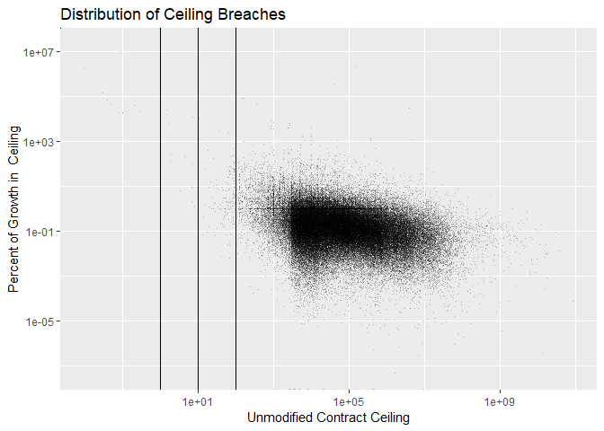
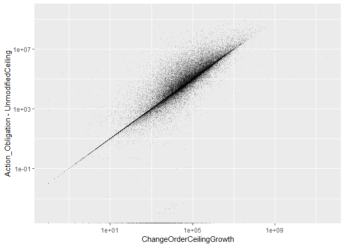
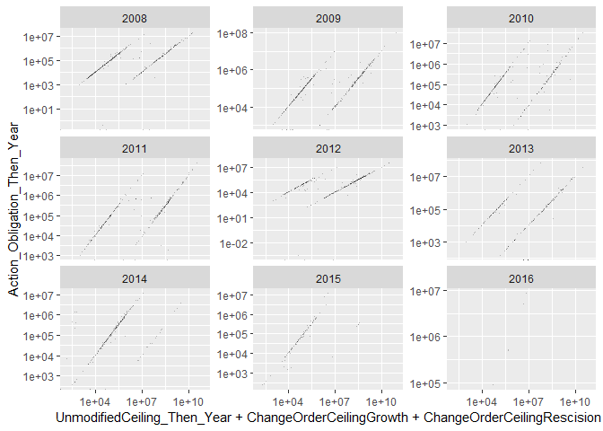
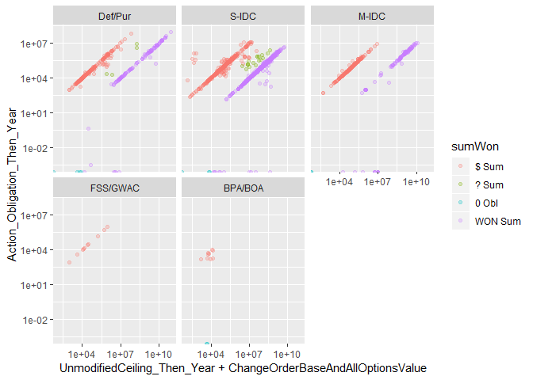
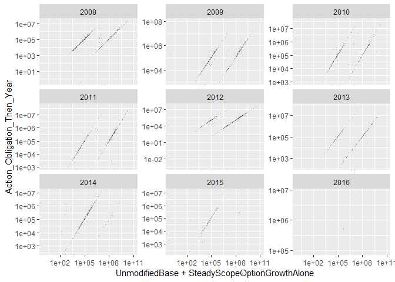
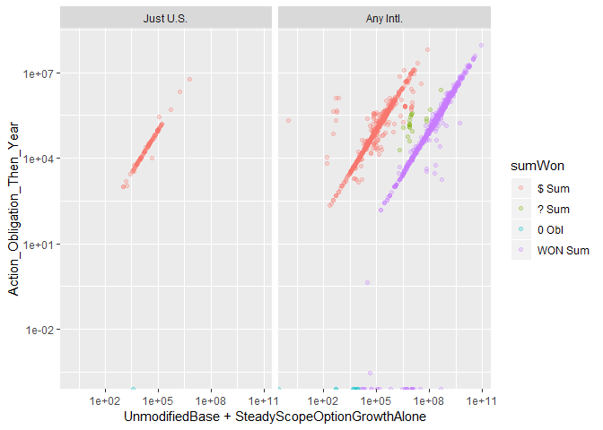
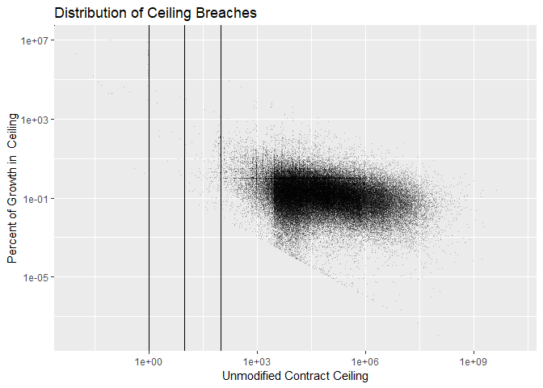
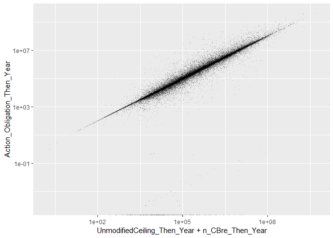
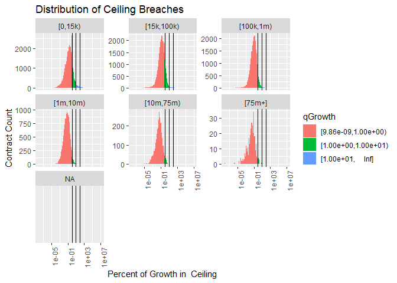
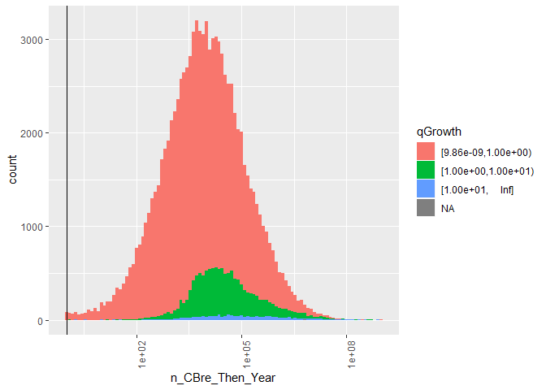

#Setup

```
## Warning: replacing previous import 'Hmisc::summarize' by 'dplyr::summarize'
## when loading 'csis360'
```

```
## Warning: replacing previous import 'Hmisc::src' by 'dplyr::src' when
## loading 'csis360'
```

```
## Warning: replacing previous import 'dplyr::intersect' by
## 'lubridate::intersect' when loading 'csis360'
```

```
## Warning: replacing previous import 'dplyr::union' by 'lubridate::union'
## when loading 'csis360'
```

```
## Warning: replacing previous import 'dplyr::setdiff' by 'lubridate::setdiff'
## when loading 'csis360'
```

```
## 
## Attaching package: 'dplyr'
```

```
## The following objects are masked from 'package:stats':
## 
##     filter, lag
```

```
## The following objects are masked from 'package:base':
## 
##     intersect, setdiff, setequal, union
```

```
## Loading required package: MASS
```

```
## 
## Attaching package: 'MASS'
```

```
## The following object is masked from 'package:dplyr':
## 
##     select
```

```
## Loading required package: Matrix
```

```
## Loading required package: lme4
```

```
## 
## arm (Version 1.10-1, built: 2018-4-12)
```

```
## Working directory is C:/Users/gsand/Repositories/Vendor/scripts
```

```
## Loading required package: coda
```

```
## 
## Attaching package: 'coda'
```

```
## The following object is masked from 'package:arm':
## 
##     traceplot
```

```
## Loading required package: boot
```

```
## 
## Attaching package: 'boot'
```

```
## The following object is masked from 'package:arm':
## 
##     logit
```

```
## 
## Please cite as:
```

```
##  Hlavac, Marek (2018). stargazer: Well-Formatted Regression and Summary Statistics Tables.
```

```
##  R package version 5.2.2. https://CRAN.R-project.org/package=stargazer
```

```
## Version:  1.36.23
## Date:     2017-03-03
## Author:   Philip Leifeld (University of Glasgow)
## 
## Please cite the JSS article in your publications -- see citation("texreg").
```

```
## 
## Attaching package: 'texreg'
```

```
## The following object is masked from 'package:arm':
## 
##     coefplot
```

```
## Loading required package: carData
```

```
## 
## Attaching package: 'car'
```

```
## The following object is masked from 'package:boot':
## 
##     logit
```

```
## The following object is masked from 'package:arm':
## 
##     logit
```

```
## The following object is masked from 'package:dplyr':
## 
##     recode
```

```
## 
## Attaching package: 'scales'
```

```
## The following object is masked from 'package:arm':
## 
##     rescale
```


```r
# load(file="../Data/Clean/transformed_def.Rdata")
load(file="..\\data\\semi_clean\\CBre_pre_clean.rdata")
# W912UM <- def %>% filter(Office=="W912UM")
# W912UMtrans<-read.delim(file="..\\data\\semi_clean\\W912UM_trans.csv", sep=",")
# W912UMtrans<-remove_bom(W912UMtrans)
# cbre_preclean<-def %>% filter(b_CBre==1)
# cbre_preclean$qGrowth<-Hmisc::cut2(cbre_preclean$p_CBre-1,c(1,10))
# summary(cbre_preclean$qGrowth)
# save(W912UM,W912UMtrans,cbre_preclean,file="..\\data\\semi_clean\\CBre_pre_clean.rdata")

# colnames(W912UM)[colnames(W912UM)=="UnmodifiedCeiling_Then_Year"]<-"UnmodifiedCeiling"
# debug(input_contract_delta)
# W912UM<-input_contract_delta(W912UM,
#              file="Contract.SP_ContractModificationDeltaCustomer.txt")
# colnames(W912UM)[colnames(W912UM)=="UnmodifiedCeiling"]<-"UnmodifiedCeiling_Then_Year"
# debug(read_and_join_experiment)
  # W912UM<-read_and_join_experiment( W912UM,
  #                                       "Contract.sp_ContractExercisedOptions.txt",
  #                                       path="",
  #                                       directory="..\\data\\semi_clean\\",
  #                                       by=c("CSIScontractID"),
  #                                       add_var=c("AnyUnmodifiedUnexercisedOptions",
  #                                                 "AnyUnmodifiedUnexercisedOptionsWhy",
  #                                                 "UnmodifiedBase",
  #                                                 "SteadyScopeOptionGrowthAlone",
  #                                                 "SteadyScopeOptionRescision",
  #                                                 "AdminOptionModification"),
  #                                       new_var_checked=FALSE,
  #                                       create_lookup_rdata=TRUE,
  #                                       lookup_char_as_factor=TRUE)
```


# Before Cleaning

```r
nrow(cbre_preclean %>% filter((p_CBre-1)>1))
```

```
## [1] 11954
```

```r
nrow(cbre_preclean %>% filter((p_CBre-1)>10))
```

```
## [1] 1462
```

```r
nrow(cbre_preclean %>% filter((p_CBre-1)>100))
```

```
## [1] 419
```

```r
nrow(cbre_preclean %>% filter((p_CBre-1)>100 & UnmodifiedCeiling_Then_Year<=0))
```

```
## [1] 232
```

```r
summary(cbre_preclean$Ceil[(cbre_preclean$p_CBre-1)>10 & cbre_preclean$UnmodifiedCeiling_Then_Year>0])
```

```
##    [0,15k) [15k,100k)  [100k,1m)   [1m,10m)  [10m,75m)     [75m+] 
##        859        213        120         34          4          0
```

```r
summary(cbre_preclean$Ceil[(cbre_preclean$p_CBre-1)>100 & cbre_preclean$UnmodifiedCeiling_Then_Year>0])
```

```
##    [0,15k) [15k,100k)  [100k,1m)   [1m,10m)  [10m,75m)     [75m+] 
##        138         32         15          2          0          0
```

```r
cbre_preclean$Why_Outlier<-NA
cbre_preclean$Why_Outlier[cbre_preclean$UnmodifiedCeiling_Then_Year<=0]<-"No Unmodified Ceiling"
cbre_preclean$Why_Outlier[is.na(cbre_preclean$Why_Outlier)&
                            cbre_preclean$Action_Obligation_Then_Year*2>=cbre_preclean$UnmodifiedCeiling_Then_Year+
                            cbre_preclean$n_CBre]<-
  "Obligations at least half Orig+CRai"
cbre_preclean$Why_Outlier[is.na(cbre_preclean$Why_Outlier)&
                            cbre_preclean$Office=="W912UM"]<-
  "Korean Office W912UM"
cbre_preclean$Why_Outlier[is.na(cbre_preclean$Why_Outlier)&
                            cbre_preclean$n_CBre>=2.5e8]<-
  ">=$250M, Insepect"
cbre_preclean$Why_Outlier[is.na(cbre_preclean$Why_Outlier)&
                            cbre_preclean$p_CBre-1>10]<-
  "Other Unexplained 10x Ceiling Breach"
cbre_preclean$Why_Outlier<-factor(cbre_preclean$Why_Outlier,
                                  levels=c(
                                    "No Unmodified Ceiling",
                                    "Obligations at least half Orig+CRai",
                                    "Later Deobligated",
                                    "Korean Office W912UM",
                                    ">=$250M, Insepect",
                                    "Other Unexplained 10x Ceiling Breach"
                                  ))
summary(cbre_preclean$Why_Outlier[(cbre_preclean$p_CBre-1)>10])
```

```
##                No Unmodified Ceiling  Obligations at least half Orig+CRai 
##                                  232                                 1146 
##                    Later Deobligated                 Korean Office W912UM 
##                                    0                                   11 
##                    >=$250M, Insepect Other Unexplained 10x Ceiling Breach 
##                                    5                                   68
```

```r
summary(cbre_preclean$Why_Outlier)
```

```
##                No Unmodified Ceiling  Obligations at least half Orig+CRai 
##                                  232                                91626 
##                    Later Deobligated                 Korean Office W912UM 
##                                    0                                  198 
##                    >=$250M, Insepect Other Unexplained 10x Ceiling Breach 
##                                    8                                   68 
##                                 NA's 
##                                 2358
```

```r
p_outlier_summary<-cbre_preclean %>% filter(p_CBre-1>10) %>% group_by(Why_Outlier) %>%
  dplyr::summarise(nContract=length(n_CBre),
                   SumOfChangeOrderCeilingGrowth=sum(n_CBre),
                   MaxOfChangeOrderCeilingGrowth=max(n_CBre),
                   SumOfAction_Obligation_Then_Year=sum(Action_Obligation_Then_Year))


n_outlier_summary<-cbre_preclean %>% filter(n_CBre>2.5e8) %>% group_by(Why_Outlier) %>%
  dplyr::summarise(nContract=length(n_CBre),
                   SumOfChangeOrderCeilingGrowth=sum(n_CBre),
                   MaxOfChangeOrderCeilingGrowth=max(n_CBre),
                   SumOfAction_Obligation_Then_Year=sum(Action_Obligation_Then_Year))


summary(Hmisc::cut2(cbre_preclean$n_CBre,c(1e3,
                                           1e6,
                                           1e7,
                                           1e8,
                                           2.5e8,
                                           1e9,
                                           1e10,
                                           2e10
)))
```

```
## [1.00e-02,1.00e+03) [1.00e+03,1.00e+06) [1.00e+06,1.00e+07) 
##               18238               72053                3517 
## [1.00e+07,1.00e+08) [1.00e+08,2.50e+08) [2.50e+08,1.00e+09) 
##                 571                  67                  32 
## [1.00e+09,1.00e+10) [1.00e+10,2.00e+10) [2.00e+10,3.45e+11] 
##                   9                   1                   2
```

```r
summary(cbre_preclean$Ceil[cbre_preclean$n_CBre>=1e6])
```

```
##    [0,15k) [15k,100k)  [100k,1m)   [1m,10m)  [10m,75m)     [75m+] 
##         59         97        488       1777       1366        412
```

```r
summary(cbre_preclean$Ceil[cbre_preclean$n_CBre>=1e9])
```

```
##    [0,15k) [15k,100k)  [100k,1m)   [1m,10m)  [10m,75m)     [75m+] 
##          0          1          1          2          0          8
```

```r
write.csv(file="..\\Data\\semi_clean\\p_CBre_outliers.csv",cbre_preclean %>% filter((p_CBre-1)>10),row.names = FALSE)
write.csv(file="..\\Data\\semi_clean\\n_CBre_outliers.csv",cbre_preclean %>% filter(n_CBre>=2.5e8),row.names = FALSE)
```
Examining cases of large ceiling growth, 1462 contracts experienced greater than 10 fold growth. An increase of that side strains credulity, even in high risk defense contracting. While by no means impossible, the more likely explaination is a misrecorded initial ceiling.

The study team broke down the outliers into 6 categories:


Why_Outlier                             nContract   SumOfChangeOrderCeilingGrowth   MaxOfChangeOrderCeilingGrowth   SumOfAction_Obligation_Then_Year
-------------------------------------  ----------  ------------------------------  ------------------------------  ---------------------------------
No Unmodified Ceiling                         232                        81591718                        20862815                          383117339
Obligations at least half Orig+CRai          1146                      4418306936                       769789464                         8799240742
Korean Office W912UM                           11                      7681224515                      5364187370                           16969010
>=$250M, Insepect                               5                    476290148280                    344739578535                           29052394
Other Unexplained 10x Ceiling Breach           68                       484851277                        95979870                           86701052


* No Unmodified Ceiling: Contracts with an initial ceiling <=0. These are eliminated from the sample as missing data.
* Obligations at least half Orig+CRai: For this category, total obligations of the contract were at least half the value of the initial ceiling plus ceiling growth under change orders. These contrats have had spending that massively exceeded their original ceiling, so the growth in absolute terrms seems plausible. This category accounts for the overwhelming majority of outlier spending but only a tiny fraction of change order growth.
* Later Deobligated: The change order growth metrics only counts increases. These may simply have been mistaken increases, as when including deobligation the growth no longer exceeded 10x the original ceiling. The number, obligations, and change order growth of these contracts are comparatively small, and thus should not distort the overall data.
* Korean Office W912UM refers to a contracting office that sometimes records base and all options values in Korean Won, approximate exchange rate 1,000 Won : 1 USD. 
* There are nrow(cbre_preclean %>% dplyr::filter(Why_Outlier ==">=$250M, Insepect" & (p_CBre-1)>10)) contracts with ceiling growth of over $250 million that account for hundreds of billions in change order growth. These merit manual inspection.
* Finally a few score contrats have unexplained growth, but remain below the $10M threshold. The quantity and magnitude of these contrats is not sufficient to risk the overall model.

This examination left the study team less confident in percentage growth as a metric, especially in extreme cases, while increasing the study team's confidence in measures of growth in absoute term. In the worst case, simply removing all of the unexplained over  10 million contracts from the sample would reduce the number of contracts by a tiny amount and reduce the spending accounted for by  2.9052394\times 10^{7}.

Shifting the focus to all contracts with growth of at least 250 million, there are far fewer contracts that account for far more money.


Why_Outlier                            nContract   SumOfChangeOrderCeilingGrowth   MaxOfChangeOrderCeilingGrowth   SumOfAction_Obligation_Then_Year
------------------------------------  ----------  ------------------------------  ------------------------------  ---------------------------------
Obligations at least half Orig+CRai           11                      5525269281                       992698908                        16999937992
Korean Office W912UM                          24                     27401542851                      5364187370                          197697808
>=$250M, Insepect                              8                    479197384535                    344739578535                         1611779996


Inspecting W912UM, either to remove or fix its oversized growth, is an imperative as it accounts for the majority of these contracts or task orders. Even so, there are still 8 That merit special inspection for given that there growth far outpaces their spending.

## Ceiling Change Checksum

```r
# load(file="..\\data\\clean\\defense_contract_all_detail.Rdata")
# 
# if(any(
#   def_all$UnmodifiedCeiling+
#   def_all$ChangeOrderCeilingGrowth+
#   def_all$ChangeOrderCeilingRescision+
#     def_all$AdminCeilingModification+
#     def_all$EndingCeilingModification+
#     def_all$OtherCeilingModification!=
#     def_all$SumOfBaseandalloptionsvalue
# )) stop("Ceiling Modification Checksum failure.")
  # rm(def_all)
#Cn't do this yet, need SumOfBaseandalloptionsvalue
```


## Ceiling Growth

```r
(
  ggplot(cbre_preclean, aes(x=UnmodifiedCeiling_Then_Year,y=p_CBre-1)) +#,color=qGrowth
    geom_point(alpha=0.25,shape=".")+
    # theme(axis.text.x = element_text(angle = 90, hjust = 1))+
    scale_x_log10()+scale_y_log10()+
    #+
    geom_vline(xintercept = c(1,10,100))+#+geom_vline(xintercept = 0.1)+
    # facet_wrap(~Ceil,scales="free_y")+#+, space="free_y"
    labs(title="Distribution of Ceiling Breaches",
         y="Percent of Growth in  Ceiling",
         x="Unmodified Contract Ceiling")#,
  # fill="Termination Completion"
)
```

```
## Warning: Transformation introduced infinite values in continuous x-axis
```

<!-- -->

```r
(
  ggplot(cbre_preclean, aes(x=UnmodifiedCeiling_Then_Year,y=n_CBre)) +#,color=qGrowth
    geom_point(alpha=0.25,shape=".")+
    # theme(axis.text.x = element_text(angle = 90, hjust = 1))+
    scale_x_log10()+scale_y_log10()+
    #+
    geom_vline(xintercept = c(1,10,100))+#+geom_vline(xintercept = 0.1)+
    # facet_wrap(~Ceil,scales="free_y")+#+, space="free_y"
    labs(title="Distribution of Ceiling Breaches",
         y="Absolute Growth in  Ceiling",
         x="Unmodified Contract Ceiling")#,
  # fill="Termination Completion"
)
```

```
## Warning: Transformation introduced infinite values in continuous x-axis
```

<!-- -->

```r
(
  ggplot(cbre_preclean, aes(x=UnmodifiedCeiling_Then_Year+ChangeOrderCeilingGrowth+ChangeOrderCeilingRescision,y=Action_Obligation_Then_Year)) +#,color=qGrowth
    geom_point(alpha=0.25,shape=".")+
    # theme(axis.text.x = element_text(angle = 90, hjust = 1))+
    scale_x_log10()+scale_y_log10()#+
  #+
  #   geom_vline(xintercept = c(1,10,100))+#+geom_vline(xintercept = 0.1)+
  # # facet_wrap(~Ceil,scales="free_y")+#+, space="free_y"
  #   labs(title="Distribution of Ceiling Breaches",
  #        y="Percent of Growth in  Ceiling",
  #        x="Unmodified Contract Ceiling")#,
  #        # fill="Termination Completion"
)
```

```
## Warning in self$trans$transform(x): NaNs produced
```

```
## Warning: Transformation introduced infinite values in continuous y-axis
```

```
## Warning: Removed 24 rows containing missing values (geom_point).
```

<!-- -->

```r
summary(cbre_preclean$ChangeOrderCeilingGrowth)
```

```
##      Min.   1st Qu.    Median      Mean   3rd Qu.      Max. 
## 0.000e+00 1.664e+03 9.600e+03 5.865e+06 5.483e+04 3.447e+11
```

```r
summary(cbre_preclean$ChangeOrderCeilingRescision)
```

```
##       Min.    1st Qu.     Median       Mean    3rd Qu.       Max. 
## -510889128          0          0     -41803          0          0
```

```r
(
  ggplot(cbre_preclean, aes(x=n_CBre,y=ChangeOrderCeilingGrowth+ChangeOrderCeilingRescision)) +#,color=qGrowth
    geom_point(alpha=0.25,shape=".")+
    # theme(axis.text.x = element_text(angle = 90, hjust = 1))+
    scale_x_log10()+scale_y_log10()#+
  #+
  #   geom_vline(xintercept = c(1,10,100))+#+geom_vline(xintercept = 0.1)+
  # # facet_wrap(~Ceil,scales="free_y")+#+, space="free_y"
  #   labs(title="Distribution of Ceiling Breaches",
  #        y="Percent of Growth in  Ceiling",
  #        x="Unmodified Contract Ceiling")#,
  #        # fill="Termination Completion"
)
```

<!-- -->

```r
(
  ggplot(cbre_preclean, aes(x=p_CBre-1,fill=qGrowth)) +
    geom_histogram(bins=100)+
    theme(axis.text.x = element_text(angle = 90, hjust = 1))+
    scale_x_log10()+
    #+
    geom_vline(xintercept = c(1,10,100))+#+geom_vline(xintercept = 0.1)+
    facet_wrap(~Ceil,scales="free_y")+#+, space="free_y"
    labs(title="Distribution of Ceiling Breaches",
         y="Contract Count",
         x="Percent of Growth in  Ceiling")#,
  # fill="Termination Completion"
)
```

```
## Warning: Removed 232 rows containing non-finite values (stat_bin).
```

<!-- -->

```r
(
  ggplot(cbre_preclean, aes(x=n_CBre,fill=qGrowth)) +
    geom_histogram(bins=100)+
    theme(axis.text.x = element_text(angle = 90, hjust = 1))+
    scale_x_log10()+
    #+
    geom_vline(xintercept = 1)#+geom_vline(xintercept = 0.1)+
  #facet_grid(NoPreTermObl~.,scales="free_y", space="free_y")+
  # labs(title="Distribution of Contracts with Obligations After Last termination",
  #      y="Contract Count",
  #      x="Percent of Obligations After Day of Termination",
  #      fill="Termination Completion"
)
```

<!-- -->

```r
(
  ggplot(cbre_preclean, aes(x=n_CBre,fill=qGrowth)) +
    geom_histogram(bins=100)+
    theme(axis.text.x = element_text(angle = 90, hjust = 1))+
    scale_x_log10()+
    #+
    geom_vline(xintercept = 1)+
    facet_wrap(~Ceil,scales="free_y")#+, space="free_y"
  #+geom_vline(xintercept = 0.1)+
  #facet_grid(NoPreTermObl~.,scales="free_y", space="free_y")+
  # labs(title="Distribution of Contracts with Obligations After Last termination",
  #      y="Contract Count",
  #      x="Percent of Obligations After Day of Termination",
  #      fill="Termination Completion"
)
```

<!-- -->

## >250 Inspect

```r
inspect250<-cbre_preclean %>% filter(Why_Outlier==">=$250M, Insepect")
inspect250trans<-read.delim(file="..\\data\\semi_clean\\gt250k_change_outliers.txt", sep="\t")

inspect250trans %>% group_by(CSIScontractID)
```

```
## # A tibble: 192 x 253
## # Groups:   CSIScontractID [8]
##    ï..unique_trans~ transaction_sta~ obligatedamount baseandexercise~
##    <fct>            <fct>                      <dbl>            <dbl>
##  1 adce4f89-8327-c~ Active                    50106            50106 
##  2 2703255d-eb32-a~ Active                        0                0 
##  3 13270f71-3154-9~ Active                   109475           109475 
##  4 6c7c1d74-bce3-2~ Active                        0           362176 
##  5 01657f4b-32d0-5~ Active                  -336157.         -336157.
##  6 49bd1c7d-08f9-5~ Active                   133496           133496 
##  7 8000a003-96e9-6~ Active                245250000        575000000 
##  8 76dc0e64-d385-b~ Active                    45000            45000 
##  9 7987edff-c34b-8~ Active                   246970.     13513049088 
## 10 1800c42c-6e27-3~ Active                   110000                0 
## # ... with 182 more rows, and 249 more variables:
## #   baseandalloptionsvalue <dbl>, maj_agency_cat <int>, mod_agency <int>,
## #   maj_fund_agency_cat <int>, contractingofficeagencyid <int>,
## #   contractingofficeid <fct>, fundingrequestingagencyid <int>,
## #   fundingrequestingofficeid <fct>, fundedbyforeignentity <fct>,
## #   signeddate <fct>, effectivedate <fct>, currentcompletiondate <fct>,
## #   ultimatecompletiondate <fct>, lastdatetoorder <fct>,
## #   contractactiontype <fct>, reasonformodification <fct>,
## #   typeofcontractpricing <fct>, priceevaluationpercentdifference <int>,
## #   subcontractplan <fct>, lettercontract <fct>, multiyearcontract <int>,
## #   performancebasedservicecontract <fct>, majorprogramcode <lgl>,
## #   contingencyhumanitarianpeacekeepingoperation <fct>,
## #   contractfinancing <fct>, costorpricingdata <fct>,
## #   costaccountingstandardsclause <fct>,
## #   descriptionofcontractrequirement <fct>,
## #   purchasecardaspaymentmethod <int>, nationalinterestactioncode <fct>,
## #   progsourceagency <int>, progsourceaccount <int>,
## #   progsourcesubacct <lgl>, account_title <lgl>, rec_flag <lgl>,
## #   typeofidc <lgl>, multipleorsingleawardidc <lgl>, programacronym <lgl>,
## #   vendorname <fct>, vendoralternatename <fct>,
## #   vendorlegalorganizationname <fct>, vendordoingasbusinessname <lgl>,
## #   divisionname <lgl>, divisionnumberorofficecode <lgl>,
## #   ccrexception <lgl>, streetaddress <fct>, streetaddress2 <lgl>,
## #   streetaddress3 <lgl>, city <fct>, zipcode <int>,
## #   vendorcountrycode <fct>, vendor_state_code <fct>, vendor_cd <int>,
## #   vendorsitecode <fct>, vendoralternatesitecode <int>, dunsnumber <int>,
## #   parentdunsnumber <int>, phoneno <dbl>, faxno <dbl>,
## #   registrationdate <fct>, renewaldate <fct>, mod_parent <fct>,
## #   locationcode <int>, statecode <fct>, pop_state_code <fct>,
## #   placeofperformancecountrycode <fct>, placeofperformancezipcode <int>,
## #   placeofperformancecongressionaldistrict <fct>, psc_cat <fct>,
## #   productorservicecode <fct>, systemequipmentcode <int>,
## #   claimantprogramcode <fct>, principalnaicscode <int>,
## #   informationtechnologycommercialitemcategory <fct>, gfe_gfp_code <fct>,
## #   useofepadesignatedproducts <fct>, recoveredmaterialclauses <fct>,
## #   seatransportation <fct>, contractbundling <fct>,
## #   consolidatedcontract <fct>, countryoforigin <fct>,
## #   placeofmanufacture <fct>, manufacturingorganizationtype <fct>,
## #   agencyid <int>, piid <fct>, modnumber <fct>, transactionnumber <int>,
## #   fiscal_year <int>, idvagencyid <int>, idvpiid <fct>,
## #   idvmodificationnumber <fct>, solicitationid <fct>,
## #   extentcompeted <fct>, reasonnotcompeted <fct>,
## #   numberofoffersreceived <int>,
## #   commercialitemacquisitionprocedures <fct>,
## #   commercialitemtestprogram <int>,
## #   smallbusinesscompetitivenessdemonstrationprogram <fct>,
## #   a76action <fct>, solicitationprocedures <fct>, ...
```

```r
#This is obviously unfinished, just  managed the download  this morning
```
CSIScontractID 1431340 IDV -- FA881111C0001. This is a MDAP "LETTER CONTRACT FOR MUOS-2, WGS-6, NROL-65" The massive change order is for "FY 12 ATLAS-V MISSIONS AND FY12 DELTA IV MISSIONS" This is later descreased for "TRANSFER THE FY-12 MISSIONS OFF THIS CONTRACT AND RE-ALIGN ONTO CONTRACT FA8811-13-C-0002 FOR ADMINISTRATIVE PURPOSES." and "DEFINITIZATION OF DELTA IV ELS UCA MISSIONS: NROL-65, WGS-6, AND WGS-5" before being increased again for "DEFINITIZE ATLAS FY 12 LAUNCH SERVICE MISSIONS INITIALLY AWARDED VIA P00012". Thus the amounts seem entirely realistic.

CSIScontractID 8341560 IDV -- PIID W912GB09C0090. "FIELD MODIFICATION A00002, CR 002 CONVOY LIVE FIRE RANGE" with 344 billion increase immediately rescinded "ADMINISTRATIVE MODIFICATION TO CORRECT TYPOGRAPHICAL ERROR ON PRIOR MODIFICATION. THIS CONTRACT ACTION IS GOVERNED BY THE ABG75 PROCESS AND NOT THE FAR." which was an other administrative action. Overriding.

CSIScontractID 10090818 IDV FA860410D7045 / PIID 1 "DESCOPE CLINS 1001,2001,3001,4001,  5001 AND ADD NEW REVISED PWS 0001" is a single transaction responsible for  289,097,216 increase. Software development "ADP SYSTEMS DEVELOPMENT SERVICES" Seems improbable, especially considering there's a ceiling increase that's literally one percent of the size in the next transaction, but the evidence isn't overwhelmiing


CSIScontractID 19005830 IDV N4008005D3501 / PIID 87
$13 billion ceiling for "MISC SERVICE & TRADE EQ" / "FFP BASE OPERATIONS SUPPORT SERVICES FOR PHASE IN PERIOD OF 01/01/2012 - 02/29/2012." Seems safely classified as a mistake even absent any subsequent correction.

CSIScontractID 24816950 IDV W912HN07D0061 / PIID 4
"PROJECT NUMBER 71657, STARSHIP 11000 REPAIR, FORT JACKSON, SC"

CSIS contractID 24719937 IDV W9126G08D0016 / PIID 1
Construction of "STUDENT DORMITORIES 1 & 2" 447M corrected by the next transaction in an other administrative action.


## W912IM

### Contract Initial Examination

#### Ceiling/Change Orders  

```r
sum(W912UM$Action_Obligation_Then_Year[])
```

```
## [1] 1441699342
```

```r
(
  ggplot(W912UM, aes(x=UnmodifiedCeiling_Then_Year+ChangeOrderCeilingGrowth+ChangeOrderCeilingRescision,y=Action_Obligation_Then_Year)) +#,color=qGrowth
    geom_point(alpha=0.25,shape=".")+
    # theme(axis.text.x = element_text(angle = 90, hjust = 1))+
    scale_x_log10()+scale_y_log10()+
    #+
    #   geom_vline(xintercept = c(1,10,100))+#+geom_vline(xintercept = 0.1)+
    facet_wrap(~StartFY,scales="free_y")#+, space="free_y"
  #   labs(title="Distribution of Ceiling Breaches",
  #        y="Percent of Growth in  Ceiling",
  #        x="Unmodified Contract Ceiling")#,
  #        # fill="Termination Completion"
)
```

```
## Warning in self$trans$transform(x): NaNs produced
```

```
## Warning: Transformation introduced infinite values in continuous x-axis
```

```
## Warning: Transformation introduced infinite values in continuous y-axis
```

```
## Warning: Removed 4 rows containing missing values (geom_point).
```

<!-- -->

```r
summary(W912UM$UnmodifiedCeiling_Then_Year)
```

```
##      Min.   1st Qu.    Median      Mean   3rd Qu.      Max. 
## 0.000e+00 6.052e+04 4.989e+05 4.717e+08 1.341e+08 8.548e+10
```

```r
W912UM$unmodWon<-NA
W912UM$unmodWon[W912UM$UnmodifiedCeiling_Then_Year>=W912UM$Action_Obligation_Then_Year*400&
                  W912UM$Action_Obligation_Then_Year>0]<-'WON Unm'
W912UM$unmodWon[is.na(W912UM$unmodWon) &
                  W912UM$UnmodifiedCeiling_Then_Year>=W912UM$Action_Obligation_Then_Year*20 &
                  W912UM$UnmodifiedCeiling_Then_Year>10000
                ]<-'? Unm'
W912UM$unmodWon[is.na(W912UM$unmodWon) &
                  (W912UM$UnmodifiedCeiling_Then_Year<W912UM$Action_Obligation_Then_Year*20|
                     W912UM$UnmodifiedCeiling_Then_Year<10000)]<-'$ Unm'
summary(factor(W912UM$unmodWon))
```

```
##   $ Unm   ? Unm WON Unm 
##    1083      48     805
```

```r
W912UM$changeWon<-NA
W912UM$changeWon[abs(W912UM$ChangeOrderCeilingGrowth+W912UM$ChangeOrderCeilingRescision)==0]<-'0 Chg'
W912UM$changeWon[abs(W912UM$ChangeOrderCeilingGrowth+W912UM$ChangeOrderCeilingRescision)>=W912UM$Action_Obligation_Then_Year*100&
                   W912UM$ChangeOrderCeilingGrowth+W912UM$ChangeOrderCeilingRescision>10000]<-'WON Chg'
W912UM$changeWon[is.na(W912UM$changeWon) &
                   abs(W912UM$ChangeOrderCeilingGrowth+W912UM$ChangeOrderCeilingRescision)>=W912UM$Action_Obligation_Then_Year*10&
                   W912UM$ChangeOrderCeilingGrowth+W912UM$ChangeOrderCeilingRescision>10000]<-'? Chg'
W912UM$changeWon[is.na(W912UM$changeWon) &
                   (abs(W912UM$ChangeOrderCeilingGrowth+W912UM$ChangeOrderCeilingRescision)<W912UM$Action_Obligation_Then_Year*10|
                      W912UM$ChangeOrderCeilingGrowth+W912UM$ChangeOrderCeilingRescision<=10000)]<-'$ Chg'
summary(factor(W912UM$changeWon))
```

```
##   $ Chg   ? Chg   0 Chg WON Chg 
##     177      95    1587      77
```

```r
W912UM$sumWon<-NA
W912UM$sumWon[W912UM$Action_Obligation_Then_Year==0]<-'0 Obl'
W912UM$sumWon[W912UM$UnmodifiedCeiling_Then_Year+
                W912UM$ChangeOrderCeilingGrowth+W912UM$ChangeOrderCeilingRescision>=W912UM$Action_Obligation_Then_Year*400&
                W912UM$UnmodifiedCeiling_Then_Year+
                W912UM$ChangeOrderCeilingGrowth+W912UM$ChangeOrderCeilingRescision>10000]<-'WON Sum'
W912UM$sumWon[is.na(W912UM$sumWon) &
                W912UM$UnmodifiedCeiling_Then_Year+
                W912UM$ChangeOrderCeilingGrowth+W912UM$ChangeOrderCeilingRescision>=W912UM$Action_Obligation_Then_Year*20&
                W912UM$UnmodifiedCeiling_Then_Year+
                W912UM$ChangeOrderCeilingGrowth+W912UM$ChangeOrderCeilingRescision>10000]<-'? Sum'
W912UM$sumWon[is.na(W912UM$sumWon) &
                (W912UM$UnmodifiedCeiling_Then_Year+
                   W912UM$ChangeOrderCeilingGrowth+W912UM$ChangeOrderCeilingRescision<W912UM$Action_Obligation_Then_Year*20|
                   W912UM$UnmodifiedCeiling_Then_Year+
                   W912UM$ChangeOrderCeilingGrowth+W912UM$ChangeOrderCeilingRescision>10000)]<-'$ Sum'
summary(factor(W912UM$sumWon))
```

```
##   $ Sum   ? Sum   0 Obl WON Sum 
##    1062      22      11     841
```

```r
(
  ggplot(W912UM, aes(x=UnmodifiedCeiling_Then_Year+ChangeOrderBaseAndAllOptionsValue,y=Action_Obligation_Then_Year,color=sumWon)) +#,color=qGrowth
    geom_point(alpha=0.25)+
    # theme(axis.text.x = element_text(angle = 90, hjust = 1))+
    scale_x_log10()+scale_y_log10()+
    #+
    #   geom_vline(xintercept = c(1,10,100))+#+geom_vline(xintercept = 0.1)+
    facet_grid(unmodWon~changeWon)#+, space="free_y"
  #   labs(title="Distribution of Ceiling Breaches",
  #        y="Percent of Growth in  Ceiling",
  #        x="Unmodified Contract Ceiling")#,
  #        # fill="Termination Completion"
)
```

```
## Warning in self$trans$transform(x): NaNs produced
```

```
## Warning: Transformation introduced infinite values in continuous x-axis
```

```
## Warning: Transformation introduced infinite values in continuous y-axis
```

```
## Warning: Removed 4 rows containing missing values (geom_point).
```

<!-- -->

```r
(
  ggplot(W912UM, aes(x=UnmodifiedCeiling_Then_Year+ChangeOrderBaseAndAllOptionsValue,y=Action_Obligation_Then_Year,color=sumWon)) +#,color=qGrowth
    geom_point(alpha=0.25)+
    # theme(axis.text.x = element_text(angle = 90, hjust = 1))+
    scale_x_log10()+scale_y_log10()+
    #+
    #   geom_vline(xintercept = c(1,10,100))+#+geom_vline(xintercept = 0.1)+
    facet_wrap(~Veh)#+, space="free_y"
  #   labs(title="Distribution of Ceiling Breaches",
  #        y="Percent of Growth in  Ceiling",
  #        x="Unmodified Contract Ceiling")#,
  #        # fill="Termination Completion"
)
```

```
## Warning in self$trans$transform(x): NaNs produced
```

```
## Warning: Transformation introduced infinite values in continuous x-axis
```

```
## Warning: Transformation introduced infinite values in continuous y-axis
```

```
## Warning: Removed 4 rows containing missing values (geom_point).
```

<!-- -->

```r
(
  ggplot(W912UM, aes(x=UnmodifiedCeiling_Then_Year+ChangeOrderCeilingGrowth+ChangeOrderCeilingRescision,y=Action_Obligation_Then_Year,color=sumWon)) +#,color=qGrowth
    geom_point(alpha=0.25)+
    # theme(axis.text.x = element_text(angle = 90, hjust = 1))+
    scale_x_log10()+scale_y_log10()+
    #+
    #   geom_vline(xintercept = c(1,10,100))+#+geom_vline(xintercept = 0.1)+
    facet_wrap(~Intl)#+, space="free_y"
  #   labs(title="Distribution of Ceiling Breaches",
  #        y="Percent of Growth in  Ceiling",
  #        x="Unmodified Contract Ceiling")#,
  #        # fill="Termination Completion"
)
```

```
## Warning in self$trans$transform(x): NaNs produced
```

```
## Warning: Transformation introduced infinite values in continuous x-axis
```

```
## Warning: Transformation introduced infinite values in continuous y-axis
```

```
## Warning: Removed 4 rows containing missing values (geom_point).
```

<!-- -->

```r
summary(W912UM$Intl)
```

```
## Just U.S. Any Intl. 
##       111      1825
```

```r
W912UM$unmodWon<-factor(W912UM$unmodWon)
summary(W912UM$Veh)
```

```
##  Def/Pur    S-IDC    M-IDC FSS/GWAC  BPA/BOA 
##      354     1290      271       10       11
```

```r
summary(W912UM$unmodWon)
```

```
##   $ Unm   ? Unm WON Unm 
##    1083      48     805
```

```r
summary(factor(W912UM$changeWon))
```

```
##   $ Chg   ? Chg   0 Chg WON Chg 
##     177      95    1587      77
```

```r
statsummary_discrete(c("unmodWon"), W912UM %>% filter(Intl=="Any Intl."&
                                                        !Veh %in% c("FSS/GWAC","BPA/BOA")),
                     value_col="Action_Obligation_Then_Year")
```

```
##   unmodWon %of records % of $s
## 1    $ Unm      52.80%  35.56%
## 2    ? Unm       2.66%   0.40%
## 3  WON Unm      44.55%  64.03%
```

All of the questionable contracts take place internationally and none use BPA/BOA or FSS/GWACs. That makes sense and raises confidence, but given that the clearly USD contract categories are less common, this doesn't help in resolving the ambiguous cases. That said, Single Award IDCs appear to have most of the ambigious cases, which suggests that this might be resolvable by looking at parent IDVs in those cases. 

#### Base/Options

```r
(
  ggplot(W912UM, aes(x=UnmodifiedBase+SteadyScopeOptionGrowthAlone,y=Action_Obligation_Then_Year)) +#,color=q_OptGrowth
    geom_point(alpha=0.25,shape=".")+
    # theme(axis.text.x = element_text(angle = 90, hjust = 1))+
    scale_x_log10()+scale_y_log10()+
    #+
    #   geom_vline(xintercept = c(1,10,100))+#+geom_vline(xintercept = 0.1)+
    facet_wrap(~StartFY,scales="free_y")#+, space="free_y"
  #   labs(title="Distribution of Exercised Options",
  #        y="Percent of Options Growth from Base",
  #        x="Unmodified Contract Base")#,
  #        # fill="Termination Completion"
)
```

```
## Warning: Transformation introduced infinite values in continuous x-axis
```

```
## Warning: Transformation introduced infinite values in continuous y-axis
```

<!-- -->

```r
summary(W912UM$UnmodifiedBase)
```

```
##      Min.   1st Qu.    Median      Mean   3rd Qu.      Max. 
## 0.000e+00 5.884e+04 4.772e+05 4.694e+08 1.316e+08 8.548e+10
```

```r
W912UM$baseWon<-NA
W912UM$baseWon[W912UM$UnmodifiedBase>=W912UM$Action_Obligation_Then_Year*400&
                 W912UM$Action_Obligation_Then_Year>0]<-'WON Base'
W912UM$baseWon[is.na(W912UM$baseWon) &
                 W912UM$UnmodifiedBase>=W912UM$Action_Obligation_Then_Year*20 &
                 W912UM$UnmodifiedBase>10000
               ]<-'? Base'
W912UM$baseWon[is.na(W912UM$baseWon) &
                 (W912UM$UnmodifiedBase<W912UM$Action_Obligation_Then_Year*20|
                    W912UM$UnmodifiedBase<10000)]<-'$ Base'
summary(factor(W912UM$baseWon))
```

```
##   $ Base   ? Base WON Base 
##     1086       52      798
```

```r
W912UM$optWon<-NA
W912UM$optWon[abs(W912UM$SteadyScopeOptionGrowthAlone)==0]<-'0 Opt'
W912UM$optWon[abs(W912UM$SteadyScopeOptionGrowthAlone)>=W912UM$Action_Obligation_Then_Year*100&
                W912UM$SteadyScopeOptionGrowthAlone>10000]<-'WON Opt'
W912UM$optWon[is.na(W912UM$optWon) &
                abs(W912UM$SteadyScopeOptionGrowthAlone)>=W912UM$Action_Obligation_Then_Year*10&
                W912UM$SteadyScopeOptionGrowthAlone>10000]<-'? Opt'
W912UM$optWon[is.na(W912UM$optWon) &
                (abs(W912UM$SteadyScopeOptionGrowthAlone)<W912UM$Action_Obligation_Then_Year*10|
                   W912UM$SteadyScopeOptionGrowthAlone<=10000)]<-'$ Opt'
summary(factor(W912UM$optWon))
```

```
##   $ Opt   0 Opt WON Opt 
##      14    1914       8
```

```r
W912UM$sumWon<-NA
W912UM$sumWon[W912UM$Action_Obligation_Then_Year==0]<-'0 Obl'
W912UM$sumWon[W912UM$UnmodifiedBase+
                W912UM$SteadyScopeOptionGrowthAlone>=W912UM$Action_Obligation_Then_Year*400&
                W912UM$UnmodifiedBase+
                W912UM$SteadyScopeOptionGrowthAlone>10000]<-'WON Sum'
W912UM$sumWon[is.na(W912UM$sumWon) &
                W912UM$UnmodifiedBase+
                W912UM$SteadyScopeOptionGrowthAlone>=W912UM$Action_Obligation_Then_Year*20&
                W912UM$UnmodifiedBase+
                W912UM$SteadyScopeOptionGrowthAlone>10000]<-'? Sum'
W912UM$sumWon[is.na(W912UM$sumWon) &
                (W912UM$UnmodifiedBase+
                   W912UM$SteadyScopeOptionGrowthAlone<W912UM$Action_Obligation_Then_Year*20|
                   W912UM$UnmodifiedBase+
                   W912UM$SteadyScopeOptionGrowthAlone>10000)]<-'$ Sum'
summary(factor(W912UM$sumWon))
```

```
##   $ Sum   ? Sum   0 Obl WON Sum 
##    1073      19      10     834
```

```r
(
  ggplot(W912UM, aes(x=UnmodifiedBase+SteadyScopeOptionGrowthAlone,y=Action_Obligation_Then_Year,color=sumWon)) +#,color=q_OptGrowth
    geom_point(alpha=0.25)+
    # theme(axis.text.x = element_text(angle = 90, hjust = 1))+
    scale_x_log10()+scale_y_log10()+
    #+
    #   geom_vline(xintercept = c(1,10,100))+#+geom_vline(xintercept = 0.1)+
    facet_grid(baseWon~optWon)#+, space="free_y"
  #   labs(title="Distribution of Exercised Options",
  #        y="Percent of Options Growth from Base",
  #        x="Unmodified Contract Base")#,
  #        # fill="Termination Completion"
)
```

```
## Warning: Transformation introduced infinite values in continuous x-axis

## Warning: Transformation introduced infinite values in continuous y-axis
```

<!-- -->

```r
(
  ggplot(W912UM, aes(x=UnmodifiedBase+SteadyScopeOptionGrowthAlone,y=Action_Obligation_Then_Year,color=sumWon)) +#,color=q_OptGrowth
    geom_point(alpha=0.25)+
    # theme(axis.text.x = element_text(angle = 90, hjust = 1))+
    scale_x_log10()+scale_y_log10()+
    #+
    #   geom_vline(xintercept = c(1,10,100))+#+geom_vline(xintercept = 0.1)+
    facet_wrap(~Veh)#+, space="free_y"
  #   labs(title="Distribution of Exercised Options",
  #        y="Percent of Options Growth from Base",
  #        x="Unmodified Contract Base")#,
  #        # fill="Termination Completion"
)
```

```
## Warning: Transformation introduced infinite values in continuous x-axis

## Warning: Transformation introduced infinite values in continuous y-axis
```

<!-- -->

```r
(
  ggplot(W912UM, aes(x=UnmodifiedBase+SteadyScopeOptionGrowthAlone,y=Action_Obligation_Then_Year,color=sumWon)) +#,color=q_OptGrowth
    geom_point(alpha=0.25)+
    # theme(axis.text.x = element_text(angle = 90, hjust = 1))+
    scale_x_log10()+scale_y_log10()+
    #+
    #   geom_vline(xintercept = c(1,10,100))+#+geom_vline(xintercept = 0.1)+
    facet_wrap(~Intl)#+, space="free_y"
  #   labs(title="Distribution of Exercised Options",
  #        y="Percent of Options Growth from Base",
  #        x="Unmodified Contract Base")#,
  #        # fill="Termination Completion"
)
```

```
## Warning: Transformation introduced infinite values in continuous x-axis

## Warning: Transformation introduced infinite values in continuous y-axis
```

<!-- -->

```r
summary(W912UM$Intl)
```

```
## Just U.S. Any Intl. 
##       111      1825
```

```r
W912UM$baseWon<-factor(W912UM$baseWon)
summary(W912UM$Veh)
```

```
##  Def/Pur    S-IDC    M-IDC FSS/GWAC  BPA/BOA 
##      354     1290      271       10       11
```

```r
summary(W912UM$baseWon)
```

```
##   $ Base   ? Base WON Base 
##     1086       52      798
```

```r
summary(factor(W912UM$optWon))
```

```
##   $ Opt   0 Opt WON Opt 
##      14    1914       8
```

```r
statsummary_discrete(c("baseWon"), W912UM %>% filter(Intl=="Any Intl."&
                                                       !Veh %in% c("FSS/GWAC","BPA/BOA")),
                     value_col="Action_Obligation_Then_Year")
```

```
##    baseWon %of records % of $s
## 1   $ Base      52.96%  35.79%
## 2   ? Base       2.88%   0.44%
## 3 WON Base      44.16%  63.77%
```

All of the questionable contracts take place internationally and none use BPA/BOA or FSS/GWACs. That makes sense and raises confidence, but given that the clearly USD contract categories are less common, this doesn't help in resolving the ambiguous cases. That said, Single Award IDCs appear to have most of the ambigious cases, which suggests that this might be resolvable by looking at parent IDVs in those cases. 

### Transaction
#### Unmodified Transactions
##### Ceiling

```r
# W912UMtrans<-read.delim(file="..\\data\\semi_clean\\W912UM_complete.txt", sep="\t")


W912UMtrans<-inner_join(W912UMtrans,W912UM %>% group_by() %>%
                          dplyr::select(CSIScontractID,
                                        unmodWon,sumWon,changeWon,baseWon,optWon,
                                        ChangeOrderCeilingGrowth,
                                        ChangeOrderCeilingRescision,
                                        UnmodifiedCeiling_Then_Year,
                                        Action_Obligation_Then_Year,
                                        UnmodifiedBase,
                                        SteadyScopeOptionGrowthAlone,
                                        n_CBre),
                        by="CSIScontractID")

W912UMtrans$unmodWonT<-NA
W912UMtrans$unmodWonT[W912UMtrans$baseandalloptionsvalue>=W912UMtrans$obligatedamount*400&
                        W912UMtrans$baseandalloptionsvalue>10000&
                        W912UMtrans$baseandalloptionsvalue>=W912UMtrans$Action_Obligation_Then_Year*400&
                        (W912UMtrans$obligatedamount>0 | W912UMtrans$Action_Obligation_Then_Year>0)& 
                        W912UMtrans$modnumber=='0']<-'WON Unm'
W912UMtrans$unmodWonT[is.na(W912UMtrans$unmodWonT) &
                        W912UMtrans$baseandalloptionsvalue>=W912UMtrans$obligatedamount*20&
                        W912UMtrans$baseandalloptionsvalue>10000&
                        W912UMtrans$baseandalloptionsvalue>=W912UMtrans$Action_Obligation_Then_Year*20&
                        W912UMtrans$modnumber=='0']<-'? Unm'
W912UMtrans$unmodWonT[is.na(W912UMtrans$unmodWonT) &
                        (W912UMtrans$baseandalloptionsvalue<W912UMtrans$obligatedamount*20|
                           W912UMtrans$baseandalloptionsvalue<W912UMtrans$Action_Obligation_Then_Year*20|
                           W912UMtrans$baseandalloptionsvalue<=10000) &
                        W912UMtrans$modnumber=='0']<-'$ Unm'
W912UMtrans$unmodWonT[W912UMtrans$modnumber!='0']<-"Not Unmodified Transaction"


summary(factor(W912UMtrans$unmodWonT))
```

```
##                      $ Unm                      ? Unm 
##                       1099                         25 
## Not Unmodified Transaction                    WON Unm 
##                       3465                        812
```

```r
if(any(is.na(W912UMtrans$unmodWonT))) stop("Unclassified unmodWonT")
# View(W912UMtrans[is.na(),])
# write.csv(file="..\\Data\\semi_clean\\NA_unmodWonT.csv",W912UMtrans[is.na(W912UMtrans$unmodWonT),],row.names = FALSE)

#Examining disagreements
# View(W912UMtrans %>% filter(unmodWonT=='WON Unm'& unmodWon!='WON Unm') )
# View(W912UMtrans %>% filter(unmodWonT!='WON Unm'& unmodWon=='WON Unm') )
#Examining ?s
# View(W912UMtrans %>% filter(unmodWonT=='? Unm'& obligatedamount>0) )
# View(W912UMtrans %>% filter(unmodWonT=='? Unm'& obligatedamount==0) )


statsummary_discrete(c("unmodWon"),W912UMtrans %>% filter(modnumber=='0'),
                     value_col="Action_Obligation_Then_Year")
```

```
##   unmodWon %of records % of $s
## 1    $ Unm      55.94%  36.22%
## 2    ? Unm       2.48%   0.40%
## 3  WON Unm      41.58%  63.39%
```

```r
grouped_barplot(c("unmodWon"),W912UMtrans %>% filter(modnumber=='0'),
                value_col="Action_Obligation_Then_Year")
```

<!-- -->

```r
UnmodDisagree<-W912UMtrans %>% filter(unmodWonT=='WON Unm'& unmodWon!='WON Unm') 
# View(W912UM %>% filter(CSIScontractID %in% UnmodDisagree$CSIScontractID))
CSIScontractID_ceil_to_na<-W912UMtrans$CSIScontractID[W912UMtrans$unmodWonT == 'WON Unm'&
                                                        !is.na(W912UMtrans$unmodWonT)]


#Spreading  the labeled values to modified entries, which helps in the next step.
W912UMtrans$unmodWonT[W912UMtrans$unmodWonT=="Not Unmodified Transaction" &
                        W912UMtrans$CSIScontractID %in% CSIScontractID_ceil_to_na]<-'WON Unm'
# 
W912UMtrans$unmodWonT[W912UMtrans$unmodWonT=="Not Unmodified Transaction" &
                        W912UMtrans$CSIScontractID %in% W912UMtrans$CSIScontractID[W912UMtrans$unmodWonT == '? Unm'&
                                                                                     !is.na(W912UMtrans$unmodWonT)]]<- '? Unm'
W912UMtrans$unmodWonT[W912UMtrans$unmodWonT=="Not Unmodified Transaction" &
                        W912UMtrans$CSIScontractID %in%
                        W912UMtrans$CSIScontractID[W912UMtrans$unmodWonT == '$ Unm'& 
                                                     !is.na(W912UMtrans$unmodWonT)]]<- '$ Unm'

summary(factor(W912UMtrans$unmodWonT))
```

```
##   $ Unm   ? Unm WON Unm 
##    2325      71    3005
```


Contracts ceilings are marked null if:
* Contracting office W912UM 
* Initial transaction has a ceiling 400 times obligations.
* Initial ceiling 400 times total obligations.
* Initial or total obligations are positive.
Then it the ceiling is set to NA and it will not be in the sample.

##### Base

```r
# W912UMtrans<-read.delim(file="..\\data\\semi_clean\\W912UM_complete.txt", sep="\t")


W912UMtrans$SteadyScopeOptionGrowthAlone[is.na(W912UMtrans$SteadyScopeOptionGrowthAlone)]<-0
W912UMtrans$baseandexercisedoptionsvalue<-as.numeric(as.character(W912UMtrans$baseandexercisedoptionsvalue))
W912UMtrans$baseWonT<-NA
W912UMtrans$baseWonT[W912UMtrans$baseandexercisedoptionsvalue>=W912UMtrans$obligatedamount*400&
                       W912UMtrans$baseandexercisedoptionsvalue>10000&
                       W912UMtrans$baseandexercisedoptionsvalue>=W912UMtrans$Action_Obligation_Then_Year*400&
                       (W912UMtrans$obligatedamount>0 | W912UMtrans$Action_Obligation_Then_Year>0)& 
                       W912UMtrans$modnumber=='0']<-'WON Base'
W912UMtrans$baseWonT[is.na(W912UMtrans$baseWonT) &
                       W912UMtrans$baseandexercisedoptionsvalue>=W912UMtrans$obligatedamount*20&
                       W912UMtrans$baseandexercisedoptionsvalue>10000&
                       W912UMtrans$baseandexercisedoptionsvalue>=W912UMtrans$Action_Obligation_Then_Year*20&
                       W912UMtrans$modnumber=='0']<-'? Base'
W912UMtrans$baseWonT[is.na(W912UMtrans$baseWonT) &
                       (W912UMtrans$baseandexercisedoptionsvalue<W912UMtrans$obligatedamount*20|
                          W912UMtrans$baseandexercisedoptionsvalue<W912UMtrans$Action_Obligation_Then_Year*20|
                          W912UMtrans$baseandexercisedoptionsvalue<=10000) &
                       W912UMtrans$modnumber=='0']<-'$ Base'
W912UMtrans$baseWonT[W912UMtrans$modnumber!='0']<-"Not Unmodified Transaction"


summary(factor(W912UMtrans$baseWonT))
```

```
##                     $ Base                     ? Base 
##                       1101                         30 
## Not Unmodified Transaction                   WON Base 
##                       3465                        805
```

```r
if(any(is.na(W912UMtrans$baseWonT))) stop("Unclassified baseWonT")
# View(W912UMtrans[is.na(),])
# write.csv(file="..\\Data\\semi_clean\\NA_baseWonT.csv",W912UMtrans[is.na(W912UMtrans$baseWonT),],row.names = FALSE)

#Examining disagreements
# View(W912UMtrans %>% filter(baseWonT=='WON Base'& unmodWon!='WON Base') )
# View(W912UMtrans %>% filter(baseWonT!='WON Base'& unmodWon=='WON Base') )
#Examining ?s
# View(W912UMtrans %>% filter(baseWonT=='? Base'& obligatedamount>0) )
# View(W912UMtrans %>% filter(baseWonT=='? Base'& obligatedamount==0) )


statsummary_discrete(c("baseWonT"),W912UMtrans %>% filter(modnumber=='0'),
                     value_col="Action_Obligation_Then_Year")
```

```
##   baseWonT %of records % of $s
## 1   $ Base      56.87%  36.44%
## 2   ? Base       1.55%   0.44%
## 3 WON Base      41.58%  63.12%
```

```r
grouped_barplot(c("baseWonT"),W912UMtrans %>% filter(modnumber=='0'),
                value_col="Action_Obligation_Then_Year")
```

<!-- -->

```r
UnmodDisagree<-W912UMtrans %>% filter(baseWonT=='WON Base'& unmodWon!='WON Base') 
# View(W912UM %>% filter(CSIScontractID %in% UnmodDisagree$CSIScontractID))
CSIScontractID_ceil_to_na<-W912UMtrans$CSIScontractID[W912UMtrans$baseWonT == 'WON Base'&
                                                        !is.na(W912UMtrans$baseWonT)]


#Spreading  the labeled values to modified entries, which helps in the next step.
W912UMtrans$baseWonT[W912UMtrans$baseWonT=="Not Unmodified Transaction" &
                       W912UMtrans$CSIScontractID %in% CSIScontractID_ceil_to_na]<-'WON Base'
# 
W912UMtrans$baseWonT[W912UMtrans$baseWonT=="Not Unmodified Transaction" &
                       W912UMtrans$CSIScontractID %in% W912UMtrans$CSIScontractID[W912UMtrans$baseWonT == '? Base'&
                                                                                    !is.na(W912UMtrans$baseWonT)]]<- '? Base'
W912UMtrans$baseWonT[W912UMtrans$baseWonT=="Not Unmodified Transaction" &
                       W912UMtrans$CSIScontractID %in% W912UMtrans$CSIScontractID[W912UMtrans$baseWonT == '$ Base'&
                                                                                    !is.na(W912UMtrans$baseWonT)]]<- '$ Base'

summary(factor(W912UMtrans$baseWonT))
```

```
##   $ Base   ? Base WON Base 
##     2366      112     2923
```


Contracts bases are marked null if:
* Contracting office W912UM 
* Initial transaction has a base 400 times obligations.
* initial base 400 times total obligations.
* Initial or total obligations are positive.
Then it the base is set to NA and it will not be in the sample.

#### Modified Transactions
##### Change Order Transactions

```r
W912UMtrans$changeWonT<-NA
W912UMtrans$changeWonT[W912UMtrans$modnumber=='0']<-"Unmodified Transaction"
W912UMtrans$changeWonT[is.na(W912UMtrans$changeWonT)&
                         (W912UMtrans$baseandalloptionsvalue==0 | 
                            W912UMtrans$n_CBre==0)
                       &W912UMtrans$modnumber!='0']<-'0 Chg Growth'
W912UMtrans$changeWonT[is.na(W912UMtrans$changeWonT)&
                         abs(W912UMtrans$baseandalloptionsvalue)>=abs(W912UMtrans$obligatedamount*400)&
                         (abs(W912UMtrans$ChangeOrderCeilingGrowth+W912UMtrans$ChangeOrderCeilingRescision)+
                            W912UMtrans$UnmodifiedCeiling_Then_Year)>=
                         W912UMtrans$Action_Obligation_Then_Year*10&
                         abs(W912UMtrans$ChangeOrderCeilingGrowth+W912UMtrans$ChangeOrderCeilingRescision)>10000
                       # (W912UMtrans$baseandalloptionsvalue>=
                       #    W912UMtrans$UnmodifiedCeiling_Then_Year*100 |
                       #   (!is.na(W912UMtrans$unmodWonT) & W912UMtrans$unmodWonT %in% c('WON Unm','? Unm')))&
                       # # (W912UMtrans$obligatedamount>0 | W912UMtrans$Action_Obligation_Then_Year>0)& 
                       # abs(W912UMtrans$baseandalloptionsvalue)>0 & W912UMtrans$ChangeOrderCeilingGrowth+W912UMtrans$ChangeOrderCeilingRescision>0
                       ]<-'WON Chg'
W912UMtrans$changeWonT[is.na(W912UMtrans$changeWonT) &
                         abs(W912UMtrans$baseandalloptionsvalue)>=abs(W912UMtrans$obligatedamount*20)&
                         (abs(W912UMtrans$ChangeOrderCeilingGrowth+W912UMtrans$ChangeOrderCeilingRescision)+
                            W912UMtrans$UnmodifiedCeiling_Then_Year)>=
                         W912UMtrans$Action_Obligation_Then_Year*5&
                         abs(W912UMtrans$ChangeOrderCeilingGrowth+W912UMtrans$ChangeOrderCeilingRescision)
                       # (W912UMtrans$baseandalloptionsvalue>=
                       #    W912UMtrans$UnmodifiedCeiling_Then_Year*10 |
                       #  (!is.na(W912UMtrans$unmodWonT) & W912UMtrans$unmodWonT %in% c('WON Unm','? Unm')))&
                       # abs(W912UMtrans$baseandalloptionsvalue)>0 & W912UMtrans$ChangeOrderCeilingGrowth+W912UMtrans$ChangeOrderCeilingRescision>0
                       ]<-'? Chg'
W912UMtrans$changeWonT[is.na(W912UMtrans$changeWonT) &
                         (abs(W912UMtrans$baseandalloptionsvalue)<abs(W912UMtrans$obligatedamount*20)|
                            (abs(W912UMtrans$ChangeOrderCeilingGrowth+W912UMtrans$ChangeOrderCeilingRescision)+
                               W912UMtrans$UnmodifiedCeiling_Then_Year)<
                            W912UMtrans$Action_Obligation_Then_Year*5 |
                            abs(W912UMtrans$ChangeOrderCeilingGrowth+W912UMtrans$ChangeOrderCeilingRescision)<=10000)
                       # (W912UMtrans$baseandalloptionsvalue<
                       #    W912UMtrans$UnmodifiedCeiling_Then_Year*10 |
                       #  (!is.na(W912UMtrans$unmodWonT) & W912UMtrans$unmodWonT %in% c('WON Unm','? Unm')))&
                       # abs(W912UMtrans$baseandalloptionsvalue)>0 & W912UMtrans$ChangeOrderCeilingGrowth+W912UMtrans$ChangeOrderCeilingRescision>0
                       ]<-'$ Chg'

summary(factor(W912UMtrans$changeWonT))
```

```
##                  $ Chg                  ? Chg           0 Chg Growth 
##                    265                      2                   2142 
## Unmodified Transaction                WON Chg 
##                   1936                   1056
```

```r
if(any(is.na(W912UMtrans$changeWonT))) stop("Unclassified changeWonT")
# View(W912UMtrans[is.na(is.na(W912UMtrans$changeWonT)),])
write.csv(file="..\\Data\\semi_clean\\changeWonT.csv",W912UMtrans %>% filter(changeWonT=="WON Chg"),row.names = FALSE)
```
##### Exercised  Options Transactions

```r
W912UMtrans$optWonT<-NA
W912UMtrans$optWonT[W912UMtrans$modnumber=='0']<-"Unmodified Transaction"
W912UMtrans$optWonT[is.na(W912UMtrans$optWonT)&
                      (W912UMtrans$baseandexercisedoptionsvalue==0 | 
                         W912UMtrans$SteadyScopeOptionGrowthAlone==0)
                    &W912UMtrans$modnumber!='0']<-'0 Opt Growth'
W912UMtrans$optWonT[is.na(W912UMtrans$optWonT)&
                      abs(W912UMtrans$baseandexercisedoptionsvalue)>=abs(W912UMtrans$obligatedamount*400)&
                      (abs(W912UMtrans$SteadyScopeOptionGrowthAlone)+
                         W912UMtrans$UnmodifiedBase)>=
                      W912UMtrans$Action_Obligation_Then_Year*10&
                      abs(W912UMtrans$SteadyScopeOptionGrowthAlone)>10000
                    # (W912UMtrans$baseandexercisedoptionsvalue>=
                    #    W912UMtrans$UnmodifiedBase*100 |
                    #   (!is.na(W912UMtrans$baseWonT) & W912UMtrans$baseWonT %in% c('WON Base','? Base')))&
                    # # (W912UMtrans$obligatedamount>0 | W912UMtrans$Action_Obligation_Then_Year>0)& 
                    # abs(W912UMtrans$baseandexercisedoptionsvalue)>0 & W912UMtrans$SteadyScopeOptionGrowthAlone>0
                    ]<-'WON Opt'
W912UMtrans$optWonT[is.na(W912UMtrans$optWonT) &
                      abs(W912UMtrans$baseandexercisedoptionsvalue)>=abs(W912UMtrans$obligatedamount*20)&
                      (abs(W912UMtrans$SteadyScopeOptionGrowthAlone)+
                         W912UMtrans$UnmodifiedBase)>=
                      W912UMtrans$Action_Obligation_Then_Year*5&
                      abs(W912UMtrans$SteadyScopeOptionGrowthAlone)
                    # (W912UMtrans$baseandexercisedoptionsvalue>=
                    #    W912UMtrans$UnmodifiedBase*10 |
                    #  (!is.na(W912UMtrans$baseWonT) & W912UMtrans$baseWonT %in% c('WON Base','? Base')))&
                    # abs(W912UMtrans$baseandexercisedoptionsvalue)>0 & W912UMtrans$SteadyScopeOptionGrowthAlone>0
                    ]<-'? Opt'
W912UMtrans$optWonT[is.na(W912UMtrans$optWonT) &
                      (abs(W912UMtrans$baseandexercisedoptionsvalue)<abs(W912UMtrans$obligatedamount*20)|
                         (abs(W912UMtrans$SteadyScopeOptionGrowthAlone)+
                            W912UMtrans$UnmodifiedBase)<
                         W912UMtrans$Action_Obligation_Then_Year*5 |
                         abs(W912UMtrans$SteadyScopeOptionGrowthAlone)<=10000)
                    # (W912UMtrans$baseandexercisedoptionsvalue<
                    #    W912UMtrans$UnmodifiedBase*10 |
                    #  (!is.na(W912UMtrans$baseWonT) & W912UMtrans$baseWonT %in% c('WON Base','? Base')))&
                    # abs(W912UMtrans$baseandexercisedoptionsvalue)>0 & W912UMtrans$SteadyScopeOptionGrowthAlone>0
                    ]<-'$ Opt'

summary(factor(W912UMtrans$optWonT))
```

```
##                  $ Opt           0 Opt Growth Unmodified Transaction 
##                     54                   3352                   1936 
##                WON Opt 
##                     59
```

```r
if(any(is.na(W912UMtrans$optWonT))) stop("Unclassified optWonT")
# View(W912UMtrans[is.na(W912UMtrans$optWonT),])
write.csv(file="..\\Data\\semi_clean\\optWonT.csv",W912UMtrans %>% filter(optWonT=="WON Opt"),row.names = FALSE)
```


#### Examining International Related Vars

```r
levels(W912UMtrans$vendorcountrycode)<-list(
  # ""="",
  "ABW: ARUBA"="ABW: ARUBA",
  "JPN: JAPAN"="JPN: JAPAN",
  "KOR: KOREA, REPUBLIC OF"=c("KOR: KOREA, REPUBLIC OF","KOR","SOUTH KOREA"),
  "USA: UNITED STATES OF AMERICA"=c("USA: UNITED STATES OF AMERICA","UNITED STATES","USA")
)

summary(W912UMtrans$changeWonT)
```

```
##    Length     Class      Mode 
##      5401 character character
```

```r
#Ceiling and Change Orders
ggplot(W912UMtrans %>% filter(modnumber=='0') ,aes(x=unmodWonT))+geom_bar()+facet_wrap(~vendorcountrycode)
```

<!-- -->

```r
ggplot(W912UMtrans %>% filter(modnumber!='0'),aes(x=changeWonT))+geom_bar()+facet_wrap(~vendorcountrycode)
```

<!-- -->

```r
ggplot(W912UMtrans %>% filter(modnumber!='0'),aes(x=changeWonT))+geom_bar()+facet_wrap(~unmodWonT)
```

<!-- -->

```r
ggplot(W912UMtrans,aes(x=sumWon))+geom_bar()+facet_wrap(~vendorcountrycode)
```

<!-- -->

```r
#Base and Options
ggplot(W912UMtrans %>% filter(modnumber=='0') ,aes(x=baseWonT))+geom_bar()+facet_wrap(~vendorcountrycode)
```

<!-- -->

```r
ggplot(W912UMtrans %>% filter(modnumber!='0'),aes(x=optWonT))+geom_bar()+facet_wrap(~vendorcountrycode)
```

<!-- -->

```r
ggplot(W912UMtrans %>% filter(modnumber!='0'),aes(x=optWonT))+geom_bar()+facet_wrap(~baseWonT)
```

<!-- -->

```r
ggplot(W912UMtrans,aes(x=sumWon))+geom_bar()+facet_wrap(~vendorcountrycode)
```

<!-- -->

```r
#Ceiling and Change Order
ggplot(W912UMtrans %>% filter(modnumber=='0'),aes(x=unmodWon))+
  geom_bar()+facet_wrap(~placeofmanufacture)
```

<!-- -->

```r
ggplot(W912UMtrans %>% filter(modnumber=='0'),aes(x=unmodWon))+
  geom_bar()+facet_wrap(~countryoforigin)
```

<!-- -->

```r
ggplot(W912UMtrans %>% filter(modnumber=='0'),aes(x=unmodWon))+
  geom_bar()+facet_wrap(~placeofperformancecountrycode)
```

<!-- -->

```r
#Base and Options

W912UMtrans$placeofperformancecountrycode
```

```
##    [1] KOR KOR KOR KOR KOR KOR KOR KOR KOR KOR KOR KOR KOR KOR KOR KOR KOR
##   [18] KOR KOR KOR KOR KOR KOR KOR KOR KOR KOR KOR KOR KOR KOR KOR KOR KOR
##   [35] KOR KOR KOR KOR KOR KOR KOR KOR KOR KOR KOR KOR KOR KOR KOR KOR KOR
##   [52] KOR KOR KOR KOR USA KOR KOR KOR KOR KOR KOR KOR KOR KOR KOR KOR KOR
##   [69] KOR KOR KOR KOR KOR KOR KOR KOR KOR KOR KOR KOR KOR KOR KOR KOR KOR
##   [86] KOR KOR KOR KOR KOR KOR USA KOR KOR KOR KOR KOR KOR KOR KOR KOR KOR
##  [103] KOR KOR KOR USA KOR KOR KOR KOR KOR KOR KOR KOR KOR KOR KOR KOR USA
##  [120] KOR KOR KOR KOR KOR KOR KOR KOR KOR KOR KOR KOR KOR KOR KOR KOR KOR
##  [137] KOR KOR KOR KOR KOR KOR KOR KOR KOR KOR KOR KOR KOR KOR KOR KOR KOR
##  [154] KOR KOR KOR KOR KOR KOR KOR KOR KOR KOR KOR KOR KOR KOR KOR KOR KOR
##  [171] KOR KOR USA KOR KOR USA KOR KOR KOR KOR KOR KOR KOR KOR KOR KOR KOR
##  [188] KOR KOR KOR KOR KOR KOR KOR KOR KOR KOR KOR KOR KOR KOR KOR KOR KOR
##  [205] KOR KOR KOR KOR KOR KOR KOR KOR KOR KOR KOR KOR KOR KOR KOR KOR KOR
##  [222] KOR KOR KOR KOR KOR KOR KOR KOR KOR KOR KOR KOR KOR KOR KOR USA KOR
##  [239] KOR KOR KOR KOR USA KOR KOR KOR KOR KOR KOR KOR KOR KOR KOR KOR KOR
##  [256] USA KOR KOR KOR KOR KOR KOR KOR LSO KOR KOR KOR KOR KOR KOR KOR KOR
##  [273] KOR KOR KOR KOR KOR KOR KOR LSO KOR KOR KOR KOR KOR KOR KOR KOR KOR
##  [290] KOR KOR KOR KOR KOR KOR KOR KOR KOR KOR KOR KOR KOR KOR KOR KOR KOR
##  [307] KOR KOR KOR KOR KOR KOR KOR KOR KOR KOR KOR KOR KOR KOR KOR KOR KOR
##  [324] KOR KOR KOR KOR KOR KOR KOR KOR KOR KOR KOR KOR KOR KOR KOR KOR KOR
##  [341] USA KOR KOR KOR KOR KOR KOR KOR KOR KOR KOR KOR KOR KOR KOR KOR KOR
##  [358] KOR KOR KOR KOR KOR KOR KOR KOR KOR KOR KOR KOR KOR KOR KOR KOR KOR
##  [375] KOR KOR KOR USA KOR KOR KOR KOR KOR KOR KOR KOR KOR KOR KOR KOR KOR
##  [392] KOR KOR KOR KOR KOR KOR KOR KOR KOR KOR KOR KOR KOR KOR KOR KOR KOR
##  [409] KOR KOR USA USA KOR KOR KOR KOR KOR KOR KOR KOR KOR KOR KOR KOR KOR
##  [426] KOR KOR KOR KOR KOR USA KOR KOR KOR KOR KOR KOR KOR KOR USA KOR KOR
##  [443] KOR KOR KOR KOR KOR USA KOR KOR KOR KOR USA KOR USA KOR KOR KOR KOR
##  [460] KOR USA KOR KOR KOR KOR KOR KOR KOR KOR KOR KOR KOR KOR KOR KOR KOR
##  [477] KOR KOR KOR KOR KOR USA KOR KOR KOR KOR KOR USA KOR KOR KOR USA KOR
##  [494] KOR KOR KOR KOR KOR KOR KOR KOR KOR USA USA KOR KOR KOR KOR KOR KOR
##  [511] KOR KOR KOR KOR KOR KOR KOR KOR KOR KOR KOR KOR KOR KOR KOR KOR KOR
##  [528] KOR KOR KOR KOR KOR KOR KOR KOR KOR KOR KOR KOR KOR KOR KOR KOR KOR
##  [545] KOR KOR KOR KOR KOR KOR KOR KOR KOR KOR KOR KOR KOR KOR KOR KOR KOR
##  [562] KOR KOR KOR KOR KOR KOR KOR KOR KOR KOR KOR KOR KOR KOR KOR KOR KOR
##  [579] KOR KOR KOR KOR KOR KOR KOR KOR KOR KOR KOR KOR KOR KOR KOR KOR KOR
##  [596] KOR KOR KOR KOR KOR KOR KOR KOR KOR KOR KOR KOR KOR KOR KOR KOR KOR
##  [613] KOR KOR KOR KOR KOR KOR KOR KOR KOR KOR KOR KOR KOR KOR KOR KOR KOR
##  [630] KOR KOR KOR KOR KOR KOR KOR KOR KOR KOR KOR KOR KOR KOR KOR KOR KOR
##  [647] KOR KOR KOR KOR KOR LSO KOR KOR KOR KOR KOR KOR KOR USA KOR KOR KOR
##  [664] KOR KOR USA KOR KOR KOR KOR KOR KOR KOR KOR KOR USA KOR KOR KOR KOR
##  [681] KOR KOR KOR KOR KOR KOR KOR KOR KOR KOR KOR USA KOR KOR KOR KOR KOR
##  [698] KOR KOR KOR KOR KOR KOR KOR KOR KOR KOR KOR KOR KOR KOR KOR KOR KOR
##  [715] KOR KOR KOR KOR KOR KOR KOR KOR KOR KOR KOR KOR KOR KOR KOR KOR KOR
##  [732] KOR MNG KOR KOR KOR KOR KOR KOR KOR KOR KOR KOR KOR KOR KOR KOR KOR
##  [749] KOR KOR KOR KOR KOR KOR KOR KOR KOR KOR KOR KOR KOR KOR KOR KOR KOR
##  [766] KOR USA KOR KOR KOR KOR KOR KOR KOR KOR KOR KOR KOR KOR KOR KOR KOR
##  [783] KOR KOR KOR KOR KOR KOR KOR KOR KOR KOR KOR KOR KOR KOR KOR KOR KOR
##  [800] KOR KOR KOR KOR USA KOR KOR KOR USA KOR KOR KOR KOR KOR KOR KOR KOR
##  [817] KOR KOR KOR KOR KOR KOR KOR KOR KOR KOR KOR KOR KOR KOR KOR KOR KOR
##  [834] KOR KOR KOR KOR KOR KOR USA KOR KOR KOR KOR USA KOR KOR KOR KOR KOR
##  [851] KOR KOR KOR KOR KOR USA KOR KOR KOR LSO KOR KOR KOR KOR KOR KOR KOR
##  [868] KOR KOR KOR KOR KOR KOR KOR KOR KOR KOR KOR KOR KOR KOR KOR KOR KOR
##  [885] KOR KOR KOR KOR KOR USA KOR KOR KOR KOR KOR KOR KOR KOR KOR KOR KOR
##  [902] USA KOR KOR KOR KOR KOR KOR KOR KOR KOR KOR KOR KOR KOR KOR KOR KOR
##  [919] KOR KOR USA KOR KOR KOR KOR KOR KOR KOR KOR KOR KOR USA KOR KOR KOR
##  [936] KOR KOR KOR KOR KOR KOR KOR KOR KOR KOR KOR KOR KOR KOR KOR KOR KOR
##  [953] KOR KOR KOR KOR KOR KOR KOR KOR KOR KOR KOR KOR KOR KOR KOR USA KOR
##  [970] KOR KOR KOR KOR KOR KOR KOR KOR KOR KOR KOR KOR KOR KOR KOR KOR KOR
##  [987] KOR KOR KOR KOR KOR KOR KOR KOR KOR KOR KOR KOR KOR KOR KOR KOR KOR
## [1004] KOR KOR KOR KOR KOR KOR KOR KOR KOR KOR KOR KOR KOR LSO KOR KOR KOR
## [1021] KOR KOR KOR KOR KOR KOR KOR KOR KOR KOR KOR KOR KOR KOR KOR KOR KOR
## [1038] KOR KOR KOR KOR KOR KOR USA KOR KOR KOR KOR KOR KOR KOR KOR KOR KOR
## [1055] KOR KOR KOR KOR KOR KOR KOR KOR KOR KOR KOR KOR KOR KOR KOR KOR KOR
## [1072] KOR KOR KOR KOR KOR KOR KOR KOR KOR KOR USA KOR USA KOR KOR KOR KOR
## [1089] KOR KOR USA KOR KOR KOR KOR KOR KOR KOR KOR KOR KOR KOR KOR KOR KOR
## [1106] KOR KOR KOR KOR KOR KOR KOR KOR KOR KOR KOR KOR KOR KOR KOR KOR USA
## [1123] KOR KOR KOR KOR KOR KOR KOR KOR KOR KOR USA KOR KOR KOR KOR KOR KOR
## [1140] KOR KOR KOR KOR KOR KOR KOR KOR KOR KOR KOR KOR KOR KOR KOR KOR KOR
## [1157] KOR KOR KOR KOR KOR KOR KOR KOR KOR KOR KOR KOR KOR KOR KOR KOR KOR
## [1174] KOR KOR KOR KOR KOR KOR KOR KOR KOR KOR KOR KOR KOR KOR KOR KOR KOR
## [1191] KOR KOR KOR KOR KOR KOR KOR KOR KOR KOR KOR KOR KOR KOR KOR KOR KOR
## [1208] KOR KOR KOR KOR KOR KOR KOR KOR KOR KOR KOR KOR KOR KOR KOR KOR KOR
## [1225] KOR KOR KOR KOR KOR KOR KOR KOR USA KOR KOR KOR KOR KOR KOR KOR KOR
## [1242] KOR KOR KOR KOR KOR KOR KOR KOR KOR KOR KOR KOR KOR KOR KOR KOR KOR
## [1259] KOR KOR KOR KOR KOR KOR KOR KOR KOR KOR KOR KOR KOR KOR KOR KOR KOR
## [1276] KOR KOR KOR KOR KOR KOR KOR KOR KOR KOR KOR USA KOR KOR KOR KOR KOR
## [1293] KOR KOR KOR KOR KOR KOR KOR KOR USA KOR KOR KOR KOR KOR KOR KOR KOR
## [1310] KOR KOR KOR KOR KOR KOR KOR KOR KOR KOR KOR KOR KOR KOR KOR KOR KOR
## [1327] KOR KOR KOR KOR KOR KOR KOR KOR KOR KOR KOR USA KOR KOR KOR KOR KOR
## [1344] KOR KOR KOR KOR KOR KOR KOR KOR KOR KOR KOR KOR KOR KOR KOR KOR KOR
## [1361] KOR KOR KOR KOR KOR KOR KOR KOR KOR KOR KOR KOR KOR KOR KOR KOR KOR
## [1378] KOR KOR USA KOR KOR KOR KOR KOR KOR KOR KOR KOR KOR KOR KOR KOR KOR
## [1395] KOR KOR KOR KOR KOR KOR KOR KOR KOR KOR KOR KOR KOR KOR KOR KOR KOR
## [1412] KOR KOR KOR KOR KOR KOR KOR KOR KOR KOR KOR KOR USA KOR KOR KOR KOR
## [1429] KOR KOR KOR KOR KOR KOR KOR KOR KOR KOR KOR KOR KOR KOR KOR KOR KOR
## [1446] KOR KOR KOR KOR KOR KOR KOR KOR KOR KOR KOR KOR KOR KOR KOR KOR KOR
## [1463] KOR KOR KOR KOR KOR KOR KOR KOR KOR KOR USA KOR KOR KOR KOR KOR KOR
## [1480] KOR KOR KOR KOR KOR KOR KOR KOR KOR KOR KOR KOR KOR KOR KOR KOR KOR
## [1497] KOR KOR KOR KOR KOR KOR KOR KOR KOR KOR KOR KOR KOR KOR KOR KOR KOR
## [1514] KOR KOR KOR KOR KOR KOR KOR KOR KOR KOR KOR KOR KOR USA KOR KOR KOR
## [1531] KOR KOR KOR KOR KOR KOR KOR KOR USA KOR KOR KOR KOR KOR KOR KOR KOR
## [1548] KOR KOR KOR KOR KOR KOR KOR KOR KOR KOR KOR KOR KOR KOR KOR KOR KOR
## [1565] KOR KOR KOR KOR KOR KOR KOR KOR KOR KOR KOR KOR KOR KOR KOR KOR KOR
## [1582] KOR KOR KOR KOR KOR KOR KOR KOR KOR KOR KOR KOR KOR KOR KOR KOR KOR
## [1599] KOR KOR KOR KOR KOR KOR USA KOR KOR KOR KOR KOR KOR KOR KOR KOR KOR
## [1616] KOR KOR KOR KOR KOR KOR KOR KOR KOR KOR KOR KOR KOR KOR KOR KOR USA
## [1633] KOR KOR KOR KOR USA KOR KOR KOR KOR KOR KOR KOR KOR KOR KOR KOR KOR
## [1650] KOR KOR KOR KOR KOR KOR KOR KOR KOR USA KOR KOR KOR KOR KOR KOR KOR
## [1667] KOR KOR KOR KOR KOR KOR KOR KOR KOR KOR KOR KOR KOR KOR KOR KOR KOR
## [1684] KOR USA KOR KOR KOR KOR KOR KOR KOR KOR KOR KOR KOR KOR KOR KOR KOR
## [1701] KOR KOR KOR KOR KOR KOR KOR KOR KOR KOR KOR KOR KOR KOR KOR KOR KOR
## [1718] KOR KOR KOR KOR KOR KOR KOR KOR KOR KOR KOR KOR KOR KOR KOR KOR KOR
## [1735] KOR KOR KOR KOR KOR KOR KOR KOR KOR KOR KOR KOR KOR KOR KOR KOR KOR
## [1752] KOR KOR KOR KOR KOR KOR KOR KOR KOR KOR KOR KOR KOR KOR KOR KOR KOR
## [1769] KOR KOR KOR KOR KOR KOR KOR KOR KOR KOR KOR KOR KOR KOR KOR KOR KOR
## [1786] KOR KOR KOR KOR KOR KOR KOR KOR KOR KOR KOR KOR KOR KOR KOR KOR KOR
## [1803] KOR KOR KOR KOR KOR KOR KOR KOR KOR KOR USA KOR KOR KOR KOR KOR KOR
## [1820] KOR KOR KOR USA KOR KOR KOR KOR KOR KOR KOR KOR KOR KOR KOR KOR KOR
## [1837] KOR KOR KOR KOR KOR KOR KOR KOR KOR KOR KOR KOR KOR KOR KOR KOR KOR
## [1854] KOR KOR USA KOR KOR KOR KOR KOR KOR KOR KOR KOR KOR KOR KOR KOR KOR
## [1871] KOR KOR KOR KOR KOR USA KOR KOR KOR KOR KOR KOR USA KOR USA KOR KOR
## [1888] KOR KOR KOR KOR KOR KOR KOR KOR KOR KOR KOR KOR USA USA KOR KOR KOR
## [1905] KOR KOR KOR KOR KOR KOR KOR KOR KOR KOR KOR KOR KOR KOR KOR KOR KOR
## [1922] KOR KOR KOR KOR KOR KOR KOR KOR KOR KOR KOR KOR KOR KOR KOR KOR KOR
## [1939] KOR KOR KOR KOR KOR KOR KOR KOR KOR KOR KOR KOR KOR KOR KOR KOR KOR
## [1956] KOR KOR KOR KOR KOR KOR KOR KOR KOR KOR KOR KOR KOR KOR KOR KOR KOR
## [1973] KOR KOR KOR KOR KOR KOR KOR KOR KOR KOR KOR KOR KOR KOR KOR KOR KOR
## [1990] KOR KOR KOR KOR KOR KOR KOR KOR KOR KOR KOR KOR KOR KOR KOR KOR KOR
## [2007] KOR KOR KOR KOR KOR KOR KOR KOR KOR KOR KOR KOR KOR KOR KOR KOR KOR
## [2024] KOR KOR KOR KOR KOR KOR KOR KOR KOR KOR KOR KOR KOR KOR KOR KOR KOR
## [2041] KOR KOR KOR KOR KOR KOR KOR KOR KOR KOR KOR KOR KOR KOR KOR KOR KOR
## [2058] KOR KOR KOR KOR KOR KOR KOR KOR KOR KOR KOR KOR KOR KOR KOR KOR KOR
## [2075] KOR KOR KOR KOR KOR KOR KOR KOR KOR KOR KOR KOR KOR KOR KOR KOR KOR
## [2092] KOR KOR KOR KOR KOR KOR KOR KOR KOR KOR KOR KOR KOR KOR KOR KOR KOR
## [2109] KOR KOR KOR KOR KOR KOR KOR KOR KOR KOR KOR KOR KOR KOR KOR KOR KOR
## [2126] KOR KOR KOR KOR KOR KOR KOR KOR KOR KOR KOR KOR KOR KOR KOR KOR KOR
## [2143] KOR KOR KOR KOR KOR KOR KOR KOR KOR KOR KOR KOR KOR KOR KOR KOR KOR
## [2160] KOR KOR KOR KOR KOR KOR KOR KOR KOR KOR KOR KOR KOR KOR KOR KOR KOR
## [2177] KOR KOR KOR KOR KOR KOR KOR KOR KOR KOR KOR KOR KOR KOR KOR KOR KOR
## [2194] KOR KOR KOR KOR KOR KOR KOR KOR KOR KOR KOR KOR KOR KOR KOR KOR KOR
## [2211] KOR KOR KOR KOR KOR KOR KOR KOR KOR KOR KOR KOR KOR KOR KOR KOR KOR
## [2228] KOR KOR KOR KOR KOR KOR KOR KOR KOR KOR KOR KOR KOR KOR KOR KOR KOR
## [2245] KOR KOR KOR KOR KOR KOR KOR KOR KOR KOR KOR KOR KOR KOR KOR KOR USA
## [2262] USA USA USA USA KOR USA USA USA USA USA USA KOR KOR KOR KOR KOR KOR
## [2279] USA USA KOR USA USA KOR KOR KOR USA KOR KOR KOR KOR KOR KOR KOR KOR
## [2296] KOR KOR KOR KOR KOR KOR KOR KOR KOR KOR KOR KOR KOR KOR KOR KOR KOR
## [2313] KOR KOR KOR KOR KOR KOR KOR KOR KOR KOR KOR KOR KOR KOR KOR KOR KOR
## [2330] KOR KOR KOR KOR KOR KOR KOR KOR KOR KOR KOR KOR KOR KOR KOR KOR KOR
## [2347] KOR KOR KOR KOR KOR KOR KOR KOR KOR KOR KOR KOR KOR KOR KOR KOR KOR
## [2364] KOR KOR KOR KOR KOR KOR KOR KOR KOR KOR KOR KOR KOR KOR KOR KOR KOR
## [2381] KOR KOR KOR KOR KOR KOR KOR KOR KOR KOR KOR KOR KOR KOR KOR KOR KOR
## [2398] KOR KOR KOR KOR KOR KOR KOR KOR KOR KOR KOR KOR KOR KOR KOR KOR KOR
## [2415] KOR KOR KOR KOR KOR KOR KOR KOR KOR KOR KOR KOR KOR KOR KOR KOR KOR
## [2432] KOR KOR KOR KOR KOR KOR KOR KOR KOR KOR KOR KOR KOR KOR KOR KOR KOR
## [2449] KOR KOR KOR KOR KOR KOR KOR KOR KOR KOR KOR KOR KOR KOR KOR KOR KOR
## [2466] KOR KOR KOR KOR KOR KOR KOR KOR KOR KOR KOR KOR KOR KOR KOR KOR KOR
## [2483] KOR KOR KOR KOR KOR KOR KOR KOR KOR KOR KOR KOR KOR KOR KOR KOR KOR
## [2500] KOR KOR KOR KOR KOR KOR KOR KOR KOR KOR KOR KOR KOR KOR KOR KOR KOR
## [2517] KOR KOR KOR KOR KOR KOR KOR KOR KOR KOR KOR KOR KOR KOR KOR KOR KOR
## [2534] KOR KOR KOR KOR KOR KOR KOR KOR KOR KOR KOR KOR KOR KOR KOR KOR KOR
## [2551] KOR KOR KOR KOR KOR KOR KOR KOR KOR KOR KOR KOR KOR KOR KOR KOR KOR
## [2568] KOR KOR KOR KOR KOR KOR KOR KOR KOR KOR KOR KOR KOR KOR KOR KOR KOR
## [2585] KOR KOR KOR KOR KOR KOR KOR KOR KOR KOR KOR KOR KOR KOR KOR KOR KOR
## [2602] KOR KOR KOR KOR KOR KOR KOR KOR KOR KOR KOR KOR KOR KOR KOR KOR KOR
## [2619] KOR KOR KOR KOR KOR KOR KOR KOR KOR KOR KOR KOR KOR KOR KOR KOR KOR
## [2636] KOR KOR KOR KOR KOR KOR KOR KOR KOR KOR KOR KOR KOR KOR KOR KOR KOR
## [2653] KOR KOR KOR KOR KOR KOR KOR KOR KOR KOR KOR KOR KOR KOR KOR KOR KOR
## [2670] KOR KOR KOR KOR KOR KOR KOR KOR KOR KOR KOR KOR KOR KOR KOR KOR KOR
## [2687] KOR KOR KOR KOR KOR KOR KOR KOR KOR KOR KOR KOR KOR KOR KOR KOR KOR
## [2704] KOR KOR KOR KOR KOR KOR KOR KOR KOR KOR KOR KOR KOR KOR KOR KOR KOR
## [2721] KOR KOR KOR KOR KOR KOR KOR KOR KOR KOR KOR KOR KOR KOR USA KOR KOR
## [2738] KOR KOR KOR KOR KOR KOR KOR USA KOR KOR KOR KOR KOR KOR KOR KOR KOR
## [2755] KOR KOR KOR KOR KOR KOR KOR KOR KOR KOR KOR KOR KOR KOR KOR KOR KOR
## [2772] KOR KOR KOR KOR KOR KOR KOR KOR KOR KOR KOR KOR KOR KOR KOR KOR KOR
## [2789] KOR KOR KOR KOR KOR KOR KOR KOR KOR KOR KOR KOR KOR KOR KOR USA KOR
## [2806] KOR KOR KOR KOR KOR KOR KOR KOR KOR KOR KOR KOR KOR KOR KOR KOR KOR
## [2823] KOR KOR KOR KOR KOR KOR KOR KOR KOR KOR KOR KOR KOR KOR KOR USA KOR
## [2840] KOR KOR KOR KOR KOR KOR KOR KOR KOR USA KOR KOR KOR KOR KOR KOR KOR
## [2857] KOR KOR KOR KOR KOR KOR KOR KOR KOR KOR KOR KOR KOR KOR KOR KOR KOR
## [2874] KOR KOR KOR KOR KOR KOR KOR KOR KOR KOR KOR USA KOR KOR KOR KOR KOR
## [2891] KOR KOR KOR KOR KOR KOR KOR KOR KOR KOR KOR KOR KOR KOR KOR KOR KOR
## [2908] KOR KOR KOR USA KOR KOR KOR USA KOR KOR KOR KOR KOR KOR KOR KOR KOR
## [2925] KOR KOR KOR KOR KOR KOR KOR KOR KOR KOR MNG KOR KOR KOR KOR KOR KOR
## [2942] KOR KOR KOR KOR KOR KOR KOR KOR KOR KOR KOR KOR KOR KOR KOR KOR KOR
## [2959] KOR KOR KOR KOR KOR KOR KOR KOR KOR KOR KOR KOR KOR KOR KOR KOR KOR
## [2976] KOR KOR KOR KOR KOR USA KOR KOR KOR KOR KOR KOR KOR KOR KOR KOR KOR
## [2993] KOR KOR KOR KOR USA KOR KOR KOR KOR KOR KOR KOR KOR KOR KOR KOR KOR
## [3010] KOR KOR KOR KOR KOR KOR KOR KOR KOR KOR KOR KOR KOR KOR KOR KOR KOR
## [3027] KOR KOR KOR KOR KOR KOR KOR KOR KOR KOR KOR KOR KOR KOR KOR KOR KOR
## [3044] KOR KOR KOR KOR KOR KOR KOR KOR USA KOR KOR USA KOR KOR KOR KOR KOR
## [3061] KOR KOR KOR KOR KOR KOR KOR KOR KOR KOR KOR KOR KOR KOR KOR KOR KOR
## [3078] KOR KOR KOR KOR KOR KOR KOR KOR KOR KOR KOR KOR KOR KOR KOR KOR KOR
## [3095] KOR KOR KOR KOR KOR KOR KOR KOR KOR KOR KOR KOR KOR KOR KOR KOR KOR
## [3112] KOR KOR KOR KOR KOR KOR KOR KOR KOR KOR KOR KOR KOR KOR KOR KOR KOR
## [3129] KOR KOR KOR KOR KOR KOR KOR USA KOR KOR KOR KOR KOR KOR KOR KOR KOR
## [3146] KOR KOR KOR KOR KOR KOR KOR KOR KOR KOR KOR KOR KOR KOR KOR KOR KOR
## [3163] USA KOR KOR KOR KOR USA USA KOR KOR KOR KOR KOR KOR KOR KOR KOR KOR
## [3180] KOR USA KOR KOR KOR KOR KOR KOR KOR KOR KOR KOR KOR KOR KOR KOR KOR
## [3197] KOR KOR KOR KOR KOR KOR KOR KOR KOR KOR KOR KOR KOR KOR KOR KOR KOR
## [3214] KOR KOR KOR KOR KOR KOR KOR KOR KOR KOR KOR KOR KOR KOR KOR KOR KOR
## [3231] KOR KOR KOR KOR KOR KOR USA KOR KOR KOR KOR KOR KOR KOR KOR KOR KOR
## [3248] KOR KOR KOR KOR KOR KOR KOR KOR KOR KOR USA KOR KOR KOR KOR KOR KOR
## [3265] KOR KOR KOR KOR KOR KOR KOR KOR KOR KOR KOR KOR KOR KOR KOR KOR KOR
## [3282] KOR KOR KOR KOR KOR KOR KOR KOR KOR KOR KOR KOR KOR KOR KOR KOR KOR
## [3299] KOR KOR KOR KOR KOR KOR KOR KOR KOR KOR KOR KOR KOR KOR KOR KOR KOR
## [3316] KOR KOR KOR KOR KOR KOR KOR KOR KOR KOR KOR KOR KOR KOR KOR KOR KOR
## [3333] KOR KOR KOR KOR KOR KOR KOR USA KOR KOR KOR KOR KOR KOR KOR KOR KOR
## [3350] KOR KOR KOR KOR KOR KOR KOR KOR KOR KOR KOR KOR KOR KOR KOR KOR KOR
## [3367] KOR KOR KOR KOR KOR KOR KOR KOR KOR KOR KOR KOR KOR KOR KOR KOR KOR
## [3384] KOR KOR KOR KOR KOR KOR KOR KOR USA KOR KOR KOR USA KOR USA KOR KOR
## [3401] KOR KOR KOR KOR KOR KOR KOR KOR KOR KOR KOR KOR KOR KOR KOR KOR KOR
## [3418] KOR KOR KOR KOR KOR KOR KOR KOR KOR KOR KOR KOR KOR KOR KOR KOR KOR
## [3435] KOR KOR KOR KOR KOR KOR KOR KOR KOR KOR KOR KOR KOR KOR KOR KOR KOR
## [3452] KOR KOR KOR KOR KOR KOR KOR KOR KOR KOR KOR KOR KOR KOR KOR KOR KOR
## [3469] KOR KOR KOR KOR KOR KOR KOR KOR KOR KOR KOR KOR USA KOR KOR KOR KOR
## [3486] KOR KOR KOR KOR KOR KOR KOR KOR KOR KOR KOR KOR KOR KOR KOR KOR KOR
## [3503] KOR KOR KOR KOR KOR KOR KOR KOR KOR KOR KOR KOR KOR KOR KOR KOR KOR
## [3520] KOR KOR KOR KOR KOR KOR KOR KOR USA KOR KOR KOR KOR KOR KOR KOR KOR
## [3537] KOR KOR KOR KOR KOR KOR KOR KOR KOR KOR KOR KOR KOR KOR KOR KOR KOR
## [3554] KOR KOR KOR KOR KOR KOR KOR KOR KOR KOR KOR KOR KOR KOR KOR KOR KOR
## [3571] KOR KOR KOR KOR KOR KOR KOR KOR KOR KOR KOR KOR KOR KOR KOR KOR KOR
## [3588] KOR KOR KOR KOR KOR KOR KOR KOR KOR KOR USA KOR KOR KOR KOR KOR KOR
## [3605] KOR KOR KOR KOR KOR KOR KOR KOR KOR KOR KOR KOR KOR KOR KOR KOR KOR
## [3622] KOR KOR KOR KOR KOR KOR KOR KOR KOR KOR KOR KOR KOR KOR KOR KOR KOR
## [3639] KOR KOR KOR KOR KOR KOR KOR KOR KOR KOR USA KOR KOR KOR KOR KOR KOR
## [3656] USA KOR KOR KOR KOR KOR KOR KOR KOR KOR KOR KOR KOR KOR KOR KOR KOR
## [3673] KOR KOR KOR KOR KOR KOR KOR KOR KOR KOR KOR KOR KOR KOR KOR KOR KOR
## [3690] KOR KOR KOR KOR KOR KOR KOR KOR KOR KOR KOR KOR KOR KOR KOR KOR KOR
## [3707] KOR KOR KOR KOR KOR KOR KOR KOR KOR KOR KOR KOR KOR KOR KOR KOR KOR
## [3724] KOR KOR KOR KOR KOR KOR KOR USA KOR KOR KOR KOR KOR KOR KOR KOR KOR
## [3741] KOR KOR KOR KOR KOR KOR KOR KOR KOR KOR KOR KOR KOR KOR KOR KOR KOR
## [3758] KOR KOR KOR KOR KOR KOR KOR KOR KOR KOR KOR KOR KOR KOR KOR KOR KOR
## [3775] KOR KOR KOR KOR KOR KOR KOR KOR KOR KOR KOR USA KOR KOR KOR KOR KOR
## [3792] KOR KOR KOR KOR KOR KOR KOR KOR KOR KOR KOR KOR KOR KOR KOR KOR KOR
## [3809] KOR KOR KOR KOR KOR KOR KOR KOR KOR KOR KOR KOR KOR KOR KOR KOR USA
## [3826] KOR KOR KOR KOR KOR KOR KOR KOR USA KOR KOR KOR KOR KOR KOR KOR KOR
## [3843] KOR KOR KOR KOR KOR KOR KOR KOR KOR KOR KOR KOR KOR KOR KOR KOR KOR
## [3860] KOR KOR KOR KOR KOR KOR KOR KOR USA KOR KOR KOR KOR KOR KOR KOR KOR
## [3877] KOR KOR KOR KOR KOR KOR KOR KOR KOR KOR KOR KOR KOR KOR KOR KOR KOR
## [3894] KOR KOR KOR KOR KOR KOR KOR KOR KOR KOR KOR KOR KOR KOR KOR KOR KOR
## [3911] KOR KOR KOR KOR KOR KOR KOR KOR KOR KOR KOR KOR KOR KOR KOR KOR KOR
## [3928] KOR KOR KOR USA KOR KOR USA KOR KOR KOR KOR KOR KOR KOR KOR KOR KOR
## [3945] USA KOR KOR KOR KOR KOR KOR KOR KOR KOR KOR KOR KOR KOR KOR KOR KOR
## [3962] KOR KOR KOR KOR KOR KOR KOR KOR KOR KOR KOR KOR KOR KOR KOR KOR KOR
## [3979] KOR KOR KOR KOR KOR KOR KOR KOR KOR KOR KOR KOR KOR KOR KOR KOR KOR
## [3996] KOR KOR KOR KOR KOR KOR KOR KOR KOR KOR KOR KOR KOR KOR KOR KOR KOR
## [4013] USA KOR KOR KOR KOR KOR KOR KOR KOR KOR KOR USA KOR KOR KOR KOR KOR
## [4030] KOR KOR KOR KOR KOR KOR KOR KOR KOR KOR KOR KOR KOR KOR KOR USA KOR
## [4047] KOR KOR KOR KOR KOR KOR KOR KOR KOR KOR KOR KOR KOR KOR KOR KOR KOR
## [4064] KOR KOR KOR KOR KOR KOR KOR KOR USA KOR KOR KOR KOR KOR KOR KOR KOR
## [4081] KOR KOR KOR KOR KOR KOR USA KOR KOR KOR KOR KOR KOR KOR KOR KOR USA
## [4098] KOR USA KOR KOR KOR USA KOR KOR KOR KOR KOR KOR KOR KOR KOR KOR KOR
## [4115] KOR KOR KOR KOR KOR KOR KOR KOR KOR KOR KOR KOR KOR KOR KOR KOR KOR
## [4132] KOR USA KOR KOR KOR USA KOR KOR KOR KOR KOR KOR KOR KOR KOR KOR KOR
## [4149] KOR KOR KOR KOR KOR KOR KOR KOR KOR KOR KOR KOR KOR KOR KOR KOR KOR
## [4166] KOR KOR KOR KOR KOR KOR USA KOR KOR KOR KOR KOR KOR KOR KOR KOR KOR
## [4183] KOR KOR KOR KOR KOR KOR KOR KOR KOR KOR KOR KOR KOR KOR KOR KOR KOR
## [4200] KOR KOR KOR KOR KOR KOR KOR KOR KOR USA KOR USA KOR KOR KOR KOR KOR
## [4217] KOR KOR KOR KOR USA KOR KOR KOR KOR KOR KOR KOR KOR KOR KOR KOR KOR
## [4234] KOR KOR KOR KOR KOR KOR KOR KOR KOR KOR KOR KOR KOR KOR KOR KOR KOR
## [4251] KOR KOR KOR KOR KOR KOR KOR KOR KOR KOR KOR KOR KOR KOR KOR KOR KOR
## [4268] KOR USA KOR KOR USA KOR KOR KOR KOR KOR KOR KOR KOR KOR KOR KOR KOR
## [4285] KOR KOR KOR KOR KOR KOR KOR KOR KOR KOR KOR KOR KOR KOR KOR KOR KOR
## [4302] KOR KOR KOR KOR USA KOR KOR KOR KOR KOR KOR KOR KOR KOR KOR KOR KOR
## [4319] KOR USA KOR KOR KOR KOR KOR KOR KOR KOR KOR KOR KOR KOR KOR KOR USA
## [4336] KOR KOR KOR KOR KOR KOR KOR KOR KOR KOR KOR KOR KOR KOR KOR KOR KOR
## [4353] KOR KOR KOR KOR KOR KOR KOR KOR KOR KOR KOR KOR KOR KOR KOR KOR KOR
## [4370] KOR KOR KOR KOR KOR KOR KOR KOR KOR KOR KOR KOR KOR KOR KOR KOR USA
## [4387] KOR KOR KOR KOR KOR KOR KOR KOR KOR KOR KOR KOR KOR KOR KOR KOR KOR
## [4404] KOR KOR KOR KOR KOR KOR KOR KOR KOR KOR KOR KOR KOR USA KOR KOR KOR
## [4421] KOR KOR KOR KOR KOR KOR KOR KOR KOR KOR KOR KOR KOR KOR KOR KOR KOR
## [4438] KOR KOR KOR KOR KOR KOR KOR KOR KOR KOR KOR KOR KOR KOR KOR KOR KOR
## [4455] KOR KOR KOR KOR KOR KOR KOR KOR KOR KOR KOR KOR KOR USA KOR KOR KOR
## [4472] KOR KOR KOR KOR KOR KOR KOR KOR KOR KOR KOR KOR KOR KOR KOR KOR KOR
## [4489] KOR KOR KOR KOR KOR KOR KOR KOR KOR KOR KOR KOR KOR KOR KOR KOR KOR
## [4506] KOR KOR KOR KOR KOR KOR KOR KOR KOR KOR KOR KOR KOR KOR KOR KOR USA
## [4523] KOR KOR KOR KOR KOR KOR KOR KOR KOR KOR KOR KOR KOR KOR KOR KOR KOR
## [4540] KOR KOR KOR KOR KOR KOR KOR KOR USA KOR KOR KOR KOR KOR KOR KOR KOR
## [4557] KOR KOR KOR KOR KOR KOR KOR KOR KOR KOR KOR KOR KOR KOR KOR KOR KOR
## [4574] KOR KOR KOR KOR KOR KOR KOR KOR KOR KOR KOR USA KOR KOR KOR KOR KOR
## [4591] KOR KOR KOR KOR KOR KOR KOR KOR KOR KOR KOR KOR KOR KOR KOR KOR USA
## [4608] KOR KOR KOR KOR KOR KOR KOR KOR KOR KOR KOR KOR KOR KOR KOR KOR KOR
## [4625] KOR KOR KOR KOR KOR KOR KOR KOR KOR KOR KOR KOR KOR KOR KOR KOR KOR
## [4642] KOR KOR KOR KOR KOR USA KOR KOR KOR KOR KOR KOR KOR KOR KOR KOR KOR
## [4659] KOR KOR USA KOR KOR KOR KOR KOR KOR KOR KOR KOR KOR KOR KOR KOR KOR
## [4676] KOR KOR KOR KOR KOR KOR KOR KOR KOR KOR KOR KOR KOR KOR KOR KOR KOR
## [4693] KOR KOR KOR KOR KOR KOR KOR KOR KOR KOR KOR KOR KOR KOR KOR KOR KOR
## [4710] KOR KOR KOR KOR KOR KOR KOR KOR KOR KOR KOR KOR KOR KOR KOR KOR KOR
## [4727] KOR KOR KOR KOR KOR KOR KOR KOR KOR KOR KOR KOR KOR KOR KOR KOR KOR
## [4744] KOR KOR KOR KOR KOR KOR KOR KOR KOR KOR KOR KOR KOR KOR KOR KOR KOR
## [4761] KOR KOR KOR KOR KOR KOR KOR KOR KOR KOR KOR KOR KOR KOR KOR KOR KOR
## [4778] KOR KOR USA KOR KOR KOR KOR KOR KOR KOR KOR KOR KOR KOR KOR KOR KOR
## [4795] KOR KOR KOR KOR KOR KOR KOR KOR KOR KOR KOR KOR USA KOR KOR KOR KOR
## [4812] KOR KOR KOR KOR KOR KOR KOR KOR KOR KOR KOR KOR KOR KOR KOR KOR KOR
## [4829] USA KOR KOR KOR KOR KOR KOR KOR KOR KOR KOR KOR KOR KOR KOR KOR KOR
## [4846] KOR KOR KOR KOR KOR KOR KOR KOR KOR KOR KOR KOR KOR KOR KOR KOR KOR
## [4863] KOR KOR KOR KOR KOR KOR KOR KOR KOR KOR KOR KOR KOR KOR KOR KOR KOR
## [4880] KOR KOR USA KOR KOR KOR KOR KOR KOR KOR KOR KOR KOR KOR KOR KOR KOR
## [4897] KOR KOR KOR KOR KOR KOR KOR KOR KOR KOR KOR KOR KOR KOR KOR KOR KOR
## [4914] KOR KOR KOR KOR KOR KOR KOR KOR KOR KOR KOR KOR KOR KOR KOR KOR KOR
## [4931] KOR KOR KOR KOR KOR KOR KOR KOR KOR KOR KOR KOR KOR KOR KOR KOR KOR
## [4948] KOR KOR KOR KOR KOR KOR KOR KOR KOR KOR KOR KOR KOR KOR KOR KOR KOR
## [4965] KOR KOR KOR KOR KOR KOR KOR KOR KOR KOR KOR KOR     KOR KOR KOR KOR
## [4982] KOR KOR KOR KOR KOR KOR KOR KOR KOR KOR KOR KOR KOR KOR KOR KOR KOR
## [4999] KOR KOR KOR KOR KOR KOR KOR KOR KOR KOR USA KOR KOR KOR KOR KOR KOR
## [5016] KOR KOR KOR KOR KOR KOR KOR KOR KOR KOR KOR KOR KOR USA KOR KOR KOR
## [5033] KOR KOR KOR KOR KOR KOR KOR KOR KOR KOR KOR KOR KOR KOR KOR KOR KOR
## [5050] KOR KOR KOR KOR KOR KOR KOR KOR KOR KOR USA KOR KOR KOR KOR KOR KOR
## [5067] KOR KOR KOR KOR KOR KOR KOR KOR KOR KOR KOR KOR KOR KOR KOR KOR KOR
## [5084] KOR KOR USA USA KOR KOR KOR KOR KOR KOR KOR KOR KOR KOR KOR KOR KOR
## [5101] KOR KOR KOR KOR KOR KOR KOR KOR KOR KOR KOR KOR KOR KOR KOR KOR KOR
## [5118] KOR KOR KOR KOR KOR KOR KOR KOR KOR KOR KOR KOR USA KOR KOR KOR KOR
## [5135] KOR KOR KOR KOR KOR KOR KOR KOR KOR KOR KOR KOR KOR KOR KOR KOR KOR
## [5152] KOR KOR KOR KOR KOR KOR KOR USA KOR KOR KOR KOR KOR KOR KOR KOR KOR
## [5169] KOR KOR KOR KOR KOR KOR KOR KOR KOR KOR KOR KOR KOR KOR KOR KOR KOR
## [5186] KOR KOR KOR KOR KOR KOR KOR KOR KOR KOR KOR USA KOR KOR KOR KOR KOR
## [5203] KOR USA KOR KOR KOR KOR KOR KOR KOR KOR KOR KOR KOR KOR KOR KOR KOR
## [5220] KOR KOR KOR KOR KOR KOR KOR KOR KOR KOR KOR KOR KOR KOR KOR KOR KOR
## [5237] USA KOR KOR KOR KOR KOR KOR KOR KOR KOR KOR KOR KOR KOR KOR KOR KOR
## [5254] KOR KOR KOR KOR KOR KOR KOR KOR KOR KOR KOR KOR KOR KOR KOR KOR KOR
## [5271] KOR KOR KOR KOR KOR KOR KOR USA KOR KOR KOR KOR KOR KOR KOR KOR KOR
## [5288] KOR KOR KOR KOR KOR KOR KOR KOR KOR KOR KOR KOR KOR KOR KOR KOR KOR
## [5305] KOR KOR KOR KOR KOR KOR KOR KOR KOR KOR KOR KOR KOR KOR KOR KOR KOR
## [5322] KOR KOR KOR KOR KOR KOR KOR KOR KOR KOR KOR KOR KOR KOR KOR KOR KOR
## [5339] KOR KOR KOR KOR KOR KOR KOR KOR KOR KOR KOR KOR KOR KOR KOR KOR KOR
## [5356] KOR KOR KOR KOR KOR KOR KOR KOR KOR KOR KOR KOR KOR KOR KOR KOR KOR
## [5373] KOR KOR KOR KOR KOR KOR KOR KOR KOR KOR KOR KOR KOR KOR KOR KOR KOR
## [5390] KOR KOR KOR KOR KOR KOR KOR KOR KOR KOR KOR KOR
## Levels:  KOR LSO MKD MNG USA VNM
```

```r
ggplot(W912UMtrans %>% filter(modnumber=='0'),aes(x=baseWon))+
  geom_bar()+facet_wrap(~placeofmanufacture)
```

<!-- -->

```r
ggplot(W912UMtrans %>% filter(modnumber=='0'),aes(x=baseWon))+
  geom_bar()+facet_wrap(~countryoforigin)
```

<!-- -->

```r
ggplot(W912UMtrans %>% filter(modnumber=='0'),aes(x=baseWon))+
  geom_bar()+facet_wrap(~placeofperformancecountrycode)
```

<!-- -->

```r
summary(factor(W912UMtrans$optWonT))
```

```
##                  $ Opt           0 Opt Growth Unmodified Transaction 
##                     54                   3352                   1936 
##                WON Opt 
##                     59
```

```r
# View(W912UMtrans %>% filter(unmodWon %in% c("? Unm","Won Unm") & vendorcountrycode=="USA: UNITED STATES OF AMERICA" & modnumber=='0'))

# Miscategorized<-W912UMtrans %>% filter(unmodWon %in% c("? Unm","WON Unm") & (
#   vendorcountrycode=="USA: UNITED STATES OF AMERICA" |
#     countryoforigin=="USA" |
#     placeofperformancecountrycode=="USA")
#   & modnumber=='0')

summary(factor(W912UMtrans$changeWonT))
```

```
##                  $ Chg                  ? Chg           0 Chg Growth 
##                    265                      2                   2142 
## Unmodified Transaction                WON Chg 
##                   1936                   1056
```

```r
Miscategorized<-W912UMtrans %>% filter((unmodWon %in% c("? Unm","WON Unm")|
                                          unmodWonT %in% c("? Unm","WON Unm")|
                                          changeWon %in% c("? Chg","WON Chg")|
                                          changeWonT %in% c("? Chg","WON Chg")|
                                          baseWon %in% c("? Base","WON Base")|
                                          baseWonT %in% c("? Base","WON Base")|
                                          optWon %in% c("? Opt","WON Opt")|
                                          optWonT %in% c("? Opt","WON Opt")
)& (
  
  placeofperformancecountrycode=="USA")
& modnumber=='0')


if(nrow(Miscategorized)>0) stop("False positive contract in Won performed in US")
# View(W912UM %>% filter(CSIScontractID %in% Miscategorized$CSIScontractID))
```

# Cleaning
## Validating CSIS_contract_inspection
### Unmodified Ceiling in Won

```r
inspected<-read.csv(file.path("https://raw.githubusercontent.com/CSISdefense/Lookup-Tables/master/",
                              "contract/","CSIS_contract_inspection.csv"))

#Identify incorrectly FALSE in inspection
inspect_should_be_true<-inspected$CSIScontractID[
  inspected$CSIScontractID %in% c(W912UM$CSIScontractID[W912UM$unmodWon=="WON Unm"],
                                  W912UMtrans$CSIScontractID[W912UMtrans$unmodWonT=="WON Unm"])&
    inspected$override_unmodified_ceiling==FALSE
  ]

if(length(inspect_should_be_true)>0){
  inspected[inspected$CSIScontractID %in% inspect_should_be_true,]
  inspected$override_unmodified_ceiling[inspected$CSIScontractID %in% inspect_should_be_true]<-TRUE
  write.csv(inspected,file="../Output/CSIS_contract_inspection.csv",row.names=FALSE)
  stop(paste("CSIS_contract_inspection.csv has incorrect false values for",length(inspect_should_be_true),
             "CSIScontractIDs in override_unmodified_ceiling.",
             "See Output/CSIS_contract_inspection.csv for updated file."))
}
rm(inspect_should_be_true)

#Identify incorrectly true in inspection
inspect_should_be_false<-inspected$CSIScontractID[
  !inspected$CSIScontractID %in% c(W912UM$CSIScontractID[W912UM$unmodWon=="WON Unm"],
                                   W912UMtrans$CSIScontractID[W912UMtrans$unmodWonT=="WON Unm"])&
    inspected$override_unmodified_ceiling==TRUE &
    inspected$CSIS_inspection=="W912UM Won"
  ]

if(length(inspect_should_be_false)>0){
  inspected[inspected$CSIScontractID %in% inspect_should_be_false,]
  inspected$override_unmodified_ceiling[inspected$CSIScontractID %in% inspect_should_be_false]<-FALSE
  write.csv(inspected,file="../Output/CSIS_contract_inspection.csv",row.names=FALSE)
  stop(paste("CSIS_contract_inspection.csv has incorrect true values for",length(inspect_should_be_false),
             "CSIScontractIDs in override_unmodified_ceiling.",
             "See Output/CSIS_contract_inspection.csv for updated file."))
}
rm(inspect_should_be_false)

#Identify missing from csis_inspect
inspect_missing<-unique(c(W912UM$CSIScontractID[W912UM$unmodWon=="WON Unm"],
                          W912UMtrans$CSIScontractID[W912UMtrans$unmodWonT=="WON Unm"]))
inspect_missing<-inspect_missing[!inspect_missing %in% inspected$CSIScontractID]

if(length(inspect_missing)>0){
  new_rows<-data.frame(CSIScontractID=inspect_missing,
                       override_unmodified_ceiling=TRUE,
                       override_unmodified_base=FALSE,
                       override_change_order_growth=FALSE,
                       override_exercised_growth=FALSE,
                       CSIS_inspection="W912UM Won")
  
  
  new_rows$override_unmodified_base[
    new_rows$CSIScontractID %in% c(W912UM$CSIScontractID[W912UM$baseWon=="WON Base"],
                                   W912UMtrans$CSIScontractID[W912UMtrans$baseWonT=="WON Base"])]<-TRUE
  
  new_rows$override_change_order_growth[
    new_rows$CSIScontractID %in% c(W912UM$CSIScontractID[W912UM$changeWon=="WON Chg"],
                                   W912UMtrans$CSIScontractID[W912UMtrans$changeWonT=="WON Chg"]
    )]<-TRUE
  
  new_rows$override_exercised_growth[
    new_rows$CSIScontractID %in% c(W912UM$CSIScontractID[W912UM$optWon=="WON Opt"],
                                   W912UMtrans$CSIScontractID[W912UMtrans$optWonT=="WON Opt"])]<-TRUE
  
  
  
  write.csv(rbind(inspected,new_rows),file="../Output/CSIS_contract_inspection.csv",row.names=FALSE)
  rm(new_rows)
  stop(paste("CSIS_contract_inspection.csv is missing rows for ",length(inspect_missing),
             "CSIScontractIDs.",
             "See Output/CSIS_contract_inspection.csv for updated file."))
}
rm(inspect_missing)
```

### Unmodified Base in Won

```r
inspected<-read.csv(file.path("https://raw.githubusercontent.com/CSISdefense/Lookup-Tables/master/",
                              "contract/","CSIS_contract_inspection.csv"))

#Identify incorrectly FALSE in inspection
inspect_should_be_true<-inspected$CSIScontractID[
  inspected$CSIScontractID %in% c(W912UM$CSIScontractID[W912UM$baseWon=="WON Base"],
                                  W912UMtrans$CSIScontractID[W912UMtrans$baseWonT=="WON Base"])&
    inspected$override_unmodified_base==FALSE
  ]

summary(W912UMtrans$baseWon)
```

```
##   $ Base   ? Base WON Base 
##     2334      160     2907
```

```r
if(length(inspect_should_be_true)>0){
  inspected[inspected$CSIScontractID %in% inspect_should_be_true,]
  inspected$override_unmodified_base[inspected$CSIScontractID %in% inspect_should_be_true]<-TRUE
  write.csv(inspected,file="../Output/CSIS_contract_inspection.csv",row.names=FALSE)
  stop(paste("CSIS_contract_inspection.csv has incorrect false values for",length(inspect_should_be_true),
             "CSIScontractIDs in override_unmodified_base.",
             "See Output/CSIS_contract_inspection.csv for updated file."))
}
rm(inspect_should_be_true)

#Identify incorrectly true in inspection
inspect_should_be_false<-inspected$CSIScontractID[
  !inspected$CSIScontractID %in% c(W912UM$CSIScontractID[W912UM$baseWon=="WON Base"],
                                   W912UMtrans$CSIScontractID[W912UMtrans$baseWonT=="WON Base"])&
    inspected$override_unmodified_base==TRUE &
    inspected$CSIS_inspection=="W912UM Won"
  ]

if(length(inspect_should_be_false)>0){
  inspected[inspected$CSIScontractID %in% inspect_should_be_false,]
  inspected$override_unmodified_base[inspected$CSIScontractID %in% inspect_should_be_false]<-FALSE
  write.csv(inspected,file="../Output/CSIS_contract_inspection.csv",row.names=FALSE)
  stop(paste("CSIS_contract_inspection.csv has incorrect true values for",length(inspect_should_be_false),
             "CSIScontractIDs in override_unmodified_base.",
             "See Output/CSIS_contract_inspection.csv for updated file."))
}
rm(inspect_should_be_false)

#Identify missing from csis_inspect
inspect_missing<-unique(c(W912UM$CSIScontractID[W912UM$baseWon=="WON Base"],
                          W912UMtrans$CSIScontractID[W912UMtrans$baseWonT=="WON Base"]))
inspect_missing<-inspect_missing[!inspect_missing %in% inspected$CSIScontractID]

if(length(inspect_missing)>0){
  new_rows<-data.frame(CSIScontractID=inspect_missing,
                       override_unmodified_ceiling=FALSE,
                       override_unmodified_base=TRUE,
                       override_change_order_growth=FALSE,
                       override_exercised_growth=FALSE,
                       CSIS_inspection="W912UM Won")
  
  
new_rows$override_unmodified_ceiling[
    new_rows$CSIScontractID %in% c(W912UM$CSIScontractID[W912UM$unmodWon=="WON Unm"],
                                   W912UMtrans$CSIScontractID[W912UMtrans$unmodWonT=="WON Unm"]
    )]<-TRUE
    
  new_rows$override_change_order_growth[
    new_rows$CSIScontractID %in% c(W912UM$CSIScontractID[W912UM$changeWon=="WON Chg"],
                                   W912UMtrans$CSIScontractID[W912UMtrans$changeWonT=="WON Chg"]
    )]<-TRUE
  new_rows$override_exercised_growth[
    new_rows$CSIScontractID %in% c(W912UM$CSIScontractID[W912UM$optWon=="WON Opt"],
                                   W912UMtrans$CSIScontractID[W912UMtrans$optWonT=="WON Opt"])]<-TRUE
  
  write.csv(rbind(inspected,new_rows),file="../Output/CSIS_contract_inspection.csv",row.names=FALSE)
  rm(new_rows)
  stop(paste("CSIS_contract_inspection.csv is missing rows for ",length(inspect_missing),
             "CSIScontractIDs.",
             "See Output/CSIS_contract_inspection.csv for updated file."))
}
rm(inspect_missing)
```


### Change Order in Won


```r
inspected<-read.csv(file.path("https://raw.githubusercontent.com/CSISdefense/Lookup-Tables/master/",
                              "contract/","CSIS_contract_inspection.csv"))

#Identify incorrectly FALSE in inspection
inspect_should_be_true<-inspected$CSIScontractID[
  inspected$CSIScontractID %in% c(W912UM$CSIScontractID[W912UM$changeWon=="WON Chg"],
                                  W912UMtrans$CSIScontractID[W912UMtrans$changeWonT=="WON Chg"])&
    inspected$override_change_order_growth==FALSE
  ]

if(length(inspect_should_be_true)>0){
  inspected[inspected$CSIScontractID %in% inspect_should_be_true,]
  inspected$override_change_order_growth[inspected$CSIScontractID %in% inspect_should_be_true]<-TRUE
  write.csv(inspected,file="../Output/CSIS_contract_inspection.csv",row.names=FALSE)
  stop(paste("CSIS_contract_inspection.csv has incorrect false values for",length(inspect_should_be_true),
             "CSIScontractIDs in override_change_order_growth.",
             "See Output/CSIS_contract_inspection.csv for updated file."))
}
rm(inspect_should_be_true)

#Identify incorrectly true in inspection
inspect_should_be_false<-inspected$CSIScontractID[
  !inspected$CSIScontractID %in% c(W912UM$CSIScontractID[W912UM$changeWon=="WON Chg"],
                                   W912UMtrans$CSIScontractID[W912UMtrans$changeWonT=="WON Chg"])&
    inspected$override_change_order_growth==TRUE &
    inspected$CSIS_inspection=="W912UM Won"
  ]

if(length(inspect_should_be_false)>0){
  inspected[inspected$CSIScontractID %in% inspect_should_be_false,]
  inspected$override_change_order_growth[inspected$CSIScontractID %in% inspect_should_be_false]<-FALSE
  write.csv(inspected,file="../Output/CSIS_contract_inspection.csv",row.names=FALSE)
  stop(paste("CSIS_contract_inspection.csv has incorrect true values for",length(inspect_should_be_false),
             "CSIScontractIDs in override_change_order_growth.",
             "See Output/CSIS_contract_inspection.csv for updated file."))
}
rm(inspect_should_be_false)

#Identify missing from csis_inspect
inspect_missing<-unique(c(W912UM$CSIScontractID[W912UM$changeWon=="WON Chg"],
                          W912UMtrans$CSIScontractID[W912UMtrans$changeWonT=="WON Chg"]))
inspect_missing<-inspect_missing[!inspect_missing %in% inspected$CSIScontractID]

if(length(inspect_missing)>0){
  new_rows<-data.frame(CSIScontractID=inspect_missing,
                       override_unmodified_ceiling=FALSE,
                       override_unmodified_base=FALSE,
                       override_change_order_growth=TRUE,
                       override_exercised_growth=FALSE,
                       CSIS_inspection="W912UM Won")
  
  new_rows$override_unmodified_ceiling[
    new_rows$CSIScontractID %in% c(W912UM$CSIScontractID[W912UM$unmodWon=="WON Unm"],
                                   W912UMtrans$CSIScontractID[W912UMtrans$unmodWonT=="WON Unm"]
    )]<-TRUE
  
  new_rows$override_unmodified_base[
    new_rows$CSIScontractID %in% c(W912UM$CSIScontractID[W912UM$baseWon=="WON Base"],
                                   W912UMtrans$CSIScontractID[W912UMtrans$baseWonT=="WON Base"])]<-TRUE
  
  new_rows$override_exercised_growth[
    new_rows$CSIScontractID %in% c(W912UM$CSIScontractID[W912UM$optWon=="WON Opt"],
                                   W912UMtrans$CSIScontractID[W912UMtrans$optWonT=="WON Opt"])]<-TRUE
  
  write.csv(rbind(inspected,new_rows),file="../Output/CSIS_contract_inspection.csv",row.names=FALSE)
  rm(new_rows)
  stop(paste("CSIS_contract_inspection.csv is missing rows for ",length(inspect_missing),
             "CSIScontractIDs.",
             "See Output/CSIS_contract_inspection.csv for updated file."))
}
rm(inspect_missing)
```


### Options in Won


```r
inspected<-read.csv(file.path("https://raw.githubusercontent.com/CSISdefense/Lookup-Tables/master/",
                              "contract/","CSIS_contract_inspection.csv"))


summary(factor(W912UM$optWon))
```

```
##   $ Opt   0 Opt WON Opt 
##      14    1914       8
```

```r
#Identify incorrectly FALSE in inspection
inspect_should_be_true<-inspected$CSIScontractID[
  inspected$CSIScontractID %in% c(W912UM$CSIScontractID[W912UM$optWon=="WON Opt"],
                                  W912UMtrans$CSIScontractID[W912UMtrans$optWonT=="WON Opt"])&
    inspected$override_exercised_growth==FALSE
  ]

if(length(inspect_should_be_true)>0){
  inspected[inspected$CSIScontractID %in% inspect_should_be_true,]
  inspected$override_exercised_growth[inspected$CSIScontractID %in% inspect_should_be_true]<-TRUE
  write.csv(inspected,file="../Output/CSIS_contract_inspection.csv",row.names=FALSE)
  stop(paste("CSIS_contract_inspection.csv has incorrect false values for",length(inspect_should_be_true),
             "CSIScontractIDs in override_exercised_growth.",
             "See Output/CSIS_contract_inspection.csv for updated file."))
}
rm(inspect_should_be_true)

#Identify incorrectly true in inspection
inspect_should_be_false<-inspected$CSIScontractID[
  !inspected$CSIScontractID %in% c(W912UM$CSIScontractID[W912UM$optWon=="WON Opt"],
                                   W912UMtrans$CSIScontractID[W912UMtrans$optWonT=="WON Opt"])&
    inspected$override_exercised_growth==TRUE &
    inspected$CSIS_inspection=="W912UM Won"
  ]

if(length(inspect_should_be_false)>0){
  inspected[inspected$CSIScontractID %in% inspect_should_be_false,]
  inspected$override_exercised_growth[inspected$CSIScontractID %in% inspect_should_be_false]<-FALSE
  write.csv(inspected,file="../Output/CSIS_contract_inspection.csv",row.names=FALSE)
  stop(paste("CSIS_contract_inspection.csv has incorrect true values for",length(inspect_should_be_false),
             "CSIScontractIDs in override_exercised_growth.",
             "See Output/CSIS_contract_inspection.csv for updated file."))
}
rm(inspect_should_be_false)

#Identify missing from csis_inspect
inspect_missing<-unique(c(W912UM$CSIScontractID[W912UM$optWon=="WON Opt"],
                          W912UMtrans$CSIScontractID[W912UMtrans$optWonT=="WON Opt"]))
inspect_missing<-inspect_missing[!inspect_missing %in% inspected$CSIScontractID]

if(length(inspect_missing)>0){
  new_rows<-data.frame(CSIScontractID=inspect_missing,
                       override_unmodified_ceiling=FALSE,
                       override_unmodified_base=FALSE,
                       override_change_order_growth=FALSE,
                       override_exercised_growth=TRUE,
                       CSIS_inspection="W912UM Won")
  

  new_rows$override_unmodified_ceiling[
    new_rows$CSIScontractID %in% c(W912UM$CSIScontractID[W912UM$unmodWon=="WON Unm"],
                                   W912UMtrans$CSIScontractID[W912UMtrans$unmodWonT=="WON Unm"]
    )]<-TRUE
    
  new_rows$override_unmodified_base[
    new_rows$CSIScontractID %in% c(W912UM$CSIScontractID[W912UM$baseWon=="WON Base"],
                                   W912UMtrans$CSIScontractID[W912UMtrans$baseWonT=="WON Base"])]<-TRUE  

    new_rows$override_change_order_growth[
    new_rows$CSIScontractID %in% c(W912UM$CSIScontractID[W912UM$changeWon=="WON Chg"],
                                   W912UMtrans$CSIScontractID[W912UMtrans$changeWonT=="WON Chg"]
    )]<-TRUE
  
  write.csv(rbind(inspected,new_rows),file="../Output/CSIS_contract_inspection.csv",row.names=FALSE)
  rm(new_rows)
  stop(paste("CSIS_contract_inspection.csv is missing rows for ",length(inspect_missing),
             "CSIScontractIDs.",
             "See Output/CSIS_contract_inspection.csv for updated file."))
}
rm(inspect_missing)
```


## Validate Transformed_Dataset
This is a quick inspection to make sure that the version of the transformed dataset to be used is current, focusing on ceiling and change orders.


```r
load(file="../Data/Clean/transformed_def.Rdata")
#Overrides
def<-read_and_join_experiment( def,
                               "CSIS_contract_inspection.csv",
                               path="https://raw.githubusercontent.com/CSISdefense/Lookup-Tables/master/",
                               directory="contract/",
                               by=c("CSIScontractID"),
                               # add_var=c("EntityID","UnmodifiedEntityID"),
                               new_var_checked=FALSE,
                               create_lookup_rdata=FALSE
)
```

```
## Parsed with column specification:
## cols(
##   CSIScontractID = col_double(),
##   override_unmodified_ceiling = col_logical(),
##   override_unmodified_base = col_logical(),
##   override_change_order_growth = col_logical(),
##   override_exercised_growth = col_logical(),
##   CSIS_inspection = col_character()
## )
```

```
## Warning: Factor `qHighCeiling` contains implicit NA, consider using
## `forcats::fct_explicit_na`

## Warning: Factor `qHighCeiling` contains implicit NA, consider using
## `forcats::fct_explicit_na`
```

```r
#Making sure the transformed dataset has been set to NA 
if(any(!is.na(def$UnmodifiedCeiling_Then_Year[
  def$override_unmodified_ceiling==TRUE]))){
  stop("Unmodified Ceilings set to be overiden have not been set to NA. Rerun transform portion of creat_defense_contract_dataset.r")
}

if(any(!is.na(def$ChangeOrderCeilingGrowth[
  def$override_change_order_growth==TRUE]))){
  stop("Ceilings Breaches set to be overiden have not been set to NA. Rerun transform portion of creat_defense_contract_dataset.r")
}
```

# Examining Outliers


```r
#The original variables for b_Term and b_CBre are Term and CBre
grouped_barplot("CBre", def,value_col="Action_Obligation_Then_Year")
```

<!-- -->

```r
statsummary_discrete(c("CBre"), def,value_col="Action_Obligation_Then_Year")
```

```
##             CBre %of records % of $s
## 1           None      98.90%  81.06%
## 2 Ceiling Breach       1.10%  18.94%
```

```r
cbre<-def %>% filter(b_CBre==1)
cbre$qGrowth<-Hmisc::cut2(cbre$p_CBre-1,c(1,10))
summary(cbre$qGrowth)
```

```
## [4.69e-10,1.00e+00) [1.00e+00,1.00e+01) [1.00e+01,     Inf] 
##               86521               11961                1464 
##                NA's 
##                 217
```

```r
cbre$Why_Outlier<-NA
cbre$Why_Outlier[is.na(cbre$UnmodifiedCeiling_Then_Year)]<-"No Unmodified Ceiling"
cbre$Why_Outlier[is.na(cbre$Why_Outlier)&
                   cbre$Action_Obligation_Then_Year*2>=cbre$UnmodifiedCeiling_Then_Year+
                   cbre$ChangeOrderCeilingGrowth]<-
  "Obligations at least half Orig+CRai"
cbre$Why_Outlier[is.na(cbre$Why_Outlier)&
                   cbre$Office=="W912UM"]<-
  "Korean Office W912UM"
cbre$Why_Outlier[is.na(cbre$Why_Outlier)&
                   cbre$ChangeOrderCeilingGrowth>=2.5e8]<-
  ">=$250M, Insepect"
cbre$Why_Outlier[is.na(cbre$Why_Outlier)&
                   cbre$p_CBre-1>10]<-
  "Other Unexplained 10x Ceiling Breach"
cbre$Why_Outlier<-factor(cbre$Why_Outlier,
                         levels=c(
                           "No Unmodified Ceiling",
                           "Obligations at least half Orig+CRai",
                           "Later Deobligated",
                           "Korean Office W912UM",
                           ">=$250M, Insepect",
                           "Other Unexplained 10x Ceiling Breach"
                         ))

#Percent Growth
summary(Hmisc::cut2(cbre_preclean$p_CBre-1,c(1,
                                             10,
                                             100
)))
```

```
## [4.69e-10,1.00e+00) [1.00e+00,1.00e+01) [1.00e+01,1.00e+02) 
##               81198               11830                1043 
## [1.00e+02,     Inf] 
##                 419
```

```r
summary(Hmisc::cut2(cbre$p_CBre-1,c(1,
                                    10,
                                    100
)))
```

```
## [4.69e-10,1.00e+00) [1.00e+00,1.00e+01) [1.00e+01,1.00e+02) 
##               86521               11961                1047 
## [1.00e+02,     Inf]                NA's 
##                 417                 217
```

```r
summary(cbre$qHighCeiling[(cbre$p_CBre-1)>10])
```

```
##    [0,15k) [15k,100k)  [100k,1m)   [1m,10m)  [10m,75m)     [75m+] 
##       1089        231        112         29          3          0 
##       NA's 
##        217
```

```r
summary(cbre$qHighCeiling[(cbre$p_CBre-1)>100])
```

```
##    [0,15k) [15k,100k)  [100k,1m)   [1m,10m)  [10m,75m)     [75m+] 
##        373         34         10          0          0          0 
##       NA's 
##        217
```

```r
p_outlier_summary<-cbre %>% filter(p_CBre-1>10) %>% group_by(Why_Outlier) %>%
  dplyr::summarise(nContract=length(ChangeOrderCeilingGrowth),
                   SumOfChangeOrderCeilingGrowth=sum(ChangeOrderCeilingGrowth),
                   MaxOfChangeOrderCeilingGrowth=max(ChangeOrderCeilingGrowth),
                   SumOfAction_Obligation_Then_Year=sum(Action_Obligation_Then_Year))

#Absolute Growth
summary(Hmisc::cut2(cbre$ChangeOrderCeilingGrowth,c(1e3,
                                           1e6,
                                           1e7,
                                           1e8,
                                           2.5e8,
                                           1e9,
                                           1e10,
                                           2e10
))
)
```

```
## [1.0e-02,1.0e+03) [1.0e+03,1.0e+06) [1.0e+06,1.0e+07) [1.0e+07,1.0e+08) 
##             20366             75483              3576               483 
## [1.0e+08,2.5e+08) [2.5e+08,1.0e+09) [1.0e+09,1.0e+10) [1.0e+10,2.0e+10] 
##                27                11                 1                 0 
##              NA's 
##               216
```

```r
summary(Hmisc::cut2(cbre$ChangeOrderCeilingGrowth,c(1e3,
                                  1e6,
                                  1e7,
                                  1e8,
                                  2.5e8,
                                  1e9,
                                  1e10,
                                  2e10
))
)
```

```
## [1.0e-02,1.0e+03) [1.0e+03,1.0e+06) [1.0e+06,1.0e+07) [1.0e+07,1.0e+08) 
##             20366             75483              3576               483 
## [1.0e+08,2.5e+08) [2.5e+08,1.0e+09) [1.0e+09,1.0e+10) [1.0e+10,2.0e+10] 
##                27                11                 1                 0 
##              NA's 
##               216
```

```r
summary(cbre$qHighCeiling[cbre$ChangeOrderCeilingGrowth>=1e6])
```

```
##    [0,15k) [15k,100k)  [100k,1m)   [1m,10m)  [10m,75m)     [75m+] 
##         52        104        472       1772       1422        275 
##       NA's 
##        217
```

```r
summary(cbre$qHighCeiling[cbre$ChangeOrderCeilingGrowth>=1e9])
```

```
##    [0,15k) [15k,100k)  [100k,1m)   [1m,10m)  [10m,75m)     [75m+] 
##          0          0          0          0          0          1 
##       NA's 
##        216
```

```r
n_outlier_summary<-cbre %>% filter(ChangeOrderCeilingGrowth>2.5e8) %>% group_by(Why_Outlier) %>%
  dplyr::summarise(nContract=length(ChangeOrderCeilingGrowth),
                   SumOfChangeOrderCeilingGrowth=sum(ChangeOrderCeilingGrowth),
                   MaxOfChangeOrderCeilingGrowth=max(ChangeOrderCeilingGrowth),
                   SumOfAction_Obligation_Then_Year=sum(Action_Obligation_Then_Year))
```

The cleaning has cut in half the outliers with growth >=100,000,000, although the influence has been much smaller on the percentage growth outliers, reinforcing the choice to switch to absolute growth. The study team chose to set a threshold of Shifting the focus to all contracts with growth of at least 250 million, there are far fewer contracts that account for far more money.


Why_Outlier                            nContract   SumOfChangeOrderCeilingGrowth   MaxOfChangeOrderCeilingGrowth   SumOfAction_Obligation_Then_Year
------------------------------------  ----------  ------------------------------  ------------------------------  ---------------------------------
Obligations at least half Orig+CRai           11                      5525269281                       992698908                        16999937992
>=$250M, Insepect                              1                      2156385183                      2156385183                         1363572085


After the cleaning, 2 categories remain relevant.


Why_Outlier                             nContract   SumOfChangeOrderCeilingGrowth   MaxOfChangeOrderCeilingGrowth   SumOfAction_Obligation_Then_Year
-------------------------------------  ----------  ------------------------------  ------------------------------  ---------------------------------
Obligations at least half Orig+CRai          1343                      4492100974                       769789464                         9319148775
Other Unexplained 10x Ceiling Breach          121                       505634643                        95979870                           88835258


* Obligations at least half Orig+CRai: For this category, total obligations of the contract were at least half the value of the initial ceiling plus ceiling growth under change orders. As before, this category accounts for the overwhelming majority of outlier spending but only a tiny fraction of change order growth.
* There are 1 contracts with ceiling growth of over $250 million that account for hundreds of billions in change order growth. These merit manual inspection.

## Graphs after Cleaning


```r
(
  ggplot(cbre, aes(x=UnmodifiedCeiling_Then_Year,y=p_CBre-1)) +#,color=qGrowth
    geom_point(alpha=0.25,shape=".")+
    # theme(axis.text.x = element_text(angle = 90, hjust = 1))+
    scale_x_log10()+scale_y_log10()+
    #+
    geom_vline(xintercept = c(1,10,100))+#+geom_vline(xintercept = 0.1)+
    # facet_wrap(~qHighCeiling,scales="free_y")+#+, space="free_y"
    labs(title="Distribution of Ceiling Breaches",
         y="Percent of Growth in  Ceiling",
         x="Unmodified Contract Ceiling")#,
  # fill="Termination Completion"
)
```

```
## Warning: Transformation introduced infinite values in continuous x-axis
```

```
## Warning: Removed 217 rows containing missing values (geom_point).
```

<!-- -->

```r
(
  ggplot(cbre, aes(x=UnmodifiedCeiling_Then_Year,y=ChangeOrderCeilingGrowth)) +#,color=qGrowth
    geom_point(alpha=0.25,shape=".")+
    # theme(axis.text.x = element_text(angle = 90, hjust = 1))+
    scale_x_log10()+scale_y_log10()+
    #+
    geom_vline(xintercept = c(1,10,100))+#+geom_vline(xintercept = 0.1)+
    # facet_wrap(~qHighCeiling,scales="free_y")+#+, space="free_y"
    labs(title="Distribution of Ceiling Breaches",
         y="Absolute Growth in  Ceiling",
         x="Unmodified Contract Ceiling")#,
  # fill="Termination Completion"
)
```

```
## Warning: Transformation introduced infinite values in continuous x-axis

## Warning: Removed 217 rows containing missing values (geom_point).
```

<!-- -->

```r
(
  ggplot(cbre, aes(x=UnmodifiedCeiling_Then_Year+ChangeOrderCeilingGrowth+ChangeOrderCeilingRescision,
                   y=Action_Obligation_Then_Year)) +#,color=qGrowth
    geom_point(alpha=0.25,shape=".")+
    # theme(axis.text.x = element_text(angle = 90, hjust = 1))+
    scale_x_log10()+scale_y_log10()#+
  #+
  #   geom_vline(xintercept = c(1,10,100))+#+geom_vline(xintercept = 0.1)+
  # # facet_wrap(~qHighCeiling,scales="free_y")+#+, space="free_y"
  #   labs(title="Distribution of Ceiling Breaches",
  #        y="Percent of Growth in  Ceiling",
  #        x="Unmodified Contract Ceiling")#,
  #        # fill="Termination Completion"
)
```

```
## Warning in self$trans$transform(x): NaNs produced
```

```
## Warning: Transformation introduced infinite values in continuous x-axis
```

```
## Warning in self$trans$transform(x): NaNs produced
```

```
## Warning: Transformation introduced infinite values in continuous y-axis
```

```
## Warning: Removed 294 rows containing missing values (geom_point).
```

<!-- -->

```r
summary(cbre$ChangeOrderCeilingGrowth)
```

```
##      Min.   1st Qu.    Median      Mean   3rd Qu.      Max.      NA's 
## 0.000e+00 1.503e+03 8.936e+03 3.979e+05 5.146e+04 2.156e+09       216
```

```r
summary(cbre$ChangeOrderCeilingRescision)
```

```
##       Min.    1st Qu.     Median       Mean    3rd Qu.       Max. 
## -510889128          0          0     -79406          0          0
```

```r
(
  ggplot(cbre, aes(x=ChangeOrderCeilingGrowth,y=ChangeOrderCeilingGrowth+ChangeOrderCeilingRescision)) +#,color=qGrowth
    geom_point(alpha=0.25,shape=".")+
    # theme(axis.text.x = element_text(angle = 90, hjust = 1))+
    scale_x_log10()+scale_y_log10()#+
  #+
  #   geom_vline(xintercept = c(1,10,100))+#+geom_vline(xintercept = 0.1)+
  # # facet_wrap(~qHighCeiling,scales="free_y")+#+, space="free_y"
  #   labs(title="Distribution of Ceiling Breaches",
  #        y="Percent of Growth in  Ceiling",
  #        x="Unmodified Contract Ceiling")#,
  #        # fill="Termination Completion"
)
```

```
## Warning in self$trans$transform(x): NaNs produced
```

```
## Warning: Transformation introduced infinite values in continuous y-axis
```

```
## Warning: Removed 5333 rows containing missing values (geom_point).
```

<!-- -->

```r
(
  ggplot(cbre, aes(x=p_CBre-1,fill=qGrowth)) +
    geom_histogram(bins=100)+
    theme(axis.text.x = element_text(angle = 90, hjust = 1))+
    scale_x_log10()+
    #+
    geom_vline(xintercept = c(1,10,100))+#+geom_vline(xintercept = 0.1)+
    facet_wrap(~qHighCeiling,scales="free_y")+#+, space="free_y"
    labs(title="Distribution of Ceiling Breaches",
         y="Contract Count",
         x="Percent of Growth in  Ceiling")#,
  # fill="Termination Completion"
)
```

```
## Warning: Removed 454 rows containing non-finite values (stat_bin).
```

<!-- -->

```r
(
  ggplot(cbre, aes(x=ChangeOrderCeilingGrowth,fill=qGrowth)) +
    geom_histogram(bins=100)+
    theme(axis.text.x = element_text(angle = 90, hjust = 1))+
    scale_x_log10()+
    #+
    geom_vline(xintercept = 1)#+geom_vline(xintercept = 0.1)+
  #facet_grid(NoPreTermObl~.,scales="free_y", space="free_y")+
  # labs(title="Distribution of Contracts with Obligations After Last termination",
  #      y="Contract Count",
  #      x="Percent of Obligations After Day of Termination",
  #      fill="Termination Completion"
)
```

```
## Warning: Removed 216 rows containing non-finite values (stat_bin).
```

<!-- -->

```r
(
  ggplot(cbre, aes(x=ChangeOrderCeilingGrowth,fill=qGrowth)) +
    geom_histogram(bins=100)+
    theme(axis.text.x = element_text(angle = 90, hjust = 1))+
    scale_x_log10()+
    #+
    geom_vline(xintercept = 1)+
    facet_wrap(~qHighCeiling,scales="free_y")#+, space="free_y"
  #+geom_vline(xintercept = 0.1)+
  #facet_grid(NoPreTermObl~.,scales="free_y", space="free_y")+
  # labs(title="Distribution of Contracts with Obligations After Last termination",
  #      y="Contract Count",
  #      x="Percent of Obligations After Day of Termination",
  #      fill="Termination Completion"
)
```

```
## Warning: Removed 216 rows containing non-finite values (stat_bin).
```

<!-- -->


