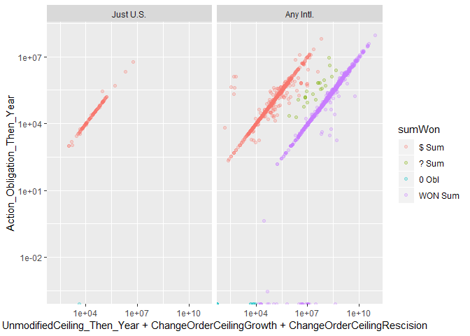
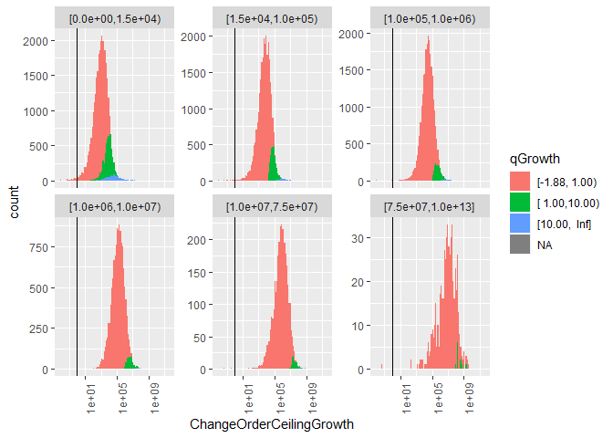

#Setup

```
## Warning: replacing previous import 'Hmisc::summarize' by 'dplyr::summarize'
## when loading 'csis360'
```

```
## Warning: replacing previous import 'Hmisc::src' by 'dplyr::src' when
## loading 'csis360'
```

```
## Warning: replacing previous import 'dplyr::intersect' by
## 'lubridate::intersect' when loading 'csis360'
```

```
## Warning: replacing previous import 'dplyr::union' by 'lubridate::union'
## when loading 'csis360'
```

```
## Warning: replacing previous import 'dplyr::setdiff' by 'lubridate::setdiff'
## when loading 'csis360'
```

```
## 
## Attaching package: 'dplyr'
```

```
## The following objects are masked from 'package:stats':
## 
##     filter, lag
```

```
## The following objects are masked from 'package:base':
## 
##     intersect, setdiff, setequal, union
```

```
## Loading required package: MASS
```

```
## 
## Attaching package: 'MASS'
```

```
## The following object is masked from 'package:dplyr':
## 
##     select
```

```
## Loading required package: Matrix
```

```
## Loading required package: lme4
```

```
## 
## arm (Version 1.10-1, built: 2018-4-12)
```

```
## Working directory is C:/Users/gsand/Repositories/Vendor/scripts
```

```
## Loading required package: coda
```

```
## 
## Attaching package: 'coda'
```

```
## The following object is masked from 'package:arm':
## 
##     traceplot
```

```
## Loading required package: boot
```

```
## 
## Attaching package: 'boot'
```

```
## The following object is masked from 'package:arm':
## 
##     logit
```

```
## 
## Please cite as:
```

```
##  Hlavac, Marek (2018). stargazer: Well-Formatted Regression and Summary Statistics Tables.
```

```
##  R package version 5.2.2. https://CRAN.R-project.org/package=stargazer
```

```
## Version:  1.36.23
## Date:     2017-03-03
## Author:   Philip Leifeld (University of Glasgow)
## 
## Please cite the JSS article in your publications -- see citation("texreg").
```

```
## 
## Attaching package: 'texreg'
```

```
## The following object is masked from 'package:arm':
## 
##     coefplot
```

```
## Loading required package: carData
```

```
## 
## Attaching package: 'car'
```

```
## The following object is masked from 'package:boot':
## 
##     logit
```

```
## The following object is masked from 'package:arm':
## 
##     logit
```

```
## The following object is masked from 'package:dplyr':
## 
##     recode
```

```
## 
## Attaching package: 'scales'
```

```
## The following object is masked from 'package:arm':
## 
##     rescale
```


```r
load(file="../Data/Clean/transformed_def.Rdata")
#The original variables for b_Term and b_CBre are Term and CBre
grouped_barplot("CBre", def,value_col="Action_Obligation_Then_Year")
```

<!-- -->

```r
statsummary_discrete(c("CBre"), def,value_col="Action_Obligation_Then_Year")
```

```
##             CBre %of records % of $s
## 1           None      98.97%  82.52%
## 2 Ceiling Breach       1.03%  17.48%
```

```r
cbre<-def %>% filter(b_CBre==1)
cbre$qGrowth<-Hmisc::cut2(cbre$n_CBre-1,c(1,10))
summary(cbre$qGrowth)
```

```
## [4.69e-10,1.00e+00) [1.00e+00,1.00e+01) [1.00e+01,     Inf] 
##               81198               11830                1462
```
# Outlier Study

```r
nrow(cbre %>% filter((n_CBre-1)>1))
```

```
## [1] 11954
```

```r
nrow(cbre %>% filter((n_CBre-1)>10))
```

```
## [1] 1462
```

```r
nrow(cbre %>% filter((n_CBre-1)>100))
```

```
## [1] 419
```

```r
nrow(cbre %>% filter((n_CBre-1)>100 & UnmodifiedContractBaseAndAllOptionsValue_Then_Year<=0))
```

```
## [1] 232
```

```r
summary(cbre$Ceil[(cbre$n_CBre-1)>10 & cbre$UnmodifiedContractBaseAndAllOptionsValue_Then_Year>0])
```

```
##    [0,15k) [15k,100k)  [100k,1m)   [1m,10m)  [10m,75m)     [75m+] 
##        859        213        120         34          4          0
```

```r
summary(cbre$Ceil[(cbre$n_CBre-1)>100 & cbre$UnmodifiedContractBaseAndAllOptionsValue_Then_Year>0])
```

```
##    [0,15k) [15k,100k)  [100k,1m)   [1m,10m)  [10m,75m)     [75m+] 
##        138         32         15          2          0          0
```

```r
cbre$Why_Outlier<-NA
cbre$Why_Outlier[cbre$UnmodifiedContractBaseAndAllOptionsValue_Then_Year<=0]<-"No Unmodified Ceiling"
cbre$Why_Outlier[is.na(cbre$Why_Outlier)&
                   cbre$Action_Obligation_Then_Year*2>=cbre$UnmodifiedContractBaseAndAllOptionsValue_Then_Year+
                   cbre$ChangeOrderCeilingGrowth]<-
  "Obligations at least half Orig+CRai"
cbre$Why_Outlier[is.na(cbre$Why_Outlier)&
                   cbre$Office=="W912UM"]<-
  "Korean Office W912UM"
cbre$Why_Outlier[is.na(cbre$Why_Outlier)&
                   cbre$ChangeOrderCeilingGrowth>=2.5e8]<-
  ">=$250M, Insepect"
cbre$Why_Outlier[is.na(cbre$Why_Outlier)&
                   cbre$n_CBre-1>10]<-
  "Other Unexplained 10x Ceiling Breach"
cbre$Why_Outlier<-factor(cbre$Why_Outlier,
                         levels=c(
                           "No Unmodified Ceiling",
                           "Obligations at least half Orig+CRai",
                           "Later Deobligated",
                           "Korean Office W912UM",
                           ">=$250M, Insepect",
                           "Other Unexplained 10x Ceiling Breach"
                         ))
summary(cbre$Why_Outlier[(cbre$n_CBre-1)>10])
```

```
##                No Unmodified Ceiling  Obligations at least half Orig+CRai 
##                                  232                                 1146 
##                    Later Deobligated                 Korean Office W912UM 
##                                    0                                   11 
##                    >=$250M, Insepect Other Unexplained 10x Ceiling Breach 
##                                    5                                   68
```

```r
summary(cbre$Why_Outlier)
```

```
##                No Unmodified Ceiling  Obligations at least half Orig+CRai 
##                                  232                                91626 
##                    Later Deobligated                 Korean Office W912UM 
##                                    0                                  198 
##                    >=$250M, Insepect Other Unexplained 10x Ceiling Breach 
##                                    8                                   68 
##                                 NA's 
##                                 2358
```

```r
p_outlier_summary<-cbre %>% filter(n_CBre-1>10) %>% group_by(Why_Outlier) %>%
  dplyr::summarise(nContract=length(ChangeOrderCeilingGrowth),
    SumOfChangeOrderCeilingGrowth=sum(ChangeOrderCeilingGrowth),
                   MaxOfChangeOrderCeilingGrowth=max(ChangeOrderCeilingGrowth),
                   SumOfAction_Obligation_Then_Year=sum(Action_Obligation_Then_Year))


n_outlier_summary<-cbre %>% filter(ChangeOrderCeilingGrowth>2.5e8) %>% group_by(Why_Outlier) %>%
  dplyr::summarise(nContract=length(ChangeOrderCeilingGrowth),
    SumOfChangeOrderCeilingGrowth=sum(ChangeOrderCeilingGrowth),
                   MaxOfChangeOrderCeilingGrowth=max(ChangeOrderCeilingGrowth),
                   SumOfAction_Obligation_Then_Year=sum(Action_Obligation_Then_Year))


nrow(cbre %>% filter((ChangeOrderCeilingGrowth)>=1e3))
```

```
## [1] 76252
```

```r
nrow(cbre %>% filter((ChangeOrderCeilingGrowth)>=1e6))
```

```
## [1] 4199
```

```r
nrow(cbre %>% filter((ChangeOrderCeilingGrowth)>=1e7))
```

```
## [1] 682
```

```r
nrow(cbre %>% filter((ChangeOrderCeilingGrowth)>=1e8))
```

```
## [1] 111
```

```r
nrow(cbre %>% filter((ChangeOrderCeilingGrowth)>=2.5e8))
```

```
## [1] 44
```

```r
nrow(cbre %>% filter((ChangeOrderCeilingGrowth)>=1e9))
```

```
## [1] 12
```

```r
nrow(cbre %>% filter((ChangeOrderCeilingGrowth)>=1e10))
```

```
## [1] 3
```

```r
nrow(cbre %>% filter((ChangeOrderCeilingGrowth)>=2e10))
```

```
## [1] 2
```

```r
summary(cbre$Ceil[cbre$ChangeOrderCeilingGrowth>=1e6])
```

```
##    [0,15k) [15k,100k)  [100k,1m)   [1m,10m)  [10m,75m)     [75m+] 
##         59         97        488       1777       1366        412
```

```r
summary(cbre$Ceil[cbre$ChangeOrderCeilingGrowth>=1e9])
```

```
##    [0,15k) [15k,100k)  [100k,1m)   [1m,10m)  [10m,75m)     [75m+] 
##          0          1          1          2          0          8
```

```r
write.csv(file="..\\Data\\semi_clean\\p_CBre_outliers.csv",cbre %>% filter((n_CBre-1)>10),row.names = FALSE)
write.csv(file="..\\Data\\semi_clean\\n_CBre_outliers.csv",cbre %>% filter(ChangeOrderCeilingGrowth>=2.5e8),row.names = FALSE)
```
Examining cases of large ceiling growth, 1462 contracts experienced greater than 10 fold growth. An increase of that side strains credulity, even in high risk defense contracting. While by no means impossible, the more likely explaination is a misrecorded initial ceiling.

The study team broke down the outliers into 6 categories:


Why_Outlier                             nContract   SumOfChangeOrderCeilingGrowth   MaxOfChangeOrderCeilingGrowth   SumOfAction_Obligation_Then_Year
-------------------------------------  ----------  ------------------------------  ------------------------------  ---------------------------------
No Unmodified Ceiling                         232                        81591718                        20862815                          383117339
Obligations at least half Orig+CRai          1146                      4418306936                       769789464                         8799240742
Korean Office W912UM                           11                      7681224515                      5364187370                           16969010
>=$250M, Insepect                               5                    476290148280                    344739578535                           29052394
Other Unexplained 10x Ceiling Breach           68                       484851277                        95979870                           86701052


* No Unmodified Ceiling: Contracts with an initial ceiling <=0. These are eliminated from the sample as missing data.
* Obligations at least half Orig+CRai: For this category, total obligations of the contract were at least half the value of the initial ceiling plus ceiling growth under change orders. These contrats have had spending that massively exceeded their original ceiling, so the growth in absolute terrms seems plausible. This category accounts for the overwhelming majority of outlier spending but only a tiny fraction of change order growth.
* Later Deobligated: The change order growth metrics only counts increases. These may simply have been mistaken increases, as when including deobligation the growth no longer exceeded 10x the original ceiling. The number, obligations, and change order growth of these contracts are comparatively small, and thus should not distort the overall data.
* Korean Office W912UM refers to a contracting office that sometimes records base and all options values in Korean Won, approximate exchange rate 1,000 Won : 1 USD. 
* There are nrow(cbre %>% dplyr::filter(Why_Outlier ==">=$250M, Insepect" & (n_CBre-1)>10)) contracts with ceiling growth of over $250 million that account for hundreds of billions in change order growth. These merit manual inspection.
* Finally a few score contrats have unexplained growth, but remain below the $10M threshold. The quantity and magnitude of these contrats is not sufficient to risk the overall model.

This examination left the study team less confident in percentage growth as a metric, especially in extreme cases, while increasing the study team's confidence in measures of growth in absoute term. In the worst case, simply removing all of the unexplained over  10 million contracts from the sample would reduce the number of contracts by a tiny amount and reduce the spending accounted for by  2.9052394\times 10^{7}.

Shifting the focus to all contracts with growth of at least 250 million, there are far fewer contracts that account for far more money.


Why_Outlier                            nContract   SumOfChangeOrderCeilingGrowth   MaxOfChangeOrderCeilingGrowth   SumOfAction_Obligation_Then_Year
------------------------------------  ----------  ------------------------------  ------------------------------  ---------------------------------
Obligations at least half Orig+CRai           11                      5525269281                       992698908                        16999937992
Korean Office W912UM                          24                     27401542851                      5364187370                          197697808
>=$250M, Insepect                              8                    479197384535                    344739578535                         1611779996


Inspecting W912UM, either to remove or fix its oversized growth, is an imperative as it accounts for the majority of these contracts or task orders. Even so, there are still 8 That merit special inspection for given that there growth far outpaces their spending.

##W912UM

```r
W912UM <- def %>% filter(Office=="W912UM")

(
ggplot(W912UM, aes(x=UnmodifiedContractBaseAndAllOptionsValue_Then_Year+ChangeOrderBaseAndAllOptionsValue,y=Action_Obligation_Then_Year)) +#,color=qGrowth
  geom_point(alpha=0.25,shape=".")+
  # theme(axis.text.x = element_text(angle = 90, hjust = 1))+
  scale_x_log10()+scale_y_log10()+
  #+
#   geom_vline(xintercept = c(1,10,100))+#+geom_vline(xintercept = 0.1)+
facet_wrap(~StartFY,scales="free_y")#+, space="free_y"
#   labs(title="Distribution of Ceiling Breaches",
#        y="Percent of Growth in  Ceiling",
#        x="Unmodified Contract Ceiling")#,
#        # fill="Termination Completion"
)
```

```
## Warning in self$trans$transform(x): NaNs produced
```

```
## Warning: Transformation introduced infinite values in continuous x-axis
```

```
## Warning: Transformation introduced infinite values in continuous y-axis
```

```
## Warning: Removed 4 rows containing missing values (geom_point).
```

<!-- -->

```r
summary(W912UM$UnmodifiedContractBaseAndAllOptionsValue_Then_Year)
```

```
##      Min.   1st Qu.    Median      Mean   3rd Qu.      Max. 
## 0.000e+00 6.052e+04 4.989e+05 4.717e+08 1.341e+08 8.548e+10
```

```r
W912UM$unmodWon<-NA
W912UM$unmodWon[W912UM$UnmodifiedContractBaseAndAllOptionsValue_Then_Year>=W912UM$Action_Obligation_Then_Year*500]<-'WON Unm'
W912UM$unmodWon[is.na(W912UM$unmodWon) &
                    W912UM$UnmodifiedContractBaseAndAllOptionsValue_Then_Year>=W912UM$Action_Obligation_Then_Year*10]<-'? Unm'
W912UM$unmodWon[is.na(W912UM$unmodWon) &
                    W912UM$UnmodifiedContractBaseAndAllOptionsValue_Then_Year<W912UM$Action_Obligation_Then_Year*10]<-'$ Unm'
summary(factor(W912UM$unmodWon))
```

```
##   $ Unm   ? Unm WON Unm 
##    1065      31     840
```

```r
W912UM$changeWon<-NA
W912UM$changeWon[abs(W912UM$ChangeOrderBaseAndAllOptionsValue)==0]<-'0 Chg'
W912UM$changeWon[abs(W912UM$ChangeOrderBaseAndAllOptionsValue)>=W912UM$Action_Obligation_Then_Year*100]<-'WON Chg'
W912UM$changeWon[is.na(W912UM$changeWon) &
                    abs(W912UM$ChangeOrderBaseAndAllOptionsValue)>=W912UM$Action_Obligation_Then_Year*10]<-'? Chg'
W912UM$changeWon[is.na(W912UM$changeWon) &
                    abs(W912UM$ChangeOrderBaseAndAllOptionsValue)<W912UM$Action_Obligation_Then_Year*10]<-'$ Chg'
summary(factor(W912UM$changeWon))
```

```
##   $ Chg   ? Chg   0 Chg WON Chg 
##     143     112    1551     130
```

```r
W912UM$sumWon<-NA
W912UM$sumWon[W912UM$Action_Obligation_Then_Year==0]<-'0 Obl'
W912UM$sumWon[W912UM$UnmodifiedContractBaseAndAllOptionsValue_Then_Year+
                W912UM$ChangeOrderBaseAndAllOptionsValue>=W912UM$Action_Obligation_Then_Year*500]<-'WON Sum'
W912UM$sumWon[is.na(W912UM$sumWon) &
                    W912UM$UnmodifiedContractBaseAndAllOptionsValue_Then_Year+
                W912UM$ChangeOrderBaseAndAllOptionsValue>=W912UM$Action_Obligation_Then_Year*10]<-'? Sum'
W912UM$sumWon[is.na(W912UM$sumWon) &
                    W912UM$UnmodifiedContractBaseAndAllOptionsValue_Then_Year+
                W912UM$ChangeOrderBaseAndAllOptionsValue<W912UM$Action_Obligation_Then_Year*10]<-'$ Sum'
summary(factor(W912UM$sumWon))
```

```
##   $ Sum   ? Sum WON Sum 
##    1056      30     850
```

```r
(
ggplot(W912UM, aes(x=UnmodifiedContractBaseAndAllOptionsValue_Then_Year+ChangeOrderBaseAndAllOptionsValue,y=Action_Obligation_Then_Year,color=sumWon)) +#,color=qGrowth
  geom_point(alpha=0.25)+
  # theme(axis.text.x = element_text(angle = 90, hjust = 1))+
  scale_x_log10()+scale_y_log10()+
  #+
#   geom_vline(xintercept = c(1,10,100))+#+geom_vline(xintercept = 0.1)+
facet_grid(unmodWon~changeWon)#+, space="free_y"
#   labs(title="Distribution of Ceiling Breaches",
#        y="Percent of Growth in  Ceiling",
#        x="Unmodified Contract Ceiling")#,
#        # fill="Termination Completion"
)
```

```
## Warning in self$trans$transform(x): NaNs produced
```

```
## Warning: Transformation introduced infinite values in continuous x-axis
```

```
## Warning: Transformation introduced infinite values in continuous y-axis
```

```
## Warning: Removed 4 rows containing missing values (geom_point).
```

<!-- -->

```r
(
ggplot(W912UM, aes(x=UnmodifiedContractBaseAndAllOptionsValue_Then_Year+ChangeOrderBaseAndAllOptionsValue,y=Action_Obligation_Then_Year,color=sumWon)) +#,color=qGrowth
  geom_point(alpha=0.25)+
  # theme(axis.text.x = element_text(angle = 90, hjust = 1))+
  scale_x_log10()+scale_y_log10()+
  #+
#   geom_vline(xintercept = c(1,10,100))+#+geom_vline(xintercept = 0.1)+
facet_wrap(~Veh)#+, space="free_y"
#   labs(title="Distribution of Ceiling Breaches",
#        y="Percent of Growth in  Ceiling",
#        x="Unmodified Contract Ceiling")#,
#        # fill="Termination Completion"
)
```

```
## Warning in self$trans$transform(x): NaNs produced
```

```
## Warning: Transformation introduced infinite values in continuous x-axis
```

```
## Warning: Transformation introduced infinite values in continuous y-axis
```

```
## Warning: Removed 4 rows containing missing values (geom_point).
```

<!-- -->

```r
(
ggplot(W912UM, aes(x=UnmodifiedContractBaseAndAllOptionsValue_Then_Year+ChangeOrderBaseAndAllOptionsValue,y=Action_Obligation_Then_Year,color=sumWon)) +#,color=qGrowth
  geom_point(alpha=0.25)+
  # theme(axis.text.x = element_text(angle = 90, hjust = 1))+
  scale_x_log10()+scale_y_log10()+
  #+
#   geom_vline(xintercept = c(1,10,100))+#+geom_vline(xintercept = 0.1)+
facet_wrap(~Intl)#+, space="free_y"
#   labs(title="Distribution of Ceiling Breaches",
#        y="Percent of Growth in  Ceiling",
#        x="Unmodified Contract Ceiling")#,
#        # fill="Termination Completion"
)
```

```
## Warning in self$trans$transform(x): NaNs produced
```

```
## Warning: Transformation introduced infinite values in continuous x-axis
```

```
## Warning: Transformation introduced infinite values in continuous y-axis
```

```
## Warning: Removed 4 rows containing missing values (geom_point).
```

<!-- -->

All of the questionable contracts take place internationally and none use BPA/BOA or FSS/GWACs. That makes sense and raises confidence, but given that the clearly USD contract categories are less common, this doesn't help in resolving the ambiguous cases. That said, Single Award IDCs appear to have most of the ambigious cases, which suggests that this might be resolvable by looking at parent IDVs in those cases. 

# Ceiling Growth

```r
(
ggplot(cbre, aes(x=UnmodifiedContractBaseAndAllOptionsValue_Then_Year,y=n_CBre-1)) +#,color=qGrowth
  geom_point(alpha=0.25,shape=".")+
  # theme(axis.text.x = element_text(angle = 90, hjust = 1))+
  scale_x_log10()+scale_y_log10()+
  #+
  geom_vline(xintercept = c(1,10,100))+#+geom_vline(xintercept = 0.1)+
# facet_wrap(~Ceil,scales="free_y")+#+, space="free_y"
  labs(title="Distribution of Ceiling Breaches",
       y="Percent of Growth in  Ceiling",
       x="Unmodified Contract Ceiling")#,
       # fill="Termination Completion"
)
```

```
## Warning: Transformation introduced infinite values in continuous x-axis
```

<!-- -->

```r
(
ggplot(cbre, aes(x=UnmodifiedContractBaseAndAllOptionsValue_Then_Year,y=ChangeOrderCeilingGrowth)) +#,color=qGrowth
  geom_point(alpha=0.25,shape=".")+
  # theme(axis.text.x = element_text(angle = 90, hjust = 1))+
  scale_x_log10()+scale_y_log10()+
  #+
  geom_vline(xintercept = c(1,10,100))+#+geom_vline(xintercept = 0.1)+
# facet_wrap(~Ceil,scales="free_y")+#+, space="free_y"
  labs(title="Distribution of Ceiling Breaches",
       y="Percent of Growth in  Ceiling",
       x="Unmodified Contract Ceiling")#,
       # fill="Termination Completion"
)
```

```
## Warning: Transformation introduced infinite values in continuous x-axis
```

<!-- -->

```r
(
ggplot(cbre, aes(x=UnmodifiedContractBaseAndAllOptionsValue_Then_Year+ChangeOrderBaseAndAllOptionsValue,y=Action_Obligation_Then_Year)) +#,color=qGrowth
  geom_point(alpha=0.25,shape=".")+
  # theme(axis.text.x = element_text(angle = 90, hjust = 1))+
  scale_x_log10()+scale_y_log10()#+
  #+
#   geom_vline(xintercept = c(1,10,100))+#+geom_vline(xintercept = 0.1)+
# # facet_wrap(~Ceil,scales="free_y")+#+, space="free_y"
#   labs(title="Distribution of Ceiling Breaches",
#        y="Percent of Growth in  Ceiling",
#        x="Unmodified Contract Ceiling")#,
#        # fill="Termination Completion"
)
```

```
## Warning in self$trans$transform(x): NaNs produced
```

```
## Warning: Transformation introduced infinite values in continuous y-axis
```

```
## Warning: Removed 24 rows containing missing values (geom_point).
```

<!-- -->

```r
(
ggplot(cbre, aes(x=UnmodifiedContractBaseAndAllOptionsValue_Then_Year+ChangeOrderCeilingGrowth,y=Action_Obligation_Then_Year)) +#,color=qGrowth
  geom_point(alpha=0.25,shape=".")+
  # theme(axis.text.x = element_text(angle = 90, hjust = 1))+
  scale_x_log10()+scale_y_log10()#+
  #+
#   geom_vline(xintercept = c(1,10,100))+#+geom_vline(xintercept = 0.1)+
# # facet_wrap(~Ceil,scales="free_y")+#+, space="free_y"
#   labs(title="Distribution of Ceiling Breaches",
#        y="Percent of Growth in  Ceiling",
#        x="Unmodified Contract Ceiling")#,
#        # fill="Termination Completion"
)
```

```
## Warning in self$trans$transform(x): NaNs produced
```

```
## Warning: Transformation introduced infinite values in continuous y-axis
```

```
## Warning: Removed 24 rows containing missing values (geom_point).
```

<!-- -->

```r
summary(cbre$ChangeOrderBaseAndAllOptionsValue)
```

```
##      Min.   1st Qu.    Median      Mean   3rd Qu.      Max. 
## 0.000e+00 1.578e+03 9.159e+03 5.824e+06 5.252e+04 3.447e+11
```

```r
(
ggplot(cbre, aes(x=ChangeOrderCeilingGrowth,y=ChangeOrderBaseAndAllOptionsValue)) +#,color=qGrowth
  geom_point(alpha=0.25,shape=".")+
  # theme(axis.text.x = element_text(angle = 90, hjust = 1))+
  scale_x_log10()+scale_y_log10()#+
  #+
#   geom_vline(xintercept = c(1,10,100))+#+geom_vline(xintercept = 0.1)+
# # facet_wrap(~Ceil,scales="free_y")+#+, space="free_y"
#   labs(title="Distribution of Ceiling Breaches",
#        y="Percent of Growth in  Ceiling",
#        x="Unmodified Contract Ceiling")#,
#        # fill="Termination Completion"
)
```

<!-- -->

```r
(
ggplot(cbre, aes(x=n_CBre-1,fill=qGrowth)) +
  geom_histogram(bins=100)+
  theme(axis.text.x = element_text(angle = 90, hjust = 1))+
  scale_x_log10()+
  #+
  geom_vline(xintercept = c(1,10,100))+#+geom_vline(xintercept = 0.1)+
facet_wrap(~Ceil,scales="free_y")+#+, space="free_y"
  labs(title="Distribution of Ceiling Breaches",
       y="Contract Count",
       x="Percent of Growth in  Ceiling")#,
       # fill="Termination Completion"
)
```

```
## Warning: Removed 232 rows containing non-finite values (stat_bin).
```

<!-- -->

```r
(
ggplot(cbre, aes(x=ChangeOrderCeilingGrowth,fill=qGrowth)) +
  geom_histogram(bins=100)+
  theme(axis.text.x = element_text(angle = 90, hjust = 1))+
  scale_x_log10()+
  #+
  geom_vline(xintercept = 1)#+geom_vline(xintercept = 0.1)+
#facet_grid(NoPreTermObl~.,scales="free_y", space="free_y")+
  # labs(title="Distribution of Contracts with Obligations After Last termination",
  #      y="Contract Count",
  #      x="Percent of Obligations After Day of Termination",
  #      fill="Termination Completion"
)
```

<!-- -->

```r
(
ggplot(cbre, aes(x=ChangeOrderCeilingGrowth,fill=qGrowth)) +
  geom_histogram(bins=100)+
  theme(axis.text.x = element_text(angle = 90, hjust = 1))+
  scale_x_log10()+
  #+
  geom_vline(xintercept = 1)+
facet_wrap(~Ceil,scales="free_y")#+, space="free_y"
#+geom_vline(xintercept = 0.1)+
#facet_grid(NoPreTermObl~.,scales="free_y", space="free_y")+
  # labs(title="Distribution of Contracts with Obligations After Last termination",
  #      y="Contract Count",
  #      x="Percent of Obligations After Day of Termination",
  #      fill="Termination Completion"
)
```

<!-- -->
