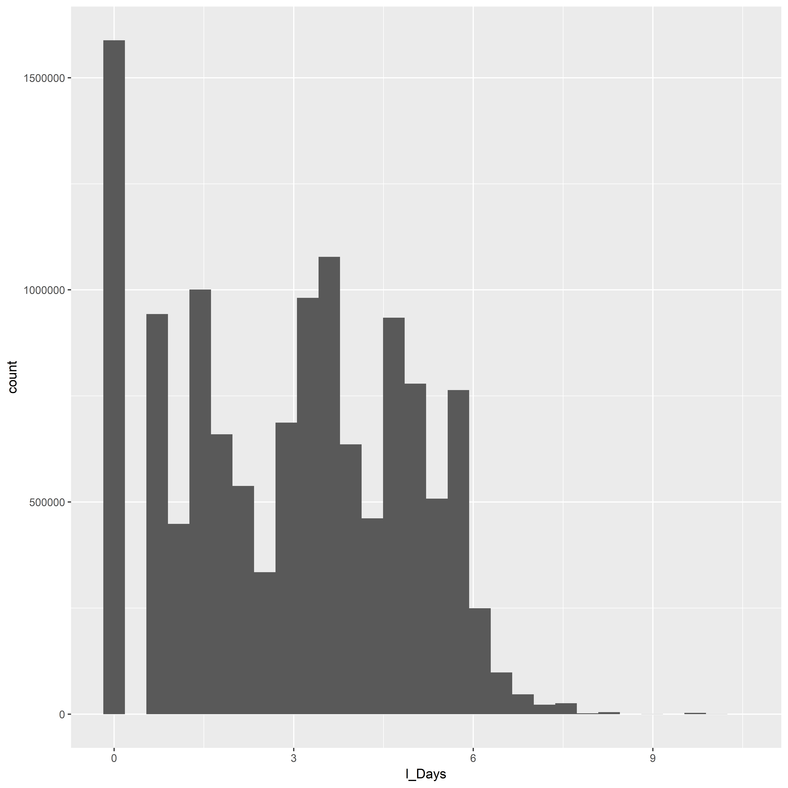
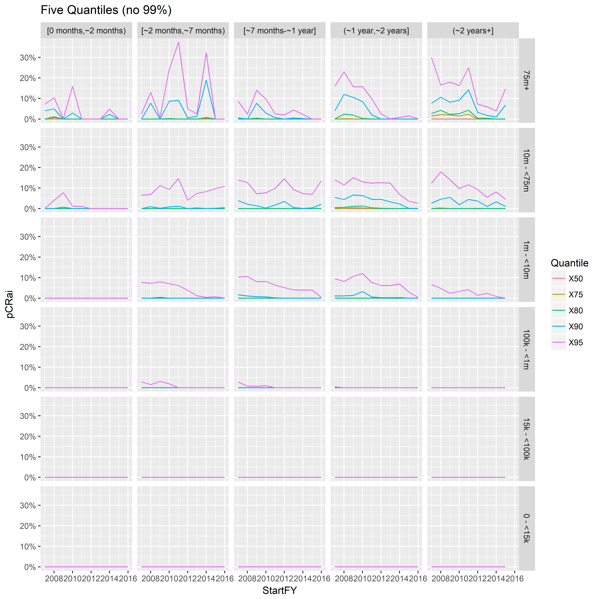
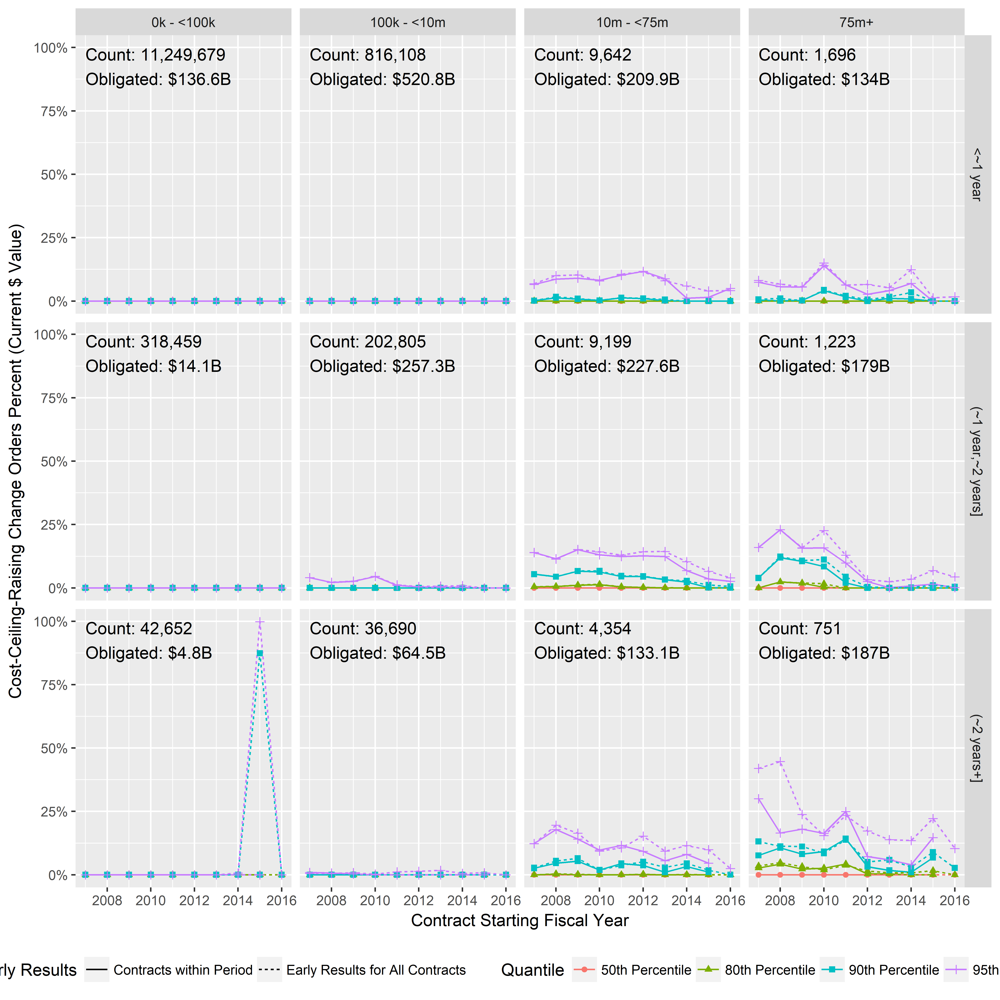
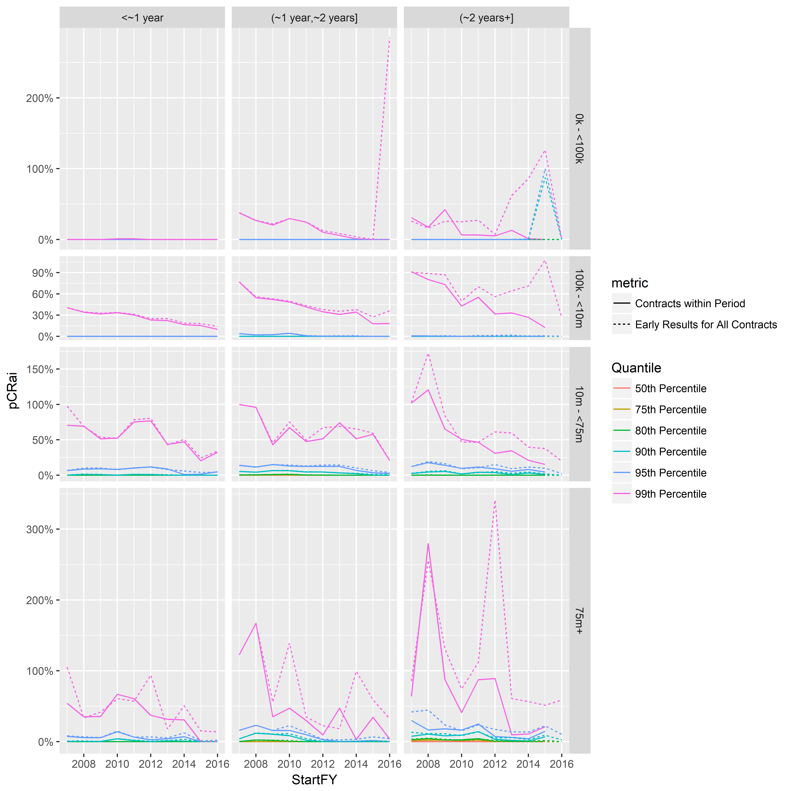
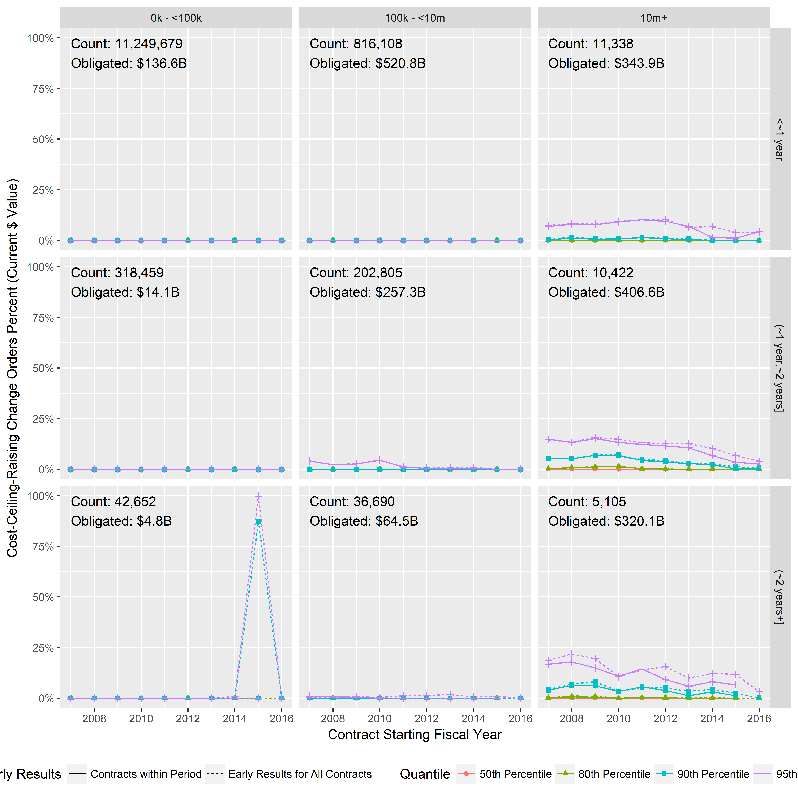
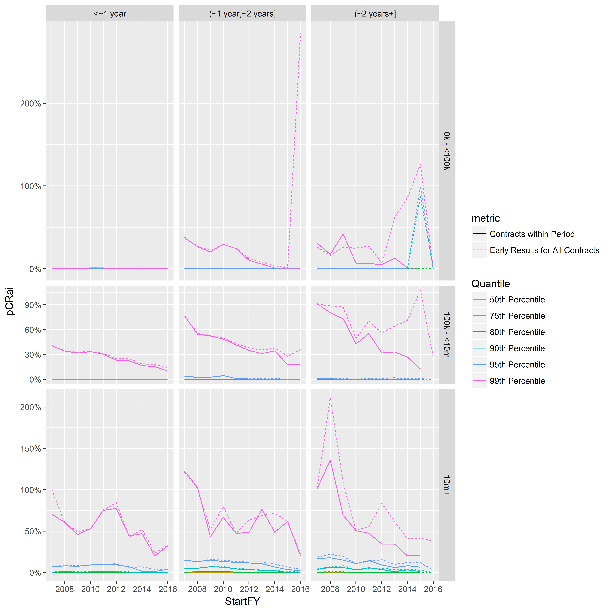
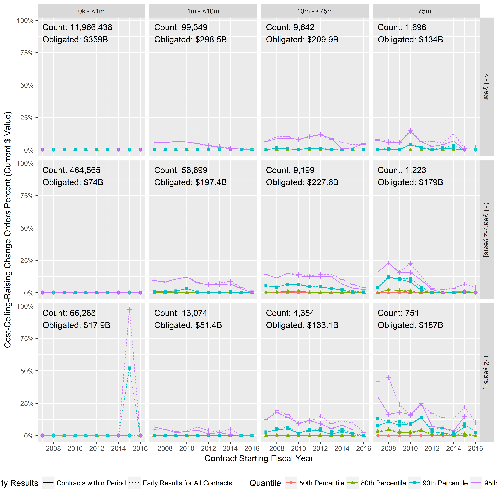

---
title: "ContractTermination"
author: "Greg Sanders"
date: "Wednesday, February 8, 2017"
output:
  html_document:
    keep_md: yes
--- 

Annual Outcome 
============================================================================


#Setup

## Read in packages and functions

```r
source("https://raw.githubusercontent.com/CSISdefense/R-scripts-and-data/master/helper.r")
```

```
## 
## Attaching package: 'lubridate'
```

```
## The following object is masked from 'package:plyr':
## 
##     here
```

```
## The following object is masked from 'package:base':
## 
##     date
```

```r
source("https://raw.githubusercontent.com/CSISdefense/R-scripts-and-data/master/lookups.r")
source("DIIGstat.r")
```

```
## Loading required package: MASS
```

```
## Loading required package: Matrix
```

```
## Loading required package: lme4
```

```
## 
## arm (Version 1.10-1, built: 2018-4-12)
```

```
## Working directory is H:/Users/Greg/Repositories/Vendor
```

```
## 
## Attaching package: 'arm'
```

```
## The following object is masked from 'package:scales':
## 
##     rescale
```

```
## 
## Attaching package: 'dplyr'
```

```
## The following object is masked from 'package:MASS':
## 
##     select
```

```
## The following objects are masked from 'package:lubridate':
## 
##     intersect, setdiff, union
```

```
## The following objects are masked from 'package:plyr':
## 
##     arrange, count, desc, failwith, id, mutate, rename, summarise,
##     summarize
```

```
## The following objects are masked from 'package:stats':
## 
##     filter, lag
```

```
## The following objects are masked from 'package:base':
## 
##     intersect, setdiff, setequal, union
```

```
## Loading required package: carData
```

```
## 
## Attaching package: 'car'
```

```
## The following object is masked _by_ '.GlobalEnv':
## 
##     Boxplot
```

```
## The following object is masked from 'package:dplyr':
## 
##     recode
```

```
## The following object is masked from 'package:arm':
## 
##     logit
```

```r
source("https://raw.githubusercontent.com/CSISdefense/Crisis-Funding/master/ContractCleanup.r")
```

```
## Loading required package: lattice
```

```
## Loading required package: survival
```

```
## Loading required package: Formula
```

```
## 
## Attaching package: 'Hmisc'
```

```
## The following object is masked _by_ '.GlobalEnv':
## 
##     subplot
```

```
## The following objects are masked from 'package:dplyr':
## 
##     src, summarize
```

```
## The following objects are masked from 'package:plyr':
## 
##     is.discrete, summarize
```

```
## The following objects are masked from 'package:base':
## 
##     format.pval, units
```

```r
library(csis360)
library(ggplot2)
library(scales)
library(Hmisc)
library(dplyr)
# Coloration<-read.csv(
#     paste(Path,"Lookups\\","lookup_coloration.csv",sep=""),
#     header=TRUE, sep=",", na.strings="", dec=".", strip.white=TRUE, 
#     stringsAsFactors=FALSE
#     )
# 
# Coloration<-ddply(Coloration
#                   , c(.(R), .(G), .(B))
#                   , mutate
#                   , ColorRGB=as.character(
#                       if(min(is.na(c(R,G,B)))) {NA} 
#                       else {rgb(max(R),max(G),max(B),max=255)}
#                       )
#                   )

axis.text.size<-10
strip.text.size<-10
legend.text.size<-8
# table.text.size<-5.75
title.text.size<-12
geom.text.size<-12

main.text.size<-1
note.text.size<-1.40

all_labeled<-function(data){
  subset(data,
                                        !is.na(Dur) & 
               !is.na(Ceil) &
               !is.na(CRai) & 
           !is.na(Term))
}

only_complete<-function(data){
  data<-all_labeled(data)
  subset(data,(LastCurrentCompletionDate<=as.Date("2017-09-30") |
              IsClosed==1) &
           UnmodifiedCurrentCompletionDate<as.Date("2017-09-30"))
}
```


Contracts are classified using a mix of numerical and categorical variables. While the changes in numerical variables are easy to grasp and summarize, a contract may have one line item that is competed and another that is not. As is detailed in the exploration on R&D, we are only considering information available prior to contract start. The percentage of contract obligations that were competed is a valuable benchmark, but is highly influenced by factors that occured after contract start..

## Read in data

```r
load(file="Data/defense_contract_all.RData")
# debug(transform_contract)
def_all<-transform_contract(def_all)


def_all<-FormatContractModel(def_all)
```

```
## Warning: Unknown or uninitialised column: 'LowCeil'.

## Warning: Unknown or uninitialised column: 'LowCeil'.
```

```
## Warning: Unknown or uninitialised column: 'NChg'.
```

```r
head(def_all)
```

```
## # A tibble: 6 x 43
## # Groups:   Ceil [1]
##   CSIScontractID StartFY Action.Obligation LastCurrentCompletionDate
##            <int>   <int>             <dbl> <date>                   
## 1           5967    2001                 0 NA                       
## 2           5968    2001                 0 NA                       
## 3           5969    2001                 0 NA                       
## 4           6962    2001                 0 NA                       
## 5           6961    2001                 0 NA                       
## 6           6964    2001                 0 NA                       
## # ... with 39 more variables:
## #   UnmodifiedContractBaseAndAllOptionsValue <dbl>,
## #   ChangeOrderBaseAndAllOptionsValue <dbl>,
## #   UnmodifiedNumberOfOffersReceived <int>,
## #   UnmodifiedCurrentCompletionDate <date>, IsClosed <fct>, Term <fct>,
## #   SumOfisChangeOrder <int>, UnmodifiedDays <dbl>, Dur <ord>, Ceil <ord>,
## #   CBre <ord>, Agency <fct>, Office <fct>, ProdServ <fct>, NAICS <fct>,
## #   b_CBre <dbl>, j_CBre <dbl>, b_Term <dbl>, j_Term <dbl>,
## #   pChangeOrderUnmodifiedBaseAndAll <dbl>, pChange3Sig <dbl>, CRai <fct>,
## #   n_CBre <dbl>, l_CBre <dbl>, l_Ceil <dbl>, ceil.median.wt <dbl>,
## #   Ceil.Simple <ord>, Ceil.Big <ord>, Ceil.1m <ord>, l_Days <dbl>,
## #   UnmodifiedYearsFloat <dbl>, UnmodifiedYearsCat <dbl>,
## #   Dur.Simple <ord>, cl_Ceil <dbl>, cl_Days <dbl>, TermNum <int>,
## #   ObligationWT <dbl>, NChg <fct>, ContractCount <dbl>
```

```r
write.csv(subset(def_all,Term=="Terminated"),"Terminated.csv")
def_all<-subset(def_all,  StartFY>=2007 & 
                                               StartFY<=2016 
                )
```

**A Histogram of the IsTerminated data** showing the distribution of whether or not a contract was terminated each year from 2007.  


```r
# TerminatedDurSummary<-ddply(subset(def_all,StartFY>=2007 & 
#                   !is.na(Ceil)&
#                   UnmodifiedCompletionDate<=as.Date("2015-09-30")&
#                       !is.na(Term)),
#                             .(Ceil,
#                               Dur,
#                               StartFY,
#                               Term
#                             ),
#                             dplyr::summarise,
#                             Action.Obligation=sum(Action.Obligation),
#                             Count=length(CSIScontractID)
#                   )
# 
# 
# TerminatedDurSummary<-ddply(TerminatedDurSummary,.(Ceil,
#                                                   Dur,
#                                              StartFY
#                                              ),transform,
#                       pContractCeilDurStart=Count/sum(Count),
#                       pObligationCeilDurStart=Action.Obligation/sum(Action.Obligation)
#       )
# 
# 
# ggplot(TerminatedDurSummary,
#        aes(x=StartFY,
#            y=Count,
#            color=Term))+geom_line()+    geom_point(aes(shape=metric))+facet_grid(Ceil ~ Dur ) +scale_y_log10(labels=scales::comma)
# 
# 
# 
# 
# 
# 
# ggplot(
#   data = TerminatedEndSummary,
#   aes_string(x = "Term"),
#   ) + geom_bar() + 
#     facet_grid( Ceil ~ .,
#                 scales = "free_y",
#                 space = "free_y") + scale_y_continuous(expand = c(0,50)) 
# 
# 
# 
# 
# 
# ggplot(
#   data = subset(TerminatedEndSummary,Term=="Terminated"),
#   aes_string(x = "Ceil")
#   )+ geom_bar()+
#     scale_x_discrete("Original Ceiling (Current $ Value)")+scale_y_continuous("Number of Partially or Completely \nTerminated Contracts",labels = comma)+theme(axis.text.x=element_text(angle=90,size=12))
# 
# 
# 
# 
# 
# 
# TerminatedEndSummary$Graph[TerminatedEndSummary$Term=="Terminated"]<-TRUE
# 
# TerminatedEndSummary$Graph[TerminatedEndSummary$Term=="Unterminated"]<-FALSE
# 
# 
# head(TerminatedEndSummary)
# 
# ggplot(
#   data = subset(TerminatedEndSummary,Term=="Terminated"),
#   aes(x = Ceil,weight=Action.Obligation/1000000000)
#   )+ geom_bar()+
#     scale_x_discrete("Original Ceiling (Current $ Value)")+scale_y_continuous("Obligations to Partially or Completely\nTerminated Contracts (Current $ Billions)",labels = comma)+theme(axis.text.x=element_text(angle=90,size=12))
# 
# 
# ggplot(
#   data = subset(TerminatedEndSummary,Term=="Terminated"),
#   aes_string(x = "Ceil",weight="pContract")
# #   main="Percentage of Contracts going to Partially or Completely Terminated Contracts\nBy Initial Contract Ceiling"
#   )+ geom_bar()+ scale_y_continuous("Percent of Contracts Partially or Completely Terminated\nby Original Ceiling Category", labels=percent)+
#     scale_x_discrete("Original Ceiling (Current $ Value)")+theme(axis.text.x=element_text(angle=90,size=12))
# 
# 
# ggplot(
#   data = subset(TerminatedEndSummary,Term=="Terminated"),
#   aes_string(x = "Ceil",weight="pObligation"),
#   main="Percentage of Contract Obligations going to Partially or Completely Terminated Contracts\nBy Initial Contract Ceiling"
#   )+ geom_bar()+ scale_y_continuous("Percent of Obligations to Terminated Contracts \nin Original Ceiling Category", labels=percent)+
#     scale_x_discrete("Original Ceiling (Current $ Value)")+theme(axis.text.x=element_text(angle=90,size=12))
# 
# 
# # 
# # LatticePercentLineWrapper("VAR.name"
# #                                     ,"VAR.proper.name"
# #                                     ,"VAR.X.label"
# #                                     ,"VAR.Y.label"
# #                                     ,Coloration
# #                                     ,subset(TerminatedEndSummary,!is.na(Term))
# #                                     ,NULL
# #                                     ,"Ceil"
# #                                     ,"Count"
# #                                     ,"Term"
# #                                     ,NA
# #                                     ,NA
# #                                     )
# 
# # 
# # + 
# #     facet_grid( Ceil ~ .,
# #                 scales = "free_y",
# #                 space = "free_y") 
# # 

head(def_all)
```

```
## # A tibble: 6 x 43
## # Groups:   Ceil [1]
##   CSIScontractID StartFY Action.Obligation LastCurrentCompletionDate
##            <int>   <int>             <dbl> <date>                   
## 1        1192685    2007                 0 NA                       
## 2        1192686    2007                 0 NA                       
## 3        1192687    2007                 0 NA                       
## 4        1192688    2007                 0 NA                       
## 5        1192693    2008                 0 NA                       
## 6        1192694    2008                 0 NA                       
## # ... with 39 more variables:
## #   UnmodifiedContractBaseAndAllOptionsValue <dbl>,
## #   ChangeOrderBaseAndAllOptionsValue <dbl>,
## #   UnmodifiedNumberOfOffersReceived <int>,
## #   UnmodifiedCurrentCompletionDate <date>, IsClosed <fct>, Term <fct>,
## #   SumOfisChangeOrder <int>, UnmodifiedDays <dbl>, Dur <ord>, Ceil <ord>,
## #   CBre <ord>, Agency <fct>, Office <fct>, ProdServ <fct>, NAICS <fct>,
## #   b_CBre <dbl>, j_CBre <dbl>, b_Term <dbl>, j_Term <dbl>,
## #   pChangeOrderUnmodifiedBaseAndAll <dbl>, pChange3Sig <dbl>, CRai <fct>,
## #   n_CBre <dbl>, l_CBre <dbl>, l_Ceil <dbl>, ceil.median.wt <dbl>,
## #   Ceil.Simple <ord>, Ceil.Big <ord>, Ceil.1m <ord>, l_Days <dbl>,
## #   UnmodifiedYearsFloat <dbl>, UnmodifiedYearsCat <dbl>,
## #   Dur.Simple <ord>, cl_Ceil <dbl>, cl_Days <dbl>, TermNum <int>,
## #   ObligationWT <dbl>, NChg <fct>, ContractCount <dbl>
```


```r
# 
# ggplot(TerminatedEndSummary,
#        aes(x=StartFY,
#            y=Count,
#            color=Term))+geom_line()+    geom_point(aes(shape=metric))+facet_grid(Ceil ~ EndAfterPeriod ) +scale_y_log10()
```


```r
# 
# TerminatedUnmodifiedYearsCatStat<-rbind(ddply(subset(def_all,
#                                 !is.na(Dur) & StartFY>=2007 & 
#                                     !is.na(UnmodifiedYearsCat) &
#                                     UnmodifiedCurrentCompletionDate<as.Date("2015-09-30")&
#                                     !is.na(Term)),
#                          .(UnmodifiedYearsCat,
#                            StartFY
#                          ),
#                          
#                          dplyr::summarise,
#                          Action.Obligation=sum(Action.Obligation),
#                          Count=length(CSIScontractID),
#                          mean = mean(TermNum),
#                          sd   = NA ,# sd(TermNum),
#                          se   = NA, #sd / sqrt(Count),
#                          metric="Unweighted"
#                           # ceil.mean = wtd.mean(TermNum,UnmodifiedContractBaseAndAllOptionsValue),
#                          # ceil.cat.mean = wtd.mean(TermNum,ceil.median.wt)
# ))
# 
# 
# 
# TerminatedUnmodifiedYearsCatStat<-rbind(TerminatedUnmodifiedYearsCatStat,
#                          ddply(subset(def_all,
#                                 !is.na(Dur) & StartFY>=2007 & 
#                                     !is.na(Ceil) &
#                                     UnmodifiedCurrentCompletionDate<as.Date("2015-09-30")&
#                                     !is.na(Term)),
#                          .(UnmodifiedYearsCat,
#                            StartFY
#                          ),
#                          
#                          dplyr::summarise,
#                          Action.Obligation=sum(Action.Obligation),
#                          Count=length(CSIScontractID),
#                          mean = wtd.mean(TermNum,ObligationWT),
#                          sd   = NA ,# sd(TermNum),
#                          se   = NA, #sd / sqrt(Count),
#                          metric="Obligation Weighted"
#                           # ceil.mean = wtd.mean(TermNum,UnmodifiedContractBaseAndAllOptionsValue),
#                          # ceil.cat.mean = wtd.mean(TermNum,ceil.median.wt)
# 
# ))
# 
# TerminatedUnmodifiedYearsCatStat<-rbind(TerminatedUnmodifiedYearsCatStat,
#                          ddply(subset(def_all,
#                                 !is.na(Dur) & StartFY>=2007 & 
#                                     !is.na(Ceil) &
#                                     UnmodifiedCurrentCompletionDate<as.Date("2015-09-30")&
#                                     !is.na(Term)),
#                          .(UnmodifiedYearsCat,
#                            StartFY
#                          ),
#                          
#                          dplyr::summarise,
#                          Action.Obligation=sum(Action.Obligation),
#                          Count=length(CSIScontractID),
#                          mean = wtd.mean(TermNum,UnmodifiedContractBaseAndAllOptionsValue),
#                          sd   = NA ,# sd(TermNum),
#                          se   = NA, #sd / sqrt(Count),
#                          metric="Ceiling Weighted"
#                          # obl.mean = ,
#                          # ceil.mean = wtd.mean(TermNum,UnmodifiedContractBaseAndAllOptionsValue),
#                          # ceil.cat.mean = wtd.mean(TermNum,ceil.median.wt)
# 
# ))
# 
# 
# TerminatedUnmodifiedYearsCatStat<-rbind(TerminatedUnmodifiedYearsCatStat,
#                          ddply(subset(def_all,
#                                 !is.na(Dur) & StartFY>=2007 & 
#                                     !is.na(Ceil) &
#                                     UnmodifiedCurrentCompletionDate<as.Date("2015-09-30")&
#                                     !is.na(Term)),
#                          .(UnmodifiedYearsCat,
#                            StartFY
#                          ),
#                          
#                          dplyr::summarise,
#                          Action.Obligation=sum(Action.Obligation),
#                          Count=length(CSIScontractID),
#                          mean = wtd.mean(TermNum,ceil.median.wt),
#                          sd   = NA ,# sd(TermNum),
#                          se   = NA, #sd / sqrt(Count),
#                          metric="Ceiling Category Weighted"
# 
# ))
# 
# 
# # 
# # pd <- position_dodge(0.1) # move them .05 to the left and right
# # 
# # ggplot(tgc, aes(x=dose, y=len, colour=supp)) + 
# #     geom_errorbar(aes(ymin=len-se, ymax=len+se), width=.1, position=pd) 
# 
# ggplot(TerminatedUnmodifiedYearsCatStat,aes(x=StartFY,y=mean,color=metric))+
#     geom_line()+
#         geom_point(aes(shape=metric))+
#     facet_grid(.~ UnmodifiedYearsCat ) +
#     scale_x_continuous("Contract Starting Fiscal Year")+
#     scale_y_continuous(label=percent)+
#     geom_errorbar(aes(ymin=mean-se, ymax=mean+se), width=.1)+
#     theme(legend.position="bottom") #, position=pd
```


```r
# 
# TerminatedDurStat<-rbind(                         ddply(subset(def_all,
#                                 !is.na(Dur) & StartFY>=2007 & 
#                                     StartFY<=2014 & 
#                                     !is.na(Ceil) &
#                                     UnmodifiedCurrentCompletionDate<as.Date("2015-09-30")&
#                                     !is.na(Term)),
#                          .(Dur,
#                            StartFY
#                          ),
#                          
#                          dplyr::summarise,
#                          Action.Obligation=sum(Action.Obligation),
#                          Count=length(CSIScontractID),
#                          mean = mean(TermNum),
#                          sd   = sd(TermNum),
#                          se   = sd / sqrt(Count),
#                          metric="Unweighted"
#                           # ceil.mean = wtd.mean(TermNum,UnmodifiedContractBaseAndAllOptionsValue),
#                          # ceil.cat.mean = wtd.mean(TermNum,ceil.median.wt)
# ))
# 
# 
# TerminatedDurStat<-rbind(TerminatedDurStat,
#                          ddply(subset(def_all,
#                                 !is.na(Dur) & StartFY>=2007 & 
#                                     StartFY<=2014 & 
#                                     !is.na(Ceil) &
#                                     UnmodifiedCurrentCompletionDate<as.Date("2015-09-30")&
#                                     !is.na(Term)),
#                          .(Dur,
#                            StartFY
#                          ),
#                          
#                          dplyr::summarise,
#                          Action.Obligation=sum(Action.Obligation),
#                          Count=length(CSIScontractID),
#                          mean = wtd.mean(TermNum,ObligationWT),
#                          sd   = sqrt(wtd.var(TermNum,ObligationWT)) ,
#                          se   = sd / sqrt(Count),
#                          metric="Obligation Weighted"
#                           # ceil.mean = wtd.mean(TermNum,UnmodifiedContractBaseAndAllOptionsValue),
#                          # ceil.cat.mean = wtd.mean(TermNum,ceil.median.wt)
# ))
# 
# TerminatedDurStat<-rbind(TerminatedDurStat,
#                          ddply(subset(def_all,
#                                 !is.na(Dur) & StartFY>=2007 & 
#                                     StartFY<=2014 & 
#                                     !is.na(Ceil) &
#                                     UnmodifiedCurrentCompletionDate<as.Date("2015-09-30")&
#                                     !is.na(Term)),
#                          .(Dur,
#                            StartFY
#                          ),
#                          
#                          dplyr::summarise,
#                          Action.Obligation=sum(Action.Obligation),
#                          Count=length(CSIScontractID),
#                          mean = wtd.mean(TermNum,UnmodifiedContractBaseAndAllOptionsValue),
#                          sd   = sqrt(wtd.var(TermNum,UnmodifiedContractBaseAndAllOptionsValue)) ,
#                          se   = sd / sqrt(Count),
#                          metric="Ceiling Weighted"
#                          # obl.mean = ,
#                          # ceil.mean = wtd.mean(TermNum,UnmodifiedContractBaseAndAllOptionsValue),
#                          # ceil.cat.mean = wtd.mean(TermNum,ceil.median.wt)
# 
# ))
# 
# 
# TerminatedDurStat<-rbind(TerminatedDurStat,
#                          ddply(subset(def_all,
#                                 !is.na(Dur) & StartFY>=2007 & 
#                                     StartFY<=2014 & 
#                                     !is.na(Ceil) &
#                                     UnmodifiedCurrentCompletionDate<as.Date("2015-09-30")&
#                                     !is.na(Term)),
#                          .(Dur,
#                            StartFY
#                          ),
#                          
#                          dplyr::summarise,
#                          Action.Obligation=sum(Action.Obligation),
#                          Count=length(CSIScontractID),
#                          mean = wtd.mean(TermNum,ceil.median.wt),
#                          sd   = sqrt(wtd.var(TermNum,ceil.median.wt)) ,
#                          se   = sd / sqrt(Count),
#                          metric="Ceiling Category Weighted"
# 
# ))
# 
# 
# # 
# # pd <- position_dodge(0.1) # move them .05 to the left and right
# # 
# # ggplot(tgc, aes(x=dose, y=len, colour=supp)) + 
# #     geom_errorbar(aes(ymin=len-se, ymax=len+se), width=.1, position=pd) 
# 
# ggplot(subset(TerminatedDurStat,!metric %in% c("Ceiling Weighted")),
#        aes(x=StartFY,y=mean,color=metric))+
#     geom_line()+
#         geom_point(aes(shape=metric))+
#     facet_grid( Dur  ~.) +
#     scale_x_continuous("Contract Starting Fiscal Year")+
#     scale_y_continuous(label=percent)+
#     geom_errorbar(aes(ymin=mean-se, ymax=mean+se), width=.1)+
#     theme(legend.position="bottom") #, position=pd
# 
# ggplot(subset(TerminatedDurStat,!metric %in% c("Ceiling Weighted","Ceiling Category Weighted")),
#        aes(x=StartFY,y=mean,color=metric))+
#     geom_line()+
#         geom_point(aes(shape=metric))+
#     facet_grid( Dur  ~., space = "free_y", scales="free_y") +
#     scale_x_continuous("Contract Starting Fiscal Year")+
#     scale_y_continuous(label=percent)+
#     geom_errorbar(aes(ymin=mean-se, ymax=mean+se), width=.1)+
#     theme(legend.position="bottom") #, position=pd
# 
# 
```


```r
# TerminatedDur.SimpleStatCount<-ddply(subset(def_all,
#                                 !is.na(Dur) & StartFY>=2007 & 
#                                     StartFY<=2014 & 
#                                     !is.na(Ceil) &
#                                     UnmodifiedCurrentCompletionDate<as.Date("2015-09-30")&
#                                     !is.na(Term)),
#                          .(Dur.Simple,
#                            StartFY,
#                            Term
#                          ),
#                          
#                          dplyr::summarise,
#                          Action.Obligation=sum(Action.Obligation),
#                          Count=length(CSIScontractID)
# )
# 
# ggplot(TerminatedDur.SimpleStatCount,
#        aes(x=StartFY,y=Count,color=Term))+
#     geom_line()+
#     geom_point(aes(shape=Term))+
#     facet_grid( Dur.Simple  ~.) +
#     scale_x_continuous("Contract Starting Fiscal Year")+
#     scale_y_log10("Number of Contracts",label=comma)
#     geom_errorbar(aes(ymin=mean-se, ymax=mean+se), width=.1)+
#     # theme(legend.position="bottom") #, position=pd
# 
# ggplot(TerminatedDur.SimpleStatCount,
#        aes(x=StartFY,y=Count,color=Term))+
#     geom_line()+
#         geom_point(aes(shape=Term))+
#     facet_grid( Dur.Simple  ~., ) +#
#     scale_x_continuous("Contract Starting Fiscal Year")+
#         
#     scale_y_log10("Number of Contracts (Variable Scale)",label=comma)
#     # geom_errorbar(aes(ymin=mean-se, ymax=mean+se), width=.1)+
#     theme(legend.position="bottom") #, position=pd
#     
```


```r
# ddply(TerminatedDurStat,
#       .(Dur),
#       dplyr::summarise,
#       Count=sum(Count),
#       Action.Obligation=sum(Action.Obligation))
# 
# 
# 
# TerminatedDur.SimpleStat<-rbind(                         ddply(subset(def_all,
#                                 !is.na(Dur) & StartFY>=2007 & 
#                                     StartFY<=2014 & 
#                                     !is.na(Ceil) &
#                                     UnmodifiedCurrentCompletionDate<as.Date("2015-09-30")&
#                                     !is.na(Term)),
#                          .(Dur.Simple,
#                            StartFY
#                          ),
#                          
#                          dplyr::summarise,
#                          Action.Obligation=sum(Action.Obligation),
#                          Count=length(CSIScontractID),
#                          mean = mean(TermNum),
#                          sd   = sd(TermNum),
#                          se   = sd / sqrt(Count),
#                          metric="Unweighted"
#                           # ceil.mean = wtd.mean(TermNum,UnmodifiedContractBaseAndAllOptionsValue),
#                          # ceil.cat.mean = wtd.mean(TermNum,ceil.median.wt)
# ))
# 
# 
# TerminatedDur.SimpleStat<-rbind(TerminatedDur.SimpleStat,
#                          ddply(subset(def_all,
#                                 !is.na(Dur) & StartFY>=2007 & 
#                                     StartFY<=2014 & 
#                                     !is.na(Ceil) &
#                                     UnmodifiedCurrentCompletionDate<as.Date("2015-09-30")&
#                                     !is.na(Term)),
#                          .(Dur.Simple,
#                            StartFY
#                          ),
#                          
#                          dplyr::summarise,
#                          Action.Obligation=sum(Action.Obligation),
#                          Count=length(CSIScontractID),
#                          mean = wtd.mean(TermNum,ObligationWT),
#                          sd   = sqrt(wtd.var(TermNum,ObligationWT)) ,
#                          se   = sd / sqrt(Count),
#                          metric="Obligation Weighted"
#                           # ceil.mean = wtd.mean(TermNum,UnmodifiedContractBaseAndAllOptionsValue),
#                          # ceil.cat.mean = wtd.mean(TermNum,ceil.median.wt)
# ))
# 
# TerminatedDur.SimpleStat<-rbind(TerminatedDur.SimpleStat,
#                          ddply(subset(def_all,
#                                 !is.na(Dur) & StartFY>=2007 & 
#                                     StartFY<=2014 & 
#                                     !is.na(Ceil) &
#                                     UnmodifiedCurrentCompletionDate<as.Date("2015-09-30")&
#                                     !is.na(Term)),
#                          .(Dur.Simple,
#                            StartFY
#                          ),
#                          
#                          dplyr::summarise,
#                          Action.Obligation=sum(Action.Obligation),
#                          Count=length(CSIScontractID),
#                          mean = wtd.mean(TermNum,UnmodifiedContractBaseAndAllOptionsValue),
#                          sd   = sqrt(wtd.var(TermNum,UnmodifiedContractBaseAndAllOptionsValue)) ,
#                          se   = sd / sqrt(Count),
#                          metric="Ceiling Weighted"
#                          # obl.mean = ,
#                          # ceil.mean = wtd.mean(TermNum,UnmodifiedContractBaseAndAllOptionsValue),
#                          # ceil.cat.mean = wtd.mean(TermNum,ceil.median.wt)
# 
# ))
# 
# 
# TerminatedDur.SimpleStat<-rbind(TerminatedDur.SimpleStat,
#                          ddply(subset(def_all,
#                                 !is.na(Dur) & StartFY>=2007 & 
#                                     StartFY<=2014 & 
#                                     !is.na(Ceil) &
#                                     UnmodifiedCurrentCompletionDate<as.Date("2015-09-30")&
#                                     !is.na(Term)),
#                          .(Dur.Simple,
#                            StartFY
#                          ),
#                          
#                          dplyr::summarise,
#                          Action.Obligation=sum(Action.Obligation),
#                          Count=length(CSIScontractID),
#                          mean = wtd.mean(TermNum,ceil.median.wt),
#                          sd   = sqrt(wtd.var(TermNum,ceil.median.wt)) ,
#                          se   = sd / sqrt(Count),
#                          metric="Ceiling Category Weighted"
# 
# ))
# 
# 
# # 
# # pd <- position_dodge(0.1) # move them .05 to the left and right
# # 
# # ggplot(tgc, aes(x=dose, y=len, colour=supp)) + 
# #     geom_errorbar(aes(ymin=len-se, ymax=len+se), width=.1, position=pd) 
# 
# ggplot(subset(TerminatedDur.SimpleStat,!metric %in% c("Ceiling Weighted","Ceiling Category Weighted")),
#        aes(x=StartFY,y=mean,color=metric))+
#     geom_line()+
#     geom_point(aes(shape=metric))+
#     facet_grid( Dur.Simple  ~.) +
#     scale_x_continuous("Contract Starting Fiscal Year")+
#     scale_y_continuous(label=percent)+
#     geom_errorbar(aes(ymin=mean-se, ymax=mean+se), width=.1)+
#     theme(legend.position="bottom") #, position=pd
# 
# ggplot(subset(TerminatedDur.SimpleStat,!metric %in% c("Ceiling Weighted","Ceiling Category Weighted")),
#        aes(x=StartFY,y=mean,color=metric))+
#     geom_line()+
#         geom_point(aes(shape=metric))+
#     facet_grid( Dur.Simple  ~., space = "free_y", scales="free_y") +
#     scale_x_continuous("Contract Starting Fiscal Year")+
#     scale_y_continuous("Percent Terminated",label=percent)+
#     geom_errorbar(aes(ymin=mean-se, ymax=mean+se), width=.1)+
#     theme(legend.position="bottom")+ #, position=pd
```


```r
# TerminatedSDurSCeilStatCount<-ddply(subset(def_all,
#                                 !is.na(Dur) & StartFY>=2007 & 
#                                     StartFY<=2014 & 
#                                     !is.na(Ceil) &
#                                     UnmodifiedCurrentCompletionDate<as.Date("2015-09-30")&
#                                     !is.na(Term)),
#                          .(Dur.Simple,
#                            Ceil,
#                            StartFY,
#                            Term
#                          ),
#                          
#                          dplyr::summarise,
#                          Action.Obligation=sum(Action.Obligation),
#                          Count=length(CSIScontractID)
# )
# 
# 
# 
# ggplot(TerminatedSDurSCeilStatCount,
#        aes(x=StartFY,y=Count,color=Term))+
#     geom_line()+
#     geom_point(aes(shape=Term))+
#     facet_grid( Dur.Simple  ~ Ceil) +
#     scale_x_continuous("Contract Starting Fiscal Year")+
#     scale_y_log10("Number of Contracts",label=comma)
#     # theme(legend.position="bottom") #, position=pd
# 
# ggplot(TerminatedSDurSCeilStatCount,
#        aes(x=StartFY,y=Count,color=Term))+
#     geom_line()+
#         geom_point(aes(shape=Term))+
#     facet_grid( Dur.Simple  ~ Ceil ) +#
#     scale_x_continuous("Contract Starting Fiscal Year")+
#         
#     scale_y_log10("Number of Contracts (Variable Scale)",label=comma)
#     # geom_errorbar(aes(ymin=mean-se, ymax=mean+se), width=.1)+
#     theme(legend.position="bottom") #, position=pd
#     
```

# Terminations


Contract terminations and the number of change orders can be calculated for the entire sample.  Contract termination is determined using the *Reason for Modification* field in FPDS.  A contract is considered to be terminated if it has at least one modification with the following values:

* "Terminate for Default (complete or partial)"
* "Terminate for Convenience (complete or partial)"
* "Terminate for Cause"
* "Legal Contract Cancellation"

These four catetegories and the "Close Out" category are used to mark a contract as closed.  Many contracts in FPDS and in the sample are never marked closed.  


## Termination Timeline


```r
TerminatedSDurSCeilStatCount<-
  only_complete(def_all) %>%
  group_by(Dur.Simple,
      Ceil.Simple,
      StartFY,
      Term
    ) %>%
    dplyr::summarise(
    Action.Obligation=sum(Action.Obligation),
    Count=length(CSIScontractID),
    metric="Contracts within Period"
)

TerminatedSDurSCeilStatCount<-rbind(TerminatedSDurSCeilStatCount,
                                    all_labeled(def_all) %>%                
                                    group_by(Dur.Simple,
                                      Ceil.Simple,
                                      StartFY,
                                      Term
                                    ) %>%
                                    dplyr::summarise(
                                    Action.Obligation=sum(Action.Obligation),
                                    Count=length(CSIScontractID),
                                    metric="Early Results for All Contracts"
))

TerminatedSDurSCeilStatCount$metric<-factor(TerminatedSDurSCeilStatCount$metric,
                                            levels=c("Contracts within Period",
                                                   "Early Results for All Contracts"),
                                            ordered=TRUE)

TerminatedSDurSCeilStatCount$Term<-factor(TerminatedSDurSCeilStatCount$Term,
                                          levels=c("Unterminated",
                                                   "Terminated"),
                                          labels=c("Unterminated",
                                                   "Complete or Partial Termination"),
                                            ordered=TRUE)


TerminatedSDurSCeilLabels<-
    subset(TerminatedSDurSCeilStatCount,metric=="Contracts within Period") %>%
    group_by(Dur.Simple,Ceil.Simple) %>%
    dplyr::summarise(
    FacetCount=paste("Count:",prettyNum(sum(Count),big.mark=",")),
    FacetValue=paste(FacetCount,"\nObligated: $",round(sum(Action.Obligation)/1000000000,1),"B",sep="")
    )

Ypos<-max(TerminatedSDurSCeilStatCount$Count)


ggplot(TerminatedSDurSCeilStatCount,
       aes(x=StartFY,y=Count,color=Term))+
    geom_line(aes(linetype=metric))+
    geom_point(aes(shape=Term))+
    geom_text(data=TerminatedSDurSCeilLabels,
              aes(x=2007,y=Ypos,label=FacetValue),
              # parse=TRUE,
              hjust=0,
              vjust=1,
              color="black")+
    facet_grid( Dur.Simple  ~ Ceil.Simple ) +#
    scale_x_continuous("Contract Starting Fiscal Year")+
    scale_color_manual("Status", values=c("blue","red"))+
    scale_linetype_discrete("Early Results")+
    scale_shape_discrete("Status")+
    scale_y_log10("Number of Contracts (Logorithmic Scale)",label=scales::comma)+
    # geom_errorbar(aes(ymin=mean-se, ymax=mean+se), width=.1)+
    theme(legend.position="bottom") #, position=pd
```

<!-- -->

```r
summary(def_all$StartFY
        )
```

```
##    Min. 1st Qu.  Median    Mean 3rd Qu.    Max. 
##    2007    2010    2014    2013    2015    2016
```

```r
ggplot(def_all,aes(x=l_Days))+geom_histogram()
```

```
## `stat_bin()` using `bins = 30`. Pick better value with `binwidth`.
```

```
## Warning: Removed 186277 rows containing non-finite values (stat_bin).
```

<!-- -->

```r
ggplot(subset(def_all,UnmodifiedDays<1),aes(x=UnmodifiedDays))+geom_histogram()
```

<!-- -->


```r
# summary(def_all$Dur)
# 
# TerminatedDur.SimpleIntlStat<-rbind(                         ddply(subset(def_all,
#                                 !is.na(Dur) & StartFY>=2007 & 
#                                     StartFY<=2014 & (LastCurrentCompletionDate<=strptime("2015-09-30","%Y-%m-%d") | IsClosed==1) &
#                                     !is.na(Ceil) &
#                                     !is.na(Intl) &
#                                     UnmodifiedCurrentCompletionDate<as.Date("2015-09-30")&
#                                     !is.na(Term)),
#                          .(Dur.Simple,
#                            StartFY,
#                            Intl
#                          ),
#                          
#                          dplyr::summarise,
#                          Action.Obligation=sum(Action.Obligation),
#                          Count=length(CSIScontractID),
#                          mean = mean(TermNum),
#                          sd   = sd(TermNum),
#                          se   = sd / sqrt(Count),
#                          metric="Unweighted"
#                           # ceil.mean = wtd.mean(TermNum,UnmodifiedContractBaseAndAllOptionsValue),
#                          # ceil.cat.mean = wtd.mean(TermNum,ceil.median.wt)
# ))
# 
# 
# 
# TerminatedDur.SimpleIntlStat<-rbind(TerminatedDur.SimpleIntlStat,
#                          ddply(subset(def_all,
#                                 !is.na(Dur) & StartFY>=2007 & 
#                                     StartFY<=2014 & (LastCurrentCompletionDate<=strptime("2015-09-30","%Y-%m-%d") | IsClosed==1) &
#                                     !is.na(Ceil) &
#                                     !is.na(Intl) &
#                                     UnmodifiedCurrentCompletionDate<as.Date("2015-09-30")&
#                                     !is.na(Term)),
#                          .(Dur.Simple,
#                            StartFY,
#                            Intl
#                          ),
#                          
#                          dplyr::summarise,
#                          Action.Obligation=sum(Action.Obligation),
#                          Count=length(CSIScontractID),
#                          mean = wtd.mean(TermNum,ObligationWT),
#                          sd   = sqrt(wtd.var(TermNum,ObligationWT)) ,
#                          se   = sd / sqrt(Count),
#                          metric="Obligation Weighted"
#                           # ceil.mean = wtd.mean(TermNum,UnmodifiedContractBaseAndAllOptionsValue),
#                          # ceil.cat.mean = wtd.mean(TermNum,ceil.median.wt)
# ))
# 
# TerminatedDur.SimpleIntlStat<-rbind(TerminatedDur.SimpleIntlStat,
#                          ddply(subset(def_all,
#                                 !is.na(Dur) & StartFY>=2007 & 
#                                     StartFY<=2014 & (LastCurrentCompletionDate<=strptime("2015-09-30","%Y-%m-%d") | IsClosed==1) &
#                                     !is.na(Ceil) &
#                                     !is.na(Intl) &
#                                     UnmodifiedCurrentCompletionDate<as.Date("2015-09-30")&
#                                     !is.na(Term)),
#                          .(Dur.Simple,
#                            StartFY,
#                            Intl
#                          ),
#                          
#                          dplyr::summarise,
#                          Action.Obligation=sum(Action.Obligation),
#                          Count=length(CSIScontractID),
#                          mean = wtd.mean(TermNum,UnmodifiedContractBaseAndAllOptionsValue),
#                          sd   = sqrt(wtd.var(TermNum,UnmodifiedContractBaseAndAllOptionsValue)) ,
#                          se   = sd / sqrt(Count),
#                          metric="Ceiling Weighted"
#                          # obl.mean = ,
#                          # ceil.mean = wtd.mean(TermNum,UnmodifiedContractBaseAndAllOptionsValue),
#                          # ceil.cat.mean = wtd.mean(TermNum,ceil.median.wt)
# 
# ))
# 
# 
# TerminatedDur.SimpleIntlStat<-rbind(TerminatedDur.SimpleIntlStat,
#                          ddply(subset(def_all,
#                                 !is.na(Dur) & StartFY>=2007 & 
#                                     StartFY<=2014 & (LastCurrentCompletionDate<=strptime("2015-09-30","%Y-%m-%d") | IsClosed==1) &
#                                     !is.na(Ceil) &
#                                     !is.na(Intl) &
#                                     UnmodifiedCurrentCompletionDate<as.Date("2015-09-30")&
#                                     !is.na(Term)),
#                          .(Dur.Simple,
#                            StartFY,
#                            Intl
#                          ),
#                          
#                          dplyr::summarise,
#                          Action.Obligation=sum(Action.Obligation),
#                          Count=length(CSIScontractID),
#                          mean = wtd.mean(TermNum,ceil.median.wt),
#                          sd   = sqrt(wtd.var(TermNum,ceil.median.wt)) ,
#                          se   = sd / sqrt(Count),
#                          metric="Ceiling Category Weighted"
# 
# ))
# 
# 
# # 
# # pd <- position_dodge(0.1) # move them .05 to the left and right
# # 
# # ggplot(tgc, aes(x=dose, y=len, colour=supp)) + 
# #     geom_errorbar(aes(ymin=len-se, ymax=len+se), width=.1, position=pd) 
# 
# ddply(TerminatedDur.SimpleIntlStat,
#       .(Dur.Simple,
#         Intl,
#         metric),
#       dplyr::summarise,
#       Count=sum(Count),
#       Action.Obligation=sum(Action.Obligation))
# 
# TermLabels<-ddply(
#     subset(TerminatedDur.SimpleIntlStat,
#            !metric %in% c("Ceiling Weighted",
#                           "Ceiling Category Weighted")),
#     .(Dur.Simple,Intl,metric),
#     dplyr::summarise,
#     FacetCount=paste("Count:",prettyNum(sum(Count),big.mark=",")),
#     FacetValue=paste(FacetCount,"\nObligated: $",round(sum(Action.Obligation)/1000000000,1),"B",sep=""),
#     FacetY=max(mean+se))
# 
# TermLabels<-ddply(TermLabels,
#       .(Dur.Simple),
#       dplyr::mutate,
#       FacetY=max(FacetY))
# 
# ggplot(subset(TerminatedDur.SimpleIntlStat,!metric %in% c("Ceiling Weighted","Ceiling Category Weighted")),
#        aes(x=StartFY,y=mean,color=metric))+
#     geom_line()+
#         geom_point(aes(shape=metric))+
#     geom_text(data=TermLabels,
#               aes(x=2007,y=FacetY,label=FacetValue),
#               # parse=TRUE,
#               hjust=0,
#               vjust=1,
#               color="black")+
#     
#     facet_grid( Dur.Simple  ~ Intl, space = "free_y", scales="free_y") +
#     scale_x_continuous("Contract Starting Fiscal Year")+
#     scale_y_continuous("Percent Terminated",label=percent)+
#     geom_errorbar(aes(ymin=mean-se, ymax=mean+se), width=.1)+
#     theme(legend.position="bottom") #, position=pd
# 
# 
# 
# ggplot(subset(TerminatedDur.SimpleIntlStat,!metric %in% c("Ceiling Weighted","Ceiling Category Weighted")),
#        aes(x=StartFY,y=mean,color=metric))+
#     geom_line()+
#         geom_point(aes(shape=metric))+
#     geom_text(data=TermLabels,
#               aes(x=2007,y=FacetY,label=FacetValue),
#               # parse=TRUE,
#               hjust=0,
#               vjust=1,
#               color="black")+
#     facet_grid( Dur.Simple  ~ Intl, space = "free_y", scales="free_y") +
#     scale_x_continuous("Contract Starting Fiscal Year")+
#     scale_y_continuous("Percent Terminated",label=percent)+
#     geom_errorbar(aes(ymin=mean-se, ymax=mean+se), width=.1)+
#     theme(legend.position="bottom") #, position=pd
# 
```


```r
# 
# TerminatedDurCeilStat<-ddply(subset(def_all,
#                                 !is.na(Dur) & StartFY>=2007 & 
#                                     !is.na(Ceil) &
#                                     UnmodifiedCurrentCompletionDate<as.Date("2015-09-30")&
#                                     !is.na(Term)),
#                          .(Ceil,
#                            Dur,
#                            StartFY
#                          ),
#                          
#                          dplyr::summarise,
#                          Action.Obligation=sum(Action.Obligation),
#                          Count=length(CSIScontractID),
#                          N    = length(TermNum),
#                          mean = mean(TermNum),
#                          sd   = sd(TermNum),
#                          se   = sd / sqrt(N),
#                          obl.mean = wtd.mean(TermNum,ObligationWT,na.rm=TRUE),
#                          ceil.mean = wtd.mean(TermNum,UnmodifiedContractBaseAndAllOptionsValue)
# )
# # 
# # pd <- position_dodge(0.1) # move them .05 to the left and right
# # 
# # ggplot(tgc, aes(x=dose, y=len, colour=supp)) + 
# #     geom_errorbar(aes(ymin=len-se, ymax=len+se), width=.1, position=pd) 
# 
# ggplot(TerminatedDurCeilStat,aes(x=StartFY))+
#     geom_line(aes(y=mean))+
#     # geom_line(aes(y=ceil.mean))+
#     geom_line(aes(y=obl.mean))+
#     geom_point(aes(y=mean))+
#     facet_grid(Ceil ~ Dur ) +
#     scale_x_continuous("Contract Starting Fiscal Year")+
#     scale_y_continuous("Percent Terminated",label=percent)+
#     geom_errorbar(aes(ymin=mean-se, ymax=mean+se), width=.1) #, position=pd
# 
# 
# ggplot(TerminatedDurCeilStat,
#        aes(x=StartFY,
#            y=obl.mean))+geom_line()+    geom_point()+facet_grid(Ceil ~ Dur ) +
#     scale_x_continuous("Contract Starting Fiscal Year")+
#     scale_y_continuous("Percent Terminated",label=percent)
#          # geom_errorbar(aes(ymin=mean-se, ymax=mean+se), width=.1) #, position=pd
# 
# 
# ggplot(TerminatedDurCeilStat,
#        aes(x=StartFY,
#            y=ceil.mean))+geom_line()+    geom_point()+facet_grid(Ceil ~ Dur ) +
#     scale_x_continuous("Contract Starting Fiscal Year")+
#     scale_y_continuous("Percent Terminated",label=percent)
#          # geom_errorbar(aes(ymin=mean-se, ymax=mean+se), width=.1) #, position=pd
# 
# 
# ```
# 
# 
# 
# 
# 
# ```{r FxCBcategories, fig.width=3,fig.height=9, dpi=600}
# 
# 
# 
# 
# TerminatedFxCb<-rbind(                         ddply(subset(def_all,
#                                 !is.na(FxCb) & StartFY>=2007 & 
#                                     StartFY<=2014 & (LastCurrentCompletionDate<=strptime("2015-09-30","%Y-%m-%d") | IsClosed==1) &
#                                     !is.na(Ceil) &
#                                     UnmodifiedCurrentCompletionDate<as.Date("2015-09-30")&
#                                     !is.na(Term)),
#                          .(FxCb,
#                            StartFY
#                          ),
#                          
#                          dplyr::summarise,
#                          Action.Obligation=sum(Action.Obligation),
#                          Count=length(CSIScontractID),
#                          mean = mean(TermNum),
#                          sd   = sd(TermNum),
#                          se   = sd / sqrt(Count),
#                          metric="Unweighted"
#                           # ceil.mean = wtd.mean(TermNum,UnmodifiedContractBaseAndAllOptionsValue),
#                          # ceil.cat.mean = wtd.mean(TermNum,ceil.median.wt)
# ))
# 
# 
# TerminatedFxCb<-rbind(TerminatedFxCb,
#                          ddply(subset(def_all,
#                                 !is.na(FxCb) & StartFY>=2007 & 
#                                     StartFY<=2014 & (LastCurrentCompletionDate<=strptime("2015-09-30","%Y-%m-%d") | IsClosed==1) &
#                                     !is.na(Ceil) &
#                                     UnmodifiedCurrentCompletionDate<as.Date("2015-09-30")&
#                                     !is.na(Term)),
#                          .(FxCb,
#                            StartFY
#                          ),
#                          
#                          dplyr::summarise,
#                          Action.Obligation=sum(Action.Obligation),
#                          Count=length(CSIScontractID),
#                          mean = wtd.mean(TermNum,ObligationWT),
#                          sd   = sqrt(wtd.var(TermNum,ObligationWT)) ,
#                          se   = sd / sqrt(Count),
#                          metric="Obligation Weighted"
#                           # ceil.mean = wtd.mean(TermNum,UnmodifiedContractBaseAndAllOptionsValue),
#                          # ceil.cat.mean = wtd.mean(TermNum,ceil.median.wt)
# ))
# 
# TerminatedFxCb<-rbind(TerminatedFxCb,
#                          ddply(subset(def_all,
#                                 !is.na(FxCb) & StartFY>=2007 & 
#                                     StartFY<=2014 & (LastCurrentCompletionDate<=strptime("2015-09-30","%Y-%m-%d") | IsClosed==1) &
#                                     !is.na(Ceil) &
#                                     UnmodifiedCurrentCompletionDate<as.Date("2015-09-30")&
#                                     !is.na(Term)),
#                          .(FxCb,
#                            StartFY
#                          ),
#                          
#                          dplyr::summarise,
#                          Action.Obligation=sum(Action.Obligation),
#                          Count=length(CSIScontractID),
#                          mean = wtd.mean(TermNum,UnmodifiedContractBaseAndAllOptionsValue),
#                          sd   = sqrt(wtd.var(TermNum,UnmodifiedContractBaseAndAllOptionsValue)) ,
#                          se   = sd / sqrt(Count),
#                          metric="Ceiling Weighted"
#                          # obl.mean = ,
#                          # ceil.mean = wtd.mean(TermNum,UnmodifiedContractBaseAndAllOptionsValue),
#                          # ceil.cat.mean = wtd.mean(TermNum,ceil.median.wt)
# 
# ))
# 
# 
# TerminatedFxCb<-rbind(TerminatedFxCb,
#                          ddply(subset(def_all,
#                                 !is.na(FxCb) & StartFY>=2007 & 
#                                     StartFY<=2014 & (LastCurrentCompletionDate<=strptime("2015-09-30","%Y-%m-%d") | IsClosed==1) &
#                                     !is.na(Ceil) &
#                                     UnmodifiedCurrentCompletionDate<as.Date("2015-09-30")&
#                                     !is.na(Term)),
#                          .(FxCb,
#                            StartFY
#                          ),
#                          
#                          dplyr::summarise,
#                          Action.Obligation=sum(Action.Obligation),
#                          Count=length(CSIScontractID),
#                          mean = wtd.mean(TermNum,ceil.median.wt),
#                          sd   = sqrt(wtd.var(TermNum,ceil.median.wt)) ,
#                          se   = sd / sqrt(Count),
#                          metric="Ceiling Category Weighted"
# 
# ))
# 
# 
# # 
# # pd <- position_dodge(0.1) # move them .05 to the left and right
# # 
# # ggplot(tgc, aes(x=dose, y=len, colour=supp)) + 
# #     geom_errorbar(aes(ymin=len-se, ymax=len+se), width=.1, position=pd) 
# 
# ggplot(subset(TerminatedFxCb,!metric %in% c("Ceiling Weighted","Ceiling Category Weighted")),
#        aes(x=StartFY,y=mean,color=metric))+
#     geom_line()+
#     geom_point(aes(shape=metric))+
#     facet_grid( FxCb  ~.) +
#     scale_x_continuous("Contract Starting Fiscal Year")+
#     scale_y_continuous(label=percent)+
#     geom_errorbar(aes(ymin=mean-se, ymax=mean+se), width=.1)+
#     theme(legend.position="bottom") #, position=pd
# 
# ggplot(TerminatedFxCb,#subset(TerminatedFxCb,!metric %in% c("Ceiling Weighted","Ceiling Category Weighted")),
#        aes(x=StartFY,y=mean,color=metric))+
#     geom_line()+
#         geom_point(aes(shape=metric))+
#     facet_grid( FxCb  ~., space = "free_y", scales="free_y") +
#     scale_x_continuous("Contract Starting Fiscal Year")+
#     scale_y_continuous("Percent Terminated",label=percent)+
#     geom_errorbar(aes(ymin=mean-se, ymax=mean+se), width=.1)+
#     theme(legend.position="bottom") #, position=pd
```
Contracts are classified using a mix of numerical and categorical variables. While the changes in numerical variables are easy to grasp and summarize, a contract may have one line item that is competed and another that is not. As is detailed in the exploration on R&D, we are only considering information available prior to contract start. The percentage of contract obligations that were competed is a valuable benchmark, but is highly influenced by factors that occured after contract start..

# Ceiling Breaches

In the same manner as contract terminations, change orders are reported in the *reason for modification* field.  There are two values that this study counts as change orders: "Change Order" and "Definitize Change Order."  For the remainder of this report, contracts with at least one change order are called **Changed Contracts**.  

There are also multiple modifications captured in FPDS that this current study will not investigate as change orders.  These include:

* Additional World (new agreement, FAR part 6 applies)
* Supplemental Agreement for work within scope
* Exercise an Option
* Definitize Letter Contract

In addition, there are a number of other modifications that may be undertaken based on changes on the government or vendor side that are not included in this analysis. 


**A histogram of the data** showing the distribution of the number of change orders each year from 2007.


```r
  NChgCeil<-ddply(def_all,
               .(SumOfisChangeOrder,
                 StartFY,
                 Ceil),
               plyr::summarise,
               ContractCount=length(CSIScontractID),
               Action.Obligation=sum(Action.Obligation))

NChgCeil<-ddply(NChgCeil, 
                .(Ceil), 
                transform, 
                pContractByCeil=ContractCount/sum(ContractCount),
                pObligationByCeil=Action.Obligation/sum(Action.Obligation))

NChgCeil$pTotalObligation<-NChgCeil$Action.Obligation/sum(NChgCeil$Action.Obligation,na.rm=TRUE)
NChgCeil$pTotalContract<-NChgCeil$ContractCount/sum(NChgCeil$ContractCount,na.rm=TRUE)
```


```r
# 
# ggplot(
#   data = subset(NChgCeil,SumOfisChangeOrder>0),
#   aes_string(x = "SumOfisChangeOrder")
#   ) + geom_bar(binwidth=1) + 
#     facet_grid( Ceil ~ .,
#                 scales = "free_y",
#                 space = "free_y") + scale_y_continuous(expand = c(0,50)) +scale_x_continuous(limits=c(0,10))
# 
# 
# 
# ggplot(
#   data = subset(NChgCeil,SumOfisChangeOrder>0),
#   aes_string(x = "Ceil",weight="ContractCount"),
#   main="Number of Contracts with Change Orders\nBy Initial Contract Ceiling")+ 
#   geom_bar()+
#     scale_x_discrete("Initial Cost Ceiling (Current $ Value)")+scale_y_continuous("Number of Contracts with Change Orders")+theme(axis.text.x=element_text(angle=90))
# 
# 
# ggplot(
#   data = subset(NChgCeil,SumOfisChangeOrder>0),
#   aes_string(x = "Ceil",weight="pContractByCeil"),
#   main="Percentage of Contracts going to Contracts with Change Orders\nBy Initial Contract Ceiling")+ geom_bar()+ scale_y_continuous("Percent of Contracts with Change Orders", labels=percent)+
#     scale_x_discrete("Initial Cost Ceiling (Current $ Value)")+theme(axis.text.x=element_text(angle=90))
# 
# 
# ggplot(
#   data =subset(NChgCeil,SumOfisChangeOrder>0),
#   aes_string(x = "Ceil",weight="pObligationByCeil"),
#   main="Percentage of Contract Obligations going to Contracts with Change Orders\nBy Initial Contract Ceiling"
#   )+ geom_bar()+ scale_y_continuous("Percent of Obligations in Cost Ceiling Category", labels=percent)+
#     scale_x_discrete("Initial Cost Ceiling (Current $ Value)")+theme(axis.text.x=element_text(angle=90))
# 
# 
# ggplot(
#   data = subset(NChgCeil,SumOfisChangeOrder>0),
#   aes_string(x = "Ceil",weight="Action.Obligation")
#   )+ geom_bar()+
#     scale_x_discrete("Initial Cost Ceiling (Current $ Value)")+scale_y_continuous("Total Obligated Value of Contracts with Change Orders")+theme(axis.text.x=element_text(angle=90))
# 
# 
# 
# sum(subset(NChgCeil,SumOfisChangeOrder>0)$pTotalObligation)
# sum(subset(NChgCeil,SumOfisChangeOrder>0)$pTotalContract)
```


This study uses changes in the *Base and All Options Value Amount* as a way of tracking the potential cost of change orders.

* The *Base and All Options Value Amount* refers to the ceiling of contract costs if all available options were exercised. 
* The *Base and Exercised Value Amount* is not used because contracts are often specified such that the bulk of the eventually executed contract in dollar terms are treated as options.  In these cases, the all-inclusive value provides a better baseline for tracking growth.  
* The *Action Obligation* refers to the actual amount transferred to vendors.  This study team does not use this value because spending for change orders are not necessarily front-loaded.  For example, a change to a contract in May of 2010 could easily result in payments from May 2010 through August 2013.

The % Growth in Base and All Options Value Amount form Change Orders is calculated as follows: 

*Base and All Options Value Amount* increases for all Change Order Modifications/
*Base and All Options Value Amount* from the original unmodified contract transaction


**A histogram of the data** showing the distribution of the initial amount of the specific change order 


```r
# 
# pChgCeil<-ddply(def_all,
#              .(pChange3Sig,
#                StartFY,
#                Ceil),
#              plyr::summarise,
#              ContractCount=length(CSIScontractID),
#              Action.Obligation=sum(Action.Obligation))
# 
# pChgCeil<-ddply(pChgCeil, 
#                 .(Ceil), 
#                 transform, 
#                 pContractByCeil=ContractCount/sum(ContractCount),
#                 pObligationByCeil=Action.Obligation/sum(Action.Obligation))
# 
# pChgCeil<-ddply(pChgCeil, 
#                 .(StartFY), 
#                 transform, 
#                 pContractByFYear=ContractCount/sum(ContractCount),
#                 pObligationByFYear=Action.Obligation/sum(Action.Obligation))
# 
# pChgCeil$pChange3Sig[pChgCeil$pChange3Sig==-Inf]<-NA
# pChgCeil$pChange3Sig[pChgCeil$pChange3Sig==Inf]<-NA
# 
# pChgCeilAverage<-ddply(pChgCeil,
#                 .(Ceil),
#                 plyr::summarise,
#                 mean = wtd.mean(pChange3Sig,ContractCount),
#                 sd   = sqrt(wtd.var(pChange3Sig,ContractCount))
#                 # se   = sd / sqrt(ContractCount)
#                 )
# 
# 
# 
# 
# pChgCeil$pTotalObligation<-pChgCeil$Action.Obligation/sum(NChgCeil$Action.Obligation,na.rm=TRUE)
# pChgCeil$pTotalContract<-pChgCeil$ContractCount/sum(NChgCeil$ContractCount,na.rm=TRUE)
# 
# pChgCeil$CRai <- cut2(
#     pChgCeil$pChange3Sig,c(
#                                               -0.001,
#                                               0.001,
#                                               0.15)
#     )
# 
# 
```


```r
# 
# ggplot(
#   data = pChgCeil,
#   aes_string(x = "pChange3Sig",
#              weights = "ContractCount")
#   ) + geom_histogram(binwidth=0.01) +
#     facet_grid( Ceil ~ .,
#                 scales = "free_y",
#                 space = "free_y") +
#     scale_y_log10("Number of Contracts")+
#     scale_x_continuous("Percentage of Cost-Ceiling-Raising Change Orders b
#                        y\nInitial Cost Ceiling (Current $ Value)",
#                        limits=c(-1.25,1.25), labels=percent)+
#     theme(axis.text.x=element_text(angle=90,size=1))+
#   geom_vline(data=pChgCeilAverage,aes(xintercept=mean),color="red")
# 
# 
# 
# 
# # ggplot(
# #   data = subset(pChgCeil,is.numeric(pChange3Sig)&is.finite(pChange3Sig)),
# #   aes_string(y = "pChange3Sig")
# #   ) + geom_boxplot() 
# 
# ggplot(
#   data = subset(pChgCeil,is.finite(pChange3Sig)&
#                   !is.na(pChange3Sig)&StartFY>2007&StartFY<=2014&pChange3Sig!=0),
#   aes(y = pChange3Sig,x=factor(StartFY),
#              weight = ContractCount)
#   ) + geom_violin() + 
#     facet_grid( Ceil ~ .) +
#     # scale_y_log10("Number of Contracts",limits=c(-1.25,1.25))+
#      scale_y_continuous(
#        "Cost-Ceiling-Raising Change Orders Percent (Current $ Value)",
#                        limits=c(-0.05,0.05), labels=percent)
#     # theme(axis.text.x=element_text(angle=90,size=1))
# 
# 
# 
# ggplot(
#   data = subset(pChgCeil,is.finite(pChange3Sig)&
#                   !is.na(pChange3Sig)&StartFY>2007&StartFY<=2014),
#   aes(y = pChange3Sig,x=factor(StartFY),
#              weight = ContractCount)
#   ) + geom_boxplot(outlier.shape = NA,notch=TRUE) + 
#     facet_grid( Ceil ~ .) +
#     # scale_y_log10("Number of Contracts",limits=c(-1.25,1.25))+
#      scale_y_continuous(
#        "Cost-Ceiling-Raising Change Orders Percent (Current $ Value)",
#                        limits=c(-0.05,0.05), labels=percent)
#     # theme(axis.text.x=element_text(angle=90,size=1))
# 
# 
# # Percent of Contracts breakdown by StartYear
# ggplot(
#   data = subset(pChgCeil,
#                 StartFY>=2007 & 
#                   StartFY<=2015 &
#                   pChange3Sig!=0),
#   aes_string(x = "pChange3Sig",
#              weight="pContractByFYear")
#   ) + geom_histogram(binwidth=0.01) +
#   scale_x_continuous("Percentage of Cost-Ceiling-Raising Change Orders b
#                        y\nInitial Cost Ceiling (Current $ Value)",
#                        limits=c(-1.25,1.25), labels=percent)+
#   scale_y_continuous()+
#   facet_wrap("StartFY")
# 
# 
# # Percent of Contracts breakdown by Ceiling
# ggplot(
#   data = subset(pChgCeil,pChange3Sig!=0),
#   aes_string(x = "pChange3Sig",weight="pContractByCeil",fill="CRai")#
#   )+ geom_histogram(binwidth=0.05)+
# #     scale_x_continuous("Percentage of Cost-Ceiling-Raising Change Orders by\nInitial Cost Ceiling (Current $ Value)")
#     scale_y_continuous("Percent of Contracts", labels=percent)+
#         facet_grid( . ~ Ceil )+scale_x_continuous("Extent of Ceiling Breach in 5% Increments",limits=c(-0.5,1), labels=percent)+theme(axis.text.x=element_text(angle=90),legend.position="bottom")+scale_fill_discrete(name="Extent of Ceiling Breach")
# 
# 
# 
# tapply(pChgCeil$pChange3Sig, pChgCeil$Ceil, summary)
# 
# 
# 
# 
# #Percent of obligations breakdown
# ggplot(
#   data = subset(pChgCeil,pChange3Sig!=0),
#   aes_string(x = "pChange3Sig",weight="pTotalObligation",fill="CRai")#
#   )+ geom_bar(binwidth=0.01)+
# #     scale_x_continuous("Percentage of Obligations  by\nInitial Cost Ceiling (Current $ Value)")
#     scale_y_continuous("Percent of Completed Contracts\n(Weighted by Current $ Obligations)", labels=percent)+
#        # facet_grid( . ~ Term )+
#     scale_x_continuous("Extent of Ceiling Breach \n(Percent Change in Current $ Value in 1% Increments)",labels=percent,limits=c(-0.5,1))+
#     coord_cartesian(xlim=c(-0.5,1))+ theme(axis.text.x=element_text(angle=90),legend.position="bottom")+
#     scale_fill_discrete(name="Extent of Ceiling Breach")
# 
# 
# tapply(pChgCeil$CRai, pChgCeil$Ceil, summary)
# 
# 
# sum(subset(pChgCeil,pChange3Sig>0)$pTotalObligation)
# 
```


```r
# BreachSummary<-ddply(def_all,
#                      .(Ceil,
#                        pChange3Sig,
#                        SumOfisChangeOrder,
#                        CRai,
#                        Term),
#                      summarise,
#                      pContractByCeil=sum(pContractByCeil),
#                      pObligationByCeil=sum(pObligationByCeil),
#                      pTotalObligation=sum(pTotalObligation))
# 
# 
# 
# ddply(pChgCeil,.(Term,CRai),
#                      summarise,
#                      pTotalObligation=sum(pTotalObligation))
```

## Any Ceiling Breach


```r
BreachedSDurSCeilStatCount<-
  only_complete(def_all) %>%
  group_by(Dur.Simple,
      Ceil.Big,
      StartFY,
      CBre
    ) %>%
    dplyr::summarise(
    Action.Obligation=sum(Action.Obligation),
    Count=length(CSIScontractID),
    metric="Contracts within Period"
)

BreachedSDurSCeilStatCount<-rbind(BreachedSDurSCeilStatCount,
                                    all_labeled(def_all) %>%                
                                    group_by(Dur.Simple,
                                      Ceil.Big,
                                      StartFY,
                                      CBre
                                    ) %>%
                                    dplyr::summarise(
                                    Action.Obligation=sum(Action.Obligation),
                                    Count=length(CSIScontractID),
                                    metric="Early Results for All Contracts"
))

BreachedSDurSCeilStatCount$metric<-factor(BreachedSDurSCeilStatCount$metric,
                                            levels=c("Contracts within Period",
                                                   "Early Results for All Contracts"),
                                            ordered=TRUE)

BreachedSDurSCeilLabels<-
    subset(BreachedSDurSCeilStatCount,metric=="Contracts within Period") %>%
    group_by(Dur.Simple,Ceil.Big) %>%
    dplyr::summarise(
    FacetCount=paste("Count:",prettyNum(sum(Count),big.mark=",")),
    FacetValue=paste(FacetCount,"\nObligated: $",round(sum(Action.Obligation)/1000000000,1),"B",sep="")
    )

Ypos<-max(BreachedSDurSCeilStatCount$Count)


ggplot(BreachedSDurSCeilStatCount,
       aes(x=StartFY,y=Count,color=CBre))+
    geom_line(aes(linetype=metric))+
    geom_point(aes(shape=CBre))+
    geom_text(data=BreachedSDurSCeilLabels,
              aes(x=2007,y=Ypos,label=FacetValue),
              # parse=TRUE,
              hjust=0,
              vjust=1,
              color="black")+
    facet_grid( Dur.Simple  ~ Ceil.Big ) +#
    scale_x_continuous("Contract Starting Fiscal Year")+
    scale_color_manual("Status", values=c("blue","red"))+
    scale_linetype_discrete("Early Results")+
    scale_shape_discrete("Status")+
    scale_y_log10("Number of Contracts (Logorithmic Scale)",label=scales::comma)+
    # geom_errorbar(aes(ymin=mean-se, ymax=mean+se), width=.1)+
    theme(legend.position="bottom") #, position=pd
```

<!-- -->

```r
summary(def_all$StartFY
        )
```

```
##    Min. 1st Qu.  Median    Mean 3rd Qu.    Max. 
##    2007    2010    2014    2013    2015    2016
```

```r
ggplot(def_all,aes(x=l_Days))+geom_histogram()
```

```
## `stat_bin()` using `bins = 30`. Pick better value with `binwidth`.
```

```
## Warning: Removed 186277 rows containing non-finite values (stat_bin).
```

<!-- -->

```r
ggplot(subset(def_all,UnmodifiedDays<1),aes(x=UnmodifiedDays))+geom_histogram()
```

<!-- -->

```r
View(subset(def_all,Ceil.Big=="0k - <100k" & Dur.Simple=="(~2 years+]"))
```

## Ceiling Breach Quantile

```r
df.QCrai<-only_complete(def_all)%>%
      group_by(StartFY,
               Ceil,
               Dur)%>%
      dplyr::summarise(
      X50 = quantile(pChangeOrderUnmodifiedBaseAndAll, probs = 0.5,na.rm=TRUE),
      X75 = quantile(pChangeOrderUnmodifiedBaseAndAll, probs = 0.75,na.rm=TRUE), 
      X80 = quantile(pChangeOrderUnmodifiedBaseAndAll, probs = 0.80,na.rm=TRUE), 
      X90 = quantile(pChangeOrderUnmodifiedBaseAndAll, probs = 0.90,na.rm=TRUE), 
      X95 = quantile(pChangeOrderUnmodifiedBaseAndAll, probs = 0.95,na.rm=TRUE),
      X99 = quantile(pChangeOrderUnmodifiedBaseAndAll, probs = 0.99,na.rm=TRUE),
      ContractCount=length(CSIScontractID),
             Action.Obligation=sum(Action.Obligation),
      metric="Contracts within Period")


df.QCrai<-melt(df.QCrai,variable.name="Quantile",value.name="pCRai",measure.vars=c(
  "X50",
  "X75",
  "X80",
  "X90",
  "X95",
  "X99")
)

ggplot(df.QCrai,
       aes(x=StartFY,y=pCRai,color=Quantile))+
  geom_line()+
  scale_y_continuous(labels=percent)+
  facet_grid(Ceil~Dur)+labs(title="All Six Quantiles")
```

<!-- -->

```r
ggplot(subset(df.QCrai,
                !Quantile %in% c("X99")),
       aes(x=StartFY,y=pCRai,color=Quantile))+
  geom_line()+
  facet_grid(Ceil~Dur#,
             # scales="free_y",
             # space="free_y"
             )+
  scale_y_continuous(labels=percent)+
  labs(title="Five Quantiles (no 99%)")
```

<!-- -->

```r
#Test to see which percentiles register at all.
df.ecdf<-def_all %>%
      group_by(Ceil,
               Dur)%>%
      dplyr::summarise(
      r001 = ecdf(pChangeOrderUnmodifiedBaseAndAll)(0.001),
      r01 = ecdf(pChangeOrderUnmodifiedBaseAndAll)(0.01),
      r05 = ecdf(pChangeOrderUnmodifiedBaseAndAll)(0.01)
)

# df.ecdf<-subset(df.ecdf,StartFY>=2007&StartFY<=2014)

# test<-tapply(def_all, pChangeOrderUnmodifiedBaseAndAll, ecdf)
```
## Simple.Dur / Ceiling.Big


```r
df.QCrai.SDur<-only_complete(def_all) %>%
      group_by(StartFY,
               Ceil.Big,
               Dur.Simple) %>%
      dplyr::summarise(
      X50 = quantile(pChangeOrderUnmodifiedBaseAndAll, probs = 0.5,na.rm=TRUE),
      X75 = quantile(pChangeOrderUnmodifiedBaseAndAll, probs = 0.75,na.rm=TRUE), 
      X80 = quantile(pChangeOrderUnmodifiedBaseAndAll, probs = 0.80,na.rm=TRUE), 
      X90 = quantile(pChangeOrderUnmodifiedBaseAndAll, probs = 0.90,na.rm=TRUE), 
      X95 = quantile(pChangeOrderUnmodifiedBaseAndAll, probs = 0.95,na.rm=TRUE),
      X99 = quantile(pChangeOrderUnmodifiedBaseAndAll, probs = 0.99,na.rm=TRUE),
      ContractCount=length(CSIScontractID),
             Action.Obligation=sum(Action.Obligation),
      metric="Contracts within Period")


df.QCrai.SDur<-rbind(df.QCrai.SDur,
                all_labeled(def_all)%>%
      group_by(StartFY,
               Ceil.Big,
               Dur.Simple)%>%
      dplyr::summarise( 
      X50 = quantile(pChangeOrderUnmodifiedBaseAndAll, probs = 0.5,na.rm=TRUE),
      X75 = quantile(pChangeOrderUnmodifiedBaseAndAll, probs = 0.75,na.rm=TRUE), 
      X80 = quantile(pChangeOrderUnmodifiedBaseAndAll, probs = 0.80,na.rm=TRUE), 
      X90 = quantile(pChangeOrderUnmodifiedBaseAndAll, probs = 0.90,na.rm=TRUE), 
      X95 = quantile(pChangeOrderUnmodifiedBaseAndAll, probs = 0.95,na.rm=TRUE),
      X99 = quantile(pChangeOrderUnmodifiedBaseAndAll, probs = 0.99,na.rm=TRUE),
      ContractCount=length(CSIScontractID),
             Action.Obligation=sum(Action.Obligation),
      metric="Early Results for All Contracts")
)


df.QCrai.SDur<-melt(df.QCrai.SDur,
                      variable.name="Quantile",value.name="pCRai",measure.vars=c(
  "X50",
  "X75",
  "X80",
  "X90",
  "X95",
  "X99")
)

df.QCrai.SDur$Quantile<-factor(df.QCrai.SDur$Quantile,
  levels=c("X50",
  "X75",
  "X80",
  "X90",
  "X95",
  "X99"),
  labels=c("50th Percentile",
  "75th Percentile",
  "80th Percentile",
  "90th Percentile",
  "95th Percentile",
  "99th Percentile")
)

CRaiSDurCeilLabels<-ddply(
  subset(df.QCrai.SDur,Quantile=="50th Percentile" &
           metric=="Contracts within Period"),
    .(Dur.Simple,Ceil.Big),
    plyr::summarise,
    FacetCount=paste("Count:",prettyNum(sum(ContractCount),big.mark=",")),
    FacetValue=paste(FacetCount,"\nObligated: $",round(sum(Action.Obligation)/1000000000,1),"B",sep="")
    )

Ypos<-max(subset(df.QCrai.SDur,
                   !Quantile %in% c("99th Percentile")
                 )$pCRai,na.rm=TRUE)


CRaiOutput<-ggplot(subset(df.QCrai.SDur,
                !Quantile %in% c("99th Percentile",
                                 "75th Percentile")),
       aes(x=StartFY,y=pCRai,color=Quantile))+
  geom_line(aes(linetype=metric))+
  geom_point(aes(shape=Quantile))+
  geom_text(data=CRaiSDurCeilLabels,
              aes(x=2007,y=Ypos,label=FacetValue),
              # parse=TRUE,
              hjust=0,
              vjust=1,
              color="black")+
  facet_grid(Dur.Simple~Ceil.Big)+
               scale_y_continuous("Cost-Ceiling-Raising Change Orders Percent (Current $ Value)",
                                  labels=percent)+
  scale_x_continuous("Contract Starting Fiscal Year")+
  scale_linetype_discrete("Early Results")+
  theme(legend.position="bottom") #, position=pd

CRaiOutput
```

<!-- -->

```r
ggsave("CRaiOutput.png",
       CRaiOutput,
       width=8,
       height=7,
       dpi=600)

ggplot(subset(df.QCrai.SDur,
                # !Quantile %in% c("99th Percentile")
                !Ceil.Big %in% c("15k - <100k","0 - <15k")
              ),
       aes(x=StartFY,
           y=pCRai,
           color=Quantile))+
  geom_line(aes(linetype=metric))+
  facet_grid(Ceil.Big~Dur.Simple,
             scales="free_y",
             space="free_y")+
  scale_y_continuous(labels=percent)
```

<!-- -->

```r
#Test to see which percentiles register at all.
df.ecdf<-ddply(def_all,
      .(Ceil.Big,
               Dur.Simple),
      summarise, 
      r001 = ecdf(pChangeOrderUnmodifiedBaseAndAll)(0.001),
      r01 = ecdf(pChangeOrderUnmodifiedBaseAndAll)(0.01),
      r05 = ecdf(pChangeOrderUnmodifiedBaseAndAll)(0.01)
)

# df.ecdf<-subset(df.ecdf,StartFY>=2007&StartFY<=2014)


CRaiSDurCeilFYearSummary<-ddply(
  subset(df.QCrai.SDur,Quantile=="50th Percentile" &
           metric=="Contracts within Period"),
    .(Dur.Simple,Ceil.Big,StartFY),
    plyr::summarise,
    FacetCount=paste("Count:",prettyNum(sum(ContractCount),big.mark=",")),
    FacetValue=paste(FacetCount,"\nObligated: $",round(sum(Action.Obligation)/1000000000,1),"B",sep="")
    )

DurBoundary<-subset(def_all,Ceil=="75m+"&
         Dur=="(~2 years+]"&
         StartFY==2013&
         UnmodifiedCurrentCompletionDate<as.Date("2015-09-30")
         )
```
## Dur.Simple / Ceiling.Simple

```r
df.QCrai.SDur<-only_complete(def_all) %>%
      group_by(StartFY,
               Ceil.Simple,
               Dur.Simple) %>%
      dplyr::summarise(
      X50 = quantile(pChangeOrderUnmodifiedBaseAndAll, probs = 0.5,na.rm=TRUE),
      X75 = quantile(pChangeOrderUnmodifiedBaseAndAll, probs = 0.75,na.rm=TRUE), 
      X80 = quantile(pChangeOrderUnmodifiedBaseAndAll, probs = 0.80,na.rm=TRUE), 
      X90 = quantile(pChangeOrderUnmodifiedBaseAndAll, probs = 0.90,na.rm=TRUE), 
      X95 = quantile(pChangeOrderUnmodifiedBaseAndAll, probs = 0.95,na.rm=TRUE),
      X99 = quantile(pChangeOrderUnmodifiedBaseAndAll, probs = 0.99,na.rm=TRUE),
      ContractCount=length(CSIScontractID),
             Action.Obligation=sum(Action.Obligation),
      metric="Contracts within Period")


df.QCrai.SDur<-rbind(df.QCrai.SDur,
                all_labeled(def_all)%>%
      group_by(StartFY,
               Ceil.Simple,
               Dur.Simple)%>%
      dplyr::summarise( 
      X50 = quantile(pChangeOrderUnmodifiedBaseAndAll, probs = 0.5,na.rm=TRUE),
      X75 = quantile(pChangeOrderUnmodifiedBaseAndAll, probs = 0.75,na.rm=TRUE), 
      X80 = quantile(pChangeOrderUnmodifiedBaseAndAll, probs = 0.80,na.rm=TRUE), 
      X90 = quantile(pChangeOrderUnmodifiedBaseAndAll, probs = 0.90,na.rm=TRUE), 
      X95 = quantile(pChangeOrderUnmodifiedBaseAndAll, probs = 0.95,na.rm=TRUE),
      X99 = quantile(pChangeOrderUnmodifiedBaseAndAll, probs = 0.99,na.rm=TRUE),
      ContractCount=length(CSIScontractID),
             Action.Obligation=sum(Action.Obligation),
      metric="Early Results for All Contracts")
)


df.QCrai.SDur<-melt(df.QCrai.SDur,
                      variable.name="Quantile",value.name="pCRai",measure.vars=c(
  "X50",
  "X75",
  "X80",
  "X90",
  "X95",
  "X99")
)

df.QCrai.SDur$Quantile<-factor(df.QCrai.SDur$Quantile,
  levels=c("X50",
  "X75",
  "X80",
  "X90",
  "X95",
  "X99"),
  labels=c("50th Percentile",
  "75th Percentile",
  "80th Percentile",
  "90th Percentile",
  "95th Percentile",
  "99th Percentile")
)

CRaiSDurCeilLabels<-ddply(
  subset(df.QCrai.SDur,Quantile=="50th Percentile" &
           metric=="Contracts within Period"),
    .(Dur.Simple,Ceil.Simple),
    plyr::summarise,
    FacetCount=paste("Count:",prettyNum(sum(ContractCount),big.mark=",")),
    FacetValue=paste(FacetCount,"\nObligated: $",round(sum(Action.Obligation)/1000000000,1),"B",sep="")
    )

Ypos<-max(subset(df.QCrai.SDur,
                   !Quantile %in% c("99th Percentile")
                 )$pCRai,na.rm=TRUE)


CRaiOutput<-ggplot(subset(df.QCrai.SDur,
                !Quantile %in% c("99th Percentile",
                                 "75th Percentile")),
       aes(x=StartFY,y=pCRai,color=Quantile))+
  geom_line(aes(linetype=metric))+
  geom_point(aes(shape=Quantile))+
  geom_text(data=CRaiSDurCeilLabels,
              aes(x=2007,y=Ypos,label=FacetValue),
              # parse=TRUE,
              hjust=0,
              vjust=1,
              color="black")+
  facet_grid(Dur.Simple~Ceil.Simple)+
               scale_y_continuous("Cost-Ceiling-Raising Change Orders Percent (Current $ Value)",
                                  labels=percent)+
  scale_x_continuous("Contract Starting Fiscal Year")+
  scale_linetype_discrete("Early Results")+
  theme(legend.position="bottom") #, position=pd

CRaiOutput
```

<!-- -->

```r
ggsave("CRaiOutput.png",
       CRaiOutput,
       width=8,
       height=7,
       dpi=600)

ggplot(subset(df.QCrai.SDur,
                # !Quantile %in% c("99th Percentile")
                !Ceil.Simple %in% c("15k - <100k","0 - <15k")
              ),
       aes(x=StartFY,
           y=pCRai,
           color=Quantile))+
  geom_line(aes(linetype=metric))+
  facet_grid(Ceil.Simple~Dur.Simple,
             scales="free_y",
             space="free_y")+
  scale_y_continuous(labels=percent)
```

<!-- -->

```r
#Test to see which percentiles register at all.
df.ecdf<-ddply(def_all,
      .(Ceil.Simple,
               Dur.Simple),
      summarise, 
      r001 = ecdf(pChangeOrderUnmodifiedBaseAndAll)(0.001),
      r01 = ecdf(pChangeOrderUnmodifiedBaseAndAll)(0.01),
      r05 = ecdf(pChangeOrderUnmodifiedBaseAndAll)(0.01)
)

# df.ecdf<-subset(df.ecdf,StartFY>=2007&StartFY<=2014)


CRaiSDurCeilFYearSummary<-ddply(
  subset(df.QCrai.SDur,Quantile=="50th Percentile" &
           metric=="Contracts within Period"),
    .(Dur.Simple,Ceil.Simple,StartFY),
    plyr::summarise,
    FacetCount=paste("Count:",prettyNum(sum(ContractCount),big.mark=",")),
    FacetValue=paste(FacetCount,"\nObligated: $",round(sum(Action.Obligation)/1000000000,1),"B",sep="")
    )

DurBoundary<-subset(def_all,Ceil=="75m+"&
         Dur=="(~2 years+]"&
         StartFY==2013&
         UnmodifiedCurrentCompletionDate<as.Date("2015-09-30")
         )
```


```r
# df.QNWork.SDur<-ddply(subset(def_all,
#                                         !is.na(Dur.Simple) & 
#                !is.na(Ceil.Big) &
#                !is.na(pNewWorkUnmodifiedBaseAndAll) &
#                StartFY>=2007 & 
#                StartFY<=2014 &                
#                (LastCurrentCompletionDate<=as.Date("2015-09-30") |
#                     IsClosed==1) &
#                UnmodifiedCurrentCompletionDate<as.Date("2015-09-30")),
#       .(StartFY,
#                Ceil.Big,
#                Dur.Simple),
#       summarise, 
#       X50 = quantile(pNewWorkUnmodifiedBaseAndAll, probs = 0.5,na.rm=TRUE),
#       X75 = quantile(pNewWorkUnmodifiedBaseAndAll, probs = 0.75,na.rm=TRUE), 
#       X80 = quantile(pNewWorkUnmodifiedBaseAndAll, probs = 0.80,na.rm=TRUE), 
#       X90 = quantile(pNewWorkUnmodifiedBaseAndAll, probs = 0.90,na.rm=TRUE), 
#       X95 = quantile(pNewWorkUnmodifiedBaseAndAll, probs = 0.95,na.rm=TRUE),
#       X99 = quantile(pNewWorkUnmodifiedBaseAndAll, probs = 0.99,na.rm=TRUE),
#       ContractCount=length(CSIScontractID),
#              Action.Obligation=sum(Action.Obligation),
#       metric="Contracts within Period")
# 
# 
# 
# df.QNWork.SDur<-rbind(df.QNWork.SDur,
#                 ddply(subset(def_all,
#                                                !is.na(Dur.Simple) & 
#                                                !is.na(Ceil.Big) &
#                                                !is.na(pNewWorkUnmodifiedBaseAndAll) &
#                                                StartFY>=2007 & 
#                                                StartFY<=2014),
#       .(StartFY,
#                Ceil.Big,
#                Dur.Simple),
#       summarise, 
#       X50 = quantile(pNewWorkUnmodifiedBaseAndAll, probs = 0.5,na.rm=TRUE),
#       X75 = quantile(pNewWorkUnmodifiedBaseAndAll, probs = 0.75,na.rm=TRUE), 
#       X80 = quantile(pNewWorkUnmodifiedBaseAndAll, probs = 0.80,na.rm=TRUE), 
#       X90 = quantile(pNewWorkUnmodifiedBaseAndAll, probs = 0.90,na.rm=TRUE), 
#       X95 = quantile(pNewWorkUnmodifiedBaseAndAll, probs = 0.95,na.rm=TRUE),
#       X99 = quantile(pNewWorkUnmodifiedBaseAndAll, probs = 0.99,na.rm=TRUE),
#       ContractCount=length(CSIScontractID),
#              Action.Obligation=sum(Action.Obligation),
#       metric="Early Results for All Contracts")
# )
# 
# 
# df.QNWork.SDur<-melt(df.QNWork.SDur,
#                       variable.name="Quantile",value.name="pNWork",measure.vars=c(
#   "X50",
#   "X75",
#   "X80",
#   "X90",
#   "X95",
#   "X99")
# )
# 
# df.QNWork.SDur$Quantile<-factor(df.QNWork.SDur$Quantile,
#   levels=c("X50",
#   "X75",
#   "X80",
#   "X90",
#   "X95",
#   "X99"),
#   labels=c("50th Percentile",
#   "75th Percentile",
#   "80th Percentile",
#   "90th Percentile",
#   "95th Percentile",
#   "99th Percentile")
# )
# 
# NWorkSDurCeilLabels<-ddply(
#   subset(df.QNWork.SDur,Quantile=="50th Percentile" &
#            metric=="Contracts within Period"),
#     .(Dur.Simple,Ceil.Big),
#     plyr::summarise,
#     FacetCount=paste("Count:",prettyNum(sum(ContractCount),big.mark=",")),
#     FacetValue=paste(FacetCount,"\nObligated: $",round(sum(Action.Obligation)/1000000000,1),"B",sep="")
#     )
# 
# Ypos<-max(subset(df.QNWork.SDur,
#                    !Quantile %in% c("99th Percentile")
#                  )$pNWork,na.rm=TRUE)
# 
# 
# NWorkOutput<-ggplot(subset(df.QNWork.SDur,
#                 !Quantile %in% c("99th Percentile",
#                                  "75th Percentile")),
#        aes(x=StartFY,y=pNWork,color=Quantile))+
#   geom_line(aes(linetype=metric))+
#   geom_point(aes(shape=Quantile))+
#   geom_text(data=NWorkSDurCeilLabels,
#               aes(x=2007,y=Ypos,label=FacetValue),
#               # parse=TRUE,
#               hjust=0,
#               vjust=1,
#               color="black")+
#   facet_grid(Dur.Simple~Ceil.Big)+
#                scale_y_continuous("New Work Orders Percent (Current $ Value)",
#                                   labels=percent)+
#   scale_x_discrete("Contract Starting Fiscal Year")+
#   scale_linetype_discrete("Early Results")+
#   theme(legend.position="bottom") #, position=pd
# 
# NWorkOutput
# 
# 
# ggplot(subset(df.QNWork.SDur,
#                 # !Quantile %in% c("99th Percentile")
#                 !Ceil.Big %in% c("15k - <100k","0 - <15k")
#               ),
#        aes(x=StartFY,
#            y=pNWork,
#            color=Quantile))+
#   geom_line(aes(linetype=metric))+
#   facet_grid(Ceil.Big~Dur.Simple,
#              scales="free_y",
#              space="free_y")+
#   scale_y_continuous(labels=percent)
# 
# #Test to see which percentiles register at all.
# df.ecdf<-ddply(def_all,
#       .(Ceil.Big,
#                Dur.Simple),
#       summarise, 
#       r001 = ecdf(pNewWorkUnmodifiedBaseAndAll)(0.001),
#       r01 = ecdf(pNewWorkUnmodifiedBaseAndAll)(0.01),
#       r05 = ecdf(pNewWorkUnmodifiedBaseAndAll)(0.01)
# )
# 
# # df.ecdf<-subset(df.ecdf,StartFY>=2007&StartFY<=2014)
# 
# 
# NWorkSDurCeilFYearSummary<-ddply(
#   subset(df.QNWork.SDur,Quantile=="50th Percentile" &
#            metric=="Contracts within Period"),
#     .(Dur.Simple,Ceil.Big,StartFY),
#     plyr::summarise,
#     FacetCount=paste("Count:",prettyNum(sum(ContractCount),big.mark=",")),
#     FacetValue=paste(FacetCount,"\nObligated: $",round(sum(Action.Obligation)/1000000000,1),"B",sep="")
#     )
# 
# DurBoundary<-subset(def_all,Ceil=="75m+"&
#          Dur=="(~2 years+]"&
#          StartFY==2013&
#          UnmodifiedCurrentCompletionDate<as.Date("2015-09-30")
#          )
```
## Dur.Simple / Ceiling.1m

```r
df.QCrai.SDur<-only_complete(def_all) %>%
      group_by(StartFY,
               Ceil.1m,
               Dur.Simple) %>%
      dplyr::summarise(
      X50 = quantile(pChangeOrderUnmodifiedBaseAndAll, probs = 0.5,na.rm=TRUE),
      X75 = quantile(pChangeOrderUnmodifiedBaseAndAll, probs = 0.75,na.rm=TRUE), 
      X80 = quantile(pChangeOrderUnmodifiedBaseAndAll, probs = 0.80,na.rm=TRUE), 
      X90 = quantile(pChangeOrderUnmodifiedBaseAndAll, probs = 0.90,na.rm=TRUE), 
      X95 = quantile(pChangeOrderUnmodifiedBaseAndAll, probs = 0.95,na.rm=TRUE),
      X99 = quantile(pChangeOrderUnmodifiedBaseAndAll, probs = 0.99,na.rm=TRUE),
      ContractCount=length(CSIScontractID),
             Action.Obligation=sum(Action.Obligation),
      metric="Contracts within Period")


df.QCrai.SDur<-rbind(df.QCrai.SDur,
                all_labeled(def_all)%>%
      group_by(StartFY,
               Ceil.1m,
               Dur.Simple)%>%
      dplyr::summarise( 
      X50 = quantile(pChangeOrderUnmodifiedBaseAndAll, probs = 0.5,na.rm=TRUE),
      X75 = quantile(pChangeOrderUnmodifiedBaseAndAll, probs = 0.75,na.rm=TRUE), 
      X80 = quantile(pChangeOrderUnmodifiedBaseAndAll, probs = 0.80,na.rm=TRUE), 
      X90 = quantile(pChangeOrderUnmodifiedBaseAndAll, probs = 0.90,na.rm=TRUE), 
      X95 = quantile(pChangeOrderUnmodifiedBaseAndAll, probs = 0.95,na.rm=TRUE),
      X99 = quantile(pChangeOrderUnmodifiedBaseAndAll, probs = 0.99,na.rm=TRUE),
      ContractCount=length(CSIScontractID),
             Action.Obligation=sum(Action.Obligation),
      metric="Early Results for All Contracts")
)


df.QCrai.SDur<-melt(df.QCrai.SDur,
                      variable.name="Quantile",value.name="pCRai",measure.vars=c(
  "X50",
  "X75",
  "X80",
  "X90",
  "X95",
  "X99")
)

df.QCrai.SDur$Quantile<-factor(df.QCrai.SDur$Quantile,
  levels=c("X50",
  "X75",
  "X80",
  "X90",
  "X95",
  "X99"),
  labels=c("50th Percentile",
  "75th Percentile",
  "80th Percentile",
  "90th Percentile",
  "95th Percentile",
  "99th Percentile")
)

CRaiSDurCeilLabels<-ddply(
  subset(df.QCrai.SDur,Quantile=="50th Percentile" &
           metric=="Contracts within Period"),
    .(Dur.Simple,Ceil.1m),
    plyr::summarise,
    FacetCount=paste("Count:",prettyNum(sum(ContractCount),big.mark=",")),
    FacetValue=paste(FacetCount,"\nObligated: $",round(sum(Action.Obligation)/1000000000,1),"B",sep="")
    )

Ypos<-max(subset(df.QCrai.SDur,
                   !Quantile %in% c("99th Percentile")
                 )$pCRai,na.rm=TRUE)


CRaiOutput<-ggplot(subset(df.QCrai.SDur,
                !Quantile %in% c("99th Percentile",
                                 "75th Percentile")),
       aes(x=StartFY,y=pCRai,color=Quantile))+
  geom_line(aes(linetype=metric))+
  geom_point(aes(shape=Quantile))+
  geom_text(data=CRaiSDurCeilLabels,
              aes(x=2007,y=Ypos,label=FacetValue),
              # parse=TRUE,
              hjust=0,
              vjust=1,
              color="black")+
  facet_grid(Dur.Simple~Ceil.1m)+
               scale_y_continuous("Cost-Ceiling-Raising Change Orders Percent (Current $ Value)",
                                  labels=percent)+
  scale_x_continuous("Contract Starting Fiscal Year")+
  scale_linetype_discrete("Early Results")+
  theme(legend.position="bottom") #, position=pd

CRaiOutput
```

<!-- -->

```r
ggsave("CRaiOutput.png",
       CRaiOutput,
       width=8,
       height=7,
       dpi=600)

ggplot(subset(df.QCrai.SDur,
                # !Quantile %in% c("99th Percentile")
                !Ceil.1m %in% c("15k - <100k","0 - <15k")
              ),
       aes(x=StartFY,
           y=pCRai,
           color=Quantile))+
  geom_line(aes(linetype=metric))+
  facet_grid(Ceil.1m~Dur.Simple,
             scales="free_y",
             space="free_y")+
  scale_y_continuous(labels=percent)
```

<!-- -->

```r
#Test to see which percentiles register at all.
df.ecdf<-ddply(def_all,
      .(Ceil.1m,
               Dur.Simple),
      summarise, 
      r001 = ecdf(pChangeOrderUnmodifiedBaseAndAll)(0.001),
      r01 = ecdf(pChangeOrderUnmodifiedBaseAndAll)(0.01),
      r05 = ecdf(pChangeOrderUnmodifiedBaseAndAll)(0.01)
)

# df.ecdf<-subset(df.ecdf,StartFY>=2007&StartFY<=2014)


CRaiSDurCeilFYearSummary<-ddply(
  subset(df.QCrai.SDur,Quantile=="50th Percentile" &
           metric=="Contracts within Period"),
    .(Dur.Simple,Ceil.1m,StartFY),
    plyr::summarise,
    FacetCount=paste("Count:",prettyNum(sum(ContractCount),big.mark=",")),
    FacetValue=paste(FacetCount,"\nObligated: $",round(sum(Action.Obligation)/1000000000,1),"B",sep="")
    )

DurBoundary<-subset(def_all,Ceil=="75m+"&
         Dur=="(~2 years+]"&
         StartFY==2013&
         UnmodifiedCurrentCompletionDate<as.Date("2015-09-30")
         )

# View(subset(def_all,Ceil.Big=="75m+" & Dur.Simple=="(~2 years+]" & StartFY==2014))

# write.csv(subset(def_all,Ceil.Big=="75m+" & Dur.Simple=="(~2 years+]" & StartFY==2014),"Long2014.csv")
```
