---
title: "Contract Breach Size"
author: "Greg Sanders"
date: "Wednesday, February 8, 2017"
output:
  html_document:
    keep_md: yes
--- 

Modeling Likelihood and Size of Contract Termination
============================================================================

#Setup

```
## Warning: replacing previous import 'Hmisc::summarize' by 'dplyr::summarize'
## when loading 'csis360'
```

```
## Warning: replacing previous import 'Hmisc::src' by 'dplyr::src' when
## loading 'csis360'
```

```
## Warning: replacing previous import 'dplyr::intersect' by
## 'lubridate::intersect' when loading 'csis360'
```

```
## Warning: replacing previous import 'dplyr::union' by 'lubridate::union'
## when loading 'csis360'
```

```
## Warning: replacing previous import 'dplyr::setdiff' by 'lubridate::setdiff'
## when loading 'csis360'
```

```
## 
## Attaching package: 'dplyr'
```

```
## The following objects are masked from 'package:stats':
## 
##     filter, lag
```

```
## The following objects are masked from 'package:base':
## 
##     intersect, setdiff, setequal, union
```

```
## Loading required package: MASS
```

```
## 
## Attaching package: 'MASS'
```

```
## The following object is masked from 'package:dplyr':
## 
##     select
```

```
## Loading required package: Matrix
```

```
## Loading required package: lme4
```

```
## 
## arm (Version 1.10-1, built: 2018-4-12)
```

```
## Working directory is C:/Users/gsand/Repositories/Vendor/analysis/rejected
```

```
## Loading required package: coda
```

```
## 
## Attaching package: 'coda'
```

```
## The following object is masked from 'package:arm':
## 
##     traceplot
```

```
## Loading required package: boot
```

```
## 
## Attaching package: 'boot'
```

```
## The following object is masked from 'package:arm':
## 
##     logit
```

```
## Loading required package: lattice
```

```
## 
## Attaching package: 'lattice'
```

```
## The following object is masked from 'package:boot':
## 
##     melanoma
```

```
## Loading required package: survival
```

```
## 
## Attaching package: 'survival'
```

```
## The following object is masked from 'package:boot':
## 
##     aml
```

```
## Loading required package: Formula
```

```
## 
## Attaching package: 'Hmisc'
```

```
## The following objects are masked from 'package:dplyr':
## 
##     src, summarize
```

```
## The following objects are masked from 'package:base':
## 
##     format.pval, units
```

```
## 
## Attaching package: 'sjstats'
```

```
## The following object is masked from 'package:Hmisc':
## 
##     deff
```

```
## Loading required package: carData
```

```
## 
## Attaching package: 'car'
```

```
## The following object is masked from 'package:boot':
## 
##     logit
```

```
## The following object is masked from 'package:arm':
## 
##     logit
```

```
## The following object is masked from 'package:dplyr':
## 
##     recode
```

```
## 
## Attaching package: 'scales'
```

```
## The following object is masked from 'package:arm':
## 
##     rescale
```

Contracts are classified using a mix of numerical and categorical variables. While the changes in numerical variables are easy to grasp and summarize, a contract may have one line item that is competed and another that is not. As is detailed in the exploration on R&D, we are only considering information available prior to contract start. The percentage of contract obligations that were competed is a valuable benchmark, but is highly influenced by factors that occured after contract start.

##Prepare Data

First we load the data. The dataset used is a U.S. Defense Contracting dataset derived from FPDS.

The final sample uses 1 million rows of data, but as a computation shortcut, only a subset of the data is needed to allow for processing of models in minutes rather than hours.


```r
load(file="..//..//data//clean//def_sample.Rdata")
rm(def_breach)
```

### Contract Ceiling Breaches

Contract Ceiling Breaches and the number of change orders can be calculated for the entire sample.  Change orders are determined using the *Reason for Modification* field in FPDS. 

#Level-1 Regression Model

##Study Variable: Competition
Competition has the potential to reduce terminations by giving the government more options in vendors and encouraging better behavior from the contractor that was chosen. 

###Model 01A: No Competition / Number of Offer Categories 


```r
#Frequency Plot
summary_discrete_plot(smp,"CompOffr",metric="cbre")
```

```
## Warning: Ignoring unknown parameters: binwidth, bins, pad
```

```
## Warning: group_by_() is deprecated. 
## Please use group_by() instead
## 
## The 'programming' vignette or the tidyeval book can help you
## to program with group_by() : https://tidyeval.tidyverse.org
## This warning is displayed once per session.
```

```
## Warning: summarise_() is deprecated. 
## Please use summarise() instead
## 
## The 'programming' vignette or the tidyeval book can help you
## to program with summarise() : https://tidyeval.tidyverse.org
## This warning is displayed once per session.
```

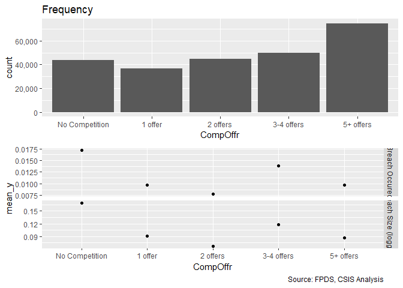<!-- -->

```
## [[1]]
## 
## No Competition        1 offer       2 offers     3-4 offers      5+ offers 
##          43835          36713          44916          49793          74743 
## 
## [[2]]
##                 
##                   None Ceiling Breach
##   No Competition 43083            752
##   1 offer        36356            357
##   2 offers       44566            350
##   3-4 offers     49101            692
##   5+ offers      74019            724
## 
## [[3]]
##                 
##                      0     1
##   No Competition 43335   500
##   1 offer        36307   406
##   2 offers       44612   304
##   3-4 offers     49263   530
##   5+ offers      73855   888
```

```r
#Model
ln_CBre_Comp_01A <- glm (data=smp,
                 ln_CBre_Then_Year ~ CompOffr)
summary(ln_CBre_Comp_01A)
```

```
## 
## Call:
## glm(formula = ln_CBre_Then_Year ~ CompOffr, data = smp)
## 
## Deviance Residuals: 
##     Min       1Q   Median       3Q      Max  
## -0.1623  -0.1178  -0.0905  -0.0889  19.4267  
## 
## Coefficients:
##                     Estimate Std. Error t value Pr(>|t|)    
## (Intercept)         0.162349   0.004847   33.49  < 2e-16 ***
## CompOffr1 offer    -0.073481   0.007179  -10.23  < 2e-16 ***
## CompOffr2 offers   -0.090903   0.006813  -13.34  < 2e-16 ***
## CompOffr3-4 offers -0.044597   0.006646   -6.71 1.95e-11 ***
## CompOffr5+ offers  -0.071841   0.006105  -11.77  < 2e-16 ***
## ---
## Signif. codes:  0 '***' 0.001 '**' 0.01 '*' 0.05 '.' 0.1 ' ' 1
## 
## (Dispersion parameter for gaussian family taken to be 1.029805)
## 
##     Null deviance: 257674  on 249999  degrees of freedom
## Residual deviance: 257446  on 249995  degrees of freedom
## AIC: 716819
## 
## Number of Fisher Scoring iterations: 2
```

```r
summary_residual_compare(ln_CBre_Comp_01A,bins=2, skip_vif=TRUE)
```

```
## Warning in if (class(model1_old) == "glmerMod") {: the condition has length
## > 1 and only the first element will be used
```

```
## Warning in if (class(model1_old) != "glmerMod" & class(model1_old) !=
## "glmerMod" & : the condition has length > 1 and only the first element will
## be used
```

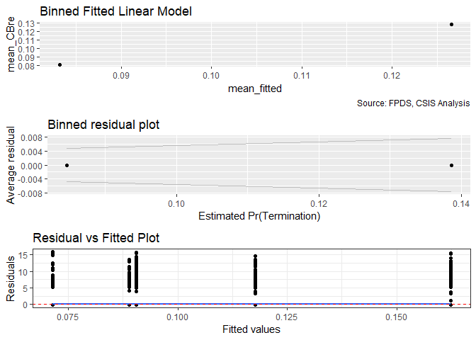<!-- -->

```
## NULL
```

For ceiling breaches, no competition is associated with high  frequency, though oddlt  so are 3-4 offers. Competition with 2 offers performs best. Nonetheless expectations are upheld across all variables as all forms of competition

## Study Variable Consolidation

### Level 6
#### Model NCS6A: l_def6_HHI_lag1

Expectations is that more consolidation is assoiated a change in occurance of breaches.

```r
#Frequency Plot for unlogged ceiling
summary_continuous_plot(smp1m,"def6_HHI_lag1",metric="cbre")
```

```
## Warning in `[<-.factor`(`*tmp*`, ri, value = c(0, 0, 0, 0, 0, 0, 0, 0, 0, :
## invalid factor level, NA generated
```

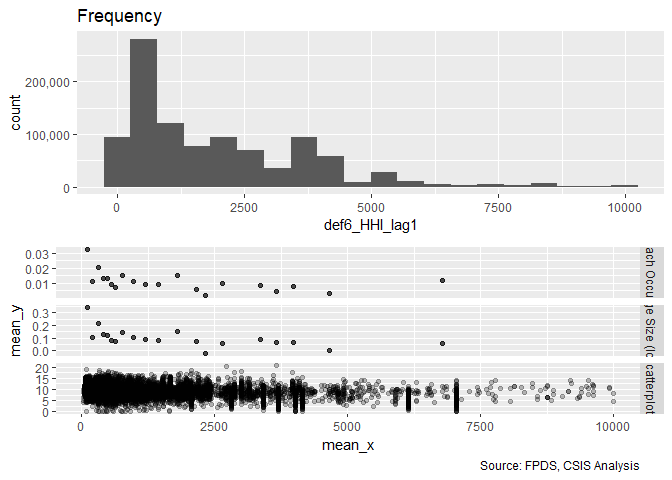<!-- -->

```r
summary_continuous_plot(smp1m,"def6_HHI_lag1",metric="cbre",log=TRUE)
```

```
## Warning in `[<-.factor`(`*tmp*`, ri, value = c(0, 0, 0, 0, 0, 0, 0, 0, 0, :
## invalid factor level, NA generated
```

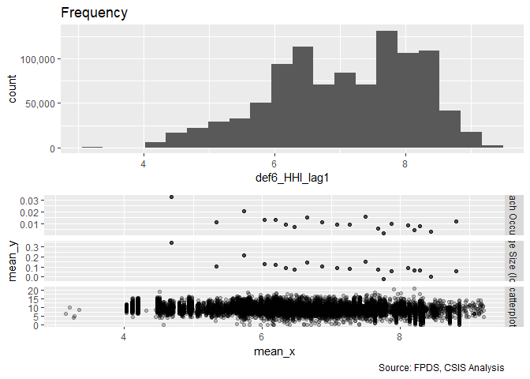<!-- -->

```r
summary_continuous_plot(smp1m,"def3_HHI_lag1",metric="cbre")
```

```
## Warning in `[<-.factor`(`*tmp*`, ri, value = c(0, 0, 0, 0, 0, 0, 0, 0, 0, :
## invalid factor level, NA generated
```

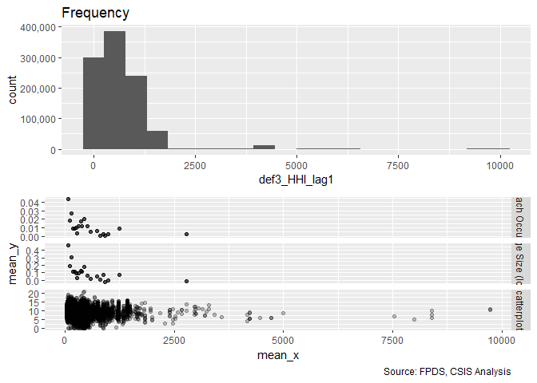<!-- -->

```r
summary_continuous_plot(smp1m,"def3_HHI_lag1",metric="cbre",log=TRUE)
```

```
## Warning in `[<-.factor`(`*tmp*`, ri, value = c(0, 0, 0, 0, 0, 0, 0, 0, 0, :
## invalid factor level, NA generated
```

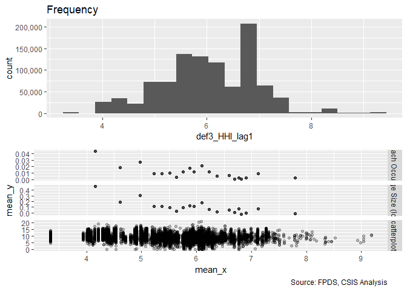<!-- -->

```r
#Model
ln_CBre_Cons_NCS6A <- glm (data=smp,
                 ln_CBre_Then_Year ~cl_def6_HHI_lag1)
summary(ln_CBre_Cons_NCS6A)
```

```
## 
## Call:
## glm(formula = ln_CBre_Then_Year ~ cl_def6_HHI_lag1, data = smp)
## 
## Deviance Residuals: 
##     Min       1Q   Median       3Q      Max  
## -0.2930  -0.1415  -0.0983  -0.0593  19.4423  
## 
## Coefficients:
##                  Estimate Std. Error t value Pr(>|t|)    
## (Intercept)       0.10221    0.00203   50.34   <2e-16 ***
## cl_def6_HHI_lag1 -0.10456    0.00408  -25.63   <2e-16 ***
## ---
## Signif. codes:  0 '***' 0.001 '**' 0.01 '*' 0.05 '.' 0.1 ' ' 1
## 
## (Dispersion parameter for gaussian family taken to be 1.028004)
## 
##     Null deviance: 257674  on 249999  degrees of freedom
## Residual deviance: 256999  on 249998  degrees of freedom
## AIC: 716378
## 
## Number of Fisher Scoring iterations: 2
```

```r
#Plot residuals versus fitted
  stargazer::stargazer(ln_CBre_Comp_01A,ln_CBre_Cons_NCS6A,type="text",
                       digits=2)
```

```
## 
## ===============================================
##                        Dependent variable:     
##                    ----------------------------
##                         ln_CBre_Then_Year      
##                         (1)            (2)     
## -----------------------------------------------
## CompOffr1 offer       -0.07***                 
##                        (0.01)                  
##                                                
## CompOffr2 offers      -0.09***                 
##                        (0.01)                  
##                                                
## CompOffr3-4 offers    -0.04***                 
##                        (0.01)                  
##                                                
## CompOffr5+ offers     -0.07***                 
##                        (0.01)                  
##                                                
## cl_def6_HHI_lag1                    -0.10***   
##                                      (0.004)   
##                                                
## Constant              0.16***        0.10***   
##                       (0.005)        (0.002)   
##                                                
## -----------------------------------------------
## Observations          250,000        250,000   
## Log Likelihood      -358,404.30    -358,187.00 
## Akaike Inf. Crit.    716,818.60    716,378.00  
## ===============================================
## Note:               *p<0.1; **p<0.05; ***p<0.01
```

```r
#For first model in category, include only the new model(s), skip_vif=true
summary_residual_compare(ln_CBre_Cons_NCS6A,bins=20,skip_vif = TRUE)
```

```
## Warning in if (class(model1_old) == "glmerMod") {: the condition has length
## > 1 and only the first element will be used
```

```
## Warning in if (class(model1_old) != "glmerMod" & class(model1_old) !=
## "glmerMod" & : the condition has length > 1 and only the first element will
## be used
```

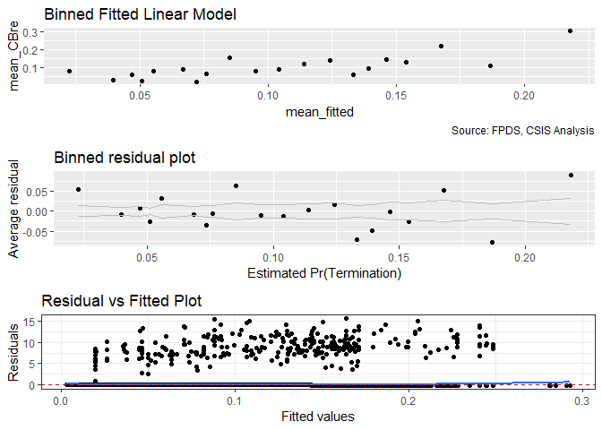<!-- -->

```
## NULL
```

Expectation is are upheld with a negative sign.

#### Model NCS6B: Defense to Overall ratio
The higher the ratio of defense obligations to reciepts in the overall economy, the DoD holds a monosopy over a sector. Given the challenges of monosopy, the a higher ratio estimates a greater  risk of ceiling breaches.

```r
#Frequency Plot for unlogged ceiling
summary_continuous_plot(smp1m,"capped_def6_ratio_lag1",metric="cbre")
```

```
## Warning in `[<-.factor`(`*tmp*`, ri, value = c(0, 0, 0, 0, 0, 0, 0, 0, 0, :
## invalid factor level, NA generated
```

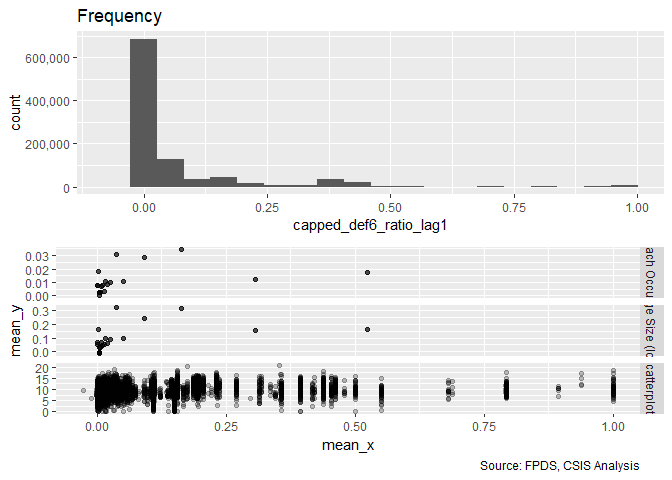<!-- -->

```r
      summary_continuous_plot(smp1m,"capped_def6_ratio_lag1",metric="cbre",log=TRUE)
```

```
## Warning in `[<-.factor`(`*tmp*`, ri, value = c(0, 0, 0, 0, 0, 0, 0, 0, 0, :
## invalid factor level, NA generated
```

```
## Warning: Removed 1171 rows containing non-finite values (stat_bin).
```

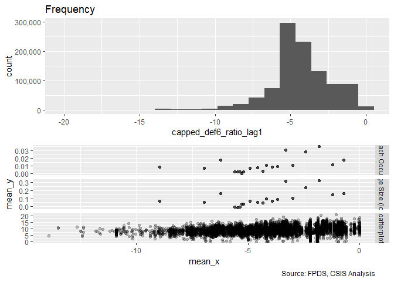<!-- -->

```r
      summary_continuous_plot(smp1m,"capped_def3_ratio_lag1",metric="cbre")
```

```
## Warning in `[<-.factor`(`*tmp*`, ri, value = c(0, 0, 0, 0, 0, 0, 0, 0, 0, :
## invalid factor level, NA generated
```

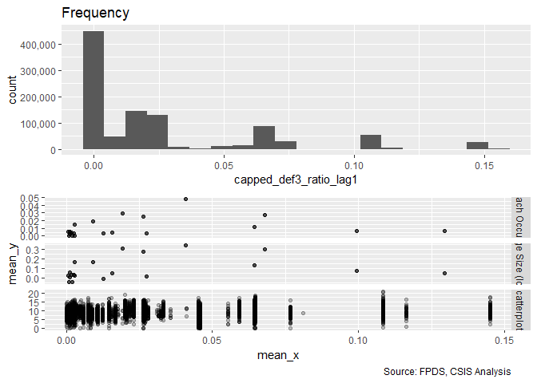<!-- -->

```r
      summary_continuous_plot(smp1m,"capped_def3_ratio_lag1",metric="cbre",log=TRUE)
```

```
## Warning in `[<-.factor`(`*tmp*`, ri, value = c(0, 0, 0, 0, 0, 0, 0, 0, 0, :
## invalid factor level, NA generated
```

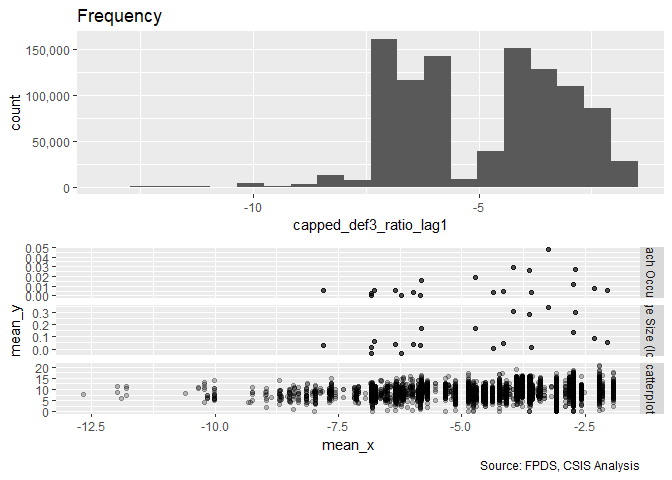<!-- -->

```r
#Model
ln_CBre_NCS6B <- glm (data=smp,
                 ln_CBre_Then_Year ~cl_def6_ratio_lag1)
summary(ln_CBre_NCS6B)
```

```
## 
## Call:
## glm(formula = ln_CBre_Then_Year ~ cl_def6_ratio_lag1, data = smp)
## 
## Deviance Residuals: 
##     Min       1Q   Median       3Q      Max  
## -0.9425  -0.1013  -0.0969  -0.0960  19.2684  
## 
## Coefficients:
##                    Estimate Std. Error t value Pr(>|t|)    
## (Intercept)        0.104155   0.002031   51.29   <2e-16 ***
## cl_def6_ratio_lag1 0.047400   0.003825   12.39   <2e-16 ***
## ---
## Signif. codes:  0 '***' 0.001 '**' 0.01 '*' 0.05 '.' 0.1 ' ' 1
## 
## (Dispersion parameter for gaussian family taken to be 1.030072)
## 
##     Null deviance: 257674  on 249999  degrees of freedom
## Residual deviance: 257516  on 249998  degrees of freedom
## AIC: 716880
## 
## Number of Fisher Scoring iterations: 2
```

```r
# 
# #Plot the fitted model plot
# ln_CBre_02A_curve<-function(x, Comp){invlogit(cbind(1,Comp,x) %*%  coef(ln_CBre_02A))}
# 
# #Competition curves
# fitted_ln_CBre_model(smp,"cl_Ceil_Then_Year") + stat_function(fun = ln_CBre_02A_curve, 
#                              args=list(Comp=0),color="blue")+
#   stat_function(fun = ln_CBre_02A_curve, 
#                              args=list(Comp=2),color="blue")


#Plot residuals versus fitted
  stargazer::stargazer(ln_CBre_Cons_NCS6A,ln_CBre_NCS6B,
                       ln_CBre_Comp_01A,type="text",
                       digits=2)
```

```
## 
## ======================================================
##                            Dependent variable:        
##                    -----------------------------------
##                             ln_CBre_Then_Year         
##                        (1)         (2)         (3)    
## ------------------------------------------------------
## cl_def6_HHI_lag1    -0.10***                          
##                      (0.004)                          
##                                                       
## cl_def6_ratio_lag1               0.05***              
##                                  (0.004)              
##                                                       
## CompOffr1 offer                             -0.07***  
##                                              (0.01)   
##                                                       
## CompOffr2 offers                            -0.09***  
##                                              (0.01)   
##                                                       
## CompOffr3-4 offers                          -0.04***  
##                                              (0.01)   
##                                                       
## CompOffr5+ offers                           -0.07***  
##                                              (0.01)   
##                                                       
## Constant             0.10***     0.10***     0.16***  
##                      (0.002)     (0.002)     (0.005)  
##                                                       
## ------------------------------------------------------
## Observations         250,000     250,000     250,000  
## Log Likelihood     -358,187.00 -358,438.20 -358,404.30
## Akaike Inf. Crit.  716,378.00  716,880.40  716,818.60 
## ======================================================
## Note:                      *p<0.1; **p<0.05; ***p<0.01
```

```r
#For first model in category, include only the new model(s), skip_vif=true
summary_residual_compare(ln_CBre_NCS6B,skip_vif=TRUE,bins=10)
```

```
## Warning in if (class(model1_old) == "glmerMod") {: the condition has length
## > 1 and only the first element will be used
```

```
## Warning in if (class(model1_old) != "glmerMod" & class(model1_old) !=
## "glmerMod" & : the condition has length > 1 and only the first element will
## be used
```

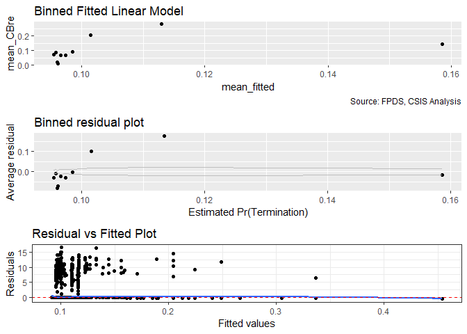<!-- -->

```
## NULL
```
The results align with expectations, when  ratio  is  logged.


#### Model NCS6C: cl_def6_obl_lag1
Defense sector obligations are added to better adjust for the fact that larger sectors tend to have lower HHI indices if only because they include a broader range of activities. In addition, Acting somewhat as a proxy for MDAP status, larger sectors may also have a greater risk of cascading problems. Thus greater defense obligations in a given sector are expected to estimate a greater likelihood over ceiling breaches,
Expectations are  unchanged.

```r
summary_continuous_plot(smp1m,"cl_def6_obl_lag1",metric="cbre")
```

```
## Warning in `[<-.factor`(`*tmp*`, ri, value = c(0, 0, 0, 0, 0, 0, 0, 0, 0, :
## invalid factor level, NA generated
```

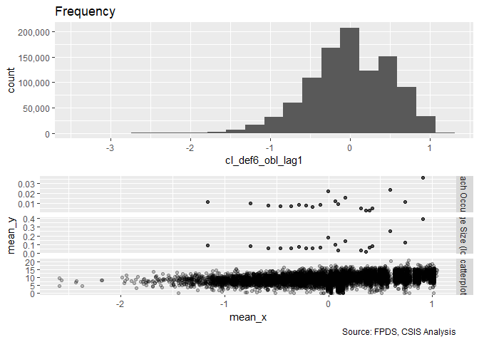<!-- -->

```r
      summary_continuous_plot(smp1m,"cl_def6_obl_lag1",metric="cbre",log=TRUE)
```

```
## Warning in `[<-.factor`(`*tmp*`, ri, value = c(0, 0, 0, 0, 0, 0, 0, 0, 0, :
## invalid factor level, NA generated
```

```
## Warning: Removed 476261 rows containing non-finite values (stat_bin).
```

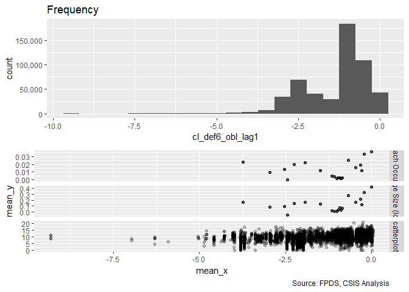<!-- -->

```r
#Model
ln_CBre_NCS6C <- glm (data=smp,
                 ln_CBre_Then_Year ~cl_def6_obl_lag1)
summary(ln_CBre_NCS6C)
```

```
## 
## Call:
## glm(formula = ln_CBre_Then_Year ~ cl_def6_obl_lag1, data = smp)
## 
## Deviance Residuals: 
##     Min       1Q   Median       3Q      Max  
## -0.1847  -0.1318  -0.1079  -0.0809  19.3581  
## 
## Coefficients:
##                  Estimate Std. Error t value Pr(>|t|)    
## (Intercept)      0.105047   0.002029   51.77   <2e-16 ***
## cl_def6_obl_lag1 0.071367   0.003982   17.92   <2e-16 ***
## ---
## Signif. codes:  0 '***' 0.001 '**' 0.01 '*' 0.05 '.' 0.1 ' ' 1
## 
## (Dispersion parameter for gaussian family taken to be 1.029382)
## 
##     Null deviance: 257674  on 249999  degrees of freedom
## Residual deviance: 257343  on 249998  degrees of freedom
## AIC: 716713
## 
## Number of Fisher Scoring iterations: 2
```

```r
#Plot residuals versus fitted
stargazer::stargazer(ln_CBre_Cons_NCS6A,ln_CBre_NCS6B,ln_CBre_NCS6C,
                       type="text",
                       digits=2)
```

```
## 
## ======================================================
##                            Dependent variable:        
##                    -----------------------------------
##                             ln_CBre_Then_Year         
##                        (1)         (2)         (3)    
## ------------------------------------------------------
## cl_def6_HHI_lag1    -0.10***                          
##                      (0.004)                          
##                                                       
## cl_def6_ratio_lag1               0.05***              
##                                  (0.004)              
##                                                       
## cl_def6_obl_lag1                             0.07***  
##                                              (0.004)  
##                                                       
## Constant             0.10***     0.10***     0.11***  
##                      (0.002)     (0.002)     (0.002)  
##                                                       
## ------------------------------------------------------
## Observations         250,000     250,000     250,000  
## Log Likelihood     -358,187.00 -358,438.20 -358,354.50
## Akaike Inf. Crit.  716,378.00  716,880.40  716,712.90 
## ======================================================
## Note:                      *p<0.1; **p<0.05; ***p<0.01
```

```r
#For first model in category, include only the new model(s), skip_vif=true
summary_residual_compare(ln_CBre_NCS6C,bins=10,skip_vif = TRUE)
```

```
## Warning in if (class(model1_old) == "glmerMod") {: the condition has length
## > 1 and only the first element will be used
```

```
## Warning in if (class(model1_old) != "glmerMod" & class(model1_old) !=
## "glmerMod" & : the condition has length > 1 and only the first element will
## be used
```

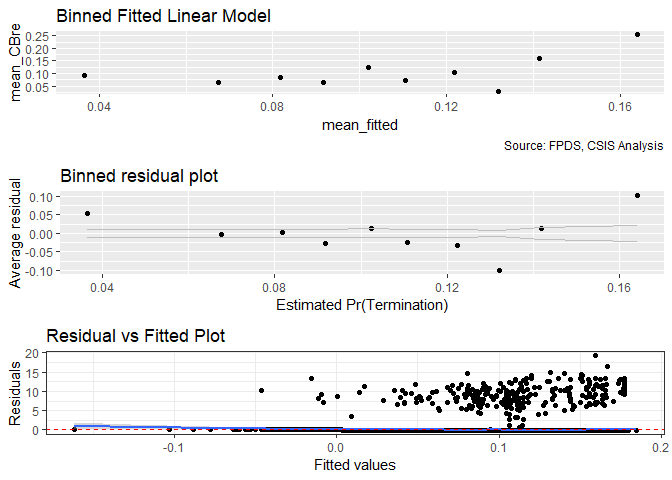<!-- -->

```
## NULL
```
The result runs contrary to expectation. It also may be introducing a potentially parabolic pattern to the residuals. For low values, the fitted value goes below the minimum possible outcome (0, corresponding to no/$1 dollar of growth) and at the high end the fitted values correspond with progressively larger ceiling breaches and end up estimating them.


#### Model NCS6D: Average Salary
Average salary can be an proxy for unobserved skill requirements. We expect that a greater skill requirement will estimate a greater risk of ceiling breaches.

```r
#Frequency Plot for unlogged ceiling

summary_continuous_plot(smp,"US6_avg_sal_lag1",metric="cbre")
```

```
## Warning in `[<-.factor`(`*tmp*`, ri, value = c(0, 0, 0, 0, 0, 0, 0, 0, 0, :
## invalid factor level, NA generated
```

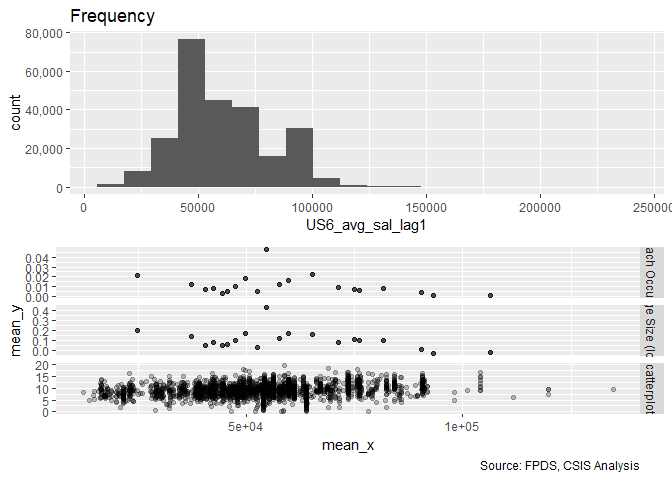<!-- -->

```r
summary_continuous_plot(smp,"US6_avg_sal_lag1",metric="cbre" ,log=TRUE)
```

```
## Warning in `[<-.factor`(`*tmp*`, ri, value = c(0, 0, 0, 0, 0, 0, 0, 0, 0, :
## invalid factor level, NA generated
```

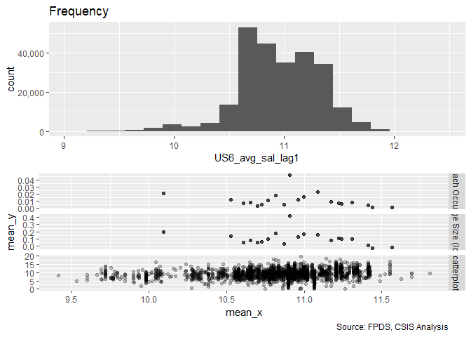<!-- -->

```r
#Model

ln_CBre_NCS6D <- glm (data=smp,
                 ln_CBre_Then_Year ~cl_US6_avg_sal_lag1 )
summary(ln_CBre_NCS6D)
```

```
## 
## Call:
## glm(formula = ln_CBre_Then_Year ~ cl_US6_avg_sal_lag1, data = smp)
## 
## Deviance Residuals: 
##     Min       1Q   Median       3Q      Max  
## -0.2259  -0.1210  -0.1054  -0.0870  19.4141  
## 
## Coefficients:
##                      Estimate Std. Error t value Pr(>|t|)    
## (Intercept)          0.103599   0.002033   50.96   <2e-16 ***
## cl_US6_avg_sal_lag1 -0.046928   0.004098  -11.45   <2e-16 ***
## ---
## Signif. codes:  0 '***' 0.001 '**' 0.01 '*' 0.05 '.' 0.1 ' ' 1
## 
## (Dispersion parameter for gaussian family taken to be 1.030164)
## 
##     Null deviance: 257674  on 249999  degrees of freedom
## Residual deviance: 257539  on 249998  degrees of freedom
## AIC: 716903
## 
## Number of Fisher Scoring iterations: 2
```

```r
#Plot residuals versus fitted
stargazer::stargazer(ln_CBre_Cons_NCS6A,ln_CBre_NCS6B,ln_CBre_NCS6C,ln_CBre_NCS6D,
                       type="text",
                       digits=2)
```

```
## 
## ===================================================================
##                                   Dependent variable:              
##                     -----------------------------------------------
##                                    ln_CBre_Then_Year               
##                         (1)         (2)         (3)         (4)    
## -------------------------------------------------------------------
## cl_def6_HHI_lag1     -0.10***                                      
##                       (0.004)                                      
##                                                                    
## cl_def6_ratio_lag1                0.05***                          
##                                   (0.004)                          
##                                                                    
## cl_def6_obl_lag1                              0.07***              
##                                               (0.004)              
##                                                                    
## cl_US6_avg_sal_lag1                                      -0.05***  
##                                                           (0.004)  
##                                                                    
## Constant              0.10***     0.10***     0.11***     0.10***  
##                       (0.002)     (0.002)     (0.002)     (0.002)  
##                                                                    
## -------------------------------------------------------------------
## Observations          250,000     250,000     250,000     250,000  
## Log Likelihood      -358,187.00 -358,438.20 -358,354.50 -358,449.40
## Akaike Inf. Crit.   716,378.00  716,880.40  716,712.90  716,902.90 
## ===================================================================
## Note:                                   *p<0.1; **p<0.05; ***p<0.01
```

```r
# For individual models, only the new model(s) unless they have a clear counterpart or alternate, skip_vif=true
summary_residual_compare(ln_CBre_NCS6D,bins=10,skip_vif = TRUE)
```

```
## Warning in if (class(model1_old) == "glmerMod") {: the condition has length
## > 1 and only the first element will be used
```

```
## Warning in if (class(model1_old) != "glmerMod" & class(model1_old) !=
## "glmerMod" & : the condition has length > 1 and only the first element will
## be used
```

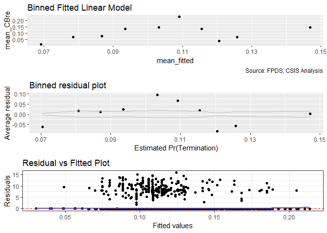<!-- -->

```
## NULL
```
Results run contrary to expectations. Interestingly, the scatter plot is more in line with expectations, suggesting that larger salary may be associated with less frequent but greater magnitude breaches.

#### Model NCS6E: Cumulative

```r
#Model
ln_CBre_Cons_NCS6E <- glm (data=smp,
                 ln_CBre_Then_Year ~cl_def6_HHI_lag1+cl_def6_ratio_lag1+cl_def6_obl_lag1+cl_US6_avg_sal_lag1)
glmer_examine(ln_CBre_Cons_NCS6E)
```

```
##    cl_def6_HHI_lag1  cl_def6_ratio_lag1    cl_def6_obl_lag1 
##            1.088559            1.206265            1.543640 
## cl_US6_avg_sal_lag1 
##            1.456995
```

```r
ln_CBre_Comp_NCS6E <- glm (data=smp,
                 ln_CBre_Then_Year ~CompOffr+cl_def6_ratio_lag1+cl_def6_obl_lag1+cl_US6_avg_sal_lag1)
glmer_examine(ln_CBre_Comp_NCS6E)
```

```
##                         GVIF Df GVIF^(1/(2*Df))
## CompOffr            1.083239  4        1.010045
## cl_def6_ratio_lag1  1.231815  1        1.109872
## cl_def6_obl_lag1    1.566792  1        1.251716
## cl_US6_avg_sal_lag1 1.395901  1        1.181482
```

```r
# 


#Plot residuals versus fitted
  stargazer::stargazer(ln_CBre_Cons_NCS6A,ln_CBre_NCS6B,ln_CBre_NCS6C,ln_CBre_NCS6D,ln_CBre_Cons_NCS6E,
                       ln_CBre_Comp_01A,ln_CBre_Comp_NCS6E,type="text",
                       digits=2)
```

```
## 
## =======================================================================================================
##                                                     Dependent variable:                                
##                     -----------------------------------------------------------------------------------
##                                                      ln_CBre_Then_Year                                 
##                         (1)         (2)         (3)         (4)         (5)         (6)         (7)    
## -------------------------------------------------------------------------------------------------------
## cl_def6_HHI_lag1     -0.10***                                        -0.10***                          
##                       (0.004)                                         (0.004)                          
##                                                                                                        
## cl_def6_ratio_lag1                0.05***                             0.0001                  -0.001   
##                                   (0.004)                             (0.004)                 (0.004)  
##                                                                                                        
## cl_def6_obl_lag1                              0.07***                 0.12***                 0.12***  
##                                               (0.004)                 (0.005)                 (0.005)  
##                                                                                                        
## cl_US6_avg_sal_lag1                                      -0.05***    -0.08***                -0.10***  
##                                                           (0.004)     (0.005)                 (0.005)  
##                                                                                                        
## CompOffr1 offer                                                                  -0.07***    -0.07***  
##                                                                                   (0.01)      (0.01)   
##                                                                                                        
## CompOffr2 offers                                                                 -0.09***    -0.08***  
##                                                                                   (0.01)      (0.01)   
##                                                                                                        
## CompOffr3-4 offers                                                               -0.04***    -0.03***  
##                                                                                   (0.01)      (0.01)   
##                                                                                                        
## CompOffr5+ offers                                                                -0.07***    -0.06***  
##                                                                                   (0.01)      (0.01)   
##                                                                                                        
## Constant              0.10***     0.10***     0.11***     0.10***     0.10***     0.16***     0.15***  
##                       (0.002)     (0.002)     (0.002)     (0.002)     (0.002)     (0.005)     (0.005)  
##                                                                                                        
## -------------------------------------------------------------------------------------------------------
## Observations          250,000     250,000     250,000     250,000     250,000     250,000     250,000  
## Log Likelihood      -358,187.00 -358,438.20 -358,354.50 -358,449.40 -357,834.70 -358,404.30 -358,011.10
## Akaike Inf. Crit.   716,378.00  716,880.40  716,712.90  716,902.90  715,679.40  716,818.60  716,038.20 
## =======================================================================================================
## Note:                                                                       *p<0.1; **p<0.05; ***p<0.01
```

```r
#For the first cumulative model(s) compare to compnent study variables, skip_vif =false
summary_residual_compare(ln_CBre_Cons_NCS6A,ln_CBre_Cons_NCS6E,bins=10)
```

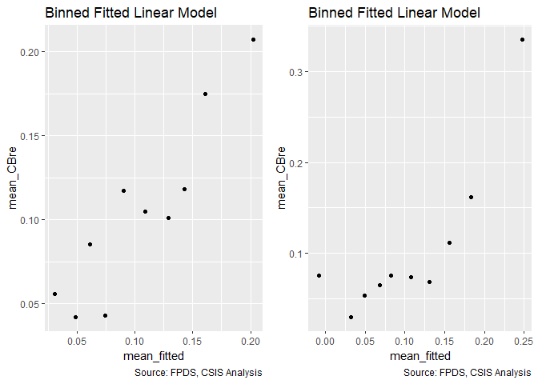<!-- -->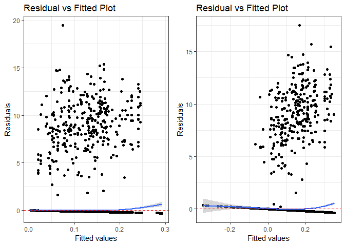<!-- -->

```
## Warning in if (class(model1_new) == "glmerMod") {: the condition has length
## > 1 and only the first element will be used
```

```
## Warning in if (class(model1_new) != "glmerMod" & class(model1_old) !=
## "glmerMod" & : the condition has length > 1 and only the first element will
## be used
```

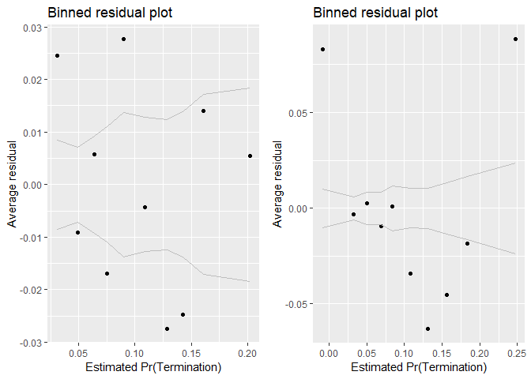<!-- -->

```
## [[1]]
##        model deviance null.deviance difference
## 1 model1_old 256998.9      257674.1    675.234
## 2 model1_new 256275.6      257674.1   1398.547
## 
## [[2]]
##    cl_def6_HHI_lag1  cl_def6_ratio_lag1    cl_def6_obl_lag1 
##            1.088559            1.206265            1.543640 
## cl_US6_avg_sal_lag1 
##            1.456995
```

```r
summary_residual_compare(ln_CBre_Comp_01A,ln_CBre_Comp_NCS6E,bins=2)
```

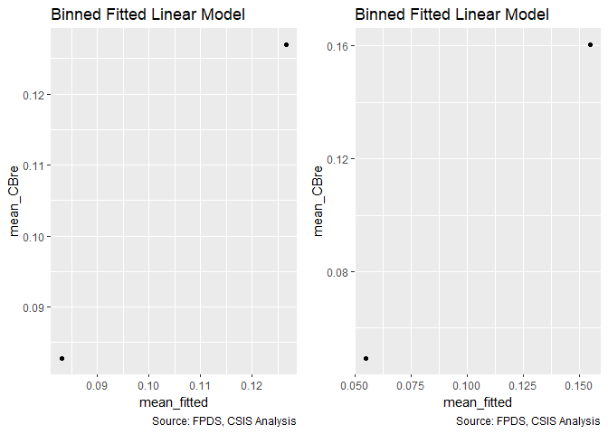<!-- -->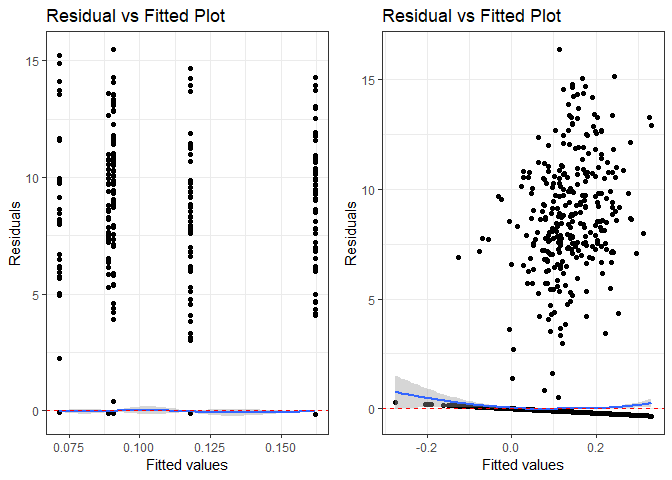<!-- -->

```
## Warning in if (class(model1_new) == "glmerMod") {: the condition has length
## > 1 and only the first element will be used

## Warning in if (class(model1_new) == "glmerMod") {: the condition has length
## > 1 and only the first element will be used
```

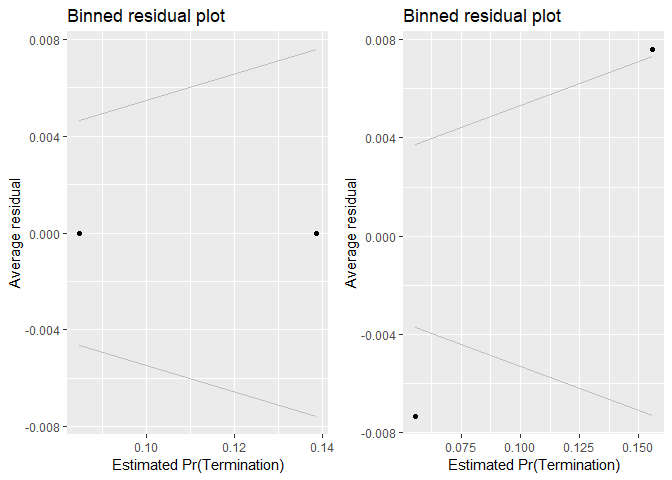<!-- -->

```
## [[1]]
##        model deviance null.deviance difference
## 1 model1_old 257446.0      257674.1   228.0822
## 2 model1_new 256637.5      257674.1  1036.6129
## 
## [[2]]
##                         GVIF Df GVIF^(1/(2*Df))
## CompOffr            1.083239  4        1.010045
## cl_def6_ratio_lag1  1.231815  1        1.109872
## cl_def6_obl_lag1    1.566792  1        1.251716
## cl_US6_avg_sal_lag1 1.395901  1        1.181482
```
Introducing other variables causes ratio to lose signifcance and increases the magnitude of obligations and average salary. 

The parabolic pattern in the binned residuals appears to have grown stronger once all of the NAICS6 variables are included in the same model. 


### Level 3
#### Model NCS3A: cl_def3_HHI
As with NAICS6, consolidation is expected to influence ceiling breach occurance/size, but the direction is not predicted.

```r
#Frequency Plot for unlogged ceiling
summary_continuous_plot(smp,"def3_HHI_lag1",metric="cbre")
```

```
## Warning in `[<-.factor`(`*tmp*`, ri, value = c(0, 0, 0, 0, 0, 0, 0, 0, 0, :
## invalid factor level, NA generated
```

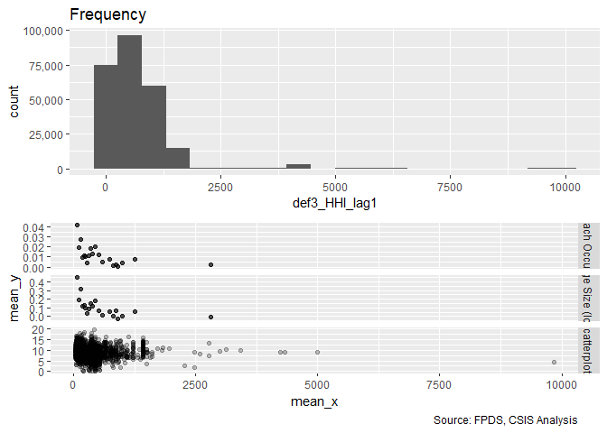<!-- -->

```r
summary_continuous_plot(smp,"def3_HHI_lag1",metric="cbre",log=TRUE)
```

```
## Warning in `[<-.factor`(`*tmp*`, ri, value = c(0, 0, 0, 0, 0, 0, 0, 0, 0, :
## invalid factor level, NA generated
```

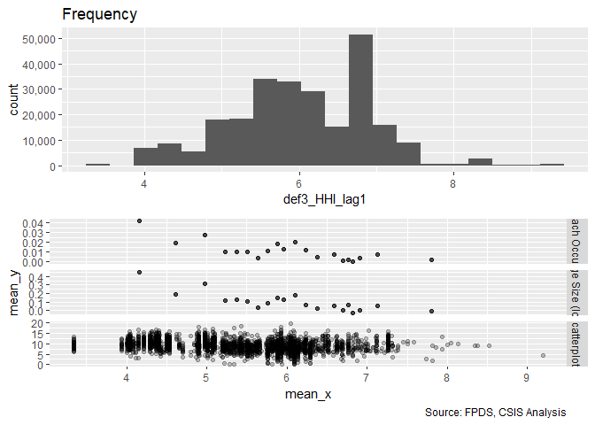<!-- -->

```r
#Model
ln_CBre_Cons_NCS3A <- glm (data=smp,
                 ln_CBre_Then_Year ~cl_def3_HHI_lag1)
summary(ln_CBre_Cons_NCS3A)
```

```
## 
## Call:
## glm(formula = ln_CBre_Then_Year ~ cl_def3_HHI_lag1, data = smp)
## 
## Deviance Residuals: 
##     Min       1Q   Median       3Q      Max  
## -0.3384  -0.1556  -0.1030  -0.0405  19.4142  
## 
## Coefficients:
##                   Estimate Std. Error t value Pr(>|t|)    
## (Intercept)       0.097040   0.002035   47.69   <2e-16 ***
## cl_def3_HHI_lag1 -0.158540   0.004161  -38.10   <2e-16 ***
## ---
## Signif. codes:  0 '***' 0.001 '**' 0.01 '*' 0.05 '.' 0.1 ' ' 1
## 
## (Dispersion parameter for gaussian family taken to be 1.024755)
## 
##     Null deviance: 257674  on 249999  degrees of freedom
## Residual deviance: 256187  on 249998  degrees of freedom
## AIC: 715587
## 
## Number of Fisher Scoring iterations: 2
```

```r
#Plot residuals versus fitted
stargazer::stargazer(ln_CBre_Cons_NCS6A,ln_CBre_Cons_NCS6E,ln_CBre_Cons_NCS3A,
                       ln_CBre_Comp_01A,ln_CBre_Comp_NCS6E,type="text",
                       digits=2)
```

```
## 
## ===============================================================================
##                                         Dependent variable:                    
##                     -----------------------------------------------------------
##                                          ln_CBre_Then_Year                     
##                         (1)         (2)         (3)         (4)         (5)    
## -------------------------------------------------------------------------------
## cl_def6_HHI_lag1     -0.10***    -0.10***                                      
##                       (0.004)     (0.004)                                      
##                                                                                
## cl_def6_ratio_lag1                0.0001                              -0.001   
##                                   (0.004)                             (0.004)  
##                                                                                
## cl_def6_obl_lag1                  0.12***                             0.12***  
##                                   (0.005)                             (0.005)  
##                                                                                
## cl_US6_avg_sal_lag1              -0.08***                            -0.10***  
##                                   (0.005)                             (0.005)  
##                                                                                
## cl_def3_HHI_lag1                             -0.16***                          
##                                               (0.004)                          
##                                                                                
## CompOffr1 offer                                          -0.07***    -0.07***  
##                                                           (0.01)      (0.01)   
##                                                                                
## CompOffr2 offers                                         -0.09***    -0.08***  
##                                                           (0.01)      (0.01)   
##                                                                                
## CompOffr3-4 offers                                       -0.04***    -0.03***  
##                                                           (0.01)      (0.01)   
##                                                                                
## CompOffr5+ offers                                        -0.07***    -0.06***  
##                                                           (0.01)      (0.01)   
##                                                                                
## Constant              0.10***     0.10***     0.10***     0.16***     0.15***  
##                       (0.002)     (0.002)     (0.002)     (0.005)     (0.005)  
##                                                                                
## -------------------------------------------------------------------------------
## Observations          250,000     250,000     250,000     250,000     250,000  
## Log Likelihood      -358,187.00 -357,834.70 -357,791.30 -358,404.30 -358,011.10
## Akaike Inf. Crit.   716,378.00  715,679.40  715,586.70  716,818.60  716,038.20 
## ===============================================================================
## Note:                                               *p<0.1; **p<0.05; ***p<0.01
```

```r
#For subsequent models in category, compare to prior in category or prior highly relevant, skip_vif=true
summary_residual_compare(ln_CBre_Cons_NCS6A,ln_CBre_Cons_NCS3A,bins=20,skip_vif=TRUE)
```

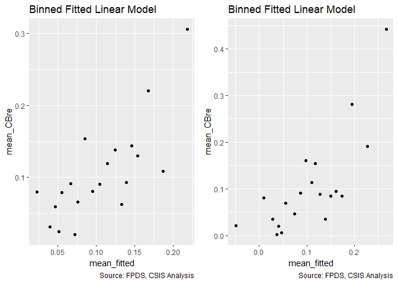<!-- -->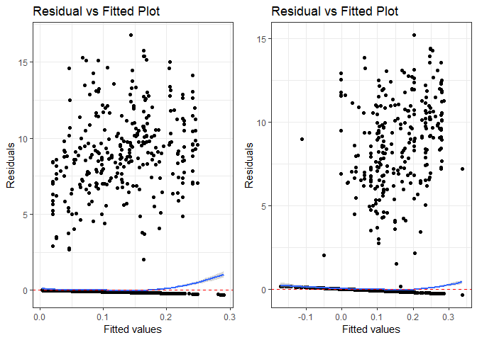<!-- -->

```
## Warning in if (class(model1_new) == "glmerMod") {: the condition has length
## > 1 and only the first element will be used
```

```
## Warning in if (class(model1_new) != "glmerMod" & class(model1_old) !=
## "glmerMod" & : the condition has length > 1 and only the first element will
## be used
```

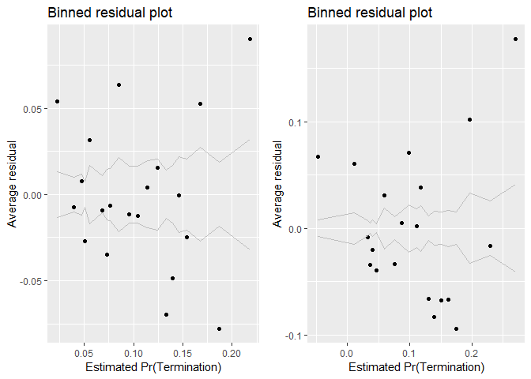<!-- -->

```
## NULL
```

Expectations are upheld with a negative sign. That said, this is another case where the frequency and the magnitude of ceiling breaches may be trending in opposite directions.

#### Model NCS3B: Defense to Overall ratio
The higher the ratio of defense obligations to reciepts in the overall economy, the DoD holds a monosopy over a sector. Given the challenges of monosopy, the a higher ratio estimates a greater  risk of ceiling breaches.

```r
#Frequency Plot for unlogged ceiling


summary_continuous_plot(smp,"capped_def3_ratio_lag1",metric="cbre")
```

```
## Warning in `[<-.factor`(`*tmp*`, ri, value = c(0, 0, 0, 0, 0, 0, 0, 0, 0, :
## invalid factor level, NA generated
```

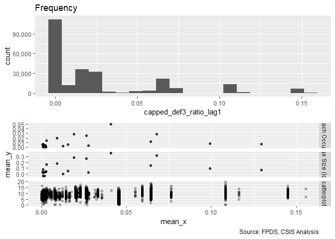<!-- -->

```r
summary_continuous_plot(smp,"capped_def3_ratio_lag1",metric="cbre",log=TRUE)
```

```
## Warning in `[<-.factor`(`*tmp*`, ri, value = c(0, 0, 0, 0, 0, 0, 0, 0, 0, :
## invalid factor level, NA generated
```

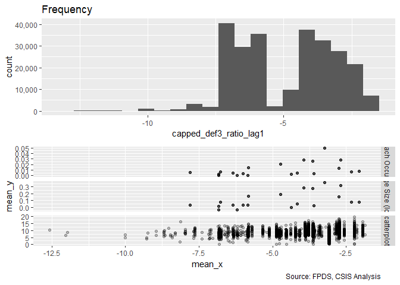<!-- -->

```r
#Model
ln_CBre_NCS3B <- glm (data=smp,
                 ln_CBre_Then_Year ~ cl_def3_ratio_lag1)
summary(ln_CBre_NCS3B)
```

```
## 
## Call:
## glm(formula = ln_CBre_Then_Year ~ cl_def3_ratio_lag1, data = smp)
## 
## Deviance Residuals: 
##     Min       1Q   Median       3Q      Max  
## -0.2202  -0.1063  -0.0906  -0.0830  19.3393  
## 
## Coefficients:
##                    Estimate Std. Error t value Pr(>|t|)    
## (Intercept)         0.10442    0.00203   51.45   <2e-16 ***
## cl_def3_ratio_lag1  0.06677    0.00419   15.93   <2e-16 ***
## ---
## Signif. codes:  0 '***' 0.001 '**' 0.01 '*' 0.05 '.' 0.1 ' ' 1
## 
## (Dispersion parameter for gaussian family taken to be 1.029659)
## 
##     Null deviance: 257674  on 249999  degrees of freedom
## Residual deviance: 257413  on 249998  degrees of freedom
## AIC: 716780
## 
## Number of Fisher Scoring iterations: 2
```

```r
# 
stargazer::stargazer(ln_CBre_Cons_NCS3A,ln_CBre_NCS3B,ln_CBre_NCS6B,ln_CBre_Cons_NCS6A,ln_CBre_Cons_NCS6E,
                       ln_CBre_Comp_01A,ln_CBre_Comp_NCS6E,
                     type="text",
                       digits=2)
```

```
## 
## =======================================================================================================
##                                                     Dependent variable:                                
##                     -----------------------------------------------------------------------------------
##                                                      ln_CBre_Then_Year                                 
##                         (1)         (2)         (3)         (4)         (5)         (6)         (7)    
## -------------------------------------------------------------------------------------------------------
## cl_def3_HHI_lag1     -0.16***                                                                          
##                       (0.004)                                                                          
##                                                                                                        
## cl_def3_ratio_lag1                0.07***                                                              
##                                   (0.004)                                                              
##                                                                                                        
## cl_def6_ratio_lag1                            0.05***                 0.0001                  -0.001   
##                                               (0.004)                 (0.004)                 (0.004)  
##                                                                                                        
## cl_def6_obl_lag1                                                      0.12***                 0.12***  
##                                                                       (0.005)                 (0.005)  
##                                                                                                        
## cl_US6_avg_sal_lag1                                                  -0.08***                -0.10***  
##                                                                       (0.005)                 (0.005)  
##                                                                                                        
## cl_def6_HHI_lag1                                         -0.10***    -0.10***                          
##                                                           (0.004)     (0.004)                          
##                                                                                                        
## CompOffr1 offer                                                                  -0.07***    -0.07***  
##                                                                                   (0.01)      (0.01)   
##                                                                                                        
## CompOffr2 offers                                                                 -0.09***    -0.08***  
##                                                                                   (0.01)      (0.01)   
##                                                                                                        
## CompOffr3-4 offers                                                               -0.04***    -0.03***  
##                                                                                   (0.01)      (0.01)   
##                                                                                                        
## CompOffr5+ offers                                                                -0.07***    -0.06***  
##                                                                                   (0.01)      (0.01)   
##                                                                                                        
## Constant              0.10***     0.10***     0.10***     0.10***     0.10***     0.16***     0.15***  
##                       (0.002)     (0.002)     (0.002)     (0.002)     (0.002)     (0.005)     (0.005)  
##                                                                                                        
## -------------------------------------------------------------------------------------------------------
## Observations          250,000     250,000     250,000     250,000     250,000     250,000     250,000  
## Log Likelihood      -357,791.30 -358,388.10 -358,438.20 -358,187.00 -357,834.70 -358,404.30 -358,011.10
## Akaike Inf. Crit.   715,586.70  716,780.20  716,880.40  716,378.00  715,679.40  716,818.60  716,038.20 
## =======================================================================================================
## Note:                                                                       *p<0.1; **p<0.05; ***p<0.01
```

```r
#For subsequent models in category, compare to prior in category or prior highly relevant, skip_vif=true
summary_residual_compare(ln_CBre_NCS6B,ln_CBre_NCS3B,bins=10,skip_vif = TRUE)
```

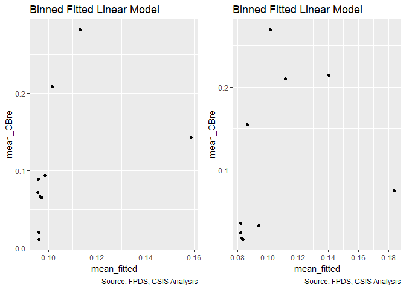<!-- --><!-- -->

```
## Warning in if (class(model1_new) == "glmerMod") {: the condition has length
## > 1 and only the first element will be used
```

```
## Warning in if (class(model1_new) != "glmerMod" & class(model1_old) !=
## "glmerMod" & : the condition has length > 1 and only the first element will
## be used
```

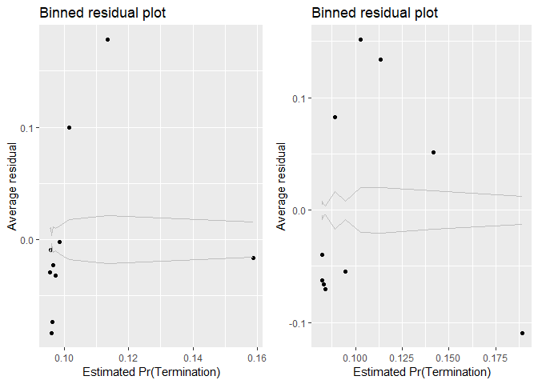<!-- -->

```
## NULL
```
The results align with the hypothesis, although the magnitude is small, if larger in magnitude than the level 6 version. 


#### Model NCS3C: Cumulative Model
Consolidation at lessa nd more granular levels may have different effects. Efficiencies are often used to describe sectors, like utilities, with high barriers to entry. Many of these aspects seem like they would already be captured at less granular NAICS levels, e.g. power plants, rather than more specific NAICS levels, like solar vs. coal. As a result, consolidation for more granular NAICS codes should estimate higher rates of ceiling breaches compared to less granular NAICS code.

We'll start by adding in everything from both models and seeing what violates VIF.

```r
#Frequency Plot for unlogged ceiling


#Model
ln_CBre_Cons_NCS3C <- glm (data=smp,
                 ln_CBre_Then_Year ~cl_def6_HHI_lag1+cl_def6_ratio_lag1+cl_def6_obl_lag1+cl_US6_avg_sal_lag1+
                   cl_def3_HHI_lag1+cl_def3_ratio_lag1)
glmer_examine(ln_CBre_Cons_NCS3C)
```

```
##    cl_def6_HHI_lag1  cl_def6_ratio_lag1    cl_def6_obl_lag1 
##            1.639310            1.589055            1.608661 
## cl_US6_avg_sal_lag1    cl_def3_HHI_lag1  cl_def3_ratio_lag1 
##            1.467194            1.578228            1.633065
```

```r
ln_CBre_Comp_NCS3C <- glm (data=smp,
                 ln_CBre_Then_Year ~CompOffr+
                   cl_def6_ratio_lag1+cl_def6_obl_lag1+cl_US6_avg_sal_lag1+
                   cl_def3_ratio_lag1)
glmer_examine(ln_CBre_Comp_NCS3C)
```

```
##                         GVIF Df GVIF^(1/(2*Df))
## CompOffr            1.149123  4        1.017527
## cl_def6_ratio_lag1  1.580924  1        1.257348
## cl_def6_obl_lag1    1.634323  1        1.278406
## cl_US6_avg_sal_lag1 1.397326  1        1.182085
## cl_def3_ratio_lag1  1.614084  1        1.270466
```

```r
# 


#Plot residuals versus fitted
  stargazer::stargazer(ln_CBre_Cons_NCS6A,ln_CBre_Cons_NCS6E,
                       ln_CBre_Cons_NCS3A,ln_CBre_NCS3B,ln_CBre_Cons_NCS3C,
                       ln_CBre_Comp_01A,ln_CBre_Comp_NCS6E,ln_CBre_Comp_NCS3C,type="text",
                       digits=2)
```

```
## 
## ===================================================================================================================
##                                                           Dependent variable:                                      
##                     -----------------------------------------------------------------------------------------------
##                                                            ln_CBre_Then_Year                                       
##                         (1)         (2)         (3)         (4)         (5)         (6)         (7)         (8)    
## -------------------------------------------------------------------------------------------------------------------
## cl_def6_HHI_lag1     -0.10***    -0.10***                            -0.02***                                      
##                       (0.004)     (0.004)                             (0.01)                                       
##                                                                                                                    
## cl_def6_ratio_lag1                0.0001                              -0.001                  -0.001     -0.01***  
##                                   (0.004)                             (0.005)                 (0.004)     (0.005)  
##                                                                                                                    
## cl_def6_obl_lag1                  0.12***                             0.11***                 0.12***     0.11***  
##                                   (0.005)                             (0.01)                  (0.005)     (0.01)   
##                                                                                                                    
## cl_US6_avg_sal_lag1              -0.08***                            -0.07***                -0.10***    -0.10***  
##                                   (0.005)                             (0.005)                 (0.005)     (0.005)  
##                                                                                                                    
## cl_def3_HHI_lag1                             -0.16***                -0.13***                                      
##                                               (0.004)                 (0.01)                                       
##                                                                                                                    
## cl_def3_ratio_lag1                                        0.07***      -0.01                              0.03***  
##                                                           (0.004)     (0.01)                              (0.01)   
##                                                                                                                    
## CompOffr1 offer                                                                  -0.07***    -0.07***    -0.06***  
##                                                                                   (0.01)      (0.01)      (0.01)   
##                                                                                                                    
## CompOffr2 offers                                                                 -0.09***    -0.08***    -0.07***  
##                                                                                   (0.01)      (0.01)      (0.01)   
##                                                                                                                    
## CompOffr3-4 offers                                                               -0.04***    -0.03***    -0.03***  
##                                                                                   (0.01)      (0.01)      (0.01)   
##                                                                                                                    
## CompOffr5+ offers                                                                -0.07***    -0.06***    -0.06***  
##                                                                                   (0.01)      (0.01)      (0.01)   
##                                                                                                                    
## Constant              0.10***     0.10***     0.10***     0.10***     0.10***     0.16***     0.15***     0.15***  
##                       (0.002)     (0.002)     (0.002)     (0.002)     (0.002)     (0.005)     (0.005)     (0.005)  
##                                                                                                                    
## -------------------------------------------------------------------------------------------------------------------
## Observations          250,000     250,000     250,000     250,000     250,000     250,000     250,000     250,000  
## Log Likelihood      -358,187.00 -357,834.70 -357,791.30 -358,388.10 -357,501.70 -358,404.30 -358,011.10 -357,998.00
## Akaike Inf. Crit.   716,378.00  715,679.40  715,586.70  716,780.20  715,017.50  716,818.60  716,038.20  716,013.90 
## ===================================================================================================================
## Note:                                                                                   *p<0.1; **p<0.05; ***p<0.01
```

```r
# 
# #Plot the fitted model plot
# ln_CBre_02A_curve<-function(x, Comp){invlogit(cbind(1,Comp,x) %*%  coef(ln_CBre_02A))}
# 
# #Competition curves
# fitted_ln_CBre_model(smp,"cl_Ceil_Then_Year") + stat_function(fun = ln_CBre_02A_curve, 
#                              args=list(Comp=0),color="blue")+
#   stat_function(fun = ln_CBre_02A_curve, 
#                              args=list(Comp=2),color="blue")


#ompare with cumulative consolidation and competition
summary_residual_compare(ln_CBre_Cons_NCS6E,ln_CBre_Cons_NCS3C,ln_CBre_Comp_NCS6E,ln_CBre_Comp_NCS3C,bins=10)
```

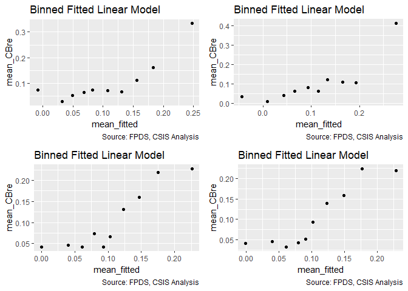<!-- -->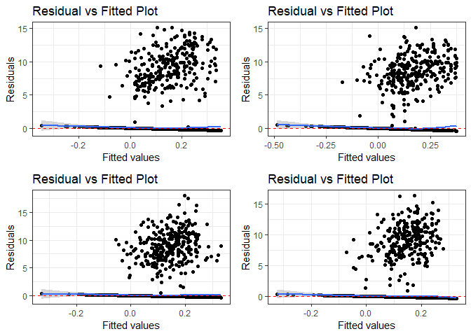<!-- -->

```
## Warning in if (class(model1_new) == "glmerMod" & class(model2_new) ==
## "glmerMod" & : the condition has length > 1 and only the first element will
## be used
```

```
## Warning in if ((class(model1_new) != "glmerMod" & class(model2_new) !
## = "glmerMod") & : the condition has length > 1 and only the first element
## will be used
```

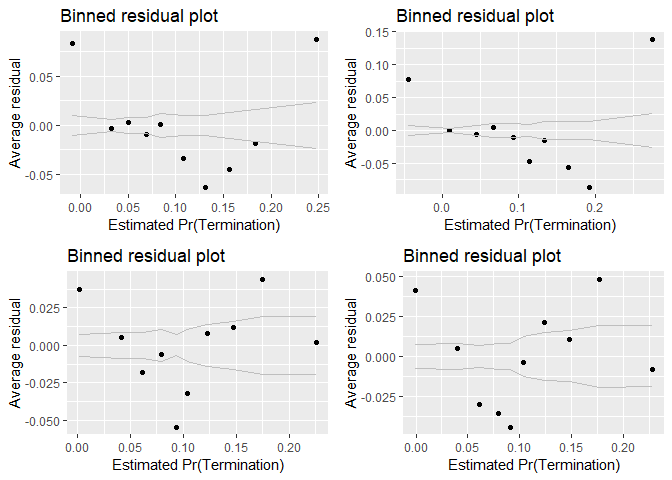<!-- -->

```
## [[1]]
##        model deviance null.deviance difference
## 1 model1_old 256275.6      257674.1   1398.547
## 2 model1_new 255593.9      257674.1   2080.251
## 3 model2_old 256637.5      257674.1   1036.613
## 4 model2_new 256610.5      257674.1   1063.569
## 
## [[2]]
##    cl_def6_HHI_lag1  cl_def6_ratio_lag1    cl_def6_obl_lag1 
##            1.639310            1.589055            1.608661 
## cl_US6_avg_sal_lag1    cl_def3_HHI_lag1  cl_def3_ratio_lag1 
##            1.467194            1.578228            1.633065 
## 
## [[3]]
##                         GVIF Df GVIF^(1/(2*Df))
## CompOffr            1.149123  4        1.017527
## cl_def6_ratio_lag1  1.580924  1        1.257348
## cl_def6_obl_lag1    1.634323  1        1.278406
## cl_US6_avg_sal_lag1 1.397326  1        1.182085
## cl_def3_ratio_lag1  1.614084  1        1.270466
```
Def 6 HHI reduced in magnitude. Def 3 ratio loses significance for consolidation but merely  reduces  in magnitude for competition, althouogh def 6 ratio is now significant in the opposite direction. and changes sign.

Otherwise some reduction in magnitude, e.g. for 3-4 offers, but nothing dramatic.


##Scope Variables
###Model 02A: Cost Ceiling


```r
#Frequency Plot for unlogged ceiling
summary_continuous_plot(smp,"UnmodifiedCeiling_Then_Year",metric="cbre",
               bins=1000)
```

```
## Warning in `[<-.factor`(`*tmp*`, ri, value = c(0, 0, 0, 0, 0, 0, 0, 0, 0, :
## invalid factor level, NA generated
```

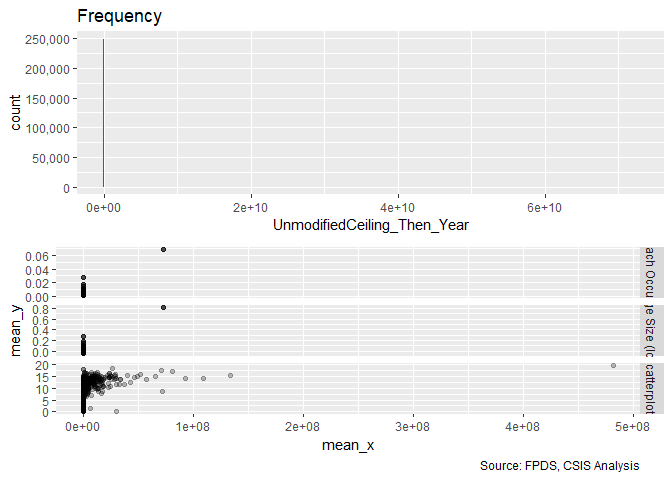<!-- -->

```r
#Frequency Plot for logged ceiling
summary_continuous_plot(smp,"UnmodifiedCeiling_Then_Year",metric="cbre",
               log=TRUE)
```

```
## Warning in `[<-.factor`(`*tmp*`, ri, value = c(0, 0, 0, 0, 0, 0, 0, 0, 0, :
## invalid factor level, NA generated
```

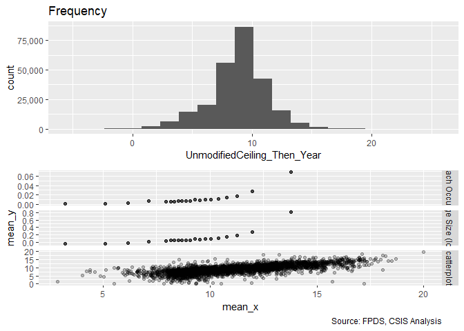<!-- -->

```r
#Model
ln_CBre_02A <- glm (data=smp,
                 ln_CBre_Then_Year ~ cl_Ceil_Then_Year)
summary(ln_CBre_02A)
```

```
## 
## Call:
## glm(formula = ln_CBre_Then_Year ~ cl_Ceil_Then_Year, data = smp)
## 
## Deviance Residuals: 
##     Min       1Q   Median       3Q      Max  
## -0.9790  -0.1729  -0.1067  -0.0580  18.8104  
## 
## Coefficients:
##                   Estimate Std. Error t value Pr(>|t|)    
## (Intercept)       -0.62800    0.01177  -53.37   <2e-16 ***
## cl_Ceil_Then_Year  1.60701    0.02542   63.21   <2e-16 ***
## ---
## Signif. codes:  0 '***' 0.001 '**' 0.01 '*' 0.05 '.' 0.1 ' ' 1
## 
## (Dispersion parameter for gaussian family taken to be 1.014492)
## 
##     Null deviance: 257674  on 249999  degrees of freedom
## Residual deviance: 253621  on 249998  degrees of freedom
## AIC: 713070
## 
## Number of Fisher Scoring iterations: 2
```

```r
#Plot residuals versus fitted
stargazer::stargazer(ln_CBre_02A,ln_CBre_Cons_NCS6A,ln_CBre_Cons_NCS3A,ln_CBre_Cons_NCS3C,
                       ln_CBre_Comp_01A,ln_CBre_Comp_NCS3C,type="text",
                       digits=2)
```

```
## 
## ===========================================================================================
##                                               Dependent variable:                          
##                     -----------------------------------------------------------------------
##                                                ln_CBre_Then_Year                           
##                         (1)         (2)         (3)         (4)         (5)         (6)    
## -------------------------------------------------------------------------------------------
## cl_Ceil_Then_Year     1.61***                                                              
##                       (0.03)                                                               
##                                                                                            
## cl_def6_HHI_lag1                 -0.10***                -0.02***                          
##                                   (0.004)                 (0.01)                           
##                                                                                            
## cl_def6_ratio_lag1                                        -0.001                 -0.01***  
##                                                           (0.005)                 (0.005)  
##                                                                                            
## cl_def6_obl_lag1                                          0.11***                 0.11***  
##                                                           (0.01)                  (0.01)   
##                                                                                            
## cl_US6_avg_sal_lag1                                      -0.07***                -0.10***  
##                                                           (0.005)                 (0.005)  
##                                                                                            
## cl_def3_HHI_lag1                             -0.16***    -0.13***                          
##                                               (0.004)     (0.01)                           
##                                                                                            
## cl_def3_ratio_lag1                                         -0.01                  0.03***  
##                                                           (0.01)                  (0.01)   
##                                                                                            
## CompOffr1 offer                                                      -0.07***    -0.06***  
##                                                                       (0.01)      (0.01)   
##                                                                                            
## CompOffr2 offers                                                     -0.09***    -0.07***  
##                                                                       (0.01)      (0.01)   
##                                                                                            
## CompOffr3-4 offers                                                   -0.04***    -0.03***  
##                                                                       (0.01)      (0.01)   
##                                                                                            
## CompOffr5+ offers                                                    -0.07***    -0.06***  
##                                                                       (0.01)      (0.01)   
##                                                                                            
## Constant             -0.63***     0.10***     0.10***     0.10***     0.16***     0.15***  
##                       (0.01)      (0.002)     (0.002)     (0.002)     (0.005)     (0.005)  
##                                                                                            
## -------------------------------------------------------------------------------------------
## Observations          250,000     250,000     250,000     250,000     250,000     250,000  
## Log Likelihood      -356,533.10 -358,187.00 -357,791.30 -357,501.70 -358,404.30 -357,998.00
## Akaike Inf. Crit.   713,070.20  716,378.00  715,586.70  715,017.50  716,818.60  716,013.90 
## ===========================================================================================
## Note:                                                           *p<0.1; **p<0.05; ***p<0.01
```

```r
#For first model in category, include only the new model(s), skip_vif=true
summary_residual_compare(ln_CBre_02A,bins=20,skip_vif = TRUE)
```

```
## Warning in if (class(model1_old) == "glmerMod") {: the condition has length
## > 1 and only the first element will be used
```

```
## Warning in if (class(model1_old) != "glmerMod" & class(model1_old) !=
## "glmerMod" & : the condition has length > 1 and only the first element will
## be used
```

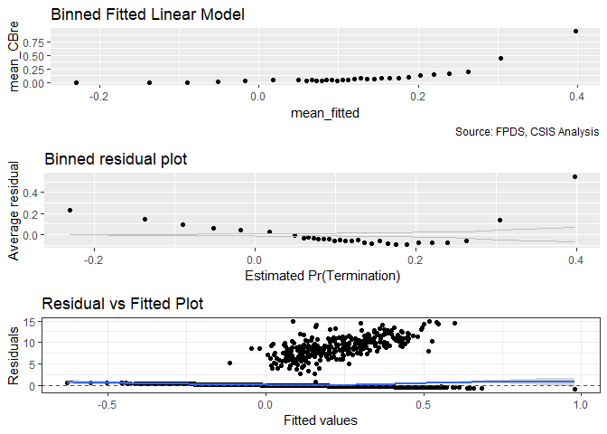<!-- -->

```
## NULL
```

Contract ceiling has a significant relationship, the largest magnitude of the models yet included, and more explanatory power than the previous cumulative model. That said, while the relationship  with contract size for the sample that overruns appears to be linear (once both are logged), the relatonship with frequency appears to follow an exponential pattern. Likewise the residuals are parabolic. Perhaps l_ceil^2 should be introduced.


###Model 02B: Maximum Duration


```r
#Frequency Plot for max duration
summary_continuous_plot(smp,"UnmodifiedDays",
               bins=1000,metric="cbre")
```

```
## Warning in `[<-.factor`(`*tmp*`, ri, value = c(0, 0, 0, 0, 0, 0, 0, 0, 0, :
## invalid factor level, NA generated
```

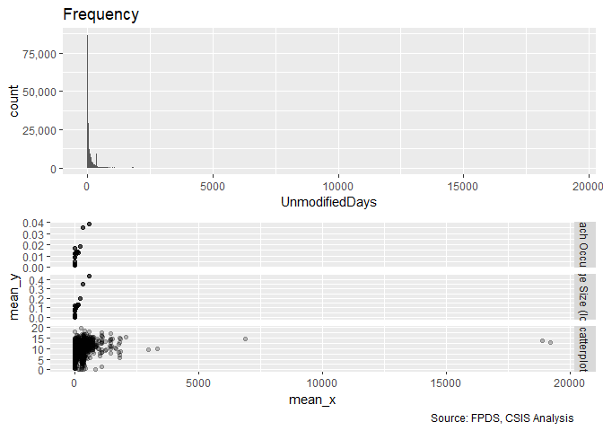<!-- -->

```r
#Frequency Plot for logged max duration
summary_continuous_plot(smp,"UnmodifiedDays", metric="cbre",log=TRUE)
```

```
## Warning in `[<-.factor`(`*tmp*`, ri, value = c(0, 0, 0, 0, 0, 0, 0, 0, 0, :
## invalid factor level, NA generated
```

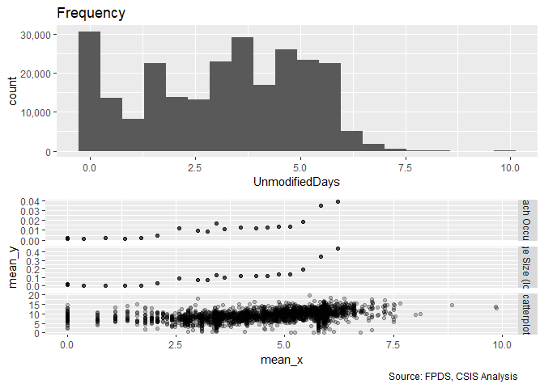<!-- -->

```r
#Model
ln_CBre_02B <- glm (data=smp,
                 ln_CBre_Then_Year ~ cl_Days )
summary(ln_CBre_02B)
```

```
## 
## Call:
## glm(formula = ln_CBre_Then_Year ~ cl_Days, data = smp)
## 
## Deviance Residuals: 
##     Min       1Q   Median       3Q      Max  
## -0.4161  -0.1787  -0.1159  -0.0244  19.3001  
## 
## Coefficients:
##             Estimate Std. Error t value Pr(>|t|)    
## (Intercept) 0.100143   0.002026   49.44   <2e-16 ***
## cl_Days     0.174524   0.003999   43.64   <2e-16 ***
## ---
## Signif. codes:  0 '***' 0.001 '**' 0.01 '*' 0.05 '.' 0.1 ' ' 1
## 
## (Dispersion parameter for gaussian family taken to be 1.022911)
## 
##     Null deviance: 257674  on 249999  degrees of freedom
## Residual deviance: 255726  on 249998  degrees of freedom
## AIC: 715136
## 
## Number of Fisher Scoring iterations: 2
```

```r
stargazer::stargazer(ln_CBre_02A,ln_CBre_02B,ln_CBre_Cons_NCS6A,ln_CBre_Cons_NCS3A,ln_CBre_Cons_NCS3C,
                       ln_CBre_Comp_01A,ln_CBre_Comp_NCS3C,type="text",
                       digits=2)
```

```
## 
## =======================================================================================================
##                                                     Dependent variable:                                
##                     -----------------------------------------------------------------------------------
##                                                      ln_CBre_Then_Year                                 
##                         (1)         (2)         (3)         (4)         (5)         (6)         (7)    
## -------------------------------------------------------------------------------------------------------
## cl_Ceil_Then_Year     1.61***                                                                          
##                       (0.03)                                                                           
##                                                                                                        
## cl_Days                           0.17***                                                              
##                                   (0.004)                                                              
##                                                                                                        
## cl_def6_HHI_lag1                             -0.10***                -0.02***                          
##                                               (0.004)                 (0.01)                           
##                                                                                                        
## cl_def6_ratio_lag1                                                    -0.001                 -0.01***  
##                                                                       (0.005)                 (0.005)  
##                                                                                                        
## cl_def6_obl_lag1                                                      0.11***                 0.11***  
##                                                                       (0.01)                  (0.01)   
##                                                                                                        
## cl_US6_avg_sal_lag1                                                  -0.07***                -0.10***  
##                                                                       (0.005)                 (0.005)  
##                                                                                                        
## cl_def3_HHI_lag1                                         -0.16***    -0.13***                          
##                                                           (0.004)     (0.01)                           
##                                                                                                        
## cl_def3_ratio_lag1                                                     -0.01                  0.03***  
##                                                                       (0.01)                  (0.01)   
##                                                                                                        
## CompOffr1 offer                                                                  -0.07***    -0.06***  
##                                                                                   (0.01)      (0.01)   
##                                                                                                        
## CompOffr2 offers                                                                 -0.09***    -0.07***  
##                                                                                   (0.01)      (0.01)   
##                                                                                                        
## CompOffr3-4 offers                                                               -0.04***    -0.03***  
##                                                                                   (0.01)      (0.01)   
##                                                                                                        
## CompOffr5+ offers                                                                -0.07***    -0.06***  
##                                                                                   (0.01)      (0.01)   
##                                                                                                        
## Constant             -0.63***     0.10***     0.10***     0.10***     0.10***     0.16***     0.15***  
##                       (0.01)      (0.002)     (0.002)     (0.002)     (0.002)     (0.005)     (0.005)  
##                                                                                                        
## -------------------------------------------------------------------------------------------------------
## Observations          250,000     250,000     250,000     250,000     250,000     250,000     250,000  
## Log Likelihood      -356,533.10 -357,566.20 -358,187.00 -357,791.30 -357,501.70 -358,404.30 -357,998.00
## Akaike Inf. Crit.   713,070.20  715,136.40  716,378.00  715,586.70  715,017.50  716,818.60  716,013.90 
## =======================================================================================================
## Note:                                                                       *p<0.1; **p<0.05; ***p<0.01
```

```r
#Compare with prior in category
summary_residual_compare(ln_CBre_02B,bins=10,skip_vif = TRUE)
```

```
## Warning in if (class(model1_old) == "glmerMod") {: the condition has length
## > 1 and only the first element will be used
```

```
## Warning in if (class(model1_old) != "glmerMod" & class(model1_old) !=
## "glmerMod" & : the condition has length > 1 and only the first element will
## be used
```

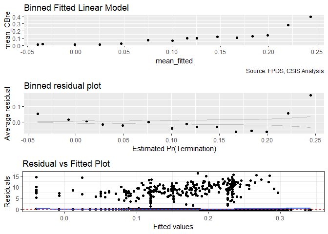<!-- -->

```
## NULL
```
Initial duration has the expected relationship, though not as strongly as ceiling. and a stronger one than for ceiling. The frequency relationship looks exponential, if  perhaps not as clearly as for ceiling, and the breach size relationship, when breaches occur, is slightly parabolic, with short duration contracts and long durations contracts both associated with some of the larger breaches.

###Model 02C: Both Scope


```r
#Model
ln_CBre_02C <- glm (data=smp,
                 ln_CBre_Then_Year ~ cl_Ceil_Then_Year+ cl_Days )
summary(ln_CBre_02C)
```

```
## 
## Call:
## glm(formula = ln_CBre_Then_Year ~ cl_Ceil_Then_Year + cl_Days, 
##     data = smp)
## 
## Deviance Residuals: 
##     Min       1Q   Median       3Q      Max  
## -0.9305  -0.1827  -0.1062  -0.0238  18.8265  
## 
## Coefficients:
##                    Estimate Std. Error t value Pr(>|t|)    
## (Intercept)       -0.531615   0.012419  -42.80   <2e-16 ***
## cl_Ceil_Then_Year  1.389638   0.026956   51.55   <2e-16 ***
## cl_Days            0.101513   0.004222   24.04   <2e-16 ***
## ---
## Signif. codes:  0 '***' 0.001 '**' 0.01 '*' 0.05 '.' 0.1 ' ' 1
## 
## (Dispersion parameter for gaussian family taken to be 1.012156)
## 
##     Null deviance: 257674  on 249999  degrees of freedom
## Residual deviance: 253036  on 249997  degrees of freedom
## AIC: 712495
## 
## Number of Fisher Scoring iterations: 2
```

```r
stargazer::stargazer(ln_CBre_02A,ln_CBre_02B,ln_CBre_02C,ln_CBre_Cons_NCS6A,ln_CBre_Cons_NCS3A,ln_CBre_Cons_NCS3C,
                       ln_CBre_Comp_01A,ln_CBre_Comp_NCS3C,type="text",
                       digits=2)
```

```
## 
## ===================================================================================================================
##                                                           Dependent variable:                                      
##                     -----------------------------------------------------------------------------------------------
##                                                            ln_CBre_Then_Year                                       
##                         (1)         (2)         (3)         (4)         (5)         (6)         (7)         (8)    
## -------------------------------------------------------------------------------------------------------------------
## cl_Ceil_Then_Year     1.61***                 1.39***                                                              
##                       (0.03)                  (0.03)                                                               
##                                                                                                                    
## cl_Days                           0.17***     0.10***                                                              
##                                   (0.004)     (0.004)                                                              
##                                                                                                                    
## cl_def6_HHI_lag1                                         -0.10***                -0.02***                          
##                                                           (0.004)                 (0.01)                           
##                                                                                                                    
## cl_def6_ratio_lag1                                                                -0.001                 -0.01***  
##                                                                                   (0.005)                 (0.005)  
##                                                                                                                    
## cl_def6_obl_lag1                                                                  0.11***                 0.11***  
##                                                                                   (0.01)                  (0.01)   
##                                                                                                                    
## cl_US6_avg_sal_lag1                                                              -0.07***                -0.10***  
##                                                                                   (0.005)                 (0.005)  
##                                                                                                                    
## cl_def3_HHI_lag1                                                     -0.16***    -0.13***                          
##                                                                       (0.004)     (0.01)                           
##                                                                                                                    
## cl_def3_ratio_lag1                                                                 -0.01                  0.03***  
##                                                                                   (0.01)                  (0.01)   
##                                                                                                                    
## CompOffr1 offer                                                                              -0.07***    -0.06***  
##                                                                                               (0.01)      (0.01)   
##                                                                                                                    
## CompOffr2 offers                                                                             -0.09***    -0.07***  
##                                                                                               (0.01)      (0.01)   
##                                                                                                                    
## CompOffr3-4 offers                                                                           -0.04***    -0.03***  
##                                                                                               (0.01)      (0.01)   
##                                                                                                                    
## CompOffr5+ offers                                                                            -0.07***    -0.06***  
##                                                                                               (0.01)      (0.01)   
##                                                                                                                    
## Constant             -0.63***     0.10***    -0.53***     0.10***     0.10***     0.10***     0.16***     0.15***  
##                       (0.01)      (0.002)     (0.01)      (0.002)     (0.002)     (0.002)     (0.005)     (0.005)  
##                                                                                                                    
## -------------------------------------------------------------------------------------------------------------------
## Observations          250,000     250,000     250,000     250,000     250,000     250,000     250,000     250,000  
## Log Likelihood      -356,533.10 -357,566.20 -356,244.40 -358,187.00 -357,791.30 -357,501.70 -358,404.30 -357,998.00
## Akaike Inf. Crit.   713,070.20  715,136.40  712,494.90  716,378.00  715,586.70  715,017.50  716,818.60  716,013.90 
## ===================================================================================================================
## Note:                                                                                   *p<0.1; **p<0.05; ***p<0.01
```

```r
#ompare with cumulative consolidation and competition
summary_residual_compare(ln_CBre_Cons_NCS3C,ln_CBre_02C,ln_CBre_Comp_NCS6E,ln_CBre_02C,bins=10,skip_vif = FALSE)
```

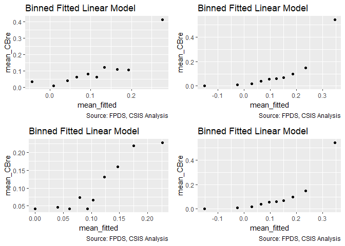<!-- -->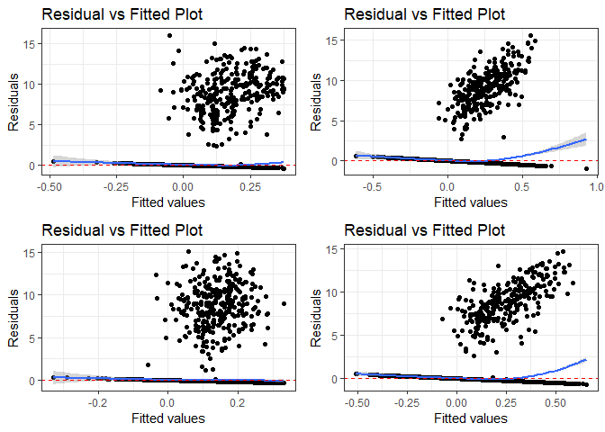<!-- -->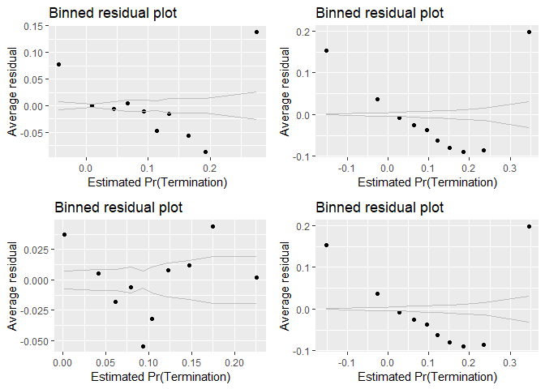<!-- -->

```
## Warning in if (class(model1_new) == "glmerMod" & class(model2_new) ==
## "glmerMod" & : the condition has length > 1 and only the first element will
## be used
```

```
## Warning in if ((class(model1_new) != "glmerMod" & class(model2_new) !
## = "glmerMod") & : the condition has length > 1 and only the first element
## will be used
```

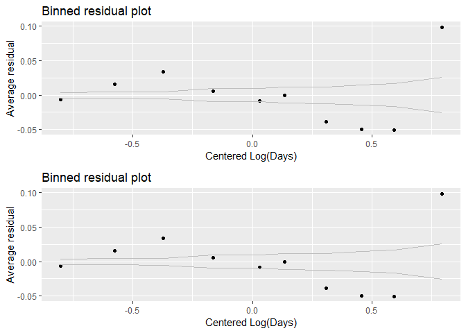<!-- -->

```
## [[1]]
##        model deviance null.deviance difference
## 1 model1_old 255593.9      257674.1   2080.251
## 2 model1_new 253035.9      257674.1   4638.235
## 3 model2_old 256637.5      257674.1   1036.613
## 4 model2_new 253035.9      257674.1   4638.235
## 
## [[2]]
## cl_Ceil_Then_Year           cl_Days 
##          1.126768          1.126768 
## 
## [[3]]
## cl_Ceil_Then_Year           cl_Days 
##          1.126768          1.126768
```
Including both moderates both of their influence. 

###Model 02D: Cumulative 


```r
#Model
ln_CBre_02C <- glm (data=smp,
                 ln_CBre_Then_Year ~ cl_Ceil_Then_Year+ cl_Days )
summary(ln_CBre_02C)
```

```
## 
## Call:
## glm(formula = ln_CBre_Then_Year ~ cl_Ceil_Then_Year + cl_Days, 
##     data = smp)
## 
## Deviance Residuals: 
##     Min       1Q   Median       3Q      Max  
## -0.9305  -0.1827  -0.1062  -0.0238  18.8265  
## 
## Coefficients:
##                    Estimate Std. Error t value Pr(>|t|)    
## (Intercept)       -0.531615   0.012419  -42.80   <2e-16 ***
## cl_Ceil_Then_Year  1.389638   0.026956   51.55   <2e-16 ***
## cl_Days            0.101513   0.004222   24.04   <2e-16 ***
## ---
## Signif. codes:  0 '***' 0.001 '**' 0.01 '*' 0.05 '.' 0.1 ' ' 1
## 
## (Dispersion parameter for gaussian family taken to be 1.012156)
## 
##     Null deviance: 257674  on 249999  degrees of freedom
## Residual deviance: 253036  on 249997  degrees of freedom
## AIC: 712495
## 
## Number of Fisher Scoring iterations: 2
```

```r
#Model
ln_CBre_Cons_02D <- glm (data=smp,
                 ln_CBre_Then_Year ~cl_def6_HHI_lag1+cl_def6_ratio_lag1+cl_def6_obl_lag1+cl_US6_avg_sal_lag1+
                   cl_def3_HHI_lag1+cl_def3_ratio_lag1+
                   cl_Ceil_Then_Year+ cl_Days)
glmer_examine(ln_CBre_Cons_02D)
```

```
##    cl_def6_HHI_lag1  cl_def6_ratio_lag1    cl_def6_obl_lag1 
##            1.727895            1.589843            1.704587 
## cl_US6_avg_sal_lag1    cl_def3_HHI_lag1  cl_def3_ratio_lag1 
##            1.499378            1.735480            1.795698 
##   cl_Ceil_Then_Year             cl_Days 
##            1.251478            1.659166
```

```r
ln_CBre_Comp_02D <- glm (data=smp,
                 ln_CBre_Then_Year ~CompOffr+
                   cl_def6_ratio_lag1+cl_def6_obl_lag1+cl_US6_avg_sal_lag1+
                   cl_def3_ratio_lag1+
                   cl_Ceil_Then_Year+ cl_Days)
glmer_examine(ln_CBre_Comp_02D)
```

```
##                         GVIF Df GVIF^(1/(2*Df))
## CompOffr            1.166316  4        1.019417
## cl_def6_ratio_lag1  1.581221  1        1.257466
## cl_def6_obl_lag1    1.733387  1        1.316581
## cl_US6_avg_sal_lag1 1.464163  1        1.210026
## cl_def3_ratio_lag1  1.841367  1        1.356970
## cl_Ceil_Then_Year   1.204500  1        1.097497
## cl_Days             1.442731  1        1.201137
```

```r
stargazer::stargazer(ln_CBre_02A,ln_CBre_02B,ln_CBre_02C,ln_CBre_Cons_NCS6A,ln_CBre_Cons_NCS3A,ln_CBre_Cons_NCS3C,ln_CBre_Cons_02D,
                       ln_CBre_Comp_01A,ln_CBre_Comp_NCS3C,ln_CBre_Comp_02D,type="text",
                       digits=2)
```

```
## 
## ===========================================================================================================================================
##                                                                       Dependent variable:                                                  
##                     -----------------------------------------------------------------------------------------------------------------------
##                                                                        ln_CBre_Then_Year                                                   
##                         (1)         (2)         (3)         (4)         (5)         (6)         (7)         (8)         (9)        (10)    
## -------------------------------------------------------------------------------------------------------------------------------------------
## cl_Ceil_Then_Year     1.61***                 1.39***                                         1.26***                             1.29***  
##                       (0.03)                  (0.03)                                          (0.03)                              (0.03)   
##                                                                                                                                            
## cl_Days                           0.17***     0.10***                                         0.09***                             0.12***  
##                                   (0.004)     (0.004)                                         (0.01)                              (0.005)  
##                                                                                                                                            
## cl_def6_HHI_lag1                                         -0.10***                -0.02***    -0.02***                                      
##                                                           (0.004)                 (0.01)      (0.01)                                       
##                                                                                                                                            
## cl_def6_ratio_lag1                                                                -0.001      -0.004                 -0.01***     -0.01**  
##                                                                                   (0.005)     (0.005)                 (0.005)     (0.005)  
##                                                                                                                                            
## cl_def6_obl_lag1                                                                  0.11***     0.07***                 0.11***     0.07***  
##                                                                                   (0.01)      (0.01)                  (0.01)      (0.01)   
##                                                                                                                                            
## cl_US6_avg_sal_lag1                                                              -0.07***    -0.03***                -0.10***    -0.04***  
##                                                                                   (0.005)     (0.005)                 (0.005)     (0.005)  
##                                                                                                                                            
## cl_def3_HHI_lag1                                                     -0.16***    -0.13***    -0.05***                                      
##                                                                       (0.004)     (0.01)      (0.01)                                       
##                                                                                                                                            
## cl_def3_ratio_lag1                                                                 -0.01     -0.05***                 0.03***    -0.04***  
##                                                                                   (0.01)      (0.01)                  (0.01)      (0.01)   
##                                                                                                                                            
## CompOffr1 offer                                                                                          -0.07***    -0.06***    -0.05***  
##                                                                                                           (0.01)      (0.01)      (0.01)   
##                                                                                                                                            
## CompOffr2 offers                                                                                         -0.09***    -0.07***    -0.03***  
##                                                                                                           (0.01)      (0.01)      (0.01)   
##                                                                                                                                            
## CompOffr3-4 offers                                                                                       -0.04***    -0.03***      -0.01   
##                                                                                                           (0.01)      (0.01)      (0.01)   
##                                                                                                                                            
## CompOffr5+ offers                                                                                        -0.07***    -0.06***    -0.03***  
##                                                                                                           (0.01)      (0.01)      (0.01)   
##                                                                                                                                            
## Constant             -0.63***     0.10***    -0.53***     0.10***     0.10***     0.10***    -0.48***     0.16***     0.15***    -0.46***  
##                       (0.01)      (0.002)     (0.01)      (0.002)     (0.002)     (0.002)     (0.01)      (0.005)     (0.005)     (0.01)   
##                                                                                                                                            
## -------------------------------------------------------------------------------------------------------------------------------------------
## Observations          250,000     250,000     250,000     250,000     250,000     250,000     250,000     250,000     250,000     250,000  
## Log Likelihood      -356,533.10 -357,566.20 -356,244.40 -358,187.00 -357,791.30 -357,501.70 -356,040.60 -358,404.30 -357,998.00 -356,103.30
## Akaike Inf. Crit.   713,070.20  715,136.40  712,494.90  716,378.00  715,586.70  715,017.50  712,099.20  716,818.60  716,013.90  712,228.60 
## ===========================================================================================================================================
## Note:                                                                                                           *p<0.1; **p<0.05; ***p<0.01
```

```r
#ompare with cumulative consolidation and competition
summary_residual_compare(ln_CBre_Cons_NCS3C,ln_CBre_Cons_02D,ln_CBre_Comp_NCS6E,ln_CBre_Comp_02D,bins=10)
```

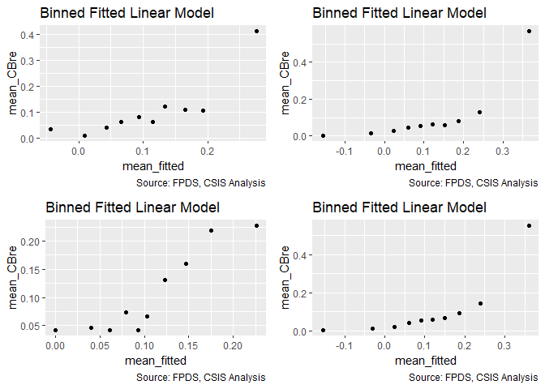<!-- -->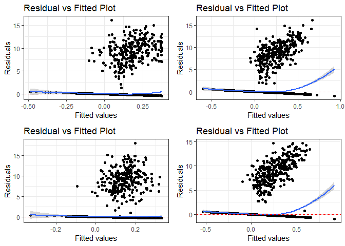<!-- -->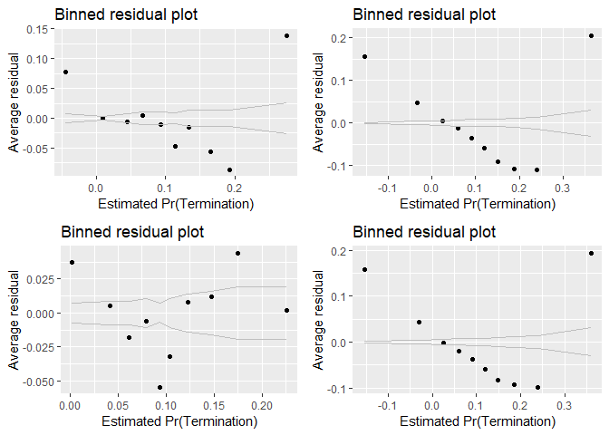<!-- -->

```
## Warning in if (class(model1_new) == "glmerMod" & class(model2_new) ==
## "glmerMod" & : the condition has length > 1 and only the first element will
## be used
```

```
## Warning in if ((class(model1_new) != "glmerMod" & class(model2_new) !
## = "glmerMod") & : the condition has length > 1 and only the first element
## will be used
```

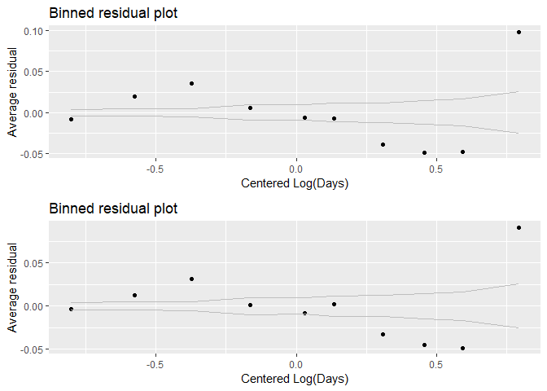<!-- -->

```
## [[1]]
##        model deviance null.deviance difference
## 1 model1_old 255593.9      257674.1   2080.251
## 2 model1_new 252623.6      257674.1   5050.540
## 3 model2_old 256637.5      257674.1   1036.613
## 4 model2_new 252750.4      257674.1   4923.727
## 
## [[2]]
##    cl_def6_HHI_lag1  cl_def6_ratio_lag1    cl_def6_obl_lag1 
##            1.727895            1.589843            1.704587 
## cl_US6_avg_sal_lag1    cl_def3_HHI_lag1  cl_def3_ratio_lag1 
##            1.499378            1.735480            1.795698 
##   cl_Ceil_Then_Year             cl_Days 
##            1.251478            1.659166 
## 
## [[3]]
##                         GVIF Df GVIF^(1/(2*Df))
## CompOffr            1.166316  4        1.019417
## cl_def6_ratio_lag1  1.581221  1        1.257466
## cl_def6_obl_lag1    1.733387  1        1.316581
## cl_US6_avg_sal_lag1 1.464163  1        1.210026
## cl_def3_ratio_lag1  1.841367  1        1.356970
## cl_Ceil_Then_Year   1.204500  1        1.097497
## cl_Days             1.442731  1        1.201137
```

```r
if(exists("ln_CBre_NCS6C")){
  #Drop models  not used in NAICS3 comparisons
  rm(ln_CBre_NCS6C,ln_CBre_NCS6D)
  #Drop individual models that  aren't study  variables.
  rm(ln_CBre_NCS3B)
  #Drop NAICS6 models used in NAICS3 comparisons, execept original HHI
  rm(ln_CBre_NCS6B)
}
```
Adding ceiling and duration strengthens the significance of HHI6 but weakens def3_ratio in the consolidation model. Likewise def3_ratio loses significance for the competition model.

##Contract Vehicle
Our dataset includes both stand alone contract awards and task orders that are under larger indefinite delivery vehilces (IDVs). 

###Model 03A: Single-Award, Multi-Award, and Other Indefinite Delivery Vehicles
Expectations, lower ceiling breaches for IDVs in general, in particular for FSS/GWAC


```r
#Frequency Plot
summary_discrete_plot(smp,"Veh")
```

```
## Warning: Ignoring unknown parameters: binwidth, bins, pad
```

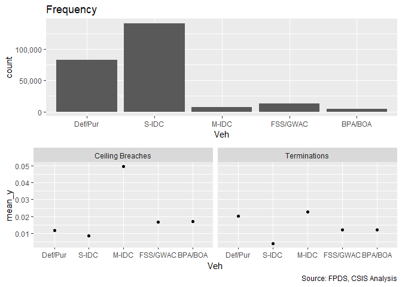<!-- -->

```
## [[1]]
## 
##  Def/Pur    S-IDC    M-IDC FSS/GWAC  BPA/BOA 
##    83108   141814     7240    13299     4539 
## 
## [[2]]
##           
##              None Ceiling Breach
##   Def/Pur   82127            981
##   S-IDC    140581           1233
##   M-IDC      6881            359
##   FSS/GWAC  13075            224
##   BPA/BOA    4461             78
## 
## [[3]]
##           
##                 0      1
##   Def/Pur   81434   1674
##   S-IDC    141245    569
##   M-IDC      7074    166
##   FSS/GWAC  13136    163
##   BPA/BOA    4483     56
```

```r
#Create the model
ln_CBre_03A <- glm (data=smp,
                 ln_CBre_Then_Year ~ Veh)
summary(ln_CBre_03A)
```

```
## 
## Call:
## glm(formula = ln_CBre_Then_Year ~ Veh, data = smp)
## 
## Deviance Residuals: 
##     Min       1Q   Median       3Q      Max  
## -0.5147  -0.1076  -0.0768  -0.0768  19.4405  
## 
## Coefficients:
##              Estimate Std. Error t value Pr(>|t|)    
## (Intercept)  0.107631   0.003512  30.644  < 2e-16 ***
## VehS-IDC    -0.030855   0.004423  -6.975 3.06e-12 ***
## VehM-IDC     0.407043   0.012408  32.806  < 2e-16 ***
## VehFSS/GWAC  0.042407   0.009457   4.484 7.32e-06 ***
## VehBPA/BOA   0.038135   0.015434   2.471   0.0135 *  
## ---
## Signif. codes:  0 '***' 0.001 '**' 0.01 '*' 0.05 '.' 0.1 ' ' 1
## 
## (Dispersion parameter for gaussian family taken to be 1.025264)
## 
##     Null deviance: 257674  on 249999  degrees of freedom
## Residual deviance: 256311  on 249995  degrees of freedom
## AIC: 715714
## 
## Number of Fisher Scoring iterations: 2
```

```r
stargazer::stargazer(ln_CBre_03A,ln_CBre_Cons_NCS6A,ln_CBre_Cons_NCS3A,ln_CBre_Cons_02D,
                       ln_CBre_Comp_01A,ln_CBre_Comp_02D,type="text",
                       digits=2)
```

```
## 
## ===========================================================================================
##                                               Dependent variable:                          
##                     -----------------------------------------------------------------------
##                                                ln_CBre_Then_Year                           
##                         (1)         (2)         (3)         (4)         (5)         (6)    
## -------------------------------------------------------------------------------------------
## VehS-IDC             -0.03***                                                              
##                       (0.004)                                                              
##                                                                                            
## VehM-IDC              0.41***                                                              
##                       (0.01)                                                               
##                                                                                            
## VehFSS/GWAC           0.04***                                                              
##                       (0.01)                                                               
##                                                                                            
## VehBPA/BOA            0.04**                                                               
##                       (0.02)                                                               
##                                                                                            
## cl_def6_HHI_lag1                 -0.10***                -0.02***                          
##                                   (0.004)                 (0.01)                           
##                                                                                            
## cl_def6_ratio_lag1                                        -0.004                  -0.01**  
##                                                           (0.005)                 (0.005)  
##                                                                                            
## cl_def6_obl_lag1                                          0.07***                 0.07***  
##                                                           (0.01)                  (0.01)   
##                                                                                            
## cl_US6_avg_sal_lag1                                      -0.03***                -0.04***  
##                                                           (0.005)                 (0.005)  
##                                                                                            
## cl_def3_HHI_lag1                             -0.16***    -0.05***                          
##                                               (0.004)     (0.01)                           
##                                                                                            
## cl_def3_ratio_lag1                                       -0.05***                -0.04***  
##                                                           (0.01)                  (0.01)   
##                                                                                            
## cl_Ceil_Then_Year                                         1.26***                 1.29***  
##                                                           (0.03)                  (0.03)   
##                                                                                            
## cl_Days                                                   0.09***                 0.12***  
##                                                           (0.01)                  (0.005)  
##                                                                                            
## CompOffr1 offer                                                      -0.07***    -0.05***  
##                                                                       (0.01)      (0.01)   
##                                                                                            
## CompOffr2 offers                                                     -0.09***    -0.03***  
##                                                                       (0.01)      (0.01)   
##                                                                                            
## CompOffr3-4 offers                                                   -0.04***      -0.01   
##                                                                       (0.01)      (0.01)   
##                                                                                            
## CompOffr5+ offers                                                    -0.07***    -0.03***  
##                                                                       (0.01)      (0.01)   
##                                                                                            
## Constant              0.11***     0.10***     0.10***    -0.48***     0.16***    -0.46***  
##                       (0.004)     (0.002)     (0.002)     (0.01)      (0.005)     (0.01)   
##                                                                                            
## -------------------------------------------------------------------------------------------
## Observations          250,000     250,000     250,000     250,000     250,000     250,000  
## Log Likelihood      -357,851.90 -358,187.00 -357,791.30 -356,040.60 -358,404.30 -356,103.30
## Akaike Inf. Crit.   715,713.90  716,378.00  715,586.70  712,099.20  716,818.60  712,228.60 
## ===========================================================================================
## Note:                                                           *p<0.1; **p<0.05; ***p<0.01
```

```r
#For first model in category, include only the new model(s), skip_vif=true
summary_residual_compare(ln_CBre_03A,bins=3,skip_vif = TRUE)
```

```
## Warning in simpleLoess(y, x, w, span, degree = degree, parametric =
## parametric, : pseudoinverse used at 0.074587
```

```
## Warning in simpleLoess(y, x, w, span, degree = degree, parametric =
## parametric, : neighborhood radius 0.033044
```

```
## Warning in simpleLoess(y, x, w, span, degree = degree, parametric =
## parametric, : reciprocal condition number 7.0525e-027
```

```
## Warning in simpleLoess(y, x, w, span, degree = degree, parametric =
## parametric, : There are other near singularities as well. 0.000952
```

```
## Warning in predLoess(object$y, object$x, newx = if
## (is.null(newdata)) object$x else if (is.data.frame(newdata))
## as.matrix(model.frame(delete.response(terms(object)), : pseudoinverse used
## at 0.074587
```

```
## Warning in predLoess(object$y, object$x, newx = if
## (is.null(newdata)) object$x else if (is.data.frame(newdata))
## as.matrix(model.frame(delete.response(terms(object)), : neighborhood radius
## 0.033044
```

```
## Warning in predLoess(object$y, object$x, newx = if
## (is.null(newdata)) object$x else if (is.data.frame(newdata))
## as.matrix(model.frame(delete.response(terms(object)), : reciprocal
## condition number 7.0525e-027
```

```
## Warning in predLoess(object$y, object$x, newx = if
## (is.null(newdata)) object$x else if (is.data.frame(newdata))
## as.matrix(model.frame(delete.response(terms(object)), : There are other
## near singularities as well. 0.000952
```

```
## Warning in if (class(model1_old) == "glmerMod") {: the condition has length
## > 1 and only the first element will be used
```

```
## Warning in if (class(model1_old) != "glmerMod" & class(model1_old) !=
## "glmerMod" & : the condition has length > 1 and only the first element will
## be used
```

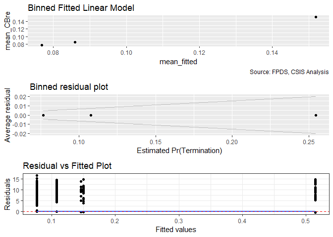<!-- -->

```
## NULL
```

Expetation doesn't really hold, both Multiaward and BPA/BOA show higher more/larger ceiling breaches.


###Model 03B: Cumulative


```r
#Model
ln_CBre_Cons_03B <- glm (data=smp,
                 ln_CBre_Then_Year ~cl_def6_HHI_lag1+cl_def6_ratio_lag1+cl_def6_obl_lag1+cl_US6_avg_sal_lag1+
                   cl_def3_HHI_lag1+cl_def3_ratio_lag1+
                   cl_Ceil_Then_Year+ cl_Days+
                   Veh)
glmer_examine(ln_CBre_Cons_03B)
```

```
##                         GVIF Df GVIF^(1/(2*Df))
## cl_def6_HHI_lag1    1.756783  1        1.325437
## cl_def6_ratio_lag1  1.607358  1        1.267816
## cl_def6_obl_lag1    1.900243  1        1.378493
## cl_US6_avg_sal_lag1 1.502241  1        1.225659
## cl_def3_HHI_lag1    1.770531  1        1.330613
## cl_def3_ratio_lag1  1.883657  1        1.372464
## cl_Ceil_Then_Year   1.285363  1        1.133739
## cl_Days             1.729063  1        1.314938
## Veh                 1.643214  4        1.064049
```

```r
ln_CBre_Comp_03B <- glm (data=smp,
                 ln_CBre_Then_Year ~CompOffr+
                   cl_def6_ratio_lag1+cl_def6_obl_lag1+cl_US6_avg_sal_lag1+
                   cl_def3_ratio_lag1+
                   cl_Ceil_Then_Year+ cl_Days+
                   Veh)
glmer_examine(ln_CBre_Comp_03B)
```

```
##                         GVIF Df GVIF^(1/(2*Df))
## CompOffr            1.198699  4        1.022913
## cl_def6_ratio_lag1  1.596040  1        1.263345
## cl_def6_obl_lag1    1.919827  1        1.385578
## cl_US6_avg_sal_lag1 1.466386  1        1.210944
## cl_def3_ratio_lag1  1.936835  1        1.391702
## cl_Ceil_Then_Year   1.243967  1        1.115333
## cl_Days             1.570144  1        1.253054
## Veh                 1.592533  4        1.059891
```

```r
stargazer::stargazer(ln_CBre_03A,ln_CBre_Cons_NCS6A,ln_CBre_Cons_NCS3A,ln_CBre_Cons_02D,ln_CBre_Cons_03B,
                       ln_CBre_Comp_01A,ln_CBre_Comp_02D,ln_CBre_Comp_03B,type="text",
                       digits=2)
```

```
## 
## ===================================================================================================================
##                                                           Dependent variable:                                      
##                     -----------------------------------------------------------------------------------------------
##                                                            ln_CBre_Then_Year                                       
##                         (1)         (2)         (3)         (4)         (5)         (6)         (7)         (8)    
## -------------------------------------------------------------------------------------------------------------------
## VehS-IDC             -0.03***                                         0.06***                             0.04***  
##                       (0.004)                                         (0.01)                              (0.01)   
##                                                                                                                    
## VehM-IDC              0.41***                                         0.29***                             0.29***  
##                       (0.01)                                          (0.01)                              (0.01)   
##                                                                                                                    
## VehFSS/GWAC           0.04***                                          0.01                                0.01    
##                       (0.01)                                          (0.01)                              (0.01)   
##                                                                                                                    
## VehBPA/BOA            0.04**                                          0.06***                             0.05***  
##                       (0.02)                                          (0.02)                              (0.02)   
##                                                                                                                    
## cl_def6_HHI_lag1                 -0.10***                -0.02***    -0.03***                                      
##                                   (0.004)                 (0.01)      (0.01)                                       
##                                                                                                                    
## cl_def6_ratio_lag1                                        -0.004      -0.004                  -0.01**     -0.01**  
##                                                           (0.005)     (0.005)                 (0.005)     (0.005)  
##                                                                                                                    
## cl_def6_obl_lag1                                          0.07***     0.05***                 0.07***     0.05***  
##                                                           (0.01)      (0.01)                  (0.01)      (0.01)   
##                                                                                                                    
## cl_US6_avg_sal_lag1                                      -0.03***    -0.03***                -0.04***    -0.04***  
##                                                           (0.005)     (0.005)                 (0.005)     (0.005)  
##                                                                                                                    
## cl_def3_HHI_lag1                             -0.16***    -0.05***    -0.05***                                      
##                                               (0.004)     (0.01)      (0.01)                                       
##                                                                                                                    
## cl_def3_ratio_lag1                                       -0.05***    -0.03***                -0.04***    -0.03***  
##                                                           (0.01)      (0.01)                  (0.01)      (0.01)   
##                                                                                                                    
## cl_Ceil_Then_Year                                         1.26***     1.22***                 1.29***     1.24***  
##                                                           (0.03)      (0.03)                  (0.03)      (0.03)   
##                                                                                                                    
## cl_Days                                                   0.09***     0.10***                 0.12***     0.12***  
##                                                           (0.01)      (0.01)                  (0.005)     (0.005)  
##                                                                                                                    
## CompOffr1 offer                                                                  -0.07***    -0.05***    -0.05***  
##                                                                                   (0.01)      (0.01)      (0.01)   
##                                                                                                                    
## CompOffr2 offers                                                                 -0.09***    -0.03***    -0.04***  
##                                                                                   (0.01)      (0.01)      (0.01)   
##                                                                                                                    
## CompOffr3-4 offers                                                               -0.04***      -0.01      -0.01*   
##                                                                                   (0.01)      (0.01)      (0.01)   
##                                                                                                                    
## CompOffr5+ offers                                                                -0.07***    -0.03***    -0.03***  
##                                                                                   (0.01)      (0.01)      (0.01)   
##                                                                                                                    
## Constant              0.11***     0.10***     0.10***    -0.48***    -0.50***     0.16***    -0.46***    -0.47***  
##                       (0.004)     (0.002)     (0.002)     (0.01)      (0.01)      (0.005)     (0.01)      (0.01)   
##                                                                                                                    
## -------------------------------------------------------------------------------------------------------------------
## Observations          250,000     250,000     250,000     250,000     250,000     250,000     250,000     250,000  
## Log Likelihood      -357,851.90 -358,187.00 -357,791.30 -356,040.60 -355,752.90 -358,404.30 -356,103.30 -355,824.70
## Akaike Inf. Crit.   715,713.90  716,378.00  715,586.70  712,099.20  711,531.90  716,818.60  712,228.60  711,679.40 
## ===================================================================================================================
## Note:                                                                                   *p<0.1; **p<0.05; ***p<0.01
```

```r
#Compare to prior cumulative model(s), skip_vif =false
summary_residual_compare(ln_CBre_Cons_02D,ln_CBre_Cons_03B,ln_CBre_Comp_02D,ln_CBre_Comp_03B,bins=10,skip_vif = FALSE)
```

<!-- -->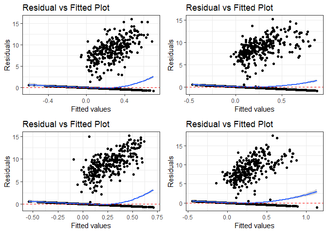<!-- -->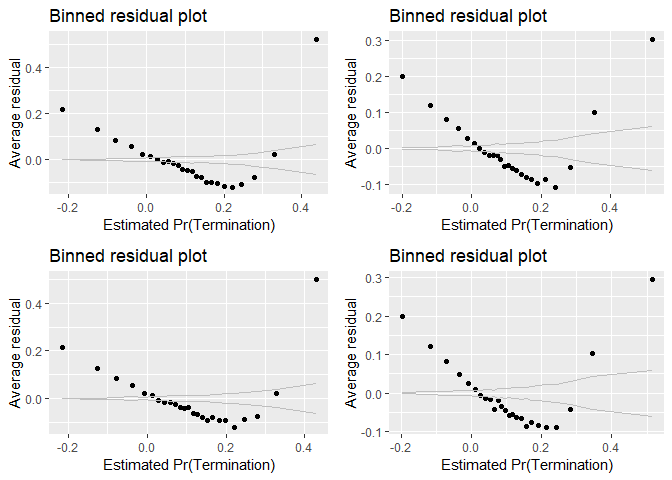<!-- -->

```
## Warning in if (class(model1_new) == "glmerMod" & class(model2_new) ==
## "glmerMod" & : the condition has length > 1 and only the first element will
## be used
```

```
## Warning in if ((class(model1_new) != "glmerMod" & class(model2_new) !
## = "glmerMod") & : the condition has length > 1 and only the first element
## will be used
```

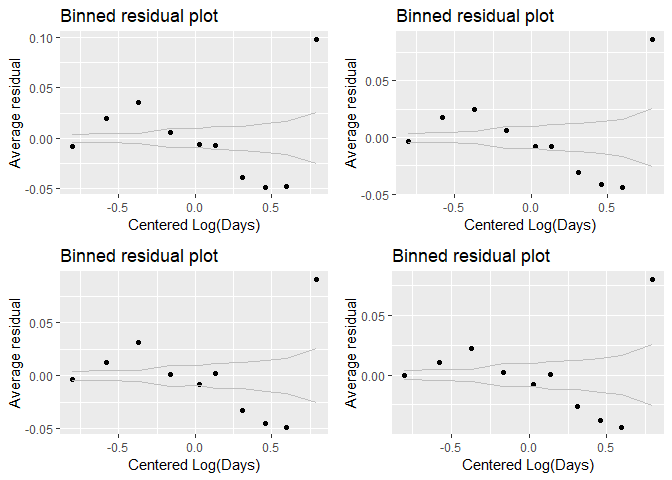<!-- -->

```
## [[1]]
##        model deviance null.deviance difference
## 1 model1_old 252623.6      257674.1   5050.540
## 2 model1_new 252042.9      257674.1   5631.195
## 3 model2_old 252750.4      257674.1   4923.727
## 4 model2_new 252187.7      257674.1   5486.436
## 
## [[2]]
##                         GVIF Df GVIF^(1/(2*Df))
## cl_def6_HHI_lag1    1.756783  1        1.325437
## cl_def6_ratio_lag1  1.607358  1        1.267816
## cl_def6_obl_lag1    1.900243  1        1.378493
## cl_US6_avg_sal_lag1 1.502241  1        1.225659
## cl_def3_HHI_lag1    1.770531  1        1.330613
## cl_def3_ratio_lag1  1.883657  1        1.372464
## cl_Ceil_Then_Year   1.285363  1        1.133739
## cl_Days             1.729063  1        1.314938
## Veh                 1.643214  4        1.064049
## 
## [[3]]
##                         GVIF Df GVIF^(1/(2*Df))
## CompOffr            1.198699  4        1.022913
## cl_def6_ratio_lag1  1.596040  1        1.263345
## cl_def6_obl_lag1    1.919827  1        1.385578
## cl_US6_avg_sal_lag1 1.466386  1        1.210944
## cl_def3_ratio_lag1  1.936835  1        1.391702
## cl_Ceil_Then_Year   1.243967  1        1.115333
## cl_Days             1.570144  1        1.253054
## Veh                 1.592533  4        1.059891
```

```r
#Remove all but cumulative model
if(exists("ln_CBre_02A"))  rm(ln_CBre_02A,ln_CBre_02B,ln_CBre_02C)
```
Intriguingly,  the sign on single award IDVs flips after the introduction of the full model.

##Type of Contract

The next step adds a measure for whether the contract was cost-based or fixed-price. Prior CSIS research has found that fixed-price contracts do face a higher risk of termination across the board.

###Model 04A: Incentive Fees

Fixed-price contracts are generally thought to be at greater risk of overruns, as they are less flexible, although prior CSIS work complicates this finding.

In the performance of the defense acquisition system report, the benefits found were reduced cost overruns. That could help avoid terminations, but it's an indirect connection at best. Unfortunately, incentive fees are incredibly rare, which makes them challenging to examine directly.


```r
#Frequency Plot
summary_discrete_plot(smp,"PricingFee")
```

```
## Warning: Ignoring unknown parameters: binwidth, bins, pad
```

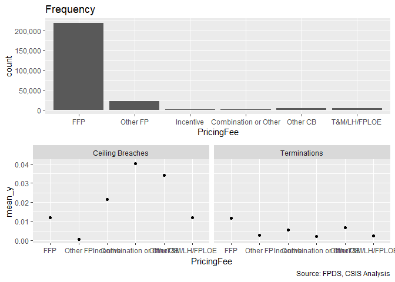<!-- -->

```
## [[1]]
## 
##                  FFP             Other FP            Incentive 
##               219291                22235                  887 
## Combination or Other             Other CB         T&M/LH/FPLOE 
##                  967                 3334                 3286 
## 
## [[2]]
##                       
##                          None Ceiling Breach
##   FFP                  216638           2653
##   Other FP              22224             11
##   Incentive               868             19
##   Combination or Other    928             39
##   Other CB               3220            114
##   T&M/LH/FPLOE           3247             39
## 
## [[3]]
##                       
##                             0      1
##   FFP                  216762   2529
##   Other FP              22173     62
##   Incentive               882      5
##   Combination or Other    965      2
##   Other CB               3312     22
##   T&M/LH/FPLOE           3278      8
```

```r
#Create the model
ln_CBre_04A <- glm (data=smp,
                 ln_CBre_Then_Year ~PricingFee)
summary(ln_CBre_04A)
```

```
## 
## Call:
## glm(formula = ln_CBre_Then_Year ~ PricingFee, data = smp)
## 
## Deviance Residuals: 
##     Min       1Q   Median       3Q      Max  
## -0.4646  -0.1079  -0.1079  -0.1079  19.4093  
## 
## Coefficients:
##                                 Estimate Std. Error t value Pr(>|t|)    
## (Intercept)                     0.107903   0.002165  49.837  < 2e-16 ***
## PricingFeeOther FP             -0.103530   0.007136 -14.509  < 2e-16 ***
## PricingFeeIncentive             0.117698   0.034112   3.450  0.00056 ***
## PricingFeeCombination or Other  0.356648   0.032676  10.915  < 2e-16 ***
## PricingFeeOther CB              0.307717   0.017692  17.393  < 2e-16 ***
## PricingFeeT&M/LH/FPLOE          0.020466   0.017819   1.149  0.25074    
## ---
## Signif. codes:  0 '***' 0.001 '**' 0.01 '*' 0.05 '.' 0.1 ' ' 1
## 
## (Dispersion parameter for gaussian family taken to be 1.027968)
## 
##     Null deviance: 257674  on 249999  degrees of freedom
## Residual deviance: 256986  on 249994  degrees of freedom
## AIC: 716373
## 
## Number of Fisher Scoring iterations: 2
```

```r
stargazer::stargazer(ln_CBre_04A,ln_CBre_Cons_NCS6A,ln_CBre_Cons_NCS3A,ln_CBre_Cons_03B,
                       ln_CBre_Comp_01A,ln_CBre_Comp_03B,type="text",
                       digits=2)
```

```
## 
## ======================================================================================================
##                                                          Dependent variable:                          
##                                -----------------------------------------------------------------------
##                                                           ln_CBre_Then_Year                           
##                                    (1)         (2)         (3)         (4)         (5)         (6)    
## ------------------------------------------------------------------------------------------------------
## PricingFeeOther FP              -0.10***                                                              
##                                  (0.01)                                                               
##                                                                                                       
## PricingFeeIncentive              0.12***                                                              
##                                  (0.03)                                                               
##                                                                                                       
## PricingFeeCombination or Other   0.36***                                                              
##                                  (0.03)                                                               
##                                                                                                       
## PricingFeeOther CB               0.31***                                                              
##                                  (0.02)                                                               
##                                                                                                       
## PricingFeeT&M/LH/FPLOE            0.02                                                                
##                                  (0.02)                                                               
##                                                                                                       
## cl_def6_HHI_lag1                            -0.10***                -0.03***                          
##                                              (0.004)                 (0.01)                           
##                                                                                                       
## cl_def6_ratio_lag1                                                   -0.004                  -0.01**  
##                                                                      (0.005)                 (0.005)  
##                                                                                                       
## cl_def6_obl_lag1                                                     0.05***                 0.05***  
##                                                                      (0.01)                  (0.01)   
##                                                                                                       
## cl_US6_avg_sal_lag1                                                 -0.03***                -0.04***  
##                                                                      (0.005)                 (0.005)  
##                                                                                                       
## cl_def3_HHI_lag1                                        -0.16***    -0.05***                          
##                                                          (0.004)     (0.01)                           
##                                                                                                       
## cl_def3_ratio_lag1                                                  -0.03***                -0.03***  
##                                                                      (0.01)                  (0.01)   
##                                                                                                       
## cl_Ceil_Then_Year                                                    1.22***                 1.24***  
##                                                                      (0.03)                  (0.03)   
##                                                                                                       
## cl_Days                                                              0.10***                 0.12***  
##                                                                      (0.01)                  (0.005)  
##                                                                                                       
## VehS-IDC                                                             0.06***                 0.04***  
##                                                                      (0.01)                  (0.01)   
##                                                                                                       
## VehM-IDC                                                             0.29***                 0.29***  
##                                                                      (0.01)                  (0.01)   
##                                                                                                       
## VehFSS/GWAC                                                           0.01                    0.01    
##                                                                      (0.01)                  (0.01)   
##                                                                                                       
## VehBPA/BOA                                                           0.06***                 0.05***  
##                                                                      (0.02)                  (0.02)   
##                                                                                                       
## CompOffr1 offer                                                                 -0.07***    -0.05***  
##                                                                                  (0.01)      (0.01)   
##                                                                                                       
## CompOffr2 offers                                                                -0.09***    -0.04***  
##                                                                                  (0.01)      (0.01)   
##                                                                                                       
## CompOffr3-4 offers                                                              -0.04***     -0.01*   
##                                                                                  (0.01)      (0.01)   
##                                                                                                       
## CompOffr5+ offers                                                               -0.07***    -0.03***  
##                                                                                  (0.01)      (0.01)   
##                                                                                                       
## Constant                         0.11***     0.10***     0.10***    -0.50***     0.16***    -0.47***  
##                                  (0.002)     (0.002)     (0.002)     (0.01)      (0.005)     (0.01)   
##                                                                                                       
## ------------------------------------------------------------------------------------------------------
## Observations                     250,000     250,000     250,000     250,000     250,000     250,000  
## Log Likelihood                 -358,180.60 -358,187.00 -357,791.30 -355,752.90 -358,404.30 -355,824.70
## Akaike Inf. Crit.              716,373.20  716,378.00  715,586.70  711,531.90  716,818.60  711,679.40 
## ======================================================================================================
## Note:                                                                      *p<0.1; **p<0.05; ***p<0.01
```

```r
#For first model in category, include only the new model(s), skip_vif=true
summary_residual_compare(ln_CBre_04A,bins=2,skip_vif = TRUE)
```

```
## Warning in simpleLoess(y, x, w, span, degree = degree, parametric =
## parametric, : pseudoinverse used at 0.0020721
```

```
## Warning in simpleLoess(y, x, w, span, degree = degree, parametric =
## parametric, : neighborhood radius 0.10583
```

```
## Warning in simpleLoess(y, x, w, span, degree = degree, parametric =
## parametric, : reciprocal condition number 1.9559e-028
```

```
## Warning in simpleLoess(y, x, w, span, degree = degree, parametric =
## parametric, : There are other near singularities as well. 0.010719
```

```
## Warning in simpleLoess(y, x, w, span, degree = degree, parametric =
## parametric, : zero-width neighborhood. make span bigger
```

```
## Warning: Computation failed in `stat_smooth()`:
## NA/NaN/Inf in foreign function call (arg 5)
```

```
## Warning in if (class(model1_old) == "glmerMod") {: the condition has length
## > 1 and only the first element will be used
```

```
## Warning in if (class(model1_old) != "glmerMod" & class(model1_old) !=
## "glmerMod" & : the condition has length > 1 and only the first element will
## be used
```

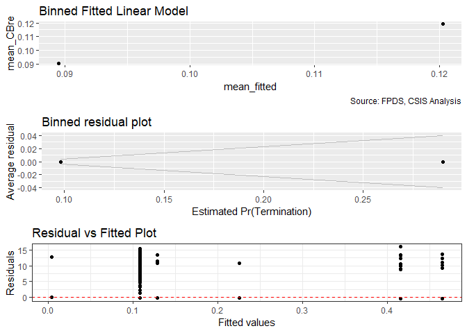<!-- -->

```
## NULL
```
Expectations are not particularly met, incentive fees have a lower coefficient than cost based, other fixed price is lowest.


###Model 04B: Undefinitized Contract Awards
Undefinitized Contract Awards allow for quick action in situations where there is not time or information to establish all of a contracts properties at the time of signing. They have been found by the GAO and the Performance of the Defense Acquisition studies to contain notable risks, primarily relating to cost overruns and thus ceiling breaches. Will these risks also carry into terminations and ceiling breaches?


```r
#Frequency Plot
summary_discrete_plot(smp,"UCA")
```

```
## Warning: Ignoring unknown parameters: binwidth, bins, pad
```

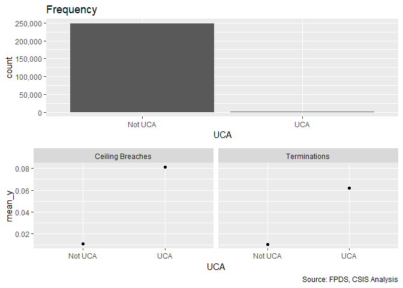<!-- -->

```
## [[1]]
## 
## Not UCA     UCA 
##  248794    1206 
## 
## [[2]]
##          
##             None Ceiling Breach
##   Not UCA 246017           2777
##   UCA       1108             98
## 
## [[3]]
##          
##                0      1
##   Not UCA 246241   2553
##   UCA       1131     75
```

```r
#Create the model
ln_CBre_04B <- glm (data=smp,
                 ln_CBre_Then_Year ~ b_UCA )
summary(ln_CBre_04B)
```

```
## 
## Call:
## glm(formula = ln_CBre_Then_Year ~ b_UCA, data = smp)
## 
## Deviance Residuals: 
##     Min       1Q   Median       3Q      Max  
## -0.8239  -0.1014  -0.1014  -0.1014  19.4159  
## 
## Coefficients:
##             Estimate Std. Error t value Pr(>|t|)    
## (Intercept) 0.101380   0.002033   49.87   <2e-16 ***
## b_UCA       0.722559   0.029269   24.69   <2e-16 ***
## ---
## Signif. codes:  0 '***' 0.001 '**' 0.01 '*' 0.05 '.' 0.1 ' ' 1
## 
## (Dispersion parameter for gaussian family taken to be 1.028198)
## 
##     Null deviance: 257674  on 249999  degrees of freedom
## Residual deviance: 257048  on 249998  degrees of freedom
## AIC: 716425
## 
## Number of Fisher Scoring iterations: 2
```

```r
stargazer::stargazer(ln_CBre_04A,ln_CBre_04B,ln_CBre_Cons_NCS6A,ln_CBre_Cons_NCS3A,ln_CBre_Cons_03B,
                       ln_CBre_Comp_01A,ln_CBre_Comp_03B,type="text",
                       digits=2)
```

```
## 
## ==================================================================================================================
##                                                                Dependent variable:                                
##                                -----------------------------------------------------------------------------------
##                                                                 ln_CBre_Then_Year                                 
##                                    (1)         (2)         (3)         (4)         (5)         (6)         (7)    
## ------------------------------------------------------------------------------------------------------------------
## PricingFeeOther FP              -0.10***                                                                          
##                                  (0.01)                                                                           
##                                                                                                                   
## PricingFeeIncentive              0.12***                                                                          
##                                  (0.03)                                                                           
##                                                                                                                   
## PricingFeeCombination or Other   0.36***                                                                          
##                                  (0.03)                                                                           
##                                                                                                                   
## PricingFeeOther CB               0.31***                                                                          
##                                  (0.02)                                                                           
##                                                                                                                   
## PricingFeeT&M/LH/FPLOE            0.02                                                                            
##                                  (0.02)                                                                           
##                                                                                                                   
## b_UCA                                        0.72***                                                              
##                                              (0.03)                                                               
##                                                                                                                   
## cl_def6_HHI_lag1                                        -0.10***                -0.03***                          
##                                                          (0.004)                 (0.01)                           
##                                                                                                                   
## cl_def6_ratio_lag1                                                               -0.004                  -0.01**  
##                                                                                  (0.005)                 (0.005)  
##                                                                                                                   
## cl_def6_obl_lag1                                                                 0.05***                 0.05***  
##                                                                                  (0.01)                  (0.01)   
##                                                                                                                   
## cl_US6_avg_sal_lag1                                                             -0.03***                -0.04***  
##                                                                                  (0.005)                 (0.005)  
##                                                                                                                   
## cl_def3_HHI_lag1                                                    -0.16***    -0.05***                          
##                                                                      (0.004)     (0.01)                           
##                                                                                                                   
## cl_def3_ratio_lag1                                                              -0.03***                -0.03***  
##                                                                                  (0.01)                  (0.01)   
##                                                                                                                   
## cl_Ceil_Then_Year                                                                1.22***                 1.24***  
##                                                                                  (0.03)                  (0.03)   
##                                                                                                                   
## cl_Days                                                                          0.10***                 0.12***  
##                                                                                  (0.01)                  (0.005)  
##                                                                                                                   
## VehS-IDC                                                                         0.06***                 0.04***  
##                                                                                  (0.01)                  (0.01)   
##                                                                                                                   
## VehM-IDC                                                                         0.29***                 0.29***  
##                                                                                  (0.01)                  (0.01)   
##                                                                                                                   
## VehFSS/GWAC                                                                       0.01                    0.01    
##                                                                                  (0.01)                  (0.01)   
##                                                                                                                   
## VehBPA/BOA                                                                       0.06***                 0.05***  
##                                                                                  (0.02)                  (0.02)   
##                                                                                                                   
## CompOffr1 offer                                                                             -0.07***    -0.05***  
##                                                                                              (0.01)      (0.01)   
##                                                                                                                   
## CompOffr2 offers                                                                            -0.09***    -0.04***  
##                                                                                              (0.01)      (0.01)   
##                                                                                                                   
## CompOffr3-4 offers                                                                          -0.04***     -0.01*   
##                                                                                              (0.01)      (0.01)   
##                                                                                                                   
## CompOffr5+ offers                                                                           -0.07***    -0.03***  
##                                                                                              (0.01)      (0.01)   
##                                                                                                                   
## Constant                         0.11***     0.10***     0.10***     0.10***    -0.50***     0.16***    -0.47***  
##                                  (0.002)     (0.002)     (0.002)     (0.002)     (0.01)      (0.005)     (0.01)   
##                                                                                                                   
## ------------------------------------------------------------------------------------------------------------------
## Observations                     250,000     250,000     250,000     250,000     250,000     250,000     250,000  
## Log Likelihood                 -358,180.60 -358,210.60 -358,187.00 -357,791.30 -355,752.90 -358,404.30 -355,824.70
## Akaike Inf. Crit.              716,373.20  716,425.30  716,378.00  715,586.70  711,531.90  716,818.60  711,679.40 
## ==================================================================================================================
## Note:                                                                                  *p<0.1; **p<0.05; ***p<0.01
```

```r
#Compare to earlier contract types
summary_residual_compare(ln_CBre_04A,ln_CBre_04B,bins=2,skip_vif = TRUE)
```

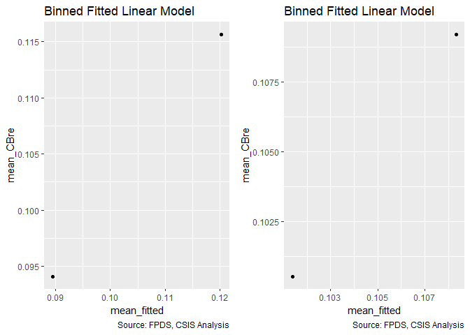<!-- -->

```
## Warning in simpleLoess(y, x, w, span, degree = degree, parametric =
## parametric, : pseudoinverse used at 0.0020721
```

```
## Warning in simpleLoess(y, x, w, span, degree = degree, parametric =
## parametric, : neighborhood radius 0.10583
```

```
## Warning in simpleLoess(y, x, w, span, degree = degree, parametric =
## parametric, : reciprocal condition number 1.9189e-028
```

```
## Warning in simpleLoess(y, x, w, span, degree = degree, parametric =
## parametric, : There are other near singularities as well. 0.010719
```

```
## Warning in simpleLoess(y, x, w, span, degree = degree, parametric =
## parametric, : zero-width neighborhood. make span bigger
```

```
## Warning: Computation failed in `stat_smooth()`:
## NA/NaN/Inf in foreign function call (arg 5)
```

```
## Warning in simpleLoess(y, x, w, span, degree = degree, parametric =
## parametric, : at 0.097767
```

```
## Warning in simpleLoess(y, x, w, span, degree = degree, parametric =
## parametric, : radius 1.3052e-005
```

```
## Warning in simpleLoess(y, x, w, span, degree = degree, parametric =
## parametric, : all data on boundary of neighborhood. make span bigger
```

```
## Warning in simpleLoess(y, x, w, span, degree = degree, parametric =
## parametric, : pseudoinverse used at 0.097767
```

```
## Warning in simpleLoess(y, x, w, span, degree = degree, parametric =
## parametric, : neighborhood radius 0.0036128
```

```
## Warning in simpleLoess(y, x, w, span, degree = degree, parametric =
## parametric, : reciprocal condition number 1
```

```
## Warning in simpleLoess(y, x, w, span, degree = degree, parametric =
## parametric, : There are other near singularities as well. 0.52733
```

```
## Warning in simpleLoess(y, x, w, span, degree = degree, parametric =
## parametric, : zero-width neighborhood. make span bigger
```

```
## Warning: Computation failed in `stat_smooth()`:
## NA/NaN/Inf in foreign function call (arg 5)
```

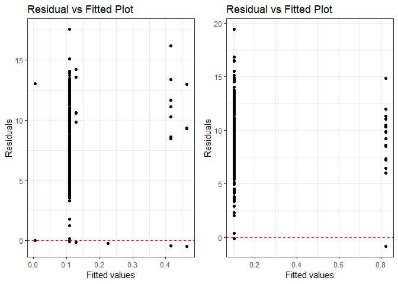<!-- -->

```
## Warning in if (class(model1_new) == "glmerMod") {: the condition has length
## > 1 and only the first element will be used
```

```
## Warning in if (class(model1_new) != "glmerMod" & class(model1_old) !=
## "glmerMod" & : the condition has length > 1 and only the first element will
## be used
```

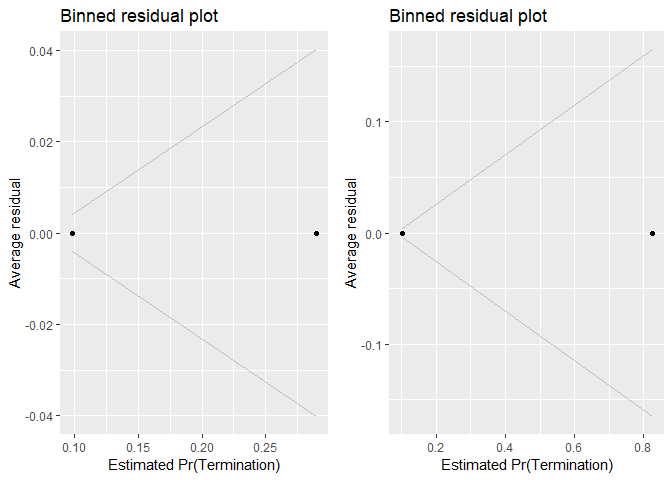<!-- -->

```
## NULL
```
UCAs are associated with more/larger ceiling breaches ,as expected.

###Model 04C: Cumulative


```r
#Create the model
ln_CBre_Cons_04C <- glm (data=smp,
                 ln_CBre_Then_Year ~cl_def6_HHI_lag1+cl_def6_ratio_lag1+cl_def6_obl_lag1+cl_US6_avg_sal_lag1+
                   cl_def3_HHI_lag1+cl_def3_ratio_lag1+
                   cl_Ceil_Then_Year+ cl_Days+
                   Veh+
                   PricingFee+b_UCA)
glmer_examine(ln_CBre_Cons_04C)
```

```
##                         GVIF Df GVIF^(1/(2*Df))
## cl_def6_HHI_lag1    1.856415  1        1.362503
## cl_def6_ratio_lag1  1.607797  1        1.267990
## cl_def6_obl_lag1    1.912171  1        1.382813
## cl_US6_avg_sal_lag1 1.513374  1        1.230193
## cl_def3_HHI_lag1    1.818926  1        1.348676
## cl_def3_ratio_lag1  1.905150  1        1.380272
## cl_Ceil_Then_Year   1.385423  1        1.177040
## cl_Days             1.761279  1        1.327132
## Veh                 1.838251  4        1.079072
## PricingFee          1.451896  5        1.037991
## b_UCA               1.008847  1        1.004414
```

```r
ln_CBre_Comp_04C <- glm (data=smp,
                 ln_CBre_Then_Year ~CompOffr+
                   cl_def6_ratio_lag1+cl_def6_obl_lag1+cl_US6_avg_sal_lag1+
                   cl_def3_ratio_lag1+
                   cl_Ceil_Then_Year+ cl_Days+
                   Veh+
                   PricingFee+b_UCA)
glmer_examine(ln_CBre_Comp_04C)
```

```
##                         GVIF Df GVIF^(1/(2*Df))
## CompOffr            1.251779  4        1.028468
## cl_def6_ratio_lag1  1.596545  1        1.263545
## cl_def6_obl_lag1    1.937423  1        1.391913
## cl_US6_avg_sal_lag1 1.473122  1        1.213722
## cl_def3_ratio_lag1  1.953839  1        1.397798
## cl_Ceil_Then_Year   1.369005  1        1.170045
## cl_Days             1.626391  1        1.275300
## Veh                 1.756041  4        1.072919
## PricingFee          1.402291  5        1.034389
## b_UCA               1.013654  1        1.006804
```

```r
stargazer::stargazer(ln_CBre_04A,ln_CBre_04B,ln_CBre_Cons_NCS6A,ln_CBre_Cons_NCS3A,ln_CBre_Cons_03B,ln_CBre_Cons_04C,
                       ln_CBre_Comp_01A,ln_CBre_Comp_03B,ln_CBre_Comp_04C,type="text",
                       digits=2)
```

```
## 
## ==========================================================================================================================================
##                                                                            Dependent variable:                                            
##                                -----------------------------------------------------------------------------------------------------------
##                                                                             ln_CBre_Then_Year                                             
##                                    (1)         (2)         (3)         (4)         (5)         (6)         (7)         (8)         (9)    
## ------------------------------------------------------------------------------------------------------------------------------------------
## PricingFeeOther FP              -0.10***                                                      0.01                               0.02**   
##                                  (0.01)                                                      (0.01)                              (0.01)   
##                                                                                                                                           
## PricingFeeIncentive              0.12***                                                      0.05                                0.05    
##                                  (0.03)                                                      (0.03)                              (0.03)   
##                                                                                                                                           
## PricingFeeCombination or Other   0.36***                                                     0.19***                             0.20***  
##                                  (0.03)                                                      (0.03)                              (0.03)   
##                                                                                                                                           
## PricingFeeOther CB               0.31***                                                     -0.004                               0.03    
##                                  (0.02)                                                      (0.02)                              (0.02)   
##                                                                                                                                           
## PricingFeeT&M/LH/FPLOE            0.02                                                      -0.07***                            -0.06***  
##                                  (0.02)                                                      (0.02)                              (0.02)   
##                                                                                                                                           
## b_UCA                                        0.72***                                         0.58***                             0.58***  
##                                              (0.03)                                          (0.03)                              (0.03)   
##                                                                                                                                           
## cl_def6_HHI_lag1                                        -0.10***                -0.03***    -0.02***                                      
##                                                          (0.004)                 (0.01)      (0.01)                                       
##                                                                                                                                           
## cl_def6_ratio_lag1                                                               -0.004      -0.003                  -0.01**     -0.01*   
##                                                                                  (0.005)     (0.005)                 (0.005)     (0.005)  
##                                                                                                                                           
## cl_def6_obl_lag1                                                                 0.05***     0.05***                 0.05***     0.05***  
##                                                                                  (0.01)      (0.01)                  (0.01)      (0.01)   
##                                                                                                                                           
## cl_US6_avg_sal_lag1                                                             -0.03***    -0.03***                -0.04***    -0.04***  
##                                                                                  (0.005)     (0.005)                 (0.005)     (0.005)  
##                                                                                                                                           
## cl_def3_HHI_lag1                                                    -0.16***    -0.05***    -0.05***                                      
##                                                                      (0.004)     (0.01)      (0.01)                                       
##                                                                                                                                           
## cl_def3_ratio_lag1                                                              -0.03***    -0.04***                -0.03***    -0.04***  
##                                                                                  (0.01)      (0.01)                  (0.01)      (0.01)   
##                                                                                                                                           
## cl_Ceil_Then_Year                                                                1.22***     1.21***                 1.24***     1.23***  
##                                                                                  (0.03)      (0.03)                  (0.03)      (0.03)   
##                                                                                                                                           
## cl_Days                                                                          0.10***     0.10***                 0.12***     0.11***  
##                                                                                  (0.01)      (0.01)                  (0.005)     (0.01)   
##                                                                                                                                           
## VehS-IDC                                                                         0.06***     0.05***                 0.04***     0.03***  
##                                                                                  (0.01)      (0.01)                  (0.01)      (0.01)   
##                                                                                                                                           
## VehM-IDC                                                                         0.29***     0.28***                 0.29***     0.28***  
##                                                                                  (0.01)      (0.01)                  (0.01)      (0.01)   
##                                                                                                                                           
## VehFSS/GWAC                                                                       0.01        0.01                    0.01        0.01    
##                                                                                  (0.01)      (0.01)                  (0.01)      (0.01)   
##                                                                                                                                           
## VehBPA/BOA                                                                       0.06***     0.05***                 0.05***     0.03**   
##                                                                                  (0.02)      (0.02)                  (0.02)      (0.02)   
##                                                                                                                                           
## CompOffr1 offer                                                                                         -0.07***    -0.05***    -0.04***  
##                                                                                                          (0.01)      (0.01)      (0.01)   
##                                                                                                                                           
## CompOffr2 offers                                                                                        -0.09***    -0.04***    -0.03***  
##                                                                                                          (0.01)      (0.01)      (0.01)   
##                                                                                                                                           
## CompOffr3-4 offers                                                                                      -0.04***     -0.01*       -0.01   
##                                                                                                          (0.01)      (0.01)      (0.01)   
##                                                                                                                                           
## CompOffr5+ offers                                                                                       -0.07***    -0.03***    -0.02***  
##                                                                                                          (0.01)      (0.01)      (0.01)   
##                                                                                                                                           
## Constant                         0.11***     0.10***     0.10***     0.10***    -0.50***    -0.50***     0.16***    -0.47***    -0.48***  
##                                  (0.002)     (0.002)     (0.002)     (0.002)     (0.01)      (0.01)      (0.005)     (0.01)      (0.02)   
##                                                                                                                                           
## ------------------------------------------------------------------------------------------------------------------------------------------
## Observations                     250,000     250,000     250,000     250,000     250,000     250,000     250,000     250,000     250,000  
## Log Likelihood                 -358,180.60 -358,210.60 -358,187.00 -357,791.30 -355,752.90 -355,525.50 -358,404.30 -355,824.70 -355,597.20
## Akaike Inf. Crit.              716,373.20  716,425.30  716,378.00  715,586.70  711,531.90  711,089.00  716,818.60  711,679.40  711,236.30 
## ==========================================================================================================================================
## Note:                                                                                                          *p<0.1; **p<0.05; ***p<0.01
```

```r
#Compare with cumulative consolidation and competition
summary_residual_compare(ln_CBre_Cons_03B,ln_CBre_Comp_04C,ln_CBre_Comp_03B,ln_CBre_Comp_04C,bins=20,skip_vif = TRUE)
```

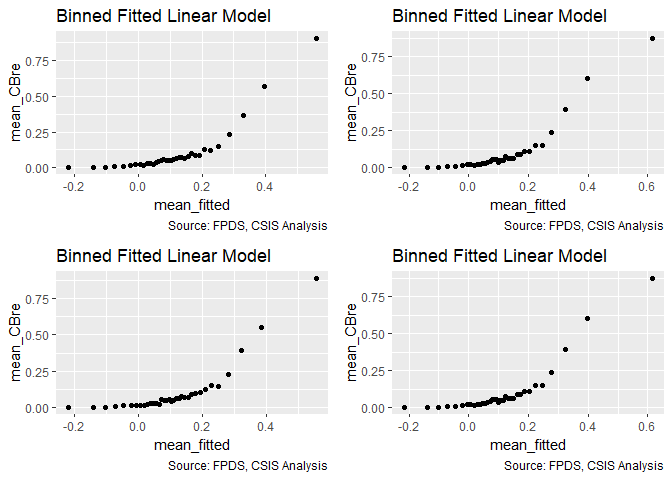<!-- -->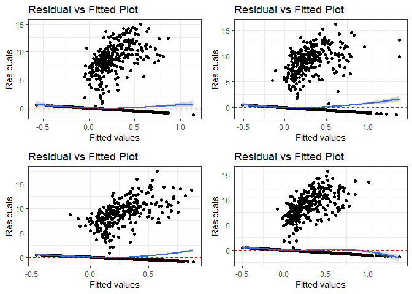<!-- -->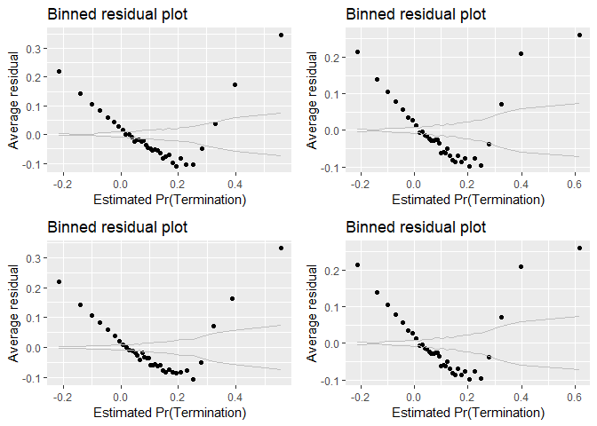<!-- -->

```
## Warning in if (class(model1_new) == "glmerMod" & class(model2_new) ==
## "glmerMod" & : the condition has length > 1 and only the first element will
## be used
```

```
## Warning in if ((class(model1_new) != "glmerMod" & class(model2_new) !
## = "glmerMod") & : the condition has length > 1 and only the first element
## will be used
```

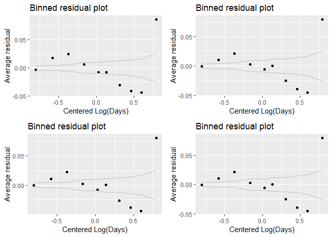<!-- -->

```
## NULL
```

```r
rm(ln_CBre_04A,ln_CBre_04B)

if(exists("ln_CBre_03A")) rm(ln_CBre_03A)
```

The pricing variables reduce significance for HHI and magnitude for Comp. Changes for vehicle are more sporatic.  Def3_ratio and ceiling also face decreasing/loss of significance. UCA and Combination/Fee have perhaps the largest coefficients.

##Place of Performance
###Model 05A: Any International

International contracts may often be in conflict zones and thus experience greater risk. International contracts are exepected to estimate a higher probability of ceiling breaches.

```r
#Frequency Plot
summary_discrete_plot(smp,"Intl")
```

```
## Warning: Ignoring unknown parameters: binwidth, bins, pad
```

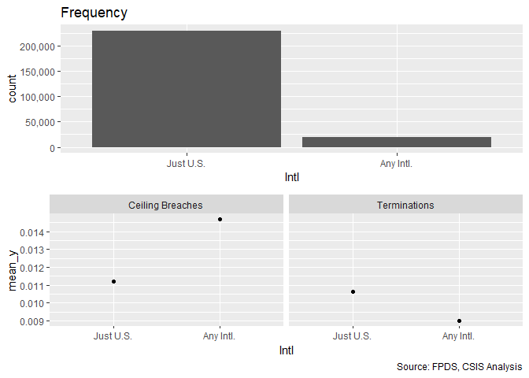<!-- -->

```
## [[1]]
## 
## Just U.S. Any Intl. 
##    229984     20016 
## 
## [[2]]
##            
##               None Ceiling Breach
##   Just U.S. 227403           2581
##   Any Intl.  19722            294
## 
## [[3]]
##            
##                  0      1
##   Just U.S. 227536   2448
##   Any Intl.  19836    180
```

```r
#Create the model
ln_CBre_05A <- glm(data=smp,
  ln_CBre_Then_Year ~b_Intl
)
summary(ln_CBre_05A)
```

```
## 
## Call:
## glm(formula = ln_CBre_Then_Year ~ b_Intl, data = smp)
## 
## Deviance Residuals: 
##     Min       1Q   Median       3Q      Max  
## -0.1327  -0.1024  -0.1024  -0.1024  19.4148  
## 
## Coefficients:
##             Estimate Std. Error t value Pr(>|t|)    
## (Intercept) 0.102439   0.002117   48.39  < 2e-16 ***
## b_Intl      0.030301   0.007481    4.05 5.12e-05 ***
## ---
## Signif. codes:  0 '***' 0.001 '**' 0.01 '*' 0.05 '.' 0.1 ' ' 1
## 
## (Dispersion parameter for gaussian family taken to be 1.030637)
## 
##     Null deviance: 257674  on 249999  degrees of freedom
## Residual deviance: 257657  on 249998  degrees of freedom
## AIC: 717018
## 
## Number of Fisher Scoring iterations: 2
```

```r
stargazer::stargazer(ln_CBre_05A,ln_CBre_Cons_NCS6A,ln_CBre_Cons_NCS3A,ln_CBre_Cons_04C,
                       ln_CBre_Comp_01A,ln_CBre_Comp_04C,type="text",
                       digits=2)
```

```
## 
## ======================================================================================================
##                                                          Dependent variable:                          
##                                -----------------------------------------------------------------------
##                                                           ln_CBre_Then_Year                           
##                                    (1)         (2)         (3)         (4)         (5)         (6)    
## ------------------------------------------------------------------------------------------------------
## b_Intl                           0.03***                                                              
##                                  (0.01)                                                               
##                                                                                                       
## cl_def6_HHI_lag1                            -0.10***                -0.02***                          
##                                              (0.004)                 (0.01)                           
##                                                                                                       
## cl_def6_ratio_lag1                                                   -0.003                  -0.01*   
##                                                                      (0.005)                 (0.005)  
##                                                                                                       
## cl_def6_obl_lag1                                                     0.05***                 0.05***  
##                                                                      (0.01)                  (0.01)   
##                                                                                                       
## cl_US6_avg_sal_lag1                                                 -0.03***                -0.04***  
##                                                                      (0.005)                 (0.005)  
##                                                                                                       
## cl_def3_HHI_lag1                                        -0.16***    -0.05***                          
##                                                          (0.004)     (0.01)                           
##                                                                                                       
## cl_def3_ratio_lag1                                                  -0.04***                -0.04***  
##                                                                      (0.01)                  (0.01)   
##                                                                                                       
## cl_Ceil_Then_Year                                                    1.21***                 1.23***  
##                                                                      (0.03)                  (0.03)   
##                                                                                                       
## cl_Days                                                              0.10***                 0.11***  
##                                                                      (0.01)                  (0.01)   
##                                                                                                       
## VehS-IDC                                                             0.05***                 0.03***  
##                                                                      (0.01)                  (0.01)   
##                                                                                                       
## VehM-IDC                                                             0.28***                 0.28***  
##                                                                      (0.01)                  (0.01)   
##                                                                                                       
## VehFSS/GWAC                                                           0.01                    0.01    
##                                                                      (0.01)                  (0.01)   
##                                                                                                       
## VehBPA/BOA                                                           0.05***                 0.03**   
##                                                                      (0.02)                  (0.02)   
##                                                                                                       
## PricingFeeOther FP                                                    0.01                   0.02**   
##                                                                      (0.01)                  (0.01)   
##                                                                                                       
## PricingFeeIncentive                                                   0.05                    0.05    
##                                                                      (0.03)                  (0.03)   
##                                                                                                       
## PricingFeeCombination or Other                                       0.19***                 0.20***  
##                                                                      (0.03)                  (0.03)   
##                                                                                                       
## PricingFeeOther CB                                                   -0.004                   0.03    
##                                                                      (0.02)                  (0.02)   
##                                                                                                       
## PricingFeeT&M/LH/FPLOE                                              -0.07***                -0.06***  
##                                                                      (0.02)                  (0.02)   
##                                                                                                       
## b_UCA                                                                0.58***                 0.58***  
##                                                                      (0.03)                  (0.03)   
##                                                                                                       
## CompOffr1 offer                                                                 -0.07***    -0.04***  
##                                                                                  (0.01)      (0.01)   
##                                                                                                       
## CompOffr2 offers                                                                -0.09***    -0.03***  
##                                                                                  (0.01)      (0.01)   
##                                                                                                       
## CompOffr3-4 offers                                                              -0.04***      -0.01   
##                                                                                  (0.01)      (0.01)   
##                                                                                                       
## CompOffr5+ offers                                                               -0.07***    -0.02***  
##                                                                                  (0.01)      (0.01)   
##                                                                                                       
## Constant                         0.10***     0.10***     0.10***    -0.50***     0.16***    -0.48***  
##                                  (0.002)     (0.002)     (0.002)     (0.01)      (0.005)     (0.02)   
##                                                                                                       
## ------------------------------------------------------------------------------------------------------
## Observations                     250,000     250,000     250,000     250,000     250,000     250,000  
## Log Likelihood                 -358,506.80 -358,187.00 -357,791.30 -355,525.50 -358,404.30 -355,597.20
## Akaike Inf. Crit.              717,017.60  716,378.00  715,586.70  711,089.00  716,818.60  711,236.30 
## ======================================================================================================
## Note:                                                                      *p<0.1; **p<0.05; ***p<0.01
```

```r
#For first model in category, include only the new model(s), skip_vif=true
summary_residual_compare(ln_CBre_05A,bins=2,skip_vif = TRUE)
```

```
## Warning in simpleLoess(y, x, w, span, degree = degree, parametric =
## parametric, : at 0.10229
```

```
## Warning in simpleLoess(y, x, w, span, degree = degree, parametric =
## parametric, : radius 2.2954e-008
```

```
## Warning in simpleLoess(y, x, w, span, degree = degree, parametric =
## parametric, : all data on boundary of neighborhood. make span bigger
```

```
## Warning in simpleLoess(y, x, w, span, degree = degree, parametric =
## parametric, : pseudoinverse used at 0.10229
```

```
## Warning in simpleLoess(y, x, w, span, degree = degree, parametric =
## parametric, : neighborhood radius 0.00015151
```

```
## Warning in simpleLoess(y, x, w, span, degree = degree, parametric =
## parametric, : reciprocal condition number 1
```

```
## Warning in simpleLoess(y, x, w, span, degree = degree, parametric =
## parametric, : There are other near singularities as well. 0.00092736
```

```
## Warning in simpleLoess(y, x, w, span, degree = degree, parametric =
## parametric, : zero-width neighborhood. make span bigger
```

```
## Warning: Computation failed in `stat_smooth()`:
## NA/NaN/Inf in foreign function call (arg 5)
```

```
## Warning in if (class(model1_old) == "glmerMod") {: the condition has length
## > 1 and only the first element will be used
```

```
## Warning in if (class(model1_old) != "glmerMod" & class(model1_old) !=
## "glmerMod" & : the condition has length > 1 and only the first element will
## be used
```

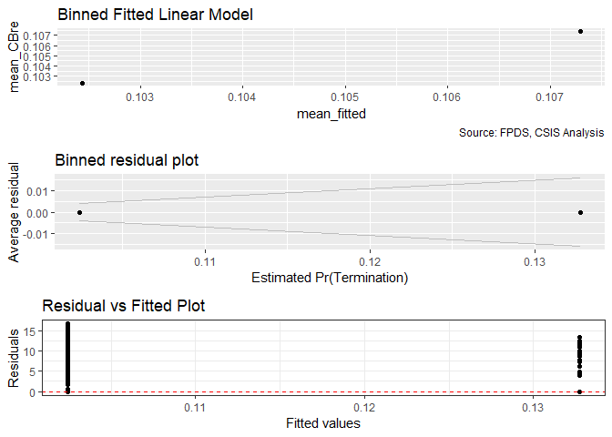<!-- -->

```
## NULL
```

International performance of contract had a positive  coefficent as expected.

###Model 05B: Cumulative


```r
#Create the model
ln_CBre_Cons_05B <- glm (data=smp,
                 ln_CBre_Then_Year ~cl_def6_HHI_lag1+cl_def6_ratio_lag1+cl_def6_obl_lag1+cl_US6_avg_sal_lag1+
                   cl_def3_HHI_lag1+cl_def3_ratio_lag1+
                   cl_Ceil_Then_Year+ cl_Days+
                   Veh+
                   PricingFee+b_UCA+
                   b_Intl)
glmer_examine(ln_CBre_Cons_05B)
```

```
##                         GVIF Df GVIF^(1/(2*Df))
## cl_def6_HHI_lag1    1.876019  1        1.369678
## cl_def6_ratio_lag1  1.608556  1        1.268288
## cl_def6_obl_lag1    1.938005  1        1.392122
## cl_US6_avg_sal_lag1 1.559415  1        1.248765
## cl_def3_HHI_lag1    1.819463  1        1.348875
## cl_def3_ratio_lag1  1.910972  1        1.382379
## cl_Ceil_Then_Year   1.400351  1        1.183364
## cl_Days             1.762184  1        1.327473
## Veh                 1.851395  4        1.080034
## PricingFee          1.455717  5        1.038264
## b_UCA               1.009141  1        1.004560
## b_Intl              1.074978  1        1.036811
```

```r
ln_CBre_Comp_05B <- glm (data=smp,
                 ln_CBre_Then_Year ~CompOffr+
                   cl_def6_ratio_lag1+cl_def6_obl_lag1+cl_US6_avg_sal_lag1+
                   cl_def3_ratio_lag1+
                   cl_Ceil_Then_Year+ cl_Days+
                   Veh+
                   PricingFee+b_UCA+
                   b_Intl)
glmer_examine(ln_CBre_Comp_05B)
```

```
##                         GVIF Df GVIF^(1/(2*Df))
## CompOffr            1.272327  4        1.030564
## cl_def6_ratio_lag1  1.596791  1        1.263642
## cl_def6_obl_lag1    1.963448  1        1.401231
## cl_US6_avg_sal_lag1 1.503402  1        1.226133
## cl_def3_ratio_lag1  1.960893  1        1.400319
## cl_Ceil_Then_Year   1.386077  1        1.177318
## cl_Days             1.632585  1        1.277727
## Veh                 1.769298  4        1.073928
## PricingFee          1.407768  5        1.034792
## b_UCA               1.013845  1        1.006899
## b_Intl              1.075056  1        1.036849
```

```r
stargazer::stargazer(ln_CBre_05A,ln_CBre_Cons_NCS6A,ln_CBre_Cons_NCS3A,ln_CBre_Cons_04C,ln_CBre_Cons_05B,
                       ln_CBre_Comp_01A,ln_CBre_Comp_04C,ln_CBre_Comp_05B,type="text",
                       digits=2)
```

```
## 
## ==============================================================================================================================
##                                                                      Dependent variable:                                      
##                                -----------------------------------------------------------------------------------------------
##                                                                       ln_CBre_Then_Year                                       
##                                    (1)         (2)         (3)         (4)         (5)         (6)         (7)         (8)    
## ------------------------------------------------------------------------------------------------------------------------------
## b_Intl                           0.03***                                          -0.01                              -0.01*   
##                                  (0.01)                                          (0.01)                              (0.01)   
##                                                                                                                               
## cl_def6_HHI_lag1                            -0.10***                -0.02***    -0.02***                                      
##                                              (0.004)                 (0.01)      (0.01)                                       
##                                                                                                                               
## cl_def6_ratio_lag1                                                   -0.003      -0.003                  -0.01*      -0.01*   
##                                                                      (0.005)     (0.005)                 (0.005)     (0.005)  
##                                                                                                                               
## cl_def6_obl_lag1                                                     0.05***     0.05***                 0.05***     0.05***  
##                                                                      (0.01)      (0.01)                  (0.01)      (0.01)   
##                                                                                                                               
## cl_US6_avg_sal_lag1                                                 -0.03***    -0.03***                -0.04***    -0.04***  
##                                                                      (0.005)     (0.01)                  (0.005)     (0.005)  
##                                                                                                                               
## cl_def3_HHI_lag1                                        -0.16***    -0.05***    -0.05***                                      
##                                                          (0.004)     (0.01)      (0.01)                                       
##                                                                                                                               
## cl_def3_ratio_lag1                                                  -0.04***    -0.04***                -0.04***    -0.04***  
##                                                                      (0.01)      (0.01)                  (0.01)      (0.01)   
##                                                                                                                               
## cl_Ceil_Then_Year                                                    1.21***     1.21***                 1.23***     1.24***  
##                                                                      (0.03)      (0.03)                  (0.03)      (0.03)   
##                                                                                                                               
## cl_Days                                                              0.10***     0.10***                 0.11***     0.11***  
##                                                                      (0.01)      (0.01)                  (0.01)      (0.01)   
##                                                                                                                               
## VehS-IDC                                                             0.05***     0.05***                 0.03***     0.03***  
##                                                                      (0.01)      (0.01)                  (0.01)      (0.01)   
##                                                                                                                               
## VehM-IDC                                                             0.28***     0.28***                 0.28***     0.28***  
##                                                                      (0.01)      (0.01)                  (0.01)      (0.01)   
##                                                                                                                               
## VehFSS/GWAC                                                           0.01        0.01                    0.01        0.01    
##                                                                      (0.01)      (0.01)                  (0.01)      (0.01)   
##                                                                                                                               
## VehBPA/BOA                                                           0.05***     0.05***                 0.03**      0.03**   
##                                                                      (0.02)      (0.02)                  (0.02)      (0.02)   
##                                                                                                                               
## PricingFeeOther FP                                                    0.01        0.01                   0.02**      0.02**   
##                                                                      (0.01)      (0.01)                  (0.01)      (0.01)   
##                                                                                                                               
## PricingFeeIncentive                                                   0.05        0.05                    0.05        0.05    
##                                                                      (0.03)      (0.03)                  (0.03)      (0.03)   
##                                                                                                                               
## PricingFeeCombination or Other                                       0.19***     0.19***                 0.20***     0.20***  
##                                                                      (0.03)      (0.03)                  (0.03)      (0.03)   
##                                                                                                                               
## PricingFeeOther CB                                                   -0.004      -0.004                   0.03        0.02    
##                                                                      (0.02)      (0.02)                  (0.02)      (0.02)   
##                                                                                                                               
## PricingFeeT&M/LH/FPLOE                                              -0.07***    -0.07***                -0.06***    -0.06***  
##                                                                      (0.02)      (0.02)                  (0.02)      (0.02)   
##                                                                                                                               
## b_UCA                                                                0.58***     0.58***                 0.58***     0.58***  
##                                                                      (0.03)      (0.03)                  (0.03)      (0.03)   
##                                                                                                                               
## CompOffr1 offer                                                                             -0.07***    -0.04***    -0.04***  
##                                                                                              (0.01)      (0.01)      (0.01)   
##                                                                                                                               
## CompOffr2 offers                                                                            -0.09***    -0.03***    -0.03***  
##                                                                                              (0.01)      (0.01)      (0.01)   
##                                                                                                                               
## CompOffr3-4 offers                                                                          -0.04***      -0.01      -0.004   
##                                                                                              (0.01)      (0.01)      (0.01)   
##                                                                                                                               
## CompOffr5+ offers                                                                           -0.07***    -0.02***    -0.02***  
##                                                                                              (0.01)      (0.01)      (0.01)   
##                                                                                                                               
## Constant                         0.10***     0.10***     0.10***    -0.50***    -0.50***     0.16***    -0.48***    -0.48***  
##                                  (0.002)     (0.002)     (0.002)     (0.01)      (0.01)      (0.005)     (0.02)      (0.02)   
##                                                                                                                               
## ------------------------------------------------------------------------------------------------------------------------------
## Observations                     250,000     250,000     250,000     250,000     250,000     250,000     250,000     250,000  
## Log Likelihood                 -358,506.80 -358,187.00 -357,791.30 -355,525.50 -355,525.20 -358,404.30 -355,597.20 -355,595.50
## Akaike Inf. Crit.              717,017.60  716,378.00  715,586.70  711,089.00  711,090.40  716,818.60  711,236.30  711,235.00 
## ==============================================================================================================================
## Note:                                                                                              *p<0.1; **p<0.05; ***p<0.01
```

```r
#ompare with cumulative consolidation and competition
summary_residual_compare(ln_CBre_Cons_04C,ln_CBre_Cons_05B,ln_CBre_Comp_04C,ln_CBre_Comp_05B,bins=20,skip_vif = FALSE)
```

<!-- -->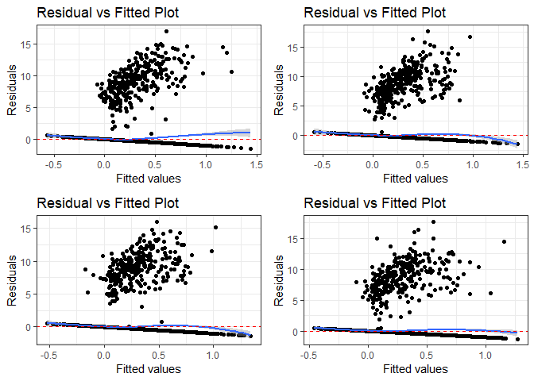<!-- -->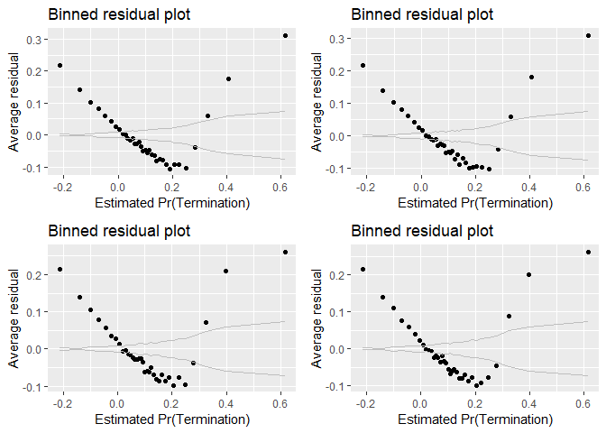<!-- -->

```
## Warning in if (class(model1_new) == "glmerMod" & class(model2_new) ==
## "glmerMod" & : the condition has length > 1 and only the first element will
## be used
```

```
## Warning in if ((class(model1_new) != "glmerMod" & class(model2_new) !
## = "glmerMod") & : the condition has length > 1 and only the first element
## will be used
```

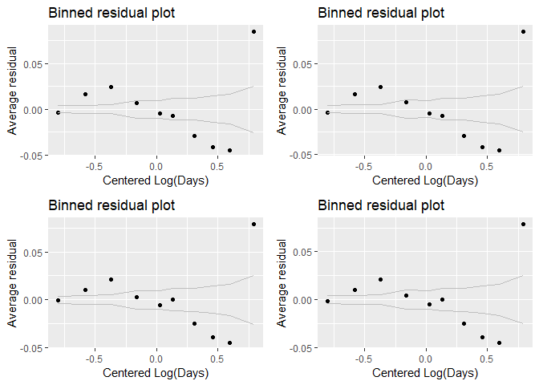<!-- -->

```
## [[1]]
##        model deviance null.deviance difference
## 1 model1_old 251584.7      257674.1   6089.379
## 2 model1_new 251584.1      257674.1   6090.007
## 3 model2_old 251729.0      257674.1   5945.136
## 4 model2_new 251725.7      257674.1   5948.418
## 
## [[2]]
##                         GVIF Df GVIF^(1/(2*Df))
## cl_def6_HHI_lag1    1.876019  1        1.369678
## cl_def6_ratio_lag1  1.608556  1        1.268288
## cl_def6_obl_lag1    1.938005  1        1.392122
## cl_US6_avg_sal_lag1 1.559415  1        1.248765
## cl_def3_HHI_lag1    1.819463  1        1.348875
## cl_def3_ratio_lag1  1.910972  1        1.382379
## cl_Ceil_Then_Year   1.400351  1        1.183364
## cl_Days             1.762184  1        1.327473
## Veh                 1.851395  4        1.080034
## PricingFee          1.455717  5        1.038264
## b_UCA               1.009141  1        1.004560
## b_Intl              1.074978  1        1.036811
## 
## [[3]]
##                         GVIF Df GVIF^(1/(2*Df))
## CompOffr            1.272327  4        1.030564
## cl_def6_ratio_lag1  1.596791  1        1.263642
## cl_def6_obl_lag1    1.963448  1        1.401231
## cl_US6_avg_sal_lag1 1.503402  1        1.226133
## cl_def3_ratio_lag1  1.960893  1        1.400319
## cl_Ceil_Then_Year   1.386077  1        1.177318
## cl_Days             1.632585  1        1.277727
## Veh                 1.769298  4        1.073928
## PricingFee          1.407768  5        1.034792
## b_UCA               1.013845  1        1.006899
## b_Intl              1.075056  1        1.036849
```

```r
rm(ln_CBre_05A)

if(exists("ln_CBre_04A")) rm(ln_CBre_04A,ln_CBre_04B)
```
Not much in the way of big changes, though reduction in significance for ceiling for competition.


## Competition and Consolidation together
### Model 09A: Combination

```r
#Sumamry plot

ln_CBre_Cons_Comp_09A <- glm (data=smp,
                 ln_CBre_Then_Year ~CompOffr+cl_def6_HHI_lag1+cl_def6_ratio_lag1+cl_def6_obl_lag1+cl_US6_avg_sal_lag1+
                   cl_def3_HHI_lag1+cl_def3_ratio_lag1+
                   cl_Ceil_Then_Year+ cl_Days+
                   Veh+
                   PricingFee+b_UCA+
                   b_Intl)
glmer_examine(ln_CBre_Cons_Comp_09A)
```

```
##                         GVIF Df GVIF^(1/(2*Df))
## CompOffr            1.293347  4        1.032677
## cl_def6_HHI_lag1    1.881330  1        1.371616
## cl_def6_ratio_lag1  1.610627  1        1.269105
## cl_def6_obl_lag1    1.976662  1        1.405938
## cl_US6_avg_sal_lag1 1.570569  1        1.253223
## cl_def3_HHI_lag1    1.834207  1        1.354329
## cl_def3_ratio_lag1  1.963988  1        1.401423
## cl_Ceil_Then_Year   1.416627  1        1.190221
## cl_Days             1.770556  1        1.330623
## Veh                 1.905690  4        1.083943
## PricingFee          1.511523  5        1.042177
## b_UCA               1.014033  1        1.006992
## b_Intl              1.093142  1        1.045534
```

```r
stargazer::stargazer(ln_CBre_Cons_NCS6A,ln_CBre_Cons_NCS3A,ln_CBre_Cons_05B,
                       ln_CBre_Comp_01A,ln_CBre_Comp_05B,ln_CBre_Cons_Comp_09A,type="text",
                       digits=2)
```

```
## 
## ======================================================================================================
##                                                          Dependent variable:                          
##                                -----------------------------------------------------------------------
##                                                           ln_CBre_Then_Year                           
##                                    (1)         (2)         (3)         (4)         (5)         (6)    
## ------------------------------------------------------------------------------------------------------
## cl_def6_HHI_lag1                -0.10***                -0.02***                            -0.02***  
##                                  (0.004)                 (0.01)                              (0.01)   
##                                                                                                       
## cl_def6_ratio_lag1                                       -0.003                  -0.01*      -0.003   
##                                                          (0.005)                 (0.005)     (0.005)  
##                                                                                                       
## cl_def6_obl_lag1                                         0.05***                 0.05***     0.05***  
##                                                          (0.01)                  (0.01)      (0.01)   
##                                                                                                       
## cl_US6_avg_sal_lag1                                     -0.03***                -0.04***    -0.03***  
##                                                          (0.01)                  (0.005)     (0.01)   
##                                                                                                       
## cl_def3_HHI_lag1                            -0.16***    -0.05***                            -0.05***  
##                                              (0.004)     (0.01)                              (0.01)   
##                                                                                                       
## cl_def3_ratio_lag1                                      -0.04***                -0.04***    -0.04***  
##                                                          (0.01)                  (0.01)      (0.01)   
##                                                                                                       
## cl_Ceil_Then_Year                                        1.21***                 1.24***     1.20***  
##                                                          (0.03)                  (0.03)      (0.03)   
##                                                                                                       
## cl_Days                                                  0.10***                 0.11***     0.09***  
##                                                          (0.01)                  (0.01)      (0.01)   
##                                                                                                       
## VehS-IDC                                                 0.05***                 0.03***     0.05***  
##                                                          (0.01)                  (0.01)      (0.01)   
##                                                                                                       
## VehM-IDC                                                 0.28***                 0.28***     0.28***  
##                                                          (0.01)                  (0.01)      (0.01)   
##                                                                                                       
## VehFSS/GWAC                                               0.01                    0.01        0.01    
##                                                          (0.01)                  (0.01)      (0.01)   
##                                                                                                       
## VehBPA/BOA                                               0.05***                 0.03**      0.05***  
##                                                          (0.02)                  (0.02)      (0.02)   
##                                                                                                       
## PricingFeeOther FP                                        0.01                   0.02**       0.01    
##                                                          (0.01)                  (0.01)      (0.01)   
##                                                                                                       
## PricingFeeIncentive                                       0.05                    0.05        0.04    
##                                                          (0.03)                  (0.03)      (0.03)   
##                                                                                                       
## PricingFeeCombination or Other                           0.19***                 0.20***     0.19***  
##                                                          (0.03)                  (0.03)      (0.03)   
##                                                                                                       
## PricingFeeOther CB                                       -0.004                   0.02       -0.001   
##                                                          (0.02)                  (0.02)      (0.02)   
##                                                                                                       
## PricingFeeT&M/LH/FPLOE                                  -0.07***                -0.06***    -0.07***  
##                                                          (0.02)                  (0.02)      (0.02)   
##                                                                                                       
## b_UCA                                                    0.58***                 0.58***     0.58***  
##                                                          (0.03)                  (0.03)      (0.03)   
##                                                                                                       
## b_Intl                                                    -0.01                  -0.01*      -0.002   
##                                                          (0.01)                  (0.01)      (0.01)   
##                                                                                                       
## CompOffr1 offer                                                     -0.07***    -0.04***    -0.04***  
##                                                                      (0.01)      (0.01)      (0.01)   
##                                                                                                       
## CompOffr2 offers                                                    -0.09***    -0.03***    -0.02***  
##                                                                      (0.01)      (0.01)      (0.01)   
##                                                                                                       
## CompOffr3-4 offers                                                  -0.04***     -0.004       0.003   
##                                                                      (0.01)      (0.01)      (0.01)   
##                                                                                                       
## CompOffr5+ offers                                                   -0.07***    -0.02***     -0.01*   
##                                                                      (0.01)      (0.01)      (0.01)   
##                                                                                                       
## Constant                         0.10***     0.10***    -0.50***     0.16***    -0.48***    -0.48***  
##                                  (0.002)     (0.002)     (0.01)      (0.005)     (0.02)      (0.02)   
##                                                                                                       
## ------------------------------------------------------------------------------------------------------
## Observations                     250,000     250,000     250,000     250,000     250,000     250,000  
## Log Likelihood                 -358,187.00 -357,791.30 -355,525.20 -358,404.30 -355,595.50 -355,498.60
## Akaike Inf. Crit.              716,378.00  715,586.70  711,090.40  716,818.60  711,235.00  711,045.20 
## ======================================================================================================
## Note:                                                                      *p<0.1; **p<0.05; ***p<0.01
```

```r
#Compare with cumulative consolidation and competition
summary_residual_compare(ln_CBre_Cons_05B,ln_CBre_Cons_Comp_09A,ln_CBre_Comp_05B,ln_CBre_Cons_Comp_09A,bins=20,skip_vif = TRUE)
```

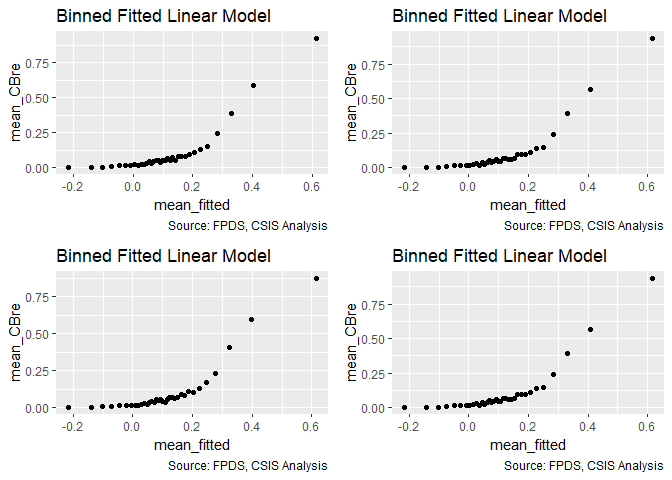<!-- -->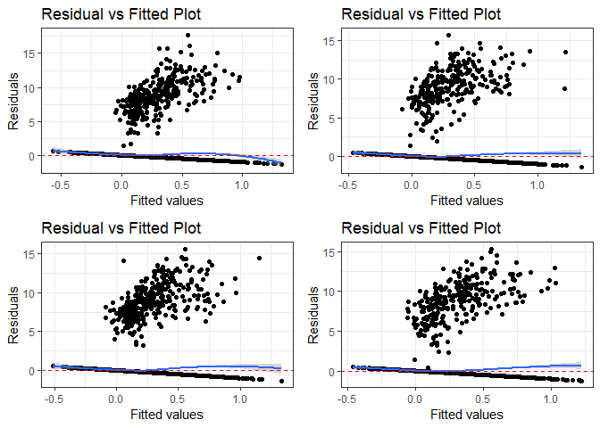<!-- -->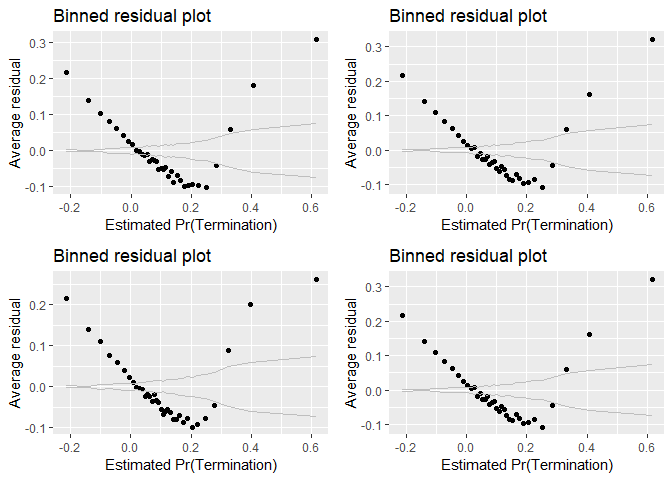<!-- -->

```
## Warning in if (class(model1_new) == "glmerMod" & class(model2_new) ==
## "glmerMod" & : the condition has length > 1 and only the first element will
## be used
```

```
## Warning in if ((class(model1_new) != "glmerMod" & class(model2_new) !
## = "glmerMod") & : the condition has length > 1 and only the first element
## will be used
```

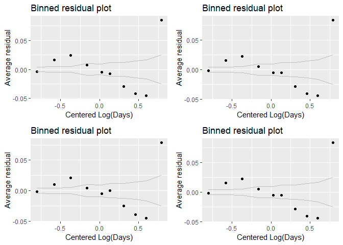<!-- -->

```
## NULL
```

```r
if(exists("ln_CBre_05A")) rm(ln_CBre_05A)
```
There is no real hange in the study variables. Instead, those controls that were significant in only one of the two models, 
cl_Ceil_Then_Year, FSS/GWAC, and BPA/BOA lost significance. b_Intl also increased in magnitude. The patterns in the residuals show no signs of abating, suggesting that ceiling breaches may simply be too rare for this approach. 
