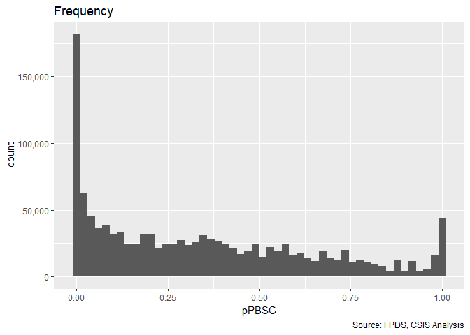
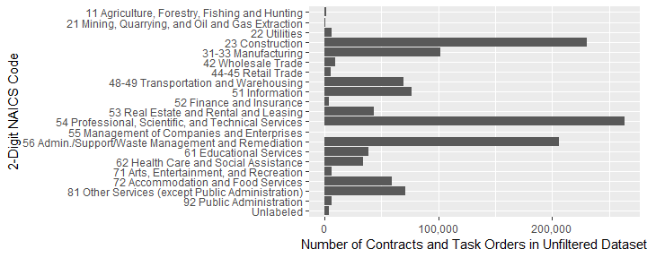

# Setup

```
## Warning: replacing previous import 'Hmisc::summarize' by 'dplyr::summarize'
## when loading 'csis360'
```

```
## Warning: replacing previous import 'Hmisc::src' by 'dplyr::src' when
## loading 'csis360'
```

```
## Warning: replacing previous import 'dplyr::intersect' by
## 'lubridate::intersect' when loading 'csis360'
```

```
## Warning: replacing previous import 'dplyr::union' by 'lubridate::union'
## when loading 'csis360'
```

```
## Warning: replacing previous import 'dplyr::setdiff' by 'lubridate::setdiff'
## when loading 'csis360'
```

```
## 
## Attaching package: 'dplyr'
```

```
## The following objects are masked from 'package:stats':
## 
##     filter, lag
```

```
## The following objects are masked from 'package:base':
## 
##     intersect, setdiff, setequal, union
```

```
## Loading required package: MASS
```

```
## 
## Attaching package: 'MASS'
```

```
## The following object is masked from 'package:dplyr':
## 
##     select
```

```
## Loading required package: Matrix
```

```
## Loading required package: lme4
```

```
## 
## arm (Version 1.10-1, built: 2018-4-12)
```

```
## Working directory is C:/Users/gsand/Repositories/Services/analysis
```

```
## Loading required package: coda
```

```
## 
## Attaching package: 'coda'
```

```
## The following object is masked from 'package:arm':
## 
##     traceplot
```

```
## Loading required package: boot
```

```
## 
## Attaching package: 'boot'
```

```
## The following object is masked from 'package:arm':
## 
##     logit
```

```
## 
## Please cite as:
```

```
##  Hlavac, Marek (2018). stargazer: Well-Formatted Regression and Summary Statistics Tables.
```

```
##  R package version 5.2.2. https://CRAN.R-project.org/package=stargazer
```

```
## Version:  1.36.23
## Date:     2017-03-03
## Author:   Philip Leifeld (University of Glasgow)
## 
## Please cite the JSS article in your publications -- see citation("texreg").
```

```
## 
## Attaching package: 'texreg'
```

```
## The following object is masked from 'package:arm':
## 
##     coefplot
```

```
## -- Attaching packages --------------------------------------------------------------------------------------------------------------------- tidyverse 1.2.1 --
```

```
## v tibble  2.1.1     v purrr   0.3.2
## v tidyr   0.8.3     v stringr 1.4.0
## v readr   1.3.1     v forcats 0.4.0
```

```
## -- Conflicts ------------------------------------------------------------------------------------------------------------------------ tidyverse_conflicts() --
## x tidyr::expand()  masks Matrix::expand()
## x tidyr::extract() masks texreg::extract()
## x dplyr::filter()  masks stats::filter()
## x dplyr::lag()     masks stats::lag()
## x MASS::select()   masks dplyr::select()
```

```
## Loading required package: carData
```

```
## 
## Attaching package: 'car'
```

```
## The following object is masked from 'package:purrr':
## 
##     some
```

```
## The following object is masked from 'package:boot':
## 
##     logit
```

```
## The following object is masked from 'package:arm':
## 
##     logit
```

```
## The following object is masked from 'package:dplyr':
## 
##     recode
```

```
## 
## Attaching package: 'scales'
```

```
## The following object is masked from 'package:purrr':
## 
##     discard
```

```
## The following object is masked from 'package:readr':
## 
##     col_factor
```

```
## The following object is masked from 'package:arm':
## 
##     rescale
```


Contracts are classified using a mix of numerical and categorical variables. While the changes in numerical variables are easy to grasp and summarize, a contract may have one line item that is competed and another that is not. As is detailed in the exploration on R&D, we are only considering information available prior to contract start. The percentage of contract obligations that were competed is a valuable benchmark, but is highly influenced by factors that occured after contract start..


## Load Data
First we load the data. The dataset used is a U.S. Defense Contracting dataset derived from   FPDS.


```r
load("../data/clean/transformed_def_serv.Rdata")
```


# Dependent Variables

NA_stats(def_serv,"b_Term")
* b_Term is a binary variable that has a value of 1 for any contracts that have experienced a partial or complete termination, 0 otherwise. (0.0246381
* b_CBre is a binary variable that has a value of 1 for any contracts that have experienced a partial or complete termination, 0 otherwise. (Data is missing for 0 of records and 0 of obligated dollars.)


```r
#The original variables for b_Term and b_CBre are Term and CBre
grouped_barplot("Term", def_serv)
```

<!-- -->

```r
grouped_barplot("CBre", def_serv)
```

<!-- -->

```r
statsummary_discrete(c("b_Term"), def_serv)
```

```
##   b_Term %of records % of $s
## 1      0      98.07%  97.54%
## 2      1       1.93%   2.46%
```

```r
statsummary_discrete(c("CBre"), def_serv)
```

```
##             CBre %of records % of $s
## 1           None      94.34%  78.41%
## 2 Ceiling Breach       5.66%  21.59%
```

```r
statsummary_continuous(c("p_OptGrowth"), def_serv)
```

```
##   Variable_Name   Min            Max Median Logarithmic Mean 1 unit below
## 1   p_OptGrowth 1.000 58,837,341.000  1.000            1.045    0.644  * 
##   1 unit above % of records NA % of Obligations to NA records
## 1       1.695           0.593%                         0.515%
```


### Contract Terminations

Contract terminations and the number of change orders can be calculated for the entire sample.  Contract termination is determined using the *Reason for Modification* field in FPDS.  A contract is considered to be terminated if it has at least one modification with the following values:

* "Terminate for Default (complete or partial)"
* "Terminate for Convenience (complete or partial)"
* "Terminate for Cause"
* "Legal Contract Cancellation"

These four categories and the "Close Out" category are used to mark a contract as closed.  Many contracts in FPDS and in the sample are never marked closed.  
# Independent Variables

## Study Variables


```r
# b_Comp
# n_Comp
# Comp
# EffComp
# CompOffr
# offr:


grouped_barplot("Comp",def_serv)
```

<!-- -->

```r
grouped_barplot("EffComp",def_serv)
```

<!-- -->

```r
grouped_barplot("CompOffr", def_serv)
```

<!-- -->

```r
grouped_barplot("Offr", def_serv)
```

<!-- -->

```r
# def_serv$n_Comp <- factor(def_serv$n_Comp,c(0,1))
# grouped_barplot("Comp", def_serv)
# #grouped_barplot("n_Comp")
# grouped_barplot("Comp", def_serv)
# grouped_barplot("EffComp", def_serv)
# grouped_barplot("CompOffr", def_serv)
# grouped_barplot("Offr", def_serv)
```

### Variable examination

```r
summary(def_serv$UnmodifiedBaseandExercisedOptionsValue)
```

```
##      Min.   1st Qu.    Median      Mean   3rd Qu.      Max.      NA's 
## 0.000e+00 7.454e+03 2.979e+04 4.911e+05 1.372e+05 1.392e+10      8148
```

```r
def_serv$UnmodifiedBaseandExercisedOptionsValue[def_serv$UnmodifiedBaseandExercisedOptionsValue<=0]<-NA


def_serv$l_base<-log(def_serv$UnmodifiedBaseandExercisedOptionsValue+1)
def_serv$p_OptGrowth<-def_serv$ExercisedOptions/def_serv$UnmodifiedBaseandExercisedOptionsValue+1
def_serv$lp_OptGrowth<-log(def_serv$p_OptGrowth)
def_serv$n_OptGrowth<-def_serv$ExercisedOptions+1
def_serv$ln_OptGrowth<-log(def_serv$n_OptGrowth)


def_serv$Opt<-NA
def_serv$Opt[def_serv$AnyUnmodifiedUnexercisedOptions==1& def_serv$ExercisedOptions>0]<-"Option Growth"
def_serv$Opt[(def_serv$AnyUnmodifiedUnexercisedOptions==1)& def_serv$ExercisedOptions==0]<-"No Growth"
def_serv$Opt[def_serv$AnyUnmodifiedUnexercisedOptions==0]<-"Initial Base=Ceiling"
def_serv$Opt<-factor(def_serv$Opt)


def_serv$l_pPBSC<-log(def_serv$pPBSC+1)
def_serv$l_pOffPSC<-log(def_serv$pOffPSC+1)
def_serv$l_pMarket<-log(def_serv$pMarket+1)
def_serv$l_CA<-log(def_serv$office_entity_numberofactions_1year+1)
def_serv$l_CFTE<-log(def_serv$CFTE_Rate_1year)

summary(def_serv$l_CFTE)
```

```
##    Min. 1st Qu.  Median    Mean 3rd Qu.    Max.    NA's 
##   8.905  11.711  12.016  11.997  12.325  14.462    1207
```

```r
freq_continuous_plot(def_serv,"CFTE_Rate_1year",bins=50)
```

```
## Warning: Removed 1207 rows containing non-finite values (stat_bin).
```

<!-- -->

```r
freq_continuous_plot(def_serv,"l_CFTE",bins=50)
```

```
## Warning: Removed 1207 rows containing non-finite values (stat_bin).
```

<!-- -->

```r
freq_continuous_plot(def_serv,"UnmodifiedBaseandExercisedOptionsValue",bins=50)
```

```
## Warning: Removed 8148 rows containing non-finite values (stat_bin).
```

<!-- -->

```r
freq_continuous_plot(def_serv,"l_base",bins=50)
```

```
## Warning: Removed 8148 rows containing non-finite values (stat_bin).
```

<!-- -->

```r
freq_continuous_plot(def_serv %>%filter(AnyUnmodifiedUnexercisedOptions==1),"p_OptGrowth",bins=50)
```

```
## Warning: Removed 9 rows containing non-finite values (stat_bin).
```

<!-- -->

```r
freq_continuous_plot(def_serv %>%filter(AnyUnmodifiedUnexercisedOptions==1),"lp_OptGrowth",bins=50)
```

```
## Warning: Removed 9 rows containing non-finite values (stat_bin).
```

<!-- -->

```r
freq_continuous_plot(def_serv,"pPBSC",bins=50)
```

```
## Warning: Removed 2218 rows containing non-finite values (stat_bin).
```

<!-- -->

```r
freq_continuous_plot(def_serv,"l_pPBSC",bins=50) #No real point, stick with PBSC
```

```
## Warning: Removed 2218 rows containing non-finite values (stat_bin).
```

<!-- -->

```r
freq_continuous_plot(def_serv,"pOffPSC",bins=50)
```

```
## Warning: Removed 2225 rows containing non-finite values (stat_bin).
```

<!-- -->

```r
freq_continuous_plot(def_serv,"l_pOffPSC",bins=50)  #No real point here either
```

```
## Warning: Removed 2225 rows containing non-finite values (stat_bin).
```

<!-- -->

```r
freq_continuous_plot(def_serv,"pMarket",bins=50)
```

```
## Warning: Removed 4087 rows containing non-finite values (stat_bin).
```

<!-- -->

```r
freq_continuous_plot(def_serv,"l_pMarket",bins=50)
```

```
## Warning: Removed 4087 rows containing non-finite values (stat_bin).
```

<!-- -->

```r
freq_continuous_plot(def_serv,"office_entity_paircount_7year",bins=50)
```

```
## Warning: Removed 4087 rows containing non-finite values (stat_bin).
```

<!-- -->

```r
freq_continuous_plot(def_serv,"office_entity_numberofactions_1year",bins=50)
```

```
## Warning: Removed 4087 rows containing non-finite values (stat_bin).
```

<!-- -->

```r
freq_continuous_plot(def_serv,"l_CA",bins=50)
```

```
## Warning: Removed 4087 rows containing non-finite values (stat_bin).
```

<!-- -->

```r
summary(def_serv$pMarket)
```

```
##    Min. 1st Qu.  Median    Mean 3rd Qu.    Max.    NA's 
##   0.000   0.000   0.002   0.049   0.019   1.000    4087
```

```r
def_serv$l_pMarket<-log(def_serv$pMarket+1)


# Effplot<-freq_discrete_plot(subset(def_serv,"EffComp"))
# Effplot<-Effplot+labs(x="Effective Competition",y="Contract or Task Order Count")
# ggsave(Effplot,file="..\\Output//EffFreq.png",width=5.5,height=5.5,dpi=600)
```

## Controls


### Competition
* b_Comp is a binary variable based on competition. It has a value of 0 for uncompeted contracts and a value of 1 for competition, regardless of number of offers. Data is missing for 0.00022 of records and 0.000212 of obligated dollars.
* n_Comp is a binary variable based on competition. It has a value of 0 for uncompeted contracts and a value of 1 for competition, regardless of number of offers. 0.6154563
)
* CompOffr is a dummy variable based on competition and the number of offers. It's baseline value is No Competition, sole-source contracts, which are intentionally not assigned a dummy to avoid multicollinearity. 0.2185878
)
summary(def_serv$offer)
centered_description(def_serv$UnmodifiedNumberOfOffersReceived,"number of offers")
centered_log_description(def_serv$UnmodifiedNumberOfOffersReceived,"number of offers")
NA_stats(def_serv,"cl_Offr")
<!-- cl_def3_HHI_lag1+cl_def3_ratio_lag1+#cl_def3_obl_lag1+ -->
                            <!-- #cl_US3_avg_sal_lag1+ -->
                            <!-- cl_def6_HHI_lag1+cl_def6_obl_lag1+cl_def6_ratio_lag1+ -->
                            <!-- cl_US6_avg_sal_lag1Const+ -->


centered_log_description(def_serv$l_def3_obl_lag1,"obligations")
centered_log_description(def_serv$l_def6_obl_lag1,"obligations")
NA_stats(def_serv,"l_def3_obl_lag1")

NA_stats(def_serv,"l_def6_obl_lag1")
def_serv$l_def6_ratio_lag1[is.nan(def_serv$l_def6_ratio_lag1) | is.infinite(def_serv$l_def6_ratio_lag1)]<-NA
def_serv$cl_def6_ratio_lag1[is.nan(def_serv$cl_def6_ratio_lag1) | is.infinite(def_serv$cl_def6_ratio_lag1)]<-NA

centered_log_description(def_serv$l_def3_ratio_lag1,"obligations")

centered_log_description(def_serv$l_def6_ratio_lag1,"obligations")
centered_log_description(def_serv$l_def6_ratio_lag1[!
NA_stats(def_serv,"cl_def3_ratio_lag1")
NA_stats(def_serv,"cl_def6_ratio_lag1")


### Initial Contract Scope

#### Ceiling
* cl_Ceil is the natural log of the initial contract cost ceiling, in then-year dollars. Data is missing for 0.00334 of records and 0.0055 of obligated dollars.


#### Duration
* capped_cl_Days is the natural log of the initial maximum duration of the contract, in days. The variable is centered, by subtracting its mean (Data is missing for 0.0244 of records and 0.0196 of obligated dollars. 


```r
#original variable for cl_Ceil: UnmodifiedContractBaseAndAllOptionsValue.OMB20_GDP18
#original variable for capped_cl_Days: UnmodifiedDays

statsummary_continuous(c("UnmodifiedDays","UnmodifiedContractBaseAndAllOptionsValue.OMB20_GDP18"), def_serv)
```

```
## Warning in if (!x %in% colnames(contract)) stop(paste(x, "is not a column
## in contract.")): the condition has length > 1 and only the first element
## will be used
```

```
##                                          Variable_Name   Min
## 1                                       UnmodifiedDays 1.000
## 2 UnmodifiedContractBaseAndAllOptionsValue.OMB20_GDP18 0.000
##                  Max     Median Logarithmic Mean 1 unit below 1 unit above
## 1         33,049.000    114.000           78.537       2.809    2,195.777 
## 2 89,605,495,681.342 32,786.980            0.000         NaN          NaN 
##   % of records NA % of Obligations to NA records
## 1           2.44%                          1.96%
## 2           0.00%                          0.00%
```


### Contract Vehicle
* SIDV, MIDV, and FSS/GWAC, BPA/BOA are dummy variables based on the contract vehicle. They correspond to Single-Award IDVs, Multi-Award IDVs, and Other IDVs, respectively, having a value of 1 when the task order has that vehicle type, and having a 0 other. The remaining types, definitive contracts and purchase orders, are intentionally left out. (Data is missing for 0.000534 of records and 0.00157 of obligated dollars.


```r
grouped_barplot("Veh", def_serv)
```

<!-- -->

```r
statsummary_discrete("Veh", def_serv)
```

```
##        Veh %of records % of $s
## 1  Def/Pur      28.72%  28.08%
## 2    S-IDC      49.44%  38.78%
## 3    M-IDC      12.92%  27.85%
## 4 FSS/GWAC       4.04%   3.54%
## 5  BPA/BOA       4.82%   1.58%
## 6       NA       0.05%   0.16%
```


### Pricing Fee
* n_Fixed is a numeric variable based on contract pricing. It has a value of 0 for cost-based, 0.5 or "combination or other", 1 for any fixed price (excluding fixed-price level of effort which is classified as cost-based). (Data is missing for 0.000275 of records and 2.1e-06 of obligated dollars.)
NA_stats(def_serv,"n_Incent")`)
* b_UCA is a binary variable with a value of 1 for contracts/task orders that begin as letter contracts or undefinitized contract awards (UCA) and a value of 0 otherwise. Data is missing for 0.0873 of records and 0.0704 of obligated dollars.
* b_Intl is a binary variable with a value of 1 for contracts/task orders with any transactions performed internationally and a value of 0 otherwise. Data is missing for 4.83e-06 of records and 0.000198 of obligated dollars.
* NAICS is a factor reporting the top North American Industrial Classification Code of each contract. 
Data is missing for 0.00328 of records and 0.00301 of obligated dollars.
* Agency is a factor reporting the top Contracting Agency of each contract. 
Data is missing for 0.000889 of records and -1.97e-08 of obligated dollars.
* Office is a factor reporting the top Contracting office of each contract. 
Data is missing for 0.00178 of records and -1.83e-07 of obligated dollars.


```r
#n_Fixed(0,1), PricingFee, n_Incent, b_UCA(0,1), b_Intl
#original variable for b_UCA: UCA
#original variable for n_Fixed: FxCb
#original variable for n_Incent: Fee

def_serv$n_Fixed <- factor(def_serv$n_Fixed, c(0,0.5,1))
def_serv$n_Incent <- factor(def_serv$n_Incent, c(0,0.5,1))
def_serv$b_UCA <- factor(def_serv$b_UCA, c(0,1))
grouped_barplot("FxCb", def_serv)
```

<!-- -->

```r
grouped_barplot("Fee", def_serv)
```

<!-- -->

```r
grouped_barplot("PricingFee", def_serv)
```

<!-- -->

```r
grouped_barplot("UCA", def_serv)
```

<!-- -->

```r
statsummary_discrete("PricingFee", def_serv)
```

```
##             PricingFee %of records % of $s
## 1                  FFP      89.82%  63.66%
## 2             Other FP       1.05%   2.57%
## 3            Incentive       0.36%   1.62%
## 4 Combination or Other       1.00%   6.09%
## 5             Other CB       5.90%  20.21%
## 6         T&M/LH/FPLOE       1.84%   5.85%
## 7                   NA       0.03%   0.00%
```

```r
statsummary_discrete("UCA", def_serv)
```

```
##       UCA %of records % of $s
## 1 Not UCA      90.28%  90.59%
## 2     UCA       1.00%   2.37%
## 3      NA       8.73%   7.04%
```
### International


```r
#n_Fixed(0,1), PricingFee, n_Incent, b_UCA(0,1), b_Intl
#original variable for b_UCA: UCA
#original variable for n_Fixed: FxCb
#original variable for n_Incent: Fee

grouped_barplot("Intl", def_serv)
```

<!-- -->

```r
statsummary_discrete("Intl", def_serv)
```

```
##        Intl %of records % of $s
## 1 Just U.S.      83.11%  83.94%
## 2 Any Intl.      16.89%  16.04%
## 3        NA       0.00%   0.02%
```
### Contracting Customer
#### Agency


```r
#Prepare the dataframe for plot
Agency_Freq <- as.data.frame(table(def_serv$Agency))
Agency_Freq$Percent_Freq <- round(Agency_Freq$Freq/sum(Agency_Freq$Freq),4)*100
colnames(Agency_Freq) <- c("Agency","Count_Freq","Percent_Freq")
Agency_Freq <- Agency_Freq[order(-Agency_Freq$Count_Freq),]
Agency_Freq <- Agency_Freq[1:10,]

#Add detail description to Agency code
Agency_Lookup <- read.csv("https://raw.githubusercontent.com/CSISdefense/Lookup-Tables/master/Agency_AgencyID.csv")
Agency_Lookup <- Agency_Lookup[,1:2]
colnames(Agency_Lookup) <- c("Agency","Agency_Description")
Agency_Freq <- left_join(Agency_Freq, Agency_Lookup, by = "Agency")
```

```
## Warning: Column `Agency` joining factors with different levels, coercing to
## character vector
```

```r
Agency_Freq$Agency <- factor(Agency_Freq$Agency, levels = rev(Agency_Freq$Agency))
Agency_Freq <- Agency_Freq[order(-Agency_Freq$Percent_Freq),]
Agency_Freq$Agency_Description <- factor(Agency_Freq$Agency_Description, 
                                         levels=rev(Agency_Freq$Agency_Description))

#build the frequency bar plot
Frequency_Plot3 <- ggplot(data = Agency_Freq, aes(x=Agency_Description,        y=Percent_Freq)) +
                   geom_bar(stat = "identity", position = "dodge", width = 0.8) +
                   coord_flip() +
                   xlab("Agency") +
                   ylab("Percent of Frequency") +
                   theme_grey() +
                   scale_fill_grey() +
                   ggtitle("Top 10 of the most frequently appeared Agency") +
                   theme(text = element_text(size = 10))
Frequency_Plot3
```

<!-- -->
#### Office 

```r
#grouped bar plot for variable Office
#Perpare data for plot
#get the detailed desceription for Office by AgencyID and OfficeID
# Office_Lookup <- read.delim("https://raw.githubusercontent.com/CSISdefense/Lookup-Tables/master/office/Office.ContractingOfficeCode.txt")
# def_dup <- def_serv

memory.limit(56000)
```

```
## [1] 56000
```

```r
Office_Freq <- def_serv %>% group_by(Office,ContractingOfficeName) %>% summarise(
  Count_Freq=length(CSIScontractID),
  Action_Obligation.OMB20_GDP18=sum(Action_Obligation.OMB20_GDP18)
)
  
  # Office_Freq <- Office_Freq[order(-Office_Freq$Freq),]
# Office_Freq_TOP20 <- Office_Freq[1:20,]   #Get top 20 NAICS has largest frequency count
Office_Freq$Percent_Freq <- round(Office_Freq$Count_Freq/
                                   sum(Office_Freq$Count_Freq),4)*100
Office_Freq$Percent_Obli <- round(Office_Freq$Action_Obligation.OMB20_GDP18/
                                         sum(Office_Freq$Action_Obligation.OMB20_GDP18),4)*100

colnames(Office_Freq)[colnames(Office_Freq)=="Office"] <- "OfficeID"
colnames(Office_Freq)[colnames(Office_Freq)=="ContractingOfficeName"] <- "OfficeName"

Office_Freq$Percent_Freq <- round(Office_Freq$Count_Freq/sum(Office_Freq$Count_Freq),4)*100
Office_Freq <- subset(Office_Freq, (Office_Freq$Count_Freq != 0)&(Office_Freq$Percent_Freq!=0))
Office_Freq[,1:2] <- lapply(Office_Freq[,1:2], function(x) as.character(x))

Office_Freq$Office_Full <- ifelse(is.na(Office_Freq$OfficeName), Office_Freq$OfficeID, Office_Freq$OfficeName)


Office_Freq_top10Freq <- Office_Freq[order(-Office_Freq$Percent_Freq),]
Office_Freq_top10Freq <- Office_Freq_top10Freq[1:10, ]  #including NULL category
Office_Freq_top10Obli <- Office_Freq[order(-Office_Freq$Percent_Obli),]
Office_Freq_top10Obli <- Office_Freq_top10Obli[1:10, ]  #including NULL category

Office_Freq_TOP <- rbind(Office_Freq_top10Obli, Office_Freq_top10Freq)
Office_Freq_TOP <- unique(Office_Freq_TOP)  #17 records in total

#Generate a new name column by Combining officeID and officeName
Office_Freq_TOP$Office_Full <- ifelse(Office_Freq_TOP$Office_Full == Office_Freq_TOP$OfficeID, 
                                      Office_Freq_TOP$OfficeID, 
                                      paste(Office_Freq_TOP$OfficeID, 
                                            " - ", 
                                            Office_Freq_TOP$OfficeName))

Office_Freq_TOP$Office_Full <- factor(Office_Freq_TOP$Office_Full, 
                                      levels = rev(Office_Freq_TOP$Office_Full))
Office_Freq_TOP <- melt(Office_Freq_TOP, 
                        id = c("OfficeID", "OfficeName", "Count_Freq", "Office_Full"))

Office_barplot <- ggplot(data = Office_Freq_TOP,
                         aes(x = Office_Full, 
                             y = value,
                             fill = factor(variable))) +
                  geom_bar(stat = "identity", 
                  position = "dodge", 
                  width = 0.8) + 
                  coord_flip() +
                  xlab("") + 
                  ylab("") + 
                  theme_grey() + 
                  scale_fill_grey(labels = c("% of records", "% of obligation"),
                                  guide = guide_legend(reverse = TRUE)) + 
                  ggtitle("Percent of Frequency and obligation for Office") +
                  theme(text = element_text(size = 10), 
                        legend.title = element_blank(),
                        legend.position = "bottom",
                        legend.margin = margin(t=-0.8, r=0, b=0.5, l=0, unit = "cm"),
                        legend.text = element_text(margin = margin(r=0.5, unit = "cm")), 
                        plot.margin = margin(t=0.3, r=0.5, b=0, l=0.5, unit = "cm"))
Office_barplot
```

<!-- -->


```r
#Percent grouped bar plot for variable Agency
#Generate new data frame containing frequency information
Agency_Freq <- as.data.frame(table(def_serv$Agency))
Agency_Freq$Percent_Freq <- round(Agency_Freq$Freq/sum(Agency_Freq$Freq),4)*100
colnames(Agency_Freq) <- c("Agency","Count_Freq","Percent_Freq")

#Add detail Agency description according to agency code
Agency_Lookup <- read.csv("https://raw.githubusercontent.com/CSISdefense/Lookup-Tables/master/Agency_AgencyID.csv")
Agency_Lookup <- Agency_Lookup[,1:2]
colnames(Agency_Lookup) <- c("Agency","Agency_Description")
Agency_Freq <- left_join(Agency_Freq, Agency_Lookup, by = "Agency")
```

```
## Warning: Column `Agency` joining factors with different levels, coercing to
## character vector
```

```r
#Add obligation percent information to data frame
Percent_Obli <- c()
for (i in Agency_Freq$Agency) {
  Percent_Obligation <- round(sum(def_serv$Action_Obligation.OMB20_GDP18[def_serv$Agency == i], na.rm = TRUE)/sum(def_serv$Action_Obligation.OMB20_GDP18, na.rm = TRUE),5)
  Percent_Obli <- c(Percent_Obli, Percent_Obligation)
}
Agency_Freq$Agency_Description <- as.character(Agency_Freq$Agency_Description)
Agency_Freq$Percent_Obli <- Percent_Obli*100

#Get top 5 Agencies that take largest percent obligation
Agency_Freq <- Agency_Freq[order(-Percent_Obli),]
Agency_Freq <- Agency_Freq[1:5,]
percent_freq_rest <- 100 - sum(Agency_Freq$Percent_Freq, na.rm = TRUE)
percent_obli_rest <- 100 - sum(Agency_Freq$Percent_Obli, na.rm = TRUE)

Agency_Freq[6,] <- c("All Other", "NA", percent_freq_rest, "All Other", percent_obli_rest)
Agency_Freq$Agency_Description <- factor(Agency_Freq$Agency_Description, levels = rev(Agency_Freq$Agency_Description))
Agency_Freq[,c(3,5)] <- lapply(Agency_Freq[,c(3,5)], function(x) as.numeric(x))
Agency_Freq <- melt(Agency_Freq, id = c("Agency","Count_Freq", "Agency_Description"))

#Build grouped bar plot
Agency_barplot <- ggplot(data = Agency_Freq, 
                         aes(x = Agency_Description, 
                             y=value, 
                             fill=factor(variable))) + 
                  geom_bar(stat = "identity", 
                           position= "dodge", 
                           width = 0.8) + 
                  xlab("") + 
                  ylab("") + 
                  coord_flip() + 
                  theme_grey() +
                  scale_fill_grey(labels = c("% of records", "% of obligation"),
                                  guide = guide_legend(reverse = TRUE)) +
                  theme(legend.title = element_blank(),
                        legend.position = "bottom",
                        legend.margin = margin(t=-0.8, r=0, b=0.5, l=0, unit = "cm"),
                        legend.text = element_text(margin = margin(r=0.5, unit = "cm")),
                        plot.margin = margin(t=0.3, r=0.5, b=0, l=0.5, unit = "cm")) +
                 ggtitle("Top 5 of the most frequently appeared Agency") 
Agency_barplot                  
```

<!-- -->

### Economic Secto

#### NAICS 2

```r
# Add NAICS title
#def_serv$NAICS_Code<-create_naics2(def_serv$NAICS)
def_serv$NAICS_Code<-def_serv$NAICS2


def_serv<-csis360::read_and_join(def_serv,
                            lookup_file = "Lookup_NAICS_code.csv",
                            path="https://raw.githubusercontent.com/CSISdefense/Vendor/master/",
                            dir="Data/Clean/NAICS/",
                            by="NAICS_Code",
                            skip_check_var="NAICS_DESCRIPTION"
)

def_serv$NAICS2_label<-paste(def_serv$NAICS_Code,
                             def_serv$NAICS_DESCRIPTION)

def_serv$NAICS2_label[
  def_serv$NAICS2_label==
    "56 Administrative and Support and Waste Management and Remediation Services"
  ]<-"56 Admin./Support/Waste Management and Remediation"
def_serv$NAICS2_label[def_serv$NAICS2_label==
                                    "NA NA"]<-"Unlabeled"

def_serv$NAICS2_label<-factor(def_serv$NAICS2_label)
order<-  rev(levels(def_serv$NAICS2_label))


NAICS2digit<-ggplot(def_serv,
       aes(x=NAICS2_label))+
  geom_bar()+coord_flip()+
  scale_y_continuous(label=scales::comma)+scale_x_discrete(limits=order)+
  labs(x="2-Digit NAICS Code",y="Number of Contracts and Task Orders in Unfiltered Dataset")

NAICS2digit
```

<!-- -->

```r
ggsave(NAICS2digit,file="..\\Output\\NAICS2digitCount.png",width=10,height=6,dpi=600)
ggsave(NAICS2digit,file="..\\Output\\NAICS2digitCount.eps",width=10,height=6,dpi=600)
```


```r
#Prepare data for plot
NAICS2_Freq <- as.data.frame(table(def_serv$NAICS2))
NAICS2_Freq$Percent_Freq <- round(NAICS2_Freq$Freq/sum(NAICS2_Freq$Freq),4)*100
colnames(NAICS2_Freq) <- c("NAICS_Code", "Count_Freq", "Percent_Freq")

#Get detail description for NAICS2 code
NAICS_Lookup <- read.csv(file = "https://raw.githubusercontent.com/CSISdefense/Vendor/master/Data/Clean/NAICS/Lookup_NAICS_code.csv")
colnames(NAICS_Lookup) <- c("NAICS_Code", "NAICS_DESCRIPTION")
NAICS2_Freq <- left_join(NAICS2_Freq, NAICS_Lookup, by = "NAICS_Code")
```

```
## Warning: Column `NAICS_Code` joining factors with different levels,
## coercing to character vector
```

```r
NAICS2_Freq <- NAICS2_Freq[order(-NAICS2_Freq$Percent_Freq),]
NAICS2_Freq$NAICS_DESCRIPTION <- factor(NAICS2_Freq$NAICS_DESCRIPTION, levels = rev(NAICS2_Freq$NAICS_DESCRIPTION))

Frequency_Plot2 <- ggplot(data = NAICS2_Freq,
                          aes(x = NAICS2_Freq$NAICS_DESCRIPTION, 
                              y = NAICS2_Freq$Percent_Freq)) +
                   geom_bar(stat = "identity", position = "dodge", width = 0.8) + 
                   coord_flip() +
                   xlab("") + 
                   ylab("Percent of Frequency") + 
                   theme_grey() + 
                   scale_fill_grey() + 
                   ggtitle("Percent of Frequency for NAICS2") +
                   theme(text = element_text(size = 10))
Frequency_Plot2
```

<!-- -->


```r
#Prepare data for plot
NAICS2_Freq <- as.data.frame(table(def_serv$NAICS2))
NAICS2_Freq$Percent_Freq <- round(NAICS2_Freq$Freq/sum(NAICS2_Freq$Freq),4)*100
colnames(NAICS2_Freq) <- c("NAICS_Code", "Count_Freq", "Percent_Freq")

#Get detail description for NAICS2 code
NAICS2_Freq <- left_join(NAICS2_Freq, NAICS_Lookup, by = "NAICS_Code")
```

```
## Warning: Column `NAICS_Code` joining factors with different levels,
## coercing to character vector
```

```r
Percent_Obli <- c()
Total_Obli <- sum(def_serv$Action_Obligation.OMB20_GDP18, na.rm = TRUE)
for (i in NAICS2_Freq$NAICS_Code) {
  Percent_Obligation <- round(sum(def_serv$Action_Obligation.OMB20_GDP18[def_serv$NAICS2 == i], na.rm = TRUE)/Total_Obli,5)
  Percent_Obli <- c(Percent_Obli, Percent_Obligation)
}

NAICS2_Freq$Percent_Obli <- Percent_Obli * 100
NAICS2_Freq <- NAICS2_Freq[order(-NAICS2_Freq$Percent_Obli),]
NAICS2_Freq[,c(1,3)] <- lapply(NAICS2_Freq[,c(1,3)], function(x) as.character(x))
NAICS2_Freq$NAICS_DESCRIPTION <- paste(NAICS2_Freq$NAICS_Code, " - ", NAICS2_Freq$NAICS_DESCRIPTION)
NAICS2_Freq$NAICS_DESCRIPTION <- factor(NAICS2_Freq$NAICS_DESCRIPTION, levels = rev(NAICS2_Freq$NAICS_DESCRIPTION))
NAICS2_Freq <- melt(NAICS2_Freq, id = c("NAICS_Code", "Count_Freq","NAICS_DESCRIPTION"))
NAICS2_Freq$value <- as.numeric(NAICS2_Freq$value)

NAICS2_barplot <- ggplot(data = NAICS2_Freq,
                          aes(x = NAICS_DESCRIPTION, 
                              y = value,
                              fill = factor(variable))) +
                   geom_bar(stat = "identity", 
                            position = "dodge", 
                            width = 0.8) + 
                   coord_flip() +
                   xlab("") + 
                   ylab("") + 
                   theme_grey() + 
                   scale_fill_grey(labels = c("% records", "% obligation"),
                                  guide = guide_legend(reverse = TRUE)) + 
                   ggtitle("Percent of Frequency and obligation for NAICS2") +
                   theme(text = element_text(size = 10), 
                         legend.title = element_blank(),
                         legend.position = "bottom",
                         legend.margin = margin(t=-0.8, r=0, b=0.5, l=0, unit = "cm"),
                         legend.text = element_text(margin = margin(r=0.5, unit = "cm")),
                         plot.margin = margin(t=0.3, r=0.5, b=0, l=0.5, unit = "cm"))
NAICS2_barplot
```

<!-- -->


#### NAICS 3


```r
NAICS_summary<-def_serv %>% group_by(NAICS3,StartCY,def3_HHI_lag1,def3_obl_lag1,def3_ratio_lag1,US3_avg_sal_lag1) %>%
  dplyr::summarise(annual_action_obligation=sum(Action_Obligation.OMB20_GDP18),
                   annual_count=length(StartCY)) 

top_NAICS <- NAICS_summary %>% group_by(NAICS3) %>% 
  dplyr::summarise(naics_action_obligation=sum(annual_action_obligation),
                   naics_count=sum(annual_count)) 
top_NAICS$naics_dollar_rank<-rank(-top_NAICS$naics_action_obligation)
top_NAICS$naics_count_rank<-rank(-top_NAICS$naics_count)


NAICS_summary<-left_join(NAICS_summary,top_NAICS, by="NAICS3")

colnames(NAICS_summary)[colnames(NAICS_summary)=="NAICS3"]<-"principalnaicscode"

NAICS_summary$principalnaicscode<-as.character(NAICS_summary$principalnaicscode)
NAICS_summary<-as.data.frame(NAICS_summary)
NAICS_summary<-read_and_join_experiment(NAICS_summary,
                                                 lookup_file = "Lookup_PrincipalNAICScode.csv",
                                                 path="https://raw.githubusercontent.com/CSISdefense/Lookup-Tables/master/",
                                                 dir="economic/",
                                                 by="principalnaicscode",
                                                 skip_check_var=c("principalnaicscodeText",
                                                                  "NAICS_shorthand",
                                                                  "principalNAICS4DigitCode")
)
```

```
## Parsed with column specification:
## cols(
##   principalnaicscode = col_character(),
##   principalnaicscodeText = col_character(),
##   principalNAICS2DigitCode = col_character(),
##   principalNAICS3DigitCode = col_double(),
##   principalNAICS4DigitCode = col_double(),
##   NAICS_shorthand = col_character()
## )
```

```r
# https://stackoverflow.com/questions/37174316/how-to-fit-long-text-into-ggplot2-facet-titles


# View(NAICS_summary)
NAICS_summary$NAICS_shorthand<-swr(NAICS_summary$NAICS_shorthand,nwrap = 25)
NAICS_summary$CY<-NAICS_summary$StartCY-1
NAICS3top<-ggplot(subset(NAICS_summary,naics_dollar_rank<=4 |
                          naics_count_rank<=4),
       aes(x=CY,y=def3_HHI_lag1))+#color=NAICS_Code
  geom_line()+
  scale_y_continuous(label=scales::comma)+ 
  # scale_x_continuous(breaks=c(2006,2009,2011,2014))+
  labs(x="Calendar Year",y="Herfindahl-Herschman Index")+ 
  geom_hline(yintercept=c(1500,2500),linetype="dotted")

NAICS3top_paper<-NAICS3top+ facet_wrap(~NAICS_shorthand,ncol=2)
ggsave(NAICS3top_paper,file="..\\Output\\NAICS3top.png",width=4,height=8,dpi=600)
ggsave(NAICS3top_paper,file="..\\Output\\NAICS3top.eps",width=4,height=8,dpi=600)

NAICS3top_pp<-NAICS3top+ facet_wrap(~NAICS_shorthand,ncol=4)
NAICS3top_pp
```

<!-- -->

```r
ggsave(NAICS3top_pp,file="..\\Output\\NAICS3top_pp.png",width=10.5,height=5.5,dpi=600)
ggsave(NAICS3top_pp,file="..\\Output\\NAICS3top_pp.eps",width=10.5,height=5.5,dpi=600)

summary(NAICS_summary$naics_count_rank)
```

```
##    Min. 1st Qu.  Median    Mean 3rd Qu.    Max. 
##    1.00   26.00   51.00   51.58   77.50  108.00
```

```r
NAICS_summary$NAICS_shorthand<-swr(NAICS_summary$NAICS_shorthand,nwrap = 16)
# NAICS_summary$CY<-factor(paste("'",substring(as.character(NAICS_summary$CY),3,4),sep=""))

NAICS3top8<-ggplot(subset(NAICS_summary,naics_dollar_rank<=8),
       aes(x=CY,y=def3_HHI_lag1))+#color=NAICS_Code
  geom_line()+
  scale_y_continuous(label=scales::comma)+ 
  scale_x_continuous(breaks=c(2007,2012))+
  labs(x="Calendar Year",y="Herfindahl-Herschman Index")+ 
  geom_hline(yintercept=c(1500,2500),linetype="dotted")

NAICS3top8_wide<-NAICS3top8+ facet_grid(.~NAICS_shorthand)
ggsave(NAICS3top8_wide,file="..\\Output\\NAICS3top8.png",width=9.5,height=4,dpi=600)
ggsave(NAICS3top8_wide,file="..\\Output\\NAICS3top8.eps",width=9.5,height=4,dpi=600)

colnames(NAICS_summary)
```

```
##  [1] "principalnaicscode"       "StartCY"                 
##  [3] "def3_HHI_lag1"            "def3_obl_lag1"           
##  [5] "def3_ratio_lag1"          "US3_avg_sal_lag1"        
##  [7] "annual_action_obligation" "annual_count"            
##  [9] "naics_action_obligation"  "naics_count"             
## [11] "naics_dollar_rank"        "naics_count_rank"        
## [13] "principalnaicscodeText"   "principalNAICS2DigitCode"
## [15] "principalNAICS3DigitCode" "principalNAICS4DigitCode"
## [17] "NAICS_shorthand"          "CY"
```

```r
NAICS_long<-NAICS_summary[,colnames(NAICS_summary) %in% c( "principalnaicscode",
                                                    "def3_HHI_lag1",
                                                    "def3_obl_lag1",
                                                    "def3_ratio_lag1",
                                                    # "US3_avg_sal_lag1",
                                                    "naics_dollar_rank" ,
                                                    "naics_count_rank",
                                                    "principalnaicscodeText",
                                                     "NAICS_shorthand",
                                                    "CY")]
NAICS_long<-melt(NAICS_long, id=c("principalnaicscode","naics_dollar_rank","naics_count_rank","principalnaicscodeText","CY", "NAICS_shorthand"))


#Drop the ratios and average salaries w/ unique values
# NAICS_long<-NAICS_long[NAICS_long$variable %in% c(),]


levels(NAICS_long$variable)<- list("Herfindahl-\nHerschman Index"=c("def3_HHI_lag1"),
                                   "Defense Obligations"=c("def3_obl_lag1"),
                                   "Defense Obligations\nto U.S. Revenue Ratio"=c("def3_ratio_lag1"))

NAICS_long$high<-2500
NAICS_long$high[NAICS_long$variable!="Herfindahl-\nHerschman Index"]<-NA
NAICS_long$low<-1500
NAICS_long$low[NAICS_long$variable!="Herfindahl-\nHerschman Index"]<-NA


NAICS3long<-ggplot(subset(NAICS_long,naics_dollar_rank<=8),
       aes(x=CY,y=value))+#color=NAICS_Code
  geom_line()+
  scale_y_continuous(label=scales::comma)+ 
  scale_x_continuous(breaks=c(2007,2012))+
  labs(x="Calendar Year",y="Detailed Industry Metric")+
  geom_hline(aes(
           yintercept=high),linetype="dotted")+
  geom_hline(aes(
           yintercept=low),linetype="dotted")    


NAICS3long_wide<-NAICS3long+ facet_grid(variable~NAICS_shorthand,scales="free_y")
ggsave(NAICS3long_wide,file="..\\Output\\NAICS3long.png",width=9.5,height=5.5,dpi=600)
```

```
## Warning: Removed 128 rows containing missing values (geom_hline).

## Warning: Removed 128 rows containing missing values (geom_hline).
```

```r
ggsave(NAICS3long_wide,file="..\\Output\\NAICS3long.eps",width=9.5,height=5.5,dpi=600)
```

```
## Warning: Removed 128 rows containing missing values (geom_hline).

## Warning: Removed 128 rows containing missing values (geom_hline).
```

```r
write.csv(NAICS_summary,file="..\\Output/NAICS3_summary.csv",row.names = FALSE)
```


```r
Frequency <- as.data.frame(table(def_serv$NAICS3))
Frequency[["Percent_Freq"]] <- round(Frequency[["Freq"]]/sum(Frequency[["Freq"]]),4)*100
colnames(Frequency) <- c("NAICS3", "Count_Freq", "Percent_Freq")
Percent_Obli <- c()
for (i in Frequency[["NAICS3"]]) {
  Percent_Obligation <- round(sum(def_serv[["Action_Obligation.OMB20_GDP18"]][def_serv$NAICS3 == i], na.rm = TRUE)/sum(def_serv[["Action_Obligation.OMB20_GDP18"]], na.rm = TRUE),5)
    Percent_Obli <- c(Percent_Obli, Percent_Obligation)
  }
Frequency[["Percent_Obli"]] <- Percent_Obli*100
NAICS3_Freq <- Frequency

#Add detail description to unique NAICS3 code
NAICS3_Freq <- left_join(NAICS3_Freq, NAICS_Lookup, by = c("NAICS3"="NAICS_Code"))
```

```
## Warning: Column `NAICS3`/`NAICS_Code` joining factors with different
## levels, coercing to character vector
```

```r
colnames(NAICS3_Freq)[colnames(NAICS3_Freq)=="NAICS_DESCRIPTION"]<-"Description"
NAICS3_Freq$Description <- as.character(NAICS3_Freq$Description)
NAICS3_Freq$Description <- paste(NAICS3_Freq$NAICS, " - ", NAICS3_Freq$Description)

#Get the top 15 most frequently appeared NAICS3
NAICS3_Freq_top10Freq <- NAICS3_Freq[order(-NAICS3_Freq$Percent_Freq),]
NAICS3_Freq_top10Freq <- NAICS3_Freq_top10Freq[1:10, ]   
NAICS3_Freq_top10Obli <- NAICS3_Freq[order(-NAICS3_Freq$Percent_Obli),]
NAICS3_Freq_top10Obli <- NAICS3_Freq_top10Obli[1:10, ]
NAICS3_Freq_TOP <- rbind(NAICS3_Freq_top10Obli, NAICS3_Freq_top10Freq)
NAICS3_Freq_TOP <- unique(NAICS3_Freq_TOP)  #15 records in total
NAICS3_Freq_TOP <- NAICS3_Freq_TOP[order(-NAICS3_Freq_TOP$Percent_Obli),]
NAICS3_Freq_TOP$Description <- factor(NAICS3_Freq_TOP$Description, rev(NAICS3_Freq_TOP$Description))

#Reshape the dataframe to long format for plot
NAICS3_Freq_TOP <- melt(NAICS3_Freq_TOP, id = c("NAICS3", "Count_Freq", "Description"))

#Generate the plot and add title manually
part_grouped_barplot("NAICS3", NAICS3_Freq_TOP) + ggtitle("Top 15 of the most frequently appeared NAICS3")
```

<!-- -->


#### NAICS 6


```r
NAICS_summary<-def_serv %>% group_by(NAICS,StartCY,def6_HHI_lag1,def6_obl_lag1,def6_ratio_lag1,US6_avg_sal_lag1) %>%
  dplyr::summarise(annual_action_obligation=sum(Action_Obligation.OMB20_GDP18),
                   annual_count=length(StartCY)) 

top_NAICS <- NAICS_summary %>% group_by(NAICS) %>% 
  dplyr::summarise(naics_action_obligation=sum(annual_action_obligation),
                   naics_count=sum(annual_count)) 
top_NAICS$naics_dollar_rank<-rank(-top_NAICS$naics_action_obligation)
top_NAICS$naics_count_rank<-rank(-top_NAICS$naics_count)


NAICS_summary<-left_join(NAICS_summary,top_NAICS, by="NAICS")

colnames(NAICS_summary)[colnames(NAICS_summary)=="NAICS"]<-"principalnaicscode"

NAICS_summary$principalnaicscode<-as.character(NAICS_summary$principalnaicscode)
NAICS_summary<-as.data.frame(NAICS_summary)


NAICS_summary<-read_and_join_experiment(NAICS_summary,
                                                 lookup_file = "Lookup_PrincipalNAICScode.csv",
                                                 path="https://raw.githubusercontent.com/CSISdefense/Lookup-Tables/master/",
                                                 dir="economic/",
                                                 by="principalnaicscode",
                                                 skip_check_var=c("principalnaicscodeText",
                                                                  "NAICS_shorthand",
                                                                  "principalNAICS4DigitCode")

)
```

```
## Parsed with column specification:
## cols(
##   principalnaicscode = col_character(),
##   principalnaicscodeText = col_character(),
##   principalNAICS2DigitCode = col_character(),
##   principalNAICS3DigitCode = col_double(),
##   principalNAICS4DigitCode = col_double(),
##   NAICS_shorthand = col_character()
## )
```

```r
summary(NAICS_summary$NAICS_shorthand)
```

```
##    Length     Class      Mode 
##      6347 character character
```

```r
# View(NAICS_summary)
NAICS_summary$NAICS_shorthand<-swr(NAICS_summary$NAICS_shorthand,nwrap = 25)
NAICS_summary$CY<-NAICS_summary$StartCY-1
NAICS6top<-ggplot(subset(NAICS_summary,naics_dollar_rank<=4 |
                          naics_count_rank<=4),
       aes(x=CY,y=def6_HHI_lag1))+#color=NAICS_Code
  geom_line()+
  scale_y_continuous(label=scales::comma)+ 
  # scale_x_continuous(breaks=c(2006,2009,2011,2014))+
  labs(x="Calendar Year",y="Herfindahl-Herschman Index")+ 
  geom_hline(yintercept=c(1500,2500),linetype="dotted")

NAICS6top_paper<-NAICS6top+ facet_wrap(~NAICS_shorthand,ncol=2)
ggsave(NAICS6top_paper,file="..\\Output\\NAICS6top.png",width=4,height=8,dpi=600)
ggsave(NAICS6top_paper,file="..\\Output\\NAICS6top.eps",width=4,height=8,dpi=600)

NAICS6top_pp<-NAICS6top+ facet_wrap(~NAICS_shorthand,ncol=4)
NAICS6top_pp
```

<!-- -->

```r
ggsave(NAICS6top_pp,file="..\\Output\\NAICS6top_pp.png",width=10.5,height=5.5,dpi=600)
ggsave(NAICS6top_pp,file="..\\Output\\NAICS6top_pp.eps",width=10.5,height=5.5,dpi=600)

summary(NAICS_summary$naics_count_rank)
```

```
##    Min. 1st Qu.  Median    Mean 3rd Qu.    Max. 
##     1.0   199.0   401.0   418.6   620.5  1018.5
```

```r
NAICS_summary$NAICS_shorthand<-swr(NAICS_summary$NAICS_shorthand,nwrap = 16)
# NAICS_summary$CY<-factor(paste("'",substring(as.character(NAICS_summary$CY),3,4),sep=""))

NAICS6top8<-ggplot(subset(NAICS_summary,naics_dollar_rank<=8),
       aes(x=CY,y=def6_HHI_lag1))+#color=NAICS_Code
  geom_line()+
  scale_y_continuous(label=scales::comma)+ 
  scale_x_continuous(breaks=c(2007,2012))+
  labs(x="Calendar Year",y="Herfindahl-Herschman Index")+ 
  geom_hline(yintercept=c(1500,2500),linetype="dotted")

NAICS6top8_wide<-NAICS6top8+ facet_grid(.~NAICS_shorthand)
ggsave(NAICS6top8_wide,file="..\\Output\\NAICS6top8.png",width=9.5,height=4,dpi=600)
ggsave(NAICS6top8_wide,file="..\\Output\\NAICS6top8.eps",width=9.5,height=4,dpi=600)


colnames(NAICS_summary)
```

```
##  [1] "principalnaicscode"       "StartCY"                 
##  [3] "def6_HHI_lag1"            "def6_obl_lag1"           
##  [5] "def6_ratio_lag1"          "US6_avg_sal_lag1"        
##  [7] "annual_action_obligation" "annual_count"            
##  [9] "naics_action_obligation"  "naics_count"             
## [11] "naics_dollar_rank"        "naics_count_rank"        
## [13] "principalnaicscodeText"   "principalNAICS2DigitCode"
## [15] "principalNAICS3DigitCode" "principalNAICS4DigitCode"
## [17] "NAICS_shorthand"          "CY"
```

```r
NAICS_long<-NAICS_summary[,colnames(NAICS_summary) %in% c( "principalnaicscode",
                                                    "def6_HHI_lag1",
                                                    "def6_obl_lag1",
                                                    "def6_ratio_lag1",
                                                    # "US6_avg_sal_lag1",
                                                    "naics_dollar_rank" ,
                                                    "naics_count_rank",
                                                    "principalnaicscodeText",
                                                     "NAICS_shorthand",
                                                    "CY")]
NAICS_long<-melt(NAICS_long, id=c("principalnaicscode","naics_dollar_rank","naics_count_rank","principalnaicscodeText","CY", "NAICS_shorthand"))


#Drop the ratios and average salaries w/ unique values
# NAICS_long<-NAICS_long[NAICS_long$variable %in% c(),]


levels(NAICS_long$variable)<- list("Herfindahl-\nHerschman Index"=c("def6_HHI_lag1"),
                                   "Defense Obligations"=c("def6_obl_lag1"),
                                   "Defense Obligations\nto U.S. Revenue Ratio"=c("def6_ratio_lag1"))

NAICS_long$high<-2500
NAICS_long$high[NAICS_long$variable!="Herfindahl-\nHerschman Index"]<-NA
NAICS_long$low<-1500
NAICS_long$low[NAICS_long$variable!="Herfindahl-\nHerschman Index"]<-NA


NAICS6long<-ggplot(subset(NAICS_long,naics_dollar_rank<=8),
       aes(x=CY,y=value))+#color=NAICS_Code
  geom_line()+
  scale_y_continuous(label=scales::comma)+ 
  scale_x_continuous(breaks=c(2007,2012))+
  labs(x="Calendar Year",y="Detailed Industry Metric")+
  geom_hline(aes(
           yintercept=high),linetype="dotted")+
  geom_hline(aes(
           yintercept=low),linetype="dotted")    


NAICS6long_wide<-NAICS6long+ facet_grid(variable~NAICS_shorthand,scales="free_y")
ggsave(NAICS6long_wide,file="..\\Output\\NAICS6long.png",width=9.5,height=5.5,dpi=600)
```

```
## Warning: Removed 128 rows containing missing values (geom_hline).

## Warning: Removed 128 rows containing missing values (geom_hline).
```

```r
ggsave(NAICS6long_wide,file="..\\Output\\NAICS6long.eps",width=9.5,height=5.5,dpi=600)
```

```
## Warning: Removed 128 rows containing missing values (geom_hline).

## Warning: Removed 128 rows containing missing values (geom_hline).
```

```r
write.csv(NAICS_summary,file="..\\Output/NAICS6_summary.csv",row.names = FALSE)
```


```r
#Prepare dateframe for plot
NAICS_Freq <- as.data.frame(table(def_serv$NAICS))
NAICS_Freq <- NAICS_Freq[order(-NAICS_Freq$Freq),]
NAICS_Freq_TOP20 <- NAICS_Freq[1:20,]   #Get top 20 NAICS has largest frequency count
NAICS_Freq_TOP20$Percent_Freq <- round(NAICS_Freq_TOP20$Freq/sum(NAICS_Freq$Freq),4)*100
colnames(NAICS_Freq_TOP20) <- c("NAICS_Code", "Count_Freq", "Percent_Freq")

#Get detail description for each NAICS code
NAICS_Freq_TOP20 <- left_join(NAICS_Freq_TOP20, NAICS_Lookup, by = "NAICS_Code")
```

```
## Warning: Column `NAICS_Code` joining factors with different levels,
## coercing to character vector
```

```r
NAICS_Freq_TOP20 <- NAICS_Freq_TOP20[order(-NAICS_Freq_TOP20$Percent_Freq),]
NAICS_Freq_TOP20$NAICS_DESCRIPTION <- factor(NAICS_Freq_TOP20$NAICS_DESCRIPTION, levels = rev(NAICS_Freq_TOP20$NAICS_DESCRIPTION))


Frequency_Plot <- ggplot(data = NAICS_Freq_TOP20, 
                         aes(x = NAICS_Freq_TOP20$NAICS_DESCRIPTION, 
                             y = NAICS_Freq_TOP20$Percent_Freq)) +
                  geom_bar(stat = "identity", position = "dodge", width = 0.8) + 
                  coord_flip() +
                  xlab("") + 
                  ylab("Percent of Frequency") + 
                  theme_grey() + 
                  scale_fill_grey() + 
                  ggtitle("Top 20 of the most frequently appeared NAICS") +
                  theme(text = element_text(size = 10))
Frequency_Plot
```

<!-- -->


```r
#Percent frequency/obligation grouped bar plot for variable NAICS
#Prepare dateframe for plot
NAICS_Freq <- def_serv %>% group_by(NAICS) %>% summarise(
  Count_Freq=length(CSIScontractID),
  Action_Obligation.OMB20_GDP18=sum(Action_Obligation.OMB20_GDP18)
)
  
  # NAICS_Freq <- NAICS_Freq[order(-NAICS_Freq$Freq),]
# NAICS_Freq_TOP20 <- NAICS_Freq[1:20,]   #Get top 20 NAICS has largest frequency count
NAICS_Freq$Percent_Freq <- round(NAICS_Freq$Count_Freq/
                                   sum(NAICS_Freq$Count_Freq),4)*100
NAICS_Freq$Percent_Obli <- round(NAICS_Freq$Action_Obligation.OMB20_GDP18/
                                         sum(NAICS_Freq$Action_Obligation.OMB20_GDP18),4)*100

colnames(NAICS_Freq)[colnames(NAICS_Freq)=="NAICS"] <- "NAICS_Code"
NAICS_Freq$NAICS_Code<-factor(NAICS_Freq$NAICS_Code)

#Get detail description for each NAICS code
NAICS_Freq <- left_join(NAICS_Freq, NAICS_Lookup, by = "NAICS_Code")
```

```
## Warning: Column `NAICS_Code` joining factors with different levels,
## coercing to character vector
```

```r
NAICS_Freq <- NAICS_Freq[order(-NAICS_Freq$Percent_Freq),]
NAICS_Freq$NAICS_DESCRIPTION <- factor(NAICS_Freq$NAICS_DESCRIPTION, levels = rev(NAICS_Freq$NAICS_DESCRIPTION))


memory.limit(56000)
```

```
## [1] 56000
```

```r
NAICS_Freq_top10Freq <- NAICS_Freq[order(-NAICS_Freq$Percent_Freq),]
NAICS_Freq_top10Freq <- NAICS_Freq_top10Freq[1:10, ]
NAICS_Freq_top10Obli <- NAICS_Freq[order(-NAICS_Freq$Percent_Obli),]
NAICS_Freq_top10Obli <- NAICS_Freq_top10Obli[1:10, ]

NAICS_Freq_TOP <- rbind( NAICS_Freq_top10Obli, NAICS_Freq_top10Freq)
NAICS_Freq_TOP <- unique(NAICS_Freq_TOP)  #18 records in total
NAICS_Freq_TOP[,c(1,4)] <- lapply(NAICS_Freq_TOP[,c(1,4)], function(x) as.character(x))
NAICS_Freq_TOP$NAICS_DESCRIPTION <- paste(NAICS_Freq_TOP$NAICS_Code, " - ", NAICS_Freq_TOP$NAICS_DESCRIPTION)

NAICS_Freq_TOP$NAICS_DESCRIPTION <- factor(NAICS_Freq_TOP$NAICS_DESCRIPTION, levels = rev(NAICS_Freq_TOP$NAICS_DESCRIPTION))
NAICS_Freq_TOP <- melt(NAICS_Freq_TOP, id = c("NAICS_Code","Count_Freq","NAICS_DESCRIPTION"))
#NAICS_Freq_TOP <- merge(NAICS_Freq_top20Freq, NAICS_Freq_top20Obli, by= "NAICS_Code", all=TRUE)

(
NAICS_barPlot <- ggplot(data = NAICS_Freq_TOP, 
                         aes(x = NAICS_DESCRIPTION, 
                             y = value,
                             fill = factor(variable))) +
                  geom_bar(stat = "identity", position = "dodge", width = 0.8) + 
                  coord_flip() +
                  xlab("") + 
                  ylab("") + 
                  theme_grey() + 
                  scale_fill_grey(labels = c("% records", "% obligation"),
                                  guide = guide_legend(reverse = TRUE)) + 
                  ggtitle("Top 18 of the most frequently appeared NAICS") +
                  theme(text = element_text(size = 10),
                        legend.title = element_blank(),
                        legend.position = "bottom",
                        legend.margin = margin(t=-0.8, r=0, b=0.5, l=0, unit = "cm"),
                        legend.text = element_text(margin = margin(r=0.5, unit = "cm")),
                        plot.margin = margin(t=0.3, r=0.5, b=0, l=0.5, unit = "cm"))
)
```

<!-- -->

##### Detailed Industry HHI                            
                            
* cl_def6_HHI_lag1 is a numeric variable based on the HHI Index of a NAICS code for defense contracting. Index values of 1500 and below are considered unconsolidated. 1500-2000 is considered moderately consolidated. And 2,000 and above are considered highly consolidated. The scale runs from 0 to 10,000. Data is missing for 0.00644 of records and 0.00539 of obligated dollars.

```r
# !is.na(def_serv$cl_US6_avg_sal_lag1Const)&
#   !is.na(def_serv$pPBSC)&
# !is.na(def_serv$pOffPSC)&

HHI_category<-c("def3_HHI_lag1","def6_HHI_lag1")
complex_category <- c("US6_avg_sal_lag1","CFTE_Rate_1year")
capacity_category <- c("pPBSC", "pOffPSC")
pair_category <- c("office_entity_ca_inc")

# def_serv$CFTE_Rate_1year
statsummary_discrete("CompOffr",def_serv)
```

```
##         CompOffr %of records % of $s
## 1 No Competition      27.13%  26.25%
## 2        1 offer      16.96%  11.48%
## 3       2 offers      13.06%  13.89%
## 4     3-4 offers      19.93%  20.34%
## 5      5+ offers      21.86%  27.31%
## 6             NA       1.06%   0.73%
```

```r
def_serv$office_entity_ca_inc<-def_serv$office_entity_numberofactions_1year+1
hhi<-statsummary_continuous(HHI_category, def_serv)
```

```
## Warning in if (!x %in% colnames(contract)) stop(paste(x, "is not a column
## in contract.")): the condition has length > 1 and only the first element
## will be used
```

```r
hhi
```

```
##   Variable_Name    Min        Max  Median Logarithmic Mean 1 unit below
## 1 def3_HHI_lag1 28.116 10,000.000 253.671          237.109      30.831 
## 2 def6_HHI_lag1 22.094 10,000.000 601.752          639.154      60.875 
##   1 unit above % of records NA % of Obligations to NA records
## 1   1,823.529            0.64%                         0.539%
## 2   6,710.785            2.42%                         0.854%
```

```r
write.csv(hhi,file="..\\Output/hhi_summary.csv")
statsummary_continuous(complex_category, def_serv)
```

```
## Warning in if (!x %in% colnames(contract)) stop(paste(x, "is not a column
## in contract.")): the condition has length > 1 and only the first element
## will be used
```

```
##      Variable_Name       Min           Max      Median Logarithmic Mean
## 1 US6_avg_sal_lag1 8,690.708   247,576.055  53,959.761       49,589.524
## 2  CFTE_Rate_1year 7,369.585 1,908,519.761 165,307.106      162,265.238
##   1 unit below 1 unit above % of records NA % of Obligations to NA records
## 1  22,210.205  110,720.313            2.95%                          1.10%
## 2  59,458.328  442,831.278            0.10%                          0.04%
```

```r
statsummary_continuous(capacity_category, def_serv,log=FALSE)
```

```
## Warning in if (!x %in% colnames(contract)) stop(paste(x, "is not a column
## in contract.")): the condition has length > 1 and only the first element
## will be used
```

```
##   Variable_Name   Min   Max Median Arithmatic Mean 1 unit below
## 1         pPBSC 0.000 1.000  0.281           0.339   -0.261  * 
## 2       pOffPSC 0.000 1.000  0.012           0.126   -0.377  * 
##   1 unit above % of records NA % of Obligations to NA records
## 1       0.939         0.17800%                             0%
## 2       0.629         0.17900%                             0%
```

```r
statsummary_continuous(pair_category, def_serv)
```

```
##          Variable_Name   Min           Max Median Logarithmic Mean
## 1 office_entity_ca_inc 1.000 7,806,579.000 27.000           33.983
##   1 unit below 1 unit above % of records NA % of Obligations to NA records
## 1    0.491  *    2,353.075           0.329%                         0.518%
```


# Missing Data Measures

```r
 # load(file="data//def_sample.Rdata")

summary(def_serv$b_Term)
```

```
##    Min. 1st Qu.  Median    Mean 3rd Qu.    Max. 
## 0.00000 0.00000 0.00000 0.01934 0.00000 1.00000
```

```r
summary(def_serv$b_CBre)
```

```
##    Min. 1st Qu.  Median    Mean 3rd Qu.    Max. 
##  0.0000  0.0000  0.0000  0.0566  0.0000  1.0000
```

```r
summary(def_serv$lp_OptGrowth) #Missing
```

```
##    Min. 1st Qu.  Median    Mean 3rd Qu.    Max.    NA's 
##   0.000   0.000   0.000   0.044   0.000  17.890    8149
```

```r
summary(def_serv$ExercisedOptions)
```

```
##      Min.   1st Qu.    Median      Mean   3rd Qu.      Max.      NA's 
##         0         0         0     61446         0 504504112         6
```

```r
summary(def_serv$AnyUnmodifiedUnexercisedOptions)
```

```
##    Min. 1st Qu.  Median    Mean 3rd Qu.    Max.    NA's 
##   0.000   0.000   0.000   0.069   0.000   1.000    7717
```

```r
#Study Variables
summary(def_serv$cl_US6_avg_sal_lag1Const)
```

```
##    Min. 1st Qu.  Median    Mean 3rd Qu.    Max.    NA's 
##   -2.20   -0.25    0.10    0.00    0.34    1.97   36656
```

```r
summary(def_serv$cl_CFTE)
```

```
##    Min. 1st Qu.  Median    Mean 3rd Qu.    Max.    NA's 
## -3.0797 -0.2848  0.0185  0.0000  0.3265  2.4551    1207
```

```r
summary(def_serv$c_pPBSC)
```

```
##    Min. 1st Qu.  Median    Mean 3rd Qu.    Max.    NA's 
## -0.5655 -0.4604 -0.0969  0.0000  0.3543  1.1010    2218
```

```r
summary(def_serv$c_pOffPSC)
```

```
##    Min. 1st Qu.  Median    Mean 3rd Qu.    Max.    NA's 
## -0.2511 -0.2495 -0.2264  0.0000 -0.0687  1.7366    2225
```

```r
summary(def_serv$c_pairHist)
```

```
##    Min. 1st Qu.  Median    Mean 3rd Qu.    Max.    NA's 
##  -0.727  -0.520   0.103   0.000   0.518   0.726    4087
```

```r
summary(def_serv$cl_pairCA)
```

```
##    Min. 1st Qu.  Median    Mean 3rd Qu.    Max.    NA's 
##  -0.832  -0.409  -0.054   0.000   0.317   2.913    4087
```

```r
#Controls
summary(def_serv$CompOffr)
```

```
## No Competition        1 offer       2 offers     3-4 offers      5+ offers 
##         337284         210889         162302         247725         271746 
##           NA's 
##          13243
```

```r
summary(def_serv$cl_Offr)
```

```
##    Min. 1st Qu.  Median    Mean 3rd Qu.    Max.    NA's 
##  -0.446  -0.446  -0.075   0.000   0.296   3.251   13212
```

```r
summary(def_serv$cl_Ceil)
```

```
##    Min. 1st Qu.  Median    Mean 3rd Qu.    Max.    NA's 
##  -3.397  -0.350  -0.032  -0.001   0.308   3.242    4155
```

```r
summary(def_serv$capped_cl_Days)
```

```
##    Min. 1st Qu.  Median    Mean 3rd Qu.    Max.    NA's 
##  -1.310  -0.279   0.112   0.000   0.446   1.153   30383
```

```r
summary(def_serv$Veh) 
```

```
##  Def/Pur    S-IDC    M-IDC FSS/GWAC  BPA/BOA     NA's 
##   357014   614683   160635    50284    59909      664
```

```r
summary(def_serv$PricingUCA)
```

```
## Combination or Other                  FFP            Incentive 
##                11343              1010236                 4277 
##             Other CB             Other FP         T&M/LH/FPLOE 
##                63816                11036                21280 
##                  UCA                 NA's 
##                12367               108834
```

```r
summary(def_serv$PlaceCountryISO3)
```

```
##     USA     JPN     DEU     AFG     KOR     ITA     BHR     IRQ     ESP 
## 1012656   44491   29294   26185   18764   10306    9234    6927    4709 
##     SGP     *MF     KWT     PHL     THA     ARE     GBR     COL     IOT 
##    3707    3440    3329    3182    2863    2773    2754    2246    2202 
##     SAU     BEL     *MU     QAT     GRC     CUB     DJI     TUR     PER 
##    1665    1634    1483    1428    1421    1390    1209    1167    1046 
##     CAN     PRT     HND     NLD     KGZ     JOR     KEN     VNM     AUS 
##     912     837     753     672     566     531     523     516     510 
##     EGY     KHM     ROU     IDN     HTI     LAO     OMN     GTM     MYS 
##     477     462     462     428     412     341     317     272     271 
##     ISR     ETH     UGA     HKG     BGD     SLV     PAN     BLZ     MAR 
##     264     260     260     254     234     220     219     216     195 
##     FRA     DOM     BGR     PAK     NER     LBR     SEN     POL     GEO 
##     187     182     181     134     124     122     112     109     102 
##     GAB     UKR     NOR     TLS     PNG     HRV     GHA     CHL     KIR 
##      99      95      91      90      84      82      79      74      69 
##     MHL     IND     CMR     MDA     GRL     MKD     BRB     NIC     ALB 
##      69      68      66      62      59      57      56      55      53 
##     TCD     LVA     MLI     MNG     TKM     TZA     BIH     AZE     BRN 
##      53      51      51      51      50      50      47      46      45 
##     FSM     MRT     RUS     DZA     LTU     NZL     NPL     TTO (Other) 
##      45      45      44      43      43      43      41      41    1604 
##    NA's 
##   25346
```

```r
summary(def_serv$NAICS)
```

```
##    Min. 1st Qu.  Median    Mean 3rd Qu.    Max.    NA's 
##   54171  336413  541330  489857  561920  928120    4077
```

```r
summary(def_serv$NAICS3)
```

```
##    Min. 1st Qu.  Median    Mean 3rd Qu.    Max.    NA's 
##   111.0   336.0   541.0   493.3   561.0   928.0    4077
```

```r
summary(def_serv$Office)
```

```
##    Length     Class      Mode 
##   1243189 character character
```

```r
summary(def_serv$Agency)
```

```
##   *ODD   1450   1700   2100   3600   4730   4745   5700   6950   7012 
##      0      0 411637 498926      0      0      0 176370      0      0 
##   8900   96CE   9700   9748   9760   9761   9763   9770   9771   9773 
##      4      9      0    661    845    677   1939      0    304      0 
##   9776   9777   97AB   97AE   97AK   97AS   97AT   97AV   97AZ   97BZ 
##  24569    111      0     92  41956  58261   1995    411      1   1317 
##   97DH   97F1   97F2   97F5   97F7   97HW   97JC   97ZS   NA's 
##    572    810   4412   4279     81   1671    326   9848   1105
```

```r
summary(def_serv$StartCY)
```

```
##    Min. 1st Qu.  Median    Mean 3rd Qu.    Max. 
##    2008    2009    2011    2011    2013    2015
```

```r
summary(def_serv$cl_def3_HHI_lag1)
```

```
##    Min. 1st Qu.  Median    Mean 3rd Qu.    Max.    NA's 
##  -1.045  -0.457   0.033   0.000   0.326   1.834    8005
```

```r
summary(def_serv$cl_def3_ratio_lag1)
```

```
##    Min. 1st Qu.  Median    Mean 3rd Qu.    Max.    NA's 
##  -0.556  -0.455  -0.110   0.000   0.452   2.091   14589
```

```r
summary(def_serv$cl_def6_HHI_lag1)
```

```
##    Min. 1st Qu.  Median    Mean 3rd Qu.    Max.    NA's 
##  -1.431  -0.313  -0.026   0.000   0.374   1.170   30116
```

```r
summary(def_serv$cl_def6_obl_lag1)
```

```
##    Min. 1st Qu.  Median    Mean 3rd Qu.    Max.    NA's 
##  -2.862  -0.315  -0.015   0.000   0.448   0.830   31353
```

```r
summary(def_serv$cl_def6_ratio_lag1)
```

```
##    Min. 1st Qu.  Median    Mean 3rd Qu.    Max.    NA's 
##   -0.33   -0.25   -0.18    0.00    0.11   15.27   36656
```

```r
#New Controls
summary(def_serv$cl_OffCA)
```

```
##    Min. 1st Qu.  Median    Mean 3rd Qu.    Max.    NA's 
## -2.2258 -0.2093  0.0140  0.0000  0.2339  2.4020    2218
```

```r
summary(def_serv$cl_OffCA)
```

```
##    Min. 1st Qu.  Median    Mean 3rd Qu.    Max.    NA's 
## -2.2258 -0.2093  0.0140  0.0000  0.2339  2.4020    2218
```

```r
summary(def_serv$c_pMarket)
```

```
##    Min. 1st Qu.  Median    Mean 3rd Qu.    Max.    NA's 
##  -0.157  -0.157  -0.151   0.000  -0.095   3.049    4087
```

```r
summary(def_serv$Crisis)
```

```
##   Other    ARRA     Dis     OCO 
## 1162623    6526    1917   72123
```

```r
complete<-
  #Dependent Variables
  !is.na(def_serv$b_Term)& #summary(def_serv$b_Term)
  !is.na(def_serv$b_CBre)&
  !is.na(def_serv$lp_OptGrowth)&
  !is.na(def_serv$ExercisedOptions)&
  !is.na(def_serv$AnyUnmodifiedUnexercisedOptions)&
  #Study Variables
  !is.na(def_serv$cl_US6_avg_sal_lag1Const)&
  !is.na(def_serv$cl_CFTE)&
  !is.na(def_serv$c_pPBSC)&
  !is.na(def_serv$c_pOffPSC)&
  !is.na(def_serv$c_pairHist)&
  !is.na(def_serv$cl_pairCA)&
  #Controls
  !is.na(def_serv$CompOffr)&
  !is.na(def_serv$cl_Offr)&
  !is.na(def_serv$cl_Ceil)&
  !is.na(def_serv$capped_cl_Days)&
  !is.na(def_serv$Veh) &
  !is.na(def_serv$PricingUCA)&
  !is.na(def_serv$PlaceCountryISO3)& #New Variable
  # !is.na(def_serv$b_UCA)& No longer  used
  !is.na(def_serv$NAICS)&
  !is.na(def_serv$NAICS3)&
  !is.na(def_serv$Office)&
  !is.na(def_serv$Agency)&
  !is.na(def_serv$StartCY)&
  !is.na(def_serv$cl_def3_HHI_lag1)&
  !is.na(def_serv$cl_def3_ratio_lag1)&
  !is.na(def_serv$cl_def6_HHI_lag1)&
  !is.na(def_serv$cl_def6_obl_lag1Const)&
  !is.na(def_serv$cl_def6_ratio_lag1)&
  #New Controls
  !is.na(def_serv$cl_OffCA)& #summary(def_serv$cl_OffCA)
  !is.na(def_serv$cl_OffVol)& #summary(def_serv$cl_OffVol)
  !is.na(def_serv$c_pMarket)&  #summary(def_serv$c_pMarket)
  !is.na(def_serv$Crisis)  #summary(def_serv$c_pMarket)


summary(complete)
```

```
##    Mode   FALSE    TRUE 
## logical  196524 1046665
```

```r
summary(def_serv$Action_Obligation.OMB20_GDP18)
```

```
##       Min.    1st Qu.     Median       Mean    3rd Qu.       Max. 
##   -6369931       6865      29458     585182     143622 9489310163
```

```r
money<-def_serv$Action_Obligation.OMB20_GDP18
any(def_serv$Action_Obligation.OMB20_GDP18<0)
```

```
## [1] TRUE
```

```r
money[def_serv$Action_Obligation.OMB20_GDP18<0]<-0
sum(def_serv$Action_Obligation.OMB20_GDP18[def_serv$Action_Obligation.OMB20_GDP18<0])
```

```
## [1] -19391790
```

```r
#Overall
length(money[!complete])/length(money)
```

```
## [1] 0.1580805
```

```r
sum(money[!complete],na.rm=TRUE)/sum(money,na.rm=TRUE)
```

```
## [1] 0.1297659
```

```r
#What portion of contracts have potential options, 
sum(money[def_serv$AnyUnmodifiedUnexercisedOptions==1],na.rm=TRUE)/
  sum(money,na.rm=TRUE)
```

```
## [1] 0.2685064
```

```r
#Missing data, how many records
nrow(def_serv[!complete,])/nrow(def_serv)
```

```
## [1] 0.1580805
```

```r
sum(def_serv[!complete,]$Action_Obligation.OMB20_GDP18.OMB20,na.rm=TRUE)/sum(def_serv$Action.Obligation.OMB20_GDP18,na.rm=TRUE)
```

```
## Warning: Unknown or uninitialised column:
## 'Action_Obligation.OMB20_GDP18.OMB20'.
```

```
## Warning: Unknown or uninitialised column: 'Action.Obligation.OMB20_GDP18'.
```

```
## [1] NaN
```

```r
#Missing data how much money?
length(money[!complete&def_serv$AnyUnmodifiedUnexercisedOptions==1])/
  length(money[def_serv$AnyUnmodifiedUnexercisedOptions==1])
```

```
## [1] 0.2028848
```

```r
sum(money[!complete&def_serv$AnyUnmodifiedUnexercisedOptions==1],na.rm=TRUE)/
  sum(money[def_serv$AnyUnmodifiedUnexercisedOptions==1],na.rm=TRUE)
```

```
## [1] 0.1054625
```
