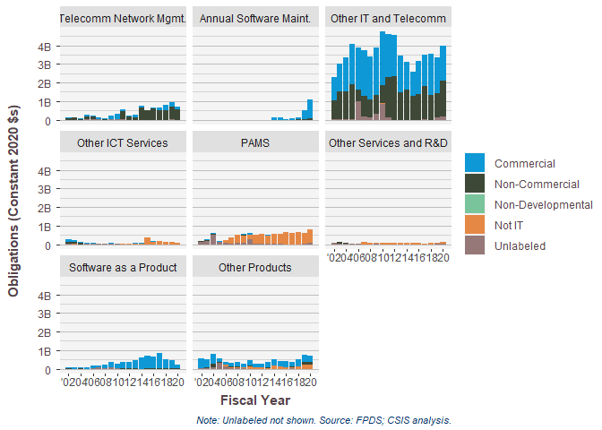
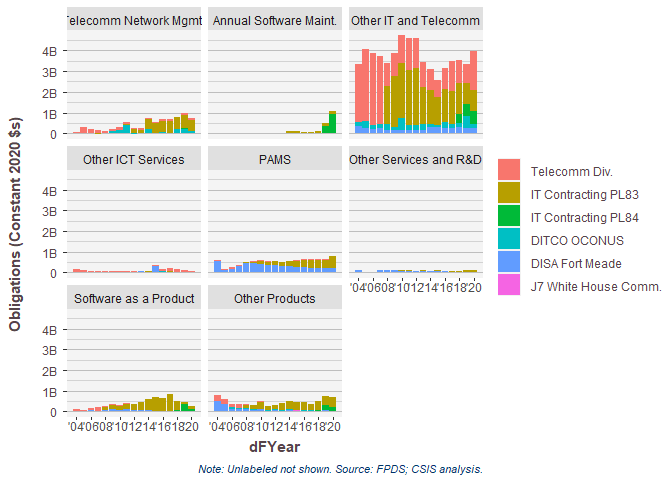
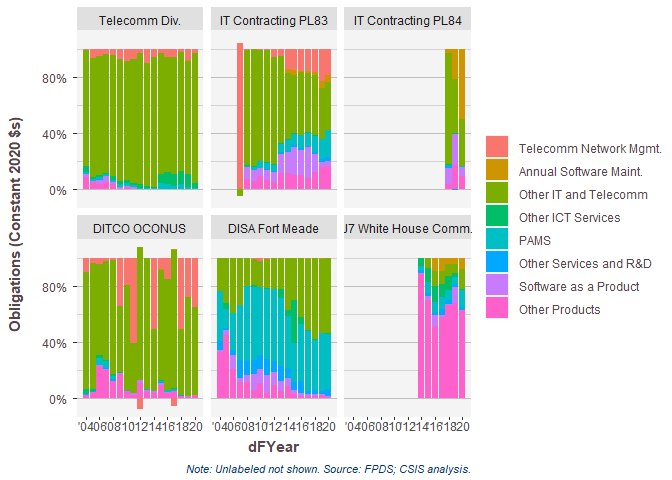
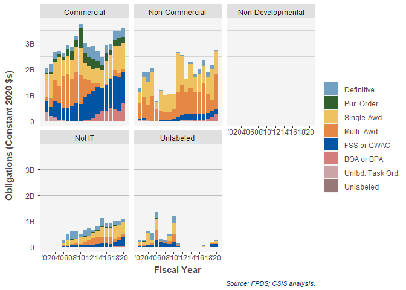
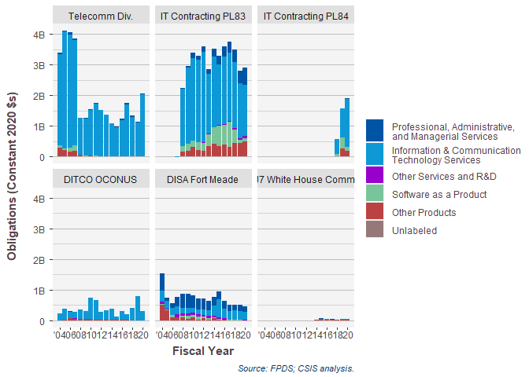

# Setup
First we load the data. The dataset used is a U.S. Defense Contracting dataset derived from   FPDS.


```
## Warning: replacing previous import 'Hmisc::summarize' by 'dplyr::summarize' when
## loading 'csis360'
```

```
## Warning: replacing previous import 'Hmisc::src' by 'dplyr::src' when loading
## 'csis360'
```

```
## 
## Attaching package: 'dplyr'
```

```
## The following objects are masked from 'package:stats':
## 
##     filter, lag
```

```
## The following objects are masked from 'package:base':
## 
##     intersect, setdiff, setequal, union
```

```
## -- Attaching packages --------------------------------------- tidyverse 1.3.0 --
```

```
## v tibble  3.0.4     v purrr   0.3.4
## v tidyr   1.1.2     v stringr 1.4.0
## v readr   1.4.0     v forcats 0.5.0
```

```
## -- Conflicts ------------------------------------------ tidyverse_conflicts() --
## x dplyr::filter() masks stats::filter()
## x dplyr::lag()    masks stats::lag()
```

```
## 
## Attaching package: 'scales'
```

```
## The following object is masked from 'package:purrr':
## 
##     discard
```

```
## The following object is masked from 'package:readr':
## 
##     col_factor
```

## DISA Specific Variables

```r
disa_data$PricingUCA.sumlong<-disa_data$PricingUCA.sum
levels(disa_data$PricingUCA.sumlong)<-list("Firm-Fixed-Price"="FFP",
                                           "Less Common"="Less Common",
                                           "Incentive"="Incentive",
                                           "Other Cost-Based"="Other CB",
                                           "Undefinitized\nContract Award"="UCA",
                                           "Unclear"="Unclear"   )


# 
#   
# disa_sum <- deflate(disa_sum,money_var="Action_Obligation_Then_Year",fy_var="Fiscal_Year",deflator_var="OMB20_GDP20")
# colnames(disa_sum)[colnames(disa_sum)=="Action_Obligation_Then_Year_Then_Year"]<-"Action_Obligation_Then_Year"
# colnames(disa_sum)[colnames(disa_sum)=="Action_Obligation_Then_Year_OMB20_GDP20"]<-"Action_Obligation_OMB20_GDP20"


disa_sum$ServicesCategory.sum<-factor(disa_sum$ServicesCategory.detail)
levels(disa_sum$ServicesCategory.sum)<-list("ICT" ="ICT" ,
                                      "PAMS"  ="PAMS"  ,
                                      "Other Services and R&D"=c("Other Services","ERS","FRS&C","Fuels","MED","R&D"),
                                      "Products"="Products",
                                       "Unlabeled"= "Unlabeled")

disa_sum$DISAprodserv.sum<-as.character(disa_sum$ServicesCategory.sum)
disa_sum$DISAprodserv.sum[disa_sum$ProductOrServiceCode =="7030" ]<-"Software as a product"
disa_sum$DISAprodserv.sum[disa_sum$DISAprodserv.sum =="Products" ]<-"Other Products"
disa_sum$DISAprodserv.sum<-factor(disa_sum$DISAprodserv.sum)
levels(disa_sum$DISAprodserv.sum)<-list("Information & Communication\nTechnology Services" ="ICT",
                                      "Professional, Administrative,\nand Managerial Services"  ="PAMS"  ,
                                      "Other Services and R&D"="Other Services and R&D",
                                      "Software as a Product"="Software as a product",
                                      "Other Products"="Other Products",
                                       "Unlabeled"= "Unlabeled")
summary(disa_sum$DISAprodserv.sum)
```

```
##       Information & Communication\nTechnology Services 
##                                                 141849 
## Professional, Administrative,\nand Managerial Services 
##                                                  13206 
##                                 Other Services and R&D 
##                                                   3659 
##                                  Software as a Product 
##                                                  15001 
##                                         Other Products 
##                                                  27697 
##                                              Unlabeled 
##                                                     12
```

```r
## DISA Competition

disa_data$ServicesCategory.sum<-factor(disa_data$ServicesCategory.detail)
levels(disa_data$ServicesCategory.sum)<-list("ICT" ="ICT" ,
                                      "PAMS"  ="PAMS"  ,
                                      "Other Services and R&D"=c("Other Services","ERS","FRS&C","Fuels","MED","R&D"),
                                      # ""="R&D",
                                      "Products"="Products",
                                       "Unlabeled"= "Unlabeled")

disa_sum<-disa_sum[,!colnames(disa_sum) %in% c("ContractingSubCustomer")]
colnames(disa_sum)[colnames(disa_sum)=="SubCustomer"]<-"ContractingSubCustomer"
disa_sum$FundingAgency[disa_sum$fundingrequestingagencyid=="955P"]<-"DHS"
disa_sum<-read_and_join_experiment(disa_sum,
                            path="https://raw.githubusercontent.com/CSISdefense/Lookup-Tables/master/",
                            "Agency_AgencyID.csv",
                            dir="",
                            by=c("fundingrequestingagencyid"="AgencyID"),
                            add_var=c("SubCustomer"),#Contracting.Agency.ID
                            skip_check_var=c("Platform","SubCustomer"),
                            guess_max=2000)
```

```
## 
## -- Column specification --------------------------------------------------------
## cols(
##   AgencyID = col_character(),
##   AgencyIDtext = col_character(),
##   DepartmentID = col_character(),
##   CSISName = col_character(),
##   Customer = col_character(),
##   SubCustomer = col_character(),
##   InternationalAssistancePrograms = col_double(),
##   IsDiscrepency = col_double(),
##   MinOfStartDate = col_date(format = ""),
##   MaxOfEndDate = col_date(format = ""),
##   IsUnknownAgencyID = col_double(),
##   IsExceptionToContradictionTest = col_double(),
##   SubCustomerSum = col_character(),
##   IsDefense = col_double(),
##   PlatformPortfolio = col_character()
## )
```

```r
colnames(disa_sum)[colnames(disa_sum)=="SubCustomer"]<-"SubFunder"
disa_sum<-replace_nas_with_unlabeled(disa_sum,"SubFunder","Uncategorized")
disa_sum<-csis360::read_and_join_experiment(disa_sum,
                                             "SubCustomer.csv",
                                             by=c("FundingAgency"="Customer","SubFunder"="SubCustomer"),
                                             add_var=c("SubCustomer.platform","SubCustomer.sum"),
                                             path="https://raw.githubusercontent.com/CSISdefense/Lookup-Tables/master/",
                                            # path="K:\\Users\\Greg\\Repositories\\Lookup-Tables\\",
                                             dir="office/",
                                            case_sensitive = FALSE
)
```

```
## 
## -- Column specification --------------------------------------------------------
## cols(
##   Customer = col_character(),
##   SubCustomer = col_character(),
##   SubCustomer.sum = col_character(),
##   SubCustomer.detail = col_character(),
##   SubCustomer.platform = col_character(),
##   SubCustomer.FMS = col_character(),
##   SubCustomer.component = col_character(),
##   Subcustomer.Obsolete = col_logical()
## )
```

```
## Warning in csis360::read_and_join_experiment(disa_sum, "SubCustomer.csv", : NAs
## found in by variable. Filtering them out.
```

```r
disa_sum<-disa_sum[,!colnames(disa_sum) %in% c("FundingSubAgency.platform","FundingSubAgency.sum")]
colnames(disa_sum)[colnames(disa_sum)=="SubCustomer.platform"]<-"FundingSubAgency.platform"
colnames(disa_sum)[colnames(disa_sum)=="SubCustomer.sum"]<-"FundingSubAgency.sum"

summary(factor(disa_sum$FundingSubAgency.sum))
```

```
##                                        Agriculture 
##                                                 70 
##                                          Air Force 
##                                              22892 
##                                All Other Customers 
##                                                 66 
##                                           Archives 
##                                                  4 
##                                               Army 
##                                              25824 
##                                                CBP 
##                                                  7 
##                                        COAST GUARD 
##                                                649 
##                                           Commerce 
##                                                 60 
##                                        Comptroller 
##                                                 17 
##                                          Education 
##                                                  6 
##                                             Energy 
##                                                111 
##                                                EPA 
##                                                  3 
##                                        Exec Office 
##                                                 91 
##                                               FEMA 
##                                                 36 
##                                                GSA 
##                                                 35 
##                                                HHS 
##                                                 16 
##                                                HUD 
##                                                  4 
##                                                ICE 
##                                                  5 
##                                           Interior 
##                                                 26 
##                     INTERNATIONAL TRADE COMMISSION 
##                                                  1 
##                                            Justice 
##                                                118 
##                                              Labor 
##                                                  7 
##                                               NASA 
##                                                  2 
##              NATIONAL ENDOWMENT FOR THE HUMANITIES 
##                                                  1 
##                     NATIONAL LABOR RELATIONS BOARD 
##                                                  1 
##                        NATIONAL SCIENCE FOUNDATION 
##                                                  7 
##                                               Navy 
##                                              24840 
##                      NUCLEAR REGULATORY COMMISSION 
##                                                 17 
##                     OFFICE OF PERSONNEL MANAGEMENT 
##                                                 16 
##                                                OPO 
##                                                143 
##                                          Other DHS 
##                                                 13 
##                                          Other DoD 
##                                             123976 
##            OVERSEAS PRIVATE INVESTMENT CORPORATION 
##                                                  1 
##                 SECURITIES AND EXCHANGE COMMISSION 
##                                                  7 
##                      SMALL BUSINESS ADMINISTRATION 
##                                                  2 
##                                              State 
##                                                 33 
##                                     Transportation 
##                                               1565 
##                                           Treasury 
##                                                 21 
##                                      Uncategorized 
##                                                743 
## UNITED STATES INTERNATIONAL DEVELOPMENT FINANCE CO 
##                                                  1 
##                                              USAID 
##                                                  2 
##                                                 VA 
##                                                 18
```

```r
disa_sum$Funder<-disa_sum$FundingAgency

disa_sum$Funder[disa_sum$FundingAgency =="Defense" & !is.na(disa_sum$FundingAgency)& !is.na(disa_sum$FundingSubAgency.sum)]<-
  disa_sum$FundingSubAgency.sum[disa_sum$FundingAgency =="Defense" & !is.na(disa_sum$FundingAgency) & !is.na(disa_sum$FundingSubAgency.sum)]
disa_sum$Funder[disa_sum$FundingAgency!= "Defense"]<-"Other than DoD"
disa_sum$Funder[disa_sum$FundingSubAgency=="DISA"]<-"DISA"
disa_sum$FunderDISA<-ifelse(disa_sum$FundingSubAgency=="DISA","DISA","Other than DISA")
disa_sum %>% group_by(FundingAgency ) %>% summarise(Action_Obligation_OMB20_GDP20=sum(Action_Obligation_OMB20_GDP20,na.rm=TRUE))
```

```
## `summarise()` ungrouping output (override with `.groups` argument)
```

```
## # A tibble: 11 x 2
##    FundingAgency                                Action_Obligation_OMB20_GDP20
##    <chr>                                                                <dbl>
##  1 Defense                                                      126912319332.
##  2 DHS                                                             973056559.
##  3 Energy                                                            1930048.
##  4 GSA                                                               5237041.
##  5 HHS                                                              10540305.
##  6 JOINT HOUSE AND SENATE ENTITIES                                     93249.
##  7 NASA                                                                 7980.
##  8 Other Agencies                                                 1284510374.
##  9 State and IAP                                                    15374510.
## 10 THE INSTITUTE OF MUSEUM AND LIBRARY SERVICES                         3286.
## 11 VA                                                               11256984.
```

```r
disa_sum %>% group_by(Funder ) %>% summarise(Action_Obligation_OMB20_GDP20=sum(Action_Obligation_OMB20_GDP20,na.rm=TRUE))
```

```
## `summarise()` ungrouping output (override with `.groups` argument)
```

```
## # A tibble: 6 x 2
##   Funder         Action_Obligation_OMB20_GDP20
##   <chr>                                  <dbl>
## 1 Air Force                        7161525945.
## 2 Army                            14425639490.
## 3 DISA                            89353455403.
## 4 Navy                             5207994546.
## 5 Other DoD                       10763703948.
## 6 Other than DoD                   2302010337.
```

```r
disa_sum$Office<-factor(disa_sum$ContractingOfficeID)
levels(disa_sum$Office)<-list("Telecomm Div.\n(HC1013)"="HC1013",
                              "IT Contracting PL83\n(HC1028)"="HC1028" ,
                              "IT Contracting PL84\n(HC1084)"="HC1084" ,
                              "DITCO-PAC\n(HC1019)"="HC1019" ,
                              "DITCO-Europe\n(HC1021)"="HC1021",
                              "DITCO-Alaska\n(HC1022)"="HC1022",
                              "DISA-Ft. Meade\n(HC1046)"="HC1046", 
                              "DISA-Ft. Meade\n(HC1047)"="HC1047", 
                              "J7 White House Comm\n(HC1064)"="HC1064",                              
                              "ZD10"=c("ZD10"   ,"ZD10 "),
                              "ZD11"=c("ZD11"   ,"ZD11 "),
                              "ZD13"=c("ZD13"="ZD13 "),
                              "ZD14"=c("ZD14"="ZD14 "),
                              "ZD15"=c("ZD15"="ZD15 "))
disa_sum$OfficeLoc<-factor(disa_sum$ContractingOfficeID)
levels(disa_sum$OfficeLoc)<-list("Scott AFB"=c("HC1013","HC1028","HC1084"),
                                "Fort Meade"=c("HC1046","HC1047"),
                              "Pearl Harbor"="HC1019" ,
                              "Europe"="HC1021",
                              "Alaska"="HC1022",
                              "Washington, DC"="HC1064",
                              "ZD10"=c("ZD10"   ,"ZD10 "),
                              "ZD11"=c("ZD11"   ,"ZD11 "),
                              "ZD13"=c("ZD13"="ZD13 "),
                              "ZD14"=c("ZD14"="ZD14 "),
                              "ZD15"=c("ZD15"="ZD15 "))
disa_sum$OfficeScott<-factor(disa_sum$ContractingOfficeID)
levels(disa_sum$OfficeScott)<-list("Scott AFB"=c("HC1013","HC1028","HC1084"),
                                "All Other"=c("HC1046","HC1047","HC1019" ,"HC1021","HC1022","HC1064"),
                              "ZD10"=c("ZD10"   ,"ZD10 "),
                              "ZD11"=c("ZD11"   ,"ZD11 "),
                              "ZD13"=c("ZD13"="ZD13 "),
                              "ZD14"=c("ZD14"="ZD14 "),
                              "ZD15"=c("ZD15"="ZD15 "))

disa_sum$OfficeSum<-factor(disa_sum$ContractingOfficeID)
levels(disa_sum$OfficeSum)<-list("Telecomm Div."="HC1013",
                              "IT Contracting PL83"="HC1028" ,
                              "IT Contracting PL84"="HC1084" ,
                              "DITCO OCONUS"=c("HC1019" ,"HC1021","HC1022"),
                                "DISA Fort Meade"=c("HC1046","HC1047"),
                              "J7 White House Comm."="HC1064",
                              "ZD10"=c("ZD10"   ,"ZD10 "),
                              "ZD11"=c("ZD11"   ,"ZD11 "),
                              "ZD13"=c("ZD13"="ZD13 "),
                              "ZD14"=c("ZD14"="ZD14 "),
                              "ZD15"=c("ZD15"="ZD15 "))
```
## Labels, Colors, and Column Key

```r
colnames(disa_data)[colnames(disa_data)=="ProductServiceOrRnDarea.sum"]<-"SimpleArea"
disa_data$SimpleArea<-factor(disa_data$SimpleArea)
# ds_lc<-prepare_labels_and_colors(disa_sum,path="K:\\Users\\Greg\\Repositories\\Lookup-Tables\\style\\")
# ds_ck<-csis360::get_column_key(disa_sum,path="K:\\Users\\Greg\\Repositories\\Lookup-Tables\\style\\")
# ds_lc<-prepare_labels_and_colors(disa_sum,path="C:\\Users\\gsand\\Repositories\\Lookup-Tables\\style\\")
# ds_ck<-csis360::get_column_key(disa_sum,path="C:\\Users\\gsand\\Repositories\\Lookup-Tables\\style\\")
# ds_lc<-prepare_labels_and_colors(disa_sum,path="F:\\Users\\gsanders\\Documents\\Repositories\\Lookup-Tables\\style\\")
# ds_ck<-csis360::get_column_key(disa_sum,path="F:\\Users\\gsanders\\Documents\\Repositories\\Lookup-Tables\\style\\")
# labels_and_colors<-prepare_labels_and_colors(disa_data,path="C:\\Users\\gsand\\Repositories\\Lookup-Tables\\style\\")
# column_key<-get_column_key(disa_data,path="C:\\Users\\gsand\\Repositories\\Lookup-Tables\\style\\")
labels_and_colors<-prepare_labels_and_colors(disa_data,path="K:\\Users\\Greg\\Repositories\\Lookup-Tables\\style\\")
```

```
## 
## -- Column specification --------------------------------------------------------
## cols(
##   column = col_character(),
##   coloration.key = col_character(),
##   title = col_character(),
##   share.title = col_character(),
##   period.title = col_logical(),
##   is.colon.split = col_logical()
## )
```

```
## Warning in prepare_labels_and_colors(disa_data, path = "K:\\Users\\Greg\
## \Repositories\\Lookup-Tables\\style\\"): ContractingCustomer
```

```
## Warning in prepare_labels_and_colors(disa_data, path = "K:\\Users\\Greg\
## \Repositories\\Lookup-Tables\\style\\"): ContractingSubCustomer
```

```
## Warning in prepare_labels_and_colors(disa_data, path = "K:\\Users\\Greg\
## \Repositories\\Lookup-Tables\\style\\"): ProductServiceOrRnDarea
```

```
## Warning in prepare_labels_and_colors(disa_data, path = "K:\\Users\\Greg\
## \Repositories\\Lookup-Tables\\style\\"): PlatformPortfolio
```

```
## Warning in prepare_labels_and_colors(disa_data, path = "K:\\Users\\Greg\
## \Repositories\\Lookup-Tables\\style\\"): Vehicle
```

```
## Warning in prepare_labels_and_colors(disa_data, path = "K:\\Users\\Greg\
## \Repositories\\Lookup-Tables\\style\\"): PricingUCA
```

```
## Warning in prepare_labels_and_colors(disa_data, path = "K:\\Users\\Greg\
## \Repositories\\Lookup-Tables\\style\\"): VendorSize
```

```
## Warning in prepare_labels_and_colors(disa_data, path = "K:\\Users\\Greg\
## \Repositories\\Lookup-Tables\\style\\"): SubCustomer.sum
```

```
## Warning in prepare_labels_and_colors(disa_data, path = "K:\\Users\\Greg\
## \Repositories\\Lookup-Tables\\style\\"): SubCustomer.platform
```

```
## Warning in prepare_labels_and_colors(disa_data, path = "K:\\Users\\Greg\
## \Repositories\\Lookup-Tables\\style\\"): Competition.detail
```

```
## Warning in prepare_labels_and_colors(disa_data, path = "K:\\Users\\Greg\
## \Repositories\\Lookup-Tables\\style\\"): Competition.sum
```

```
## Warning in prepare_labels_and_colors(disa_data, path = "K:\\Users\\Greg\
## \Repositories\\Lookup-Tables\\style\\"): Competition.effective.only
```

```
## Warning in prepare_labels_and_colors(disa_data, path = "K:\\Users\\Greg\
## \Repositories\\Lookup-Tables\\style\\"): Competition.multisum
```

```
## Warning in prepare_labels_and_colors(disa_data, path = "K:\\Users\\Greg\
## \Repositories\\Lookup-Tables\\style\\"): No.Competition.sum
```

```
## Warning in prepare_labels_and_colors(disa_data, path = "K:\\Users\\Greg\
## \Repositories\\Lookup-Tables\\style\\"): CompOffr
```

```
## Warning in prepare_labels_and_colors(disa_data, path = "K:\\Users\\Greg\
## \Repositories\\Lookup-Tables\\style\\"): Vehicle.sum
```

```
## Warning in prepare_labels_and_colors(disa_data, path = "K:\\Users\\Greg\
## \Repositories\\Lookup-Tables\\style\\"): Vehicle.sum7
```

```
## Warning in prepare_labels_and_colors(disa_data, path = "K:\\Users\\Greg\
## \Repositories\\Lookup-Tables\\style\\"): Vehicle.AwardTask
```

```
## Warning in prepare_labels_and_colors(disa_data, path = "K:\\Users\\Greg\
## \Repositories\\Lookup-Tables\\style\\"): PricingUCA.sum
```

```
## Warning in prepare_labels_and_colors(disa_data, path = "K:\\Users\\Greg\
## \Repositories\\Lookup-Tables\\style\\"): ProductOrServiceArea
```

```
## Warning in prepare_labels_and_colors(disa_data, path = "K:\\Users\\Greg\
## \Repositories\\Lookup-Tables\\style\\"): ServicesCategory.detail
```

```
## Warning in prepare_labels_and_colors(disa_data, path = "K:\\Users\\Greg\
## \Repositories\\Lookup-Tables\\style\\"): ServicesCategory.sum
```

```
## Warning in prepare_labels_and_colors(disa_data, path = "K:\\Users\\Greg\
## \Repositories\\Lookup-Tables\\style\\"): ProductsCategory.detail
```

```
## Warning in prepare_labels_and_colors(disa_data, path = "K:\\Users\\Greg\
## \Repositories\\Lookup-Tables\\style\\"): ProductOrServiceArea.DLA
```

```
## Warning in prepare_labels_and_colors(disa_data, path = "K:\\Users\\Greg\
## \Repositories\\Lookup-Tables\\style\\"): SimpleArea
```

```
## Warning in prepare_labels_and_colors(disa_data, path = "K:\\Users\\Greg\
## \Repositories\\Lookup-Tables\\style\\"): SupplyServiceERS
```

```
## Warning in prepare_labels_and_colors(disa_data, path = "K:\\Users\\Greg\
## \Repositories\\Lookup-Tables\\style\\"): RnDCategory.detail
```

```
## Warning in prepare_labels_and_colors(disa_data, path = "K:\\Users\\Greg\
## \Repositories\\Lookup-Tables\\style\\"): Shiny.VendorSize
```

```r
column_key<-get_column_key(disa_data,path="K:\\Users\\Greg\\Repositories\\Lookup-Tables\\style\\")
```

```
## 
## -- Column specification --------------------------------------------------------
## cols(
##   column = col_character(),
##   coloration.key = col_character(),
##   title = col_character(),
##   share.title = col_character(),
##   period.title = col_logical(),
##   is.colon.split = col_logical()
## )
```

```r
labels_and_colors<-prepare_labels_and_colors(disa_data)
```

```
## 
## -- Column specification --------------------------------------------------------
## cols(
##   column = col_character(),
##   coloration.key = col_character(),
##   title = col_character(),
##   share.title = col_character(),
##   period.title = col_logical(),
##   is.colon.split = col_logical()
## )
```

```
## Warning in prepare_labels_and_colors(disa_data): ContractingCustomer
```

```
## Warning in prepare_labels_and_colors(disa_data): ContractingSubCustomer
```

```
## Warning in prepare_labels_and_colors(disa_data): ProductServiceOrRnDarea
```

```
## Warning in prepare_labels_and_colors(disa_data): PlatformPortfolio
```

```
## Warning in prepare_labels_and_colors(disa_data): Vehicle
```

```
## Warning in prepare_labels_and_colors(disa_data): PricingUCA
```

```
## Warning in prepare_labels_and_colors(disa_data): VendorSize
```

```
## Warning in prepare_labels_and_colors(disa_data): SubCustomer.sum
```

```
## Warning in prepare_labels_and_colors(disa_data): SubCustomer.platform
```

```
## Warning in prepare_labels_and_colors(disa_data): Competition.detail
```

```
## Warning in prepare_labels_and_colors(disa_data): Competition.sum
```

```
## Warning in prepare_labels_and_colors(disa_data): Competition.effective.only
```

```
## Warning in prepare_labels_and_colors(disa_data): Competition.multisum
```

```
## Warning in prepare_labels_and_colors(disa_data): No.Competition.sum
```

```
## Warning in prepare_labels_and_colors(disa_data): CompOffr
```

```
## Warning in prepare_labels_and_colors(disa_data): Vehicle.sum
```

```
## Warning in prepare_labels_and_colors(disa_data): Vehicle.sum7
```

```
## Warning in prepare_labels_and_colors(disa_data): Vehicle.AwardTask
```

```
## Warning in prepare_labels_and_colors(disa_data): PricingUCA.sum
```

```
## Warning in prepare_labels_and_colors(disa_data): ProductOrServiceArea
```

```
## Warning in prepare_labels_and_colors(disa_data): ServicesCategory.detail
```

```
## Warning in prepare_labels_and_colors(disa_data): ServicesCategory.sum
```

```
## Warning in prepare_labels_and_colors(disa_data): ProductsCategory.detail
```

```
## Warning in prepare_labels_and_colors(disa_data): ProductOrServiceArea.DLA
```

```
## Warning in prepare_labels_and_colors(disa_data): SimpleArea
```

```
## Warning in prepare_labels_and_colors(disa_data): SupplyServiceERS
```

```
## Warning in prepare_labels_and_colors(disa_data): RnDCategory.detail
```

```
## Warning in prepare_labels_and_colors(disa_data): Shiny.VendorSize
```

```r
column_key<-get_column_key(disa_data)
```

```
## 
## -- Column specification --------------------------------------------------------
## cols(
##   column = col_character(),
##   coloration.key = col_character(),
##   title = col_character(),
##   share.title = col_character(),
##   period.title = col_logical(),
##   is.colon.split = col_logical()
## )
```

```r
ds_lc<-prepare_labels_and_colors(disa_sum)
```

```
## 
## -- Column specification --------------------------------------------------------
## cols(
##   column = col_character(),
##   coloration.key = col_character(),
##   title = col_character(),
##   share.title = col_character(),
##   period.title = col_logical(),
##   is.colon.split = col_logical()
## )
```

```
## Warning in prepare_labels_and_colors(disa_sum): ContractingCustomer
```

```
## Warning in prepare_labels_and_colors(disa_sum): ContractingOfficeName
```

```
## Warning in prepare_labels_and_colors(disa_sum): Vehicle
```

```
## Warning in prepare_labels_and_colors(disa_sum): Customer
```

```
## Warning in prepare_labels_and_colors(disa_sum): ContractingSubCustomer
```

```
## Warning in prepare_labels_and_colors(disa_sum): Competition.detail
```

```
## Warning in prepare_labels_and_colors(disa_sum): Competition.sum
```

```
## Warning in prepare_labels_and_colors(disa_sum): Competition.effective.only
```

```
## Warning in prepare_labels_and_colors(disa_sum): Competition.multisum
```

```
## Warning in prepare_labels_and_colors(disa_sum): No.Competition.sum
```

```
## Warning in prepare_labels_and_colors(disa_sum): CompOffr
```

```
## Warning in prepare_labels_and_colors(disa_sum): Vehicle.sum
```

```
## Warning in prepare_labels_and_colors(disa_sum): Vehicle.sum7
```

```
## Warning in prepare_labels_and_colors(disa_sum): Vehicle.AwardTask
```

```
## Warning in prepare_labels_and_colors(disa_sum): Commercial
```

```
## Warning in prepare_labels_and_colors(disa_sum): SimpleArea
```

```
## Warning in prepare_labels_and_colors(disa_sum): ProductServiceOrRnDarea
```

```
## Warning in prepare_labels_and_colors(disa_sum): CrisisProductOrServiceArea
```

```
## Warning in prepare_labels_and_colors(disa_sum): ProductOrServiceArea
```

```
## Warning in prepare_labels_and_colors(disa_sum): ServicesCategory.detail
```

```
## Warning in prepare_labels_and_colors(disa_sum): ServicesCategory.sum
```

```
## Warning in prepare_labels_and_colors(disa_sum): ProductsCategory.detail
```

```
## Warning in prepare_labels_and_colors(disa_sum): ProductOrServiceArea.DLA
```

```
## Warning in prepare_labels_and_colors(disa_sum): ProductServiceOrRnDarea.sum
```

```
## Warning in prepare_labels_and_colors(disa_sum): SupplyServiceERS
```

```
## Warning in prepare_labels_and_colors(disa_sum): RnDCategory.detail
```

```
## Warning in prepare_labels_and_colors(disa_sum): DISAprodserv.sum
```

```
## Warning in prepare_labels_and_colors(disa_sum): Funder
```

```r
ds_ck<-csis360::get_column_key(disa_sum)
```

```
## 
## -- Column specification --------------------------------------------------------
## cols(
##   column = col_character(),
##   coloration.key = col_character(),
##   title = col_character(),
##   share.title = col_character(),
##   period.title = col_logical(),
##   is.colon.split = col_logical()
## )
```

# DISA Topline
## DISA Competition

```r
# classify competition
disa_sum<-csis360::read_and_join(disa_sum,
  "Lookup_SQL_CompetitionClassification.csv",
  by=c("CompetitionClassification","ClassifyNumberOfOffers"),
  replace_na_var="ClassifyNumberOfOffers",
  add_var=c("Competition.sum",
    "Competition.multisum",
    "Competition.effective.only",
    "No.Competition.sum"),
  path="https://raw.githubusercontent.com/CSISdefense/R-scripts-and-data/master/",
  dir="Lookups/"
)


(
DISAComp<-build_plot(
  data=disa_data,
  chart_geom = "Bar Chart",
  share = FALSE,
  labels_and_colors=labels_and_colors,
  # NA, #VAR.ncol
  x_var="dFYear", #x_var
  y_var="Action_Obligation_OMB20_GDP20", #VAR.y.variable
  color_var="Competition.sum", #color_var
  # facet_var="Competition.sum", #facet_var
  column_key=column_key,
  format=TRUE,
  ytextposition=FALSE
)+
  # theme(strip.text.y = element_text(angle=0))+
 # theme(axis.text.x = element_text(angle=90))+
 #    scale_y_continuous("Percent of Obligations", labels = percent_format(accuracy=1))+
 #      facet_grid(.~Competition.sum ,scales="free_x", space="free_x"
 #             )+labs(title=NULL,
  # x="Fiscal Year",
  # y="Percent of Obligations",
  # color="Competition")+
  theme(legend.position = "bottom")+
  labs(y="Obligations (Constant 2020 $s)")
)
```

```
## Warning: `summarise_()` is deprecated as of dplyr 0.7.0.
## Please use `summarise()` instead.
## This warning is displayed once every 8 hours.
## Call `lifecycle::last_warnings()` to see where this warning was generated.
```

```
## Warning: `group_by_()` is deprecated as of dplyr 0.7.0.
## Please use `group_by()` instead.
## See vignette('programming') for more help
## This warning is displayed once every 8 hours.
## Call `lifecycle::last_warnings()` to see where this warning was generated.
```

```
## Warning in grid.Call(C_stringMetric, as.graphicsAnnot(x$label)): font family not
## found in Windows font database

## Warning in grid.Call(C_stringMetric, as.graphicsAnnot(x$label)): font family not
## found in Windows font database
```

```
## Warning in grid.Call(C_textBounds, as.graphicsAnnot(x$label), x$x, x$y, : font
## family not found in Windows font database
```

```
## Warning in grid.Call(C_stringMetric, as.graphicsAnnot(x$label)): font family not
## found in Windows font database
```

```
## Warning in grid.Call(C_textBounds, as.graphicsAnnot(x$label), x$x, x$y, : font
## family not found in Windows font database

## Warning in grid.Call(C_textBounds, as.graphicsAnnot(x$label), x$x, x$y, : font
## family not found in Windows font database

## Warning in grid.Call(C_textBounds, as.graphicsAnnot(x$label), x$x, x$y, : font
## family not found in Windows font database

## Warning in grid.Call(C_textBounds, as.graphicsAnnot(x$label), x$x, x$y, : font
## family not found in Windows font database

## Warning in grid.Call(C_textBounds, as.graphicsAnnot(x$label), x$x, x$y, : font
## family not found in Windows font database

## Warning in grid.Call(C_textBounds, as.graphicsAnnot(x$label), x$x, x$y, : font
## family not found in Windows font database

## Warning in grid.Call(C_textBounds, as.graphicsAnnot(x$label), x$x, x$y, : font
## family not found in Windows font database

## Warning in grid.Call(C_textBounds, as.graphicsAnnot(x$label), x$x, x$y, : font
## family not found in Windows font database

## Warning in grid.Call(C_textBounds, as.graphicsAnnot(x$label), x$x, x$y, : font
## family not found in Windows font database

## Warning in grid.Call(C_textBounds, as.graphicsAnnot(x$label), x$x, x$y, : font
## family not found in Windows font database
```

```
## Warning in grid.Call.graphics(C_text, as.graphicsAnnot(x$label), x$x, x$y, :
## font family not found in Windows font database
```

```
## Warning in grid.Call(C_textBounds, as.graphicsAnnot(x$label), x$x, x$y, : font
## family not found in Windows font database

## Warning in grid.Call(C_textBounds, as.graphicsAnnot(x$label), x$x, x$y, : font
## family not found in Windows font database
```

<!-- -->

```r
ggsave600dpi("..//Output//DISA_comp.png", DISAComp,  
             width=13, height= 6, units="in",size=16, lineheight=1.2
             )
```

```
## Warning in grid.Call(C_stringMetric, as.graphicsAnnot(x$label)): font family not
## found in Windows font database
```

```
## Warning in grid.Call(C_stringMetric, as.graphicsAnnot(x$label)): font family not
## found in Windows font database
```

```
## Warning in grid.Call(C_textBounds, as.graphicsAnnot(x$label), x$x, x$y, : font
## family not found in Windows font database
```

```
## Warning in grid.Call(C_stringMetric, as.graphicsAnnot(x$label)): font family not
## found in Windows font database
```

```
## Warning in grid.Call(C_textBounds, as.graphicsAnnot(x$label), x$x, x$y, : font
## family not found in Windows font database

## Warning in grid.Call(C_textBounds, as.graphicsAnnot(x$label), x$x, x$y, : font
## family not found in Windows font database

## Warning in grid.Call(C_textBounds, as.graphicsAnnot(x$label), x$x, x$y, : font
## family not found in Windows font database

## Warning in grid.Call(C_textBounds, as.graphicsAnnot(x$label), x$x, x$y, : font
## family not found in Windows font database

## Warning in grid.Call(C_textBounds, as.graphicsAnnot(x$label), x$x, x$y, : font
## family not found in Windows font database

## Warning in grid.Call(C_textBounds, as.graphicsAnnot(x$label), x$x, x$y, : font
## family not found in Windows font database

## Warning in grid.Call(C_textBounds, as.graphicsAnnot(x$label), x$x, x$y, : font
## family not found in Windows font database

## Warning in grid.Call(C_textBounds, as.graphicsAnnot(x$label), x$x, x$y, : font
## family not found in Windows font database

## Warning in grid.Call(C_textBounds, as.graphicsAnnot(x$label), x$x, x$y, : font
## family not found in Windows font database

## Warning in grid.Call(C_textBounds, as.graphicsAnnot(x$label), x$x, x$y, : font
## family not found in Windows font database
```

```
## Warning in grid.Call.graphics(C_text, as.graphicsAnnot(x$label), x$x, x$y, :
## font family not found in Windows font database
```

```
## Warning in grid.Call(C_textBounds, as.graphicsAnnot(x$label), x$x, x$y, : font
## family not found in Windows font database

## Warning in grid.Call(C_textBounds, as.graphicsAnnot(x$label), x$x, x$y, : font
## family not found in Windows font database
```

```r
write.csv(file="..//Output//DISA_competition.csv",row.names = FALSE,
          # DISAComp$data%>% mutate(dFYear=lubridate::year(dFYear))%>%
            pivot_wider(DISAComp$data,id_cols=c(Competition.sum),
                        names_from=dFYear,values_from=Action_Obligation_OMB20_GDP20))
```


## DISA Vendor Size

```r
(
DISAVendor<-build_plot(
  data=disa_data,
  chart_geom = "Bar Chart",
  share = FALSE,
  labels_and_colors=labels_and_colors,
  # NA, #VAR.ncol
  x_var="dFYear", #x_var
  y_var="Action_Obligation_OMB20_GDP20", #VAR.y.variable
  color_var="Shiny.VendorSize", #color_var
  # facet_var="Competition.sum", #facet_var
  column_key=column_key,
  format=TRUE,
  ytextposition=FALSE
)+scale_x_date("Fiscal Year",labels = date_format("'%y"))+
  # theme(strip.text.y = element_text(angle=0))+
 # theme(axis.text.x = element_text(angle=90))+
 #    scale_y_continuous("Percent of Obligations", labels = percent_format(accuracy=1))+
 #      facet_grid(.~Competition.sum ,scales="free_x", space="free_x"
 #             )+labs(title=NULL,
  # x="Fiscal Year",
  # y="Percent of Obligations",
  # color="Competition")+
  theme(legend.position = "right")+
  labs(y="Obligations (Constant 2020 $s)")
)
```

```
## Scale for 'x' is already present. Adding another scale for 'x', which will
## replace the existing scale.
```

```
## Warning in grid.Call(C_textBounds, as.graphicsAnnot(x$label), x$x, x$y, : font
## family not found in Windows font database

## Warning in grid.Call(C_textBounds, as.graphicsAnnot(x$label), x$x, x$y, : font
## family not found in Windows font database

## Warning in grid.Call(C_textBounds, as.graphicsAnnot(x$label), x$x, x$y, : font
## family not found in Windows font database

## Warning in grid.Call(C_textBounds, as.graphicsAnnot(x$label), x$x, x$y, : font
## family not found in Windows font database

## Warning in grid.Call(C_textBounds, as.graphicsAnnot(x$label), x$x, x$y, : font
## family not found in Windows font database

## Warning in grid.Call(C_textBounds, as.graphicsAnnot(x$label), x$x, x$y, : font
## family not found in Windows font database

## Warning in grid.Call(C_textBounds, as.graphicsAnnot(x$label), x$x, x$y, : font
## family not found in Windows font database

## Warning in grid.Call(C_textBounds, as.graphicsAnnot(x$label), x$x, x$y, : font
## family not found in Windows font database

## Warning in grid.Call(C_textBounds, as.graphicsAnnot(x$label), x$x, x$y, : font
## family not found in Windows font database

## Warning in grid.Call(C_textBounds, as.graphicsAnnot(x$label), x$x, x$y, : font
## family not found in Windows font database

## Warning in grid.Call(C_textBounds, as.graphicsAnnot(x$label), x$x, x$y, : font
## family not found in Windows font database
```

```
## Warning in grid.Call.graphics(C_text, as.graphicsAnnot(x$label), x$x, x$y, :
## font family not found in Windows font database
```

```
## Warning in grid.Call(C_textBounds, as.graphicsAnnot(x$label), x$x, x$y, : font
## family not found in Windows font database

## Warning in grid.Call(C_textBounds, as.graphicsAnnot(x$label), x$x, x$y, : font
## family not found in Windows font database
```

<!-- -->

```r
ggsave600dpi("..//Output//DISA_vendor.png", DISAVendor, 
             width=6.5, height= 4, units="in",size=11
             )
```

```
## Warning in grid.Call(C_textBounds, as.graphicsAnnot(x$label), x$x, x$y, : font
## family not found in Windows font database
```

```
## Warning in grid.Call(C_stringMetric, as.graphicsAnnot(x$label)): font family not
## found in Windows font database
```

```
## Warning in grid.Call(C_textBounds, as.graphicsAnnot(x$label), x$x, x$y, : font
## family not found in Windows font database

## Warning in grid.Call(C_textBounds, as.graphicsAnnot(x$label), x$x, x$y, : font
## family not found in Windows font database

## Warning in grid.Call(C_textBounds, as.graphicsAnnot(x$label), x$x, x$y, : font
## family not found in Windows font database

## Warning in grid.Call(C_textBounds, as.graphicsAnnot(x$label), x$x, x$y, : font
## family not found in Windows font database

## Warning in grid.Call(C_textBounds, as.graphicsAnnot(x$label), x$x, x$y, : font
## family not found in Windows font database

## Warning in grid.Call(C_textBounds, as.graphicsAnnot(x$label), x$x, x$y, : font
## family not found in Windows font database

## Warning in grid.Call(C_textBounds, as.graphicsAnnot(x$label), x$x, x$y, : font
## family not found in Windows font database

## Warning in grid.Call(C_textBounds, as.graphicsAnnot(x$label), x$x, x$y, : font
## family not found in Windows font database

## Warning in grid.Call(C_textBounds, as.graphicsAnnot(x$label), x$x, x$y, : font
## family not found in Windows font database

## Warning in grid.Call(C_textBounds, as.graphicsAnnot(x$label), x$x, x$y, : font
## family not found in Windows font database
```

```
## Warning in grid.Call.graphics(C_text, as.graphicsAnnot(x$label), x$x, x$y, :
## font family not found in Windows font database
```

```
## Warning in grid.Call(C_textBounds, as.graphicsAnnot(x$label), x$x, x$y, : font
## family not found in Windows font database

## Warning in grid.Call(C_textBounds, as.graphicsAnnot(x$label), x$x, x$y, : font
## family not found in Windows font database
```

```r
write.csv(file="..//Output//DISA_vendorsize.csv",row.names = FALSE,
          # DISAComp$data%>% mutate(dFYear=lubridate::year(dFYear))%>%
            pivot_wider(DISAVendor$data,id_cols=c(Shiny.VendorSize),
                        names_from=dFYear,values_from=Action_Obligation_OMB20_GDP20))
```
## DISA Vehicle

```r
(
DISAVehiclePSR<-build_plot(
  data=disa_sum%>% filter(!is.na(Vehicle.AwardTask)),
  chart_geom = "Bar Chart",
  share = FALSE,
  labels_and_colors=ds_lc,
  # NA, #VAR.ncol
  x_var="dFYear", #x_var
  y_var="Action_Obligation_OMB20_GDP20", #VAR.y.variable
  color_var="DISAprodserv.sum", #color_var
  facet_var="Vehicle.sum7", #facet_var
  column_key=ds_ck,
  format=TRUE,
  ytextposition=FALSE
)+scale_x_date("Fiscal Year",labels = date_format("'%y"))+
  # theme(strip.text.y = element_text(angle=0))+
 # theme(axis.text.x = element_text(angle=90))+
 #    scale_y_continuous("Percent of Obligations", labels = percent_format(accuracy=1))+
 #      facet_grid(.~Competition.sum ,scales="free_x", space="free_x"
 #             )+labs(title=NULL,
  # x="Fiscal Year",
  # y="Percent of Obligations",
  # color="Competition")+
  theme(legend.position = "right")+
  labs(y="Obligations (Constant 2020 $s)")
)
```

```
## Warning in if (is.na(breakout)) breakout <- NULL: the condition has length > 1
## and only the first element will be used
```

```
## Scale for 'x' is already present. Adding another scale for 'x', which will
## replace the existing scale.
```

```
## Warning in grid.Call(C_textBounds, as.graphicsAnnot(x$label), x$x, x$y, : font
## family not found in Windows font database
```

```
## Warning in grid.Call(C_textBounds, as.graphicsAnnot(x$label), x$x, x$y, : font
## family not found in Windows font database

## Warning in grid.Call(C_textBounds, as.graphicsAnnot(x$label), x$x, x$y, : font
## family not found in Windows font database

## Warning in grid.Call(C_textBounds, as.graphicsAnnot(x$label), x$x, x$y, : font
## family not found in Windows font database

## Warning in grid.Call(C_textBounds, as.graphicsAnnot(x$label), x$x, x$y, : font
## family not found in Windows font database

## Warning in grid.Call(C_textBounds, as.graphicsAnnot(x$label), x$x, x$y, : font
## family not found in Windows font database

## Warning in grid.Call(C_textBounds, as.graphicsAnnot(x$label), x$x, x$y, : font
## family not found in Windows font database
```

```
## Warning in grid.Call.graphics(C_text, as.graphicsAnnot(x$label), x$x, x$y, :
## font family not found in Windows font database
```

```
## Warning in grid.Call(C_textBounds, as.graphicsAnnot(x$label), x$x, x$y, : font
## family not found in Windows font database

## Warning in grid.Call(C_textBounds, as.graphicsAnnot(x$label), x$x, x$y, : font
## family not found in Windows font database
```

<!-- -->

```r
disa_sum$Vehicle.sum7<-factor(disa_sum$Vehicle.sum7)

(
DISAVehicle<-build_plot(
  data=disa_data %>% filter(!is.na(Vehicle.AwardTask)),
  chart_geom = "Bar Chart",
  share = FALSE,
  labels_and_colors=ds_lc,
  # NA, #VAR.ncol
  x_var="dFYear", #x_var
  y_var="Action_Obligation_OMB20_GDP20", #VAR.y.variable
  color_var="Vehicle.sum7", #color_var
  facet_var="Vehicle.AwardTask", #facet_var
  column_key=ds_ck,
  format=TRUE,
  ytextposition=FALSE
)+scale_x_date("Fiscal Year",labels = date_format("'%y"))+
  # theme(strip.text.y = element_text(angle=0))+
 # theme(axis.text.x = element_text(angle=90))+
 #    scale_y_continuous("Percent of Obligations", labels = percent_format(accuracy=1))+
 #      facet_grid(.~Competition.sum ,scales="free_x", space="free_x"
 #             )+labs(title=NULL,
  # x="Fiscal Year",
  # y="Percent of Obligations",
  # color="Competition")+
  theme(legend.position = "right")+
  labs(y="Obligations (Constant 2020 $s)",
       caption="Note: Unlabeled not shown. Source: FPDS; CSIS analysis.")
)
```

```
## Warning in if (is.na(breakout)) breakout <- NULL: the condition has length > 1
## and only the first element will be used
```

```
## Scale for 'x' is already present. Adding another scale for 'x', which will
## replace the existing scale.
```

```
## Warning in grid.Call(C_textBounds, as.graphicsAnnot(x$label), x$x, x$y, : font
## family not found in Windows font database

## Warning in grid.Call(C_textBounds, as.graphicsAnnot(x$label), x$x, x$y, : font
## family not found in Windows font database

## Warning in grid.Call(C_textBounds, as.graphicsAnnot(x$label), x$x, x$y, : font
## family not found in Windows font database

## Warning in grid.Call(C_textBounds, as.graphicsAnnot(x$label), x$x, x$y, : font
## family not found in Windows font database

## Warning in grid.Call(C_textBounds, as.graphicsAnnot(x$label), x$x, x$y, : font
## family not found in Windows font database

## Warning in grid.Call(C_textBounds, as.graphicsAnnot(x$label), x$x, x$y, : font
## family not found in Windows font database

## Warning in grid.Call(C_textBounds, as.graphicsAnnot(x$label), x$x, x$y, : font
## family not found in Windows font database
```

```
## Warning in grid.Call.graphics(C_text, as.graphicsAnnot(x$label), x$x, x$y, :
## font family not found in Windows font database
```

```
## Warning in grid.Call(C_textBounds, as.graphicsAnnot(x$label), x$x, x$y, : font
## family not found in Windows font database

## Warning in grid.Call(C_textBounds, as.graphicsAnnot(x$label), x$x, x$y, : font
## family not found in Windows font database
```

<!-- -->

```r
summary(disa_data$Vehicle)
```

```
##    Length     Class      Mode 
##     18669 character character
```

```r
write.csv(file="..//Output//DISA_vehicle.csv",row.names = FALSE,
          arrange(pivot_wider(DISAVehicle$data %>% 
                        arrange(dFYear) %>% mutate(Fiscal_Year=lubridate::year(dFYear)),
                      id_cols=c(Vehicle.AwardTask,Vehicle.sum7),
                      names_from=Fiscal_Year,values_from=Action_Obligation_OMB20_GDP20),Vehicle.sum7))

ggsave600dpi("..//Output//DISA_vehicle.png", DISAVehicle, 
             width=13, height= 6, units="in",size=16
             )
```

```
## Warning in grid.Call(C_textBounds, as.graphicsAnnot(x$label), x$x, x$y, : font
## family not found in Windows font database

## Warning in grid.Call(C_textBounds, as.graphicsAnnot(x$label), x$x, x$y, : font
## family not found in Windows font database

## Warning in grid.Call(C_textBounds, as.graphicsAnnot(x$label), x$x, x$y, : font
## family not found in Windows font database

## Warning in grid.Call(C_textBounds, as.graphicsAnnot(x$label), x$x, x$y, : font
## family not found in Windows font database

## Warning in grid.Call(C_textBounds, as.graphicsAnnot(x$label), x$x, x$y, : font
## family not found in Windows font database

## Warning in grid.Call(C_textBounds, as.graphicsAnnot(x$label), x$x, x$y, : font
## family not found in Windows font database

## Warning in grid.Call(C_textBounds, as.graphicsAnnot(x$label), x$x, x$y, : font
## family not found in Windows font database
```

```
## Warning in grid.Call.graphics(C_text, as.graphicsAnnot(x$label), x$x, x$y, :
## font family not found in Windows font database
```

```
## Warning in grid.Call(C_textBounds, as.graphicsAnnot(x$label), x$x, x$y, : font
## family not found in Windows font database

## Warning in grid.Call(C_textBounds, as.graphicsAnnot(x$label), x$x, x$y, : font
## family not found in Windows font database
```

```r
ggsave600dpi("..//Output//DISA_vehicle_paper.png", DISAVehicle, 
             width=13, height= 4.25, units="in",size=16
             )
```

```
## Warning in grid.Call(C_textBounds, as.graphicsAnnot(x$label), x$x, x$y, : font
## family not found in Windows font database

## Warning in grid.Call(C_textBounds, as.graphicsAnnot(x$label), x$x, x$y, : font
## family not found in Windows font database

## Warning in grid.Call(C_textBounds, as.graphicsAnnot(x$label), x$x, x$y, : font
## family not found in Windows font database

## Warning in grid.Call(C_textBounds, as.graphicsAnnot(x$label), x$x, x$y, : font
## family not found in Windows font database

## Warning in grid.Call(C_textBounds, as.graphicsAnnot(x$label), x$x, x$y, : font
## family not found in Windows font database

## Warning in grid.Call(C_textBounds, as.graphicsAnnot(x$label), x$x, x$y, : font
## family not found in Windows font database

## Warning in grid.Call(C_textBounds, as.graphicsAnnot(x$label), x$x, x$y, : font
## family not found in Windows font database
```

```
## Warning in grid.Call.graphics(C_text, as.graphicsAnnot(x$label), x$x, x$y, :
## font family not found in Windows font database
```

```
## Warning in grid.Call(C_textBounds, as.graphicsAnnot(x$label), x$x, x$y, : font
## family not found in Windows font database

## Warning in grid.Call(C_textBounds, as.graphicsAnnot(x$label), x$x, x$y, : font
## family not found in Windows font database
```

```r
ggsave600dpi("..//Output//DISA_vehicle_paper.eps", DISAVehicle, 
             width=13, height= 4.25, units="in",size=16
             )
```

```
## Warning in grid.Call(C_stringMetric, as.graphicsAnnot(x$label)): font family
## 'Open Sans' not found in PostScript font database
```

```
## Warning in grid.Call(C_stringMetric, as.graphicsAnnot(x$label)): font family
## 'Open Sans' not found in PostScript font database

## Warning in grid.Call(C_stringMetric, as.graphicsAnnot(x$label)): font family
## 'Open Sans' not found in PostScript font database

## Warning in grid.Call(C_stringMetric, as.graphicsAnnot(x$label)): font family
## 'Open Sans' not found in PostScript font database

## Warning in grid.Call(C_stringMetric, as.graphicsAnnot(x$label)): font family
## 'Open Sans' not found in PostScript font database

## Warning in grid.Call(C_stringMetric, as.graphicsAnnot(x$label)): font family
## 'Open Sans' not found in PostScript font database

## Warning in grid.Call(C_stringMetric, as.graphicsAnnot(x$label)): font family
## 'Open Sans' not found in PostScript font database

## Warning in grid.Call(C_stringMetric, as.graphicsAnnot(x$label)): font family
## 'Open Sans' not found in PostScript font database

## Warning in grid.Call(C_stringMetric, as.graphicsAnnot(x$label)): font family
## 'Open Sans' not found in PostScript font database

## Warning in grid.Call(C_stringMetric, as.graphicsAnnot(x$label)): font family
## 'Open Sans' not found in PostScript font database

## Warning in grid.Call(C_stringMetric, as.graphicsAnnot(x$label)): font family
## 'Open Sans' not found in PostScript font database

## Warning in grid.Call(C_stringMetric, as.graphicsAnnot(x$label)): font family
## 'Open Sans' not found in PostScript font database

## Warning in grid.Call(C_stringMetric, as.graphicsAnnot(x$label)): font family
## 'Open Sans' not found in PostScript font database

## Warning in grid.Call(C_stringMetric, as.graphicsAnnot(x$label)): font family
## 'Open Sans' not found in PostScript font database
```

```
## Warning in grid.Call(C_textBounds, as.graphicsAnnot(x$label), x$x, x$y, : font
## family 'Open Sans' not found in PostScript font database

## Warning in grid.Call(C_textBounds, as.graphicsAnnot(x$label), x$x, x$y, : font
## family 'Open Sans' not found in PostScript font database

## Warning in grid.Call(C_textBounds, as.graphicsAnnot(x$label), x$x, x$y, : font
## family 'Open Sans' not found in PostScript font database

## Warning in grid.Call(C_textBounds, as.graphicsAnnot(x$label), x$x, x$y, : font
## family 'Open Sans' not found in PostScript font database

## Warning in grid.Call(C_textBounds, as.graphicsAnnot(x$label), x$x, x$y, : font
## family 'Open Sans' not found in PostScript font database

## Warning in grid.Call(C_textBounds, as.graphicsAnnot(x$label), x$x, x$y, : font
## family 'Open Sans' not found in PostScript font database

## Warning in grid.Call(C_textBounds, as.graphicsAnnot(x$label), x$x, x$y, : font
## family 'Open Sans' not found in PostScript font database

## Warning in grid.Call(C_textBounds, as.graphicsAnnot(x$label), x$x, x$y, : font
## family 'Open Sans' not found in PostScript font database

## Warning in grid.Call(C_textBounds, as.graphicsAnnot(x$label), x$x, x$y, : font
## family 'Open Sans' not found in PostScript font database

## Warning in grid.Call(C_textBounds, as.graphicsAnnot(x$label), x$x, x$y, : font
## family 'Open Sans' not found in PostScript font database

## Warning in grid.Call(C_textBounds, as.graphicsAnnot(x$label), x$x, x$y, : font
## family 'Open Sans' not found in PostScript font database

## Warning in grid.Call(C_textBounds, as.graphicsAnnot(x$label), x$x, x$y, : font
## family 'Open Sans' not found in PostScript font database

## Warning in grid.Call(C_textBounds, as.graphicsAnnot(x$label), x$x, x$y, : font
## family 'Open Sans' not found in PostScript font database

## Warning in grid.Call(C_textBounds, as.graphicsAnnot(x$label), x$x, x$y, : font
## family 'Open Sans' not found in PostScript font database

## Warning in grid.Call(C_textBounds, as.graphicsAnnot(x$label), x$x, x$y, : font
## family 'Open Sans' not found in PostScript font database

## Warning in grid.Call(C_textBounds, as.graphicsAnnot(x$label), x$x, x$y, : font
## family 'Open Sans' not found in PostScript font database

## Warning in grid.Call(C_textBounds, as.graphicsAnnot(x$label), x$x, x$y, : font
## family 'Open Sans' not found in PostScript font database

## Warning in grid.Call(C_textBounds, as.graphicsAnnot(x$label), x$x, x$y, : font
## family 'Open Sans' not found in PostScript font database

## Warning in grid.Call(C_textBounds, as.graphicsAnnot(x$label), x$x, x$y, : font
## family 'Open Sans' not found in PostScript font database

## Warning in grid.Call(C_textBounds, as.graphicsAnnot(x$label), x$x, x$y, : font
## family 'Open Sans' not found in PostScript font database

## Warning in grid.Call(C_textBounds, as.graphicsAnnot(x$label), x$x, x$y, : font
## family 'Open Sans' not found in PostScript font database

## Warning in grid.Call(C_textBounds, as.graphicsAnnot(x$label), x$x, x$y, : font
## family 'Open Sans' not found in PostScript font database

## Warning in grid.Call(C_textBounds, as.graphicsAnnot(x$label), x$x, x$y, : font
## family 'Open Sans' not found in PostScript font database

## Warning in grid.Call(C_textBounds, as.graphicsAnnot(x$label), x$x, x$y, : font
## family 'Open Sans' not found in PostScript font database

## Warning in grid.Call(C_textBounds, as.graphicsAnnot(x$label), x$x, x$y, : font
## family 'Open Sans' not found in PostScript font database

## Warning in grid.Call(C_textBounds, as.graphicsAnnot(x$label), x$x, x$y, : font
## family 'Open Sans' not found in PostScript font database

## Warning in grid.Call(C_textBounds, as.graphicsAnnot(x$label), x$x, x$y, : font
## family 'Open Sans' not found in PostScript font database

## Warning in grid.Call(C_textBounds, as.graphicsAnnot(x$label), x$x, x$y, : font
## family 'Open Sans' not found in PostScript font database

## Warning in grid.Call(C_textBounds, as.graphicsAnnot(x$label), x$x, x$y, : font
## family 'Open Sans' not found in PostScript font database

## Warning in grid.Call(C_textBounds, as.graphicsAnnot(x$label), x$x, x$y, : font
## family 'Open Sans' not found in PostScript font database

## Warning in grid.Call(C_textBounds, as.graphicsAnnot(x$label), x$x, x$y, : font
## family 'Open Sans' not found in PostScript font database

## Warning in grid.Call(C_textBounds, as.graphicsAnnot(x$label), x$x, x$y, : font
## family 'Open Sans' not found in PostScript font database

## Warning in grid.Call(C_textBounds, as.graphicsAnnot(x$label), x$x, x$y, : font
## family 'Open Sans' not found in PostScript font database

## Warning in grid.Call(C_textBounds, as.graphicsAnnot(x$label), x$x, x$y, : font
## family 'Open Sans' not found in PostScript font database

## Warning in grid.Call(C_textBounds, as.graphicsAnnot(x$label), x$x, x$y, : font
## family 'Open Sans' not found in PostScript font database

## Warning in grid.Call(C_textBounds, as.graphicsAnnot(x$label), x$x, x$y, : font
## family 'Open Sans' not found in PostScript font database

## Warning in grid.Call(C_textBounds, as.graphicsAnnot(x$label), x$x, x$y, : font
## family 'Open Sans' not found in PostScript font database

## Warning in grid.Call(C_textBounds, as.graphicsAnnot(x$label), x$x, x$y, : font
## family 'Open Sans' not found in PostScript font database

## Warning in grid.Call(C_textBounds, as.graphicsAnnot(x$label), x$x, x$y, : font
## family 'Open Sans' not found in PostScript font database

## Warning in grid.Call(C_textBounds, as.graphicsAnnot(x$label), x$x, x$y, : font
## family 'Open Sans' not found in PostScript font database

## Warning in grid.Call(C_textBounds, as.graphicsAnnot(x$label), x$x, x$y, : font
## family 'Open Sans' not found in PostScript font database

## Warning in grid.Call(C_textBounds, as.graphicsAnnot(x$label), x$x, x$y, : font
## family 'Open Sans' not found in PostScript font database

## Warning in grid.Call(C_textBounds, as.graphicsAnnot(x$label), x$x, x$y, : font
## family 'Open Sans' not found in PostScript font database
```

```
## Warning in grid.Call(C_stringMetric, as.graphicsAnnot(x$label)): font family
## 'Open Sans' not found in PostScript font database

## Warning in grid.Call(C_stringMetric, as.graphicsAnnot(x$label)): font family
## 'Open Sans' not found in PostScript font database

## Warning in grid.Call(C_stringMetric, as.graphicsAnnot(x$label)): font family
## 'Open Sans' not found in PostScript font database

## Warning in grid.Call(C_stringMetric, as.graphicsAnnot(x$label)): font family
## 'Open Sans' not found in PostScript font database

## Warning in grid.Call(C_stringMetric, as.graphicsAnnot(x$label)): font family
## 'Open Sans' not found in PostScript font database

## Warning in grid.Call(C_stringMetric, as.graphicsAnnot(x$label)): font family
## 'Open Sans' not found in PostScript font database

## Warning in grid.Call(C_stringMetric, as.graphicsAnnot(x$label)): font family
## 'Open Sans' not found in PostScript font database

## Warning in grid.Call(C_stringMetric, as.graphicsAnnot(x$label)): font family
## 'Open Sans' not found in PostScript font database

## Warning in grid.Call(C_stringMetric, as.graphicsAnnot(x$label)): font family
## 'Open Sans' not found in PostScript font database

## Warning in grid.Call(C_stringMetric, as.graphicsAnnot(x$label)): font family
## 'Open Sans' not found in PostScript font database

## Warning in grid.Call(C_stringMetric, as.graphicsAnnot(x$label)): font family
## 'Open Sans' not found in PostScript font database

## Warning in grid.Call(C_stringMetric, as.graphicsAnnot(x$label)): font family
## 'Open Sans' not found in PostScript font database

## Warning in grid.Call(C_stringMetric, as.graphicsAnnot(x$label)): font family
## 'Open Sans' not found in PostScript font database

## Warning in grid.Call(C_stringMetric, as.graphicsAnnot(x$label)): font family
## 'Open Sans' not found in PostScript font database
```

```
## Warning in grid.Call(C_textBounds, as.graphicsAnnot(x$label), x$x, x$y, : font
## family 'Open Sans' not found in PostScript font database

## Warning in grid.Call(C_textBounds, as.graphicsAnnot(x$label), x$x, x$y, : font
## family 'Open Sans' not found in PostScript font database

## Warning in grid.Call(C_textBounds, as.graphicsAnnot(x$label), x$x, x$y, : font
## family 'Open Sans' not found in PostScript font database

## Warning in grid.Call(C_textBounds, as.graphicsAnnot(x$label), x$x, x$y, : font
## family 'Open Sans' not found in PostScript font database

## Warning in grid.Call(C_textBounds, as.graphicsAnnot(x$label), x$x, x$y, : font
## family 'Open Sans' not found in PostScript font database

## Warning in grid.Call(C_textBounds, as.graphicsAnnot(x$label), x$x, x$y, : font
## family 'Open Sans' not found in PostScript font database

## Warning in grid.Call(C_textBounds, as.graphicsAnnot(x$label), x$x, x$y, : font
## family 'Open Sans' not found in PostScript font database

## Warning in grid.Call(C_textBounds, as.graphicsAnnot(x$label), x$x, x$y, : font
## family 'Open Sans' not found in PostScript font database

## Warning in grid.Call(C_textBounds, as.graphicsAnnot(x$label), x$x, x$y, : font
## family 'Open Sans' not found in PostScript font database

## Warning in grid.Call(C_textBounds, as.graphicsAnnot(x$label), x$x, x$y, : font
## family 'Open Sans' not found in PostScript font database

## Warning in grid.Call(C_textBounds, as.graphicsAnnot(x$label), x$x, x$y, : font
## family 'Open Sans' not found in PostScript font database

## Warning in grid.Call(C_textBounds, as.graphicsAnnot(x$label), x$x, x$y, : font
## family 'Open Sans' not found in PostScript font database

## Warning in grid.Call(C_textBounds, as.graphicsAnnot(x$label), x$x, x$y, : font
## family 'Open Sans' not found in PostScript font database

## Warning in grid.Call(C_textBounds, as.graphicsAnnot(x$label), x$x, x$y, : font
## family 'Open Sans' not found in PostScript font database

## Warning in grid.Call(C_textBounds, as.graphicsAnnot(x$label), x$x, x$y, : font
## family 'Open Sans' not found in PostScript font database

## Warning in grid.Call(C_textBounds, as.graphicsAnnot(x$label), x$x, x$y, : font
## family 'Open Sans' not found in PostScript font database

## Warning in grid.Call(C_textBounds, as.graphicsAnnot(x$label), x$x, x$y, : font
## family 'Open Sans' not found in PostScript font database

## Warning in grid.Call(C_textBounds, as.graphicsAnnot(x$label), x$x, x$y, : font
## family 'Open Sans' not found in PostScript font database

## Warning in grid.Call(C_textBounds, as.graphicsAnnot(x$label), x$x, x$y, : font
## family 'Open Sans' not found in PostScript font database

## Warning in grid.Call(C_textBounds, as.graphicsAnnot(x$label), x$x, x$y, : font
## family 'Open Sans' not found in PostScript font database

## Warning in grid.Call(C_textBounds, as.graphicsAnnot(x$label), x$x, x$y, : font
## family 'Open Sans' not found in PostScript font database

## Warning in grid.Call(C_textBounds, as.graphicsAnnot(x$label), x$x, x$y, : font
## family 'Open Sans' not found in PostScript font database

## Warning in grid.Call(C_textBounds, as.graphicsAnnot(x$label), x$x, x$y, : font
## family 'Open Sans' not found in PostScript font database

## Warning in grid.Call(C_textBounds, as.graphicsAnnot(x$label), x$x, x$y, : font
## family 'Open Sans' not found in PostScript font database

## Warning in grid.Call(C_textBounds, as.graphicsAnnot(x$label), x$x, x$y, : font
## family 'Open Sans' not found in PostScript font database

## Warning in grid.Call(C_textBounds, as.graphicsAnnot(x$label), x$x, x$y, : font
## family 'Open Sans' not found in PostScript font database

## Warning in grid.Call(C_textBounds, as.graphicsAnnot(x$label), x$x, x$y, : font
## family 'Open Sans' not found in PostScript font database

## Warning in grid.Call(C_textBounds, as.graphicsAnnot(x$label), x$x, x$y, : font
## family 'Open Sans' not found in PostScript font database

## Warning in grid.Call(C_textBounds, as.graphicsAnnot(x$label), x$x, x$y, : font
## family 'Open Sans' not found in PostScript font database

## Warning in grid.Call(C_textBounds, as.graphicsAnnot(x$label), x$x, x$y, : font
## family 'Open Sans' not found in PostScript font database

## Warning in grid.Call(C_textBounds, as.graphicsAnnot(x$label), x$x, x$y, : font
## family 'Open Sans' not found in PostScript font database

## Warning in grid.Call(C_textBounds, as.graphicsAnnot(x$label), x$x, x$y, : font
## family 'Open Sans' not found in PostScript font database

## Warning in grid.Call(C_textBounds, as.graphicsAnnot(x$label), x$x, x$y, : font
## family 'Open Sans' not found in PostScript font database

## Warning in grid.Call(C_textBounds, as.graphicsAnnot(x$label), x$x, x$y, : font
## family 'Open Sans' not found in PostScript font database

## Warning in grid.Call(C_textBounds, as.graphicsAnnot(x$label), x$x, x$y, : font
## family 'Open Sans' not found in PostScript font database

## Warning in grid.Call(C_textBounds, as.graphicsAnnot(x$label), x$x, x$y, : font
## family 'Open Sans' not found in PostScript font database

## Warning in grid.Call(C_textBounds, as.graphicsAnnot(x$label), x$x, x$y, : font
## family 'Open Sans' not found in PostScript font database

## Warning in grid.Call(C_textBounds, as.graphicsAnnot(x$label), x$x, x$y, : font
## family 'Open Sans' not found in PostScript font database

## Warning in grid.Call(C_textBounds, as.graphicsAnnot(x$label), x$x, x$y, : font
## family 'Open Sans' not found in PostScript font database

## Warning in grid.Call(C_textBounds, as.graphicsAnnot(x$label), x$x, x$y, : font
## family 'Open Sans' not found in PostScript font database

## Warning in grid.Call(C_textBounds, as.graphicsAnnot(x$label), x$x, x$y, : font
## family 'Open Sans' not found in PostScript font database

## Warning in grid.Call(C_textBounds, as.graphicsAnnot(x$label), x$x, x$y, : font
## family 'Open Sans' not found in PostScript font database

## Warning in grid.Call(C_textBounds, as.graphicsAnnot(x$label), x$x, x$y, : font
## family 'Open Sans' not found in PostScript font database

## Warning in grid.Call(C_textBounds, as.graphicsAnnot(x$label), x$x, x$y, : font
## family 'Open Sans' not found in PostScript font database

## Warning in grid.Call(C_textBounds, as.graphicsAnnot(x$label), x$x, x$y, : font
## family 'Open Sans' not found in PostScript font database

## Warning in grid.Call(C_textBounds, as.graphicsAnnot(x$label), x$x, x$y, : font
## family 'Open Sans' not found in PostScript font database

## Warning in grid.Call(C_textBounds, as.graphicsAnnot(x$label), x$x, x$y, : font
## family 'Open Sans' not found in PostScript font database

## Warning in grid.Call(C_textBounds, as.graphicsAnnot(x$label), x$x, x$y, : font
## family 'Open Sans' not found in PostScript font database

## Warning in grid.Call(C_textBounds, as.graphicsAnnot(x$label), x$x, x$y, : font
## family 'Open Sans' not found in PostScript font database

## Warning in grid.Call(C_textBounds, as.graphicsAnnot(x$label), x$x, x$y, : font
## family 'Open Sans' not found in PostScript font database

## Warning in grid.Call(C_textBounds, as.graphicsAnnot(x$label), x$x, x$y, : font
## family 'Open Sans' not found in PostScript font database

## Warning in grid.Call(C_textBounds, as.graphicsAnnot(x$label), x$x, x$y, : font
## family 'Open Sans' not found in PostScript font database

## Warning in grid.Call(C_textBounds, as.graphicsAnnot(x$label), x$x, x$y, : font
## family 'Open Sans' not found in PostScript font database

## Warning in grid.Call(C_textBounds, as.graphicsAnnot(x$label), x$x, x$y, : font
## family 'Open Sans' not found in PostScript font database

## Warning in grid.Call(C_textBounds, as.graphicsAnnot(x$label), x$x, x$y, : font
## family 'Open Sans' not found in PostScript font database

## Warning in grid.Call(C_textBounds, as.graphicsAnnot(x$label), x$x, x$y, : font
## family 'Open Sans' not found in PostScript font database

## Warning in grid.Call(C_textBounds, as.graphicsAnnot(x$label), x$x, x$y, : font
## family 'Open Sans' not found in PostScript font database

## Warning in grid.Call(C_textBounds, as.graphicsAnnot(x$label), x$x, x$y, : font
## family 'Open Sans' not found in PostScript font database

## Warning in grid.Call(C_textBounds, as.graphicsAnnot(x$label), x$x, x$y, : font
## family 'Open Sans' not found in PostScript font database

## Warning in grid.Call(C_textBounds, as.graphicsAnnot(x$label), x$x, x$y, : font
## family 'Open Sans' not found in PostScript font database

## Warning in grid.Call(C_textBounds, as.graphicsAnnot(x$label), x$x, x$y, : font
## family 'Open Sans' not found in PostScript font database

## Warning in grid.Call(C_textBounds, as.graphicsAnnot(x$label), x$x, x$y, : font
## family 'Open Sans' not found in PostScript font database

## Warning in grid.Call(C_textBounds, as.graphicsAnnot(x$label), x$x, x$y, : font
## family 'Open Sans' not found in PostScript font database

## Warning in grid.Call(C_textBounds, as.graphicsAnnot(x$label), x$x, x$y, : font
## family 'Open Sans' not found in PostScript font database

## Warning in grid.Call(C_textBounds, as.graphicsAnnot(x$label), x$x, x$y, : font
## family 'Open Sans' not found in PostScript font database

## Warning in grid.Call(C_textBounds, as.graphicsAnnot(x$label), x$x, x$y, : font
## family 'Open Sans' not found in PostScript font database

## Warning in grid.Call(C_textBounds, as.graphicsAnnot(x$label), x$x, x$y, : font
## family 'Open Sans' not found in PostScript font database

## Warning in grid.Call(C_textBounds, as.graphicsAnnot(x$label), x$x, x$y, : font
## family 'Open Sans' not found in PostScript font database

## Warning in grid.Call(C_textBounds, as.graphicsAnnot(x$label), x$x, x$y, : font
## family 'Open Sans' not found in PostScript font database

## Warning in grid.Call(C_textBounds, as.graphicsAnnot(x$label), x$x, x$y, : font
## family 'Open Sans' not found in PostScript font database

## Warning in grid.Call(C_textBounds, as.graphicsAnnot(x$label), x$x, x$y, : font
## family 'Open Sans' not found in PostScript font database
```

```
## Warning in grid.Call(C_stringMetric, as.graphicsAnnot(x$label)): font family
## 'Open Sans' not found in PostScript font database

## Warning in grid.Call(C_stringMetric, as.graphicsAnnot(x$label)): font family
## 'Open Sans' not found in PostScript font database

## Warning in grid.Call(C_stringMetric, as.graphicsAnnot(x$label)): font family
## 'Open Sans' not found in PostScript font database

## Warning in grid.Call(C_stringMetric, as.graphicsAnnot(x$label)): font family
## 'Open Sans' not found in PostScript font database

## Warning in grid.Call(C_stringMetric, as.graphicsAnnot(x$label)): font family
## 'Open Sans' not found in PostScript font database

## Warning in grid.Call(C_stringMetric, as.graphicsAnnot(x$label)): font family
## 'Open Sans' not found in PostScript font database

## Warning in grid.Call(C_stringMetric, as.graphicsAnnot(x$label)): font family
## 'Open Sans' not found in PostScript font database

## Warning in grid.Call(C_stringMetric, as.graphicsAnnot(x$label)): font family
## 'Open Sans' not found in PostScript font database

## Warning in grid.Call(C_stringMetric, as.graphicsAnnot(x$label)): font family
## 'Open Sans' not found in PostScript font database

## Warning in grid.Call(C_stringMetric, as.graphicsAnnot(x$label)): font family
## 'Open Sans' not found in PostScript font database

## Warning in grid.Call(C_stringMetric, as.graphicsAnnot(x$label)): font family
## 'Open Sans' not found in PostScript font database

## Warning in grid.Call(C_stringMetric, as.graphicsAnnot(x$label)): font family
## 'Open Sans' not found in PostScript font database

## Warning in grid.Call(C_stringMetric, as.graphicsAnnot(x$label)): font family
## 'Open Sans' not found in PostScript font database

## Warning in grid.Call(C_stringMetric, as.graphicsAnnot(x$label)): font family
## 'Open Sans' not found in PostScript font database
```

```
## Warning in grid.Call(C_textBounds, as.graphicsAnnot(x$label), x$x, x$y, : font
## family 'Open Sans' not found in PostScript font database

## Warning in grid.Call(C_textBounds, as.graphicsAnnot(x$label), x$x, x$y, : font
## family 'Open Sans' not found in PostScript font database

## Warning in grid.Call(C_textBounds, as.graphicsAnnot(x$label), x$x, x$y, : font
## family 'Open Sans' not found in PostScript font database

## Warning in grid.Call(C_textBounds, as.graphicsAnnot(x$label), x$x, x$y, : font
## family 'Open Sans' not found in PostScript font database

## Warning in grid.Call(C_textBounds, as.graphicsAnnot(x$label), x$x, x$y, : font
## family 'Open Sans' not found in PostScript font database

## Warning in grid.Call(C_textBounds, as.graphicsAnnot(x$label), x$x, x$y, : font
## family 'Open Sans' not found in PostScript font database

## Warning in grid.Call(C_textBounds, as.graphicsAnnot(x$label), x$x, x$y, : font
## family 'Open Sans' not found in PostScript font database

## Warning in grid.Call(C_textBounds, as.graphicsAnnot(x$label), x$x, x$y, : font
## family 'Open Sans' not found in PostScript font database

## Warning in grid.Call(C_textBounds, as.graphicsAnnot(x$label), x$x, x$y, : font
## family 'Open Sans' not found in PostScript font database

## Warning in grid.Call(C_textBounds, as.graphicsAnnot(x$label), x$x, x$y, : font
## family 'Open Sans' not found in PostScript font database

## Warning in grid.Call(C_textBounds, as.graphicsAnnot(x$label), x$x, x$y, : font
## family 'Open Sans' not found in PostScript font database

## Warning in grid.Call(C_textBounds, as.graphicsAnnot(x$label), x$x, x$y, : font
## family 'Open Sans' not found in PostScript font database

## Warning in grid.Call(C_textBounds, as.graphicsAnnot(x$label), x$x, x$y, : font
## family 'Open Sans' not found in PostScript font database

## Warning in grid.Call(C_textBounds, as.graphicsAnnot(x$label), x$x, x$y, : font
## family 'Open Sans' not found in PostScript font database

## Warning in grid.Call(C_textBounds, as.graphicsAnnot(x$label), x$x, x$y, : font
## family 'Open Sans' not found in PostScript font database

## Warning in grid.Call(C_textBounds, as.graphicsAnnot(x$label), x$x, x$y, : font
## family 'Open Sans' not found in PostScript font database

## Warning in grid.Call(C_textBounds, as.graphicsAnnot(x$label), x$x, x$y, : font
## family 'Open Sans' not found in PostScript font database

## Warning in grid.Call(C_textBounds, as.graphicsAnnot(x$label), x$x, x$y, : font
## family 'Open Sans' not found in PostScript font database

## Warning in grid.Call(C_textBounds, as.graphicsAnnot(x$label), x$x, x$y, : font
## family 'Open Sans' not found in PostScript font database

## Warning in grid.Call(C_textBounds, as.graphicsAnnot(x$label), x$x, x$y, : font
## family 'Open Sans' not found in PostScript font database

## Warning in grid.Call(C_textBounds, as.graphicsAnnot(x$label), x$x, x$y, : font
## family 'Open Sans' not found in PostScript font database

## Warning in grid.Call(C_textBounds, as.graphicsAnnot(x$label), x$x, x$y, : font
## family 'Open Sans' not found in PostScript font database

## Warning in grid.Call(C_textBounds, as.graphicsAnnot(x$label), x$x, x$y, : font
## family 'Open Sans' not found in PostScript font database

## Warning in grid.Call(C_textBounds, as.graphicsAnnot(x$label), x$x, x$y, : font
## family 'Open Sans' not found in PostScript font database

## Warning in grid.Call(C_textBounds, as.graphicsAnnot(x$label), x$x, x$y, : font
## family 'Open Sans' not found in PostScript font database

## Warning in grid.Call(C_textBounds, as.graphicsAnnot(x$label), x$x, x$y, : font
## family 'Open Sans' not found in PostScript font database

## Warning in grid.Call(C_textBounds, as.graphicsAnnot(x$label), x$x, x$y, : font
## family 'Open Sans' not found in PostScript font database

## Warning in grid.Call(C_textBounds, as.graphicsAnnot(x$label), x$x, x$y, : font
## family 'Open Sans' not found in PostScript font database

## Warning in grid.Call(C_textBounds, as.graphicsAnnot(x$label), x$x, x$y, : font
## family 'Open Sans' not found in PostScript font database

## Warning in grid.Call(C_textBounds, as.graphicsAnnot(x$label), x$x, x$y, : font
## family 'Open Sans' not found in PostScript font database

## Warning in grid.Call(C_textBounds, as.graphicsAnnot(x$label), x$x, x$y, : font
## family 'Open Sans' not found in PostScript font database

## Warning in grid.Call(C_textBounds, as.graphicsAnnot(x$label), x$x, x$y, : font
## family 'Open Sans' not found in PostScript font database

## Warning in grid.Call(C_textBounds, as.graphicsAnnot(x$label), x$x, x$y, : font
## family 'Open Sans' not found in PostScript font database

## Warning in grid.Call(C_textBounds, as.graphicsAnnot(x$label), x$x, x$y, : font
## family 'Open Sans' not found in PostScript font database

## Warning in grid.Call(C_textBounds, as.graphicsAnnot(x$label), x$x, x$y, : font
## family 'Open Sans' not found in PostScript font database

## Warning in grid.Call(C_textBounds, as.graphicsAnnot(x$label), x$x, x$y, : font
## family 'Open Sans' not found in PostScript font database

## Warning in grid.Call(C_textBounds, as.graphicsAnnot(x$label), x$x, x$y, : font
## family 'Open Sans' not found in PostScript font database

## Warning in grid.Call(C_textBounds, as.graphicsAnnot(x$label), x$x, x$y, : font
## family 'Open Sans' not found in PostScript font database

## Warning in grid.Call(C_textBounds, as.graphicsAnnot(x$label), x$x, x$y, : font
## family 'Open Sans' not found in PostScript font database

## Warning in grid.Call(C_textBounds, as.graphicsAnnot(x$label), x$x, x$y, : font
## family 'Open Sans' not found in PostScript font database

## Warning in grid.Call(C_textBounds, as.graphicsAnnot(x$label), x$x, x$y, : font
## family 'Open Sans' not found in PostScript font database

## Warning in grid.Call(C_textBounds, as.graphicsAnnot(x$label), x$x, x$y, : font
## family 'Open Sans' not found in PostScript font database

## Warning in grid.Call(C_textBounds, as.graphicsAnnot(x$label), x$x, x$y, : font
## family 'Open Sans' not found in PostScript font database

## Warning in grid.Call(C_textBounds, as.graphicsAnnot(x$label), x$x, x$y, : font
## family 'Open Sans' not found in PostScript font database

## Warning in grid.Call(C_textBounds, as.graphicsAnnot(x$label), x$x, x$y, : font
## family 'Open Sans' not found in PostScript font database

## Warning in grid.Call(C_textBounds, as.graphicsAnnot(x$label), x$x, x$y, : font
## family 'Open Sans' not found in PostScript font database

## Warning in grid.Call(C_textBounds, as.graphicsAnnot(x$label), x$x, x$y, : font
## family 'Open Sans' not found in PostScript font database

## Warning in grid.Call(C_textBounds, as.graphicsAnnot(x$label), x$x, x$y, : font
## family 'Open Sans' not found in PostScript font database

## Warning in grid.Call(C_textBounds, as.graphicsAnnot(x$label), x$x, x$y, : font
## family 'Open Sans' not found in PostScript font database

## Warning in grid.Call(C_textBounds, as.graphicsAnnot(x$label), x$x, x$y, : font
## family 'Open Sans' not found in PostScript font database

## Warning in grid.Call(C_textBounds, as.graphicsAnnot(x$label), x$x, x$y, : font
## family 'Open Sans' not found in PostScript font database

## Warning in grid.Call(C_textBounds, as.graphicsAnnot(x$label), x$x, x$y, : font
## family 'Open Sans' not found in PostScript font database

## Warning in grid.Call(C_textBounds, as.graphicsAnnot(x$label), x$x, x$y, : font
## family 'Open Sans' not found in PostScript font database

## Warning in grid.Call(C_textBounds, as.graphicsAnnot(x$label), x$x, x$y, : font
## family 'Open Sans' not found in PostScript font database

## Warning in grid.Call(C_textBounds, as.graphicsAnnot(x$label), x$x, x$y, : font
## family 'Open Sans' not found in PostScript font database

## Warning in grid.Call(C_textBounds, as.graphicsAnnot(x$label), x$x, x$y, : font
## family 'Open Sans' not found in PostScript font database

## Warning in grid.Call(C_textBounds, as.graphicsAnnot(x$label), x$x, x$y, : font
## family 'Open Sans' not found in PostScript font database

## Warning in grid.Call(C_textBounds, as.graphicsAnnot(x$label), x$x, x$y, : font
## family 'Open Sans' not found in PostScript font database

## Warning in grid.Call(C_textBounds, as.graphicsAnnot(x$label), x$x, x$y, : font
## family 'Open Sans' not found in PostScript font database

## Warning in grid.Call(C_textBounds, as.graphicsAnnot(x$label), x$x, x$y, : font
## family 'Open Sans' not found in PostScript font database

## Warning in grid.Call(C_textBounds, as.graphicsAnnot(x$label), x$x, x$y, : font
## family 'Open Sans' not found in PostScript font database

## Warning in grid.Call(C_textBounds, as.graphicsAnnot(x$label), x$x, x$y, : font
## family 'Open Sans' not found in PostScript font database

## Warning in grid.Call(C_textBounds, as.graphicsAnnot(x$label), x$x, x$y, : font
## family 'Open Sans' not found in PostScript font database

## Warning in grid.Call(C_textBounds, as.graphicsAnnot(x$label), x$x, x$y, : font
## family 'Open Sans' not found in PostScript font database

## Warning in grid.Call(C_textBounds, as.graphicsAnnot(x$label), x$x, x$y, : font
## family 'Open Sans' not found in PostScript font database

## Warning in grid.Call(C_textBounds, as.graphicsAnnot(x$label), x$x, x$y, : font
## family 'Open Sans' not found in PostScript font database

## Warning in grid.Call(C_textBounds, as.graphicsAnnot(x$label), x$x, x$y, : font
## family 'Open Sans' not found in PostScript font database

## Warning in grid.Call(C_textBounds, as.graphicsAnnot(x$label), x$x, x$y, : font
## family 'Open Sans' not found in PostScript font database

## Warning in grid.Call(C_textBounds, as.graphicsAnnot(x$label), x$x, x$y, : font
## family 'Open Sans' not found in PostScript font database

## Warning in grid.Call(C_textBounds, as.graphicsAnnot(x$label), x$x, x$y, : font
## family 'Open Sans' not found in PostScript font database
```

```
## Warning in grid.Call.graphics(C_text, as.graphicsAnnot(x$label), x$x, x$y, :
## font family 'Open Sans' not found in PostScript font database

## Warning in grid.Call.graphics(C_text, as.graphicsAnnot(x$label), x$x, x$y, :
## font family 'Open Sans' not found in PostScript font database
```

```
## Warning in grid.Call.graphics(C_text, as.graphicsAnnot(x$label), x$x, x$y, :
## family 'Open Sans' not included in postscript() device
```

```
## Warning in grid.Call.graphics(C_text, as.graphicsAnnot(x$label), x$x, x$y, :
## font family 'Open Sans' not found in PostScript font database

## Warning in grid.Call.graphics(C_text, as.graphicsAnnot(x$label), x$x, x$y, :
## font family 'Open Sans' not found in PostScript font database

## Warning in grid.Call.graphics(C_text, as.graphicsAnnot(x$label), x$x, x$y, :
## font family 'Open Sans' not found in PostScript font database
```

```
## Warning in grid.Call.graphics(C_text, as.graphicsAnnot(x$label), x$x, x$y, :
## family 'Open Sans' not included in postscript() device
```

```
## Warning in grid.Call.graphics(C_text, as.graphicsAnnot(x$label), x$x, x$y, :
## font family 'Open Sans' not found in PostScript font database

## Warning in grid.Call.graphics(C_text, as.graphicsAnnot(x$label), x$x, x$y, :
## font family 'Open Sans' not found in PostScript font database

## Warning in grid.Call.graphics(C_text, as.graphicsAnnot(x$label), x$x, x$y, :
## font family 'Open Sans' not found in PostScript font database
```

```
## Warning in grid.Call.graphics(C_text, as.graphicsAnnot(x$label), x$x, x$y, :
## family 'Open Sans' not included in postscript() device
```

```
## Warning in grid.Call.graphics(C_text, as.graphicsAnnot(x$label), x$x, x$y, :
## font family 'Open Sans' not found in PostScript font database

## Warning in grid.Call.graphics(C_text, as.graphicsAnnot(x$label), x$x, x$y, :
## font family 'Open Sans' not found in PostScript font database

## Warning in grid.Call.graphics(C_text, as.graphicsAnnot(x$label), x$x, x$y, :
## font family 'Open Sans' not found in PostScript font database
```

```
## Warning in grid.Call.graphics(C_text, as.graphicsAnnot(x$label), x$x, x$y, :
## family 'Open Sans' not included in postscript() device
```

```
## Warning in grid.Call.graphics(C_text, as.graphicsAnnot(x$label), x$x, x$y, :
## font family 'Open Sans' not found in PostScript font database

## Warning in grid.Call.graphics(C_text, as.graphicsAnnot(x$label), x$x, x$y, :
## font family 'Open Sans' not found in PostScript font database

## Warning in grid.Call.graphics(C_text, as.graphicsAnnot(x$label), x$x, x$y, :
## font family 'Open Sans' not found in PostScript font database
```

```
## Warning in grid.Call.graphics(C_text, as.graphicsAnnot(x$label), x$x, x$y, :
## family 'Open Sans' not included in postscript() device
```

```
## Warning in grid.Call.graphics(C_text, as.graphicsAnnot(x$label), x$x, x$y, :
## font family 'Open Sans' not found in PostScript font database
```

```
## Warning in grid.Call(C_textBounds, as.graphicsAnnot(x$label), x$x, x$y, : font
## family 'Open Sans' not found in PostScript font database

## Warning in grid.Call(C_textBounds, as.graphicsAnnot(x$label), x$x, x$y, : font
## family 'Open Sans' not found in PostScript font database

## Warning in grid.Call(C_textBounds, as.graphicsAnnot(x$label), x$x, x$y, : font
## family 'Open Sans' not found in PostScript font database

## Warning in grid.Call(C_textBounds, as.graphicsAnnot(x$label), x$x, x$y, : font
## family 'Open Sans' not found in PostScript font database

## Warning in grid.Call(C_textBounds, as.graphicsAnnot(x$label), x$x, x$y, : font
## family 'Open Sans' not found in PostScript font database

## Warning in grid.Call(C_textBounds, as.graphicsAnnot(x$label), x$x, x$y, : font
## family 'Open Sans' not found in PostScript font database

## Warning in grid.Call(C_textBounds, as.graphicsAnnot(x$label), x$x, x$y, : font
## family 'Open Sans' not found in PostScript font database

## Warning in grid.Call(C_textBounds, as.graphicsAnnot(x$label), x$x, x$y, : font
## family 'Open Sans' not found in PostScript font database

## Warning in grid.Call(C_textBounds, as.graphicsAnnot(x$label), x$x, x$y, : font
## family 'Open Sans' not found in PostScript font database

## Warning in grid.Call(C_textBounds, as.graphicsAnnot(x$label), x$x, x$y, : font
## family 'Open Sans' not found in PostScript font database

## Warning in grid.Call(C_textBounds, as.graphicsAnnot(x$label), x$x, x$y, : font
## family 'Open Sans' not found in PostScript font database

## Warning in grid.Call(C_textBounds, as.graphicsAnnot(x$label), x$x, x$y, : font
## family 'Open Sans' not found in PostScript font database

## Warning in grid.Call(C_textBounds, as.graphicsAnnot(x$label), x$x, x$y, : font
## family 'Open Sans' not found in PostScript font database

## Warning in grid.Call(C_textBounds, as.graphicsAnnot(x$label), x$x, x$y, : font
## family 'Open Sans' not found in PostScript font database

## Warning in grid.Call(C_textBounds, as.graphicsAnnot(x$label), x$x, x$y, : font
## family 'Open Sans' not found in PostScript font database

## Warning in grid.Call(C_textBounds, as.graphicsAnnot(x$label), x$x, x$y, : font
## family 'Open Sans' not found in PostScript font database

## Warning in grid.Call(C_textBounds, as.graphicsAnnot(x$label), x$x, x$y, : font
## family 'Open Sans' not found in PostScript font database

## Warning in grid.Call(C_textBounds, as.graphicsAnnot(x$label), x$x, x$y, : font
## family 'Open Sans' not found in PostScript font database

## Warning in grid.Call(C_textBounds, as.graphicsAnnot(x$label), x$x, x$y, : font
## family 'Open Sans' not found in PostScript font database

## Warning in grid.Call(C_textBounds, as.graphicsAnnot(x$label), x$x, x$y, : font
## family 'Open Sans' not found in PostScript font database

## Warning in grid.Call(C_textBounds, as.graphicsAnnot(x$label), x$x, x$y, : font
## family 'Open Sans' not found in PostScript font database

## Warning in grid.Call(C_textBounds, as.graphicsAnnot(x$label), x$x, x$y, : font
## family 'Open Sans' not found in PostScript font database

## Warning in grid.Call(C_textBounds, as.graphicsAnnot(x$label), x$x, x$y, : font
## family 'Open Sans' not found in PostScript font database

## Warning in grid.Call(C_textBounds, as.graphicsAnnot(x$label), x$x, x$y, : font
## family 'Open Sans' not found in PostScript font database

## Warning in grid.Call(C_textBounds, as.graphicsAnnot(x$label), x$x, x$y, : font
## family 'Open Sans' not found in PostScript font database

## Warning in grid.Call(C_textBounds, as.graphicsAnnot(x$label), x$x, x$y, : font
## family 'Open Sans' not found in PostScript font database

## Warning in grid.Call(C_textBounds, as.graphicsAnnot(x$label), x$x, x$y, : font
## family 'Open Sans' not found in PostScript font database

## Warning in grid.Call(C_textBounds, as.graphicsAnnot(x$label), x$x, x$y, : font
## family 'Open Sans' not found in PostScript font database

## Warning in grid.Call(C_textBounds, as.graphicsAnnot(x$label), x$x, x$y, : font
## family 'Open Sans' not found in PostScript font database

## Warning in grid.Call(C_textBounds, as.graphicsAnnot(x$label), x$x, x$y, : font
## family 'Open Sans' not found in PostScript font database

## Warning in grid.Call(C_textBounds, as.graphicsAnnot(x$label), x$x, x$y, : font
## family 'Open Sans' not found in PostScript font database

## Warning in grid.Call(C_textBounds, as.graphicsAnnot(x$label), x$x, x$y, : font
## family 'Open Sans' not found in PostScript font database

## Warning in grid.Call(C_textBounds, as.graphicsAnnot(x$label), x$x, x$y, : font
## family 'Open Sans' not found in PostScript font database

## Warning in grid.Call(C_textBounds, as.graphicsAnnot(x$label), x$x, x$y, : font
## family 'Open Sans' not found in PostScript font database

## Warning in grid.Call(C_textBounds, as.graphicsAnnot(x$label), x$x, x$y, : font
## family 'Open Sans' not found in PostScript font database

## Warning in grid.Call(C_textBounds, as.graphicsAnnot(x$label), x$x, x$y, : font
## family 'Open Sans' not found in PostScript font database

## Warning in grid.Call(C_textBounds, as.graphicsAnnot(x$label), x$x, x$y, : font
## family 'Open Sans' not found in PostScript font database

## Warning in grid.Call(C_textBounds, as.graphicsAnnot(x$label), x$x, x$y, : font
## family 'Open Sans' not found in PostScript font database

## Warning in grid.Call(C_textBounds, as.graphicsAnnot(x$label), x$x, x$y, : font
## family 'Open Sans' not found in PostScript font database

## Warning in grid.Call(C_textBounds, as.graphicsAnnot(x$label), x$x, x$y, : font
## family 'Open Sans' not found in PostScript font database

## Warning in grid.Call(C_textBounds, as.graphicsAnnot(x$label), x$x, x$y, : font
## family 'Open Sans' not found in PostScript font database

## Warning in grid.Call(C_textBounds, as.graphicsAnnot(x$label), x$x, x$y, : font
## family 'Open Sans' not found in PostScript font database

## Warning in grid.Call(C_textBounds, as.graphicsAnnot(x$label), x$x, x$y, : font
## family 'Open Sans' not found in PostScript font database

## Warning in grid.Call(C_textBounds, as.graphicsAnnot(x$label), x$x, x$y, : font
## family 'Open Sans' not found in PostScript font database

## Warning in grid.Call(C_textBounds, as.graphicsAnnot(x$label), x$x, x$y, : font
## family 'Open Sans' not found in PostScript font database

## Warning in grid.Call(C_textBounds, as.graphicsAnnot(x$label), x$x, x$y, : font
## family 'Open Sans' not found in PostScript font database

## Warning in grid.Call(C_textBounds, as.graphicsAnnot(x$label), x$x, x$y, : font
## family 'Open Sans' not found in PostScript font database

## Warning in grid.Call(C_textBounds, as.graphicsAnnot(x$label), x$x, x$y, : font
## family 'Open Sans' not found in PostScript font database

## Warning in grid.Call(C_textBounds, as.graphicsAnnot(x$label), x$x, x$y, : font
## family 'Open Sans' not found in PostScript font database

## Warning in grid.Call(C_textBounds, as.graphicsAnnot(x$label), x$x, x$y, : font
## family 'Open Sans' not found in PostScript font database
```

```
## Warning in grid.Call.graphics(C_text, as.graphicsAnnot(x$label), x$x, x$y, :
## font family 'Open Sans' not found in PostScript font database

## Warning in grid.Call.graphics(C_text, as.graphicsAnnot(x$label), x$x, x$y, :
## font family 'Open Sans' not found in PostScript font database
```

```
## Warning in grid.Call.graphics(C_text, as.graphicsAnnot(x$label), x$x, x$y, :
## family 'Open Sans' not included in postscript() device
```

```
## Warning in grid.Call.graphics(C_text, as.graphicsAnnot(x$label), x$x, x$y, :
## font family 'Open Sans' not found in PostScript font database

## Warning in grid.Call.graphics(C_text, as.graphicsAnnot(x$label), x$x, x$y, :
## font family 'Open Sans' not found in PostScript font database

## Warning in grid.Call.graphics(C_text, as.graphicsAnnot(x$label), x$x, x$y, :
## font family 'Open Sans' not found in PostScript font database
```

```
## Warning in grid.Call.graphics(C_text, as.graphicsAnnot(x$label), x$x, x$y, :
## family 'Open Sans' not included in postscript() device
```

```
## Warning in grid.Call.graphics(C_text, as.graphicsAnnot(x$label), x$x, x$y, :
## font family 'Open Sans' not found in PostScript font database

## Warning in grid.Call.graphics(C_text, as.graphicsAnnot(x$label), x$x, x$y, :
## font family 'Open Sans' not found in PostScript font database

## Warning in grid.Call.graphics(C_text, as.graphicsAnnot(x$label), x$x, x$y, :
## font family 'Open Sans' not found in PostScript font database
```

```
## Warning in grid.Call.graphics(C_text, as.graphicsAnnot(x$label), x$x, x$y, :
## family 'Open Sans' not included in postscript() device
```

```
## Warning in grid.Call.graphics(C_text, as.graphicsAnnot(x$label), x$x, x$y, :
## font family 'Open Sans' not found in PostScript font database

## Warning in grid.Call.graphics(C_text, as.graphicsAnnot(x$label), x$x, x$y, :
## font family 'Open Sans' not found in PostScript font database

## Warning in grid.Call.graphics(C_text, as.graphicsAnnot(x$label), x$x, x$y, :
## font family 'Open Sans' not found in PostScript font database
```

```
## Warning in grid.Call.graphics(C_text, as.graphicsAnnot(x$label), x$x, x$y, :
## family 'Open Sans' not included in postscript() device
```

```
## Warning in grid.Call.graphics(C_text, as.graphicsAnnot(x$label), x$x, x$y, :
## font family 'Open Sans' not found in PostScript font database

## Warning in grid.Call.graphics(C_text, as.graphicsAnnot(x$label), x$x, x$y, :
## font family 'Open Sans' not found in PostScript font database

## Warning in grid.Call.graphics(C_text, as.graphicsAnnot(x$label), x$x, x$y, :
## font family 'Open Sans' not found in PostScript font database
```

```
## Warning in grid.Call.graphics(C_text, as.graphicsAnnot(x$label), x$x, x$y, :
## family 'Open Sans' not included in postscript() device
```

```
## Warning in grid.Call.graphics(C_text, as.graphicsAnnot(x$label), x$x, x$y, :
## font family 'Open Sans' not found in PostScript font database
```

```
## Warning in grid.Call(C_textBounds, as.graphicsAnnot(x$label), x$x, x$y, : font
## family 'Open Sans' not found in PostScript font database

## Warning in grid.Call(C_textBounds, as.graphicsAnnot(x$label), x$x, x$y, : font
## family 'Open Sans' not found in PostScript font database

## Warning in grid.Call(C_textBounds, as.graphicsAnnot(x$label), x$x, x$y, : font
## family 'Open Sans' not found in PostScript font database

## Warning in grid.Call(C_textBounds, as.graphicsAnnot(x$label), x$x, x$y, : font
## family 'Open Sans' not found in PostScript font database

## Warning in grid.Call(C_textBounds, as.graphicsAnnot(x$label), x$x, x$y, : font
## family 'Open Sans' not found in PostScript font database

## Warning in grid.Call(C_textBounds, as.graphicsAnnot(x$label), x$x, x$y, : font
## family 'Open Sans' not found in PostScript font database

## Warning in grid.Call(C_textBounds, as.graphicsAnnot(x$label), x$x, x$y, : font
## family 'Open Sans' not found in PostScript font database

## Warning in grid.Call(C_textBounds, as.graphicsAnnot(x$label), x$x, x$y, : font
## family 'Open Sans' not found in PostScript font database

## Warning in grid.Call(C_textBounds, as.graphicsAnnot(x$label), x$x, x$y, : font
## family 'Open Sans' not found in PostScript font database

## Warning in grid.Call(C_textBounds, as.graphicsAnnot(x$label), x$x, x$y, : font
## family 'Open Sans' not found in PostScript font database

## Warning in grid.Call(C_textBounds, as.graphicsAnnot(x$label), x$x, x$y, : font
## family 'Open Sans' not found in PostScript font database

## Warning in grid.Call(C_textBounds, as.graphicsAnnot(x$label), x$x, x$y, : font
## family 'Open Sans' not found in PostScript font database

## Warning in grid.Call(C_textBounds, as.graphicsAnnot(x$label), x$x, x$y, : font
## family 'Open Sans' not found in PostScript font database

## Warning in grid.Call(C_textBounds, as.graphicsAnnot(x$label), x$x, x$y, : font
## family 'Open Sans' not found in PostScript font database

## Warning in grid.Call(C_textBounds, as.graphicsAnnot(x$label), x$x, x$y, : font
## family 'Open Sans' not found in PostScript font database

## Warning in grid.Call(C_textBounds, as.graphicsAnnot(x$label), x$x, x$y, : font
## family 'Open Sans' not found in PostScript font database

## Warning in grid.Call(C_textBounds, as.graphicsAnnot(x$label), x$x, x$y, : font
## family 'Open Sans' not found in PostScript font database

## Warning in grid.Call(C_textBounds, as.graphicsAnnot(x$label), x$x, x$y, : font
## family 'Open Sans' not found in PostScript font database

## Warning in grid.Call(C_textBounds, as.graphicsAnnot(x$label), x$x, x$y, : font
## family 'Open Sans' not found in PostScript font database

## Warning in grid.Call(C_textBounds, as.graphicsAnnot(x$label), x$x, x$y, : font
## family 'Open Sans' not found in PostScript font database

## Warning in grid.Call(C_textBounds, as.graphicsAnnot(x$label), x$x, x$y, : font
## family 'Open Sans' not found in PostScript font database

## Warning in grid.Call(C_textBounds, as.graphicsAnnot(x$label), x$x, x$y, : font
## family 'Open Sans' not found in PostScript font database

## Warning in grid.Call(C_textBounds, as.graphicsAnnot(x$label), x$x, x$y, : font
## family 'Open Sans' not found in PostScript font database

## Warning in grid.Call(C_textBounds, as.graphicsAnnot(x$label), x$x, x$y, : font
## family 'Open Sans' not found in PostScript font database

## Warning in grid.Call(C_textBounds, as.graphicsAnnot(x$label), x$x, x$y, : font
## family 'Open Sans' not found in PostScript font database

## Warning in grid.Call(C_textBounds, as.graphicsAnnot(x$label), x$x, x$y, : font
## family 'Open Sans' not found in PostScript font database

## Warning in grid.Call(C_textBounds, as.graphicsAnnot(x$label), x$x, x$y, : font
## family 'Open Sans' not found in PostScript font database

## Warning in grid.Call(C_textBounds, as.graphicsAnnot(x$label), x$x, x$y, : font
## family 'Open Sans' not found in PostScript font database

## Warning in grid.Call(C_textBounds, as.graphicsAnnot(x$label), x$x, x$y, : font
## family 'Open Sans' not found in PostScript font database

## Warning in grid.Call(C_textBounds, as.graphicsAnnot(x$label), x$x, x$y, : font
## family 'Open Sans' not found in PostScript font database

## Warning in grid.Call(C_textBounds, as.graphicsAnnot(x$label), x$x, x$y, : font
## family 'Open Sans' not found in PostScript font database

## Warning in grid.Call(C_textBounds, as.graphicsAnnot(x$label), x$x, x$y, : font
## family 'Open Sans' not found in PostScript font database

## Warning in grid.Call(C_textBounds, as.graphicsAnnot(x$label), x$x, x$y, : font
## family 'Open Sans' not found in PostScript font database

## Warning in grid.Call(C_textBounds, as.graphicsAnnot(x$label), x$x, x$y, : font
## family 'Open Sans' not found in PostScript font database

## Warning in grid.Call(C_textBounds, as.graphicsAnnot(x$label), x$x, x$y, : font
## family 'Open Sans' not found in PostScript font database

## Warning in grid.Call(C_textBounds, as.graphicsAnnot(x$label), x$x, x$y, : font
## family 'Open Sans' not found in PostScript font database

## Warning in grid.Call(C_textBounds, as.graphicsAnnot(x$label), x$x, x$y, : font
## family 'Open Sans' not found in PostScript font database

## Warning in grid.Call(C_textBounds, as.graphicsAnnot(x$label), x$x, x$y, : font
## family 'Open Sans' not found in PostScript font database

## Warning in grid.Call(C_textBounds, as.graphicsAnnot(x$label), x$x, x$y, : font
## family 'Open Sans' not found in PostScript font database

## Warning in grid.Call(C_textBounds, as.graphicsAnnot(x$label), x$x, x$y, : font
## family 'Open Sans' not found in PostScript font database
```

```
## Warning in grid.Call.graphics(C_text, as.graphicsAnnot(x$label), x$x, x$y, :
## font family 'Open Sans' not found in PostScript font database

## Warning in grid.Call.graphics(C_text, as.graphicsAnnot(x$label), x$x, x$y, :
## font family 'Open Sans' not found in PostScript font database
```

```
## Warning in grid.Call.graphics(C_text, as.graphicsAnnot(x$label), x$x, x$y, :
## family 'Open Sans' not included in postscript() device
```

```
## Warning in grid.Call.graphics(C_text, as.graphicsAnnot(x$label), x$x, x$y, :
## font family 'Open Sans' not found in PostScript font database

## Warning in grid.Call.graphics(C_text, as.graphicsAnnot(x$label), x$x, x$y, :
## font family 'Open Sans' not found in PostScript font database

## Warning in grid.Call.graphics(C_text, as.graphicsAnnot(x$label), x$x, x$y, :
## font family 'Open Sans' not found in PostScript font database
```

```
## Warning in grid.Call.graphics(C_text, as.graphicsAnnot(x$label), x$x, x$y, :
## family 'Open Sans' not included in postscript() device
```

```
## Warning in grid.Call.graphics(C_text, as.graphicsAnnot(x$label), x$x, x$y, :
## font family 'Open Sans' not found in PostScript font database

## Warning in grid.Call.graphics(C_text, as.graphicsAnnot(x$label), x$x, x$y, :
## font family 'Open Sans' not found in PostScript font database

## Warning in grid.Call.graphics(C_text, as.graphicsAnnot(x$label), x$x, x$y, :
## font family 'Open Sans' not found in PostScript font database
```

```
## Warning in grid.Call.graphics(C_text, as.graphicsAnnot(x$label), x$x, x$y, :
## family 'Open Sans' not included in postscript() device
```

```
## Warning in grid.Call.graphics(C_text, as.graphicsAnnot(x$label), x$x, x$y, :
## font family 'Open Sans' not found in PostScript font database

## Warning in grid.Call.graphics(C_text, as.graphicsAnnot(x$label), x$x, x$y, :
## font family 'Open Sans' not found in PostScript font database

## Warning in grid.Call.graphics(C_text, as.graphicsAnnot(x$label), x$x, x$y, :
## font family 'Open Sans' not found in PostScript font database
```

```
## Warning in grid.Call.graphics(C_text, as.graphicsAnnot(x$label), x$x, x$y, :
## family 'Open Sans' not included in postscript() device
```

```
## Warning in grid.Call.graphics(C_text, as.graphicsAnnot(x$label), x$x, x$y, :
## font family 'Open Sans' not found in PostScript font database
```

```
## Warning in grid.Call(C_textBounds, as.graphicsAnnot(x$label), x$x, x$y, : font
## family 'Open Sans' not found in PostScript font database

## Warning in grid.Call(C_textBounds, as.graphicsAnnot(x$label), x$x, x$y, : font
## family 'Open Sans' not found in PostScript font database

## Warning in grid.Call(C_textBounds, as.graphicsAnnot(x$label), x$x, x$y, : font
## family 'Open Sans' not found in PostScript font database
```

```
## Warning in grid.Call.graphics(C_text, as.graphicsAnnot(x$label), x$x, x$y, :
## font family 'Open Sans' not found in PostScript font database

## Warning in grid.Call.graphics(C_text, as.graphicsAnnot(x$label), x$x, x$y, :
## font family 'Open Sans' not found in PostScript font database
```

```
## Warning in grid.Call.graphics(C_text, as.graphicsAnnot(x$label), x$x, x$y, :
## family 'Open Sans' not included in postscript() device
```

```
## Warning in grid.Call.graphics(C_text, as.graphicsAnnot(x$label), x$x, x$y, :
## font family 'Open Sans' not found in PostScript font database
```

```
## Warning in grid.Call(C_textBounds, as.graphicsAnnot(x$label), x$x, x$y, : font
## family 'Open Sans' not found in PostScript font database

## Warning in grid.Call(C_textBounds, as.graphicsAnnot(x$label), x$x, x$y, : font
## family 'Open Sans' not found in PostScript font database
```

```
## Warning in grid.Call.graphics(C_text, as.graphicsAnnot(x$label), x$x, x$y, :
## font family 'Open Sans' not found in PostScript font database

## Warning in grid.Call.graphics(C_text, as.graphicsAnnot(x$label), x$x, x$y, :
## font family 'Open Sans' not found in PostScript font database
```

```
## Warning in grid.Call.graphics(C_text, as.graphicsAnnot(x$label), x$x, x$y, :
## family 'Open Sans' not included in postscript() device
```

```
## Warning in grid.Call.graphics(C_text, as.graphicsAnnot(x$label), x$x, x$y, :
## font family 'Open Sans' not found in PostScript font database
```

```
## Warning in grid.Call(C_textBounds, as.graphicsAnnot(x$label), x$x, x$y, : font
## family 'Open Sans' not found in PostScript font database

## Warning in grid.Call(C_textBounds, as.graphicsAnnot(x$label), x$x, x$y, : font
## family 'Open Sans' not found in PostScript font database

## Warning in grid.Call(C_textBounds, as.graphicsAnnot(x$label), x$x, x$y, : font
## family 'Open Sans' not found in PostScript font database

## Warning in grid.Call(C_textBounds, as.graphicsAnnot(x$label), x$x, x$y, : font
## family 'Open Sans' not found in PostScript font database

## Warning in grid.Call(C_textBounds, as.graphicsAnnot(x$label), x$x, x$y, : font
## family 'Open Sans' not found in PostScript font database

## Warning in grid.Call(C_textBounds, as.graphicsAnnot(x$label), x$x, x$y, : font
## family 'Open Sans' not found in PostScript font database

## Warning in grid.Call(C_textBounds, as.graphicsAnnot(x$label), x$x, x$y, : font
## family 'Open Sans' not found in PostScript font database

## Warning in grid.Call(C_textBounds, as.graphicsAnnot(x$label), x$x, x$y, : font
## family 'Open Sans' not found in PostScript font database

## Warning in grid.Call(C_textBounds, as.graphicsAnnot(x$label), x$x, x$y, : font
## family 'Open Sans' not found in PostScript font database

## Warning in grid.Call(C_textBounds, as.graphicsAnnot(x$label), x$x, x$y, : font
## family 'Open Sans' not found in PostScript font database

## Warning in grid.Call(C_textBounds, as.graphicsAnnot(x$label), x$x, x$y, : font
## family 'Open Sans' not found in PostScript font database

## Warning in grid.Call(C_textBounds, as.graphicsAnnot(x$label), x$x, x$y, : font
## family 'Open Sans' not found in PostScript font database

## Warning in grid.Call(C_textBounds, as.graphicsAnnot(x$label), x$x, x$y, : font
## family 'Open Sans' not found in PostScript font database

## Warning in grid.Call(C_textBounds, as.graphicsAnnot(x$label), x$x, x$y, : font
## family 'Open Sans' not found in PostScript font database

## Warning in grid.Call(C_textBounds, as.graphicsAnnot(x$label), x$x, x$y, : font
## family 'Open Sans' not found in PostScript font database
```

```
## Warning in grid.Call.graphics(C_text, as.graphicsAnnot(x$label), x$x, x$y, :
## font family 'Open Sans' not found in PostScript font database

## Warning in grid.Call.graphics(C_text, as.graphicsAnnot(x$label), x$x, x$y, :
## font family 'Open Sans' not found in PostScript font database
```

```
## Warning in grid.Call.graphics(C_text, as.graphicsAnnot(x$label), x$x, x$y, :
## family 'Open Sans' not included in postscript() device
```

```
## Warning in grid.Call.graphics(C_text, as.graphicsAnnot(x$label), x$x, x$y, :
## font family 'Open Sans' not found in PostScript font database
```

```
## Warning in grid.Call(C_textBounds, as.graphicsAnnot(x$label), x$x, x$y, : font
## family 'Open Sans' not found in PostScript font database

## Warning in grid.Call(C_textBounds, as.graphicsAnnot(x$label), x$x, x$y, : font
## family 'Open Sans' not found in PostScript font database

## Warning in grid.Call(C_textBounds, as.graphicsAnnot(x$label), x$x, x$y, : font
## family 'Open Sans' not found in PostScript font database

## Warning in grid.Call(C_textBounds, as.graphicsAnnot(x$label), x$x, x$y, : font
## family 'Open Sans' not found in PostScript font database

## Warning in grid.Call(C_textBounds, as.graphicsAnnot(x$label), x$x, x$y, : font
## family 'Open Sans' not found in PostScript font database

## Warning in grid.Call(C_textBounds, as.graphicsAnnot(x$label), x$x, x$y, : font
## family 'Open Sans' not found in PostScript font database

## Warning in grid.Call(C_textBounds, as.graphicsAnnot(x$label), x$x, x$y, : font
## family 'Open Sans' not found in PostScript font database

## Warning in grid.Call(C_textBounds, as.graphicsAnnot(x$label), x$x, x$y, : font
## family 'Open Sans' not found in PostScript font database

## Warning in grid.Call(C_textBounds, as.graphicsAnnot(x$label), x$x, x$y, : font
## family 'Open Sans' not found in PostScript font database

## Warning in grid.Call(C_textBounds, as.graphicsAnnot(x$label), x$x, x$y, : font
## family 'Open Sans' not found in PostScript font database

## Warning in grid.Call(C_textBounds, as.graphicsAnnot(x$label), x$x, x$y, : font
## family 'Open Sans' not found in PostScript font database

## Warning in grid.Call(C_textBounds, as.graphicsAnnot(x$label), x$x, x$y, : font
## family 'Open Sans' not found in PostScript font database

## Warning in grid.Call(C_textBounds, as.graphicsAnnot(x$label), x$x, x$y, : font
## family 'Open Sans' not found in PostScript font database

## Warning in grid.Call(C_textBounds, as.graphicsAnnot(x$label), x$x, x$y, : font
## family 'Open Sans' not found in PostScript font database
```

```
## Warning in grid.Call.graphics(C_text, as.graphicsAnnot(x$label), x$x, x$y, :
## font family 'Open Sans' not found in PostScript font database

## Warning in grid.Call.graphics(C_text, as.graphicsAnnot(x$label), x$x, x$y, :
## font family 'Open Sans' not found in PostScript font database
```

```
## Warning in grid.Call.graphics(C_text, as.graphicsAnnot(x$label), x$x, x$y, :
## family 'Open Sans' not included in postscript() device
```

```
## Warning in grid.Call.graphics(C_text, as.graphicsAnnot(x$label), x$x, x$y, :
## font family 'Open Sans' not found in PostScript font database
```

```
## Warning in grid.Call(C_textBounds, as.graphicsAnnot(x$label), x$x, x$y, : font
## family 'Open Sans' not found in PostScript font database

## Warning in grid.Call(C_textBounds, as.graphicsAnnot(x$label), x$x, x$y, : font
## family 'Open Sans' not found in PostScript font database

## Warning in grid.Call(C_textBounds, as.graphicsAnnot(x$label), x$x, x$y, : font
## family 'Open Sans' not found in PostScript font database

## Warning in grid.Call(C_textBounds, as.graphicsAnnot(x$label), x$x, x$y, : font
## family 'Open Sans' not found in PostScript font database

## Warning in grid.Call(C_textBounds, as.graphicsAnnot(x$label), x$x, x$y, : font
## family 'Open Sans' not found in PostScript font database

## Warning in grid.Call(C_textBounds, as.graphicsAnnot(x$label), x$x, x$y, : font
## family 'Open Sans' not found in PostScript font database

## Warning in grid.Call(C_textBounds, as.graphicsAnnot(x$label), x$x, x$y, : font
## family 'Open Sans' not found in PostScript font database

## Warning in grid.Call(C_textBounds, as.graphicsAnnot(x$label), x$x, x$y, : font
## family 'Open Sans' not found in PostScript font database

## Warning in grid.Call(C_textBounds, as.graphicsAnnot(x$label), x$x, x$y, : font
## family 'Open Sans' not found in PostScript font database

## Warning in grid.Call(C_textBounds, as.graphicsAnnot(x$label), x$x, x$y, : font
## family 'Open Sans' not found in PostScript font database

## Warning in grid.Call(C_textBounds, as.graphicsAnnot(x$label), x$x, x$y, : font
## family 'Open Sans' not found in PostScript font database

## Warning in grid.Call(C_textBounds, as.graphicsAnnot(x$label), x$x, x$y, : font
## family 'Open Sans' not found in PostScript font database

## Warning in grid.Call(C_textBounds, as.graphicsAnnot(x$label), x$x, x$y, : font
## family 'Open Sans' not found in PostScript font database

## Warning in grid.Call(C_textBounds, as.graphicsAnnot(x$label), x$x, x$y, : font
## family 'Open Sans' not found in PostScript font database
```

```
## Warning in grid.Call.graphics(C_text, as.graphicsAnnot(x$label), x$x, x$y, :
## font family 'Open Sans' not found in PostScript font database

## Warning in grid.Call.graphics(C_text, as.graphicsAnnot(x$label), x$x, x$y, :
## font family 'Open Sans' not found in PostScript font database
```

```
## Warning in grid.Call.graphics(C_text, as.graphicsAnnot(x$label), x$x, x$y, :
## family 'Open Sans' not included in postscript() device
```

```
## Warning in grid.Call.graphics(C_text, as.graphicsAnnot(x$label), x$x, x$y, :
## font family 'Open Sans' not found in PostScript font database
```

```
## Warning in grid.Call(C_textBounds, as.graphicsAnnot(x$label), x$x, x$y, : font
## family 'Open Sans' not found in PostScript font database

## Warning in grid.Call(C_textBounds, as.graphicsAnnot(x$label), x$x, x$y, : font
## family 'Open Sans' not found in PostScript font database

## Warning in grid.Call(C_textBounds, as.graphicsAnnot(x$label), x$x, x$y, : font
## family 'Open Sans' not found in PostScript font database

## Warning in grid.Call(C_textBounds, as.graphicsAnnot(x$label), x$x, x$y, : font
## family 'Open Sans' not found in PostScript font database

## Warning in grid.Call(C_textBounds, as.graphicsAnnot(x$label), x$x, x$y, : font
## family 'Open Sans' not found in PostScript font database

## Warning in grid.Call(C_textBounds, as.graphicsAnnot(x$label), x$x, x$y, : font
## family 'Open Sans' not found in PostScript font database

## Warning in grid.Call(C_textBounds, as.graphicsAnnot(x$label), x$x, x$y, : font
## family 'Open Sans' not found in PostScript font database

## Warning in grid.Call(C_textBounds, as.graphicsAnnot(x$label), x$x, x$y, : font
## family 'Open Sans' not found in PostScript font database

## Warning in grid.Call(C_textBounds, as.graphicsAnnot(x$label), x$x, x$y, : font
## family 'Open Sans' not found in PostScript font database

## Warning in grid.Call(C_textBounds, as.graphicsAnnot(x$label), x$x, x$y, : font
## family 'Open Sans' not found in PostScript font database

## Warning in grid.Call(C_textBounds, as.graphicsAnnot(x$label), x$x, x$y, : font
## family 'Open Sans' not found in PostScript font database

## Warning in grid.Call(C_textBounds, as.graphicsAnnot(x$label), x$x, x$y, : font
## family 'Open Sans' not found in PostScript font database

## Warning in grid.Call(C_textBounds, as.graphicsAnnot(x$label), x$x, x$y, : font
## family 'Open Sans' not found in PostScript font database

## Warning in grid.Call(C_textBounds, as.graphicsAnnot(x$label), x$x, x$y, : font
## family 'Open Sans' not found in PostScript font database
```

```
## Warning in grid.Call.graphics(C_text, as.graphicsAnnot(x$label), x$x, x$y, :
## font family 'Open Sans' not found in PostScript font database

## Warning in grid.Call.graphics(C_text, as.graphicsAnnot(x$label), x$x, x$y, :
## font family 'Open Sans' not found in PostScript font database
```

```
## Warning in grid.Call.graphics(C_text, as.graphicsAnnot(x$label), x$x, x$y, :
## family 'Open Sans' not included in postscript() device
```

```
## Warning in grid.Call.graphics(C_text, as.graphicsAnnot(x$label), x$x, x$y, :
## font family 'Open Sans' not found in PostScript font database
```

```
## Warning in grid.Call(C_textBounds, as.graphicsAnnot(x$label), x$x, x$y, : font
## family 'Open Sans' not found in PostScript font database

## Warning in grid.Call(C_textBounds, as.graphicsAnnot(x$label), x$x, x$y, : font
## family 'Open Sans' not found in PostScript font database

## Warning in grid.Call(C_textBounds, as.graphicsAnnot(x$label), x$x, x$y, : font
## family 'Open Sans' not found in PostScript font database

## Warning in grid.Call(C_textBounds, as.graphicsAnnot(x$label), x$x, x$y, : font
## family 'Open Sans' not found in PostScript font database

## Warning in grid.Call(C_textBounds, as.graphicsAnnot(x$label), x$x, x$y, : font
## family 'Open Sans' not found in PostScript font database

## Warning in grid.Call(C_textBounds, as.graphicsAnnot(x$label), x$x, x$y, : font
## family 'Open Sans' not found in PostScript font database

## Warning in grid.Call(C_textBounds, as.graphicsAnnot(x$label), x$x, x$y, : font
## family 'Open Sans' not found in PostScript font database

## Warning in grid.Call(C_textBounds, as.graphicsAnnot(x$label), x$x, x$y, : font
## family 'Open Sans' not found in PostScript font database

## Warning in grid.Call(C_textBounds, as.graphicsAnnot(x$label), x$x, x$y, : font
## family 'Open Sans' not found in PostScript font database

## Warning in grid.Call(C_textBounds, as.graphicsAnnot(x$label), x$x, x$y, : font
## family 'Open Sans' not found in PostScript font database

## Warning in grid.Call(C_textBounds, as.graphicsAnnot(x$label), x$x, x$y, : font
## family 'Open Sans' not found in PostScript font database

## Warning in grid.Call(C_textBounds, as.graphicsAnnot(x$label), x$x, x$y, : font
## family 'Open Sans' not found in PostScript font database

## Warning in grid.Call(C_textBounds, as.graphicsAnnot(x$label), x$x, x$y, : font
## family 'Open Sans' not found in PostScript font database

## Warning in grid.Call(C_textBounds, as.graphicsAnnot(x$label), x$x, x$y, : font
## family 'Open Sans' not found in PostScript font database
```

```
## Warning in grid.Call.graphics(C_text, as.graphicsAnnot(x$label), x$x, x$y, :
## font family 'Open Sans' not found in PostScript font database

## Warning in grid.Call.graphics(C_text, as.graphicsAnnot(x$label), x$x, x$y, :
## font family 'Open Sans' not found in PostScript font database
```

```
## Warning in grid.Call.graphics(C_text, as.graphicsAnnot(x$label), x$x, x$y, :
## family 'Open Sans' not included in postscript() device
```

```
## Warning in grid.Call.graphics(C_text, as.graphicsAnnot(x$label), x$x, x$y, :
## font family 'Open Sans' not found in PostScript font database
```

```
## Warning in grid.Call(C_textBounds, as.graphicsAnnot(x$label), x$x, x$y, : font
## family 'Open Sans' not found in PostScript font database

## Warning in grid.Call(C_textBounds, as.graphicsAnnot(x$label), x$x, x$y, : font
## family 'Open Sans' not found in PostScript font database

## Warning in grid.Call(C_textBounds, as.graphicsAnnot(x$label), x$x, x$y, : font
## family 'Open Sans' not found in PostScript font database

## Warning in grid.Call(C_textBounds, as.graphicsAnnot(x$label), x$x, x$y, : font
## family 'Open Sans' not found in PostScript font database

## Warning in grid.Call(C_textBounds, as.graphicsAnnot(x$label), x$x, x$y, : font
## family 'Open Sans' not found in PostScript font database

## Warning in grid.Call(C_textBounds, as.graphicsAnnot(x$label), x$x, x$y, : font
## family 'Open Sans' not found in PostScript font database

## Warning in grid.Call(C_textBounds, as.graphicsAnnot(x$label), x$x, x$y, : font
## family 'Open Sans' not found in PostScript font database

## Warning in grid.Call(C_textBounds, as.graphicsAnnot(x$label), x$x, x$y, : font
## family 'Open Sans' not found in PostScript font database

## Warning in grid.Call(C_textBounds, as.graphicsAnnot(x$label), x$x, x$y, : font
## family 'Open Sans' not found in PostScript font database

## Warning in grid.Call(C_textBounds, as.graphicsAnnot(x$label), x$x, x$y, : font
## family 'Open Sans' not found in PostScript font database

## Warning in grid.Call(C_textBounds, as.graphicsAnnot(x$label), x$x, x$y, : font
## family 'Open Sans' not found in PostScript font database

## Warning in grid.Call(C_textBounds, as.graphicsAnnot(x$label), x$x, x$y, : font
## family 'Open Sans' not found in PostScript font database

## Warning in grid.Call(C_textBounds, as.graphicsAnnot(x$label), x$x, x$y, : font
## family 'Open Sans' not found in PostScript font database

## Warning in grid.Call(C_textBounds, as.graphicsAnnot(x$label), x$x, x$y, : font
## family 'Open Sans' not found in PostScript font database
```

```
## Warning in grid.Call.graphics(C_text, as.graphicsAnnot(x$label), x$x, x$y, :
## font family 'Open Sans' not found in PostScript font database

## Warning in grid.Call.graphics(C_text, as.graphicsAnnot(x$label), x$x, x$y, :
## font family 'Open Sans' not found in PostScript font database
```

```
## Warning in grid.Call.graphics(C_text, as.graphicsAnnot(x$label), x$x, x$y, :
## family 'Open Sans' not included in postscript() device
```

```
## Warning in grid.Call.graphics(C_text, as.graphicsAnnot(x$label), x$x, x$y, :
## font family 'Open Sans' not found in PostScript font database
```

```
## Warning in grid.Call(C_textBounds, as.graphicsAnnot(x$label), x$x, x$y, : font
## family 'Open Sans' not found in PostScript font database

## Warning in grid.Call(C_textBounds, as.graphicsAnnot(x$label), x$x, x$y, : font
## family 'Open Sans' not found in PostScript font database

## Warning in grid.Call(C_textBounds, as.graphicsAnnot(x$label), x$x, x$y, : font
## family 'Open Sans' not found in PostScript font database

## Warning in grid.Call(C_textBounds, as.graphicsAnnot(x$label), x$x, x$y, : font
## family 'Open Sans' not found in PostScript font database

## Warning in grid.Call(C_textBounds, as.graphicsAnnot(x$label), x$x, x$y, : font
## family 'Open Sans' not found in PostScript font database

## Warning in grid.Call(C_textBounds, as.graphicsAnnot(x$label), x$x, x$y, : font
## family 'Open Sans' not found in PostScript font database

## Warning in grid.Call(C_textBounds, as.graphicsAnnot(x$label), x$x, x$y, : font
## family 'Open Sans' not found in PostScript font database

## Warning in grid.Call(C_textBounds, as.graphicsAnnot(x$label), x$x, x$y, : font
## family 'Open Sans' not found in PostScript font database

## Warning in grid.Call(C_textBounds, as.graphicsAnnot(x$label), x$x, x$y, : font
## family 'Open Sans' not found in PostScript font database

## Warning in grid.Call(C_textBounds, as.graphicsAnnot(x$label), x$x, x$y, : font
## family 'Open Sans' not found in PostScript font database

## Warning in grid.Call(C_textBounds, as.graphicsAnnot(x$label), x$x, x$y, : font
## family 'Open Sans' not found in PostScript font database

## Warning in grid.Call(C_textBounds, as.graphicsAnnot(x$label), x$x, x$y, : font
## family 'Open Sans' not found in PostScript font database

## Warning in grid.Call(C_textBounds, as.graphicsAnnot(x$label), x$x, x$y, : font
## family 'Open Sans' not found in PostScript font database

## Warning in grid.Call(C_textBounds, as.graphicsAnnot(x$label), x$x, x$y, : font
## family 'Open Sans' not found in PostScript font database
```

```
## Warning in grid.Call.graphics(C_text, as.graphicsAnnot(x$label), x$x, x$y, :
## font family 'Open Sans' not found in PostScript font database

## Warning in grid.Call.graphics(C_text, as.graphicsAnnot(x$label), x$x, x$y, :
## font family 'Open Sans' not found in PostScript font database
```

```
## Warning in grid.Call.graphics(C_text, as.graphicsAnnot(x$label), x$x, x$y, :
## family 'Open Sans' not included in postscript() device
```

```
## Warning in grid.Call.graphics(C_text, as.graphicsAnnot(x$label), x$x, x$y, :
## font family 'Open Sans' not found in PostScript font database
```

```
## Warning in grid.Call(C_textBounds, as.graphicsAnnot(x$label), x$x, x$y, : font
## family 'Open Sans' not found in PostScript font database

## Warning in grid.Call(C_textBounds, as.graphicsAnnot(x$label), x$x, x$y, : font
## family 'Open Sans' not found in PostScript font database

## Warning in grid.Call(C_textBounds, as.graphicsAnnot(x$label), x$x, x$y, : font
## family 'Open Sans' not found in PostScript font database
```

```
## Warning in grid.Call.graphics(C_text, as.graphicsAnnot(x$label), x$x, x$y, :
## font family 'Open Sans' not found in PostScript font database

## Warning in grid.Call.graphics(C_text, as.graphicsAnnot(x$label), x$x, x$y, :
## font family 'Open Sans' not found in PostScript font database
```

```
## Warning in grid.Call.graphics(C_text, as.graphicsAnnot(x$label), x$x, x$y, :
## family 'Open Sans' not included in postscript() device
```

```
## Warning in grid.Call.graphics(C_text, as.graphicsAnnot(x$label), x$x, x$y, :
## font family 'Open Sans' not found in PostScript font database
```

```r
write.csv(file="..//Output//DISA_Vehicle.csv",row.names = FALSE,
          DISAVehicle$data%>% mutate(Fiscal_Year=lubridate::year(dFYear),
                                bAction_Obligation_OMB20_GDP20=Action_Obligation_OMB20_GDP20/1000000000)%>%
            arrange(Fiscal_Year)%>%
          pivot_wider(id_cols=c(Vehicle.AwardTask,Vehicle.sum7),
                      names_from=Fiscal_Year,values_from=bAction_Obligation_OMB20_GDP20)%>%
            arrange(Vehicle.AwardTask,Vehicle.sum7),na="")
```


## DISA Pricing

```r
(
DISAPricing<-build_plot(
  data=disa_data,
  chart_geom = "Bar Chart",
  share = FALSE,
  labels_and_colors=labels_and_colors,
  # NA, #VAR.ncol
  x_var="dFYear", #x_var
  y_var="Action_Obligation_OMB20_GDP20", #VAR.y.variable
  color_var="PricingUCA", #color_var
  facet_var="PricingUCA.sumlong", #facet_var
  column_key=column_key,
  format=TRUE,
  ytextposition=FALSE
)+scale_x_date("Fiscal Year",labels = date_format("'%y"))+
  # theme(strip.text.y = element_text(angle=0))+
 # theme(axis.text.x = element_text(angle=90))+
 #    scale_y_continuous("Percent of Obligations", labels = percent_format(accuracy=1))+
 #      facet_grid(.~Competition.sum ,scales="free_x", space="free_x"
 #             )+labs(title=NULL,
  # x="Fiscal Year",
  # y="Percent of Obligations",
  # color="Competition")+
  theme(legend.position = "right")+
  labs(y="Obligations (Constant 2020 $s)")
)
```

```
## Warning in if (is.na(breakout)) breakout <- NULL: the condition has length > 1
## and only the first element will be used
```

```
## Warning in format_data_for_plot(data = data, share = share, fy_var = x_var, :
## facet_var missing from labels_and_colors
```

```
## Scale for 'x' is already present. Adding another scale for 'x', which will
## replace the existing scale.
```

```
## Warning in grid.Call(C_textBounds, as.graphicsAnnot(x$label), x$x, x$y, : font
## family not found in Windows font database
```

```
## Warning in grid.Call(C_textBounds, as.graphicsAnnot(x$label), x$x, x$y, : font
## family not found in Windows font database

## Warning in grid.Call(C_textBounds, as.graphicsAnnot(x$label), x$x, x$y, : font
## family not found in Windows font database

## Warning in grid.Call(C_textBounds, as.graphicsAnnot(x$label), x$x, x$y, : font
## family not found in Windows font database

## Warning in grid.Call(C_textBounds, as.graphicsAnnot(x$label), x$x, x$y, : font
## family not found in Windows font database

## Warning in grid.Call(C_textBounds, as.graphicsAnnot(x$label), x$x, x$y, : font
## family not found in Windows font database

## Warning in grid.Call(C_textBounds, as.graphicsAnnot(x$label), x$x, x$y, : font
## family not found in Windows font database
```

```
## Warning in grid.Call.graphics(C_text, as.graphicsAnnot(x$label), x$x, x$y, :
## font family not found in Windows font database
```

```
## Warning in grid.Call(C_textBounds, as.graphicsAnnot(x$label), x$x, x$y, : font
## family not found in Windows font database

## Warning in grid.Call(C_textBounds, as.graphicsAnnot(x$label), x$x, x$y, : font
## family not found in Windows font database
```

<!-- -->

```r
# ggsave600dpi("..//Output//DISA_pricing.png", DISAPricing, 
#              width=6.5, height= 4, units="in",size=11
#              )


ggsave600dpi("..//Output//DISA_pricing.png", DISAPricing,  
             width=13, height= 6, units="in",size=16, lineheight=1.2
             )
```

```
## Warning in grid.Call(C_textBounds, as.graphicsAnnot(x$label), x$x, x$y, : font
## family not found in Windows font database

## Warning in grid.Call(C_textBounds, as.graphicsAnnot(x$label), x$x, x$y, : font
## family not found in Windows font database

## Warning in grid.Call(C_textBounds, as.graphicsAnnot(x$label), x$x, x$y, : font
## family not found in Windows font database

## Warning in grid.Call(C_textBounds, as.graphicsAnnot(x$label), x$x, x$y, : font
## family not found in Windows font database

## Warning in grid.Call(C_textBounds, as.graphicsAnnot(x$label), x$x, x$y, : font
## family not found in Windows font database

## Warning in grid.Call(C_textBounds, as.graphicsAnnot(x$label), x$x, x$y, : font
## family not found in Windows font database

## Warning in grid.Call(C_textBounds, as.graphicsAnnot(x$label), x$x, x$y, : font
## family not found in Windows font database
```

```
## Warning in grid.Call.graphics(C_text, as.graphicsAnnot(x$label), x$x, x$y, :
## font family not found in Windows font database
```

```
## Warning in grid.Call(C_textBounds, as.graphicsAnnot(x$label), x$x, x$y, : font
## family not found in Windows font database

## Warning in grid.Call(C_textBounds, as.graphicsAnnot(x$label), x$x, x$y, : font
## family not found in Windows font database
```

```r
write.csv(file="..//Output//DISA_pricing.csv",row.names = FALSE,
          DISAPricing$data%>% mutate(dFYear=lubridate::year(dFYear))%>%
            pivot_wider(id_cols=c(PricingUCA,PricingUCA.sumlong),
                        names_from=dFYear,values_from=Action_Obligation_OMB20_GDP20))

write.csv(file="..//Output//DISA_pricing.csv",row.names = FALSE,
          arrange(pivot_wider(DISAPricing$data %>% 
                        arrange(dFYear) %>% mutate(Fiscal_Year=lubridate::year(dFYear)),
                      id_cols=c(PricingUCA,PricingUCA.sumlong),
                      names_from=Fiscal_Year,values_from=Action_Obligation_OMB20_GDP20),PricingUCA.sumlong))
```

## DISA Info Tech Commercial

```r
(
DISAcomm<-build_plot(
  data=disa_sum %>% filter(Fiscal_Year>=2002),
  chart_geom = "Bar Chart",
  share = FALSE,
  labels_and_colors=ds_lc,
  # NA, #VAR.ncol
  x_var="dFYear", #x_var
  y_var="Action_Obligation_OMB20_GDP20", #VAR.y.variable
  color_var="Commercial", #color_var
  # facet_var="Commercial", #facet_var
  column_key=ds_ck,
  format=TRUE,
  ytextposition=FALSE
)+#scale_x_date("Fiscal Year",labels = date_format("'%y"))+
  # theme(strip.text.y = element_text(angle=0))+
 # theme(axis.text.x = element_text(angle=90))+
 #    scale_y_continuous("Percent of Obligations", labels = percent_format(accuracy=1))+
 #      facet_grid(.~Competition.sum ,scales="free_x", space="free_x"
 #             )+labs(title=NULL,
  # x="Fiscal Year",
  # y="Percent of Obligations",
  # color="Competition")+
  theme(legend.position = "right")+
  labs(y="Obligations (Constant 2020 $s)")
)
```

```
## Warning in grid.Call(C_textBounds, as.graphicsAnnot(x$label), x$x, x$y, : font
## family not found in Windows font database

## Warning in grid.Call(C_textBounds, as.graphicsAnnot(x$label), x$x, x$y, : font
## family not found in Windows font database

## Warning in grid.Call(C_textBounds, as.graphicsAnnot(x$label), x$x, x$y, : font
## family not found in Windows font database

## Warning in grid.Call(C_textBounds, as.graphicsAnnot(x$label), x$x, x$y, : font
## family not found in Windows font database

## Warning in grid.Call(C_textBounds, as.graphicsAnnot(x$label), x$x, x$y, : font
## family not found in Windows font database

## Warning in grid.Call(C_textBounds, as.graphicsAnnot(x$label), x$x, x$y, : font
## family not found in Windows font database

## Warning in grid.Call(C_textBounds, as.graphicsAnnot(x$label), x$x, x$y, : font
## family not found in Windows font database

## Warning in grid.Call(C_textBounds, as.graphicsAnnot(x$label), x$x, x$y, : font
## family not found in Windows font database

## Warning in grid.Call(C_textBounds, as.graphicsAnnot(x$label), x$x, x$y, : font
## family not found in Windows font database

## Warning in grid.Call(C_textBounds, as.graphicsAnnot(x$label), x$x, x$y, : font
## family not found in Windows font database

## Warning in grid.Call(C_textBounds, as.graphicsAnnot(x$label), x$x, x$y, : font
## family not found in Windows font database
```

```
## Warning in grid.Call.graphics(C_text, as.graphicsAnnot(x$label), x$x, x$y, :
## font family not found in Windows font database
```

```
## Warning in grid.Call(C_textBounds, as.graphicsAnnot(x$label), x$x, x$y, : font
## family not found in Windows font database

## Warning in grid.Call(C_textBounds, as.graphicsAnnot(x$label), x$x, x$y, : font
## family not found in Windows font database
```

<!-- -->

```r
(
DISAcommLine<-build_plot(
  data=disa_sum %>% filter(Fiscal_Year>=2002),
  chart_geom = "Line Chart",
  share = FALSE,
  # labels_and_colors=labels_and_colors,
  # NA, #VAR.ncol
  x_var="dFYear", #x_var
  y_var="Action_Obligation_OMB20_GDP20", #VAR.y.variable
  color_var="Commercial", #color_var
  # facet_var="Commercial", #facet_var
  column_key=column_key,
  format=TRUE,
  ytextposition=FALSE
)+#scale_x_date("Fiscal Year",labels = date_format("'%y"))+
  # theme(strip.text.y = element_text(angle=0))+
 # theme(axis.text.x = element_text(angle=90))+
 #    scale_y_continuous("Percent of Obligations", labels = percent_format(accuracy=1))+
 #      facet_grid(.~Competition.sum ,scales="free_x", space="free_x"
 #             )+labs(title=NULL,
  # x="Fiscal Year",
  # y="Percent of Obligations",
  # color="Competition")+
  theme(legend.position = "right")+
  labs(y="Obligations (Constant 2020 $s)")
)
```

```
## Warning in add_preassigned_scales(mainplot, labels_and_colors, var = color_var):
## Commercial not found in labels_and_colors

## Warning in add_preassigned_scales(mainplot, labels_and_colors, var = color_var):
## font family not found in Windows font database

## Warning in add_preassigned_scales(mainplot, labels_and_colors, var = color_var):
## font family not found in Windows font database

## Warning in add_preassigned_scales(mainplot, labels_and_colors, var = color_var):
## font family not found in Windows font database

## Warning in add_preassigned_scales(mainplot, labels_and_colors, var = color_var):
## font family not found in Windows font database

## Warning in add_preassigned_scales(mainplot, labels_and_colors, var = color_var):
## font family not found in Windows font database

## Warning in add_preassigned_scales(mainplot, labels_and_colors, var = color_var):
## font family not found in Windows font database

## Warning in add_preassigned_scales(mainplot, labels_and_colors, var = color_var):
## font family not found in Windows font database

## Warning in add_preassigned_scales(mainplot, labels_and_colors, var = color_var):
## font family not found in Windows font database

## Warning in add_preassigned_scales(mainplot, labels_and_colors, var = color_var):
## font family not found in Windows font database

## Warning in add_preassigned_scales(mainplot, labels_and_colors, var = color_var):
## font family not found in Windows font database

## Warning in add_preassigned_scales(mainplot, labels_and_colors, var = color_var):
## font family not found in Windows font database
```

```
## Warning in grid.Call.graphics(C_text, as.graphicsAnnot(x$label), x$x, x$y, :
## font family not found in Windows font database
```

```
## Warning in grid.Call(C_textBounds, as.graphicsAnnot(x$label), x$x, x$y, : font
## family not found in Windows font database

## Warning in grid.Call(C_textBounds, as.graphicsAnnot(x$label), x$x, x$y, : font
## family not found in Windows font database
```

<!-- -->

```r
(
DISAcommDetail<-build_plot(
  data=disa_sum %>% filter(Fiscal_Year>=2002),
  chart_geom = "Bar Chart",
  share = FALSE,
  # labels_and_colors=labels_and_colors,
  # NA, #VAR.ncol
  x_var="dFYear", #x_var
  y_var="Action_Obligation_OMB20_GDP20", #VAR.y.variable
  color_var="informationtechnologycommercialitemcategoryText", #color_var
  facet_var="Commercial", #facet_var
  column_key=column_key,
  format=TRUE,
  ytextposition=FALSE
)+#scale_x_date("Fiscal Year",labels = date_format("'%y"))+
  # theme(strip.text.y = element_text(angle=0))+
 # theme(axis.text.x = element_text(angle=90))+
 #    scale_y_continuous("Percent of Obligations", labels = percent_format(accuracy=1))+
 #      facet_grid(.~Competition.sum ,scales="free_x", space="free_x"
 #             )+labs(title=NULL,
  # x="Fiscal Year",
  # y="Percent of Obligations",
  # color="Competition")+
  theme(legend.position = "right")+
  labs(y="Obligations (Constant 2020 $s)")
)
```

```
## Warning in if (is.na(breakout)) breakout <- NULL: the condition has length > 1
## and only the first element will be used
```

```
## Warning in add_preassigned_scales(mainplot, labels_and_colors, var = color_var):
## informationtechnologycommercialitemcategoryText not found in labels_and_colors
```

```
## Warning in grid.Call(C_textBounds, as.graphicsAnnot(x$label), x$x, x$y, : font
## family not found in Windows font database

## Warning in grid.Call(C_textBounds, as.graphicsAnnot(x$label), x$x, x$y, : font
## family not found in Windows font database

## Warning in grid.Call(C_textBounds, as.graphicsAnnot(x$label), x$x, x$y, : font
## family not found in Windows font database

## Warning in grid.Call(C_textBounds, as.graphicsAnnot(x$label), x$x, x$y, : font
## family not found in Windows font database

## Warning in grid.Call(C_textBounds, as.graphicsAnnot(x$label), x$x, x$y, : font
## family not found in Windows font database

## Warning in grid.Call(C_textBounds, as.graphicsAnnot(x$label), x$x, x$y, : font
## family not found in Windows font database

## Warning in grid.Call(C_textBounds, as.graphicsAnnot(x$label), x$x, x$y, : font
## family not found in Windows font database
```

```
## Warning in grid.Call.graphics(C_text, as.graphicsAnnot(x$label), x$x, x$y, :
## font family not found in Windows font database
```

```
## Warning in grid.Call(C_textBounds, as.graphicsAnnot(x$label), x$x, x$y, : font
## family not found in Windows font database

## Warning in grid.Call(C_textBounds, as.graphicsAnnot(x$label), x$x, x$y, : font
## family not found in Windows font database
```

<!-- -->

```r
(
DISAcommIT<-build_plot(
  data=disa_sum %>% filter(Fiscal_Year>=2002),
  chart_geom = "Bar Chart",
  share = FALSE,
  # labels_and_colors=labels_and_colors,
  # NA, #VAR.ncol
  x_var="dFYear", #x_var
  y_var="Action_Obligation_OMB20_GDP20", #VAR.y.variable
  color_var="informationtechnologycommercialitemcategoryText", #color_var
  facet_var="ITcategory", #facet_var
  column_key=column_key,
  format=TRUE,
  ytextposition=FALSE
)+#scale_x_date("Fiscal Year",labels = date_format("'%y"))+
  # theme(strip.text.y = element_text(angle=0))+
 # theme(axis.text.x = element_text(angle=90))+
 #    scale_y_continuous("Percent of Obligations", labels = percent_format(accuracy=1))+
 #      facet_grid(.~Competition.sum ,scales="free_x", space="free_x"
 #             )+labs(title=NULL,
  # x="Fiscal Year",
  # y="Percent of Obligations",
  # color="Competition")+
  theme(legend.position = "right")+
  labs(y="Obligations (Constant 2020 $s)")
)
```

```
## Warning in if (is.na(breakout)) breakout <- NULL: the condition has length > 1
## and only the first element will be used
```

```
## Warning in add_preassigned_scales(mainplot, labels_and_colors, var = color_var):
## informationtechnologycommercialitemcategoryText not found in labels_and_colors
```

```
## Warning in grid.Call(C_textBounds, as.graphicsAnnot(x$label), x$x, x$y, : font
## family not found in Windows font database

## Warning in grid.Call(C_textBounds, as.graphicsAnnot(x$label), x$x, x$y, : font
## family not found in Windows font database

## Warning in grid.Call(C_textBounds, as.graphicsAnnot(x$label), x$x, x$y, : font
## family not found in Windows font database

## Warning in grid.Call(C_textBounds, as.graphicsAnnot(x$label), x$x, x$y, : font
## family not found in Windows font database

## Warning in grid.Call(C_textBounds, as.graphicsAnnot(x$label), x$x, x$y, : font
## family not found in Windows font database

## Warning in grid.Call(C_textBounds, as.graphicsAnnot(x$label), x$x, x$y, : font
## family not found in Windows font database

## Warning in grid.Call(C_textBounds, as.graphicsAnnot(x$label), x$x, x$y, : font
## family not found in Windows font database
```

```
## Warning in grid.Call.graphics(C_text, as.graphicsAnnot(x$label), x$x, x$y, :
## font family not found in Windows font database
```

```
## Warning in grid.Call(C_textBounds, as.graphicsAnnot(x$label), x$x, x$y, : font
## family not found in Windows font database

## Warning in grid.Call(C_textBounds, as.graphicsAnnot(x$label), x$x, x$y, : font
## family not found in Windows font database
```

<!-- -->

```r
(
DISAcommPSR<-build_plot(
  data=disa_sum %>% filter(Fiscal_Year>=2002),
  chart_geom = "Bar Chart",
  share = FALSE,
  # labels_and_colors=labels_and_colors,
  # NA, #VAR.ncol
  x_var="dFYear", #x_var
  y_var="Action_Obligation_OMB20_GDP20", #VAR.y.variable
  color_var="informationtechnologycommercialitemcategoryText", #color_var
  facet_var="SimpleArea", #facet_var
  column_key=column_key,
  format=TRUE,
  ytextposition=FALSE
)+#scale_x_date("Fiscal Year",labels = date_format("'%y"))+
  # theme(strip.text.y = element_text(angle=0))+
 # theme(axis.text.x = element_text(angle=90))+
 #    scale_y_continuous("Percent of Obligations", labels = percent_format(accuracy=1))+
 #      facet_grid(.~Competition.sum ,scales="free_x", space="free_x"
 #             )+labs(title=NULL,
  # x="Fiscal Year",
  # y="Percent of Obligations",
  # color="Competition")+
  theme(legend.position = "right")+
  labs(y="Obligations (Constant 2020 $s)")
)
```

```
## Warning in if (is.na(breakout)) breakout <- NULL: the condition has length > 1
## and only the first element will be used
```

```
## Warning in add_preassigned_scales(mainplot, labels_and_colors, var = color_var):
## informationtechnologycommercialitemcategoryText not found in labels_and_colors
```

```
## Warning in grid.Call(C_textBounds, as.graphicsAnnot(x$label), x$x, x$y, : font
## family not found in Windows font database

## Warning in grid.Call(C_textBounds, as.graphicsAnnot(x$label), x$x, x$y, : font
## family not found in Windows font database

## Warning in grid.Call(C_textBounds, as.graphicsAnnot(x$label), x$x, x$y, : font
## family not found in Windows font database

## Warning in grid.Call(C_textBounds, as.graphicsAnnot(x$label), x$x, x$y, : font
## family not found in Windows font database

## Warning in grid.Call(C_textBounds, as.graphicsAnnot(x$label), x$x, x$y, : font
## family not found in Windows font database

## Warning in grid.Call(C_textBounds, as.graphicsAnnot(x$label), x$x, x$y, : font
## family not found in Windows font database

## Warning in grid.Call(C_textBounds, as.graphicsAnnot(x$label), x$x, x$y, : font
## family not found in Windows font database
```

```
## Warning in grid.Call.graphics(C_text, as.graphicsAnnot(x$label), x$x, x$y, :
## font family not found in Windows font database
```

```
## Warning in grid.Call(C_textBounds, as.graphicsAnnot(x$label), x$x, x$y, : font
## family not found in Windows font database

## Warning in grid.Call(C_textBounds, as.graphicsAnnot(x$label), x$x, x$y, : font
## family not found in Windows font database
```

<!-- -->

```r
# ggsave600dpi("..//Output//DISA_pricing.png", DISAcomm, 
#              width=6.5, height= 4, units="in",size=11
#              )


ggsave600dpi("..//Output//DISA_comm.png", DISAcomm,  
             width=13, height= 6, units="in",size=16, lineheight=1.2
             )
```

```
## Warning in grid.Call(C_textBounds, as.graphicsAnnot(x$label), x$x, x$y, : font
## family not found in Windows font database

## Warning in grid.Call(C_textBounds, as.graphicsAnnot(x$label), x$x, x$y, : font
## family not found in Windows font database

## Warning in grid.Call(C_textBounds, as.graphicsAnnot(x$label), x$x, x$y, : font
## family not found in Windows font database

## Warning in grid.Call(C_textBounds, as.graphicsAnnot(x$label), x$x, x$y, : font
## family not found in Windows font database

## Warning in grid.Call(C_textBounds, as.graphicsAnnot(x$label), x$x, x$y, : font
## family not found in Windows font database

## Warning in grid.Call(C_textBounds, as.graphicsAnnot(x$label), x$x, x$y, : font
## family not found in Windows font database

## Warning in grid.Call(C_textBounds, as.graphicsAnnot(x$label), x$x, x$y, : font
## family not found in Windows font database

## Warning in grid.Call(C_textBounds, as.graphicsAnnot(x$label), x$x, x$y, : font
## family not found in Windows font database

## Warning in grid.Call(C_textBounds, as.graphicsAnnot(x$label), x$x, x$y, : font
## family not found in Windows font database

## Warning in grid.Call(C_textBounds, as.graphicsAnnot(x$label), x$x, x$y, : font
## family not found in Windows font database

## Warning in grid.Call(C_textBounds, as.graphicsAnnot(x$label), x$x, x$y, : font
## family not found in Windows font database
```

```
## Warning in grid.Call.graphics(C_text, as.graphicsAnnot(x$label), x$x, x$y, :
## font family not found in Windows font database
```

```
## Warning in grid.Call(C_textBounds, as.graphicsAnnot(x$label), x$x, x$y, : font
## family not found in Windows font database

## Warning in grid.Call(C_textBounds, as.graphicsAnnot(x$label), x$x, x$y, : font
## family not found in Windows font database
```

```r
ggsave600dpi("..//Output//DISA_comm_paper.png", DISAcomm,  
             width=13, height= 3.75, units="in",size=16, lineheight=1.2
             )
```

```
## Warning in grid.Call(C_textBounds, as.graphicsAnnot(x$label), x$x, x$y, : font
## family not found in Windows font database

## Warning in grid.Call(C_textBounds, as.graphicsAnnot(x$label), x$x, x$y, : font
## family not found in Windows font database

## Warning in grid.Call(C_textBounds, as.graphicsAnnot(x$label), x$x, x$y, : font
## family not found in Windows font database

## Warning in grid.Call(C_textBounds, as.graphicsAnnot(x$label), x$x, x$y, : font
## family not found in Windows font database

## Warning in grid.Call(C_textBounds, as.graphicsAnnot(x$label), x$x, x$y, : font
## family not found in Windows font database

## Warning in grid.Call(C_textBounds, as.graphicsAnnot(x$label), x$x, x$y, : font
## family not found in Windows font database

## Warning in grid.Call(C_textBounds, as.graphicsAnnot(x$label), x$x, x$y, : font
## family not found in Windows font database

## Warning in grid.Call(C_textBounds, as.graphicsAnnot(x$label), x$x, x$y, : font
## family not found in Windows font database

## Warning in grid.Call(C_textBounds, as.graphicsAnnot(x$label), x$x, x$y, : font
## family not found in Windows font database

## Warning in grid.Call(C_textBounds, as.graphicsAnnot(x$label), x$x, x$y, : font
## family not found in Windows font database

## Warning in grid.Call(C_textBounds, as.graphicsAnnot(x$label), x$x, x$y, : font
## family not found in Windows font database
```

```
## Warning in grid.Call.graphics(C_text, as.graphicsAnnot(x$label), x$x, x$y, :
## font family not found in Windows font database
```

```
## Warning in grid.Call(C_textBounds, as.graphicsAnnot(x$label), x$x, x$y, : font
## family not found in Windows font database

## Warning in grid.Call(C_textBounds, as.graphicsAnnot(x$label), x$x, x$y, : font
## family not found in Windows font database
```

```r
ggsave600dpi("..//Output//DISA_comm_paper.eps", DISAcomm,  
             width=13, height= 3.75, units="in",size=16, lineheight=1.2
             )
```

```
## Warning in grid.Call(C_textBounds, as.graphicsAnnot(x$label), x$x, x$y, : font
## family 'Open Sans' not found in PostScript font database
```

```
## Warning in grid.Call(C_textBounds, as.graphicsAnnot(x$label), x$x, x$y, : font
## family 'Open Sans' not found in PostScript font database

## Warning in grid.Call(C_textBounds, as.graphicsAnnot(x$label), x$x, x$y, : font
## family 'Open Sans' not found in PostScript font database

## Warning in grid.Call(C_textBounds, as.graphicsAnnot(x$label), x$x, x$y, : font
## family 'Open Sans' not found in PostScript font database

## Warning in grid.Call(C_textBounds, as.graphicsAnnot(x$label), x$x, x$y, : font
## family 'Open Sans' not found in PostScript font database

## Warning in grid.Call(C_textBounds, as.graphicsAnnot(x$label), x$x, x$y, : font
## family 'Open Sans' not found in PostScript font database

## Warning in grid.Call(C_textBounds, as.graphicsAnnot(x$label), x$x, x$y, : font
## family 'Open Sans' not found in PostScript font database

## Warning in grid.Call(C_textBounds, as.graphicsAnnot(x$label), x$x, x$y, : font
## family 'Open Sans' not found in PostScript font database

## Warning in grid.Call(C_textBounds, as.graphicsAnnot(x$label), x$x, x$y, : font
## family 'Open Sans' not found in PostScript font database

## Warning in grid.Call(C_textBounds, as.graphicsAnnot(x$label), x$x, x$y, : font
## family 'Open Sans' not found in PostScript font database

## Warning in grid.Call(C_textBounds, as.graphicsAnnot(x$label), x$x, x$y, : font
## family 'Open Sans' not found in PostScript font database

## Warning in grid.Call(C_textBounds, as.graphicsAnnot(x$label), x$x, x$y, : font
## family 'Open Sans' not found in PostScript font database

## Warning in grid.Call(C_textBounds, as.graphicsAnnot(x$label), x$x, x$y, : font
## family 'Open Sans' not found in PostScript font database

## Warning in grid.Call(C_textBounds, as.graphicsAnnot(x$label), x$x, x$y, : font
## family 'Open Sans' not found in PostScript font database

## Warning in grid.Call(C_textBounds, as.graphicsAnnot(x$label), x$x, x$y, : font
## family 'Open Sans' not found in PostScript font database

## Warning in grid.Call(C_textBounds, as.graphicsAnnot(x$label), x$x, x$y, : font
## family 'Open Sans' not found in PostScript font database

## Warning in grid.Call(C_textBounds, as.graphicsAnnot(x$label), x$x, x$y, : font
## family 'Open Sans' not found in PostScript font database

## Warning in grid.Call(C_textBounds, as.graphicsAnnot(x$label), x$x, x$y, : font
## family 'Open Sans' not found in PostScript font database

## Warning in grid.Call(C_textBounds, as.graphicsAnnot(x$label), x$x, x$y, : font
## family 'Open Sans' not found in PostScript font database

## Warning in grid.Call(C_textBounds, as.graphicsAnnot(x$label), x$x, x$y, : font
## family 'Open Sans' not found in PostScript font database

## Warning in grid.Call(C_textBounds, as.graphicsAnnot(x$label), x$x, x$y, : font
## family 'Open Sans' not found in PostScript font database

## Warning in grid.Call(C_textBounds, as.graphicsAnnot(x$label), x$x, x$y, : font
## family 'Open Sans' not found in PostScript font database

## Warning in grid.Call(C_textBounds, as.graphicsAnnot(x$label), x$x, x$y, : font
## family 'Open Sans' not found in PostScript font database

## Warning in grid.Call(C_textBounds, as.graphicsAnnot(x$label), x$x, x$y, : font
## family 'Open Sans' not found in PostScript font database

## Warning in grid.Call(C_textBounds, as.graphicsAnnot(x$label), x$x, x$y, : font
## family 'Open Sans' not found in PostScript font database

## Warning in grid.Call(C_textBounds, as.graphicsAnnot(x$label), x$x, x$y, : font
## family 'Open Sans' not found in PostScript font database

## Warning in grid.Call(C_textBounds, as.graphicsAnnot(x$label), x$x, x$y, : font
## family 'Open Sans' not found in PostScript font database

## Warning in grid.Call(C_textBounds, as.graphicsAnnot(x$label), x$x, x$y, : font
## family 'Open Sans' not found in PostScript font database

## Warning in grid.Call(C_textBounds, as.graphicsAnnot(x$label), x$x, x$y, : font
## family 'Open Sans' not found in PostScript font database

## Warning in grid.Call(C_textBounds, as.graphicsAnnot(x$label), x$x, x$y, : font
## family 'Open Sans' not found in PostScript font database

## Warning in grid.Call(C_textBounds, as.graphicsAnnot(x$label), x$x, x$y, : font
## family 'Open Sans' not found in PostScript font database

## Warning in grid.Call(C_textBounds, as.graphicsAnnot(x$label), x$x, x$y, : font
## family 'Open Sans' not found in PostScript font database

## Warning in grid.Call(C_textBounds, as.graphicsAnnot(x$label), x$x, x$y, : font
## family 'Open Sans' not found in PostScript font database

## Warning in grid.Call(C_textBounds, as.graphicsAnnot(x$label), x$x, x$y, : font
## family 'Open Sans' not found in PostScript font database

## Warning in grid.Call(C_textBounds, as.graphicsAnnot(x$label), x$x, x$y, : font
## family 'Open Sans' not found in PostScript font database

## Warning in grid.Call(C_textBounds, as.graphicsAnnot(x$label), x$x, x$y, : font
## family 'Open Sans' not found in PostScript font database

## Warning in grid.Call(C_textBounds, as.graphicsAnnot(x$label), x$x, x$y, : font
## family 'Open Sans' not found in PostScript font database

## Warning in grid.Call(C_textBounds, as.graphicsAnnot(x$label), x$x, x$y, : font
## family 'Open Sans' not found in PostScript font database

## Warning in grid.Call(C_textBounds, as.graphicsAnnot(x$label), x$x, x$y, : font
## family 'Open Sans' not found in PostScript font database

## Warning in grid.Call(C_textBounds, as.graphicsAnnot(x$label), x$x, x$y, : font
## family 'Open Sans' not found in PostScript font database

## Warning in grid.Call(C_textBounds, as.graphicsAnnot(x$label), x$x, x$y, : font
## family 'Open Sans' not found in PostScript font database

## Warning in grid.Call(C_textBounds, as.graphicsAnnot(x$label), x$x, x$y, : font
## family 'Open Sans' not found in PostScript font database

## Warning in grid.Call(C_textBounds, as.graphicsAnnot(x$label), x$x, x$y, : font
## family 'Open Sans' not found in PostScript font database

## Warning in grid.Call(C_textBounds, as.graphicsAnnot(x$label), x$x, x$y, : font
## family 'Open Sans' not found in PostScript font database

## Warning in grid.Call(C_textBounds, as.graphicsAnnot(x$label), x$x, x$y, : font
## family 'Open Sans' not found in PostScript font database

## Warning in grid.Call(C_textBounds, as.graphicsAnnot(x$label), x$x, x$y, : font
## family 'Open Sans' not found in PostScript font database

## Warning in grid.Call(C_textBounds, as.graphicsAnnot(x$label), x$x, x$y, : font
## family 'Open Sans' not found in PostScript font database

## Warning in grid.Call(C_textBounds, as.graphicsAnnot(x$label), x$x, x$y, : font
## family 'Open Sans' not found in PostScript font database

## Warning in grid.Call(C_textBounds, as.graphicsAnnot(x$label), x$x, x$y, : font
## family 'Open Sans' not found in PostScript font database

## Warning in grid.Call(C_textBounds, as.graphicsAnnot(x$label), x$x, x$y, : font
## family 'Open Sans' not found in PostScript font database

## Warning in grid.Call(C_textBounds, as.graphicsAnnot(x$label), x$x, x$y, : font
## family 'Open Sans' not found in PostScript font database

## Warning in grid.Call(C_textBounds, as.graphicsAnnot(x$label), x$x, x$y, : font
## family 'Open Sans' not found in PostScript font database

## Warning in grid.Call(C_textBounds, as.graphicsAnnot(x$label), x$x, x$y, : font
## family 'Open Sans' not found in PostScript font database

## Warning in grid.Call(C_textBounds, as.graphicsAnnot(x$label), x$x, x$y, : font
## family 'Open Sans' not found in PostScript font database

## Warning in grid.Call(C_textBounds, as.graphicsAnnot(x$label), x$x, x$y, : font
## family 'Open Sans' not found in PostScript font database

## Warning in grid.Call(C_textBounds, as.graphicsAnnot(x$label), x$x, x$y, : font
## family 'Open Sans' not found in PostScript font database

## Warning in grid.Call(C_textBounds, as.graphicsAnnot(x$label), x$x, x$y, : font
## family 'Open Sans' not found in PostScript font database

## Warning in grid.Call(C_textBounds, as.graphicsAnnot(x$label), x$x, x$y, : font
## family 'Open Sans' not found in PostScript font database

## Warning in grid.Call(C_textBounds, as.graphicsAnnot(x$label), x$x, x$y, : font
## family 'Open Sans' not found in PostScript font database

## Warning in grid.Call(C_textBounds, as.graphicsAnnot(x$label), x$x, x$y, : font
## family 'Open Sans' not found in PostScript font database

## Warning in grid.Call(C_textBounds, as.graphicsAnnot(x$label), x$x, x$y, : font
## family 'Open Sans' not found in PostScript font database

## Warning in grid.Call(C_textBounds, as.graphicsAnnot(x$label), x$x, x$y, : font
## family 'Open Sans' not found in PostScript font database

## Warning in grid.Call(C_textBounds, as.graphicsAnnot(x$label), x$x, x$y, : font
## family 'Open Sans' not found in PostScript font database

## Warning in grid.Call(C_textBounds, as.graphicsAnnot(x$label), x$x, x$y, : font
## family 'Open Sans' not found in PostScript font database

## Warning in grid.Call(C_textBounds, as.graphicsAnnot(x$label), x$x, x$y, : font
## family 'Open Sans' not found in PostScript font database

## Warning in grid.Call(C_textBounds, as.graphicsAnnot(x$label), x$x, x$y, : font
## family 'Open Sans' not found in PostScript font database

## Warning in grid.Call(C_textBounds, as.graphicsAnnot(x$label), x$x, x$y, : font
## family 'Open Sans' not found in PostScript font database

## Warning in grid.Call(C_textBounds, as.graphicsAnnot(x$label), x$x, x$y, : font
## family 'Open Sans' not found in PostScript font database

## Warning in grid.Call(C_textBounds, as.graphicsAnnot(x$label), x$x, x$y, : font
## family 'Open Sans' not found in PostScript font database

## Warning in grid.Call(C_textBounds, as.graphicsAnnot(x$label), x$x, x$y, : font
## family 'Open Sans' not found in PostScript font database

## Warning in grid.Call(C_textBounds, as.graphicsAnnot(x$label), x$x, x$y, : font
## family 'Open Sans' not found in PostScript font database

## Warning in grid.Call(C_textBounds, as.graphicsAnnot(x$label), x$x, x$y, : font
## family 'Open Sans' not found in PostScript font database

## Warning in grid.Call(C_textBounds, as.graphicsAnnot(x$label), x$x, x$y, : font
## family 'Open Sans' not found in PostScript font database

## Warning in grid.Call(C_textBounds, as.graphicsAnnot(x$label), x$x, x$y, : font
## family 'Open Sans' not found in PostScript font database

## Warning in grid.Call(C_textBounds, as.graphicsAnnot(x$label), x$x, x$y, : font
## family 'Open Sans' not found in PostScript font database

## Warning in grid.Call(C_textBounds, as.graphicsAnnot(x$label), x$x, x$y, : font
## family 'Open Sans' not found in PostScript font database

## Warning in grid.Call(C_textBounds, as.graphicsAnnot(x$label), x$x, x$y, : font
## family 'Open Sans' not found in PostScript font database

## Warning in grid.Call(C_textBounds, as.graphicsAnnot(x$label), x$x, x$y, : font
## family 'Open Sans' not found in PostScript font database

## Warning in grid.Call(C_textBounds, as.graphicsAnnot(x$label), x$x, x$y, : font
## family 'Open Sans' not found in PostScript font database

## Warning in grid.Call(C_textBounds, as.graphicsAnnot(x$label), x$x, x$y, : font
## family 'Open Sans' not found in PostScript font database

## Warning in grid.Call(C_textBounds, as.graphicsAnnot(x$label), x$x, x$y, : font
## family 'Open Sans' not found in PostScript font database

## Warning in grid.Call(C_textBounds, as.graphicsAnnot(x$label), x$x, x$y, : font
## family 'Open Sans' not found in PostScript font database

## Warning in grid.Call(C_textBounds, as.graphicsAnnot(x$label), x$x, x$y, : font
## family 'Open Sans' not found in PostScript font database

## Warning in grid.Call(C_textBounds, as.graphicsAnnot(x$label), x$x, x$y, : font
## family 'Open Sans' not found in PostScript font database

## Warning in grid.Call(C_textBounds, as.graphicsAnnot(x$label), x$x, x$y, : font
## family 'Open Sans' not found in PostScript font database

## Warning in grid.Call(C_textBounds, as.graphicsAnnot(x$label), x$x, x$y, : font
## family 'Open Sans' not found in PostScript font database

## Warning in grid.Call(C_textBounds, as.graphicsAnnot(x$label), x$x, x$y, : font
## family 'Open Sans' not found in PostScript font database

## Warning in grid.Call(C_textBounds, as.graphicsAnnot(x$label), x$x, x$y, : font
## family 'Open Sans' not found in PostScript font database

## Warning in grid.Call(C_textBounds, as.graphicsAnnot(x$label), x$x, x$y, : font
## family 'Open Sans' not found in PostScript font database

## Warning in grid.Call(C_textBounds, as.graphicsAnnot(x$label), x$x, x$y, : font
## family 'Open Sans' not found in PostScript font database

## Warning in grid.Call(C_textBounds, as.graphicsAnnot(x$label), x$x, x$y, : font
## family 'Open Sans' not found in PostScript font database

## Warning in grid.Call(C_textBounds, as.graphicsAnnot(x$label), x$x, x$y, : font
## family 'Open Sans' not found in PostScript font database

## Warning in grid.Call(C_textBounds, as.graphicsAnnot(x$label), x$x, x$y, : font
## family 'Open Sans' not found in PostScript font database

## Warning in grid.Call(C_textBounds, as.graphicsAnnot(x$label), x$x, x$y, : font
## family 'Open Sans' not found in PostScript font database

## Warning in grid.Call(C_textBounds, as.graphicsAnnot(x$label), x$x, x$y, : font
## family 'Open Sans' not found in PostScript font database

## Warning in grid.Call(C_textBounds, as.graphicsAnnot(x$label), x$x, x$y, : font
## family 'Open Sans' not found in PostScript font database

## Warning in grid.Call(C_textBounds, as.graphicsAnnot(x$label), x$x, x$y, : font
## family 'Open Sans' not found in PostScript font database

## Warning in grid.Call(C_textBounds, as.graphicsAnnot(x$label), x$x, x$y, : font
## family 'Open Sans' not found in PostScript font database

## Warning in grid.Call(C_textBounds, as.graphicsAnnot(x$label), x$x, x$y, : font
## family 'Open Sans' not found in PostScript font database

## Warning in grid.Call(C_textBounds, as.graphicsAnnot(x$label), x$x, x$y, : font
## family 'Open Sans' not found in PostScript font database

## Warning in grid.Call(C_textBounds, as.graphicsAnnot(x$label), x$x, x$y, : font
## family 'Open Sans' not found in PostScript font database

## Warning in grid.Call(C_textBounds, as.graphicsAnnot(x$label), x$x, x$y, : font
## family 'Open Sans' not found in PostScript font database

## Warning in grid.Call(C_textBounds, as.graphicsAnnot(x$label), x$x, x$y, : font
## family 'Open Sans' not found in PostScript font database

## Warning in grid.Call(C_textBounds, as.graphicsAnnot(x$label), x$x, x$y, : font
## family 'Open Sans' not found in PostScript font database

## Warning in grid.Call(C_textBounds, as.graphicsAnnot(x$label), x$x, x$y, : font
## family 'Open Sans' not found in PostScript font database

## Warning in grid.Call(C_textBounds, as.graphicsAnnot(x$label), x$x, x$y, : font
## family 'Open Sans' not found in PostScript font database

## Warning in grid.Call(C_textBounds, as.graphicsAnnot(x$label), x$x, x$y, : font
## family 'Open Sans' not found in PostScript font database

## Warning in grid.Call(C_textBounds, as.graphicsAnnot(x$label), x$x, x$y, : font
## family 'Open Sans' not found in PostScript font database

## Warning in grid.Call(C_textBounds, as.graphicsAnnot(x$label), x$x, x$y, : font
## family 'Open Sans' not found in PostScript font database

## Warning in grid.Call(C_textBounds, as.graphicsAnnot(x$label), x$x, x$y, : font
## family 'Open Sans' not found in PostScript font database

## Warning in grid.Call(C_textBounds, as.graphicsAnnot(x$label), x$x, x$y, : font
## family 'Open Sans' not found in PostScript font database

## Warning in grid.Call(C_textBounds, as.graphicsAnnot(x$label), x$x, x$y, : font
## family 'Open Sans' not found in PostScript font database

## Warning in grid.Call(C_textBounds, as.graphicsAnnot(x$label), x$x, x$y, : font
## family 'Open Sans' not found in PostScript font database

## Warning in grid.Call(C_textBounds, as.graphicsAnnot(x$label), x$x, x$y, : font
## family 'Open Sans' not found in PostScript font database

## Warning in grid.Call(C_textBounds, as.graphicsAnnot(x$label), x$x, x$y, : font
## family 'Open Sans' not found in PostScript font database

## Warning in grid.Call(C_textBounds, as.graphicsAnnot(x$label), x$x, x$y, : font
## family 'Open Sans' not found in PostScript font database

## Warning in grid.Call(C_textBounds, as.graphicsAnnot(x$label), x$x, x$y, : font
## family 'Open Sans' not found in PostScript font database

## Warning in grid.Call(C_textBounds, as.graphicsAnnot(x$label), x$x, x$y, : font
## family 'Open Sans' not found in PostScript font database

## Warning in grid.Call(C_textBounds, as.graphicsAnnot(x$label), x$x, x$y, : font
## family 'Open Sans' not found in PostScript font database

## Warning in grid.Call(C_textBounds, as.graphicsAnnot(x$label), x$x, x$y, : font
## family 'Open Sans' not found in PostScript font database

## Warning in grid.Call(C_textBounds, as.graphicsAnnot(x$label), x$x, x$y, : font
## family 'Open Sans' not found in PostScript font database

## Warning in grid.Call(C_textBounds, as.graphicsAnnot(x$label), x$x, x$y, : font
## family 'Open Sans' not found in PostScript font database

## Warning in grid.Call(C_textBounds, as.graphicsAnnot(x$label), x$x, x$y, : font
## family 'Open Sans' not found in PostScript font database

## Warning in grid.Call(C_textBounds, as.graphicsAnnot(x$label), x$x, x$y, : font
## family 'Open Sans' not found in PostScript font database

## Warning in grid.Call(C_textBounds, as.graphicsAnnot(x$label), x$x, x$y, : font
## family 'Open Sans' not found in PostScript font database

## Warning in grid.Call(C_textBounds, as.graphicsAnnot(x$label), x$x, x$y, : font
## family 'Open Sans' not found in PostScript font database

## Warning in grid.Call(C_textBounds, as.graphicsAnnot(x$label), x$x, x$y, : font
## family 'Open Sans' not found in PostScript font database

## Warning in grid.Call(C_textBounds, as.graphicsAnnot(x$label), x$x, x$y, : font
## family 'Open Sans' not found in PostScript font database

## Warning in grid.Call(C_textBounds, as.graphicsAnnot(x$label), x$x, x$y, : font
## family 'Open Sans' not found in PostScript font database

## Warning in grid.Call(C_textBounds, as.graphicsAnnot(x$label), x$x, x$y, : font
## family 'Open Sans' not found in PostScript font database

## Warning in grid.Call(C_textBounds, as.graphicsAnnot(x$label), x$x, x$y, : font
## family 'Open Sans' not found in PostScript font database

## Warning in grid.Call(C_textBounds, as.graphicsAnnot(x$label), x$x, x$y, : font
## family 'Open Sans' not found in PostScript font database

## Warning in grid.Call(C_textBounds, as.graphicsAnnot(x$label), x$x, x$y, : font
## family 'Open Sans' not found in PostScript font database

## Warning in grid.Call(C_textBounds, as.graphicsAnnot(x$label), x$x, x$y, : font
## family 'Open Sans' not found in PostScript font database

## Warning in grid.Call(C_textBounds, as.graphicsAnnot(x$label), x$x, x$y, : font
## family 'Open Sans' not found in PostScript font database

## Warning in grid.Call(C_textBounds, as.graphicsAnnot(x$label), x$x, x$y, : font
## family 'Open Sans' not found in PostScript font database

## Warning in grid.Call(C_textBounds, as.graphicsAnnot(x$label), x$x, x$y, : font
## family 'Open Sans' not found in PostScript font database

## Warning in grid.Call(C_textBounds, as.graphicsAnnot(x$label), x$x, x$y, : font
## family 'Open Sans' not found in PostScript font database

## Warning in grid.Call(C_textBounds, as.graphicsAnnot(x$label), x$x, x$y, : font
## family 'Open Sans' not found in PostScript font database

## Warning in grid.Call(C_textBounds, as.graphicsAnnot(x$label), x$x, x$y, : font
## family 'Open Sans' not found in PostScript font database

## Warning in grid.Call(C_textBounds, as.graphicsAnnot(x$label), x$x, x$y, : font
## family 'Open Sans' not found in PostScript font database

## Warning in grid.Call(C_textBounds, as.graphicsAnnot(x$label), x$x, x$y, : font
## family 'Open Sans' not found in PostScript font database

## Warning in grid.Call(C_textBounds, as.graphicsAnnot(x$label), x$x, x$y, : font
## family 'Open Sans' not found in PostScript font database

## Warning in grid.Call(C_textBounds, as.graphicsAnnot(x$label), x$x, x$y, : font
## family 'Open Sans' not found in PostScript font database

## Warning in grid.Call(C_textBounds, as.graphicsAnnot(x$label), x$x, x$y, : font
## family 'Open Sans' not found in PostScript font database

## Warning in grid.Call(C_textBounds, as.graphicsAnnot(x$label), x$x, x$y, : font
## family 'Open Sans' not found in PostScript font database

## Warning in grid.Call(C_textBounds, as.graphicsAnnot(x$label), x$x, x$y, : font
## family 'Open Sans' not found in PostScript font database

## Warning in grid.Call(C_textBounds, as.graphicsAnnot(x$label), x$x, x$y, : font
## family 'Open Sans' not found in PostScript font database

## Warning in grid.Call(C_textBounds, as.graphicsAnnot(x$label), x$x, x$y, : font
## family 'Open Sans' not found in PostScript font database

## Warning in grid.Call(C_textBounds, as.graphicsAnnot(x$label), x$x, x$y, : font
## family 'Open Sans' not found in PostScript font database

## Warning in grid.Call(C_textBounds, as.graphicsAnnot(x$label), x$x, x$y, : font
## family 'Open Sans' not found in PostScript font database

## Warning in grid.Call(C_textBounds, as.graphicsAnnot(x$label), x$x, x$y, : font
## family 'Open Sans' not found in PostScript font database

## Warning in grid.Call(C_textBounds, as.graphicsAnnot(x$label), x$x, x$y, : font
## family 'Open Sans' not found in PostScript font database

## Warning in grid.Call(C_textBounds, as.graphicsAnnot(x$label), x$x, x$y, : font
## family 'Open Sans' not found in PostScript font database

## Warning in grid.Call(C_textBounds, as.graphicsAnnot(x$label), x$x, x$y, : font
## family 'Open Sans' not found in PostScript font database

## Warning in grid.Call(C_textBounds, as.graphicsAnnot(x$label), x$x, x$y, : font
## family 'Open Sans' not found in PostScript font database

## Warning in grid.Call(C_textBounds, as.graphicsAnnot(x$label), x$x, x$y, : font
## family 'Open Sans' not found in PostScript font database

## Warning in grid.Call(C_textBounds, as.graphicsAnnot(x$label), x$x, x$y, : font
## family 'Open Sans' not found in PostScript font database

## Warning in grid.Call(C_textBounds, as.graphicsAnnot(x$label), x$x, x$y, : font
## family 'Open Sans' not found in PostScript font database

## Warning in grid.Call(C_textBounds, as.graphicsAnnot(x$label), x$x, x$y, : font
## family 'Open Sans' not found in PostScript font database

## Warning in grid.Call(C_textBounds, as.graphicsAnnot(x$label), x$x, x$y, : font
## family 'Open Sans' not found in PostScript font database

## Warning in grid.Call(C_textBounds, as.graphicsAnnot(x$label), x$x, x$y, : font
## family 'Open Sans' not found in PostScript font database

## Warning in grid.Call(C_textBounds, as.graphicsAnnot(x$label), x$x, x$y, : font
## family 'Open Sans' not found in PostScript font database

## Warning in grid.Call(C_textBounds, as.graphicsAnnot(x$label), x$x, x$y, : font
## family 'Open Sans' not found in PostScript font database

## Warning in grid.Call(C_textBounds, as.graphicsAnnot(x$label), x$x, x$y, : font
## family 'Open Sans' not found in PostScript font database

## Warning in grid.Call(C_textBounds, as.graphicsAnnot(x$label), x$x, x$y, : font
## family 'Open Sans' not found in PostScript font database

## Warning in grid.Call(C_textBounds, as.graphicsAnnot(x$label), x$x, x$y, : font
## family 'Open Sans' not found in PostScript font database

## Warning in grid.Call(C_textBounds, as.graphicsAnnot(x$label), x$x, x$y, : font
## family 'Open Sans' not found in PostScript font database

## Warning in grid.Call(C_textBounds, as.graphicsAnnot(x$label), x$x, x$y, : font
## family 'Open Sans' not found in PostScript font database

## Warning in grid.Call(C_textBounds, as.graphicsAnnot(x$label), x$x, x$y, : font
## family 'Open Sans' not found in PostScript font database

## Warning in grid.Call(C_textBounds, as.graphicsAnnot(x$label), x$x, x$y, : font
## family 'Open Sans' not found in PostScript font database

## Warning in grid.Call(C_textBounds, as.graphicsAnnot(x$label), x$x, x$y, : font
## family 'Open Sans' not found in PostScript font database

## Warning in grid.Call(C_textBounds, as.graphicsAnnot(x$label), x$x, x$y, : font
## family 'Open Sans' not found in PostScript font database

## Warning in grid.Call(C_textBounds, as.graphicsAnnot(x$label), x$x, x$y, : font
## family 'Open Sans' not found in PostScript font database

## Warning in grid.Call(C_textBounds, as.graphicsAnnot(x$label), x$x, x$y, : font
## family 'Open Sans' not found in PostScript font database

## Warning in grid.Call(C_textBounds, as.graphicsAnnot(x$label), x$x, x$y, : font
## family 'Open Sans' not found in PostScript font database

## Warning in grid.Call(C_textBounds, as.graphicsAnnot(x$label), x$x, x$y, : font
## family 'Open Sans' not found in PostScript font database

## Warning in grid.Call(C_textBounds, as.graphicsAnnot(x$label), x$x, x$y, : font
## family 'Open Sans' not found in PostScript font database

## Warning in grid.Call(C_textBounds, as.graphicsAnnot(x$label), x$x, x$y, : font
## family 'Open Sans' not found in PostScript font database

## Warning in grid.Call(C_textBounds, as.graphicsAnnot(x$label), x$x, x$y, : font
## family 'Open Sans' not found in PostScript font database
```

```
## Warning in grid.Call.graphics(C_text, as.graphicsAnnot(x$label), x$x, x$y, :
## font family 'Open Sans' not found in PostScript font database

## Warning in grid.Call.graphics(C_text, as.graphicsAnnot(x$label), x$x, x$y, :
## font family 'Open Sans' not found in PostScript font database
```

```
## Warning in grid.Call.graphics(C_text, as.graphicsAnnot(x$label), x$x, x$y, :
## family 'Open Sans' not included in postscript() device
```

```
## Warning in grid.Call.graphics(C_text, as.graphicsAnnot(x$label), x$x, x$y, :
## font family 'Open Sans' not found in PostScript font database

## Warning in grid.Call.graphics(C_text, as.graphicsAnnot(x$label), x$x, x$y, :
## font family 'Open Sans' not found in PostScript font database

## Warning in grid.Call.graphics(C_text, as.graphicsAnnot(x$label), x$x, x$y, :
## font family 'Open Sans' not found in PostScript font database
```

```
## Warning in grid.Call.graphics(C_text, as.graphicsAnnot(x$label), x$x, x$y, :
## family 'Open Sans' not included in postscript() device
```

```
## Warning in grid.Call.graphics(C_text, as.graphicsAnnot(x$label), x$x, x$y, :
## font family 'Open Sans' not found in PostScript font database

## Warning in grid.Call.graphics(C_text, as.graphicsAnnot(x$label), x$x, x$y, :
## font family 'Open Sans' not found in PostScript font database

## Warning in grid.Call.graphics(C_text, as.graphicsAnnot(x$label), x$x, x$y, :
## font family 'Open Sans' not found in PostScript font database
```

```
## Warning in grid.Call.graphics(C_text, as.graphicsAnnot(x$label), x$x, x$y, :
## family 'Open Sans' not included in postscript() device
```

```
## Warning in grid.Call.graphics(C_text, as.graphicsAnnot(x$label), x$x, x$y, :
## font family 'Open Sans' not found in PostScript font database

## Warning in grid.Call.graphics(C_text, as.graphicsAnnot(x$label), x$x, x$y, :
## font family 'Open Sans' not found in PostScript font database

## Warning in grid.Call.graphics(C_text, as.graphicsAnnot(x$label), x$x, x$y, :
## font family 'Open Sans' not found in PostScript font database
```

```
## Warning in grid.Call.graphics(C_text, as.graphicsAnnot(x$label), x$x, x$y, :
## family 'Open Sans' not included in postscript() device
```

```
## Warning in grid.Call.graphics(C_text, as.graphicsAnnot(x$label), x$x, x$y, :
## font family 'Open Sans' not found in PostScript font database

## Warning in grid.Call.graphics(C_text, as.graphicsAnnot(x$label), x$x, x$y, :
## font family 'Open Sans' not found in PostScript font database

## Warning in grid.Call.graphics(C_text, as.graphicsAnnot(x$label), x$x, x$y, :
## font family 'Open Sans' not found in PostScript font database
```

```
## Warning in grid.Call.graphics(C_text, as.graphicsAnnot(x$label), x$x, x$y, :
## family 'Open Sans' not included in postscript() device
```

```
## Warning in grid.Call.graphics(C_text, as.graphicsAnnot(x$label), x$x, x$y, :
## font family 'Open Sans' not found in PostScript font database
```

```
## Warning in grid.Call(C_textBounds, as.graphicsAnnot(x$label), x$x, x$y, : font
## family 'Open Sans' not found in PostScript font database

## Warning in grid.Call(C_textBounds, as.graphicsAnnot(x$label), x$x, x$y, : font
## family 'Open Sans' not found in PostScript font database

## Warning in grid.Call(C_textBounds, as.graphicsAnnot(x$label), x$x, x$y, : font
## family 'Open Sans' not found in PostScript font database

## Warning in grid.Call(C_textBounds, as.graphicsAnnot(x$label), x$x, x$y, : font
## family 'Open Sans' not found in PostScript font database

## Warning in grid.Call(C_textBounds, as.graphicsAnnot(x$label), x$x, x$y, : font
## family 'Open Sans' not found in PostScript font database

## Warning in grid.Call(C_textBounds, as.graphicsAnnot(x$label), x$x, x$y, : font
## family 'Open Sans' not found in PostScript font database

## Warning in grid.Call(C_textBounds, as.graphicsAnnot(x$label), x$x, x$y, : font
## family 'Open Sans' not found in PostScript font database

## Warning in grid.Call(C_textBounds, as.graphicsAnnot(x$label), x$x, x$y, : font
## family 'Open Sans' not found in PostScript font database

## Warning in grid.Call(C_textBounds, as.graphicsAnnot(x$label), x$x, x$y, : font
## family 'Open Sans' not found in PostScript font database

## Warning in grid.Call(C_textBounds, as.graphicsAnnot(x$label), x$x, x$y, : font
## family 'Open Sans' not found in PostScript font database

## Warning in grid.Call(C_textBounds, as.graphicsAnnot(x$label), x$x, x$y, : font
## family 'Open Sans' not found in PostScript font database

## Warning in grid.Call(C_textBounds, as.graphicsAnnot(x$label), x$x, x$y, : font
## family 'Open Sans' not found in PostScript font database

## Warning in grid.Call(C_textBounds, as.graphicsAnnot(x$label), x$x, x$y, : font
## family 'Open Sans' not found in PostScript font database

## Warning in grid.Call(C_textBounds, as.graphicsAnnot(x$label), x$x, x$y, : font
## family 'Open Sans' not found in PostScript font database

## Warning in grid.Call(C_textBounds, as.graphicsAnnot(x$label), x$x, x$y, : font
## family 'Open Sans' not found in PostScript font database

## Warning in grid.Call(C_textBounds, as.graphicsAnnot(x$label), x$x, x$y, : font
## family 'Open Sans' not found in PostScript font database

## Warning in grid.Call(C_textBounds, as.graphicsAnnot(x$label), x$x, x$y, : font
## family 'Open Sans' not found in PostScript font database

## Warning in grid.Call(C_textBounds, as.graphicsAnnot(x$label), x$x, x$y, : font
## family 'Open Sans' not found in PostScript font database

## Warning in grid.Call(C_textBounds, as.graphicsAnnot(x$label), x$x, x$y, : font
## family 'Open Sans' not found in PostScript font database

## Warning in grid.Call(C_textBounds, as.graphicsAnnot(x$label), x$x, x$y, : font
## family 'Open Sans' not found in PostScript font database

## Warning in grid.Call(C_textBounds, as.graphicsAnnot(x$label), x$x, x$y, : font
## family 'Open Sans' not found in PostScript font database

## Warning in grid.Call(C_textBounds, as.graphicsAnnot(x$label), x$x, x$y, : font
## family 'Open Sans' not found in PostScript font database

## Warning in grid.Call(C_textBounds, as.graphicsAnnot(x$label), x$x, x$y, : font
## family 'Open Sans' not found in PostScript font database

## Warning in grid.Call(C_textBounds, as.graphicsAnnot(x$label), x$x, x$y, : font
## family 'Open Sans' not found in PostScript font database

## Warning in grid.Call(C_textBounds, as.graphicsAnnot(x$label), x$x, x$y, : font
## family 'Open Sans' not found in PostScript font database

## Warning in grid.Call(C_textBounds, as.graphicsAnnot(x$label), x$x, x$y, : font
## family 'Open Sans' not found in PostScript font database

## Warning in grid.Call(C_textBounds, as.graphicsAnnot(x$label), x$x, x$y, : font
## family 'Open Sans' not found in PostScript font database

## Warning in grid.Call(C_textBounds, as.graphicsAnnot(x$label), x$x, x$y, : font
## family 'Open Sans' not found in PostScript font database

## Warning in grid.Call(C_textBounds, as.graphicsAnnot(x$label), x$x, x$y, : font
## family 'Open Sans' not found in PostScript font database

## Warning in grid.Call(C_textBounds, as.graphicsAnnot(x$label), x$x, x$y, : font
## family 'Open Sans' not found in PostScript font database

## Warning in grid.Call(C_textBounds, as.graphicsAnnot(x$label), x$x, x$y, : font
## family 'Open Sans' not found in PostScript font database

## Warning in grid.Call(C_textBounds, as.graphicsAnnot(x$label), x$x, x$y, : font
## family 'Open Sans' not found in PostScript font database

## Warning in grid.Call(C_textBounds, as.graphicsAnnot(x$label), x$x, x$y, : font
## family 'Open Sans' not found in PostScript font database

## Warning in grid.Call(C_textBounds, as.graphicsAnnot(x$label), x$x, x$y, : font
## family 'Open Sans' not found in PostScript font database

## Warning in grid.Call(C_textBounds, as.graphicsAnnot(x$label), x$x, x$y, : font
## family 'Open Sans' not found in PostScript font database

## Warning in grid.Call(C_textBounds, as.graphicsAnnot(x$label), x$x, x$y, : font
## family 'Open Sans' not found in PostScript font database

## Warning in grid.Call(C_textBounds, as.graphicsAnnot(x$label), x$x, x$y, : font
## family 'Open Sans' not found in PostScript font database

## Warning in grid.Call(C_textBounds, as.graphicsAnnot(x$label), x$x, x$y, : font
## family 'Open Sans' not found in PostScript font database

## Warning in grid.Call(C_textBounds, as.graphicsAnnot(x$label), x$x, x$y, : font
## family 'Open Sans' not found in PostScript font database

## Warning in grid.Call(C_textBounds, as.graphicsAnnot(x$label), x$x, x$y, : font
## family 'Open Sans' not found in PostScript font database

## Warning in grid.Call(C_textBounds, as.graphicsAnnot(x$label), x$x, x$y, : font
## family 'Open Sans' not found in PostScript font database

## Warning in grid.Call(C_textBounds, as.graphicsAnnot(x$label), x$x, x$y, : font
## family 'Open Sans' not found in PostScript font database

## Warning in grid.Call(C_textBounds, as.graphicsAnnot(x$label), x$x, x$y, : font
## family 'Open Sans' not found in PostScript font database

## Warning in grid.Call(C_textBounds, as.graphicsAnnot(x$label), x$x, x$y, : font
## family 'Open Sans' not found in PostScript font database

## Warning in grid.Call(C_textBounds, as.graphicsAnnot(x$label), x$x, x$y, : font
## family 'Open Sans' not found in PostScript font database

## Warning in grid.Call(C_textBounds, as.graphicsAnnot(x$label), x$x, x$y, : font
## family 'Open Sans' not found in PostScript font database

## Warning in grid.Call(C_textBounds, as.graphicsAnnot(x$label), x$x, x$y, : font
## family 'Open Sans' not found in PostScript font database

## Warning in grid.Call(C_textBounds, as.graphicsAnnot(x$label), x$x, x$y, : font
## family 'Open Sans' not found in PostScript font database

## Warning in grid.Call(C_textBounds, as.graphicsAnnot(x$label), x$x, x$y, : font
## family 'Open Sans' not found in PostScript font database

## Warning in grid.Call(C_textBounds, as.graphicsAnnot(x$label), x$x, x$y, : font
## family 'Open Sans' not found in PostScript font database

## Warning in grid.Call(C_textBounds, as.graphicsAnnot(x$label), x$x, x$y, : font
## family 'Open Sans' not found in PostScript font database

## Warning in grid.Call(C_textBounds, as.graphicsAnnot(x$label), x$x, x$y, : font
## family 'Open Sans' not found in PostScript font database

## Warning in grid.Call(C_textBounds, as.graphicsAnnot(x$label), x$x, x$y, : font
## family 'Open Sans' not found in PostScript font database

## Warning in grid.Call(C_textBounds, as.graphicsAnnot(x$label), x$x, x$y, : font
## family 'Open Sans' not found in PostScript font database

## Warning in grid.Call(C_textBounds, as.graphicsAnnot(x$label), x$x, x$y, : font
## family 'Open Sans' not found in PostScript font database

## Warning in grid.Call(C_textBounds, as.graphicsAnnot(x$label), x$x, x$y, : font
## family 'Open Sans' not found in PostScript font database

## Warning in grid.Call(C_textBounds, as.graphicsAnnot(x$label), x$x, x$y, : font
## family 'Open Sans' not found in PostScript font database

## Warning in grid.Call(C_textBounds, as.graphicsAnnot(x$label), x$x, x$y, : font
## family 'Open Sans' not found in PostScript font database

## Warning in grid.Call(C_textBounds, as.graphicsAnnot(x$label), x$x, x$y, : font
## family 'Open Sans' not found in PostScript font database

## Warning in grid.Call(C_textBounds, as.graphicsAnnot(x$label), x$x, x$y, : font
## family 'Open Sans' not found in PostScript font database

## Warning in grid.Call(C_textBounds, as.graphicsAnnot(x$label), x$x, x$y, : font
## family 'Open Sans' not found in PostScript font database

## Warning in grid.Call(C_textBounds, as.graphicsAnnot(x$label), x$x, x$y, : font
## family 'Open Sans' not found in PostScript font database

## Warning in grid.Call(C_textBounds, as.graphicsAnnot(x$label), x$x, x$y, : font
## family 'Open Sans' not found in PostScript font database

## Warning in grid.Call(C_textBounds, as.graphicsAnnot(x$label), x$x, x$y, : font
## family 'Open Sans' not found in PostScript font database

## Warning in grid.Call(C_textBounds, as.graphicsAnnot(x$label), x$x, x$y, : font
## family 'Open Sans' not found in PostScript font database

## Warning in grid.Call(C_textBounds, as.graphicsAnnot(x$label), x$x, x$y, : font
## family 'Open Sans' not found in PostScript font database

## Warning in grid.Call(C_textBounds, as.graphicsAnnot(x$label), x$x, x$y, : font
## family 'Open Sans' not found in PostScript font database

## Warning in grid.Call(C_textBounds, as.graphicsAnnot(x$label), x$x, x$y, : font
## family 'Open Sans' not found in PostScript font database

## Warning in grid.Call(C_textBounds, as.graphicsAnnot(x$label), x$x, x$y, : font
## family 'Open Sans' not found in PostScript font database

## Warning in grid.Call(C_textBounds, as.graphicsAnnot(x$label), x$x, x$y, : font
## family 'Open Sans' not found in PostScript font database

## Warning in grid.Call(C_textBounds, as.graphicsAnnot(x$label), x$x, x$y, : font
## family 'Open Sans' not found in PostScript font database

## Warning in grid.Call(C_textBounds, as.graphicsAnnot(x$label), x$x, x$y, : font
## family 'Open Sans' not found in PostScript font database

## Warning in grid.Call(C_textBounds, as.graphicsAnnot(x$label), x$x, x$y, : font
## family 'Open Sans' not found in PostScript font database

## Warning in grid.Call(C_textBounds, as.graphicsAnnot(x$label), x$x, x$y, : font
## family 'Open Sans' not found in PostScript font database

## Warning in grid.Call(C_textBounds, as.graphicsAnnot(x$label), x$x, x$y, : font
## family 'Open Sans' not found in PostScript font database

## Warning in grid.Call(C_textBounds, as.graphicsAnnot(x$label), x$x, x$y, : font
## family 'Open Sans' not found in PostScript font database

## Warning in grid.Call(C_textBounds, as.graphicsAnnot(x$label), x$x, x$y, : font
## family 'Open Sans' not found in PostScript font database

## Warning in grid.Call(C_textBounds, as.graphicsAnnot(x$label), x$x, x$y, : font
## family 'Open Sans' not found in PostScript font database

## Warning in grid.Call(C_textBounds, as.graphicsAnnot(x$label), x$x, x$y, : font
## family 'Open Sans' not found in PostScript font database

## Warning in grid.Call(C_textBounds, as.graphicsAnnot(x$label), x$x, x$y, : font
## family 'Open Sans' not found in PostScript font database

## Warning in grid.Call(C_textBounds, as.graphicsAnnot(x$label), x$x, x$y, : font
## family 'Open Sans' not found in PostScript font database

## Warning in grid.Call(C_textBounds, as.graphicsAnnot(x$label), x$x, x$y, : font
## family 'Open Sans' not found in PostScript font database

## Warning in grid.Call(C_textBounds, as.graphicsAnnot(x$label), x$x, x$y, : font
## family 'Open Sans' not found in PostScript font database

## Warning in grid.Call(C_textBounds, as.graphicsAnnot(x$label), x$x, x$y, : font
## family 'Open Sans' not found in PostScript font database

## Warning in grid.Call(C_textBounds, as.graphicsAnnot(x$label), x$x, x$y, : font
## family 'Open Sans' not found in PostScript font database

## Warning in grid.Call(C_textBounds, as.graphicsAnnot(x$label), x$x, x$y, : font
## family 'Open Sans' not found in PostScript font database

## Warning in grid.Call(C_textBounds, as.graphicsAnnot(x$label), x$x, x$y, : font
## family 'Open Sans' not found in PostScript font database

## Warning in grid.Call(C_textBounds, as.graphicsAnnot(x$label), x$x, x$y, : font
## family 'Open Sans' not found in PostScript font database

## Warning in grid.Call(C_textBounds, as.graphicsAnnot(x$label), x$x, x$y, : font
## family 'Open Sans' not found in PostScript font database

## Warning in grid.Call(C_textBounds, as.graphicsAnnot(x$label), x$x, x$y, : font
## family 'Open Sans' not found in PostScript font database

## Warning in grid.Call(C_textBounds, as.graphicsAnnot(x$label), x$x, x$y, : font
## family 'Open Sans' not found in PostScript font database

## Warning in grid.Call(C_textBounds, as.graphicsAnnot(x$label), x$x, x$y, : font
## family 'Open Sans' not found in PostScript font database

## Warning in grid.Call(C_textBounds, as.graphicsAnnot(x$label), x$x, x$y, : font
## family 'Open Sans' not found in PostScript font database

## Warning in grid.Call(C_textBounds, as.graphicsAnnot(x$label), x$x, x$y, : font
## family 'Open Sans' not found in PostScript font database

## Warning in grid.Call(C_textBounds, as.graphicsAnnot(x$label), x$x, x$y, : font
## family 'Open Sans' not found in PostScript font database

## Warning in grid.Call(C_textBounds, as.graphicsAnnot(x$label), x$x, x$y, : font
## family 'Open Sans' not found in PostScript font database

## Warning in grid.Call(C_textBounds, as.graphicsAnnot(x$label), x$x, x$y, : font
## family 'Open Sans' not found in PostScript font database

## Warning in grid.Call(C_textBounds, as.graphicsAnnot(x$label), x$x, x$y, : font
## family 'Open Sans' not found in PostScript font database

## Warning in grid.Call(C_textBounds, as.graphicsAnnot(x$label), x$x, x$y, : font
## family 'Open Sans' not found in PostScript font database

## Warning in grid.Call(C_textBounds, as.graphicsAnnot(x$label), x$x, x$y, : font
## family 'Open Sans' not found in PostScript font database
```

```
## Warning in grid.Call.graphics(C_text, as.graphicsAnnot(x$label), x$x, x$y, :
## font family 'Open Sans' not found in PostScript font database

## Warning in grid.Call.graphics(C_text, as.graphicsAnnot(x$label), x$x, x$y, :
## font family 'Open Sans' not found in PostScript font database
```

```
## Warning in grid.Call.graphics(C_text, as.graphicsAnnot(x$label), x$x, x$y, :
## family 'Open Sans' not included in postscript() device
```

```
## Warning in grid.Call.graphics(C_text, as.graphicsAnnot(x$label), x$x, x$y, :
## font family 'Open Sans' not found in PostScript font database

## Warning in grid.Call.graphics(C_text, as.graphicsAnnot(x$label), x$x, x$y, :
## font family 'Open Sans' not found in PostScript font database

## Warning in grid.Call.graphics(C_text, as.graphicsAnnot(x$label), x$x, x$y, :
## font family 'Open Sans' not found in PostScript font database
```

```
## Warning in grid.Call.graphics(C_text, as.graphicsAnnot(x$label), x$x, x$y, :
## family 'Open Sans' not included in postscript() device
```

```
## Warning in grid.Call.graphics(C_text, as.graphicsAnnot(x$label), x$x, x$y, :
## font family 'Open Sans' not found in PostScript font database

## Warning in grid.Call.graphics(C_text, as.graphicsAnnot(x$label), x$x, x$y, :
## font family 'Open Sans' not found in PostScript font database

## Warning in grid.Call.graphics(C_text, as.graphicsAnnot(x$label), x$x, x$y, :
## font family 'Open Sans' not found in PostScript font database
```

```
## Warning in grid.Call.graphics(C_text, as.graphicsAnnot(x$label), x$x, x$y, :
## family 'Open Sans' not included in postscript() device
```

```
## Warning in grid.Call.graphics(C_text, as.graphicsAnnot(x$label), x$x, x$y, :
## font family 'Open Sans' not found in PostScript font database

## Warning in grid.Call.graphics(C_text, as.graphicsAnnot(x$label), x$x, x$y, :
## font family 'Open Sans' not found in PostScript font database

## Warning in grid.Call.graphics(C_text, as.graphicsAnnot(x$label), x$x, x$y, :
## font family 'Open Sans' not found in PostScript font database
```

```
## Warning in grid.Call.graphics(C_text, as.graphicsAnnot(x$label), x$x, x$y, :
## family 'Open Sans' not included in postscript() device
```

```
## Warning in grid.Call.graphics(C_text, as.graphicsAnnot(x$label), x$x, x$y, :
## font family 'Open Sans' not found in PostScript font database

## Warning in grid.Call.graphics(C_text, as.graphicsAnnot(x$label), x$x, x$y, :
## font family 'Open Sans' not found in PostScript font database

## Warning in grid.Call.graphics(C_text, as.graphicsAnnot(x$label), x$x, x$y, :
## font family 'Open Sans' not found in PostScript font database
```

```
## Warning in grid.Call.graphics(C_text, as.graphicsAnnot(x$label), x$x, x$y, :
## family 'Open Sans' not included in postscript() device
```

```
## Warning in grid.Call.graphics(C_text, as.graphicsAnnot(x$label), x$x, x$y, :
## font family 'Open Sans' not found in PostScript font database

## Warning in grid.Call.graphics(C_text, as.graphicsAnnot(x$label), x$x, x$y, :
## font family 'Open Sans' not found in PostScript font database

## Warning in grid.Call.graphics(C_text, as.graphicsAnnot(x$label), x$x, x$y, :
## font family 'Open Sans' not found in PostScript font database
```

```
## Warning in grid.Call.graphics(C_text, as.graphicsAnnot(x$label), x$x, x$y, :
## family 'Open Sans' not included in postscript() device
```

```
## Warning in grid.Call.graphics(C_text, as.graphicsAnnot(x$label), x$x, x$y, :
## font family 'Open Sans' not found in PostScript font database

## Warning in grid.Call.graphics(C_text, as.graphicsAnnot(x$label), x$x, x$y, :
## font family 'Open Sans' not found in PostScript font database

## Warning in grid.Call.graphics(C_text, as.graphicsAnnot(x$label), x$x, x$y, :
## font family 'Open Sans' not found in PostScript font database
```

```
## Warning in grid.Call.graphics(C_text, as.graphicsAnnot(x$label), x$x, x$y, :
## family 'Open Sans' not included in postscript() device
```

```
## Warning in grid.Call.graphics(C_text, as.graphicsAnnot(x$label), x$x, x$y, :
## font family 'Open Sans' not found in PostScript font database

## Warning in grid.Call.graphics(C_text, as.graphicsAnnot(x$label), x$x, x$y, :
## font family 'Open Sans' not found in PostScript font database

## Warning in grid.Call.graphics(C_text, as.graphicsAnnot(x$label), x$x, x$y, :
## font family 'Open Sans' not found in PostScript font database
```

```
## Warning in grid.Call.graphics(C_text, as.graphicsAnnot(x$label), x$x, x$y, :
## family 'Open Sans' not included in postscript() device
```

```
## Warning in grid.Call.graphics(C_text, as.graphicsAnnot(x$label), x$x, x$y, :
## font family 'Open Sans' not found in PostScript font database

## Warning in grid.Call.graphics(C_text, as.graphicsAnnot(x$label), x$x, x$y, :
## font family 'Open Sans' not found in PostScript font database

## Warning in grid.Call.graphics(C_text, as.graphicsAnnot(x$label), x$x, x$y, :
## font family 'Open Sans' not found in PostScript font database
```

```
## Warning in grid.Call.graphics(C_text, as.graphicsAnnot(x$label), x$x, x$y, :
## family 'Open Sans' not included in postscript() device
```

```
## Warning in grid.Call.graphics(C_text, as.graphicsAnnot(x$label), x$x, x$y, :
## font family 'Open Sans' not found in PostScript font database

## Warning in grid.Call.graphics(C_text, as.graphicsAnnot(x$label), x$x, x$y, :
## font family 'Open Sans' not found in PostScript font database

## Warning in grid.Call.graphics(C_text, as.graphicsAnnot(x$label), x$x, x$y, :
## font family 'Open Sans' not found in PostScript font database
```

```
## Warning in grid.Call.graphics(C_text, as.graphicsAnnot(x$label), x$x, x$y, :
## family 'Open Sans' not included in postscript() device
```

```
## Warning in grid.Call.graphics(C_text, as.graphicsAnnot(x$label), x$x, x$y, :
## font family 'Open Sans' not found in PostScript font database
```

```
## Warning in grid.Call(C_textBounds, as.graphicsAnnot(x$label), x$x, x$y, : font
## family 'Open Sans' not found in PostScript font database

## Warning in grid.Call(C_textBounds, as.graphicsAnnot(x$label), x$x, x$y, : font
## family 'Open Sans' not found in PostScript font database

## Warning in grid.Call(C_textBounds, as.graphicsAnnot(x$label), x$x, x$y, : font
## family 'Open Sans' not found in PostScript font database
```

```
## Warning in grid.Call.graphics(C_text, as.graphicsAnnot(x$label), x$x, x$y, :
## font family 'Open Sans' not found in PostScript font database

## Warning in grid.Call.graphics(C_text, as.graphicsAnnot(x$label), x$x, x$y, :
## font family 'Open Sans' not found in PostScript font database
```

```
## Warning in grid.Call.graphics(C_text, as.graphicsAnnot(x$label), x$x, x$y, :
## family 'Open Sans' not included in postscript() device
```

```
## Warning in grid.Call.graphics(C_text, as.graphicsAnnot(x$label), x$x, x$y, :
## font family 'Open Sans' not found in PostScript font database
```

```
## Warning in grid.Call(C_textBounds, as.graphicsAnnot(x$label), x$x, x$y, : font
## family 'Open Sans' not found in PostScript font database

## Warning in grid.Call(C_textBounds, as.graphicsAnnot(x$label), x$x, x$y, : font
## family 'Open Sans' not found in PostScript font database
```

```
## Warning in grid.Call.graphics(C_text, as.graphicsAnnot(x$label), x$x, x$y, :
## font family 'Open Sans' not found in PostScript font database

## Warning in grid.Call.graphics(C_text, as.graphicsAnnot(x$label), x$x, x$y, :
## font family 'Open Sans' not found in PostScript font database
```

```
## Warning in grid.Call.graphics(C_text, as.graphicsAnnot(x$label), x$x, x$y, :
## family 'Open Sans' not included in postscript() device
```

```
## Warning in grid.Call.graphics(C_text, as.graphicsAnnot(x$label), x$x, x$y, :
## font family 'Open Sans' not found in PostScript font database
```

```
## Warning in grid.Call(C_textBounds, as.graphicsAnnot(x$label), x$x, x$y, : font
## family 'Open Sans' not found in PostScript font database

## Warning in grid.Call(C_textBounds, as.graphicsAnnot(x$label), x$x, x$y, : font
## family 'Open Sans' not found in PostScript font database

## Warning in grid.Call(C_textBounds, as.graphicsAnnot(x$label), x$x, x$y, : font
## family 'Open Sans' not found in PostScript font database

## Warning in grid.Call(C_textBounds, as.graphicsAnnot(x$label), x$x, x$y, : font
## family 'Open Sans' not found in PostScript font database

## Warning in grid.Call(C_textBounds, as.graphicsAnnot(x$label), x$x, x$y, : font
## family 'Open Sans' not found in PostScript font database

## Warning in grid.Call(C_textBounds, as.graphicsAnnot(x$label), x$x, x$y, : font
## family 'Open Sans' not found in PostScript font database

## Warning in grid.Call(C_textBounds, as.graphicsAnnot(x$label), x$x, x$y, : font
## family 'Open Sans' not found in PostScript font database

## Warning in grid.Call(C_textBounds, as.graphicsAnnot(x$label), x$x, x$y, : font
## family 'Open Sans' not found in PostScript font database

## Warning in grid.Call(C_textBounds, as.graphicsAnnot(x$label), x$x, x$y, : font
## family 'Open Sans' not found in PostScript font database

## Warning in grid.Call(C_textBounds, as.graphicsAnnot(x$label), x$x, x$y, : font
## family 'Open Sans' not found in PostScript font database

## Warning in grid.Call(C_textBounds, as.graphicsAnnot(x$label), x$x, x$y, : font
## family 'Open Sans' not found in PostScript font database

## Warning in grid.Call(C_textBounds, as.graphicsAnnot(x$label), x$x, x$y, : font
## family 'Open Sans' not found in PostScript font database

## Warning in grid.Call(C_textBounds, as.graphicsAnnot(x$label), x$x, x$y, : font
## family 'Open Sans' not found in PostScript font database

## Warning in grid.Call(C_textBounds, as.graphicsAnnot(x$label), x$x, x$y, : font
## family 'Open Sans' not found in PostScript font database

## Warning in grid.Call(C_textBounds, as.graphicsAnnot(x$label), x$x, x$y, : font
## family 'Open Sans' not found in PostScript font database
```

```
## Warning in grid.Call.graphics(C_text, as.graphicsAnnot(x$label), x$x, x$y, :
## font family 'Open Sans' not found in PostScript font database

## Warning in grid.Call.graphics(C_text, as.graphicsAnnot(x$label), x$x, x$y, :
## font family 'Open Sans' not found in PostScript font database
```

```
## Warning in grid.Call.graphics(C_text, as.graphicsAnnot(x$label), x$x, x$y, :
## family 'Open Sans' not included in postscript() device
```

```
## Warning in grid.Call.graphics(C_text, as.graphicsAnnot(x$label), x$x, x$y, :
## font family 'Open Sans' not found in PostScript font database
```

```
## Warning in grid.Call(C_textBounds, as.graphicsAnnot(x$label), x$x, x$y, : font
## family 'Open Sans' not found in PostScript font database

## Warning in grid.Call(C_textBounds, as.graphicsAnnot(x$label), x$x, x$y, : font
## family 'Open Sans' not found in PostScript font database

## Warning in grid.Call(C_textBounds, as.graphicsAnnot(x$label), x$x, x$y, : font
## family 'Open Sans' not found in PostScript font database

## Warning in grid.Call(C_textBounds, as.graphicsAnnot(x$label), x$x, x$y, : font
## family 'Open Sans' not found in PostScript font database

## Warning in grid.Call(C_textBounds, as.graphicsAnnot(x$label), x$x, x$y, : font
## family 'Open Sans' not found in PostScript font database

## Warning in grid.Call(C_textBounds, as.graphicsAnnot(x$label), x$x, x$y, : font
## family 'Open Sans' not found in PostScript font database

## Warning in grid.Call(C_textBounds, as.graphicsAnnot(x$label), x$x, x$y, : font
## family 'Open Sans' not found in PostScript font database

## Warning in grid.Call(C_textBounds, as.graphicsAnnot(x$label), x$x, x$y, : font
## family 'Open Sans' not found in PostScript font database

## Warning in grid.Call(C_textBounds, as.graphicsAnnot(x$label), x$x, x$y, : font
## family 'Open Sans' not found in PostScript font database

## Warning in grid.Call(C_textBounds, as.graphicsAnnot(x$label), x$x, x$y, : font
## family 'Open Sans' not found in PostScript font database

## Warning in grid.Call(C_textBounds, as.graphicsAnnot(x$label), x$x, x$y, : font
## family 'Open Sans' not found in PostScript font database

## Warning in grid.Call(C_textBounds, as.graphicsAnnot(x$label), x$x, x$y, : font
## family 'Open Sans' not found in PostScript font database

## Warning in grid.Call(C_textBounds, as.graphicsAnnot(x$label), x$x, x$y, : font
## family 'Open Sans' not found in PostScript font database

## Warning in grid.Call(C_textBounds, as.graphicsAnnot(x$label), x$x, x$y, : font
## family 'Open Sans' not found in PostScript font database
```

```
## Warning in grid.Call.graphics(C_text, as.graphicsAnnot(x$label), x$x, x$y, :
## font family 'Open Sans' not found in PostScript font database

## Warning in grid.Call.graphics(C_text, as.graphicsAnnot(x$label), x$x, x$y, :
## font family 'Open Sans' not found in PostScript font database
```

```
## Warning in grid.Call.graphics(C_text, as.graphicsAnnot(x$label), x$x, x$y, :
## family 'Open Sans' not included in postscript() device
```

```
## Warning in grid.Call.graphics(C_text, as.graphicsAnnot(x$label), x$x, x$y, :
## font family 'Open Sans' not found in PostScript font database
```

```
## Warning in grid.Call(C_textBounds, as.graphicsAnnot(x$label), x$x, x$y, : font
## family 'Open Sans' not found in PostScript font database

## Warning in grid.Call(C_textBounds, as.graphicsAnnot(x$label), x$x, x$y, : font
## family 'Open Sans' not found in PostScript font database

## Warning in grid.Call(C_textBounds, as.graphicsAnnot(x$label), x$x, x$y, : font
## family 'Open Sans' not found in PostScript font database

## Warning in grid.Call(C_textBounds, as.graphicsAnnot(x$label), x$x, x$y, : font
## family 'Open Sans' not found in PostScript font database

## Warning in grid.Call(C_textBounds, as.graphicsAnnot(x$label), x$x, x$y, : font
## family 'Open Sans' not found in PostScript font database

## Warning in grid.Call(C_textBounds, as.graphicsAnnot(x$label), x$x, x$y, : font
## family 'Open Sans' not found in PostScript font database

## Warning in grid.Call(C_textBounds, as.graphicsAnnot(x$label), x$x, x$y, : font
## family 'Open Sans' not found in PostScript font database

## Warning in grid.Call(C_textBounds, as.graphicsAnnot(x$label), x$x, x$y, : font
## family 'Open Sans' not found in PostScript font database

## Warning in grid.Call(C_textBounds, as.graphicsAnnot(x$label), x$x, x$y, : font
## family 'Open Sans' not found in PostScript font database

## Warning in grid.Call(C_textBounds, as.graphicsAnnot(x$label), x$x, x$y, : font
## family 'Open Sans' not found in PostScript font database

## Warning in grid.Call(C_textBounds, as.graphicsAnnot(x$label), x$x, x$y, : font
## family 'Open Sans' not found in PostScript font database

## Warning in grid.Call(C_textBounds, as.graphicsAnnot(x$label), x$x, x$y, : font
## family 'Open Sans' not found in PostScript font database

## Warning in grid.Call(C_textBounds, as.graphicsAnnot(x$label), x$x, x$y, : font
## family 'Open Sans' not found in PostScript font database

## Warning in grid.Call(C_textBounds, as.graphicsAnnot(x$label), x$x, x$y, : font
## family 'Open Sans' not found in PostScript font database
```

```
## Warning in grid.Call.graphics(C_text, as.graphicsAnnot(x$label), x$x, x$y, :
## font family 'Open Sans' not found in PostScript font database

## Warning in grid.Call.graphics(C_text, as.graphicsAnnot(x$label), x$x, x$y, :
## font family 'Open Sans' not found in PostScript font database
```

```
## Warning in grid.Call.graphics(C_text, as.graphicsAnnot(x$label), x$x, x$y, :
## family 'Open Sans' not included in postscript() device
```

```
## Warning in grid.Call.graphics(C_text, as.graphicsAnnot(x$label), x$x, x$y, :
## font family 'Open Sans' not found in PostScript font database
```

```
## Warning in grid.Call(C_textBounds, as.graphicsAnnot(x$label), x$x, x$y, : font
## family 'Open Sans' not found in PostScript font database

## Warning in grid.Call(C_textBounds, as.graphicsAnnot(x$label), x$x, x$y, : font
## family 'Open Sans' not found in PostScript font database

## Warning in grid.Call(C_textBounds, as.graphicsAnnot(x$label), x$x, x$y, : font
## family 'Open Sans' not found in PostScript font database

## Warning in grid.Call(C_textBounds, as.graphicsAnnot(x$label), x$x, x$y, : font
## family 'Open Sans' not found in PostScript font database

## Warning in grid.Call(C_textBounds, as.graphicsAnnot(x$label), x$x, x$y, : font
## family 'Open Sans' not found in PostScript font database

## Warning in grid.Call(C_textBounds, as.graphicsAnnot(x$label), x$x, x$y, : font
## family 'Open Sans' not found in PostScript font database

## Warning in grid.Call(C_textBounds, as.graphicsAnnot(x$label), x$x, x$y, : font
## family 'Open Sans' not found in PostScript font database

## Warning in grid.Call(C_textBounds, as.graphicsAnnot(x$label), x$x, x$y, : font
## family 'Open Sans' not found in PostScript font database

## Warning in grid.Call(C_textBounds, as.graphicsAnnot(x$label), x$x, x$y, : font
## family 'Open Sans' not found in PostScript font database

## Warning in grid.Call(C_textBounds, as.graphicsAnnot(x$label), x$x, x$y, : font
## family 'Open Sans' not found in PostScript font database

## Warning in grid.Call(C_textBounds, as.graphicsAnnot(x$label), x$x, x$y, : font
## family 'Open Sans' not found in PostScript font database

## Warning in grid.Call(C_textBounds, as.graphicsAnnot(x$label), x$x, x$y, : font
## family 'Open Sans' not found in PostScript font database

## Warning in grid.Call(C_textBounds, as.graphicsAnnot(x$label), x$x, x$y, : font
## family 'Open Sans' not found in PostScript font database

## Warning in grid.Call(C_textBounds, as.graphicsAnnot(x$label), x$x, x$y, : font
## family 'Open Sans' not found in PostScript font database
```

```
## Warning in grid.Call.graphics(C_text, as.graphicsAnnot(x$label), x$x, x$y, :
## font family 'Open Sans' not found in PostScript font database

## Warning in grid.Call.graphics(C_text, as.graphicsAnnot(x$label), x$x, x$y, :
## font family 'Open Sans' not found in PostScript font database
```

```
## Warning in grid.Call.graphics(C_text, as.graphicsAnnot(x$label), x$x, x$y, :
## family 'Open Sans' not included in postscript() device
```

```
## Warning in grid.Call.graphics(C_text, as.graphicsAnnot(x$label), x$x, x$y, :
## font family 'Open Sans' not found in PostScript font database
```

```
## Warning in grid.Call(C_textBounds, as.graphicsAnnot(x$label), x$x, x$y, : font
## family 'Open Sans' not found in PostScript font database

## Warning in grid.Call(C_textBounds, as.graphicsAnnot(x$label), x$x, x$y, : font
## family 'Open Sans' not found in PostScript font database

## Warning in grid.Call(C_textBounds, as.graphicsAnnot(x$label), x$x, x$y, : font
## family 'Open Sans' not found in PostScript font database

## Warning in grid.Call(C_textBounds, as.graphicsAnnot(x$label), x$x, x$y, : font
## family 'Open Sans' not found in PostScript font database

## Warning in grid.Call(C_textBounds, as.graphicsAnnot(x$label), x$x, x$y, : font
## family 'Open Sans' not found in PostScript font database

## Warning in grid.Call(C_textBounds, as.graphicsAnnot(x$label), x$x, x$y, : font
## family 'Open Sans' not found in PostScript font database

## Warning in grid.Call(C_textBounds, as.graphicsAnnot(x$label), x$x, x$y, : font
## family 'Open Sans' not found in PostScript font database

## Warning in grid.Call(C_textBounds, as.graphicsAnnot(x$label), x$x, x$y, : font
## family 'Open Sans' not found in PostScript font database

## Warning in grid.Call(C_textBounds, as.graphicsAnnot(x$label), x$x, x$y, : font
## family 'Open Sans' not found in PostScript font database

## Warning in grid.Call(C_textBounds, as.graphicsAnnot(x$label), x$x, x$y, : font
## family 'Open Sans' not found in PostScript font database

## Warning in grid.Call(C_textBounds, as.graphicsAnnot(x$label), x$x, x$y, : font
## family 'Open Sans' not found in PostScript font database

## Warning in grid.Call(C_textBounds, as.graphicsAnnot(x$label), x$x, x$y, : font
## family 'Open Sans' not found in PostScript font database

## Warning in grid.Call(C_textBounds, as.graphicsAnnot(x$label), x$x, x$y, : font
## family 'Open Sans' not found in PostScript font database

## Warning in grid.Call(C_textBounds, as.graphicsAnnot(x$label), x$x, x$y, : font
## family 'Open Sans' not found in PostScript font database
```

```
## Warning in grid.Call.graphics(C_text, as.graphicsAnnot(x$label), x$x, x$y, :
## font family 'Open Sans' not found in PostScript font database

## Warning in grid.Call.graphics(C_text, as.graphicsAnnot(x$label), x$x, x$y, :
## font family 'Open Sans' not found in PostScript font database
```

```
## Warning in grid.Call.graphics(C_text, as.graphicsAnnot(x$label), x$x, x$y, :
## family 'Open Sans' not included in postscript() device
```

```
## Warning in grid.Call.graphics(C_text, as.graphicsAnnot(x$label), x$x, x$y, :
## font family 'Open Sans' not found in PostScript font database
```

```
## Warning in grid.Call(C_textBounds, as.graphicsAnnot(x$label), x$x, x$y, : font
## family 'Open Sans' not found in PostScript font database

## Warning in grid.Call(C_textBounds, as.graphicsAnnot(x$label), x$x, x$y, : font
## family 'Open Sans' not found in PostScript font database

## Warning in grid.Call(C_textBounds, as.graphicsAnnot(x$label), x$x, x$y, : font
## family 'Open Sans' not found in PostScript font database
```

```
## Warning in grid.Call.graphics(C_text, as.graphicsAnnot(x$label), x$x, x$y, :
## font family 'Open Sans' not found in PostScript font database

## Warning in grid.Call.graphics(C_text, as.graphicsAnnot(x$label), x$x, x$y, :
## font family 'Open Sans' not found in PostScript font database
```

```
## Warning in grid.Call.graphics(C_text, as.graphicsAnnot(x$label), x$x, x$y, :
## family 'Open Sans' not included in postscript() device
```

```
## Warning in grid.Call.graphics(C_text, as.graphicsAnnot(x$label), x$x, x$y, :
## font family 'Open Sans' not found in PostScript font database
```

```r
write.csv(file="..//Output//DISA_comm.csv",row.names = FALSE,
          DISAcomm$data%>% mutate(Fiscal_Year=lubridate::year(dFYear),
                                bAction_Obligation_OMB20_GDP20=Action_Obligation_OMB20_GDP20/1000000000)%>%
            arrange(Fiscal_Year)%>%
          pivot_wider(id_cols=c(Commercial),
                      names_from=Fiscal_Year,values_from=bAction_Obligation_OMB20_GDP20)%>%
            arrange(Commercial),na="")
```

## DISA Funder   

```r
(
Funder<-build_plot(
  data=disa_sum %>% filter(Fiscal_Year>=2000),
  chart_geom = "Bar Chart",
  share = FALSE,
  labels_and_colors=ds_lc,
  # NA, #VAR.ncol
  x_var="dFYear", #x_var
  y_var="Action_Obligation_OMB20_GDP20", #VAR.y.variable
  color_var="Funder", #color_var
  facet_var="Funder", #facet_var
  column_key=ds_ck,
  format=TRUE,
  ytextposition=FALSE
)+
  # theme(strip.text.y = element_text(angle=0))+
 # theme(axis.text.x = element_text(angle=90))+
 #    scale_y_continuous("Percent of Obligations", labels = percent_format(accuracy=1))+
 #      facet_grid(.~Competition.sum ,scales="free_x", space="free_x"
 #             )+labs(title=NULL,
  # x="Fiscal Year",
  # y="Percent of Obligations",
  # color="Competition")+
  theme(legend.position = "none")+
  labs(y="Obligations (Constant 2020 $s)")
)
```

```
## Warning in if (is.na(breakout)) breakout <- NULL: the condition has length > 1
## and only the first element will be used
```

```
## Warning in grid.Call(C_textBounds, as.graphicsAnnot(x$label), x$x, x$y, : font
## family not found in Windows font database

## Warning in grid.Call(C_textBounds, as.graphicsAnnot(x$label), x$x, x$y, : font
## family not found in Windows font database

## Warning in grid.Call(C_textBounds, as.graphicsAnnot(x$label), x$x, x$y, : font
## family not found in Windows font database

## Warning in grid.Call(C_textBounds, as.graphicsAnnot(x$label), x$x, x$y, : font
## family not found in Windows font database

## Warning in grid.Call(C_textBounds, as.graphicsAnnot(x$label), x$x, x$y, : font
## family not found in Windows font database

## Warning in grid.Call(C_textBounds, as.graphicsAnnot(x$label), x$x, x$y, : font
## family not found in Windows font database

## Warning in grid.Call(C_textBounds, as.graphicsAnnot(x$label), x$x, x$y, : font
## family not found in Windows font database
```

```
## Warning in grid.Call.graphics(C_text, as.graphicsAnnot(x$label), x$x, x$y, :
## font family not found in Windows font database
```

```
## Warning in grid.Call(C_textBounds, as.graphicsAnnot(x$label), x$x, x$y, : font
## family not found in Windows font database
```

<!-- -->

```r
ggsave600dpi("..//Output//DISA_Funder.png", Funder, 
             width=13, height= 6, units="in",size=16,lineheight = 1.2
             )
```

```
## Warning in grid.Call(C_textBounds, as.graphicsAnnot(x$label), x$x, x$y, : font
## family not found in Windows font database

## Warning in grid.Call(C_textBounds, as.graphicsAnnot(x$label), x$x, x$y, : font
## family not found in Windows font database

## Warning in grid.Call(C_textBounds, as.graphicsAnnot(x$label), x$x, x$y, : font
## family not found in Windows font database

## Warning in grid.Call(C_textBounds, as.graphicsAnnot(x$label), x$x, x$y, : font
## family not found in Windows font database

## Warning in grid.Call(C_textBounds, as.graphicsAnnot(x$label), x$x, x$y, : font
## family not found in Windows font database

## Warning in grid.Call(C_textBounds, as.graphicsAnnot(x$label), x$x, x$y, : font
## family not found in Windows font database

## Warning in grid.Call(C_textBounds, as.graphicsAnnot(x$label), x$x, x$y, : font
## family not found in Windows font database
```

```
## Warning in grid.Call.graphics(C_text, as.graphicsAnnot(x$label), x$x, x$y, :
## font family not found in Windows font database
```

```
## Warning in grid.Call(C_textBounds, as.graphicsAnnot(x$label), x$x, x$y, : font
## family not found in Windows font database
```

```r
ggsave600dpi("..//Output//DISA_Funder.eps", Funder, 
             width=13, height= 6, units="in",size=16,lineheight = 1.2
             )
```

```
## Warning in grid.Call(C_textBounds, as.graphicsAnnot(x$label), x$x, x$y, : font
## family 'Open Sans' not found in PostScript font database
```

```
## Warning in grid.Call(C_textBounds, as.graphicsAnnot(x$label), x$x, x$y, : font
## family 'Open Sans' not found in PostScript font database

## Warning in grid.Call(C_textBounds, as.graphicsAnnot(x$label), x$x, x$y, : font
## family 'Open Sans' not found in PostScript font database

## Warning in grid.Call(C_textBounds, as.graphicsAnnot(x$label), x$x, x$y, : font
## family 'Open Sans' not found in PostScript font database

## Warning in grid.Call(C_textBounds, as.graphicsAnnot(x$label), x$x, x$y, : font
## family 'Open Sans' not found in PostScript font database

## Warning in grid.Call(C_textBounds, as.graphicsAnnot(x$label), x$x, x$y, : font
## family 'Open Sans' not found in PostScript font database

## Warning in grid.Call(C_textBounds, as.graphicsAnnot(x$label), x$x, x$y, : font
## family 'Open Sans' not found in PostScript font database

## Warning in grid.Call(C_textBounds, as.graphicsAnnot(x$label), x$x, x$y, : font
## family 'Open Sans' not found in PostScript font database

## Warning in grid.Call(C_textBounds, as.graphicsAnnot(x$label), x$x, x$y, : font
## family 'Open Sans' not found in PostScript font database

## Warning in grid.Call(C_textBounds, as.graphicsAnnot(x$label), x$x, x$y, : font
## family 'Open Sans' not found in PostScript font database

## Warning in grid.Call(C_textBounds, as.graphicsAnnot(x$label), x$x, x$y, : font
## family 'Open Sans' not found in PostScript font database

## Warning in grid.Call(C_textBounds, as.graphicsAnnot(x$label), x$x, x$y, : font
## family 'Open Sans' not found in PostScript font database

## Warning in grid.Call(C_textBounds, as.graphicsAnnot(x$label), x$x, x$y, : font
## family 'Open Sans' not found in PostScript font database

## Warning in grid.Call(C_textBounds, as.graphicsAnnot(x$label), x$x, x$y, : font
## family 'Open Sans' not found in PostScript font database

## Warning in grid.Call(C_textBounds, as.graphicsAnnot(x$label), x$x, x$y, : font
## family 'Open Sans' not found in PostScript font database

## Warning in grid.Call(C_textBounds, as.graphicsAnnot(x$label), x$x, x$y, : font
## family 'Open Sans' not found in PostScript font database

## Warning in grid.Call(C_textBounds, as.graphicsAnnot(x$label), x$x, x$y, : font
## family 'Open Sans' not found in PostScript font database

## Warning in grid.Call(C_textBounds, as.graphicsAnnot(x$label), x$x, x$y, : font
## family 'Open Sans' not found in PostScript font database

## Warning in grid.Call(C_textBounds, as.graphicsAnnot(x$label), x$x, x$y, : font
## family 'Open Sans' not found in PostScript font database

## Warning in grid.Call(C_textBounds, as.graphicsAnnot(x$label), x$x, x$y, : font
## family 'Open Sans' not found in PostScript font database

## Warning in grid.Call(C_textBounds, as.graphicsAnnot(x$label), x$x, x$y, : font
## family 'Open Sans' not found in PostScript font database

## Warning in grid.Call(C_textBounds, as.graphicsAnnot(x$label), x$x, x$y, : font
## family 'Open Sans' not found in PostScript font database

## Warning in grid.Call(C_textBounds, as.graphicsAnnot(x$label), x$x, x$y, : font
## family 'Open Sans' not found in PostScript font database

## Warning in grid.Call(C_textBounds, as.graphicsAnnot(x$label), x$x, x$y, : font
## family 'Open Sans' not found in PostScript font database

## Warning in grid.Call(C_textBounds, as.graphicsAnnot(x$label), x$x, x$y, : font
## family 'Open Sans' not found in PostScript font database

## Warning in grid.Call(C_textBounds, as.graphicsAnnot(x$label), x$x, x$y, : font
## family 'Open Sans' not found in PostScript font database

## Warning in grid.Call(C_textBounds, as.graphicsAnnot(x$label), x$x, x$y, : font
## family 'Open Sans' not found in PostScript font database

## Warning in grid.Call(C_textBounds, as.graphicsAnnot(x$label), x$x, x$y, : font
## family 'Open Sans' not found in PostScript font database

## Warning in grid.Call(C_textBounds, as.graphicsAnnot(x$label), x$x, x$y, : font
## family 'Open Sans' not found in PostScript font database

## Warning in grid.Call(C_textBounds, as.graphicsAnnot(x$label), x$x, x$y, : font
## family 'Open Sans' not found in PostScript font database

## Warning in grid.Call(C_textBounds, as.graphicsAnnot(x$label), x$x, x$y, : font
## family 'Open Sans' not found in PostScript font database

## Warning in grid.Call(C_textBounds, as.graphicsAnnot(x$label), x$x, x$y, : font
## family 'Open Sans' not found in PostScript font database

## Warning in grid.Call(C_textBounds, as.graphicsAnnot(x$label), x$x, x$y, : font
## family 'Open Sans' not found in PostScript font database

## Warning in grid.Call(C_textBounds, as.graphicsAnnot(x$label), x$x, x$y, : font
## family 'Open Sans' not found in PostScript font database

## Warning in grid.Call(C_textBounds, as.graphicsAnnot(x$label), x$x, x$y, : font
## family 'Open Sans' not found in PostScript font database

## Warning in grid.Call(C_textBounds, as.graphicsAnnot(x$label), x$x, x$y, : font
## family 'Open Sans' not found in PostScript font database

## Warning in grid.Call(C_textBounds, as.graphicsAnnot(x$label), x$x, x$y, : font
## family 'Open Sans' not found in PostScript font database

## Warning in grid.Call(C_textBounds, as.graphicsAnnot(x$label), x$x, x$y, : font
## family 'Open Sans' not found in PostScript font database

## Warning in grid.Call(C_textBounds, as.graphicsAnnot(x$label), x$x, x$y, : font
## family 'Open Sans' not found in PostScript font database

## Warning in grid.Call(C_textBounds, as.graphicsAnnot(x$label), x$x, x$y, : font
## family 'Open Sans' not found in PostScript font database

## Warning in grid.Call(C_textBounds, as.graphicsAnnot(x$label), x$x, x$y, : font
## family 'Open Sans' not found in PostScript font database

## Warning in grid.Call(C_textBounds, as.graphicsAnnot(x$label), x$x, x$y, : font
## family 'Open Sans' not found in PostScript font database

## Warning in grid.Call(C_textBounds, as.graphicsAnnot(x$label), x$x, x$y, : font
## family 'Open Sans' not found in PostScript font database

## Warning in grid.Call(C_textBounds, as.graphicsAnnot(x$label), x$x, x$y, : font
## family 'Open Sans' not found in PostScript font database

## Warning in grid.Call(C_textBounds, as.graphicsAnnot(x$label), x$x, x$y, : font
## family 'Open Sans' not found in PostScript font database

## Warning in grid.Call(C_textBounds, as.graphicsAnnot(x$label), x$x, x$y, : font
## family 'Open Sans' not found in PostScript font database

## Warning in grid.Call(C_textBounds, as.graphicsAnnot(x$label), x$x, x$y, : font
## family 'Open Sans' not found in PostScript font database

## Warning in grid.Call(C_textBounds, as.graphicsAnnot(x$label), x$x, x$y, : font
## family 'Open Sans' not found in PostScript font database

## Warning in grid.Call(C_textBounds, as.graphicsAnnot(x$label), x$x, x$y, : font
## family 'Open Sans' not found in PostScript font database

## Warning in grid.Call(C_textBounds, as.graphicsAnnot(x$label), x$x, x$y, : font
## family 'Open Sans' not found in PostScript font database

## Warning in grid.Call(C_textBounds, as.graphicsAnnot(x$label), x$x, x$y, : font
## family 'Open Sans' not found in PostScript font database

## Warning in grid.Call(C_textBounds, as.graphicsAnnot(x$label), x$x, x$y, : font
## family 'Open Sans' not found in PostScript font database

## Warning in grid.Call(C_textBounds, as.graphicsAnnot(x$label), x$x, x$y, : font
## family 'Open Sans' not found in PostScript font database

## Warning in grid.Call(C_textBounds, as.graphicsAnnot(x$label), x$x, x$y, : font
## family 'Open Sans' not found in PostScript font database

## Warning in grid.Call(C_textBounds, as.graphicsAnnot(x$label), x$x, x$y, : font
## family 'Open Sans' not found in PostScript font database

## Warning in grid.Call(C_textBounds, as.graphicsAnnot(x$label), x$x, x$y, : font
## family 'Open Sans' not found in PostScript font database

## Warning in grid.Call(C_textBounds, as.graphicsAnnot(x$label), x$x, x$y, : font
## family 'Open Sans' not found in PostScript font database

## Warning in grid.Call(C_textBounds, as.graphicsAnnot(x$label), x$x, x$y, : font
## family 'Open Sans' not found in PostScript font database

## Warning in grid.Call(C_textBounds, as.graphicsAnnot(x$label), x$x, x$y, : font
## family 'Open Sans' not found in PostScript font database

## Warning in grid.Call(C_textBounds, as.graphicsAnnot(x$label), x$x, x$y, : font
## family 'Open Sans' not found in PostScript font database

## Warning in grid.Call(C_textBounds, as.graphicsAnnot(x$label), x$x, x$y, : font
## family 'Open Sans' not found in PostScript font database

## Warning in grid.Call(C_textBounds, as.graphicsAnnot(x$label), x$x, x$y, : font
## family 'Open Sans' not found in PostScript font database

## Warning in grid.Call(C_textBounds, as.graphicsAnnot(x$label), x$x, x$y, : font
## family 'Open Sans' not found in PostScript font database

## Warning in grid.Call(C_textBounds, as.graphicsAnnot(x$label), x$x, x$y, : font
## family 'Open Sans' not found in PostScript font database

## Warning in grid.Call(C_textBounds, as.graphicsAnnot(x$label), x$x, x$y, : font
## family 'Open Sans' not found in PostScript font database

## Warning in grid.Call(C_textBounds, as.graphicsAnnot(x$label), x$x, x$y, : font
## family 'Open Sans' not found in PostScript font database

## Warning in grid.Call(C_textBounds, as.graphicsAnnot(x$label), x$x, x$y, : font
## family 'Open Sans' not found in PostScript font database

## Warning in grid.Call(C_textBounds, as.graphicsAnnot(x$label), x$x, x$y, : font
## family 'Open Sans' not found in PostScript font database

## Warning in grid.Call(C_textBounds, as.graphicsAnnot(x$label), x$x, x$y, : font
## family 'Open Sans' not found in PostScript font database

## Warning in grid.Call(C_textBounds, as.graphicsAnnot(x$label), x$x, x$y, : font
## family 'Open Sans' not found in PostScript font database

## Warning in grid.Call(C_textBounds, as.graphicsAnnot(x$label), x$x, x$y, : font
## family 'Open Sans' not found in PostScript font database

## Warning in grid.Call(C_textBounds, as.graphicsAnnot(x$label), x$x, x$y, : font
## family 'Open Sans' not found in PostScript font database

## Warning in grid.Call(C_textBounds, as.graphicsAnnot(x$label), x$x, x$y, : font
## family 'Open Sans' not found in PostScript font database

## Warning in grid.Call(C_textBounds, as.graphicsAnnot(x$label), x$x, x$y, : font
## family 'Open Sans' not found in PostScript font database

## Warning in grid.Call(C_textBounds, as.graphicsAnnot(x$label), x$x, x$y, : font
## family 'Open Sans' not found in PostScript font database

## Warning in grid.Call(C_textBounds, as.graphicsAnnot(x$label), x$x, x$y, : font
## family 'Open Sans' not found in PostScript font database

## Warning in grid.Call(C_textBounds, as.graphicsAnnot(x$label), x$x, x$y, : font
## family 'Open Sans' not found in PostScript font database

## Warning in grid.Call(C_textBounds, as.graphicsAnnot(x$label), x$x, x$y, : font
## family 'Open Sans' not found in PostScript font database

## Warning in grid.Call(C_textBounds, as.graphicsAnnot(x$label), x$x, x$y, : font
## family 'Open Sans' not found in PostScript font database

## Warning in grid.Call(C_textBounds, as.graphicsAnnot(x$label), x$x, x$y, : font
## family 'Open Sans' not found in PostScript font database

## Warning in grid.Call(C_textBounds, as.graphicsAnnot(x$label), x$x, x$y, : font
## family 'Open Sans' not found in PostScript font database

## Warning in grid.Call(C_textBounds, as.graphicsAnnot(x$label), x$x, x$y, : font
## family 'Open Sans' not found in PostScript font database

## Warning in grid.Call(C_textBounds, as.graphicsAnnot(x$label), x$x, x$y, : font
## family 'Open Sans' not found in PostScript font database

## Warning in grid.Call(C_textBounds, as.graphicsAnnot(x$label), x$x, x$y, : font
## family 'Open Sans' not found in PostScript font database

## Warning in grid.Call(C_textBounds, as.graphicsAnnot(x$label), x$x, x$y, : font
## family 'Open Sans' not found in PostScript font database

## Warning in grid.Call(C_textBounds, as.graphicsAnnot(x$label), x$x, x$y, : font
## family 'Open Sans' not found in PostScript font database

## Warning in grid.Call(C_textBounds, as.graphicsAnnot(x$label), x$x, x$y, : font
## family 'Open Sans' not found in PostScript font database

## Warning in grid.Call(C_textBounds, as.graphicsAnnot(x$label), x$x, x$y, : font
## family 'Open Sans' not found in PostScript font database

## Warning in grid.Call(C_textBounds, as.graphicsAnnot(x$label), x$x, x$y, : font
## family 'Open Sans' not found in PostScript font database

## Warning in grid.Call(C_textBounds, as.graphicsAnnot(x$label), x$x, x$y, : font
## family 'Open Sans' not found in PostScript font database

## Warning in grid.Call(C_textBounds, as.graphicsAnnot(x$label), x$x, x$y, : font
## family 'Open Sans' not found in PostScript font database

## Warning in grid.Call(C_textBounds, as.graphicsAnnot(x$label), x$x, x$y, : font
## family 'Open Sans' not found in PostScript font database

## Warning in grid.Call(C_textBounds, as.graphicsAnnot(x$label), x$x, x$y, : font
## family 'Open Sans' not found in PostScript font database

## Warning in grid.Call(C_textBounds, as.graphicsAnnot(x$label), x$x, x$y, : font
## family 'Open Sans' not found in PostScript font database

## Warning in grid.Call(C_textBounds, as.graphicsAnnot(x$label), x$x, x$y, : font
## family 'Open Sans' not found in PostScript font database

## Warning in grid.Call(C_textBounds, as.graphicsAnnot(x$label), x$x, x$y, : font
## family 'Open Sans' not found in PostScript font database

## Warning in grid.Call(C_textBounds, as.graphicsAnnot(x$label), x$x, x$y, : font
## family 'Open Sans' not found in PostScript font database

## Warning in grid.Call(C_textBounds, as.graphicsAnnot(x$label), x$x, x$y, : font
## family 'Open Sans' not found in PostScript font database

## Warning in grid.Call(C_textBounds, as.graphicsAnnot(x$label), x$x, x$y, : font
## family 'Open Sans' not found in PostScript font database

## Warning in grid.Call(C_textBounds, as.graphicsAnnot(x$label), x$x, x$y, : font
## family 'Open Sans' not found in PostScript font database

## Warning in grid.Call(C_textBounds, as.graphicsAnnot(x$label), x$x, x$y, : font
## family 'Open Sans' not found in PostScript font database

## Warning in grid.Call(C_textBounds, as.graphicsAnnot(x$label), x$x, x$y, : font
## family 'Open Sans' not found in PostScript font database

## Warning in grid.Call(C_textBounds, as.graphicsAnnot(x$label), x$x, x$y, : font
## family 'Open Sans' not found in PostScript font database

## Warning in grid.Call(C_textBounds, as.graphicsAnnot(x$label), x$x, x$y, : font
## family 'Open Sans' not found in PostScript font database

## Warning in grid.Call(C_textBounds, as.graphicsAnnot(x$label), x$x, x$y, : font
## family 'Open Sans' not found in PostScript font database

## Warning in grid.Call(C_textBounds, as.graphicsAnnot(x$label), x$x, x$y, : font
## family 'Open Sans' not found in PostScript font database

## Warning in grid.Call(C_textBounds, as.graphicsAnnot(x$label), x$x, x$y, : font
## family 'Open Sans' not found in PostScript font database

## Warning in grid.Call(C_textBounds, as.graphicsAnnot(x$label), x$x, x$y, : font
## family 'Open Sans' not found in PostScript font database

## Warning in grid.Call(C_textBounds, as.graphicsAnnot(x$label), x$x, x$y, : font
## family 'Open Sans' not found in PostScript font database

## Warning in grid.Call(C_textBounds, as.graphicsAnnot(x$label), x$x, x$y, : font
## family 'Open Sans' not found in PostScript font database

## Warning in grid.Call(C_textBounds, as.graphicsAnnot(x$label), x$x, x$y, : font
## family 'Open Sans' not found in PostScript font database

## Warning in grid.Call(C_textBounds, as.graphicsAnnot(x$label), x$x, x$y, : font
## family 'Open Sans' not found in PostScript font database

## Warning in grid.Call(C_textBounds, as.graphicsAnnot(x$label), x$x, x$y, : font
## family 'Open Sans' not found in PostScript font database

## Warning in grid.Call(C_textBounds, as.graphicsAnnot(x$label), x$x, x$y, : font
## family 'Open Sans' not found in PostScript font database

## Warning in grid.Call(C_textBounds, as.graphicsAnnot(x$label), x$x, x$y, : font
## family 'Open Sans' not found in PostScript font database

## Warning in grid.Call(C_textBounds, as.graphicsAnnot(x$label), x$x, x$y, : font
## family 'Open Sans' not found in PostScript font database

## Warning in grid.Call(C_textBounds, as.graphicsAnnot(x$label), x$x, x$y, : font
## family 'Open Sans' not found in PostScript font database

## Warning in grid.Call(C_textBounds, as.graphicsAnnot(x$label), x$x, x$y, : font
## family 'Open Sans' not found in PostScript font database

## Warning in grid.Call(C_textBounds, as.graphicsAnnot(x$label), x$x, x$y, : font
## family 'Open Sans' not found in PostScript font database

## Warning in grid.Call(C_textBounds, as.graphicsAnnot(x$label), x$x, x$y, : font
## family 'Open Sans' not found in PostScript font database

## Warning in grid.Call(C_textBounds, as.graphicsAnnot(x$label), x$x, x$y, : font
## family 'Open Sans' not found in PostScript font database

## Warning in grid.Call(C_textBounds, as.graphicsAnnot(x$label), x$x, x$y, : font
## family 'Open Sans' not found in PostScript font database

## Warning in grid.Call(C_textBounds, as.graphicsAnnot(x$label), x$x, x$y, : font
## family 'Open Sans' not found in PostScript font database

## Warning in grid.Call(C_textBounds, as.graphicsAnnot(x$label), x$x, x$y, : font
## family 'Open Sans' not found in PostScript font database

## Warning in grid.Call(C_textBounds, as.graphicsAnnot(x$label), x$x, x$y, : font
## family 'Open Sans' not found in PostScript font database

## Warning in grid.Call(C_textBounds, as.graphicsAnnot(x$label), x$x, x$y, : font
## family 'Open Sans' not found in PostScript font database

## Warning in grid.Call(C_textBounds, as.graphicsAnnot(x$label), x$x, x$y, : font
## family 'Open Sans' not found in PostScript font database

## Warning in grid.Call(C_textBounds, as.graphicsAnnot(x$label), x$x, x$y, : font
## family 'Open Sans' not found in PostScript font database

## Warning in grid.Call(C_textBounds, as.graphicsAnnot(x$label), x$x, x$y, : font
## family 'Open Sans' not found in PostScript font database

## Warning in grid.Call(C_textBounds, as.graphicsAnnot(x$label), x$x, x$y, : font
## family 'Open Sans' not found in PostScript font database

## Warning in grid.Call(C_textBounds, as.graphicsAnnot(x$label), x$x, x$y, : font
## family 'Open Sans' not found in PostScript font database

## Warning in grid.Call(C_textBounds, as.graphicsAnnot(x$label), x$x, x$y, : font
## family 'Open Sans' not found in PostScript font database

## Warning in grid.Call(C_textBounds, as.graphicsAnnot(x$label), x$x, x$y, : font
## family 'Open Sans' not found in PostScript font database

## Warning in grid.Call(C_textBounds, as.graphicsAnnot(x$label), x$x, x$y, : font
## family 'Open Sans' not found in PostScript font database

## Warning in grid.Call(C_textBounds, as.graphicsAnnot(x$label), x$x, x$y, : font
## family 'Open Sans' not found in PostScript font database

## Warning in grid.Call(C_textBounds, as.graphicsAnnot(x$label), x$x, x$y, : font
## family 'Open Sans' not found in PostScript font database

## Warning in grid.Call(C_textBounds, as.graphicsAnnot(x$label), x$x, x$y, : font
## family 'Open Sans' not found in PostScript font database

## Warning in grid.Call(C_textBounds, as.graphicsAnnot(x$label), x$x, x$y, : font
## family 'Open Sans' not found in PostScript font database

## Warning in grid.Call(C_textBounds, as.graphicsAnnot(x$label), x$x, x$y, : font
## family 'Open Sans' not found in PostScript font database

## Warning in grid.Call(C_textBounds, as.graphicsAnnot(x$label), x$x, x$y, : font
## family 'Open Sans' not found in PostScript font database

## Warning in grid.Call(C_textBounds, as.graphicsAnnot(x$label), x$x, x$y, : font
## family 'Open Sans' not found in PostScript font database

## Warning in grid.Call(C_textBounds, as.graphicsAnnot(x$label), x$x, x$y, : font
## family 'Open Sans' not found in PostScript font database

## Warning in grid.Call(C_textBounds, as.graphicsAnnot(x$label), x$x, x$y, : font
## family 'Open Sans' not found in PostScript font database

## Warning in grid.Call(C_textBounds, as.graphicsAnnot(x$label), x$x, x$y, : font
## family 'Open Sans' not found in PostScript font database

## Warning in grid.Call(C_textBounds, as.graphicsAnnot(x$label), x$x, x$y, : font
## family 'Open Sans' not found in PostScript font database

## Warning in grid.Call(C_textBounds, as.graphicsAnnot(x$label), x$x, x$y, : font
## family 'Open Sans' not found in PostScript font database

## Warning in grid.Call(C_textBounds, as.graphicsAnnot(x$label), x$x, x$y, : font
## family 'Open Sans' not found in PostScript font database

## Warning in grid.Call(C_textBounds, as.graphicsAnnot(x$label), x$x, x$y, : font
## family 'Open Sans' not found in PostScript font database

## Warning in grid.Call(C_textBounds, as.graphicsAnnot(x$label), x$x, x$y, : font
## family 'Open Sans' not found in PostScript font database

## Warning in grid.Call(C_textBounds, as.graphicsAnnot(x$label), x$x, x$y, : font
## family 'Open Sans' not found in PostScript font database

## Warning in grid.Call(C_textBounds, as.graphicsAnnot(x$label), x$x, x$y, : font
## family 'Open Sans' not found in PostScript font database

## Warning in grid.Call(C_textBounds, as.graphicsAnnot(x$label), x$x, x$y, : font
## family 'Open Sans' not found in PostScript font database

## Warning in grid.Call(C_textBounds, as.graphicsAnnot(x$label), x$x, x$y, : font
## family 'Open Sans' not found in PostScript font database

## Warning in grid.Call(C_textBounds, as.graphicsAnnot(x$label), x$x, x$y, : font
## family 'Open Sans' not found in PostScript font database

## Warning in grid.Call(C_textBounds, as.graphicsAnnot(x$label), x$x, x$y, : font
## family 'Open Sans' not found in PostScript font database

## Warning in grid.Call(C_textBounds, as.graphicsAnnot(x$label), x$x, x$y, : font
## family 'Open Sans' not found in PostScript font database

## Warning in grid.Call(C_textBounds, as.graphicsAnnot(x$label), x$x, x$y, : font
## family 'Open Sans' not found in PostScript font database

## Warning in grid.Call(C_textBounds, as.graphicsAnnot(x$label), x$x, x$y, : font
## family 'Open Sans' not found in PostScript font database

## Warning in grid.Call(C_textBounds, as.graphicsAnnot(x$label), x$x, x$y, : font
## family 'Open Sans' not found in PostScript font database

## Warning in grid.Call(C_textBounds, as.graphicsAnnot(x$label), x$x, x$y, : font
## family 'Open Sans' not found in PostScript font database

## Warning in grid.Call(C_textBounds, as.graphicsAnnot(x$label), x$x, x$y, : font
## family 'Open Sans' not found in PostScript font database

## Warning in grid.Call(C_textBounds, as.graphicsAnnot(x$label), x$x, x$y, : font
## family 'Open Sans' not found in PostScript font database

## Warning in grid.Call(C_textBounds, as.graphicsAnnot(x$label), x$x, x$y, : font
## family 'Open Sans' not found in PostScript font database

## Warning in grid.Call(C_textBounds, as.graphicsAnnot(x$label), x$x, x$y, : font
## family 'Open Sans' not found in PostScript font database

## Warning in grid.Call(C_textBounds, as.graphicsAnnot(x$label), x$x, x$y, : font
## family 'Open Sans' not found in PostScript font database

## Warning in grid.Call(C_textBounds, as.graphicsAnnot(x$label), x$x, x$y, : font
## family 'Open Sans' not found in PostScript font database

## Warning in grid.Call(C_textBounds, as.graphicsAnnot(x$label), x$x, x$y, : font
## family 'Open Sans' not found in PostScript font database

## Warning in grid.Call(C_textBounds, as.graphicsAnnot(x$label), x$x, x$y, : font
## family 'Open Sans' not found in PostScript font database

## Warning in grid.Call(C_textBounds, as.graphicsAnnot(x$label), x$x, x$y, : font
## family 'Open Sans' not found in PostScript font database

## Warning in grid.Call(C_textBounds, as.graphicsAnnot(x$label), x$x, x$y, : font
## family 'Open Sans' not found in PostScript font database

## Warning in grid.Call(C_textBounds, as.graphicsAnnot(x$label), x$x, x$y, : font
## family 'Open Sans' not found in PostScript font database

## Warning in grid.Call(C_textBounds, as.graphicsAnnot(x$label), x$x, x$y, : font
## family 'Open Sans' not found in PostScript font database

## Warning in grid.Call(C_textBounds, as.graphicsAnnot(x$label), x$x, x$y, : font
## family 'Open Sans' not found in PostScript font database

## Warning in grid.Call(C_textBounds, as.graphicsAnnot(x$label), x$x, x$y, : font
## family 'Open Sans' not found in PostScript font database

## Warning in grid.Call(C_textBounds, as.graphicsAnnot(x$label), x$x, x$y, : font
## family 'Open Sans' not found in PostScript font database

## Warning in grid.Call(C_textBounds, as.graphicsAnnot(x$label), x$x, x$y, : font
## family 'Open Sans' not found in PostScript font database

## Warning in grid.Call(C_textBounds, as.graphicsAnnot(x$label), x$x, x$y, : font
## family 'Open Sans' not found in PostScript font database

## Warning in grid.Call(C_textBounds, as.graphicsAnnot(x$label), x$x, x$y, : font
## family 'Open Sans' not found in PostScript font database

## Warning in grid.Call(C_textBounds, as.graphicsAnnot(x$label), x$x, x$y, : font
## family 'Open Sans' not found in PostScript font database

## Warning in grid.Call(C_textBounds, as.graphicsAnnot(x$label), x$x, x$y, : font
## family 'Open Sans' not found in PostScript font database

## Warning in grid.Call(C_textBounds, as.graphicsAnnot(x$label), x$x, x$y, : font
## family 'Open Sans' not found in PostScript font database

## Warning in grid.Call(C_textBounds, as.graphicsAnnot(x$label), x$x, x$y, : font
## family 'Open Sans' not found in PostScript font database

## Warning in grid.Call(C_textBounds, as.graphicsAnnot(x$label), x$x, x$y, : font
## family 'Open Sans' not found in PostScript font database

## Warning in grid.Call(C_textBounds, as.graphicsAnnot(x$label), x$x, x$y, : font
## family 'Open Sans' not found in PostScript font database

## Warning in grid.Call(C_textBounds, as.graphicsAnnot(x$label), x$x, x$y, : font
## family 'Open Sans' not found in PostScript font database

## Warning in grid.Call(C_textBounds, as.graphicsAnnot(x$label), x$x, x$y, : font
## family 'Open Sans' not found in PostScript font database

## Warning in grid.Call(C_textBounds, as.graphicsAnnot(x$label), x$x, x$y, : font
## family 'Open Sans' not found in PostScript font database

## Warning in grid.Call(C_textBounds, as.graphicsAnnot(x$label), x$x, x$y, : font
## family 'Open Sans' not found in PostScript font database

## Warning in grid.Call(C_textBounds, as.graphicsAnnot(x$label), x$x, x$y, : font
## family 'Open Sans' not found in PostScript font database

## Warning in grid.Call(C_textBounds, as.graphicsAnnot(x$label), x$x, x$y, : font
## family 'Open Sans' not found in PostScript font database

## Warning in grid.Call(C_textBounds, as.graphicsAnnot(x$label), x$x, x$y, : font
## family 'Open Sans' not found in PostScript font database

## Warning in grid.Call(C_textBounds, as.graphicsAnnot(x$label), x$x, x$y, : font
## family 'Open Sans' not found in PostScript font database

## Warning in grid.Call(C_textBounds, as.graphicsAnnot(x$label), x$x, x$y, : font
## family 'Open Sans' not found in PostScript font database

## Warning in grid.Call(C_textBounds, as.graphicsAnnot(x$label), x$x, x$y, : font
## family 'Open Sans' not found in PostScript font database

## Warning in grid.Call(C_textBounds, as.graphicsAnnot(x$label), x$x, x$y, : font
## family 'Open Sans' not found in PostScript font database

## Warning in grid.Call(C_textBounds, as.graphicsAnnot(x$label), x$x, x$y, : font
## family 'Open Sans' not found in PostScript font database

## Warning in grid.Call(C_textBounds, as.graphicsAnnot(x$label), x$x, x$y, : font
## family 'Open Sans' not found in PostScript font database

## Warning in grid.Call(C_textBounds, as.graphicsAnnot(x$label), x$x, x$y, : font
## family 'Open Sans' not found in PostScript font database

## Warning in grid.Call(C_textBounds, as.graphicsAnnot(x$label), x$x, x$y, : font
## family 'Open Sans' not found in PostScript font database

## Warning in grid.Call(C_textBounds, as.graphicsAnnot(x$label), x$x, x$y, : font
## family 'Open Sans' not found in PostScript font database

## Warning in grid.Call(C_textBounds, as.graphicsAnnot(x$label), x$x, x$y, : font
## family 'Open Sans' not found in PostScript font database

## Warning in grid.Call(C_textBounds, as.graphicsAnnot(x$label), x$x, x$y, : font
## family 'Open Sans' not found in PostScript font database

## Warning in grid.Call(C_textBounds, as.graphicsAnnot(x$label), x$x, x$y, : font
## family 'Open Sans' not found in PostScript font database

## Warning in grid.Call(C_textBounds, as.graphicsAnnot(x$label), x$x, x$y, : font
## family 'Open Sans' not found in PostScript font database

## Warning in grid.Call(C_textBounds, as.graphicsAnnot(x$label), x$x, x$y, : font
## family 'Open Sans' not found in PostScript font database

## Warning in grid.Call(C_textBounds, as.graphicsAnnot(x$label), x$x, x$y, : font
## family 'Open Sans' not found in PostScript font database

## Warning in grid.Call(C_textBounds, as.graphicsAnnot(x$label), x$x, x$y, : font
## family 'Open Sans' not found in PostScript font database

## Warning in grid.Call(C_textBounds, as.graphicsAnnot(x$label), x$x, x$y, : font
## family 'Open Sans' not found in PostScript font database

## Warning in grid.Call(C_textBounds, as.graphicsAnnot(x$label), x$x, x$y, : font
## family 'Open Sans' not found in PostScript font database

## Warning in grid.Call(C_textBounds, as.graphicsAnnot(x$label), x$x, x$y, : font
## family 'Open Sans' not found in PostScript font database

## Warning in grid.Call(C_textBounds, as.graphicsAnnot(x$label), x$x, x$y, : font
## family 'Open Sans' not found in PostScript font database

## Warning in grid.Call(C_textBounds, as.graphicsAnnot(x$label), x$x, x$y, : font
## family 'Open Sans' not found in PostScript font database

## Warning in grid.Call(C_textBounds, as.graphicsAnnot(x$label), x$x, x$y, : font
## family 'Open Sans' not found in PostScript font database

## Warning in grid.Call(C_textBounds, as.graphicsAnnot(x$label), x$x, x$y, : font
## family 'Open Sans' not found in PostScript font database

## Warning in grid.Call(C_textBounds, as.graphicsAnnot(x$label), x$x, x$y, : font
## family 'Open Sans' not found in PostScript font database

## Warning in grid.Call(C_textBounds, as.graphicsAnnot(x$label), x$x, x$y, : font
## family 'Open Sans' not found in PostScript font database

## Warning in grid.Call(C_textBounds, as.graphicsAnnot(x$label), x$x, x$y, : font
## family 'Open Sans' not found in PostScript font database

## Warning in grid.Call(C_textBounds, as.graphicsAnnot(x$label), x$x, x$y, : font
## family 'Open Sans' not found in PostScript font database

## Warning in grid.Call(C_textBounds, as.graphicsAnnot(x$label), x$x, x$y, : font
## family 'Open Sans' not found in PostScript font database

## Warning in grid.Call(C_textBounds, as.graphicsAnnot(x$label), x$x, x$y, : font
## family 'Open Sans' not found in PostScript font database

## Warning in grid.Call(C_textBounds, as.graphicsAnnot(x$label), x$x, x$y, : font
## family 'Open Sans' not found in PostScript font database

## Warning in grid.Call(C_textBounds, as.graphicsAnnot(x$label), x$x, x$y, : font
## family 'Open Sans' not found in PostScript font database

## Warning in grid.Call(C_textBounds, as.graphicsAnnot(x$label), x$x, x$y, : font
## family 'Open Sans' not found in PostScript font database

## Warning in grid.Call(C_textBounds, as.graphicsAnnot(x$label), x$x, x$y, : font
## family 'Open Sans' not found in PostScript font database

## Warning in grid.Call(C_textBounds, as.graphicsAnnot(x$label), x$x, x$y, : font
## family 'Open Sans' not found in PostScript font database

## Warning in grid.Call(C_textBounds, as.graphicsAnnot(x$label), x$x, x$y, : font
## family 'Open Sans' not found in PostScript font database

## Warning in grid.Call(C_textBounds, as.graphicsAnnot(x$label), x$x, x$y, : font
## family 'Open Sans' not found in PostScript font database

## Warning in grid.Call(C_textBounds, as.graphicsAnnot(x$label), x$x, x$y, : font
## family 'Open Sans' not found in PostScript font database

## Warning in grid.Call(C_textBounds, as.graphicsAnnot(x$label), x$x, x$y, : font
## family 'Open Sans' not found in PostScript font database

## Warning in grid.Call(C_textBounds, as.graphicsAnnot(x$label), x$x, x$y, : font
## family 'Open Sans' not found in PostScript font database

## Warning in grid.Call(C_textBounds, as.graphicsAnnot(x$label), x$x, x$y, : font
## family 'Open Sans' not found in PostScript font database

## Warning in grid.Call(C_textBounds, as.graphicsAnnot(x$label), x$x, x$y, : font
## family 'Open Sans' not found in PostScript font database

## Warning in grid.Call(C_textBounds, as.graphicsAnnot(x$label), x$x, x$y, : font
## family 'Open Sans' not found in PostScript font database

## Warning in grid.Call(C_textBounds, as.graphicsAnnot(x$label), x$x, x$y, : font
## family 'Open Sans' not found in PostScript font database

## Warning in grid.Call(C_textBounds, as.graphicsAnnot(x$label), x$x, x$y, : font
## family 'Open Sans' not found in PostScript font database

## Warning in grid.Call(C_textBounds, as.graphicsAnnot(x$label), x$x, x$y, : font
## family 'Open Sans' not found in PostScript font database

## Warning in grid.Call(C_textBounds, as.graphicsAnnot(x$label), x$x, x$y, : font
## family 'Open Sans' not found in PostScript font database

## Warning in grid.Call(C_textBounds, as.graphicsAnnot(x$label), x$x, x$y, : font
## family 'Open Sans' not found in PostScript font database

## Warning in grid.Call(C_textBounds, as.graphicsAnnot(x$label), x$x, x$y, : font
## family 'Open Sans' not found in PostScript font database

## Warning in grid.Call(C_textBounds, as.graphicsAnnot(x$label), x$x, x$y, : font
## family 'Open Sans' not found in PostScript font database

## Warning in grid.Call(C_textBounds, as.graphicsAnnot(x$label), x$x, x$y, : font
## family 'Open Sans' not found in PostScript font database

## Warning in grid.Call(C_textBounds, as.graphicsAnnot(x$label), x$x, x$y, : font
## family 'Open Sans' not found in PostScript font database

## Warning in grid.Call(C_textBounds, as.graphicsAnnot(x$label), x$x, x$y, : font
## family 'Open Sans' not found in PostScript font database

## Warning in grid.Call(C_textBounds, as.graphicsAnnot(x$label), x$x, x$y, : font
## family 'Open Sans' not found in PostScript font database

## Warning in grid.Call(C_textBounds, as.graphicsAnnot(x$label), x$x, x$y, : font
## family 'Open Sans' not found in PostScript font database

## Warning in grid.Call(C_textBounds, as.graphicsAnnot(x$label), x$x, x$y, : font
## family 'Open Sans' not found in PostScript font database

## Warning in grid.Call(C_textBounds, as.graphicsAnnot(x$label), x$x, x$y, : font
## family 'Open Sans' not found in PostScript font database

## Warning in grid.Call(C_textBounds, as.graphicsAnnot(x$label), x$x, x$y, : font
## family 'Open Sans' not found in PostScript font database

## Warning in grid.Call(C_textBounds, as.graphicsAnnot(x$label), x$x, x$y, : font
## family 'Open Sans' not found in PostScript font database

## Warning in grid.Call(C_textBounds, as.graphicsAnnot(x$label), x$x, x$y, : font
## family 'Open Sans' not found in PostScript font database

## Warning in grid.Call(C_textBounds, as.graphicsAnnot(x$label), x$x, x$y, : font
## family 'Open Sans' not found in PostScript font database

## Warning in grid.Call(C_textBounds, as.graphicsAnnot(x$label), x$x, x$y, : font
## family 'Open Sans' not found in PostScript font database

## Warning in grid.Call(C_textBounds, as.graphicsAnnot(x$label), x$x, x$y, : font
## family 'Open Sans' not found in PostScript font database

## Warning in grid.Call(C_textBounds, as.graphicsAnnot(x$label), x$x, x$y, : font
## family 'Open Sans' not found in PostScript font database

## Warning in grid.Call(C_textBounds, as.graphicsAnnot(x$label), x$x, x$y, : font
## family 'Open Sans' not found in PostScript font database

## Warning in grid.Call(C_textBounds, as.graphicsAnnot(x$label), x$x, x$y, : font
## family 'Open Sans' not found in PostScript font database

## Warning in grid.Call(C_textBounds, as.graphicsAnnot(x$label), x$x, x$y, : font
## family 'Open Sans' not found in PostScript font database

## Warning in grid.Call(C_textBounds, as.graphicsAnnot(x$label), x$x, x$y, : font
## family 'Open Sans' not found in PostScript font database

## Warning in grid.Call(C_textBounds, as.graphicsAnnot(x$label), x$x, x$y, : font
## family 'Open Sans' not found in PostScript font database

## Warning in grid.Call(C_textBounds, as.graphicsAnnot(x$label), x$x, x$y, : font
## family 'Open Sans' not found in PostScript font database

## Warning in grid.Call(C_textBounds, as.graphicsAnnot(x$label), x$x, x$y, : font
## family 'Open Sans' not found in PostScript font database

## Warning in grid.Call(C_textBounds, as.graphicsAnnot(x$label), x$x, x$y, : font
## family 'Open Sans' not found in PostScript font database

## Warning in grid.Call(C_textBounds, as.graphicsAnnot(x$label), x$x, x$y, : font
## family 'Open Sans' not found in PostScript font database

## Warning in grid.Call(C_textBounds, as.graphicsAnnot(x$label), x$x, x$y, : font
## family 'Open Sans' not found in PostScript font database

## Warning in grid.Call(C_textBounds, as.graphicsAnnot(x$label), x$x, x$y, : font
## family 'Open Sans' not found in PostScript font database

## Warning in grid.Call(C_textBounds, as.graphicsAnnot(x$label), x$x, x$y, : font
## family 'Open Sans' not found in PostScript font database
```

```
## Warning in grid.Call.graphics(C_text, as.graphicsAnnot(x$label), x$x, x$y, :
## font family 'Open Sans' not found in PostScript font database

## Warning in grid.Call.graphics(C_text, as.graphicsAnnot(x$label), x$x, x$y, :
## font family 'Open Sans' not found in PostScript font database
```

```
## Warning in grid.Call.graphics(C_text, as.graphicsAnnot(x$label), x$x, x$y, :
## family 'Open Sans' not included in postscript() device
```

```
## Warning in grid.Call.graphics(C_text, as.graphicsAnnot(x$label), x$x, x$y, :
## font family 'Open Sans' not found in PostScript font database

## Warning in grid.Call.graphics(C_text, as.graphicsAnnot(x$label), x$x, x$y, :
## font family 'Open Sans' not found in PostScript font database

## Warning in grid.Call.graphics(C_text, as.graphicsAnnot(x$label), x$x, x$y, :
## font family 'Open Sans' not found in PostScript font database
```

```
## Warning in grid.Call.graphics(C_text, as.graphicsAnnot(x$label), x$x, x$y, :
## family 'Open Sans' not included in postscript() device
```

```
## Warning in grid.Call.graphics(C_text, as.graphicsAnnot(x$label), x$x, x$y, :
## font family 'Open Sans' not found in PostScript font database

## Warning in grid.Call.graphics(C_text, as.graphicsAnnot(x$label), x$x, x$y, :
## font family 'Open Sans' not found in PostScript font database

## Warning in grid.Call.graphics(C_text, as.graphicsAnnot(x$label), x$x, x$y, :
## font family 'Open Sans' not found in PostScript font database
```

```
## Warning in grid.Call.graphics(C_text, as.graphicsAnnot(x$label), x$x, x$y, :
## family 'Open Sans' not included in postscript() device
```

```
## Warning in grid.Call.graphics(C_text, as.graphicsAnnot(x$label), x$x, x$y, :
## font family 'Open Sans' not found in PostScript font database

## Warning in grid.Call.graphics(C_text, as.graphicsAnnot(x$label), x$x, x$y, :
## font family 'Open Sans' not found in PostScript font database

## Warning in grid.Call.graphics(C_text, as.graphicsAnnot(x$label), x$x, x$y, :
## font family 'Open Sans' not found in PostScript font database
```

```
## Warning in grid.Call.graphics(C_text, as.graphicsAnnot(x$label), x$x, x$y, :
## family 'Open Sans' not included in postscript() device
```

```
## Warning in grid.Call.graphics(C_text, as.graphicsAnnot(x$label), x$x, x$y, :
## font family 'Open Sans' not found in PostScript font database

## Warning in grid.Call.graphics(C_text, as.graphicsAnnot(x$label), x$x, x$y, :
## font family 'Open Sans' not found in PostScript font database

## Warning in grid.Call.graphics(C_text, as.graphicsAnnot(x$label), x$x, x$y, :
## font family 'Open Sans' not found in PostScript font database
```

```
## Warning in grid.Call.graphics(C_text, as.graphicsAnnot(x$label), x$x, x$y, :
## family 'Open Sans' not included in postscript() device
```

```
## Warning in grid.Call.graphics(C_text, as.graphicsAnnot(x$label), x$x, x$y, :
## font family 'Open Sans' not found in PostScript font database

## Warning in grid.Call.graphics(C_text, as.graphicsAnnot(x$label), x$x, x$y, :
## font family 'Open Sans' not found in PostScript font database

## Warning in grid.Call.graphics(C_text, as.graphicsAnnot(x$label), x$x, x$y, :
## font family 'Open Sans' not found in PostScript font database
```

```
## Warning in grid.Call.graphics(C_text, as.graphicsAnnot(x$label), x$x, x$y, :
## family 'Open Sans' not included in postscript() device
```

```
## Warning in grid.Call.graphics(C_text, as.graphicsAnnot(x$label), x$x, x$y, :
## font family 'Open Sans' not found in PostScript font database

## Warning in grid.Call.graphics(C_text, as.graphicsAnnot(x$label), x$x, x$y, :
## font family 'Open Sans' not found in PostScript font database

## Warning in grid.Call.graphics(C_text, as.graphicsAnnot(x$label), x$x, x$y, :
## font family 'Open Sans' not found in PostScript font database
```

```
## Warning in grid.Call.graphics(C_text, as.graphicsAnnot(x$label), x$x, x$y, :
## family 'Open Sans' not included in postscript() device
```

```
## Warning in grid.Call.graphics(C_text, as.graphicsAnnot(x$label), x$x, x$y, :
## font family 'Open Sans' not found in PostScript font database

## Warning in grid.Call.graphics(C_text, as.graphicsAnnot(x$label), x$x, x$y, :
## font family 'Open Sans' not found in PostScript font database

## Warning in grid.Call.graphics(C_text, as.graphicsAnnot(x$label), x$x, x$y, :
## font family 'Open Sans' not found in PostScript font database
```

```
## Warning in grid.Call.graphics(C_text, as.graphicsAnnot(x$label), x$x, x$y, :
## family 'Open Sans' not included in postscript() device
```

```
## Warning in grid.Call.graphics(C_text, as.graphicsAnnot(x$label), x$x, x$y, :
## font family 'Open Sans' not found in PostScript font database

## Warning in grid.Call.graphics(C_text, as.graphicsAnnot(x$label), x$x, x$y, :
## font family 'Open Sans' not found in PostScript font database

## Warning in grid.Call.graphics(C_text, as.graphicsAnnot(x$label), x$x, x$y, :
## font family 'Open Sans' not found in PostScript font database
```

```
## Warning in grid.Call.graphics(C_text, as.graphicsAnnot(x$label), x$x, x$y, :
## family 'Open Sans' not included in postscript() device
```

```
## Warning in grid.Call.graphics(C_text, as.graphicsAnnot(x$label), x$x, x$y, :
## font family 'Open Sans' not found in PostScript font database

## Warning in grid.Call.graphics(C_text, as.graphicsAnnot(x$label), x$x, x$y, :
## font family 'Open Sans' not found in PostScript font database

## Warning in grid.Call.graphics(C_text, as.graphicsAnnot(x$label), x$x, x$y, :
## font family 'Open Sans' not found in PostScript font database
```

```
## Warning in grid.Call.graphics(C_text, as.graphicsAnnot(x$label), x$x, x$y, :
## family 'Open Sans' not included in postscript() device
```

```
## Warning in grid.Call.graphics(C_text, as.graphicsAnnot(x$label), x$x, x$y, :
## font family 'Open Sans' not found in PostScript font database

## Warning in grid.Call.graphics(C_text, as.graphicsAnnot(x$label), x$x, x$y, :
## font family 'Open Sans' not found in PostScript font database

## Warning in grid.Call.graphics(C_text, as.graphicsAnnot(x$label), x$x, x$y, :
## font family 'Open Sans' not found in PostScript font database
```

```
## Warning in grid.Call.graphics(C_text, as.graphicsAnnot(x$label), x$x, x$y, :
## family 'Open Sans' not included in postscript() device
```

```
## Warning in grid.Call.graphics(C_text, as.graphicsAnnot(x$label), x$x, x$y, :
## font family 'Open Sans' not found in PostScript font database
```

```
## Warning in grid.Call(C_textBounds, as.graphicsAnnot(x$label), x$x, x$y, : font
## family 'Open Sans' not found in PostScript font database

## Warning in grid.Call(C_textBounds, as.graphicsAnnot(x$label), x$x, x$y, : font
## family 'Open Sans' not found in PostScript font database

## Warning in grid.Call(C_textBounds, as.graphicsAnnot(x$label), x$x, x$y, : font
## family 'Open Sans' not found in PostScript font database

## Warning in grid.Call(C_textBounds, as.graphicsAnnot(x$label), x$x, x$y, : font
## family 'Open Sans' not found in PostScript font database

## Warning in grid.Call(C_textBounds, as.graphicsAnnot(x$label), x$x, x$y, : font
## family 'Open Sans' not found in PostScript font database

## Warning in grid.Call(C_textBounds, as.graphicsAnnot(x$label), x$x, x$y, : font
## family 'Open Sans' not found in PostScript font database

## Warning in grid.Call(C_textBounds, as.graphicsAnnot(x$label), x$x, x$y, : font
## family 'Open Sans' not found in PostScript font database

## Warning in grid.Call(C_textBounds, as.graphicsAnnot(x$label), x$x, x$y, : font
## family 'Open Sans' not found in PostScript font database

## Warning in grid.Call(C_textBounds, as.graphicsAnnot(x$label), x$x, x$y, : font
## family 'Open Sans' not found in PostScript font database

## Warning in grid.Call(C_textBounds, as.graphicsAnnot(x$label), x$x, x$y, : font
## family 'Open Sans' not found in PostScript font database

## Warning in grid.Call(C_textBounds, as.graphicsAnnot(x$label), x$x, x$y, : font
## family 'Open Sans' not found in PostScript font database

## Warning in grid.Call(C_textBounds, as.graphicsAnnot(x$label), x$x, x$y, : font
## family 'Open Sans' not found in PostScript font database

## Warning in grid.Call(C_textBounds, as.graphicsAnnot(x$label), x$x, x$y, : font
## family 'Open Sans' not found in PostScript font database

## Warning in grid.Call(C_textBounds, as.graphicsAnnot(x$label), x$x, x$y, : font
## family 'Open Sans' not found in PostScript font database

## Warning in grid.Call(C_textBounds, as.graphicsAnnot(x$label), x$x, x$y, : font
## family 'Open Sans' not found in PostScript font database

## Warning in grid.Call(C_textBounds, as.graphicsAnnot(x$label), x$x, x$y, : font
## family 'Open Sans' not found in PostScript font database

## Warning in grid.Call(C_textBounds, as.graphicsAnnot(x$label), x$x, x$y, : font
## family 'Open Sans' not found in PostScript font database

## Warning in grid.Call(C_textBounds, as.graphicsAnnot(x$label), x$x, x$y, : font
## family 'Open Sans' not found in PostScript font database

## Warning in grid.Call(C_textBounds, as.graphicsAnnot(x$label), x$x, x$y, : font
## family 'Open Sans' not found in PostScript font database

## Warning in grid.Call(C_textBounds, as.graphicsAnnot(x$label), x$x, x$y, : font
## family 'Open Sans' not found in PostScript font database

## Warning in grid.Call(C_textBounds, as.graphicsAnnot(x$label), x$x, x$y, : font
## family 'Open Sans' not found in PostScript font database

## Warning in grid.Call(C_textBounds, as.graphicsAnnot(x$label), x$x, x$y, : font
## family 'Open Sans' not found in PostScript font database

## Warning in grid.Call(C_textBounds, as.graphicsAnnot(x$label), x$x, x$y, : font
## family 'Open Sans' not found in PostScript font database

## Warning in grid.Call(C_textBounds, as.graphicsAnnot(x$label), x$x, x$y, : font
## family 'Open Sans' not found in PostScript font database

## Warning in grid.Call(C_textBounds, as.graphicsAnnot(x$label), x$x, x$y, : font
## family 'Open Sans' not found in PostScript font database

## Warning in grid.Call(C_textBounds, as.graphicsAnnot(x$label), x$x, x$y, : font
## family 'Open Sans' not found in PostScript font database

## Warning in grid.Call(C_textBounds, as.graphicsAnnot(x$label), x$x, x$y, : font
## family 'Open Sans' not found in PostScript font database

## Warning in grid.Call(C_textBounds, as.graphicsAnnot(x$label), x$x, x$y, : font
## family 'Open Sans' not found in PostScript font database

## Warning in grid.Call(C_textBounds, as.graphicsAnnot(x$label), x$x, x$y, : font
## family 'Open Sans' not found in PostScript font database

## Warning in grid.Call(C_textBounds, as.graphicsAnnot(x$label), x$x, x$y, : font
## family 'Open Sans' not found in PostScript font database

## Warning in grid.Call(C_textBounds, as.graphicsAnnot(x$label), x$x, x$y, : font
## family 'Open Sans' not found in PostScript font database

## Warning in grid.Call(C_textBounds, as.graphicsAnnot(x$label), x$x, x$y, : font
## family 'Open Sans' not found in PostScript font database

## Warning in grid.Call(C_textBounds, as.graphicsAnnot(x$label), x$x, x$y, : font
## family 'Open Sans' not found in PostScript font database

## Warning in grid.Call(C_textBounds, as.graphicsAnnot(x$label), x$x, x$y, : font
## family 'Open Sans' not found in PostScript font database

## Warning in grid.Call(C_textBounds, as.graphicsAnnot(x$label), x$x, x$y, : font
## family 'Open Sans' not found in PostScript font database

## Warning in grid.Call(C_textBounds, as.graphicsAnnot(x$label), x$x, x$y, : font
## family 'Open Sans' not found in PostScript font database

## Warning in grid.Call(C_textBounds, as.graphicsAnnot(x$label), x$x, x$y, : font
## family 'Open Sans' not found in PostScript font database

## Warning in grid.Call(C_textBounds, as.graphicsAnnot(x$label), x$x, x$y, : font
## family 'Open Sans' not found in PostScript font database

## Warning in grid.Call(C_textBounds, as.graphicsAnnot(x$label), x$x, x$y, : font
## family 'Open Sans' not found in PostScript font database

## Warning in grid.Call(C_textBounds, as.graphicsAnnot(x$label), x$x, x$y, : font
## family 'Open Sans' not found in PostScript font database

## Warning in grid.Call(C_textBounds, as.graphicsAnnot(x$label), x$x, x$y, : font
## family 'Open Sans' not found in PostScript font database

## Warning in grid.Call(C_textBounds, as.graphicsAnnot(x$label), x$x, x$y, : font
## family 'Open Sans' not found in PostScript font database

## Warning in grid.Call(C_textBounds, as.graphicsAnnot(x$label), x$x, x$y, : font
## family 'Open Sans' not found in PostScript font database

## Warning in grid.Call(C_textBounds, as.graphicsAnnot(x$label), x$x, x$y, : font
## family 'Open Sans' not found in PostScript font database

## Warning in grid.Call(C_textBounds, as.graphicsAnnot(x$label), x$x, x$y, : font
## family 'Open Sans' not found in PostScript font database

## Warning in grid.Call(C_textBounds, as.graphicsAnnot(x$label), x$x, x$y, : font
## family 'Open Sans' not found in PostScript font database

## Warning in grid.Call(C_textBounds, as.graphicsAnnot(x$label), x$x, x$y, : font
## family 'Open Sans' not found in PostScript font database

## Warning in grid.Call(C_textBounds, as.graphicsAnnot(x$label), x$x, x$y, : font
## family 'Open Sans' not found in PostScript font database

## Warning in grid.Call(C_textBounds, as.graphicsAnnot(x$label), x$x, x$y, : font
## family 'Open Sans' not found in PostScript font database

## Warning in grid.Call(C_textBounds, as.graphicsAnnot(x$label), x$x, x$y, : font
## family 'Open Sans' not found in PostScript font database

## Warning in grid.Call(C_textBounds, as.graphicsAnnot(x$label), x$x, x$y, : font
## family 'Open Sans' not found in PostScript font database

## Warning in grid.Call(C_textBounds, as.graphicsAnnot(x$label), x$x, x$y, : font
## family 'Open Sans' not found in PostScript font database

## Warning in grid.Call(C_textBounds, as.graphicsAnnot(x$label), x$x, x$y, : font
## family 'Open Sans' not found in PostScript font database

## Warning in grid.Call(C_textBounds, as.graphicsAnnot(x$label), x$x, x$y, : font
## family 'Open Sans' not found in PostScript font database

## Warning in grid.Call(C_textBounds, as.graphicsAnnot(x$label), x$x, x$y, : font
## family 'Open Sans' not found in PostScript font database

## Warning in grid.Call(C_textBounds, as.graphicsAnnot(x$label), x$x, x$y, : font
## family 'Open Sans' not found in PostScript font database

## Warning in grid.Call(C_textBounds, as.graphicsAnnot(x$label), x$x, x$y, : font
## family 'Open Sans' not found in PostScript font database

## Warning in grid.Call(C_textBounds, as.graphicsAnnot(x$label), x$x, x$y, : font
## family 'Open Sans' not found in PostScript font database

## Warning in grid.Call(C_textBounds, as.graphicsAnnot(x$label), x$x, x$y, : font
## family 'Open Sans' not found in PostScript font database

## Warning in grid.Call(C_textBounds, as.graphicsAnnot(x$label), x$x, x$y, : font
## family 'Open Sans' not found in PostScript font database

## Warning in grid.Call(C_textBounds, as.graphicsAnnot(x$label), x$x, x$y, : font
## family 'Open Sans' not found in PostScript font database

## Warning in grid.Call(C_textBounds, as.graphicsAnnot(x$label), x$x, x$y, : font
## family 'Open Sans' not found in PostScript font database

## Warning in grid.Call(C_textBounds, as.graphicsAnnot(x$label), x$x, x$y, : font
## family 'Open Sans' not found in PostScript font database

## Warning in grid.Call(C_textBounds, as.graphicsAnnot(x$label), x$x, x$y, : font
## family 'Open Sans' not found in PostScript font database

## Warning in grid.Call(C_textBounds, as.graphicsAnnot(x$label), x$x, x$y, : font
## family 'Open Sans' not found in PostScript font database

## Warning in grid.Call(C_textBounds, as.graphicsAnnot(x$label), x$x, x$y, : font
## family 'Open Sans' not found in PostScript font database

## Warning in grid.Call(C_textBounds, as.graphicsAnnot(x$label), x$x, x$y, : font
## family 'Open Sans' not found in PostScript font database

## Warning in grid.Call(C_textBounds, as.graphicsAnnot(x$label), x$x, x$y, : font
## family 'Open Sans' not found in PostScript font database

## Warning in grid.Call(C_textBounds, as.graphicsAnnot(x$label), x$x, x$y, : font
## family 'Open Sans' not found in PostScript font database

## Warning in grid.Call(C_textBounds, as.graphicsAnnot(x$label), x$x, x$y, : font
## family 'Open Sans' not found in PostScript font database

## Warning in grid.Call(C_textBounds, as.graphicsAnnot(x$label), x$x, x$y, : font
## family 'Open Sans' not found in PostScript font database

## Warning in grid.Call(C_textBounds, as.graphicsAnnot(x$label), x$x, x$y, : font
## family 'Open Sans' not found in PostScript font database

## Warning in grid.Call(C_textBounds, as.graphicsAnnot(x$label), x$x, x$y, : font
## family 'Open Sans' not found in PostScript font database

## Warning in grid.Call(C_textBounds, as.graphicsAnnot(x$label), x$x, x$y, : font
## family 'Open Sans' not found in PostScript font database

## Warning in grid.Call(C_textBounds, as.graphicsAnnot(x$label), x$x, x$y, : font
## family 'Open Sans' not found in PostScript font database

## Warning in grid.Call(C_textBounds, as.graphicsAnnot(x$label), x$x, x$y, : font
## family 'Open Sans' not found in PostScript font database

## Warning in grid.Call(C_textBounds, as.graphicsAnnot(x$label), x$x, x$y, : font
## family 'Open Sans' not found in PostScript font database

## Warning in grid.Call(C_textBounds, as.graphicsAnnot(x$label), x$x, x$y, : font
## family 'Open Sans' not found in PostScript font database

## Warning in grid.Call(C_textBounds, as.graphicsAnnot(x$label), x$x, x$y, : font
## family 'Open Sans' not found in PostScript font database

## Warning in grid.Call(C_textBounds, as.graphicsAnnot(x$label), x$x, x$y, : font
## family 'Open Sans' not found in PostScript font database

## Warning in grid.Call(C_textBounds, as.graphicsAnnot(x$label), x$x, x$y, : font
## family 'Open Sans' not found in PostScript font database

## Warning in grid.Call(C_textBounds, as.graphicsAnnot(x$label), x$x, x$y, : font
## family 'Open Sans' not found in PostScript font database

## Warning in grid.Call(C_textBounds, as.graphicsAnnot(x$label), x$x, x$y, : font
## family 'Open Sans' not found in PostScript font database

## Warning in grid.Call(C_textBounds, as.graphicsAnnot(x$label), x$x, x$y, : font
## family 'Open Sans' not found in PostScript font database

## Warning in grid.Call(C_textBounds, as.graphicsAnnot(x$label), x$x, x$y, : font
## family 'Open Sans' not found in PostScript font database

## Warning in grid.Call(C_textBounds, as.graphicsAnnot(x$label), x$x, x$y, : font
## family 'Open Sans' not found in PostScript font database

## Warning in grid.Call(C_textBounds, as.graphicsAnnot(x$label), x$x, x$y, : font
## family 'Open Sans' not found in PostScript font database

## Warning in grid.Call(C_textBounds, as.graphicsAnnot(x$label), x$x, x$y, : font
## family 'Open Sans' not found in PostScript font database

## Warning in grid.Call(C_textBounds, as.graphicsAnnot(x$label), x$x, x$y, : font
## family 'Open Sans' not found in PostScript font database

## Warning in grid.Call(C_textBounds, as.graphicsAnnot(x$label), x$x, x$y, : font
## family 'Open Sans' not found in PostScript font database

## Warning in grid.Call(C_textBounds, as.graphicsAnnot(x$label), x$x, x$y, : font
## family 'Open Sans' not found in PostScript font database

## Warning in grid.Call(C_textBounds, as.graphicsAnnot(x$label), x$x, x$y, : font
## family 'Open Sans' not found in PostScript font database

## Warning in grid.Call(C_textBounds, as.graphicsAnnot(x$label), x$x, x$y, : font
## family 'Open Sans' not found in PostScript font database

## Warning in grid.Call(C_textBounds, as.graphicsAnnot(x$label), x$x, x$y, : font
## family 'Open Sans' not found in PostScript font database

## Warning in grid.Call(C_textBounds, as.graphicsAnnot(x$label), x$x, x$y, : font
## family 'Open Sans' not found in PostScript font database

## Warning in grid.Call(C_textBounds, as.graphicsAnnot(x$label), x$x, x$y, : font
## family 'Open Sans' not found in PostScript font database

## Warning in grid.Call(C_textBounds, as.graphicsAnnot(x$label), x$x, x$y, : font
## family 'Open Sans' not found in PostScript font database

## Warning in grid.Call(C_textBounds, as.graphicsAnnot(x$label), x$x, x$y, : font
## family 'Open Sans' not found in PostScript font database

## Warning in grid.Call(C_textBounds, as.graphicsAnnot(x$label), x$x, x$y, : font
## family 'Open Sans' not found in PostScript font database

## Warning in grid.Call(C_textBounds, as.graphicsAnnot(x$label), x$x, x$y, : font
## family 'Open Sans' not found in PostScript font database

## Warning in grid.Call(C_textBounds, as.graphicsAnnot(x$label), x$x, x$y, : font
## family 'Open Sans' not found in PostScript font database

## Warning in grid.Call(C_textBounds, as.graphicsAnnot(x$label), x$x, x$y, : font
## family 'Open Sans' not found in PostScript font database

## Warning in grid.Call(C_textBounds, as.graphicsAnnot(x$label), x$x, x$y, : font
## family 'Open Sans' not found in PostScript font database

## Warning in grid.Call(C_textBounds, as.graphicsAnnot(x$label), x$x, x$y, : font
## family 'Open Sans' not found in PostScript font database

## Warning in grid.Call(C_textBounds, as.graphicsAnnot(x$label), x$x, x$y, : font
## family 'Open Sans' not found in PostScript font database

## Warning in grid.Call(C_textBounds, as.graphicsAnnot(x$label), x$x, x$y, : font
## family 'Open Sans' not found in PostScript font database

## Warning in grid.Call(C_textBounds, as.graphicsAnnot(x$label), x$x, x$y, : font
## family 'Open Sans' not found in PostScript font database

## Warning in grid.Call(C_textBounds, as.graphicsAnnot(x$label), x$x, x$y, : font
## family 'Open Sans' not found in PostScript font database

## Warning in grid.Call(C_textBounds, as.graphicsAnnot(x$label), x$x, x$y, : font
## family 'Open Sans' not found in PostScript font database

## Warning in grid.Call(C_textBounds, as.graphicsAnnot(x$label), x$x, x$y, : font
## family 'Open Sans' not found in PostScript font database
```

```
## Warning in grid.Call.graphics(C_text, as.graphicsAnnot(x$label), x$x, x$y, :
## font family 'Open Sans' not found in PostScript font database

## Warning in grid.Call.graphics(C_text, as.graphicsAnnot(x$label), x$x, x$y, :
## font family 'Open Sans' not found in PostScript font database
```

```
## Warning in grid.Call.graphics(C_text, as.graphicsAnnot(x$label), x$x, x$y, :
## family 'Open Sans' not included in postscript() device
```

```
## Warning in grid.Call.graphics(C_text, as.graphicsAnnot(x$label), x$x, x$y, :
## font family 'Open Sans' not found in PostScript font database

## Warning in grid.Call.graphics(C_text, as.graphicsAnnot(x$label), x$x, x$y, :
## font family 'Open Sans' not found in PostScript font database

## Warning in grid.Call.graphics(C_text, as.graphicsAnnot(x$label), x$x, x$y, :
## font family 'Open Sans' not found in PostScript font database
```

```
## Warning in grid.Call.graphics(C_text, as.graphicsAnnot(x$label), x$x, x$y, :
## family 'Open Sans' not included in postscript() device
```

```
## Warning in grid.Call.graphics(C_text, as.graphicsAnnot(x$label), x$x, x$y, :
## font family 'Open Sans' not found in PostScript font database

## Warning in grid.Call.graphics(C_text, as.graphicsAnnot(x$label), x$x, x$y, :
## font family 'Open Sans' not found in PostScript font database

## Warning in grid.Call.graphics(C_text, as.graphicsAnnot(x$label), x$x, x$y, :
## font family 'Open Sans' not found in PostScript font database
```

```
## Warning in grid.Call.graphics(C_text, as.graphicsAnnot(x$label), x$x, x$y, :
## family 'Open Sans' not included in postscript() device
```

```
## Warning in grid.Call.graphics(C_text, as.graphicsAnnot(x$label), x$x, x$y, :
## font family 'Open Sans' not found in PostScript font database

## Warning in grid.Call.graphics(C_text, as.graphicsAnnot(x$label), x$x, x$y, :
## font family 'Open Sans' not found in PostScript font database

## Warning in grid.Call.graphics(C_text, as.graphicsAnnot(x$label), x$x, x$y, :
## font family 'Open Sans' not found in PostScript font database
```

```
## Warning in grid.Call.graphics(C_text, as.graphicsAnnot(x$label), x$x, x$y, :
## family 'Open Sans' not included in postscript() device
```

```
## Warning in grid.Call.graphics(C_text, as.graphicsAnnot(x$label), x$x, x$y, :
## font family 'Open Sans' not found in PostScript font database

## Warning in grid.Call.graphics(C_text, as.graphicsAnnot(x$label), x$x, x$y, :
## font family 'Open Sans' not found in PostScript font database

## Warning in grid.Call.graphics(C_text, as.graphicsAnnot(x$label), x$x, x$y, :
## font family 'Open Sans' not found in PostScript font database
```

```
## Warning in grid.Call.graphics(C_text, as.graphicsAnnot(x$label), x$x, x$y, :
## family 'Open Sans' not included in postscript() device
```

```
## Warning in grid.Call.graphics(C_text, as.graphicsAnnot(x$label), x$x, x$y, :
## font family 'Open Sans' not found in PostScript font database

## Warning in grid.Call.graphics(C_text, as.graphicsAnnot(x$label), x$x, x$y, :
## font family 'Open Sans' not found in PostScript font database

## Warning in grid.Call.graphics(C_text, as.graphicsAnnot(x$label), x$x, x$y, :
## font family 'Open Sans' not found in PostScript font database
```

```
## Warning in grid.Call.graphics(C_text, as.graphicsAnnot(x$label), x$x, x$y, :
## family 'Open Sans' not included in postscript() device
```

```
## Warning in grid.Call.graphics(C_text, as.graphicsAnnot(x$label), x$x, x$y, :
## font family 'Open Sans' not found in PostScript font database

## Warning in grid.Call.graphics(C_text, as.graphicsAnnot(x$label), x$x, x$y, :
## font family 'Open Sans' not found in PostScript font database

## Warning in grid.Call.graphics(C_text, as.graphicsAnnot(x$label), x$x, x$y, :
## font family 'Open Sans' not found in PostScript font database
```

```
## Warning in grid.Call.graphics(C_text, as.graphicsAnnot(x$label), x$x, x$y, :
## family 'Open Sans' not included in postscript() device
```

```
## Warning in grid.Call.graphics(C_text, as.graphicsAnnot(x$label), x$x, x$y, :
## font family 'Open Sans' not found in PostScript font database

## Warning in grid.Call.graphics(C_text, as.graphicsAnnot(x$label), x$x, x$y, :
## font family 'Open Sans' not found in PostScript font database

## Warning in grid.Call.graphics(C_text, as.graphicsAnnot(x$label), x$x, x$y, :
## font family 'Open Sans' not found in PostScript font database
```

```
## Warning in grid.Call.graphics(C_text, as.graphicsAnnot(x$label), x$x, x$y, :
## family 'Open Sans' not included in postscript() device
```

```
## Warning in grid.Call.graphics(C_text, as.graphicsAnnot(x$label), x$x, x$y, :
## font family 'Open Sans' not found in PostScript font database

## Warning in grid.Call.graphics(C_text, as.graphicsAnnot(x$label), x$x, x$y, :
## font family 'Open Sans' not found in PostScript font database

## Warning in grid.Call.graphics(C_text, as.graphicsAnnot(x$label), x$x, x$y, :
## font family 'Open Sans' not found in PostScript font database
```

```
## Warning in grid.Call.graphics(C_text, as.graphicsAnnot(x$label), x$x, x$y, :
## family 'Open Sans' not included in postscript() device
```

```
## Warning in grid.Call.graphics(C_text, as.graphicsAnnot(x$label), x$x, x$y, :
## font family 'Open Sans' not found in PostScript font database

## Warning in grid.Call.graphics(C_text, as.graphicsAnnot(x$label), x$x, x$y, :
## font family 'Open Sans' not found in PostScript font database

## Warning in grid.Call.graphics(C_text, as.graphicsAnnot(x$label), x$x, x$y, :
## font family 'Open Sans' not found in PostScript font database
```

```
## Warning in grid.Call.graphics(C_text, as.graphicsAnnot(x$label), x$x, x$y, :
## family 'Open Sans' not included in postscript() device
```

```
## Warning in grid.Call.graphics(C_text, as.graphicsAnnot(x$label), x$x, x$y, :
## font family 'Open Sans' not found in PostScript font database

## Warning in grid.Call.graphics(C_text, as.graphicsAnnot(x$label), x$x, x$y, :
## font family 'Open Sans' not found in PostScript font database

## Warning in grid.Call.graphics(C_text, as.graphicsAnnot(x$label), x$x, x$y, :
## font family 'Open Sans' not found in PostScript font database
```

```
## Warning in grid.Call.graphics(C_text, as.graphicsAnnot(x$label), x$x, x$y, :
## family 'Open Sans' not included in postscript() device
```

```
## Warning in grid.Call.graphics(C_text, as.graphicsAnnot(x$label), x$x, x$y, :
## font family 'Open Sans' not found in PostScript font database
```

```
## Warning in grid.Call(C_textBounds, as.graphicsAnnot(x$label), x$x, x$y, : font
## family 'Open Sans' not found in PostScript font database

## Warning in grid.Call(C_textBounds, as.graphicsAnnot(x$label), x$x, x$y, : font
## family 'Open Sans' not found in PostScript font database

## Warning in grid.Call(C_textBounds, as.graphicsAnnot(x$label), x$x, x$y, : font
## family 'Open Sans' not found in PostScript font database

## Warning in grid.Call(C_textBounds, as.graphicsAnnot(x$label), x$x, x$y, : font
## family 'Open Sans' not found in PostScript font database

## Warning in grid.Call(C_textBounds, as.graphicsAnnot(x$label), x$x, x$y, : font
## family 'Open Sans' not found in PostScript font database

## Warning in grid.Call(C_textBounds, as.graphicsAnnot(x$label), x$x, x$y, : font
## family 'Open Sans' not found in PostScript font database

## Warning in grid.Call(C_textBounds, as.graphicsAnnot(x$label), x$x, x$y, : font
## family 'Open Sans' not found in PostScript font database

## Warning in grid.Call(C_textBounds, as.graphicsAnnot(x$label), x$x, x$y, : font
## family 'Open Sans' not found in PostScript font database

## Warning in grid.Call(C_textBounds, as.graphicsAnnot(x$label), x$x, x$y, : font
## family 'Open Sans' not found in PostScript font database

## Warning in grid.Call(C_textBounds, as.graphicsAnnot(x$label), x$x, x$y, : font
## family 'Open Sans' not found in PostScript font database

## Warning in grid.Call(C_textBounds, as.graphicsAnnot(x$label), x$x, x$y, : font
## family 'Open Sans' not found in PostScript font database

## Warning in grid.Call(C_textBounds, as.graphicsAnnot(x$label), x$x, x$y, : font
## family 'Open Sans' not found in PostScript font database

## Warning in grid.Call(C_textBounds, as.graphicsAnnot(x$label), x$x, x$y, : font
## family 'Open Sans' not found in PostScript font database

## Warning in grid.Call(C_textBounds, as.graphicsAnnot(x$label), x$x, x$y, : font
## family 'Open Sans' not found in PostScript font database

## Warning in grid.Call(C_textBounds, as.graphicsAnnot(x$label), x$x, x$y, : font
## family 'Open Sans' not found in PostScript font database

## Warning in grid.Call(C_textBounds, as.graphicsAnnot(x$label), x$x, x$y, : font
## family 'Open Sans' not found in PostScript font database

## Warning in grid.Call(C_textBounds, as.graphicsAnnot(x$label), x$x, x$y, : font
## family 'Open Sans' not found in PostScript font database

## Warning in grid.Call(C_textBounds, as.graphicsAnnot(x$label), x$x, x$y, : font
## family 'Open Sans' not found in PostScript font database

## Warning in grid.Call(C_textBounds, as.graphicsAnnot(x$label), x$x, x$y, : font
## family 'Open Sans' not found in PostScript font database

## Warning in grid.Call(C_textBounds, as.graphicsAnnot(x$label), x$x, x$y, : font
## family 'Open Sans' not found in PostScript font database

## Warning in grid.Call(C_textBounds, as.graphicsAnnot(x$label), x$x, x$y, : font
## family 'Open Sans' not found in PostScript font database

## Warning in grid.Call(C_textBounds, as.graphicsAnnot(x$label), x$x, x$y, : font
## family 'Open Sans' not found in PostScript font database

## Warning in grid.Call(C_textBounds, as.graphicsAnnot(x$label), x$x, x$y, : font
## family 'Open Sans' not found in PostScript font database

## Warning in grid.Call(C_textBounds, as.graphicsAnnot(x$label), x$x, x$y, : font
## family 'Open Sans' not found in PostScript font database

## Warning in grid.Call(C_textBounds, as.graphicsAnnot(x$label), x$x, x$y, : font
## family 'Open Sans' not found in PostScript font database

## Warning in grid.Call(C_textBounds, as.graphicsAnnot(x$label), x$x, x$y, : font
## family 'Open Sans' not found in PostScript font database

## Warning in grid.Call(C_textBounds, as.graphicsAnnot(x$label), x$x, x$y, : font
## family 'Open Sans' not found in PostScript font database

## Warning in grid.Call(C_textBounds, as.graphicsAnnot(x$label), x$x, x$y, : font
## family 'Open Sans' not found in PostScript font database

## Warning in grid.Call(C_textBounds, as.graphicsAnnot(x$label), x$x, x$y, : font
## family 'Open Sans' not found in PostScript font database

## Warning in grid.Call(C_textBounds, as.graphicsAnnot(x$label), x$x, x$y, : font
## family 'Open Sans' not found in PostScript font database

## Warning in grid.Call(C_textBounds, as.graphicsAnnot(x$label), x$x, x$y, : font
## family 'Open Sans' not found in PostScript font database

## Warning in grid.Call(C_textBounds, as.graphicsAnnot(x$label), x$x, x$y, : font
## family 'Open Sans' not found in PostScript font database

## Warning in grid.Call(C_textBounds, as.graphicsAnnot(x$label), x$x, x$y, : font
## family 'Open Sans' not found in PostScript font database

## Warning in grid.Call(C_textBounds, as.graphicsAnnot(x$label), x$x, x$y, : font
## family 'Open Sans' not found in PostScript font database

## Warning in grid.Call(C_textBounds, as.graphicsAnnot(x$label), x$x, x$y, : font
## family 'Open Sans' not found in PostScript font database

## Warning in grid.Call(C_textBounds, as.graphicsAnnot(x$label), x$x, x$y, : font
## family 'Open Sans' not found in PostScript font database

## Warning in grid.Call(C_textBounds, as.graphicsAnnot(x$label), x$x, x$y, : font
## family 'Open Sans' not found in PostScript font database

## Warning in grid.Call(C_textBounds, as.graphicsAnnot(x$label), x$x, x$y, : font
## family 'Open Sans' not found in PostScript font database

## Warning in grid.Call(C_textBounds, as.graphicsAnnot(x$label), x$x, x$y, : font
## family 'Open Sans' not found in PostScript font database

## Warning in grid.Call(C_textBounds, as.graphicsAnnot(x$label), x$x, x$y, : font
## family 'Open Sans' not found in PostScript font database

## Warning in grid.Call(C_textBounds, as.graphicsAnnot(x$label), x$x, x$y, : font
## family 'Open Sans' not found in PostScript font database

## Warning in grid.Call(C_textBounds, as.graphicsAnnot(x$label), x$x, x$y, : font
## family 'Open Sans' not found in PostScript font database

## Warning in grid.Call(C_textBounds, as.graphicsAnnot(x$label), x$x, x$y, : font
## family 'Open Sans' not found in PostScript font database

## Warning in grid.Call(C_textBounds, as.graphicsAnnot(x$label), x$x, x$y, : font
## family 'Open Sans' not found in PostScript font database

## Warning in grid.Call(C_textBounds, as.graphicsAnnot(x$label), x$x, x$y, : font
## family 'Open Sans' not found in PostScript font database

## Warning in grid.Call(C_textBounds, as.graphicsAnnot(x$label), x$x, x$y, : font
## family 'Open Sans' not found in PostScript font database

## Warning in grid.Call(C_textBounds, as.graphicsAnnot(x$label), x$x, x$y, : font
## family 'Open Sans' not found in PostScript font database

## Warning in grid.Call(C_textBounds, as.graphicsAnnot(x$label), x$x, x$y, : font
## family 'Open Sans' not found in PostScript font database

## Warning in grid.Call(C_textBounds, as.graphicsAnnot(x$label), x$x, x$y, : font
## family 'Open Sans' not found in PostScript font database

## Warning in grid.Call(C_textBounds, as.graphicsAnnot(x$label), x$x, x$y, : font
## family 'Open Sans' not found in PostScript font database

## Warning in grid.Call(C_textBounds, as.graphicsAnnot(x$label), x$x, x$y, : font
## family 'Open Sans' not found in PostScript font database

## Warning in grid.Call(C_textBounds, as.graphicsAnnot(x$label), x$x, x$y, : font
## family 'Open Sans' not found in PostScript font database

## Warning in grid.Call(C_textBounds, as.graphicsAnnot(x$label), x$x, x$y, : font
## family 'Open Sans' not found in PostScript font database

## Warning in grid.Call(C_textBounds, as.graphicsAnnot(x$label), x$x, x$y, : font
## family 'Open Sans' not found in PostScript font database

## Warning in grid.Call(C_textBounds, as.graphicsAnnot(x$label), x$x, x$y, : font
## family 'Open Sans' not found in PostScript font database

## Warning in grid.Call(C_textBounds, as.graphicsAnnot(x$label), x$x, x$y, : font
## family 'Open Sans' not found in PostScript font database

## Warning in grid.Call(C_textBounds, as.graphicsAnnot(x$label), x$x, x$y, : font
## family 'Open Sans' not found in PostScript font database

## Warning in grid.Call(C_textBounds, as.graphicsAnnot(x$label), x$x, x$y, : font
## family 'Open Sans' not found in PostScript font database

## Warning in grid.Call(C_textBounds, as.graphicsAnnot(x$label), x$x, x$y, : font
## family 'Open Sans' not found in PostScript font database

## Warning in grid.Call(C_textBounds, as.graphicsAnnot(x$label), x$x, x$y, : font
## family 'Open Sans' not found in PostScript font database

## Warning in grid.Call(C_textBounds, as.graphicsAnnot(x$label), x$x, x$y, : font
## family 'Open Sans' not found in PostScript font database

## Warning in grid.Call(C_textBounds, as.graphicsAnnot(x$label), x$x, x$y, : font
## family 'Open Sans' not found in PostScript font database

## Warning in grid.Call(C_textBounds, as.graphicsAnnot(x$label), x$x, x$y, : font
## family 'Open Sans' not found in PostScript font database

## Warning in grid.Call(C_textBounds, as.graphicsAnnot(x$label), x$x, x$y, : font
## family 'Open Sans' not found in PostScript font database

## Warning in grid.Call(C_textBounds, as.graphicsAnnot(x$label), x$x, x$y, : font
## family 'Open Sans' not found in PostScript font database

## Warning in grid.Call(C_textBounds, as.graphicsAnnot(x$label), x$x, x$y, : font
## family 'Open Sans' not found in PostScript font database

## Warning in grid.Call(C_textBounds, as.graphicsAnnot(x$label), x$x, x$y, : font
## family 'Open Sans' not found in PostScript font database

## Warning in grid.Call(C_textBounds, as.graphicsAnnot(x$label), x$x, x$y, : font
## family 'Open Sans' not found in PostScript font database

## Warning in grid.Call(C_textBounds, as.graphicsAnnot(x$label), x$x, x$y, : font
## family 'Open Sans' not found in PostScript font database

## Warning in grid.Call(C_textBounds, as.graphicsAnnot(x$label), x$x, x$y, : font
## family 'Open Sans' not found in PostScript font database

## Warning in grid.Call(C_textBounds, as.graphicsAnnot(x$label), x$x, x$y, : font
## family 'Open Sans' not found in PostScript font database

## Warning in grid.Call(C_textBounds, as.graphicsAnnot(x$label), x$x, x$y, : font
## family 'Open Sans' not found in PostScript font database

## Warning in grid.Call(C_textBounds, as.graphicsAnnot(x$label), x$x, x$y, : font
## family 'Open Sans' not found in PostScript font database

## Warning in grid.Call(C_textBounds, as.graphicsAnnot(x$label), x$x, x$y, : font
## family 'Open Sans' not found in PostScript font database

## Warning in grid.Call(C_textBounds, as.graphicsAnnot(x$label), x$x, x$y, : font
## family 'Open Sans' not found in PostScript font database

## Warning in grid.Call(C_textBounds, as.graphicsAnnot(x$label), x$x, x$y, : font
## family 'Open Sans' not found in PostScript font database

## Warning in grid.Call(C_textBounds, as.graphicsAnnot(x$label), x$x, x$y, : font
## family 'Open Sans' not found in PostScript font database

## Warning in grid.Call(C_textBounds, as.graphicsAnnot(x$label), x$x, x$y, : font
## family 'Open Sans' not found in PostScript font database

## Warning in grid.Call(C_textBounds, as.graphicsAnnot(x$label), x$x, x$y, : font
## family 'Open Sans' not found in PostScript font database

## Warning in grid.Call(C_textBounds, as.graphicsAnnot(x$label), x$x, x$y, : font
## family 'Open Sans' not found in PostScript font database

## Warning in grid.Call(C_textBounds, as.graphicsAnnot(x$label), x$x, x$y, : font
## family 'Open Sans' not found in PostScript font database

## Warning in grid.Call(C_textBounds, as.graphicsAnnot(x$label), x$x, x$y, : font
## family 'Open Sans' not found in PostScript font database

## Warning in grid.Call(C_textBounds, as.graphicsAnnot(x$label), x$x, x$y, : font
## family 'Open Sans' not found in PostScript font database

## Warning in grid.Call(C_textBounds, as.graphicsAnnot(x$label), x$x, x$y, : font
## family 'Open Sans' not found in PostScript font database

## Warning in grid.Call(C_textBounds, as.graphicsAnnot(x$label), x$x, x$y, : font
## family 'Open Sans' not found in PostScript font database

## Warning in grid.Call(C_textBounds, as.graphicsAnnot(x$label), x$x, x$y, : font
## family 'Open Sans' not found in PostScript font database

## Warning in grid.Call(C_textBounds, as.graphicsAnnot(x$label), x$x, x$y, : font
## family 'Open Sans' not found in PostScript font database

## Warning in grid.Call(C_textBounds, as.graphicsAnnot(x$label), x$x, x$y, : font
## family 'Open Sans' not found in PostScript font database

## Warning in grid.Call(C_textBounds, as.graphicsAnnot(x$label), x$x, x$y, : font
## family 'Open Sans' not found in PostScript font database

## Warning in grid.Call(C_textBounds, as.graphicsAnnot(x$label), x$x, x$y, : font
## family 'Open Sans' not found in PostScript font database

## Warning in grid.Call(C_textBounds, as.graphicsAnnot(x$label), x$x, x$y, : font
## family 'Open Sans' not found in PostScript font database

## Warning in grid.Call(C_textBounds, as.graphicsAnnot(x$label), x$x, x$y, : font
## family 'Open Sans' not found in PostScript font database

## Warning in grid.Call(C_textBounds, as.graphicsAnnot(x$label), x$x, x$y, : font
## family 'Open Sans' not found in PostScript font database

## Warning in grid.Call(C_textBounds, as.graphicsAnnot(x$label), x$x, x$y, : font
## family 'Open Sans' not found in PostScript font database

## Warning in grid.Call(C_textBounds, as.graphicsAnnot(x$label), x$x, x$y, : font
## family 'Open Sans' not found in PostScript font database

## Warning in grid.Call(C_textBounds, as.graphicsAnnot(x$label), x$x, x$y, : font
## family 'Open Sans' not found in PostScript font database

## Warning in grid.Call(C_textBounds, as.graphicsAnnot(x$label), x$x, x$y, : font
## family 'Open Sans' not found in PostScript font database

## Warning in grid.Call(C_textBounds, as.graphicsAnnot(x$label), x$x, x$y, : font
## family 'Open Sans' not found in PostScript font database

## Warning in grid.Call(C_textBounds, as.graphicsAnnot(x$label), x$x, x$y, : font
## family 'Open Sans' not found in PostScript font database

## Warning in grid.Call(C_textBounds, as.graphicsAnnot(x$label), x$x, x$y, : font
## family 'Open Sans' not found in PostScript font database

## Warning in grid.Call(C_textBounds, as.graphicsAnnot(x$label), x$x, x$y, : font
## family 'Open Sans' not found in PostScript font database

## Warning in grid.Call(C_textBounds, as.graphicsAnnot(x$label), x$x, x$y, : font
## family 'Open Sans' not found in PostScript font database

## Warning in grid.Call(C_textBounds, as.graphicsAnnot(x$label), x$x, x$y, : font
## family 'Open Sans' not found in PostScript font database

## Warning in grid.Call(C_textBounds, as.graphicsAnnot(x$label), x$x, x$y, : font
## family 'Open Sans' not found in PostScript font database

## Warning in grid.Call(C_textBounds, as.graphicsAnnot(x$label), x$x, x$y, : font
## family 'Open Sans' not found in PostScript font database

## Warning in grid.Call(C_textBounds, as.graphicsAnnot(x$label), x$x, x$y, : font
## family 'Open Sans' not found in PostScript font database

## Warning in grid.Call(C_textBounds, as.graphicsAnnot(x$label), x$x, x$y, : font
## family 'Open Sans' not found in PostScript font database

## Warning in grid.Call(C_textBounds, as.graphicsAnnot(x$label), x$x, x$y, : font
## family 'Open Sans' not found in PostScript font database

## Warning in grid.Call(C_textBounds, as.graphicsAnnot(x$label), x$x, x$y, : font
## family 'Open Sans' not found in PostScript font database

## Warning in grid.Call(C_textBounds, as.graphicsAnnot(x$label), x$x, x$y, : font
## family 'Open Sans' not found in PostScript font database
```

```
## Warning in grid.Call.graphics(C_text, as.graphicsAnnot(x$label), x$x, x$y, :
## font family 'Open Sans' not found in PostScript font database

## Warning in grid.Call.graphics(C_text, as.graphicsAnnot(x$label), x$x, x$y, :
## font family 'Open Sans' not found in PostScript font database
```

```
## Warning in grid.Call.graphics(C_text, as.graphicsAnnot(x$label), x$x, x$y, :
## family 'Open Sans' not included in postscript() device
```

```
## Warning in grid.Call.graphics(C_text, as.graphicsAnnot(x$label), x$x, x$y, :
## font family 'Open Sans' not found in PostScript font database

## Warning in grid.Call.graphics(C_text, as.graphicsAnnot(x$label), x$x, x$y, :
## font family 'Open Sans' not found in PostScript font database

## Warning in grid.Call.graphics(C_text, as.graphicsAnnot(x$label), x$x, x$y, :
## font family 'Open Sans' not found in PostScript font database
```

```
## Warning in grid.Call.graphics(C_text, as.graphicsAnnot(x$label), x$x, x$y, :
## family 'Open Sans' not included in postscript() device
```

```
## Warning in grid.Call.graphics(C_text, as.graphicsAnnot(x$label), x$x, x$y, :
## font family 'Open Sans' not found in PostScript font database

## Warning in grid.Call.graphics(C_text, as.graphicsAnnot(x$label), x$x, x$y, :
## font family 'Open Sans' not found in PostScript font database

## Warning in grid.Call.graphics(C_text, as.graphicsAnnot(x$label), x$x, x$y, :
## font family 'Open Sans' not found in PostScript font database
```

```
## Warning in grid.Call.graphics(C_text, as.graphicsAnnot(x$label), x$x, x$y, :
## family 'Open Sans' not included in postscript() device
```

```
## Warning in grid.Call.graphics(C_text, as.graphicsAnnot(x$label), x$x, x$y, :
## font family 'Open Sans' not found in PostScript font database

## Warning in grid.Call.graphics(C_text, as.graphicsAnnot(x$label), x$x, x$y, :
## font family 'Open Sans' not found in PostScript font database

## Warning in grid.Call.graphics(C_text, as.graphicsAnnot(x$label), x$x, x$y, :
## font family 'Open Sans' not found in PostScript font database
```

```
## Warning in grid.Call.graphics(C_text, as.graphicsAnnot(x$label), x$x, x$y, :
## family 'Open Sans' not included in postscript() device
```

```
## Warning in grid.Call.graphics(C_text, as.graphicsAnnot(x$label), x$x, x$y, :
## font family 'Open Sans' not found in PostScript font database

## Warning in grid.Call.graphics(C_text, as.graphicsAnnot(x$label), x$x, x$y, :
## font family 'Open Sans' not found in PostScript font database

## Warning in grid.Call.graphics(C_text, as.graphicsAnnot(x$label), x$x, x$y, :
## font family 'Open Sans' not found in PostScript font database
```

```
## Warning in grid.Call.graphics(C_text, as.graphicsAnnot(x$label), x$x, x$y, :
## family 'Open Sans' not included in postscript() device
```

```
## Warning in grid.Call.graphics(C_text, as.graphicsAnnot(x$label), x$x, x$y, :
## font family 'Open Sans' not found in PostScript font database

## Warning in grid.Call.graphics(C_text, as.graphicsAnnot(x$label), x$x, x$y, :
## font family 'Open Sans' not found in PostScript font database

## Warning in grid.Call.graphics(C_text, as.graphicsAnnot(x$label), x$x, x$y, :
## font family 'Open Sans' not found in PostScript font database
```

```
## Warning in grid.Call.graphics(C_text, as.graphicsAnnot(x$label), x$x, x$y, :
## family 'Open Sans' not included in postscript() device
```

```
## Warning in grid.Call.graphics(C_text, as.graphicsAnnot(x$label), x$x, x$y, :
## font family 'Open Sans' not found in PostScript font database

## Warning in grid.Call.graphics(C_text, as.graphicsAnnot(x$label), x$x, x$y, :
## font family 'Open Sans' not found in PostScript font database

## Warning in grid.Call.graphics(C_text, as.graphicsAnnot(x$label), x$x, x$y, :
## font family 'Open Sans' not found in PostScript font database
```

```
## Warning in grid.Call.graphics(C_text, as.graphicsAnnot(x$label), x$x, x$y, :
## family 'Open Sans' not included in postscript() device
```

```
## Warning in grid.Call.graphics(C_text, as.graphicsAnnot(x$label), x$x, x$y, :
## font family 'Open Sans' not found in PostScript font database

## Warning in grid.Call.graphics(C_text, as.graphicsAnnot(x$label), x$x, x$y, :
## font family 'Open Sans' not found in PostScript font database

## Warning in grid.Call.graphics(C_text, as.graphicsAnnot(x$label), x$x, x$y, :
## font family 'Open Sans' not found in PostScript font database
```

```
## Warning in grid.Call.graphics(C_text, as.graphicsAnnot(x$label), x$x, x$y, :
## family 'Open Sans' not included in postscript() device
```

```
## Warning in grid.Call.graphics(C_text, as.graphicsAnnot(x$label), x$x, x$y, :
## font family 'Open Sans' not found in PostScript font database

## Warning in grid.Call.graphics(C_text, as.graphicsAnnot(x$label), x$x, x$y, :
## font family 'Open Sans' not found in PostScript font database

## Warning in grid.Call.graphics(C_text, as.graphicsAnnot(x$label), x$x, x$y, :
## font family 'Open Sans' not found in PostScript font database
```

```
## Warning in grid.Call.graphics(C_text, as.graphicsAnnot(x$label), x$x, x$y, :
## family 'Open Sans' not included in postscript() device
```

```
## Warning in grid.Call.graphics(C_text, as.graphicsAnnot(x$label), x$x, x$y, :
## font family 'Open Sans' not found in PostScript font database

## Warning in grid.Call.graphics(C_text, as.graphicsAnnot(x$label), x$x, x$y, :
## font family 'Open Sans' not found in PostScript font database

## Warning in grid.Call.graphics(C_text, as.graphicsAnnot(x$label), x$x, x$y, :
## font family 'Open Sans' not found in PostScript font database
```

```
## Warning in grid.Call.graphics(C_text, as.graphicsAnnot(x$label), x$x, x$y, :
## family 'Open Sans' not included in postscript() device
```

```
## Warning in grid.Call.graphics(C_text, as.graphicsAnnot(x$label), x$x, x$y, :
## font family 'Open Sans' not found in PostScript font database

## Warning in grid.Call.graphics(C_text, as.graphicsAnnot(x$label), x$x, x$y, :
## font family 'Open Sans' not found in PostScript font database

## Warning in grid.Call.graphics(C_text, as.graphicsAnnot(x$label), x$x, x$y, :
## font family 'Open Sans' not found in PostScript font database
```

```
## Warning in grid.Call.graphics(C_text, as.graphicsAnnot(x$label), x$x, x$y, :
## family 'Open Sans' not included in postscript() device
```

```
## Warning in grid.Call.graphics(C_text, as.graphicsAnnot(x$label), x$x, x$y, :
## font family 'Open Sans' not found in PostScript font database
```

```
## Warning in grid.Call(C_textBounds, as.graphicsAnnot(x$label), x$x, x$y, : font
## family 'Open Sans' not found in PostScript font database

## Warning in grid.Call(C_textBounds, as.graphicsAnnot(x$label), x$x, x$y, : font
## family 'Open Sans' not found in PostScript font database

## Warning in grid.Call(C_textBounds, as.graphicsAnnot(x$label), x$x, x$y, : font
## family 'Open Sans' not found in PostScript font database

## Warning in grid.Call(C_textBounds, as.graphicsAnnot(x$label), x$x, x$y, : font
## family 'Open Sans' not found in PostScript font database

## Warning in grid.Call(C_textBounds, as.graphicsAnnot(x$label), x$x, x$y, : font
## family 'Open Sans' not found in PostScript font database

## Warning in grid.Call(C_textBounds, as.graphicsAnnot(x$label), x$x, x$y, : font
## family 'Open Sans' not found in PostScript font database

## Warning in grid.Call(C_textBounds, as.graphicsAnnot(x$label), x$x, x$y, : font
## family 'Open Sans' not found in PostScript font database

## Warning in grid.Call(C_textBounds, as.graphicsAnnot(x$label), x$x, x$y, : font
## family 'Open Sans' not found in PostScript font database

## Warning in grid.Call(C_textBounds, as.graphicsAnnot(x$label), x$x, x$y, : font
## family 'Open Sans' not found in PostScript font database

## Warning in grid.Call(C_textBounds, as.graphicsAnnot(x$label), x$x, x$y, : font
## family 'Open Sans' not found in PostScript font database

## Warning in grid.Call(C_textBounds, as.graphicsAnnot(x$label), x$x, x$y, : font
## family 'Open Sans' not found in PostScript font database

## Warning in grid.Call(C_textBounds, as.graphicsAnnot(x$label), x$x, x$y, : font
## family 'Open Sans' not found in PostScript font database

## Warning in grid.Call(C_textBounds, as.graphicsAnnot(x$label), x$x, x$y, : font
## family 'Open Sans' not found in PostScript font database

## Warning in grid.Call(C_textBounds, as.graphicsAnnot(x$label), x$x, x$y, : font
## family 'Open Sans' not found in PostScript font database

## Warning in grid.Call(C_textBounds, as.graphicsAnnot(x$label), x$x, x$y, : font
## family 'Open Sans' not found in PostScript font database

## Warning in grid.Call(C_textBounds, as.graphicsAnnot(x$label), x$x, x$y, : font
## family 'Open Sans' not found in PostScript font database

## Warning in grid.Call(C_textBounds, as.graphicsAnnot(x$label), x$x, x$y, : font
## family 'Open Sans' not found in PostScript font database

## Warning in grid.Call(C_textBounds, as.graphicsAnnot(x$label), x$x, x$y, : font
## family 'Open Sans' not found in PostScript font database

## Warning in grid.Call(C_textBounds, as.graphicsAnnot(x$label), x$x, x$y, : font
## family 'Open Sans' not found in PostScript font database

## Warning in grid.Call(C_textBounds, as.graphicsAnnot(x$label), x$x, x$y, : font
## family 'Open Sans' not found in PostScript font database

## Warning in grid.Call(C_textBounds, as.graphicsAnnot(x$label), x$x, x$y, : font
## family 'Open Sans' not found in PostScript font database

## Warning in grid.Call(C_textBounds, as.graphicsAnnot(x$label), x$x, x$y, : font
## family 'Open Sans' not found in PostScript font database

## Warning in grid.Call(C_textBounds, as.graphicsAnnot(x$label), x$x, x$y, : font
## family 'Open Sans' not found in PostScript font database

## Warning in grid.Call(C_textBounds, as.graphicsAnnot(x$label), x$x, x$y, : font
## family 'Open Sans' not found in PostScript font database

## Warning in grid.Call(C_textBounds, as.graphicsAnnot(x$label), x$x, x$y, : font
## family 'Open Sans' not found in PostScript font database

## Warning in grid.Call(C_textBounds, as.graphicsAnnot(x$label), x$x, x$y, : font
## family 'Open Sans' not found in PostScript font database

## Warning in grid.Call(C_textBounds, as.graphicsAnnot(x$label), x$x, x$y, : font
## family 'Open Sans' not found in PostScript font database

## Warning in grid.Call(C_textBounds, as.graphicsAnnot(x$label), x$x, x$y, : font
## family 'Open Sans' not found in PostScript font database

## Warning in grid.Call(C_textBounds, as.graphicsAnnot(x$label), x$x, x$y, : font
## family 'Open Sans' not found in PostScript font database

## Warning in grid.Call(C_textBounds, as.graphicsAnnot(x$label), x$x, x$y, : font
## family 'Open Sans' not found in PostScript font database

## Warning in grid.Call(C_textBounds, as.graphicsAnnot(x$label), x$x, x$y, : font
## family 'Open Sans' not found in PostScript font database

## Warning in grid.Call(C_textBounds, as.graphicsAnnot(x$label), x$x, x$y, : font
## family 'Open Sans' not found in PostScript font database

## Warning in grid.Call(C_textBounds, as.graphicsAnnot(x$label), x$x, x$y, : font
## family 'Open Sans' not found in PostScript font database

## Warning in grid.Call(C_textBounds, as.graphicsAnnot(x$label), x$x, x$y, : font
## family 'Open Sans' not found in PostScript font database

## Warning in grid.Call(C_textBounds, as.graphicsAnnot(x$label), x$x, x$y, : font
## family 'Open Sans' not found in PostScript font database

## Warning in grid.Call(C_textBounds, as.graphicsAnnot(x$label), x$x, x$y, : font
## family 'Open Sans' not found in PostScript font database

## Warning in grid.Call(C_textBounds, as.graphicsAnnot(x$label), x$x, x$y, : font
## family 'Open Sans' not found in PostScript font database

## Warning in grid.Call(C_textBounds, as.graphicsAnnot(x$label), x$x, x$y, : font
## family 'Open Sans' not found in PostScript font database

## Warning in grid.Call(C_textBounds, as.graphicsAnnot(x$label), x$x, x$y, : font
## family 'Open Sans' not found in PostScript font database

## Warning in grid.Call(C_textBounds, as.graphicsAnnot(x$label), x$x, x$y, : font
## family 'Open Sans' not found in PostScript font database

## Warning in grid.Call(C_textBounds, as.graphicsAnnot(x$label), x$x, x$y, : font
## family 'Open Sans' not found in PostScript font database

## Warning in grid.Call(C_textBounds, as.graphicsAnnot(x$label), x$x, x$y, : font
## family 'Open Sans' not found in PostScript font database

## Warning in grid.Call(C_textBounds, as.graphicsAnnot(x$label), x$x, x$y, : font
## family 'Open Sans' not found in PostScript font database

## Warning in grid.Call(C_textBounds, as.graphicsAnnot(x$label), x$x, x$y, : font
## family 'Open Sans' not found in PostScript font database

## Warning in grid.Call(C_textBounds, as.graphicsAnnot(x$label), x$x, x$y, : font
## family 'Open Sans' not found in PostScript font database

## Warning in grid.Call(C_textBounds, as.graphicsAnnot(x$label), x$x, x$y, : font
## family 'Open Sans' not found in PostScript font database

## Warning in grid.Call(C_textBounds, as.graphicsAnnot(x$label), x$x, x$y, : font
## family 'Open Sans' not found in PostScript font database

## Warning in grid.Call(C_textBounds, as.graphicsAnnot(x$label), x$x, x$y, : font
## family 'Open Sans' not found in PostScript font database

## Warning in grid.Call(C_textBounds, as.graphicsAnnot(x$label), x$x, x$y, : font
## family 'Open Sans' not found in PostScript font database

## Warning in grid.Call(C_textBounds, as.graphicsAnnot(x$label), x$x, x$y, : font
## family 'Open Sans' not found in PostScript font database

## Warning in grid.Call(C_textBounds, as.graphicsAnnot(x$label), x$x, x$y, : font
## family 'Open Sans' not found in PostScript font database

## Warning in grid.Call(C_textBounds, as.graphicsAnnot(x$label), x$x, x$y, : font
## family 'Open Sans' not found in PostScript font database

## Warning in grid.Call(C_textBounds, as.graphicsAnnot(x$label), x$x, x$y, : font
## family 'Open Sans' not found in PostScript font database

## Warning in grid.Call(C_textBounds, as.graphicsAnnot(x$label), x$x, x$y, : font
## family 'Open Sans' not found in PostScript font database

## Warning in grid.Call(C_textBounds, as.graphicsAnnot(x$label), x$x, x$y, : font
## family 'Open Sans' not found in PostScript font database

## Warning in grid.Call(C_textBounds, as.graphicsAnnot(x$label), x$x, x$y, : font
## family 'Open Sans' not found in PostScript font database

## Warning in grid.Call(C_textBounds, as.graphicsAnnot(x$label), x$x, x$y, : font
## family 'Open Sans' not found in PostScript font database

## Warning in grid.Call(C_textBounds, as.graphicsAnnot(x$label), x$x, x$y, : font
## family 'Open Sans' not found in PostScript font database

## Warning in grid.Call(C_textBounds, as.graphicsAnnot(x$label), x$x, x$y, : font
## family 'Open Sans' not found in PostScript font database

## Warning in grid.Call(C_textBounds, as.graphicsAnnot(x$label), x$x, x$y, : font
## family 'Open Sans' not found in PostScript font database
```

```
## Warning in grid.Call.graphics(C_text, as.graphicsAnnot(x$label), x$x, x$y, :
## font family 'Open Sans' not found in PostScript font database

## Warning in grid.Call.graphics(C_text, as.graphicsAnnot(x$label), x$x, x$y, :
## font family 'Open Sans' not found in PostScript font database
```

```
## Warning in grid.Call.graphics(C_text, as.graphicsAnnot(x$label), x$x, x$y, :
## family 'Open Sans' not included in postscript() device
```

```
## Warning in grid.Call.graphics(C_text, as.graphicsAnnot(x$label), x$x, x$y, :
## font family 'Open Sans' not found in PostScript font database

## Warning in grid.Call.graphics(C_text, as.graphicsAnnot(x$label), x$x, x$y, :
## font family 'Open Sans' not found in PostScript font database

## Warning in grid.Call.graphics(C_text, as.graphicsAnnot(x$label), x$x, x$y, :
## font family 'Open Sans' not found in PostScript font database
```

```
## Warning in grid.Call.graphics(C_text, as.graphicsAnnot(x$label), x$x, x$y, :
## family 'Open Sans' not included in postscript() device
```

```
## Warning in grid.Call.graphics(C_text, as.graphicsAnnot(x$label), x$x, x$y, :
## font family 'Open Sans' not found in PostScript font database

## Warning in grid.Call.graphics(C_text, as.graphicsAnnot(x$label), x$x, x$y, :
## font family 'Open Sans' not found in PostScript font database

## Warning in grid.Call.graphics(C_text, as.graphicsAnnot(x$label), x$x, x$y, :
## font family 'Open Sans' not found in PostScript font database
```

```
## Warning in grid.Call.graphics(C_text, as.graphicsAnnot(x$label), x$x, x$y, :
## family 'Open Sans' not included in postscript() device
```

```
## Warning in grid.Call.graphics(C_text, as.graphicsAnnot(x$label), x$x, x$y, :
## font family 'Open Sans' not found in PostScript font database

## Warning in grid.Call.graphics(C_text, as.graphicsAnnot(x$label), x$x, x$y, :
## font family 'Open Sans' not found in PostScript font database

## Warning in grid.Call.graphics(C_text, as.graphicsAnnot(x$label), x$x, x$y, :
## font family 'Open Sans' not found in PostScript font database
```

```
## Warning in grid.Call.graphics(C_text, as.graphicsAnnot(x$label), x$x, x$y, :
## family 'Open Sans' not included in postscript() device
```

```
## Warning in grid.Call.graphics(C_text, as.graphicsAnnot(x$label), x$x, x$y, :
## font family 'Open Sans' not found in PostScript font database

## Warning in grid.Call.graphics(C_text, as.graphicsAnnot(x$label), x$x, x$y, :
## font family 'Open Sans' not found in PostScript font database

## Warning in grid.Call.graphics(C_text, as.graphicsAnnot(x$label), x$x, x$y, :
## font family 'Open Sans' not found in PostScript font database
```

```
## Warning in grid.Call.graphics(C_text, as.graphicsAnnot(x$label), x$x, x$y, :
## family 'Open Sans' not included in postscript() device
```

```
## Warning in grid.Call.graphics(C_text, as.graphicsAnnot(x$label), x$x, x$y, :
## font family 'Open Sans' not found in PostScript font database

## Warning in grid.Call.graphics(C_text, as.graphicsAnnot(x$label), x$x, x$y, :
## font family 'Open Sans' not found in PostScript font database

## Warning in grid.Call.graphics(C_text, as.graphicsAnnot(x$label), x$x, x$y, :
## font family 'Open Sans' not found in PostScript font database
```

```
## Warning in grid.Call.graphics(C_text, as.graphicsAnnot(x$label), x$x, x$y, :
## family 'Open Sans' not included in postscript() device
```

```
## Warning in grid.Call.graphics(C_text, as.graphicsAnnot(x$label), x$x, x$y, :
## font family 'Open Sans' not found in PostScript font database
```

```
## Warning in grid.Call(C_textBounds, as.graphicsAnnot(x$label), x$x, x$y, : font
## family 'Open Sans' not found in PostScript font database

## Warning in grid.Call(C_textBounds, as.graphicsAnnot(x$label), x$x, x$y, : font
## family 'Open Sans' not found in PostScript font database

## Warning in grid.Call(C_textBounds, as.graphicsAnnot(x$label), x$x, x$y, : font
## family 'Open Sans' not found in PostScript font database

## Warning in grid.Call(C_textBounds, as.graphicsAnnot(x$label), x$x, x$y, : font
## family 'Open Sans' not found in PostScript font database

## Warning in grid.Call(C_textBounds, as.graphicsAnnot(x$label), x$x, x$y, : font
## family 'Open Sans' not found in PostScript font database

## Warning in grid.Call(C_textBounds, as.graphicsAnnot(x$label), x$x, x$y, : font
## family 'Open Sans' not found in PostScript font database

## Warning in grid.Call(C_textBounds, as.graphicsAnnot(x$label), x$x, x$y, : font
## family 'Open Sans' not found in PostScript font database

## Warning in grid.Call(C_textBounds, as.graphicsAnnot(x$label), x$x, x$y, : font
## family 'Open Sans' not found in PostScript font database

## Warning in grid.Call(C_textBounds, as.graphicsAnnot(x$label), x$x, x$y, : font
## family 'Open Sans' not found in PostScript font database

## Warning in grid.Call(C_textBounds, as.graphicsAnnot(x$label), x$x, x$y, : font
## family 'Open Sans' not found in PostScript font database

## Warning in grid.Call(C_textBounds, as.graphicsAnnot(x$label), x$x, x$y, : font
## family 'Open Sans' not found in PostScript font database

## Warning in grid.Call(C_textBounds, as.graphicsAnnot(x$label), x$x, x$y, : font
## family 'Open Sans' not found in PostScript font database

## Warning in grid.Call(C_textBounds, as.graphicsAnnot(x$label), x$x, x$y, : font
## family 'Open Sans' not found in PostScript font database

## Warning in grid.Call(C_textBounds, as.graphicsAnnot(x$label), x$x, x$y, : font
## family 'Open Sans' not found in PostScript font database

## Warning in grid.Call(C_textBounds, as.graphicsAnnot(x$label), x$x, x$y, : font
## family 'Open Sans' not found in PostScript font database

## Warning in grid.Call(C_textBounds, as.graphicsAnnot(x$label), x$x, x$y, : font
## family 'Open Sans' not found in PostScript font database

## Warning in grid.Call(C_textBounds, as.graphicsAnnot(x$label), x$x, x$y, : font
## family 'Open Sans' not found in PostScript font database

## Warning in grid.Call(C_textBounds, as.graphicsAnnot(x$label), x$x, x$y, : font
## family 'Open Sans' not found in PostScript font database

## Warning in grid.Call(C_textBounds, as.graphicsAnnot(x$label), x$x, x$y, : font
## family 'Open Sans' not found in PostScript font database

## Warning in grid.Call(C_textBounds, as.graphicsAnnot(x$label), x$x, x$y, : font
## family 'Open Sans' not found in PostScript font database

## Warning in grid.Call(C_textBounds, as.graphicsAnnot(x$label), x$x, x$y, : font
## family 'Open Sans' not found in PostScript font database

## Warning in grid.Call(C_textBounds, as.graphicsAnnot(x$label), x$x, x$y, : font
## family 'Open Sans' not found in PostScript font database

## Warning in grid.Call(C_textBounds, as.graphicsAnnot(x$label), x$x, x$y, : font
## family 'Open Sans' not found in PostScript font database

## Warning in grid.Call(C_textBounds, as.graphicsAnnot(x$label), x$x, x$y, : font
## family 'Open Sans' not found in PostScript font database

## Warning in grid.Call(C_textBounds, as.graphicsAnnot(x$label), x$x, x$y, : font
## family 'Open Sans' not found in PostScript font database

## Warning in grid.Call(C_textBounds, as.graphicsAnnot(x$label), x$x, x$y, : font
## family 'Open Sans' not found in PostScript font database

## Warning in grid.Call(C_textBounds, as.graphicsAnnot(x$label), x$x, x$y, : font
## family 'Open Sans' not found in PostScript font database

## Warning in grid.Call(C_textBounds, as.graphicsAnnot(x$label), x$x, x$y, : font
## family 'Open Sans' not found in PostScript font database

## Warning in grid.Call(C_textBounds, as.graphicsAnnot(x$label), x$x, x$y, : font
## family 'Open Sans' not found in PostScript font database

## Warning in grid.Call(C_textBounds, as.graphicsAnnot(x$label), x$x, x$y, : font
## family 'Open Sans' not found in PostScript font database

## Warning in grid.Call(C_textBounds, as.graphicsAnnot(x$label), x$x, x$y, : font
## family 'Open Sans' not found in PostScript font database

## Warning in grid.Call(C_textBounds, as.graphicsAnnot(x$label), x$x, x$y, : font
## family 'Open Sans' not found in PostScript font database

## Warning in grid.Call(C_textBounds, as.graphicsAnnot(x$label), x$x, x$y, : font
## family 'Open Sans' not found in PostScript font database

## Warning in grid.Call(C_textBounds, as.graphicsAnnot(x$label), x$x, x$y, : font
## family 'Open Sans' not found in PostScript font database

## Warning in grid.Call(C_textBounds, as.graphicsAnnot(x$label), x$x, x$y, : font
## family 'Open Sans' not found in PostScript font database

## Warning in grid.Call(C_textBounds, as.graphicsAnnot(x$label), x$x, x$y, : font
## family 'Open Sans' not found in PostScript font database

## Warning in grid.Call(C_textBounds, as.graphicsAnnot(x$label), x$x, x$y, : font
## family 'Open Sans' not found in PostScript font database

## Warning in grid.Call(C_textBounds, as.graphicsAnnot(x$label), x$x, x$y, : font
## family 'Open Sans' not found in PostScript font database

## Warning in grid.Call(C_textBounds, as.graphicsAnnot(x$label), x$x, x$y, : font
## family 'Open Sans' not found in PostScript font database

## Warning in grid.Call(C_textBounds, as.graphicsAnnot(x$label), x$x, x$y, : font
## family 'Open Sans' not found in PostScript font database

## Warning in grid.Call(C_textBounds, as.graphicsAnnot(x$label), x$x, x$y, : font
## family 'Open Sans' not found in PostScript font database

## Warning in grid.Call(C_textBounds, as.graphicsAnnot(x$label), x$x, x$y, : font
## family 'Open Sans' not found in PostScript font database

## Warning in grid.Call(C_textBounds, as.graphicsAnnot(x$label), x$x, x$y, : font
## family 'Open Sans' not found in PostScript font database

## Warning in grid.Call(C_textBounds, as.graphicsAnnot(x$label), x$x, x$y, : font
## family 'Open Sans' not found in PostScript font database

## Warning in grid.Call(C_textBounds, as.graphicsAnnot(x$label), x$x, x$y, : font
## family 'Open Sans' not found in PostScript font database

## Warning in grid.Call(C_textBounds, as.graphicsAnnot(x$label), x$x, x$y, : font
## family 'Open Sans' not found in PostScript font database

## Warning in grid.Call(C_textBounds, as.graphicsAnnot(x$label), x$x, x$y, : font
## family 'Open Sans' not found in PostScript font database

## Warning in grid.Call(C_textBounds, as.graphicsAnnot(x$label), x$x, x$y, : font
## family 'Open Sans' not found in PostScript font database

## Warning in grid.Call(C_textBounds, as.graphicsAnnot(x$label), x$x, x$y, : font
## family 'Open Sans' not found in PostScript font database

## Warning in grid.Call(C_textBounds, as.graphicsAnnot(x$label), x$x, x$y, : font
## family 'Open Sans' not found in PostScript font database

## Warning in grid.Call(C_textBounds, as.graphicsAnnot(x$label), x$x, x$y, : font
## family 'Open Sans' not found in PostScript font database

## Warning in grid.Call(C_textBounds, as.graphicsAnnot(x$label), x$x, x$y, : font
## family 'Open Sans' not found in PostScript font database

## Warning in grid.Call(C_textBounds, as.graphicsAnnot(x$label), x$x, x$y, : font
## family 'Open Sans' not found in PostScript font database

## Warning in grid.Call(C_textBounds, as.graphicsAnnot(x$label), x$x, x$y, : font
## family 'Open Sans' not found in PostScript font database

## Warning in grid.Call(C_textBounds, as.graphicsAnnot(x$label), x$x, x$y, : font
## family 'Open Sans' not found in PostScript font database

## Warning in grid.Call(C_textBounds, as.graphicsAnnot(x$label), x$x, x$y, : font
## family 'Open Sans' not found in PostScript font database

## Warning in grid.Call(C_textBounds, as.graphicsAnnot(x$label), x$x, x$y, : font
## family 'Open Sans' not found in PostScript font database

## Warning in grid.Call(C_textBounds, as.graphicsAnnot(x$label), x$x, x$y, : font
## family 'Open Sans' not found in PostScript font database

## Warning in grid.Call(C_textBounds, as.graphicsAnnot(x$label), x$x, x$y, : font
## family 'Open Sans' not found in PostScript font database

## Warning in grid.Call(C_textBounds, as.graphicsAnnot(x$label), x$x, x$y, : font
## family 'Open Sans' not found in PostScript font database
```

```
## Warning in grid.Call.graphics(C_text, as.graphicsAnnot(x$label), x$x, x$y, :
## font family 'Open Sans' not found in PostScript font database

## Warning in grid.Call.graphics(C_text, as.graphicsAnnot(x$label), x$x, x$y, :
## font family 'Open Sans' not found in PostScript font database
```

```
## Warning in grid.Call.graphics(C_text, as.graphicsAnnot(x$label), x$x, x$y, :
## family 'Open Sans' not included in postscript() device
```

```
## Warning in grid.Call.graphics(C_text, as.graphicsAnnot(x$label), x$x, x$y, :
## font family 'Open Sans' not found in PostScript font database

## Warning in grid.Call.graphics(C_text, as.graphicsAnnot(x$label), x$x, x$y, :
## font family 'Open Sans' not found in PostScript font database

## Warning in grid.Call.graphics(C_text, as.graphicsAnnot(x$label), x$x, x$y, :
## font family 'Open Sans' not found in PostScript font database
```

```
## Warning in grid.Call.graphics(C_text, as.graphicsAnnot(x$label), x$x, x$y, :
## family 'Open Sans' not included in postscript() device
```

```
## Warning in grid.Call.graphics(C_text, as.graphicsAnnot(x$label), x$x, x$y, :
## font family 'Open Sans' not found in PostScript font database

## Warning in grid.Call.graphics(C_text, as.graphicsAnnot(x$label), x$x, x$y, :
## font family 'Open Sans' not found in PostScript font database

## Warning in grid.Call.graphics(C_text, as.graphicsAnnot(x$label), x$x, x$y, :
## font family 'Open Sans' not found in PostScript font database
```

```
## Warning in grid.Call.graphics(C_text, as.graphicsAnnot(x$label), x$x, x$y, :
## family 'Open Sans' not included in postscript() device
```

```
## Warning in grid.Call.graphics(C_text, as.graphicsAnnot(x$label), x$x, x$y, :
## font family 'Open Sans' not found in PostScript font database

## Warning in grid.Call.graphics(C_text, as.graphicsAnnot(x$label), x$x, x$y, :
## font family 'Open Sans' not found in PostScript font database

## Warning in grid.Call.graphics(C_text, as.graphicsAnnot(x$label), x$x, x$y, :
## font family 'Open Sans' not found in PostScript font database
```

```
## Warning in grid.Call.graphics(C_text, as.graphicsAnnot(x$label), x$x, x$y, :
## family 'Open Sans' not included in postscript() device
```

```
## Warning in grid.Call.graphics(C_text, as.graphicsAnnot(x$label), x$x, x$y, :
## font family 'Open Sans' not found in PostScript font database

## Warning in grid.Call.graphics(C_text, as.graphicsAnnot(x$label), x$x, x$y, :
## font family 'Open Sans' not found in PostScript font database

## Warning in grid.Call.graphics(C_text, as.graphicsAnnot(x$label), x$x, x$y, :
## font family 'Open Sans' not found in PostScript font database
```

```
## Warning in grid.Call.graphics(C_text, as.graphicsAnnot(x$label), x$x, x$y, :
## family 'Open Sans' not included in postscript() device
```

```
## Warning in grid.Call.graphics(C_text, as.graphicsAnnot(x$label), x$x, x$y, :
## font family 'Open Sans' not found in PostScript font database

## Warning in grid.Call.graphics(C_text, as.graphicsAnnot(x$label), x$x, x$y, :
## font family 'Open Sans' not found in PostScript font database

## Warning in grid.Call.graphics(C_text, as.graphicsAnnot(x$label), x$x, x$y, :
## font family 'Open Sans' not found in PostScript font database
```

```
## Warning in grid.Call.graphics(C_text, as.graphicsAnnot(x$label), x$x, x$y, :
## family 'Open Sans' not included in postscript() device
```

```
## Warning in grid.Call.graphics(C_text, as.graphicsAnnot(x$label), x$x, x$y, :
## font family 'Open Sans' not found in PostScript font database
```

```
## Warning in grid.Call(C_textBounds, as.graphicsAnnot(x$label), x$x, x$y, : font
## family 'Open Sans' not found in PostScript font database

## Warning in grid.Call(C_textBounds, as.graphicsAnnot(x$label), x$x, x$y, : font
## family 'Open Sans' not found in PostScript font database

## Warning in grid.Call(C_textBounds, as.graphicsAnnot(x$label), x$x, x$y, : font
## family 'Open Sans' not found in PostScript font database
```

```
## Warning in grid.Call.graphics(C_text, as.graphicsAnnot(x$label), x$x, x$y, :
## font family 'Open Sans' not found in PostScript font database

## Warning in grid.Call.graphics(C_text, as.graphicsAnnot(x$label), x$x, x$y, :
## font family 'Open Sans' not found in PostScript font database
```

```
## Warning in grid.Call.graphics(C_text, as.graphicsAnnot(x$label), x$x, x$y, :
## family 'Open Sans' not included in postscript() device
```

```
## Warning in grid.Call.graphics(C_text, as.graphicsAnnot(x$label), x$x, x$y, :
## font family 'Open Sans' not found in PostScript font database
```

```
## Warning in grid.Call(C_textBounds, as.graphicsAnnot(x$label), x$x, x$y, : font
## family 'Open Sans' not found in PostScript font database

## Warning in grid.Call(C_textBounds, as.graphicsAnnot(x$label), x$x, x$y, : font
## family 'Open Sans' not found in PostScript font database
```

```
## Warning in grid.Call.graphics(C_text, as.graphicsAnnot(x$label), x$x, x$y, :
## font family 'Open Sans' not found in PostScript font database

## Warning in grid.Call.graphics(C_text, as.graphicsAnnot(x$label), x$x, x$y, :
## font family 'Open Sans' not found in PostScript font database
```

```
## Warning in grid.Call.graphics(C_text, as.graphicsAnnot(x$label), x$x, x$y, :
## family 'Open Sans' not included in postscript() device
```

```
## Warning in grid.Call.graphics(C_text, as.graphicsAnnot(x$label), x$x, x$y, :
## font family 'Open Sans' not found in PostScript font database
```

```
## Warning in grid.Call(C_textBounds, as.graphicsAnnot(x$label), x$x, x$y, : font
## family 'Open Sans' not found in PostScript font database

## Warning in grid.Call(C_textBounds, as.graphicsAnnot(x$label), x$x, x$y, : font
## family 'Open Sans' not found in PostScript font database

## Warning in grid.Call(C_textBounds, as.graphicsAnnot(x$label), x$x, x$y, : font
## family 'Open Sans' not found in PostScript font database
```

```
## Warning in grid.Call.graphics(C_text, as.graphicsAnnot(x$label), x$x, x$y, :
## font family 'Open Sans' not found in PostScript font database

## Warning in grid.Call.graphics(C_text, as.graphicsAnnot(x$label), x$x, x$y, :
## font family 'Open Sans' not found in PostScript font database
```

```
## Warning in grid.Call.graphics(C_text, as.graphicsAnnot(x$label), x$x, x$y, :
## family 'Open Sans' not included in postscript() device
```

```
## Warning in grid.Call.graphics(C_text, as.graphicsAnnot(x$label), x$x, x$y, :
## font family 'Open Sans' not found in PostScript font database
```

```r
write.csv(file="..//Output//DISA_Funder.csv",row.names = FALSE,
          Funder$data%>% mutate(Fiscal_Year=lubridate::year(dFYear),
                                bAction_Obligation_OMB20_GDP20=Action_Obligation_OMB20_GDP20/1000000000)%>%
            arrange(Fiscal_Year)%>%
          pivot_wider(id_cols=c(Funder),
                      names_from=Fiscal_Year,values_from=bAction_Obligation_OMB20_GDP20)%>%
            arrange(Funder),na="")


write.csv(file="..//Output//DISA_Funder_current.csv",row.names = FALSE,
          disa_sum %>% group_by(Funder,Fiscal_Year)%>%
            dplyr::summarize(Action_Obligation_Then_Year=sum(Action_Obligation_Then_Year,na.rm=TRUE))%>%
          pivot_wider(id_cols=c(Funder),
                      names_from=Fiscal_Year,values_from=Action_Obligation_Then_Year))
```

```
## `summarise()` regrouping output by 'Funder' (override with `.groups` argument)
```
## DISA ICT Funder   

```r
(
ICT_Funder<-build_plot(
  data=disa_sum %>% filter(Fiscal_Year>=2000 & ServicesCategory.detail=="ICT"),
  chart_geom = "Bar Chart",
  share = FALSE,
  labels_and_colors=ds_lc,
  # NA, #VAR.ncol
  x_var="dFYear", #x_var
  y_var="Action_Obligation_OMB20_GDP20", #VAR.y.variable
  color_var="Funder", #color_var
  facet_var="Funder", #facet_var
  column_key=ds_ck,
  format=TRUE,
  ytextposition=FALSE
)+
  # theme(strip.text.y = element_text(angle=0))+
 # theme(axis.text.x = element_text(angle=90))+
 #    scale_y_continuous("Percent of Obligations", labels = percent_format(accuracy=1))+
 #      facet_grid(.~Competition.sum ,scales="free_x", space="free_x"
 #             )+labs(title=NULL,
  # x="Fiscal Year",
  # y="Percent of Obligations",
  # color="Competition")+
  theme(legend.position = "none")+
  labs(y="Obligations (Constant 2020 $s)")
)
```

```
## Warning in if (is.na(breakout)) breakout <- NULL: the condition has length > 1
## and only the first element will be used
```

```
## Warning in grid.Call(C_textBounds, as.graphicsAnnot(x$label), x$x, x$y, : font
## family not found in Windows font database

## Warning in grid.Call(C_textBounds, as.graphicsAnnot(x$label), x$x, x$y, : font
## family not found in Windows font database

## Warning in grid.Call(C_textBounds, as.graphicsAnnot(x$label), x$x, x$y, : font
## family not found in Windows font database

## Warning in grid.Call(C_textBounds, as.graphicsAnnot(x$label), x$x, x$y, : font
## family not found in Windows font database

## Warning in grid.Call(C_textBounds, as.graphicsAnnot(x$label), x$x, x$y, : font
## family not found in Windows font database

## Warning in grid.Call(C_textBounds, as.graphicsAnnot(x$label), x$x, x$y, : font
## family not found in Windows font database

## Warning in grid.Call(C_textBounds, as.graphicsAnnot(x$label), x$x, x$y, : font
## family not found in Windows font database
```

```
## Warning in grid.Call.graphics(C_text, as.graphicsAnnot(x$label), x$x, x$y, :
## font family not found in Windows font database
```

```
## Warning in grid.Call(C_textBounds, as.graphicsAnnot(x$label), x$x, x$y, : font
## family not found in Windows font database
```

<!-- -->

```r
# ggsave600dpi("..//Output//DISA_Funder.png", Funder, 
#              width=13, height= 6, units="in",size=16,lineheight = 1.2
#              )
# 
# write.csv(file="..//Output//DISA_Funder.csv",row.names = FALSE,
#           pivot_wider(Funder$data,id_cols=c(Funder.sum,Funder.platform),
#                       names_from=Fiscal_Year,values_from=Action_Obligation_OMB20_GDP20))
# 
# write.csv(file="..//Output//DISA_Funder_current.csv",row.names = FALSE,
#           disa_sum %>% group_by(Funder,Fiscal_Year)%>%
#             dplyr::summarize(Action_Obligation_Then_Year=sum(Action_Obligation_Then_Year,na.rm=TRUE)/1000000000)%>%
#           pivot_wider(id_cols=c(Funder),
#                       names_from=Fiscal_Year,values_from=Action_Obligation_Then_Year))

summary(disa_data$ContractingFunder)
```

```
## Length  Class   Mode 
##      0   NULL   NULL
```
## ICT

```r
summary(factor(full_data$ServicesCategory.detail))
```

```
##       ERS     FRS&C     Fuels       ICT       MED      PAMS  Products       R&D 
##     80974     44350      8250     57702     13441    143665    338216    117459 
## Unlabeled 
##      1006
```

```r
ICT_data<-format_data_for_plot(full_data  %>% filter(Fiscal_Year>=2000 & ServicesCategory.detail=="ICT"),
                                 fy_var="dFYear", #x_var
  y_var="Action_Obligation_OMB20_GDP20", #VAR.y.variable
  color_var="ContractingSubCustomer", #color_var
  facet_var="ContractingSubCustomer") #facet_var)
```

```
## Warning in if (is.na(breakout)) breakout <- NULL: the condition has length > 1
## and only the first element will be used
```

```r
levels(ICT_data$ContractingSubCustomer)<-list(
  "Army"="Army",
  "Navy"="Navy",
   "Air Force"="Air Force",
  "DISA"="DISA",
  "Other DoD"=c("DLA","MDA","MilitaryHealth","Other DoD"),
  "Uncategorized"=  "Uncategorized" 
)
ICT_data$Funder<-ICT_data$ContractingSubCustomer
ICT_data%>% filter(ContractingSubCustomer!="DISA")
```

```
##     ContractingSubCustomer     dFYear Action_Obligation_OMB20_GDP20
## 1                Air Force 2000-01-01                 2660022714.56
## 2                Air Force 2001-01-01                 2479427508.72
## 3                Air Force 2002-01-01                 2558972278.64
## 4                Air Force 2003-01-01                 2907794910.84
## 5                Air Force 2004-01-01                 3407571154.07
## 6                Air Force 2005-01-01                 3741067549.84
## 7                Air Force 2006-01-01                 3640402803.60
## 8                Air Force 2007-01-01                 3591079226.21
## 9                Air Force 2008-01-01                 3338776921.81
## 10               Air Force 2009-01-01                 3344380842.04
## 11               Air Force 2010-01-01                 2779713693.09
## 12               Air Force 2011-01-01                 2521229990.11
## 13               Air Force 2012-01-01                 2260949429.85
## 14               Air Force 2013-01-01                 2214150832.15
## 15               Air Force 2014-01-01                 1948889982.78
## 16               Air Force 2015-01-01                 1858641630.16
## 17               Air Force 2016-01-01                 2300001713.16
## 18               Air Force 2017-01-01                 2498974632.53
## 19               Air Force 2018-01-01                 3198365021.60
## 20               Air Force 2019-01-01                 3356855797.80
## 21               Air Force 2020-01-01                 3681480287.83
## 22                    Army 2000-01-01                 2747907673.07
## 23                    Army 2001-01-01                 2303839643.01
## 24                    Army 2002-01-01                 2598256733.15
## 25                    Army 2003-01-01                 2991403167.32
## 26                    Army 2004-01-01                 3545501571.00
## 27                    Army 2005-01-01                 2941294608.32
## 28                    Army 2006-01-01                 2861114516.50
## 29                    Army 2007-01-01                 3463435591.17
## 30                    Army 2008-01-01                 4218489586.87
## 31                    Army 2009-01-01                 4290414118.88
## 32                    Army 2010-01-01                 5067289297.37
## 33                    Army 2011-01-01                 4813772947.06
## 34                    Army 2012-01-01                 4332349361.75
## 35                    Army 2013-01-01                 3908193758.87
## 36                    Army 2014-01-01                 3650501387.42
## 37                    Army 2015-01-01                 3516110431.17
## 38                    Army 2016-01-01                 3904997285.46
## 39                    Army 2017-01-01                 3440575909.00
## 40                    Army 2018-01-01                 3942820547.45
## 41                    Army 2019-01-01                 3827317276.13
## 42                    Army 2020-01-01                 3988261395.68
## 43               Other DoD 2000-01-01                  350916991.02
## 44               Other DoD 2001-01-01                  350781969.90
## 45               Other DoD 2002-01-01                  312766391.56
## 46               Other DoD 2003-01-01                  426146650.69
## 47               Other DoD 2004-01-01                  538078216.88
## 48               Other DoD 2005-01-01                  737574210.08
## 49               Other DoD 2006-01-01                  805638397.73
## 50               Other DoD 2007-01-01                  400135676.99
## 51               Other DoD 2008-01-01                  507747728.70
## 52               Other DoD 2009-01-01                  508948057.20
## 53               Other DoD 2010-01-01                  695203577.09
## 54               Other DoD 2011-01-01                  834602812.92
## 55               Other DoD 2012-01-01                  557299323.59
## 56               Other DoD 2013-01-01                  586943988.85
## 57               Other DoD 2014-01-01                  436104874.50
## 58               Other DoD 2015-01-01                  536691007.20
## 59               Other DoD 2016-01-01                  584341537.86
## 60               Other DoD 2017-01-01                  596837454.81
## 61               Other DoD 2018-01-01                  596518493.62
## 62               Other DoD 2019-01-01                  611859705.28
## 63               Other DoD 2020-01-01                  726290863.83
## 64               Other DoD 2000-01-01                    8058608.86
## 65               Other DoD 2001-01-01                    9134848.27
## 66               Other DoD 2002-01-01                   27975710.65
## 67               Other DoD 2003-01-01                   33614276.38
## 68               Other DoD 2004-01-01                   36011089.63
## 69               Other DoD 2005-01-01                   29252176.55
## 70               Other DoD 2006-01-01                   35530139.15
## 71               Other DoD 2007-01-01                   35272668.89
## 72               Other DoD 2008-01-01                    -210708.22
## 73               Other DoD 2009-01-01                     384177.48
## 74               Other DoD 2010-01-01                   11539878.01
## 75               Other DoD 2011-01-01                    3387785.77
## 76               Other DoD 2012-01-01                   44831432.24
## 77               Other DoD 2013-01-01                   58086605.57
## 78               Other DoD 2014-01-01                   52724720.42
## 79               Other DoD 2015-01-01                   49750216.85
## 80               Other DoD 2016-01-01                   66881692.38
## 81               Other DoD 2017-01-01                   61458064.50
## 82               Other DoD 2018-01-01                  336961958.87
## 83               Other DoD 2019-01-01                  254887420.42
## 84               Other DoD 2020-01-01                  392049026.33
## 85               Other DoD 2000-01-01                    1382620.34
## 86               Other DoD 2001-01-01                     182233.57
## 87               Other DoD 2002-01-01                     -65007.08
## 88               Other DoD 2003-01-01                     372314.75
## 89               Other DoD 2004-01-01                     376254.41
## 90               Other DoD 2005-01-01                     395102.77
## 91               Other DoD 2006-01-01                     360296.13
## 92               Other DoD 2007-01-01                     359714.26
## 93               Other DoD 2008-01-01                     255568.54
## 94               Other DoD 2009-01-01                     177767.07
## 95               Other DoD 2010-01-01                     349649.70
## 96               Other DoD 2011-01-01                     621557.23
## 97               Other DoD 2012-01-01                   38834470.67
## 98               Other DoD 2013-01-01                   41166282.54
## 99               Other DoD 2014-01-01                   52865059.46
## 100              Other DoD 2015-01-01                  143446517.65
## 101              Other DoD 2016-01-01                  322683753.74
## 102              Other DoD 2017-01-01                  416953608.84
## 103              Other DoD 2018-01-01                  506530530.60
## 104              Other DoD 2019-01-01                  730671210.93
## 105              Other DoD 2020-01-01                  733751621.67
## 106                   Navy 2000-01-01                 2107405521.86
## 107                   Navy 2001-01-01                 2209781761.90
## 108                   Navy 2002-01-01                 2482580246.97
## 109                   Navy 2003-01-01                 3129182615.86
## 110                   Navy 2004-01-01                 4999839729.04
## 111                   Navy 2005-01-01                 4448330263.09
## 112                   Navy 2006-01-01                 5577451897.40
## 113                   Navy 2007-01-01                 6439334754.13
## 114                   Navy 2008-01-01                 6456457088.87
## 115                   Navy 2009-01-01                 6555425796.80
## 116                   Navy 2010-01-01                 5387165882.72
## 117                   Navy 2011-01-01                 6689735423.25
## 118                   Navy 2012-01-01                 6333024786.54
## 119                   Navy 2013-01-01                 5303979062.08
## 120                   Navy 2014-01-01                 4542398210.22
## 121                   Navy 2015-01-01                 3802699238.52
## 122                   Navy 2016-01-01                 3872455118.05
## 123                   Navy 2017-01-01                 3728171947.66
## 124                   Navy 2018-01-01                 3877217285.62
## 125                   Navy 2019-01-01                 4311814850.42
## 126                   Navy 2020-01-01                 4734614660.98
## 127              Other DoD 2000-01-01                  586185258.03
## 128              Other DoD 2001-01-01                  573533127.69
## 129              Other DoD 2002-01-01                 1059296058.43
## 130              Other DoD 2003-01-01                 1294738285.46
## 131              Other DoD 2004-01-01                  989912443.63
## 132              Other DoD 2005-01-01                 1043415876.46
## 133              Other DoD 2006-01-01                 1030081138.67
## 134              Other DoD 2007-01-01                  866362022.98
## 135              Other DoD 2008-01-01                  853188800.92
## 136              Other DoD 2009-01-01                  937960044.69
## 137              Other DoD 2010-01-01                  993782289.16
## 138              Other DoD 2011-01-01                 1049821583.59
## 139              Other DoD 2012-01-01                 1001053588.42
## 140              Other DoD 2013-01-01                 1059652337.88
## 141              Other DoD 2014-01-01                 1119441994.33
## 142              Other DoD 2015-01-01                 1253301365.60
## 143              Other DoD 2016-01-01                 1209257309.52
## 144              Other DoD 2017-01-01                 1221218444.04
## 145              Other DoD 2018-01-01                 1207233875.20
## 146              Other DoD 2019-01-01                 1301684480.73
## 147              Other DoD 2020-01-01                 1390067986.23
## 148          Uncategorized 2000-01-01                          0.00
## 149          Uncategorized 2001-01-01                          0.00
## 150          Uncategorized 2004-01-01                     545188.70
##            Funder
## 1       Air Force
## 2       Air Force
## 3       Air Force
## 4       Air Force
## 5       Air Force
## 6       Air Force
## 7       Air Force
## 8       Air Force
## 9       Air Force
## 10      Air Force
## 11      Air Force
## 12      Air Force
## 13      Air Force
## 14      Air Force
## 15      Air Force
## 16      Air Force
## 17      Air Force
## 18      Air Force
## 19      Air Force
## 20      Air Force
## 21      Air Force
## 22           Army
## 23           Army
## 24           Army
## 25           Army
## 26           Army
## 27           Army
## 28           Army
## 29           Army
## 30           Army
## 31           Army
## 32           Army
## 33           Army
## 34           Army
## 35           Army
## 36           Army
## 37           Army
## 38           Army
## 39           Army
## 40           Army
## 41           Army
## 42           Army
## 43      Other DoD
## 44      Other DoD
## 45      Other DoD
## 46      Other DoD
## 47      Other DoD
## 48      Other DoD
## 49      Other DoD
## 50      Other DoD
## 51      Other DoD
## 52      Other DoD
## 53      Other DoD
## 54      Other DoD
## 55      Other DoD
## 56      Other DoD
## 57      Other DoD
## 58      Other DoD
## 59      Other DoD
## 60      Other DoD
## 61      Other DoD
## 62      Other DoD
## 63      Other DoD
## 64      Other DoD
## 65      Other DoD
## 66      Other DoD
## 67      Other DoD
## 68      Other DoD
## 69      Other DoD
## 70      Other DoD
## 71      Other DoD
## 72      Other DoD
## 73      Other DoD
## 74      Other DoD
## 75      Other DoD
## 76      Other DoD
## 77      Other DoD
## 78      Other DoD
## 79      Other DoD
## 80      Other DoD
## 81      Other DoD
## 82      Other DoD
## 83      Other DoD
## 84      Other DoD
## 85      Other DoD
## 86      Other DoD
## 87      Other DoD
## 88      Other DoD
## 89      Other DoD
## 90      Other DoD
## 91      Other DoD
## 92      Other DoD
## 93      Other DoD
## 94      Other DoD
## 95      Other DoD
## 96      Other DoD
## 97      Other DoD
## 98      Other DoD
## 99      Other DoD
## 100     Other DoD
## 101     Other DoD
## 102     Other DoD
## 103     Other DoD
## 104     Other DoD
## 105     Other DoD
## 106          Navy
## 107          Navy
## 108          Navy
## 109          Navy
## 110          Navy
## 111          Navy
## 112          Navy
## 113          Navy
## 114          Navy
## 115          Navy
## 116          Navy
## 117          Navy
## 118          Navy
## 119          Navy
## 120          Navy
## 121          Navy
## 122          Navy
## 123          Navy
## 124          Navy
## 125          Navy
## 126          Navy
## 127     Other DoD
## 128     Other DoD
## 129     Other DoD
## 130     Other DoD
## 131     Other DoD
## 132     Other DoD
## 133     Other DoD
## 134     Other DoD
## 135     Other DoD
## 136     Other DoD
## 137     Other DoD
## 138     Other DoD
## 139     Other DoD
## 140     Other DoD
## 141     Other DoD
## 142     Other DoD
## 143     Other DoD
## 144     Other DoD
## 145     Other DoD
## 146     Other DoD
## 147     Other DoD
## 148 Uncategorized
## 149 Uncategorized
## 150 Uncategorized
```

```r
disa_sum$ContractingSubCustomer<-"DISA"
ICT_data<-rbind(ICT_data,format_data_for_plot(disa_sum  %>% filter(Fiscal_Year>=2000 & ServicesCategory.detail=="ICT"),
                                 fy_var="dFYear", #x_var
  y_var="Action_Obligation_OMB20_GDP20", #VAR.y.variable
  color_var="ContractingSubCustomer", #color_var
  facet_var="Funder")) #facet_var)
```

```
## Warning in if (is.na(breakout)) breakout <- NULL: the condition has length > 1
## and only the first element will be used
```

```r
# ICT_lc<-prepare_labels_and_colors(ICT_data,path="C:\\Users\\gsand\\Repositories\\Lookup-Tables\\style\\")
ICT_lc<-prepare_labels_and_colors(ICT_data)
```

```
## 
## -- Column specification --------------------------------------------------------
## cols(
##   column = col_character(),
##   coloration.key = col_character(),
##   title = col_character(),
##   share.title = col_character(),
##   period.title = col_logical(),
##   is.colon.split = col_logical()
## )
```

```
## Warning in prepare_labels_and_colors(ICT_data): ContractingSubCustomer
```

```
## Warning in prepare_labels_and_colors(ICT_data): Funder
```

```r
(
ICT<-build_plot(
  data=ICT_data %>% filter(Funder!="Uncategorized"),
  chart_geom = "Bar Chart",
  share = FALSE,
  labels_and_colors=ICT_lc,
  # NA, #VAR.ncol
  x_var="dFYear", #x_var
  y_var="Action_Obligation_OMB20_GDP20", #VAR.y.variable
  color_var="ContractingSubCustomer", #color_var
  facet_var="Funder", #facet_var
  column_key=ds_ck,
  format=TRUE,
  ytextposition=FALSE
)+
  # theme(strip.text.y = element_text(angle=0))+
 # theme(axis.text.x = element_text(angle=90))+
 #    scale_y_continuous("Percent of Obligations", labels = percent_format(accuracy=1))+
 #      facet_grid(.~Competition.sum ,scales="free_x", space="free_x"
 #             )+labs(title=NULL,
  # x="Fiscal Year",
  # y="Percent of Obligations",
  # color="Competition")+
  theme(legend.position = "right")+
  labs(y="Obligations (Constant 2020 $s)")
)
```

```
## Warning in if (is.na(breakout)) breakout <- NULL: the condition has length > 1
## and only the first element will be used
```

```
## Warning in grid.Call(C_textBounds, as.graphicsAnnot(x$label), x$x, x$y, : font
## family not found in Windows font database

## Warning in grid.Call(C_textBounds, as.graphicsAnnot(x$label), x$x, x$y, : font
## family not found in Windows font database

## Warning in grid.Call(C_textBounds, as.graphicsAnnot(x$label), x$x, x$y, : font
## family not found in Windows font database

## Warning in grid.Call(C_textBounds, as.graphicsAnnot(x$label), x$x, x$y, : font
## family not found in Windows font database

## Warning in grid.Call(C_textBounds, as.graphicsAnnot(x$label), x$x, x$y, : font
## family not found in Windows font database

## Warning in grid.Call(C_textBounds, as.graphicsAnnot(x$label), x$x, x$y, : font
## family not found in Windows font database

## Warning in grid.Call(C_textBounds, as.graphicsAnnot(x$label), x$x, x$y, : font
## family not found in Windows font database
```

```
## Warning in grid.Call.graphics(C_text, as.graphicsAnnot(x$label), x$x, x$y, :
## font family not found in Windows font database
```

```
## Warning in grid.Call(C_textBounds, as.graphicsAnnot(x$label), x$x, x$y, : font
## family not found in Windows font database

## Warning in grid.Call(C_textBounds, as.graphicsAnnot(x$label), x$x, x$y, : font
## family not found in Windows font database
```

<!-- -->

```r
ggsave600dpi("..//Output//ICT_disa.png", ICT, 
             width=13, height= 6, units="in",size=16,lineheight = 1.2
             )
```

```
## Warning in grid.Call(C_textBounds, as.graphicsAnnot(x$label), x$x, x$y, : font
## family not found in Windows font database

## Warning in grid.Call(C_textBounds, as.graphicsAnnot(x$label), x$x, x$y, : font
## family not found in Windows font database

## Warning in grid.Call(C_textBounds, as.graphicsAnnot(x$label), x$x, x$y, : font
## family not found in Windows font database

## Warning in grid.Call(C_textBounds, as.graphicsAnnot(x$label), x$x, x$y, : font
## family not found in Windows font database

## Warning in grid.Call(C_textBounds, as.graphicsAnnot(x$label), x$x, x$y, : font
## family not found in Windows font database

## Warning in grid.Call(C_textBounds, as.graphicsAnnot(x$label), x$x, x$y, : font
## family not found in Windows font database

## Warning in grid.Call(C_textBounds, as.graphicsAnnot(x$label), x$x, x$y, : font
## family not found in Windows font database
```

```
## Warning in grid.Call.graphics(C_text, as.graphicsAnnot(x$label), x$x, x$y, :
## font family not found in Windows font database
```

```
## Warning in grid.Call(C_textBounds, as.graphicsAnnot(x$label), x$x, x$y, : font
## family not found in Windows font database

## Warning in grid.Call(C_textBounds, as.graphicsAnnot(x$label), x$x, x$y, : font
## family not found in Windows font database
```

```r
# 
# write.csv(file="..//Output//DISA_Funder.csv",row.names = FALSE,
#           pivot_wider(Funder$data,id_cols=c(Funder.sum,Funder.platform),
#                       names_from=Fiscal_Year,values_from=Action_Obligation_OMB20_GDP20))
# 
# write.csv(file="..//Output//DISA_Funder_current.csv",row.names = FALSE,
#           disa_data %>% group_by(Funder.sum,ContractingFunder,Fiscal_Year)%>%
#             dplyr::summarize(Action_Obligation_Then_Year=sum(Action_Obligation_Then_Year,na.rm=TRUE))%>%
#           pivot_wider(id_cols=c(Funder.sum,ContractingFunder),
#                       names_from=Fiscal_Year,values_from=Action_Obligation_Then_Year))

summary(disa_data$ContractingFunder)
```

```
## Length  Class   Mode 
##      0   NULL   NULL
```


## ICT Funder prior

```r
full_ICT<- read_delim(
  "..//data//semi_clean//EC_ICT_ProdservAgency.txt",delim = "\t",
  col_names = TRUE, guess_max = 500000,na=c("NA","NULL"))
```

```
## 
## -- Column specification --------------------------------------------------------
## cols(
##   ProductOrServiceCode = col_character(),
##   ProductOrServiceCodeText = col_character(),
##   Simple = col_character(),
##   ProductServiceOrRnDarea = col_character(),
##   Contractingcustomer = col_character(),
##   contractingofficeagencyid = col_character(),
##   ContractingAgencyText = col_character(),
##   fundingagency = col_character(),
##   fundingsubagency = col_character(),
##   fundingrequestingagencyid = col_character(),
##   FundingAgencyText = col_character(),
##   fiscal_year = col_double(),
##   obligatedamount = col_double()
## )
```

```r
full_ICT<-standardize_variable_names(full_ICT)
colnames(full_ICT)[colnames(full_ICT)=="Fiscal.Year"]<-"Fiscal_Year"
full_ICT<-deflate(full_ICT,
                   money_var = "Action_Obligation",
                   fy_var="Fiscal_Year",
                   deflator_var="OMB20_GDP20"
)
```

```
## 
##  Applying
##  OMB20_GDP20 
##  in 
##  Lookup_Deflators.csv 
##  from
##  https://raw.githubusercontent.com/CSISdefense/Lookup-Tables/master/
```

```
## 
## -- Column specification --------------------------------------------------------
## cols(
##   .default = col_character(),
##   Fiscal_Year = col_double(),
##   GDPdeflator = col_double(),
##   OMB22_GDP12 = col_double(),
##   OMB22_GDP20 = col_double(),
##   OMB22_Def12 = col_double(),
##   OMB22_Def20 = col_double()
## )
## i Use `spec()` for the full column specifications.
```

```r
full_ICT$dFYear<-as.Date(paste("1/1/",as.character(full_ICT$Fiscal_Year),sep=""),"%m/%d/%Y")


# ICT_lc<-prepare_labels_and_colors(full_ICT,path="C:\\Users\\gsand\\Repositories\\Lookup-Tables\\style\\")

View(full_ICT%>% filter(ContractingCustomer=='Defense' & (is.na(Funder)|is.na(fundingagency)|full_ICT$fundingagency=="Unlabeled")))
# full_ICT$fundingagency[is.na(full_ICT$fundingagency)& full_ICT$fundingrequestingagencyid==""]<-
#   full_ICT$ContractingCustomer[is.na(full_ICT$fundingagency)& full_ICT$fundingrequestingagencyid==""]
# full_ICT$fundingsubagency[is.na(full_ICT$fundingsubagency)& full_ICT$fundingrequestingagencyid=="" &
#                             !is.na(full_ICT$fundingrequestingagencyid)]<-
#   full_ICT$SubCustomer[is.na(full_ICT$fundingsubagency)& full_ICT$fundingrequestingagencyid==""&
#                             !is.na(full_ICT$fundingrequestingagencyid)]
# 
# 
# full_ICT<-read_and_join_experiment(full_ICT,
#                             path="https://raw.githubusercontent.com/CSISdefense/Lookup-Tables/master/",
#                             "Agency_AgencyID.csv",
#                             dir="",
#                             by=c("Contracting.Agency.ID"="AgencyID"),
#                             add_var=c("SubCustomer"),#Contracting.Agency.ID
#                             skip_check_var=c("Platform","SubCustomer"),
#                             guess_max=2000)
# 
# full_ICT$fundingagency[full_ICT$fundingrequestingagencyid %in% c('7055','7058')]<-"DHS"
# 
#   
# full_ICT$Funder<-full_ICT$fundingagency
# full_ICT$Funder[full_ICT$Funder!='Defense']<-"DoD Implemented\nOther Funder"
# full_ICT$Funder[full_ICT$Funder=='Defense'&!is.na(full_ICT$Funder)]<-
#   full_ICT$fundingsubagency[full_ICT$Funder=='Defense'&!is.na(full_ICT$Funder)]
# full_ICT$Funder[full_ICT$fundingrequestingagencyid %in% c('9700')]<-"Other DoD"
# 
# full_ICT$Funder<-factor(full_ICT$Funder)
# levels(full_ICT$Funder)<-list(
#   "Army"="Army",
#   "Navy"="Navy",
#    "Air Force"="Air Force",
#   "DISA"="DISA",
#   "Other DoD"=c("DLA","MDA","MilitaryHealth","Other DoD"),
#   "DoD Implemented\nOther Funder"=c("DoD Implemented\nOther Funder","Other than DoD"),
#   "Uncategorized"=  "Uncategorized" 
# )
# 
# full_ICT$Agency<-full_ICT$ContractingCustomer
# full_ICT$Agency[!full_ICT$Agency %in% c('Defense','GSA')]<-"Other Agencies"
# full_ICT$Agency[full_ICT$Agency=="Defense"]<-full_ICT$SubCustomer[full_ICT$Agency=="Defense"]
# full_ICT$Agency<-factor(full_ICT$Agency)
# levels(full_ICT$Agency)<-list(
#   "Self-Administered"="Self-Administered",
#   "Army"="Army",
#   "Navy"="Navy",
#    "Air Force"="Air Force",
#   "DISA"="DISA",
#   "Other DoD"=c("DLA","MDA","MilitaryHealth","Other DoD"),
#   "GSA"="GSA",
#   "Other Agencies"="Other Agencies",
#   "Uncategorized"=  "Uncategorized" 
# )
# 
# full_ICT$Agency[as.character(full_ICT$Agency)==as.character(full_ICT$Funder)]<-"Self-Administered"
# 
# full_ICT %>% filter(Fiscal_Year>=2000 & ProductServiceOrRnDarea=="ICT" & 
#                             (   ContractingCustomer=='Defense' | fundingagency=='Defense') &
#                              !is.na(Funder)) %>% group_by(SubCustomer)%>%
#   filter(ContractingCustomer=="Other Agencies") %>%
#   summarise(Action_Obligation_OMB20_GDP20=sum(Action_Obligation_OMB20_GDP20))
# 
# ICT_lc<-prepare_labels_and_colors(full_ICT,path="F:\\Users\\gsanders\\Documents\\Repositories\\Lookup-Tables\\style\\")
# 
# 
# (
# ICTfunder<-build_plot(
#   data=full_ICT %>% filter(Fiscal_Year>=2000 & ProductServiceOrRnDarea=="ICT" & 
#                             (   ContractingCustomer=='Defense' | fundingagency=='Defense') &
#                              !is.na(Funder)),
#   chart_geom = "Bar Chart",
#   share = FALSE,
#   labels_and_colors=ICT_lc,
#   # NA, #VAR.ncol
#   x_var="dFYear", #x_var
#   y_var="Action_Obligation_OMB20_GDP20", #VAR.y.variable
#   color_var="Agency", #color_var
#   facet_var="Funder", #facet_var
#   column_key=ds_ck,
#   format=TRUE,
#   ytextposition=FALSE
#   
# )+ theme(legend.title = element_text("Contracting\nAgency"))+
#   # theme(strip.text.y = element_text(angle=0))+
#  # theme(axis.text.x = element_text(angle=90))+
#  #    scale_y_continuous("Percent of Obligations", labels = percent_format(accuracy=1))+
#  #      facet_grid(.~Competition.sum ,scales="free_x", space="free_x"
#  #             )+labs(title=NULL,
#   # x="Fiscal Year",
#   # y="Percent of Obligations",
#   # color="Competition")+
#   theme(legend.position = "right")+
#   labs(y="Funded ICT Service Obligations (Constant 2020 $s)",fill="Contracting\nAgency")
# )
# 
# 
# 
# ggsave600dpi("..//Output//ICT_funder.png", ICTfunder, 
#              width=13, height= 6, units="in",size=16,lineheight = 1.2
#              )
# 
# write.csv(file="..//Output//DISA_Funder.csv",row.names = FALSE,
#           pivot_wider(Funder$data,id_cols=c(Funder.sum,Funder.platform),
#                       names_from=Fiscal_Year,values_from=Action_Obligation_OMB20_GDP20))
# 
# write.csv(file="..//Output//DISA_Funder_current.csv",row.names = FALSE,
#           disa_data %>% group_by(Funder.sum,ContractingFunder,Fiscal_Year)%>%
#             dplyr::summarize(Action_Obligation_Then_Year=sum(Action_Obligation_Then_Year,na.rm=TRUE))%>%
#           pivot_wider(id_cols=c(Funder.sum,ContractingFunder),
#                       names_from=Fiscal_Year,values_from=Action_Obligation_Then_Year))
# 
# summary(disa_data$ContractingFunder)
```

#Product/Service/R&D

## DISA Product/Service/R&D

```r
(
DISAPSR<-build_plot(
  data=disa_data,
  chart_geom = "Bar Chart",
  share = FALSE,
  labels_and_colors=labels_and_colors,
  # NA, #VAR.ncol
  x_var="dFYear", #x_var
  y_var="Action_Obligation_OMB20_GDP20", #VAR.y.variable
  color_var="SimpleArea", #color_var
  # facet_var="Competition.sum", #facet_var
  column_key=column_key,
  format=TRUE,
  ytextposition=FALSE
)+
  # theme(strip.text.y = element_text(angle=0))+
 # theme(axis.text.x = element_text(angle=90))+
 #    scale_y_continuous("Percent of Obligations", labels = percent_format(accuracy=1))+
 #      facet_grid(.~Competition.sum ,scales="free_x", space="free_x"
 #             )+labs(title=NULL,
  # x="Fiscal Year",
  # y="Percent of Obligations",
  # color="Competition")+
  theme(legend.position = "right")+
  labs(y="Obligations (Constant 2020 $s)")
)
```

```
## Warning in grid.Call(C_textBounds, as.graphicsAnnot(x$label), x$x, x$y, : font
## family not found in Windows font database

## Warning in grid.Call(C_textBounds, as.graphicsAnnot(x$label), x$x, x$y, : font
## family not found in Windows font database

## Warning in grid.Call(C_textBounds, as.graphicsAnnot(x$label), x$x, x$y, : font
## family not found in Windows font database

## Warning in grid.Call(C_textBounds, as.graphicsAnnot(x$label), x$x, x$y, : font
## family not found in Windows font database

## Warning in grid.Call(C_textBounds, as.graphicsAnnot(x$label), x$x, x$y, : font
## family not found in Windows font database

## Warning in grid.Call(C_textBounds, as.graphicsAnnot(x$label), x$x, x$y, : font
## family not found in Windows font database

## Warning in grid.Call(C_textBounds, as.graphicsAnnot(x$label), x$x, x$y, : font
## family not found in Windows font database

## Warning in grid.Call(C_textBounds, as.graphicsAnnot(x$label), x$x, x$y, : font
## family not found in Windows font database

## Warning in grid.Call(C_textBounds, as.graphicsAnnot(x$label), x$x, x$y, : font
## family not found in Windows font database

## Warning in grid.Call(C_textBounds, as.graphicsAnnot(x$label), x$x, x$y, : font
## family not found in Windows font database

## Warning in grid.Call(C_textBounds, as.graphicsAnnot(x$label), x$x, x$y, : font
## family not found in Windows font database
```

```
## Warning in grid.Call.graphics(C_text, as.graphicsAnnot(x$label), x$x, x$y, :
## font family not found in Windows font database
```

```
## Warning in grid.Call(C_textBounds, as.graphicsAnnot(x$label), x$x, x$y, : font
## family not found in Windows font database

## Warning in grid.Call(C_textBounds, as.graphicsAnnot(x$label), x$x, x$y, : font
## family not found in Windows font database
```

<!-- -->

```r
labels_and_colors<-prepare_labels_and_colors(disa_data)
```

```
## 
## -- Column specification --------------------------------------------------------
## cols(
##   column = col_character(),
##   coloration.key = col_character(),
##   title = col_character(),
##   share.title = col_character(),
##   period.title = col_logical(),
##   is.colon.split = col_logical()
## )
```

```
## Warning in prepare_labels_and_colors(disa_data): ContractingCustomer
```

```
## Warning in prepare_labels_and_colors(disa_data): ContractingSubCustomer
```

```
## Warning in prepare_labels_and_colors(disa_data): ProductServiceOrRnDarea
```

```
## Warning in prepare_labels_and_colors(disa_data): PlatformPortfolio
```

```
## Warning in prepare_labels_and_colors(disa_data): Vehicle
```

```
## Warning in prepare_labels_and_colors(disa_data): PricingUCA
```

```
## Warning in prepare_labels_and_colors(disa_data): VendorSize
```

```
## Warning in prepare_labels_and_colors(disa_data): SubCustomer.sum
```

```
## Warning in prepare_labels_and_colors(disa_data): SubCustomer.platform
```

```
## Warning in prepare_labels_and_colors(disa_data): Competition.detail
```

```
## Warning in prepare_labels_and_colors(disa_data): Competition.sum
```

```
## Warning in prepare_labels_and_colors(disa_data): Competition.effective.only
```

```
## Warning in prepare_labels_and_colors(disa_data): Competition.multisum
```

```
## Warning in prepare_labels_and_colors(disa_data): No.Competition.sum
```

```
## Warning in prepare_labels_and_colors(disa_data): CompOffr
```

```
## Warning in prepare_labels_and_colors(disa_data): Vehicle.sum
```

```
## Warning in prepare_labels_and_colors(disa_data): Vehicle.sum7
```

```
## Warning in prepare_labels_and_colors(disa_data): Vehicle.AwardTask
```

```
## Warning in prepare_labels_and_colors(disa_data): PricingUCA.sum
```

```
## Warning in prepare_labels_and_colors(disa_data): ProductOrServiceArea
```

```
## Warning in prepare_labels_and_colors(disa_data): ServicesCategory.detail
```

```
## Warning in prepare_labels_and_colors(disa_data): ServicesCategory.sum
```

```
## Warning in prepare_labels_and_colors(disa_data): ProductsCategory.detail
```

```
## Warning in prepare_labels_and_colors(disa_data): ProductOrServiceArea.DLA
```

```
## Warning in prepare_labels_and_colors(disa_data): SimpleArea
```

```
## Warning in prepare_labels_and_colors(disa_data): SupplyServiceERS
```

```
## Warning in prepare_labels_and_colors(disa_data): RnDCategory.detail
```

```
## Warning in prepare_labels_and_colors(disa_data): Shiny.VendorSize
```

```r
(
DISAPSR<-build_plot(
  data=disa_data,
  chart_geom = "Bar Chart",
  share = FALSE,
  labels_and_colors=labels_and_colors,
  # NA, #VAR.ncol
  x_var="dFYear", #x_var
  y_var="Action_Obligation_OMB20_GDP20", #VAR.y.variable
  color_var="ServicesCategory.sum", #color_var
  # facet_var="Competition.sum", #facet_var
  column_key=column_key,
  format=TRUE,
  ytextposition=FALSE
)+
  # theme(strip.text.y = element_text(angle=0))+
 # theme(axis.text.x = element_text(angle=90))+
 #    scale_y_continuous("Percent of Obligations", labels = percent_format(accuracy=1))+
 #      facet_grid(.~Competition.sum ,scales="free_x", space="free_x"
 #             )+labs(title=NULL,
  # x="Fiscal Year",
  # y="Percent of Obligations",
  # color="Competition")+
  theme(legend.position = "right")+
  labs(y="Obligations (Constant 2020 $s)")
)
```

```
## Warning in grid.Call(C_textBounds, as.graphicsAnnot(x$label), x$x, x$y, : font
## family not found in Windows font database
```

```
## Warning in grid.Call(C_textBounds, as.graphicsAnnot(x$label), x$x, x$y, : font
## family not found in Windows font database

## Warning in grid.Call(C_textBounds, as.graphicsAnnot(x$label), x$x, x$y, : font
## family not found in Windows font database

## Warning in grid.Call(C_textBounds, as.graphicsAnnot(x$label), x$x, x$y, : font
## family not found in Windows font database

## Warning in grid.Call(C_textBounds, as.graphicsAnnot(x$label), x$x, x$y, : font
## family not found in Windows font database

## Warning in grid.Call(C_textBounds, as.graphicsAnnot(x$label), x$x, x$y, : font
## family not found in Windows font database

## Warning in grid.Call(C_textBounds, as.graphicsAnnot(x$label), x$x, x$y, : font
## family not found in Windows font database

## Warning in grid.Call(C_textBounds, as.graphicsAnnot(x$label), x$x, x$y, : font
## family not found in Windows font database

## Warning in grid.Call(C_textBounds, as.graphicsAnnot(x$label), x$x, x$y, : font
## family not found in Windows font database

## Warning in grid.Call(C_textBounds, as.graphicsAnnot(x$label), x$x, x$y, : font
## family not found in Windows font database

## Warning in grid.Call(C_textBounds, as.graphicsAnnot(x$label), x$x, x$y, : font
## family not found in Windows font database
```

```
## Warning in grid.Call.graphics(C_text, as.graphicsAnnot(x$label), x$x, x$y, :
## font family not found in Windows font database
```

```
## Warning in grid.Call(C_textBounds, as.graphicsAnnot(x$label), x$x, x$y, : font
## family not found in Windows font database

## Warning in grid.Call(C_textBounds, as.graphicsAnnot(x$label), x$x, x$y, : font
## family not found in Windows font database
```

<!-- -->

```r
ggsave600dpi("..//Output//DISA_psr.png", DISAPSR, 
             width=13, height= 6, units="in",size=16, lineheight=1.2
             )
```

```
## Warning in grid.Call(C_textBounds, as.graphicsAnnot(x$label), x$x, x$y, : font
## family not found in Windows font database

## Warning in grid.Call(C_textBounds, as.graphicsAnnot(x$label), x$x, x$y, : font
## family not found in Windows font database

## Warning in grid.Call(C_textBounds, as.graphicsAnnot(x$label), x$x, x$y, : font
## family not found in Windows font database

## Warning in grid.Call(C_textBounds, as.graphicsAnnot(x$label), x$x, x$y, : font
## family not found in Windows font database

## Warning in grid.Call(C_textBounds, as.graphicsAnnot(x$label), x$x, x$y, : font
## family not found in Windows font database

## Warning in grid.Call(C_textBounds, as.graphicsAnnot(x$label), x$x, x$y, : font
## family not found in Windows font database

## Warning in grid.Call(C_textBounds, as.graphicsAnnot(x$label), x$x, x$y, : font
## family not found in Windows font database

## Warning in grid.Call(C_textBounds, as.graphicsAnnot(x$label), x$x, x$y, : font
## family not found in Windows font database

## Warning in grid.Call(C_textBounds, as.graphicsAnnot(x$label), x$x, x$y, : font
## family not found in Windows font database

## Warning in grid.Call(C_textBounds, as.graphicsAnnot(x$label), x$x, x$y, : font
## family not found in Windows font database

## Warning in grid.Call(C_textBounds, as.graphicsAnnot(x$label), x$x, x$y, : font
## family not found in Windows font database
```

```
## Warning in grid.Call.graphics(C_text, as.graphicsAnnot(x$label), x$x, x$y, :
## font family not found in Windows font database
```

```
## Warning in grid.Call(C_textBounds, as.graphicsAnnot(x$label), x$x, x$y, : font
## family not found in Windows font database

## Warning in grid.Call(C_textBounds, as.graphicsAnnot(x$label), x$x, x$y, : font
## family not found in Windows font database
```

```r
write.csv(file="..//Output//DISA_psr.csv",row.names = FALSE,
          disa_data %>% group_by(SimpleArea,Fiscal_Year)%>%
            dplyr::summarize(Action_Obligation_Then_Year=sum(Action_Obligation_Then_Year,na.rm=TRUE))%>%
          pivot_wider(id_cols=c(SimpleArea),
                      names_from=Fiscal_Year,values_from=Action_Obligation_Then_Year))
```

```
## `summarise()` regrouping output by 'SimpleArea' (override with `.groups` argument)
```
## DISA Product/Service/R&D Services

```r
(
DISAPSRdetail<-build_plot(
  data=disa_sum %>% filter(Fiscal_Year>=2000),
  chart_geom = "Bar Chart",
  share = FALSE,
  labels_and_colors=ds_lc,
  # NA, #VAR.ncol
  x_var="dFYear", #x_var
  y_var="Action_Obligation_OMB20_GDP20", #VAR.y.variable
  color_var="DISAprodserv.sum", #color_var
  # facet_var="Competition.sum", #facet_var
  column_key=ds_ck,
  format=TRUE,
  ytextposition=FALSE
)+
  # theme(strip.text.y = element_text(angle=0))+
 # theme(axis.text.x = element_text(angle=90))+
 #    scale_y_continuous("Percent of Obligations", labels = percent_format(accuracy=1))+
 #      facet_grid(.~Competition.sum ,scales="free_x", space="free_x"
 #             )+labs(title=NULL,
  # x="Fiscal Year",
  # y="Percent of Obligations",
  # color="Competition")+
  theme(legend.position = "right")+
  labs(y="Obligations (Constant 2020 $s)")
)
```

```
## Warning in grid.Call(C_textBounds, as.graphicsAnnot(x$label), x$x, x$y, : font
## family not found in Windows font database

## Warning in grid.Call(C_textBounds, as.graphicsAnnot(x$label), x$x, x$y, : font
## family not found in Windows font database

## Warning in grid.Call(C_textBounds, as.graphicsAnnot(x$label), x$x, x$y, : font
## family not found in Windows font database

## Warning in grid.Call(C_textBounds, as.graphicsAnnot(x$label), x$x, x$y, : font
## family not found in Windows font database

## Warning in grid.Call(C_textBounds, as.graphicsAnnot(x$label), x$x, x$y, : font
## family not found in Windows font database

## Warning in grid.Call(C_textBounds, as.graphicsAnnot(x$label), x$x, x$y, : font
## family not found in Windows font database

## Warning in grid.Call(C_textBounds, as.graphicsAnnot(x$label), x$x, x$y, : font
## family not found in Windows font database

## Warning in grid.Call(C_textBounds, as.graphicsAnnot(x$label), x$x, x$y, : font
## family not found in Windows font database

## Warning in grid.Call(C_textBounds, as.graphicsAnnot(x$label), x$x, x$y, : font
## family not found in Windows font database

## Warning in grid.Call(C_textBounds, as.graphicsAnnot(x$label), x$x, x$y, : font
## family not found in Windows font database

## Warning in grid.Call(C_textBounds, as.graphicsAnnot(x$label), x$x, x$y, : font
## family not found in Windows font database
```

```
## Warning in grid.Call.graphics(C_text, as.graphicsAnnot(x$label), x$x, x$y, :
## font family not found in Windows font database
```

```
## Warning in grid.Call(C_textBounds, as.graphicsAnnot(x$label), x$x, x$y, : font
## family not found in Windows font database

## Warning in grid.Call(C_textBounds, as.graphicsAnnot(x$label), x$x, x$y, : font
## family not found in Windows font database
```

<!-- -->

```r
ggsave600dpi("..//Output//DISA_psr_detail.png", DISAPSRdetail, 
             width=13, height= 6, units="in",size=16, lineheight=1.2
             )
```

```
## Warning in grid.Call(C_textBounds, as.graphicsAnnot(x$label), x$x, x$y, : font
## family not found in Windows font database

## Warning in grid.Call(C_textBounds, as.graphicsAnnot(x$label), x$x, x$y, : font
## family not found in Windows font database

## Warning in grid.Call(C_textBounds, as.graphicsAnnot(x$label), x$x, x$y, : font
## family not found in Windows font database

## Warning in grid.Call(C_textBounds, as.graphicsAnnot(x$label), x$x, x$y, : font
## family not found in Windows font database

## Warning in grid.Call(C_textBounds, as.graphicsAnnot(x$label), x$x, x$y, : font
## family not found in Windows font database

## Warning in grid.Call(C_textBounds, as.graphicsAnnot(x$label), x$x, x$y, : font
## family not found in Windows font database

## Warning in grid.Call(C_textBounds, as.graphicsAnnot(x$label), x$x, x$y, : font
## family not found in Windows font database

## Warning in grid.Call(C_textBounds, as.graphicsAnnot(x$label), x$x, x$y, : font
## family not found in Windows font database

## Warning in grid.Call(C_textBounds, as.graphicsAnnot(x$label), x$x, x$y, : font
## family not found in Windows font database

## Warning in grid.Call(C_textBounds, as.graphicsAnnot(x$label), x$x, x$y, : font
## family not found in Windows font database

## Warning in grid.Call(C_textBounds, as.graphicsAnnot(x$label), x$x, x$y, : font
## family not found in Windows font database
```

```
## Warning in grid.Call.graphics(C_text, as.graphicsAnnot(x$label), x$x, x$y, :
## font family not found in Windows font database
```

```
## Warning in grid.Call(C_textBounds, as.graphicsAnnot(x$label), x$x, x$y, : font
## family not found in Windows font database

## Warning in grid.Call(C_textBounds, as.graphicsAnnot(x$label), x$x, x$y, : font
## family not found in Windows font database
```

```r
ggsave600dpi("..//Output//DISA_psr_detail.eps", DISAPSRdetail, 
             width=13, height= 6, units="in",size=16, lineheight=1.2
             )
```

```
## Warning in grid.Call(C_textBounds, as.graphicsAnnot(x$label), x$x, x$y, : font
## family 'Open Sans' not found in PostScript font database
```

```
## Warning in grid.Call(C_textBounds, as.graphicsAnnot(x$label), x$x, x$y, : font
## family 'Open Sans' not found in PostScript font database

## Warning in grid.Call(C_textBounds, as.graphicsAnnot(x$label), x$x, x$y, : font
## family 'Open Sans' not found in PostScript font database

## Warning in grid.Call(C_textBounds, as.graphicsAnnot(x$label), x$x, x$y, : font
## family 'Open Sans' not found in PostScript font database

## Warning in grid.Call(C_textBounds, as.graphicsAnnot(x$label), x$x, x$y, : font
## family 'Open Sans' not found in PostScript font database

## Warning in grid.Call(C_textBounds, as.graphicsAnnot(x$label), x$x, x$y, : font
## family 'Open Sans' not found in PostScript font database

## Warning in grid.Call(C_textBounds, as.graphicsAnnot(x$label), x$x, x$y, : font
## family 'Open Sans' not found in PostScript font database

## Warning in grid.Call(C_textBounds, as.graphicsAnnot(x$label), x$x, x$y, : font
## family 'Open Sans' not found in PostScript font database

## Warning in grid.Call(C_textBounds, as.graphicsAnnot(x$label), x$x, x$y, : font
## family 'Open Sans' not found in PostScript font database

## Warning in grid.Call(C_textBounds, as.graphicsAnnot(x$label), x$x, x$y, : font
## family 'Open Sans' not found in PostScript font database

## Warning in grid.Call(C_textBounds, as.graphicsAnnot(x$label), x$x, x$y, : font
## family 'Open Sans' not found in PostScript font database

## Warning in grid.Call(C_textBounds, as.graphicsAnnot(x$label), x$x, x$y, : font
## family 'Open Sans' not found in PostScript font database

## Warning in grid.Call(C_textBounds, as.graphicsAnnot(x$label), x$x, x$y, : font
## family 'Open Sans' not found in PostScript font database

## Warning in grid.Call(C_textBounds, as.graphicsAnnot(x$label), x$x, x$y, : font
## family 'Open Sans' not found in PostScript font database

## Warning in grid.Call(C_textBounds, as.graphicsAnnot(x$label), x$x, x$y, : font
## family 'Open Sans' not found in PostScript font database

## Warning in grid.Call(C_textBounds, as.graphicsAnnot(x$label), x$x, x$y, : font
## family 'Open Sans' not found in PostScript font database

## Warning in grid.Call(C_textBounds, as.graphicsAnnot(x$label), x$x, x$y, : font
## family 'Open Sans' not found in PostScript font database

## Warning in grid.Call(C_textBounds, as.graphicsAnnot(x$label), x$x, x$y, : font
## family 'Open Sans' not found in PostScript font database

## Warning in grid.Call(C_textBounds, as.graphicsAnnot(x$label), x$x, x$y, : font
## family 'Open Sans' not found in PostScript font database

## Warning in grid.Call(C_textBounds, as.graphicsAnnot(x$label), x$x, x$y, : font
## family 'Open Sans' not found in PostScript font database

## Warning in grid.Call(C_textBounds, as.graphicsAnnot(x$label), x$x, x$y, : font
## family 'Open Sans' not found in PostScript font database

## Warning in grid.Call(C_textBounds, as.graphicsAnnot(x$label), x$x, x$y, : font
## family 'Open Sans' not found in PostScript font database

## Warning in grid.Call(C_textBounds, as.graphicsAnnot(x$label), x$x, x$y, : font
## family 'Open Sans' not found in PostScript font database

## Warning in grid.Call(C_textBounds, as.graphicsAnnot(x$label), x$x, x$y, : font
## family 'Open Sans' not found in PostScript font database

## Warning in grid.Call(C_textBounds, as.graphicsAnnot(x$label), x$x, x$y, : font
## family 'Open Sans' not found in PostScript font database

## Warning in grid.Call(C_textBounds, as.graphicsAnnot(x$label), x$x, x$y, : font
## family 'Open Sans' not found in PostScript font database

## Warning in grid.Call(C_textBounds, as.graphicsAnnot(x$label), x$x, x$y, : font
## family 'Open Sans' not found in PostScript font database

## Warning in grid.Call(C_textBounds, as.graphicsAnnot(x$label), x$x, x$y, : font
## family 'Open Sans' not found in PostScript font database

## Warning in grid.Call(C_textBounds, as.graphicsAnnot(x$label), x$x, x$y, : font
## family 'Open Sans' not found in PostScript font database

## Warning in grid.Call(C_textBounds, as.graphicsAnnot(x$label), x$x, x$y, : font
## family 'Open Sans' not found in PostScript font database

## Warning in grid.Call(C_textBounds, as.graphicsAnnot(x$label), x$x, x$y, : font
## family 'Open Sans' not found in PostScript font database

## Warning in grid.Call(C_textBounds, as.graphicsAnnot(x$label), x$x, x$y, : font
## family 'Open Sans' not found in PostScript font database

## Warning in grid.Call(C_textBounds, as.graphicsAnnot(x$label), x$x, x$y, : font
## family 'Open Sans' not found in PostScript font database

## Warning in grid.Call(C_textBounds, as.graphicsAnnot(x$label), x$x, x$y, : font
## family 'Open Sans' not found in PostScript font database

## Warning in grid.Call(C_textBounds, as.graphicsAnnot(x$label), x$x, x$y, : font
## family 'Open Sans' not found in PostScript font database

## Warning in grid.Call(C_textBounds, as.graphicsAnnot(x$label), x$x, x$y, : font
## family 'Open Sans' not found in PostScript font database

## Warning in grid.Call(C_textBounds, as.graphicsAnnot(x$label), x$x, x$y, : font
## family 'Open Sans' not found in PostScript font database

## Warning in grid.Call(C_textBounds, as.graphicsAnnot(x$label), x$x, x$y, : font
## family 'Open Sans' not found in PostScript font database

## Warning in grid.Call(C_textBounds, as.graphicsAnnot(x$label), x$x, x$y, : font
## family 'Open Sans' not found in PostScript font database

## Warning in grid.Call(C_textBounds, as.graphicsAnnot(x$label), x$x, x$y, : font
## family 'Open Sans' not found in PostScript font database

## Warning in grid.Call(C_textBounds, as.graphicsAnnot(x$label), x$x, x$y, : font
## family 'Open Sans' not found in PostScript font database

## Warning in grid.Call(C_textBounds, as.graphicsAnnot(x$label), x$x, x$y, : font
## family 'Open Sans' not found in PostScript font database

## Warning in grid.Call(C_textBounds, as.graphicsAnnot(x$label), x$x, x$y, : font
## family 'Open Sans' not found in PostScript font database

## Warning in grid.Call(C_textBounds, as.graphicsAnnot(x$label), x$x, x$y, : font
## family 'Open Sans' not found in PostScript font database

## Warning in grid.Call(C_textBounds, as.graphicsAnnot(x$label), x$x, x$y, : font
## family 'Open Sans' not found in PostScript font database

## Warning in grid.Call(C_textBounds, as.graphicsAnnot(x$label), x$x, x$y, : font
## family 'Open Sans' not found in PostScript font database

## Warning in grid.Call(C_textBounds, as.graphicsAnnot(x$label), x$x, x$y, : font
## family 'Open Sans' not found in PostScript font database

## Warning in grid.Call(C_textBounds, as.graphicsAnnot(x$label), x$x, x$y, : font
## family 'Open Sans' not found in PostScript font database

## Warning in grid.Call(C_textBounds, as.graphicsAnnot(x$label), x$x, x$y, : font
## family 'Open Sans' not found in PostScript font database

## Warning in grid.Call(C_textBounds, as.graphicsAnnot(x$label), x$x, x$y, : font
## family 'Open Sans' not found in PostScript font database

## Warning in grid.Call(C_textBounds, as.graphicsAnnot(x$label), x$x, x$y, : font
## family 'Open Sans' not found in PostScript font database

## Warning in grid.Call(C_textBounds, as.graphicsAnnot(x$label), x$x, x$y, : font
## family 'Open Sans' not found in PostScript font database

## Warning in grid.Call(C_textBounds, as.graphicsAnnot(x$label), x$x, x$y, : font
## family 'Open Sans' not found in PostScript font database

## Warning in grid.Call(C_textBounds, as.graphicsAnnot(x$label), x$x, x$y, : font
## family 'Open Sans' not found in PostScript font database

## Warning in grid.Call(C_textBounds, as.graphicsAnnot(x$label), x$x, x$y, : font
## family 'Open Sans' not found in PostScript font database

## Warning in grid.Call(C_textBounds, as.graphicsAnnot(x$label), x$x, x$y, : font
## family 'Open Sans' not found in PostScript font database

## Warning in grid.Call(C_textBounds, as.graphicsAnnot(x$label), x$x, x$y, : font
## family 'Open Sans' not found in PostScript font database

## Warning in grid.Call(C_textBounds, as.graphicsAnnot(x$label), x$x, x$y, : font
## family 'Open Sans' not found in PostScript font database

## Warning in grid.Call(C_textBounds, as.graphicsAnnot(x$label), x$x, x$y, : font
## family 'Open Sans' not found in PostScript font database

## Warning in grid.Call(C_textBounds, as.graphicsAnnot(x$label), x$x, x$y, : font
## family 'Open Sans' not found in PostScript font database

## Warning in grid.Call(C_textBounds, as.graphicsAnnot(x$label), x$x, x$y, : font
## family 'Open Sans' not found in PostScript font database

## Warning in grid.Call(C_textBounds, as.graphicsAnnot(x$label), x$x, x$y, : font
## family 'Open Sans' not found in PostScript font database

## Warning in grid.Call(C_textBounds, as.graphicsAnnot(x$label), x$x, x$y, : font
## family 'Open Sans' not found in PostScript font database

## Warning in grid.Call(C_textBounds, as.graphicsAnnot(x$label), x$x, x$y, : font
## family 'Open Sans' not found in PostScript font database

## Warning in grid.Call(C_textBounds, as.graphicsAnnot(x$label), x$x, x$y, : font
## family 'Open Sans' not found in PostScript font database

## Warning in grid.Call(C_textBounds, as.graphicsAnnot(x$label), x$x, x$y, : font
## family 'Open Sans' not found in PostScript font database

## Warning in grid.Call(C_textBounds, as.graphicsAnnot(x$label), x$x, x$y, : font
## family 'Open Sans' not found in PostScript font database

## Warning in grid.Call(C_textBounds, as.graphicsAnnot(x$label), x$x, x$y, : font
## family 'Open Sans' not found in PostScript font database

## Warning in grid.Call(C_textBounds, as.graphicsAnnot(x$label), x$x, x$y, : font
## family 'Open Sans' not found in PostScript font database

## Warning in grid.Call(C_textBounds, as.graphicsAnnot(x$label), x$x, x$y, : font
## family 'Open Sans' not found in PostScript font database

## Warning in grid.Call(C_textBounds, as.graphicsAnnot(x$label), x$x, x$y, : font
## family 'Open Sans' not found in PostScript font database

## Warning in grid.Call(C_textBounds, as.graphicsAnnot(x$label), x$x, x$y, : font
## family 'Open Sans' not found in PostScript font database

## Warning in grid.Call(C_textBounds, as.graphicsAnnot(x$label), x$x, x$y, : font
## family 'Open Sans' not found in PostScript font database

## Warning in grid.Call(C_textBounds, as.graphicsAnnot(x$label), x$x, x$y, : font
## family 'Open Sans' not found in PostScript font database

## Warning in grid.Call(C_textBounds, as.graphicsAnnot(x$label), x$x, x$y, : font
## family 'Open Sans' not found in PostScript font database

## Warning in grid.Call(C_textBounds, as.graphicsAnnot(x$label), x$x, x$y, : font
## family 'Open Sans' not found in PostScript font database

## Warning in grid.Call(C_textBounds, as.graphicsAnnot(x$label), x$x, x$y, : font
## family 'Open Sans' not found in PostScript font database

## Warning in grid.Call(C_textBounds, as.graphicsAnnot(x$label), x$x, x$y, : font
## family 'Open Sans' not found in PostScript font database

## Warning in grid.Call(C_textBounds, as.graphicsAnnot(x$label), x$x, x$y, : font
## family 'Open Sans' not found in PostScript font database

## Warning in grid.Call(C_textBounds, as.graphicsAnnot(x$label), x$x, x$y, : font
## family 'Open Sans' not found in PostScript font database

## Warning in grid.Call(C_textBounds, as.graphicsAnnot(x$label), x$x, x$y, : font
## family 'Open Sans' not found in PostScript font database

## Warning in grid.Call(C_textBounds, as.graphicsAnnot(x$label), x$x, x$y, : font
## family 'Open Sans' not found in PostScript font database

## Warning in grid.Call(C_textBounds, as.graphicsAnnot(x$label), x$x, x$y, : font
## family 'Open Sans' not found in PostScript font database

## Warning in grid.Call(C_textBounds, as.graphicsAnnot(x$label), x$x, x$y, : font
## family 'Open Sans' not found in PostScript font database

## Warning in grid.Call(C_textBounds, as.graphicsAnnot(x$label), x$x, x$y, : font
## family 'Open Sans' not found in PostScript font database

## Warning in grid.Call(C_textBounds, as.graphicsAnnot(x$label), x$x, x$y, : font
## family 'Open Sans' not found in PostScript font database

## Warning in grid.Call(C_textBounds, as.graphicsAnnot(x$label), x$x, x$y, : font
## family 'Open Sans' not found in PostScript font database

## Warning in grid.Call(C_textBounds, as.graphicsAnnot(x$label), x$x, x$y, : font
## family 'Open Sans' not found in PostScript font database

## Warning in grid.Call(C_textBounds, as.graphicsAnnot(x$label), x$x, x$y, : font
## family 'Open Sans' not found in PostScript font database

## Warning in grid.Call(C_textBounds, as.graphicsAnnot(x$label), x$x, x$y, : font
## family 'Open Sans' not found in PostScript font database

## Warning in grid.Call(C_textBounds, as.graphicsAnnot(x$label), x$x, x$y, : font
## family 'Open Sans' not found in PostScript font database

## Warning in grid.Call(C_textBounds, as.graphicsAnnot(x$label), x$x, x$y, : font
## family 'Open Sans' not found in PostScript font database

## Warning in grid.Call(C_textBounds, as.graphicsAnnot(x$label), x$x, x$y, : font
## family 'Open Sans' not found in PostScript font database

## Warning in grid.Call(C_textBounds, as.graphicsAnnot(x$label), x$x, x$y, : font
## family 'Open Sans' not found in PostScript font database

## Warning in grid.Call(C_textBounds, as.graphicsAnnot(x$label), x$x, x$y, : font
## family 'Open Sans' not found in PostScript font database

## Warning in grid.Call(C_textBounds, as.graphicsAnnot(x$label), x$x, x$y, : font
## family 'Open Sans' not found in PostScript font database

## Warning in grid.Call(C_textBounds, as.graphicsAnnot(x$label), x$x, x$y, : font
## family 'Open Sans' not found in PostScript font database

## Warning in grid.Call(C_textBounds, as.graphicsAnnot(x$label), x$x, x$y, : font
## family 'Open Sans' not found in PostScript font database

## Warning in grid.Call(C_textBounds, as.graphicsAnnot(x$label), x$x, x$y, : font
## family 'Open Sans' not found in PostScript font database

## Warning in grid.Call(C_textBounds, as.graphicsAnnot(x$label), x$x, x$y, : font
## family 'Open Sans' not found in PostScript font database

## Warning in grid.Call(C_textBounds, as.graphicsAnnot(x$label), x$x, x$y, : font
## family 'Open Sans' not found in PostScript font database

## Warning in grid.Call(C_textBounds, as.graphicsAnnot(x$label), x$x, x$y, : font
## family 'Open Sans' not found in PostScript font database

## Warning in grid.Call(C_textBounds, as.graphicsAnnot(x$label), x$x, x$y, : font
## family 'Open Sans' not found in PostScript font database

## Warning in grid.Call(C_textBounds, as.graphicsAnnot(x$label), x$x, x$y, : font
## family 'Open Sans' not found in PostScript font database

## Warning in grid.Call(C_textBounds, as.graphicsAnnot(x$label), x$x, x$y, : font
## family 'Open Sans' not found in PostScript font database

## Warning in grid.Call(C_textBounds, as.graphicsAnnot(x$label), x$x, x$y, : font
## family 'Open Sans' not found in PostScript font database

## Warning in grid.Call(C_textBounds, as.graphicsAnnot(x$label), x$x, x$y, : font
## family 'Open Sans' not found in PostScript font database

## Warning in grid.Call(C_textBounds, as.graphicsAnnot(x$label), x$x, x$y, : font
## family 'Open Sans' not found in PostScript font database

## Warning in grid.Call(C_textBounds, as.graphicsAnnot(x$label), x$x, x$y, : font
## family 'Open Sans' not found in PostScript font database

## Warning in grid.Call(C_textBounds, as.graphicsAnnot(x$label), x$x, x$y, : font
## family 'Open Sans' not found in PostScript font database

## Warning in grid.Call(C_textBounds, as.graphicsAnnot(x$label), x$x, x$y, : font
## family 'Open Sans' not found in PostScript font database

## Warning in grid.Call(C_textBounds, as.graphicsAnnot(x$label), x$x, x$y, : font
## family 'Open Sans' not found in PostScript font database

## Warning in grid.Call(C_textBounds, as.graphicsAnnot(x$label), x$x, x$y, : font
## family 'Open Sans' not found in PostScript font database

## Warning in grid.Call(C_textBounds, as.graphicsAnnot(x$label), x$x, x$y, : font
## family 'Open Sans' not found in PostScript font database

## Warning in grid.Call(C_textBounds, as.graphicsAnnot(x$label), x$x, x$y, : font
## family 'Open Sans' not found in PostScript font database

## Warning in grid.Call(C_textBounds, as.graphicsAnnot(x$label), x$x, x$y, : font
## family 'Open Sans' not found in PostScript font database

## Warning in grid.Call(C_textBounds, as.graphicsAnnot(x$label), x$x, x$y, : font
## family 'Open Sans' not found in PostScript font database

## Warning in grid.Call(C_textBounds, as.graphicsAnnot(x$label), x$x, x$y, : font
## family 'Open Sans' not found in PostScript font database

## Warning in grid.Call(C_textBounds, as.graphicsAnnot(x$label), x$x, x$y, : font
## family 'Open Sans' not found in PostScript font database

## Warning in grid.Call(C_textBounds, as.graphicsAnnot(x$label), x$x, x$y, : font
## family 'Open Sans' not found in PostScript font database

## Warning in grid.Call(C_textBounds, as.graphicsAnnot(x$label), x$x, x$y, : font
## family 'Open Sans' not found in PostScript font database

## Warning in grid.Call(C_textBounds, as.graphicsAnnot(x$label), x$x, x$y, : font
## family 'Open Sans' not found in PostScript font database

## Warning in grid.Call(C_textBounds, as.graphicsAnnot(x$label), x$x, x$y, : font
## family 'Open Sans' not found in PostScript font database

## Warning in grid.Call(C_textBounds, as.graphicsAnnot(x$label), x$x, x$y, : font
## family 'Open Sans' not found in PostScript font database

## Warning in grid.Call(C_textBounds, as.graphicsAnnot(x$label), x$x, x$y, : font
## family 'Open Sans' not found in PostScript font database

## Warning in grid.Call(C_textBounds, as.graphicsAnnot(x$label), x$x, x$y, : font
## family 'Open Sans' not found in PostScript font database

## Warning in grid.Call(C_textBounds, as.graphicsAnnot(x$label), x$x, x$y, : font
## family 'Open Sans' not found in PostScript font database

## Warning in grid.Call(C_textBounds, as.graphicsAnnot(x$label), x$x, x$y, : font
## family 'Open Sans' not found in PostScript font database

## Warning in grid.Call(C_textBounds, as.graphicsAnnot(x$label), x$x, x$y, : font
## family 'Open Sans' not found in PostScript font database

## Warning in grid.Call(C_textBounds, as.graphicsAnnot(x$label), x$x, x$y, : font
## family 'Open Sans' not found in PostScript font database

## Warning in grid.Call(C_textBounds, as.graphicsAnnot(x$label), x$x, x$y, : font
## family 'Open Sans' not found in PostScript font database

## Warning in grid.Call(C_textBounds, as.graphicsAnnot(x$label), x$x, x$y, : font
## family 'Open Sans' not found in PostScript font database

## Warning in grid.Call(C_textBounds, as.graphicsAnnot(x$label), x$x, x$y, : font
## family 'Open Sans' not found in PostScript font database

## Warning in grid.Call(C_textBounds, as.graphicsAnnot(x$label), x$x, x$y, : font
## family 'Open Sans' not found in PostScript font database

## Warning in grid.Call(C_textBounds, as.graphicsAnnot(x$label), x$x, x$y, : font
## family 'Open Sans' not found in PostScript font database

## Warning in grid.Call(C_textBounds, as.graphicsAnnot(x$label), x$x, x$y, : font
## family 'Open Sans' not found in PostScript font database

## Warning in grid.Call(C_textBounds, as.graphicsAnnot(x$label), x$x, x$y, : font
## family 'Open Sans' not found in PostScript font database

## Warning in grid.Call(C_textBounds, as.graphicsAnnot(x$label), x$x, x$y, : font
## family 'Open Sans' not found in PostScript font database

## Warning in grid.Call(C_textBounds, as.graphicsAnnot(x$label), x$x, x$y, : font
## family 'Open Sans' not found in PostScript font database

## Warning in grid.Call(C_textBounds, as.graphicsAnnot(x$label), x$x, x$y, : font
## family 'Open Sans' not found in PostScript font database

## Warning in grid.Call(C_textBounds, as.graphicsAnnot(x$label), x$x, x$y, : font
## family 'Open Sans' not found in PostScript font database

## Warning in grid.Call(C_textBounds, as.graphicsAnnot(x$label), x$x, x$y, : font
## family 'Open Sans' not found in PostScript font database

## Warning in grid.Call(C_textBounds, as.graphicsAnnot(x$label), x$x, x$y, : font
## family 'Open Sans' not found in PostScript font database

## Warning in grid.Call(C_textBounds, as.graphicsAnnot(x$label), x$x, x$y, : font
## family 'Open Sans' not found in PostScript font database

## Warning in grid.Call(C_textBounds, as.graphicsAnnot(x$label), x$x, x$y, : font
## family 'Open Sans' not found in PostScript font database

## Warning in grid.Call(C_textBounds, as.graphicsAnnot(x$label), x$x, x$y, : font
## family 'Open Sans' not found in PostScript font database

## Warning in grid.Call(C_textBounds, as.graphicsAnnot(x$label), x$x, x$y, : font
## family 'Open Sans' not found in PostScript font database

## Warning in grid.Call(C_textBounds, as.graphicsAnnot(x$label), x$x, x$y, : font
## family 'Open Sans' not found in PostScript font database

## Warning in grid.Call(C_textBounds, as.graphicsAnnot(x$label), x$x, x$y, : font
## family 'Open Sans' not found in PostScript font database

## Warning in grid.Call(C_textBounds, as.graphicsAnnot(x$label), x$x, x$y, : font
## family 'Open Sans' not found in PostScript font database

## Warning in grid.Call(C_textBounds, as.graphicsAnnot(x$label), x$x, x$y, : font
## family 'Open Sans' not found in PostScript font database

## Warning in grid.Call(C_textBounds, as.graphicsAnnot(x$label), x$x, x$y, : font
## family 'Open Sans' not found in PostScript font database

## Warning in grid.Call(C_textBounds, as.graphicsAnnot(x$label), x$x, x$y, : font
## family 'Open Sans' not found in PostScript font database

## Warning in grid.Call(C_textBounds, as.graphicsAnnot(x$label), x$x, x$y, : font
## family 'Open Sans' not found in PostScript font database

## Warning in grid.Call(C_textBounds, as.graphicsAnnot(x$label), x$x, x$y, : font
## family 'Open Sans' not found in PostScript font database

## Warning in grid.Call(C_textBounds, as.graphicsAnnot(x$label), x$x, x$y, : font
## family 'Open Sans' not found in PostScript font database

## Warning in grid.Call(C_textBounds, as.graphicsAnnot(x$label), x$x, x$y, : font
## family 'Open Sans' not found in PostScript font database

## Warning in grid.Call(C_textBounds, as.graphicsAnnot(x$label), x$x, x$y, : font
## family 'Open Sans' not found in PostScript font database

## Warning in grid.Call(C_textBounds, as.graphicsAnnot(x$label), x$x, x$y, : font
## family 'Open Sans' not found in PostScript font database

## Warning in grid.Call(C_textBounds, as.graphicsAnnot(x$label), x$x, x$y, : font
## family 'Open Sans' not found in PostScript font database

## Warning in grid.Call(C_textBounds, as.graphicsAnnot(x$label), x$x, x$y, : font
## family 'Open Sans' not found in PostScript font database

## Warning in grid.Call(C_textBounds, as.graphicsAnnot(x$label), x$x, x$y, : font
## family 'Open Sans' not found in PostScript font database

## Warning in grid.Call(C_textBounds, as.graphicsAnnot(x$label), x$x, x$y, : font
## family 'Open Sans' not found in PostScript font database

## Warning in grid.Call(C_textBounds, as.graphicsAnnot(x$label), x$x, x$y, : font
## family 'Open Sans' not found in PostScript font database

## Warning in grid.Call(C_textBounds, as.graphicsAnnot(x$label), x$x, x$y, : font
## family 'Open Sans' not found in PostScript font database

## Warning in grid.Call(C_textBounds, as.graphicsAnnot(x$label), x$x, x$y, : font
## family 'Open Sans' not found in PostScript font database

## Warning in grid.Call(C_textBounds, as.graphicsAnnot(x$label), x$x, x$y, : font
## family 'Open Sans' not found in PostScript font database

## Warning in grid.Call(C_textBounds, as.graphicsAnnot(x$label), x$x, x$y, : font
## family 'Open Sans' not found in PostScript font database

## Warning in grid.Call(C_textBounds, as.graphicsAnnot(x$label), x$x, x$y, : font
## family 'Open Sans' not found in PostScript font database

## Warning in grid.Call(C_textBounds, as.graphicsAnnot(x$label), x$x, x$y, : font
## family 'Open Sans' not found in PostScript font database

## Warning in grid.Call(C_textBounds, as.graphicsAnnot(x$label), x$x, x$y, : font
## family 'Open Sans' not found in PostScript font database

## Warning in grid.Call(C_textBounds, as.graphicsAnnot(x$label), x$x, x$y, : font
## family 'Open Sans' not found in PostScript font database

## Warning in grid.Call(C_textBounds, as.graphicsAnnot(x$label), x$x, x$y, : font
## family 'Open Sans' not found in PostScript font database

## Warning in grid.Call(C_textBounds, as.graphicsAnnot(x$label), x$x, x$y, : font
## family 'Open Sans' not found in PostScript font database

## Warning in grid.Call(C_textBounds, as.graphicsAnnot(x$label), x$x, x$y, : font
## family 'Open Sans' not found in PostScript font database

## Warning in grid.Call(C_textBounds, as.graphicsAnnot(x$label), x$x, x$y, : font
## family 'Open Sans' not found in PostScript font database

## Warning in grid.Call(C_textBounds, as.graphicsAnnot(x$label), x$x, x$y, : font
## family 'Open Sans' not found in PostScript font database

## Warning in grid.Call(C_textBounds, as.graphicsAnnot(x$label), x$x, x$y, : font
## family 'Open Sans' not found in PostScript font database

## Warning in grid.Call(C_textBounds, as.graphicsAnnot(x$label), x$x, x$y, : font
## family 'Open Sans' not found in PostScript font database

## Warning in grid.Call(C_textBounds, as.graphicsAnnot(x$label), x$x, x$y, : font
## family 'Open Sans' not found in PostScript font database

## Warning in grid.Call(C_textBounds, as.graphicsAnnot(x$label), x$x, x$y, : font
## family 'Open Sans' not found in PostScript font database

## Warning in grid.Call(C_textBounds, as.graphicsAnnot(x$label), x$x, x$y, : font
## family 'Open Sans' not found in PostScript font database

## Warning in grid.Call(C_textBounds, as.graphicsAnnot(x$label), x$x, x$y, : font
## family 'Open Sans' not found in PostScript font database

## Warning in grid.Call(C_textBounds, as.graphicsAnnot(x$label), x$x, x$y, : font
## family 'Open Sans' not found in PostScript font database

## Warning in grid.Call(C_textBounds, as.graphicsAnnot(x$label), x$x, x$y, : font
## family 'Open Sans' not found in PostScript font database

## Warning in grid.Call(C_textBounds, as.graphicsAnnot(x$label), x$x, x$y, : font
## family 'Open Sans' not found in PostScript font database

## Warning in grid.Call(C_textBounds, as.graphicsAnnot(x$label), x$x, x$y, : font
## family 'Open Sans' not found in PostScript font database

## Warning in grid.Call(C_textBounds, as.graphicsAnnot(x$label), x$x, x$y, : font
## family 'Open Sans' not found in PostScript font database

## Warning in grid.Call(C_textBounds, as.graphicsAnnot(x$label), x$x, x$y, : font
## family 'Open Sans' not found in PostScript font database

## Warning in grid.Call(C_textBounds, as.graphicsAnnot(x$label), x$x, x$y, : font
## family 'Open Sans' not found in PostScript font database

## Warning in grid.Call(C_textBounds, as.graphicsAnnot(x$label), x$x, x$y, : font
## family 'Open Sans' not found in PostScript font database

## Warning in grid.Call(C_textBounds, as.graphicsAnnot(x$label), x$x, x$y, : font
## family 'Open Sans' not found in PostScript font database

## Warning in grid.Call(C_textBounds, as.graphicsAnnot(x$label), x$x, x$y, : font
## family 'Open Sans' not found in PostScript font database

## Warning in grid.Call(C_textBounds, as.graphicsAnnot(x$label), x$x, x$y, : font
## family 'Open Sans' not found in PostScript font database

## Warning in grid.Call(C_textBounds, as.graphicsAnnot(x$label), x$x, x$y, : font
## family 'Open Sans' not found in PostScript font database

## Warning in grid.Call(C_textBounds, as.graphicsAnnot(x$label), x$x, x$y, : font
## family 'Open Sans' not found in PostScript font database

## Warning in grid.Call(C_textBounds, as.graphicsAnnot(x$label), x$x, x$y, : font
## family 'Open Sans' not found in PostScript font database

## Warning in grid.Call(C_textBounds, as.graphicsAnnot(x$label), x$x, x$y, : font
## family 'Open Sans' not found in PostScript font database

## Warning in grid.Call(C_textBounds, as.graphicsAnnot(x$label), x$x, x$y, : font
## family 'Open Sans' not found in PostScript font database

## Warning in grid.Call(C_textBounds, as.graphicsAnnot(x$label), x$x, x$y, : font
## family 'Open Sans' not found in PostScript font database

## Warning in grid.Call(C_textBounds, as.graphicsAnnot(x$label), x$x, x$y, : font
## family 'Open Sans' not found in PostScript font database

## Warning in grid.Call(C_textBounds, as.graphicsAnnot(x$label), x$x, x$y, : font
## family 'Open Sans' not found in PostScript font database

## Warning in grid.Call(C_textBounds, as.graphicsAnnot(x$label), x$x, x$y, : font
## family 'Open Sans' not found in PostScript font database

## Warning in grid.Call(C_textBounds, as.graphicsAnnot(x$label), x$x, x$y, : font
## family 'Open Sans' not found in PostScript font database

## Warning in grid.Call(C_textBounds, as.graphicsAnnot(x$label), x$x, x$y, : font
## family 'Open Sans' not found in PostScript font database

## Warning in grid.Call(C_textBounds, as.graphicsAnnot(x$label), x$x, x$y, : font
## family 'Open Sans' not found in PostScript font database

## Warning in grid.Call(C_textBounds, as.graphicsAnnot(x$label), x$x, x$y, : font
## family 'Open Sans' not found in PostScript font database

## Warning in grid.Call(C_textBounds, as.graphicsAnnot(x$label), x$x, x$y, : font
## family 'Open Sans' not found in PostScript font database

## Warning in grid.Call(C_textBounds, as.graphicsAnnot(x$label), x$x, x$y, : font
## family 'Open Sans' not found in PostScript font database

## Warning in grid.Call(C_textBounds, as.graphicsAnnot(x$label), x$x, x$y, : font
## family 'Open Sans' not found in PostScript font database

## Warning in grid.Call(C_textBounds, as.graphicsAnnot(x$label), x$x, x$y, : font
## family 'Open Sans' not found in PostScript font database

## Warning in grid.Call(C_textBounds, as.graphicsAnnot(x$label), x$x, x$y, : font
## family 'Open Sans' not found in PostScript font database

## Warning in grid.Call(C_textBounds, as.graphicsAnnot(x$label), x$x, x$y, : font
## family 'Open Sans' not found in PostScript font database
```

```
## Warning in grid.Call.graphics(C_text, as.graphicsAnnot(x$label), x$x, x$y, :
## font family 'Open Sans' not found in PostScript font database

## Warning in grid.Call.graphics(C_text, as.graphicsAnnot(x$label), x$x, x$y, :
## font family 'Open Sans' not found in PostScript font database
```

```
## Warning in grid.Call.graphics(C_text, as.graphicsAnnot(x$label), x$x, x$y, :
## family 'Open Sans' not included in postscript() device
```

```
## Warning in grid.Call.graphics(C_text, as.graphicsAnnot(x$label), x$x, x$y, :
## font family 'Open Sans' not found in PostScript font database

## Warning in grid.Call.graphics(C_text, as.graphicsAnnot(x$label), x$x, x$y, :
## font family 'Open Sans' not found in PostScript font database

## Warning in grid.Call.graphics(C_text, as.graphicsAnnot(x$label), x$x, x$y, :
## font family 'Open Sans' not found in PostScript font database
```

```
## Warning in grid.Call.graphics(C_text, as.graphicsAnnot(x$label), x$x, x$y, :
## family 'Open Sans' not included in postscript() device
```

```
## Warning in grid.Call.graphics(C_text, as.graphicsAnnot(x$label), x$x, x$y, :
## font family 'Open Sans' not found in PostScript font database

## Warning in grid.Call.graphics(C_text, as.graphicsAnnot(x$label), x$x, x$y, :
## font family 'Open Sans' not found in PostScript font database

## Warning in grid.Call.graphics(C_text, as.graphicsAnnot(x$label), x$x, x$y, :
## font family 'Open Sans' not found in PostScript font database
```

```
## Warning in grid.Call.graphics(C_text, as.graphicsAnnot(x$label), x$x, x$y, :
## family 'Open Sans' not included in postscript() device
```

```
## Warning in grid.Call.graphics(C_text, as.graphicsAnnot(x$label), x$x, x$y, :
## font family 'Open Sans' not found in PostScript font database

## Warning in grid.Call.graphics(C_text, as.graphicsAnnot(x$label), x$x, x$y, :
## font family 'Open Sans' not found in PostScript font database

## Warning in grid.Call.graphics(C_text, as.graphicsAnnot(x$label), x$x, x$y, :
## font family 'Open Sans' not found in PostScript font database
```

```
## Warning in grid.Call.graphics(C_text, as.graphicsAnnot(x$label), x$x, x$y, :
## family 'Open Sans' not included in postscript() device
```

```
## Warning in grid.Call.graphics(C_text, as.graphicsAnnot(x$label), x$x, x$y, :
## font family 'Open Sans' not found in PostScript font database

## Warning in grid.Call.graphics(C_text, as.graphicsAnnot(x$label), x$x, x$y, :
## font family 'Open Sans' not found in PostScript font database

## Warning in grid.Call.graphics(C_text, as.graphicsAnnot(x$label), x$x, x$y, :
## font family 'Open Sans' not found in PostScript font database
```

```
## Warning in grid.Call.graphics(C_text, as.graphicsAnnot(x$label), x$x, x$y, :
## family 'Open Sans' not included in postscript() device
```

```
## Warning in grid.Call.graphics(C_text, as.graphicsAnnot(x$label), x$x, x$y, :
## font family 'Open Sans' not found in PostScript font database
```

```
## Warning in grid.Call(C_textBounds, as.graphicsAnnot(x$label), x$x, x$y, : font
## family 'Open Sans' not found in PostScript font database

## Warning in grid.Call(C_textBounds, as.graphicsAnnot(x$label), x$x, x$y, : font
## family 'Open Sans' not found in PostScript font database

## Warning in grid.Call(C_textBounds, as.graphicsAnnot(x$label), x$x, x$y, : font
## family 'Open Sans' not found in PostScript font database

## Warning in grid.Call(C_textBounds, as.graphicsAnnot(x$label), x$x, x$y, : font
## family 'Open Sans' not found in PostScript font database

## Warning in grid.Call(C_textBounds, as.graphicsAnnot(x$label), x$x, x$y, : font
## family 'Open Sans' not found in PostScript font database

## Warning in grid.Call(C_textBounds, as.graphicsAnnot(x$label), x$x, x$y, : font
## family 'Open Sans' not found in PostScript font database

## Warning in grid.Call(C_textBounds, as.graphicsAnnot(x$label), x$x, x$y, : font
## family 'Open Sans' not found in PostScript font database

## Warning in grid.Call(C_textBounds, as.graphicsAnnot(x$label), x$x, x$y, : font
## family 'Open Sans' not found in PostScript font database

## Warning in grid.Call(C_textBounds, as.graphicsAnnot(x$label), x$x, x$y, : font
## family 'Open Sans' not found in PostScript font database

## Warning in grid.Call(C_textBounds, as.graphicsAnnot(x$label), x$x, x$y, : font
## family 'Open Sans' not found in PostScript font database

## Warning in grid.Call(C_textBounds, as.graphicsAnnot(x$label), x$x, x$y, : font
## family 'Open Sans' not found in PostScript font database

## Warning in grid.Call(C_textBounds, as.graphicsAnnot(x$label), x$x, x$y, : font
## family 'Open Sans' not found in PostScript font database

## Warning in grid.Call(C_textBounds, as.graphicsAnnot(x$label), x$x, x$y, : font
## family 'Open Sans' not found in PostScript font database

## Warning in grid.Call(C_textBounds, as.graphicsAnnot(x$label), x$x, x$y, : font
## family 'Open Sans' not found in PostScript font database

## Warning in grid.Call(C_textBounds, as.graphicsAnnot(x$label), x$x, x$y, : font
## family 'Open Sans' not found in PostScript font database

## Warning in grid.Call(C_textBounds, as.graphicsAnnot(x$label), x$x, x$y, : font
## family 'Open Sans' not found in PostScript font database

## Warning in grid.Call(C_textBounds, as.graphicsAnnot(x$label), x$x, x$y, : font
## family 'Open Sans' not found in PostScript font database

## Warning in grid.Call(C_textBounds, as.graphicsAnnot(x$label), x$x, x$y, : font
## family 'Open Sans' not found in PostScript font database

## Warning in grid.Call(C_textBounds, as.graphicsAnnot(x$label), x$x, x$y, : font
## family 'Open Sans' not found in PostScript font database

## Warning in grid.Call(C_textBounds, as.graphicsAnnot(x$label), x$x, x$y, : font
## family 'Open Sans' not found in PostScript font database

## Warning in grid.Call(C_textBounds, as.graphicsAnnot(x$label), x$x, x$y, : font
## family 'Open Sans' not found in PostScript font database

## Warning in grid.Call(C_textBounds, as.graphicsAnnot(x$label), x$x, x$y, : font
## family 'Open Sans' not found in PostScript font database

## Warning in grid.Call(C_textBounds, as.graphicsAnnot(x$label), x$x, x$y, : font
## family 'Open Sans' not found in PostScript font database

## Warning in grid.Call(C_textBounds, as.graphicsAnnot(x$label), x$x, x$y, : font
## family 'Open Sans' not found in PostScript font database

## Warning in grid.Call(C_textBounds, as.graphicsAnnot(x$label), x$x, x$y, : font
## family 'Open Sans' not found in PostScript font database

## Warning in grid.Call(C_textBounds, as.graphicsAnnot(x$label), x$x, x$y, : font
## family 'Open Sans' not found in PostScript font database

## Warning in grid.Call(C_textBounds, as.graphicsAnnot(x$label), x$x, x$y, : font
## family 'Open Sans' not found in PostScript font database

## Warning in grid.Call(C_textBounds, as.graphicsAnnot(x$label), x$x, x$y, : font
## family 'Open Sans' not found in PostScript font database

## Warning in grid.Call(C_textBounds, as.graphicsAnnot(x$label), x$x, x$y, : font
## family 'Open Sans' not found in PostScript font database

## Warning in grid.Call(C_textBounds, as.graphicsAnnot(x$label), x$x, x$y, : font
## family 'Open Sans' not found in PostScript font database

## Warning in grid.Call(C_textBounds, as.graphicsAnnot(x$label), x$x, x$y, : font
## family 'Open Sans' not found in PostScript font database

## Warning in grid.Call(C_textBounds, as.graphicsAnnot(x$label), x$x, x$y, : font
## family 'Open Sans' not found in PostScript font database

## Warning in grid.Call(C_textBounds, as.graphicsAnnot(x$label), x$x, x$y, : font
## family 'Open Sans' not found in PostScript font database

## Warning in grid.Call(C_textBounds, as.graphicsAnnot(x$label), x$x, x$y, : font
## family 'Open Sans' not found in PostScript font database

## Warning in grid.Call(C_textBounds, as.graphicsAnnot(x$label), x$x, x$y, : font
## family 'Open Sans' not found in PostScript font database

## Warning in grid.Call(C_textBounds, as.graphicsAnnot(x$label), x$x, x$y, : font
## family 'Open Sans' not found in PostScript font database

## Warning in grid.Call(C_textBounds, as.graphicsAnnot(x$label), x$x, x$y, : font
## family 'Open Sans' not found in PostScript font database

## Warning in grid.Call(C_textBounds, as.graphicsAnnot(x$label), x$x, x$y, : font
## family 'Open Sans' not found in PostScript font database

## Warning in grid.Call(C_textBounds, as.graphicsAnnot(x$label), x$x, x$y, : font
## family 'Open Sans' not found in PostScript font database

## Warning in grid.Call(C_textBounds, as.graphicsAnnot(x$label), x$x, x$y, : font
## family 'Open Sans' not found in PostScript font database

## Warning in grid.Call(C_textBounds, as.graphicsAnnot(x$label), x$x, x$y, : font
## family 'Open Sans' not found in PostScript font database

## Warning in grid.Call(C_textBounds, as.graphicsAnnot(x$label), x$x, x$y, : font
## family 'Open Sans' not found in PostScript font database

## Warning in grid.Call(C_textBounds, as.graphicsAnnot(x$label), x$x, x$y, : font
## family 'Open Sans' not found in PostScript font database

## Warning in grid.Call(C_textBounds, as.graphicsAnnot(x$label), x$x, x$y, : font
## family 'Open Sans' not found in PostScript font database

## Warning in grid.Call(C_textBounds, as.graphicsAnnot(x$label), x$x, x$y, : font
## family 'Open Sans' not found in PostScript font database

## Warning in grid.Call(C_textBounds, as.graphicsAnnot(x$label), x$x, x$y, : font
## family 'Open Sans' not found in PostScript font database

## Warning in grid.Call(C_textBounds, as.graphicsAnnot(x$label), x$x, x$y, : font
## family 'Open Sans' not found in PostScript font database

## Warning in grid.Call(C_textBounds, as.graphicsAnnot(x$label), x$x, x$y, : font
## family 'Open Sans' not found in PostScript font database

## Warning in grid.Call(C_textBounds, as.graphicsAnnot(x$label), x$x, x$y, : font
## family 'Open Sans' not found in PostScript font database

## Warning in grid.Call(C_textBounds, as.graphicsAnnot(x$label), x$x, x$y, : font
## family 'Open Sans' not found in PostScript font database

## Warning in grid.Call(C_textBounds, as.graphicsAnnot(x$label), x$x, x$y, : font
## family 'Open Sans' not found in PostScript font database

## Warning in grid.Call(C_textBounds, as.graphicsAnnot(x$label), x$x, x$y, : font
## family 'Open Sans' not found in PostScript font database

## Warning in grid.Call(C_textBounds, as.graphicsAnnot(x$label), x$x, x$y, : font
## family 'Open Sans' not found in PostScript font database

## Warning in grid.Call(C_textBounds, as.graphicsAnnot(x$label), x$x, x$y, : font
## family 'Open Sans' not found in PostScript font database

## Warning in grid.Call(C_textBounds, as.graphicsAnnot(x$label), x$x, x$y, : font
## family 'Open Sans' not found in PostScript font database

## Warning in grid.Call(C_textBounds, as.graphicsAnnot(x$label), x$x, x$y, : font
## family 'Open Sans' not found in PostScript font database

## Warning in grid.Call(C_textBounds, as.graphicsAnnot(x$label), x$x, x$y, : font
## family 'Open Sans' not found in PostScript font database

## Warning in grid.Call(C_textBounds, as.graphicsAnnot(x$label), x$x, x$y, : font
## family 'Open Sans' not found in PostScript font database

## Warning in grid.Call(C_textBounds, as.graphicsAnnot(x$label), x$x, x$y, : font
## family 'Open Sans' not found in PostScript font database

## Warning in grid.Call(C_textBounds, as.graphicsAnnot(x$label), x$x, x$y, : font
## family 'Open Sans' not found in PostScript font database

## Warning in grid.Call(C_textBounds, as.graphicsAnnot(x$label), x$x, x$y, : font
## family 'Open Sans' not found in PostScript font database

## Warning in grid.Call(C_textBounds, as.graphicsAnnot(x$label), x$x, x$y, : font
## family 'Open Sans' not found in PostScript font database

## Warning in grid.Call(C_textBounds, as.graphicsAnnot(x$label), x$x, x$y, : font
## family 'Open Sans' not found in PostScript font database

## Warning in grid.Call(C_textBounds, as.graphicsAnnot(x$label), x$x, x$y, : font
## family 'Open Sans' not found in PostScript font database

## Warning in grid.Call(C_textBounds, as.graphicsAnnot(x$label), x$x, x$y, : font
## family 'Open Sans' not found in PostScript font database

## Warning in grid.Call(C_textBounds, as.graphicsAnnot(x$label), x$x, x$y, : font
## family 'Open Sans' not found in PostScript font database

## Warning in grid.Call(C_textBounds, as.graphicsAnnot(x$label), x$x, x$y, : font
## family 'Open Sans' not found in PostScript font database

## Warning in grid.Call(C_textBounds, as.graphicsAnnot(x$label), x$x, x$y, : font
## family 'Open Sans' not found in PostScript font database

## Warning in grid.Call(C_textBounds, as.graphicsAnnot(x$label), x$x, x$y, : font
## family 'Open Sans' not found in PostScript font database

## Warning in grid.Call(C_textBounds, as.graphicsAnnot(x$label), x$x, x$y, : font
## family 'Open Sans' not found in PostScript font database

## Warning in grid.Call(C_textBounds, as.graphicsAnnot(x$label), x$x, x$y, : font
## family 'Open Sans' not found in PostScript font database

## Warning in grid.Call(C_textBounds, as.graphicsAnnot(x$label), x$x, x$y, : font
## family 'Open Sans' not found in PostScript font database

## Warning in grid.Call(C_textBounds, as.graphicsAnnot(x$label), x$x, x$y, : font
## family 'Open Sans' not found in PostScript font database

## Warning in grid.Call(C_textBounds, as.graphicsAnnot(x$label), x$x, x$y, : font
## family 'Open Sans' not found in PostScript font database

## Warning in grid.Call(C_textBounds, as.graphicsAnnot(x$label), x$x, x$y, : font
## family 'Open Sans' not found in PostScript font database

## Warning in grid.Call(C_textBounds, as.graphicsAnnot(x$label), x$x, x$y, : font
## family 'Open Sans' not found in PostScript font database

## Warning in grid.Call(C_textBounds, as.graphicsAnnot(x$label), x$x, x$y, : font
## family 'Open Sans' not found in PostScript font database

## Warning in grid.Call(C_textBounds, as.graphicsAnnot(x$label), x$x, x$y, : font
## family 'Open Sans' not found in PostScript font database

## Warning in grid.Call(C_textBounds, as.graphicsAnnot(x$label), x$x, x$y, : font
## family 'Open Sans' not found in PostScript font database

## Warning in grid.Call(C_textBounds, as.graphicsAnnot(x$label), x$x, x$y, : font
## family 'Open Sans' not found in PostScript font database

## Warning in grid.Call(C_textBounds, as.graphicsAnnot(x$label), x$x, x$y, : font
## family 'Open Sans' not found in PostScript font database

## Warning in grid.Call(C_textBounds, as.graphicsAnnot(x$label), x$x, x$y, : font
## family 'Open Sans' not found in PostScript font database

## Warning in grid.Call(C_textBounds, as.graphicsAnnot(x$label), x$x, x$y, : font
## family 'Open Sans' not found in PostScript font database

## Warning in grid.Call(C_textBounds, as.graphicsAnnot(x$label), x$x, x$y, : font
## family 'Open Sans' not found in PostScript font database

## Warning in grid.Call(C_textBounds, as.graphicsAnnot(x$label), x$x, x$y, : font
## family 'Open Sans' not found in PostScript font database

## Warning in grid.Call(C_textBounds, as.graphicsAnnot(x$label), x$x, x$y, : font
## family 'Open Sans' not found in PostScript font database

## Warning in grid.Call(C_textBounds, as.graphicsAnnot(x$label), x$x, x$y, : font
## family 'Open Sans' not found in PostScript font database

## Warning in grid.Call(C_textBounds, as.graphicsAnnot(x$label), x$x, x$y, : font
## family 'Open Sans' not found in PostScript font database

## Warning in grid.Call(C_textBounds, as.graphicsAnnot(x$label), x$x, x$y, : font
## family 'Open Sans' not found in PostScript font database

## Warning in grid.Call(C_textBounds, as.graphicsAnnot(x$label), x$x, x$y, : font
## family 'Open Sans' not found in PostScript font database

## Warning in grid.Call(C_textBounds, as.graphicsAnnot(x$label), x$x, x$y, : font
## family 'Open Sans' not found in PostScript font database

## Warning in grid.Call(C_textBounds, as.graphicsAnnot(x$label), x$x, x$y, : font
## family 'Open Sans' not found in PostScript font database

## Warning in grid.Call(C_textBounds, as.graphicsAnnot(x$label), x$x, x$y, : font
## family 'Open Sans' not found in PostScript font database

## Warning in grid.Call(C_textBounds, as.graphicsAnnot(x$label), x$x, x$y, : font
## family 'Open Sans' not found in PostScript font database

## Warning in grid.Call(C_textBounds, as.graphicsAnnot(x$label), x$x, x$y, : font
## family 'Open Sans' not found in PostScript font database

## Warning in grid.Call(C_textBounds, as.graphicsAnnot(x$label), x$x, x$y, : font
## family 'Open Sans' not found in PostScript font database

## Warning in grid.Call(C_textBounds, as.graphicsAnnot(x$label), x$x, x$y, : font
## family 'Open Sans' not found in PostScript font database

## Warning in grid.Call(C_textBounds, as.graphicsAnnot(x$label), x$x, x$y, : font
## family 'Open Sans' not found in PostScript font database

## Warning in grid.Call(C_textBounds, as.graphicsAnnot(x$label), x$x, x$y, : font
## family 'Open Sans' not found in PostScript font database

## Warning in grid.Call(C_textBounds, as.graphicsAnnot(x$label), x$x, x$y, : font
## family 'Open Sans' not found in PostScript font database

## Warning in grid.Call(C_textBounds, as.graphicsAnnot(x$label), x$x, x$y, : font
## family 'Open Sans' not found in PostScript font database

## Warning in grid.Call(C_textBounds, as.graphicsAnnot(x$label), x$x, x$y, : font
## family 'Open Sans' not found in PostScript font database

## Warning in grid.Call(C_textBounds, as.graphicsAnnot(x$label), x$x, x$y, : font
## family 'Open Sans' not found in PostScript font database

## Warning in grid.Call(C_textBounds, as.graphicsAnnot(x$label), x$x, x$y, : font
## family 'Open Sans' not found in PostScript font database

## Warning in grid.Call(C_textBounds, as.graphicsAnnot(x$label), x$x, x$y, : font
## family 'Open Sans' not found in PostScript font database

## Warning in grid.Call(C_textBounds, as.graphicsAnnot(x$label), x$x, x$y, : font
## family 'Open Sans' not found in PostScript font database

## Warning in grid.Call(C_textBounds, as.graphicsAnnot(x$label), x$x, x$y, : font
## family 'Open Sans' not found in PostScript font database

## Warning in grid.Call(C_textBounds, as.graphicsAnnot(x$label), x$x, x$y, : font
## family 'Open Sans' not found in PostScript font database

## Warning in grid.Call(C_textBounds, as.graphicsAnnot(x$label), x$x, x$y, : font
## family 'Open Sans' not found in PostScript font database

## Warning in grid.Call(C_textBounds, as.graphicsAnnot(x$label), x$x, x$y, : font
## family 'Open Sans' not found in PostScript font database
```

```
## Warning in grid.Call.graphics(C_text, as.graphicsAnnot(x$label), x$x, x$y, :
## font family 'Open Sans' not found in PostScript font database

## Warning in grid.Call.graphics(C_text, as.graphicsAnnot(x$label), x$x, x$y, :
## font family 'Open Sans' not found in PostScript font database
```

```
## Warning in grid.Call.graphics(C_text, as.graphicsAnnot(x$label), x$x, x$y, :
## family 'Open Sans' not included in postscript() device
```

```
## Warning in grid.Call.graphics(C_text, as.graphicsAnnot(x$label), x$x, x$y, :
## font family 'Open Sans' not found in PostScript font database

## Warning in grid.Call.graphics(C_text, as.graphicsAnnot(x$label), x$x, x$y, :
## font family 'Open Sans' not found in PostScript font database

## Warning in grid.Call.graphics(C_text, as.graphicsAnnot(x$label), x$x, x$y, :
## font family 'Open Sans' not found in PostScript font database
```

```
## Warning in grid.Call.graphics(C_text, as.graphicsAnnot(x$label), x$x, x$y, :
## family 'Open Sans' not included in postscript() device
```

```
## Warning in grid.Call.graphics(C_text, as.graphicsAnnot(x$label), x$x, x$y, :
## font family 'Open Sans' not found in PostScript font database

## Warning in grid.Call.graphics(C_text, as.graphicsAnnot(x$label), x$x, x$y, :
## font family 'Open Sans' not found in PostScript font database

## Warning in grid.Call.graphics(C_text, as.graphicsAnnot(x$label), x$x, x$y, :
## font family 'Open Sans' not found in PostScript font database
```

```
## Warning in grid.Call.graphics(C_text, as.graphicsAnnot(x$label), x$x, x$y, :
## family 'Open Sans' not included in postscript() device
```

```
## Warning in grid.Call.graphics(C_text, as.graphicsAnnot(x$label), x$x, x$y, :
## font family 'Open Sans' not found in PostScript font database

## Warning in grid.Call.graphics(C_text, as.graphicsAnnot(x$label), x$x, x$y, :
## font family 'Open Sans' not found in PostScript font database

## Warning in grid.Call.graphics(C_text, as.graphicsAnnot(x$label), x$x, x$y, :
## font family 'Open Sans' not found in PostScript font database
```

```
## Warning in grid.Call.graphics(C_text, as.graphicsAnnot(x$label), x$x, x$y, :
## family 'Open Sans' not included in postscript() device
```

```
## Warning in grid.Call.graphics(C_text, as.graphicsAnnot(x$label), x$x, x$y, :
## font family 'Open Sans' not found in PostScript font database

## Warning in grid.Call.graphics(C_text, as.graphicsAnnot(x$label), x$x, x$y, :
## font family 'Open Sans' not found in PostScript font database

## Warning in grid.Call.graphics(C_text, as.graphicsAnnot(x$label), x$x, x$y, :
## font family 'Open Sans' not found in PostScript font database
```

```
## Warning in grid.Call.graphics(C_text, as.graphicsAnnot(x$label), x$x, x$y, :
## family 'Open Sans' not included in postscript() device
```

```
## Warning in grid.Call.graphics(C_text, as.graphicsAnnot(x$label), x$x, x$y, :
## font family 'Open Sans' not found in PostScript font database

## Warning in grid.Call.graphics(C_text, as.graphicsAnnot(x$label), x$x, x$y, :
## font family 'Open Sans' not found in PostScript font database

## Warning in grid.Call.graphics(C_text, as.graphicsAnnot(x$label), x$x, x$y, :
## font family 'Open Sans' not found in PostScript font database
```

```
## Warning in grid.Call.graphics(C_text, as.graphicsAnnot(x$label), x$x, x$y, :
## family 'Open Sans' not included in postscript() device
```

```
## Warning in grid.Call.graphics(C_text, as.graphicsAnnot(x$label), x$x, x$y, :
## font family 'Open Sans' not found in PostScript font database

## Warning in grid.Call.graphics(C_text, as.graphicsAnnot(x$label), x$x, x$y, :
## font family 'Open Sans' not found in PostScript font database

## Warning in grid.Call.graphics(C_text, as.graphicsAnnot(x$label), x$x, x$y, :
## font family 'Open Sans' not found in PostScript font database
```

```
## Warning in grid.Call.graphics(C_text, as.graphicsAnnot(x$label), x$x, x$y, :
## family 'Open Sans' not included in postscript() device
```

```
## Warning in grid.Call.graphics(C_text, as.graphicsAnnot(x$label), x$x, x$y, :
## font family 'Open Sans' not found in PostScript font database

## Warning in grid.Call.graphics(C_text, as.graphicsAnnot(x$label), x$x, x$y, :
## font family 'Open Sans' not found in PostScript font database

## Warning in grid.Call.graphics(C_text, as.graphicsAnnot(x$label), x$x, x$y, :
## font family 'Open Sans' not found in PostScript font database
```

```
## Warning in grid.Call.graphics(C_text, as.graphicsAnnot(x$label), x$x, x$y, :
## family 'Open Sans' not included in postscript() device
```

```
## Warning in grid.Call.graphics(C_text, as.graphicsAnnot(x$label), x$x, x$y, :
## font family 'Open Sans' not found in PostScript font database

## Warning in grid.Call.graphics(C_text, as.graphicsAnnot(x$label), x$x, x$y, :
## font family 'Open Sans' not found in PostScript font database

## Warning in grid.Call.graphics(C_text, as.graphicsAnnot(x$label), x$x, x$y, :
## font family 'Open Sans' not found in PostScript font database
```

```
## Warning in grid.Call.graphics(C_text, as.graphicsAnnot(x$label), x$x, x$y, :
## family 'Open Sans' not included in postscript() device
```

```
## Warning in grid.Call.graphics(C_text, as.graphicsAnnot(x$label), x$x, x$y, :
## font family 'Open Sans' not found in PostScript font database

## Warning in grid.Call.graphics(C_text, as.graphicsAnnot(x$label), x$x, x$y, :
## font family 'Open Sans' not found in PostScript font database

## Warning in grid.Call.graphics(C_text, as.graphicsAnnot(x$label), x$x, x$y, :
## font family 'Open Sans' not found in PostScript font database
```

```
## Warning in grid.Call.graphics(C_text, as.graphicsAnnot(x$label), x$x, x$y, :
## family 'Open Sans' not included in postscript() device
```

```
## Warning in grid.Call.graphics(C_text, as.graphicsAnnot(x$label), x$x, x$y, :
## font family 'Open Sans' not found in PostScript font database

## Warning in grid.Call.graphics(C_text, as.graphicsAnnot(x$label), x$x, x$y, :
## font family 'Open Sans' not found in PostScript font database

## Warning in grid.Call.graphics(C_text, as.graphicsAnnot(x$label), x$x, x$y, :
## font family 'Open Sans' not found in PostScript font database
```

```
## Warning in grid.Call.graphics(C_text, as.graphicsAnnot(x$label), x$x, x$y, :
## family 'Open Sans' not included in postscript() device
```

```
## Warning in grid.Call.graphics(C_text, as.graphicsAnnot(x$label), x$x, x$y, :
## font family 'Open Sans' not found in PostScript font database
```

```
## Warning in grid.Call(C_textBounds, as.graphicsAnnot(x$label), x$x, x$y, : font
## family 'Open Sans' not found in PostScript font database

## Warning in grid.Call(C_textBounds, as.graphicsAnnot(x$label), x$x, x$y, : font
## family 'Open Sans' not found in PostScript font database

## Warning in grid.Call(C_textBounds, as.graphicsAnnot(x$label), x$x, x$y, : font
## family 'Open Sans' not found in PostScript font database
```

```
## Warning in grid.Call.graphics(C_text, as.graphicsAnnot(x$label), x$x, x$y, :
## font family 'Open Sans' not found in PostScript font database

## Warning in grid.Call.graphics(C_text, as.graphicsAnnot(x$label), x$x, x$y, :
## font family 'Open Sans' not found in PostScript font database
```

```
## Warning in grid.Call.graphics(C_text, as.graphicsAnnot(x$label), x$x, x$y, :
## family 'Open Sans' not included in postscript() device
```

```
## Warning in grid.Call.graphics(C_text, as.graphicsAnnot(x$label), x$x, x$y, :
## font family 'Open Sans' not found in PostScript font database
```

```
## Warning in grid.Call(C_textBounds, as.graphicsAnnot(x$label), x$x, x$y, : font
## family 'Open Sans' not found in PostScript font database

## Warning in grid.Call(C_textBounds, as.graphicsAnnot(x$label), x$x, x$y, : font
## family 'Open Sans' not found in PostScript font database
```

```
## Warning in grid.Call.graphics(C_text, as.graphicsAnnot(x$label), x$x, x$y, :
## font family 'Open Sans' not found in PostScript font database

## Warning in grid.Call.graphics(C_text, as.graphicsAnnot(x$label), x$x, x$y, :
## font family 'Open Sans' not found in PostScript font database
```

```
## Warning in grid.Call.graphics(C_text, as.graphicsAnnot(x$label), x$x, x$y, :
## family 'Open Sans' not included in postscript() device
```

```
## Warning in grid.Call.graphics(C_text, as.graphicsAnnot(x$label), x$x, x$y, :
## font family 'Open Sans' not found in PostScript font database
```

```
## Warning in grid.Call(C_textBounds, as.graphicsAnnot(x$label), x$x, x$y, : font
## family 'Open Sans' not found in PostScript font database

## Warning in grid.Call(C_textBounds, as.graphicsAnnot(x$label), x$x, x$y, : font
## family 'Open Sans' not found in PostScript font database

## Warning in grid.Call(C_textBounds, as.graphicsAnnot(x$label), x$x, x$y, : font
## family 'Open Sans' not found in PostScript font database

## Warning in grid.Call(C_textBounds, as.graphicsAnnot(x$label), x$x, x$y, : font
## family 'Open Sans' not found in PostScript font database

## Warning in grid.Call(C_textBounds, as.graphicsAnnot(x$label), x$x, x$y, : font
## family 'Open Sans' not found in PostScript font database

## Warning in grid.Call(C_textBounds, as.graphicsAnnot(x$label), x$x, x$y, : font
## family 'Open Sans' not found in PostScript font database

## Warning in grid.Call(C_textBounds, as.graphicsAnnot(x$label), x$x, x$y, : font
## family 'Open Sans' not found in PostScript font database

## Warning in grid.Call(C_textBounds, as.graphicsAnnot(x$label), x$x, x$y, : font
## family 'Open Sans' not found in PostScript font database

## Warning in grid.Call(C_textBounds, as.graphicsAnnot(x$label), x$x, x$y, : font
## family 'Open Sans' not found in PostScript font database

## Warning in grid.Call(C_textBounds, as.graphicsAnnot(x$label), x$x, x$y, : font
## family 'Open Sans' not found in PostScript font database

## Warning in grid.Call(C_textBounds, as.graphicsAnnot(x$label), x$x, x$y, : font
## family 'Open Sans' not found in PostScript font database

## Warning in grid.Call(C_textBounds, as.graphicsAnnot(x$label), x$x, x$y, : font
## family 'Open Sans' not found in PostScript font database

## Warning in grid.Call(C_textBounds, as.graphicsAnnot(x$label), x$x, x$y, : font
## family 'Open Sans' not found in PostScript font database

## Warning in grid.Call(C_textBounds, as.graphicsAnnot(x$label), x$x, x$y, : font
## family 'Open Sans' not found in PostScript font database

## Warning in grid.Call(C_textBounds, as.graphicsAnnot(x$label), x$x, x$y, : font
## family 'Open Sans' not found in PostScript font database

## Warning in grid.Call(C_textBounds, as.graphicsAnnot(x$label), x$x, x$y, : font
## family 'Open Sans' not found in PostScript font database

## Warning in grid.Call(C_textBounds, as.graphicsAnnot(x$label), x$x, x$y, : font
## family 'Open Sans' not found in PostScript font database

## Warning in grid.Call(C_textBounds, as.graphicsAnnot(x$label), x$x, x$y, : font
## family 'Open Sans' not found in PostScript font database

## Warning in grid.Call(C_textBounds, as.graphicsAnnot(x$label), x$x, x$y, : font
## family 'Open Sans' not found in PostScript font database

## Warning in grid.Call(C_textBounds, as.graphicsAnnot(x$label), x$x, x$y, : font
## family 'Open Sans' not found in PostScript font database

## Warning in grid.Call(C_textBounds, as.graphicsAnnot(x$label), x$x, x$y, : font
## family 'Open Sans' not found in PostScript font database

## Warning in grid.Call(C_textBounds, as.graphicsAnnot(x$label), x$x, x$y, : font
## family 'Open Sans' not found in PostScript font database

## Warning in grid.Call(C_textBounds, as.graphicsAnnot(x$label), x$x, x$y, : font
## family 'Open Sans' not found in PostScript font database

## Warning in grid.Call(C_textBounds, as.graphicsAnnot(x$label), x$x, x$y, : font
## family 'Open Sans' not found in PostScript font database

## Warning in grid.Call(C_textBounds, as.graphicsAnnot(x$label), x$x, x$y, : font
## family 'Open Sans' not found in PostScript font database

## Warning in grid.Call(C_textBounds, as.graphicsAnnot(x$label), x$x, x$y, : font
## family 'Open Sans' not found in PostScript font database

## Warning in grid.Call(C_textBounds, as.graphicsAnnot(x$label), x$x, x$y, : font
## family 'Open Sans' not found in PostScript font database

## Warning in grid.Call(C_textBounds, as.graphicsAnnot(x$label), x$x, x$y, : font
## family 'Open Sans' not found in PostScript font database

## Warning in grid.Call(C_textBounds, as.graphicsAnnot(x$label), x$x, x$y, : font
## family 'Open Sans' not found in PostScript font database
```

```
## Warning in grid.Call.graphics(C_text, as.graphicsAnnot(x$label), x$x, x$y, :
## font family 'Open Sans' not found in PostScript font database

## Warning in grid.Call.graphics(C_text, as.graphicsAnnot(x$label), x$x, x$y, :
## font family 'Open Sans' not found in PostScript font database
```

```
## Warning in grid.Call.graphics(C_text, as.graphicsAnnot(x$label), x$x, x$y, :
## family 'Open Sans' not included in postscript() device
```

```
## Warning in grid.Call.graphics(C_text, as.graphicsAnnot(x$label), x$x, x$y, :
## font family 'Open Sans' not found in PostScript font database

## Warning in grid.Call.graphics(C_text, as.graphicsAnnot(x$label), x$x, x$y, :
## font family 'Open Sans' not found in PostScript font database

## Warning in grid.Call.graphics(C_text, as.graphicsAnnot(x$label), x$x, x$y, :
## font family 'Open Sans' not found in PostScript font database
```

```
## Warning in grid.Call.graphics(C_text, as.graphicsAnnot(x$label), x$x, x$y, :
## family 'Open Sans' not included in postscript() device
```

```
## Warning in grid.Call.graphics(C_text, as.graphicsAnnot(x$label), x$x, x$y, :
## font family 'Open Sans' not found in PostScript font database
```

```
## Warning in grid.Call(C_textBounds, as.graphicsAnnot(x$label), x$x, x$y, : font
## family 'Open Sans' not found in PostScript font database

## Warning in grid.Call(C_textBounds, as.graphicsAnnot(x$label), x$x, x$y, : font
## family 'Open Sans' not found in PostScript font database

## Warning in grid.Call(C_textBounds, as.graphicsAnnot(x$label), x$x, x$y, : font
## family 'Open Sans' not found in PostScript font database

## Warning in grid.Call(C_textBounds, as.graphicsAnnot(x$label), x$x, x$y, : font
## family 'Open Sans' not found in PostScript font database

## Warning in grid.Call(C_textBounds, as.graphicsAnnot(x$label), x$x, x$y, : font
## family 'Open Sans' not found in PostScript font database

## Warning in grid.Call(C_textBounds, as.graphicsAnnot(x$label), x$x, x$y, : font
## family 'Open Sans' not found in PostScript font database

## Warning in grid.Call(C_textBounds, as.graphicsAnnot(x$label), x$x, x$y, : font
## family 'Open Sans' not found in PostScript font database

## Warning in grid.Call(C_textBounds, as.graphicsAnnot(x$label), x$x, x$y, : font
## family 'Open Sans' not found in PostScript font database

## Warning in grid.Call(C_textBounds, as.graphicsAnnot(x$label), x$x, x$y, : font
## family 'Open Sans' not found in PostScript font database

## Warning in grid.Call(C_textBounds, as.graphicsAnnot(x$label), x$x, x$y, : font
## family 'Open Sans' not found in PostScript font database

## Warning in grid.Call(C_textBounds, as.graphicsAnnot(x$label), x$x, x$y, : font
## family 'Open Sans' not found in PostScript font database

## Warning in grid.Call(C_textBounds, as.graphicsAnnot(x$label), x$x, x$y, : font
## family 'Open Sans' not found in PostScript font database

## Warning in grid.Call(C_textBounds, as.graphicsAnnot(x$label), x$x, x$y, : font
## family 'Open Sans' not found in PostScript font database

## Warning in grid.Call(C_textBounds, as.graphicsAnnot(x$label), x$x, x$y, : font
## family 'Open Sans' not found in PostScript font database

## Warning in grid.Call(C_textBounds, as.graphicsAnnot(x$label), x$x, x$y, : font
## family 'Open Sans' not found in PostScript font database

## Warning in grid.Call(C_textBounds, as.graphicsAnnot(x$label), x$x, x$y, : font
## family 'Open Sans' not found in PostScript font database

## Warning in grid.Call(C_textBounds, as.graphicsAnnot(x$label), x$x, x$y, : font
## family 'Open Sans' not found in PostScript font database

## Warning in grid.Call(C_textBounds, as.graphicsAnnot(x$label), x$x, x$y, : font
## family 'Open Sans' not found in PostScript font database

## Warning in grid.Call(C_textBounds, as.graphicsAnnot(x$label), x$x, x$y, : font
## family 'Open Sans' not found in PostScript font database

## Warning in grid.Call(C_textBounds, as.graphicsAnnot(x$label), x$x, x$y, : font
## family 'Open Sans' not found in PostScript font database

## Warning in grid.Call(C_textBounds, as.graphicsAnnot(x$label), x$x, x$y, : font
## family 'Open Sans' not found in PostScript font database

## Warning in grid.Call(C_textBounds, as.graphicsAnnot(x$label), x$x, x$y, : font
## family 'Open Sans' not found in PostScript font database

## Warning in grid.Call(C_textBounds, as.graphicsAnnot(x$label), x$x, x$y, : font
## family 'Open Sans' not found in PostScript font database

## Warning in grid.Call(C_textBounds, as.graphicsAnnot(x$label), x$x, x$y, : font
## family 'Open Sans' not found in PostScript font database

## Warning in grid.Call(C_textBounds, as.graphicsAnnot(x$label), x$x, x$y, : font
## family 'Open Sans' not found in PostScript font database

## Warning in grid.Call(C_textBounds, as.graphicsAnnot(x$label), x$x, x$y, : font
## family 'Open Sans' not found in PostScript font database

## Warning in grid.Call(C_textBounds, as.graphicsAnnot(x$label), x$x, x$y, : font
## family 'Open Sans' not found in PostScript font database

## Warning in grid.Call(C_textBounds, as.graphicsAnnot(x$label), x$x, x$y, : font
## family 'Open Sans' not found in PostScript font database
```

```
## Warning in grid.Call.graphics(C_text, as.graphicsAnnot(x$label), x$x, x$y, :
## font family 'Open Sans' not found in PostScript font database

## Warning in grid.Call.graphics(C_text, as.graphicsAnnot(x$label), x$x, x$y, :
## font family 'Open Sans' not found in PostScript font database
```

```
## Warning in grid.Call.graphics(C_text, as.graphicsAnnot(x$label), x$x, x$y, :
## family 'Open Sans' not included in postscript() device
```

```
## Warning in grid.Call.graphics(C_text, as.graphicsAnnot(x$label), x$x, x$y, :
## font family 'Open Sans' not found in PostScript font database

## Warning in grid.Call.graphics(C_text, as.graphicsAnnot(x$label), x$x, x$y, :
## font family 'Open Sans' not found in PostScript font database

## Warning in grid.Call.graphics(C_text, as.graphicsAnnot(x$label), x$x, x$y, :
## font family 'Open Sans' not found in PostScript font database
```

```
## Warning in grid.Call.graphics(C_text, as.graphicsAnnot(x$label), x$x, x$y, :
## family 'Open Sans' not included in postscript() device
```

```
## Warning in grid.Call.graphics(C_text, as.graphicsAnnot(x$label), x$x, x$y, :
## font family 'Open Sans' not found in PostScript font database
```

```
## Warning in grid.Call(C_textBounds, as.graphicsAnnot(x$label), x$x, x$y, : font
## family 'Open Sans' not found in PostScript font database

## Warning in grid.Call(C_textBounds, as.graphicsAnnot(x$label), x$x, x$y, : font
## family 'Open Sans' not found in PostScript font database

## Warning in grid.Call(C_textBounds, as.graphicsAnnot(x$label), x$x, x$y, : font
## family 'Open Sans' not found in PostScript font database

## Warning in grid.Call(C_textBounds, as.graphicsAnnot(x$label), x$x, x$y, : font
## family 'Open Sans' not found in PostScript font database

## Warning in grid.Call(C_textBounds, as.graphicsAnnot(x$label), x$x, x$y, : font
## family 'Open Sans' not found in PostScript font database

## Warning in grid.Call(C_textBounds, as.graphicsAnnot(x$label), x$x, x$y, : font
## family 'Open Sans' not found in PostScript font database

## Warning in grid.Call(C_textBounds, as.graphicsAnnot(x$label), x$x, x$y, : font
## family 'Open Sans' not found in PostScript font database

## Warning in grid.Call(C_textBounds, as.graphicsAnnot(x$label), x$x, x$y, : font
## family 'Open Sans' not found in PostScript font database

## Warning in grid.Call(C_textBounds, as.graphicsAnnot(x$label), x$x, x$y, : font
## family 'Open Sans' not found in PostScript font database

## Warning in grid.Call(C_textBounds, as.graphicsAnnot(x$label), x$x, x$y, : font
## family 'Open Sans' not found in PostScript font database

## Warning in grid.Call(C_textBounds, as.graphicsAnnot(x$label), x$x, x$y, : font
## family 'Open Sans' not found in PostScript font database

## Warning in grid.Call(C_textBounds, as.graphicsAnnot(x$label), x$x, x$y, : font
## family 'Open Sans' not found in PostScript font database

## Warning in grid.Call(C_textBounds, as.graphicsAnnot(x$label), x$x, x$y, : font
## family 'Open Sans' not found in PostScript font database

## Warning in grid.Call(C_textBounds, as.graphicsAnnot(x$label), x$x, x$y, : font
## family 'Open Sans' not found in PostScript font database
```

```
## Warning in grid.Call.graphics(C_text, as.graphicsAnnot(x$label), x$x, x$y, :
## font family 'Open Sans' not found in PostScript font database

## Warning in grid.Call.graphics(C_text, as.graphicsAnnot(x$label), x$x, x$y, :
## font family 'Open Sans' not found in PostScript font database
```

```
## Warning in grid.Call.graphics(C_text, as.graphicsAnnot(x$label), x$x, x$y, :
## family 'Open Sans' not included in postscript() device
```

```
## Warning in grid.Call.graphics(C_text, as.graphicsAnnot(x$label), x$x, x$y, :
## font family 'Open Sans' not found in PostScript font database
```

```
## Warning in grid.Call(C_textBounds, as.graphicsAnnot(x$label), x$x, x$y, : font
## family 'Open Sans' not found in PostScript font database

## Warning in grid.Call(C_textBounds, as.graphicsAnnot(x$label), x$x, x$y, : font
## family 'Open Sans' not found in PostScript font database

## Warning in grid.Call(C_textBounds, as.graphicsAnnot(x$label), x$x, x$y, : font
## family 'Open Sans' not found in PostScript font database

## Warning in grid.Call(C_textBounds, as.graphicsAnnot(x$label), x$x, x$y, : font
## family 'Open Sans' not found in PostScript font database

## Warning in grid.Call(C_textBounds, as.graphicsAnnot(x$label), x$x, x$y, : font
## family 'Open Sans' not found in PostScript font database

## Warning in grid.Call(C_textBounds, as.graphicsAnnot(x$label), x$x, x$y, : font
## family 'Open Sans' not found in PostScript font database

## Warning in grid.Call(C_textBounds, as.graphicsAnnot(x$label), x$x, x$y, : font
## family 'Open Sans' not found in PostScript font database

## Warning in grid.Call(C_textBounds, as.graphicsAnnot(x$label), x$x, x$y, : font
## family 'Open Sans' not found in PostScript font database

## Warning in grid.Call(C_textBounds, as.graphicsAnnot(x$label), x$x, x$y, : font
## family 'Open Sans' not found in PostScript font database

## Warning in grid.Call(C_textBounds, as.graphicsAnnot(x$label), x$x, x$y, : font
## family 'Open Sans' not found in PostScript font database

## Warning in grid.Call(C_textBounds, as.graphicsAnnot(x$label), x$x, x$y, : font
## family 'Open Sans' not found in PostScript font database

## Warning in grid.Call(C_textBounds, as.graphicsAnnot(x$label), x$x, x$y, : font
## family 'Open Sans' not found in PostScript font database

## Warning in grid.Call(C_textBounds, as.graphicsAnnot(x$label), x$x, x$y, : font
## family 'Open Sans' not found in PostScript font database

## Warning in grid.Call(C_textBounds, as.graphicsAnnot(x$label), x$x, x$y, : font
## family 'Open Sans' not found in PostScript font database
```

```
## Warning in grid.Call.graphics(C_text, as.graphicsAnnot(x$label), x$x, x$y, :
## font family 'Open Sans' not found in PostScript font database

## Warning in grid.Call.graphics(C_text, as.graphicsAnnot(x$label), x$x, x$y, :
## font family 'Open Sans' not found in PostScript font database
```

```
## Warning in grid.Call.graphics(C_text, as.graphicsAnnot(x$label), x$x, x$y, :
## family 'Open Sans' not included in postscript() device
```

```
## Warning in grid.Call.graphics(C_text, as.graphicsAnnot(x$label), x$x, x$y, :
## font family 'Open Sans' not found in PostScript font database
```

```
## Warning in grid.Call(C_textBounds, as.graphicsAnnot(x$label), x$x, x$y, : font
## family 'Open Sans' not found in PostScript font database

## Warning in grid.Call(C_textBounds, as.graphicsAnnot(x$label), x$x, x$y, : font
## family 'Open Sans' not found in PostScript font database

## Warning in grid.Call(C_textBounds, as.graphicsAnnot(x$label), x$x, x$y, : font
## family 'Open Sans' not found in PostScript font database

## Warning in grid.Call(C_textBounds, as.graphicsAnnot(x$label), x$x, x$y, : font
## family 'Open Sans' not found in PostScript font database

## Warning in grid.Call(C_textBounds, as.graphicsAnnot(x$label), x$x, x$y, : font
## family 'Open Sans' not found in PostScript font database

## Warning in grid.Call(C_textBounds, as.graphicsAnnot(x$label), x$x, x$y, : font
## family 'Open Sans' not found in PostScript font database

## Warning in grid.Call(C_textBounds, as.graphicsAnnot(x$label), x$x, x$y, : font
## family 'Open Sans' not found in PostScript font database

## Warning in grid.Call(C_textBounds, as.graphicsAnnot(x$label), x$x, x$y, : font
## family 'Open Sans' not found in PostScript font database

## Warning in grid.Call(C_textBounds, as.graphicsAnnot(x$label), x$x, x$y, : font
## family 'Open Sans' not found in PostScript font database

## Warning in grid.Call(C_textBounds, as.graphicsAnnot(x$label), x$x, x$y, : font
## family 'Open Sans' not found in PostScript font database

## Warning in grid.Call(C_textBounds, as.graphicsAnnot(x$label), x$x, x$y, : font
## family 'Open Sans' not found in PostScript font database

## Warning in grid.Call(C_textBounds, as.graphicsAnnot(x$label), x$x, x$y, : font
## family 'Open Sans' not found in PostScript font database

## Warning in grid.Call(C_textBounds, as.graphicsAnnot(x$label), x$x, x$y, : font
## family 'Open Sans' not found in PostScript font database

## Warning in grid.Call(C_textBounds, as.graphicsAnnot(x$label), x$x, x$y, : font
## family 'Open Sans' not found in PostScript font database
```

```
## Warning in grid.Call.graphics(C_text, as.graphicsAnnot(x$label), x$x, x$y, :
## font family 'Open Sans' not found in PostScript font database

## Warning in grid.Call.graphics(C_text, as.graphicsAnnot(x$label), x$x, x$y, :
## font family 'Open Sans' not found in PostScript font database
```

```
## Warning in grid.Call.graphics(C_text, as.graphicsAnnot(x$label), x$x, x$y, :
## family 'Open Sans' not included in postscript() device
```

```
## Warning in grid.Call.graphics(C_text, as.graphicsAnnot(x$label), x$x, x$y, :
## font family 'Open Sans' not found in PostScript font database
```

```
## Warning in grid.Call(C_textBounds, as.graphicsAnnot(x$label), x$x, x$y, : font
## family 'Open Sans' not found in PostScript font database

## Warning in grid.Call(C_textBounds, as.graphicsAnnot(x$label), x$x, x$y, : font
## family 'Open Sans' not found in PostScript font database

## Warning in grid.Call(C_textBounds, as.graphicsAnnot(x$label), x$x, x$y, : font
## family 'Open Sans' not found in PostScript font database

## Warning in grid.Call(C_textBounds, as.graphicsAnnot(x$label), x$x, x$y, : font
## family 'Open Sans' not found in PostScript font database

## Warning in grid.Call(C_textBounds, as.graphicsAnnot(x$label), x$x, x$y, : font
## family 'Open Sans' not found in PostScript font database

## Warning in grid.Call(C_textBounds, as.graphicsAnnot(x$label), x$x, x$y, : font
## family 'Open Sans' not found in PostScript font database

## Warning in grid.Call(C_textBounds, as.graphicsAnnot(x$label), x$x, x$y, : font
## family 'Open Sans' not found in PostScript font database

## Warning in grid.Call(C_textBounds, as.graphicsAnnot(x$label), x$x, x$y, : font
## family 'Open Sans' not found in PostScript font database

## Warning in grid.Call(C_textBounds, as.graphicsAnnot(x$label), x$x, x$y, : font
## family 'Open Sans' not found in PostScript font database

## Warning in grid.Call(C_textBounds, as.graphicsAnnot(x$label), x$x, x$y, : font
## family 'Open Sans' not found in PostScript font database

## Warning in grid.Call(C_textBounds, as.graphicsAnnot(x$label), x$x, x$y, : font
## family 'Open Sans' not found in PostScript font database

## Warning in grid.Call(C_textBounds, as.graphicsAnnot(x$label), x$x, x$y, : font
## family 'Open Sans' not found in PostScript font database

## Warning in grid.Call(C_textBounds, as.graphicsAnnot(x$label), x$x, x$y, : font
## family 'Open Sans' not found in PostScript font database

## Warning in grid.Call(C_textBounds, as.graphicsAnnot(x$label), x$x, x$y, : font
## family 'Open Sans' not found in PostScript font database
```

```
## Warning in grid.Call.graphics(C_text, as.graphicsAnnot(x$label), x$x, x$y, :
## font family 'Open Sans' not found in PostScript font database

## Warning in grid.Call.graphics(C_text, as.graphicsAnnot(x$label), x$x, x$y, :
## font family 'Open Sans' not found in PostScript font database
```

```
## Warning in grid.Call.graphics(C_text, as.graphicsAnnot(x$label), x$x, x$y, :
## family 'Open Sans' not included in postscript() device
```

```
## Warning in grid.Call.graphics(C_text, as.graphicsAnnot(x$label), x$x, x$y, :
## font family 'Open Sans' not found in PostScript font database
```

```
## Warning in grid.Call(C_textBounds, as.graphicsAnnot(x$label), x$x, x$y, : font
## family 'Open Sans' not found in PostScript font database

## Warning in grid.Call(C_textBounds, as.graphicsAnnot(x$label), x$x, x$y, : font
## family 'Open Sans' not found in PostScript font database

## Warning in grid.Call(C_textBounds, as.graphicsAnnot(x$label), x$x, x$y, : font
## family 'Open Sans' not found in PostScript font database
```

```
## Warning in grid.Call.graphics(C_text, as.graphicsAnnot(x$label), x$x, x$y, :
## font family 'Open Sans' not found in PostScript font database

## Warning in grid.Call.graphics(C_text, as.graphicsAnnot(x$label), x$x, x$y, :
## font family 'Open Sans' not found in PostScript font database
```

```
## Warning in grid.Call.graphics(C_text, as.graphicsAnnot(x$label), x$x, x$y, :
## family 'Open Sans' not included in postscript() device
```

```
## Warning in grid.Call.graphics(C_text, as.graphicsAnnot(x$label), x$x, x$y, :
## font family 'Open Sans' not found in PostScript font database
```

```r
write.csv(file="..//Output//DISA_DISAPSRdetail.csv",row.names = FALSE,
          arrange(pivot_wider(DISAPSRdetail$data %>% 
                        arrange(dFYear) %>% mutate(Fiscal_Year=lubridate::year(dFYear)),
                      id_cols=c(DISAprodserv.sum),
                      names_from=Fiscal_Year,values_from=Action_Obligation_OMB20_GDP20),DISAprodserv.sum))


# write.csv(file="..//Output//DISA_psr_detail_current.csv",row.names = FALSE,
#           disa_data %>% group_by(SimpleArea,Fiscal_Year)%>%
#             dplyr::summarize(Action_Obligation_Then_Year=sum(Action_Obligation_Then_Year,na.rm=TRUE))%>%
#           pivot_wider(id_cols=c(SimpleArea),
#                       names_from=Fiscal_Year,values_from=Action_Obligation_Then_Year))
```

## R&D phase

```r
(
RnDphase<-build_plot(
  data=disa_data %>% filter(SimpleArea=="R&D"),
  chart_geom = "Bar Chart",
  share = FALSE,
  labels_and_colors=labels_and_colors,
  # NA, #VAR.ncol
  x_var="dFYear", #x_var
  y_var="Action_Obligation_OMB20_GDP20", #VAR.y.variable
  color_var="ProductServiceOrRnDarea", #color_var
  # facet_var="Competition.sum", #facet_var
  column_key=column_key,
  format=TRUE,
  ytextposition=FALSE
)+
  # theme(strip.text.y = element_text(angle=0))+
 # theme(axis.text.x = element_text(angle=90))+
 #    scale_y_continuous("Percent of Obligations", labels = percent_format(accuracy=1))+
 #      facet_grid(.~Competition.sum ,scales="free_x", space="free_x"
 #             )+labs(title=NULL,
  # x="Fiscal Year",
  # y="Percent of Obligations",
  # color="Competition")+
  theme(legend.position = "right")+
  labs(y="Obligations (Constant 2020 $s)")
)
```

```
## Warning in grid.Call(C_textBounds, as.graphicsAnnot(x$label), x$x, x$y, : font
## family not found in Windows font database

## Warning in grid.Call(C_textBounds, as.graphicsAnnot(x$label), x$x, x$y, : font
## family not found in Windows font database

## Warning in grid.Call(C_textBounds, as.graphicsAnnot(x$label), x$x, x$y, : font
## family not found in Windows font database

## Warning in grid.Call(C_textBounds, as.graphicsAnnot(x$label), x$x, x$y, : font
## family not found in Windows font database

## Warning in grid.Call(C_textBounds, as.graphicsAnnot(x$label), x$x, x$y, : font
## family not found in Windows font database

## Warning in grid.Call(C_textBounds, as.graphicsAnnot(x$label), x$x, x$y, : font
## family not found in Windows font database

## Warning in grid.Call(C_textBounds, as.graphicsAnnot(x$label), x$x, x$y, : font
## family not found in Windows font database

## Warning in grid.Call(C_textBounds, as.graphicsAnnot(x$label), x$x, x$y, : font
## family not found in Windows font database

## Warning in grid.Call(C_textBounds, as.graphicsAnnot(x$label), x$x, x$y, : font
## family not found in Windows font database

## Warning in grid.Call(C_textBounds, as.graphicsAnnot(x$label), x$x, x$y, : font
## family not found in Windows font database

## Warning in grid.Call(C_textBounds, as.graphicsAnnot(x$label), x$x, x$y, : font
## family not found in Windows font database
```

```
## Warning in grid.Call.graphics(C_text, as.graphicsAnnot(x$label), x$x, x$y, :
## font family not found in Windows font database
```

```
## Warning in grid.Call(C_textBounds, as.graphicsAnnot(x$label), x$x, x$y, : font
## family not found in Windows font database

## Warning in grid.Call(C_textBounds, as.graphicsAnnot(x$label), x$x, x$y, : font
## family not found in Windows font database
```

<!-- -->

```r
# ggsave600dpi("..//Output//DISA_psr_RnDPhase.png", RnDphase, 
#              width=13, height= 6, units="in",size=16, lineheight=1.2
#              )
                           

# write.csv(file="..//Output//DISA_psr_RnDPhase.csv",row.names = FALSE,
#           pivot_wider(RnDphase$data,id_cols=c(ProductServiceOrRnDarea),
#                       names_from=Fiscal_Year,values_from=Action_Obligation_OMB20_GDP20)%>%
#             arrange(ProductServiceOrRnDarea))
            

# write.csv(file="..//Output//DISA_psr_RnDPhase_current.csv",row.names = FALSE,
#           disa_data %>% filter(SimpleArea=="R&D") %>%
#             format_data_for_plot(fy_var="Fiscal_Year",y_var="Action_Obligation_Then_Year",color_var = "ProductServiceOrRnDarea",
#                                  labels_and_colors=labels_and_colors) %>%
#           pivot_wider(id_cols=c(ProductServiceOrRnDarea),
#                       names_from=Fiscal_Year,values_from=Action_Obligation_Then_Year)%>%
#             arrange(ProductServiceOrRnDarea))
```
## Services

```r
(
Services<-build_plot(
  data=disa_data %>% filter(SimpleArea=="Services (Non-R&D)"),
  chart_geom = "Bar Chart",
  share = FALSE,
  labels_and_colors=labels_and_colors,
  # NA, #VAR.ncol
  x_var="dFYear", #x_var
  y_var="Action_Obligation_OMB20_GDP20", #VAR.y.variable
  color_var="ProductServiceOrRnDarea", #color_var
  # facet_var="Competition.sum", #facet_var
  column_key=column_key,
  format=TRUE,
  ytextposition=FALSE
)+
  # theme(strip.text.y = element_text(angle=0))+
 # theme(axis.text.x = element_text(angle=90))+
 #    scale_y_continuous("Percent of Obligations", labels = percent_format(accuracy=1))+
 #      facet_grid(.~Competition.sum ,scales="free_x", space="free_x"
 #             )+labs(title=NULL,
  # x="Fiscal Year",
  # y="Percent of Obligations",
  # color="Competition")+
  theme(legend.position = "right")+
  labs(y="Obligations (Constant 2020 $s)")
)
```

```
## Warning in grid.Call(C_textBounds, as.graphicsAnnot(x$label), x$x, x$y, : font
## family not found in Windows font database

## Warning in grid.Call(C_textBounds, as.graphicsAnnot(x$label), x$x, x$y, : font
## family not found in Windows font database

## Warning in grid.Call(C_textBounds, as.graphicsAnnot(x$label), x$x, x$y, : font
## family not found in Windows font database

## Warning in grid.Call(C_textBounds, as.graphicsAnnot(x$label), x$x, x$y, : font
## family not found in Windows font database

## Warning in grid.Call(C_textBounds, as.graphicsAnnot(x$label), x$x, x$y, : font
## family not found in Windows font database

## Warning in grid.Call(C_textBounds, as.graphicsAnnot(x$label), x$x, x$y, : font
## family not found in Windows font database

## Warning in grid.Call(C_textBounds, as.graphicsAnnot(x$label), x$x, x$y, : font
## family not found in Windows font database

## Warning in grid.Call(C_textBounds, as.graphicsAnnot(x$label), x$x, x$y, : font
## family not found in Windows font database

## Warning in grid.Call(C_textBounds, as.graphicsAnnot(x$label), x$x, x$y, : font
## family not found in Windows font database

## Warning in grid.Call(C_textBounds, as.graphicsAnnot(x$label), x$x, x$y, : font
## family not found in Windows font database

## Warning in grid.Call(C_textBounds, as.graphicsAnnot(x$label), x$x, x$y, : font
## family not found in Windows font database
```

```
## Warning in grid.Call.graphics(C_text, as.graphicsAnnot(x$label), x$x, x$y, :
## font family not found in Windows font database
```

```
## Warning in grid.Call(C_textBounds, as.graphicsAnnot(x$label), x$x, x$y, : font
## family not found in Windows font database

## Warning in grid.Call(C_textBounds, as.graphicsAnnot(x$label), x$x, x$y, : font
## family not found in Windows font database
```

<!-- -->

```r
# ggsave600dpi("..//Output//DISA_psr_Services.png", Services, 
#              width=13, height= 6, units="in",size=16, lineheight=1.2
#              )
                           

# write.csv(file="..//Output//DISA_psr_Services.csv",row.names = FALSE,
#           pivot_wider(Services$data,id_cols=c(ProductServiceOrRnDarea),
#                       names_from=Fiscal_Year,values_from=Action_Obligation_OMB20_GDP20)%>%
#             arrange(ProductServiceOrRnDarea))
#             

# write.csv(file="..//Output//DISA_psr_Services_current.csv",row.names = FALSE,
#           disa_data %>% filter(SimpleArea=="R&D") %>%
#             format_data_for_plot(fy_var="Fiscal_Year",y_var="Action_Obligation_Then_Year",color_var = "ProductServiceOrRnDarea",
#                                  labels_and_colors=labels_and_colors) %>%
#           pivot_wider(id_cols=c(ProductServiceOrRnDarea),
#                       names_from=Fiscal_Year,values_from=Action_Obligation_Then_Year)%>%
#             arrange(ProductServiceOrRnDarea))
```

## Products

```r
(
Products<-build_plot(
  data=disa_data %>% filter(SimpleArea=="Products (All)"),
  chart_geom = "Bar Chart",
  share = FALSE,
  labels_and_colors=labels_and_colors,
  # NA, #VAR.ncol
  x_var="dFYear", #x_var
  y_var="Action_Obligation_OMB20_GDP20", #VAR.y.variable
  color_var="ProductServiceOrRnDarea", #color_var
  # facet_var="Competition.sum", #facet_var
  column_key=column_key,
  format=TRUE,
  ytextposition=FALSE
)+
  # theme(strip.text.y = element_text(angle=0))+
 # theme(axis.text.x = element_text(angle=90))+
 #    scale_y_continuous("Percent of Obligations", labels = percent_format(accuracy=1))+
 #      facet_grid(.~Competition.sum ,scales="free_x", space="free_x"
 #             )+labs(title=NULL,
  # x="Fiscal Year",
  # y="Percent of Obligations",
  # color="Competition")+
  theme(legend.position = "right")+
  labs(y="Obligations (Constant 2020 $s)")
)
```

```
## Warning in grid.Call(C_textBounds, as.graphicsAnnot(x$label), x$x, x$y, : font
## family not found in Windows font database

## Warning in grid.Call(C_textBounds, as.graphicsAnnot(x$label), x$x, x$y, : font
## family not found in Windows font database

## Warning in grid.Call(C_textBounds, as.graphicsAnnot(x$label), x$x, x$y, : font
## family not found in Windows font database

## Warning in grid.Call(C_textBounds, as.graphicsAnnot(x$label), x$x, x$y, : font
## family not found in Windows font database

## Warning in grid.Call(C_textBounds, as.graphicsAnnot(x$label), x$x, x$y, : font
## family not found in Windows font database

## Warning in grid.Call(C_textBounds, as.graphicsAnnot(x$label), x$x, x$y, : font
## family not found in Windows font database

## Warning in grid.Call(C_textBounds, as.graphicsAnnot(x$label), x$x, x$y, : font
## family not found in Windows font database

## Warning in grid.Call(C_textBounds, as.graphicsAnnot(x$label), x$x, x$y, : font
## family not found in Windows font database

## Warning in grid.Call(C_textBounds, as.graphicsAnnot(x$label), x$x, x$y, : font
## family not found in Windows font database

## Warning in grid.Call(C_textBounds, as.graphicsAnnot(x$label), x$x, x$y, : font
## family not found in Windows font database

## Warning in grid.Call(C_textBounds, as.graphicsAnnot(x$label), x$x, x$y, : font
## family not found in Windows font database
```

```
## Warning in grid.Call.graphics(C_text, as.graphicsAnnot(x$label), x$x, x$y, :
## font family not found in Windows font database
```

```
## Warning in grid.Call(C_textBounds, as.graphicsAnnot(x$label), x$x, x$y, : font
## family not found in Windows font database

## Warning in grid.Call(C_textBounds, as.graphicsAnnot(x$label), x$x, x$y, : font
## family not found in Windows font database
```

<!-- -->

```r
# ggsave600dpi("..//Output//DISA_psr_Products.png", Products, 
#              width=13, height= 6, units="in",size=16, lineheight=1.2
#              )
                           

# write.csv(file="..//Output//DISA_psr_Products.csv",row.names = FALSE,
#           pivot_wider(Products$data,id_cols=c(ProductServiceOrRnDarea),
#                       names_from=Fiscal_Year,values_from=Action_Obligation_OMB20_GDP20)%>%
#             arrange(ProductServiceOrRnDarea))
#             

# write.csv(file="..//Output//DISA_psr_Products_current.csv",row.names = FALSE,
#           disa_data %>% filter(SimpleArea=="R&D") %>%
#             format_data_for_plot(fy_var="Fiscal_Year",y_var="Action_Obligation_Then_Year",color_var = "ProductServiceOrRnDarea",
#                                  labels_and_colors=labels_and_colors) %>%
#           pivot_wider(id_cols=c(ProductServiceOrRnDarea),
#                       names_from=Fiscal_Year,values_from=Action_Obligation_Then_Year)%>%
#             arrange(ProductServiceOrRnDarea))
```
## DISA Product/Service/R&D Services Prior

```r
# (
# DISAPSRdetail<-build_plot(
#   data=disa_data,
#   chart_geom = "Bar Chart",
#   share = TRUE,
#   # labels_and_colors=labels_and_colors,
#   # NA, #VAR.ncol
#   x_var="Fiscal_Year", #x_var
#   y_var="obligatedAmount_OMB19_19", #VAR.y.variable
#   color_var="Office", #color_var
#   facet_var="Funder", #facet_var
#   column_key=column_key,
#   format=FALSE,
#   ytextposition=FALSE
# )+
#   # theme(strip.text.y = element_text(angle=0))+
#  # theme(axis.text.x = element_text(angle=90))+
#  #    scale_y_continuous("Percent of Obligations", labels = percent_format(accuracy=1))+
#  #      facet_grid(.~Competition.sum ,scales="free_x", space="free_x"
#  #             )+labs(title=NULL,
#   # x="Fiscal Year",
#   # y="Percent of Obligations",
#   # color="Competition")+
#   theme(legend.position = "right")+
#   labs(y="Obligations (Constant 2020 $s)")
# )
# 
# 
# ggsave600dpi("..//Output//OfficePricing.png", OfficePricing, 
#              width=12, height= 6, units="in",size=11,lineheight = 1.2
#              )
# 
# # write.csv(file="..//Output//DISA_OfficePricing.csv",row.names = FALSE,
# #           pivot_wider(OfficePricing$data,id_cols=c(Office.sum,Office.platform),
# #                       names_from=Fiscal_Year,values_from=Action_Obligation_OMB20_GDP20))
# 
# write.csv(file="..//Output//DISA_OfficePricing_current.csv",row.names = FALSE,
#           disa_sum %>% group_by(Office.sum,ContractingOffice,Fiscal_Year)%>%
#             dplyr::summarize(Action_Obligation_Then_Year=sum(Action_Obligation_Then_Year,na.rm=TRUE))%>%
#           pivot_wider(id_cols=c(Office.sum,ContractingOffice),
#                       names_from=Fiscal_Year,values_from=Action_Obligation_Then_Year))
# 
# summary(disa_sum$ContractingOffice)
```


# Product or Service Detail 
## Top 7 ProdServ

```r
prodserv<-disa_sum %>% filter(Fiscal_Year>=2002) %>% group_by(ProductOrServiceCode,ProductOrServiceCodeText,ProductServiceOrRnDarea,SimpleArea)%>%
  summarise(Action_Obligation_OMB20_GDP20=sum(Action_Obligation_OMB20_GDP20,na.rm=TRUE))
```

```
## `summarise()` regrouping output by 'ProductOrServiceCode', 'ProductOrServiceCodeText', 'ProductServiceOrRnDarea' (override with `.groups` argument)
```

```r
write.csv(prodserv,"..\\output\\DISA_prodserv.csv",row.names = FALSE)
# write.csv(prodservcomm,"..\\output\\DISA_prodservComm.csv",row.names = FALSE)

prodservcomm<-disa_sum %>% filter(Fiscal_Year>=2002) %>% group_by(ProductOrServiceCode,ProductOrServiceCodeText,ProductServiceOrRnDarea,SimpleArea,Commercial)%>%
  summarise(Action_Obligation_OMB20_GDP20=sum(Action_Obligation_OMB20_GDP20,na.rm=TRUE)) %>%pivot_wider(names_from = Commercial, values_from=Action_Obligation_OMB20_GDP20)
```

```
## `summarise()` regrouping output by 'ProductOrServiceCode', 'ProductOrServiceCodeText', 'ProductServiceOrRnDarea', 'SimpleArea' (override with `.groups` argument)
```

```r
prodserv$rank<-rank(prodserv$Action_Obligation_OMB20_GDP20*-1)

disa_sum$prodserv_detail<-as.character(disa_sum$ServicesCategory.sum)
disa_sum$prodserv_detail[disa_sum$ProductOrServiceCode %in% prodserv$ProductOrServiceCode[prodserv$rank<=7]]<-
  disa_sum$ProductOrServiceCodeText[disa_sum$ProductOrServiceCode %in% prodserv$ProductOrServiceCode[prodserv$rank<=7]]
  

(
DISAProdServdetail<-build_plot(
  data=disa_sum %>% filter(Fiscal_Year>=2002),
  chart_geom = "Bar Chart",
  share = FALSE,
  labels_and_colors=ds_lc,
  # NA, #VAR.ncol
  x_var="dFYear", #x_var
  y_var="Action_Obligation_OMB20_GDP20", #VAR.y.variable
  color_var="Commercial", #color_var
  facet_var="prodserv_detail", #facet_var
  column_key=ds_ck,
  format=TRUE,
  ytextposition=FALSE
)+
  # theme(strip.text.y = element_text(angle=0))+
 # theme(axis.text.x = element_text(angle=90))+
 #    scale_y_continuous("Percent of Obligations", labels = percent_format(accuracy=1))+
 #      facet_grid(.~Competition.sum ,scales="free_x", space="free_x"
 #             )+labs(title=NULL,
  # x="Fiscal Year",
  # y="Percent of Obligations",
  # color="Competition")+
  theme(legend.position = "right")+
  labs(y="Obligations (Constant 2020 $s)")
)
```

```
## Warning in if (is.na(breakout)) breakout <- NULL: the condition has length > 1
## and only the first element will be used
```

```
## Warning in format_data_for_plot(data = data, share = share, fy_var = x_var, :
## facet_var missing from labels_and_colors
```

```
## Warning in grid.Call(C_textBounds, as.graphicsAnnot(x$label), x$x, x$y, : font
## family not found in Windows font database

## Warning in grid.Call(C_textBounds, as.graphicsAnnot(x$label), x$x, x$y, : font
## family not found in Windows font database

## Warning in grid.Call(C_textBounds, as.graphicsAnnot(x$label), x$x, x$y, : font
## family not found in Windows font database

## Warning in grid.Call(C_textBounds, as.graphicsAnnot(x$label), x$x, x$y, : font
## family not found in Windows font database

## Warning in grid.Call(C_textBounds, as.graphicsAnnot(x$label), x$x, x$y, : font
## family not found in Windows font database

## Warning in grid.Call(C_textBounds, as.graphicsAnnot(x$label), x$x, x$y, : font
## family not found in Windows font database

## Warning in grid.Call(C_textBounds, as.graphicsAnnot(x$label), x$x, x$y, : font
## family not found in Windows font database
```

```
## Warning in grid.Call.graphics(C_text, as.graphicsAnnot(x$label), x$x, x$y, :
## font family not found in Windows font database
```

```
## Warning in grid.Call(C_textBounds, as.graphicsAnnot(x$label), x$x, x$y, : font
## family not found in Windows font database

## Warning in grid.Call(C_textBounds, as.graphicsAnnot(x$label), x$x, x$y, : font
## family not found in Windows font database
```

<!-- -->
## NAICS

```r
disa_psc_naics<-disa_sum %>% filter(Fiscal_Year>=2005) %>% group_by(ProductOrServiceCode,ProductOrServiceCodeText,principalnaicscode,NAICS_ShortHand,ContractingOfficeID,ContractingOfficeName) %>%
  summarise(Action_Obligation_OMB20_GDP20=sum(Action_Obligation_OMB20_GDP20))
```

```
## `summarise()` regrouping output by 'ProductOrServiceCode', 'ProductOrServiceCodeText', 'principalnaicscode', 'NAICS_ShortHand', 'ContractingOfficeID' (override with `.groups` argument)
```

```r
disa_psc_naics <-  disa_psc_naics %>% group_by(ContractingOfficeID) %>%
  mutate(crank=order(order(Action_Obligation_OMB20_GDP20,decreasing = TRUE)),
         cshare=Action_Obligation_OMB20_GDP20/sum(Action_Obligation_OMB20_GDP20))

disa_psc_naics<-disa_psc_naics[order(disa_psc_naics$ContractingOfficeID,desc(disa_psc_naics$Action_Obligation_OMB20_GDP20)),]
disa_psc_naics$NAICS_ShortHand[disa_psc_naics$NAICS_ShortHand=="" & disa_psc_naics$principalnaicscode=="541519"]<-"Other Computer Related Services"
disa_psc_naics$NAICS_ShortHand[disa_psc_naics$NAICS_ShortHand=="" & disa_psc_naics$principalnaicscode=="517410"]<-"Satellite Telecommunications"
disa_psc_naics$NAICS_ShortHand[disa_psc_naics$NAICS_ShortHand=="" & disa_psc_naics$principalnaicscode=="517110"]<-"Wired Telecommunications Carriers"
disa_psc_naics$NAICS_ShortHand[disa_psc_naics$NAICS_ShortHand=="" & disa_psc_naics$principalnaicscode=="511210"]<-"Software Publishers"
disa_psc_naics$NAICS_ShortHand[disa_psc_naics$NAICS_ShortHand=="" & disa_psc_naics$principalnaicscode=="541512"]<-"Computer Systems Design Services "


View(disa_psc_naics %>% filter(crank<=5))
disa_psc_naics %>% filter(crank<=5) %>% group_by(ContractingOfficeID) %>%
  dplyr::summarise(cshare=sum(cshare),
                   Action_Obligation_OMB20_GDP20=sum(Action_Obligation_OMB20_GDP20))
```

```
## `summarise()` ungrouping output (override with `.groups` argument)
```

```
## # A tibble: 9 x 3
##   ContractingOfficeID cshare Action_Obligation_OMB20_GDP20
##   <chr>                <dbl>                         <dbl>
## 1 HC1013               0.477                  14487081492.
## 2 HC1019               0.818                   2524997671.
## 3 HC1021               0.854                   2509973400.
## 4 HC1022               0.913                    115407132.
## 5 HC1028               0.511                  21344543848.
## 6 HC1046               1.00                      17599590.
## 7 HC1047               0.297                   3266295658.
## 8 HC1064               0.448                    124645119.
## 9 HC1084               0.696                   2809726983.
```

```r
# naics<-disa_sum %>% filter(Fiscal_Year>=2002) %>% group_by(principalnaicscode,principalnaicscodeText,NAICS_ShortHand)%>%
#   summarise(Action_Obligation_OMB20_GDP20=sum(Action_Obligation_OMB20_GDP20,na.rm=TRUE))
# 
# write.csv(naics,"..\\output\\DISA_NAICS.csv",row.names = FALSE)
# 
# naicsD399<-disa_sum %>% filter(Fiscal_Year>=2002&ProductOrServiceCode=='D399') %>% group_by(principalnaicscode,principalnaicscodeText,NAICS_ShortHand)%>%
#   summarise(Action_Obligation_OMB20_GDP20=sum(Action_Obligation_OMB20_GDP20,na.rm=TRUE))
# write.csv(naicsD399,"..\\output\\DISA_NAICSD399.csv",row.names = FALSE)
# 
# prodservcomm<-disa_sum %>% filter(Fiscal_Year>=2002) %>% group_by(ProductOrServiceCode,ProductOrServiceCodeText,ProductServiceOrRnDarea,SimpleArea,Commercial)%>%
#   summarise(Action_Obligation_OMB20_GDP20=sum(Action_Obligation_OMB20_GDP20,na.rm=TRUE)) %>%pivot_wider(names_from = Commercial, values_from=Action_Obligation_OMB20_GDP20)
# 
# naics$rank<-rank(naics$Action_Obligation_OMB20_GDP20*-1)
# 
# disa_sum$prodserv_detail<-
# disa_sum$prodserv_detail[disa_sum$ProductOrServiceCode %in% prodserv$ProductOrServiceCode[prodserv$rank<=7]]<-
#   disa_sum$ProductOrServiceCodeText[disa_sum$ProductOrServiceCode %in% prodserv$ProductOrServiceCode[prodserv$rank<=7]]
#   
# 
# (
# DISAProdServdetail<-build_plot(
#   data=disa_sum %>% filter(Fiscal_Year>=2002),
#   chart_geom = "Bar Chart",
#   share = FALSE,
#   labels_and_colors=ds_lc,
#   # NA, #VAR.ncol
#   x_var="dFYear", #x_var
#   y_var="Action_Obligation_OMB20_GDP20", #VAR.y.variable
#   color_var="Commercial", #color_var
#   facet_var="prodserv_detail", #facet_var
#   column_key=ds_ck,
#   format=TRUE,
#   ytextposition=FALSE
# )+
#   # theme(strip.text.y = element_text(angle=0))+
#  # theme(axis.text.x = element_text(angle=90))+
#  #    scale_y_continuous("Percent of Obligations", labels = percent_format(accuracy=1))+
#  #      facet_grid(.~Competition.sum ,scales="free_x", space="free_x"
#  #             )+labs(title=NULL,
#   # x="Fiscal Year",
#   # y="Percent of Obligations",
#   # color="Competition")+
#   theme(legend.position = "right")+
#   labs(y="Obligations (Constant 2020 $s)")
# )
# 
# 
# 
# write.csv(prodserv,"..\\output\\DISA_prodserv.csv",row.names = FALSE)
# write.csv(prodservcomm,"..\\output\\DISA_prodservComm.csv",row.names = FALSE)
```

## Hand created

```r
disa_sum$DISAprodserv<-as.character(disa_sum$ServicesCategory.sum)
disa_sum$DISAprodserv[substr(disa_sum$ProductOrServiceCode,1,1)=="D" ]<-"Other IT and Telecomm"
# disa_sum$DISAprodserv[disa_sum$ProductOrServiceCode =="D304" ]<-"Telecomm & Transmission"
disa_sum$DISAprodserv[disa_sum$ProductOrServiceCode =="D316" ]<-"Telecomm Network Mgmt."
disa_sum$DISAprodserv[disa_sum$ProductOrServiceCode =="D319" ]<-"Annual oftreoftware Maint."
disa_sum$DISAprodserv[disa_sum$ProductOrServiceCode =="7030" ]<-"Software as a product"
disa_sum$DISAprodserv[disa_sum$DISAprodserv =="Products" ]<-"Other Products"
disa_sum$DISAprodserv[disa_sum$DISAprodserv =="ICT" ]<-"Other ICT Services"


levels(factor(disa_sum$DISAprodserv))
```

```
## [1] "Annual oftreoftware Maint." "Other ICT Services"        
## [3] "Other IT and Telecomm"      "Other Products"            
## [5] "Other Services and R&D"     "PAMS"                      
## [7] "Software as a product"      "Telecomm Network Mgmt."    
## [9] "Unlabeled"
```

```r
disa_sum$DISAprodserv<-factor(disa_sum$DISAprodserv,
                              levels=c("Telecomm & Transmission", "Telecomm Network Mgmt.","Annual Software Maint.",
                                       "Other IT and Telecomm","Other ICT Services" ,
                                        "PAMS" , "Other Services and R&D","Software as a product",
                                        "Other Products" ,"Unlabeled"))
             


(
DISAProdServdetail<-build_plot(
  data=disa_sum %>% filter(Fiscal_Year>=2002 & ProductServiceOrRnDarea!="Unlabeled")  ,
  chart_geom = "Bar Chart",
  share = FALSE,
  labels_and_colors=ds_lc,
  # NA, #VAR.ncol
  x_var="dFYear", #x_var
  y_var="Action_Obligation_OMB20_GDP20", #VAR.y.variable
  color_var="Commercial", #color_var
  facet_var="DISAprodserv", #facet_var
  column_key=ds_ck,
  format=TRUE,
  ytextposition=FALSE
)+
  # theme(strip.text.y = element_text(angle=0))+
 # theme(axis.text.x = element_text(angle=90))+
 #    scale_y_continuous("Percent of Obligations", labels = percent_format(accuracy=1))+
 #      facet_grid(.~Competition.sum ,scales="free_x", space="free_x"
 #             )+labs(title=NULL,
  # x="Fiscal Year",
  # y="Percent of Obligations",
  # color="Competition")+
  theme(legend.position = "right")+
  labs(y="Obligations (Constant 2020 $s)",caption="Note: Unlabeled not shown. Source: FPDS; CSIS analysis.")
)
```

```
## Warning in if (is.na(breakout)) breakout <- NULL: the condition has length > 1
## and only the first element will be used
```

```
## Warning in format_data_for_plot(data = data, share = share, fy_var = x_var, :
## facet_var missing from labels_and_colors
```

```
## Warning in grid.Call(C_textBounds, as.graphicsAnnot(x$label), x$x, x$y, : font
## family not found in Windows font database

## Warning in grid.Call(C_textBounds, as.graphicsAnnot(x$label), x$x, x$y, : font
## family not found in Windows font database

## Warning in grid.Call(C_textBounds, as.graphicsAnnot(x$label), x$x, x$y, : font
## family not found in Windows font database

## Warning in grid.Call(C_textBounds, as.graphicsAnnot(x$label), x$x, x$y, : font
## family not found in Windows font database

## Warning in grid.Call(C_textBounds, as.graphicsAnnot(x$label), x$x, x$y, : font
## family not found in Windows font database

## Warning in grid.Call(C_textBounds, as.graphicsAnnot(x$label), x$x, x$y, : font
## family not found in Windows font database

## Warning in grid.Call(C_textBounds, as.graphicsAnnot(x$label), x$x, x$y, : font
## family not found in Windows font database
```

```
## Warning in grid.Call.graphics(C_text, as.graphicsAnnot(x$label), x$x, x$y, :
## font family not found in Windows font database
```

```
## Warning in grid.Call(C_textBounds, as.graphicsAnnot(x$label), x$x, x$y, : font
## family not found in Windows font database

## Warning in grid.Call(C_textBounds, as.graphicsAnnot(x$label), x$x, x$y, : font
## family not found in Windows font database
```

<!-- -->

```r
write.csv(file="..//Output//DISA_prodserv_Comm.csv",row.names = FALSE,
          arrange(pivot_wider(DISAProdServdetail$data %>% 
                        arrange(dFYear) %>% mutate(Fiscal_Year=lubridate::year(dFYear)),
                      id_cols=c(DISAprodserv,Commercial),
                      names_from=Fiscal_Year,values_from=Action_Obligation_OMB20_GDP20),DISAprodserv,Commercial))


# write.csv(file="..//Output//DISA_prodserv_comm.csv",row.names = FALSE,
#           arrange(pivot_wider(DISAProdServdetail$data %>% 
#                         arrange(dFYear) %>% mutate(Fiscal_Year=lubridate::year(dFYear)),
#                       id_cols=c(DISAprodserv,Commercial),
#                       names_from=Fiscal_Year,values_from=Action_Obligation_OMB20_GDP20),DISAprodserv,Commercial))

ggsave600dpi(DISAProdServdetail,file="..//output//DISA_prodserv.png",  
             width=13, height= 6, units="in",size=16, lineheight=1.2
             )
```

```
## Warning in grid.Call(C_textBounds, as.graphicsAnnot(x$label), x$x, x$y, : font
## family not found in Windows font database

## Warning in grid.Call(C_textBounds, as.graphicsAnnot(x$label), x$x, x$y, : font
## family not found in Windows font database

## Warning in grid.Call(C_textBounds, as.graphicsAnnot(x$label), x$x, x$y, : font
## family not found in Windows font database

## Warning in grid.Call(C_textBounds, as.graphicsAnnot(x$label), x$x, x$y, : font
## family not found in Windows font database

## Warning in grid.Call(C_textBounds, as.graphicsAnnot(x$label), x$x, x$y, : font
## family not found in Windows font database

## Warning in grid.Call(C_textBounds, as.graphicsAnnot(x$label), x$x, x$y, : font
## family not found in Windows font database

## Warning in grid.Call(C_textBounds, as.graphicsAnnot(x$label), x$x, x$y, : font
## family not found in Windows font database
```

```
## Warning in grid.Call.graphics(C_text, as.graphicsAnnot(x$label), x$x, x$y, :
## font family not found in Windows font database
```

```
## Warning in grid.Call(C_textBounds, as.graphicsAnnot(x$label), x$x, x$y, : font
## family not found in Windows font database

## Warning in grid.Call(C_textBounds, as.graphicsAnnot(x$label), x$x, x$y, : font
## family not found in Windows font database
```

```r
ggsave600dpi(DISAProdServdetail,file="..//output//DISA_prodserv.eps",  
             width=13, height= 6, units="in",size=16, lineheight=1.2
             )
```

```
## Warning in grid.Call(C_textBounds, as.graphicsAnnot(x$label), x$x, x$y, : font
## family 'Open Sans' not found in PostScript font database
```

```
## Warning in grid.Call(C_textBounds, as.graphicsAnnot(x$label), x$x, x$y, : font
## family 'Open Sans' not found in PostScript font database

## Warning in grid.Call(C_textBounds, as.graphicsAnnot(x$label), x$x, x$y, : font
## family 'Open Sans' not found in PostScript font database

## Warning in grid.Call(C_textBounds, as.graphicsAnnot(x$label), x$x, x$y, : font
## family 'Open Sans' not found in PostScript font database

## Warning in grid.Call(C_textBounds, as.graphicsAnnot(x$label), x$x, x$y, : font
## family 'Open Sans' not found in PostScript font database

## Warning in grid.Call(C_textBounds, as.graphicsAnnot(x$label), x$x, x$y, : font
## family 'Open Sans' not found in PostScript font database

## Warning in grid.Call(C_textBounds, as.graphicsAnnot(x$label), x$x, x$y, : font
## family 'Open Sans' not found in PostScript font database

## Warning in grid.Call(C_textBounds, as.graphicsAnnot(x$label), x$x, x$y, : font
## family 'Open Sans' not found in PostScript font database

## Warning in grid.Call(C_textBounds, as.graphicsAnnot(x$label), x$x, x$y, : font
## family 'Open Sans' not found in PostScript font database

## Warning in grid.Call(C_textBounds, as.graphicsAnnot(x$label), x$x, x$y, : font
## family 'Open Sans' not found in PostScript font database

## Warning in grid.Call(C_textBounds, as.graphicsAnnot(x$label), x$x, x$y, : font
## family 'Open Sans' not found in PostScript font database

## Warning in grid.Call(C_textBounds, as.graphicsAnnot(x$label), x$x, x$y, : font
## family 'Open Sans' not found in PostScript font database

## Warning in grid.Call(C_textBounds, as.graphicsAnnot(x$label), x$x, x$y, : font
## family 'Open Sans' not found in PostScript font database

## Warning in grid.Call(C_textBounds, as.graphicsAnnot(x$label), x$x, x$y, : font
## family 'Open Sans' not found in PostScript font database

## Warning in grid.Call(C_textBounds, as.graphicsAnnot(x$label), x$x, x$y, : font
## family 'Open Sans' not found in PostScript font database

## Warning in grid.Call(C_textBounds, as.graphicsAnnot(x$label), x$x, x$y, : font
## family 'Open Sans' not found in PostScript font database

## Warning in grid.Call(C_textBounds, as.graphicsAnnot(x$label), x$x, x$y, : font
## family 'Open Sans' not found in PostScript font database

## Warning in grid.Call(C_textBounds, as.graphicsAnnot(x$label), x$x, x$y, : font
## family 'Open Sans' not found in PostScript font database

## Warning in grid.Call(C_textBounds, as.graphicsAnnot(x$label), x$x, x$y, : font
## family 'Open Sans' not found in PostScript font database

## Warning in grid.Call(C_textBounds, as.graphicsAnnot(x$label), x$x, x$y, : font
## family 'Open Sans' not found in PostScript font database

## Warning in grid.Call(C_textBounds, as.graphicsAnnot(x$label), x$x, x$y, : font
## family 'Open Sans' not found in PostScript font database

## Warning in grid.Call(C_textBounds, as.graphicsAnnot(x$label), x$x, x$y, : font
## family 'Open Sans' not found in PostScript font database

## Warning in grid.Call(C_textBounds, as.graphicsAnnot(x$label), x$x, x$y, : font
## family 'Open Sans' not found in PostScript font database

## Warning in grid.Call(C_textBounds, as.graphicsAnnot(x$label), x$x, x$y, : font
## family 'Open Sans' not found in PostScript font database

## Warning in grid.Call(C_textBounds, as.graphicsAnnot(x$label), x$x, x$y, : font
## family 'Open Sans' not found in PostScript font database

## Warning in grid.Call(C_textBounds, as.graphicsAnnot(x$label), x$x, x$y, : font
## family 'Open Sans' not found in PostScript font database

## Warning in grid.Call(C_textBounds, as.graphicsAnnot(x$label), x$x, x$y, : font
## family 'Open Sans' not found in PostScript font database

## Warning in grid.Call(C_textBounds, as.graphicsAnnot(x$label), x$x, x$y, : font
## family 'Open Sans' not found in PostScript font database

## Warning in grid.Call(C_textBounds, as.graphicsAnnot(x$label), x$x, x$y, : font
## family 'Open Sans' not found in PostScript font database

## Warning in grid.Call(C_textBounds, as.graphicsAnnot(x$label), x$x, x$y, : font
## family 'Open Sans' not found in PostScript font database

## Warning in grid.Call(C_textBounds, as.graphicsAnnot(x$label), x$x, x$y, : font
## family 'Open Sans' not found in PostScript font database

## Warning in grid.Call(C_textBounds, as.graphicsAnnot(x$label), x$x, x$y, : font
## family 'Open Sans' not found in PostScript font database

## Warning in grid.Call(C_textBounds, as.graphicsAnnot(x$label), x$x, x$y, : font
## family 'Open Sans' not found in PostScript font database

## Warning in grid.Call(C_textBounds, as.graphicsAnnot(x$label), x$x, x$y, : font
## family 'Open Sans' not found in PostScript font database

## Warning in grid.Call(C_textBounds, as.graphicsAnnot(x$label), x$x, x$y, : font
## family 'Open Sans' not found in PostScript font database

## Warning in grid.Call(C_textBounds, as.graphicsAnnot(x$label), x$x, x$y, : font
## family 'Open Sans' not found in PostScript font database

## Warning in grid.Call(C_textBounds, as.graphicsAnnot(x$label), x$x, x$y, : font
## family 'Open Sans' not found in PostScript font database

## Warning in grid.Call(C_textBounds, as.graphicsAnnot(x$label), x$x, x$y, : font
## family 'Open Sans' not found in PostScript font database

## Warning in grid.Call(C_textBounds, as.graphicsAnnot(x$label), x$x, x$y, : font
## family 'Open Sans' not found in PostScript font database

## Warning in grid.Call(C_textBounds, as.graphicsAnnot(x$label), x$x, x$y, : font
## family 'Open Sans' not found in PostScript font database

## Warning in grid.Call(C_textBounds, as.graphicsAnnot(x$label), x$x, x$y, : font
## family 'Open Sans' not found in PostScript font database

## Warning in grid.Call(C_textBounds, as.graphicsAnnot(x$label), x$x, x$y, : font
## family 'Open Sans' not found in PostScript font database

## Warning in grid.Call(C_textBounds, as.graphicsAnnot(x$label), x$x, x$y, : font
## family 'Open Sans' not found in PostScript font database

## Warning in grid.Call(C_textBounds, as.graphicsAnnot(x$label), x$x, x$y, : font
## family 'Open Sans' not found in PostScript font database

## Warning in grid.Call(C_textBounds, as.graphicsAnnot(x$label), x$x, x$y, : font
## family 'Open Sans' not found in PostScript font database

## Warning in grid.Call(C_textBounds, as.graphicsAnnot(x$label), x$x, x$y, : font
## family 'Open Sans' not found in PostScript font database

## Warning in grid.Call(C_textBounds, as.graphicsAnnot(x$label), x$x, x$y, : font
## family 'Open Sans' not found in PostScript font database

## Warning in grid.Call(C_textBounds, as.graphicsAnnot(x$label), x$x, x$y, : font
## family 'Open Sans' not found in PostScript font database

## Warning in grid.Call(C_textBounds, as.graphicsAnnot(x$label), x$x, x$y, : font
## family 'Open Sans' not found in PostScript font database

## Warning in grid.Call(C_textBounds, as.graphicsAnnot(x$label), x$x, x$y, : font
## family 'Open Sans' not found in PostScript font database

## Warning in grid.Call(C_textBounds, as.graphicsAnnot(x$label), x$x, x$y, : font
## family 'Open Sans' not found in PostScript font database

## Warning in grid.Call(C_textBounds, as.graphicsAnnot(x$label), x$x, x$y, : font
## family 'Open Sans' not found in PostScript font database

## Warning in grid.Call(C_textBounds, as.graphicsAnnot(x$label), x$x, x$y, : font
## family 'Open Sans' not found in PostScript font database

## Warning in grid.Call(C_textBounds, as.graphicsAnnot(x$label), x$x, x$y, : font
## family 'Open Sans' not found in PostScript font database

## Warning in grid.Call(C_textBounds, as.graphicsAnnot(x$label), x$x, x$y, : font
## family 'Open Sans' not found in PostScript font database

## Warning in grid.Call(C_textBounds, as.graphicsAnnot(x$label), x$x, x$y, : font
## family 'Open Sans' not found in PostScript font database

## Warning in grid.Call(C_textBounds, as.graphicsAnnot(x$label), x$x, x$y, : font
## family 'Open Sans' not found in PostScript font database

## Warning in grid.Call(C_textBounds, as.graphicsAnnot(x$label), x$x, x$y, : font
## family 'Open Sans' not found in PostScript font database

## Warning in grid.Call(C_textBounds, as.graphicsAnnot(x$label), x$x, x$y, : font
## family 'Open Sans' not found in PostScript font database

## Warning in grid.Call(C_textBounds, as.graphicsAnnot(x$label), x$x, x$y, : font
## family 'Open Sans' not found in PostScript font database

## Warning in grid.Call(C_textBounds, as.graphicsAnnot(x$label), x$x, x$y, : font
## family 'Open Sans' not found in PostScript font database

## Warning in grid.Call(C_textBounds, as.graphicsAnnot(x$label), x$x, x$y, : font
## family 'Open Sans' not found in PostScript font database

## Warning in grid.Call(C_textBounds, as.graphicsAnnot(x$label), x$x, x$y, : font
## family 'Open Sans' not found in PostScript font database

## Warning in grid.Call(C_textBounds, as.graphicsAnnot(x$label), x$x, x$y, : font
## family 'Open Sans' not found in PostScript font database

## Warning in grid.Call(C_textBounds, as.graphicsAnnot(x$label), x$x, x$y, : font
## family 'Open Sans' not found in PostScript font database

## Warning in grid.Call(C_textBounds, as.graphicsAnnot(x$label), x$x, x$y, : font
## family 'Open Sans' not found in PostScript font database

## Warning in grid.Call(C_textBounds, as.graphicsAnnot(x$label), x$x, x$y, : font
## family 'Open Sans' not found in PostScript font database

## Warning in grid.Call(C_textBounds, as.graphicsAnnot(x$label), x$x, x$y, : font
## family 'Open Sans' not found in PostScript font database

## Warning in grid.Call(C_textBounds, as.graphicsAnnot(x$label), x$x, x$y, : font
## family 'Open Sans' not found in PostScript font database

## Warning in grid.Call(C_textBounds, as.graphicsAnnot(x$label), x$x, x$y, : font
## family 'Open Sans' not found in PostScript font database

## Warning in grid.Call(C_textBounds, as.graphicsAnnot(x$label), x$x, x$y, : font
## family 'Open Sans' not found in PostScript font database

## Warning in grid.Call(C_textBounds, as.graphicsAnnot(x$label), x$x, x$y, : font
## family 'Open Sans' not found in PostScript font database

## Warning in grid.Call(C_textBounds, as.graphicsAnnot(x$label), x$x, x$y, : font
## family 'Open Sans' not found in PostScript font database

## Warning in grid.Call(C_textBounds, as.graphicsAnnot(x$label), x$x, x$y, : font
## family 'Open Sans' not found in PostScript font database

## Warning in grid.Call(C_textBounds, as.graphicsAnnot(x$label), x$x, x$y, : font
## family 'Open Sans' not found in PostScript font database

## Warning in grid.Call(C_textBounds, as.graphicsAnnot(x$label), x$x, x$y, : font
## family 'Open Sans' not found in PostScript font database

## Warning in grid.Call(C_textBounds, as.graphicsAnnot(x$label), x$x, x$y, : font
## family 'Open Sans' not found in PostScript font database

## Warning in grid.Call(C_textBounds, as.graphicsAnnot(x$label), x$x, x$y, : font
## family 'Open Sans' not found in PostScript font database

## Warning in grid.Call(C_textBounds, as.graphicsAnnot(x$label), x$x, x$y, : font
## family 'Open Sans' not found in PostScript font database

## Warning in grid.Call(C_textBounds, as.graphicsAnnot(x$label), x$x, x$y, : font
## family 'Open Sans' not found in PostScript font database

## Warning in grid.Call(C_textBounds, as.graphicsAnnot(x$label), x$x, x$y, : font
## family 'Open Sans' not found in PostScript font database

## Warning in grid.Call(C_textBounds, as.graphicsAnnot(x$label), x$x, x$y, : font
## family 'Open Sans' not found in PostScript font database

## Warning in grid.Call(C_textBounds, as.graphicsAnnot(x$label), x$x, x$y, : font
## family 'Open Sans' not found in PostScript font database

## Warning in grid.Call(C_textBounds, as.graphicsAnnot(x$label), x$x, x$y, : font
## family 'Open Sans' not found in PostScript font database

## Warning in grid.Call(C_textBounds, as.graphicsAnnot(x$label), x$x, x$y, : font
## family 'Open Sans' not found in PostScript font database

## Warning in grid.Call(C_textBounds, as.graphicsAnnot(x$label), x$x, x$y, : font
## family 'Open Sans' not found in PostScript font database

## Warning in grid.Call(C_textBounds, as.graphicsAnnot(x$label), x$x, x$y, : font
## family 'Open Sans' not found in PostScript font database

## Warning in grid.Call(C_textBounds, as.graphicsAnnot(x$label), x$x, x$y, : font
## family 'Open Sans' not found in PostScript font database

## Warning in grid.Call(C_textBounds, as.graphicsAnnot(x$label), x$x, x$y, : font
## family 'Open Sans' not found in PostScript font database

## Warning in grid.Call(C_textBounds, as.graphicsAnnot(x$label), x$x, x$y, : font
## family 'Open Sans' not found in PostScript font database

## Warning in grid.Call(C_textBounds, as.graphicsAnnot(x$label), x$x, x$y, : font
## family 'Open Sans' not found in PostScript font database

## Warning in grid.Call(C_textBounds, as.graphicsAnnot(x$label), x$x, x$y, : font
## family 'Open Sans' not found in PostScript font database

## Warning in grid.Call(C_textBounds, as.graphicsAnnot(x$label), x$x, x$y, : font
## family 'Open Sans' not found in PostScript font database

## Warning in grid.Call(C_textBounds, as.graphicsAnnot(x$label), x$x, x$y, : font
## family 'Open Sans' not found in PostScript font database

## Warning in grid.Call(C_textBounds, as.graphicsAnnot(x$label), x$x, x$y, : font
## family 'Open Sans' not found in PostScript font database

## Warning in grid.Call(C_textBounds, as.graphicsAnnot(x$label), x$x, x$y, : font
## family 'Open Sans' not found in PostScript font database

## Warning in grid.Call(C_textBounds, as.graphicsAnnot(x$label), x$x, x$y, : font
## family 'Open Sans' not found in PostScript font database

## Warning in grid.Call(C_textBounds, as.graphicsAnnot(x$label), x$x, x$y, : font
## family 'Open Sans' not found in PostScript font database

## Warning in grid.Call(C_textBounds, as.graphicsAnnot(x$label), x$x, x$y, : font
## family 'Open Sans' not found in PostScript font database

## Warning in grid.Call(C_textBounds, as.graphicsAnnot(x$label), x$x, x$y, : font
## family 'Open Sans' not found in PostScript font database

## Warning in grid.Call(C_textBounds, as.graphicsAnnot(x$label), x$x, x$y, : font
## family 'Open Sans' not found in PostScript font database

## Warning in grid.Call(C_textBounds, as.graphicsAnnot(x$label), x$x, x$y, : font
## family 'Open Sans' not found in PostScript font database

## Warning in grid.Call(C_textBounds, as.graphicsAnnot(x$label), x$x, x$y, : font
## family 'Open Sans' not found in PostScript font database

## Warning in grid.Call(C_textBounds, as.graphicsAnnot(x$label), x$x, x$y, : font
## family 'Open Sans' not found in PostScript font database

## Warning in grid.Call(C_textBounds, as.graphicsAnnot(x$label), x$x, x$y, : font
## family 'Open Sans' not found in PostScript font database

## Warning in grid.Call(C_textBounds, as.graphicsAnnot(x$label), x$x, x$y, : font
## family 'Open Sans' not found in PostScript font database

## Warning in grid.Call(C_textBounds, as.graphicsAnnot(x$label), x$x, x$y, : font
## family 'Open Sans' not found in PostScript font database

## Warning in grid.Call(C_textBounds, as.graphicsAnnot(x$label), x$x, x$y, : font
## family 'Open Sans' not found in PostScript font database

## Warning in grid.Call(C_textBounds, as.graphicsAnnot(x$label), x$x, x$y, : font
## family 'Open Sans' not found in PostScript font database

## Warning in grid.Call(C_textBounds, as.graphicsAnnot(x$label), x$x, x$y, : font
## family 'Open Sans' not found in PostScript font database

## Warning in grid.Call(C_textBounds, as.graphicsAnnot(x$label), x$x, x$y, : font
## family 'Open Sans' not found in PostScript font database

## Warning in grid.Call(C_textBounds, as.graphicsAnnot(x$label), x$x, x$y, : font
## family 'Open Sans' not found in PostScript font database

## Warning in grid.Call(C_textBounds, as.graphicsAnnot(x$label), x$x, x$y, : font
## family 'Open Sans' not found in PostScript font database

## Warning in grid.Call(C_textBounds, as.graphicsAnnot(x$label), x$x, x$y, : font
## family 'Open Sans' not found in PostScript font database

## Warning in grid.Call(C_textBounds, as.graphicsAnnot(x$label), x$x, x$y, : font
## family 'Open Sans' not found in PostScript font database

## Warning in grid.Call(C_textBounds, as.graphicsAnnot(x$label), x$x, x$y, : font
## family 'Open Sans' not found in PostScript font database

## Warning in grid.Call(C_textBounds, as.graphicsAnnot(x$label), x$x, x$y, : font
## family 'Open Sans' not found in PostScript font database

## Warning in grid.Call(C_textBounds, as.graphicsAnnot(x$label), x$x, x$y, : font
## family 'Open Sans' not found in PostScript font database

## Warning in grid.Call(C_textBounds, as.graphicsAnnot(x$label), x$x, x$y, : font
## family 'Open Sans' not found in PostScript font database

## Warning in grid.Call(C_textBounds, as.graphicsAnnot(x$label), x$x, x$y, : font
## family 'Open Sans' not found in PostScript font database

## Warning in grid.Call(C_textBounds, as.graphicsAnnot(x$label), x$x, x$y, : font
## family 'Open Sans' not found in PostScript font database

## Warning in grid.Call(C_textBounds, as.graphicsAnnot(x$label), x$x, x$y, : font
## family 'Open Sans' not found in PostScript font database

## Warning in grid.Call(C_textBounds, as.graphicsAnnot(x$label), x$x, x$y, : font
## family 'Open Sans' not found in PostScript font database

## Warning in grid.Call(C_textBounds, as.graphicsAnnot(x$label), x$x, x$y, : font
## family 'Open Sans' not found in PostScript font database

## Warning in grid.Call(C_textBounds, as.graphicsAnnot(x$label), x$x, x$y, : font
## family 'Open Sans' not found in PostScript font database

## Warning in grid.Call(C_textBounds, as.graphicsAnnot(x$label), x$x, x$y, : font
## family 'Open Sans' not found in PostScript font database

## Warning in grid.Call(C_textBounds, as.graphicsAnnot(x$label), x$x, x$y, : font
## family 'Open Sans' not found in PostScript font database

## Warning in grid.Call(C_textBounds, as.graphicsAnnot(x$label), x$x, x$y, : font
## family 'Open Sans' not found in PostScript font database

## Warning in grid.Call(C_textBounds, as.graphicsAnnot(x$label), x$x, x$y, : font
## family 'Open Sans' not found in PostScript font database

## Warning in grid.Call(C_textBounds, as.graphicsAnnot(x$label), x$x, x$y, : font
## family 'Open Sans' not found in PostScript font database

## Warning in grid.Call(C_textBounds, as.graphicsAnnot(x$label), x$x, x$y, : font
## family 'Open Sans' not found in PostScript font database

## Warning in grid.Call(C_textBounds, as.graphicsAnnot(x$label), x$x, x$y, : font
## family 'Open Sans' not found in PostScript font database

## Warning in grid.Call(C_textBounds, as.graphicsAnnot(x$label), x$x, x$y, : font
## family 'Open Sans' not found in PostScript font database

## Warning in grid.Call(C_textBounds, as.graphicsAnnot(x$label), x$x, x$y, : font
## family 'Open Sans' not found in PostScript font database

## Warning in grid.Call(C_textBounds, as.graphicsAnnot(x$label), x$x, x$y, : font
## family 'Open Sans' not found in PostScript font database

## Warning in grid.Call(C_textBounds, as.graphicsAnnot(x$label), x$x, x$y, : font
## family 'Open Sans' not found in PostScript font database

## Warning in grid.Call(C_textBounds, as.graphicsAnnot(x$label), x$x, x$y, : font
## family 'Open Sans' not found in PostScript font database

## Warning in grid.Call(C_textBounds, as.graphicsAnnot(x$label), x$x, x$y, : font
## family 'Open Sans' not found in PostScript font database

## Warning in grid.Call(C_textBounds, as.graphicsAnnot(x$label), x$x, x$y, : font
## family 'Open Sans' not found in PostScript font database

## Warning in grid.Call(C_textBounds, as.graphicsAnnot(x$label), x$x, x$y, : font
## family 'Open Sans' not found in PostScript font database

## Warning in grid.Call(C_textBounds, as.graphicsAnnot(x$label), x$x, x$y, : font
## family 'Open Sans' not found in PostScript font database

## Warning in grid.Call(C_textBounds, as.graphicsAnnot(x$label), x$x, x$y, : font
## family 'Open Sans' not found in PostScript font database

## Warning in grid.Call(C_textBounds, as.graphicsAnnot(x$label), x$x, x$y, : font
## family 'Open Sans' not found in PostScript font database

## Warning in grid.Call(C_textBounds, as.graphicsAnnot(x$label), x$x, x$y, : font
## family 'Open Sans' not found in PostScript font database

## Warning in grid.Call(C_textBounds, as.graphicsAnnot(x$label), x$x, x$y, : font
## family 'Open Sans' not found in PostScript font database

## Warning in grid.Call(C_textBounds, as.graphicsAnnot(x$label), x$x, x$y, : font
## family 'Open Sans' not found in PostScript font database

## Warning in grid.Call(C_textBounds, as.graphicsAnnot(x$label), x$x, x$y, : font
## family 'Open Sans' not found in PostScript font database

## Warning in grid.Call(C_textBounds, as.graphicsAnnot(x$label), x$x, x$y, : font
## family 'Open Sans' not found in PostScript font database

## Warning in grid.Call(C_textBounds, as.graphicsAnnot(x$label), x$x, x$y, : font
## family 'Open Sans' not found in PostScript font database

## Warning in grid.Call(C_textBounds, as.graphicsAnnot(x$label), x$x, x$y, : font
## family 'Open Sans' not found in PostScript font database

## Warning in grid.Call(C_textBounds, as.graphicsAnnot(x$label), x$x, x$y, : font
## family 'Open Sans' not found in PostScript font database

## Warning in grid.Call(C_textBounds, as.graphicsAnnot(x$label), x$x, x$y, : font
## family 'Open Sans' not found in PostScript font database

## Warning in grid.Call(C_textBounds, as.graphicsAnnot(x$label), x$x, x$y, : font
## family 'Open Sans' not found in PostScript font database

## Warning in grid.Call(C_textBounds, as.graphicsAnnot(x$label), x$x, x$y, : font
## family 'Open Sans' not found in PostScript font database

## Warning in grid.Call(C_textBounds, as.graphicsAnnot(x$label), x$x, x$y, : font
## family 'Open Sans' not found in PostScript font database

## Warning in grid.Call(C_textBounds, as.graphicsAnnot(x$label), x$x, x$y, : font
## family 'Open Sans' not found in PostScript font database

## Warning in grid.Call(C_textBounds, as.graphicsAnnot(x$label), x$x, x$y, : font
## family 'Open Sans' not found in PostScript font database

## Warning in grid.Call(C_textBounds, as.graphicsAnnot(x$label), x$x, x$y, : font
## family 'Open Sans' not found in PostScript font database

## Warning in grid.Call(C_textBounds, as.graphicsAnnot(x$label), x$x, x$y, : font
## family 'Open Sans' not found in PostScript font database

## Warning in grid.Call(C_textBounds, as.graphicsAnnot(x$label), x$x, x$y, : font
## family 'Open Sans' not found in PostScript font database

## Warning in grid.Call(C_textBounds, as.graphicsAnnot(x$label), x$x, x$y, : font
## family 'Open Sans' not found in PostScript font database

## Warning in grid.Call(C_textBounds, as.graphicsAnnot(x$label), x$x, x$y, : font
## family 'Open Sans' not found in PostScript font database

## Warning in grid.Call(C_textBounds, as.graphicsAnnot(x$label), x$x, x$y, : font
## family 'Open Sans' not found in PostScript font database

## Warning in grid.Call(C_textBounds, as.graphicsAnnot(x$label), x$x, x$y, : font
## family 'Open Sans' not found in PostScript font database

## Warning in grid.Call(C_textBounds, as.graphicsAnnot(x$label), x$x, x$y, : font
## family 'Open Sans' not found in PostScript font database

## Warning in grid.Call(C_textBounds, as.graphicsAnnot(x$label), x$x, x$y, : font
## family 'Open Sans' not found in PostScript font database

## Warning in grid.Call(C_textBounds, as.graphicsAnnot(x$label), x$x, x$y, : font
## family 'Open Sans' not found in PostScript font database

## Warning in grid.Call(C_textBounds, as.graphicsAnnot(x$label), x$x, x$y, : font
## family 'Open Sans' not found in PostScript font database

## Warning in grid.Call(C_textBounds, as.graphicsAnnot(x$label), x$x, x$y, : font
## family 'Open Sans' not found in PostScript font database

## Warning in grid.Call(C_textBounds, as.graphicsAnnot(x$label), x$x, x$y, : font
## family 'Open Sans' not found in PostScript font database

## Warning in grid.Call(C_textBounds, as.graphicsAnnot(x$label), x$x, x$y, : font
## family 'Open Sans' not found in PostScript font database

## Warning in grid.Call(C_textBounds, as.graphicsAnnot(x$label), x$x, x$y, : font
## family 'Open Sans' not found in PostScript font database

## Warning in grid.Call(C_textBounds, as.graphicsAnnot(x$label), x$x, x$y, : font
## family 'Open Sans' not found in PostScript font database

## Warning in grid.Call(C_textBounds, as.graphicsAnnot(x$label), x$x, x$y, : font
## family 'Open Sans' not found in PostScript font database

## Warning in grid.Call(C_textBounds, as.graphicsAnnot(x$label), x$x, x$y, : font
## family 'Open Sans' not found in PostScript font database

## Warning in grid.Call(C_textBounds, as.graphicsAnnot(x$label), x$x, x$y, : font
## family 'Open Sans' not found in PostScript font database

## Warning in grid.Call(C_textBounds, as.graphicsAnnot(x$label), x$x, x$y, : font
## family 'Open Sans' not found in PostScript font database

## Warning in grid.Call(C_textBounds, as.graphicsAnnot(x$label), x$x, x$y, : font
## family 'Open Sans' not found in PostScript font database

## Warning in grid.Call(C_textBounds, as.graphicsAnnot(x$label), x$x, x$y, : font
## family 'Open Sans' not found in PostScript font database

## Warning in grid.Call(C_textBounds, as.graphicsAnnot(x$label), x$x, x$y, : font
## family 'Open Sans' not found in PostScript font database

## Warning in grid.Call(C_textBounds, as.graphicsAnnot(x$label), x$x, x$y, : font
## family 'Open Sans' not found in PostScript font database

## Warning in grid.Call(C_textBounds, as.graphicsAnnot(x$label), x$x, x$y, : font
## family 'Open Sans' not found in PostScript font database

## Warning in grid.Call(C_textBounds, as.graphicsAnnot(x$label), x$x, x$y, : font
## family 'Open Sans' not found in PostScript font database

## Warning in grid.Call(C_textBounds, as.graphicsAnnot(x$label), x$x, x$y, : font
## family 'Open Sans' not found in PostScript font database

## Warning in grid.Call(C_textBounds, as.graphicsAnnot(x$label), x$x, x$y, : font
## family 'Open Sans' not found in PostScript font database

## Warning in grid.Call(C_textBounds, as.graphicsAnnot(x$label), x$x, x$y, : font
## family 'Open Sans' not found in PostScript font database

## Warning in grid.Call(C_textBounds, as.graphicsAnnot(x$label), x$x, x$y, : font
## family 'Open Sans' not found in PostScript font database

## Warning in grid.Call(C_textBounds, as.graphicsAnnot(x$label), x$x, x$y, : font
## family 'Open Sans' not found in PostScript font database

## Warning in grid.Call(C_textBounds, as.graphicsAnnot(x$label), x$x, x$y, : font
## family 'Open Sans' not found in PostScript font database

## Warning in grid.Call(C_textBounds, as.graphicsAnnot(x$label), x$x, x$y, : font
## family 'Open Sans' not found in PostScript font database

## Warning in grid.Call(C_textBounds, as.graphicsAnnot(x$label), x$x, x$y, : font
## family 'Open Sans' not found in PostScript font database

## Warning in grid.Call(C_textBounds, as.graphicsAnnot(x$label), x$x, x$y, : font
## family 'Open Sans' not found in PostScript font database

## Warning in grid.Call(C_textBounds, as.graphicsAnnot(x$label), x$x, x$y, : font
## family 'Open Sans' not found in PostScript font database

## Warning in grid.Call(C_textBounds, as.graphicsAnnot(x$label), x$x, x$y, : font
## family 'Open Sans' not found in PostScript font database

## Warning in grid.Call(C_textBounds, as.graphicsAnnot(x$label), x$x, x$y, : font
## family 'Open Sans' not found in PostScript font database

## Warning in grid.Call(C_textBounds, as.graphicsAnnot(x$label), x$x, x$y, : font
## family 'Open Sans' not found in PostScript font database

## Warning in grid.Call(C_textBounds, as.graphicsAnnot(x$label), x$x, x$y, : font
## family 'Open Sans' not found in PostScript font database

## Warning in grid.Call(C_textBounds, as.graphicsAnnot(x$label), x$x, x$y, : font
## family 'Open Sans' not found in PostScript font database

## Warning in grid.Call(C_textBounds, as.graphicsAnnot(x$label), x$x, x$y, : font
## family 'Open Sans' not found in PostScript font database

## Warning in grid.Call(C_textBounds, as.graphicsAnnot(x$label), x$x, x$y, : font
## family 'Open Sans' not found in PostScript font database

## Warning in grid.Call(C_textBounds, as.graphicsAnnot(x$label), x$x, x$y, : font
## family 'Open Sans' not found in PostScript font database

## Warning in grid.Call(C_textBounds, as.graphicsAnnot(x$label), x$x, x$y, : font
## family 'Open Sans' not found in PostScript font database

## Warning in grid.Call(C_textBounds, as.graphicsAnnot(x$label), x$x, x$y, : font
## family 'Open Sans' not found in PostScript font database

## Warning in grid.Call(C_textBounds, as.graphicsAnnot(x$label), x$x, x$y, : font
## family 'Open Sans' not found in PostScript font database

## Warning in grid.Call(C_textBounds, as.graphicsAnnot(x$label), x$x, x$y, : font
## family 'Open Sans' not found in PostScript font database

## Warning in grid.Call(C_textBounds, as.graphicsAnnot(x$label), x$x, x$y, : font
## family 'Open Sans' not found in PostScript font database

## Warning in grid.Call(C_textBounds, as.graphicsAnnot(x$label), x$x, x$y, : font
## family 'Open Sans' not found in PostScript font database

## Warning in grid.Call(C_textBounds, as.graphicsAnnot(x$label), x$x, x$y, : font
## family 'Open Sans' not found in PostScript font database

## Warning in grid.Call(C_textBounds, as.graphicsAnnot(x$label), x$x, x$y, : font
## family 'Open Sans' not found in PostScript font database

## Warning in grid.Call(C_textBounds, as.graphicsAnnot(x$label), x$x, x$y, : font
## family 'Open Sans' not found in PostScript font database

## Warning in grid.Call(C_textBounds, as.graphicsAnnot(x$label), x$x, x$y, : font
## family 'Open Sans' not found in PostScript font database

## Warning in grid.Call(C_textBounds, as.graphicsAnnot(x$label), x$x, x$y, : font
## family 'Open Sans' not found in PostScript font database

## Warning in grid.Call(C_textBounds, as.graphicsAnnot(x$label), x$x, x$y, : font
## family 'Open Sans' not found in PostScript font database

## Warning in grid.Call(C_textBounds, as.graphicsAnnot(x$label), x$x, x$y, : font
## family 'Open Sans' not found in PostScript font database

## Warning in grid.Call(C_textBounds, as.graphicsAnnot(x$label), x$x, x$y, : font
## family 'Open Sans' not found in PostScript font database

## Warning in grid.Call(C_textBounds, as.graphicsAnnot(x$label), x$x, x$y, : font
## family 'Open Sans' not found in PostScript font database

## Warning in grid.Call(C_textBounds, as.graphicsAnnot(x$label), x$x, x$y, : font
## family 'Open Sans' not found in PostScript font database

## Warning in grid.Call(C_textBounds, as.graphicsAnnot(x$label), x$x, x$y, : font
## family 'Open Sans' not found in PostScript font database

## Warning in grid.Call(C_textBounds, as.graphicsAnnot(x$label), x$x, x$y, : font
## family 'Open Sans' not found in PostScript font database

## Warning in grid.Call(C_textBounds, as.graphicsAnnot(x$label), x$x, x$y, : font
## family 'Open Sans' not found in PostScript font database

## Warning in grid.Call(C_textBounds, as.graphicsAnnot(x$label), x$x, x$y, : font
## family 'Open Sans' not found in PostScript font database

## Warning in grid.Call(C_textBounds, as.graphicsAnnot(x$label), x$x, x$y, : font
## family 'Open Sans' not found in PostScript font database

## Warning in grid.Call(C_textBounds, as.graphicsAnnot(x$label), x$x, x$y, : font
## family 'Open Sans' not found in PostScript font database

## Warning in grid.Call(C_textBounds, as.graphicsAnnot(x$label), x$x, x$y, : font
## family 'Open Sans' not found in PostScript font database

## Warning in grid.Call(C_textBounds, as.graphicsAnnot(x$label), x$x, x$y, : font
## family 'Open Sans' not found in PostScript font database

## Warning in grid.Call(C_textBounds, as.graphicsAnnot(x$label), x$x, x$y, : font
## family 'Open Sans' not found in PostScript font database

## Warning in grid.Call(C_textBounds, as.graphicsAnnot(x$label), x$x, x$y, : font
## family 'Open Sans' not found in PostScript font database

## Warning in grid.Call(C_textBounds, as.graphicsAnnot(x$label), x$x, x$y, : font
## family 'Open Sans' not found in PostScript font database

## Warning in grid.Call(C_textBounds, as.graphicsAnnot(x$label), x$x, x$y, : font
## family 'Open Sans' not found in PostScript font database

## Warning in grid.Call(C_textBounds, as.graphicsAnnot(x$label), x$x, x$y, : font
## family 'Open Sans' not found in PostScript font database

## Warning in grid.Call(C_textBounds, as.graphicsAnnot(x$label), x$x, x$y, : font
## family 'Open Sans' not found in PostScript font database

## Warning in grid.Call(C_textBounds, as.graphicsAnnot(x$label), x$x, x$y, : font
## family 'Open Sans' not found in PostScript font database

## Warning in grid.Call(C_textBounds, as.graphicsAnnot(x$label), x$x, x$y, : font
## family 'Open Sans' not found in PostScript font database

## Warning in grid.Call(C_textBounds, as.graphicsAnnot(x$label), x$x, x$y, : font
## family 'Open Sans' not found in PostScript font database

## Warning in grid.Call(C_textBounds, as.graphicsAnnot(x$label), x$x, x$y, : font
## family 'Open Sans' not found in PostScript font database

## Warning in grid.Call(C_textBounds, as.graphicsAnnot(x$label), x$x, x$y, : font
## family 'Open Sans' not found in PostScript font database

## Warning in grid.Call(C_textBounds, as.graphicsAnnot(x$label), x$x, x$y, : font
## family 'Open Sans' not found in PostScript font database

## Warning in grid.Call(C_textBounds, as.graphicsAnnot(x$label), x$x, x$y, : font
## family 'Open Sans' not found in PostScript font database

## Warning in grid.Call(C_textBounds, as.graphicsAnnot(x$label), x$x, x$y, : font
## family 'Open Sans' not found in PostScript font database

## Warning in grid.Call(C_textBounds, as.graphicsAnnot(x$label), x$x, x$y, : font
## family 'Open Sans' not found in PostScript font database

## Warning in grid.Call(C_textBounds, as.graphicsAnnot(x$label), x$x, x$y, : font
## family 'Open Sans' not found in PostScript font database

## Warning in grid.Call(C_textBounds, as.graphicsAnnot(x$label), x$x, x$y, : font
## family 'Open Sans' not found in PostScript font database

## Warning in grid.Call(C_textBounds, as.graphicsAnnot(x$label), x$x, x$y, : font
## family 'Open Sans' not found in PostScript font database

## Warning in grid.Call(C_textBounds, as.graphicsAnnot(x$label), x$x, x$y, : font
## family 'Open Sans' not found in PostScript font database

## Warning in grid.Call(C_textBounds, as.graphicsAnnot(x$label), x$x, x$y, : font
## family 'Open Sans' not found in PostScript font database

## Warning in grid.Call(C_textBounds, as.graphicsAnnot(x$label), x$x, x$y, : font
## family 'Open Sans' not found in PostScript font database

## Warning in grid.Call(C_textBounds, as.graphicsAnnot(x$label), x$x, x$y, : font
## family 'Open Sans' not found in PostScript font database

## Warning in grid.Call(C_textBounds, as.graphicsAnnot(x$label), x$x, x$y, : font
## family 'Open Sans' not found in PostScript font database

## Warning in grid.Call(C_textBounds, as.graphicsAnnot(x$label), x$x, x$y, : font
## family 'Open Sans' not found in PostScript font database

## Warning in grid.Call(C_textBounds, as.graphicsAnnot(x$label), x$x, x$y, : font
## family 'Open Sans' not found in PostScript font database

## Warning in grid.Call(C_textBounds, as.graphicsAnnot(x$label), x$x, x$y, : font
## family 'Open Sans' not found in PostScript font database

## Warning in grid.Call(C_textBounds, as.graphicsAnnot(x$label), x$x, x$y, : font
## family 'Open Sans' not found in PostScript font database

## Warning in grid.Call(C_textBounds, as.graphicsAnnot(x$label), x$x, x$y, : font
## family 'Open Sans' not found in PostScript font database

## Warning in grid.Call(C_textBounds, as.graphicsAnnot(x$label), x$x, x$y, : font
## family 'Open Sans' not found in PostScript font database

## Warning in grid.Call(C_textBounds, as.graphicsAnnot(x$label), x$x, x$y, : font
## family 'Open Sans' not found in PostScript font database

## Warning in grid.Call(C_textBounds, as.graphicsAnnot(x$label), x$x, x$y, : font
## family 'Open Sans' not found in PostScript font database

## Warning in grid.Call(C_textBounds, as.graphicsAnnot(x$label), x$x, x$y, : font
## family 'Open Sans' not found in PostScript font database

## Warning in grid.Call(C_textBounds, as.graphicsAnnot(x$label), x$x, x$y, : font
## family 'Open Sans' not found in PostScript font database

## Warning in grid.Call(C_textBounds, as.graphicsAnnot(x$label), x$x, x$y, : font
## family 'Open Sans' not found in PostScript font database

## Warning in grid.Call(C_textBounds, as.graphicsAnnot(x$label), x$x, x$y, : font
## family 'Open Sans' not found in PostScript font database

## Warning in grid.Call(C_textBounds, as.graphicsAnnot(x$label), x$x, x$y, : font
## family 'Open Sans' not found in PostScript font database

## Warning in grid.Call(C_textBounds, as.graphicsAnnot(x$label), x$x, x$y, : font
## family 'Open Sans' not found in PostScript font database

## Warning in grid.Call(C_textBounds, as.graphicsAnnot(x$label), x$x, x$y, : font
## family 'Open Sans' not found in PostScript font database

## Warning in grid.Call(C_textBounds, as.graphicsAnnot(x$label), x$x, x$y, : font
## family 'Open Sans' not found in PostScript font database

## Warning in grid.Call(C_textBounds, as.graphicsAnnot(x$label), x$x, x$y, : font
## family 'Open Sans' not found in PostScript font database

## Warning in grid.Call(C_textBounds, as.graphicsAnnot(x$label), x$x, x$y, : font
## family 'Open Sans' not found in PostScript font database

## Warning in grid.Call(C_textBounds, as.graphicsAnnot(x$label), x$x, x$y, : font
## family 'Open Sans' not found in PostScript font database

## Warning in grid.Call(C_textBounds, as.graphicsAnnot(x$label), x$x, x$y, : font
## family 'Open Sans' not found in PostScript font database

## Warning in grid.Call(C_textBounds, as.graphicsAnnot(x$label), x$x, x$y, : font
## family 'Open Sans' not found in PostScript font database

## Warning in grid.Call(C_textBounds, as.graphicsAnnot(x$label), x$x, x$y, : font
## family 'Open Sans' not found in PostScript font database

## Warning in grid.Call(C_textBounds, as.graphicsAnnot(x$label), x$x, x$y, : font
## family 'Open Sans' not found in PostScript font database

## Warning in grid.Call(C_textBounds, as.graphicsAnnot(x$label), x$x, x$y, : font
## family 'Open Sans' not found in PostScript font database

## Warning in grid.Call(C_textBounds, as.graphicsAnnot(x$label), x$x, x$y, : font
## family 'Open Sans' not found in PostScript font database

## Warning in grid.Call(C_textBounds, as.graphicsAnnot(x$label), x$x, x$y, : font
## family 'Open Sans' not found in PostScript font database

## Warning in grid.Call(C_textBounds, as.graphicsAnnot(x$label), x$x, x$y, : font
## family 'Open Sans' not found in PostScript font database

## Warning in grid.Call(C_textBounds, as.graphicsAnnot(x$label), x$x, x$y, : font
## family 'Open Sans' not found in PostScript font database
```

```
## Warning in grid.Call.graphics(C_text, as.graphicsAnnot(x$label), x$x, x$y, :
## font family 'Open Sans' not found in PostScript font database

## Warning in grid.Call.graphics(C_text, as.graphicsAnnot(x$label), x$x, x$y, :
## font family 'Open Sans' not found in PostScript font database
```

```
## Warning in grid.Call.graphics(C_text, as.graphicsAnnot(x$label), x$x, x$y, :
## family 'Open Sans' not included in postscript() device
```

```
## Warning in grid.Call.graphics(C_text, as.graphicsAnnot(x$label), x$x, x$y, :
## font family 'Open Sans' not found in PostScript font database

## Warning in grid.Call.graphics(C_text, as.graphicsAnnot(x$label), x$x, x$y, :
## font family 'Open Sans' not found in PostScript font database

## Warning in grid.Call.graphics(C_text, as.graphicsAnnot(x$label), x$x, x$y, :
## font family 'Open Sans' not found in PostScript font database
```

```
## Warning in grid.Call.graphics(C_text, as.graphicsAnnot(x$label), x$x, x$y, :
## family 'Open Sans' not included in postscript() device
```

```
## Warning in grid.Call.graphics(C_text, as.graphicsAnnot(x$label), x$x, x$y, :
## font family 'Open Sans' not found in PostScript font database

## Warning in grid.Call.graphics(C_text, as.graphicsAnnot(x$label), x$x, x$y, :
## font family 'Open Sans' not found in PostScript font database

## Warning in grid.Call.graphics(C_text, as.graphicsAnnot(x$label), x$x, x$y, :
## font family 'Open Sans' not found in PostScript font database
```

```
## Warning in grid.Call.graphics(C_text, as.graphicsAnnot(x$label), x$x, x$y, :
## family 'Open Sans' not included in postscript() device
```

```
## Warning in grid.Call.graphics(C_text, as.graphicsAnnot(x$label), x$x, x$y, :
## font family 'Open Sans' not found in PostScript font database

## Warning in grid.Call.graphics(C_text, as.graphicsAnnot(x$label), x$x, x$y, :
## font family 'Open Sans' not found in PostScript font database

## Warning in grid.Call.graphics(C_text, as.graphicsAnnot(x$label), x$x, x$y, :
## font family 'Open Sans' not found in PostScript font database
```

```
## Warning in grid.Call.graphics(C_text, as.graphicsAnnot(x$label), x$x, x$y, :
## family 'Open Sans' not included in postscript() device
```

```
## Warning in grid.Call.graphics(C_text, as.graphicsAnnot(x$label), x$x, x$y, :
## font family 'Open Sans' not found in PostScript font database

## Warning in grid.Call.graphics(C_text, as.graphicsAnnot(x$label), x$x, x$y, :
## font family 'Open Sans' not found in PostScript font database

## Warning in grid.Call.graphics(C_text, as.graphicsAnnot(x$label), x$x, x$y, :
## font family 'Open Sans' not found in PostScript font database
```

```
## Warning in grid.Call.graphics(C_text, as.graphicsAnnot(x$label), x$x, x$y, :
## family 'Open Sans' not included in postscript() device
```

```
## Warning in grid.Call.graphics(C_text, as.graphicsAnnot(x$label), x$x, x$y, :
## font family 'Open Sans' not found in PostScript font database

## Warning in grid.Call.graphics(C_text, as.graphicsAnnot(x$label), x$x, x$y, :
## font family 'Open Sans' not found in PostScript font database

## Warning in grid.Call.graphics(C_text, as.graphicsAnnot(x$label), x$x, x$y, :
## font family 'Open Sans' not found in PostScript font database
```

```
## Warning in grid.Call.graphics(C_text, as.graphicsAnnot(x$label), x$x, x$y, :
## family 'Open Sans' not included in postscript() device
```

```
## Warning in grid.Call.graphics(C_text, as.graphicsAnnot(x$label), x$x, x$y, :
## font family 'Open Sans' not found in PostScript font database

## Warning in grid.Call.graphics(C_text, as.graphicsAnnot(x$label), x$x, x$y, :
## font family 'Open Sans' not found in PostScript font database

## Warning in grid.Call.graphics(C_text, as.graphicsAnnot(x$label), x$x, x$y, :
## font family 'Open Sans' not found in PostScript font database
```

```
## Warning in grid.Call.graphics(C_text, as.graphicsAnnot(x$label), x$x, x$y, :
## family 'Open Sans' not included in postscript() device
```

```
## Warning in grid.Call.graphics(C_text, as.graphicsAnnot(x$label), x$x, x$y, :
## font family 'Open Sans' not found in PostScript font database

## Warning in grid.Call.graphics(C_text, as.graphicsAnnot(x$label), x$x, x$y, :
## font family 'Open Sans' not found in PostScript font database

## Warning in grid.Call.graphics(C_text, as.graphicsAnnot(x$label), x$x, x$y, :
## font family 'Open Sans' not found in PostScript font database
```

```
## Warning in grid.Call.graphics(C_text, as.graphicsAnnot(x$label), x$x, x$y, :
## family 'Open Sans' not included in postscript() device
```

```
## Warning in grid.Call.graphics(C_text, as.graphicsAnnot(x$label), x$x, x$y, :
## font family 'Open Sans' not found in PostScript font database

## Warning in grid.Call.graphics(C_text, as.graphicsAnnot(x$label), x$x, x$y, :
## font family 'Open Sans' not found in PostScript font database

## Warning in grid.Call.graphics(C_text, as.graphicsAnnot(x$label), x$x, x$y, :
## font family 'Open Sans' not found in PostScript font database
```

```
## Warning in grid.Call.graphics(C_text, as.graphicsAnnot(x$label), x$x, x$y, :
## family 'Open Sans' not included in postscript() device
```

```
## Warning in grid.Call.graphics(C_text, as.graphicsAnnot(x$label), x$x, x$y, :
## font family 'Open Sans' not found in PostScript font database

## Warning in grid.Call.graphics(C_text, as.graphicsAnnot(x$label), x$x, x$y, :
## font family 'Open Sans' not found in PostScript font database

## Warning in grid.Call.graphics(C_text, as.graphicsAnnot(x$label), x$x, x$y, :
## font family 'Open Sans' not found in PostScript font database
```

```
## Warning in grid.Call.graphics(C_text, as.graphicsAnnot(x$label), x$x, x$y, :
## family 'Open Sans' not included in postscript() device
```

```
## Warning in grid.Call.graphics(C_text, as.graphicsAnnot(x$label), x$x, x$y, :
## font family 'Open Sans' not found in PostScript font database
```

```
## Warning in grid.Call(C_textBounds, as.graphicsAnnot(x$label), x$x, x$y, : font
## family 'Open Sans' not found in PostScript font database

## Warning in grid.Call(C_textBounds, as.graphicsAnnot(x$label), x$x, x$y, : font
## family 'Open Sans' not found in PostScript font database

## Warning in grid.Call(C_textBounds, as.graphicsAnnot(x$label), x$x, x$y, : font
## family 'Open Sans' not found in PostScript font database

## Warning in grid.Call(C_textBounds, as.graphicsAnnot(x$label), x$x, x$y, : font
## family 'Open Sans' not found in PostScript font database

## Warning in grid.Call(C_textBounds, as.graphicsAnnot(x$label), x$x, x$y, : font
## family 'Open Sans' not found in PostScript font database

## Warning in grid.Call(C_textBounds, as.graphicsAnnot(x$label), x$x, x$y, : font
## family 'Open Sans' not found in PostScript font database

## Warning in grid.Call(C_textBounds, as.graphicsAnnot(x$label), x$x, x$y, : font
## family 'Open Sans' not found in PostScript font database

## Warning in grid.Call(C_textBounds, as.graphicsAnnot(x$label), x$x, x$y, : font
## family 'Open Sans' not found in PostScript font database

## Warning in grid.Call(C_textBounds, as.graphicsAnnot(x$label), x$x, x$y, : font
## family 'Open Sans' not found in PostScript font database

## Warning in grid.Call(C_textBounds, as.graphicsAnnot(x$label), x$x, x$y, : font
## family 'Open Sans' not found in PostScript font database

## Warning in grid.Call(C_textBounds, as.graphicsAnnot(x$label), x$x, x$y, : font
## family 'Open Sans' not found in PostScript font database

## Warning in grid.Call(C_textBounds, as.graphicsAnnot(x$label), x$x, x$y, : font
## family 'Open Sans' not found in PostScript font database

## Warning in grid.Call(C_textBounds, as.graphicsAnnot(x$label), x$x, x$y, : font
## family 'Open Sans' not found in PostScript font database

## Warning in grid.Call(C_textBounds, as.graphicsAnnot(x$label), x$x, x$y, : font
## family 'Open Sans' not found in PostScript font database

## Warning in grid.Call(C_textBounds, as.graphicsAnnot(x$label), x$x, x$y, : font
## family 'Open Sans' not found in PostScript font database

## Warning in grid.Call(C_textBounds, as.graphicsAnnot(x$label), x$x, x$y, : font
## family 'Open Sans' not found in PostScript font database

## Warning in grid.Call(C_textBounds, as.graphicsAnnot(x$label), x$x, x$y, : font
## family 'Open Sans' not found in PostScript font database

## Warning in grid.Call(C_textBounds, as.graphicsAnnot(x$label), x$x, x$y, : font
## family 'Open Sans' not found in PostScript font database

## Warning in grid.Call(C_textBounds, as.graphicsAnnot(x$label), x$x, x$y, : font
## family 'Open Sans' not found in PostScript font database

## Warning in grid.Call(C_textBounds, as.graphicsAnnot(x$label), x$x, x$y, : font
## family 'Open Sans' not found in PostScript font database

## Warning in grid.Call(C_textBounds, as.graphicsAnnot(x$label), x$x, x$y, : font
## family 'Open Sans' not found in PostScript font database

## Warning in grid.Call(C_textBounds, as.graphicsAnnot(x$label), x$x, x$y, : font
## family 'Open Sans' not found in PostScript font database

## Warning in grid.Call(C_textBounds, as.graphicsAnnot(x$label), x$x, x$y, : font
## family 'Open Sans' not found in PostScript font database

## Warning in grid.Call(C_textBounds, as.graphicsAnnot(x$label), x$x, x$y, : font
## family 'Open Sans' not found in PostScript font database

## Warning in grid.Call(C_textBounds, as.graphicsAnnot(x$label), x$x, x$y, : font
## family 'Open Sans' not found in PostScript font database

## Warning in grid.Call(C_textBounds, as.graphicsAnnot(x$label), x$x, x$y, : font
## family 'Open Sans' not found in PostScript font database

## Warning in grid.Call(C_textBounds, as.graphicsAnnot(x$label), x$x, x$y, : font
## family 'Open Sans' not found in PostScript font database

## Warning in grid.Call(C_textBounds, as.graphicsAnnot(x$label), x$x, x$y, : font
## family 'Open Sans' not found in PostScript font database

## Warning in grid.Call(C_textBounds, as.graphicsAnnot(x$label), x$x, x$y, : font
## family 'Open Sans' not found in PostScript font database

## Warning in grid.Call(C_textBounds, as.graphicsAnnot(x$label), x$x, x$y, : font
## family 'Open Sans' not found in PostScript font database

## Warning in grid.Call(C_textBounds, as.graphicsAnnot(x$label), x$x, x$y, : font
## family 'Open Sans' not found in PostScript font database

## Warning in grid.Call(C_textBounds, as.graphicsAnnot(x$label), x$x, x$y, : font
## family 'Open Sans' not found in PostScript font database

## Warning in grid.Call(C_textBounds, as.graphicsAnnot(x$label), x$x, x$y, : font
## family 'Open Sans' not found in PostScript font database

## Warning in grid.Call(C_textBounds, as.graphicsAnnot(x$label), x$x, x$y, : font
## family 'Open Sans' not found in PostScript font database

## Warning in grid.Call(C_textBounds, as.graphicsAnnot(x$label), x$x, x$y, : font
## family 'Open Sans' not found in PostScript font database

## Warning in grid.Call(C_textBounds, as.graphicsAnnot(x$label), x$x, x$y, : font
## family 'Open Sans' not found in PostScript font database

## Warning in grid.Call(C_textBounds, as.graphicsAnnot(x$label), x$x, x$y, : font
## family 'Open Sans' not found in PostScript font database

## Warning in grid.Call(C_textBounds, as.graphicsAnnot(x$label), x$x, x$y, : font
## family 'Open Sans' not found in PostScript font database

## Warning in grid.Call(C_textBounds, as.graphicsAnnot(x$label), x$x, x$y, : font
## family 'Open Sans' not found in PostScript font database

## Warning in grid.Call(C_textBounds, as.graphicsAnnot(x$label), x$x, x$y, : font
## family 'Open Sans' not found in PostScript font database

## Warning in grid.Call(C_textBounds, as.graphicsAnnot(x$label), x$x, x$y, : font
## family 'Open Sans' not found in PostScript font database

## Warning in grid.Call(C_textBounds, as.graphicsAnnot(x$label), x$x, x$y, : font
## family 'Open Sans' not found in PostScript font database

## Warning in grid.Call(C_textBounds, as.graphicsAnnot(x$label), x$x, x$y, : font
## family 'Open Sans' not found in PostScript font database

## Warning in grid.Call(C_textBounds, as.graphicsAnnot(x$label), x$x, x$y, : font
## family 'Open Sans' not found in PostScript font database

## Warning in grid.Call(C_textBounds, as.graphicsAnnot(x$label), x$x, x$y, : font
## family 'Open Sans' not found in PostScript font database

## Warning in grid.Call(C_textBounds, as.graphicsAnnot(x$label), x$x, x$y, : font
## family 'Open Sans' not found in PostScript font database

## Warning in grid.Call(C_textBounds, as.graphicsAnnot(x$label), x$x, x$y, : font
## family 'Open Sans' not found in PostScript font database

## Warning in grid.Call(C_textBounds, as.graphicsAnnot(x$label), x$x, x$y, : font
## family 'Open Sans' not found in PostScript font database

## Warning in grid.Call(C_textBounds, as.graphicsAnnot(x$label), x$x, x$y, : font
## family 'Open Sans' not found in PostScript font database

## Warning in grid.Call(C_textBounds, as.graphicsAnnot(x$label), x$x, x$y, : font
## family 'Open Sans' not found in PostScript font database

## Warning in grid.Call(C_textBounds, as.graphicsAnnot(x$label), x$x, x$y, : font
## family 'Open Sans' not found in PostScript font database

## Warning in grid.Call(C_textBounds, as.graphicsAnnot(x$label), x$x, x$y, : font
## family 'Open Sans' not found in PostScript font database

## Warning in grid.Call(C_textBounds, as.graphicsAnnot(x$label), x$x, x$y, : font
## family 'Open Sans' not found in PostScript font database

## Warning in grid.Call(C_textBounds, as.graphicsAnnot(x$label), x$x, x$y, : font
## family 'Open Sans' not found in PostScript font database

## Warning in grid.Call(C_textBounds, as.graphicsAnnot(x$label), x$x, x$y, : font
## family 'Open Sans' not found in PostScript font database

## Warning in grid.Call(C_textBounds, as.graphicsAnnot(x$label), x$x, x$y, : font
## family 'Open Sans' not found in PostScript font database

## Warning in grid.Call(C_textBounds, as.graphicsAnnot(x$label), x$x, x$y, : font
## family 'Open Sans' not found in PostScript font database

## Warning in grid.Call(C_textBounds, as.graphicsAnnot(x$label), x$x, x$y, : font
## family 'Open Sans' not found in PostScript font database

## Warning in grid.Call(C_textBounds, as.graphicsAnnot(x$label), x$x, x$y, : font
## family 'Open Sans' not found in PostScript font database

## Warning in grid.Call(C_textBounds, as.graphicsAnnot(x$label), x$x, x$y, : font
## family 'Open Sans' not found in PostScript font database

## Warning in grid.Call(C_textBounds, as.graphicsAnnot(x$label), x$x, x$y, : font
## family 'Open Sans' not found in PostScript font database

## Warning in grid.Call(C_textBounds, as.graphicsAnnot(x$label), x$x, x$y, : font
## family 'Open Sans' not found in PostScript font database

## Warning in grid.Call(C_textBounds, as.graphicsAnnot(x$label), x$x, x$y, : font
## family 'Open Sans' not found in PostScript font database

## Warning in grid.Call(C_textBounds, as.graphicsAnnot(x$label), x$x, x$y, : font
## family 'Open Sans' not found in PostScript font database

## Warning in grid.Call(C_textBounds, as.graphicsAnnot(x$label), x$x, x$y, : font
## family 'Open Sans' not found in PostScript font database

## Warning in grid.Call(C_textBounds, as.graphicsAnnot(x$label), x$x, x$y, : font
## family 'Open Sans' not found in PostScript font database

## Warning in grid.Call(C_textBounds, as.graphicsAnnot(x$label), x$x, x$y, : font
## family 'Open Sans' not found in PostScript font database

## Warning in grid.Call(C_textBounds, as.graphicsAnnot(x$label), x$x, x$y, : font
## family 'Open Sans' not found in PostScript font database

## Warning in grid.Call(C_textBounds, as.graphicsAnnot(x$label), x$x, x$y, : font
## family 'Open Sans' not found in PostScript font database

## Warning in grid.Call(C_textBounds, as.graphicsAnnot(x$label), x$x, x$y, : font
## family 'Open Sans' not found in PostScript font database

## Warning in grid.Call(C_textBounds, as.graphicsAnnot(x$label), x$x, x$y, : font
## family 'Open Sans' not found in PostScript font database

## Warning in grid.Call(C_textBounds, as.graphicsAnnot(x$label), x$x, x$y, : font
## family 'Open Sans' not found in PostScript font database

## Warning in grid.Call(C_textBounds, as.graphicsAnnot(x$label), x$x, x$y, : font
## family 'Open Sans' not found in PostScript font database

## Warning in grid.Call(C_textBounds, as.graphicsAnnot(x$label), x$x, x$y, : font
## family 'Open Sans' not found in PostScript font database

## Warning in grid.Call(C_textBounds, as.graphicsAnnot(x$label), x$x, x$y, : font
## family 'Open Sans' not found in PostScript font database

## Warning in grid.Call(C_textBounds, as.graphicsAnnot(x$label), x$x, x$y, : font
## family 'Open Sans' not found in PostScript font database

## Warning in grid.Call(C_textBounds, as.graphicsAnnot(x$label), x$x, x$y, : font
## family 'Open Sans' not found in PostScript font database

## Warning in grid.Call(C_textBounds, as.graphicsAnnot(x$label), x$x, x$y, : font
## family 'Open Sans' not found in PostScript font database

## Warning in grid.Call(C_textBounds, as.graphicsAnnot(x$label), x$x, x$y, : font
## family 'Open Sans' not found in PostScript font database

## Warning in grid.Call(C_textBounds, as.graphicsAnnot(x$label), x$x, x$y, : font
## family 'Open Sans' not found in PostScript font database

## Warning in grid.Call(C_textBounds, as.graphicsAnnot(x$label), x$x, x$y, : font
## family 'Open Sans' not found in PostScript font database

## Warning in grid.Call(C_textBounds, as.graphicsAnnot(x$label), x$x, x$y, : font
## family 'Open Sans' not found in PostScript font database

## Warning in grid.Call(C_textBounds, as.graphicsAnnot(x$label), x$x, x$y, : font
## family 'Open Sans' not found in PostScript font database

## Warning in grid.Call(C_textBounds, as.graphicsAnnot(x$label), x$x, x$y, : font
## family 'Open Sans' not found in PostScript font database

## Warning in grid.Call(C_textBounds, as.graphicsAnnot(x$label), x$x, x$y, : font
## family 'Open Sans' not found in PostScript font database

## Warning in grid.Call(C_textBounds, as.graphicsAnnot(x$label), x$x, x$y, : font
## family 'Open Sans' not found in PostScript font database

## Warning in grid.Call(C_textBounds, as.graphicsAnnot(x$label), x$x, x$y, : font
## family 'Open Sans' not found in PostScript font database

## Warning in grid.Call(C_textBounds, as.graphicsAnnot(x$label), x$x, x$y, : font
## family 'Open Sans' not found in PostScript font database

## Warning in grid.Call(C_textBounds, as.graphicsAnnot(x$label), x$x, x$y, : font
## family 'Open Sans' not found in PostScript font database

## Warning in grid.Call(C_textBounds, as.graphicsAnnot(x$label), x$x, x$y, : font
## family 'Open Sans' not found in PostScript font database

## Warning in grid.Call(C_textBounds, as.graphicsAnnot(x$label), x$x, x$y, : font
## family 'Open Sans' not found in PostScript font database

## Warning in grid.Call(C_textBounds, as.graphicsAnnot(x$label), x$x, x$y, : font
## family 'Open Sans' not found in PostScript font database

## Warning in grid.Call(C_textBounds, as.graphicsAnnot(x$label), x$x, x$y, : font
## family 'Open Sans' not found in PostScript font database

## Warning in grid.Call(C_textBounds, as.graphicsAnnot(x$label), x$x, x$y, : font
## family 'Open Sans' not found in PostScript font database

## Warning in grid.Call(C_textBounds, as.graphicsAnnot(x$label), x$x, x$y, : font
## family 'Open Sans' not found in PostScript font database

## Warning in grid.Call(C_textBounds, as.graphicsAnnot(x$label), x$x, x$y, : font
## family 'Open Sans' not found in PostScript font database

## Warning in grid.Call(C_textBounds, as.graphicsAnnot(x$label), x$x, x$y, : font
## family 'Open Sans' not found in PostScript font database

## Warning in grid.Call(C_textBounds, as.graphicsAnnot(x$label), x$x, x$y, : font
## family 'Open Sans' not found in PostScript font database

## Warning in grid.Call(C_textBounds, as.graphicsAnnot(x$label), x$x, x$y, : font
## family 'Open Sans' not found in PostScript font database

## Warning in grid.Call(C_textBounds, as.graphicsAnnot(x$label), x$x, x$y, : font
## family 'Open Sans' not found in PostScript font database
```

```
## Warning in grid.Call.graphics(C_text, as.graphicsAnnot(x$label), x$x, x$y, :
## font family 'Open Sans' not found in PostScript font database

## Warning in grid.Call.graphics(C_text, as.graphicsAnnot(x$label), x$x, x$y, :
## font family 'Open Sans' not found in PostScript font database
```

```
## Warning in grid.Call.graphics(C_text, as.graphicsAnnot(x$label), x$x, x$y, :
## family 'Open Sans' not included in postscript() device
```

```
## Warning in grid.Call.graphics(C_text, as.graphicsAnnot(x$label), x$x, x$y, :
## font family 'Open Sans' not found in PostScript font database

## Warning in grid.Call.graphics(C_text, as.graphicsAnnot(x$label), x$x, x$y, :
## font family 'Open Sans' not found in PostScript font database

## Warning in grid.Call.graphics(C_text, as.graphicsAnnot(x$label), x$x, x$y, :
## font family 'Open Sans' not found in PostScript font database
```

```
## Warning in grid.Call.graphics(C_text, as.graphicsAnnot(x$label), x$x, x$y, :
## family 'Open Sans' not included in postscript() device
```

```
## Warning in grid.Call.graphics(C_text, as.graphicsAnnot(x$label), x$x, x$y, :
## font family 'Open Sans' not found in PostScript font database

## Warning in grid.Call.graphics(C_text, as.graphicsAnnot(x$label), x$x, x$y, :
## font family 'Open Sans' not found in PostScript font database

## Warning in grid.Call.graphics(C_text, as.graphicsAnnot(x$label), x$x, x$y, :
## font family 'Open Sans' not found in PostScript font database
```

```
## Warning in grid.Call.graphics(C_text, as.graphicsAnnot(x$label), x$x, x$y, :
## family 'Open Sans' not included in postscript() device
```

```
## Warning in grid.Call.graphics(C_text, as.graphicsAnnot(x$label), x$x, x$y, :
## font family 'Open Sans' not found in PostScript font database

## Warning in grid.Call.graphics(C_text, as.graphicsAnnot(x$label), x$x, x$y, :
## font family 'Open Sans' not found in PostScript font database

## Warning in grid.Call.graphics(C_text, as.graphicsAnnot(x$label), x$x, x$y, :
## font family 'Open Sans' not found in PostScript font database
```

```
## Warning in grid.Call.graphics(C_text, as.graphicsAnnot(x$label), x$x, x$y, :
## family 'Open Sans' not included in postscript() device
```

```
## Warning in grid.Call.graphics(C_text, as.graphicsAnnot(x$label), x$x, x$y, :
## font family 'Open Sans' not found in PostScript font database

## Warning in grid.Call.graphics(C_text, as.graphicsAnnot(x$label), x$x, x$y, :
## font family 'Open Sans' not found in PostScript font database

## Warning in grid.Call.graphics(C_text, as.graphicsAnnot(x$label), x$x, x$y, :
## font family 'Open Sans' not found in PostScript font database
```

```
## Warning in grid.Call.graphics(C_text, as.graphicsAnnot(x$label), x$x, x$y, :
## family 'Open Sans' not included in postscript() device
```

```
## Warning in grid.Call.graphics(C_text, as.graphicsAnnot(x$label), x$x, x$y, :
## font family 'Open Sans' not found in PostScript font database

## Warning in grid.Call.graphics(C_text, as.graphicsAnnot(x$label), x$x, x$y, :
## font family 'Open Sans' not found in PostScript font database

## Warning in grid.Call.graphics(C_text, as.graphicsAnnot(x$label), x$x, x$y, :
## font family 'Open Sans' not found in PostScript font database
```

```
## Warning in grid.Call.graphics(C_text, as.graphicsAnnot(x$label), x$x, x$y, :
## family 'Open Sans' not included in postscript() device
```

```
## Warning in grid.Call.graphics(C_text, as.graphicsAnnot(x$label), x$x, x$y, :
## font family 'Open Sans' not found in PostScript font database

## Warning in grid.Call.graphics(C_text, as.graphicsAnnot(x$label), x$x, x$y, :
## font family 'Open Sans' not found in PostScript font database

## Warning in grid.Call.graphics(C_text, as.graphicsAnnot(x$label), x$x, x$y, :
## font family 'Open Sans' not found in PostScript font database
```

```
## Warning in grid.Call.graphics(C_text, as.graphicsAnnot(x$label), x$x, x$y, :
## family 'Open Sans' not included in postscript() device
```

```
## Warning in grid.Call.graphics(C_text, as.graphicsAnnot(x$label), x$x, x$y, :
## font family 'Open Sans' not found in PostScript font database

## Warning in grid.Call.graphics(C_text, as.graphicsAnnot(x$label), x$x, x$y, :
## font family 'Open Sans' not found in PostScript font database

## Warning in grid.Call.graphics(C_text, as.graphicsAnnot(x$label), x$x, x$y, :
## font family 'Open Sans' not found in PostScript font database
```

```
## Warning in grid.Call.graphics(C_text, as.graphicsAnnot(x$label), x$x, x$y, :
## family 'Open Sans' not included in postscript() device
```

```
## Warning in grid.Call.graphics(C_text, as.graphicsAnnot(x$label), x$x, x$y, :
## font family 'Open Sans' not found in PostScript font database

## Warning in grid.Call.graphics(C_text, as.graphicsAnnot(x$label), x$x, x$y, :
## font family 'Open Sans' not found in PostScript font database

## Warning in grid.Call.graphics(C_text, as.graphicsAnnot(x$label), x$x, x$y, :
## font family 'Open Sans' not found in PostScript font database
```

```
## Warning in grid.Call.graphics(C_text, as.graphicsAnnot(x$label), x$x, x$y, :
## family 'Open Sans' not included in postscript() device
```

```
## Warning in grid.Call.graphics(C_text, as.graphicsAnnot(x$label), x$x, x$y, :
## font family 'Open Sans' not found in PostScript font database

## Warning in grid.Call.graphics(C_text, as.graphicsAnnot(x$label), x$x, x$y, :
## font family 'Open Sans' not found in PostScript font database

## Warning in grid.Call.graphics(C_text, as.graphicsAnnot(x$label), x$x, x$y, :
## font family 'Open Sans' not found in PostScript font database
```

```
## Warning in grid.Call.graphics(C_text, as.graphicsAnnot(x$label), x$x, x$y, :
## family 'Open Sans' not included in postscript() device
```

```
## Warning in grid.Call.graphics(C_text, as.graphicsAnnot(x$label), x$x, x$y, :
## font family 'Open Sans' not found in PostScript font database
```

```
## Warning in grid.Call(C_textBounds, as.graphicsAnnot(x$label), x$x, x$y, : font
## family 'Open Sans' not found in PostScript font database

## Warning in grid.Call(C_textBounds, as.graphicsAnnot(x$label), x$x, x$y, : font
## family 'Open Sans' not found in PostScript font database

## Warning in grid.Call(C_textBounds, as.graphicsAnnot(x$label), x$x, x$y, : font
## family 'Open Sans' not found in PostScript font database

## Warning in grid.Call(C_textBounds, as.graphicsAnnot(x$label), x$x, x$y, : font
## family 'Open Sans' not found in PostScript font database

## Warning in grid.Call(C_textBounds, as.graphicsAnnot(x$label), x$x, x$y, : font
## family 'Open Sans' not found in PostScript font database

## Warning in grid.Call(C_textBounds, as.graphicsAnnot(x$label), x$x, x$y, : font
## family 'Open Sans' not found in PostScript font database

## Warning in grid.Call(C_textBounds, as.graphicsAnnot(x$label), x$x, x$y, : font
## family 'Open Sans' not found in PostScript font database

## Warning in grid.Call(C_textBounds, as.graphicsAnnot(x$label), x$x, x$y, : font
## family 'Open Sans' not found in PostScript font database

## Warning in grid.Call(C_textBounds, as.graphicsAnnot(x$label), x$x, x$y, : font
## family 'Open Sans' not found in PostScript font database

## Warning in grid.Call(C_textBounds, as.graphicsAnnot(x$label), x$x, x$y, : font
## family 'Open Sans' not found in PostScript font database

## Warning in grid.Call(C_textBounds, as.graphicsAnnot(x$label), x$x, x$y, : font
## family 'Open Sans' not found in PostScript font database

## Warning in grid.Call(C_textBounds, as.graphicsAnnot(x$label), x$x, x$y, : font
## family 'Open Sans' not found in PostScript font database

## Warning in grid.Call(C_textBounds, as.graphicsAnnot(x$label), x$x, x$y, : font
## family 'Open Sans' not found in PostScript font database

## Warning in grid.Call(C_textBounds, as.graphicsAnnot(x$label), x$x, x$y, : font
## family 'Open Sans' not found in PostScript font database

## Warning in grid.Call(C_textBounds, as.graphicsAnnot(x$label), x$x, x$y, : font
## family 'Open Sans' not found in PostScript font database

## Warning in grid.Call(C_textBounds, as.graphicsAnnot(x$label), x$x, x$y, : font
## family 'Open Sans' not found in PostScript font database

## Warning in grid.Call(C_textBounds, as.graphicsAnnot(x$label), x$x, x$y, : font
## family 'Open Sans' not found in PostScript font database

## Warning in grid.Call(C_textBounds, as.graphicsAnnot(x$label), x$x, x$y, : font
## family 'Open Sans' not found in PostScript font database

## Warning in grid.Call(C_textBounds, as.graphicsAnnot(x$label), x$x, x$y, : font
## family 'Open Sans' not found in PostScript font database

## Warning in grid.Call(C_textBounds, as.graphicsAnnot(x$label), x$x, x$y, : font
## family 'Open Sans' not found in PostScript font database

## Warning in grid.Call(C_textBounds, as.graphicsAnnot(x$label), x$x, x$y, : font
## family 'Open Sans' not found in PostScript font database

## Warning in grid.Call(C_textBounds, as.graphicsAnnot(x$label), x$x, x$y, : font
## family 'Open Sans' not found in PostScript font database

## Warning in grid.Call(C_textBounds, as.graphicsAnnot(x$label), x$x, x$y, : font
## family 'Open Sans' not found in PostScript font database

## Warning in grid.Call(C_textBounds, as.graphicsAnnot(x$label), x$x, x$y, : font
## family 'Open Sans' not found in PostScript font database

## Warning in grid.Call(C_textBounds, as.graphicsAnnot(x$label), x$x, x$y, : font
## family 'Open Sans' not found in PostScript font database

## Warning in grid.Call(C_textBounds, as.graphicsAnnot(x$label), x$x, x$y, : font
## family 'Open Sans' not found in PostScript font database

## Warning in grid.Call(C_textBounds, as.graphicsAnnot(x$label), x$x, x$y, : font
## family 'Open Sans' not found in PostScript font database

## Warning in grid.Call(C_textBounds, as.graphicsAnnot(x$label), x$x, x$y, : font
## family 'Open Sans' not found in PostScript font database

## Warning in grid.Call(C_textBounds, as.graphicsAnnot(x$label), x$x, x$y, : font
## family 'Open Sans' not found in PostScript font database

## Warning in grid.Call(C_textBounds, as.graphicsAnnot(x$label), x$x, x$y, : font
## family 'Open Sans' not found in PostScript font database

## Warning in grid.Call(C_textBounds, as.graphicsAnnot(x$label), x$x, x$y, : font
## family 'Open Sans' not found in PostScript font database

## Warning in grid.Call(C_textBounds, as.graphicsAnnot(x$label), x$x, x$y, : font
## family 'Open Sans' not found in PostScript font database

## Warning in grid.Call(C_textBounds, as.graphicsAnnot(x$label), x$x, x$y, : font
## family 'Open Sans' not found in PostScript font database

## Warning in grid.Call(C_textBounds, as.graphicsAnnot(x$label), x$x, x$y, : font
## family 'Open Sans' not found in PostScript font database

## Warning in grid.Call(C_textBounds, as.graphicsAnnot(x$label), x$x, x$y, : font
## family 'Open Sans' not found in PostScript font database

## Warning in grid.Call(C_textBounds, as.graphicsAnnot(x$label), x$x, x$y, : font
## family 'Open Sans' not found in PostScript font database

## Warning in grid.Call(C_textBounds, as.graphicsAnnot(x$label), x$x, x$y, : font
## family 'Open Sans' not found in PostScript font database

## Warning in grid.Call(C_textBounds, as.graphicsAnnot(x$label), x$x, x$y, : font
## family 'Open Sans' not found in PostScript font database

## Warning in grid.Call(C_textBounds, as.graphicsAnnot(x$label), x$x, x$y, : font
## family 'Open Sans' not found in PostScript font database

## Warning in grid.Call(C_textBounds, as.graphicsAnnot(x$label), x$x, x$y, : font
## family 'Open Sans' not found in PostScript font database

## Warning in grid.Call(C_textBounds, as.graphicsAnnot(x$label), x$x, x$y, : font
## family 'Open Sans' not found in PostScript font database

## Warning in grid.Call(C_textBounds, as.graphicsAnnot(x$label), x$x, x$y, : font
## family 'Open Sans' not found in PostScript font database

## Warning in grid.Call(C_textBounds, as.graphicsAnnot(x$label), x$x, x$y, : font
## family 'Open Sans' not found in PostScript font database

## Warning in grid.Call(C_textBounds, as.graphicsAnnot(x$label), x$x, x$y, : font
## family 'Open Sans' not found in PostScript font database

## Warning in grid.Call(C_textBounds, as.graphicsAnnot(x$label), x$x, x$y, : font
## family 'Open Sans' not found in PostScript font database

## Warning in grid.Call(C_textBounds, as.graphicsAnnot(x$label), x$x, x$y, : font
## family 'Open Sans' not found in PostScript font database

## Warning in grid.Call(C_textBounds, as.graphicsAnnot(x$label), x$x, x$y, : font
## family 'Open Sans' not found in PostScript font database

## Warning in grid.Call(C_textBounds, as.graphicsAnnot(x$label), x$x, x$y, : font
## family 'Open Sans' not found in PostScript font database

## Warning in grid.Call(C_textBounds, as.graphicsAnnot(x$label), x$x, x$y, : font
## family 'Open Sans' not found in PostScript font database

## Warning in grid.Call(C_textBounds, as.graphicsAnnot(x$label), x$x, x$y, : font
## family 'Open Sans' not found in PostScript font database

## Warning in grid.Call(C_textBounds, as.graphicsAnnot(x$label), x$x, x$y, : font
## family 'Open Sans' not found in PostScript font database

## Warning in grid.Call(C_textBounds, as.graphicsAnnot(x$label), x$x, x$y, : font
## family 'Open Sans' not found in PostScript font database

## Warning in grid.Call(C_textBounds, as.graphicsAnnot(x$label), x$x, x$y, : font
## family 'Open Sans' not found in PostScript font database

## Warning in grid.Call(C_textBounds, as.graphicsAnnot(x$label), x$x, x$y, : font
## family 'Open Sans' not found in PostScript font database

## Warning in grid.Call(C_textBounds, as.graphicsAnnot(x$label), x$x, x$y, : font
## family 'Open Sans' not found in PostScript font database

## Warning in grid.Call(C_textBounds, as.graphicsAnnot(x$label), x$x, x$y, : font
## family 'Open Sans' not found in PostScript font database

## Warning in grid.Call(C_textBounds, as.graphicsAnnot(x$label), x$x, x$y, : font
## family 'Open Sans' not found in PostScript font database

## Warning in grid.Call(C_textBounds, as.graphicsAnnot(x$label), x$x, x$y, : font
## family 'Open Sans' not found in PostScript font database

## Warning in grid.Call(C_textBounds, as.graphicsAnnot(x$label), x$x, x$y, : font
## family 'Open Sans' not found in PostScript font database

## Warning in grid.Call(C_textBounds, as.graphicsAnnot(x$label), x$x, x$y, : font
## family 'Open Sans' not found in PostScript font database

## Warning in grid.Call(C_textBounds, as.graphicsAnnot(x$label), x$x, x$y, : font
## family 'Open Sans' not found in PostScript font database

## Warning in grid.Call(C_textBounds, as.graphicsAnnot(x$label), x$x, x$y, : font
## family 'Open Sans' not found in PostScript font database

## Warning in grid.Call(C_textBounds, as.graphicsAnnot(x$label), x$x, x$y, : font
## family 'Open Sans' not found in PostScript font database

## Warning in grid.Call(C_textBounds, as.graphicsAnnot(x$label), x$x, x$y, : font
## family 'Open Sans' not found in PostScript font database

## Warning in grid.Call(C_textBounds, as.graphicsAnnot(x$label), x$x, x$y, : font
## family 'Open Sans' not found in PostScript font database

## Warning in grid.Call(C_textBounds, as.graphicsAnnot(x$label), x$x, x$y, : font
## family 'Open Sans' not found in PostScript font database

## Warning in grid.Call(C_textBounds, as.graphicsAnnot(x$label), x$x, x$y, : font
## family 'Open Sans' not found in PostScript font database

## Warning in grid.Call(C_textBounds, as.graphicsAnnot(x$label), x$x, x$y, : font
## family 'Open Sans' not found in PostScript font database

## Warning in grid.Call(C_textBounds, as.graphicsAnnot(x$label), x$x, x$y, : font
## family 'Open Sans' not found in PostScript font database

## Warning in grid.Call(C_textBounds, as.graphicsAnnot(x$label), x$x, x$y, : font
## family 'Open Sans' not found in PostScript font database

## Warning in grid.Call(C_textBounds, as.graphicsAnnot(x$label), x$x, x$y, : font
## family 'Open Sans' not found in PostScript font database

## Warning in grid.Call(C_textBounds, as.graphicsAnnot(x$label), x$x, x$y, : font
## family 'Open Sans' not found in PostScript font database

## Warning in grid.Call(C_textBounds, as.graphicsAnnot(x$label), x$x, x$y, : font
## family 'Open Sans' not found in PostScript font database

## Warning in grid.Call(C_textBounds, as.graphicsAnnot(x$label), x$x, x$y, : font
## family 'Open Sans' not found in PostScript font database

## Warning in grid.Call(C_textBounds, as.graphicsAnnot(x$label), x$x, x$y, : font
## family 'Open Sans' not found in PostScript font database

## Warning in grid.Call(C_textBounds, as.graphicsAnnot(x$label), x$x, x$y, : font
## family 'Open Sans' not found in PostScript font database

## Warning in grid.Call(C_textBounds, as.graphicsAnnot(x$label), x$x, x$y, : font
## family 'Open Sans' not found in PostScript font database

## Warning in grid.Call(C_textBounds, as.graphicsAnnot(x$label), x$x, x$y, : font
## family 'Open Sans' not found in PostScript font database

## Warning in grid.Call(C_textBounds, as.graphicsAnnot(x$label), x$x, x$y, : font
## family 'Open Sans' not found in PostScript font database

## Warning in grid.Call(C_textBounds, as.graphicsAnnot(x$label), x$x, x$y, : font
## family 'Open Sans' not found in PostScript font database

## Warning in grid.Call(C_textBounds, as.graphicsAnnot(x$label), x$x, x$y, : font
## family 'Open Sans' not found in PostScript font database

## Warning in grid.Call(C_textBounds, as.graphicsAnnot(x$label), x$x, x$y, : font
## family 'Open Sans' not found in PostScript font database

## Warning in grid.Call(C_textBounds, as.graphicsAnnot(x$label), x$x, x$y, : font
## family 'Open Sans' not found in PostScript font database

## Warning in grid.Call(C_textBounds, as.graphicsAnnot(x$label), x$x, x$y, : font
## family 'Open Sans' not found in PostScript font database

## Warning in grid.Call(C_textBounds, as.graphicsAnnot(x$label), x$x, x$y, : font
## family 'Open Sans' not found in PostScript font database

## Warning in grid.Call(C_textBounds, as.graphicsAnnot(x$label), x$x, x$y, : font
## family 'Open Sans' not found in PostScript font database

## Warning in grid.Call(C_textBounds, as.graphicsAnnot(x$label), x$x, x$y, : font
## family 'Open Sans' not found in PostScript font database

## Warning in grid.Call(C_textBounds, as.graphicsAnnot(x$label), x$x, x$y, : font
## family 'Open Sans' not found in PostScript font database

## Warning in grid.Call(C_textBounds, as.graphicsAnnot(x$label), x$x, x$y, : font
## family 'Open Sans' not found in PostScript font database

## Warning in grid.Call(C_textBounds, as.graphicsAnnot(x$label), x$x, x$y, : font
## family 'Open Sans' not found in PostScript font database

## Warning in grid.Call(C_textBounds, as.graphicsAnnot(x$label), x$x, x$y, : font
## family 'Open Sans' not found in PostScript font database

## Warning in grid.Call(C_textBounds, as.graphicsAnnot(x$label), x$x, x$y, : font
## family 'Open Sans' not found in PostScript font database

## Warning in grid.Call(C_textBounds, as.graphicsAnnot(x$label), x$x, x$y, : font
## family 'Open Sans' not found in PostScript font database

## Warning in grid.Call(C_textBounds, as.graphicsAnnot(x$label), x$x, x$y, : font
## family 'Open Sans' not found in PostScript font database

## Warning in grid.Call(C_textBounds, as.graphicsAnnot(x$label), x$x, x$y, : font
## family 'Open Sans' not found in PostScript font database

## Warning in grid.Call(C_textBounds, as.graphicsAnnot(x$label), x$x, x$y, : font
## family 'Open Sans' not found in PostScript font database

## Warning in grid.Call(C_textBounds, as.graphicsAnnot(x$label), x$x, x$y, : font
## family 'Open Sans' not found in PostScript font database

## Warning in grid.Call(C_textBounds, as.graphicsAnnot(x$label), x$x, x$y, : font
## family 'Open Sans' not found in PostScript font database

## Warning in grid.Call(C_textBounds, as.graphicsAnnot(x$label), x$x, x$y, : font
## family 'Open Sans' not found in PostScript font database

## Warning in grid.Call(C_textBounds, as.graphicsAnnot(x$label), x$x, x$y, : font
## family 'Open Sans' not found in PostScript font database
```

```
## Warning in grid.Call.graphics(C_text, as.graphicsAnnot(x$label), x$x, x$y, :
## font family 'Open Sans' not found in PostScript font database

## Warning in grid.Call.graphics(C_text, as.graphicsAnnot(x$label), x$x, x$y, :
## font family 'Open Sans' not found in PostScript font database
```

```
## Warning in grid.Call.graphics(C_text, as.graphicsAnnot(x$label), x$x, x$y, :
## family 'Open Sans' not included in postscript() device
```

```
## Warning in grid.Call.graphics(C_text, as.graphicsAnnot(x$label), x$x, x$y, :
## font family 'Open Sans' not found in PostScript font database

## Warning in grid.Call.graphics(C_text, as.graphicsAnnot(x$label), x$x, x$y, :
## font family 'Open Sans' not found in PostScript font database

## Warning in grid.Call.graphics(C_text, as.graphicsAnnot(x$label), x$x, x$y, :
## font family 'Open Sans' not found in PostScript font database
```

```
## Warning in grid.Call.graphics(C_text, as.graphicsAnnot(x$label), x$x, x$y, :
## family 'Open Sans' not included in postscript() device
```

```
## Warning in grid.Call.graphics(C_text, as.graphicsAnnot(x$label), x$x, x$y, :
## font family 'Open Sans' not found in PostScript font database

## Warning in grid.Call.graphics(C_text, as.graphicsAnnot(x$label), x$x, x$y, :
## font family 'Open Sans' not found in PostScript font database

## Warning in grid.Call.graphics(C_text, as.graphicsAnnot(x$label), x$x, x$y, :
## font family 'Open Sans' not found in PostScript font database
```

```
## Warning in grid.Call.graphics(C_text, as.graphicsAnnot(x$label), x$x, x$y, :
## family 'Open Sans' not included in postscript() device
```

```
## Warning in grid.Call.graphics(C_text, as.graphicsAnnot(x$label), x$x, x$y, :
## font family 'Open Sans' not found in PostScript font database

## Warning in grid.Call.graphics(C_text, as.graphicsAnnot(x$label), x$x, x$y, :
## font family 'Open Sans' not found in PostScript font database

## Warning in grid.Call.graphics(C_text, as.graphicsAnnot(x$label), x$x, x$y, :
## font family 'Open Sans' not found in PostScript font database
```

```
## Warning in grid.Call.graphics(C_text, as.graphicsAnnot(x$label), x$x, x$y, :
## family 'Open Sans' not included in postscript() device
```

```
## Warning in grid.Call.graphics(C_text, as.graphicsAnnot(x$label), x$x, x$y, :
## font family 'Open Sans' not found in PostScript font database

## Warning in grid.Call.graphics(C_text, as.graphicsAnnot(x$label), x$x, x$y, :
## font family 'Open Sans' not found in PostScript font database

## Warning in grid.Call.graphics(C_text, as.graphicsAnnot(x$label), x$x, x$y, :
## font family 'Open Sans' not found in PostScript font database
```

```
## Warning in grid.Call.graphics(C_text, as.graphicsAnnot(x$label), x$x, x$y, :
## family 'Open Sans' not included in postscript() device
```

```
## Warning in grid.Call.graphics(C_text, as.graphicsAnnot(x$label), x$x, x$y, :
## font family 'Open Sans' not found in PostScript font database

## Warning in grid.Call.graphics(C_text, as.graphicsAnnot(x$label), x$x, x$y, :
## font family 'Open Sans' not found in PostScript font database

## Warning in grid.Call.graphics(C_text, as.graphicsAnnot(x$label), x$x, x$y, :
## font family 'Open Sans' not found in PostScript font database
```

```
## Warning in grid.Call.graphics(C_text, as.graphicsAnnot(x$label), x$x, x$y, :
## family 'Open Sans' not included in postscript() device
```

```
## Warning in grid.Call.graphics(C_text, as.graphicsAnnot(x$label), x$x, x$y, :
## font family 'Open Sans' not found in PostScript font database

## Warning in grid.Call.graphics(C_text, as.graphicsAnnot(x$label), x$x, x$y, :
## font family 'Open Sans' not found in PostScript font database

## Warning in grid.Call.graphics(C_text, as.graphicsAnnot(x$label), x$x, x$y, :
## font family 'Open Sans' not found in PostScript font database
```

```
## Warning in grid.Call.graphics(C_text, as.graphicsAnnot(x$label), x$x, x$y, :
## family 'Open Sans' not included in postscript() device
```

```
## Warning in grid.Call.graphics(C_text, as.graphicsAnnot(x$label), x$x, x$y, :
## font family 'Open Sans' not found in PostScript font database

## Warning in grid.Call.graphics(C_text, as.graphicsAnnot(x$label), x$x, x$y, :
## font family 'Open Sans' not found in PostScript font database

## Warning in grid.Call.graphics(C_text, as.graphicsAnnot(x$label), x$x, x$y, :
## font family 'Open Sans' not found in PostScript font database
```

```
## Warning in grid.Call.graphics(C_text, as.graphicsAnnot(x$label), x$x, x$y, :
## family 'Open Sans' not included in postscript() device
```

```
## Warning in grid.Call.graphics(C_text, as.graphicsAnnot(x$label), x$x, x$y, :
## font family 'Open Sans' not found in PostScript font database

## Warning in grid.Call.graphics(C_text, as.graphicsAnnot(x$label), x$x, x$y, :
## font family 'Open Sans' not found in PostScript font database

## Warning in grid.Call.graphics(C_text, as.graphicsAnnot(x$label), x$x, x$y, :
## font family 'Open Sans' not found in PostScript font database
```

```
## Warning in grid.Call.graphics(C_text, as.graphicsAnnot(x$label), x$x, x$y, :
## family 'Open Sans' not included in postscript() device
```

```
## Warning in grid.Call.graphics(C_text, as.graphicsAnnot(x$label), x$x, x$y, :
## font family 'Open Sans' not found in PostScript font database

## Warning in grid.Call.graphics(C_text, as.graphicsAnnot(x$label), x$x, x$y, :
## font family 'Open Sans' not found in PostScript font database

## Warning in grid.Call.graphics(C_text, as.graphicsAnnot(x$label), x$x, x$y, :
## font family 'Open Sans' not found in PostScript font database
```

```
## Warning in grid.Call.graphics(C_text, as.graphicsAnnot(x$label), x$x, x$y, :
## family 'Open Sans' not included in postscript() device
```

```
## Warning in grid.Call.graphics(C_text, as.graphicsAnnot(x$label), x$x, x$y, :
## font family 'Open Sans' not found in PostScript font database
```

```
## Warning in grid.Call(C_textBounds, as.graphicsAnnot(x$label), x$x, x$y, : font
## family 'Open Sans' not found in PostScript font database

## Warning in grid.Call(C_textBounds, as.graphicsAnnot(x$label), x$x, x$y, : font
## family 'Open Sans' not found in PostScript font database

## Warning in grid.Call(C_textBounds, as.graphicsAnnot(x$label), x$x, x$y, : font
## family 'Open Sans' not found in PostScript font database

## Warning in grid.Call(C_textBounds, as.graphicsAnnot(x$label), x$x, x$y, : font
## family 'Open Sans' not found in PostScript font database

## Warning in grid.Call(C_textBounds, as.graphicsAnnot(x$label), x$x, x$y, : font
## family 'Open Sans' not found in PostScript font database

## Warning in grid.Call(C_textBounds, as.graphicsAnnot(x$label), x$x, x$y, : font
## family 'Open Sans' not found in PostScript font database

## Warning in grid.Call(C_textBounds, as.graphicsAnnot(x$label), x$x, x$y, : font
## family 'Open Sans' not found in PostScript font database

## Warning in grid.Call(C_textBounds, as.graphicsAnnot(x$label), x$x, x$y, : font
## family 'Open Sans' not found in PostScript font database

## Warning in grid.Call(C_textBounds, as.graphicsAnnot(x$label), x$x, x$y, : font
## family 'Open Sans' not found in PostScript font database

## Warning in grid.Call(C_textBounds, as.graphicsAnnot(x$label), x$x, x$y, : font
## family 'Open Sans' not found in PostScript font database

## Warning in grid.Call(C_textBounds, as.graphicsAnnot(x$label), x$x, x$y, : font
## family 'Open Sans' not found in PostScript font database

## Warning in grid.Call(C_textBounds, as.graphicsAnnot(x$label), x$x, x$y, : font
## family 'Open Sans' not found in PostScript font database

## Warning in grid.Call(C_textBounds, as.graphicsAnnot(x$label), x$x, x$y, : font
## family 'Open Sans' not found in PostScript font database

## Warning in grid.Call(C_textBounds, as.graphicsAnnot(x$label), x$x, x$y, : font
## family 'Open Sans' not found in PostScript font database

## Warning in grid.Call(C_textBounds, as.graphicsAnnot(x$label), x$x, x$y, : font
## family 'Open Sans' not found in PostScript font database

## Warning in grid.Call(C_textBounds, as.graphicsAnnot(x$label), x$x, x$y, : font
## family 'Open Sans' not found in PostScript font database

## Warning in grid.Call(C_textBounds, as.graphicsAnnot(x$label), x$x, x$y, : font
## family 'Open Sans' not found in PostScript font database

## Warning in grid.Call(C_textBounds, as.graphicsAnnot(x$label), x$x, x$y, : font
## family 'Open Sans' not found in PostScript font database

## Warning in grid.Call(C_textBounds, as.graphicsAnnot(x$label), x$x, x$y, : font
## family 'Open Sans' not found in PostScript font database

## Warning in grid.Call(C_textBounds, as.graphicsAnnot(x$label), x$x, x$y, : font
## family 'Open Sans' not found in PostScript font database

## Warning in grid.Call(C_textBounds, as.graphicsAnnot(x$label), x$x, x$y, : font
## family 'Open Sans' not found in PostScript font database

## Warning in grid.Call(C_textBounds, as.graphicsAnnot(x$label), x$x, x$y, : font
## family 'Open Sans' not found in PostScript font database

## Warning in grid.Call(C_textBounds, as.graphicsAnnot(x$label), x$x, x$y, : font
## family 'Open Sans' not found in PostScript font database

## Warning in grid.Call(C_textBounds, as.graphicsAnnot(x$label), x$x, x$y, : font
## family 'Open Sans' not found in PostScript font database

## Warning in grid.Call(C_textBounds, as.graphicsAnnot(x$label), x$x, x$y, : font
## family 'Open Sans' not found in PostScript font database

## Warning in grid.Call(C_textBounds, as.graphicsAnnot(x$label), x$x, x$y, : font
## family 'Open Sans' not found in PostScript font database

## Warning in grid.Call(C_textBounds, as.graphicsAnnot(x$label), x$x, x$y, : font
## family 'Open Sans' not found in PostScript font database

## Warning in grid.Call(C_textBounds, as.graphicsAnnot(x$label), x$x, x$y, : font
## family 'Open Sans' not found in PostScript font database

## Warning in grid.Call(C_textBounds, as.graphicsAnnot(x$label), x$x, x$y, : font
## family 'Open Sans' not found in PostScript font database

## Warning in grid.Call(C_textBounds, as.graphicsAnnot(x$label), x$x, x$y, : font
## family 'Open Sans' not found in PostScript font database

## Warning in grid.Call(C_textBounds, as.graphicsAnnot(x$label), x$x, x$y, : font
## family 'Open Sans' not found in PostScript font database

## Warning in grid.Call(C_textBounds, as.graphicsAnnot(x$label), x$x, x$y, : font
## family 'Open Sans' not found in PostScript font database

## Warning in grid.Call(C_textBounds, as.graphicsAnnot(x$label), x$x, x$y, : font
## family 'Open Sans' not found in PostScript font database

## Warning in grid.Call(C_textBounds, as.graphicsAnnot(x$label), x$x, x$y, : font
## family 'Open Sans' not found in PostScript font database

## Warning in grid.Call(C_textBounds, as.graphicsAnnot(x$label), x$x, x$y, : font
## family 'Open Sans' not found in PostScript font database

## Warning in grid.Call(C_textBounds, as.graphicsAnnot(x$label), x$x, x$y, : font
## family 'Open Sans' not found in PostScript font database

## Warning in grid.Call(C_textBounds, as.graphicsAnnot(x$label), x$x, x$y, : font
## family 'Open Sans' not found in PostScript font database

## Warning in grid.Call(C_textBounds, as.graphicsAnnot(x$label), x$x, x$y, : font
## family 'Open Sans' not found in PostScript font database

## Warning in grid.Call(C_textBounds, as.graphicsAnnot(x$label), x$x, x$y, : font
## family 'Open Sans' not found in PostScript font database

## Warning in grid.Call(C_textBounds, as.graphicsAnnot(x$label), x$x, x$y, : font
## family 'Open Sans' not found in PostScript font database

## Warning in grid.Call(C_textBounds, as.graphicsAnnot(x$label), x$x, x$y, : font
## family 'Open Sans' not found in PostScript font database

## Warning in grid.Call(C_textBounds, as.graphicsAnnot(x$label), x$x, x$y, : font
## family 'Open Sans' not found in PostScript font database

## Warning in grid.Call(C_textBounds, as.graphicsAnnot(x$label), x$x, x$y, : font
## family 'Open Sans' not found in PostScript font database

## Warning in grid.Call(C_textBounds, as.graphicsAnnot(x$label), x$x, x$y, : font
## family 'Open Sans' not found in PostScript font database

## Warning in grid.Call(C_textBounds, as.graphicsAnnot(x$label), x$x, x$y, : font
## family 'Open Sans' not found in PostScript font database

## Warning in grid.Call(C_textBounds, as.graphicsAnnot(x$label), x$x, x$y, : font
## family 'Open Sans' not found in PostScript font database

## Warning in grid.Call(C_textBounds, as.graphicsAnnot(x$label), x$x, x$y, : font
## family 'Open Sans' not found in PostScript font database

## Warning in grid.Call(C_textBounds, as.graphicsAnnot(x$label), x$x, x$y, : font
## family 'Open Sans' not found in PostScript font database

## Warning in grid.Call(C_textBounds, as.graphicsAnnot(x$label), x$x, x$y, : font
## family 'Open Sans' not found in PostScript font database

## Warning in grid.Call(C_textBounds, as.graphicsAnnot(x$label), x$x, x$y, : font
## family 'Open Sans' not found in PostScript font database
```

```
## Warning in grid.Call.graphics(C_text, as.graphicsAnnot(x$label), x$x, x$y, :
## font family 'Open Sans' not found in PostScript font database

## Warning in grid.Call.graphics(C_text, as.graphicsAnnot(x$label), x$x, x$y, :
## font family 'Open Sans' not found in PostScript font database
```

```
## Warning in grid.Call.graphics(C_text, as.graphicsAnnot(x$label), x$x, x$y, :
## family 'Open Sans' not included in postscript() device
```

```
## Warning in grid.Call.graphics(C_text, as.graphicsAnnot(x$label), x$x, x$y, :
## font family 'Open Sans' not found in PostScript font database

## Warning in grid.Call.graphics(C_text, as.graphicsAnnot(x$label), x$x, x$y, :
## font family 'Open Sans' not found in PostScript font database

## Warning in grid.Call.graphics(C_text, as.graphicsAnnot(x$label), x$x, x$y, :
## font family 'Open Sans' not found in PostScript font database
```

```
## Warning in grid.Call.graphics(C_text, as.graphicsAnnot(x$label), x$x, x$y, :
## family 'Open Sans' not included in postscript() device
```

```
## Warning in grid.Call.graphics(C_text, as.graphicsAnnot(x$label), x$x, x$y, :
## font family 'Open Sans' not found in PostScript font database

## Warning in grid.Call.graphics(C_text, as.graphicsAnnot(x$label), x$x, x$y, :
## font family 'Open Sans' not found in PostScript font database

## Warning in grid.Call.graphics(C_text, as.graphicsAnnot(x$label), x$x, x$y, :
## font family 'Open Sans' not found in PostScript font database
```

```
## Warning in grid.Call.graphics(C_text, as.graphicsAnnot(x$label), x$x, x$y, :
## family 'Open Sans' not included in postscript() device
```

```
## Warning in grid.Call.graphics(C_text, as.graphicsAnnot(x$label), x$x, x$y, :
## font family 'Open Sans' not found in PostScript font database

## Warning in grid.Call.graphics(C_text, as.graphicsAnnot(x$label), x$x, x$y, :
## font family 'Open Sans' not found in PostScript font database

## Warning in grid.Call.graphics(C_text, as.graphicsAnnot(x$label), x$x, x$y, :
## font family 'Open Sans' not found in PostScript font database
```

```
## Warning in grid.Call.graphics(C_text, as.graphicsAnnot(x$label), x$x, x$y, :
## family 'Open Sans' not included in postscript() device
```

```
## Warning in grid.Call.graphics(C_text, as.graphicsAnnot(x$label), x$x, x$y, :
## font family 'Open Sans' not found in PostScript font database

## Warning in grid.Call.graphics(C_text, as.graphicsAnnot(x$label), x$x, x$y, :
## font family 'Open Sans' not found in PostScript font database

## Warning in grid.Call.graphics(C_text, as.graphicsAnnot(x$label), x$x, x$y, :
## font family 'Open Sans' not found in PostScript font database
```

```
## Warning in grid.Call.graphics(C_text, as.graphicsAnnot(x$label), x$x, x$y, :
## family 'Open Sans' not included in postscript() device
```

```
## Warning in grid.Call.graphics(C_text, as.graphicsAnnot(x$label), x$x, x$y, :
## font family 'Open Sans' not found in PostScript font database
```

```
## Warning in grid.Call(C_textBounds, as.graphicsAnnot(x$label), x$x, x$y, : font
## family 'Open Sans' not found in PostScript font database

## Warning in grid.Call(C_textBounds, as.graphicsAnnot(x$label), x$x, x$y, : font
## family 'Open Sans' not found in PostScript font database

## Warning in grid.Call(C_textBounds, as.graphicsAnnot(x$label), x$x, x$y, : font
## family 'Open Sans' not found in PostScript font database

## Warning in grid.Call(C_textBounds, as.graphicsAnnot(x$label), x$x, x$y, : font
## family 'Open Sans' not found in PostScript font database

## Warning in grid.Call(C_textBounds, as.graphicsAnnot(x$label), x$x, x$y, : font
## family 'Open Sans' not found in PostScript font database

## Warning in grid.Call(C_textBounds, as.graphicsAnnot(x$label), x$x, x$y, : font
## family 'Open Sans' not found in PostScript font database

## Warning in grid.Call(C_textBounds, as.graphicsAnnot(x$label), x$x, x$y, : font
## family 'Open Sans' not found in PostScript font database

## Warning in grid.Call(C_textBounds, as.graphicsAnnot(x$label), x$x, x$y, : font
## family 'Open Sans' not found in PostScript font database

## Warning in grid.Call(C_textBounds, as.graphicsAnnot(x$label), x$x, x$y, : font
## family 'Open Sans' not found in PostScript font database

## Warning in grid.Call(C_textBounds, as.graphicsAnnot(x$label), x$x, x$y, : font
## family 'Open Sans' not found in PostScript font database

## Warning in grid.Call(C_textBounds, as.graphicsAnnot(x$label), x$x, x$y, : font
## family 'Open Sans' not found in PostScript font database

## Warning in grid.Call(C_textBounds, as.graphicsAnnot(x$label), x$x, x$y, : font
## family 'Open Sans' not found in PostScript font database

## Warning in grid.Call(C_textBounds, as.graphicsAnnot(x$label), x$x, x$y, : font
## family 'Open Sans' not found in PostScript font database

## Warning in grid.Call(C_textBounds, as.graphicsAnnot(x$label), x$x, x$y, : font
## family 'Open Sans' not found in PostScript font database

## Warning in grid.Call(C_textBounds, as.graphicsAnnot(x$label), x$x, x$y, : font
## family 'Open Sans' not found in PostScript font database

## Warning in grid.Call(C_textBounds, as.graphicsAnnot(x$label), x$x, x$y, : font
## family 'Open Sans' not found in PostScript font database

## Warning in grid.Call(C_textBounds, as.graphicsAnnot(x$label), x$x, x$y, : font
## family 'Open Sans' not found in PostScript font database

## Warning in grid.Call(C_textBounds, as.graphicsAnnot(x$label), x$x, x$y, : font
## family 'Open Sans' not found in PostScript font database

## Warning in grid.Call(C_textBounds, as.graphicsAnnot(x$label), x$x, x$y, : font
## family 'Open Sans' not found in PostScript font database

## Warning in grid.Call(C_textBounds, as.graphicsAnnot(x$label), x$x, x$y, : font
## family 'Open Sans' not found in PostScript font database

## Warning in grid.Call(C_textBounds, as.graphicsAnnot(x$label), x$x, x$y, : font
## family 'Open Sans' not found in PostScript font database

## Warning in grid.Call(C_textBounds, as.graphicsAnnot(x$label), x$x, x$y, : font
## family 'Open Sans' not found in PostScript font database

## Warning in grid.Call(C_textBounds, as.graphicsAnnot(x$label), x$x, x$y, : font
## family 'Open Sans' not found in PostScript font database

## Warning in grid.Call(C_textBounds, as.graphicsAnnot(x$label), x$x, x$y, : font
## family 'Open Sans' not found in PostScript font database

## Warning in grid.Call(C_textBounds, as.graphicsAnnot(x$label), x$x, x$y, : font
## family 'Open Sans' not found in PostScript font database

## Warning in grid.Call(C_textBounds, as.graphicsAnnot(x$label), x$x, x$y, : font
## family 'Open Sans' not found in PostScript font database

## Warning in grid.Call(C_textBounds, as.graphicsAnnot(x$label), x$x, x$y, : font
## family 'Open Sans' not found in PostScript font database

## Warning in grid.Call(C_textBounds, as.graphicsAnnot(x$label), x$x, x$y, : font
## family 'Open Sans' not found in PostScript font database

## Warning in grid.Call(C_textBounds, as.graphicsAnnot(x$label), x$x, x$y, : font
## family 'Open Sans' not found in PostScript font database

## Warning in grid.Call(C_textBounds, as.graphicsAnnot(x$label), x$x, x$y, : font
## family 'Open Sans' not found in PostScript font database

## Warning in grid.Call(C_textBounds, as.graphicsAnnot(x$label), x$x, x$y, : font
## family 'Open Sans' not found in PostScript font database

## Warning in grid.Call(C_textBounds, as.graphicsAnnot(x$label), x$x, x$y, : font
## family 'Open Sans' not found in PostScript font database

## Warning in grid.Call(C_textBounds, as.graphicsAnnot(x$label), x$x, x$y, : font
## family 'Open Sans' not found in PostScript font database

## Warning in grid.Call(C_textBounds, as.graphicsAnnot(x$label), x$x, x$y, : font
## family 'Open Sans' not found in PostScript font database

## Warning in grid.Call(C_textBounds, as.graphicsAnnot(x$label), x$x, x$y, : font
## family 'Open Sans' not found in PostScript font database

## Warning in grid.Call(C_textBounds, as.graphicsAnnot(x$label), x$x, x$y, : font
## family 'Open Sans' not found in PostScript font database

## Warning in grid.Call(C_textBounds, as.graphicsAnnot(x$label), x$x, x$y, : font
## family 'Open Sans' not found in PostScript font database

## Warning in grid.Call(C_textBounds, as.graphicsAnnot(x$label), x$x, x$y, : font
## family 'Open Sans' not found in PostScript font database

## Warning in grid.Call(C_textBounds, as.graphicsAnnot(x$label), x$x, x$y, : font
## family 'Open Sans' not found in PostScript font database

## Warning in grid.Call(C_textBounds, as.graphicsAnnot(x$label), x$x, x$y, : font
## family 'Open Sans' not found in PostScript font database

## Warning in grid.Call(C_textBounds, as.graphicsAnnot(x$label), x$x, x$y, : font
## family 'Open Sans' not found in PostScript font database

## Warning in grid.Call(C_textBounds, as.graphicsAnnot(x$label), x$x, x$y, : font
## family 'Open Sans' not found in PostScript font database

## Warning in grid.Call(C_textBounds, as.graphicsAnnot(x$label), x$x, x$y, : font
## family 'Open Sans' not found in PostScript font database

## Warning in grid.Call(C_textBounds, as.graphicsAnnot(x$label), x$x, x$y, : font
## family 'Open Sans' not found in PostScript font database

## Warning in grid.Call(C_textBounds, as.graphicsAnnot(x$label), x$x, x$y, : font
## family 'Open Sans' not found in PostScript font database

## Warning in grid.Call(C_textBounds, as.graphicsAnnot(x$label), x$x, x$y, : font
## family 'Open Sans' not found in PostScript font database

## Warning in grid.Call(C_textBounds, as.graphicsAnnot(x$label), x$x, x$y, : font
## family 'Open Sans' not found in PostScript font database

## Warning in grid.Call(C_textBounds, as.graphicsAnnot(x$label), x$x, x$y, : font
## family 'Open Sans' not found in PostScript font database

## Warning in grid.Call(C_textBounds, as.graphicsAnnot(x$label), x$x, x$y, : font
## family 'Open Sans' not found in PostScript font database

## Warning in grid.Call(C_textBounds, as.graphicsAnnot(x$label), x$x, x$y, : font
## family 'Open Sans' not found in PostScript font database
```

```
## Warning in grid.Call.graphics(C_text, as.graphicsAnnot(x$label), x$x, x$y, :
## font family 'Open Sans' not found in PostScript font database

## Warning in grid.Call.graphics(C_text, as.graphicsAnnot(x$label), x$x, x$y, :
## font family 'Open Sans' not found in PostScript font database
```

```
## Warning in grid.Call.graphics(C_text, as.graphicsAnnot(x$label), x$x, x$y, :
## family 'Open Sans' not included in postscript() device
```

```
## Warning in grid.Call.graphics(C_text, as.graphicsAnnot(x$label), x$x, x$y, :
## font family 'Open Sans' not found in PostScript font database

## Warning in grid.Call.graphics(C_text, as.graphicsAnnot(x$label), x$x, x$y, :
## font family 'Open Sans' not found in PostScript font database

## Warning in grid.Call.graphics(C_text, as.graphicsAnnot(x$label), x$x, x$y, :
## font family 'Open Sans' not found in PostScript font database
```

```
## Warning in grid.Call.graphics(C_text, as.graphicsAnnot(x$label), x$x, x$y, :
## family 'Open Sans' not included in postscript() device
```

```
## Warning in grid.Call.graphics(C_text, as.graphicsAnnot(x$label), x$x, x$y, :
## font family 'Open Sans' not found in PostScript font database

## Warning in grid.Call.graphics(C_text, as.graphicsAnnot(x$label), x$x, x$y, :
## font family 'Open Sans' not found in PostScript font database

## Warning in grid.Call.graphics(C_text, as.graphicsAnnot(x$label), x$x, x$y, :
## font family 'Open Sans' not found in PostScript font database
```

```
## Warning in grid.Call.graphics(C_text, as.graphicsAnnot(x$label), x$x, x$y, :
## family 'Open Sans' not included in postscript() device
```

```
## Warning in grid.Call.graphics(C_text, as.graphicsAnnot(x$label), x$x, x$y, :
## font family 'Open Sans' not found in PostScript font database

## Warning in grid.Call.graphics(C_text, as.graphicsAnnot(x$label), x$x, x$y, :
## font family 'Open Sans' not found in PostScript font database

## Warning in grid.Call.graphics(C_text, as.graphicsAnnot(x$label), x$x, x$y, :
## font family 'Open Sans' not found in PostScript font database
```

```
## Warning in grid.Call.graphics(C_text, as.graphicsAnnot(x$label), x$x, x$y, :
## family 'Open Sans' not included in postscript() device
```

```
## Warning in grid.Call.graphics(C_text, as.graphicsAnnot(x$label), x$x, x$y, :
## font family 'Open Sans' not found in PostScript font database

## Warning in grid.Call.graphics(C_text, as.graphicsAnnot(x$label), x$x, x$y, :
## font family 'Open Sans' not found in PostScript font database

## Warning in grid.Call.graphics(C_text, as.graphicsAnnot(x$label), x$x, x$y, :
## font family 'Open Sans' not found in PostScript font database
```

```
## Warning in grid.Call.graphics(C_text, as.graphicsAnnot(x$label), x$x, x$y, :
## family 'Open Sans' not included in postscript() device
```

```
## Warning in grid.Call.graphics(C_text, as.graphicsAnnot(x$label), x$x, x$y, :
## font family 'Open Sans' not found in PostScript font database
```

```
## Warning in grid.Call(C_textBounds, as.graphicsAnnot(x$label), x$x, x$y, : font
## family 'Open Sans' not found in PostScript font database

## Warning in grid.Call(C_textBounds, as.graphicsAnnot(x$label), x$x, x$y, : font
## family 'Open Sans' not found in PostScript font database

## Warning in grid.Call(C_textBounds, as.graphicsAnnot(x$label), x$x, x$y, : font
## family 'Open Sans' not found in PostScript font database

## Warning in grid.Call(C_textBounds, as.graphicsAnnot(x$label), x$x, x$y, : font
## family 'Open Sans' not found in PostScript font database

## Warning in grid.Call(C_textBounds, as.graphicsAnnot(x$label), x$x, x$y, : font
## family 'Open Sans' not found in PostScript font database

## Warning in grid.Call(C_textBounds, as.graphicsAnnot(x$label), x$x, x$y, : font
## family 'Open Sans' not found in PostScript font database

## Warning in grid.Call(C_textBounds, as.graphicsAnnot(x$label), x$x, x$y, : font
## family 'Open Sans' not found in PostScript font database

## Warning in grid.Call(C_textBounds, as.graphicsAnnot(x$label), x$x, x$y, : font
## family 'Open Sans' not found in PostScript font database

## Warning in grid.Call(C_textBounds, as.graphicsAnnot(x$label), x$x, x$y, : font
## family 'Open Sans' not found in PostScript font database

## Warning in grid.Call(C_textBounds, as.graphicsAnnot(x$label), x$x, x$y, : font
## family 'Open Sans' not found in PostScript font database

## Warning in grid.Call(C_textBounds, as.graphicsAnnot(x$label), x$x, x$y, : font
## family 'Open Sans' not found in PostScript font database

## Warning in grid.Call(C_textBounds, as.graphicsAnnot(x$label), x$x, x$y, : font
## family 'Open Sans' not found in PostScript font database

## Warning in grid.Call(C_textBounds, as.graphicsAnnot(x$label), x$x, x$y, : font
## family 'Open Sans' not found in PostScript font database

## Warning in grid.Call(C_textBounds, as.graphicsAnnot(x$label), x$x, x$y, : font
## family 'Open Sans' not found in PostScript font database

## Warning in grid.Call(C_textBounds, as.graphicsAnnot(x$label), x$x, x$y, : font
## family 'Open Sans' not found in PostScript font database

## Warning in grid.Call(C_textBounds, as.graphicsAnnot(x$label), x$x, x$y, : font
## family 'Open Sans' not found in PostScript font database

## Warning in grid.Call(C_textBounds, as.graphicsAnnot(x$label), x$x, x$y, : font
## family 'Open Sans' not found in PostScript font database

## Warning in grid.Call(C_textBounds, as.graphicsAnnot(x$label), x$x, x$y, : font
## family 'Open Sans' not found in PostScript font database

## Warning in grid.Call(C_textBounds, as.graphicsAnnot(x$label), x$x, x$y, : font
## family 'Open Sans' not found in PostScript font database

## Warning in grid.Call(C_textBounds, as.graphicsAnnot(x$label), x$x, x$y, : font
## family 'Open Sans' not found in PostScript font database

## Warning in grid.Call(C_textBounds, as.graphicsAnnot(x$label), x$x, x$y, : font
## family 'Open Sans' not found in PostScript font database

## Warning in grid.Call(C_textBounds, as.graphicsAnnot(x$label), x$x, x$y, : font
## family 'Open Sans' not found in PostScript font database

## Warning in grid.Call(C_textBounds, as.graphicsAnnot(x$label), x$x, x$y, : font
## family 'Open Sans' not found in PostScript font database

## Warning in grid.Call(C_textBounds, as.graphicsAnnot(x$label), x$x, x$y, : font
## family 'Open Sans' not found in PostScript font database

## Warning in grid.Call(C_textBounds, as.graphicsAnnot(x$label), x$x, x$y, : font
## family 'Open Sans' not found in PostScript font database

## Warning in grid.Call(C_textBounds, as.graphicsAnnot(x$label), x$x, x$y, : font
## family 'Open Sans' not found in PostScript font database

## Warning in grid.Call(C_textBounds, as.graphicsAnnot(x$label), x$x, x$y, : font
## family 'Open Sans' not found in PostScript font database

## Warning in grid.Call(C_textBounds, as.graphicsAnnot(x$label), x$x, x$y, : font
## family 'Open Sans' not found in PostScript font database

## Warning in grid.Call(C_textBounds, as.graphicsAnnot(x$label), x$x, x$y, : font
## family 'Open Sans' not found in PostScript font database

## Warning in grid.Call(C_textBounds, as.graphicsAnnot(x$label), x$x, x$y, : font
## family 'Open Sans' not found in PostScript font database

## Warning in grid.Call(C_textBounds, as.graphicsAnnot(x$label), x$x, x$y, : font
## family 'Open Sans' not found in PostScript font database

## Warning in grid.Call(C_textBounds, as.graphicsAnnot(x$label), x$x, x$y, : font
## family 'Open Sans' not found in PostScript font database

## Warning in grid.Call(C_textBounds, as.graphicsAnnot(x$label), x$x, x$y, : font
## family 'Open Sans' not found in PostScript font database

## Warning in grid.Call(C_textBounds, as.graphicsAnnot(x$label), x$x, x$y, : font
## family 'Open Sans' not found in PostScript font database

## Warning in grid.Call(C_textBounds, as.graphicsAnnot(x$label), x$x, x$y, : font
## family 'Open Sans' not found in PostScript font database

## Warning in grid.Call(C_textBounds, as.graphicsAnnot(x$label), x$x, x$y, : font
## family 'Open Sans' not found in PostScript font database

## Warning in grid.Call(C_textBounds, as.graphicsAnnot(x$label), x$x, x$y, : font
## family 'Open Sans' not found in PostScript font database

## Warning in grid.Call(C_textBounds, as.graphicsAnnot(x$label), x$x, x$y, : font
## family 'Open Sans' not found in PostScript font database

## Warning in grid.Call(C_textBounds, as.graphicsAnnot(x$label), x$x, x$y, : font
## family 'Open Sans' not found in PostScript font database

## Warning in grid.Call(C_textBounds, as.graphicsAnnot(x$label), x$x, x$y, : font
## family 'Open Sans' not found in PostScript font database

## Warning in grid.Call(C_textBounds, as.graphicsAnnot(x$label), x$x, x$y, : font
## family 'Open Sans' not found in PostScript font database

## Warning in grid.Call(C_textBounds, as.graphicsAnnot(x$label), x$x, x$y, : font
## family 'Open Sans' not found in PostScript font database

## Warning in grid.Call(C_textBounds, as.graphicsAnnot(x$label), x$x, x$y, : font
## family 'Open Sans' not found in PostScript font database

## Warning in grid.Call(C_textBounds, as.graphicsAnnot(x$label), x$x, x$y, : font
## family 'Open Sans' not found in PostScript font database

## Warning in grid.Call(C_textBounds, as.graphicsAnnot(x$label), x$x, x$y, : font
## family 'Open Sans' not found in PostScript font database

## Warning in grid.Call(C_textBounds, as.graphicsAnnot(x$label), x$x, x$y, : font
## family 'Open Sans' not found in PostScript font database

## Warning in grid.Call(C_textBounds, as.graphicsAnnot(x$label), x$x, x$y, : font
## family 'Open Sans' not found in PostScript font database

## Warning in grid.Call(C_textBounds, as.graphicsAnnot(x$label), x$x, x$y, : font
## family 'Open Sans' not found in PostScript font database

## Warning in grid.Call(C_textBounds, as.graphicsAnnot(x$label), x$x, x$y, : font
## family 'Open Sans' not found in PostScript font database

## Warning in grid.Call(C_textBounds, as.graphicsAnnot(x$label), x$x, x$y, : font
## family 'Open Sans' not found in PostScript font database
```

```
## Warning in grid.Call.graphics(C_text, as.graphicsAnnot(x$label), x$x, x$y, :
## font family 'Open Sans' not found in PostScript font database

## Warning in grid.Call.graphics(C_text, as.graphicsAnnot(x$label), x$x, x$y, :
## font family 'Open Sans' not found in PostScript font database
```

```
## Warning in grid.Call.graphics(C_text, as.graphicsAnnot(x$label), x$x, x$y, :
## family 'Open Sans' not included in postscript() device
```

```
## Warning in grid.Call.graphics(C_text, as.graphicsAnnot(x$label), x$x, x$y, :
## font family 'Open Sans' not found in PostScript font database

## Warning in grid.Call.graphics(C_text, as.graphicsAnnot(x$label), x$x, x$y, :
## font family 'Open Sans' not found in PostScript font database

## Warning in grid.Call.graphics(C_text, as.graphicsAnnot(x$label), x$x, x$y, :
## font family 'Open Sans' not found in PostScript font database
```

```
## Warning in grid.Call.graphics(C_text, as.graphicsAnnot(x$label), x$x, x$y, :
## family 'Open Sans' not included in postscript() device
```

```
## Warning in grid.Call.graphics(C_text, as.graphicsAnnot(x$label), x$x, x$y, :
## font family 'Open Sans' not found in PostScript font database

## Warning in grid.Call.graphics(C_text, as.graphicsAnnot(x$label), x$x, x$y, :
## font family 'Open Sans' not found in PostScript font database

## Warning in grid.Call.graphics(C_text, as.graphicsAnnot(x$label), x$x, x$y, :
## font family 'Open Sans' not found in PostScript font database
```

```
## Warning in grid.Call.graphics(C_text, as.graphicsAnnot(x$label), x$x, x$y, :
## family 'Open Sans' not included in postscript() device
```

```
## Warning in grid.Call.graphics(C_text, as.graphicsAnnot(x$label), x$x, x$y, :
## font family 'Open Sans' not found in PostScript font database

## Warning in grid.Call.graphics(C_text, as.graphicsAnnot(x$label), x$x, x$y, :
## font family 'Open Sans' not found in PostScript font database

## Warning in grid.Call.graphics(C_text, as.graphicsAnnot(x$label), x$x, x$y, :
## font family 'Open Sans' not found in PostScript font database
```

```
## Warning in grid.Call.graphics(C_text, as.graphicsAnnot(x$label), x$x, x$y, :
## family 'Open Sans' not included in postscript() device
```

```
## Warning in grid.Call.graphics(C_text, as.graphicsAnnot(x$label), x$x, x$y, :
## font family 'Open Sans' not found in PostScript font database

## Warning in grid.Call.graphics(C_text, as.graphicsAnnot(x$label), x$x, x$y, :
## font family 'Open Sans' not found in PostScript font database

## Warning in grid.Call.graphics(C_text, as.graphicsAnnot(x$label), x$x, x$y, :
## font family 'Open Sans' not found in PostScript font database
```

```
## Warning in grid.Call.graphics(C_text, as.graphicsAnnot(x$label), x$x, x$y, :
## family 'Open Sans' not included in postscript() device
```

```
## Warning in grid.Call.graphics(C_text, as.graphicsAnnot(x$label), x$x, x$y, :
## font family 'Open Sans' not found in PostScript font database
```

```
## Warning in grid.Call(C_textBounds, as.graphicsAnnot(x$label), x$x, x$y, : font
## family 'Open Sans' not found in PostScript font database

## Warning in grid.Call(C_textBounds, as.graphicsAnnot(x$label), x$x, x$y, : font
## family 'Open Sans' not found in PostScript font database

## Warning in grid.Call(C_textBounds, as.graphicsAnnot(x$label), x$x, x$y, : font
## family 'Open Sans' not found in PostScript font database
```

```
## Warning in grid.Call.graphics(C_text, as.graphicsAnnot(x$label), x$x, x$y, :
## font family 'Open Sans' not found in PostScript font database

## Warning in grid.Call.graphics(C_text, as.graphicsAnnot(x$label), x$x, x$y, :
## font family 'Open Sans' not found in PostScript font database
```

```
## Warning in grid.Call.graphics(C_text, as.graphicsAnnot(x$label), x$x, x$y, :
## family 'Open Sans' not included in postscript() device
```

```
## Warning in grid.Call.graphics(C_text, as.graphicsAnnot(x$label), x$x, x$y, :
## font family 'Open Sans' not found in PostScript font database
```

```
## Warning in grid.Call(C_textBounds, as.graphicsAnnot(x$label), x$x, x$y, : font
## family 'Open Sans' not found in PostScript font database

## Warning in grid.Call(C_textBounds, as.graphicsAnnot(x$label), x$x, x$y, : font
## family 'Open Sans' not found in PostScript font database
```

```
## Warning in grid.Call.graphics(C_text, as.graphicsAnnot(x$label), x$x, x$y, :
## font family 'Open Sans' not found in PostScript font database

## Warning in grid.Call.graphics(C_text, as.graphicsAnnot(x$label), x$x, x$y, :
## font family 'Open Sans' not found in PostScript font database
```

```
## Warning in grid.Call.graphics(C_text, as.graphicsAnnot(x$label), x$x, x$y, :
## family 'Open Sans' not included in postscript() device
```

```
## Warning in grid.Call.graphics(C_text, as.graphicsAnnot(x$label), x$x, x$y, :
## font family 'Open Sans' not found in PostScript font database
```

```
## Warning in grid.Call(C_textBounds, as.graphicsAnnot(x$label), x$x, x$y, : font
## family 'Open Sans' not found in PostScript font database

## Warning in grid.Call(C_textBounds, as.graphicsAnnot(x$label), x$x, x$y, : font
## family 'Open Sans' not found in PostScript font database

## Warning in grid.Call(C_textBounds, as.graphicsAnnot(x$label), x$x, x$y, : font
## family 'Open Sans' not found in PostScript font database

## Warning in grid.Call(C_textBounds, as.graphicsAnnot(x$label), x$x, x$y, : font
## family 'Open Sans' not found in PostScript font database

## Warning in grid.Call(C_textBounds, as.graphicsAnnot(x$label), x$x, x$y, : font
## family 'Open Sans' not found in PostScript font database

## Warning in grid.Call(C_textBounds, as.graphicsAnnot(x$label), x$x, x$y, : font
## family 'Open Sans' not found in PostScript font database

## Warning in grid.Call(C_textBounds, as.graphicsAnnot(x$label), x$x, x$y, : font
## family 'Open Sans' not found in PostScript font database

## Warning in grid.Call(C_textBounds, as.graphicsAnnot(x$label), x$x, x$y, : font
## family 'Open Sans' not found in PostScript font database

## Warning in grid.Call(C_textBounds, as.graphicsAnnot(x$label), x$x, x$y, : font
## family 'Open Sans' not found in PostScript font database

## Warning in grid.Call(C_textBounds, as.graphicsAnnot(x$label), x$x, x$y, : font
## family 'Open Sans' not found in PostScript font database

## Warning in grid.Call(C_textBounds, as.graphicsAnnot(x$label), x$x, x$y, : font
## family 'Open Sans' not found in PostScript font database

## Warning in grid.Call(C_textBounds, as.graphicsAnnot(x$label), x$x, x$y, : font
## family 'Open Sans' not found in PostScript font database

## Warning in grid.Call(C_textBounds, as.graphicsAnnot(x$label), x$x, x$y, : font
## family 'Open Sans' not found in PostScript font database

## Warning in grid.Call(C_textBounds, as.graphicsAnnot(x$label), x$x, x$y, : font
## family 'Open Sans' not found in PostScript font database

## Warning in grid.Call(C_textBounds, as.graphicsAnnot(x$label), x$x, x$y, : font
## family 'Open Sans' not found in PostScript font database
```

```
## Warning in grid.Call.graphics(C_text, as.graphicsAnnot(x$label), x$x, x$y, :
## font family 'Open Sans' not found in PostScript font database

## Warning in grid.Call.graphics(C_text, as.graphicsAnnot(x$label), x$x, x$y, :
## font family 'Open Sans' not found in PostScript font database
```

```
## Warning in grid.Call.graphics(C_text, as.graphicsAnnot(x$label), x$x, x$y, :
## family 'Open Sans' not included in postscript() device
```

```
## Warning in grid.Call.graphics(C_text, as.graphicsAnnot(x$label), x$x, x$y, :
## font family 'Open Sans' not found in PostScript font database
```

```
## Warning in grid.Call(C_textBounds, as.graphicsAnnot(x$label), x$x, x$y, : font
## family 'Open Sans' not found in PostScript font database

## Warning in grid.Call(C_textBounds, as.graphicsAnnot(x$label), x$x, x$y, : font
## family 'Open Sans' not found in PostScript font database

## Warning in grid.Call(C_textBounds, as.graphicsAnnot(x$label), x$x, x$y, : font
## family 'Open Sans' not found in PostScript font database

## Warning in grid.Call(C_textBounds, as.graphicsAnnot(x$label), x$x, x$y, : font
## family 'Open Sans' not found in PostScript font database

## Warning in grid.Call(C_textBounds, as.graphicsAnnot(x$label), x$x, x$y, : font
## family 'Open Sans' not found in PostScript font database

## Warning in grid.Call(C_textBounds, as.graphicsAnnot(x$label), x$x, x$y, : font
## family 'Open Sans' not found in PostScript font database

## Warning in grid.Call(C_textBounds, as.graphicsAnnot(x$label), x$x, x$y, : font
## family 'Open Sans' not found in PostScript font database

## Warning in grid.Call(C_textBounds, as.graphicsAnnot(x$label), x$x, x$y, : font
## family 'Open Sans' not found in PostScript font database

## Warning in grid.Call(C_textBounds, as.graphicsAnnot(x$label), x$x, x$y, : font
## family 'Open Sans' not found in PostScript font database

## Warning in grid.Call(C_textBounds, as.graphicsAnnot(x$label), x$x, x$y, : font
## family 'Open Sans' not found in PostScript font database

## Warning in grid.Call(C_textBounds, as.graphicsAnnot(x$label), x$x, x$y, : font
## family 'Open Sans' not found in PostScript font database

## Warning in grid.Call(C_textBounds, as.graphicsAnnot(x$label), x$x, x$y, : font
## family 'Open Sans' not found in PostScript font database

## Warning in grid.Call(C_textBounds, as.graphicsAnnot(x$label), x$x, x$y, : font
## family 'Open Sans' not found in PostScript font database

## Warning in grid.Call(C_textBounds, as.graphicsAnnot(x$label), x$x, x$y, : font
## family 'Open Sans' not found in PostScript font database
```

```
## Warning in grid.Call.graphics(C_text, as.graphicsAnnot(x$label), x$x, x$y, :
## font family 'Open Sans' not found in PostScript font database

## Warning in grid.Call.graphics(C_text, as.graphicsAnnot(x$label), x$x, x$y, :
## font family 'Open Sans' not found in PostScript font database
```

```
## Warning in grid.Call.graphics(C_text, as.graphicsAnnot(x$label), x$x, x$y, :
## family 'Open Sans' not included in postscript() device
```

```
## Warning in grid.Call.graphics(C_text, as.graphicsAnnot(x$label), x$x, x$y, :
## font family 'Open Sans' not found in PostScript font database
```

```
## Warning in grid.Call(C_textBounds, as.graphicsAnnot(x$label), x$x, x$y, : font
## family 'Open Sans' not found in PostScript font database

## Warning in grid.Call(C_textBounds, as.graphicsAnnot(x$label), x$x, x$y, : font
## family 'Open Sans' not found in PostScript font database

## Warning in grid.Call(C_textBounds, as.graphicsAnnot(x$label), x$x, x$y, : font
## family 'Open Sans' not found in PostScript font database

## Warning in grid.Call(C_textBounds, as.graphicsAnnot(x$label), x$x, x$y, : font
## family 'Open Sans' not found in PostScript font database

## Warning in grid.Call(C_textBounds, as.graphicsAnnot(x$label), x$x, x$y, : font
## family 'Open Sans' not found in PostScript font database

## Warning in grid.Call(C_textBounds, as.graphicsAnnot(x$label), x$x, x$y, : font
## family 'Open Sans' not found in PostScript font database

## Warning in grid.Call(C_textBounds, as.graphicsAnnot(x$label), x$x, x$y, : font
## family 'Open Sans' not found in PostScript font database

## Warning in grid.Call(C_textBounds, as.graphicsAnnot(x$label), x$x, x$y, : font
## family 'Open Sans' not found in PostScript font database

## Warning in grid.Call(C_textBounds, as.graphicsAnnot(x$label), x$x, x$y, : font
## family 'Open Sans' not found in PostScript font database

## Warning in grid.Call(C_textBounds, as.graphicsAnnot(x$label), x$x, x$y, : font
## family 'Open Sans' not found in PostScript font database

## Warning in grid.Call(C_textBounds, as.graphicsAnnot(x$label), x$x, x$y, : font
## family 'Open Sans' not found in PostScript font database

## Warning in grid.Call(C_textBounds, as.graphicsAnnot(x$label), x$x, x$y, : font
## family 'Open Sans' not found in PostScript font database

## Warning in grid.Call(C_textBounds, as.graphicsAnnot(x$label), x$x, x$y, : font
## family 'Open Sans' not found in PostScript font database

## Warning in grid.Call(C_textBounds, as.graphicsAnnot(x$label), x$x, x$y, : font
## family 'Open Sans' not found in PostScript font database
```

```
## Warning in grid.Call.graphics(C_text, as.graphicsAnnot(x$label), x$x, x$y, :
## font family 'Open Sans' not found in PostScript font database

## Warning in grid.Call.graphics(C_text, as.graphicsAnnot(x$label), x$x, x$y, :
## font family 'Open Sans' not found in PostScript font database
```

```
## Warning in grid.Call.graphics(C_text, as.graphicsAnnot(x$label), x$x, x$y, :
## family 'Open Sans' not included in postscript() device
```

```
## Warning in grid.Call.graphics(C_text, as.graphicsAnnot(x$label), x$x, x$y, :
## font family 'Open Sans' not found in PostScript font database
```

```
## Warning in grid.Call(C_textBounds, as.graphicsAnnot(x$label), x$x, x$y, : font
## family 'Open Sans' not found in PostScript font database

## Warning in grid.Call(C_textBounds, as.graphicsAnnot(x$label), x$x, x$y, : font
## family 'Open Sans' not found in PostScript font database

## Warning in grid.Call(C_textBounds, as.graphicsAnnot(x$label), x$x, x$y, : font
## family 'Open Sans' not found in PostScript font database

## Warning in grid.Call(C_textBounds, as.graphicsAnnot(x$label), x$x, x$y, : font
## family 'Open Sans' not found in PostScript font database

## Warning in grid.Call(C_textBounds, as.graphicsAnnot(x$label), x$x, x$y, : font
## family 'Open Sans' not found in PostScript font database

## Warning in grid.Call(C_textBounds, as.graphicsAnnot(x$label), x$x, x$y, : font
## family 'Open Sans' not found in PostScript font database

## Warning in grid.Call(C_textBounds, as.graphicsAnnot(x$label), x$x, x$y, : font
## family 'Open Sans' not found in PostScript font database

## Warning in grid.Call(C_textBounds, as.graphicsAnnot(x$label), x$x, x$y, : font
## family 'Open Sans' not found in PostScript font database

## Warning in grid.Call(C_textBounds, as.graphicsAnnot(x$label), x$x, x$y, : font
## family 'Open Sans' not found in PostScript font database

## Warning in grid.Call(C_textBounds, as.graphicsAnnot(x$label), x$x, x$y, : font
## family 'Open Sans' not found in PostScript font database

## Warning in grid.Call(C_textBounds, as.graphicsAnnot(x$label), x$x, x$y, : font
## family 'Open Sans' not found in PostScript font database

## Warning in grid.Call(C_textBounds, as.graphicsAnnot(x$label), x$x, x$y, : font
## family 'Open Sans' not found in PostScript font database

## Warning in grid.Call(C_textBounds, as.graphicsAnnot(x$label), x$x, x$y, : font
## family 'Open Sans' not found in PostScript font database

## Warning in grid.Call(C_textBounds, as.graphicsAnnot(x$label), x$x, x$y, : font
## family 'Open Sans' not found in PostScript font database
```

```
## Warning in grid.Call.graphics(C_text, as.graphicsAnnot(x$label), x$x, x$y, :
## font family 'Open Sans' not found in PostScript font database

## Warning in grid.Call.graphics(C_text, as.graphicsAnnot(x$label), x$x, x$y, :
## font family 'Open Sans' not found in PostScript font database
```

```
## Warning in grid.Call.graphics(C_text, as.graphicsAnnot(x$label), x$x, x$y, :
## family 'Open Sans' not included in postscript() device
```

```
## Warning in grid.Call.graphics(C_text, as.graphicsAnnot(x$label), x$x, x$y, :
## font family 'Open Sans' not found in PostScript font database
```

```
## Warning in grid.Call(C_textBounds, as.graphicsAnnot(x$label), x$x, x$y, : font
## family 'Open Sans' not found in PostScript font database

## Warning in grid.Call(C_textBounds, as.graphicsAnnot(x$label), x$x, x$y, : font
## family 'Open Sans' not found in PostScript font database

## Warning in grid.Call(C_textBounds, as.graphicsAnnot(x$label), x$x, x$y, : font
## family 'Open Sans' not found in PostScript font database

## Warning in grid.Call(C_textBounds, as.graphicsAnnot(x$label), x$x, x$y, : font
## family 'Open Sans' not found in PostScript font database

## Warning in grid.Call(C_textBounds, as.graphicsAnnot(x$label), x$x, x$y, : font
## family 'Open Sans' not found in PostScript font database

## Warning in grid.Call(C_textBounds, as.graphicsAnnot(x$label), x$x, x$y, : font
## family 'Open Sans' not found in PostScript font database

## Warning in grid.Call(C_textBounds, as.graphicsAnnot(x$label), x$x, x$y, : font
## family 'Open Sans' not found in PostScript font database

## Warning in grid.Call(C_textBounds, as.graphicsAnnot(x$label), x$x, x$y, : font
## family 'Open Sans' not found in PostScript font database

## Warning in grid.Call(C_textBounds, as.graphicsAnnot(x$label), x$x, x$y, : font
## family 'Open Sans' not found in PostScript font database

## Warning in grid.Call(C_textBounds, as.graphicsAnnot(x$label), x$x, x$y, : font
## family 'Open Sans' not found in PostScript font database

## Warning in grid.Call(C_textBounds, as.graphicsAnnot(x$label), x$x, x$y, : font
## family 'Open Sans' not found in PostScript font database

## Warning in grid.Call(C_textBounds, as.graphicsAnnot(x$label), x$x, x$y, : font
## family 'Open Sans' not found in PostScript font database

## Warning in grid.Call(C_textBounds, as.graphicsAnnot(x$label), x$x, x$y, : font
## family 'Open Sans' not found in PostScript font database

## Warning in grid.Call(C_textBounds, as.graphicsAnnot(x$label), x$x, x$y, : font
## family 'Open Sans' not found in PostScript font database
```

```
## Warning in grid.Call.graphics(C_text, as.graphicsAnnot(x$label), x$x, x$y, :
## font family 'Open Sans' not found in PostScript font database

## Warning in grid.Call.graphics(C_text, as.graphicsAnnot(x$label), x$x, x$y, :
## font family 'Open Sans' not found in PostScript font database
```

```
## Warning in grid.Call.graphics(C_text, as.graphicsAnnot(x$label), x$x, x$y, :
## family 'Open Sans' not included in postscript() device
```

```
## Warning in grid.Call.graphics(C_text, as.graphicsAnnot(x$label), x$x, x$y, :
## font family 'Open Sans' not found in PostScript font database
```

```
## Warning in grid.Call(C_textBounds, as.graphicsAnnot(x$label), x$x, x$y, : font
## family 'Open Sans' not found in PostScript font database

## Warning in grid.Call(C_textBounds, as.graphicsAnnot(x$label), x$x, x$y, : font
## family 'Open Sans' not found in PostScript font database

## Warning in grid.Call(C_textBounds, as.graphicsAnnot(x$label), x$x, x$y, : font
## family 'Open Sans' not found in PostScript font database
```

```
## Warning in grid.Call.graphics(C_text, as.graphicsAnnot(x$label), x$x, x$y, :
## font family 'Open Sans' not found in PostScript font database

## Warning in grid.Call.graphics(C_text, as.graphicsAnnot(x$label), x$x, x$y, :
## font family 'Open Sans' not found in PostScript font database
```

```
## Warning in grid.Call.graphics(C_text, as.graphicsAnnot(x$label), x$x, x$y, :
## family 'Open Sans' not included in postscript() device
```

```
## Warning in grid.Call.graphics(C_text, as.graphicsAnnot(x$label), x$x, x$y, :
## font family 'Open Sans' not found in PostScript font database
```
### Hand Office

```r
(
DISAProdServdetail<-build_plot(
  data=disa_sum %>% filter(Fiscal_Year>=2004 & ProductServiceOrRnDarea!="Unlabeled")  ,
  chart_geom = "Bar Chart",
  share = FALSE,
  # labels_and_colors=ds_lc,
  # NA, #VAR.ncol
  x_var="dFYear", #x_var
  y_var="Action_Obligation_OMB20_GDP20", #VAR.y.variable
  color_var="OfficeSum", #color_var
  facet_var="DISAprodserv", #facet_var
  # column_key=ds_ck,
  format=TRUE,
  ytextposition=FALSE
)+
  # theme(strip.text.y = element_text(angle=0))+
 # theme(axis.text.x = element_text(angle=90))+
 #    scale_y_continuous("Percent of Obligations", labels = percent_format(accuracy=1))+
 #      facet_grid(.~Competition.sum ,scales="free_x", space="free_x"
 #             )+labs(title=NULL,
  # x="Fiscal Year",
  # y="Percent of Obligations",
  # color="Competition")+
  theme(legend.position = "right")+
  labs(y="Obligations (Constant 2020 $s)",caption="Note: Unlabeled not shown. Source: FPDS; CSIS analysis.")
)
```

```
## Warning in if (is.na(breakout)) breakout <- NULL: the condition has length > 1
## and only the first element will be used
```

```
## Warning in add_preassigned_scales(mainplot, labels_and_colors, var = color_var):
## OfficeSum not found in labels_and_colors
```

```
## Warning in grid.Call(C_textBounds, as.graphicsAnnot(x$label), x$x, x$y, : font
## family not found in Windows font database

## Warning in grid.Call(C_textBounds, as.graphicsAnnot(x$label), x$x, x$y, : font
## family not found in Windows font database

## Warning in grid.Call(C_textBounds, as.graphicsAnnot(x$label), x$x, x$y, : font
## family not found in Windows font database

## Warning in grid.Call(C_textBounds, as.graphicsAnnot(x$label), x$x, x$y, : font
## family not found in Windows font database

## Warning in grid.Call(C_textBounds, as.graphicsAnnot(x$label), x$x, x$y, : font
## family not found in Windows font database

## Warning in grid.Call(C_textBounds, as.graphicsAnnot(x$label), x$x, x$y, : font
## family not found in Windows font database

## Warning in grid.Call(C_textBounds, as.graphicsAnnot(x$label), x$x, x$y, : font
## family not found in Windows font database
```

```
## Warning in grid.Call.graphics(C_text, as.graphicsAnnot(x$label), x$x, x$y, :
## font family not found in Windows font database
```

```
## Warning in grid.Call(C_textBounds, as.graphicsAnnot(x$label), x$x, x$y, : font
## family not found in Windows font database

## Warning in grid.Call(C_textBounds, as.graphicsAnnot(x$label), x$x, x$y, : font
## family not found in Windows font database
```

<!-- -->

```r
(
DISAProdServdetail<-build_plot(
  data=disa_sum %>% filter(Fiscal_Year>=2004 & ProductServiceOrRnDarea!="Unlabeled")  ,
  chart_geom = "Bar Chart",
  share = TRUE,
  # labels_and_colors=ds_lc,
  # NA, #VAR.ncol
  x_var="dFYear", #x_var
  y_var="Action_Obligation_OMB20_GDP20", #VAR.y.variable
  color_var="DISAprodserv", #color_var
  facet_var="OfficeSum", #facet_var
  # column_key=ds_ck,
  format=TRUE,
  ytextposition=FALSE
)+
  # theme(strip.text.y = element_text(angle=0))+
 # theme(axis.text.x = element_text(angle=90))+
 #    scale_y_continuous("Percent of Obligations", labels = percent_format(accuracy=1))+
 #      facet_grid(.~Competition.sum ,scales="free_x", space="free_x"
 #             )+labs(title=NULL,
  # x="Fiscal Year",
  # y="Percent of Obligations",
  # color="Competition")+
  theme(legend.position = "right")+
  labs(y="Obligations (Constant 2020 $s)",caption="Note: Unlabeled not shown. Source: FPDS; CSIS analysis.")
)
```

```
## Warning in if (is.na(breakout)) breakout <- NULL: the condition has length > 1
## and only the first element will be used
```

```
## Warning: `mutate_()` is deprecated as of dplyr 0.7.0.
## Please use `mutate()` instead.
## See vignette('programming') for more help
## This warning is displayed once every 8 hours.
## Call `lifecycle::last_warnings()` to see where this warning was generated.
```

```
## Warning in add_preassigned_scales(mainplot, labels_and_colors, var = color_var):
## DISAprodserv not found in labels_and_colors
```

```
## Warning in grid.Call(C_textBounds, as.graphicsAnnot(x$label), x$x, x$y, : font
## family not found in Windows font database

## Warning in grid.Call(C_textBounds, as.graphicsAnnot(x$label), x$x, x$y, : font
## family not found in Windows font database

## Warning in grid.Call(C_textBounds, as.graphicsAnnot(x$label), x$x, x$y, : font
## family not found in Windows font database

## Warning in grid.Call(C_textBounds, as.graphicsAnnot(x$label), x$x, x$y, : font
## family not found in Windows font database

## Warning in grid.Call(C_textBounds, as.graphicsAnnot(x$label), x$x, x$y, : font
## family not found in Windows font database

## Warning in grid.Call(C_textBounds, as.graphicsAnnot(x$label), x$x, x$y, : font
## family not found in Windows font database

## Warning in grid.Call(C_textBounds, as.graphicsAnnot(x$label), x$x, x$y, : font
## family not found in Windows font database
```

```
## Warning in grid.Call.graphics(C_text, as.graphicsAnnot(x$label), x$x, x$y, :
## font family not found in Windows font database
```

```
## Warning in grid.Call(C_textBounds, as.graphicsAnnot(x$label), x$x, x$y, : font
## family not found in Windows font database

## Warning in grid.Call(C_textBounds, as.graphicsAnnot(x$label), x$x, x$y, : font
## family not found in Windows font database
```

<!-- -->

```r
# ggsave600dpi(DISA_prodservdetail,file="..//output//DISA_prodserv.png",  
#              width=13, height= 6, units="in",size=16, lineheight=1.2
#              )
```

# Commercial

## DISA Info Tech Commercial PSR

```r
(
DISAcommPSR<-build_plot(
  data=disa_sum %>% filter(Fiscal_Year>=2002),
  chart_geom = "Bar Chart",
  share = FALSE,
  # labels_and_colors=ds_lc,
  # NA, #VAR.ncol
  x_var="dFYear", #x_var
  y_var="Action_Obligation_OMB20_GDP20", #VAR.y.variable
  color_var="informationtechnologycommercialitemcategoryText", #color_var
  facet_var="ServicesCategory.sum", #facet_var
  column_key=ds_ck,
  format=TRUE,
  ytextposition=FALSE
)+#scale_x_date("Fiscal Year",labels = date_format("'%y"))+
  # theme(strip.text.y = element_text(angle=0))+
 # theme(axis.text.x = element_text(angle=90))+
 #    scale_y_continuous("Percent of Obligations", labels = percent_format(accuracy=1))+
 #      facet_grid(.~Competition.sum ,scales="free_x", space="free_x"
 #             )+labs(title=NULL,
  # x="Fiscal Year",
  # y="Percent of Obligations",
  # color="Competition")+
  theme(legend.position = "right")+
  labs(y="Obligations (Constant 2020 $s)")
)
```

```
## Warning in if (is.na(breakout)) breakout <- NULL: the condition has length > 1
## and only the first element will be used
```

```
## Warning in add_preassigned_scales(mainplot, labels_and_colors, var = color_var):
## informationtechnologycommercialitemcategoryText not found in labels_and_colors
```

```
## Warning in grid.Call(C_textBounds, as.graphicsAnnot(x$label), x$x, x$y, : font
## family not found in Windows font database

## Warning in grid.Call(C_textBounds, as.graphicsAnnot(x$label), x$x, x$y, : font
## family not found in Windows font database

## Warning in grid.Call(C_textBounds, as.graphicsAnnot(x$label), x$x, x$y, : font
## family not found in Windows font database

## Warning in grid.Call(C_textBounds, as.graphicsAnnot(x$label), x$x, x$y, : font
## family not found in Windows font database

## Warning in grid.Call(C_textBounds, as.graphicsAnnot(x$label), x$x, x$y, : font
## family not found in Windows font database

## Warning in grid.Call(C_textBounds, as.graphicsAnnot(x$label), x$x, x$y, : font
## family not found in Windows font database

## Warning in grid.Call(C_textBounds, as.graphicsAnnot(x$label), x$x, x$y, : font
## family not found in Windows font database
```

```
## Warning in grid.Call.graphics(C_text, as.graphicsAnnot(x$label), x$x, x$y, :
## font family not found in Windows font database
```

```
## Warning in grid.Call(C_textBounds, as.graphicsAnnot(x$label), x$x, x$y, : font
## family not found in Windows font database

## Warning in grid.Call(C_textBounds, as.graphicsAnnot(x$label), x$x, x$y, : font
## family not found in Windows font database
```

<!-- -->

```r
# ggsave600dpi("..//Output//DISA_pricing.png", DISAcomm, 
#              width=6.5, height= 4, units="in",size=11
#              )

# 
# ggsave600dpi("..//Output//DISA_commPSR.png", DISAcommPSR,  
#              width=13, height= 6, units="in",size=16, lineheight=1.2
#              )
# write.csv(file="..//Output//DISA_commPSR.csv",row.names = FALSE,
#           DISAcommPSR$data%>% mutate(dFYear=lubridate::year(dFYear))%>%
#             pivot_wider(id_cols=c(informationtechnologycommercialitemcategoryText,ServicesCategory.sum),
#                         names_from=dFYear,values_from=Action_Obligation_OMB20_GDP20))
```
## Commercial Vehicle

```r
(
VehCommDet<-build_plot(
  data=disa_sum %>% filter(Fiscal_Year>=2002),
  chart_geom = "Bar Chart",
  share = FALSE,
  # labels_and_colors=ds_lc,
  # NA, #VAR.ncol
  x_var="dFYear", #x_var
  y_var="Action_Obligation_OMB20_GDP20", #VAR.y.variable
  color_var="informationtechnologycommercialitemcategoryText", #color_var
  facet_var="Vehicle.sum7", #facet_var
  column_key=ds_ck,
  format=TRUE,
  ytextposition=FALSE
)+#scale_x_date("Fiscal Year",labels = date_format("'%y"))+
  # theme(strip.text.y = element_text(angle=0))+
 # theme(axis.text.x = element_text(angle=90))+
 #    scale_y_continuous("Percent of Obligations", labels = percent_format(accuracy=1))+
 #      facet_grid(.~Competition.sum ,scales="free_x", space="free_x"
 #             )+labs(title=NULL,
  # x="Fiscal Year",
  # y="Percent of Obligations",
  # color="Competition")+
  theme(legend.position = "right")+
  labs(y="Obligations (Constant 2020 $s)")
)
```

```
## Warning in if (is.na(breakout)) breakout <- NULL: the condition has length > 1
## and only the first element will be used
```

```
## Warning in add_preassigned_scales(mainplot, labels_and_colors, var = color_var):
## informationtechnologycommercialitemcategoryText not found in labels_and_colors
```

```
## Warning in grid.Call(C_textBounds, as.graphicsAnnot(x$label), x$x, x$y, : font
## family not found in Windows font database

## Warning in grid.Call(C_textBounds, as.graphicsAnnot(x$label), x$x, x$y, : font
## family not found in Windows font database

## Warning in grid.Call(C_textBounds, as.graphicsAnnot(x$label), x$x, x$y, : font
## family not found in Windows font database

## Warning in grid.Call(C_textBounds, as.graphicsAnnot(x$label), x$x, x$y, : font
## family not found in Windows font database

## Warning in grid.Call(C_textBounds, as.graphicsAnnot(x$label), x$x, x$y, : font
## family not found in Windows font database

## Warning in grid.Call(C_textBounds, as.graphicsAnnot(x$label), x$x, x$y, : font
## family not found in Windows font database

## Warning in grid.Call(C_textBounds, as.graphicsAnnot(x$label), x$x, x$y, : font
## family not found in Windows font database
```

```
## Warning in grid.Call.graphics(C_text, as.graphicsAnnot(x$label), x$x, x$y, :
## font family not found in Windows font database
```

```
## Warning in grid.Call(C_textBounds, as.graphicsAnnot(x$label), x$x, x$y, : font
## family not found in Windows font database

## Warning in grid.Call(C_textBounds, as.graphicsAnnot(x$label), x$x, x$y, : font
## family not found in Windows font database
```

<!-- -->

```r
(
VehCommSum<-build_plot(
  data=disa_sum %>% filter(Fiscal_Year>=2002),
  chart_geom = "Bar Chart",
  share = FALSE,
  labels_and_colors=ds_lc,
  # NA, #VAR.ncol
  x_var="dFYear", #x_var
  y_var="Action_Obligation_OMB20_GDP20", #VAR.y.variable
  color_var="Commercial", #color_var
  facet_var="Vehicle.sum7", #facet_var
  column_key=ds_ck,
  format=TRUE,
  ytextposition=FALSE
)+#scale_x_date("Fiscal Year",labels = date_format("'%y"))+
  # theme(strip.text.y = element_text(angle=0))+
 # theme(axis.text.x = element_text(angle=90))+
 #    scale_y_continuous("Percent of Obligations", labels = percent_format(accuracy=1))+
 #      facet_grid(.~Competition.sum ,scales="free_x", space="free_x"
 #             )+labs(title=NULL,
  # x="Fiscal Year",
  # y="Percent of Obligations",
  # color="Competition")+
  theme(legend.position = "right")+
  labs(y="Obligations (Constant 2020 $s)")
)
```

```
## Warning in if (is.na(breakout)) breakout <- NULL: the condition has length > 1
## and only the first element will be used

## Warning in if (is.na(breakout)) breakout <- NULL: font family not found in
## Windows font database

## Warning in if (is.na(breakout)) breakout <- NULL: font family not found in
## Windows font database

## Warning in if (is.na(breakout)) breakout <- NULL: font family not found in
## Windows font database

## Warning in if (is.na(breakout)) breakout <- NULL: font family not found in
## Windows font database

## Warning in if (is.na(breakout)) breakout <- NULL: font family not found in
## Windows font database

## Warning in if (is.na(breakout)) breakout <- NULL: font family not found in
## Windows font database

## Warning in if (is.na(breakout)) breakout <- NULL: font family not found in
## Windows font database
```

```
## Warning in grid.Call.graphics(C_text, as.graphicsAnnot(x$label), x$x, x$y, :
## font family not found in Windows font database
```

```
## Warning in grid.Call(C_textBounds, as.graphicsAnnot(x$label), x$x, x$y, : font
## family not found in Windows font database

## Warning in grid.Call(C_textBounds, as.graphicsAnnot(x$label), x$x, x$y, : font
## family not found in Windows font database
```

<!-- -->

```r
(
CommVeh<-build_plot(
  data=disa_sum %>% filter(Fiscal_Year>=2002),
  chart_geom = "Bar Chart",
  share = FALSE,
  labels_and_colors=ds_lc,
  # NA, #VAR.ncol
  x_var="dFYear", #x_var
  y_var="Action_Obligation_OMB20_GDP20", #VAR.y.variable
  color_var="Vehicle.sum7", #color_var
  facet_var="Commercial", #facet_var
  column_key=ds_ck,
  format=TRUE,
  ytextposition=FALSE
)+#scale_x_date("Fiscal Year",labels = date_format("'%y"))+
  # theme(strip.text.y = element_text(angle=0))+
 # theme(axis.text.x = element_text(angle=90))+
 #    scale_y_continuous("Percent of Obligations", labels = percent_format(accuracy=1))+
 #      facet_grid(.~Competition.sum ,scales="free_x", space="free_x"
 #             )+labs(title=NULL,
  # x="Fiscal Year",
  # y="Percent of Obligations",
  # color="Competition")+
  theme(legend.position = "right")+
  labs(y="Obligations (Constant 2020 $s)")
)
```

```
## Warning in if (is.na(breakout)) breakout <- NULL: the condition has length > 1
## and only the first element will be used

## Warning in if (is.na(breakout)) breakout <- NULL: font family not found in
## Windows font database

## Warning in if (is.na(breakout)) breakout <- NULL: font family not found in
## Windows font database

## Warning in if (is.na(breakout)) breakout <- NULL: font family not found in
## Windows font database

## Warning in if (is.na(breakout)) breakout <- NULL: font family not found in
## Windows font database

## Warning in if (is.na(breakout)) breakout <- NULL: font family not found in
## Windows font database

## Warning in if (is.na(breakout)) breakout <- NULL: font family not found in
## Windows font database

## Warning in if (is.na(breakout)) breakout <- NULL: font family not found in
## Windows font database
```

```
## Warning in grid.Call.graphics(C_text, as.graphicsAnnot(x$label), x$x, x$y, :
## font family not found in Windows font database
```

```
## Warning in grid.Call(C_textBounds, as.graphicsAnnot(x$label), x$x, x$y, : font
## family not found in Windows font database

## Warning in grid.Call(C_textBounds, as.graphicsAnnot(x$label), x$x, x$y, : font
## family not found in Windows font database
```

<!-- -->

```r
# ggsave600dpi("..//Output//DISA_pricing.png", DISAcomm, 
#              width=6.5, height= 4, units="in",size=11
#              )


ggsave600dpi("..//Output//DISA_CommVeh.png", CommVeh,  
             width=13, height= 6, units="in",size=16, lineheight=1.2
             )
```

```
## Warning in grid.Call(C_textBounds, as.graphicsAnnot(x$label), x$x, x$y, : font
## family not found in Windows font database

## Warning in grid.Call(C_textBounds, as.graphicsAnnot(x$label), x$x, x$y, : font
## family not found in Windows font database

## Warning in grid.Call(C_textBounds, as.graphicsAnnot(x$label), x$x, x$y, : font
## family not found in Windows font database

## Warning in grid.Call(C_textBounds, as.graphicsAnnot(x$label), x$x, x$y, : font
## family not found in Windows font database

## Warning in grid.Call(C_textBounds, as.graphicsAnnot(x$label), x$x, x$y, : font
## family not found in Windows font database

## Warning in grid.Call(C_textBounds, as.graphicsAnnot(x$label), x$x, x$y, : font
## family not found in Windows font database

## Warning in grid.Call(C_textBounds, as.graphicsAnnot(x$label), x$x, x$y, : font
## family not found in Windows font database
```

```
## Warning in grid.Call.graphics(C_text, as.graphicsAnnot(x$label), x$x, x$y, :
## font family not found in Windows font database
```

```
## Warning in grid.Call(C_textBounds, as.graphicsAnnot(x$label), x$x, x$y, : font
## family not found in Windows font database

## Warning in grid.Call(C_textBounds, as.graphicsAnnot(x$label), x$x, x$y, : font
## family not found in Windows font database
```

```r
ggsave600dpi("..//Output//DISA_VehCommSum.png", VehCommSum,  
             width=13, height= 6, units="in",size=16, lineheight=1.2
             )
```

```
## Warning in grid.Call(C_textBounds, as.graphicsAnnot(x$label), x$x, x$y, : font
## family not found in Windows font database

## Warning in grid.Call(C_textBounds, as.graphicsAnnot(x$label), x$x, x$y, : font
## family not found in Windows font database

## Warning in grid.Call(C_textBounds, as.graphicsAnnot(x$label), x$x, x$y, : font
## family not found in Windows font database

## Warning in grid.Call(C_textBounds, as.graphicsAnnot(x$label), x$x, x$y, : font
## family not found in Windows font database

## Warning in grid.Call(C_textBounds, as.graphicsAnnot(x$label), x$x, x$y, : font
## family not found in Windows font database

## Warning in grid.Call(C_textBounds, as.graphicsAnnot(x$label), x$x, x$y, : font
## family not found in Windows font database

## Warning in grid.Call(C_textBounds, as.graphicsAnnot(x$label), x$x, x$y, : font
## family not found in Windows font database
```

```
## Warning in grid.Call.graphics(C_text, as.graphicsAnnot(x$label), x$x, x$y, :
## font family not found in Windows font database
```

```
## Warning in grid.Call(C_textBounds, as.graphicsAnnot(x$label), x$x, x$y, : font
## family not found in Windows font database

## Warning in grid.Call(C_textBounds, as.graphicsAnnot(x$label), x$x, x$y, : font
## family not found in Windows font database
```

```r
# 
# write.csv(file="..//Output//DISA_CommVeh.csv",row.names = FALSE,
#           CommVeh$data%>% mutate(dFYear=lubridate::year(dFYear))%>%
#             pivot_wider(id_cols=c(Vehicle.sum7,Commercial),
#                         names_from=dFYear,values_from=Action_Obligation_OMB20_GDP20))

write.csv(file="..//Output//DISA_VehCommSum.csv",row.names = FALSE,
          VehCommSum$data%>% mutate(Fiscal_Year=lubridate::year(dFYear),
                                bAction_Obligation_OMB20_GDP20=Action_Obligation_OMB20_GDP20/1000000000)%>%
            arrange(Fiscal_Year)%>%
          pivot_wider(id_cols=c(Vehicle.sum7,Commercial),
                      names_from=Fiscal_Year,values_from=bAction_Obligation_OMB20_GDP20)%>%
            arrange(Vehicle.sum7,Commercial),na="")


levels(factor(disa_sum$Commercial))
```

```
## [1] "Commercial"        "Non-Commercial"    "Non-Developmental"
## [4] "Not IT"            "Unlabeled"
```


## Commercial Competition

```r
summary(factor(disa_sum$Competition.sum))
```

```
##   1 Offer  2 Offers 3+ Offers  No Comp. Unlabeled 
##     39455     29613     83961     40587      7841
```

```r
(
CompComm<-build_plot(
  data=disa_sum %>% filter(Fiscal_Year>=2002),
  chart_geom = "Bar Chart",
  share = FALSE,
  # labels_and_colors=ds_lc,
  # NA, #VAR.ncol
  x_var="dFYear", #x_var
  y_var="Action_Obligation_OMB20_GDP20", #VAR.y.variable
  color_var="Commercial", #color_var
  facet_var="Competition.sum", #facet_var
  column_key=ds_ck,
  format=TRUE,
  ytextposition=FALSE
)+#scale_x_date("Fiscal Year",labels = date_format("'%y"))+
  # theme(strip.text.y = element_text(angle=0))+
 # theme(axis.text.x = element_text(angle=90))+
 #    scale_y_continuous("Percent of Obligations", labels = percent_format(accuracy=1))+
 #      facet_grid(.~Competition.sum ,scales="free_x", space="free_x"
 #             )+labs(title=NULL,
  # x="Fiscal Year",
  # y="Percent of Obligations",
  # color="Competition")+
  theme(legend.position = "right")+
  labs(y="Obligations (Constant 2020 $s)")
)
```

```
## Warning in if (is.na(breakout)) breakout <- NULL: the condition has length > 1
## and only the first element will be used
```

```
## Warning in add_preassigned_scales(mainplot, labels_and_colors, var = color_var):
## Commercial not found in labels_and_colors
```

```
## Warning in grid.Call(C_textBounds, as.graphicsAnnot(x$label), x$x, x$y, : font
## family not found in Windows font database

## Warning in grid.Call(C_textBounds, as.graphicsAnnot(x$label), x$x, x$y, : font
## family not found in Windows font database

## Warning in grid.Call(C_textBounds, as.graphicsAnnot(x$label), x$x, x$y, : font
## family not found in Windows font database

## Warning in grid.Call(C_textBounds, as.graphicsAnnot(x$label), x$x, x$y, : font
## family not found in Windows font database

## Warning in grid.Call(C_textBounds, as.graphicsAnnot(x$label), x$x, x$y, : font
## family not found in Windows font database

## Warning in grid.Call(C_textBounds, as.graphicsAnnot(x$label), x$x, x$y, : font
## family not found in Windows font database

## Warning in grid.Call(C_textBounds, as.graphicsAnnot(x$label), x$x, x$y, : font
## family not found in Windows font database
```

```
## Warning in grid.Call.graphics(C_text, as.graphicsAnnot(x$label), x$x, x$y, :
## font family not found in Windows font database
```

```
## Warning in grid.Call(C_textBounds, as.graphicsAnnot(x$label), x$x, x$y, : font
## family not found in Windows font database

## Warning in grid.Call(C_textBounds, as.graphicsAnnot(x$label), x$x, x$y, : font
## family not found in Windows font database
```

<!-- -->

```r
(
CommComp<-build_plot(
  data=disa_sum %>% filter(Fiscal_Year>=2002),
  chart_geom = "Bar Chart",
  share = FALSE,
  # labels_and_colors=ds_lc,
  # NA, #VAR.ncol
  x_var="dFYear", #x_var
  y_var="Action_Obligation_OMB20_GDP20", #VAR.y.variable
  color_var="Competition.sum", #color_var
  facet_var="Commercial", #facet_var
  # column_key=ds_ck,
  format=TRUE,
  ytextposition=FALSE
)+#scale_x_date("Fiscal Year",labels = date_format("'%y"))+
  # theme(strip.text.y = element_text(angle=0))+
 # theme(axis.text.x = element_text(angle=90))+
 #    scale_y_continuous("Percent of Obligations", labels = percent_format(accuracy=1))+
 #      facet_grid(.~Competition.sum ,scales="free_x", space="free_x"
 #             )+labs(title=NULL,
  # x="Fiscal Year",
  # y="Percent of Obligations",
  # color="Competition")+
  theme(legend.position = "right")+
  labs(y="Obligations (Constant 2020 $s)")
)
```

```
## Warning in if (is.na(breakout)) breakout <- NULL: the condition has length > 1
## and only the first element will be used
```

```
## Warning in add_preassigned_scales(mainplot, labels_and_colors, var = color_var):
## Competition.sum not found in labels_and_colors
```

```
## Warning in grid.Call(C_textBounds, as.graphicsAnnot(x$label), x$x, x$y, : font
## family not found in Windows font database

## Warning in grid.Call(C_textBounds, as.graphicsAnnot(x$label), x$x, x$y, : font
## family not found in Windows font database

## Warning in grid.Call(C_textBounds, as.graphicsAnnot(x$label), x$x, x$y, : font
## family not found in Windows font database

## Warning in grid.Call(C_textBounds, as.graphicsAnnot(x$label), x$x, x$y, : font
## family not found in Windows font database

## Warning in grid.Call(C_textBounds, as.graphicsAnnot(x$label), x$x, x$y, : font
## family not found in Windows font database

## Warning in grid.Call(C_textBounds, as.graphicsAnnot(x$label), x$x, x$y, : font
## family not found in Windows font database

## Warning in grid.Call(C_textBounds, as.graphicsAnnot(x$label), x$x, x$y, : font
## family not found in Windows font database
```

```
## Warning in grid.Call.graphics(C_text, as.graphicsAnnot(x$label), x$x, x$y, :
## font family not found in Windows font database
```

```
## Warning in grid.Call(C_textBounds, as.graphicsAnnot(x$label), x$x, x$y, : font
## family not found in Windows font database

## Warning in grid.Call(C_textBounds, as.graphicsAnnot(x$label), x$x, x$y, : font
## family not found in Windows font database
```

<!-- -->

```r
# ggsave600dpi("..//Output//DISA_CommComp.png", CommComp,  
#              width=13, height= 6, units="in",size=16, lineheight=1.2
#              )
# 
# ggsave600dpi("..//Output//DISA_CompCommSum.png", CompComm,  
#              width=13, height= 6, units="in",size=16, lineheight=1.2
#              )


# write.csv(file="..//Output//DISA_CommVeh.csv",row.names = FALSE,
#           DISAcomm$data%>% mutate(dFYear=lubridate::year(dFYear))%>%
#             pivot_wider(id_cols=c(PricingUCA,PricingUCA.sumlong),
#                         names_from=dFYear,values_from=Action_Obligation_OMB20_GDP20))

levels(factor(disa_sum$Commercial))
```

```
## [1] "Commercial"        "Non-Commercial"    "Non-Developmental"
## [4] "Not IT"            "Unlabeled"
```


# Office
## DISA Office 

```r
(
Office<-build_plot(
  data=disa_sum %>% filter(Fiscal_Year>=2004),
  chart_geom = "Bar Chart",
  share = FALSE,
  # labels_and_colors=ds_lc,
  # NA, #VAR.ncol
  x_var="dFYear", #x_var
  y_var="Action_Obligation_OMB20_GDP20", #VAR.y.variable
  color_var="Office", #color_var
  facet_var="Office", #facet_var
  column_key=ds_ck,
  format=TRUE,
  ytextposition=FALSE
)+
  # theme(strip.text.y = element_text(angle=0))+
 # theme(axis.text.x = element_text(angle=90))+
 #    scale_y_continuous("Percent of Obligations", labels = percent_format(accuracy=1))+
 #      facet_grid(.~Competition.sum ,scales="free_x", space="free_x"
 #             )+labs(title=NULL,
  # x="Fiscal Year",
  # y="Percent of Obligations",
  # color="Competition")+
  theme(legend.position = "right")+
  labs(y="Obligations (Constant 2020 $s)")
)
```

```
## Warning in if (is.na(breakout)) breakout <- NULL: the condition has length > 1
## and only the first element will be used
```

```
## Warning in add_preassigned_scales(mainplot, labels_and_colors, var = color_var):
## Office not found in labels_and_colors
```

```
## Warning in grid.Call(C_textBounds, as.graphicsAnnot(x$label), x$x, x$y, : font
## family not found in Windows font database

## Warning in grid.Call(C_textBounds, as.graphicsAnnot(x$label), x$x, x$y, : font
## family not found in Windows font database

## Warning in grid.Call(C_textBounds, as.graphicsAnnot(x$label), x$x, x$y, : font
## family not found in Windows font database

## Warning in grid.Call(C_textBounds, as.graphicsAnnot(x$label), x$x, x$y, : font
## family not found in Windows font database

## Warning in grid.Call(C_textBounds, as.graphicsAnnot(x$label), x$x, x$y, : font
## family not found in Windows font database

## Warning in grid.Call(C_textBounds, as.graphicsAnnot(x$label), x$x, x$y, : font
## family not found in Windows font database

## Warning in grid.Call(C_textBounds, as.graphicsAnnot(x$label), x$x, x$y, : font
## family not found in Windows font database
```

```
## Warning in grid.Call.graphics(C_text, as.graphicsAnnot(x$label), x$x, x$y, :
## font family not found in Windows font database
```

```
## Warning in grid.Call(C_textBounds, as.graphicsAnnot(x$label), x$x, x$y, : font
## family not found in Windows font database

## Warning in grid.Call(C_textBounds, as.graphicsAnnot(x$label), x$x, x$y, : font
## family not found in Windows font database
```

<!-- -->

```r
# ggsave600dpi("..//Output//DISA_Office.png", Office, 
#              width=13, height= 6, units="in",size=16,lineheight = 1.2
#              )

# write.csv(file="..//Output//DISA_Office.csv",row.names = FALSE,
#           arrange(pivot_wider(Office$data %>% 
#                         arrange(dFYear) %>% mutate(Fiscal_Year=lubridate::year(dFYear)),
#                       id_cols=c(Office),
#                       names_from=Fiscal_Year,values_from=Action_Obligation_OMB20_GDP20),Office))


# 
# write.csv(file="..//Output//DISA_Office_current.csv",row.names = FALSE,
#           disa_data %>% group_by(Office,ContractingOffice,Fiscal_Year)%>%
#             dplyr::summarize(Action_Obligation_Then_Year=sum(Action_Obligation_Then_Year,na.rm=TRUE))%>%
#           pivot_wider(id_cols=c(Office,ContractingOffice),
#                       names_from=Fiscal_Year,values_from=Action_Obligation_Then_Year))

summary(disa_data$ContractingOffice)
```

```
## Length  Class   Mode 
##      0   NULL   NULL
```
## DISA Office  Location

```r
(
OfficeLoc<-build_plot(
  data=disa_sum %>% filter(Fiscal_Year>=2004),
  chart_geom = "Bar Chart",
  share = FALSE,
  # labels_and_colors=ds_lc,
  # NA, #VAR.ncol
  x_var="dFYear", #x_var
  y_var="Action_Obligation_OMB20_GDP20", #VAR.y.variable
  color_var="Office", #color_var
  facet_var="OfficeLoc", #facet_var
  column_key=ds_ck,
  format=TRUE,
  ytextposition=FALSE
)+
  # theme(strip.text.y = element_text(angle=0))+
 # theme(axis.text.x = element_text(angle=90))+
 #    scale_y_continuous("Percent of Obligations", labels = percent_format(accuracy=1))+
 #      facet_grid(.~Competition.sum ,scales="free_x", space="free_x"
 #             )+labs(title=NULL,
  # x="Fiscal Year",
  # y="Percent of Obligations",
  # color="Competition")+
  theme(legend.position = "right")+
  labs(y="Obligations (Constant 2020 $s)")
)
```

```
## Warning in if (is.na(breakout)) breakout <- NULL: the condition has length > 1
## and only the first element will be used
```

```
## Warning in add_preassigned_scales(mainplot, labels_and_colors, var = color_var):
## Office not found in labels_and_colors
```

```
## Warning in grid.Call(C_textBounds, as.graphicsAnnot(x$label), x$x, x$y, : font
## family not found in Windows font database

## Warning in grid.Call(C_textBounds, as.graphicsAnnot(x$label), x$x, x$y, : font
## family not found in Windows font database

## Warning in grid.Call(C_textBounds, as.graphicsAnnot(x$label), x$x, x$y, : font
## family not found in Windows font database

## Warning in grid.Call(C_textBounds, as.graphicsAnnot(x$label), x$x, x$y, : font
## family not found in Windows font database

## Warning in grid.Call(C_textBounds, as.graphicsAnnot(x$label), x$x, x$y, : font
## family not found in Windows font database

## Warning in grid.Call(C_textBounds, as.graphicsAnnot(x$label), x$x, x$y, : font
## family not found in Windows font database

## Warning in grid.Call(C_textBounds, as.graphicsAnnot(x$label), x$x, x$y, : font
## family not found in Windows font database
```

```
## Warning in grid.Call.graphics(C_text, as.graphicsAnnot(x$label), x$x, x$y, :
## font family not found in Windows font database
```

```
## Warning in grid.Call(C_textBounds, as.graphicsAnnot(x$label), x$x, x$y, : font
## family not found in Windows font database

## Warning in grid.Call(C_textBounds, as.graphicsAnnot(x$label), x$x, x$y, : font
## family not found in Windows font database
```

<!-- -->

```r
ggsave600dpi("..//Output//DISA_OfficeLoc.png", OfficeLoc, 
             width=13, height= 6, units="in",size=16,lineheight = 1.2
             )
```

```
## Warning in grid.Call(C_textBounds, as.graphicsAnnot(x$label), x$x, x$y, : font
## family not found in Windows font database

## Warning in grid.Call(C_textBounds, as.graphicsAnnot(x$label), x$x, x$y, : font
## family not found in Windows font database

## Warning in grid.Call(C_textBounds, as.graphicsAnnot(x$label), x$x, x$y, : font
## family not found in Windows font database

## Warning in grid.Call(C_textBounds, as.graphicsAnnot(x$label), x$x, x$y, : font
## family not found in Windows font database

## Warning in grid.Call(C_textBounds, as.graphicsAnnot(x$label), x$x, x$y, : font
## family not found in Windows font database

## Warning in grid.Call(C_textBounds, as.graphicsAnnot(x$label), x$x, x$y, : font
## family not found in Windows font database

## Warning in grid.Call(C_textBounds, as.graphicsAnnot(x$label), x$x, x$y, : font
## family not found in Windows font database
```

```
## Warning in grid.Call.graphics(C_text, as.graphicsAnnot(x$label), x$x, x$y, :
## font family not found in Windows font database
```

```
## Warning in grid.Call(C_textBounds, as.graphicsAnnot(x$label), x$x, x$y, : font
## family not found in Windows font database

## Warning in grid.Call(C_textBounds, as.graphicsAnnot(x$label), x$x, x$y, : font
## family not found in Windows font database
```

```r
# write.csv(file="..//Output//DISA_Office.csv",row.names = FALSE,
#           pivot_wider(Office$data,id_cols=c(Office.sum,Office.platform),
#                       names_from=Fiscal_Year,values_from=Action_Obligation_OMB20_GDP20))

# write.csv(file="..//Output//DISA_Office_current.csv",row.names = FALSE,
#           disa_data %>% group_by(Office.sum,ContractingOffice,Fiscal_Year)%>%
#             dplyr::summarize(Action_Obligation_Then_Year=sum(Action_Obligation_Then_Year,na.rm=TRUE))%>%
#           pivot_wider(id_cols=c(Office.sum,ContractingOffice),
#                       names_from=Fiscal_Year,values_from=Action_Obligation_Then_Year))

summary(disa_data$ContractingOffice)
```

```
## Length  Class   Mode 
##      0   NULL   NULL
```


## DISA Office  Summary

```r
(
OfficeSum<-build_plot(
  data=disa_sum %>% filter(Fiscal_Year>=2004),
  chart_geom = "Bar Chart",
  share = FALSE,
  # labels_and_colors=ds_lc,
  # NA, #VAR.ncol
  x_var="dFYear", #x_var
  y_var="Action_Obligation_OMB20_GDP20", #VAR.y.variable
  color_var="OfficeSum", #color_var
  facet_var="OfficeScott", #facet_var
  column_key=ds_ck,
  format=TRUE,
  ytextposition=FALSE
)+
  # theme(strip.text.y = element_text(angle=0))+
 # theme(axis.text.x = element_text(angle=90))+
 #    scale_y_continuous("Percent of Obligations", labels = percent_format(accuracy=1))+
 #      facet_grid(.~Competition.sum ,scales="free_x", space="free_x"
 #             )+labs(title=NULL,
  # x="Fiscal Year",
  # y="Percent of Obligations",
  # color="Competition")+
  theme(legend.position = "right")+
  labs(y="Obligations (Constant 2020 $s)")
)
```

```
## Warning in if (is.na(breakout)) breakout <- NULL: the condition has length > 1
## and only the first element will be used
```

```
## Warning in add_preassigned_scales(mainplot, labels_and_colors, var = color_var):
## OfficeSum not found in labels_and_colors
```

```
## Warning in grid.Call(C_textBounds, as.graphicsAnnot(x$label), x$x, x$y, : font
## family not found in Windows font database

## Warning in grid.Call(C_textBounds, as.graphicsAnnot(x$label), x$x, x$y, : font
## family not found in Windows font database

## Warning in grid.Call(C_textBounds, as.graphicsAnnot(x$label), x$x, x$y, : font
## family not found in Windows font database

## Warning in grid.Call(C_textBounds, as.graphicsAnnot(x$label), x$x, x$y, : font
## family not found in Windows font database

## Warning in grid.Call(C_textBounds, as.graphicsAnnot(x$label), x$x, x$y, : font
## family not found in Windows font database

## Warning in grid.Call(C_textBounds, as.graphicsAnnot(x$label), x$x, x$y, : font
## family not found in Windows font database

## Warning in grid.Call(C_textBounds, as.graphicsAnnot(x$label), x$x, x$y, : font
## family not found in Windows font database
```

```
## Warning in grid.Call.graphics(C_text, as.graphicsAnnot(x$label), x$x, x$y, :
## font family not found in Windows font database
```

```
## Warning in grid.Call(C_textBounds, as.graphicsAnnot(x$label), x$x, x$y, : font
## family not found in Windows font database

## Warning in grid.Call(C_textBounds, as.graphicsAnnot(x$label), x$x, x$y, : font
## family not found in Windows font database
```

<!-- -->

```r
ggsave600dpi("..//Output//DISA_OfficeSum.png", OfficeSum, 
             width=13, height= 6, units="in",size=16,lineheight = 1.2
             )
```

```
## Warning in grid.Call(C_textBounds, as.graphicsAnnot(x$label), x$x, x$y, : font
## family not found in Windows font database

## Warning in grid.Call(C_textBounds, as.graphicsAnnot(x$label), x$x, x$y, : font
## family not found in Windows font database

## Warning in grid.Call(C_textBounds, as.graphicsAnnot(x$label), x$x, x$y, : font
## family not found in Windows font database

## Warning in grid.Call(C_textBounds, as.graphicsAnnot(x$label), x$x, x$y, : font
## family not found in Windows font database

## Warning in grid.Call(C_textBounds, as.graphicsAnnot(x$label), x$x, x$y, : font
## family not found in Windows font database

## Warning in grid.Call(C_textBounds, as.graphicsAnnot(x$label), x$x, x$y, : font
## family not found in Windows font database

## Warning in grid.Call(C_textBounds, as.graphicsAnnot(x$label), x$x, x$y, : font
## family not found in Windows font database
```

```
## Warning in grid.Call.graphics(C_text, as.graphicsAnnot(x$label), x$x, x$y, :
## font family not found in Windows font database
```

```
## Warning in grid.Call(C_textBounds, as.graphicsAnnot(x$label), x$x, x$y, : font
## family not found in Windows font database

## Warning in grid.Call(C_textBounds, as.graphicsAnnot(x$label), x$x, x$y, : font
## family not found in Windows font database
```

```r
ggsave600dpi("..//Output//DISA_OfficeSum.eps", OfficeSum, 
             width=13, height= 6, units="in",size=16,lineheight = 1.2
             )
```

```
## Warning in grid.Call(C_textBounds, as.graphicsAnnot(x$label), x$x, x$y, : font
## family 'Open Sans' not found in PostScript font database
```

```
## Warning in grid.Call(C_textBounds, as.graphicsAnnot(x$label), x$x, x$y, : font
## family 'Open Sans' not found in PostScript font database

## Warning in grid.Call(C_textBounds, as.graphicsAnnot(x$label), x$x, x$y, : font
## family 'Open Sans' not found in PostScript font database

## Warning in grid.Call(C_textBounds, as.graphicsAnnot(x$label), x$x, x$y, : font
## family 'Open Sans' not found in PostScript font database

## Warning in grid.Call(C_textBounds, as.graphicsAnnot(x$label), x$x, x$y, : font
## family 'Open Sans' not found in PostScript font database

## Warning in grid.Call(C_textBounds, as.graphicsAnnot(x$label), x$x, x$y, : font
## family 'Open Sans' not found in PostScript font database

## Warning in grid.Call(C_textBounds, as.graphicsAnnot(x$label), x$x, x$y, : font
## family 'Open Sans' not found in PostScript font database

## Warning in grid.Call(C_textBounds, as.graphicsAnnot(x$label), x$x, x$y, : font
## family 'Open Sans' not found in PostScript font database

## Warning in grid.Call(C_textBounds, as.graphicsAnnot(x$label), x$x, x$y, : font
## family 'Open Sans' not found in PostScript font database

## Warning in grid.Call(C_textBounds, as.graphicsAnnot(x$label), x$x, x$y, : font
## family 'Open Sans' not found in PostScript font database

## Warning in grid.Call(C_textBounds, as.graphicsAnnot(x$label), x$x, x$y, : font
## family 'Open Sans' not found in PostScript font database

## Warning in grid.Call(C_textBounds, as.graphicsAnnot(x$label), x$x, x$y, : font
## family 'Open Sans' not found in PostScript font database

## Warning in grid.Call(C_textBounds, as.graphicsAnnot(x$label), x$x, x$y, : font
## family 'Open Sans' not found in PostScript font database

## Warning in grid.Call(C_textBounds, as.graphicsAnnot(x$label), x$x, x$y, : font
## family 'Open Sans' not found in PostScript font database

## Warning in grid.Call(C_textBounds, as.graphicsAnnot(x$label), x$x, x$y, : font
## family 'Open Sans' not found in PostScript font database

## Warning in grid.Call(C_textBounds, as.graphicsAnnot(x$label), x$x, x$y, : font
## family 'Open Sans' not found in PostScript font database

## Warning in grid.Call(C_textBounds, as.graphicsAnnot(x$label), x$x, x$y, : font
## family 'Open Sans' not found in PostScript font database

## Warning in grid.Call(C_textBounds, as.graphicsAnnot(x$label), x$x, x$y, : font
## family 'Open Sans' not found in PostScript font database

## Warning in grid.Call(C_textBounds, as.graphicsAnnot(x$label), x$x, x$y, : font
## family 'Open Sans' not found in PostScript font database

## Warning in grid.Call(C_textBounds, as.graphicsAnnot(x$label), x$x, x$y, : font
## family 'Open Sans' not found in PostScript font database

## Warning in grid.Call(C_textBounds, as.graphicsAnnot(x$label), x$x, x$y, : font
## family 'Open Sans' not found in PostScript font database

## Warning in grid.Call(C_textBounds, as.graphicsAnnot(x$label), x$x, x$y, : font
## family 'Open Sans' not found in PostScript font database

## Warning in grid.Call(C_textBounds, as.graphicsAnnot(x$label), x$x, x$y, : font
## family 'Open Sans' not found in PostScript font database

## Warning in grid.Call(C_textBounds, as.graphicsAnnot(x$label), x$x, x$y, : font
## family 'Open Sans' not found in PostScript font database

## Warning in grid.Call(C_textBounds, as.graphicsAnnot(x$label), x$x, x$y, : font
## family 'Open Sans' not found in PostScript font database

## Warning in grid.Call(C_textBounds, as.graphicsAnnot(x$label), x$x, x$y, : font
## family 'Open Sans' not found in PostScript font database

## Warning in grid.Call(C_textBounds, as.graphicsAnnot(x$label), x$x, x$y, : font
## family 'Open Sans' not found in PostScript font database

## Warning in grid.Call(C_textBounds, as.graphicsAnnot(x$label), x$x, x$y, : font
## family 'Open Sans' not found in PostScript font database

## Warning in grid.Call(C_textBounds, as.graphicsAnnot(x$label), x$x, x$y, : font
## family 'Open Sans' not found in PostScript font database

## Warning in grid.Call(C_textBounds, as.graphicsAnnot(x$label), x$x, x$y, : font
## family 'Open Sans' not found in PostScript font database

## Warning in grid.Call(C_textBounds, as.graphicsAnnot(x$label), x$x, x$y, : font
## family 'Open Sans' not found in PostScript font database

## Warning in grid.Call(C_textBounds, as.graphicsAnnot(x$label), x$x, x$y, : font
## family 'Open Sans' not found in PostScript font database

## Warning in grid.Call(C_textBounds, as.graphicsAnnot(x$label), x$x, x$y, : font
## family 'Open Sans' not found in PostScript font database

## Warning in grid.Call(C_textBounds, as.graphicsAnnot(x$label), x$x, x$y, : font
## family 'Open Sans' not found in PostScript font database

## Warning in grid.Call(C_textBounds, as.graphicsAnnot(x$label), x$x, x$y, : font
## family 'Open Sans' not found in PostScript font database

## Warning in grid.Call(C_textBounds, as.graphicsAnnot(x$label), x$x, x$y, : font
## family 'Open Sans' not found in PostScript font database

## Warning in grid.Call(C_textBounds, as.graphicsAnnot(x$label), x$x, x$y, : font
## family 'Open Sans' not found in PostScript font database

## Warning in grid.Call(C_textBounds, as.graphicsAnnot(x$label), x$x, x$y, : font
## family 'Open Sans' not found in PostScript font database

## Warning in grid.Call(C_textBounds, as.graphicsAnnot(x$label), x$x, x$y, : font
## family 'Open Sans' not found in PostScript font database

## Warning in grid.Call(C_textBounds, as.graphicsAnnot(x$label), x$x, x$y, : font
## family 'Open Sans' not found in PostScript font database

## Warning in grid.Call(C_textBounds, as.graphicsAnnot(x$label), x$x, x$y, : font
## family 'Open Sans' not found in PostScript font database

## Warning in grid.Call(C_textBounds, as.graphicsAnnot(x$label), x$x, x$y, : font
## family 'Open Sans' not found in PostScript font database

## Warning in grid.Call(C_textBounds, as.graphicsAnnot(x$label), x$x, x$y, : font
## family 'Open Sans' not found in PostScript font database

## Warning in grid.Call(C_textBounds, as.graphicsAnnot(x$label), x$x, x$y, : font
## family 'Open Sans' not found in PostScript font database

## Warning in grid.Call(C_textBounds, as.graphicsAnnot(x$label), x$x, x$y, : font
## family 'Open Sans' not found in PostScript font database

## Warning in grid.Call(C_textBounds, as.graphicsAnnot(x$label), x$x, x$y, : font
## family 'Open Sans' not found in PostScript font database

## Warning in grid.Call(C_textBounds, as.graphicsAnnot(x$label), x$x, x$y, : font
## family 'Open Sans' not found in PostScript font database

## Warning in grid.Call(C_textBounds, as.graphicsAnnot(x$label), x$x, x$y, : font
## family 'Open Sans' not found in PostScript font database

## Warning in grid.Call(C_textBounds, as.graphicsAnnot(x$label), x$x, x$y, : font
## family 'Open Sans' not found in PostScript font database

## Warning in grid.Call(C_textBounds, as.graphicsAnnot(x$label), x$x, x$y, : font
## family 'Open Sans' not found in PostScript font database

## Warning in grid.Call(C_textBounds, as.graphicsAnnot(x$label), x$x, x$y, : font
## family 'Open Sans' not found in PostScript font database

## Warning in grid.Call(C_textBounds, as.graphicsAnnot(x$label), x$x, x$y, : font
## family 'Open Sans' not found in PostScript font database

## Warning in grid.Call(C_textBounds, as.graphicsAnnot(x$label), x$x, x$y, : font
## family 'Open Sans' not found in PostScript font database

## Warning in grid.Call(C_textBounds, as.graphicsAnnot(x$label), x$x, x$y, : font
## family 'Open Sans' not found in PostScript font database

## Warning in grid.Call(C_textBounds, as.graphicsAnnot(x$label), x$x, x$y, : font
## family 'Open Sans' not found in PostScript font database

## Warning in grid.Call(C_textBounds, as.graphicsAnnot(x$label), x$x, x$y, : font
## family 'Open Sans' not found in PostScript font database

## Warning in grid.Call(C_textBounds, as.graphicsAnnot(x$label), x$x, x$y, : font
## family 'Open Sans' not found in PostScript font database

## Warning in grid.Call(C_textBounds, as.graphicsAnnot(x$label), x$x, x$y, : font
## family 'Open Sans' not found in PostScript font database

## Warning in grid.Call(C_textBounds, as.graphicsAnnot(x$label), x$x, x$y, : font
## family 'Open Sans' not found in PostScript font database

## Warning in grid.Call(C_textBounds, as.graphicsAnnot(x$label), x$x, x$y, : font
## family 'Open Sans' not found in PostScript font database

## Warning in grid.Call(C_textBounds, as.graphicsAnnot(x$label), x$x, x$y, : font
## family 'Open Sans' not found in PostScript font database

## Warning in grid.Call(C_textBounds, as.graphicsAnnot(x$label), x$x, x$y, : font
## family 'Open Sans' not found in PostScript font database

## Warning in grid.Call(C_textBounds, as.graphicsAnnot(x$label), x$x, x$y, : font
## family 'Open Sans' not found in PostScript font database

## Warning in grid.Call(C_textBounds, as.graphicsAnnot(x$label), x$x, x$y, : font
## family 'Open Sans' not found in PostScript font database

## Warning in grid.Call(C_textBounds, as.graphicsAnnot(x$label), x$x, x$y, : font
## family 'Open Sans' not found in PostScript font database

## Warning in grid.Call(C_textBounds, as.graphicsAnnot(x$label), x$x, x$y, : font
## family 'Open Sans' not found in PostScript font database

## Warning in grid.Call(C_textBounds, as.graphicsAnnot(x$label), x$x, x$y, : font
## family 'Open Sans' not found in PostScript font database

## Warning in grid.Call(C_textBounds, as.graphicsAnnot(x$label), x$x, x$y, : font
## family 'Open Sans' not found in PostScript font database

## Warning in grid.Call(C_textBounds, as.graphicsAnnot(x$label), x$x, x$y, : font
## family 'Open Sans' not found in PostScript font database

## Warning in grid.Call(C_textBounds, as.graphicsAnnot(x$label), x$x, x$y, : font
## family 'Open Sans' not found in PostScript font database

## Warning in grid.Call(C_textBounds, as.graphicsAnnot(x$label), x$x, x$y, : font
## family 'Open Sans' not found in PostScript font database

## Warning in grid.Call(C_textBounds, as.graphicsAnnot(x$label), x$x, x$y, : font
## family 'Open Sans' not found in PostScript font database

## Warning in grid.Call(C_textBounds, as.graphicsAnnot(x$label), x$x, x$y, : font
## family 'Open Sans' not found in PostScript font database

## Warning in grid.Call(C_textBounds, as.graphicsAnnot(x$label), x$x, x$y, : font
## family 'Open Sans' not found in PostScript font database

## Warning in grid.Call(C_textBounds, as.graphicsAnnot(x$label), x$x, x$y, : font
## family 'Open Sans' not found in PostScript font database

## Warning in grid.Call(C_textBounds, as.graphicsAnnot(x$label), x$x, x$y, : font
## family 'Open Sans' not found in PostScript font database

## Warning in grid.Call(C_textBounds, as.graphicsAnnot(x$label), x$x, x$y, : font
## family 'Open Sans' not found in PostScript font database

## Warning in grid.Call(C_textBounds, as.graphicsAnnot(x$label), x$x, x$y, : font
## family 'Open Sans' not found in PostScript font database

## Warning in grid.Call(C_textBounds, as.graphicsAnnot(x$label), x$x, x$y, : font
## family 'Open Sans' not found in PostScript font database

## Warning in grid.Call(C_textBounds, as.graphicsAnnot(x$label), x$x, x$y, : font
## family 'Open Sans' not found in PostScript font database

## Warning in grid.Call(C_textBounds, as.graphicsAnnot(x$label), x$x, x$y, : font
## family 'Open Sans' not found in PostScript font database

## Warning in grid.Call(C_textBounds, as.graphicsAnnot(x$label), x$x, x$y, : font
## family 'Open Sans' not found in PostScript font database

## Warning in grid.Call(C_textBounds, as.graphicsAnnot(x$label), x$x, x$y, : font
## family 'Open Sans' not found in PostScript font database

## Warning in grid.Call(C_textBounds, as.graphicsAnnot(x$label), x$x, x$y, : font
## family 'Open Sans' not found in PostScript font database

## Warning in grid.Call(C_textBounds, as.graphicsAnnot(x$label), x$x, x$y, : font
## family 'Open Sans' not found in PostScript font database

## Warning in grid.Call(C_textBounds, as.graphicsAnnot(x$label), x$x, x$y, : font
## family 'Open Sans' not found in PostScript font database

## Warning in grid.Call(C_textBounds, as.graphicsAnnot(x$label), x$x, x$y, : font
## family 'Open Sans' not found in PostScript font database

## Warning in grid.Call(C_textBounds, as.graphicsAnnot(x$label), x$x, x$y, : font
## family 'Open Sans' not found in PostScript font database

## Warning in grid.Call(C_textBounds, as.graphicsAnnot(x$label), x$x, x$y, : font
## family 'Open Sans' not found in PostScript font database

## Warning in grid.Call(C_textBounds, as.graphicsAnnot(x$label), x$x, x$y, : font
## family 'Open Sans' not found in PostScript font database

## Warning in grid.Call(C_textBounds, as.graphicsAnnot(x$label), x$x, x$y, : font
## family 'Open Sans' not found in PostScript font database

## Warning in grid.Call(C_textBounds, as.graphicsAnnot(x$label), x$x, x$y, : font
## family 'Open Sans' not found in PostScript font database

## Warning in grid.Call(C_textBounds, as.graphicsAnnot(x$label), x$x, x$y, : font
## family 'Open Sans' not found in PostScript font database

## Warning in grid.Call(C_textBounds, as.graphicsAnnot(x$label), x$x, x$y, : font
## family 'Open Sans' not found in PostScript font database

## Warning in grid.Call(C_textBounds, as.graphicsAnnot(x$label), x$x, x$y, : font
## family 'Open Sans' not found in PostScript font database

## Warning in grid.Call(C_textBounds, as.graphicsAnnot(x$label), x$x, x$y, : font
## family 'Open Sans' not found in PostScript font database

## Warning in grid.Call(C_textBounds, as.graphicsAnnot(x$label), x$x, x$y, : font
## family 'Open Sans' not found in PostScript font database

## Warning in grid.Call(C_textBounds, as.graphicsAnnot(x$label), x$x, x$y, : font
## family 'Open Sans' not found in PostScript font database

## Warning in grid.Call(C_textBounds, as.graphicsAnnot(x$label), x$x, x$y, : font
## family 'Open Sans' not found in PostScript font database

## Warning in grid.Call(C_textBounds, as.graphicsAnnot(x$label), x$x, x$y, : font
## family 'Open Sans' not found in PostScript font database

## Warning in grid.Call(C_textBounds, as.graphicsAnnot(x$label), x$x, x$y, : font
## family 'Open Sans' not found in PostScript font database

## Warning in grid.Call(C_textBounds, as.graphicsAnnot(x$label), x$x, x$y, : font
## family 'Open Sans' not found in PostScript font database

## Warning in grid.Call(C_textBounds, as.graphicsAnnot(x$label), x$x, x$y, : font
## family 'Open Sans' not found in PostScript font database

## Warning in grid.Call(C_textBounds, as.graphicsAnnot(x$label), x$x, x$y, : font
## family 'Open Sans' not found in PostScript font database

## Warning in grid.Call(C_textBounds, as.graphicsAnnot(x$label), x$x, x$y, : font
## family 'Open Sans' not found in PostScript font database

## Warning in grid.Call(C_textBounds, as.graphicsAnnot(x$label), x$x, x$y, : font
## family 'Open Sans' not found in PostScript font database

## Warning in grid.Call(C_textBounds, as.graphicsAnnot(x$label), x$x, x$y, : font
## family 'Open Sans' not found in PostScript font database

## Warning in grid.Call(C_textBounds, as.graphicsAnnot(x$label), x$x, x$y, : font
## family 'Open Sans' not found in PostScript font database

## Warning in grid.Call(C_textBounds, as.graphicsAnnot(x$label), x$x, x$y, : font
## family 'Open Sans' not found in PostScript font database

## Warning in grid.Call(C_textBounds, as.graphicsAnnot(x$label), x$x, x$y, : font
## family 'Open Sans' not found in PostScript font database

## Warning in grid.Call(C_textBounds, as.graphicsAnnot(x$label), x$x, x$y, : font
## family 'Open Sans' not found in PostScript font database

## Warning in grid.Call(C_textBounds, as.graphicsAnnot(x$label), x$x, x$y, : font
## family 'Open Sans' not found in PostScript font database

## Warning in grid.Call(C_textBounds, as.graphicsAnnot(x$label), x$x, x$y, : font
## family 'Open Sans' not found in PostScript font database

## Warning in grid.Call(C_textBounds, as.graphicsAnnot(x$label), x$x, x$y, : font
## family 'Open Sans' not found in PostScript font database

## Warning in grid.Call(C_textBounds, as.graphicsAnnot(x$label), x$x, x$y, : font
## family 'Open Sans' not found in PostScript font database

## Warning in grid.Call(C_textBounds, as.graphicsAnnot(x$label), x$x, x$y, : font
## family 'Open Sans' not found in PostScript font database

## Warning in grid.Call(C_textBounds, as.graphicsAnnot(x$label), x$x, x$y, : font
## family 'Open Sans' not found in PostScript font database

## Warning in grid.Call(C_textBounds, as.graphicsAnnot(x$label), x$x, x$y, : font
## family 'Open Sans' not found in PostScript font database

## Warning in grid.Call(C_textBounds, as.graphicsAnnot(x$label), x$x, x$y, : font
## family 'Open Sans' not found in PostScript font database

## Warning in grid.Call(C_textBounds, as.graphicsAnnot(x$label), x$x, x$y, : font
## family 'Open Sans' not found in PostScript font database

## Warning in grid.Call(C_textBounds, as.graphicsAnnot(x$label), x$x, x$y, : font
## family 'Open Sans' not found in PostScript font database

## Warning in grid.Call(C_textBounds, as.graphicsAnnot(x$label), x$x, x$y, : font
## family 'Open Sans' not found in PostScript font database

## Warning in grid.Call(C_textBounds, as.graphicsAnnot(x$label), x$x, x$y, : font
## family 'Open Sans' not found in PostScript font database

## Warning in grid.Call(C_textBounds, as.graphicsAnnot(x$label), x$x, x$y, : font
## family 'Open Sans' not found in PostScript font database

## Warning in grid.Call(C_textBounds, as.graphicsAnnot(x$label), x$x, x$y, : font
## family 'Open Sans' not found in PostScript font database

## Warning in grid.Call(C_textBounds, as.graphicsAnnot(x$label), x$x, x$y, : font
## family 'Open Sans' not found in PostScript font database

## Warning in grid.Call(C_textBounds, as.graphicsAnnot(x$label), x$x, x$y, : font
## family 'Open Sans' not found in PostScript font database

## Warning in grid.Call(C_textBounds, as.graphicsAnnot(x$label), x$x, x$y, : font
## family 'Open Sans' not found in PostScript font database

## Warning in grid.Call(C_textBounds, as.graphicsAnnot(x$label), x$x, x$y, : font
## family 'Open Sans' not found in PostScript font database

## Warning in grid.Call(C_textBounds, as.graphicsAnnot(x$label), x$x, x$y, : font
## family 'Open Sans' not found in PostScript font database

## Warning in grid.Call(C_textBounds, as.graphicsAnnot(x$label), x$x, x$y, : font
## family 'Open Sans' not found in PostScript font database

## Warning in grid.Call(C_textBounds, as.graphicsAnnot(x$label), x$x, x$y, : font
## family 'Open Sans' not found in PostScript font database

## Warning in grid.Call(C_textBounds, as.graphicsAnnot(x$label), x$x, x$y, : font
## family 'Open Sans' not found in PostScript font database

## Warning in grid.Call(C_textBounds, as.graphicsAnnot(x$label), x$x, x$y, : font
## family 'Open Sans' not found in PostScript font database

## Warning in grid.Call(C_textBounds, as.graphicsAnnot(x$label), x$x, x$y, : font
## family 'Open Sans' not found in PostScript font database

## Warning in grid.Call(C_textBounds, as.graphicsAnnot(x$label), x$x, x$y, : font
## family 'Open Sans' not found in PostScript font database

## Warning in grid.Call(C_textBounds, as.graphicsAnnot(x$label), x$x, x$y, : font
## family 'Open Sans' not found in PostScript font database

## Warning in grid.Call(C_textBounds, as.graphicsAnnot(x$label), x$x, x$y, : font
## family 'Open Sans' not found in PostScript font database

## Warning in grid.Call(C_textBounds, as.graphicsAnnot(x$label), x$x, x$y, : font
## family 'Open Sans' not found in PostScript font database

## Warning in grid.Call(C_textBounds, as.graphicsAnnot(x$label), x$x, x$y, : font
## family 'Open Sans' not found in PostScript font database

## Warning in grid.Call(C_textBounds, as.graphicsAnnot(x$label), x$x, x$y, : font
## family 'Open Sans' not found in PostScript font database

## Warning in grid.Call(C_textBounds, as.graphicsAnnot(x$label), x$x, x$y, : font
## family 'Open Sans' not found in PostScript font database

## Warning in grid.Call(C_textBounds, as.graphicsAnnot(x$label), x$x, x$y, : font
## family 'Open Sans' not found in PostScript font database

## Warning in grid.Call(C_textBounds, as.graphicsAnnot(x$label), x$x, x$y, : font
## family 'Open Sans' not found in PostScript font database

## Warning in grid.Call(C_textBounds, as.graphicsAnnot(x$label), x$x, x$y, : font
## family 'Open Sans' not found in PostScript font database

## Warning in grid.Call(C_textBounds, as.graphicsAnnot(x$label), x$x, x$y, : font
## family 'Open Sans' not found in PostScript font database

## Warning in grid.Call(C_textBounds, as.graphicsAnnot(x$label), x$x, x$y, : font
## family 'Open Sans' not found in PostScript font database

## Warning in grid.Call(C_textBounds, as.graphicsAnnot(x$label), x$x, x$y, : font
## family 'Open Sans' not found in PostScript font database

## Warning in grid.Call(C_textBounds, as.graphicsAnnot(x$label), x$x, x$y, : font
## family 'Open Sans' not found in PostScript font database

## Warning in grid.Call(C_textBounds, as.graphicsAnnot(x$label), x$x, x$y, : font
## family 'Open Sans' not found in PostScript font database

## Warning in grid.Call(C_textBounds, as.graphicsAnnot(x$label), x$x, x$y, : font
## family 'Open Sans' not found in PostScript font database

## Warning in grid.Call(C_textBounds, as.graphicsAnnot(x$label), x$x, x$y, : font
## family 'Open Sans' not found in PostScript font database

## Warning in grid.Call(C_textBounds, as.graphicsAnnot(x$label), x$x, x$y, : font
## family 'Open Sans' not found in PostScript font database

## Warning in grid.Call(C_textBounds, as.graphicsAnnot(x$label), x$x, x$y, : font
## family 'Open Sans' not found in PostScript font database

## Warning in grid.Call(C_textBounds, as.graphicsAnnot(x$label), x$x, x$y, : font
## family 'Open Sans' not found in PostScript font database

## Warning in grid.Call(C_textBounds, as.graphicsAnnot(x$label), x$x, x$y, : font
## family 'Open Sans' not found in PostScript font database

## Warning in grid.Call(C_textBounds, as.graphicsAnnot(x$label), x$x, x$y, : font
## family 'Open Sans' not found in PostScript font database

## Warning in grid.Call(C_textBounds, as.graphicsAnnot(x$label), x$x, x$y, : font
## family 'Open Sans' not found in PostScript font database

## Warning in grid.Call(C_textBounds, as.graphicsAnnot(x$label), x$x, x$y, : font
## family 'Open Sans' not found in PostScript font database

## Warning in grid.Call(C_textBounds, as.graphicsAnnot(x$label), x$x, x$y, : font
## family 'Open Sans' not found in PostScript font database

## Warning in grid.Call(C_textBounds, as.graphicsAnnot(x$label), x$x, x$y, : font
## family 'Open Sans' not found in PostScript font database

## Warning in grid.Call(C_textBounds, as.graphicsAnnot(x$label), x$x, x$y, : font
## family 'Open Sans' not found in PostScript font database

## Warning in grid.Call(C_textBounds, as.graphicsAnnot(x$label), x$x, x$y, : font
## family 'Open Sans' not found in PostScript font database

## Warning in grid.Call(C_textBounds, as.graphicsAnnot(x$label), x$x, x$y, : font
## family 'Open Sans' not found in PostScript font database

## Warning in grid.Call(C_textBounds, as.graphicsAnnot(x$label), x$x, x$y, : font
## family 'Open Sans' not found in PostScript font database

## Warning in grid.Call(C_textBounds, as.graphicsAnnot(x$label), x$x, x$y, : font
## family 'Open Sans' not found in PostScript font database

## Warning in grid.Call(C_textBounds, as.graphicsAnnot(x$label), x$x, x$y, : font
## family 'Open Sans' not found in PostScript font database

## Warning in grid.Call(C_textBounds, as.graphicsAnnot(x$label), x$x, x$y, : font
## family 'Open Sans' not found in PostScript font database

## Warning in grid.Call(C_textBounds, as.graphicsAnnot(x$label), x$x, x$y, : font
## family 'Open Sans' not found in PostScript font database

## Warning in grid.Call(C_textBounds, as.graphicsAnnot(x$label), x$x, x$y, : font
## family 'Open Sans' not found in PostScript font database

## Warning in grid.Call(C_textBounds, as.graphicsAnnot(x$label), x$x, x$y, : font
## family 'Open Sans' not found in PostScript font database

## Warning in grid.Call(C_textBounds, as.graphicsAnnot(x$label), x$x, x$y, : font
## family 'Open Sans' not found in PostScript font database

## Warning in grid.Call(C_textBounds, as.graphicsAnnot(x$label), x$x, x$y, : font
## family 'Open Sans' not found in PostScript font database

## Warning in grid.Call(C_textBounds, as.graphicsAnnot(x$label), x$x, x$y, : font
## family 'Open Sans' not found in PostScript font database

## Warning in grid.Call(C_textBounds, as.graphicsAnnot(x$label), x$x, x$y, : font
## family 'Open Sans' not found in PostScript font database

## Warning in grid.Call(C_textBounds, as.graphicsAnnot(x$label), x$x, x$y, : font
## family 'Open Sans' not found in PostScript font database

## Warning in grid.Call(C_textBounds, as.graphicsAnnot(x$label), x$x, x$y, : font
## family 'Open Sans' not found in PostScript font database

## Warning in grid.Call(C_textBounds, as.graphicsAnnot(x$label), x$x, x$y, : font
## family 'Open Sans' not found in PostScript font database

## Warning in grid.Call(C_textBounds, as.graphicsAnnot(x$label), x$x, x$y, : font
## family 'Open Sans' not found in PostScript font database

## Warning in grid.Call(C_textBounds, as.graphicsAnnot(x$label), x$x, x$y, : font
## family 'Open Sans' not found in PostScript font database

## Warning in grid.Call(C_textBounds, as.graphicsAnnot(x$label), x$x, x$y, : font
## family 'Open Sans' not found in PostScript font database

## Warning in grid.Call(C_textBounds, as.graphicsAnnot(x$label), x$x, x$y, : font
## family 'Open Sans' not found in PostScript font database

## Warning in grid.Call(C_textBounds, as.graphicsAnnot(x$label), x$x, x$y, : font
## family 'Open Sans' not found in PostScript font database

## Warning in grid.Call(C_textBounds, as.graphicsAnnot(x$label), x$x, x$y, : font
## family 'Open Sans' not found in PostScript font database

## Warning in grid.Call(C_textBounds, as.graphicsAnnot(x$label), x$x, x$y, : font
## family 'Open Sans' not found in PostScript font database

## Warning in grid.Call(C_textBounds, as.graphicsAnnot(x$label), x$x, x$y, : font
## family 'Open Sans' not found in PostScript font database

## Warning in grid.Call(C_textBounds, as.graphicsAnnot(x$label), x$x, x$y, : font
## family 'Open Sans' not found in PostScript font database

## Warning in grid.Call(C_textBounds, as.graphicsAnnot(x$label), x$x, x$y, : font
## family 'Open Sans' not found in PostScript font database

## Warning in grid.Call(C_textBounds, as.graphicsAnnot(x$label), x$x, x$y, : font
## family 'Open Sans' not found in PostScript font database

## Warning in grid.Call(C_textBounds, as.graphicsAnnot(x$label), x$x, x$y, : font
## family 'Open Sans' not found in PostScript font database

## Warning in grid.Call(C_textBounds, as.graphicsAnnot(x$label), x$x, x$y, : font
## family 'Open Sans' not found in PostScript font database

## Warning in grid.Call(C_textBounds, as.graphicsAnnot(x$label), x$x, x$y, : font
## family 'Open Sans' not found in PostScript font database

## Warning in grid.Call(C_textBounds, as.graphicsAnnot(x$label), x$x, x$y, : font
## family 'Open Sans' not found in PostScript font database

## Warning in grid.Call(C_textBounds, as.graphicsAnnot(x$label), x$x, x$y, : font
## family 'Open Sans' not found in PostScript font database

## Warning in grid.Call(C_textBounds, as.graphicsAnnot(x$label), x$x, x$y, : font
## family 'Open Sans' not found in PostScript font database

## Warning in grid.Call(C_textBounds, as.graphicsAnnot(x$label), x$x, x$y, : font
## family 'Open Sans' not found in PostScript font database

## Warning in grid.Call(C_textBounds, as.graphicsAnnot(x$label), x$x, x$y, : font
## family 'Open Sans' not found in PostScript font database

## Warning in grid.Call(C_textBounds, as.graphicsAnnot(x$label), x$x, x$y, : font
## family 'Open Sans' not found in PostScript font database

## Warning in grid.Call(C_textBounds, as.graphicsAnnot(x$label), x$x, x$y, : font
## family 'Open Sans' not found in PostScript font database

## Warning in grid.Call(C_textBounds, as.graphicsAnnot(x$label), x$x, x$y, : font
## family 'Open Sans' not found in PostScript font database

## Warning in grid.Call(C_textBounds, as.graphicsAnnot(x$label), x$x, x$y, : font
## family 'Open Sans' not found in PostScript font database

## Warning in grid.Call(C_textBounds, as.graphicsAnnot(x$label), x$x, x$y, : font
## family 'Open Sans' not found in PostScript font database

## Warning in grid.Call(C_textBounds, as.graphicsAnnot(x$label), x$x, x$y, : font
## family 'Open Sans' not found in PostScript font database

## Warning in grid.Call(C_textBounds, as.graphicsAnnot(x$label), x$x, x$y, : font
## family 'Open Sans' not found in PostScript font database

## Warning in grid.Call(C_textBounds, as.graphicsAnnot(x$label), x$x, x$y, : font
## family 'Open Sans' not found in PostScript font database

## Warning in grid.Call(C_textBounds, as.graphicsAnnot(x$label), x$x, x$y, : font
## family 'Open Sans' not found in PostScript font database

## Warning in grid.Call(C_textBounds, as.graphicsAnnot(x$label), x$x, x$y, : font
## family 'Open Sans' not found in PostScript font database

## Warning in grid.Call(C_textBounds, as.graphicsAnnot(x$label), x$x, x$y, : font
## family 'Open Sans' not found in PostScript font database

## Warning in grid.Call(C_textBounds, as.graphicsAnnot(x$label), x$x, x$y, : font
## family 'Open Sans' not found in PostScript font database

## Warning in grid.Call(C_textBounds, as.graphicsAnnot(x$label), x$x, x$y, : font
## family 'Open Sans' not found in PostScript font database

## Warning in grid.Call(C_textBounds, as.graphicsAnnot(x$label), x$x, x$y, : font
## family 'Open Sans' not found in PostScript font database

## Warning in grid.Call(C_textBounds, as.graphicsAnnot(x$label), x$x, x$y, : font
## family 'Open Sans' not found in PostScript font database

## Warning in grid.Call(C_textBounds, as.graphicsAnnot(x$label), x$x, x$y, : font
## family 'Open Sans' not found in PostScript font database

## Warning in grid.Call(C_textBounds, as.graphicsAnnot(x$label), x$x, x$y, : font
## family 'Open Sans' not found in PostScript font database

## Warning in grid.Call(C_textBounds, as.graphicsAnnot(x$label), x$x, x$y, : font
## family 'Open Sans' not found in PostScript font database

## Warning in grid.Call(C_textBounds, as.graphicsAnnot(x$label), x$x, x$y, : font
## family 'Open Sans' not found in PostScript font database

## Warning in grid.Call(C_textBounds, as.graphicsAnnot(x$label), x$x, x$y, : font
## family 'Open Sans' not found in PostScript font database

## Warning in grid.Call(C_textBounds, as.graphicsAnnot(x$label), x$x, x$y, : font
## family 'Open Sans' not found in PostScript font database

## Warning in grid.Call(C_textBounds, as.graphicsAnnot(x$label), x$x, x$y, : font
## family 'Open Sans' not found in PostScript font database

## Warning in grid.Call(C_textBounds, as.graphicsAnnot(x$label), x$x, x$y, : font
## family 'Open Sans' not found in PostScript font database

## Warning in grid.Call(C_textBounds, as.graphicsAnnot(x$label), x$x, x$y, : font
## family 'Open Sans' not found in PostScript font database

## Warning in grid.Call(C_textBounds, as.graphicsAnnot(x$label), x$x, x$y, : font
## family 'Open Sans' not found in PostScript font database

## Warning in grid.Call(C_textBounds, as.graphicsAnnot(x$label), x$x, x$y, : font
## family 'Open Sans' not found in PostScript font database

## Warning in grid.Call(C_textBounds, as.graphicsAnnot(x$label), x$x, x$y, : font
## family 'Open Sans' not found in PostScript font database

## Warning in grid.Call(C_textBounds, as.graphicsAnnot(x$label), x$x, x$y, : font
## family 'Open Sans' not found in PostScript font database

## Warning in grid.Call(C_textBounds, as.graphicsAnnot(x$label), x$x, x$y, : font
## family 'Open Sans' not found in PostScript font database

## Warning in grid.Call(C_textBounds, as.graphicsAnnot(x$label), x$x, x$y, : font
## family 'Open Sans' not found in PostScript font database

## Warning in grid.Call(C_textBounds, as.graphicsAnnot(x$label), x$x, x$y, : font
## family 'Open Sans' not found in PostScript font database

## Warning in grid.Call(C_textBounds, as.graphicsAnnot(x$label), x$x, x$y, : font
## family 'Open Sans' not found in PostScript font database

## Warning in grid.Call(C_textBounds, as.graphicsAnnot(x$label), x$x, x$y, : font
## family 'Open Sans' not found in PostScript font database

## Warning in grid.Call(C_textBounds, as.graphicsAnnot(x$label), x$x, x$y, : font
## family 'Open Sans' not found in PostScript font database

## Warning in grid.Call(C_textBounds, as.graphicsAnnot(x$label), x$x, x$y, : font
## family 'Open Sans' not found in PostScript font database

## Warning in grid.Call(C_textBounds, as.graphicsAnnot(x$label), x$x, x$y, : font
## family 'Open Sans' not found in PostScript font database

## Warning in grid.Call(C_textBounds, as.graphicsAnnot(x$label), x$x, x$y, : font
## family 'Open Sans' not found in PostScript font database

## Warning in grid.Call(C_textBounds, as.graphicsAnnot(x$label), x$x, x$y, : font
## family 'Open Sans' not found in PostScript font database

## Warning in grid.Call(C_textBounds, as.graphicsAnnot(x$label), x$x, x$y, : font
## family 'Open Sans' not found in PostScript font database

## Warning in grid.Call(C_textBounds, as.graphicsAnnot(x$label), x$x, x$y, : font
## family 'Open Sans' not found in PostScript font database
```

```
## Warning in grid.Call.graphics(C_text, as.graphicsAnnot(x$label), x$x, x$y, :
## font family 'Open Sans' not found in PostScript font database

## Warning in grid.Call.graphics(C_text, as.graphicsAnnot(x$label), x$x, x$y, :
## font family 'Open Sans' not found in PostScript font database
```

```
## Warning in grid.Call.graphics(C_text, as.graphicsAnnot(x$label), x$x, x$y, :
## family 'Open Sans' not included in postscript() device
```

```
## Warning in grid.Call.graphics(C_text, as.graphicsAnnot(x$label), x$x, x$y, :
## font family 'Open Sans' not found in PostScript font database

## Warning in grid.Call.graphics(C_text, as.graphicsAnnot(x$label), x$x, x$y, :
## font family 'Open Sans' not found in PostScript font database

## Warning in grid.Call.graphics(C_text, as.graphicsAnnot(x$label), x$x, x$y, :
## font family 'Open Sans' not found in PostScript font database
```

```
## Warning in grid.Call.graphics(C_text, as.graphicsAnnot(x$label), x$x, x$y, :
## family 'Open Sans' not included in postscript() device
```

```
## Warning in grid.Call.graphics(C_text, as.graphicsAnnot(x$label), x$x, x$y, :
## font family 'Open Sans' not found in PostScript font database

## Warning in grid.Call.graphics(C_text, as.graphicsAnnot(x$label), x$x, x$y, :
## font family 'Open Sans' not found in PostScript font database

## Warning in grid.Call.graphics(C_text, as.graphicsAnnot(x$label), x$x, x$y, :
## font family 'Open Sans' not found in PostScript font database
```

```
## Warning in grid.Call.graphics(C_text, as.graphicsAnnot(x$label), x$x, x$y, :
## family 'Open Sans' not included in postscript() device
```

```
## Warning in grid.Call.graphics(C_text, as.graphicsAnnot(x$label), x$x, x$y, :
## font family 'Open Sans' not found in PostScript font database

## Warning in grid.Call.graphics(C_text, as.graphicsAnnot(x$label), x$x, x$y, :
## font family 'Open Sans' not found in PostScript font database

## Warning in grid.Call.graphics(C_text, as.graphicsAnnot(x$label), x$x, x$y, :
## font family 'Open Sans' not found in PostScript font database
```

```
## Warning in grid.Call.graphics(C_text, as.graphicsAnnot(x$label), x$x, x$y, :
## family 'Open Sans' not included in postscript() device
```

```
## Warning in grid.Call.graphics(C_text, as.graphicsAnnot(x$label), x$x, x$y, :
## font family 'Open Sans' not found in PostScript font database

## Warning in grid.Call.graphics(C_text, as.graphicsAnnot(x$label), x$x, x$y, :
## font family 'Open Sans' not found in PostScript font database

## Warning in grid.Call.graphics(C_text, as.graphicsAnnot(x$label), x$x, x$y, :
## font family 'Open Sans' not found in PostScript font database
```

```
## Warning in grid.Call.graphics(C_text, as.graphicsAnnot(x$label), x$x, x$y, :
## family 'Open Sans' not included in postscript() device
```

```
## Warning in grid.Call.graphics(C_text, as.graphicsAnnot(x$label), x$x, x$y, :
## font family 'Open Sans' not found in PostScript font database

## Warning in grid.Call.graphics(C_text, as.graphicsAnnot(x$label), x$x, x$y, :
## font family 'Open Sans' not found in PostScript font database

## Warning in grid.Call.graphics(C_text, as.graphicsAnnot(x$label), x$x, x$y, :
## font family 'Open Sans' not found in PostScript font database
```

```
## Warning in grid.Call.graphics(C_text, as.graphicsAnnot(x$label), x$x, x$y, :
## family 'Open Sans' not included in postscript() device
```

```
## Warning in grid.Call.graphics(C_text, as.graphicsAnnot(x$label), x$x, x$y, :
## font family 'Open Sans' not found in PostScript font database

## Warning in grid.Call.graphics(C_text, as.graphicsAnnot(x$label), x$x, x$y, :
## font family 'Open Sans' not found in PostScript font database

## Warning in grid.Call.graphics(C_text, as.graphicsAnnot(x$label), x$x, x$y, :
## font family 'Open Sans' not found in PostScript font database
```

```
## Warning in grid.Call.graphics(C_text, as.graphicsAnnot(x$label), x$x, x$y, :
## family 'Open Sans' not included in postscript() device
```

```
## Warning in grid.Call.graphics(C_text, as.graphicsAnnot(x$label), x$x, x$y, :
## font family 'Open Sans' not found in PostScript font database

## Warning in grid.Call.graphics(C_text, as.graphicsAnnot(x$label), x$x, x$y, :
## font family 'Open Sans' not found in PostScript font database

## Warning in grid.Call.graphics(C_text, as.graphicsAnnot(x$label), x$x, x$y, :
## font family 'Open Sans' not found in PostScript font database
```

```
## Warning in grid.Call.graphics(C_text, as.graphicsAnnot(x$label), x$x, x$y, :
## family 'Open Sans' not included in postscript() device
```

```
## Warning in grid.Call.graphics(C_text, as.graphicsAnnot(x$label), x$x, x$y, :
## font family 'Open Sans' not found in PostScript font database

## Warning in grid.Call.graphics(C_text, as.graphicsAnnot(x$label), x$x, x$y, :
## font family 'Open Sans' not found in PostScript font database

## Warning in grid.Call.graphics(C_text, as.graphicsAnnot(x$label), x$x, x$y, :
## font family 'Open Sans' not found in PostScript font database
```

```
## Warning in grid.Call.graphics(C_text, as.graphicsAnnot(x$label), x$x, x$y, :
## family 'Open Sans' not included in postscript() device
```

```
## Warning in grid.Call.graphics(C_text, as.graphicsAnnot(x$label), x$x, x$y, :
## font family 'Open Sans' not found in PostScript font database
```

```
## Warning in grid.Call(C_textBounds, as.graphicsAnnot(x$label), x$x, x$y, : font
## family 'Open Sans' not found in PostScript font database

## Warning in grid.Call(C_textBounds, as.graphicsAnnot(x$label), x$x, x$y, : font
## family 'Open Sans' not found in PostScript font database

## Warning in grid.Call(C_textBounds, as.graphicsAnnot(x$label), x$x, x$y, : font
## family 'Open Sans' not found in PostScript font database

## Warning in grid.Call(C_textBounds, as.graphicsAnnot(x$label), x$x, x$y, : font
## family 'Open Sans' not found in PostScript font database

## Warning in grid.Call(C_textBounds, as.graphicsAnnot(x$label), x$x, x$y, : font
## family 'Open Sans' not found in PostScript font database

## Warning in grid.Call(C_textBounds, as.graphicsAnnot(x$label), x$x, x$y, : font
## family 'Open Sans' not found in PostScript font database

## Warning in grid.Call(C_textBounds, as.graphicsAnnot(x$label), x$x, x$y, : font
## family 'Open Sans' not found in PostScript font database

## Warning in grid.Call(C_textBounds, as.graphicsAnnot(x$label), x$x, x$y, : font
## family 'Open Sans' not found in PostScript font database

## Warning in grid.Call(C_textBounds, as.graphicsAnnot(x$label), x$x, x$y, : font
## family 'Open Sans' not found in PostScript font database

## Warning in grid.Call(C_textBounds, as.graphicsAnnot(x$label), x$x, x$y, : font
## family 'Open Sans' not found in PostScript font database

## Warning in grid.Call(C_textBounds, as.graphicsAnnot(x$label), x$x, x$y, : font
## family 'Open Sans' not found in PostScript font database

## Warning in grid.Call(C_textBounds, as.graphicsAnnot(x$label), x$x, x$y, : font
## family 'Open Sans' not found in PostScript font database

## Warning in grid.Call(C_textBounds, as.graphicsAnnot(x$label), x$x, x$y, : font
## family 'Open Sans' not found in PostScript font database

## Warning in grid.Call(C_textBounds, as.graphicsAnnot(x$label), x$x, x$y, : font
## family 'Open Sans' not found in PostScript font database

## Warning in grid.Call(C_textBounds, as.graphicsAnnot(x$label), x$x, x$y, : font
## family 'Open Sans' not found in PostScript font database

## Warning in grid.Call(C_textBounds, as.graphicsAnnot(x$label), x$x, x$y, : font
## family 'Open Sans' not found in PostScript font database

## Warning in grid.Call(C_textBounds, as.graphicsAnnot(x$label), x$x, x$y, : font
## family 'Open Sans' not found in PostScript font database

## Warning in grid.Call(C_textBounds, as.graphicsAnnot(x$label), x$x, x$y, : font
## family 'Open Sans' not found in PostScript font database

## Warning in grid.Call(C_textBounds, as.graphicsAnnot(x$label), x$x, x$y, : font
## family 'Open Sans' not found in PostScript font database

## Warning in grid.Call(C_textBounds, as.graphicsAnnot(x$label), x$x, x$y, : font
## family 'Open Sans' not found in PostScript font database

## Warning in grid.Call(C_textBounds, as.graphicsAnnot(x$label), x$x, x$y, : font
## family 'Open Sans' not found in PostScript font database

## Warning in grid.Call(C_textBounds, as.graphicsAnnot(x$label), x$x, x$y, : font
## family 'Open Sans' not found in PostScript font database

## Warning in grid.Call(C_textBounds, as.graphicsAnnot(x$label), x$x, x$y, : font
## family 'Open Sans' not found in PostScript font database

## Warning in grid.Call(C_textBounds, as.graphicsAnnot(x$label), x$x, x$y, : font
## family 'Open Sans' not found in PostScript font database

## Warning in grid.Call(C_textBounds, as.graphicsAnnot(x$label), x$x, x$y, : font
## family 'Open Sans' not found in PostScript font database

## Warning in grid.Call(C_textBounds, as.graphicsAnnot(x$label), x$x, x$y, : font
## family 'Open Sans' not found in PostScript font database

## Warning in grid.Call(C_textBounds, as.graphicsAnnot(x$label), x$x, x$y, : font
## family 'Open Sans' not found in PostScript font database

## Warning in grid.Call(C_textBounds, as.graphicsAnnot(x$label), x$x, x$y, : font
## family 'Open Sans' not found in PostScript font database

## Warning in grid.Call(C_textBounds, as.graphicsAnnot(x$label), x$x, x$y, : font
## family 'Open Sans' not found in PostScript font database

## Warning in grid.Call(C_textBounds, as.graphicsAnnot(x$label), x$x, x$y, : font
## family 'Open Sans' not found in PostScript font database

## Warning in grid.Call(C_textBounds, as.graphicsAnnot(x$label), x$x, x$y, : font
## family 'Open Sans' not found in PostScript font database

## Warning in grid.Call(C_textBounds, as.graphicsAnnot(x$label), x$x, x$y, : font
## family 'Open Sans' not found in PostScript font database

## Warning in grid.Call(C_textBounds, as.graphicsAnnot(x$label), x$x, x$y, : font
## family 'Open Sans' not found in PostScript font database

## Warning in grid.Call(C_textBounds, as.graphicsAnnot(x$label), x$x, x$y, : font
## family 'Open Sans' not found in PostScript font database

## Warning in grid.Call(C_textBounds, as.graphicsAnnot(x$label), x$x, x$y, : font
## family 'Open Sans' not found in PostScript font database

## Warning in grid.Call(C_textBounds, as.graphicsAnnot(x$label), x$x, x$y, : font
## family 'Open Sans' not found in PostScript font database

## Warning in grid.Call(C_textBounds, as.graphicsAnnot(x$label), x$x, x$y, : font
## family 'Open Sans' not found in PostScript font database

## Warning in grid.Call(C_textBounds, as.graphicsAnnot(x$label), x$x, x$y, : font
## family 'Open Sans' not found in PostScript font database

## Warning in grid.Call(C_textBounds, as.graphicsAnnot(x$label), x$x, x$y, : font
## family 'Open Sans' not found in PostScript font database

## Warning in grid.Call(C_textBounds, as.graphicsAnnot(x$label), x$x, x$y, : font
## family 'Open Sans' not found in PostScript font database

## Warning in grid.Call(C_textBounds, as.graphicsAnnot(x$label), x$x, x$y, : font
## family 'Open Sans' not found in PostScript font database

## Warning in grid.Call(C_textBounds, as.graphicsAnnot(x$label), x$x, x$y, : font
## family 'Open Sans' not found in PostScript font database

## Warning in grid.Call(C_textBounds, as.graphicsAnnot(x$label), x$x, x$y, : font
## family 'Open Sans' not found in PostScript font database

## Warning in grid.Call(C_textBounds, as.graphicsAnnot(x$label), x$x, x$y, : font
## family 'Open Sans' not found in PostScript font database

## Warning in grid.Call(C_textBounds, as.graphicsAnnot(x$label), x$x, x$y, : font
## family 'Open Sans' not found in PostScript font database

## Warning in grid.Call(C_textBounds, as.graphicsAnnot(x$label), x$x, x$y, : font
## family 'Open Sans' not found in PostScript font database

## Warning in grid.Call(C_textBounds, as.graphicsAnnot(x$label), x$x, x$y, : font
## family 'Open Sans' not found in PostScript font database

## Warning in grid.Call(C_textBounds, as.graphicsAnnot(x$label), x$x, x$y, : font
## family 'Open Sans' not found in PostScript font database

## Warning in grid.Call(C_textBounds, as.graphicsAnnot(x$label), x$x, x$y, : font
## family 'Open Sans' not found in PostScript font database

## Warning in grid.Call(C_textBounds, as.graphicsAnnot(x$label), x$x, x$y, : font
## family 'Open Sans' not found in PostScript font database

## Warning in grid.Call(C_textBounds, as.graphicsAnnot(x$label), x$x, x$y, : font
## family 'Open Sans' not found in PostScript font database

## Warning in grid.Call(C_textBounds, as.graphicsAnnot(x$label), x$x, x$y, : font
## family 'Open Sans' not found in PostScript font database

## Warning in grid.Call(C_textBounds, as.graphicsAnnot(x$label), x$x, x$y, : font
## family 'Open Sans' not found in PostScript font database

## Warning in grid.Call(C_textBounds, as.graphicsAnnot(x$label), x$x, x$y, : font
## family 'Open Sans' not found in PostScript font database

## Warning in grid.Call(C_textBounds, as.graphicsAnnot(x$label), x$x, x$y, : font
## family 'Open Sans' not found in PostScript font database

## Warning in grid.Call(C_textBounds, as.graphicsAnnot(x$label), x$x, x$y, : font
## family 'Open Sans' not found in PostScript font database

## Warning in grid.Call(C_textBounds, as.graphicsAnnot(x$label), x$x, x$y, : font
## family 'Open Sans' not found in PostScript font database

## Warning in grid.Call(C_textBounds, as.graphicsAnnot(x$label), x$x, x$y, : font
## family 'Open Sans' not found in PostScript font database

## Warning in grid.Call(C_textBounds, as.graphicsAnnot(x$label), x$x, x$y, : font
## family 'Open Sans' not found in PostScript font database

## Warning in grid.Call(C_textBounds, as.graphicsAnnot(x$label), x$x, x$y, : font
## family 'Open Sans' not found in PostScript font database

## Warning in grid.Call(C_textBounds, as.graphicsAnnot(x$label), x$x, x$y, : font
## family 'Open Sans' not found in PostScript font database

## Warning in grid.Call(C_textBounds, as.graphicsAnnot(x$label), x$x, x$y, : font
## family 'Open Sans' not found in PostScript font database

## Warning in grid.Call(C_textBounds, as.graphicsAnnot(x$label), x$x, x$y, : font
## family 'Open Sans' not found in PostScript font database

## Warning in grid.Call(C_textBounds, as.graphicsAnnot(x$label), x$x, x$y, : font
## family 'Open Sans' not found in PostScript font database

## Warning in grid.Call(C_textBounds, as.graphicsAnnot(x$label), x$x, x$y, : font
## family 'Open Sans' not found in PostScript font database

## Warning in grid.Call(C_textBounds, as.graphicsAnnot(x$label), x$x, x$y, : font
## family 'Open Sans' not found in PostScript font database

## Warning in grid.Call(C_textBounds, as.graphicsAnnot(x$label), x$x, x$y, : font
## family 'Open Sans' not found in PostScript font database

## Warning in grid.Call(C_textBounds, as.graphicsAnnot(x$label), x$x, x$y, : font
## family 'Open Sans' not found in PostScript font database

## Warning in grid.Call(C_textBounds, as.graphicsAnnot(x$label), x$x, x$y, : font
## family 'Open Sans' not found in PostScript font database

## Warning in grid.Call(C_textBounds, as.graphicsAnnot(x$label), x$x, x$y, : font
## family 'Open Sans' not found in PostScript font database

## Warning in grid.Call(C_textBounds, as.graphicsAnnot(x$label), x$x, x$y, : font
## family 'Open Sans' not found in PostScript font database

## Warning in grid.Call(C_textBounds, as.graphicsAnnot(x$label), x$x, x$y, : font
## family 'Open Sans' not found in PostScript font database

## Warning in grid.Call(C_textBounds, as.graphicsAnnot(x$label), x$x, x$y, : font
## family 'Open Sans' not found in PostScript font database

## Warning in grid.Call(C_textBounds, as.graphicsAnnot(x$label), x$x, x$y, : font
## family 'Open Sans' not found in PostScript font database

## Warning in grid.Call(C_textBounds, as.graphicsAnnot(x$label), x$x, x$y, : font
## family 'Open Sans' not found in PostScript font database

## Warning in grid.Call(C_textBounds, as.graphicsAnnot(x$label), x$x, x$y, : font
## family 'Open Sans' not found in PostScript font database

## Warning in grid.Call(C_textBounds, as.graphicsAnnot(x$label), x$x, x$y, : font
## family 'Open Sans' not found in PostScript font database

## Warning in grid.Call(C_textBounds, as.graphicsAnnot(x$label), x$x, x$y, : font
## family 'Open Sans' not found in PostScript font database

## Warning in grid.Call(C_textBounds, as.graphicsAnnot(x$label), x$x, x$y, : font
## family 'Open Sans' not found in PostScript font database

## Warning in grid.Call(C_textBounds, as.graphicsAnnot(x$label), x$x, x$y, : font
## family 'Open Sans' not found in PostScript font database

## Warning in grid.Call(C_textBounds, as.graphicsAnnot(x$label), x$x, x$y, : font
## family 'Open Sans' not found in PostScript font database

## Warning in grid.Call(C_textBounds, as.graphicsAnnot(x$label), x$x, x$y, : font
## family 'Open Sans' not found in PostScript font database

## Warning in grid.Call(C_textBounds, as.graphicsAnnot(x$label), x$x, x$y, : font
## family 'Open Sans' not found in PostScript font database

## Warning in grid.Call(C_textBounds, as.graphicsAnnot(x$label), x$x, x$y, : font
## family 'Open Sans' not found in PostScript font database

## Warning in grid.Call(C_textBounds, as.graphicsAnnot(x$label), x$x, x$y, : font
## family 'Open Sans' not found in PostScript font database

## Warning in grid.Call(C_textBounds, as.graphicsAnnot(x$label), x$x, x$y, : font
## family 'Open Sans' not found in PostScript font database

## Warning in grid.Call(C_textBounds, as.graphicsAnnot(x$label), x$x, x$y, : font
## family 'Open Sans' not found in PostScript font database

## Warning in grid.Call(C_textBounds, as.graphicsAnnot(x$label), x$x, x$y, : font
## family 'Open Sans' not found in PostScript font database

## Warning in grid.Call(C_textBounds, as.graphicsAnnot(x$label), x$x, x$y, : font
## family 'Open Sans' not found in PostScript font database

## Warning in grid.Call(C_textBounds, as.graphicsAnnot(x$label), x$x, x$y, : font
## family 'Open Sans' not found in PostScript font database
```

```
## Warning in grid.Call.graphics(C_text, as.graphicsAnnot(x$label), x$x, x$y, :
## font family 'Open Sans' not found in PostScript font database

## Warning in grid.Call.graphics(C_text, as.graphicsAnnot(x$label), x$x, x$y, :
## font family 'Open Sans' not found in PostScript font database
```

```
## Warning in grid.Call.graphics(C_text, as.graphicsAnnot(x$label), x$x, x$y, :
## family 'Open Sans' not included in postscript() device
```

```
## Warning in grid.Call.graphics(C_text, as.graphicsAnnot(x$label), x$x, x$y, :
## font family 'Open Sans' not found in PostScript font database

## Warning in grid.Call.graphics(C_text, as.graphicsAnnot(x$label), x$x, x$y, :
## font family 'Open Sans' not found in PostScript font database

## Warning in grid.Call.graphics(C_text, as.graphicsAnnot(x$label), x$x, x$y, :
## font family 'Open Sans' not found in PostScript font database
```

```
## Warning in grid.Call.graphics(C_text, as.graphicsAnnot(x$label), x$x, x$y, :
## family 'Open Sans' not included in postscript() device
```

```
## Warning in grid.Call.graphics(C_text, as.graphicsAnnot(x$label), x$x, x$y, :
## font family 'Open Sans' not found in PostScript font database

## Warning in grid.Call.graphics(C_text, as.graphicsAnnot(x$label), x$x, x$y, :
## font family 'Open Sans' not found in PostScript font database

## Warning in grid.Call.graphics(C_text, as.graphicsAnnot(x$label), x$x, x$y, :
## font family 'Open Sans' not found in PostScript font database
```

```
## Warning in grid.Call.graphics(C_text, as.graphicsAnnot(x$label), x$x, x$y, :
## family 'Open Sans' not included in postscript() device
```

```
## Warning in grid.Call.graphics(C_text, as.graphicsAnnot(x$label), x$x, x$y, :
## font family 'Open Sans' not found in PostScript font database

## Warning in grid.Call.graphics(C_text, as.graphicsAnnot(x$label), x$x, x$y, :
## font family 'Open Sans' not found in PostScript font database

## Warning in grid.Call.graphics(C_text, as.graphicsAnnot(x$label), x$x, x$y, :
## font family 'Open Sans' not found in PostScript font database
```

```
## Warning in grid.Call.graphics(C_text, as.graphicsAnnot(x$label), x$x, x$y, :
## family 'Open Sans' not included in postscript() device
```

```
## Warning in grid.Call.graphics(C_text, as.graphicsAnnot(x$label), x$x, x$y, :
## font family 'Open Sans' not found in PostScript font database

## Warning in grid.Call.graphics(C_text, as.graphicsAnnot(x$label), x$x, x$y, :
## font family 'Open Sans' not found in PostScript font database

## Warning in grid.Call.graphics(C_text, as.graphicsAnnot(x$label), x$x, x$y, :
## font family 'Open Sans' not found in PostScript font database
```

```
## Warning in grid.Call.graphics(C_text, as.graphicsAnnot(x$label), x$x, x$y, :
## family 'Open Sans' not included in postscript() device
```

```
## Warning in grid.Call.graphics(C_text, as.graphicsAnnot(x$label), x$x, x$y, :
## font family 'Open Sans' not found in PostScript font database

## Warning in grid.Call.graphics(C_text, as.graphicsAnnot(x$label), x$x, x$y, :
## font family 'Open Sans' not found in PostScript font database

## Warning in grid.Call.graphics(C_text, as.graphicsAnnot(x$label), x$x, x$y, :
## font family 'Open Sans' not found in PostScript font database
```

```
## Warning in grid.Call.graphics(C_text, as.graphicsAnnot(x$label), x$x, x$y, :
## family 'Open Sans' not included in postscript() device
```

```
## Warning in grid.Call.graphics(C_text, as.graphicsAnnot(x$label), x$x, x$y, :
## font family 'Open Sans' not found in PostScript font database

## Warning in grid.Call.graphics(C_text, as.graphicsAnnot(x$label), x$x, x$y, :
## font family 'Open Sans' not found in PostScript font database

## Warning in grid.Call.graphics(C_text, as.graphicsAnnot(x$label), x$x, x$y, :
## font family 'Open Sans' not found in PostScript font database
```

```
## Warning in grid.Call.graphics(C_text, as.graphicsAnnot(x$label), x$x, x$y, :
## family 'Open Sans' not included in postscript() device
```

```
## Warning in grid.Call.graphics(C_text, as.graphicsAnnot(x$label), x$x, x$y, :
## font family 'Open Sans' not found in PostScript font database

## Warning in grid.Call.graphics(C_text, as.graphicsAnnot(x$label), x$x, x$y, :
## font family 'Open Sans' not found in PostScript font database

## Warning in grid.Call.graphics(C_text, as.graphicsAnnot(x$label), x$x, x$y, :
## font family 'Open Sans' not found in PostScript font database
```

```
## Warning in grid.Call.graphics(C_text, as.graphicsAnnot(x$label), x$x, x$y, :
## family 'Open Sans' not included in postscript() device
```

```
## Warning in grid.Call.graphics(C_text, as.graphicsAnnot(x$label), x$x, x$y, :
## font family 'Open Sans' not found in PostScript font database

## Warning in grid.Call.graphics(C_text, as.graphicsAnnot(x$label), x$x, x$y, :
## font family 'Open Sans' not found in PostScript font database

## Warning in grid.Call.graphics(C_text, as.graphicsAnnot(x$label), x$x, x$y, :
## font family 'Open Sans' not found in PostScript font database
```

```
## Warning in grid.Call.graphics(C_text, as.graphicsAnnot(x$label), x$x, x$y, :
## family 'Open Sans' not included in postscript() device
```

```
## Warning in grid.Call.graphics(C_text, as.graphicsAnnot(x$label), x$x, x$y, :
## font family 'Open Sans' not found in PostScript font database
```

```
## Warning in grid.Call(C_textBounds, as.graphicsAnnot(x$label), x$x, x$y, : font
## family 'Open Sans' not found in PostScript font database

## Warning in grid.Call(C_textBounds, as.graphicsAnnot(x$label), x$x, x$y, : font
## family 'Open Sans' not found in PostScript font database

## Warning in grid.Call(C_textBounds, as.graphicsAnnot(x$label), x$x, x$y, : font
## family 'Open Sans' not found in PostScript font database

## Warning in grid.Call(C_textBounds, as.graphicsAnnot(x$label), x$x, x$y, : font
## family 'Open Sans' not found in PostScript font database

## Warning in grid.Call(C_textBounds, as.graphicsAnnot(x$label), x$x, x$y, : font
## family 'Open Sans' not found in PostScript font database

## Warning in grid.Call(C_textBounds, as.graphicsAnnot(x$label), x$x, x$y, : font
## family 'Open Sans' not found in PostScript font database

## Warning in grid.Call(C_textBounds, as.graphicsAnnot(x$label), x$x, x$y, : font
## family 'Open Sans' not found in PostScript font database

## Warning in grid.Call(C_textBounds, as.graphicsAnnot(x$label), x$x, x$y, : font
## family 'Open Sans' not found in PostScript font database

## Warning in grid.Call(C_textBounds, as.graphicsAnnot(x$label), x$x, x$y, : font
## family 'Open Sans' not found in PostScript font database

## Warning in grid.Call(C_textBounds, as.graphicsAnnot(x$label), x$x, x$y, : font
## family 'Open Sans' not found in PostScript font database

## Warning in grid.Call(C_textBounds, as.graphicsAnnot(x$label), x$x, x$y, : font
## family 'Open Sans' not found in PostScript font database

## Warning in grid.Call(C_textBounds, as.graphicsAnnot(x$label), x$x, x$y, : font
## family 'Open Sans' not found in PostScript font database

## Warning in grid.Call(C_textBounds, as.graphicsAnnot(x$label), x$x, x$y, : font
## family 'Open Sans' not found in PostScript font database

## Warning in grid.Call(C_textBounds, as.graphicsAnnot(x$label), x$x, x$y, : font
## family 'Open Sans' not found in PostScript font database

## Warning in grid.Call(C_textBounds, as.graphicsAnnot(x$label), x$x, x$y, : font
## family 'Open Sans' not found in PostScript font database

## Warning in grid.Call(C_textBounds, as.graphicsAnnot(x$label), x$x, x$y, : font
## family 'Open Sans' not found in PostScript font database

## Warning in grid.Call(C_textBounds, as.graphicsAnnot(x$label), x$x, x$y, : font
## family 'Open Sans' not found in PostScript font database

## Warning in grid.Call(C_textBounds, as.graphicsAnnot(x$label), x$x, x$y, : font
## family 'Open Sans' not found in PostScript font database

## Warning in grid.Call(C_textBounds, as.graphicsAnnot(x$label), x$x, x$y, : font
## family 'Open Sans' not found in PostScript font database

## Warning in grid.Call(C_textBounds, as.graphicsAnnot(x$label), x$x, x$y, : font
## family 'Open Sans' not found in PostScript font database

## Warning in grid.Call(C_textBounds, as.graphicsAnnot(x$label), x$x, x$y, : font
## family 'Open Sans' not found in PostScript font database

## Warning in grid.Call(C_textBounds, as.graphicsAnnot(x$label), x$x, x$y, : font
## family 'Open Sans' not found in PostScript font database

## Warning in grid.Call(C_textBounds, as.graphicsAnnot(x$label), x$x, x$y, : font
## family 'Open Sans' not found in PostScript font database

## Warning in grid.Call(C_textBounds, as.graphicsAnnot(x$label), x$x, x$y, : font
## family 'Open Sans' not found in PostScript font database

## Warning in grid.Call(C_textBounds, as.graphicsAnnot(x$label), x$x, x$y, : font
## family 'Open Sans' not found in PostScript font database

## Warning in grid.Call(C_textBounds, as.graphicsAnnot(x$label), x$x, x$y, : font
## family 'Open Sans' not found in PostScript font database

## Warning in grid.Call(C_textBounds, as.graphicsAnnot(x$label), x$x, x$y, : font
## family 'Open Sans' not found in PostScript font database

## Warning in grid.Call(C_textBounds, as.graphicsAnnot(x$label), x$x, x$y, : font
## family 'Open Sans' not found in PostScript font database

## Warning in grid.Call(C_textBounds, as.graphicsAnnot(x$label), x$x, x$y, : font
## family 'Open Sans' not found in PostScript font database

## Warning in grid.Call(C_textBounds, as.graphicsAnnot(x$label), x$x, x$y, : font
## family 'Open Sans' not found in PostScript font database

## Warning in grid.Call(C_textBounds, as.graphicsAnnot(x$label), x$x, x$y, : font
## family 'Open Sans' not found in PostScript font database

## Warning in grid.Call(C_textBounds, as.graphicsAnnot(x$label), x$x, x$y, : font
## family 'Open Sans' not found in PostScript font database

## Warning in grid.Call(C_textBounds, as.graphicsAnnot(x$label), x$x, x$y, : font
## family 'Open Sans' not found in PostScript font database

## Warning in grid.Call(C_textBounds, as.graphicsAnnot(x$label), x$x, x$y, : font
## family 'Open Sans' not found in PostScript font database

## Warning in grid.Call(C_textBounds, as.graphicsAnnot(x$label), x$x, x$y, : font
## family 'Open Sans' not found in PostScript font database

## Warning in grid.Call(C_textBounds, as.graphicsAnnot(x$label), x$x, x$y, : font
## family 'Open Sans' not found in PostScript font database

## Warning in grid.Call(C_textBounds, as.graphicsAnnot(x$label), x$x, x$y, : font
## family 'Open Sans' not found in PostScript font database

## Warning in grid.Call(C_textBounds, as.graphicsAnnot(x$label), x$x, x$y, : font
## family 'Open Sans' not found in PostScript font database

## Warning in grid.Call(C_textBounds, as.graphicsAnnot(x$label), x$x, x$y, : font
## family 'Open Sans' not found in PostScript font database

## Warning in grid.Call(C_textBounds, as.graphicsAnnot(x$label), x$x, x$y, : font
## family 'Open Sans' not found in PostScript font database
```

```
## Warning in grid.Call.graphics(C_text, as.graphicsAnnot(x$label), x$x, x$y, :
## font family 'Open Sans' not found in PostScript font database

## Warning in grid.Call.graphics(C_text, as.graphicsAnnot(x$label), x$x, x$y, :
## font family 'Open Sans' not found in PostScript font database
```

```
## Warning in grid.Call.graphics(C_text, as.graphicsAnnot(x$label), x$x, x$y, :
## family 'Open Sans' not included in postscript() device
```

```
## Warning in grid.Call.graphics(C_text, as.graphicsAnnot(x$label), x$x, x$y, :
## font family 'Open Sans' not found in PostScript font database

## Warning in grid.Call.graphics(C_text, as.graphicsAnnot(x$label), x$x, x$y, :
## font family 'Open Sans' not found in PostScript font database

## Warning in grid.Call.graphics(C_text, as.graphicsAnnot(x$label), x$x, x$y, :
## font family 'Open Sans' not found in PostScript font database
```

```
## Warning in grid.Call.graphics(C_text, as.graphicsAnnot(x$label), x$x, x$y, :
## family 'Open Sans' not included in postscript() device
```

```
## Warning in grid.Call.graphics(C_text, as.graphicsAnnot(x$label), x$x, x$y, :
## font family 'Open Sans' not found in PostScript font database

## Warning in grid.Call.graphics(C_text, as.graphicsAnnot(x$label), x$x, x$y, :
## font family 'Open Sans' not found in PostScript font database

## Warning in grid.Call.graphics(C_text, as.graphicsAnnot(x$label), x$x, x$y, :
## font family 'Open Sans' not found in PostScript font database
```

```
## Warning in grid.Call.graphics(C_text, as.graphicsAnnot(x$label), x$x, x$y, :
## family 'Open Sans' not included in postscript() device
```

```
## Warning in grid.Call.graphics(C_text, as.graphicsAnnot(x$label), x$x, x$y, :
## font family 'Open Sans' not found in PostScript font database

## Warning in grid.Call.graphics(C_text, as.graphicsAnnot(x$label), x$x, x$y, :
## font family 'Open Sans' not found in PostScript font database

## Warning in grid.Call.graphics(C_text, as.graphicsAnnot(x$label), x$x, x$y, :
## font family 'Open Sans' not found in PostScript font database
```

```
## Warning in grid.Call.graphics(C_text, as.graphicsAnnot(x$label), x$x, x$y, :
## family 'Open Sans' not included in postscript() device
```

```
## Warning in grid.Call.graphics(C_text, as.graphicsAnnot(x$label), x$x, x$y, :
## font family 'Open Sans' not found in PostScript font database
```

```
## Warning in grid.Call(C_textBounds, as.graphicsAnnot(x$label), x$x, x$y, : font
## family 'Open Sans' not found in PostScript font database

## Warning in grid.Call(C_textBounds, as.graphicsAnnot(x$label), x$x, x$y, : font
## family 'Open Sans' not found in PostScript font database

## Warning in grid.Call(C_textBounds, as.graphicsAnnot(x$label), x$x, x$y, : font
## family 'Open Sans' not found in PostScript font database
```

```
## Warning in grid.Call.graphics(C_text, as.graphicsAnnot(x$label), x$x, x$y, :
## font family 'Open Sans' not found in PostScript font database

## Warning in grid.Call.graphics(C_text, as.graphicsAnnot(x$label), x$x, x$y, :
## font family 'Open Sans' not found in PostScript font database
```

```
## Warning in grid.Call.graphics(C_text, as.graphicsAnnot(x$label), x$x, x$y, :
## family 'Open Sans' not included in postscript() device
```

```
## Warning in grid.Call.graphics(C_text, as.graphicsAnnot(x$label), x$x, x$y, :
## font family 'Open Sans' not found in PostScript font database
```

```
## Warning in grid.Call(C_textBounds, as.graphicsAnnot(x$label), x$x, x$y, : font
## family 'Open Sans' not found in PostScript font database

## Warning in grid.Call(C_textBounds, as.graphicsAnnot(x$label), x$x, x$y, : font
## family 'Open Sans' not found in PostScript font database
```

```
## Warning in grid.Call.graphics(C_text, as.graphicsAnnot(x$label), x$x, x$y, :
## font family 'Open Sans' not found in PostScript font database

## Warning in grid.Call.graphics(C_text, as.graphicsAnnot(x$label), x$x, x$y, :
## font family 'Open Sans' not found in PostScript font database
```

```
## Warning in grid.Call.graphics(C_text, as.graphicsAnnot(x$label), x$x, x$y, :
## family 'Open Sans' not included in postscript() device
```

```
## Warning in grid.Call.graphics(C_text, as.graphicsAnnot(x$label), x$x, x$y, :
## font family 'Open Sans' not found in PostScript font database
```

```
## Warning in grid.Call(C_textBounds, as.graphicsAnnot(x$label), x$x, x$y, : font
## family 'Open Sans' not found in PostScript font database

## Warning in grid.Call(C_textBounds, as.graphicsAnnot(x$label), x$x, x$y, : font
## family 'Open Sans' not found in PostScript font database

## Warning in grid.Call(C_textBounds, as.graphicsAnnot(x$label), x$x, x$y, : font
## family 'Open Sans' not found in PostScript font database

## Warning in grid.Call(C_textBounds, as.graphicsAnnot(x$label), x$x, x$y, : font
## family 'Open Sans' not found in PostScript font database

## Warning in grid.Call(C_textBounds, as.graphicsAnnot(x$label), x$x, x$y, : font
## family 'Open Sans' not found in PostScript font database

## Warning in grid.Call(C_textBounds, as.graphicsAnnot(x$label), x$x, x$y, : font
## family 'Open Sans' not found in PostScript font database

## Warning in grid.Call(C_textBounds, as.graphicsAnnot(x$label), x$x, x$y, : font
## family 'Open Sans' not found in PostScript font database

## Warning in grid.Call(C_textBounds, as.graphicsAnnot(x$label), x$x, x$y, : font
## family 'Open Sans' not found in PostScript font database

## Warning in grid.Call(C_textBounds, as.graphicsAnnot(x$label), x$x, x$y, : font
## family 'Open Sans' not found in PostScript font database

## Warning in grid.Call(C_textBounds, as.graphicsAnnot(x$label), x$x, x$y, : font
## family 'Open Sans' not found in PostScript font database

## Warning in grid.Call(C_textBounds, as.graphicsAnnot(x$label), x$x, x$y, : font
## family 'Open Sans' not found in PostScript font database

## Warning in grid.Call(C_textBounds, as.graphicsAnnot(x$label), x$x, x$y, : font
## family 'Open Sans' not found in PostScript font database

## Warning in grid.Call(C_textBounds, as.graphicsAnnot(x$label), x$x, x$y, : font
## family 'Open Sans' not found in PostScript font database

## Warning in grid.Call(C_textBounds, as.graphicsAnnot(x$label), x$x, x$y, : font
## family 'Open Sans' not found in PostScript font database

## Warning in grid.Call(C_textBounds, as.graphicsAnnot(x$label), x$x, x$y, : font
## family 'Open Sans' not found in PostScript font database
```

```
## Warning in grid.Call.graphics(C_text, as.graphicsAnnot(x$label), x$x, x$y, :
## font family 'Open Sans' not found in PostScript font database

## Warning in grid.Call.graphics(C_text, as.graphicsAnnot(x$label), x$x, x$y, :
## font family 'Open Sans' not found in PostScript font database
```

```
## Warning in grid.Call.graphics(C_text, as.graphicsAnnot(x$label), x$x, x$y, :
## family 'Open Sans' not included in postscript() device
```

```
## Warning in grid.Call.graphics(C_text, as.graphicsAnnot(x$label), x$x, x$y, :
## font family 'Open Sans' not found in PostScript font database
```

```
## Warning in grid.Call(C_textBounds, as.graphicsAnnot(x$label), x$x, x$y, : font
## family 'Open Sans' not found in PostScript font database

## Warning in grid.Call(C_textBounds, as.graphicsAnnot(x$label), x$x, x$y, : font
## family 'Open Sans' not found in PostScript font database

## Warning in grid.Call(C_textBounds, as.graphicsAnnot(x$label), x$x, x$y, : font
## family 'Open Sans' not found in PostScript font database

## Warning in grid.Call(C_textBounds, as.graphicsAnnot(x$label), x$x, x$y, : font
## family 'Open Sans' not found in PostScript font database

## Warning in grid.Call(C_textBounds, as.graphicsAnnot(x$label), x$x, x$y, : font
## family 'Open Sans' not found in PostScript font database

## Warning in grid.Call(C_textBounds, as.graphicsAnnot(x$label), x$x, x$y, : font
## family 'Open Sans' not found in PostScript font database

## Warning in grid.Call(C_textBounds, as.graphicsAnnot(x$label), x$x, x$y, : font
## family 'Open Sans' not found in PostScript font database

## Warning in grid.Call(C_textBounds, as.graphicsAnnot(x$label), x$x, x$y, : font
## family 'Open Sans' not found in PostScript font database

## Warning in grid.Call(C_textBounds, as.graphicsAnnot(x$label), x$x, x$y, : font
## family 'Open Sans' not found in PostScript font database

## Warning in grid.Call(C_textBounds, as.graphicsAnnot(x$label), x$x, x$y, : font
## family 'Open Sans' not found in PostScript font database

## Warning in grid.Call(C_textBounds, as.graphicsAnnot(x$label), x$x, x$y, : font
## family 'Open Sans' not found in PostScript font database

## Warning in grid.Call(C_textBounds, as.graphicsAnnot(x$label), x$x, x$y, : font
## family 'Open Sans' not found in PostScript font database

## Warning in grid.Call(C_textBounds, as.graphicsAnnot(x$label), x$x, x$y, : font
## family 'Open Sans' not found in PostScript font database

## Warning in grid.Call(C_textBounds, as.graphicsAnnot(x$label), x$x, x$y, : font
## family 'Open Sans' not found in PostScript font database
```

```
## Warning in grid.Call.graphics(C_text, as.graphicsAnnot(x$label), x$x, x$y, :
## font family 'Open Sans' not found in PostScript font database

## Warning in grid.Call.graphics(C_text, as.graphicsAnnot(x$label), x$x, x$y, :
## font family 'Open Sans' not found in PostScript font database
```

```
## Warning in grid.Call.graphics(C_text, as.graphicsAnnot(x$label), x$x, x$y, :
## family 'Open Sans' not included in postscript() device
```

```
## Warning in grid.Call.graphics(C_text, as.graphicsAnnot(x$label), x$x, x$y, :
## font family 'Open Sans' not found in PostScript font database
```

```
## Warning in grid.Call(C_textBounds, as.graphicsAnnot(x$label), x$x, x$y, : font
## family 'Open Sans' not found in PostScript font database

## Warning in grid.Call(C_textBounds, as.graphicsAnnot(x$label), x$x, x$y, : font
## family 'Open Sans' not found in PostScript font database

## Warning in grid.Call(C_textBounds, as.graphicsAnnot(x$label), x$x, x$y, : font
## family 'Open Sans' not found in PostScript font database

## Warning in grid.Call(C_textBounds, as.graphicsAnnot(x$label), x$x, x$y, : font
## family 'Open Sans' not found in PostScript font database

## Warning in grid.Call(C_textBounds, as.graphicsAnnot(x$label), x$x, x$y, : font
## family 'Open Sans' not found in PostScript font database

## Warning in grid.Call(C_textBounds, as.graphicsAnnot(x$label), x$x, x$y, : font
## family 'Open Sans' not found in PostScript font database

## Warning in grid.Call(C_textBounds, as.graphicsAnnot(x$label), x$x, x$y, : font
## family 'Open Sans' not found in PostScript font database

## Warning in grid.Call(C_textBounds, as.graphicsAnnot(x$label), x$x, x$y, : font
## family 'Open Sans' not found in PostScript font database

## Warning in grid.Call(C_textBounds, as.graphicsAnnot(x$label), x$x, x$y, : font
## family 'Open Sans' not found in PostScript font database

## Warning in grid.Call(C_textBounds, as.graphicsAnnot(x$label), x$x, x$y, : font
## family 'Open Sans' not found in PostScript font database

## Warning in grid.Call(C_textBounds, as.graphicsAnnot(x$label), x$x, x$y, : font
## family 'Open Sans' not found in PostScript font database

## Warning in grid.Call(C_textBounds, as.graphicsAnnot(x$label), x$x, x$y, : font
## family 'Open Sans' not found in PostScript font database

## Warning in grid.Call(C_textBounds, as.graphicsAnnot(x$label), x$x, x$y, : font
## family 'Open Sans' not found in PostScript font database

## Warning in grid.Call(C_textBounds, as.graphicsAnnot(x$label), x$x, x$y, : font
## family 'Open Sans' not found in PostScript font database
```

```
## Warning in grid.Call.graphics(C_text, as.graphicsAnnot(x$label), x$x, x$y, :
## font family 'Open Sans' not found in PostScript font database

## Warning in grid.Call.graphics(C_text, as.graphicsAnnot(x$label), x$x, x$y, :
## font family 'Open Sans' not found in PostScript font database
```

```
## Warning in grid.Call.graphics(C_text, as.graphicsAnnot(x$label), x$x, x$y, :
## family 'Open Sans' not included in postscript() device
```

```
## Warning in grid.Call.graphics(C_text, as.graphicsAnnot(x$label), x$x, x$y, :
## font family 'Open Sans' not found in PostScript font database
```

```
## Warning in grid.Call(C_textBounds, as.graphicsAnnot(x$label), x$x, x$y, : font
## family 'Open Sans' not found in PostScript font database

## Warning in grid.Call(C_textBounds, as.graphicsAnnot(x$label), x$x, x$y, : font
## family 'Open Sans' not found in PostScript font database

## Warning in grid.Call(C_textBounds, as.graphicsAnnot(x$label), x$x, x$y, : font
## family 'Open Sans' not found in PostScript font database

## Warning in grid.Call(C_textBounds, as.graphicsAnnot(x$label), x$x, x$y, : font
## family 'Open Sans' not found in PostScript font database

## Warning in grid.Call(C_textBounds, as.graphicsAnnot(x$label), x$x, x$y, : font
## family 'Open Sans' not found in PostScript font database

## Warning in grid.Call(C_textBounds, as.graphicsAnnot(x$label), x$x, x$y, : font
## family 'Open Sans' not found in PostScript font database

## Warning in grid.Call(C_textBounds, as.graphicsAnnot(x$label), x$x, x$y, : font
## family 'Open Sans' not found in PostScript font database

## Warning in grid.Call(C_textBounds, as.graphicsAnnot(x$label), x$x, x$y, : font
## family 'Open Sans' not found in PostScript font database

## Warning in grid.Call(C_textBounds, as.graphicsAnnot(x$label), x$x, x$y, : font
## family 'Open Sans' not found in PostScript font database

## Warning in grid.Call(C_textBounds, as.graphicsAnnot(x$label), x$x, x$y, : font
## family 'Open Sans' not found in PostScript font database

## Warning in grid.Call(C_textBounds, as.graphicsAnnot(x$label), x$x, x$y, : font
## family 'Open Sans' not found in PostScript font database

## Warning in grid.Call(C_textBounds, as.graphicsAnnot(x$label), x$x, x$y, : font
## family 'Open Sans' not found in PostScript font database

## Warning in grid.Call(C_textBounds, as.graphicsAnnot(x$label), x$x, x$y, : font
## family 'Open Sans' not found in PostScript font database

## Warning in grid.Call(C_textBounds, as.graphicsAnnot(x$label), x$x, x$y, : font
## family 'Open Sans' not found in PostScript font database
```

```
## Warning in grid.Call.graphics(C_text, as.graphicsAnnot(x$label), x$x, x$y, :
## font family 'Open Sans' not found in PostScript font database

## Warning in grid.Call.graphics(C_text, as.graphicsAnnot(x$label), x$x, x$y, :
## font family 'Open Sans' not found in PostScript font database
```

```
## Warning in grid.Call.graphics(C_text, as.graphicsAnnot(x$label), x$x, x$y, :
## family 'Open Sans' not included in postscript() device
```

```
## Warning in grid.Call.graphics(C_text, as.graphicsAnnot(x$label), x$x, x$y, :
## font family 'Open Sans' not found in PostScript font database
```

```
## Warning in grid.Call(C_textBounds, as.graphicsAnnot(x$label), x$x, x$y, : font
## family 'Open Sans' not found in PostScript font database

## Warning in grid.Call(C_textBounds, as.graphicsAnnot(x$label), x$x, x$y, : font
## family 'Open Sans' not found in PostScript font database

## Warning in grid.Call(C_textBounds, as.graphicsAnnot(x$label), x$x, x$y, : font
## family 'Open Sans' not found in PostScript font database

## Warning in grid.Call(C_textBounds, as.graphicsAnnot(x$label), x$x, x$y, : font
## family 'Open Sans' not found in PostScript font database

## Warning in grid.Call(C_textBounds, as.graphicsAnnot(x$label), x$x, x$y, : font
## family 'Open Sans' not found in PostScript font database

## Warning in grid.Call(C_textBounds, as.graphicsAnnot(x$label), x$x, x$y, : font
## family 'Open Sans' not found in PostScript font database

## Warning in grid.Call(C_textBounds, as.graphicsAnnot(x$label), x$x, x$y, : font
## family 'Open Sans' not found in PostScript font database

## Warning in grid.Call(C_textBounds, as.graphicsAnnot(x$label), x$x, x$y, : font
## family 'Open Sans' not found in PostScript font database

## Warning in grid.Call(C_textBounds, as.graphicsAnnot(x$label), x$x, x$y, : font
## family 'Open Sans' not found in PostScript font database

## Warning in grid.Call(C_textBounds, as.graphicsAnnot(x$label), x$x, x$y, : font
## family 'Open Sans' not found in PostScript font database

## Warning in grid.Call(C_textBounds, as.graphicsAnnot(x$label), x$x, x$y, : font
## family 'Open Sans' not found in PostScript font database

## Warning in grid.Call(C_textBounds, as.graphicsAnnot(x$label), x$x, x$y, : font
## family 'Open Sans' not found in PostScript font database

## Warning in grid.Call(C_textBounds, as.graphicsAnnot(x$label), x$x, x$y, : font
## family 'Open Sans' not found in PostScript font database

## Warning in grid.Call(C_textBounds, as.graphicsAnnot(x$label), x$x, x$y, : font
## family 'Open Sans' not found in PostScript font database
```

```
## Warning in grid.Call.graphics(C_text, as.graphicsAnnot(x$label), x$x, x$y, :
## font family 'Open Sans' not found in PostScript font database

## Warning in grid.Call.graphics(C_text, as.graphicsAnnot(x$label), x$x, x$y, :
## font family 'Open Sans' not found in PostScript font database
```

```
## Warning in grid.Call.graphics(C_text, as.graphicsAnnot(x$label), x$x, x$y, :
## family 'Open Sans' not included in postscript() device
```

```
## Warning in grid.Call.graphics(C_text, as.graphicsAnnot(x$label), x$x, x$y, :
## font family 'Open Sans' not found in PostScript font database
```

```
## Warning in grid.Call(C_textBounds, as.graphicsAnnot(x$label), x$x, x$y, : font
## family 'Open Sans' not found in PostScript font database

## Warning in grid.Call(C_textBounds, as.graphicsAnnot(x$label), x$x, x$y, : font
## family 'Open Sans' not found in PostScript font database

## Warning in grid.Call(C_textBounds, as.graphicsAnnot(x$label), x$x, x$y, : font
## family 'Open Sans' not found in PostScript font database

## Warning in grid.Call(C_textBounds, as.graphicsAnnot(x$label), x$x, x$y, : font
## family 'Open Sans' not found in PostScript font database

## Warning in grid.Call(C_textBounds, as.graphicsAnnot(x$label), x$x, x$y, : font
## family 'Open Sans' not found in PostScript font database

## Warning in grid.Call(C_textBounds, as.graphicsAnnot(x$label), x$x, x$y, : font
## family 'Open Sans' not found in PostScript font database

## Warning in grid.Call(C_textBounds, as.graphicsAnnot(x$label), x$x, x$y, : font
## family 'Open Sans' not found in PostScript font database

## Warning in grid.Call(C_textBounds, as.graphicsAnnot(x$label), x$x, x$y, : font
## family 'Open Sans' not found in PostScript font database

## Warning in grid.Call(C_textBounds, as.graphicsAnnot(x$label), x$x, x$y, : font
## family 'Open Sans' not found in PostScript font database

## Warning in grid.Call(C_textBounds, as.graphicsAnnot(x$label), x$x, x$y, : font
## family 'Open Sans' not found in PostScript font database

## Warning in grid.Call(C_textBounds, as.graphicsAnnot(x$label), x$x, x$y, : font
## family 'Open Sans' not found in PostScript font database

## Warning in grid.Call(C_textBounds, as.graphicsAnnot(x$label), x$x, x$y, : font
## family 'Open Sans' not found in PostScript font database

## Warning in grid.Call(C_textBounds, as.graphicsAnnot(x$label), x$x, x$y, : font
## family 'Open Sans' not found in PostScript font database

## Warning in grid.Call(C_textBounds, as.graphicsAnnot(x$label), x$x, x$y, : font
## family 'Open Sans' not found in PostScript font database
```

```
## Warning in grid.Call.graphics(C_text, as.graphicsAnnot(x$label), x$x, x$y, :
## font family 'Open Sans' not found in PostScript font database

## Warning in grid.Call.graphics(C_text, as.graphicsAnnot(x$label), x$x, x$y, :
## font family 'Open Sans' not found in PostScript font database
```

```
## Warning in grid.Call.graphics(C_text, as.graphicsAnnot(x$label), x$x, x$y, :
## family 'Open Sans' not included in postscript() device
```

```
## Warning in grid.Call.graphics(C_text, as.graphicsAnnot(x$label), x$x, x$y, :
## font family 'Open Sans' not found in PostScript font database
```

```
## Warning in grid.Call(C_textBounds, as.graphicsAnnot(x$label), x$x, x$y, : font
## family 'Open Sans' not found in PostScript font database

## Warning in grid.Call(C_textBounds, as.graphicsAnnot(x$label), x$x, x$y, : font
## family 'Open Sans' not found in PostScript font database

## Warning in grid.Call(C_textBounds, as.graphicsAnnot(x$label), x$x, x$y, : font
## family 'Open Sans' not found in PostScript font database
```

```
## Warning in grid.Call.graphics(C_text, as.graphicsAnnot(x$label), x$x, x$y, :
## font family 'Open Sans' not found in PostScript font database

## Warning in grid.Call.graphics(C_text, as.graphicsAnnot(x$label), x$x, x$y, :
## font family 'Open Sans' not found in PostScript font database
```

```
## Warning in grid.Call.graphics(C_text, as.graphicsAnnot(x$label), x$x, x$y, :
## family 'Open Sans' not included in postscript() device
```

```
## Warning in grid.Call.graphics(C_text, as.graphicsAnnot(x$label), x$x, x$y, :
## font family 'Open Sans' not found in PostScript font database
```

```r
write.csv(file="..//Output//DISA_OfficeSum.csv",row.names = FALSE,
          arrange(pivot_wider(OfficeSum$data %>% 
                        arrange(dFYear) %>% mutate(Fiscal_Year=lubridate::year(dFYear)),
                      id_cols=c(OfficeScott,OfficeSum),
                      names_from=Fiscal_Year,values_from=Action_Obligation_OMB20_GDP20),OfficeScott,OfficeSum))


# write.csv(file="..//Output//DISA_Office_current.csv",row.names = FALSE,
#           disa_data %>% group_by(Office.sum,ContractingOffice,Fiscal_Year)%>%
#             dplyr::summarize(Action_Obligation_Then_Year=sum(Action_Obligation_Then_Year,na.rm=TRUE))%>%
#           pivot_wider(id_cols=c(Office.sum,ContractingOffice),
#                       names_from=Fiscal_Year,values_from=Action_Obligation_Then_Year))

summary(disa_data$ContractingOffice)
```

```
## Length  Class   Mode 
##      0   NULL   NULL
```

## Office ProdServ

```r
(
OfficePSR<-build_plot(
  data=disa_sum %>% filter(Fiscal_Year>=2004),
  chart_geom = "Bar Chart",
  share = FALSE,
  labels_and_colors=ds_lc,
  # NA, #VAR.ncol
  x_var="dFYear", #x_var
  y_var="Action_Obligation_OMB20_GDP20", #VAR.y.variable
  color_var="DISAprodserv.sum", #color_var
  facet_var="OfficeSum", #facet_var
  column_key=ds_ck,
  format=TRUE,
  ytextposition=FALSE
)+
  # theme(strip.text.y = element_text(angle=0))+
 # theme(axis.text.x = element_text(angle=90))+
 #    scale_y_continuous("Percent of Obligations", labels = percent_format(accuracy=1))+
 #      facet_grid(.~Competition.sum ,scales="free_x", space="free_x"
 #             )+labs(title=NULL,
  # x="Fiscal Year",
  # y="Percent of Obligations",
  # color="Competition")+
  theme(legend.position = "right")+
  labs(y="Obligations (Constant 2020 $s)")
)+facet_wrap(~OfficeSum, ncol=3)
```

```
## Warning in if (is.na(breakout)) breakout <- NULL: the condition has length > 1
## and only the first element will be used
```

```
## Warning in format_data_for_plot(data = data, share = share, fy_var = x_var, :
## facet_var missing from labels_and_colors
```

```
## Warning in grid.Call(C_textBounds, as.graphicsAnnot(x$label), x$x, x$y, : font
## family not found in Windows font database

## Warning in grid.Call(C_textBounds, as.graphicsAnnot(x$label), x$x, x$y, : font
## family not found in Windows font database

## Warning in grid.Call(C_textBounds, as.graphicsAnnot(x$label), x$x, x$y, : font
## family not found in Windows font database

## Warning in grid.Call(C_textBounds, as.graphicsAnnot(x$label), x$x, x$y, : font
## family not found in Windows font database

## Warning in grid.Call(C_textBounds, as.graphicsAnnot(x$label), x$x, x$y, : font
## family not found in Windows font database

## Warning in grid.Call(C_textBounds, as.graphicsAnnot(x$label), x$x, x$y, : font
## family not found in Windows font database

## Warning in grid.Call(C_textBounds, as.graphicsAnnot(x$label), x$x, x$y, : font
## family not found in Windows font database
```

```
## Warning in grid.Call.graphics(C_text, as.graphicsAnnot(x$label), x$x, x$y, :
## font family not found in Windows font database
```

```
## Warning in grid.Call(C_textBounds, as.graphicsAnnot(x$label), x$x, x$y, : font
## family not found in Windows font database

## Warning in grid.Call(C_textBounds, as.graphicsAnnot(x$label), x$x, x$y, : font
## family not found in Windows font database
```

<!-- -->

```r
(
OfficePSRdetail<-build_plot(
  data=disa_sum %>% filter(Fiscal_Year>=2004),
  chart_geom = "Bar Chart",
  share = FALSE,
  # labels_and_colors=ds_lc,
  # NA, #VAR.ncol
  x_var="dFYear", #x_var
  y_var="Action_Obligation_OMB20_GDP20", #VAR.y.variable
  color_var="DISAprodserv", #color_var
  facet_var="OfficeSum", #facet_var
  # column_key=ds_ck,
  format=TRUE,
  ytextposition=FALSE
)+
  # theme(strip.text.y = element_text(angle=0))+
 # theme(axis.text.x = element_text(angle=90))+
 #    scale_y_continuous("Percent of Obligations", labels = percent_format(accuracy=1))+
 #      facet_grid(.~Competition.sum ,scales="free_x", space="free_x"
 #             )+labs(title=NULL,
  # x="Fiscal Year",
  # y="Percent of Obligations",
  # color="Competition")+
  theme(legend.position = "right")+
  labs(y="Obligations (Constant 2020 $s)")
)+facet_wrap(~OfficeSum, ncol=3, scales="free_y")
```

```
## Warning in if (is.na(breakout)) breakout <- NULL: the condition has length > 1
## and only the first element will be used
```

```
## Warning in add_preassigned_scales(mainplot, labels_and_colors, var = color_var):
## DISAprodserv not found in labels_and_colors
```

```
## Warning in grid.Call(C_textBounds, as.graphicsAnnot(x$label), x$x, x$y, : font
## family not found in Windows font database

## Warning in grid.Call(C_textBounds, as.graphicsAnnot(x$label), x$x, x$y, : font
## family not found in Windows font database

## Warning in grid.Call(C_textBounds, as.graphicsAnnot(x$label), x$x, x$y, : font
## family not found in Windows font database

## Warning in grid.Call(C_textBounds, as.graphicsAnnot(x$label), x$x, x$y, : font
## family not found in Windows font database

## Warning in grid.Call(C_textBounds, as.graphicsAnnot(x$label), x$x, x$y, : font
## family not found in Windows font database

## Warning in grid.Call(C_textBounds, as.graphicsAnnot(x$label), x$x, x$y, : font
## family not found in Windows font database

## Warning in grid.Call(C_textBounds, as.graphicsAnnot(x$label), x$x, x$y, : font
## family not found in Windows font database
```

```
## Warning in grid.Call.graphics(C_text, as.graphicsAnnot(x$label), x$x, x$y, :
## font family not found in Windows font database
```

```
## Warning in grid.Call(C_textBounds, as.graphicsAnnot(x$label), x$x, x$y, : font
## family not found in Windows font database

## Warning in grid.Call(C_textBounds, as.graphicsAnnot(x$label), x$x, x$y, : font
## family not found in Windows font database
```

<!-- -->

```r
ggsave600dpi("..//Output//DISA_OfficePSR.png", OfficePSR, 
             width=13, height= 6, units="in",size=16,lineheight = 1.2
             )
```

```
## Warning in grid.Call(C_textBounds, as.graphicsAnnot(x$label), x$x, x$y, : font
## family not found in Windows font database

## Warning in grid.Call(C_textBounds, as.graphicsAnnot(x$label), x$x, x$y, : font
## family not found in Windows font database

## Warning in grid.Call(C_textBounds, as.graphicsAnnot(x$label), x$x, x$y, : font
## family not found in Windows font database

## Warning in grid.Call(C_textBounds, as.graphicsAnnot(x$label), x$x, x$y, : font
## family not found in Windows font database

## Warning in grid.Call(C_textBounds, as.graphicsAnnot(x$label), x$x, x$y, : font
## family not found in Windows font database

## Warning in grid.Call(C_textBounds, as.graphicsAnnot(x$label), x$x, x$y, : font
## family not found in Windows font database

## Warning in grid.Call(C_textBounds, as.graphicsAnnot(x$label), x$x, x$y, : font
## family not found in Windows font database
```

```
## Warning in grid.Call.graphics(C_text, as.graphicsAnnot(x$label), x$x, x$y, :
## font family not found in Windows font database
```

```
## Warning in grid.Call(C_textBounds, as.graphicsAnnot(x$label), x$x, x$y, : font
## family not found in Windows font database

## Warning in grid.Call(C_textBounds, as.graphicsAnnot(x$label), x$x, x$y, : font
## family not found in Windows font database
```

```r
ggsave600dpi("..//Output//DISA_OfficePSR_paper.png", OfficePSR, 
             width=13, height= 4.5, units="in",size=16,lineheight = 1.2
             )
```

```
## Warning in grid.Call(C_textBounds, as.graphicsAnnot(x$label), x$x, x$y, : font
## family not found in Windows font database

## Warning in grid.Call(C_textBounds, as.graphicsAnnot(x$label), x$x, x$y, : font
## family not found in Windows font database

## Warning in grid.Call(C_textBounds, as.graphicsAnnot(x$label), x$x, x$y, : font
## family not found in Windows font database

## Warning in grid.Call(C_textBounds, as.graphicsAnnot(x$label), x$x, x$y, : font
## family not found in Windows font database

## Warning in grid.Call(C_textBounds, as.graphicsAnnot(x$label), x$x, x$y, : font
## family not found in Windows font database

## Warning in grid.Call(C_textBounds, as.graphicsAnnot(x$label), x$x, x$y, : font
## family not found in Windows font database

## Warning in grid.Call(C_textBounds, as.graphicsAnnot(x$label), x$x, x$y, : font
## family not found in Windows font database
```

```
## Warning in grid.Call.graphics(C_text, as.graphicsAnnot(x$label), x$x, x$y, :
## font family not found in Windows font database
```

```
## Warning in grid.Call(C_textBounds, as.graphicsAnnot(x$label), x$x, x$y, : font
## family not found in Windows font database

## Warning in grid.Call(C_textBounds, as.graphicsAnnot(x$label), x$x, x$y, : font
## family not found in Windows font database
```

```r
ggsave600dpi("..//Output//DISA_OfficePSR_paper.eps", OfficePSR, 
             width=13, height= 4.5, units="in",size=16,lineheight = 1.2
             )
```

```
## Warning in grid.Call(C_textBounds, as.graphicsAnnot(x$label), x$x, x$y, : font
## family 'Open Sans' not found in PostScript font database
```

```
## Warning in grid.Call(C_textBounds, as.graphicsAnnot(x$label), x$x, x$y, : font
## family 'Open Sans' not found in PostScript font database

## Warning in grid.Call(C_textBounds, as.graphicsAnnot(x$label), x$x, x$y, : font
## family 'Open Sans' not found in PostScript font database

## Warning in grid.Call(C_textBounds, as.graphicsAnnot(x$label), x$x, x$y, : font
## family 'Open Sans' not found in PostScript font database

## Warning in grid.Call(C_textBounds, as.graphicsAnnot(x$label), x$x, x$y, : font
## family 'Open Sans' not found in PostScript font database

## Warning in grid.Call(C_textBounds, as.graphicsAnnot(x$label), x$x, x$y, : font
## family 'Open Sans' not found in PostScript font database

## Warning in grid.Call(C_textBounds, as.graphicsAnnot(x$label), x$x, x$y, : font
## family 'Open Sans' not found in PostScript font database

## Warning in grid.Call(C_textBounds, as.graphicsAnnot(x$label), x$x, x$y, : font
## family 'Open Sans' not found in PostScript font database

## Warning in grid.Call(C_textBounds, as.graphicsAnnot(x$label), x$x, x$y, : font
## family 'Open Sans' not found in PostScript font database

## Warning in grid.Call(C_textBounds, as.graphicsAnnot(x$label), x$x, x$y, : font
## family 'Open Sans' not found in PostScript font database

## Warning in grid.Call(C_textBounds, as.graphicsAnnot(x$label), x$x, x$y, : font
## family 'Open Sans' not found in PostScript font database

## Warning in grid.Call(C_textBounds, as.graphicsAnnot(x$label), x$x, x$y, : font
## family 'Open Sans' not found in PostScript font database

## Warning in grid.Call(C_textBounds, as.graphicsAnnot(x$label), x$x, x$y, : font
## family 'Open Sans' not found in PostScript font database

## Warning in grid.Call(C_textBounds, as.graphicsAnnot(x$label), x$x, x$y, : font
## family 'Open Sans' not found in PostScript font database

## Warning in grid.Call(C_textBounds, as.graphicsAnnot(x$label), x$x, x$y, : font
## family 'Open Sans' not found in PostScript font database

## Warning in grid.Call(C_textBounds, as.graphicsAnnot(x$label), x$x, x$y, : font
## family 'Open Sans' not found in PostScript font database

## Warning in grid.Call(C_textBounds, as.graphicsAnnot(x$label), x$x, x$y, : font
## family 'Open Sans' not found in PostScript font database

## Warning in grid.Call(C_textBounds, as.graphicsAnnot(x$label), x$x, x$y, : font
## family 'Open Sans' not found in PostScript font database

## Warning in grid.Call(C_textBounds, as.graphicsAnnot(x$label), x$x, x$y, : font
## family 'Open Sans' not found in PostScript font database

## Warning in grid.Call(C_textBounds, as.graphicsAnnot(x$label), x$x, x$y, : font
## family 'Open Sans' not found in PostScript font database

## Warning in grid.Call(C_textBounds, as.graphicsAnnot(x$label), x$x, x$y, : font
## family 'Open Sans' not found in PostScript font database

## Warning in grid.Call(C_textBounds, as.graphicsAnnot(x$label), x$x, x$y, : font
## family 'Open Sans' not found in PostScript font database

## Warning in grid.Call(C_textBounds, as.graphicsAnnot(x$label), x$x, x$y, : font
## family 'Open Sans' not found in PostScript font database

## Warning in grid.Call(C_textBounds, as.graphicsAnnot(x$label), x$x, x$y, : font
## family 'Open Sans' not found in PostScript font database

## Warning in grid.Call(C_textBounds, as.graphicsAnnot(x$label), x$x, x$y, : font
## family 'Open Sans' not found in PostScript font database

## Warning in grid.Call(C_textBounds, as.graphicsAnnot(x$label), x$x, x$y, : font
## family 'Open Sans' not found in PostScript font database

## Warning in grid.Call(C_textBounds, as.graphicsAnnot(x$label), x$x, x$y, : font
## family 'Open Sans' not found in PostScript font database

## Warning in grid.Call(C_textBounds, as.graphicsAnnot(x$label), x$x, x$y, : font
## family 'Open Sans' not found in PostScript font database

## Warning in grid.Call(C_textBounds, as.graphicsAnnot(x$label), x$x, x$y, : font
## family 'Open Sans' not found in PostScript font database

## Warning in grid.Call(C_textBounds, as.graphicsAnnot(x$label), x$x, x$y, : font
## family 'Open Sans' not found in PostScript font database

## Warning in grid.Call(C_textBounds, as.graphicsAnnot(x$label), x$x, x$y, : font
## family 'Open Sans' not found in PostScript font database

## Warning in grid.Call(C_textBounds, as.graphicsAnnot(x$label), x$x, x$y, : font
## family 'Open Sans' not found in PostScript font database

## Warning in grid.Call(C_textBounds, as.graphicsAnnot(x$label), x$x, x$y, : font
## family 'Open Sans' not found in PostScript font database

## Warning in grid.Call(C_textBounds, as.graphicsAnnot(x$label), x$x, x$y, : font
## family 'Open Sans' not found in PostScript font database

## Warning in grid.Call(C_textBounds, as.graphicsAnnot(x$label), x$x, x$y, : font
## family 'Open Sans' not found in PostScript font database

## Warning in grid.Call(C_textBounds, as.graphicsAnnot(x$label), x$x, x$y, : font
## family 'Open Sans' not found in PostScript font database

## Warning in grid.Call(C_textBounds, as.graphicsAnnot(x$label), x$x, x$y, : font
## family 'Open Sans' not found in PostScript font database

## Warning in grid.Call(C_textBounds, as.graphicsAnnot(x$label), x$x, x$y, : font
## family 'Open Sans' not found in PostScript font database

## Warning in grid.Call(C_textBounds, as.graphicsAnnot(x$label), x$x, x$y, : font
## family 'Open Sans' not found in PostScript font database

## Warning in grid.Call(C_textBounds, as.graphicsAnnot(x$label), x$x, x$y, : font
## family 'Open Sans' not found in PostScript font database

## Warning in grid.Call(C_textBounds, as.graphicsAnnot(x$label), x$x, x$y, : font
## family 'Open Sans' not found in PostScript font database

## Warning in grid.Call(C_textBounds, as.graphicsAnnot(x$label), x$x, x$y, : font
## family 'Open Sans' not found in PostScript font database

## Warning in grid.Call(C_textBounds, as.graphicsAnnot(x$label), x$x, x$y, : font
## family 'Open Sans' not found in PostScript font database

## Warning in grid.Call(C_textBounds, as.graphicsAnnot(x$label), x$x, x$y, : font
## family 'Open Sans' not found in PostScript font database

## Warning in grid.Call(C_textBounds, as.graphicsAnnot(x$label), x$x, x$y, : font
## family 'Open Sans' not found in PostScript font database

## Warning in grid.Call(C_textBounds, as.graphicsAnnot(x$label), x$x, x$y, : font
## family 'Open Sans' not found in PostScript font database

## Warning in grid.Call(C_textBounds, as.graphicsAnnot(x$label), x$x, x$y, : font
## family 'Open Sans' not found in PostScript font database

## Warning in grid.Call(C_textBounds, as.graphicsAnnot(x$label), x$x, x$y, : font
## family 'Open Sans' not found in PostScript font database

## Warning in grid.Call(C_textBounds, as.graphicsAnnot(x$label), x$x, x$y, : font
## family 'Open Sans' not found in PostScript font database

## Warning in grid.Call(C_textBounds, as.graphicsAnnot(x$label), x$x, x$y, : font
## family 'Open Sans' not found in PostScript font database

## Warning in grid.Call(C_textBounds, as.graphicsAnnot(x$label), x$x, x$y, : font
## family 'Open Sans' not found in PostScript font database

## Warning in grid.Call(C_textBounds, as.graphicsAnnot(x$label), x$x, x$y, : font
## family 'Open Sans' not found in PostScript font database

## Warning in grid.Call(C_textBounds, as.graphicsAnnot(x$label), x$x, x$y, : font
## family 'Open Sans' not found in PostScript font database

## Warning in grid.Call(C_textBounds, as.graphicsAnnot(x$label), x$x, x$y, : font
## family 'Open Sans' not found in PostScript font database

## Warning in grid.Call(C_textBounds, as.graphicsAnnot(x$label), x$x, x$y, : font
## family 'Open Sans' not found in PostScript font database

## Warning in grid.Call(C_textBounds, as.graphicsAnnot(x$label), x$x, x$y, : font
## family 'Open Sans' not found in PostScript font database

## Warning in grid.Call(C_textBounds, as.graphicsAnnot(x$label), x$x, x$y, : font
## family 'Open Sans' not found in PostScript font database

## Warning in grid.Call(C_textBounds, as.graphicsAnnot(x$label), x$x, x$y, : font
## family 'Open Sans' not found in PostScript font database

## Warning in grid.Call(C_textBounds, as.graphicsAnnot(x$label), x$x, x$y, : font
## family 'Open Sans' not found in PostScript font database

## Warning in grid.Call(C_textBounds, as.graphicsAnnot(x$label), x$x, x$y, : font
## family 'Open Sans' not found in PostScript font database

## Warning in grid.Call(C_textBounds, as.graphicsAnnot(x$label), x$x, x$y, : font
## family 'Open Sans' not found in PostScript font database

## Warning in grid.Call(C_textBounds, as.graphicsAnnot(x$label), x$x, x$y, : font
## family 'Open Sans' not found in PostScript font database

## Warning in grid.Call(C_textBounds, as.graphicsAnnot(x$label), x$x, x$y, : font
## family 'Open Sans' not found in PostScript font database

## Warning in grid.Call(C_textBounds, as.graphicsAnnot(x$label), x$x, x$y, : font
## family 'Open Sans' not found in PostScript font database

## Warning in grid.Call(C_textBounds, as.graphicsAnnot(x$label), x$x, x$y, : font
## family 'Open Sans' not found in PostScript font database

## Warning in grid.Call(C_textBounds, as.graphicsAnnot(x$label), x$x, x$y, : font
## family 'Open Sans' not found in PostScript font database

## Warning in grid.Call(C_textBounds, as.graphicsAnnot(x$label), x$x, x$y, : font
## family 'Open Sans' not found in PostScript font database

## Warning in grid.Call(C_textBounds, as.graphicsAnnot(x$label), x$x, x$y, : font
## family 'Open Sans' not found in PostScript font database

## Warning in grid.Call(C_textBounds, as.graphicsAnnot(x$label), x$x, x$y, : font
## family 'Open Sans' not found in PostScript font database

## Warning in grid.Call(C_textBounds, as.graphicsAnnot(x$label), x$x, x$y, : font
## family 'Open Sans' not found in PostScript font database

## Warning in grid.Call(C_textBounds, as.graphicsAnnot(x$label), x$x, x$y, : font
## family 'Open Sans' not found in PostScript font database

## Warning in grid.Call(C_textBounds, as.graphicsAnnot(x$label), x$x, x$y, : font
## family 'Open Sans' not found in PostScript font database

## Warning in grid.Call(C_textBounds, as.graphicsAnnot(x$label), x$x, x$y, : font
## family 'Open Sans' not found in PostScript font database

## Warning in grid.Call(C_textBounds, as.graphicsAnnot(x$label), x$x, x$y, : font
## family 'Open Sans' not found in PostScript font database

## Warning in grid.Call(C_textBounds, as.graphicsAnnot(x$label), x$x, x$y, : font
## family 'Open Sans' not found in PostScript font database

## Warning in grid.Call(C_textBounds, as.graphicsAnnot(x$label), x$x, x$y, : font
## family 'Open Sans' not found in PostScript font database

## Warning in grid.Call(C_textBounds, as.graphicsAnnot(x$label), x$x, x$y, : font
## family 'Open Sans' not found in PostScript font database

## Warning in grid.Call(C_textBounds, as.graphicsAnnot(x$label), x$x, x$y, : font
## family 'Open Sans' not found in PostScript font database

## Warning in grid.Call(C_textBounds, as.graphicsAnnot(x$label), x$x, x$y, : font
## family 'Open Sans' not found in PostScript font database

## Warning in grid.Call(C_textBounds, as.graphicsAnnot(x$label), x$x, x$y, : font
## family 'Open Sans' not found in PostScript font database

## Warning in grid.Call(C_textBounds, as.graphicsAnnot(x$label), x$x, x$y, : font
## family 'Open Sans' not found in PostScript font database

## Warning in grid.Call(C_textBounds, as.graphicsAnnot(x$label), x$x, x$y, : font
## family 'Open Sans' not found in PostScript font database

## Warning in grid.Call(C_textBounds, as.graphicsAnnot(x$label), x$x, x$y, : font
## family 'Open Sans' not found in PostScript font database

## Warning in grid.Call(C_textBounds, as.graphicsAnnot(x$label), x$x, x$y, : font
## family 'Open Sans' not found in PostScript font database

## Warning in grid.Call(C_textBounds, as.graphicsAnnot(x$label), x$x, x$y, : font
## family 'Open Sans' not found in PostScript font database

## Warning in grid.Call(C_textBounds, as.graphicsAnnot(x$label), x$x, x$y, : font
## family 'Open Sans' not found in PostScript font database

## Warning in grid.Call(C_textBounds, as.graphicsAnnot(x$label), x$x, x$y, : font
## family 'Open Sans' not found in PostScript font database

## Warning in grid.Call(C_textBounds, as.graphicsAnnot(x$label), x$x, x$y, : font
## family 'Open Sans' not found in PostScript font database

## Warning in grid.Call(C_textBounds, as.graphicsAnnot(x$label), x$x, x$y, : font
## family 'Open Sans' not found in PostScript font database

## Warning in grid.Call(C_textBounds, as.graphicsAnnot(x$label), x$x, x$y, : font
## family 'Open Sans' not found in PostScript font database

## Warning in grid.Call(C_textBounds, as.graphicsAnnot(x$label), x$x, x$y, : font
## family 'Open Sans' not found in PostScript font database

## Warning in grid.Call(C_textBounds, as.graphicsAnnot(x$label), x$x, x$y, : font
## family 'Open Sans' not found in PostScript font database

## Warning in grid.Call(C_textBounds, as.graphicsAnnot(x$label), x$x, x$y, : font
## family 'Open Sans' not found in PostScript font database

## Warning in grid.Call(C_textBounds, as.graphicsAnnot(x$label), x$x, x$y, : font
## family 'Open Sans' not found in PostScript font database

## Warning in grid.Call(C_textBounds, as.graphicsAnnot(x$label), x$x, x$y, : font
## family 'Open Sans' not found in PostScript font database

## Warning in grid.Call(C_textBounds, as.graphicsAnnot(x$label), x$x, x$y, : font
## family 'Open Sans' not found in PostScript font database

## Warning in grid.Call(C_textBounds, as.graphicsAnnot(x$label), x$x, x$y, : font
## family 'Open Sans' not found in PostScript font database

## Warning in grid.Call(C_textBounds, as.graphicsAnnot(x$label), x$x, x$y, : font
## family 'Open Sans' not found in PostScript font database

## Warning in grid.Call(C_textBounds, as.graphicsAnnot(x$label), x$x, x$y, : font
## family 'Open Sans' not found in PostScript font database

## Warning in grid.Call(C_textBounds, as.graphicsAnnot(x$label), x$x, x$y, : font
## family 'Open Sans' not found in PostScript font database

## Warning in grid.Call(C_textBounds, as.graphicsAnnot(x$label), x$x, x$y, : font
## family 'Open Sans' not found in PostScript font database

## Warning in grid.Call(C_textBounds, as.graphicsAnnot(x$label), x$x, x$y, : font
## family 'Open Sans' not found in PostScript font database

## Warning in grid.Call(C_textBounds, as.graphicsAnnot(x$label), x$x, x$y, : font
## family 'Open Sans' not found in PostScript font database

## Warning in grid.Call(C_textBounds, as.graphicsAnnot(x$label), x$x, x$y, : font
## family 'Open Sans' not found in PostScript font database

## Warning in grid.Call(C_textBounds, as.graphicsAnnot(x$label), x$x, x$y, : font
## family 'Open Sans' not found in PostScript font database

## Warning in grid.Call(C_textBounds, as.graphicsAnnot(x$label), x$x, x$y, : font
## family 'Open Sans' not found in PostScript font database

## Warning in grid.Call(C_textBounds, as.graphicsAnnot(x$label), x$x, x$y, : font
## family 'Open Sans' not found in PostScript font database

## Warning in grid.Call(C_textBounds, as.graphicsAnnot(x$label), x$x, x$y, : font
## family 'Open Sans' not found in PostScript font database

## Warning in grid.Call(C_textBounds, as.graphicsAnnot(x$label), x$x, x$y, : font
## family 'Open Sans' not found in PostScript font database

## Warning in grid.Call(C_textBounds, as.graphicsAnnot(x$label), x$x, x$y, : font
## family 'Open Sans' not found in PostScript font database

## Warning in grid.Call(C_textBounds, as.graphicsAnnot(x$label), x$x, x$y, : font
## family 'Open Sans' not found in PostScript font database

## Warning in grid.Call(C_textBounds, as.graphicsAnnot(x$label), x$x, x$y, : font
## family 'Open Sans' not found in PostScript font database

## Warning in grid.Call(C_textBounds, as.graphicsAnnot(x$label), x$x, x$y, : font
## family 'Open Sans' not found in PostScript font database

## Warning in grid.Call(C_textBounds, as.graphicsAnnot(x$label), x$x, x$y, : font
## family 'Open Sans' not found in PostScript font database

## Warning in grid.Call(C_textBounds, as.graphicsAnnot(x$label), x$x, x$y, : font
## family 'Open Sans' not found in PostScript font database

## Warning in grid.Call(C_textBounds, as.graphicsAnnot(x$label), x$x, x$y, : font
## family 'Open Sans' not found in PostScript font database

## Warning in grid.Call(C_textBounds, as.graphicsAnnot(x$label), x$x, x$y, : font
## family 'Open Sans' not found in PostScript font database

## Warning in grid.Call(C_textBounds, as.graphicsAnnot(x$label), x$x, x$y, : font
## family 'Open Sans' not found in PostScript font database

## Warning in grid.Call(C_textBounds, as.graphicsAnnot(x$label), x$x, x$y, : font
## family 'Open Sans' not found in PostScript font database

## Warning in grid.Call(C_textBounds, as.graphicsAnnot(x$label), x$x, x$y, : font
## family 'Open Sans' not found in PostScript font database

## Warning in grid.Call(C_textBounds, as.graphicsAnnot(x$label), x$x, x$y, : font
## family 'Open Sans' not found in PostScript font database

## Warning in grid.Call(C_textBounds, as.graphicsAnnot(x$label), x$x, x$y, : font
## family 'Open Sans' not found in PostScript font database

## Warning in grid.Call(C_textBounds, as.graphicsAnnot(x$label), x$x, x$y, : font
## family 'Open Sans' not found in PostScript font database

## Warning in grid.Call(C_textBounds, as.graphicsAnnot(x$label), x$x, x$y, : font
## family 'Open Sans' not found in PostScript font database

## Warning in grid.Call(C_textBounds, as.graphicsAnnot(x$label), x$x, x$y, : font
## family 'Open Sans' not found in PostScript font database

## Warning in grid.Call(C_textBounds, as.graphicsAnnot(x$label), x$x, x$y, : font
## family 'Open Sans' not found in PostScript font database

## Warning in grid.Call(C_textBounds, as.graphicsAnnot(x$label), x$x, x$y, : font
## family 'Open Sans' not found in PostScript font database

## Warning in grid.Call(C_textBounds, as.graphicsAnnot(x$label), x$x, x$y, : font
## family 'Open Sans' not found in PostScript font database

## Warning in grid.Call(C_textBounds, as.graphicsAnnot(x$label), x$x, x$y, : font
## family 'Open Sans' not found in PostScript font database

## Warning in grid.Call(C_textBounds, as.graphicsAnnot(x$label), x$x, x$y, : font
## family 'Open Sans' not found in PostScript font database

## Warning in grid.Call(C_textBounds, as.graphicsAnnot(x$label), x$x, x$y, : font
## family 'Open Sans' not found in PostScript font database

## Warning in grid.Call(C_textBounds, as.graphicsAnnot(x$label), x$x, x$y, : font
## family 'Open Sans' not found in PostScript font database

## Warning in grid.Call(C_textBounds, as.graphicsAnnot(x$label), x$x, x$y, : font
## family 'Open Sans' not found in PostScript font database

## Warning in grid.Call(C_textBounds, as.graphicsAnnot(x$label), x$x, x$y, : font
## family 'Open Sans' not found in PostScript font database

## Warning in grid.Call(C_textBounds, as.graphicsAnnot(x$label), x$x, x$y, : font
## family 'Open Sans' not found in PostScript font database

## Warning in grid.Call(C_textBounds, as.graphicsAnnot(x$label), x$x, x$y, : font
## family 'Open Sans' not found in PostScript font database

## Warning in grid.Call(C_textBounds, as.graphicsAnnot(x$label), x$x, x$y, : font
## family 'Open Sans' not found in PostScript font database

## Warning in grid.Call(C_textBounds, as.graphicsAnnot(x$label), x$x, x$y, : font
## family 'Open Sans' not found in PostScript font database

## Warning in grid.Call(C_textBounds, as.graphicsAnnot(x$label), x$x, x$y, : font
## family 'Open Sans' not found in PostScript font database

## Warning in grid.Call(C_textBounds, as.graphicsAnnot(x$label), x$x, x$y, : font
## family 'Open Sans' not found in PostScript font database

## Warning in grid.Call(C_textBounds, as.graphicsAnnot(x$label), x$x, x$y, : font
## family 'Open Sans' not found in PostScript font database

## Warning in grid.Call(C_textBounds, as.graphicsAnnot(x$label), x$x, x$y, : font
## family 'Open Sans' not found in PostScript font database

## Warning in grid.Call(C_textBounds, as.graphicsAnnot(x$label), x$x, x$y, : font
## family 'Open Sans' not found in PostScript font database

## Warning in grid.Call(C_textBounds, as.graphicsAnnot(x$label), x$x, x$y, : font
## family 'Open Sans' not found in PostScript font database

## Warning in grid.Call(C_textBounds, as.graphicsAnnot(x$label), x$x, x$y, : font
## family 'Open Sans' not found in PostScript font database

## Warning in grid.Call(C_textBounds, as.graphicsAnnot(x$label), x$x, x$y, : font
## family 'Open Sans' not found in PostScript font database

## Warning in grid.Call(C_textBounds, as.graphicsAnnot(x$label), x$x, x$y, : font
## family 'Open Sans' not found in PostScript font database

## Warning in grid.Call(C_textBounds, as.graphicsAnnot(x$label), x$x, x$y, : font
## family 'Open Sans' not found in PostScript font database

## Warning in grid.Call(C_textBounds, as.graphicsAnnot(x$label), x$x, x$y, : font
## family 'Open Sans' not found in PostScript font database

## Warning in grid.Call(C_textBounds, as.graphicsAnnot(x$label), x$x, x$y, : font
## family 'Open Sans' not found in PostScript font database

## Warning in grid.Call(C_textBounds, as.graphicsAnnot(x$label), x$x, x$y, : font
## family 'Open Sans' not found in PostScript font database

## Warning in grid.Call(C_textBounds, as.graphicsAnnot(x$label), x$x, x$y, : font
## family 'Open Sans' not found in PostScript font database

## Warning in grid.Call(C_textBounds, as.graphicsAnnot(x$label), x$x, x$y, : font
## family 'Open Sans' not found in PostScript font database

## Warning in grid.Call(C_textBounds, as.graphicsAnnot(x$label), x$x, x$y, : font
## family 'Open Sans' not found in PostScript font database

## Warning in grid.Call(C_textBounds, as.graphicsAnnot(x$label), x$x, x$y, : font
## family 'Open Sans' not found in PostScript font database

## Warning in grid.Call(C_textBounds, as.graphicsAnnot(x$label), x$x, x$y, : font
## family 'Open Sans' not found in PostScript font database

## Warning in grid.Call(C_textBounds, as.graphicsAnnot(x$label), x$x, x$y, : font
## family 'Open Sans' not found in PostScript font database

## Warning in grid.Call(C_textBounds, as.graphicsAnnot(x$label), x$x, x$y, : font
## family 'Open Sans' not found in PostScript font database

## Warning in grid.Call(C_textBounds, as.graphicsAnnot(x$label), x$x, x$y, : font
## family 'Open Sans' not found in PostScript font database

## Warning in grid.Call(C_textBounds, as.graphicsAnnot(x$label), x$x, x$y, : font
## family 'Open Sans' not found in PostScript font database

## Warning in grid.Call(C_textBounds, as.graphicsAnnot(x$label), x$x, x$y, : font
## family 'Open Sans' not found in PostScript font database

## Warning in grid.Call(C_textBounds, as.graphicsAnnot(x$label), x$x, x$y, : font
## family 'Open Sans' not found in PostScript font database

## Warning in grid.Call(C_textBounds, as.graphicsAnnot(x$label), x$x, x$y, : font
## family 'Open Sans' not found in PostScript font database

## Warning in grid.Call(C_textBounds, as.graphicsAnnot(x$label), x$x, x$y, : font
## family 'Open Sans' not found in PostScript font database

## Warning in grid.Call(C_textBounds, as.graphicsAnnot(x$label), x$x, x$y, : font
## family 'Open Sans' not found in PostScript font database

## Warning in grid.Call(C_textBounds, as.graphicsAnnot(x$label), x$x, x$y, : font
## family 'Open Sans' not found in PostScript font database

## Warning in grid.Call(C_textBounds, as.graphicsAnnot(x$label), x$x, x$y, : font
## family 'Open Sans' not found in PostScript font database

## Warning in grid.Call(C_textBounds, as.graphicsAnnot(x$label), x$x, x$y, : font
## family 'Open Sans' not found in PostScript font database

## Warning in grid.Call(C_textBounds, as.graphicsAnnot(x$label), x$x, x$y, : font
## family 'Open Sans' not found in PostScript font database

## Warning in grid.Call(C_textBounds, as.graphicsAnnot(x$label), x$x, x$y, : font
## family 'Open Sans' not found in PostScript font database

## Warning in grid.Call(C_textBounds, as.graphicsAnnot(x$label), x$x, x$y, : font
## family 'Open Sans' not found in PostScript font database

## Warning in grid.Call(C_textBounds, as.graphicsAnnot(x$label), x$x, x$y, : font
## family 'Open Sans' not found in PostScript font database

## Warning in grid.Call(C_textBounds, as.graphicsAnnot(x$label), x$x, x$y, : font
## family 'Open Sans' not found in PostScript font database

## Warning in grid.Call(C_textBounds, as.graphicsAnnot(x$label), x$x, x$y, : font
## family 'Open Sans' not found in PostScript font database

## Warning in grid.Call(C_textBounds, as.graphicsAnnot(x$label), x$x, x$y, : font
## family 'Open Sans' not found in PostScript font database

## Warning in grid.Call(C_textBounds, as.graphicsAnnot(x$label), x$x, x$y, : font
## family 'Open Sans' not found in PostScript font database

## Warning in grid.Call(C_textBounds, as.graphicsAnnot(x$label), x$x, x$y, : font
## family 'Open Sans' not found in PostScript font database

## Warning in grid.Call(C_textBounds, as.graphicsAnnot(x$label), x$x, x$y, : font
## family 'Open Sans' not found in PostScript font database

## Warning in grid.Call(C_textBounds, as.graphicsAnnot(x$label), x$x, x$y, : font
## family 'Open Sans' not found in PostScript font database

## Warning in grid.Call(C_textBounds, as.graphicsAnnot(x$label), x$x, x$y, : font
## family 'Open Sans' not found in PostScript font database

## Warning in grid.Call(C_textBounds, as.graphicsAnnot(x$label), x$x, x$y, : font
## family 'Open Sans' not found in PostScript font database

## Warning in grid.Call(C_textBounds, as.graphicsAnnot(x$label), x$x, x$y, : font
## family 'Open Sans' not found in PostScript font database

## Warning in grid.Call(C_textBounds, as.graphicsAnnot(x$label), x$x, x$y, : font
## family 'Open Sans' not found in PostScript font database

## Warning in grid.Call(C_textBounds, as.graphicsAnnot(x$label), x$x, x$y, : font
## family 'Open Sans' not found in PostScript font database

## Warning in grid.Call(C_textBounds, as.graphicsAnnot(x$label), x$x, x$y, : font
## family 'Open Sans' not found in PostScript font database

## Warning in grid.Call(C_textBounds, as.graphicsAnnot(x$label), x$x, x$y, : font
## family 'Open Sans' not found in PostScript font database

## Warning in grid.Call(C_textBounds, as.graphicsAnnot(x$label), x$x, x$y, : font
## family 'Open Sans' not found in PostScript font database

## Warning in grid.Call(C_textBounds, as.graphicsAnnot(x$label), x$x, x$y, : font
## family 'Open Sans' not found in PostScript font database

## Warning in grid.Call(C_textBounds, as.graphicsAnnot(x$label), x$x, x$y, : font
## family 'Open Sans' not found in PostScript font database

## Warning in grid.Call(C_textBounds, as.graphicsAnnot(x$label), x$x, x$y, : font
## family 'Open Sans' not found in PostScript font database

## Warning in grid.Call(C_textBounds, as.graphicsAnnot(x$label), x$x, x$y, : font
## family 'Open Sans' not found in PostScript font database

## Warning in grid.Call(C_textBounds, as.graphicsAnnot(x$label), x$x, x$y, : font
## family 'Open Sans' not found in PostScript font database

## Warning in grid.Call(C_textBounds, as.graphicsAnnot(x$label), x$x, x$y, : font
## family 'Open Sans' not found in PostScript font database

## Warning in grid.Call(C_textBounds, as.graphicsAnnot(x$label), x$x, x$y, : font
## family 'Open Sans' not found in PostScript font database

## Warning in grid.Call(C_textBounds, as.graphicsAnnot(x$label), x$x, x$y, : font
## family 'Open Sans' not found in PostScript font database

## Warning in grid.Call(C_textBounds, as.graphicsAnnot(x$label), x$x, x$y, : font
## family 'Open Sans' not found in PostScript font database

## Warning in grid.Call(C_textBounds, as.graphicsAnnot(x$label), x$x, x$y, : font
## family 'Open Sans' not found in PostScript font database

## Warning in grid.Call(C_textBounds, as.graphicsAnnot(x$label), x$x, x$y, : font
## family 'Open Sans' not found in PostScript font database

## Warning in grid.Call(C_textBounds, as.graphicsAnnot(x$label), x$x, x$y, : font
## family 'Open Sans' not found in PostScript font database

## Warning in grid.Call(C_textBounds, as.graphicsAnnot(x$label), x$x, x$y, : font
## family 'Open Sans' not found in PostScript font database

## Warning in grid.Call(C_textBounds, as.graphicsAnnot(x$label), x$x, x$y, : font
## family 'Open Sans' not found in PostScript font database

## Warning in grid.Call(C_textBounds, as.graphicsAnnot(x$label), x$x, x$y, : font
## family 'Open Sans' not found in PostScript font database

## Warning in grid.Call(C_textBounds, as.graphicsAnnot(x$label), x$x, x$y, : font
## family 'Open Sans' not found in PostScript font database

## Warning in grid.Call(C_textBounds, as.graphicsAnnot(x$label), x$x, x$y, : font
## family 'Open Sans' not found in PostScript font database

## Warning in grid.Call(C_textBounds, as.graphicsAnnot(x$label), x$x, x$y, : font
## family 'Open Sans' not found in PostScript font database

## Warning in grid.Call(C_textBounds, as.graphicsAnnot(x$label), x$x, x$y, : font
## family 'Open Sans' not found in PostScript font database

## Warning in grid.Call(C_textBounds, as.graphicsAnnot(x$label), x$x, x$y, : font
## family 'Open Sans' not found in PostScript font database

## Warning in grid.Call(C_textBounds, as.graphicsAnnot(x$label), x$x, x$y, : font
## family 'Open Sans' not found in PostScript font database

## Warning in grid.Call(C_textBounds, as.graphicsAnnot(x$label), x$x, x$y, : font
## family 'Open Sans' not found in PostScript font database

## Warning in grid.Call(C_textBounds, as.graphicsAnnot(x$label), x$x, x$y, : font
## family 'Open Sans' not found in PostScript font database

## Warning in grid.Call(C_textBounds, as.graphicsAnnot(x$label), x$x, x$y, : font
## family 'Open Sans' not found in PostScript font database

## Warning in grid.Call(C_textBounds, as.graphicsAnnot(x$label), x$x, x$y, : font
## family 'Open Sans' not found in PostScript font database

## Warning in grid.Call(C_textBounds, as.graphicsAnnot(x$label), x$x, x$y, : font
## family 'Open Sans' not found in PostScript font database

## Warning in grid.Call(C_textBounds, as.graphicsAnnot(x$label), x$x, x$y, : font
## family 'Open Sans' not found in PostScript font database

## Warning in grid.Call(C_textBounds, as.graphicsAnnot(x$label), x$x, x$y, : font
## family 'Open Sans' not found in PostScript font database

## Warning in grid.Call(C_textBounds, as.graphicsAnnot(x$label), x$x, x$y, : font
## family 'Open Sans' not found in PostScript font database

## Warning in grid.Call(C_textBounds, as.graphicsAnnot(x$label), x$x, x$y, : font
## family 'Open Sans' not found in PostScript font database

## Warning in grid.Call(C_textBounds, as.graphicsAnnot(x$label), x$x, x$y, : font
## family 'Open Sans' not found in PostScript font database

## Warning in grid.Call(C_textBounds, as.graphicsAnnot(x$label), x$x, x$y, : font
## family 'Open Sans' not found in PostScript font database

## Warning in grid.Call(C_textBounds, as.graphicsAnnot(x$label), x$x, x$y, : font
## family 'Open Sans' not found in PostScript font database

## Warning in grid.Call(C_textBounds, as.graphicsAnnot(x$label), x$x, x$y, : font
## family 'Open Sans' not found in PostScript font database

## Warning in grid.Call(C_textBounds, as.graphicsAnnot(x$label), x$x, x$y, : font
## family 'Open Sans' not found in PostScript font database

## Warning in grid.Call(C_textBounds, as.graphicsAnnot(x$label), x$x, x$y, : font
## family 'Open Sans' not found in PostScript font database

## Warning in grid.Call(C_textBounds, as.graphicsAnnot(x$label), x$x, x$y, : font
## family 'Open Sans' not found in PostScript font database

## Warning in grid.Call(C_textBounds, as.graphicsAnnot(x$label), x$x, x$y, : font
## family 'Open Sans' not found in PostScript font database

## Warning in grid.Call(C_textBounds, as.graphicsAnnot(x$label), x$x, x$y, : font
## family 'Open Sans' not found in PostScript font database

## Warning in grid.Call(C_textBounds, as.graphicsAnnot(x$label), x$x, x$y, : font
## family 'Open Sans' not found in PostScript font database

## Warning in grid.Call(C_textBounds, as.graphicsAnnot(x$label), x$x, x$y, : font
## family 'Open Sans' not found in PostScript font database

## Warning in grid.Call(C_textBounds, as.graphicsAnnot(x$label), x$x, x$y, : font
## family 'Open Sans' not found in PostScript font database

## Warning in grid.Call(C_textBounds, as.graphicsAnnot(x$label), x$x, x$y, : font
## family 'Open Sans' not found in PostScript font database

## Warning in grid.Call(C_textBounds, as.graphicsAnnot(x$label), x$x, x$y, : font
## family 'Open Sans' not found in PostScript font database

## Warning in grid.Call(C_textBounds, as.graphicsAnnot(x$label), x$x, x$y, : font
## family 'Open Sans' not found in PostScript font database

## Warning in grid.Call(C_textBounds, as.graphicsAnnot(x$label), x$x, x$y, : font
## family 'Open Sans' not found in PostScript font database

## Warning in grid.Call(C_textBounds, as.graphicsAnnot(x$label), x$x, x$y, : font
## family 'Open Sans' not found in PostScript font database

## Warning in grid.Call(C_textBounds, as.graphicsAnnot(x$label), x$x, x$y, : font
## family 'Open Sans' not found in PostScript font database

## Warning in grid.Call(C_textBounds, as.graphicsAnnot(x$label), x$x, x$y, : font
## family 'Open Sans' not found in PostScript font database

## Warning in grid.Call(C_textBounds, as.graphicsAnnot(x$label), x$x, x$y, : font
## family 'Open Sans' not found in PostScript font database

## Warning in grid.Call(C_textBounds, as.graphicsAnnot(x$label), x$x, x$y, : font
## family 'Open Sans' not found in PostScript font database

## Warning in grid.Call(C_textBounds, as.graphicsAnnot(x$label), x$x, x$y, : font
## family 'Open Sans' not found in PostScript font database

## Warning in grid.Call(C_textBounds, as.graphicsAnnot(x$label), x$x, x$y, : font
## family 'Open Sans' not found in PostScript font database

## Warning in grid.Call(C_textBounds, as.graphicsAnnot(x$label), x$x, x$y, : font
## family 'Open Sans' not found in PostScript font database

## Warning in grid.Call(C_textBounds, as.graphicsAnnot(x$label), x$x, x$y, : font
## family 'Open Sans' not found in PostScript font database

## Warning in grid.Call(C_textBounds, as.graphicsAnnot(x$label), x$x, x$y, : font
## family 'Open Sans' not found in PostScript font database

## Warning in grid.Call(C_textBounds, as.graphicsAnnot(x$label), x$x, x$y, : font
## family 'Open Sans' not found in PostScript font database

## Warning in grid.Call(C_textBounds, as.graphicsAnnot(x$label), x$x, x$y, : font
## family 'Open Sans' not found in PostScript font database

## Warning in grid.Call(C_textBounds, as.graphicsAnnot(x$label), x$x, x$y, : font
## family 'Open Sans' not found in PostScript font database

## Warning in grid.Call(C_textBounds, as.graphicsAnnot(x$label), x$x, x$y, : font
## family 'Open Sans' not found in PostScript font database

## Warning in grid.Call(C_textBounds, as.graphicsAnnot(x$label), x$x, x$y, : font
## family 'Open Sans' not found in PostScript font database

## Warning in grid.Call(C_textBounds, as.graphicsAnnot(x$label), x$x, x$y, : font
## family 'Open Sans' not found in PostScript font database

## Warning in grid.Call(C_textBounds, as.graphicsAnnot(x$label), x$x, x$y, : font
## family 'Open Sans' not found in PostScript font database

## Warning in grid.Call(C_textBounds, as.graphicsAnnot(x$label), x$x, x$y, : font
## family 'Open Sans' not found in PostScript font database

## Warning in grid.Call(C_textBounds, as.graphicsAnnot(x$label), x$x, x$y, : font
## family 'Open Sans' not found in PostScript font database

## Warning in grid.Call(C_textBounds, as.graphicsAnnot(x$label), x$x, x$y, : font
## family 'Open Sans' not found in PostScript font database

## Warning in grid.Call(C_textBounds, as.graphicsAnnot(x$label), x$x, x$y, : font
## family 'Open Sans' not found in PostScript font database

## Warning in grid.Call(C_textBounds, as.graphicsAnnot(x$label), x$x, x$y, : font
## family 'Open Sans' not found in PostScript font database

## Warning in grid.Call(C_textBounds, as.graphicsAnnot(x$label), x$x, x$y, : font
## family 'Open Sans' not found in PostScript font database

## Warning in grid.Call(C_textBounds, as.graphicsAnnot(x$label), x$x, x$y, : font
## family 'Open Sans' not found in PostScript font database

## Warning in grid.Call(C_textBounds, as.graphicsAnnot(x$label), x$x, x$y, : font
## family 'Open Sans' not found in PostScript font database

## Warning in grid.Call(C_textBounds, as.graphicsAnnot(x$label), x$x, x$y, : font
## family 'Open Sans' not found in PostScript font database

## Warning in grid.Call(C_textBounds, as.graphicsAnnot(x$label), x$x, x$y, : font
## family 'Open Sans' not found in PostScript font database

## Warning in grid.Call(C_textBounds, as.graphicsAnnot(x$label), x$x, x$y, : font
## family 'Open Sans' not found in PostScript font database

## Warning in grid.Call(C_textBounds, as.graphicsAnnot(x$label), x$x, x$y, : font
## family 'Open Sans' not found in PostScript font database

## Warning in grid.Call(C_textBounds, as.graphicsAnnot(x$label), x$x, x$y, : font
## family 'Open Sans' not found in PostScript font database

## Warning in grid.Call(C_textBounds, as.graphicsAnnot(x$label), x$x, x$y, : font
## family 'Open Sans' not found in PostScript font database

## Warning in grid.Call(C_textBounds, as.graphicsAnnot(x$label), x$x, x$y, : font
## family 'Open Sans' not found in PostScript font database

## Warning in grid.Call(C_textBounds, as.graphicsAnnot(x$label), x$x, x$y, : font
## family 'Open Sans' not found in PostScript font database

## Warning in grid.Call(C_textBounds, as.graphicsAnnot(x$label), x$x, x$y, : font
## family 'Open Sans' not found in PostScript font database

## Warning in grid.Call(C_textBounds, as.graphicsAnnot(x$label), x$x, x$y, : font
## family 'Open Sans' not found in PostScript font database

## Warning in grid.Call(C_textBounds, as.graphicsAnnot(x$label), x$x, x$y, : font
## family 'Open Sans' not found in PostScript font database

## Warning in grid.Call(C_textBounds, as.graphicsAnnot(x$label), x$x, x$y, : font
## family 'Open Sans' not found in PostScript font database

## Warning in grid.Call(C_textBounds, as.graphicsAnnot(x$label), x$x, x$y, : font
## family 'Open Sans' not found in PostScript font database

## Warning in grid.Call(C_textBounds, as.graphicsAnnot(x$label), x$x, x$y, : font
## family 'Open Sans' not found in PostScript font database

## Warning in grid.Call(C_textBounds, as.graphicsAnnot(x$label), x$x, x$y, : font
## family 'Open Sans' not found in PostScript font database

## Warning in grid.Call(C_textBounds, as.graphicsAnnot(x$label), x$x, x$y, : font
## family 'Open Sans' not found in PostScript font database

## Warning in grid.Call(C_textBounds, as.graphicsAnnot(x$label), x$x, x$y, : font
## family 'Open Sans' not found in PostScript font database

## Warning in grid.Call(C_textBounds, as.graphicsAnnot(x$label), x$x, x$y, : font
## family 'Open Sans' not found in PostScript font database

## Warning in grid.Call(C_textBounds, as.graphicsAnnot(x$label), x$x, x$y, : font
## family 'Open Sans' not found in PostScript font database

## Warning in grid.Call(C_textBounds, as.graphicsAnnot(x$label), x$x, x$y, : font
## family 'Open Sans' not found in PostScript font database

## Warning in grid.Call(C_textBounds, as.graphicsAnnot(x$label), x$x, x$y, : font
## family 'Open Sans' not found in PostScript font database

## Warning in grid.Call(C_textBounds, as.graphicsAnnot(x$label), x$x, x$y, : font
## family 'Open Sans' not found in PostScript font database

## Warning in grid.Call(C_textBounds, as.graphicsAnnot(x$label), x$x, x$y, : font
## family 'Open Sans' not found in PostScript font database

## Warning in grid.Call(C_textBounds, as.graphicsAnnot(x$label), x$x, x$y, : font
## family 'Open Sans' not found in PostScript font database

## Warning in grid.Call(C_textBounds, as.graphicsAnnot(x$label), x$x, x$y, : font
## family 'Open Sans' not found in PostScript font database

## Warning in grid.Call(C_textBounds, as.graphicsAnnot(x$label), x$x, x$y, : font
## family 'Open Sans' not found in PostScript font database

## Warning in grid.Call(C_textBounds, as.graphicsAnnot(x$label), x$x, x$y, : font
## family 'Open Sans' not found in PostScript font database

## Warning in grid.Call(C_textBounds, as.graphicsAnnot(x$label), x$x, x$y, : font
## family 'Open Sans' not found in PostScript font database

## Warning in grid.Call(C_textBounds, as.graphicsAnnot(x$label), x$x, x$y, : font
## family 'Open Sans' not found in PostScript font database

## Warning in grid.Call(C_textBounds, as.graphicsAnnot(x$label), x$x, x$y, : font
## family 'Open Sans' not found in PostScript font database

## Warning in grid.Call(C_textBounds, as.graphicsAnnot(x$label), x$x, x$y, : font
## family 'Open Sans' not found in PostScript font database

## Warning in grid.Call(C_textBounds, as.graphicsAnnot(x$label), x$x, x$y, : font
## family 'Open Sans' not found in PostScript font database

## Warning in grid.Call(C_textBounds, as.graphicsAnnot(x$label), x$x, x$y, : font
## family 'Open Sans' not found in PostScript font database

## Warning in grid.Call(C_textBounds, as.graphicsAnnot(x$label), x$x, x$y, : font
## family 'Open Sans' not found in PostScript font database

## Warning in grid.Call(C_textBounds, as.graphicsAnnot(x$label), x$x, x$y, : font
## family 'Open Sans' not found in PostScript font database

## Warning in grid.Call(C_textBounds, as.graphicsAnnot(x$label), x$x, x$y, : font
## family 'Open Sans' not found in PostScript font database

## Warning in grid.Call(C_textBounds, as.graphicsAnnot(x$label), x$x, x$y, : font
## family 'Open Sans' not found in PostScript font database

## Warning in grid.Call(C_textBounds, as.graphicsAnnot(x$label), x$x, x$y, : font
## family 'Open Sans' not found in PostScript font database

## Warning in grid.Call(C_textBounds, as.graphicsAnnot(x$label), x$x, x$y, : font
## family 'Open Sans' not found in PostScript font database

## Warning in grid.Call(C_textBounds, as.graphicsAnnot(x$label), x$x, x$y, : font
## family 'Open Sans' not found in PostScript font database

## Warning in grid.Call(C_textBounds, as.graphicsAnnot(x$label), x$x, x$y, : font
## family 'Open Sans' not found in PostScript font database

## Warning in grid.Call(C_textBounds, as.graphicsAnnot(x$label), x$x, x$y, : font
## family 'Open Sans' not found in PostScript font database

## Warning in grid.Call(C_textBounds, as.graphicsAnnot(x$label), x$x, x$y, : font
## family 'Open Sans' not found in PostScript font database

## Warning in grid.Call(C_textBounds, as.graphicsAnnot(x$label), x$x, x$y, : font
## family 'Open Sans' not found in PostScript font database
```

```
## Warning in grid.Call.graphics(C_text, as.graphicsAnnot(x$label), x$x, x$y, :
## font family 'Open Sans' not found in PostScript font database

## Warning in grid.Call.graphics(C_text, as.graphicsAnnot(x$label), x$x, x$y, :
## font family 'Open Sans' not found in PostScript font database
```

```
## Warning in grid.Call.graphics(C_text, as.graphicsAnnot(x$label), x$x, x$y, :
## family 'Open Sans' not included in postscript() device
```

```
## Warning in grid.Call.graphics(C_text, as.graphicsAnnot(x$label), x$x, x$y, :
## font family 'Open Sans' not found in PostScript font database

## Warning in grid.Call.graphics(C_text, as.graphicsAnnot(x$label), x$x, x$y, :
## font family 'Open Sans' not found in PostScript font database

## Warning in grid.Call.graphics(C_text, as.graphicsAnnot(x$label), x$x, x$y, :
## font family 'Open Sans' not found in PostScript font database
```

```
## Warning in grid.Call.graphics(C_text, as.graphicsAnnot(x$label), x$x, x$y, :
## family 'Open Sans' not included in postscript() device
```

```
## Warning in grid.Call.graphics(C_text, as.graphicsAnnot(x$label), x$x, x$y, :
## font family 'Open Sans' not found in PostScript font database

## Warning in grid.Call.graphics(C_text, as.graphicsAnnot(x$label), x$x, x$y, :
## font family 'Open Sans' not found in PostScript font database

## Warning in grid.Call.graphics(C_text, as.graphicsAnnot(x$label), x$x, x$y, :
## font family 'Open Sans' not found in PostScript font database
```

```
## Warning in grid.Call.graphics(C_text, as.graphicsAnnot(x$label), x$x, x$y, :
## family 'Open Sans' not included in postscript() device
```

```
## Warning in grid.Call.graphics(C_text, as.graphicsAnnot(x$label), x$x, x$y, :
## font family 'Open Sans' not found in PostScript font database

## Warning in grid.Call.graphics(C_text, as.graphicsAnnot(x$label), x$x, x$y, :
## font family 'Open Sans' not found in PostScript font database

## Warning in grid.Call.graphics(C_text, as.graphicsAnnot(x$label), x$x, x$y, :
## font family 'Open Sans' not found in PostScript font database
```

```
## Warning in grid.Call.graphics(C_text, as.graphicsAnnot(x$label), x$x, x$y, :
## family 'Open Sans' not included in postscript() device
```

```
## Warning in grid.Call.graphics(C_text, as.graphicsAnnot(x$label), x$x, x$y, :
## font family 'Open Sans' not found in PostScript font database

## Warning in grid.Call.graphics(C_text, as.graphicsAnnot(x$label), x$x, x$y, :
## font family 'Open Sans' not found in PostScript font database

## Warning in grid.Call.graphics(C_text, as.graphicsAnnot(x$label), x$x, x$y, :
## font family 'Open Sans' not found in PostScript font database
```

```
## Warning in grid.Call.graphics(C_text, as.graphicsAnnot(x$label), x$x, x$y, :
## family 'Open Sans' not included in postscript() device
```

```
## Warning in grid.Call.graphics(C_text, as.graphicsAnnot(x$label), x$x, x$y, :
## font family 'Open Sans' not found in PostScript font database

## Warning in grid.Call.graphics(C_text, as.graphicsAnnot(x$label), x$x, x$y, :
## font family 'Open Sans' not found in PostScript font database

## Warning in grid.Call.graphics(C_text, as.graphicsAnnot(x$label), x$x, x$y, :
## font family 'Open Sans' not found in PostScript font database
```

```
## Warning in grid.Call.graphics(C_text, as.graphicsAnnot(x$label), x$x, x$y, :
## family 'Open Sans' not included in postscript() device
```

```
## Warning in grid.Call.graphics(C_text, as.graphicsAnnot(x$label), x$x, x$y, :
## font family 'Open Sans' not found in PostScript font database

## Warning in grid.Call.graphics(C_text, as.graphicsAnnot(x$label), x$x, x$y, :
## font family 'Open Sans' not found in PostScript font database

## Warning in grid.Call.graphics(C_text, as.graphicsAnnot(x$label), x$x, x$y, :
## font family 'Open Sans' not found in PostScript font database
```

```
## Warning in grid.Call.graphics(C_text, as.graphicsAnnot(x$label), x$x, x$y, :
## family 'Open Sans' not included in postscript() device
```

```
## Warning in grid.Call.graphics(C_text, as.graphicsAnnot(x$label), x$x, x$y, :
## font family 'Open Sans' not found in PostScript font database

## Warning in grid.Call.graphics(C_text, as.graphicsAnnot(x$label), x$x, x$y, :
## font family 'Open Sans' not found in PostScript font database

## Warning in grid.Call.graphics(C_text, as.graphicsAnnot(x$label), x$x, x$y, :
## font family 'Open Sans' not found in PostScript font database
```

```
## Warning in grid.Call.graphics(C_text, as.graphicsAnnot(x$label), x$x, x$y, :
## family 'Open Sans' not included in postscript() device
```

```
## Warning in grid.Call.graphics(C_text, as.graphicsAnnot(x$label), x$x, x$y, :
## font family 'Open Sans' not found in PostScript font database

## Warning in grid.Call.graphics(C_text, as.graphicsAnnot(x$label), x$x, x$y, :
## font family 'Open Sans' not found in PostScript font database

## Warning in grid.Call.graphics(C_text, as.graphicsAnnot(x$label), x$x, x$y, :
## font family 'Open Sans' not found in PostScript font database
```

```
## Warning in grid.Call.graphics(C_text, as.graphicsAnnot(x$label), x$x, x$y, :
## family 'Open Sans' not included in postscript() device
```

```
## Warning in grid.Call.graphics(C_text, as.graphicsAnnot(x$label), x$x, x$y, :
## font family 'Open Sans' not found in PostScript font database
```

```
## Warning in grid.Call(C_textBounds, as.graphicsAnnot(x$label), x$x, x$y, : font
## family 'Open Sans' not found in PostScript font database

## Warning in grid.Call(C_textBounds, as.graphicsAnnot(x$label), x$x, x$y, : font
## family 'Open Sans' not found in PostScript font database

## Warning in grid.Call(C_textBounds, as.graphicsAnnot(x$label), x$x, x$y, : font
## family 'Open Sans' not found in PostScript font database

## Warning in grid.Call(C_textBounds, as.graphicsAnnot(x$label), x$x, x$y, : font
## family 'Open Sans' not found in PostScript font database

## Warning in grid.Call(C_textBounds, as.graphicsAnnot(x$label), x$x, x$y, : font
## family 'Open Sans' not found in PostScript font database

## Warning in grid.Call(C_textBounds, as.graphicsAnnot(x$label), x$x, x$y, : font
## family 'Open Sans' not found in PostScript font database

## Warning in grid.Call(C_textBounds, as.graphicsAnnot(x$label), x$x, x$y, : font
## family 'Open Sans' not found in PostScript font database

## Warning in grid.Call(C_textBounds, as.graphicsAnnot(x$label), x$x, x$y, : font
## family 'Open Sans' not found in PostScript font database

## Warning in grid.Call(C_textBounds, as.graphicsAnnot(x$label), x$x, x$y, : font
## family 'Open Sans' not found in PostScript font database

## Warning in grid.Call(C_textBounds, as.graphicsAnnot(x$label), x$x, x$y, : font
## family 'Open Sans' not found in PostScript font database

## Warning in grid.Call(C_textBounds, as.graphicsAnnot(x$label), x$x, x$y, : font
## family 'Open Sans' not found in PostScript font database

## Warning in grid.Call(C_textBounds, as.graphicsAnnot(x$label), x$x, x$y, : font
## family 'Open Sans' not found in PostScript font database

## Warning in grid.Call(C_textBounds, as.graphicsAnnot(x$label), x$x, x$y, : font
## family 'Open Sans' not found in PostScript font database

## Warning in grid.Call(C_textBounds, as.graphicsAnnot(x$label), x$x, x$y, : font
## family 'Open Sans' not found in PostScript font database

## Warning in grid.Call(C_textBounds, as.graphicsAnnot(x$label), x$x, x$y, : font
## family 'Open Sans' not found in PostScript font database

## Warning in grid.Call(C_textBounds, as.graphicsAnnot(x$label), x$x, x$y, : font
## family 'Open Sans' not found in PostScript font database

## Warning in grid.Call(C_textBounds, as.graphicsAnnot(x$label), x$x, x$y, : font
## family 'Open Sans' not found in PostScript font database

## Warning in grid.Call(C_textBounds, as.graphicsAnnot(x$label), x$x, x$y, : font
## family 'Open Sans' not found in PostScript font database

## Warning in grid.Call(C_textBounds, as.graphicsAnnot(x$label), x$x, x$y, : font
## family 'Open Sans' not found in PostScript font database

## Warning in grid.Call(C_textBounds, as.graphicsAnnot(x$label), x$x, x$y, : font
## family 'Open Sans' not found in PostScript font database

## Warning in grid.Call(C_textBounds, as.graphicsAnnot(x$label), x$x, x$y, : font
## family 'Open Sans' not found in PostScript font database

## Warning in grid.Call(C_textBounds, as.graphicsAnnot(x$label), x$x, x$y, : font
## family 'Open Sans' not found in PostScript font database

## Warning in grid.Call(C_textBounds, as.graphicsAnnot(x$label), x$x, x$y, : font
## family 'Open Sans' not found in PostScript font database

## Warning in grid.Call(C_textBounds, as.graphicsAnnot(x$label), x$x, x$y, : font
## family 'Open Sans' not found in PostScript font database

## Warning in grid.Call(C_textBounds, as.graphicsAnnot(x$label), x$x, x$y, : font
## family 'Open Sans' not found in PostScript font database

## Warning in grid.Call(C_textBounds, as.graphicsAnnot(x$label), x$x, x$y, : font
## family 'Open Sans' not found in PostScript font database

## Warning in grid.Call(C_textBounds, as.graphicsAnnot(x$label), x$x, x$y, : font
## family 'Open Sans' not found in PostScript font database

## Warning in grid.Call(C_textBounds, as.graphicsAnnot(x$label), x$x, x$y, : font
## family 'Open Sans' not found in PostScript font database

## Warning in grid.Call(C_textBounds, as.graphicsAnnot(x$label), x$x, x$y, : font
## family 'Open Sans' not found in PostScript font database

## Warning in grid.Call(C_textBounds, as.graphicsAnnot(x$label), x$x, x$y, : font
## family 'Open Sans' not found in PostScript font database

## Warning in grid.Call(C_textBounds, as.graphicsAnnot(x$label), x$x, x$y, : font
## family 'Open Sans' not found in PostScript font database

## Warning in grid.Call(C_textBounds, as.graphicsAnnot(x$label), x$x, x$y, : font
## family 'Open Sans' not found in PostScript font database

## Warning in grid.Call(C_textBounds, as.graphicsAnnot(x$label), x$x, x$y, : font
## family 'Open Sans' not found in PostScript font database

## Warning in grid.Call(C_textBounds, as.graphicsAnnot(x$label), x$x, x$y, : font
## family 'Open Sans' not found in PostScript font database

## Warning in grid.Call(C_textBounds, as.graphicsAnnot(x$label), x$x, x$y, : font
## family 'Open Sans' not found in PostScript font database

## Warning in grid.Call(C_textBounds, as.graphicsAnnot(x$label), x$x, x$y, : font
## family 'Open Sans' not found in PostScript font database

## Warning in grid.Call(C_textBounds, as.graphicsAnnot(x$label), x$x, x$y, : font
## family 'Open Sans' not found in PostScript font database

## Warning in grid.Call(C_textBounds, as.graphicsAnnot(x$label), x$x, x$y, : font
## family 'Open Sans' not found in PostScript font database

## Warning in grid.Call(C_textBounds, as.graphicsAnnot(x$label), x$x, x$y, : font
## family 'Open Sans' not found in PostScript font database

## Warning in grid.Call(C_textBounds, as.graphicsAnnot(x$label), x$x, x$y, : font
## family 'Open Sans' not found in PostScript font database

## Warning in grid.Call(C_textBounds, as.graphicsAnnot(x$label), x$x, x$y, : font
## family 'Open Sans' not found in PostScript font database

## Warning in grid.Call(C_textBounds, as.graphicsAnnot(x$label), x$x, x$y, : font
## family 'Open Sans' not found in PostScript font database

## Warning in grid.Call(C_textBounds, as.graphicsAnnot(x$label), x$x, x$y, : font
## family 'Open Sans' not found in PostScript font database

## Warning in grid.Call(C_textBounds, as.graphicsAnnot(x$label), x$x, x$y, : font
## family 'Open Sans' not found in PostScript font database

## Warning in grid.Call(C_textBounds, as.graphicsAnnot(x$label), x$x, x$y, : font
## family 'Open Sans' not found in PostScript font database

## Warning in grid.Call(C_textBounds, as.graphicsAnnot(x$label), x$x, x$y, : font
## family 'Open Sans' not found in PostScript font database

## Warning in grid.Call(C_textBounds, as.graphicsAnnot(x$label), x$x, x$y, : font
## family 'Open Sans' not found in PostScript font database

## Warning in grid.Call(C_textBounds, as.graphicsAnnot(x$label), x$x, x$y, : font
## family 'Open Sans' not found in PostScript font database

## Warning in grid.Call(C_textBounds, as.graphicsAnnot(x$label), x$x, x$y, : font
## family 'Open Sans' not found in PostScript font database

## Warning in grid.Call(C_textBounds, as.graphicsAnnot(x$label), x$x, x$y, : font
## family 'Open Sans' not found in PostScript font database

## Warning in grid.Call(C_textBounds, as.graphicsAnnot(x$label), x$x, x$y, : font
## family 'Open Sans' not found in PostScript font database

## Warning in grid.Call(C_textBounds, as.graphicsAnnot(x$label), x$x, x$y, : font
## family 'Open Sans' not found in PostScript font database

## Warning in grid.Call(C_textBounds, as.graphicsAnnot(x$label), x$x, x$y, : font
## family 'Open Sans' not found in PostScript font database

## Warning in grid.Call(C_textBounds, as.graphicsAnnot(x$label), x$x, x$y, : font
## family 'Open Sans' not found in PostScript font database

## Warning in grid.Call(C_textBounds, as.graphicsAnnot(x$label), x$x, x$y, : font
## family 'Open Sans' not found in PostScript font database

## Warning in grid.Call(C_textBounds, as.graphicsAnnot(x$label), x$x, x$y, : font
## family 'Open Sans' not found in PostScript font database

## Warning in grid.Call(C_textBounds, as.graphicsAnnot(x$label), x$x, x$y, : font
## family 'Open Sans' not found in PostScript font database

## Warning in grid.Call(C_textBounds, as.graphicsAnnot(x$label), x$x, x$y, : font
## family 'Open Sans' not found in PostScript font database

## Warning in grid.Call(C_textBounds, as.graphicsAnnot(x$label), x$x, x$y, : font
## family 'Open Sans' not found in PostScript font database

## Warning in grid.Call(C_textBounds, as.graphicsAnnot(x$label), x$x, x$y, : font
## family 'Open Sans' not found in PostScript font database

## Warning in grid.Call(C_textBounds, as.graphicsAnnot(x$label), x$x, x$y, : font
## family 'Open Sans' not found in PostScript font database

## Warning in grid.Call(C_textBounds, as.graphicsAnnot(x$label), x$x, x$y, : font
## family 'Open Sans' not found in PostScript font database

## Warning in grid.Call(C_textBounds, as.graphicsAnnot(x$label), x$x, x$y, : font
## family 'Open Sans' not found in PostScript font database

## Warning in grid.Call(C_textBounds, as.graphicsAnnot(x$label), x$x, x$y, : font
## family 'Open Sans' not found in PostScript font database

## Warning in grid.Call(C_textBounds, as.graphicsAnnot(x$label), x$x, x$y, : font
## family 'Open Sans' not found in PostScript font database

## Warning in grid.Call(C_textBounds, as.graphicsAnnot(x$label), x$x, x$y, : font
## family 'Open Sans' not found in PostScript font database

## Warning in grid.Call(C_textBounds, as.graphicsAnnot(x$label), x$x, x$y, : font
## family 'Open Sans' not found in PostScript font database

## Warning in grid.Call(C_textBounds, as.graphicsAnnot(x$label), x$x, x$y, : font
## family 'Open Sans' not found in PostScript font database

## Warning in grid.Call(C_textBounds, as.graphicsAnnot(x$label), x$x, x$y, : font
## family 'Open Sans' not found in PostScript font database

## Warning in grid.Call(C_textBounds, as.graphicsAnnot(x$label), x$x, x$y, : font
## family 'Open Sans' not found in PostScript font database

## Warning in grid.Call(C_textBounds, as.graphicsAnnot(x$label), x$x, x$y, : font
## family 'Open Sans' not found in PostScript font database

## Warning in grid.Call(C_textBounds, as.graphicsAnnot(x$label), x$x, x$y, : font
## family 'Open Sans' not found in PostScript font database

## Warning in grid.Call(C_textBounds, as.graphicsAnnot(x$label), x$x, x$y, : font
## family 'Open Sans' not found in PostScript font database

## Warning in grid.Call(C_textBounds, as.graphicsAnnot(x$label), x$x, x$y, : font
## family 'Open Sans' not found in PostScript font database

## Warning in grid.Call(C_textBounds, as.graphicsAnnot(x$label), x$x, x$y, : font
## family 'Open Sans' not found in PostScript font database

## Warning in grid.Call(C_textBounds, as.graphicsAnnot(x$label), x$x, x$y, : font
## family 'Open Sans' not found in PostScript font database

## Warning in grid.Call(C_textBounds, as.graphicsAnnot(x$label), x$x, x$y, : font
## family 'Open Sans' not found in PostScript font database

## Warning in grid.Call(C_textBounds, as.graphicsAnnot(x$label), x$x, x$y, : font
## family 'Open Sans' not found in PostScript font database

## Warning in grid.Call(C_textBounds, as.graphicsAnnot(x$label), x$x, x$y, : font
## family 'Open Sans' not found in PostScript font database

## Warning in grid.Call(C_textBounds, as.graphicsAnnot(x$label), x$x, x$y, : font
## family 'Open Sans' not found in PostScript font database

## Warning in grid.Call(C_textBounds, as.graphicsAnnot(x$label), x$x, x$y, : font
## family 'Open Sans' not found in PostScript font database

## Warning in grid.Call(C_textBounds, as.graphicsAnnot(x$label), x$x, x$y, : font
## family 'Open Sans' not found in PostScript font database

## Warning in grid.Call(C_textBounds, as.graphicsAnnot(x$label), x$x, x$y, : font
## family 'Open Sans' not found in PostScript font database

## Warning in grid.Call(C_textBounds, as.graphicsAnnot(x$label), x$x, x$y, : font
## family 'Open Sans' not found in PostScript font database

## Warning in grid.Call(C_textBounds, as.graphicsAnnot(x$label), x$x, x$y, : font
## family 'Open Sans' not found in PostScript font database

## Warning in grid.Call(C_textBounds, as.graphicsAnnot(x$label), x$x, x$y, : font
## family 'Open Sans' not found in PostScript font database

## Warning in grid.Call(C_textBounds, as.graphicsAnnot(x$label), x$x, x$y, : font
## family 'Open Sans' not found in PostScript font database

## Warning in grid.Call(C_textBounds, as.graphicsAnnot(x$label), x$x, x$y, : font
## family 'Open Sans' not found in PostScript font database

## Warning in grid.Call(C_textBounds, as.graphicsAnnot(x$label), x$x, x$y, : font
## family 'Open Sans' not found in PostScript font database

## Warning in grid.Call(C_textBounds, as.graphicsAnnot(x$label), x$x, x$y, : font
## family 'Open Sans' not found in PostScript font database
```

```
## Warning in grid.Call.graphics(C_text, as.graphicsAnnot(x$label), x$x, x$y, :
## font family 'Open Sans' not found in PostScript font database

## Warning in grid.Call.graphics(C_text, as.graphicsAnnot(x$label), x$x, x$y, :
## font family 'Open Sans' not found in PostScript font database
```

```
## Warning in grid.Call.graphics(C_text, as.graphicsAnnot(x$label), x$x, x$y, :
## family 'Open Sans' not included in postscript() device
```

```
## Warning in grid.Call.graphics(C_text, as.graphicsAnnot(x$label), x$x, x$y, :
## font family 'Open Sans' not found in PostScript font database

## Warning in grid.Call.graphics(C_text, as.graphicsAnnot(x$label), x$x, x$y, :
## font family 'Open Sans' not found in PostScript font database

## Warning in grid.Call.graphics(C_text, as.graphicsAnnot(x$label), x$x, x$y, :
## font family 'Open Sans' not found in PostScript font database
```

```
## Warning in grid.Call.graphics(C_text, as.graphicsAnnot(x$label), x$x, x$y, :
## family 'Open Sans' not included in postscript() device
```

```
## Warning in grid.Call.graphics(C_text, as.graphicsAnnot(x$label), x$x, x$y, :
## font family 'Open Sans' not found in PostScript font database

## Warning in grid.Call.graphics(C_text, as.graphicsAnnot(x$label), x$x, x$y, :
## font family 'Open Sans' not found in PostScript font database

## Warning in grid.Call.graphics(C_text, as.graphicsAnnot(x$label), x$x, x$y, :
## font family 'Open Sans' not found in PostScript font database
```

```
## Warning in grid.Call.graphics(C_text, as.graphicsAnnot(x$label), x$x, x$y, :
## family 'Open Sans' not included in postscript() device
```

```
## Warning in grid.Call.graphics(C_text, as.graphicsAnnot(x$label), x$x, x$y, :
## font family 'Open Sans' not found in PostScript font database

## Warning in grid.Call.graphics(C_text, as.graphicsAnnot(x$label), x$x, x$y, :
## font family 'Open Sans' not found in PostScript font database

## Warning in grid.Call.graphics(C_text, as.graphicsAnnot(x$label), x$x, x$y, :
## font family 'Open Sans' not found in PostScript font database
```

```
## Warning in grid.Call.graphics(C_text, as.graphicsAnnot(x$label), x$x, x$y, :
## family 'Open Sans' not included in postscript() device
```

```
## Warning in grid.Call.graphics(C_text, as.graphicsAnnot(x$label), x$x, x$y, :
## font family 'Open Sans' not found in PostScript font database

## Warning in grid.Call.graphics(C_text, as.graphicsAnnot(x$label), x$x, x$y, :
## font family 'Open Sans' not found in PostScript font database

## Warning in grid.Call.graphics(C_text, as.graphicsAnnot(x$label), x$x, x$y, :
## font family 'Open Sans' not found in PostScript font database
```

```
## Warning in grid.Call.graphics(C_text, as.graphicsAnnot(x$label), x$x, x$y, :
## family 'Open Sans' not included in postscript() device
```

```
## Warning in grid.Call.graphics(C_text, as.graphicsAnnot(x$label), x$x, x$y, :
## font family 'Open Sans' not found in PostScript font database

## Warning in grid.Call.graphics(C_text, as.graphicsAnnot(x$label), x$x, x$y, :
## font family 'Open Sans' not found in PostScript font database

## Warning in grid.Call.graphics(C_text, as.graphicsAnnot(x$label), x$x, x$y, :
## font family 'Open Sans' not found in PostScript font database
```

```
## Warning in grid.Call.graphics(C_text, as.graphicsAnnot(x$label), x$x, x$y, :
## family 'Open Sans' not included in postscript() device
```

```
## Warning in grid.Call.graphics(C_text, as.graphicsAnnot(x$label), x$x, x$y, :
## font family 'Open Sans' not found in PostScript font database

## Warning in grid.Call.graphics(C_text, as.graphicsAnnot(x$label), x$x, x$y, :
## font family 'Open Sans' not found in PostScript font database

## Warning in grid.Call.graphics(C_text, as.graphicsAnnot(x$label), x$x, x$y, :
## font family 'Open Sans' not found in PostScript font database
```

```
## Warning in grid.Call.graphics(C_text, as.graphicsAnnot(x$label), x$x, x$y, :
## family 'Open Sans' not included in postscript() device
```

```
## Warning in grid.Call.graphics(C_text, as.graphicsAnnot(x$label), x$x, x$y, :
## font family 'Open Sans' not found in PostScript font database

## Warning in grid.Call.graphics(C_text, as.graphicsAnnot(x$label), x$x, x$y, :
## font family 'Open Sans' not found in PostScript font database

## Warning in grid.Call.graphics(C_text, as.graphicsAnnot(x$label), x$x, x$y, :
## font family 'Open Sans' not found in PostScript font database
```

```
## Warning in grid.Call.graphics(C_text, as.graphicsAnnot(x$label), x$x, x$y, :
## family 'Open Sans' not included in postscript() device
```

```
## Warning in grid.Call.graphics(C_text, as.graphicsAnnot(x$label), x$x, x$y, :
## font family 'Open Sans' not found in PostScript font database

## Warning in grid.Call.graphics(C_text, as.graphicsAnnot(x$label), x$x, x$y, :
## font family 'Open Sans' not found in PostScript font database

## Warning in grid.Call.graphics(C_text, as.graphicsAnnot(x$label), x$x, x$y, :
## font family 'Open Sans' not found in PostScript font database
```

```
## Warning in grid.Call.graphics(C_text, as.graphicsAnnot(x$label), x$x, x$y, :
## family 'Open Sans' not included in postscript() device
```

```
## Warning in grid.Call.graphics(C_text, as.graphicsAnnot(x$label), x$x, x$y, :
## font family 'Open Sans' not found in PostScript font database
```

```
## Warning in grid.Call(C_textBounds, as.graphicsAnnot(x$label), x$x, x$y, : font
## family 'Open Sans' not found in PostScript font database

## Warning in grid.Call(C_textBounds, as.graphicsAnnot(x$label), x$x, x$y, : font
## family 'Open Sans' not found in PostScript font database

## Warning in grid.Call(C_textBounds, as.graphicsAnnot(x$label), x$x, x$y, : font
## family 'Open Sans' not found in PostScript font database

## Warning in grid.Call(C_textBounds, as.graphicsAnnot(x$label), x$x, x$y, : font
## family 'Open Sans' not found in PostScript font database

## Warning in grid.Call(C_textBounds, as.graphicsAnnot(x$label), x$x, x$y, : font
## family 'Open Sans' not found in PostScript font database

## Warning in grid.Call(C_textBounds, as.graphicsAnnot(x$label), x$x, x$y, : font
## family 'Open Sans' not found in PostScript font database

## Warning in grid.Call(C_textBounds, as.graphicsAnnot(x$label), x$x, x$y, : font
## family 'Open Sans' not found in PostScript font database

## Warning in grid.Call(C_textBounds, as.graphicsAnnot(x$label), x$x, x$y, : font
## family 'Open Sans' not found in PostScript font database

## Warning in grid.Call(C_textBounds, as.graphicsAnnot(x$label), x$x, x$y, : font
## family 'Open Sans' not found in PostScript font database

## Warning in grid.Call(C_textBounds, as.graphicsAnnot(x$label), x$x, x$y, : font
## family 'Open Sans' not found in PostScript font database

## Warning in grid.Call(C_textBounds, as.graphicsAnnot(x$label), x$x, x$y, : font
## family 'Open Sans' not found in PostScript font database

## Warning in grid.Call(C_textBounds, as.graphicsAnnot(x$label), x$x, x$y, : font
## family 'Open Sans' not found in PostScript font database

## Warning in grid.Call(C_textBounds, as.graphicsAnnot(x$label), x$x, x$y, : font
## family 'Open Sans' not found in PostScript font database

## Warning in grid.Call(C_textBounds, as.graphicsAnnot(x$label), x$x, x$y, : font
## family 'Open Sans' not found in PostScript font database

## Warning in grid.Call(C_textBounds, as.graphicsAnnot(x$label), x$x, x$y, : font
## family 'Open Sans' not found in PostScript font database

## Warning in grid.Call(C_textBounds, as.graphicsAnnot(x$label), x$x, x$y, : font
## family 'Open Sans' not found in PostScript font database

## Warning in grid.Call(C_textBounds, as.graphicsAnnot(x$label), x$x, x$y, : font
## family 'Open Sans' not found in PostScript font database

## Warning in grid.Call(C_textBounds, as.graphicsAnnot(x$label), x$x, x$y, : font
## family 'Open Sans' not found in PostScript font database

## Warning in grid.Call(C_textBounds, as.graphicsAnnot(x$label), x$x, x$y, : font
## family 'Open Sans' not found in PostScript font database

## Warning in grid.Call(C_textBounds, as.graphicsAnnot(x$label), x$x, x$y, : font
## family 'Open Sans' not found in PostScript font database

## Warning in grid.Call(C_textBounds, as.graphicsAnnot(x$label), x$x, x$y, : font
## family 'Open Sans' not found in PostScript font database

## Warning in grid.Call(C_textBounds, as.graphicsAnnot(x$label), x$x, x$y, : font
## family 'Open Sans' not found in PostScript font database

## Warning in grid.Call(C_textBounds, as.graphicsAnnot(x$label), x$x, x$y, : font
## family 'Open Sans' not found in PostScript font database

## Warning in grid.Call(C_textBounds, as.graphicsAnnot(x$label), x$x, x$y, : font
## family 'Open Sans' not found in PostScript font database

## Warning in grid.Call(C_textBounds, as.graphicsAnnot(x$label), x$x, x$y, : font
## family 'Open Sans' not found in PostScript font database

## Warning in grid.Call(C_textBounds, as.graphicsAnnot(x$label), x$x, x$y, : font
## family 'Open Sans' not found in PostScript font database

## Warning in grid.Call(C_textBounds, as.graphicsAnnot(x$label), x$x, x$y, : font
## family 'Open Sans' not found in PostScript font database

## Warning in grid.Call(C_textBounds, as.graphicsAnnot(x$label), x$x, x$y, : font
## family 'Open Sans' not found in PostScript font database

## Warning in grid.Call(C_textBounds, as.graphicsAnnot(x$label), x$x, x$y, : font
## family 'Open Sans' not found in PostScript font database

## Warning in grid.Call(C_textBounds, as.graphicsAnnot(x$label), x$x, x$y, : font
## family 'Open Sans' not found in PostScript font database

## Warning in grid.Call(C_textBounds, as.graphicsAnnot(x$label), x$x, x$y, : font
## family 'Open Sans' not found in PostScript font database

## Warning in grid.Call(C_textBounds, as.graphicsAnnot(x$label), x$x, x$y, : font
## family 'Open Sans' not found in PostScript font database

## Warning in grid.Call(C_textBounds, as.graphicsAnnot(x$label), x$x, x$y, : font
## family 'Open Sans' not found in PostScript font database

## Warning in grid.Call(C_textBounds, as.graphicsAnnot(x$label), x$x, x$y, : font
## family 'Open Sans' not found in PostScript font database

## Warning in grid.Call(C_textBounds, as.graphicsAnnot(x$label), x$x, x$y, : font
## family 'Open Sans' not found in PostScript font database

## Warning in grid.Call(C_textBounds, as.graphicsAnnot(x$label), x$x, x$y, : font
## family 'Open Sans' not found in PostScript font database

## Warning in grid.Call(C_textBounds, as.graphicsAnnot(x$label), x$x, x$y, : font
## family 'Open Sans' not found in PostScript font database

## Warning in grid.Call(C_textBounds, as.graphicsAnnot(x$label), x$x, x$y, : font
## family 'Open Sans' not found in PostScript font database

## Warning in grid.Call(C_textBounds, as.graphicsAnnot(x$label), x$x, x$y, : font
## family 'Open Sans' not found in PostScript font database

## Warning in grid.Call(C_textBounds, as.graphicsAnnot(x$label), x$x, x$y, : font
## family 'Open Sans' not found in PostScript font database

## Warning in grid.Call(C_textBounds, as.graphicsAnnot(x$label), x$x, x$y, : font
## family 'Open Sans' not found in PostScript font database

## Warning in grid.Call(C_textBounds, as.graphicsAnnot(x$label), x$x, x$y, : font
## family 'Open Sans' not found in PostScript font database

## Warning in grid.Call(C_textBounds, as.graphicsAnnot(x$label), x$x, x$y, : font
## family 'Open Sans' not found in PostScript font database

## Warning in grid.Call(C_textBounds, as.graphicsAnnot(x$label), x$x, x$y, : font
## family 'Open Sans' not found in PostScript font database

## Warning in grid.Call(C_textBounds, as.graphicsAnnot(x$label), x$x, x$y, : font
## family 'Open Sans' not found in PostScript font database

## Warning in grid.Call(C_textBounds, as.graphicsAnnot(x$label), x$x, x$y, : font
## family 'Open Sans' not found in PostScript font database

## Warning in grid.Call(C_textBounds, as.graphicsAnnot(x$label), x$x, x$y, : font
## family 'Open Sans' not found in PostScript font database

## Warning in grid.Call(C_textBounds, as.graphicsAnnot(x$label), x$x, x$y, : font
## family 'Open Sans' not found in PostScript font database

## Warning in grid.Call(C_textBounds, as.graphicsAnnot(x$label), x$x, x$y, : font
## family 'Open Sans' not found in PostScript font database

## Warning in grid.Call(C_textBounds, as.graphicsAnnot(x$label), x$x, x$y, : font
## family 'Open Sans' not found in PostScript font database

## Warning in grid.Call(C_textBounds, as.graphicsAnnot(x$label), x$x, x$y, : font
## family 'Open Sans' not found in PostScript font database

## Warning in grid.Call(C_textBounds, as.graphicsAnnot(x$label), x$x, x$y, : font
## family 'Open Sans' not found in PostScript font database

## Warning in grid.Call(C_textBounds, as.graphicsAnnot(x$label), x$x, x$y, : font
## family 'Open Sans' not found in PostScript font database

## Warning in grid.Call(C_textBounds, as.graphicsAnnot(x$label), x$x, x$y, : font
## family 'Open Sans' not found in PostScript font database

## Warning in grid.Call(C_textBounds, as.graphicsAnnot(x$label), x$x, x$y, : font
## family 'Open Sans' not found in PostScript font database

## Warning in grid.Call(C_textBounds, as.graphicsAnnot(x$label), x$x, x$y, : font
## family 'Open Sans' not found in PostScript font database

## Warning in grid.Call(C_textBounds, as.graphicsAnnot(x$label), x$x, x$y, : font
## family 'Open Sans' not found in PostScript font database

## Warning in grid.Call(C_textBounds, as.graphicsAnnot(x$label), x$x, x$y, : font
## family 'Open Sans' not found in PostScript font database

## Warning in grid.Call(C_textBounds, as.graphicsAnnot(x$label), x$x, x$y, : font
## family 'Open Sans' not found in PostScript font database

## Warning in grid.Call(C_textBounds, as.graphicsAnnot(x$label), x$x, x$y, : font
## family 'Open Sans' not found in PostScript font database

## Warning in grid.Call(C_textBounds, as.graphicsAnnot(x$label), x$x, x$y, : font
## family 'Open Sans' not found in PostScript font database

## Warning in grid.Call(C_textBounds, as.graphicsAnnot(x$label), x$x, x$y, : font
## family 'Open Sans' not found in PostScript font database

## Warning in grid.Call(C_textBounds, as.graphicsAnnot(x$label), x$x, x$y, : font
## family 'Open Sans' not found in PostScript font database

## Warning in grid.Call(C_textBounds, as.graphicsAnnot(x$label), x$x, x$y, : font
## family 'Open Sans' not found in PostScript font database

## Warning in grid.Call(C_textBounds, as.graphicsAnnot(x$label), x$x, x$y, : font
## family 'Open Sans' not found in PostScript font database

## Warning in grid.Call(C_textBounds, as.graphicsAnnot(x$label), x$x, x$y, : font
## family 'Open Sans' not found in PostScript font database

## Warning in grid.Call(C_textBounds, as.graphicsAnnot(x$label), x$x, x$y, : font
## family 'Open Sans' not found in PostScript font database

## Warning in grid.Call(C_textBounds, as.graphicsAnnot(x$label), x$x, x$y, : font
## family 'Open Sans' not found in PostScript font database

## Warning in grid.Call(C_textBounds, as.graphicsAnnot(x$label), x$x, x$y, : font
## family 'Open Sans' not found in PostScript font database

## Warning in grid.Call(C_textBounds, as.graphicsAnnot(x$label), x$x, x$y, : font
## family 'Open Sans' not found in PostScript font database

## Warning in grid.Call(C_textBounds, as.graphicsAnnot(x$label), x$x, x$y, : font
## family 'Open Sans' not found in PostScript font database

## Warning in grid.Call(C_textBounds, as.graphicsAnnot(x$label), x$x, x$y, : font
## family 'Open Sans' not found in PostScript font database

## Warning in grid.Call(C_textBounds, as.graphicsAnnot(x$label), x$x, x$y, : font
## family 'Open Sans' not found in PostScript font database

## Warning in grid.Call(C_textBounds, as.graphicsAnnot(x$label), x$x, x$y, : font
## family 'Open Sans' not found in PostScript font database

## Warning in grid.Call(C_textBounds, as.graphicsAnnot(x$label), x$x, x$y, : font
## family 'Open Sans' not found in PostScript font database

## Warning in grid.Call(C_textBounds, as.graphicsAnnot(x$label), x$x, x$y, : font
## family 'Open Sans' not found in PostScript font database

## Warning in grid.Call(C_textBounds, as.graphicsAnnot(x$label), x$x, x$y, : font
## family 'Open Sans' not found in PostScript font database

## Warning in grid.Call(C_textBounds, as.graphicsAnnot(x$label), x$x, x$y, : font
## family 'Open Sans' not found in PostScript font database

## Warning in grid.Call(C_textBounds, as.graphicsAnnot(x$label), x$x, x$y, : font
## family 'Open Sans' not found in PostScript font database

## Warning in grid.Call(C_textBounds, as.graphicsAnnot(x$label), x$x, x$y, : font
## family 'Open Sans' not found in PostScript font database

## Warning in grid.Call(C_textBounds, as.graphicsAnnot(x$label), x$x, x$y, : font
## family 'Open Sans' not found in PostScript font database

## Warning in grid.Call(C_textBounds, as.graphicsAnnot(x$label), x$x, x$y, : font
## family 'Open Sans' not found in PostScript font database

## Warning in grid.Call(C_textBounds, as.graphicsAnnot(x$label), x$x, x$y, : font
## family 'Open Sans' not found in PostScript font database

## Warning in grid.Call(C_textBounds, as.graphicsAnnot(x$label), x$x, x$y, : font
## family 'Open Sans' not found in PostScript font database

## Warning in grid.Call(C_textBounds, as.graphicsAnnot(x$label), x$x, x$y, : font
## family 'Open Sans' not found in PostScript font database

## Warning in grid.Call(C_textBounds, as.graphicsAnnot(x$label), x$x, x$y, : font
## family 'Open Sans' not found in PostScript font database

## Warning in grid.Call(C_textBounds, as.graphicsAnnot(x$label), x$x, x$y, : font
## family 'Open Sans' not found in PostScript font database

## Warning in grid.Call(C_textBounds, as.graphicsAnnot(x$label), x$x, x$y, : font
## family 'Open Sans' not found in PostScript font database

## Warning in grid.Call(C_textBounds, as.graphicsAnnot(x$label), x$x, x$y, : font
## family 'Open Sans' not found in PostScript font database

## Warning in grid.Call(C_textBounds, as.graphicsAnnot(x$label), x$x, x$y, : font
## family 'Open Sans' not found in PostScript font database
```

```
## Warning in grid.Call.graphics(C_text, as.graphicsAnnot(x$label), x$x, x$y, :
## font family 'Open Sans' not found in PostScript font database

## Warning in grid.Call.graphics(C_text, as.graphicsAnnot(x$label), x$x, x$y, :
## font family 'Open Sans' not found in PostScript font database
```

```
## Warning in grid.Call.graphics(C_text, as.graphicsAnnot(x$label), x$x, x$y, :
## family 'Open Sans' not included in postscript() device
```

```
## Warning in grid.Call.graphics(C_text, as.graphicsAnnot(x$label), x$x, x$y, :
## font family 'Open Sans' not found in PostScript font database

## Warning in grid.Call.graphics(C_text, as.graphicsAnnot(x$label), x$x, x$y, :
## font family 'Open Sans' not found in PostScript font database

## Warning in grid.Call.graphics(C_text, as.graphicsAnnot(x$label), x$x, x$y, :
## font family 'Open Sans' not found in PostScript font database
```

```
## Warning in grid.Call.graphics(C_text, as.graphicsAnnot(x$label), x$x, x$y, :
## family 'Open Sans' not included in postscript() device
```

```
## Warning in grid.Call.graphics(C_text, as.graphicsAnnot(x$label), x$x, x$y, :
## font family 'Open Sans' not found in PostScript font database

## Warning in grid.Call.graphics(C_text, as.graphicsAnnot(x$label), x$x, x$y, :
## font family 'Open Sans' not found in PostScript font database

## Warning in grid.Call.graphics(C_text, as.graphicsAnnot(x$label), x$x, x$y, :
## font family 'Open Sans' not found in PostScript font database
```

```
## Warning in grid.Call.graphics(C_text, as.graphicsAnnot(x$label), x$x, x$y, :
## family 'Open Sans' not included in postscript() device
```

```
## Warning in grid.Call.graphics(C_text, as.graphicsAnnot(x$label), x$x, x$y, :
## font family 'Open Sans' not found in PostScript font database

## Warning in grid.Call.graphics(C_text, as.graphicsAnnot(x$label), x$x, x$y, :
## font family 'Open Sans' not found in PostScript font database

## Warning in grid.Call.graphics(C_text, as.graphicsAnnot(x$label), x$x, x$y, :
## font family 'Open Sans' not found in PostScript font database
```

```
## Warning in grid.Call.graphics(C_text, as.graphicsAnnot(x$label), x$x, x$y, :
## family 'Open Sans' not included in postscript() device
```

```
## Warning in grid.Call.graphics(C_text, as.graphicsAnnot(x$label), x$x, x$y, :
## font family 'Open Sans' not found in PostScript font database

## Warning in grid.Call.graphics(C_text, as.graphicsAnnot(x$label), x$x, x$y, :
## font family 'Open Sans' not found in PostScript font database

## Warning in grid.Call.graphics(C_text, as.graphicsAnnot(x$label), x$x, x$y, :
## font family 'Open Sans' not found in PostScript font database
```

```
## Warning in grid.Call.graphics(C_text, as.graphicsAnnot(x$label), x$x, x$y, :
## family 'Open Sans' not included in postscript() device
```

```
## Warning in grid.Call.graphics(C_text, as.graphicsAnnot(x$label), x$x, x$y, :
## font family 'Open Sans' not found in PostScript font database

## Warning in grid.Call.graphics(C_text, as.graphicsAnnot(x$label), x$x, x$y, :
## font family 'Open Sans' not found in PostScript font database

## Warning in grid.Call.graphics(C_text, as.graphicsAnnot(x$label), x$x, x$y, :
## font family 'Open Sans' not found in PostScript font database
```

```
## Warning in grid.Call.graphics(C_text, as.graphicsAnnot(x$label), x$x, x$y, :
## family 'Open Sans' not included in postscript() device
```

```
## Warning in grid.Call.graphics(C_text, as.graphicsAnnot(x$label), x$x, x$y, :
## font family 'Open Sans' not found in PostScript font database

## Warning in grid.Call.graphics(C_text, as.graphicsAnnot(x$label), x$x, x$y, :
## font family 'Open Sans' not found in PostScript font database

## Warning in grid.Call.graphics(C_text, as.graphicsAnnot(x$label), x$x, x$y, :
## font family 'Open Sans' not found in PostScript font database
```

```
## Warning in grid.Call.graphics(C_text, as.graphicsAnnot(x$label), x$x, x$y, :
## family 'Open Sans' not included in postscript() device
```

```
## Warning in grid.Call.graphics(C_text, as.graphicsAnnot(x$label), x$x, x$y, :
## font family 'Open Sans' not found in PostScript font database

## Warning in grid.Call.graphics(C_text, as.graphicsAnnot(x$label), x$x, x$y, :
## font family 'Open Sans' not found in PostScript font database

## Warning in grid.Call.graphics(C_text, as.graphicsAnnot(x$label), x$x, x$y, :
## font family 'Open Sans' not found in PostScript font database
```

```
## Warning in grid.Call.graphics(C_text, as.graphicsAnnot(x$label), x$x, x$y, :
## family 'Open Sans' not included in postscript() device
```

```
## Warning in grid.Call.graphics(C_text, as.graphicsAnnot(x$label), x$x, x$y, :
## font family 'Open Sans' not found in PostScript font database

## Warning in grid.Call.graphics(C_text, as.graphicsAnnot(x$label), x$x, x$y, :
## font family 'Open Sans' not found in PostScript font database

## Warning in grid.Call.graphics(C_text, as.graphicsAnnot(x$label), x$x, x$y, :
## font family 'Open Sans' not found in PostScript font database
```

```
## Warning in grid.Call.graphics(C_text, as.graphicsAnnot(x$label), x$x, x$y, :
## family 'Open Sans' not included in postscript() device
```

```
## Warning in grid.Call.graphics(C_text, as.graphicsAnnot(x$label), x$x, x$y, :
## font family 'Open Sans' not found in PostScript font database
```

```
## Warning in grid.Call(C_textBounds, as.graphicsAnnot(x$label), x$x, x$y, : font
## family 'Open Sans' not found in PostScript font database

## Warning in grid.Call(C_textBounds, as.graphicsAnnot(x$label), x$x, x$y, : font
## family 'Open Sans' not found in PostScript font database

## Warning in grid.Call(C_textBounds, as.graphicsAnnot(x$label), x$x, x$y, : font
## family 'Open Sans' not found in PostScript font database

## Warning in grid.Call(C_textBounds, as.graphicsAnnot(x$label), x$x, x$y, : font
## family 'Open Sans' not found in PostScript font database

## Warning in grid.Call(C_textBounds, as.graphicsAnnot(x$label), x$x, x$y, : font
## family 'Open Sans' not found in PostScript font database

## Warning in grid.Call(C_textBounds, as.graphicsAnnot(x$label), x$x, x$y, : font
## family 'Open Sans' not found in PostScript font database

## Warning in grid.Call(C_textBounds, as.graphicsAnnot(x$label), x$x, x$y, : font
## family 'Open Sans' not found in PostScript font database

## Warning in grid.Call(C_textBounds, as.graphicsAnnot(x$label), x$x, x$y, : font
## family 'Open Sans' not found in PostScript font database

## Warning in grid.Call(C_textBounds, as.graphicsAnnot(x$label), x$x, x$y, : font
## family 'Open Sans' not found in PostScript font database

## Warning in grid.Call(C_textBounds, as.graphicsAnnot(x$label), x$x, x$y, : font
## family 'Open Sans' not found in PostScript font database

## Warning in grid.Call(C_textBounds, as.graphicsAnnot(x$label), x$x, x$y, : font
## family 'Open Sans' not found in PostScript font database

## Warning in grid.Call(C_textBounds, as.graphicsAnnot(x$label), x$x, x$y, : font
## family 'Open Sans' not found in PostScript font database

## Warning in grid.Call(C_textBounds, as.graphicsAnnot(x$label), x$x, x$y, : font
## family 'Open Sans' not found in PostScript font database

## Warning in grid.Call(C_textBounds, as.graphicsAnnot(x$label), x$x, x$y, : font
## family 'Open Sans' not found in PostScript font database

## Warning in grid.Call(C_textBounds, as.graphicsAnnot(x$label), x$x, x$y, : font
## family 'Open Sans' not found in PostScript font database

## Warning in grid.Call(C_textBounds, as.graphicsAnnot(x$label), x$x, x$y, : font
## family 'Open Sans' not found in PostScript font database

## Warning in grid.Call(C_textBounds, as.graphicsAnnot(x$label), x$x, x$y, : font
## family 'Open Sans' not found in PostScript font database

## Warning in grid.Call(C_textBounds, as.graphicsAnnot(x$label), x$x, x$y, : font
## family 'Open Sans' not found in PostScript font database

## Warning in grid.Call(C_textBounds, as.graphicsAnnot(x$label), x$x, x$y, : font
## family 'Open Sans' not found in PostScript font database

## Warning in grid.Call(C_textBounds, as.graphicsAnnot(x$label), x$x, x$y, : font
## family 'Open Sans' not found in PostScript font database

## Warning in grid.Call(C_textBounds, as.graphicsAnnot(x$label), x$x, x$y, : font
## family 'Open Sans' not found in PostScript font database

## Warning in grid.Call(C_textBounds, as.graphicsAnnot(x$label), x$x, x$y, : font
## family 'Open Sans' not found in PostScript font database

## Warning in grid.Call(C_textBounds, as.graphicsAnnot(x$label), x$x, x$y, : font
## family 'Open Sans' not found in PostScript font database

## Warning in grid.Call(C_textBounds, as.graphicsAnnot(x$label), x$x, x$y, : font
## family 'Open Sans' not found in PostScript font database

## Warning in grid.Call(C_textBounds, as.graphicsAnnot(x$label), x$x, x$y, : font
## family 'Open Sans' not found in PostScript font database

## Warning in grid.Call(C_textBounds, as.graphicsAnnot(x$label), x$x, x$y, : font
## family 'Open Sans' not found in PostScript font database

## Warning in grid.Call(C_textBounds, as.graphicsAnnot(x$label), x$x, x$y, : font
## family 'Open Sans' not found in PostScript font database

## Warning in grid.Call(C_textBounds, as.graphicsAnnot(x$label), x$x, x$y, : font
## family 'Open Sans' not found in PostScript font database

## Warning in grid.Call(C_textBounds, as.graphicsAnnot(x$label), x$x, x$y, : font
## family 'Open Sans' not found in PostScript font database

## Warning in grid.Call(C_textBounds, as.graphicsAnnot(x$label), x$x, x$y, : font
## family 'Open Sans' not found in PostScript font database

## Warning in grid.Call(C_textBounds, as.graphicsAnnot(x$label), x$x, x$y, : font
## family 'Open Sans' not found in PostScript font database

## Warning in grid.Call(C_textBounds, as.graphicsAnnot(x$label), x$x, x$y, : font
## family 'Open Sans' not found in PostScript font database

## Warning in grid.Call(C_textBounds, as.graphicsAnnot(x$label), x$x, x$y, : font
## family 'Open Sans' not found in PostScript font database

## Warning in grid.Call(C_textBounds, as.graphicsAnnot(x$label), x$x, x$y, : font
## family 'Open Sans' not found in PostScript font database

## Warning in grid.Call(C_textBounds, as.graphicsAnnot(x$label), x$x, x$y, : font
## family 'Open Sans' not found in PostScript font database

## Warning in grid.Call(C_textBounds, as.graphicsAnnot(x$label), x$x, x$y, : font
## family 'Open Sans' not found in PostScript font database

## Warning in grid.Call(C_textBounds, as.graphicsAnnot(x$label), x$x, x$y, : font
## family 'Open Sans' not found in PostScript font database

## Warning in grid.Call(C_textBounds, as.graphicsAnnot(x$label), x$x, x$y, : font
## family 'Open Sans' not found in PostScript font database

## Warning in grid.Call(C_textBounds, as.graphicsAnnot(x$label), x$x, x$y, : font
## family 'Open Sans' not found in PostScript font database

## Warning in grid.Call(C_textBounds, as.graphicsAnnot(x$label), x$x, x$y, : font
## family 'Open Sans' not found in PostScript font database

## Warning in grid.Call(C_textBounds, as.graphicsAnnot(x$label), x$x, x$y, : font
## family 'Open Sans' not found in PostScript font database

## Warning in grid.Call(C_textBounds, as.graphicsAnnot(x$label), x$x, x$y, : font
## family 'Open Sans' not found in PostScript font database

## Warning in grid.Call(C_textBounds, as.graphicsAnnot(x$label), x$x, x$y, : font
## family 'Open Sans' not found in PostScript font database

## Warning in grid.Call(C_textBounds, as.graphicsAnnot(x$label), x$x, x$y, : font
## family 'Open Sans' not found in PostScript font database

## Warning in grid.Call(C_textBounds, as.graphicsAnnot(x$label), x$x, x$y, : font
## family 'Open Sans' not found in PostScript font database

## Warning in grid.Call(C_textBounds, as.graphicsAnnot(x$label), x$x, x$y, : font
## family 'Open Sans' not found in PostScript font database

## Warning in grid.Call(C_textBounds, as.graphicsAnnot(x$label), x$x, x$y, : font
## family 'Open Sans' not found in PostScript font database

## Warning in grid.Call(C_textBounds, as.graphicsAnnot(x$label), x$x, x$y, : font
## family 'Open Sans' not found in PostScript font database

## Warning in grid.Call(C_textBounds, as.graphicsAnnot(x$label), x$x, x$y, : font
## family 'Open Sans' not found in PostScript font database

## Warning in grid.Call(C_textBounds, as.graphicsAnnot(x$label), x$x, x$y, : font
## family 'Open Sans' not found in PostScript font database
```

```
## Warning in grid.Call.graphics(C_text, as.graphicsAnnot(x$label), x$x, x$y, :
## font family 'Open Sans' not found in PostScript font database

## Warning in grid.Call.graphics(C_text, as.graphicsAnnot(x$label), x$x, x$y, :
## font family 'Open Sans' not found in PostScript font database
```

```
## Warning in grid.Call.graphics(C_text, as.graphicsAnnot(x$label), x$x, x$y, :
## family 'Open Sans' not included in postscript() device
```

```
## Warning in grid.Call.graphics(C_text, as.graphicsAnnot(x$label), x$x, x$y, :
## font family 'Open Sans' not found in PostScript font database

## Warning in grid.Call.graphics(C_text, as.graphicsAnnot(x$label), x$x, x$y, :
## font family 'Open Sans' not found in PostScript font database

## Warning in grid.Call.graphics(C_text, as.graphicsAnnot(x$label), x$x, x$y, :
## font family 'Open Sans' not found in PostScript font database
```

```
## Warning in grid.Call.graphics(C_text, as.graphicsAnnot(x$label), x$x, x$y, :
## family 'Open Sans' not included in postscript() device
```

```
## Warning in grid.Call.graphics(C_text, as.graphicsAnnot(x$label), x$x, x$y, :
## font family 'Open Sans' not found in PostScript font database

## Warning in grid.Call.graphics(C_text, as.graphicsAnnot(x$label), x$x, x$y, :
## font family 'Open Sans' not found in PostScript font database

## Warning in grid.Call.graphics(C_text, as.graphicsAnnot(x$label), x$x, x$y, :
## font family 'Open Sans' not found in PostScript font database
```

```
## Warning in grid.Call.graphics(C_text, as.graphicsAnnot(x$label), x$x, x$y, :
## family 'Open Sans' not included in postscript() device
```

```
## Warning in grid.Call.graphics(C_text, as.graphicsAnnot(x$label), x$x, x$y, :
## font family 'Open Sans' not found in PostScript font database

## Warning in grid.Call.graphics(C_text, as.graphicsAnnot(x$label), x$x, x$y, :
## font family 'Open Sans' not found in PostScript font database

## Warning in grid.Call.graphics(C_text, as.graphicsAnnot(x$label), x$x, x$y, :
## font family 'Open Sans' not found in PostScript font database
```

```
## Warning in grid.Call.graphics(C_text, as.graphicsAnnot(x$label), x$x, x$y, :
## family 'Open Sans' not included in postscript() device
```

```
## Warning in grid.Call.graphics(C_text, as.graphicsAnnot(x$label), x$x, x$y, :
## font family 'Open Sans' not found in PostScript font database

## Warning in grid.Call.graphics(C_text, as.graphicsAnnot(x$label), x$x, x$y, :
## font family 'Open Sans' not found in PostScript font database

## Warning in grid.Call.graphics(C_text, as.graphicsAnnot(x$label), x$x, x$y, :
## font family 'Open Sans' not found in PostScript font database
```

```
## Warning in grid.Call.graphics(C_text, as.graphicsAnnot(x$label), x$x, x$y, :
## family 'Open Sans' not included in postscript() device
```

```
## Warning in grid.Call.graphics(C_text, as.graphicsAnnot(x$label), x$x, x$y, :
## font family 'Open Sans' not found in PostScript font database
```

```
## Warning in grid.Call(C_textBounds, as.graphicsAnnot(x$label), x$x, x$y, : font
## family 'Open Sans' not found in PostScript font database

## Warning in grid.Call(C_textBounds, as.graphicsAnnot(x$label), x$x, x$y, : font
## family 'Open Sans' not found in PostScript font database

## Warning in grid.Call(C_textBounds, as.graphicsAnnot(x$label), x$x, x$y, : font
## family 'Open Sans' not found in PostScript font database

## Warning in grid.Call(C_textBounds, as.graphicsAnnot(x$label), x$x, x$y, : font
## family 'Open Sans' not found in PostScript font database

## Warning in grid.Call(C_textBounds, as.graphicsAnnot(x$label), x$x, x$y, : font
## family 'Open Sans' not found in PostScript font database

## Warning in grid.Call(C_textBounds, as.graphicsAnnot(x$label), x$x, x$y, : font
## family 'Open Sans' not found in PostScript font database

## Warning in grid.Call(C_textBounds, as.graphicsAnnot(x$label), x$x, x$y, : font
## family 'Open Sans' not found in PostScript font database

## Warning in grid.Call(C_textBounds, as.graphicsAnnot(x$label), x$x, x$y, : font
## family 'Open Sans' not found in PostScript font database

## Warning in grid.Call(C_textBounds, as.graphicsAnnot(x$label), x$x, x$y, : font
## family 'Open Sans' not found in PostScript font database

## Warning in grid.Call(C_textBounds, as.graphicsAnnot(x$label), x$x, x$y, : font
## family 'Open Sans' not found in PostScript font database

## Warning in grid.Call(C_textBounds, as.graphicsAnnot(x$label), x$x, x$y, : font
## family 'Open Sans' not found in PostScript font database

## Warning in grid.Call(C_textBounds, as.graphicsAnnot(x$label), x$x, x$y, : font
## family 'Open Sans' not found in PostScript font database

## Warning in grid.Call(C_textBounds, as.graphicsAnnot(x$label), x$x, x$y, : font
## family 'Open Sans' not found in PostScript font database

## Warning in grid.Call(C_textBounds, as.graphicsAnnot(x$label), x$x, x$y, : font
## family 'Open Sans' not found in PostScript font database

## Warning in grid.Call(C_textBounds, as.graphicsAnnot(x$label), x$x, x$y, : font
## family 'Open Sans' not found in PostScript font database

## Warning in grid.Call(C_textBounds, as.graphicsAnnot(x$label), x$x, x$y, : font
## family 'Open Sans' not found in PostScript font database

## Warning in grid.Call(C_textBounds, as.graphicsAnnot(x$label), x$x, x$y, : font
## family 'Open Sans' not found in PostScript font database

## Warning in grid.Call(C_textBounds, as.graphicsAnnot(x$label), x$x, x$y, : font
## family 'Open Sans' not found in PostScript font database

## Warning in grid.Call(C_textBounds, as.graphicsAnnot(x$label), x$x, x$y, : font
## family 'Open Sans' not found in PostScript font database

## Warning in grid.Call(C_textBounds, as.graphicsAnnot(x$label), x$x, x$y, : font
## family 'Open Sans' not found in PostScript font database

## Warning in grid.Call(C_textBounds, as.graphicsAnnot(x$label), x$x, x$y, : font
## family 'Open Sans' not found in PostScript font database

## Warning in grid.Call(C_textBounds, as.graphicsAnnot(x$label), x$x, x$y, : font
## family 'Open Sans' not found in PostScript font database

## Warning in grid.Call(C_textBounds, as.graphicsAnnot(x$label), x$x, x$y, : font
## family 'Open Sans' not found in PostScript font database

## Warning in grid.Call(C_textBounds, as.graphicsAnnot(x$label), x$x, x$y, : font
## family 'Open Sans' not found in PostScript font database

## Warning in grid.Call(C_textBounds, as.graphicsAnnot(x$label), x$x, x$y, : font
## family 'Open Sans' not found in PostScript font database

## Warning in grid.Call(C_textBounds, as.graphicsAnnot(x$label), x$x, x$y, : font
## family 'Open Sans' not found in PostScript font database

## Warning in grid.Call(C_textBounds, as.graphicsAnnot(x$label), x$x, x$y, : font
## family 'Open Sans' not found in PostScript font database

## Warning in grid.Call(C_textBounds, as.graphicsAnnot(x$label), x$x, x$y, : font
## family 'Open Sans' not found in PostScript font database

## Warning in grid.Call(C_textBounds, as.graphicsAnnot(x$label), x$x, x$y, : font
## family 'Open Sans' not found in PostScript font database

## Warning in grid.Call(C_textBounds, as.graphicsAnnot(x$label), x$x, x$y, : font
## family 'Open Sans' not found in PostScript font database

## Warning in grid.Call(C_textBounds, as.graphicsAnnot(x$label), x$x, x$y, : font
## family 'Open Sans' not found in PostScript font database

## Warning in grid.Call(C_textBounds, as.graphicsAnnot(x$label), x$x, x$y, : font
## family 'Open Sans' not found in PostScript font database

## Warning in grid.Call(C_textBounds, as.graphicsAnnot(x$label), x$x, x$y, : font
## family 'Open Sans' not found in PostScript font database

## Warning in grid.Call(C_textBounds, as.graphicsAnnot(x$label), x$x, x$y, : font
## family 'Open Sans' not found in PostScript font database

## Warning in grid.Call(C_textBounds, as.graphicsAnnot(x$label), x$x, x$y, : font
## family 'Open Sans' not found in PostScript font database

## Warning in grid.Call(C_textBounds, as.graphicsAnnot(x$label), x$x, x$y, : font
## family 'Open Sans' not found in PostScript font database

## Warning in grid.Call(C_textBounds, as.graphicsAnnot(x$label), x$x, x$y, : font
## family 'Open Sans' not found in PostScript font database

## Warning in grid.Call(C_textBounds, as.graphicsAnnot(x$label), x$x, x$y, : font
## family 'Open Sans' not found in PostScript font database

## Warning in grid.Call(C_textBounds, as.graphicsAnnot(x$label), x$x, x$y, : font
## family 'Open Sans' not found in PostScript font database

## Warning in grid.Call(C_textBounds, as.graphicsAnnot(x$label), x$x, x$y, : font
## family 'Open Sans' not found in PostScript font database

## Warning in grid.Call(C_textBounds, as.graphicsAnnot(x$label), x$x, x$y, : font
## family 'Open Sans' not found in PostScript font database

## Warning in grid.Call(C_textBounds, as.graphicsAnnot(x$label), x$x, x$y, : font
## family 'Open Sans' not found in PostScript font database

## Warning in grid.Call(C_textBounds, as.graphicsAnnot(x$label), x$x, x$y, : font
## family 'Open Sans' not found in PostScript font database

## Warning in grid.Call(C_textBounds, as.graphicsAnnot(x$label), x$x, x$y, : font
## family 'Open Sans' not found in PostScript font database

## Warning in grid.Call(C_textBounds, as.graphicsAnnot(x$label), x$x, x$y, : font
## family 'Open Sans' not found in PostScript font database

## Warning in grid.Call(C_textBounds, as.graphicsAnnot(x$label), x$x, x$y, : font
## family 'Open Sans' not found in PostScript font database

## Warning in grid.Call(C_textBounds, as.graphicsAnnot(x$label), x$x, x$y, : font
## family 'Open Sans' not found in PostScript font database

## Warning in grid.Call(C_textBounds, as.graphicsAnnot(x$label), x$x, x$y, : font
## family 'Open Sans' not found in PostScript font database

## Warning in grid.Call(C_textBounds, as.graphicsAnnot(x$label), x$x, x$y, : font
## family 'Open Sans' not found in PostScript font database

## Warning in grid.Call(C_textBounds, as.graphicsAnnot(x$label), x$x, x$y, : font
## family 'Open Sans' not found in PostScript font database
```

```
## Warning in grid.Call.graphics(C_text, as.graphicsAnnot(x$label), x$x, x$y, :
## font family 'Open Sans' not found in PostScript font database

## Warning in grid.Call.graphics(C_text, as.graphicsAnnot(x$label), x$x, x$y, :
## font family 'Open Sans' not found in PostScript font database
```

```
## Warning in grid.Call.graphics(C_text, as.graphicsAnnot(x$label), x$x, x$y, :
## family 'Open Sans' not included in postscript() device
```

```
## Warning in grid.Call.graphics(C_text, as.graphicsAnnot(x$label), x$x, x$y, :
## font family 'Open Sans' not found in PostScript font database

## Warning in grid.Call.graphics(C_text, as.graphicsAnnot(x$label), x$x, x$y, :
## font family 'Open Sans' not found in PostScript font database

## Warning in grid.Call.graphics(C_text, as.graphicsAnnot(x$label), x$x, x$y, :
## font family 'Open Sans' not found in PostScript font database
```

```
## Warning in grid.Call.graphics(C_text, as.graphicsAnnot(x$label), x$x, x$y, :
## family 'Open Sans' not included in postscript() device
```

```
## Warning in grid.Call.graphics(C_text, as.graphicsAnnot(x$label), x$x, x$y, :
## font family 'Open Sans' not found in PostScript font database

## Warning in grid.Call.graphics(C_text, as.graphicsAnnot(x$label), x$x, x$y, :
## font family 'Open Sans' not found in PostScript font database

## Warning in grid.Call.graphics(C_text, as.graphicsAnnot(x$label), x$x, x$y, :
## font family 'Open Sans' not found in PostScript font database
```

```
## Warning in grid.Call.graphics(C_text, as.graphicsAnnot(x$label), x$x, x$y, :
## family 'Open Sans' not included in postscript() device
```

```
## Warning in grid.Call.graphics(C_text, as.graphicsAnnot(x$label), x$x, x$y, :
## font family 'Open Sans' not found in PostScript font database

## Warning in grid.Call.graphics(C_text, as.graphicsAnnot(x$label), x$x, x$y, :
## font family 'Open Sans' not found in PostScript font database

## Warning in grid.Call.graphics(C_text, as.graphicsAnnot(x$label), x$x, x$y, :
## font family 'Open Sans' not found in PostScript font database
```

```
## Warning in grid.Call.graphics(C_text, as.graphicsAnnot(x$label), x$x, x$y, :
## family 'Open Sans' not included in postscript() device
```

```
## Warning in grid.Call.graphics(C_text, as.graphicsAnnot(x$label), x$x, x$y, :
## font family 'Open Sans' not found in PostScript font database

## Warning in grid.Call.graphics(C_text, as.graphicsAnnot(x$label), x$x, x$y, :
## font family 'Open Sans' not found in PostScript font database

## Warning in grid.Call.graphics(C_text, as.graphicsAnnot(x$label), x$x, x$y, :
## font family 'Open Sans' not found in PostScript font database
```

```
## Warning in grid.Call.graphics(C_text, as.graphicsAnnot(x$label), x$x, x$y, :
## family 'Open Sans' not included in postscript() device
```

```
## Warning in grid.Call.graphics(C_text, as.graphicsAnnot(x$label), x$x, x$y, :
## font family 'Open Sans' not found in PostScript font database
```

```
## Warning in grid.Call(C_textBounds, as.graphicsAnnot(x$label), x$x, x$y, : font
## family 'Open Sans' not found in PostScript font database

## Warning in grid.Call(C_textBounds, as.graphicsAnnot(x$label), x$x, x$y, : font
## family 'Open Sans' not found in PostScript font database

## Warning in grid.Call(C_textBounds, as.graphicsAnnot(x$label), x$x, x$y, : font
## family 'Open Sans' not found in PostScript font database
```

```
## Warning in grid.Call.graphics(C_text, as.graphicsAnnot(x$label), x$x, x$y, :
## font family 'Open Sans' not found in PostScript font database

## Warning in grid.Call.graphics(C_text, as.graphicsAnnot(x$label), x$x, x$y, :
## font family 'Open Sans' not found in PostScript font database
```

```
## Warning in grid.Call.graphics(C_text, as.graphicsAnnot(x$label), x$x, x$y, :
## family 'Open Sans' not included in postscript() device
```

```
## Warning in grid.Call.graphics(C_text, as.graphicsAnnot(x$label), x$x, x$y, :
## font family 'Open Sans' not found in PostScript font database
```

```
## Warning in grid.Call(C_textBounds, as.graphicsAnnot(x$label), x$x, x$y, : font
## family 'Open Sans' not found in PostScript font database

## Warning in grid.Call(C_textBounds, as.graphicsAnnot(x$label), x$x, x$y, : font
## family 'Open Sans' not found in PostScript font database
```

```
## Warning in grid.Call.graphics(C_text, as.graphicsAnnot(x$label), x$x, x$y, :
## font family 'Open Sans' not found in PostScript font database

## Warning in grid.Call.graphics(C_text, as.graphicsAnnot(x$label), x$x, x$y, :
## font family 'Open Sans' not found in PostScript font database
```

```
## Warning in grid.Call.graphics(C_text, as.graphicsAnnot(x$label), x$x, x$y, :
## family 'Open Sans' not included in postscript() device
```

```
## Warning in grid.Call.graphics(C_text, as.graphicsAnnot(x$label), x$x, x$y, :
## font family 'Open Sans' not found in PostScript font database
```

```
## Warning in grid.Call(C_textBounds, as.graphicsAnnot(x$label), x$x, x$y, : font
## family 'Open Sans' not found in PostScript font database

## Warning in grid.Call(C_textBounds, as.graphicsAnnot(x$label), x$x, x$y, : font
## family 'Open Sans' not found in PostScript font database

## Warning in grid.Call(C_textBounds, as.graphicsAnnot(x$label), x$x, x$y, : font
## family 'Open Sans' not found in PostScript font database

## Warning in grid.Call(C_textBounds, as.graphicsAnnot(x$label), x$x, x$y, : font
## family 'Open Sans' not found in PostScript font database

## Warning in grid.Call(C_textBounds, as.graphicsAnnot(x$label), x$x, x$y, : font
## family 'Open Sans' not found in PostScript font database

## Warning in grid.Call(C_textBounds, as.graphicsAnnot(x$label), x$x, x$y, : font
## family 'Open Sans' not found in PostScript font database

## Warning in grid.Call(C_textBounds, as.graphicsAnnot(x$label), x$x, x$y, : font
## family 'Open Sans' not found in PostScript font database

## Warning in grid.Call(C_textBounds, as.graphicsAnnot(x$label), x$x, x$y, : font
## family 'Open Sans' not found in PostScript font database

## Warning in grid.Call(C_textBounds, as.graphicsAnnot(x$label), x$x, x$y, : font
## family 'Open Sans' not found in PostScript font database

## Warning in grid.Call(C_textBounds, as.graphicsAnnot(x$label), x$x, x$y, : font
## family 'Open Sans' not found in PostScript font database

## Warning in grid.Call(C_textBounds, as.graphicsAnnot(x$label), x$x, x$y, : font
## family 'Open Sans' not found in PostScript font database

## Warning in grid.Call(C_textBounds, as.graphicsAnnot(x$label), x$x, x$y, : font
## family 'Open Sans' not found in PostScript font database

## Warning in grid.Call(C_textBounds, as.graphicsAnnot(x$label), x$x, x$y, : font
## family 'Open Sans' not found in PostScript font database

## Warning in grid.Call(C_textBounds, as.graphicsAnnot(x$label), x$x, x$y, : font
## family 'Open Sans' not found in PostScript font database

## Warning in grid.Call(C_textBounds, as.graphicsAnnot(x$label), x$x, x$y, : font
## family 'Open Sans' not found in PostScript font database

## Warning in grid.Call(C_textBounds, as.graphicsAnnot(x$label), x$x, x$y, : font
## family 'Open Sans' not found in PostScript font database

## Warning in grid.Call(C_textBounds, as.graphicsAnnot(x$label), x$x, x$y, : font
## family 'Open Sans' not found in PostScript font database

## Warning in grid.Call(C_textBounds, as.graphicsAnnot(x$label), x$x, x$y, : font
## family 'Open Sans' not found in PostScript font database

## Warning in grid.Call(C_textBounds, as.graphicsAnnot(x$label), x$x, x$y, : font
## family 'Open Sans' not found in PostScript font database

## Warning in grid.Call(C_textBounds, as.graphicsAnnot(x$label), x$x, x$y, : font
## family 'Open Sans' not found in PostScript font database

## Warning in grid.Call(C_textBounds, as.graphicsAnnot(x$label), x$x, x$y, : font
## family 'Open Sans' not found in PostScript font database

## Warning in grid.Call(C_textBounds, as.graphicsAnnot(x$label), x$x, x$y, : font
## family 'Open Sans' not found in PostScript font database

## Warning in grid.Call(C_textBounds, as.graphicsAnnot(x$label), x$x, x$y, : font
## family 'Open Sans' not found in PostScript font database

## Warning in grid.Call(C_textBounds, as.graphicsAnnot(x$label), x$x, x$y, : font
## family 'Open Sans' not found in PostScript font database

## Warning in grid.Call(C_textBounds, as.graphicsAnnot(x$label), x$x, x$y, : font
## family 'Open Sans' not found in PostScript font database

## Warning in grid.Call(C_textBounds, as.graphicsAnnot(x$label), x$x, x$y, : font
## family 'Open Sans' not found in PostScript font database

## Warning in grid.Call(C_textBounds, as.graphicsAnnot(x$label), x$x, x$y, : font
## family 'Open Sans' not found in PostScript font database

## Warning in grid.Call(C_textBounds, as.graphicsAnnot(x$label), x$x, x$y, : font
## family 'Open Sans' not found in PostScript font database

## Warning in grid.Call(C_textBounds, as.graphicsAnnot(x$label), x$x, x$y, : font
## family 'Open Sans' not found in PostScript font database
```

```
## Warning in grid.Call.graphics(C_text, as.graphicsAnnot(x$label), x$x, x$y, :
## font family 'Open Sans' not found in PostScript font database

## Warning in grid.Call.graphics(C_text, as.graphicsAnnot(x$label), x$x, x$y, :
## font family 'Open Sans' not found in PostScript font database
```

```
## Warning in grid.Call.graphics(C_text, as.graphicsAnnot(x$label), x$x, x$y, :
## family 'Open Sans' not included in postscript() device
```

```
## Warning in grid.Call.graphics(C_text, as.graphicsAnnot(x$label), x$x, x$y, :
## font family 'Open Sans' not found in PostScript font database

## Warning in grid.Call.graphics(C_text, as.graphicsAnnot(x$label), x$x, x$y, :
## font family 'Open Sans' not found in PostScript font database

## Warning in grid.Call.graphics(C_text, as.graphicsAnnot(x$label), x$x, x$y, :
## font family 'Open Sans' not found in PostScript font database
```

```
## Warning in grid.Call.graphics(C_text, as.graphicsAnnot(x$label), x$x, x$y, :
## family 'Open Sans' not included in postscript() device
```

```
## Warning in grid.Call.graphics(C_text, as.graphicsAnnot(x$label), x$x, x$y, :
## font family 'Open Sans' not found in PostScript font database
```

```
## Warning in grid.Call(C_textBounds, as.graphicsAnnot(x$label), x$x, x$y, : font
## family 'Open Sans' not found in PostScript font database

## Warning in grid.Call(C_textBounds, as.graphicsAnnot(x$label), x$x, x$y, : font
## family 'Open Sans' not found in PostScript font database

## Warning in grid.Call(C_textBounds, as.graphicsAnnot(x$label), x$x, x$y, : font
## family 'Open Sans' not found in PostScript font database

## Warning in grid.Call(C_textBounds, as.graphicsAnnot(x$label), x$x, x$y, : font
## family 'Open Sans' not found in PostScript font database

## Warning in grid.Call(C_textBounds, as.graphicsAnnot(x$label), x$x, x$y, : font
## family 'Open Sans' not found in PostScript font database

## Warning in grid.Call(C_textBounds, as.graphicsAnnot(x$label), x$x, x$y, : font
## family 'Open Sans' not found in PostScript font database

## Warning in grid.Call(C_textBounds, as.graphicsAnnot(x$label), x$x, x$y, : font
## family 'Open Sans' not found in PostScript font database

## Warning in grid.Call(C_textBounds, as.graphicsAnnot(x$label), x$x, x$y, : font
## family 'Open Sans' not found in PostScript font database

## Warning in grid.Call(C_textBounds, as.graphicsAnnot(x$label), x$x, x$y, : font
## family 'Open Sans' not found in PostScript font database

## Warning in grid.Call(C_textBounds, as.graphicsAnnot(x$label), x$x, x$y, : font
## family 'Open Sans' not found in PostScript font database

## Warning in grid.Call(C_textBounds, as.graphicsAnnot(x$label), x$x, x$y, : font
## family 'Open Sans' not found in PostScript font database

## Warning in grid.Call(C_textBounds, as.graphicsAnnot(x$label), x$x, x$y, : font
## family 'Open Sans' not found in PostScript font database

## Warning in grid.Call(C_textBounds, as.graphicsAnnot(x$label), x$x, x$y, : font
## family 'Open Sans' not found in PostScript font database

## Warning in grid.Call(C_textBounds, as.graphicsAnnot(x$label), x$x, x$y, : font
## family 'Open Sans' not found in PostScript font database

## Warning in grid.Call(C_textBounds, as.graphicsAnnot(x$label), x$x, x$y, : font
## family 'Open Sans' not found in PostScript font database

## Warning in grid.Call(C_textBounds, as.graphicsAnnot(x$label), x$x, x$y, : font
## family 'Open Sans' not found in PostScript font database

## Warning in grid.Call(C_textBounds, as.graphicsAnnot(x$label), x$x, x$y, : font
## family 'Open Sans' not found in PostScript font database

## Warning in grid.Call(C_textBounds, as.graphicsAnnot(x$label), x$x, x$y, : font
## family 'Open Sans' not found in PostScript font database

## Warning in grid.Call(C_textBounds, as.graphicsAnnot(x$label), x$x, x$y, : font
## family 'Open Sans' not found in PostScript font database

## Warning in grid.Call(C_textBounds, as.graphicsAnnot(x$label), x$x, x$y, : font
## family 'Open Sans' not found in PostScript font database

## Warning in grid.Call(C_textBounds, as.graphicsAnnot(x$label), x$x, x$y, : font
## family 'Open Sans' not found in PostScript font database

## Warning in grid.Call(C_textBounds, as.graphicsAnnot(x$label), x$x, x$y, : font
## family 'Open Sans' not found in PostScript font database

## Warning in grid.Call(C_textBounds, as.graphicsAnnot(x$label), x$x, x$y, : font
## family 'Open Sans' not found in PostScript font database

## Warning in grid.Call(C_textBounds, as.graphicsAnnot(x$label), x$x, x$y, : font
## family 'Open Sans' not found in PostScript font database

## Warning in grid.Call(C_textBounds, as.graphicsAnnot(x$label), x$x, x$y, : font
## family 'Open Sans' not found in PostScript font database

## Warning in grid.Call(C_textBounds, as.graphicsAnnot(x$label), x$x, x$y, : font
## family 'Open Sans' not found in PostScript font database

## Warning in grid.Call(C_textBounds, as.graphicsAnnot(x$label), x$x, x$y, : font
## family 'Open Sans' not found in PostScript font database

## Warning in grid.Call(C_textBounds, as.graphicsAnnot(x$label), x$x, x$y, : font
## family 'Open Sans' not found in PostScript font database
```

```
## Warning in grid.Call.graphics(C_text, as.graphicsAnnot(x$label), x$x, x$y, :
## font family 'Open Sans' not found in PostScript font database

## Warning in grid.Call.graphics(C_text, as.graphicsAnnot(x$label), x$x, x$y, :
## font family 'Open Sans' not found in PostScript font database
```

```
## Warning in grid.Call.graphics(C_text, as.graphicsAnnot(x$label), x$x, x$y, :
## family 'Open Sans' not included in postscript() device
```

```
## Warning in grid.Call.graphics(C_text, as.graphicsAnnot(x$label), x$x, x$y, :
## font family 'Open Sans' not found in PostScript font database

## Warning in grid.Call.graphics(C_text, as.graphicsAnnot(x$label), x$x, x$y, :
## font family 'Open Sans' not found in PostScript font database

## Warning in grid.Call.graphics(C_text, as.graphicsAnnot(x$label), x$x, x$y, :
## font family 'Open Sans' not found in PostScript font database
```

```
## Warning in grid.Call.graphics(C_text, as.graphicsAnnot(x$label), x$x, x$y, :
## family 'Open Sans' not included in postscript() device
```

```
## Warning in grid.Call.graphics(C_text, as.graphicsAnnot(x$label), x$x, x$y, :
## font family 'Open Sans' not found in PostScript font database
```

```
## Warning in grid.Call(C_textBounds, as.graphicsAnnot(x$label), x$x, x$y, : font
## family 'Open Sans' not found in PostScript font database

## Warning in grid.Call(C_textBounds, as.graphicsAnnot(x$label), x$x, x$y, : font
## family 'Open Sans' not found in PostScript font database

## Warning in grid.Call(C_textBounds, as.graphicsAnnot(x$label), x$x, x$y, : font
## family 'Open Sans' not found in PostScript font database

## Warning in grid.Call(C_textBounds, as.graphicsAnnot(x$label), x$x, x$y, : font
## family 'Open Sans' not found in PostScript font database

## Warning in grid.Call(C_textBounds, as.graphicsAnnot(x$label), x$x, x$y, : font
## family 'Open Sans' not found in PostScript font database

## Warning in grid.Call(C_textBounds, as.graphicsAnnot(x$label), x$x, x$y, : font
## family 'Open Sans' not found in PostScript font database

## Warning in grid.Call(C_textBounds, as.graphicsAnnot(x$label), x$x, x$y, : font
## family 'Open Sans' not found in PostScript font database

## Warning in grid.Call(C_textBounds, as.graphicsAnnot(x$label), x$x, x$y, : font
## family 'Open Sans' not found in PostScript font database

## Warning in grid.Call(C_textBounds, as.graphicsAnnot(x$label), x$x, x$y, : font
## family 'Open Sans' not found in PostScript font database

## Warning in grid.Call(C_textBounds, as.graphicsAnnot(x$label), x$x, x$y, : font
## family 'Open Sans' not found in PostScript font database

## Warning in grid.Call(C_textBounds, as.graphicsAnnot(x$label), x$x, x$y, : font
## family 'Open Sans' not found in PostScript font database

## Warning in grid.Call(C_textBounds, as.graphicsAnnot(x$label), x$x, x$y, : font
## family 'Open Sans' not found in PostScript font database

## Warning in grid.Call(C_textBounds, as.graphicsAnnot(x$label), x$x, x$y, : font
## family 'Open Sans' not found in PostScript font database

## Warning in grid.Call(C_textBounds, as.graphicsAnnot(x$label), x$x, x$y, : font
## family 'Open Sans' not found in PostScript font database
```

```
## Warning in grid.Call.graphics(C_text, as.graphicsAnnot(x$label), x$x, x$y, :
## font family 'Open Sans' not found in PostScript font database

## Warning in grid.Call.graphics(C_text, as.graphicsAnnot(x$label), x$x, x$y, :
## font family 'Open Sans' not found in PostScript font database
```

```
## Warning in grid.Call.graphics(C_text, as.graphicsAnnot(x$label), x$x, x$y, :
## family 'Open Sans' not included in postscript() device
```

```
## Warning in grid.Call.graphics(C_text, as.graphicsAnnot(x$label), x$x, x$y, :
## font family 'Open Sans' not found in PostScript font database
```

```
## Warning in grid.Call(C_textBounds, as.graphicsAnnot(x$label), x$x, x$y, : font
## family 'Open Sans' not found in PostScript font database

## Warning in grid.Call(C_textBounds, as.graphicsAnnot(x$label), x$x, x$y, : font
## family 'Open Sans' not found in PostScript font database

## Warning in grid.Call(C_textBounds, as.graphicsAnnot(x$label), x$x, x$y, : font
## family 'Open Sans' not found in PostScript font database

## Warning in grid.Call(C_textBounds, as.graphicsAnnot(x$label), x$x, x$y, : font
## family 'Open Sans' not found in PostScript font database

## Warning in grid.Call(C_textBounds, as.graphicsAnnot(x$label), x$x, x$y, : font
## family 'Open Sans' not found in PostScript font database

## Warning in grid.Call(C_textBounds, as.graphicsAnnot(x$label), x$x, x$y, : font
## family 'Open Sans' not found in PostScript font database

## Warning in grid.Call(C_textBounds, as.graphicsAnnot(x$label), x$x, x$y, : font
## family 'Open Sans' not found in PostScript font database

## Warning in grid.Call(C_textBounds, as.graphicsAnnot(x$label), x$x, x$y, : font
## family 'Open Sans' not found in PostScript font database

## Warning in grid.Call(C_textBounds, as.graphicsAnnot(x$label), x$x, x$y, : font
## family 'Open Sans' not found in PostScript font database

## Warning in grid.Call(C_textBounds, as.graphicsAnnot(x$label), x$x, x$y, : font
## family 'Open Sans' not found in PostScript font database

## Warning in grid.Call(C_textBounds, as.graphicsAnnot(x$label), x$x, x$y, : font
## family 'Open Sans' not found in PostScript font database

## Warning in grid.Call(C_textBounds, as.graphicsAnnot(x$label), x$x, x$y, : font
## family 'Open Sans' not found in PostScript font database

## Warning in grid.Call(C_textBounds, as.graphicsAnnot(x$label), x$x, x$y, : font
## family 'Open Sans' not found in PostScript font database

## Warning in grid.Call(C_textBounds, as.graphicsAnnot(x$label), x$x, x$y, : font
## family 'Open Sans' not found in PostScript font database
```

```
## Warning in grid.Call.graphics(C_text, as.graphicsAnnot(x$label), x$x, x$y, :
## font family 'Open Sans' not found in PostScript font database

## Warning in grid.Call.graphics(C_text, as.graphicsAnnot(x$label), x$x, x$y, :
## font family 'Open Sans' not found in PostScript font database
```

```
## Warning in grid.Call.graphics(C_text, as.graphicsAnnot(x$label), x$x, x$y, :
## family 'Open Sans' not included in postscript() device
```

```
## Warning in grid.Call.graphics(C_text, as.graphicsAnnot(x$label), x$x, x$y, :
## font family 'Open Sans' not found in PostScript font database
```

```
## Warning in grid.Call(C_textBounds, as.graphicsAnnot(x$label), x$x, x$y, : font
## family 'Open Sans' not found in PostScript font database

## Warning in grid.Call(C_textBounds, as.graphicsAnnot(x$label), x$x, x$y, : font
## family 'Open Sans' not found in PostScript font database

## Warning in grid.Call(C_textBounds, as.graphicsAnnot(x$label), x$x, x$y, : font
## family 'Open Sans' not found in PostScript font database

## Warning in grid.Call(C_textBounds, as.graphicsAnnot(x$label), x$x, x$y, : font
## family 'Open Sans' not found in PostScript font database

## Warning in grid.Call(C_textBounds, as.graphicsAnnot(x$label), x$x, x$y, : font
## family 'Open Sans' not found in PostScript font database

## Warning in grid.Call(C_textBounds, as.graphicsAnnot(x$label), x$x, x$y, : font
## family 'Open Sans' not found in PostScript font database

## Warning in grid.Call(C_textBounds, as.graphicsAnnot(x$label), x$x, x$y, : font
## family 'Open Sans' not found in PostScript font database

## Warning in grid.Call(C_textBounds, as.graphicsAnnot(x$label), x$x, x$y, : font
## family 'Open Sans' not found in PostScript font database

## Warning in grid.Call(C_textBounds, as.graphicsAnnot(x$label), x$x, x$y, : font
## family 'Open Sans' not found in PostScript font database

## Warning in grid.Call(C_textBounds, as.graphicsAnnot(x$label), x$x, x$y, : font
## family 'Open Sans' not found in PostScript font database

## Warning in grid.Call(C_textBounds, as.graphicsAnnot(x$label), x$x, x$y, : font
## family 'Open Sans' not found in PostScript font database

## Warning in grid.Call(C_textBounds, as.graphicsAnnot(x$label), x$x, x$y, : font
## family 'Open Sans' not found in PostScript font database

## Warning in grid.Call(C_textBounds, as.graphicsAnnot(x$label), x$x, x$y, : font
## family 'Open Sans' not found in PostScript font database

## Warning in grid.Call(C_textBounds, as.graphicsAnnot(x$label), x$x, x$y, : font
## family 'Open Sans' not found in PostScript font database
```

```
## Warning in grid.Call.graphics(C_text, as.graphicsAnnot(x$label), x$x, x$y, :
## font family 'Open Sans' not found in PostScript font database

## Warning in grid.Call.graphics(C_text, as.graphicsAnnot(x$label), x$x, x$y, :
## font family 'Open Sans' not found in PostScript font database
```

```
## Warning in grid.Call.graphics(C_text, as.graphicsAnnot(x$label), x$x, x$y, :
## family 'Open Sans' not included in postscript() device
```

```
## Warning in grid.Call.graphics(C_text, as.graphicsAnnot(x$label), x$x, x$y, :
## font family 'Open Sans' not found in PostScript font database
```

```
## Warning in grid.Call(C_textBounds, as.graphicsAnnot(x$label), x$x, x$y, : font
## family 'Open Sans' not found in PostScript font database

## Warning in grid.Call(C_textBounds, as.graphicsAnnot(x$label), x$x, x$y, : font
## family 'Open Sans' not found in PostScript font database

## Warning in grid.Call(C_textBounds, as.graphicsAnnot(x$label), x$x, x$y, : font
## family 'Open Sans' not found in PostScript font database

## Warning in grid.Call(C_textBounds, as.graphicsAnnot(x$label), x$x, x$y, : font
## family 'Open Sans' not found in PostScript font database

## Warning in grid.Call(C_textBounds, as.graphicsAnnot(x$label), x$x, x$y, : font
## family 'Open Sans' not found in PostScript font database

## Warning in grid.Call(C_textBounds, as.graphicsAnnot(x$label), x$x, x$y, : font
## family 'Open Sans' not found in PostScript font database

## Warning in grid.Call(C_textBounds, as.graphicsAnnot(x$label), x$x, x$y, : font
## family 'Open Sans' not found in PostScript font database

## Warning in grid.Call(C_textBounds, as.graphicsAnnot(x$label), x$x, x$y, : font
## family 'Open Sans' not found in PostScript font database

## Warning in grid.Call(C_textBounds, as.graphicsAnnot(x$label), x$x, x$y, : font
## family 'Open Sans' not found in PostScript font database

## Warning in grid.Call(C_textBounds, as.graphicsAnnot(x$label), x$x, x$y, : font
## family 'Open Sans' not found in PostScript font database

## Warning in grid.Call(C_textBounds, as.graphicsAnnot(x$label), x$x, x$y, : font
## family 'Open Sans' not found in PostScript font database

## Warning in grid.Call(C_textBounds, as.graphicsAnnot(x$label), x$x, x$y, : font
## family 'Open Sans' not found in PostScript font database

## Warning in grid.Call(C_textBounds, as.graphicsAnnot(x$label), x$x, x$y, : font
## family 'Open Sans' not found in PostScript font database

## Warning in grid.Call(C_textBounds, as.graphicsAnnot(x$label), x$x, x$y, : font
## family 'Open Sans' not found in PostScript font database
```

```
## Warning in grid.Call.graphics(C_text, as.graphicsAnnot(x$label), x$x, x$y, :
## font family 'Open Sans' not found in PostScript font database

## Warning in grid.Call.graphics(C_text, as.graphicsAnnot(x$label), x$x, x$y, :
## font family 'Open Sans' not found in PostScript font database
```

```
## Warning in grid.Call.graphics(C_text, as.graphicsAnnot(x$label), x$x, x$y, :
## family 'Open Sans' not included in postscript() device
```

```
## Warning in grid.Call.graphics(C_text, as.graphicsAnnot(x$label), x$x, x$y, :
## font family 'Open Sans' not found in PostScript font database
```

```
## Warning in grid.Call(C_textBounds, as.graphicsAnnot(x$label), x$x, x$y, : font
## family 'Open Sans' not found in PostScript font database

## Warning in grid.Call(C_textBounds, as.graphicsAnnot(x$label), x$x, x$y, : font
## family 'Open Sans' not found in PostScript font database

## Warning in grid.Call(C_textBounds, as.graphicsAnnot(x$label), x$x, x$y, : font
## family 'Open Sans' not found in PostScript font database
```

```
## Warning in grid.Call.graphics(C_text, as.graphicsAnnot(x$label), x$x, x$y, :
## font family 'Open Sans' not found in PostScript font database

## Warning in grid.Call.graphics(C_text, as.graphicsAnnot(x$label), x$x, x$y, :
## font family 'Open Sans' not found in PostScript font database
```

```
## Warning in grid.Call.graphics(C_text, as.graphicsAnnot(x$label), x$x, x$y, :
## family 'Open Sans' not included in postscript() device
```

```
## Warning in grid.Call.graphics(C_text, as.graphicsAnnot(x$label), x$x, x$y, :
## font family 'Open Sans' not found in PostScript font database
```

```r
write.csv(file="..//Output//DISA_OfficePSR.csv",row.names = FALSE,
          OfficePSR$data%>% mutate(Fiscal_Year=lubridate::year(dFYear),
                                bAction_Obligation_OMB20_GDP20=Action_Obligation_OMB20_GDP20/1000000000)%>%
            arrange(Fiscal_Year)%>%
          pivot_wider(id_cols=c(OfficeSum,DISAprodserv.sum),
                      names_from=Fiscal_Year,values_from=bAction_Obligation_OMB20_GDP20)%>%
            arrange(OfficeSum,DISAprodserv.sum),na="")

# write.csv(file="..//Output//DISA_OfficePSR_current.csv",row.names = FALSE,
#           disa_sum %>% group_by(OfficeSum,ContractingOffice,Fiscal_Year)%>%
#             dplyr::summarize(Action_Obligation_Then_Year=sum(Action_Obligation_Then_Year,na.rm=TRUE))%>%
#           pivot_wider(id_cols=c(OfficeSum,ContractingOffice),
#                       names_from=Fiscal_Year,values_from=Action_Obligation_Then_Year))
```
## Office Pricing

```r
(
OfficePricing<-build_plot(
  data=disa_sum %>% filter(Fiscal_Year>=2004),
  chart_geom = "Bar Chart",
  share = FALSE,
  # labels_and_colors=ds_lc,
  # NA, #VAR.ncol
  x_var="dFYear", #x_var
  y_var="Action_Obligation_OMB20_GDP20", #VAR.y.variable
  color_var="TypeOfContractPricing5Category", #color_var
  facet_var="OfficeSum", #facet_var
  column_key=ds_ck,
  format=TRUE,
  ytextposition=FALSE
)+
  # theme(strip.text.y = element_text(angle=0))+
 # theme(axis.text.x = element_text(angle=90))+
 #    scale_y_continuous("Percent of Obligations", labels = percent_format(accuracy=1))+
 #      facet_grid(.~Competition.sum ,scales="free_x", space="free_x"
 #             )+labs(title=NULL,
  # x="Fiscal Year",
  # y="Percent of Obligations",
  # color="Competition")+
  theme(legend.position = "right")+
  labs(y="Obligations (Constant 2020 $s)")
)
```

```
## Warning in if (is.na(breakout)) breakout <- NULL: the condition has length > 1
## and only the first element will be used
```

```
## Warning in add_preassigned_scales(mainplot, labels_and_colors, var = color_var):
## TypeOfContractPricing5Category not found in labels_and_colors
```

```
## Warning in grid.Call(C_textBounds, as.graphicsAnnot(x$label), x$x, x$y, : font
## family not found in Windows font database

## Warning in grid.Call(C_textBounds, as.graphicsAnnot(x$label), x$x, x$y, : font
## family not found in Windows font database

## Warning in grid.Call(C_textBounds, as.graphicsAnnot(x$label), x$x, x$y, : font
## family not found in Windows font database

## Warning in grid.Call(C_textBounds, as.graphicsAnnot(x$label), x$x, x$y, : font
## family not found in Windows font database

## Warning in grid.Call(C_textBounds, as.graphicsAnnot(x$label), x$x, x$y, : font
## family not found in Windows font database

## Warning in grid.Call(C_textBounds, as.graphicsAnnot(x$label), x$x, x$y, : font
## family not found in Windows font database

## Warning in grid.Call(C_textBounds, as.graphicsAnnot(x$label), x$x, x$y, : font
## family not found in Windows font database
```

```
## Warning in grid.Call.graphics(C_text, as.graphicsAnnot(x$label), x$x, x$y, :
## font family not found in Windows font database
```

```
## Warning in grid.Call(C_textBounds, as.graphicsAnnot(x$label), x$x, x$y, : font
## family not found in Windows font database

## Warning in grid.Call(C_textBounds, as.graphicsAnnot(x$label), x$x, x$y, : font
## family not found in Windows font database
```

<!-- -->

```r
# ggsave600dpi("..//Output//OfficePricing.png", OfficePricing, 
#              width=13, height= 6, units="in",size=16,lineheight = 1.2
#              )

# write.csv(file="..//Output//DISA_OfficePricing.csv",row.names = FALSE,
#           pivot_wider(OfficePricing$data,id_cols=c(Office.sum,Office.platform),
#                       names_from=Fiscal_Year,values_from=Action_Obligation_OMB20_GDP20))

# write.csv(file="..//Output//DISA_OfficePricing_current.csv",row.names = FALSE,
#           disa_sum %>% group_by(Office.sum,ContractingOffice,Fiscal_Year)%>%
#             dplyr::summarize(Action_Obligation_Then_Year=sum(Action_Obligation_Then_Year,na.rm=TRUE))%>%
#           pivot_wider(id_cols=c(Office.sum,ContractingOffice),
#                       names_from=Fiscal_Year,values_from=Action_Obligation_Then_Year))

summary(disa_sum$ContractingOffice)
```

```
## Length  Class   Mode 
##      0   NULL   NULL
```
## Office Funder

```r
(
OfficeFunderDISA<-build_plot(
  data=disa_sum %>% filter(Fiscal_Year>=2004),
  chart_geom = "Bar Chart",
  share = FALSE,
  # labels_and_colors=ds_lc,
  # NA, #VAR.ncol
  x_var="dFYear", #x_var
  y_var="Action_Obligation_OMB20_GDP20", #VAR.y.variable
  color_var="FunderDISA", #color_var
  facet_var="OfficeSum", #facet_var
  # column_key=ds_ck,
  format=TRUE,
  ytextposition=FALSE
)+
  # theme(strip.text.y = element_text(angle=0))+
 # theme(axis.text.x = element_text(angle=90))+
 #    scale_y_continuous("Percent of Obligations", labels = percent_format(accuracy=1))+
 #      facet_grid(.~Competition.sum ,scales="free_x", space="free_x"
 #             )+labs(title=NULL,
  # x="Fiscal Year",
  # y="Percent of Obligations",
  # color="Competition")+
  theme(legend.position = "right")+
  labs(y="Obligations (Constant 2020 $s)")
)
```

```
## Warning in if (is.na(breakout)) breakout <- NULL: the condition has length > 1
## and only the first element will be used
```

```
## Warning in add_preassigned_scales(mainplot, labels_and_colors, var = color_var):
## FunderDISA not found in labels_and_colors
```

```
## Warning in grid.Call(C_textBounds, as.graphicsAnnot(x$label), x$x, x$y, : font
## family not found in Windows font database

## Warning in grid.Call(C_textBounds, as.graphicsAnnot(x$label), x$x, x$y, : font
## family not found in Windows font database

## Warning in grid.Call(C_textBounds, as.graphicsAnnot(x$label), x$x, x$y, : font
## family not found in Windows font database

## Warning in grid.Call(C_textBounds, as.graphicsAnnot(x$label), x$x, x$y, : font
## family not found in Windows font database

## Warning in grid.Call(C_textBounds, as.graphicsAnnot(x$label), x$x, x$y, : font
## family not found in Windows font database

## Warning in grid.Call(C_textBounds, as.graphicsAnnot(x$label), x$x, x$y, : font
## family not found in Windows font database

## Warning in grid.Call(C_textBounds, as.graphicsAnnot(x$label), x$x, x$y, : font
## family not found in Windows font database
```

```
## Warning in grid.Call.graphics(C_text, as.graphicsAnnot(x$label), x$x, x$y, :
## font family not found in Windows font database
```

```
## Warning in grid.Call(C_textBounds, as.graphicsAnnot(x$label), x$x, x$y, : font
## family not found in Windows font database

## Warning in grid.Call(C_textBounds, as.graphicsAnnot(x$label), x$x, x$y, : font
## family not found in Windows font database
```

<!-- -->

```r
(
OfficeFunder<-build_plot(
  data=disa_sum %>% filter(Fiscal_Year>=2004),
  chart_geom = "Bar Chart",
  share = FALSE,
  labels_and_colors=ds_lc,
  # NA, #VAR.ncol
  x_var="dFYear", #x_var
  y_var="Action_Obligation_OMB20_GDP20", #VAR.y.variable
  color_var="Funder", #color_var
  facet_var="OfficeSum", #facet_var
  column_key=ds_ck,
  format=TRUE,
  ytextposition=FALSE
)+
  # theme(strip.text.y = element_text(angle=0))+
 # theme(axis.text.x = element_text(angle=90))+
 #    scale_y_continuous("Percent of Obligations", labels = percent_format(accuracy=1))+
 #      facet_grid(.~Competition.sum ,scales="free_x", space="free_x"
 #             )+labs(title=NULL,
  # x="Fiscal Year",
  # y="Percent of Obligations",
  # color="Competition")+
  theme(legend.position = "right")+
  labs(y="Obligations (Constant 2020 $s)")
)
```

```
## Warning in if (is.na(breakout)) breakout <- NULL: the condition has length > 1
## and only the first element will be used
```

```
## Warning in format_data_for_plot(data = data, share = share, fy_var = x_var, :
## facet_var missing from labels_and_colors
```

```
## Warning in grid.Call(C_textBounds, as.graphicsAnnot(x$label), x$x, x$y, : font
## family not found in Windows font database

## Warning in grid.Call(C_textBounds, as.graphicsAnnot(x$label), x$x, x$y, : font
## family not found in Windows font database

## Warning in grid.Call(C_textBounds, as.graphicsAnnot(x$label), x$x, x$y, : font
## family not found in Windows font database

## Warning in grid.Call(C_textBounds, as.graphicsAnnot(x$label), x$x, x$y, : font
## family not found in Windows font database

## Warning in grid.Call(C_textBounds, as.graphicsAnnot(x$label), x$x, x$y, : font
## family not found in Windows font database

## Warning in grid.Call(C_textBounds, as.graphicsAnnot(x$label), x$x, x$y, : font
## family not found in Windows font database

## Warning in grid.Call(C_textBounds, as.graphicsAnnot(x$label), x$x, x$y, : font
## family not found in Windows font database
```

```
## Warning in grid.Call.graphics(C_text, as.graphicsAnnot(x$label), x$x, x$y, :
## font family not found in Windows font database
```

```
## Warning in grid.Call(C_textBounds, as.graphicsAnnot(x$label), x$x, x$y, : font
## family not found in Windows font database

## Warning in grid.Call(C_textBounds, as.graphicsAnnot(x$label), x$x, x$y, : font
## family not found in Windows font database
```

<!-- -->

```r
ggsave600dpi("..//Output//DISA_OfficeFunder.png", OfficeFunder, 
             width=13, height= 6, units="in",size=16,lineheight = 1.2
             )
```

```
## Warning in grid.Call(C_textBounds, as.graphicsAnnot(x$label), x$x, x$y, : font
## family not found in Windows font database

## Warning in grid.Call(C_textBounds, as.graphicsAnnot(x$label), x$x, x$y, : font
## family not found in Windows font database

## Warning in grid.Call(C_textBounds, as.graphicsAnnot(x$label), x$x, x$y, : font
## family not found in Windows font database

## Warning in grid.Call(C_textBounds, as.graphicsAnnot(x$label), x$x, x$y, : font
## family not found in Windows font database

## Warning in grid.Call(C_textBounds, as.graphicsAnnot(x$label), x$x, x$y, : font
## family not found in Windows font database

## Warning in grid.Call(C_textBounds, as.graphicsAnnot(x$label), x$x, x$y, : font
## family not found in Windows font database

## Warning in grid.Call(C_textBounds, as.graphicsAnnot(x$label), x$x, x$y, : font
## family not found in Windows font database
```

```
## Warning in grid.Call.graphics(C_text, as.graphicsAnnot(x$label), x$x, x$y, :
## font family not found in Windows font database
```

```
## Warning in grid.Call(C_textBounds, as.graphicsAnnot(x$label), x$x, x$y, : font
## family not found in Windows font database

## Warning in grid.Call(C_textBounds, as.graphicsAnnot(x$label), x$x, x$y, : font
## family not found in Windows font database
```

```r
ggsave600dpi("..//Output//DISA_OfficeFunder_paper.png", OfficeFunder, 
             width=13, height= 4.5, units="in",size=16,lineheight = 1.2
             )
```

```
## Warning in grid.Call(C_textBounds, as.graphicsAnnot(x$label), x$x, x$y, : font
## family not found in Windows font database

## Warning in grid.Call(C_textBounds, as.graphicsAnnot(x$label), x$x, x$y, : font
## family not found in Windows font database

## Warning in grid.Call(C_textBounds, as.graphicsAnnot(x$label), x$x, x$y, : font
## family not found in Windows font database

## Warning in grid.Call(C_textBounds, as.graphicsAnnot(x$label), x$x, x$y, : font
## family not found in Windows font database

## Warning in grid.Call(C_textBounds, as.graphicsAnnot(x$label), x$x, x$y, : font
## family not found in Windows font database

## Warning in grid.Call(C_textBounds, as.graphicsAnnot(x$label), x$x, x$y, : font
## family not found in Windows font database

## Warning in grid.Call(C_textBounds, as.graphicsAnnot(x$label), x$x, x$y, : font
## family not found in Windows font database
```

```
## Warning in grid.Call.graphics(C_text, as.graphicsAnnot(x$label), x$x, x$y, :
## font family not found in Windows font database
```

```
## Warning in grid.Call(C_textBounds, as.graphicsAnnot(x$label), x$x, x$y, : font
## family not found in Windows font database

## Warning in grid.Call(C_textBounds, as.graphicsAnnot(x$label), x$x, x$y, : font
## family not found in Windows font database
```

```r
ggsave600dpi("..//Output//DISA_OfficeFunder_paper.eps", OfficeFunder, 
             width=13, height= 4.5, units="in",size=16,lineheight = 1.2
             )
```

```
## Warning in grid.Call(C_textBounds, as.graphicsAnnot(x$label), x$x, x$y, : font
## family 'Open Sans' not found in PostScript font database
```

```
## Warning in grid.Call(C_textBounds, as.graphicsAnnot(x$label), x$x, x$y, : font
## family 'Open Sans' not found in PostScript font database

## Warning in grid.Call(C_textBounds, as.graphicsAnnot(x$label), x$x, x$y, : font
## family 'Open Sans' not found in PostScript font database

## Warning in grid.Call(C_textBounds, as.graphicsAnnot(x$label), x$x, x$y, : font
## family 'Open Sans' not found in PostScript font database

## Warning in grid.Call(C_textBounds, as.graphicsAnnot(x$label), x$x, x$y, : font
## family 'Open Sans' not found in PostScript font database

## Warning in grid.Call(C_textBounds, as.graphicsAnnot(x$label), x$x, x$y, : font
## family 'Open Sans' not found in PostScript font database

## Warning in grid.Call(C_textBounds, as.graphicsAnnot(x$label), x$x, x$y, : font
## family 'Open Sans' not found in PostScript font database

## Warning in grid.Call(C_textBounds, as.graphicsAnnot(x$label), x$x, x$y, : font
## family 'Open Sans' not found in PostScript font database

## Warning in grid.Call(C_textBounds, as.graphicsAnnot(x$label), x$x, x$y, : font
## family 'Open Sans' not found in PostScript font database

## Warning in grid.Call(C_textBounds, as.graphicsAnnot(x$label), x$x, x$y, : font
## family 'Open Sans' not found in PostScript font database

## Warning in grid.Call(C_textBounds, as.graphicsAnnot(x$label), x$x, x$y, : font
## family 'Open Sans' not found in PostScript font database

## Warning in grid.Call(C_textBounds, as.graphicsAnnot(x$label), x$x, x$y, : font
## family 'Open Sans' not found in PostScript font database

## Warning in grid.Call(C_textBounds, as.graphicsAnnot(x$label), x$x, x$y, : font
## family 'Open Sans' not found in PostScript font database

## Warning in grid.Call(C_textBounds, as.graphicsAnnot(x$label), x$x, x$y, : font
## family 'Open Sans' not found in PostScript font database

## Warning in grid.Call(C_textBounds, as.graphicsAnnot(x$label), x$x, x$y, : font
## family 'Open Sans' not found in PostScript font database

## Warning in grid.Call(C_textBounds, as.graphicsAnnot(x$label), x$x, x$y, : font
## family 'Open Sans' not found in PostScript font database

## Warning in grid.Call(C_textBounds, as.graphicsAnnot(x$label), x$x, x$y, : font
## family 'Open Sans' not found in PostScript font database

## Warning in grid.Call(C_textBounds, as.graphicsAnnot(x$label), x$x, x$y, : font
## family 'Open Sans' not found in PostScript font database

## Warning in grid.Call(C_textBounds, as.graphicsAnnot(x$label), x$x, x$y, : font
## family 'Open Sans' not found in PostScript font database

## Warning in grid.Call(C_textBounds, as.graphicsAnnot(x$label), x$x, x$y, : font
## family 'Open Sans' not found in PostScript font database

## Warning in grid.Call(C_textBounds, as.graphicsAnnot(x$label), x$x, x$y, : font
## family 'Open Sans' not found in PostScript font database

## Warning in grid.Call(C_textBounds, as.graphicsAnnot(x$label), x$x, x$y, : font
## family 'Open Sans' not found in PostScript font database

## Warning in grid.Call(C_textBounds, as.graphicsAnnot(x$label), x$x, x$y, : font
## family 'Open Sans' not found in PostScript font database

## Warning in grid.Call(C_textBounds, as.graphicsAnnot(x$label), x$x, x$y, : font
## family 'Open Sans' not found in PostScript font database

## Warning in grid.Call(C_textBounds, as.graphicsAnnot(x$label), x$x, x$y, : font
## family 'Open Sans' not found in PostScript font database

## Warning in grid.Call(C_textBounds, as.graphicsAnnot(x$label), x$x, x$y, : font
## family 'Open Sans' not found in PostScript font database

## Warning in grid.Call(C_textBounds, as.graphicsAnnot(x$label), x$x, x$y, : font
## family 'Open Sans' not found in PostScript font database

## Warning in grid.Call(C_textBounds, as.graphicsAnnot(x$label), x$x, x$y, : font
## family 'Open Sans' not found in PostScript font database

## Warning in grid.Call(C_textBounds, as.graphicsAnnot(x$label), x$x, x$y, : font
## family 'Open Sans' not found in PostScript font database

## Warning in grid.Call(C_textBounds, as.graphicsAnnot(x$label), x$x, x$y, : font
## family 'Open Sans' not found in PostScript font database

## Warning in grid.Call(C_textBounds, as.graphicsAnnot(x$label), x$x, x$y, : font
## family 'Open Sans' not found in PostScript font database

## Warning in grid.Call(C_textBounds, as.graphicsAnnot(x$label), x$x, x$y, : font
## family 'Open Sans' not found in PostScript font database

## Warning in grid.Call(C_textBounds, as.graphicsAnnot(x$label), x$x, x$y, : font
## family 'Open Sans' not found in PostScript font database

## Warning in grid.Call(C_textBounds, as.graphicsAnnot(x$label), x$x, x$y, : font
## family 'Open Sans' not found in PostScript font database

## Warning in grid.Call(C_textBounds, as.graphicsAnnot(x$label), x$x, x$y, : font
## family 'Open Sans' not found in PostScript font database

## Warning in grid.Call(C_textBounds, as.graphicsAnnot(x$label), x$x, x$y, : font
## family 'Open Sans' not found in PostScript font database

## Warning in grid.Call(C_textBounds, as.graphicsAnnot(x$label), x$x, x$y, : font
## family 'Open Sans' not found in PostScript font database

## Warning in grid.Call(C_textBounds, as.graphicsAnnot(x$label), x$x, x$y, : font
## family 'Open Sans' not found in PostScript font database

## Warning in grid.Call(C_textBounds, as.graphicsAnnot(x$label), x$x, x$y, : font
## family 'Open Sans' not found in PostScript font database

## Warning in grid.Call(C_textBounds, as.graphicsAnnot(x$label), x$x, x$y, : font
## family 'Open Sans' not found in PostScript font database

## Warning in grid.Call(C_textBounds, as.graphicsAnnot(x$label), x$x, x$y, : font
## family 'Open Sans' not found in PostScript font database

## Warning in grid.Call(C_textBounds, as.graphicsAnnot(x$label), x$x, x$y, : font
## family 'Open Sans' not found in PostScript font database

## Warning in grid.Call(C_textBounds, as.graphicsAnnot(x$label), x$x, x$y, : font
## family 'Open Sans' not found in PostScript font database

## Warning in grid.Call(C_textBounds, as.graphicsAnnot(x$label), x$x, x$y, : font
## family 'Open Sans' not found in PostScript font database

## Warning in grid.Call(C_textBounds, as.graphicsAnnot(x$label), x$x, x$y, : font
## family 'Open Sans' not found in PostScript font database

## Warning in grid.Call(C_textBounds, as.graphicsAnnot(x$label), x$x, x$y, : font
## family 'Open Sans' not found in PostScript font database

## Warning in grid.Call(C_textBounds, as.graphicsAnnot(x$label), x$x, x$y, : font
## family 'Open Sans' not found in PostScript font database

## Warning in grid.Call(C_textBounds, as.graphicsAnnot(x$label), x$x, x$y, : font
## family 'Open Sans' not found in PostScript font database

## Warning in grid.Call(C_textBounds, as.graphicsAnnot(x$label), x$x, x$y, : font
## family 'Open Sans' not found in PostScript font database

## Warning in grid.Call(C_textBounds, as.graphicsAnnot(x$label), x$x, x$y, : font
## family 'Open Sans' not found in PostScript font database

## Warning in grid.Call(C_textBounds, as.graphicsAnnot(x$label), x$x, x$y, : font
## family 'Open Sans' not found in PostScript font database

## Warning in grid.Call(C_textBounds, as.graphicsAnnot(x$label), x$x, x$y, : font
## family 'Open Sans' not found in PostScript font database

## Warning in grid.Call(C_textBounds, as.graphicsAnnot(x$label), x$x, x$y, : font
## family 'Open Sans' not found in PostScript font database

## Warning in grid.Call(C_textBounds, as.graphicsAnnot(x$label), x$x, x$y, : font
## family 'Open Sans' not found in PostScript font database

## Warning in grid.Call(C_textBounds, as.graphicsAnnot(x$label), x$x, x$y, : font
## family 'Open Sans' not found in PostScript font database

## Warning in grid.Call(C_textBounds, as.graphicsAnnot(x$label), x$x, x$y, : font
## family 'Open Sans' not found in PostScript font database

## Warning in grid.Call(C_textBounds, as.graphicsAnnot(x$label), x$x, x$y, : font
## family 'Open Sans' not found in PostScript font database

## Warning in grid.Call(C_textBounds, as.graphicsAnnot(x$label), x$x, x$y, : font
## family 'Open Sans' not found in PostScript font database

## Warning in grid.Call(C_textBounds, as.graphicsAnnot(x$label), x$x, x$y, : font
## family 'Open Sans' not found in PostScript font database

## Warning in grid.Call(C_textBounds, as.graphicsAnnot(x$label), x$x, x$y, : font
## family 'Open Sans' not found in PostScript font database

## Warning in grid.Call(C_textBounds, as.graphicsAnnot(x$label), x$x, x$y, : font
## family 'Open Sans' not found in PostScript font database

## Warning in grid.Call(C_textBounds, as.graphicsAnnot(x$label), x$x, x$y, : font
## family 'Open Sans' not found in PostScript font database

## Warning in grid.Call(C_textBounds, as.graphicsAnnot(x$label), x$x, x$y, : font
## family 'Open Sans' not found in PostScript font database

## Warning in grid.Call(C_textBounds, as.graphicsAnnot(x$label), x$x, x$y, : font
## family 'Open Sans' not found in PostScript font database

## Warning in grid.Call(C_textBounds, as.graphicsAnnot(x$label), x$x, x$y, : font
## family 'Open Sans' not found in PostScript font database

## Warning in grid.Call(C_textBounds, as.graphicsAnnot(x$label), x$x, x$y, : font
## family 'Open Sans' not found in PostScript font database

## Warning in grid.Call(C_textBounds, as.graphicsAnnot(x$label), x$x, x$y, : font
## family 'Open Sans' not found in PostScript font database

## Warning in grid.Call(C_textBounds, as.graphicsAnnot(x$label), x$x, x$y, : font
## family 'Open Sans' not found in PostScript font database

## Warning in grid.Call(C_textBounds, as.graphicsAnnot(x$label), x$x, x$y, : font
## family 'Open Sans' not found in PostScript font database

## Warning in grid.Call(C_textBounds, as.graphicsAnnot(x$label), x$x, x$y, : font
## family 'Open Sans' not found in PostScript font database

## Warning in grid.Call(C_textBounds, as.graphicsAnnot(x$label), x$x, x$y, : font
## family 'Open Sans' not found in PostScript font database

## Warning in grid.Call(C_textBounds, as.graphicsAnnot(x$label), x$x, x$y, : font
## family 'Open Sans' not found in PostScript font database

## Warning in grid.Call(C_textBounds, as.graphicsAnnot(x$label), x$x, x$y, : font
## family 'Open Sans' not found in PostScript font database

## Warning in grid.Call(C_textBounds, as.graphicsAnnot(x$label), x$x, x$y, : font
## family 'Open Sans' not found in PostScript font database

## Warning in grid.Call(C_textBounds, as.graphicsAnnot(x$label), x$x, x$y, : font
## family 'Open Sans' not found in PostScript font database

## Warning in grid.Call(C_textBounds, as.graphicsAnnot(x$label), x$x, x$y, : font
## family 'Open Sans' not found in PostScript font database

## Warning in grid.Call(C_textBounds, as.graphicsAnnot(x$label), x$x, x$y, : font
## family 'Open Sans' not found in PostScript font database

## Warning in grid.Call(C_textBounds, as.graphicsAnnot(x$label), x$x, x$y, : font
## family 'Open Sans' not found in PostScript font database

## Warning in grid.Call(C_textBounds, as.graphicsAnnot(x$label), x$x, x$y, : font
## family 'Open Sans' not found in PostScript font database

## Warning in grid.Call(C_textBounds, as.graphicsAnnot(x$label), x$x, x$y, : font
## family 'Open Sans' not found in PostScript font database

## Warning in grid.Call(C_textBounds, as.graphicsAnnot(x$label), x$x, x$y, : font
## family 'Open Sans' not found in PostScript font database

## Warning in grid.Call(C_textBounds, as.graphicsAnnot(x$label), x$x, x$y, : font
## family 'Open Sans' not found in PostScript font database

## Warning in grid.Call(C_textBounds, as.graphicsAnnot(x$label), x$x, x$y, : font
## family 'Open Sans' not found in PostScript font database

## Warning in grid.Call(C_textBounds, as.graphicsAnnot(x$label), x$x, x$y, : font
## family 'Open Sans' not found in PostScript font database

## Warning in grid.Call(C_textBounds, as.graphicsAnnot(x$label), x$x, x$y, : font
## family 'Open Sans' not found in PostScript font database

## Warning in grid.Call(C_textBounds, as.graphicsAnnot(x$label), x$x, x$y, : font
## family 'Open Sans' not found in PostScript font database

## Warning in grid.Call(C_textBounds, as.graphicsAnnot(x$label), x$x, x$y, : font
## family 'Open Sans' not found in PostScript font database

## Warning in grid.Call(C_textBounds, as.graphicsAnnot(x$label), x$x, x$y, : font
## family 'Open Sans' not found in PostScript font database

## Warning in grid.Call(C_textBounds, as.graphicsAnnot(x$label), x$x, x$y, : font
## family 'Open Sans' not found in PostScript font database

## Warning in grid.Call(C_textBounds, as.graphicsAnnot(x$label), x$x, x$y, : font
## family 'Open Sans' not found in PostScript font database

## Warning in grid.Call(C_textBounds, as.graphicsAnnot(x$label), x$x, x$y, : font
## family 'Open Sans' not found in PostScript font database

## Warning in grid.Call(C_textBounds, as.graphicsAnnot(x$label), x$x, x$y, : font
## family 'Open Sans' not found in PostScript font database

## Warning in grid.Call(C_textBounds, as.graphicsAnnot(x$label), x$x, x$y, : font
## family 'Open Sans' not found in PostScript font database

## Warning in grid.Call(C_textBounds, as.graphicsAnnot(x$label), x$x, x$y, : font
## family 'Open Sans' not found in PostScript font database

## Warning in grid.Call(C_textBounds, as.graphicsAnnot(x$label), x$x, x$y, : font
## family 'Open Sans' not found in PostScript font database

## Warning in grid.Call(C_textBounds, as.graphicsAnnot(x$label), x$x, x$y, : font
## family 'Open Sans' not found in PostScript font database

## Warning in grid.Call(C_textBounds, as.graphicsAnnot(x$label), x$x, x$y, : font
## family 'Open Sans' not found in PostScript font database

## Warning in grid.Call(C_textBounds, as.graphicsAnnot(x$label), x$x, x$y, : font
## family 'Open Sans' not found in PostScript font database

## Warning in grid.Call(C_textBounds, as.graphicsAnnot(x$label), x$x, x$y, : font
## family 'Open Sans' not found in PostScript font database

## Warning in grid.Call(C_textBounds, as.graphicsAnnot(x$label), x$x, x$y, : font
## family 'Open Sans' not found in PostScript font database

## Warning in grid.Call(C_textBounds, as.graphicsAnnot(x$label), x$x, x$y, : font
## family 'Open Sans' not found in PostScript font database

## Warning in grid.Call(C_textBounds, as.graphicsAnnot(x$label), x$x, x$y, : font
## family 'Open Sans' not found in PostScript font database

## Warning in grid.Call(C_textBounds, as.graphicsAnnot(x$label), x$x, x$y, : font
## family 'Open Sans' not found in PostScript font database

## Warning in grid.Call(C_textBounds, as.graphicsAnnot(x$label), x$x, x$y, : font
## family 'Open Sans' not found in PostScript font database

## Warning in grid.Call(C_textBounds, as.graphicsAnnot(x$label), x$x, x$y, : font
## family 'Open Sans' not found in PostScript font database

## Warning in grid.Call(C_textBounds, as.graphicsAnnot(x$label), x$x, x$y, : font
## family 'Open Sans' not found in PostScript font database

## Warning in grid.Call(C_textBounds, as.graphicsAnnot(x$label), x$x, x$y, : font
## family 'Open Sans' not found in PostScript font database

## Warning in grid.Call(C_textBounds, as.graphicsAnnot(x$label), x$x, x$y, : font
## family 'Open Sans' not found in PostScript font database

## Warning in grid.Call(C_textBounds, as.graphicsAnnot(x$label), x$x, x$y, : font
## family 'Open Sans' not found in PostScript font database

## Warning in grid.Call(C_textBounds, as.graphicsAnnot(x$label), x$x, x$y, : font
## family 'Open Sans' not found in PostScript font database

## Warning in grid.Call(C_textBounds, as.graphicsAnnot(x$label), x$x, x$y, : font
## family 'Open Sans' not found in PostScript font database

## Warning in grid.Call(C_textBounds, as.graphicsAnnot(x$label), x$x, x$y, : font
## family 'Open Sans' not found in PostScript font database

## Warning in grid.Call(C_textBounds, as.graphicsAnnot(x$label), x$x, x$y, : font
## family 'Open Sans' not found in PostScript font database

## Warning in grid.Call(C_textBounds, as.graphicsAnnot(x$label), x$x, x$y, : font
## family 'Open Sans' not found in PostScript font database

## Warning in grid.Call(C_textBounds, as.graphicsAnnot(x$label), x$x, x$y, : font
## family 'Open Sans' not found in PostScript font database

## Warning in grid.Call(C_textBounds, as.graphicsAnnot(x$label), x$x, x$y, : font
## family 'Open Sans' not found in PostScript font database

## Warning in grid.Call(C_textBounds, as.graphicsAnnot(x$label), x$x, x$y, : font
## family 'Open Sans' not found in PostScript font database

## Warning in grid.Call(C_textBounds, as.graphicsAnnot(x$label), x$x, x$y, : font
## family 'Open Sans' not found in PostScript font database

## Warning in grid.Call(C_textBounds, as.graphicsAnnot(x$label), x$x, x$y, : font
## family 'Open Sans' not found in PostScript font database

## Warning in grid.Call(C_textBounds, as.graphicsAnnot(x$label), x$x, x$y, : font
## family 'Open Sans' not found in PostScript font database

## Warning in grid.Call(C_textBounds, as.graphicsAnnot(x$label), x$x, x$y, : font
## family 'Open Sans' not found in PostScript font database

## Warning in grid.Call(C_textBounds, as.graphicsAnnot(x$label), x$x, x$y, : font
## family 'Open Sans' not found in PostScript font database

## Warning in grid.Call(C_textBounds, as.graphicsAnnot(x$label), x$x, x$y, : font
## family 'Open Sans' not found in PostScript font database

## Warning in grid.Call(C_textBounds, as.graphicsAnnot(x$label), x$x, x$y, : font
## family 'Open Sans' not found in PostScript font database

## Warning in grid.Call(C_textBounds, as.graphicsAnnot(x$label), x$x, x$y, : font
## family 'Open Sans' not found in PostScript font database

## Warning in grid.Call(C_textBounds, as.graphicsAnnot(x$label), x$x, x$y, : font
## family 'Open Sans' not found in PostScript font database

## Warning in grid.Call(C_textBounds, as.graphicsAnnot(x$label), x$x, x$y, : font
## family 'Open Sans' not found in PostScript font database

## Warning in grid.Call(C_textBounds, as.graphicsAnnot(x$label), x$x, x$y, : font
## family 'Open Sans' not found in PostScript font database

## Warning in grid.Call(C_textBounds, as.graphicsAnnot(x$label), x$x, x$y, : font
## family 'Open Sans' not found in PostScript font database

## Warning in grid.Call(C_textBounds, as.graphicsAnnot(x$label), x$x, x$y, : font
## family 'Open Sans' not found in PostScript font database

## Warning in grid.Call(C_textBounds, as.graphicsAnnot(x$label), x$x, x$y, : font
## family 'Open Sans' not found in PostScript font database

## Warning in grid.Call(C_textBounds, as.graphicsAnnot(x$label), x$x, x$y, : font
## family 'Open Sans' not found in PostScript font database

## Warning in grid.Call(C_textBounds, as.graphicsAnnot(x$label), x$x, x$y, : font
## family 'Open Sans' not found in PostScript font database

## Warning in grid.Call(C_textBounds, as.graphicsAnnot(x$label), x$x, x$y, : font
## family 'Open Sans' not found in PostScript font database

## Warning in grid.Call(C_textBounds, as.graphicsAnnot(x$label), x$x, x$y, : font
## family 'Open Sans' not found in PostScript font database

## Warning in grid.Call(C_textBounds, as.graphicsAnnot(x$label), x$x, x$y, : font
## family 'Open Sans' not found in PostScript font database

## Warning in grid.Call(C_textBounds, as.graphicsAnnot(x$label), x$x, x$y, : font
## family 'Open Sans' not found in PostScript font database

## Warning in grid.Call(C_textBounds, as.graphicsAnnot(x$label), x$x, x$y, : font
## family 'Open Sans' not found in PostScript font database

## Warning in grid.Call(C_textBounds, as.graphicsAnnot(x$label), x$x, x$y, : font
## family 'Open Sans' not found in PostScript font database

## Warning in grid.Call(C_textBounds, as.graphicsAnnot(x$label), x$x, x$y, : font
## family 'Open Sans' not found in PostScript font database

## Warning in grid.Call(C_textBounds, as.graphicsAnnot(x$label), x$x, x$y, : font
## family 'Open Sans' not found in PostScript font database

## Warning in grid.Call(C_textBounds, as.graphicsAnnot(x$label), x$x, x$y, : font
## family 'Open Sans' not found in PostScript font database

## Warning in grid.Call(C_textBounds, as.graphicsAnnot(x$label), x$x, x$y, : font
## family 'Open Sans' not found in PostScript font database

## Warning in grid.Call(C_textBounds, as.graphicsAnnot(x$label), x$x, x$y, : font
## family 'Open Sans' not found in PostScript font database

## Warning in grid.Call(C_textBounds, as.graphicsAnnot(x$label), x$x, x$y, : font
## family 'Open Sans' not found in PostScript font database

## Warning in grid.Call(C_textBounds, as.graphicsAnnot(x$label), x$x, x$y, : font
## family 'Open Sans' not found in PostScript font database

## Warning in grid.Call(C_textBounds, as.graphicsAnnot(x$label), x$x, x$y, : font
## family 'Open Sans' not found in PostScript font database

## Warning in grid.Call(C_textBounds, as.graphicsAnnot(x$label), x$x, x$y, : font
## family 'Open Sans' not found in PostScript font database

## Warning in grid.Call(C_textBounds, as.graphicsAnnot(x$label), x$x, x$y, : font
## family 'Open Sans' not found in PostScript font database

## Warning in grid.Call(C_textBounds, as.graphicsAnnot(x$label), x$x, x$y, : font
## family 'Open Sans' not found in PostScript font database

## Warning in grid.Call(C_textBounds, as.graphicsAnnot(x$label), x$x, x$y, : font
## family 'Open Sans' not found in PostScript font database

## Warning in grid.Call(C_textBounds, as.graphicsAnnot(x$label), x$x, x$y, : font
## family 'Open Sans' not found in PostScript font database

## Warning in grid.Call(C_textBounds, as.graphicsAnnot(x$label), x$x, x$y, : font
## family 'Open Sans' not found in PostScript font database

## Warning in grid.Call(C_textBounds, as.graphicsAnnot(x$label), x$x, x$y, : font
## family 'Open Sans' not found in PostScript font database

## Warning in grid.Call(C_textBounds, as.graphicsAnnot(x$label), x$x, x$y, : font
## family 'Open Sans' not found in PostScript font database

## Warning in grid.Call(C_textBounds, as.graphicsAnnot(x$label), x$x, x$y, : font
## family 'Open Sans' not found in PostScript font database

## Warning in grid.Call(C_textBounds, as.graphicsAnnot(x$label), x$x, x$y, : font
## family 'Open Sans' not found in PostScript font database

## Warning in grid.Call(C_textBounds, as.graphicsAnnot(x$label), x$x, x$y, : font
## family 'Open Sans' not found in PostScript font database

## Warning in grid.Call(C_textBounds, as.graphicsAnnot(x$label), x$x, x$y, : font
## family 'Open Sans' not found in PostScript font database

## Warning in grid.Call(C_textBounds, as.graphicsAnnot(x$label), x$x, x$y, : font
## family 'Open Sans' not found in PostScript font database

## Warning in grid.Call(C_textBounds, as.graphicsAnnot(x$label), x$x, x$y, : font
## family 'Open Sans' not found in PostScript font database

## Warning in grid.Call(C_textBounds, as.graphicsAnnot(x$label), x$x, x$y, : font
## family 'Open Sans' not found in PostScript font database

## Warning in grid.Call(C_textBounds, as.graphicsAnnot(x$label), x$x, x$y, : font
## family 'Open Sans' not found in PostScript font database

## Warning in grid.Call(C_textBounds, as.graphicsAnnot(x$label), x$x, x$y, : font
## family 'Open Sans' not found in PostScript font database

## Warning in grid.Call(C_textBounds, as.graphicsAnnot(x$label), x$x, x$y, : font
## family 'Open Sans' not found in PostScript font database

## Warning in grid.Call(C_textBounds, as.graphicsAnnot(x$label), x$x, x$y, : font
## family 'Open Sans' not found in PostScript font database

## Warning in grid.Call(C_textBounds, as.graphicsAnnot(x$label), x$x, x$y, : font
## family 'Open Sans' not found in PostScript font database

## Warning in grid.Call(C_textBounds, as.graphicsAnnot(x$label), x$x, x$y, : font
## family 'Open Sans' not found in PostScript font database

## Warning in grid.Call(C_textBounds, as.graphicsAnnot(x$label), x$x, x$y, : font
## family 'Open Sans' not found in PostScript font database

## Warning in grid.Call(C_textBounds, as.graphicsAnnot(x$label), x$x, x$y, : font
## family 'Open Sans' not found in PostScript font database

## Warning in grid.Call(C_textBounds, as.graphicsAnnot(x$label), x$x, x$y, : font
## family 'Open Sans' not found in PostScript font database

## Warning in grid.Call(C_textBounds, as.graphicsAnnot(x$label), x$x, x$y, : font
## family 'Open Sans' not found in PostScript font database

## Warning in grid.Call(C_textBounds, as.graphicsAnnot(x$label), x$x, x$y, : font
## family 'Open Sans' not found in PostScript font database

## Warning in grid.Call(C_textBounds, as.graphicsAnnot(x$label), x$x, x$y, : font
## family 'Open Sans' not found in PostScript font database

## Warning in grid.Call(C_textBounds, as.graphicsAnnot(x$label), x$x, x$y, : font
## family 'Open Sans' not found in PostScript font database

## Warning in grid.Call(C_textBounds, as.graphicsAnnot(x$label), x$x, x$y, : font
## family 'Open Sans' not found in PostScript font database

## Warning in grid.Call(C_textBounds, as.graphicsAnnot(x$label), x$x, x$y, : font
## family 'Open Sans' not found in PostScript font database

## Warning in grid.Call(C_textBounds, as.graphicsAnnot(x$label), x$x, x$y, : font
## family 'Open Sans' not found in PostScript font database

## Warning in grid.Call(C_textBounds, as.graphicsAnnot(x$label), x$x, x$y, : font
## family 'Open Sans' not found in PostScript font database

## Warning in grid.Call(C_textBounds, as.graphicsAnnot(x$label), x$x, x$y, : font
## family 'Open Sans' not found in PostScript font database

## Warning in grid.Call(C_textBounds, as.graphicsAnnot(x$label), x$x, x$y, : font
## family 'Open Sans' not found in PostScript font database

## Warning in grid.Call(C_textBounds, as.graphicsAnnot(x$label), x$x, x$y, : font
## family 'Open Sans' not found in PostScript font database

## Warning in grid.Call(C_textBounds, as.graphicsAnnot(x$label), x$x, x$y, : font
## family 'Open Sans' not found in PostScript font database

## Warning in grid.Call(C_textBounds, as.graphicsAnnot(x$label), x$x, x$y, : font
## family 'Open Sans' not found in PostScript font database

## Warning in grid.Call(C_textBounds, as.graphicsAnnot(x$label), x$x, x$y, : font
## family 'Open Sans' not found in PostScript font database

## Warning in grid.Call(C_textBounds, as.graphicsAnnot(x$label), x$x, x$y, : font
## family 'Open Sans' not found in PostScript font database

## Warning in grid.Call(C_textBounds, as.graphicsAnnot(x$label), x$x, x$y, : font
## family 'Open Sans' not found in PostScript font database

## Warning in grid.Call(C_textBounds, as.graphicsAnnot(x$label), x$x, x$y, : font
## family 'Open Sans' not found in PostScript font database

## Warning in grid.Call(C_textBounds, as.graphicsAnnot(x$label), x$x, x$y, : font
## family 'Open Sans' not found in PostScript font database

## Warning in grid.Call(C_textBounds, as.graphicsAnnot(x$label), x$x, x$y, : font
## family 'Open Sans' not found in PostScript font database

## Warning in grid.Call(C_textBounds, as.graphicsAnnot(x$label), x$x, x$y, : font
## family 'Open Sans' not found in PostScript font database

## Warning in grid.Call(C_textBounds, as.graphicsAnnot(x$label), x$x, x$y, : font
## family 'Open Sans' not found in PostScript font database

## Warning in grid.Call(C_textBounds, as.graphicsAnnot(x$label), x$x, x$y, : font
## family 'Open Sans' not found in PostScript font database

## Warning in grid.Call(C_textBounds, as.graphicsAnnot(x$label), x$x, x$y, : font
## family 'Open Sans' not found in PostScript font database

## Warning in grid.Call(C_textBounds, as.graphicsAnnot(x$label), x$x, x$y, : font
## family 'Open Sans' not found in PostScript font database

## Warning in grid.Call(C_textBounds, as.graphicsAnnot(x$label), x$x, x$y, : font
## family 'Open Sans' not found in PostScript font database

## Warning in grid.Call(C_textBounds, as.graphicsAnnot(x$label), x$x, x$y, : font
## family 'Open Sans' not found in PostScript font database

## Warning in grid.Call(C_textBounds, as.graphicsAnnot(x$label), x$x, x$y, : font
## family 'Open Sans' not found in PostScript font database

## Warning in grid.Call(C_textBounds, as.graphicsAnnot(x$label), x$x, x$y, : font
## family 'Open Sans' not found in PostScript font database

## Warning in grid.Call(C_textBounds, as.graphicsAnnot(x$label), x$x, x$y, : font
## family 'Open Sans' not found in PostScript font database

## Warning in grid.Call(C_textBounds, as.graphicsAnnot(x$label), x$x, x$y, : font
## family 'Open Sans' not found in PostScript font database

## Warning in grid.Call(C_textBounds, as.graphicsAnnot(x$label), x$x, x$y, : font
## family 'Open Sans' not found in PostScript font database

## Warning in grid.Call(C_textBounds, as.graphicsAnnot(x$label), x$x, x$y, : font
## family 'Open Sans' not found in PostScript font database

## Warning in grid.Call(C_textBounds, as.graphicsAnnot(x$label), x$x, x$y, : font
## family 'Open Sans' not found in PostScript font database

## Warning in grid.Call(C_textBounds, as.graphicsAnnot(x$label), x$x, x$y, : font
## family 'Open Sans' not found in PostScript font database

## Warning in grid.Call(C_textBounds, as.graphicsAnnot(x$label), x$x, x$y, : font
## family 'Open Sans' not found in PostScript font database

## Warning in grid.Call(C_textBounds, as.graphicsAnnot(x$label), x$x, x$y, : font
## family 'Open Sans' not found in PostScript font database

## Warning in grid.Call(C_textBounds, as.graphicsAnnot(x$label), x$x, x$y, : font
## family 'Open Sans' not found in PostScript font database

## Warning in grid.Call(C_textBounds, as.graphicsAnnot(x$label), x$x, x$y, : font
## family 'Open Sans' not found in PostScript font database

## Warning in grid.Call(C_textBounds, as.graphicsAnnot(x$label), x$x, x$y, : font
## family 'Open Sans' not found in PostScript font database

## Warning in grid.Call(C_textBounds, as.graphicsAnnot(x$label), x$x, x$y, : font
## family 'Open Sans' not found in PostScript font database

## Warning in grid.Call(C_textBounds, as.graphicsAnnot(x$label), x$x, x$y, : font
## family 'Open Sans' not found in PostScript font database

## Warning in grid.Call(C_textBounds, as.graphicsAnnot(x$label), x$x, x$y, : font
## family 'Open Sans' not found in PostScript font database

## Warning in grid.Call(C_textBounds, as.graphicsAnnot(x$label), x$x, x$y, : font
## family 'Open Sans' not found in PostScript font database

## Warning in grid.Call(C_textBounds, as.graphicsAnnot(x$label), x$x, x$y, : font
## family 'Open Sans' not found in PostScript font database

## Warning in grid.Call(C_textBounds, as.graphicsAnnot(x$label), x$x, x$y, : font
## family 'Open Sans' not found in PostScript font database

## Warning in grid.Call(C_textBounds, as.graphicsAnnot(x$label), x$x, x$y, : font
## family 'Open Sans' not found in PostScript font database

## Warning in grid.Call(C_textBounds, as.graphicsAnnot(x$label), x$x, x$y, : font
## family 'Open Sans' not found in PostScript font database

## Warning in grid.Call(C_textBounds, as.graphicsAnnot(x$label), x$x, x$y, : font
## family 'Open Sans' not found in PostScript font database

## Warning in grid.Call(C_textBounds, as.graphicsAnnot(x$label), x$x, x$y, : font
## family 'Open Sans' not found in PostScript font database

## Warning in grid.Call(C_textBounds, as.graphicsAnnot(x$label), x$x, x$y, : font
## family 'Open Sans' not found in PostScript font database

## Warning in grid.Call(C_textBounds, as.graphicsAnnot(x$label), x$x, x$y, : font
## family 'Open Sans' not found in PostScript font database

## Warning in grid.Call(C_textBounds, as.graphicsAnnot(x$label), x$x, x$y, : font
## family 'Open Sans' not found in PostScript font database

## Warning in grid.Call(C_textBounds, as.graphicsAnnot(x$label), x$x, x$y, : font
## family 'Open Sans' not found in PostScript font database

## Warning in grid.Call(C_textBounds, as.graphicsAnnot(x$label), x$x, x$y, : font
## family 'Open Sans' not found in PostScript font database

## Warning in grid.Call(C_textBounds, as.graphicsAnnot(x$label), x$x, x$y, : font
## family 'Open Sans' not found in PostScript font database

## Warning in grid.Call(C_textBounds, as.graphicsAnnot(x$label), x$x, x$y, : font
## family 'Open Sans' not found in PostScript font database

## Warning in grid.Call(C_textBounds, as.graphicsAnnot(x$label), x$x, x$y, : font
## family 'Open Sans' not found in PostScript font database

## Warning in grid.Call(C_textBounds, as.graphicsAnnot(x$label), x$x, x$y, : font
## family 'Open Sans' not found in PostScript font database

## Warning in grid.Call(C_textBounds, as.graphicsAnnot(x$label), x$x, x$y, : font
## family 'Open Sans' not found in PostScript font database

## Warning in grid.Call(C_textBounds, as.graphicsAnnot(x$label), x$x, x$y, : font
## family 'Open Sans' not found in PostScript font database

## Warning in grid.Call(C_textBounds, as.graphicsAnnot(x$label), x$x, x$y, : font
## family 'Open Sans' not found in PostScript font database

## Warning in grid.Call(C_textBounds, as.graphicsAnnot(x$label), x$x, x$y, : font
## family 'Open Sans' not found in PostScript font database

## Warning in grid.Call(C_textBounds, as.graphicsAnnot(x$label), x$x, x$y, : font
## family 'Open Sans' not found in PostScript font database

## Warning in grid.Call(C_textBounds, as.graphicsAnnot(x$label), x$x, x$y, : font
## family 'Open Sans' not found in PostScript font database

## Warning in grid.Call(C_textBounds, as.graphicsAnnot(x$label), x$x, x$y, : font
## family 'Open Sans' not found in PostScript font database

## Warning in grid.Call(C_textBounds, as.graphicsAnnot(x$label), x$x, x$y, : font
## family 'Open Sans' not found in PostScript font database

## Warning in grid.Call(C_textBounds, as.graphicsAnnot(x$label), x$x, x$y, : font
## family 'Open Sans' not found in PostScript font database

## Warning in grid.Call(C_textBounds, as.graphicsAnnot(x$label), x$x, x$y, : font
## family 'Open Sans' not found in PostScript font database

## Warning in grid.Call(C_textBounds, as.graphicsAnnot(x$label), x$x, x$y, : font
## family 'Open Sans' not found in PostScript font database

## Warning in grid.Call(C_textBounds, as.graphicsAnnot(x$label), x$x, x$y, : font
## family 'Open Sans' not found in PostScript font database

## Warning in grid.Call(C_textBounds, as.graphicsAnnot(x$label), x$x, x$y, : font
## family 'Open Sans' not found in PostScript font database

## Warning in grid.Call(C_textBounds, as.graphicsAnnot(x$label), x$x, x$y, : font
## family 'Open Sans' not found in PostScript font database

## Warning in grid.Call(C_textBounds, as.graphicsAnnot(x$label), x$x, x$y, : font
## family 'Open Sans' not found in PostScript font database

## Warning in grid.Call(C_textBounds, as.graphicsAnnot(x$label), x$x, x$y, : font
## family 'Open Sans' not found in PostScript font database

## Warning in grid.Call(C_textBounds, as.graphicsAnnot(x$label), x$x, x$y, : font
## family 'Open Sans' not found in PostScript font database

## Warning in grid.Call(C_textBounds, as.graphicsAnnot(x$label), x$x, x$y, : font
## family 'Open Sans' not found in PostScript font database

## Warning in grid.Call(C_textBounds, as.graphicsAnnot(x$label), x$x, x$y, : font
## family 'Open Sans' not found in PostScript font database

## Warning in grid.Call(C_textBounds, as.graphicsAnnot(x$label), x$x, x$y, : font
## family 'Open Sans' not found in PostScript font database

## Warning in grid.Call(C_textBounds, as.graphicsAnnot(x$label), x$x, x$y, : font
## family 'Open Sans' not found in PostScript font database

## Warning in grid.Call(C_textBounds, as.graphicsAnnot(x$label), x$x, x$y, : font
## family 'Open Sans' not found in PostScript font database

## Warning in grid.Call(C_textBounds, as.graphicsAnnot(x$label), x$x, x$y, : font
## family 'Open Sans' not found in PostScript font database

## Warning in grid.Call(C_textBounds, as.graphicsAnnot(x$label), x$x, x$y, : font
## family 'Open Sans' not found in PostScript font database

## Warning in grid.Call(C_textBounds, as.graphicsAnnot(x$label), x$x, x$y, : font
## family 'Open Sans' not found in PostScript font database

## Warning in grid.Call(C_textBounds, as.graphicsAnnot(x$label), x$x, x$y, : font
## family 'Open Sans' not found in PostScript font database

## Warning in grid.Call(C_textBounds, as.graphicsAnnot(x$label), x$x, x$y, : font
## family 'Open Sans' not found in PostScript font database

## Warning in grid.Call(C_textBounds, as.graphicsAnnot(x$label), x$x, x$y, : font
## family 'Open Sans' not found in PostScript font database

## Warning in grid.Call(C_textBounds, as.graphicsAnnot(x$label), x$x, x$y, : font
## family 'Open Sans' not found in PostScript font database

## Warning in grid.Call(C_textBounds, as.graphicsAnnot(x$label), x$x, x$y, : font
## family 'Open Sans' not found in PostScript font database

## Warning in grid.Call(C_textBounds, as.graphicsAnnot(x$label), x$x, x$y, : font
## family 'Open Sans' not found in PostScript font database

## Warning in grid.Call(C_textBounds, as.graphicsAnnot(x$label), x$x, x$y, : font
## family 'Open Sans' not found in PostScript font database

## Warning in grid.Call(C_textBounds, as.graphicsAnnot(x$label), x$x, x$y, : font
## family 'Open Sans' not found in PostScript font database

## Warning in grid.Call(C_textBounds, as.graphicsAnnot(x$label), x$x, x$y, : font
## family 'Open Sans' not found in PostScript font database

## Warning in grid.Call(C_textBounds, as.graphicsAnnot(x$label), x$x, x$y, : font
## family 'Open Sans' not found in PostScript font database

## Warning in grid.Call(C_textBounds, as.graphicsAnnot(x$label), x$x, x$y, : font
## family 'Open Sans' not found in PostScript font database

## Warning in grid.Call(C_textBounds, as.graphicsAnnot(x$label), x$x, x$y, : font
## family 'Open Sans' not found in PostScript font database

## Warning in grid.Call(C_textBounds, as.graphicsAnnot(x$label), x$x, x$y, : font
## family 'Open Sans' not found in PostScript font database

## Warning in grid.Call(C_textBounds, as.graphicsAnnot(x$label), x$x, x$y, : font
## family 'Open Sans' not found in PostScript font database

## Warning in grid.Call(C_textBounds, as.graphicsAnnot(x$label), x$x, x$y, : font
## family 'Open Sans' not found in PostScript font database

## Warning in grid.Call(C_textBounds, as.graphicsAnnot(x$label), x$x, x$y, : font
## family 'Open Sans' not found in PostScript font database

## Warning in grid.Call(C_textBounds, as.graphicsAnnot(x$label), x$x, x$y, : font
## family 'Open Sans' not found in PostScript font database

## Warning in grid.Call(C_textBounds, as.graphicsAnnot(x$label), x$x, x$y, : font
## family 'Open Sans' not found in PostScript font database

## Warning in grid.Call(C_textBounds, as.graphicsAnnot(x$label), x$x, x$y, : font
## family 'Open Sans' not found in PostScript font database

## Warning in grid.Call(C_textBounds, as.graphicsAnnot(x$label), x$x, x$y, : font
## family 'Open Sans' not found in PostScript font database

## Warning in grid.Call(C_textBounds, as.graphicsAnnot(x$label), x$x, x$y, : font
## family 'Open Sans' not found in PostScript font database

## Warning in grid.Call(C_textBounds, as.graphicsAnnot(x$label), x$x, x$y, : font
## family 'Open Sans' not found in PostScript font database

## Warning in grid.Call(C_textBounds, as.graphicsAnnot(x$label), x$x, x$y, : font
## family 'Open Sans' not found in PostScript font database

## Warning in grid.Call(C_textBounds, as.graphicsAnnot(x$label), x$x, x$y, : font
## family 'Open Sans' not found in PostScript font database

## Warning in grid.Call(C_textBounds, as.graphicsAnnot(x$label), x$x, x$y, : font
## family 'Open Sans' not found in PostScript font database

## Warning in grid.Call(C_textBounds, as.graphicsAnnot(x$label), x$x, x$y, : font
## family 'Open Sans' not found in PostScript font database

## Warning in grid.Call(C_textBounds, as.graphicsAnnot(x$label), x$x, x$y, : font
## family 'Open Sans' not found in PostScript font database

## Warning in grid.Call(C_textBounds, as.graphicsAnnot(x$label), x$x, x$y, : font
## family 'Open Sans' not found in PostScript font database
```

```
## Warning in grid.Call.graphics(C_text, as.graphicsAnnot(x$label), x$x, x$y, :
## font family 'Open Sans' not found in PostScript font database

## Warning in grid.Call.graphics(C_text, as.graphicsAnnot(x$label), x$x, x$y, :
## font family 'Open Sans' not found in PostScript font database
```

```
## Warning in grid.Call.graphics(C_text, as.graphicsAnnot(x$label), x$x, x$y, :
## family 'Open Sans' not included in postscript() device
```

```
## Warning in grid.Call.graphics(C_text, as.graphicsAnnot(x$label), x$x, x$y, :
## font family 'Open Sans' not found in PostScript font database

## Warning in grid.Call.graphics(C_text, as.graphicsAnnot(x$label), x$x, x$y, :
## font family 'Open Sans' not found in PostScript font database

## Warning in grid.Call.graphics(C_text, as.graphicsAnnot(x$label), x$x, x$y, :
## font family 'Open Sans' not found in PostScript font database
```

```
## Warning in grid.Call.graphics(C_text, as.graphicsAnnot(x$label), x$x, x$y, :
## family 'Open Sans' not included in postscript() device
```

```
## Warning in grid.Call.graphics(C_text, as.graphicsAnnot(x$label), x$x, x$y, :
## font family 'Open Sans' not found in PostScript font database

## Warning in grid.Call.graphics(C_text, as.graphicsAnnot(x$label), x$x, x$y, :
## font family 'Open Sans' not found in PostScript font database

## Warning in grid.Call.graphics(C_text, as.graphicsAnnot(x$label), x$x, x$y, :
## font family 'Open Sans' not found in PostScript font database
```

```
## Warning in grid.Call.graphics(C_text, as.graphicsAnnot(x$label), x$x, x$y, :
## family 'Open Sans' not included in postscript() device
```

```
## Warning in grid.Call.graphics(C_text, as.graphicsAnnot(x$label), x$x, x$y, :
## font family 'Open Sans' not found in PostScript font database

## Warning in grid.Call.graphics(C_text, as.graphicsAnnot(x$label), x$x, x$y, :
## font family 'Open Sans' not found in PostScript font database

## Warning in grid.Call.graphics(C_text, as.graphicsAnnot(x$label), x$x, x$y, :
## font family 'Open Sans' not found in PostScript font database
```

```
## Warning in grid.Call.graphics(C_text, as.graphicsAnnot(x$label), x$x, x$y, :
## family 'Open Sans' not included in postscript() device
```

```
## Warning in grid.Call.graphics(C_text, as.graphicsAnnot(x$label), x$x, x$y, :
## font family 'Open Sans' not found in PostScript font database

## Warning in grid.Call.graphics(C_text, as.graphicsAnnot(x$label), x$x, x$y, :
## font family 'Open Sans' not found in PostScript font database

## Warning in grid.Call.graphics(C_text, as.graphicsAnnot(x$label), x$x, x$y, :
## font family 'Open Sans' not found in PostScript font database
```

```
## Warning in grid.Call.graphics(C_text, as.graphicsAnnot(x$label), x$x, x$y, :
## family 'Open Sans' not included in postscript() device
```

```
## Warning in grid.Call.graphics(C_text, as.graphicsAnnot(x$label), x$x, x$y, :
## font family 'Open Sans' not found in PostScript font database

## Warning in grid.Call.graphics(C_text, as.graphicsAnnot(x$label), x$x, x$y, :
## font family 'Open Sans' not found in PostScript font database

## Warning in grid.Call.graphics(C_text, as.graphicsAnnot(x$label), x$x, x$y, :
## font family 'Open Sans' not found in PostScript font database
```

```
## Warning in grid.Call.graphics(C_text, as.graphicsAnnot(x$label), x$x, x$y, :
## family 'Open Sans' not included in postscript() device
```

```
## Warning in grid.Call.graphics(C_text, as.graphicsAnnot(x$label), x$x, x$y, :
## font family 'Open Sans' not found in PostScript font database

## Warning in grid.Call.graphics(C_text, as.graphicsAnnot(x$label), x$x, x$y, :
## font family 'Open Sans' not found in PostScript font database

## Warning in grid.Call.graphics(C_text, as.graphicsAnnot(x$label), x$x, x$y, :
## font family 'Open Sans' not found in PostScript font database
```

```
## Warning in grid.Call.graphics(C_text, as.graphicsAnnot(x$label), x$x, x$y, :
## family 'Open Sans' not included in postscript() device
```

```
## Warning in grid.Call.graphics(C_text, as.graphicsAnnot(x$label), x$x, x$y, :
## font family 'Open Sans' not found in PostScript font database

## Warning in grid.Call.graphics(C_text, as.graphicsAnnot(x$label), x$x, x$y, :
## font family 'Open Sans' not found in PostScript font database

## Warning in grid.Call.graphics(C_text, as.graphicsAnnot(x$label), x$x, x$y, :
## font family 'Open Sans' not found in PostScript font database
```

```
## Warning in grid.Call.graphics(C_text, as.graphicsAnnot(x$label), x$x, x$y, :
## family 'Open Sans' not included in postscript() device
```

```
## Warning in grid.Call.graphics(C_text, as.graphicsAnnot(x$label), x$x, x$y, :
## font family 'Open Sans' not found in PostScript font database

## Warning in grid.Call.graphics(C_text, as.graphicsAnnot(x$label), x$x, x$y, :
## font family 'Open Sans' not found in PostScript font database

## Warning in grid.Call.graphics(C_text, as.graphicsAnnot(x$label), x$x, x$y, :
## font family 'Open Sans' not found in PostScript font database
```

```
## Warning in grid.Call.graphics(C_text, as.graphicsAnnot(x$label), x$x, x$y, :
## family 'Open Sans' not included in postscript() device
```

```
## Warning in grid.Call.graphics(C_text, as.graphicsAnnot(x$label), x$x, x$y, :
## font family 'Open Sans' not found in PostScript font database
```

```
## Warning in grid.Call(C_textBounds, as.graphicsAnnot(x$label), x$x, x$y, : font
## family 'Open Sans' not found in PostScript font database

## Warning in grid.Call(C_textBounds, as.graphicsAnnot(x$label), x$x, x$y, : font
## family 'Open Sans' not found in PostScript font database

## Warning in grid.Call(C_textBounds, as.graphicsAnnot(x$label), x$x, x$y, : font
## family 'Open Sans' not found in PostScript font database

## Warning in grid.Call(C_textBounds, as.graphicsAnnot(x$label), x$x, x$y, : font
## family 'Open Sans' not found in PostScript font database

## Warning in grid.Call(C_textBounds, as.graphicsAnnot(x$label), x$x, x$y, : font
## family 'Open Sans' not found in PostScript font database

## Warning in grid.Call(C_textBounds, as.graphicsAnnot(x$label), x$x, x$y, : font
## family 'Open Sans' not found in PostScript font database

## Warning in grid.Call(C_textBounds, as.graphicsAnnot(x$label), x$x, x$y, : font
## family 'Open Sans' not found in PostScript font database

## Warning in grid.Call(C_textBounds, as.graphicsAnnot(x$label), x$x, x$y, : font
## family 'Open Sans' not found in PostScript font database

## Warning in grid.Call(C_textBounds, as.graphicsAnnot(x$label), x$x, x$y, : font
## family 'Open Sans' not found in PostScript font database

## Warning in grid.Call(C_textBounds, as.graphicsAnnot(x$label), x$x, x$y, : font
## family 'Open Sans' not found in PostScript font database

## Warning in grid.Call(C_textBounds, as.graphicsAnnot(x$label), x$x, x$y, : font
## family 'Open Sans' not found in PostScript font database

## Warning in grid.Call(C_textBounds, as.graphicsAnnot(x$label), x$x, x$y, : font
## family 'Open Sans' not found in PostScript font database

## Warning in grid.Call(C_textBounds, as.graphicsAnnot(x$label), x$x, x$y, : font
## family 'Open Sans' not found in PostScript font database

## Warning in grid.Call(C_textBounds, as.graphicsAnnot(x$label), x$x, x$y, : font
## family 'Open Sans' not found in PostScript font database

## Warning in grid.Call(C_textBounds, as.graphicsAnnot(x$label), x$x, x$y, : font
## family 'Open Sans' not found in PostScript font database

## Warning in grid.Call(C_textBounds, as.graphicsAnnot(x$label), x$x, x$y, : font
## family 'Open Sans' not found in PostScript font database

## Warning in grid.Call(C_textBounds, as.graphicsAnnot(x$label), x$x, x$y, : font
## family 'Open Sans' not found in PostScript font database

## Warning in grid.Call(C_textBounds, as.graphicsAnnot(x$label), x$x, x$y, : font
## family 'Open Sans' not found in PostScript font database

## Warning in grid.Call(C_textBounds, as.graphicsAnnot(x$label), x$x, x$y, : font
## family 'Open Sans' not found in PostScript font database

## Warning in grid.Call(C_textBounds, as.graphicsAnnot(x$label), x$x, x$y, : font
## family 'Open Sans' not found in PostScript font database

## Warning in grid.Call(C_textBounds, as.graphicsAnnot(x$label), x$x, x$y, : font
## family 'Open Sans' not found in PostScript font database

## Warning in grid.Call(C_textBounds, as.graphicsAnnot(x$label), x$x, x$y, : font
## family 'Open Sans' not found in PostScript font database

## Warning in grid.Call(C_textBounds, as.graphicsAnnot(x$label), x$x, x$y, : font
## family 'Open Sans' not found in PostScript font database

## Warning in grid.Call(C_textBounds, as.graphicsAnnot(x$label), x$x, x$y, : font
## family 'Open Sans' not found in PostScript font database

## Warning in grid.Call(C_textBounds, as.graphicsAnnot(x$label), x$x, x$y, : font
## family 'Open Sans' not found in PostScript font database

## Warning in grid.Call(C_textBounds, as.graphicsAnnot(x$label), x$x, x$y, : font
## family 'Open Sans' not found in PostScript font database

## Warning in grid.Call(C_textBounds, as.graphicsAnnot(x$label), x$x, x$y, : font
## family 'Open Sans' not found in PostScript font database

## Warning in grid.Call(C_textBounds, as.graphicsAnnot(x$label), x$x, x$y, : font
## family 'Open Sans' not found in PostScript font database

## Warning in grid.Call(C_textBounds, as.graphicsAnnot(x$label), x$x, x$y, : font
## family 'Open Sans' not found in PostScript font database

## Warning in grid.Call(C_textBounds, as.graphicsAnnot(x$label), x$x, x$y, : font
## family 'Open Sans' not found in PostScript font database

## Warning in grid.Call(C_textBounds, as.graphicsAnnot(x$label), x$x, x$y, : font
## family 'Open Sans' not found in PostScript font database

## Warning in grid.Call(C_textBounds, as.graphicsAnnot(x$label), x$x, x$y, : font
## family 'Open Sans' not found in PostScript font database

## Warning in grid.Call(C_textBounds, as.graphicsAnnot(x$label), x$x, x$y, : font
## family 'Open Sans' not found in PostScript font database

## Warning in grid.Call(C_textBounds, as.graphicsAnnot(x$label), x$x, x$y, : font
## family 'Open Sans' not found in PostScript font database

## Warning in grid.Call(C_textBounds, as.graphicsAnnot(x$label), x$x, x$y, : font
## family 'Open Sans' not found in PostScript font database

## Warning in grid.Call(C_textBounds, as.graphicsAnnot(x$label), x$x, x$y, : font
## family 'Open Sans' not found in PostScript font database

## Warning in grid.Call(C_textBounds, as.graphicsAnnot(x$label), x$x, x$y, : font
## family 'Open Sans' not found in PostScript font database

## Warning in grid.Call(C_textBounds, as.graphicsAnnot(x$label), x$x, x$y, : font
## family 'Open Sans' not found in PostScript font database

## Warning in grid.Call(C_textBounds, as.graphicsAnnot(x$label), x$x, x$y, : font
## family 'Open Sans' not found in PostScript font database

## Warning in grid.Call(C_textBounds, as.graphicsAnnot(x$label), x$x, x$y, : font
## family 'Open Sans' not found in PostScript font database

## Warning in grid.Call(C_textBounds, as.graphicsAnnot(x$label), x$x, x$y, : font
## family 'Open Sans' not found in PostScript font database

## Warning in grid.Call(C_textBounds, as.graphicsAnnot(x$label), x$x, x$y, : font
## family 'Open Sans' not found in PostScript font database

## Warning in grid.Call(C_textBounds, as.graphicsAnnot(x$label), x$x, x$y, : font
## family 'Open Sans' not found in PostScript font database

## Warning in grid.Call(C_textBounds, as.graphicsAnnot(x$label), x$x, x$y, : font
## family 'Open Sans' not found in PostScript font database

## Warning in grid.Call(C_textBounds, as.graphicsAnnot(x$label), x$x, x$y, : font
## family 'Open Sans' not found in PostScript font database

## Warning in grid.Call(C_textBounds, as.graphicsAnnot(x$label), x$x, x$y, : font
## family 'Open Sans' not found in PostScript font database

## Warning in grid.Call(C_textBounds, as.graphicsAnnot(x$label), x$x, x$y, : font
## family 'Open Sans' not found in PostScript font database

## Warning in grid.Call(C_textBounds, as.graphicsAnnot(x$label), x$x, x$y, : font
## family 'Open Sans' not found in PostScript font database

## Warning in grid.Call(C_textBounds, as.graphicsAnnot(x$label), x$x, x$y, : font
## family 'Open Sans' not found in PostScript font database

## Warning in grid.Call(C_textBounds, as.graphicsAnnot(x$label), x$x, x$y, : font
## family 'Open Sans' not found in PostScript font database

## Warning in grid.Call(C_textBounds, as.graphicsAnnot(x$label), x$x, x$y, : font
## family 'Open Sans' not found in PostScript font database

## Warning in grid.Call(C_textBounds, as.graphicsAnnot(x$label), x$x, x$y, : font
## family 'Open Sans' not found in PostScript font database

## Warning in grid.Call(C_textBounds, as.graphicsAnnot(x$label), x$x, x$y, : font
## family 'Open Sans' not found in PostScript font database

## Warning in grid.Call(C_textBounds, as.graphicsAnnot(x$label), x$x, x$y, : font
## family 'Open Sans' not found in PostScript font database

## Warning in grid.Call(C_textBounds, as.graphicsAnnot(x$label), x$x, x$y, : font
## family 'Open Sans' not found in PostScript font database

## Warning in grid.Call(C_textBounds, as.graphicsAnnot(x$label), x$x, x$y, : font
## family 'Open Sans' not found in PostScript font database

## Warning in grid.Call(C_textBounds, as.graphicsAnnot(x$label), x$x, x$y, : font
## family 'Open Sans' not found in PostScript font database

## Warning in grid.Call(C_textBounds, as.graphicsAnnot(x$label), x$x, x$y, : font
## family 'Open Sans' not found in PostScript font database

## Warning in grid.Call(C_textBounds, as.graphicsAnnot(x$label), x$x, x$y, : font
## family 'Open Sans' not found in PostScript font database

## Warning in grid.Call(C_textBounds, as.graphicsAnnot(x$label), x$x, x$y, : font
## family 'Open Sans' not found in PostScript font database

## Warning in grid.Call(C_textBounds, as.graphicsAnnot(x$label), x$x, x$y, : font
## family 'Open Sans' not found in PostScript font database

## Warning in grid.Call(C_textBounds, as.graphicsAnnot(x$label), x$x, x$y, : font
## family 'Open Sans' not found in PostScript font database

## Warning in grid.Call(C_textBounds, as.graphicsAnnot(x$label), x$x, x$y, : font
## family 'Open Sans' not found in PostScript font database

## Warning in grid.Call(C_textBounds, as.graphicsAnnot(x$label), x$x, x$y, : font
## family 'Open Sans' not found in PostScript font database

## Warning in grid.Call(C_textBounds, as.graphicsAnnot(x$label), x$x, x$y, : font
## family 'Open Sans' not found in PostScript font database

## Warning in grid.Call(C_textBounds, as.graphicsAnnot(x$label), x$x, x$y, : font
## family 'Open Sans' not found in PostScript font database

## Warning in grid.Call(C_textBounds, as.graphicsAnnot(x$label), x$x, x$y, : font
## family 'Open Sans' not found in PostScript font database

## Warning in grid.Call(C_textBounds, as.graphicsAnnot(x$label), x$x, x$y, : font
## family 'Open Sans' not found in PostScript font database

## Warning in grid.Call(C_textBounds, as.graphicsAnnot(x$label), x$x, x$y, : font
## family 'Open Sans' not found in PostScript font database

## Warning in grid.Call(C_textBounds, as.graphicsAnnot(x$label), x$x, x$y, : font
## family 'Open Sans' not found in PostScript font database

## Warning in grid.Call(C_textBounds, as.graphicsAnnot(x$label), x$x, x$y, : font
## family 'Open Sans' not found in PostScript font database

## Warning in grid.Call(C_textBounds, as.graphicsAnnot(x$label), x$x, x$y, : font
## family 'Open Sans' not found in PostScript font database

## Warning in grid.Call(C_textBounds, as.graphicsAnnot(x$label), x$x, x$y, : font
## family 'Open Sans' not found in PostScript font database

## Warning in grid.Call(C_textBounds, as.graphicsAnnot(x$label), x$x, x$y, : font
## family 'Open Sans' not found in PostScript font database

## Warning in grid.Call(C_textBounds, as.graphicsAnnot(x$label), x$x, x$y, : font
## family 'Open Sans' not found in PostScript font database

## Warning in grid.Call(C_textBounds, as.graphicsAnnot(x$label), x$x, x$y, : font
## family 'Open Sans' not found in PostScript font database

## Warning in grid.Call(C_textBounds, as.graphicsAnnot(x$label), x$x, x$y, : font
## family 'Open Sans' not found in PostScript font database

## Warning in grid.Call(C_textBounds, as.graphicsAnnot(x$label), x$x, x$y, : font
## family 'Open Sans' not found in PostScript font database

## Warning in grid.Call(C_textBounds, as.graphicsAnnot(x$label), x$x, x$y, : font
## family 'Open Sans' not found in PostScript font database

## Warning in grid.Call(C_textBounds, as.graphicsAnnot(x$label), x$x, x$y, : font
## family 'Open Sans' not found in PostScript font database

## Warning in grid.Call(C_textBounds, as.graphicsAnnot(x$label), x$x, x$y, : font
## family 'Open Sans' not found in PostScript font database

## Warning in grid.Call(C_textBounds, as.graphicsAnnot(x$label), x$x, x$y, : font
## family 'Open Sans' not found in PostScript font database

## Warning in grid.Call(C_textBounds, as.graphicsAnnot(x$label), x$x, x$y, : font
## family 'Open Sans' not found in PostScript font database

## Warning in grid.Call(C_textBounds, as.graphicsAnnot(x$label), x$x, x$y, : font
## family 'Open Sans' not found in PostScript font database

## Warning in grid.Call(C_textBounds, as.graphicsAnnot(x$label), x$x, x$y, : font
## family 'Open Sans' not found in PostScript font database

## Warning in grid.Call(C_textBounds, as.graphicsAnnot(x$label), x$x, x$y, : font
## family 'Open Sans' not found in PostScript font database

## Warning in grid.Call(C_textBounds, as.graphicsAnnot(x$label), x$x, x$y, : font
## family 'Open Sans' not found in PostScript font database

## Warning in grid.Call(C_textBounds, as.graphicsAnnot(x$label), x$x, x$y, : font
## family 'Open Sans' not found in PostScript font database

## Warning in grid.Call(C_textBounds, as.graphicsAnnot(x$label), x$x, x$y, : font
## family 'Open Sans' not found in PostScript font database

## Warning in grid.Call(C_textBounds, as.graphicsAnnot(x$label), x$x, x$y, : font
## family 'Open Sans' not found in PostScript font database
```

```
## Warning in grid.Call.graphics(C_text, as.graphicsAnnot(x$label), x$x, x$y, :
## font family 'Open Sans' not found in PostScript font database

## Warning in grid.Call.graphics(C_text, as.graphicsAnnot(x$label), x$x, x$y, :
## font family 'Open Sans' not found in PostScript font database
```

```
## Warning in grid.Call.graphics(C_text, as.graphicsAnnot(x$label), x$x, x$y, :
## family 'Open Sans' not included in postscript() device
```

```
## Warning in grid.Call.graphics(C_text, as.graphicsAnnot(x$label), x$x, x$y, :
## font family 'Open Sans' not found in PostScript font database

## Warning in grid.Call.graphics(C_text, as.graphicsAnnot(x$label), x$x, x$y, :
## font family 'Open Sans' not found in PostScript font database

## Warning in grid.Call.graphics(C_text, as.graphicsAnnot(x$label), x$x, x$y, :
## font family 'Open Sans' not found in PostScript font database
```

```
## Warning in grid.Call.graphics(C_text, as.graphicsAnnot(x$label), x$x, x$y, :
## family 'Open Sans' not included in postscript() device
```

```
## Warning in grid.Call.graphics(C_text, as.graphicsAnnot(x$label), x$x, x$y, :
## font family 'Open Sans' not found in PostScript font database

## Warning in grid.Call.graphics(C_text, as.graphicsAnnot(x$label), x$x, x$y, :
## font family 'Open Sans' not found in PostScript font database

## Warning in grid.Call.graphics(C_text, as.graphicsAnnot(x$label), x$x, x$y, :
## font family 'Open Sans' not found in PostScript font database
```

```
## Warning in grid.Call.graphics(C_text, as.graphicsAnnot(x$label), x$x, x$y, :
## family 'Open Sans' not included in postscript() device
```

```
## Warning in grid.Call.graphics(C_text, as.graphicsAnnot(x$label), x$x, x$y, :
## font family 'Open Sans' not found in PostScript font database

## Warning in grid.Call.graphics(C_text, as.graphicsAnnot(x$label), x$x, x$y, :
## font family 'Open Sans' not found in PostScript font database

## Warning in grid.Call.graphics(C_text, as.graphicsAnnot(x$label), x$x, x$y, :
## font family 'Open Sans' not found in PostScript font database
```

```
## Warning in grid.Call.graphics(C_text, as.graphicsAnnot(x$label), x$x, x$y, :
## family 'Open Sans' not included in postscript() device
```

```
## Warning in grid.Call.graphics(C_text, as.graphicsAnnot(x$label), x$x, x$y, :
## font family 'Open Sans' not found in PostScript font database

## Warning in grid.Call.graphics(C_text, as.graphicsAnnot(x$label), x$x, x$y, :
## font family 'Open Sans' not found in PostScript font database

## Warning in grid.Call.graphics(C_text, as.graphicsAnnot(x$label), x$x, x$y, :
## font family 'Open Sans' not found in PostScript font database
```

```
## Warning in grid.Call.graphics(C_text, as.graphicsAnnot(x$label), x$x, x$y, :
## family 'Open Sans' not included in postscript() device
```

```
## Warning in grid.Call.graphics(C_text, as.graphicsAnnot(x$label), x$x, x$y, :
## font family 'Open Sans' not found in PostScript font database

## Warning in grid.Call.graphics(C_text, as.graphicsAnnot(x$label), x$x, x$y, :
## font family 'Open Sans' not found in PostScript font database

## Warning in grid.Call.graphics(C_text, as.graphicsAnnot(x$label), x$x, x$y, :
## font family 'Open Sans' not found in PostScript font database
```

```
## Warning in grid.Call.graphics(C_text, as.graphicsAnnot(x$label), x$x, x$y, :
## family 'Open Sans' not included in postscript() device
```

```
## Warning in grid.Call.graphics(C_text, as.graphicsAnnot(x$label), x$x, x$y, :
## font family 'Open Sans' not found in PostScript font database

## Warning in grid.Call.graphics(C_text, as.graphicsAnnot(x$label), x$x, x$y, :
## font family 'Open Sans' not found in PostScript font database

## Warning in grid.Call.graphics(C_text, as.graphicsAnnot(x$label), x$x, x$y, :
## font family 'Open Sans' not found in PostScript font database
```

```
## Warning in grid.Call.graphics(C_text, as.graphicsAnnot(x$label), x$x, x$y, :
## family 'Open Sans' not included in postscript() device
```

```
## Warning in grid.Call.graphics(C_text, as.graphicsAnnot(x$label), x$x, x$y, :
## font family 'Open Sans' not found in PostScript font database

## Warning in grid.Call.graphics(C_text, as.graphicsAnnot(x$label), x$x, x$y, :
## font family 'Open Sans' not found in PostScript font database

## Warning in grid.Call.graphics(C_text, as.graphicsAnnot(x$label), x$x, x$y, :
## font family 'Open Sans' not found in PostScript font database
```

```
## Warning in grid.Call.graphics(C_text, as.graphicsAnnot(x$label), x$x, x$y, :
## family 'Open Sans' not included in postscript() device
```

```
## Warning in grid.Call.graphics(C_text, as.graphicsAnnot(x$label), x$x, x$y, :
## font family 'Open Sans' not found in PostScript font database

## Warning in grid.Call.graphics(C_text, as.graphicsAnnot(x$label), x$x, x$y, :
## font family 'Open Sans' not found in PostScript font database

## Warning in grid.Call.graphics(C_text, as.graphicsAnnot(x$label), x$x, x$y, :
## font family 'Open Sans' not found in PostScript font database
```

```
## Warning in grid.Call.graphics(C_text, as.graphicsAnnot(x$label), x$x, x$y, :
## family 'Open Sans' not included in postscript() device
```

```
## Warning in grid.Call.graphics(C_text, as.graphicsAnnot(x$label), x$x, x$y, :
## font family 'Open Sans' not found in PostScript font database
```

```
## Warning in grid.Call(C_textBounds, as.graphicsAnnot(x$label), x$x, x$y, : font
## family 'Open Sans' not found in PostScript font database

## Warning in grid.Call(C_textBounds, as.graphicsAnnot(x$label), x$x, x$y, : font
## family 'Open Sans' not found in PostScript font database

## Warning in grid.Call(C_textBounds, as.graphicsAnnot(x$label), x$x, x$y, : font
## family 'Open Sans' not found in PostScript font database

## Warning in grid.Call(C_textBounds, as.graphicsAnnot(x$label), x$x, x$y, : font
## family 'Open Sans' not found in PostScript font database

## Warning in grid.Call(C_textBounds, as.graphicsAnnot(x$label), x$x, x$y, : font
## family 'Open Sans' not found in PostScript font database

## Warning in grid.Call(C_textBounds, as.graphicsAnnot(x$label), x$x, x$y, : font
## family 'Open Sans' not found in PostScript font database

## Warning in grid.Call(C_textBounds, as.graphicsAnnot(x$label), x$x, x$y, : font
## family 'Open Sans' not found in PostScript font database

## Warning in grid.Call(C_textBounds, as.graphicsAnnot(x$label), x$x, x$y, : font
## family 'Open Sans' not found in PostScript font database

## Warning in grid.Call(C_textBounds, as.graphicsAnnot(x$label), x$x, x$y, : font
## family 'Open Sans' not found in PostScript font database

## Warning in grid.Call(C_textBounds, as.graphicsAnnot(x$label), x$x, x$y, : font
## family 'Open Sans' not found in PostScript font database

## Warning in grid.Call(C_textBounds, as.graphicsAnnot(x$label), x$x, x$y, : font
## family 'Open Sans' not found in PostScript font database

## Warning in grid.Call(C_textBounds, as.graphicsAnnot(x$label), x$x, x$y, : font
## family 'Open Sans' not found in PostScript font database

## Warning in grid.Call(C_textBounds, as.graphicsAnnot(x$label), x$x, x$y, : font
## family 'Open Sans' not found in PostScript font database

## Warning in grid.Call(C_textBounds, as.graphicsAnnot(x$label), x$x, x$y, : font
## family 'Open Sans' not found in PostScript font database

## Warning in grid.Call(C_textBounds, as.graphicsAnnot(x$label), x$x, x$y, : font
## family 'Open Sans' not found in PostScript font database

## Warning in grid.Call(C_textBounds, as.graphicsAnnot(x$label), x$x, x$y, : font
## family 'Open Sans' not found in PostScript font database

## Warning in grid.Call(C_textBounds, as.graphicsAnnot(x$label), x$x, x$y, : font
## family 'Open Sans' not found in PostScript font database

## Warning in grid.Call(C_textBounds, as.graphicsAnnot(x$label), x$x, x$y, : font
## family 'Open Sans' not found in PostScript font database

## Warning in grid.Call(C_textBounds, as.graphicsAnnot(x$label), x$x, x$y, : font
## family 'Open Sans' not found in PostScript font database

## Warning in grid.Call(C_textBounds, as.graphicsAnnot(x$label), x$x, x$y, : font
## family 'Open Sans' not found in PostScript font database

## Warning in grid.Call(C_textBounds, as.graphicsAnnot(x$label), x$x, x$y, : font
## family 'Open Sans' not found in PostScript font database

## Warning in grid.Call(C_textBounds, as.graphicsAnnot(x$label), x$x, x$y, : font
## family 'Open Sans' not found in PostScript font database

## Warning in grid.Call(C_textBounds, as.graphicsAnnot(x$label), x$x, x$y, : font
## family 'Open Sans' not found in PostScript font database

## Warning in grid.Call(C_textBounds, as.graphicsAnnot(x$label), x$x, x$y, : font
## family 'Open Sans' not found in PostScript font database

## Warning in grid.Call(C_textBounds, as.graphicsAnnot(x$label), x$x, x$y, : font
## family 'Open Sans' not found in PostScript font database

## Warning in grid.Call(C_textBounds, as.graphicsAnnot(x$label), x$x, x$y, : font
## family 'Open Sans' not found in PostScript font database

## Warning in grid.Call(C_textBounds, as.graphicsAnnot(x$label), x$x, x$y, : font
## family 'Open Sans' not found in PostScript font database

## Warning in grid.Call(C_textBounds, as.graphicsAnnot(x$label), x$x, x$y, : font
## family 'Open Sans' not found in PostScript font database

## Warning in grid.Call(C_textBounds, as.graphicsAnnot(x$label), x$x, x$y, : font
## family 'Open Sans' not found in PostScript font database

## Warning in grid.Call(C_textBounds, as.graphicsAnnot(x$label), x$x, x$y, : font
## family 'Open Sans' not found in PostScript font database

## Warning in grid.Call(C_textBounds, as.graphicsAnnot(x$label), x$x, x$y, : font
## family 'Open Sans' not found in PostScript font database

## Warning in grid.Call(C_textBounds, as.graphicsAnnot(x$label), x$x, x$y, : font
## family 'Open Sans' not found in PostScript font database

## Warning in grid.Call(C_textBounds, as.graphicsAnnot(x$label), x$x, x$y, : font
## family 'Open Sans' not found in PostScript font database

## Warning in grid.Call(C_textBounds, as.graphicsAnnot(x$label), x$x, x$y, : font
## family 'Open Sans' not found in PostScript font database

## Warning in grid.Call(C_textBounds, as.graphicsAnnot(x$label), x$x, x$y, : font
## family 'Open Sans' not found in PostScript font database

## Warning in grid.Call(C_textBounds, as.graphicsAnnot(x$label), x$x, x$y, : font
## family 'Open Sans' not found in PostScript font database

## Warning in grid.Call(C_textBounds, as.graphicsAnnot(x$label), x$x, x$y, : font
## family 'Open Sans' not found in PostScript font database

## Warning in grid.Call(C_textBounds, as.graphicsAnnot(x$label), x$x, x$y, : font
## family 'Open Sans' not found in PostScript font database

## Warning in grid.Call(C_textBounds, as.graphicsAnnot(x$label), x$x, x$y, : font
## family 'Open Sans' not found in PostScript font database

## Warning in grid.Call(C_textBounds, as.graphicsAnnot(x$label), x$x, x$y, : font
## family 'Open Sans' not found in PostScript font database

## Warning in grid.Call(C_textBounds, as.graphicsAnnot(x$label), x$x, x$y, : font
## family 'Open Sans' not found in PostScript font database

## Warning in grid.Call(C_textBounds, as.graphicsAnnot(x$label), x$x, x$y, : font
## family 'Open Sans' not found in PostScript font database

## Warning in grid.Call(C_textBounds, as.graphicsAnnot(x$label), x$x, x$y, : font
## family 'Open Sans' not found in PostScript font database

## Warning in grid.Call(C_textBounds, as.graphicsAnnot(x$label), x$x, x$y, : font
## family 'Open Sans' not found in PostScript font database

## Warning in grid.Call(C_textBounds, as.graphicsAnnot(x$label), x$x, x$y, : font
## family 'Open Sans' not found in PostScript font database

## Warning in grid.Call(C_textBounds, as.graphicsAnnot(x$label), x$x, x$y, : font
## family 'Open Sans' not found in PostScript font database

## Warning in grid.Call(C_textBounds, as.graphicsAnnot(x$label), x$x, x$y, : font
## family 'Open Sans' not found in PostScript font database

## Warning in grid.Call(C_textBounds, as.graphicsAnnot(x$label), x$x, x$y, : font
## family 'Open Sans' not found in PostScript font database

## Warning in grid.Call(C_textBounds, as.graphicsAnnot(x$label), x$x, x$y, : font
## family 'Open Sans' not found in PostScript font database

## Warning in grid.Call(C_textBounds, as.graphicsAnnot(x$label), x$x, x$y, : font
## family 'Open Sans' not found in PostScript font database

## Warning in grid.Call(C_textBounds, as.graphicsAnnot(x$label), x$x, x$y, : font
## family 'Open Sans' not found in PostScript font database

## Warning in grid.Call(C_textBounds, as.graphicsAnnot(x$label), x$x, x$y, : font
## family 'Open Sans' not found in PostScript font database

## Warning in grid.Call(C_textBounds, as.graphicsAnnot(x$label), x$x, x$y, : font
## family 'Open Sans' not found in PostScript font database

## Warning in grid.Call(C_textBounds, as.graphicsAnnot(x$label), x$x, x$y, : font
## family 'Open Sans' not found in PostScript font database

## Warning in grid.Call(C_textBounds, as.graphicsAnnot(x$label), x$x, x$y, : font
## family 'Open Sans' not found in PostScript font database

## Warning in grid.Call(C_textBounds, as.graphicsAnnot(x$label), x$x, x$y, : font
## family 'Open Sans' not found in PostScript font database

## Warning in grid.Call(C_textBounds, as.graphicsAnnot(x$label), x$x, x$y, : font
## family 'Open Sans' not found in PostScript font database

## Warning in grid.Call(C_textBounds, as.graphicsAnnot(x$label), x$x, x$y, : font
## family 'Open Sans' not found in PostScript font database

## Warning in grid.Call(C_textBounds, as.graphicsAnnot(x$label), x$x, x$y, : font
## family 'Open Sans' not found in PostScript font database

## Warning in grid.Call(C_textBounds, as.graphicsAnnot(x$label), x$x, x$y, : font
## family 'Open Sans' not found in PostScript font database

## Warning in grid.Call(C_textBounds, as.graphicsAnnot(x$label), x$x, x$y, : font
## family 'Open Sans' not found in PostScript font database

## Warning in grid.Call(C_textBounds, as.graphicsAnnot(x$label), x$x, x$y, : font
## family 'Open Sans' not found in PostScript font database

## Warning in grid.Call(C_textBounds, as.graphicsAnnot(x$label), x$x, x$y, : font
## family 'Open Sans' not found in PostScript font database

## Warning in grid.Call(C_textBounds, as.graphicsAnnot(x$label), x$x, x$y, : font
## family 'Open Sans' not found in PostScript font database

## Warning in grid.Call(C_textBounds, as.graphicsAnnot(x$label), x$x, x$y, : font
## family 'Open Sans' not found in PostScript font database

## Warning in grid.Call(C_textBounds, as.graphicsAnnot(x$label), x$x, x$y, : font
## family 'Open Sans' not found in PostScript font database

## Warning in grid.Call(C_textBounds, as.graphicsAnnot(x$label), x$x, x$y, : font
## family 'Open Sans' not found in PostScript font database

## Warning in grid.Call(C_textBounds, as.graphicsAnnot(x$label), x$x, x$y, : font
## family 'Open Sans' not found in PostScript font database

## Warning in grid.Call(C_textBounds, as.graphicsAnnot(x$label), x$x, x$y, : font
## family 'Open Sans' not found in PostScript font database

## Warning in grid.Call(C_textBounds, as.graphicsAnnot(x$label), x$x, x$y, : font
## family 'Open Sans' not found in PostScript font database

## Warning in grid.Call(C_textBounds, as.graphicsAnnot(x$label), x$x, x$y, : font
## family 'Open Sans' not found in PostScript font database

## Warning in grid.Call(C_textBounds, as.graphicsAnnot(x$label), x$x, x$y, : font
## family 'Open Sans' not found in PostScript font database

## Warning in grid.Call(C_textBounds, as.graphicsAnnot(x$label), x$x, x$y, : font
## family 'Open Sans' not found in PostScript font database

## Warning in grid.Call(C_textBounds, as.graphicsAnnot(x$label), x$x, x$y, : font
## family 'Open Sans' not found in PostScript font database

## Warning in grid.Call(C_textBounds, as.graphicsAnnot(x$label), x$x, x$y, : font
## family 'Open Sans' not found in PostScript font database

## Warning in grid.Call(C_textBounds, as.graphicsAnnot(x$label), x$x, x$y, : font
## family 'Open Sans' not found in PostScript font database

## Warning in grid.Call(C_textBounds, as.graphicsAnnot(x$label), x$x, x$y, : font
## family 'Open Sans' not found in PostScript font database

## Warning in grid.Call(C_textBounds, as.graphicsAnnot(x$label), x$x, x$y, : font
## family 'Open Sans' not found in PostScript font database

## Warning in grid.Call(C_textBounds, as.graphicsAnnot(x$label), x$x, x$y, : font
## family 'Open Sans' not found in PostScript font database

## Warning in grid.Call(C_textBounds, as.graphicsAnnot(x$label), x$x, x$y, : font
## family 'Open Sans' not found in PostScript font database

## Warning in grid.Call(C_textBounds, as.graphicsAnnot(x$label), x$x, x$y, : font
## family 'Open Sans' not found in PostScript font database

## Warning in grid.Call(C_textBounds, as.graphicsAnnot(x$label), x$x, x$y, : font
## family 'Open Sans' not found in PostScript font database

## Warning in grid.Call(C_textBounds, as.graphicsAnnot(x$label), x$x, x$y, : font
## family 'Open Sans' not found in PostScript font database

## Warning in grid.Call(C_textBounds, as.graphicsAnnot(x$label), x$x, x$y, : font
## family 'Open Sans' not found in PostScript font database

## Warning in grid.Call(C_textBounds, as.graphicsAnnot(x$label), x$x, x$y, : font
## family 'Open Sans' not found in PostScript font database

## Warning in grid.Call(C_textBounds, as.graphicsAnnot(x$label), x$x, x$y, : font
## family 'Open Sans' not found in PostScript font database

## Warning in grid.Call(C_textBounds, as.graphicsAnnot(x$label), x$x, x$y, : font
## family 'Open Sans' not found in PostScript font database

## Warning in grid.Call(C_textBounds, as.graphicsAnnot(x$label), x$x, x$y, : font
## family 'Open Sans' not found in PostScript font database

## Warning in grid.Call(C_textBounds, as.graphicsAnnot(x$label), x$x, x$y, : font
## family 'Open Sans' not found in PostScript font database

## Warning in grid.Call(C_textBounds, as.graphicsAnnot(x$label), x$x, x$y, : font
## family 'Open Sans' not found in PostScript font database
```

```
## Warning in grid.Call.graphics(C_text, as.graphicsAnnot(x$label), x$x, x$y, :
## font family 'Open Sans' not found in PostScript font database

## Warning in grid.Call.graphics(C_text, as.graphicsAnnot(x$label), x$x, x$y, :
## font family 'Open Sans' not found in PostScript font database
```

```
## Warning in grid.Call.graphics(C_text, as.graphicsAnnot(x$label), x$x, x$y, :
## family 'Open Sans' not included in postscript() device
```

```
## Warning in grid.Call.graphics(C_text, as.graphicsAnnot(x$label), x$x, x$y, :
## font family 'Open Sans' not found in PostScript font database

## Warning in grid.Call.graphics(C_text, as.graphicsAnnot(x$label), x$x, x$y, :
## font family 'Open Sans' not found in PostScript font database

## Warning in grid.Call.graphics(C_text, as.graphicsAnnot(x$label), x$x, x$y, :
## font family 'Open Sans' not found in PostScript font database
```

```
## Warning in grid.Call.graphics(C_text, as.graphicsAnnot(x$label), x$x, x$y, :
## family 'Open Sans' not included in postscript() device
```

```
## Warning in grid.Call.graphics(C_text, as.graphicsAnnot(x$label), x$x, x$y, :
## font family 'Open Sans' not found in PostScript font database

## Warning in grid.Call.graphics(C_text, as.graphicsAnnot(x$label), x$x, x$y, :
## font family 'Open Sans' not found in PostScript font database

## Warning in grid.Call.graphics(C_text, as.graphicsAnnot(x$label), x$x, x$y, :
## font family 'Open Sans' not found in PostScript font database
```

```
## Warning in grid.Call.graphics(C_text, as.graphicsAnnot(x$label), x$x, x$y, :
## family 'Open Sans' not included in postscript() device
```

```
## Warning in grid.Call.graphics(C_text, as.graphicsAnnot(x$label), x$x, x$y, :
## font family 'Open Sans' not found in PostScript font database

## Warning in grid.Call.graphics(C_text, as.graphicsAnnot(x$label), x$x, x$y, :
## font family 'Open Sans' not found in PostScript font database

## Warning in grid.Call.graphics(C_text, as.graphicsAnnot(x$label), x$x, x$y, :
## font family 'Open Sans' not found in PostScript font database
```

```
## Warning in grid.Call.graphics(C_text, as.graphicsAnnot(x$label), x$x, x$y, :
## family 'Open Sans' not included in postscript() device
```

```
## Warning in grid.Call.graphics(C_text, as.graphicsAnnot(x$label), x$x, x$y, :
## font family 'Open Sans' not found in PostScript font database

## Warning in grid.Call.graphics(C_text, as.graphicsAnnot(x$label), x$x, x$y, :
## font family 'Open Sans' not found in PostScript font database

## Warning in grid.Call.graphics(C_text, as.graphicsAnnot(x$label), x$x, x$y, :
## font family 'Open Sans' not found in PostScript font database
```

```
## Warning in grid.Call.graphics(C_text, as.graphicsAnnot(x$label), x$x, x$y, :
## family 'Open Sans' not included in postscript() device
```

```
## Warning in grid.Call.graphics(C_text, as.graphicsAnnot(x$label), x$x, x$y, :
## font family 'Open Sans' not found in PostScript font database

## Warning in grid.Call.graphics(C_text, as.graphicsAnnot(x$label), x$x, x$y, :
## font family 'Open Sans' not found in PostScript font database

## Warning in grid.Call.graphics(C_text, as.graphicsAnnot(x$label), x$x, x$y, :
## font family 'Open Sans' not found in PostScript font database
```

```
## Warning in grid.Call.graphics(C_text, as.graphicsAnnot(x$label), x$x, x$y, :
## family 'Open Sans' not included in postscript() device
```

```
## Warning in grid.Call.graphics(C_text, as.graphicsAnnot(x$label), x$x, x$y, :
## font family 'Open Sans' not found in PostScript font database

## Warning in grid.Call.graphics(C_text, as.graphicsAnnot(x$label), x$x, x$y, :
## font family 'Open Sans' not found in PostScript font database

## Warning in grid.Call.graphics(C_text, as.graphicsAnnot(x$label), x$x, x$y, :
## font family 'Open Sans' not found in PostScript font database
```

```
## Warning in grid.Call.graphics(C_text, as.graphicsAnnot(x$label), x$x, x$y, :
## family 'Open Sans' not included in postscript() device
```

```
## Warning in grid.Call.graphics(C_text, as.graphicsAnnot(x$label), x$x, x$y, :
## font family 'Open Sans' not found in PostScript font database

## Warning in grid.Call.graphics(C_text, as.graphicsAnnot(x$label), x$x, x$y, :
## font family 'Open Sans' not found in PostScript font database

## Warning in grid.Call.graphics(C_text, as.graphicsAnnot(x$label), x$x, x$y, :
## font family 'Open Sans' not found in PostScript font database
```

```
## Warning in grid.Call.graphics(C_text, as.graphicsAnnot(x$label), x$x, x$y, :
## family 'Open Sans' not included in postscript() device
```

```
## Warning in grid.Call.graphics(C_text, as.graphicsAnnot(x$label), x$x, x$y, :
## font family 'Open Sans' not found in PostScript font database

## Warning in grid.Call.graphics(C_text, as.graphicsAnnot(x$label), x$x, x$y, :
## font family 'Open Sans' not found in PostScript font database

## Warning in grid.Call.graphics(C_text, as.graphicsAnnot(x$label), x$x, x$y, :
## font family 'Open Sans' not found in PostScript font database
```

```
## Warning in grid.Call.graphics(C_text, as.graphicsAnnot(x$label), x$x, x$y, :
## family 'Open Sans' not included in postscript() device
```

```
## Warning in grid.Call.graphics(C_text, as.graphicsAnnot(x$label), x$x, x$y, :
## font family 'Open Sans' not found in PostScript font database
```

```
## Warning in grid.Call(C_textBounds, as.graphicsAnnot(x$label), x$x, x$y, : font
## family 'Open Sans' not found in PostScript font database

## Warning in grid.Call(C_textBounds, as.graphicsAnnot(x$label), x$x, x$y, : font
## family 'Open Sans' not found in PostScript font database

## Warning in grid.Call(C_textBounds, as.graphicsAnnot(x$label), x$x, x$y, : font
## family 'Open Sans' not found in PostScript font database

## Warning in grid.Call(C_textBounds, as.graphicsAnnot(x$label), x$x, x$y, : font
## family 'Open Sans' not found in PostScript font database

## Warning in grid.Call(C_textBounds, as.graphicsAnnot(x$label), x$x, x$y, : font
## family 'Open Sans' not found in PostScript font database

## Warning in grid.Call(C_textBounds, as.graphicsAnnot(x$label), x$x, x$y, : font
## family 'Open Sans' not found in PostScript font database

## Warning in grid.Call(C_textBounds, as.graphicsAnnot(x$label), x$x, x$y, : font
## family 'Open Sans' not found in PostScript font database

## Warning in grid.Call(C_textBounds, as.graphicsAnnot(x$label), x$x, x$y, : font
## family 'Open Sans' not found in PostScript font database

## Warning in grid.Call(C_textBounds, as.graphicsAnnot(x$label), x$x, x$y, : font
## family 'Open Sans' not found in PostScript font database

## Warning in grid.Call(C_textBounds, as.graphicsAnnot(x$label), x$x, x$y, : font
## family 'Open Sans' not found in PostScript font database

## Warning in grid.Call(C_textBounds, as.graphicsAnnot(x$label), x$x, x$y, : font
## family 'Open Sans' not found in PostScript font database

## Warning in grid.Call(C_textBounds, as.graphicsAnnot(x$label), x$x, x$y, : font
## family 'Open Sans' not found in PostScript font database

## Warning in grid.Call(C_textBounds, as.graphicsAnnot(x$label), x$x, x$y, : font
## family 'Open Sans' not found in PostScript font database

## Warning in grid.Call(C_textBounds, as.graphicsAnnot(x$label), x$x, x$y, : font
## family 'Open Sans' not found in PostScript font database

## Warning in grid.Call(C_textBounds, as.graphicsAnnot(x$label), x$x, x$y, : font
## family 'Open Sans' not found in PostScript font database

## Warning in grid.Call(C_textBounds, as.graphicsAnnot(x$label), x$x, x$y, : font
## family 'Open Sans' not found in PostScript font database

## Warning in grid.Call(C_textBounds, as.graphicsAnnot(x$label), x$x, x$y, : font
## family 'Open Sans' not found in PostScript font database

## Warning in grid.Call(C_textBounds, as.graphicsAnnot(x$label), x$x, x$y, : font
## family 'Open Sans' not found in PostScript font database

## Warning in grid.Call(C_textBounds, as.graphicsAnnot(x$label), x$x, x$y, : font
## family 'Open Sans' not found in PostScript font database

## Warning in grid.Call(C_textBounds, as.graphicsAnnot(x$label), x$x, x$y, : font
## family 'Open Sans' not found in PostScript font database

## Warning in grid.Call(C_textBounds, as.graphicsAnnot(x$label), x$x, x$y, : font
## family 'Open Sans' not found in PostScript font database

## Warning in grid.Call(C_textBounds, as.graphicsAnnot(x$label), x$x, x$y, : font
## family 'Open Sans' not found in PostScript font database

## Warning in grid.Call(C_textBounds, as.graphicsAnnot(x$label), x$x, x$y, : font
## family 'Open Sans' not found in PostScript font database

## Warning in grid.Call(C_textBounds, as.graphicsAnnot(x$label), x$x, x$y, : font
## family 'Open Sans' not found in PostScript font database

## Warning in grid.Call(C_textBounds, as.graphicsAnnot(x$label), x$x, x$y, : font
## family 'Open Sans' not found in PostScript font database

## Warning in grid.Call(C_textBounds, as.graphicsAnnot(x$label), x$x, x$y, : font
## family 'Open Sans' not found in PostScript font database

## Warning in grid.Call(C_textBounds, as.graphicsAnnot(x$label), x$x, x$y, : font
## family 'Open Sans' not found in PostScript font database

## Warning in grid.Call(C_textBounds, as.graphicsAnnot(x$label), x$x, x$y, : font
## family 'Open Sans' not found in PostScript font database

## Warning in grid.Call(C_textBounds, as.graphicsAnnot(x$label), x$x, x$y, : font
## family 'Open Sans' not found in PostScript font database

## Warning in grid.Call(C_textBounds, as.graphicsAnnot(x$label), x$x, x$y, : font
## family 'Open Sans' not found in PostScript font database

## Warning in grid.Call(C_textBounds, as.graphicsAnnot(x$label), x$x, x$y, : font
## family 'Open Sans' not found in PostScript font database

## Warning in grid.Call(C_textBounds, as.graphicsAnnot(x$label), x$x, x$y, : font
## family 'Open Sans' not found in PostScript font database

## Warning in grid.Call(C_textBounds, as.graphicsAnnot(x$label), x$x, x$y, : font
## family 'Open Sans' not found in PostScript font database

## Warning in grid.Call(C_textBounds, as.graphicsAnnot(x$label), x$x, x$y, : font
## family 'Open Sans' not found in PostScript font database

## Warning in grid.Call(C_textBounds, as.graphicsAnnot(x$label), x$x, x$y, : font
## family 'Open Sans' not found in PostScript font database

## Warning in grid.Call(C_textBounds, as.graphicsAnnot(x$label), x$x, x$y, : font
## family 'Open Sans' not found in PostScript font database

## Warning in grid.Call(C_textBounds, as.graphicsAnnot(x$label), x$x, x$y, : font
## family 'Open Sans' not found in PostScript font database

## Warning in grid.Call(C_textBounds, as.graphicsAnnot(x$label), x$x, x$y, : font
## family 'Open Sans' not found in PostScript font database

## Warning in grid.Call(C_textBounds, as.graphicsAnnot(x$label), x$x, x$y, : font
## family 'Open Sans' not found in PostScript font database

## Warning in grid.Call(C_textBounds, as.graphicsAnnot(x$label), x$x, x$y, : font
## family 'Open Sans' not found in PostScript font database

## Warning in grid.Call(C_textBounds, as.graphicsAnnot(x$label), x$x, x$y, : font
## family 'Open Sans' not found in PostScript font database

## Warning in grid.Call(C_textBounds, as.graphicsAnnot(x$label), x$x, x$y, : font
## family 'Open Sans' not found in PostScript font database

## Warning in grid.Call(C_textBounds, as.graphicsAnnot(x$label), x$x, x$y, : font
## family 'Open Sans' not found in PostScript font database

## Warning in grid.Call(C_textBounds, as.graphicsAnnot(x$label), x$x, x$y, : font
## family 'Open Sans' not found in PostScript font database

## Warning in grid.Call(C_textBounds, as.graphicsAnnot(x$label), x$x, x$y, : font
## family 'Open Sans' not found in PostScript font database

## Warning in grid.Call(C_textBounds, as.graphicsAnnot(x$label), x$x, x$y, : font
## family 'Open Sans' not found in PostScript font database

## Warning in grid.Call(C_textBounds, as.graphicsAnnot(x$label), x$x, x$y, : font
## family 'Open Sans' not found in PostScript font database

## Warning in grid.Call(C_textBounds, as.graphicsAnnot(x$label), x$x, x$y, : font
## family 'Open Sans' not found in PostScript font database

## Warning in grid.Call(C_textBounds, as.graphicsAnnot(x$label), x$x, x$y, : font
## family 'Open Sans' not found in PostScript font database

## Warning in grid.Call(C_textBounds, as.graphicsAnnot(x$label), x$x, x$y, : font
## family 'Open Sans' not found in PostScript font database
```

```
## Warning in grid.Call.graphics(C_text, as.graphicsAnnot(x$label), x$x, x$y, :
## font family 'Open Sans' not found in PostScript font database

## Warning in grid.Call.graphics(C_text, as.graphicsAnnot(x$label), x$x, x$y, :
## font family 'Open Sans' not found in PostScript font database
```

```
## Warning in grid.Call.graphics(C_text, as.graphicsAnnot(x$label), x$x, x$y, :
## family 'Open Sans' not included in postscript() device
```

```
## Warning in grid.Call.graphics(C_text, as.graphicsAnnot(x$label), x$x, x$y, :
## font family 'Open Sans' not found in PostScript font database

## Warning in grid.Call.graphics(C_text, as.graphicsAnnot(x$label), x$x, x$y, :
## font family 'Open Sans' not found in PostScript font database

## Warning in grid.Call.graphics(C_text, as.graphicsAnnot(x$label), x$x, x$y, :
## font family 'Open Sans' not found in PostScript font database
```

```
## Warning in grid.Call.graphics(C_text, as.graphicsAnnot(x$label), x$x, x$y, :
## family 'Open Sans' not included in postscript() device
```

```
## Warning in grid.Call.graphics(C_text, as.graphicsAnnot(x$label), x$x, x$y, :
## font family 'Open Sans' not found in PostScript font database

## Warning in grid.Call.graphics(C_text, as.graphicsAnnot(x$label), x$x, x$y, :
## font family 'Open Sans' not found in PostScript font database

## Warning in grid.Call.graphics(C_text, as.graphicsAnnot(x$label), x$x, x$y, :
## font family 'Open Sans' not found in PostScript font database
```

```
## Warning in grid.Call.graphics(C_text, as.graphicsAnnot(x$label), x$x, x$y, :
## family 'Open Sans' not included in postscript() device
```

```
## Warning in grid.Call.graphics(C_text, as.graphicsAnnot(x$label), x$x, x$y, :
## font family 'Open Sans' not found in PostScript font database

## Warning in grid.Call.graphics(C_text, as.graphicsAnnot(x$label), x$x, x$y, :
## font family 'Open Sans' not found in PostScript font database

## Warning in grid.Call.graphics(C_text, as.graphicsAnnot(x$label), x$x, x$y, :
## font family 'Open Sans' not found in PostScript font database
```

```
## Warning in grid.Call.graphics(C_text, as.graphicsAnnot(x$label), x$x, x$y, :
## family 'Open Sans' not included in postscript() device
```

```
## Warning in grid.Call.graphics(C_text, as.graphicsAnnot(x$label), x$x, x$y, :
## font family 'Open Sans' not found in PostScript font database

## Warning in grid.Call.graphics(C_text, as.graphicsAnnot(x$label), x$x, x$y, :
## font family 'Open Sans' not found in PostScript font database

## Warning in grid.Call.graphics(C_text, as.graphicsAnnot(x$label), x$x, x$y, :
## font family 'Open Sans' not found in PostScript font database
```

```
## Warning in grid.Call.graphics(C_text, as.graphicsAnnot(x$label), x$x, x$y, :
## family 'Open Sans' not included in postscript() device
```

```
## Warning in grid.Call.graphics(C_text, as.graphicsAnnot(x$label), x$x, x$y, :
## font family 'Open Sans' not found in PostScript font database
```

```
## Warning in grid.Call(C_textBounds, as.graphicsAnnot(x$label), x$x, x$y, : font
## family 'Open Sans' not found in PostScript font database

## Warning in grid.Call(C_textBounds, as.graphicsAnnot(x$label), x$x, x$y, : font
## family 'Open Sans' not found in PostScript font database

## Warning in grid.Call(C_textBounds, as.graphicsAnnot(x$label), x$x, x$y, : font
## family 'Open Sans' not found in PostScript font database

## Warning in grid.Call(C_textBounds, as.graphicsAnnot(x$label), x$x, x$y, : font
## family 'Open Sans' not found in PostScript font database

## Warning in grid.Call(C_textBounds, as.graphicsAnnot(x$label), x$x, x$y, : font
## family 'Open Sans' not found in PostScript font database

## Warning in grid.Call(C_textBounds, as.graphicsAnnot(x$label), x$x, x$y, : font
## family 'Open Sans' not found in PostScript font database

## Warning in grid.Call(C_textBounds, as.graphicsAnnot(x$label), x$x, x$y, : font
## family 'Open Sans' not found in PostScript font database

## Warning in grid.Call(C_textBounds, as.graphicsAnnot(x$label), x$x, x$y, : font
## family 'Open Sans' not found in PostScript font database

## Warning in grid.Call(C_textBounds, as.graphicsAnnot(x$label), x$x, x$y, : font
## family 'Open Sans' not found in PostScript font database

## Warning in grid.Call(C_textBounds, as.graphicsAnnot(x$label), x$x, x$y, : font
## family 'Open Sans' not found in PostScript font database

## Warning in grid.Call(C_textBounds, as.graphicsAnnot(x$label), x$x, x$y, : font
## family 'Open Sans' not found in PostScript font database

## Warning in grid.Call(C_textBounds, as.graphicsAnnot(x$label), x$x, x$y, : font
## family 'Open Sans' not found in PostScript font database

## Warning in grid.Call(C_textBounds, as.graphicsAnnot(x$label), x$x, x$y, : font
## family 'Open Sans' not found in PostScript font database

## Warning in grid.Call(C_textBounds, as.graphicsAnnot(x$label), x$x, x$y, : font
## family 'Open Sans' not found in PostScript font database

## Warning in grid.Call(C_textBounds, as.graphicsAnnot(x$label), x$x, x$y, : font
## family 'Open Sans' not found in PostScript font database

## Warning in grid.Call(C_textBounds, as.graphicsAnnot(x$label), x$x, x$y, : font
## family 'Open Sans' not found in PostScript font database

## Warning in grid.Call(C_textBounds, as.graphicsAnnot(x$label), x$x, x$y, : font
## family 'Open Sans' not found in PostScript font database

## Warning in grid.Call(C_textBounds, as.graphicsAnnot(x$label), x$x, x$y, : font
## family 'Open Sans' not found in PostScript font database

## Warning in grid.Call(C_textBounds, as.graphicsAnnot(x$label), x$x, x$y, : font
## family 'Open Sans' not found in PostScript font database

## Warning in grid.Call(C_textBounds, as.graphicsAnnot(x$label), x$x, x$y, : font
## family 'Open Sans' not found in PostScript font database

## Warning in grid.Call(C_textBounds, as.graphicsAnnot(x$label), x$x, x$y, : font
## family 'Open Sans' not found in PostScript font database

## Warning in grid.Call(C_textBounds, as.graphicsAnnot(x$label), x$x, x$y, : font
## family 'Open Sans' not found in PostScript font database

## Warning in grid.Call(C_textBounds, as.graphicsAnnot(x$label), x$x, x$y, : font
## family 'Open Sans' not found in PostScript font database

## Warning in grid.Call(C_textBounds, as.graphicsAnnot(x$label), x$x, x$y, : font
## family 'Open Sans' not found in PostScript font database

## Warning in grid.Call(C_textBounds, as.graphicsAnnot(x$label), x$x, x$y, : font
## family 'Open Sans' not found in PostScript font database

## Warning in grid.Call(C_textBounds, as.graphicsAnnot(x$label), x$x, x$y, : font
## family 'Open Sans' not found in PostScript font database

## Warning in grid.Call(C_textBounds, as.graphicsAnnot(x$label), x$x, x$y, : font
## family 'Open Sans' not found in PostScript font database

## Warning in grid.Call(C_textBounds, as.graphicsAnnot(x$label), x$x, x$y, : font
## family 'Open Sans' not found in PostScript font database

## Warning in grid.Call(C_textBounds, as.graphicsAnnot(x$label), x$x, x$y, : font
## family 'Open Sans' not found in PostScript font database

## Warning in grid.Call(C_textBounds, as.graphicsAnnot(x$label), x$x, x$y, : font
## family 'Open Sans' not found in PostScript font database

## Warning in grid.Call(C_textBounds, as.graphicsAnnot(x$label), x$x, x$y, : font
## family 'Open Sans' not found in PostScript font database

## Warning in grid.Call(C_textBounds, as.graphicsAnnot(x$label), x$x, x$y, : font
## family 'Open Sans' not found in PostScript font database

## Warning in grid.Call(C_textBounds, as.graphicsAnnot(x$label), x$x, x$y, : font
## family 'Open Sans' not found in PostScript font database

## Warning in grid.Call(C_textBounds, as.graphicsAnnot(x$label), x$x, x$y, : font
## family 'Open Sans' not found in PostScript font database

## Warning in grid.Call(C_textBounds, as.graphicsAnnot(x$label), x$x, x$y, : font
## family 'Open Sans' not found in PostScript font database

## Warning in grid.Call(C_textBounds, as.graphicsAnnot(x$label), x$x, x$y, : font
## family 'Open Sans' not found in PostScript font database

## Warning in grid.Call(C_textBounds, as.graphicsAnnot(x$label), x$x, x$y, : font
## family 'Open Sans' not found in PostScript font database

## Warning in grid.Call(C_textBounds, as.graphicsAnnot(x$label), x$x, x$y, : font
## family 'Open Sans' not found in PostScript font database

## Warning in grid.Call(C_textBounds, as.graphicsAnnot(x$label), x$x, x$y, : font
## family 'Open Sans' not found in PostScript font database

## Warning in grid.Call(C_textBounds, as.graphicsAnnot(x$label), x$x, x$y, : font
## family 'Open Sans' not found in PostScript font database

## Warning in grid.Call(C_textBounds, as.graphicsAnnot(x$label), x$x, x$y, : font
## family 'Open Sans' not found in PostScript font database

## Warning in grid.Call(C_textBounds, as.graphicsAnnot(x$label), x$x, x$y, : font
## family 'Open Sans' not found in PostScript font database

## Warning in grid.Call(C_textBounds, as.graphicsAnnot(x$label), x$x, x$y, : font
## family 'Open Sans' not found in PostScript font database

## Warning in grid.Call(C_textBounds, as.graphicsAnnot(x$label), x$x, x$y, : font
## family 'Open Sans' not found in PostScript font database

## Warning in grid.Call(C_textBounds, as.graphicsAnnot(x$label), x$x, x$y, : font
## family 'Open Sans' not found in PostScript font database

## Warning in grid.Call(C_textBounds, as.graphicsAnnot(x$label), x$x, x$y, : font
## family 'Open Sans' not found in PostScript font database

## Warning in grid.Call(C_textBounds, as.graphicsAnnot(x$label), x$x, x$y, : font
## family 'Open Sans' not found in PostScript font database

## Warning in grid.Call(C_textBounds, as.graphicsAnnot(x$label), x$x, x$y, : font
## family 'Open Sans' not found in PostScript font database

## Warning in grid.Call(C_textBounds, as.graphicsAnnot(x$label), x$x, x$y, : font
## family 'Open Sans' not found in PostScript font database

## Warning in grid.Call(C_textBounds, as.graphicsAnnot(x$label), x$x, x$y, : font
## family 'Open Sans' not found in PostScript font database
```

```
## Warning in grid.Call.graphics(C_text, as.graphicsAnnot(x$label), x$x, x$y, :
## font family 'Open Sans' not found in PostScript font database

## Warning in grid.Call.graphics(C_text, as.graphicsAnnot(x$label), x$x, x$y, :
## font family 'Open Sans' not found in PostScript font database
```

```
## Warning in grid.Call.graphics(C_text, as.graphicsAnnot(x$label), x$x, x$y, :
## family 'Open Sans' not included in postscript() device
```

```
## Warning in grid.Call.graphics(C_text, as.graphicsAnnot(x$label), x$x, x$y, :
## font family 'Open Sans' not found in PostScript font database

## Warning in grid.Call.graphics(C_text, as.graphicsAnnot(x$label), x$x, x$y, :
## font family 'Open Sans' not found in PostScript font database

## Warning in grid.Call.graphics(C_text, as.graphicsAnnot(x$label), x$x, x$y, :
## font family 'Open Sans' not found in PostScript font database
```

```
## Warning in grid.Call.graphics(C_text, as.graphicsAnnot(x$label), x$x, x$y, :
## family 'Open Sans' not included in postscript() device
```

```
## Warning in grid.Call.graphics(C_text, as.graphicsAnnot(x$label), x$x, x$y, :
## font family 'Open Sans' not found in PostScript font database

## Warning in grid.Call.graphics(C_text, as.graphicsAnnot(x$label), x$x, x$y, :
## font family 'Open Sans' not found in PostScript font database

## Warning in grid.Call.graphics(C_text, as.graphicsAnnot(x$label), x$x, x$y, :
## font family 'Open Sans' not found in PostScript font database
```

```
## Warning in grid.Call.graphics(C_text, as.graphicsAnnot(x$label), x$x, x$y, :
## family 'Open Sans' not included in postscript() device
```

```
## Warning in grid.Call.graphics(C_text, as.graphicsAnnot(x$label), x$x, x$y, :
## font family 'Open Sans' not found in PostScript font database

## Warning in grid.Call.graphics(C_text, as.graphicsAnnot(x$label), x$x, x$y, :
## font family 'Open Sans' not found in PostScript font database

## Warning in grid.Call.graphics(C_text, as.graphicsAnnot(x$label), x$x, x$y, :
## font family 'Open Sans' not found in PostScript font database
```

```
## Warning in grid.Call.graphics(C_text, as.graphicsAnnot(x$label), x$x, x$y, :
## family 'Open Sans' not included in postscript() device
```

```
## Warning in grid.Call.graphics(C_text, as.graphicsAnnot(x$label), x$x, x$y, :
## font family 'Open Sans' not found in PostScript font database

## Warning in grid.Call.graphics(C_text, as.graphicsAnnot(x$label), x$x, x$y, :
## font family 'Open Sans' not found in PostScript font database

## Warning in grid.Call.graphics(C_text, as.graphicsAnnot(x$label), x$x, x$y, :
## font family 'Open Sans' not found in PostScript font database
```

```
## Warning in grid.Call.graphics(C_text, as.graphicsAnnot(x$label), x$x, x$y, :
## family 'Open Sans' not included in postscript() device
```

```
## Warning in grid.Call.graphics(C_text, as.graphicsAnnot(x$label), x$x, x$y, :
## font family 'Open Sans' not found in PostScript font database
```

```
## Warning in grid.Call(C_textBounds, as.graphicsAnnot(x$label), x$x, x$y, : font
## family 'Open Sans' not found in PostScript font database

## Warning in grid.Call(C_textBounds, as.graphicsAnnot(x$label), x$x, x$y, : font
## family 'Open Sans' not found in PostScript font database

## Warning in grid.Call(C_textBounds, as.graphicsAnnot(x$label), x$x, x$y, : font
## family 'Open Sans' not found in PostScript font database
```

```
## Warning in grid.Call.graphics(C_text, as.graphicsAnnot(x$label), x$x, x$y, :
## font family 'Open Sans' not found in PostScript font database

## Warning in grid.Call.graphics(C_text, as.graphicsAnnot(x$label), x$x, x$y, :
## font family 'Open Sans' not found in PostScript font database
```

```
## Warning in grid.Call.graphics(C_text, as.graphicsAnnot(x$label), x$x, x$y, :
## family 'Open Sans' not included in postscript() device
```

```
## Warning in grid.Call.graphics(C_text, as.graphicsAnnot(x$label), x$x, x$y, :
## font family 'Open Sans' not found in PostScript font database
```

```
## Warning in grid.Call(C_textBounds, as.graphicsAnnot(x$label), x$x, x$y, : font
## family 'Open Sans' not found in PostScript font database

## Warning in grid.Call(C_textBounds, as.graphicsAnnot(x$label), x$x, x$y, : font
## family 'Open Sans' not found in PostScript font database
```

```
## Warning in grid.Call.graphics(C_text, as.graphicsAnnot(x$label), x$x, x$y, :
## font family 'Open Sans' not found in PostScript font database

## Warning in grid.Call.graphics(C_text, as.graphicsAnnot(x$label), x$x, x$y, :
## font family 'Open Sans' not found in PostScript font database
```

```
## Warning in grid.Call.graphics(C_text, as.graphicsAnnot(x$label), x$x, x$y, :
## family 'Open Sans' not included in postscript() device
```

```
## Warning in grid.Call.graphics(C_text, as.graphicsAnnot(x$label), x$x, x$y, :
## font family 'Open Sans' not found in PostScript font database
```

```
## Warning in grid.Call(C_textBounds, as.graphicsAnnot(x$label), x$x, x$y, : font
## family 'Open Sans' not found in PostScript font database

## Warning in grid.Call(C_textBounds, as.graphicsAnnot(x$label), x$x, x$y, : font
## family 'Open Sans' not found in PostScript font database

## Warning in grid.Call(C_textBounds, as.graphicsAnnot(x$label), x$x, x$y, : font
## family 'Open Sans' not found in PostScript font database

## Warning in grid.Call(C_textBounds, as.graphicsAnnot(x$label), x$x, x$y, : font
## family 'Open Sans' not found in PostScript font database

## Warning in grid.Call(C_textBounds, as.graphicsAnnot(x$label), x$x, x$y, : font
## family 'Open Sans' not found in PostScript font database

## Warning in grid.Call(C_textBounds, as.graphicsAnnot(x$label), x$x, x$y, : font
## family 'Open Sans' not found in PostScript font database

## Warning in grid.Call(C_textBounds, as.graphicsAnnot(x$label), x$x, x$y, : font
## family 'Open Sans' not found in PostScript font database

## Warning in grid.Call(C_textBounds, as.graphicsAnnot(x$label), x$x, x$y, : font
## family 'Open Sans' not found in PostScript font database

## Warning in grid.Call(C_textBounds, as.graphicsAnnot(x$label), x$x, x$y, : font
## family 'Open Sans' not found in PostScript font database

## Warning in grid.Call(C_textBounds, as.graphicsAnnot(x$label), x$x, x$y, : font
## family 'Open Sans' not found in PostScript font database

## Warning in grid.Call(C_textBounds, as.graphicsAnnot(x$label), x$x, x$y, : font
## family 'Open Sans' not found in PostScript font database

## Warning in grid.Call(C_textBounds, as.graphicsAnnot(x$label), x$x, x$y, : font
## family 'Open Sans' not found in PostScript font database

## Warning in grid.Call(C_textBounds, as.graphicsAnnot(x$label), x$x, x$y, : font
## family 'Open Sans' not found in PostScript font database

## Warning in grid.Call(C_textBounds, as.graphicsAnnot(x$label), x$x, x$y, : font
## family 'Open Sans' not found in PostScript font database

## Warning in grid.Call(C_textBounds, as.graphicsAnnot(x$label), x$x, x$y, : font
## family 'Open Sans' not found in PostScript font database
```

```
## Warning in grid.Call.graphics(C_text, as.graphicsAnnot(x$label), x$x, x$y, :
## font family 'Open Sans' not found in PostScript font database

## Warning in grid.Call.graphics(C_text, as.graphicsAnnot(x$label), x$x, x$y, :
## font family 'Open Sans' not found in PostScript font database
```

```
## Warning in grid.Call.graphics(C_text, as.graphicsAnnot(x$label), x$x, x$y, :
## family 'Open Sans' not included in postscript() device
```

```
## Warning in grid.Call.graphics(C_text, as.graphicsAnnot(x$label), x$x, x$y, :
## font family 'Open Sans' not found in PostScript font database
```

```
## Warning in grid.Call(C_textBounds, as.graphicsAnnot(x$label), x$x, x$y, : font
## family 'Open Sans' not found in PostScript font database

## Warning in grid.Call(C_textBounds, as.graphicsAnnot(x$label), x$x, x$y, : font
## family 'Open Sans' not found in PostScript font database

## Warning in grid.Call(C_textBounds, as.graphicsAnnot(x$label), x$x, x$y, : font
## family 'Open Sans' not found in PostScript font database

## Warning in grid.Call(C_textBounds, as.graphicsAnnot(x$label), x$x, x$y, : font
## family 'Open Sans' not found in PostScript font database

## Warning in grid.Call(C_textBounds, as.graphicsAnnot(x$label), x$x, x$y, : font
## family 'Open Sans' not found in PostScript font database

## Warning in grid.Call(C_textBounds, as.graphicsAnnot(x$label), x$x, x$y, : font
## family 'Open Sans' not found in PostScript font database

## Warning in grid.Call(C_textBounds, as.graphicsAnnot(x$label), x$x, x$y, : font
## family 'Open Sans' not found in PostScript font database

## Warning in grid.Call(C_textBounds, as.graphicsAnnot(x$label), x$x, x$y, : font
## family 'Open Sans' not found in PostScript font database

## Warning in grid.Call(C_textBounds, as.graphicsAnnot(x$label), x$x, x$y, : font
## family 'Open Sans' not found in PostScript font database

## Warning in grid.Call(C_textBounds, as.graphicsAnnot(x$label), x$x, x$y, : font
## family 'Open Sans' not found in PostScript font database

## Warning in grid.Call(C_textBounds, as.graphicsAnnot(x$label), x$x, x$y, : font
## family 'Open Sans' not found in PostScript font database

## Warning in grid.Call(C_textBounds, as.graphicsAnnot(x$label), x$x, x$y, : font
## family 'Open Sans' not found in PostScript font database

## Warning in grid.Call(C_textBounds, as.graphicsAnnot(x$label), x$x, x$y, : font
## family 'Open Sans' not found in PostScript font database

## Warning in grid.Call(C_textBounds, as.graphicsAnnot(x$label), x$x, x$y, : font
## family 'Open Sans' not found in PostScript font database
```

```
## Warning in grid.Call.graphics(C_text, as.graphicsAnnot(x$label), x$x, x$y, :
## font family 'Open Sans' not found in PostScript font database

## Warning in grid.Call.graphics(C_text, as.graphicsAnnot(x$label), x$x, x$y, :
## font family 'Open Sans' not found in PostScript font database
```

```
## Warning in grid.Call.graphics(C_text, as.graphicsAnnot(x$label), x$x, x$y, :
## family 'Open Sans' not included in postscript() device
```

```
## Warning in grid.Call.graphics(C_text, as.graphicsAnnot(x$label), x$x, x$y, :
## font family 'Open Sans' not found in PostScript font database
```

```
## Warning in grid.Call(C_textBounds, as.graphicsAnnot(x$label), x$x, x$y, : font
## family 'Open Sans' not found in PostScript font database

## Warning in grid.Call(C_textBounds, as.graphicsAnnot(x$label), x$x, x$y, : font
## family 'Open Sans' not found in PostScript font database

## Warning in grid.Call(C_textBounds, as.graphicsAnnot(x$label), x$x, x$y, : font
## family 'Open Sans' not found in PostScript font database

## Warning in grid.Call(C_textBounds, as.graphicsAnnot(x$label), x$x, x$y, : font
## family 'Open Sans' not found in PostScript font database

## Warning in grid.Call(C_textBounds, as.graphicsAnnot(x$label), x$x, x$y, : font
## family 'Open Sans' not found in PostScript font database

## Warning in grid.Call(C_textBounds, as.graphicsAnnot(x$label), x$x, x$y, : font
## family 'Open Sans' not found in PostScript font database

## Warning in grid.Call(C_textBounds, as.graphicsAnnot(x$label), x$x, x$y, : font
## family 'Open Sans' not found in PostScript font database

## Warning in grid.Call(C_textBounds, as.graphicsAnnot(x$label), x$x, x$y, : font
## family 'Open Sans' not found in PostScript font database

## Warning in grid.Call(C_textBounds, as.graphicsAnnot(x$label), x$x, x$y, : font
## family 'Open Sans' not found in PostScript font database

## Warning in grid.Call(C_textBounds, as.graphicsAnnot(x$label), x$x, x$y, : font
## family 'Open Sans' not found in PostScript font database

## Warning in grid.Call(C_textBounds, as.graphicsAnnot(x$label), x$x, x$y, : font
## family 'Open Sans' not found in PostScript font database

## Warning in grid.Call(C_textBounds, as.graphicsAnnot(x$label), x$x, x$y, : font
## family 'Open Sans' not found in PostScript font database

## Warning in grid.Call(C_textBounds, as.graphicsAnnot(x$label), x$x, x$y, : font
## family 'Open Sans' not found in PostScript font database

## Warning in grid.Call(C_textBounds, as.graphicsAnnot(x$label), x$x, x$y, : font
## family 'Open Sans' not found in PostScript font database
```

```
## Warning in grid.Call.graphics(C_text, as.graphicsAnnot(x$label), x$x, x$y, :
## font family 'Open Sans' not found in PostScript font database

## Warning in grid.Call.graphics(C_text, as.graphicsAnnot(x$label), x$x, x$y, :
## font family 'Open Sans' not found in PostScript font database
```

```
## Warning in grid.Call.graphics(C_text, as.graphicsAnnot(x$label), x$x, x$y, :
## family 'Open Sans' not included in postscript() device
```

```
## Warning in grid.Call.graphics(C_text, as.graphicsAnnot(x$label), x$x, x$y, :
## font family 'Open Sans' not found in PostScript font database
```

```
## Warning in grid.Call(C_textBounds, as.graphicsAnnot(x$label), x$x, x$y, : font
## family 'Open Sans' not found in PostScript font database

## Warning in grid.Call(C_textBounds, as.graphicsAnnot(x$label), x$x, x$y, : font
## family 'Open Sans' not found in PostScript font database

## Warning in grid.Call(C_textBounds, as.graphicsAnnot(x$label), x$x, x$y, : font
## family 'Open Sans' not found in PostScript font database

## Warning in grid.Call(C_textBounds, as.graphicsAnnot(x$label), x$x, x$y, : font
## family 'Open Sans' not found in PostScript font database

## Warning in grid.Call(C_textBounds, as.graphicsAnnot(x$label), x$x, x$y, : font
## family 'Open Sans' not found in PostScript font database

## Warning in grid.Call(C_textBounds, as.graphicsAnnot(x$label), x$x, x$y, : font
## family 'Open Sans' not found in PostScript font database

## Warning in grid.Call(C_textBounds, as.graphicsAnnot(x$label), x$x, x$y, : font
## family 'Open Sans' not found in PostScript font database

## Warning in grid.Call(C_textBounds, as.graphicsAnnot(x$label), x$x, x$y, : font
## family 'Open Sans' not found in PostScript font database

## Warning in grid.Call(C_textBounds, as.graphicsAnnot(x$label), x$x, x$y, : font
## family 'Open Sans' not found in PostScript font database

## Warning in grid.Call(C_textBounds, as.graphicsAnnot(x$label), x$x, x$y, : font
## family 'Open Sans' not found in PostScript font database

## Warning in grid.Call(C_textBounds, as.graphicsAnnot(x$label), x$x, x$y, : font
## family 'Open Sans' not found in PostScript font database

## Warning in grid.Call(C_textBounds, as.graphicsAnnot(x$label), x$x, x$y, : font
## family 'Open Sans' not found in PostScript font database

## Warning in grid.Call(C_textBounds, as.graphicsAnnot(x$label), x$x, x$y, : font
## family 'Open Sans' not found in PostScript font database

## Warning in grid.Call(C_textBounds, as.graphicsAnnot(x$label), x$x, x$y, : font
## family 'Open Sans' not found in PostScript font database
```

```
## Warning in grid.Call.graphics(C_text, as.graphicsAnnot(x$label), x$x, x$y, :
## font family 'Open Sans' not found in PostScript font database

## Warning in grid.Call.graphics(C_text, as.graphicsAnnot(x$label), x$x, x$y, :
## font family 'Open Sans' not found in PostScript font database
```

```
## Warning in grid.Call.graphics(C_text, as.graphicsAnnot(x$label), x$x, x$y, :
## family 'Open Sans' not included in postscript() device
```

```
## Warning in grid.Call.graphics(C_text, as.graphicsAnnot(x$label), x$x, x$y, :
## font family 'Open Sans' not found in PostScript font database
```

```
## Warning in grid.Call(C_textBounds, as.graphicsAnnot(x$label), x$x, x$y, : font
## family 'Open Sans' not found in PostScript font database

## Warning in grid.Call(C_textBounds, as.graphicsAnnot(x$label), x$x, x$y, : font
## family 'Open Sans' not found in PostScript font database

## Warning in grid.Call(C_textBounds, as.graphicsAnnot(x$label), x$x, x$y, : font
## family 'Open Sans' not found in PostScript font database

## Warning in grid.Call(C_textBounds, as.graphicsAnnot(x$label), x$x, x$y, : font
## family 'Open Sans' not found in PostScript font database

## Warning in grid.Call(C_textBounds, as.graphicsAnnot(x$label), x$x, x$y, : font
## family 'Open Sans' not found in PostScript font database

## Warning in grid.Call(C_textBounds, as.graphicsAnnot(x$label), x$x, x$y, : font
## family 'Open Sans' not found in PostScript font database

## Warning in grid.Call(C_textBounds, as.graphicsAnnot(x$label), x$x, x$y, : font
## family 'Open Sans' not found in PostScript font database

## Warning in grid.Call(C_textBounds, as.graphicsAnnot(x$label), x$x, x$y, : font
## family 'Open Sans' not found in PostScript font database

## Warning in grid.Call(C_textBounds, as.graphicsAnnot(x$label), x$x, x$y, : font
## family 'Open Sans' not found in PostScript font database

## Warning in grid.Call(C_textBounds, as.graphicsAnnot(x$label), x$x, x$y, : font
## family 'Open Sans' not found in PostScript font database

## Warning in grid.Call(C_textBounds, as.graphicsAnnot(x$label), x$x, x$y, : font
## family 'Open Sans' not found in PostScript font database

## Warning in grid.Call(C_textBounds, as.graphicsAnnot(x$label), x$x, x$y, : font
## family 'Open Sans' not found in PostScript font database

## Warning in grid.Call(C_textBounds, as.graphicsAnnot(x$label), x$x, x$y, : font
## family 'Open Sans' not found in PostScript font database

## Warning in grid.Call(C_textBounds, as.graphicsAnnot(x$label), x$x, x$y, : font
## family 'Open Sans' not found in PostScript font database
```

```
## Warning in grid.Call.graphics(C_text, as.graphicsAnnot(x$label), x$x, x$y, :
## font family 'Open Sans' not found in PostScript font database

## Warning in grid.Call.graphics(C_text, as.graphicsAnnot(x$label), x$x, x$y, :
## font family 'Open Sans' not found in PostScript font database
```

```
## Warning in grid.Call.graphics(C_text, as.graphicsAnnot(x$label), x$x, x$y, :
## family 'Open Sans' not included in postscript() device
```

```
## Warning in grid.Call.graphics(C_text, as.graphicsAnnot(x$label), x$x, x$y, :
## font family 'Open Sans' not found in PostScript font database
```

```
## Warning in grid.Call(C_textBounds, as.graphicsAnnot(x$label), x$x, x$y, : font
## family 'Open Sans' not found in PostScript font database

## Warning in grid.Call(C_textBounds, as.graphicsAnnot(x$label), x$x, x$y, : font
## family 'Open Sans' not found in PostScript font database

## Warning in grid.Call(C_textBounds, as.graphicsAnnot(x$label), x$x, x$y, : font
## family 'Open Sans' not found in PostScript font database

## Warning in grid.Call(C_textBounds, as.graphicsAnnot(x$label), x$x, x$y, : font
## family 'Open Sans' not found in PostScript font database

## Warning in grid.Call(C_textBounds, as.graphicsAnnot(x$label), x$x, x$y, : font
## family 'Open Sans' not found in PostScript font database

## Warning in grid.Call(C_textBounds, as.graphicsAnnot(x$label), x$x, x$y, : font
## family 'Open Sans' not found in PostScript font database

## Warning in grid.Call(C_textBounds, as.graphicsAnnot(x$label), x$x, x$y, : font
## family 'Open Sans' not found in PostScript font database

## Warning in grid.Call(C_textBounds, as.graphicsAnnot(x$label), x$x, x$y, : font
## family 'Open Sans' not found in PostScript font database

## Warning in grid.Call(C_textBounds, as.graphicsAnnot(x$label), x$x, x$y, : font
## family 'Open Sans' not found in PostScript font database

## Warning in grid.Call(C_textBounds, as.graphicsAnnot(x$label), x$x, x$y, : font
## family 'Open Sans' not found in PostScript font database

## Warning in grid.Call(C_textBounds, as.graphicsAnnot(x$label), x$x, x$y, : font
## family 'Open Sans' not found in PostScript font database

## Warning in grid.Call(C_textBounds, as.graphicsAnnot(x$label), x$x, x$y, : font
## family 'Open Sans' not found in PostScript font database

## Warning in grid.Call(C_textBounds, as.graphicsAnnot(x$label), x$x, x$y, : font
## family 'Open Sans' not found in PostScript font database

## Warning in grid.Call(C_textBounds, as.graphicsAnnot(x$label), x$x, x$y, : font
## family 'Open Sans' not found in PostScript font database
```

```
## Warning in grid.Call.graphics(C_text, as.graphicsAnnot(x$label), x$x, x$y, :
## font family 'Open Sans' not found in PostScript font database

## Warning in grid.Call.graphics(C_text, as.graphicsAnnot(x$label), x$x, x$y, :
## font family 'Open Sans' not found in PostScript font database
```

```
## Warning in grid.Call.graphics(C_text, as.graphicsAnnot(x$label), x$x, x$y, :
## family 'Open Sans' not included in postscript() device
```

```
## Warning in grid.Call.graphics(C_text, as.graphicsAnnot(x$label), x$x, x$y, :
## font family 'Open Sans' not found in PostScript font database
```

```
## Warning in grid.Call(C_textBounds, as.graphicsAnnot(x$label), x$x, x$y, : font
## family 'Open Sans' not found in PostScript font database

## Warning in grid.Call(C_textBounds, as.graphicsAnnot(x$label), x$x, x$y, : font
## family 'Open Sans' not found in PostScript font database

## Warning in grid.Call(C_textBounds, as.graphicsAnnot(x$label), x$x, x$y, : font
## family 'Open Sans' not found in PostScript font database
```

```
## Warning in grid.Call.graphics(C_text, as.graphicsAnnot(x$label), x$x, x$y, :
## font family 'Open Sans' not found in PostScript font database

## Warning in grid.Call.graphics(C_text, as.graphicsAnnot(x$label), x$x, x$y, :
## font family 'Open Sans' not found in PostScript font database
```

```
## Warning in grid.Call.graphics(C_text, as.graphicsAnnot(x$label), x$x, x$y, :
## family 'Open Sans' not included in postscript() device
```

```
## Warning in grid.Call.graphics(C_text, as.graphicsAnnot(x$label), x$x, x$y, :
## font family 'Open Sans' not found in PostScript font database
```

```r
write.csv(file="..//Output//DISA_OfficeFunder.csv",row.names = FALSE,
          OfficeFunder$data%>% mutate(Fiscal_Year=lubridate::year(dFYear),
                                bAction_Obligation_OMB20_GDP20=Action_Obligation_OMB20_GDP20/1000000000)%>%
            arrange(Fiscal_Year)%>%
          pivot_wider(id_cols=c(OfficeSum,Funder),
                      names_from=Fiscal_Year,values_from=bAction_Obligation_OMB20_GDP20)%>%
            arrange(OfficeSum,Funder),na="")

# write.csv(file="..//Output//DISA_OfficePricing_current.csv",row.names = FALSE,
#           disa_sum %>% group_by(Office.sum,ContractingOffice,Fiscal_Year)%>%
#             dplyr::summarize(Action_Obligation_Then_Year=sum(Action_Obligation_Then_Year,na.rm=TRUE))%>%
#           pivot_wider(id_cols=c(Office.sum,ContractingOffice),
#                       names_from=Fiscal_Year,values_from=Action_Obligation_Then_Year))

summary(disa_sum$ContractingOffice)
```

```
## Length  Class   Mode 
##      0   NULL   NULL
```

## Office Commercial

```r
(
OfficeComm<-build_plot(
  data=disa_sum %>% filter(Fiscal_Year>=2004),
  chart_geom = "Bar Chart",
  share = FALSE,
  labels_and_colors=ds_lc,
  # NA, #VAR.ncol
  x_var="dFYear", #x_var
  y_var="Action_Obligation_OMB20_GDP20", #VAR.y.variable
  color_var="Commercial", #color_var
  facet_var="OfficeSum", #facet_var
  column_key=ds_ck,
  format=TRUE,
  ytextposition=FALSE
)+
  # theme(strip.text.y = element_text(angle=0))+
 # theme(axis.text.x = element_text(angle=90))+
 #    scale_y_continuous("Percent of Obligations", labels = percent_format(accuracy=1))+
 #      facet_grid(.~Competition.sum ,scales="free_x", space="free_x"
 #             )+labs(title=NULL,
  # x="Fiscal Year",
  # y="Percent of Obligations",
  # color="Competition")+
  theme(legend.position = "right")+
  labs(y="Obligations (Constant 2020 $s)")
)
```

```
## Warning in if (is.na(breakout)) breakout <- NULL: the condition has length > 1
## and only the first element will be used
```

```
## Warning in format_data_for_plot(data = data, share = share, fy_var = x_var, :
## facet_var missing from labels_and_colors
```

```
## Warning in grid.Call(C_textBounds, as.graphicsAnnot(x$label), x$x, x$y, : font
## family not found in Windows font database

## Warning in grid.Call(C_textBounds, as.graphicsAnnot(x$label), x$x, x$y, : font
## family not found in Windows font database

## Warning in grid.Call(C_textBounds, as.graphicsAnnot(x$label), x$x, x$y, : font
## family not found in Windows font database

## Warning in grid.Call(C_textBounds, as.graphicsAnnot(x$label), x$x, x$y, : font
## family not found in Windows font database

## Warning in grid.Call(C_textBounds, as.graphicsAnnot(x$label), x$x, x$y, : font
## family not found in Windows font database

## Warning in grid.Call(C_textBounds, as.graphicsAnnot(x$label), x$x, x$y, : font
## family not found in Windows font database

## Warning in grid.Call(C_textBounds, as.graphicsAnnot(x$label), x$x, x$y, : font
## family not found in Windows font database
```

```
## Warning in grid.Call.graphics(C_text, as.graphicsAnnot(x$label), x$x, x$y, :
## font family not found in Windows font database
```

```
## Warning in grid.Call(C_textBounds, as.graphicsAnnot(x$label), x$x, x$y, : font
## family not found in Windows font database

## Warning in grid.Call(C_textBounds, as.graphicsAnnot(x$label), x$x, x$y, : font
## family not found in Windows font database
```

<!-- -->

```r
(
OfficeCommLine<-build_plot(
  data=disa_sum %>% filter(Fiscal_Year>=2004),
  chart_geom = "Bar Chart",
  share = TRUE,
  # labels_and_colors=ds_lc,
  # NA, #VAR.ncol
  x_var="dFYear", #x_var
  y_var="Action_Obligation_OMB20_GDP20", #VAR.y.variable
  color_var="Commercial", #color_var
  facet_var="OfficeSum", #facet_var
  column_key=ds_ck,
  format=TRUE,
  ytextposition=FALSE
)+
  # theme(strip.text.y = element_text(angle=0))+
 # theme(axis.text.x = element_text(angle=90))+
 #    scale_y_continuous("Percent of Obligations", labels = percent_format(accuracy=1))+
 #      facet_grid(.~Competition.sum ,scales="free_x", space="free_x"
 #             )+labs(title=NULL,
  # x="Fiscal Year",
  # y="Percent of Obligations",
  # color="Competition")+
  theme(legend.position = "right")+
  labs(y="Obligations (Constant 2020 $s)")
)
```

```
## Warning in if (is.na(breakout)) breakout <- NULL: the condition has length > 1
## and only the first element will be used
```

```
## Warning in add_preassigned_scales(mainplot, labels_and_colors, var = color_var):
## Commercial not found in labels_and_colors
```

```
## Warning in grid.Call(C_textBounds, as.graphicsAnnot(x$label), x$x, x$y, : font
## family not found in Windows font database

## Warning in grid.Call(C_textBounds, as.graphicsAnnot(x$label), x$x, x$y, : font
## family not found in Windows font database

## Warning in grid.Call(C_textBounds, as.graphicsAnnot(x$label), x$x, x$y, : font
## family not found in Windows font database

## Warning in grid.Call(C_textBounds, as.graphicsAnnot(x$label), x$x, x$y, : font
## family not found in Windows font database

## Warning in grid.Call(C_textBounds, as.graphicsAnnot(x$label), x$x, x$y, : font
## family not found in Windows font database

## Warning in grid.Call(C_textBounds, as.graphicsAnnot(x$label), x$x, x$y, : font
## family not found in Windows font database

## Warning in grid.Call(C_textBounds, as.graphicsAnnot(x$label), x$x, x$y, : font
## family not found in Windows font database
```

```
## Warning in grid.Call.graphics(C_text, as.graphicsAnnot(x$label), x$x, x$y, :
## font family not found in Windows font database
```

```
## Warning in grid.Call(C_textBounds, as.graphicsAnnot(x$label), x$x, x$y, : font
## family not found in Windows font database

## Warning in grid.Call(C_textBounds, as.graphicsAnnot(x$label), x$x, x$y, : font
## family not found in Windows font database
```

<!-- -->

```r
(
OfficeIT<-build_plot(
  data=disa_sum %>% filter(Fiscal_Year>=2004),
  chart_geom = "Bar Chart",
  share = FALSE,
  # labels_and_colors=ds_lc,
  # NA, #VAR.ncol
  x_var="dFYear", #x_var
  y_var="Action_Obligation_OMB20_GDP20", #VAR.y.variable
  color_var="ITcategory", #color_var
  facet_var="OfficeSum", #facet_var
  column_key=ds_ck,
  format=TRUE,
  ytextposition=FALSE
)+
  # theme(strip.text.y = element_text(angle=0))+
 # theme(axis.text.x = element_text(angle=90))+
 #    scale_y_continuous("Percent of Obligations", labels = percent_format(accuracy=1))+
 #      facet_grid(.~Competition.sum ,scales="free_x", space="free_x"
 #             )+labs(title=NULL,
  # x="Fiscal Year",
  # y="Percent of Obligations",
  # color="Competition")+
  theme(legend.position = "right")+
  labs(y="Obligations (Constant 2020 $s)")
)
```

```
## Warning in if (is.na(breakout)) breakout <- NULL: the condition has length > 1
## and only the first element will be used
```

```
## Warning in add_preassigned_scales(mainplot, labels_and_colors, var = color_var):
## ITcategory not found in labels_and_colors
```

```
## Warning in grid.Call(C_textBounds, as.graphicsAnnot(x$label), x$x, x$y, : font
## family not found in Windows font database

## Warning in grid.Call(C_textBounds, as.graphicsAnnot(x$label), x$x, x$y, : font
## family not found in Windows font database

## Warning in grid.Call(C_textBounds, as.graphicsAnnot(x$label), x$x, x$y, : font
## family not found in Windows font database

## Warning in grid.Call(C_textBounds, as.graphicsAnnot(x$label), x$x, x$y, : font
## family not found in Windows font database

## Warning in grid.Call(C_textBounds, as.graphicsAnnot(x$label), x$x, x$y, : font
## family not found in Windows font database

## Warning in grid.Call(C_textBounds, as.graphicsAnnot(x$label), x$x, x$y, : font
## family not found in Windows font database

## Warning in grid.Call(C_textBounds, as.graphicsAnnot(x$label), x$x, x$y, : font
## family not found in Windows font database
```

```
## Warning in grid.Call.graphics(C_text, as.graphicsAnnot(x$label), x$x, x$y, :
## font family not found in Windows font database
```

```
## Warning in grid.Call(C_textBounds, as.graphicsAnnot(x$label), x$x, x$y, : font
## family not found in Windows font database

## Warning in grid.Call(C_textBounds, as.graphicsAnnot(x$label), x$x, x$y, : font
## family not found in Windows font database
```

<!-- -->

```r
ggsave600dpi("..//Output//DISA_OfficeComm.png", OfficeComm, 
             width=13, height= 6, units="in",size=16,lineheight = 1.2
             )
```

```
## Warning in grid.Call(C_textBounds, as.graphicsAnnot(x$label), x$x, x$y, : font
## family not found in Windows font database

## Warning in grid.Call(C_textBounds, as.graphicsAnnot(x$label), x$x, x$y, : font
## family not found in Windows font database

## Warning in grid.Call(C_textBounds, as.graphicsAnnot(x$label), x$x, x$y, : font
## family not found in Windows font database

## Warning in grid.Call(C_textBounds, as.graphicsAnnot(x$label), x$x, x$y, : font
## family not found in Windows font database

## Warning in grid.Call(C_textBounds, as.graphicsAnnot(x$label), x$x, x$y, : font
## family not found in Windows font database

## Warning in grid.Call(C_textBounds, as.graphicsAnnot(x$label), x$x, x$y, : font
## family not found in Windows font database

## Warning in grid.Call(C_textBounds, as.graphicsAnnot(x$label), x$x, x$y, : font
## family not found in Windows font database
```

```
## Warning in grid.Call.graphics(C_text, as.graphicsAnnot(x$label), x$x, x$y, :
## font family not found in Windows font database
```

```
## Warning in grid.Call(C_textBounds, as.graphicsAnnot(x$label), x$x, x$y, : font
## family not found in Windows font database

## Warning in grid.Call(C_textBounds, as.graphicsAnnot(x$label), x$x, x$y, : font
## family not found in Windows font database
```

```r
ggsave600dpi("..//Output//DISA_OfficeComm_paper.png", OfficeComm, 
             width=13, height= 4.5, units="in",size=16,lineheight = 1.2
             )
```

```
## Warning in grid.Call(C_textBounds, as.graphicsAnnot(x$label), x$x, x$y, : font
## family not found in Windows font database

## Warning in grid.Call(C_textBounds, as.graphicsAnnot(x$label), x$x, x$y, : font
## family not found in Windows font database

## Warning in grid.Call(C_textBounds, as.graphicsAnnot(x$label), x$x, x$y, : font
## family not found in Windows font database

## Warning in grid.Call(C_textBounds, as.graphicsAnnot(x$label), x$x, x$y, : font
## family not found in Windows font database

## Warning in grid.Call(C_textBounds, as.graphicsAnnot(x$label), x$x, x$y, : font
## family not found in Windows font database

## Warning in grid.Call(C_textBounds, as.graphicsAnnot(x$label), x$x, x$y, : font
## family not found in Windows font database

## Warning in grid.Call(C_textBounds, as.graphicsAnnot(x$label), x$x, x$y, : font
## family not found in Windows font database
```

```
## Warning in grid.Call.graphics(C_text, as.graphicsAnnot(x$label), x$x, x$y, :
## font family not found in Windows font database
```

```
## Warning in grid.Call(C_textBounds, as.graphicsAnnot(x$label), x$x, x$y, : font
## family not found in Windows font database

## Warning in grid.Call(C_textBounds, as.graphicsAnnot(x$label), x$x, x$y, : font
## family not found in Windows font database
```

```r
ggsave600dpi("..//Output//DISA_OfficeComm_paper.eps", OfficeComm, 
             width=13, height= 4.5, units="in",size=16,lineheight = 1.2
             )
```

```
## Warning in grid.Call(C_textBounds, as.graphicsAnnot(x$label), x$x, x$y, : font
## family 'Open Sans' not found in PostScript font database
```

```
## Warning in grid.Call(C_textBounds, as.graphicsAnnot(x$label), x$x, x$y, : font
## family 'Open Sans' not found in PostScript font database

## Warning in grid.Call(C_textBounds, as.graphicsAnnot(x$label), x$x, x$y, : font
## family 'Open Sans' not found in PostScript font database

## Warning in grid.Call(C_textBounds, as.graphicsAnnot(x$label), x$x, x$y, : font
## family 'Open Sans' not found in PostScript font database

## Warning in grid.Call(C_textBounds, as.graphicsAnnot(x$label), x$x, x$y, : font
## family 'Open Sans' not found in PostScript font database

## Warning in grid.Call(C_textBounds, as.graphicsAnnot(x$label), x$x, x$y, : font
## family 'Open Sans' not found in PostScript font database

## Warning in grid.Call(C_textBounds, as.graphicsAnnot(x$label), x$x, x$y, : font
## family 'Open Sans' not found in PostScript font database

## Warning in grid.Call(C_textBounds, as.graphicsAnnot(x$label), x$x, x$y, : font
## family 'Open Sans' not found in PostScript font database

## Warning in grid.Call(C_textBounds, as.graphicsAnnot(x$label), x$x, x$y, : font
## family 'Open Sans' not found in PostScript font database

## Warning in grid.Call(C_textBounds, as.graphicsAnnot(x$label), x$x, x$y, : font
## family 'Open Sans' not found in PostScript font database

## Warning in grid.Call(C_textBounds, as.graphicsAnnot(x$label), x$x, x$y, : font
## family 'Open Sans' not found in PostScript font database

## Warning in grid.Call(C_textBounds, as.graphicsAnnot(x$label), x$x, x$y, : font
## family 'Open Sans' not found in PostScript font database

## Warning in grid.Call(C_textBounds, as.graphicsAnnot(x$label), x$x, x$y, : font
## family 'Open Sans' not found in PostScript font database

## Warning in grid.Call(C_textBounds, as.graphicsAnnot(x$label), x$x, x$y, : font
## family 'Open Sans' not found in PostScript font database

## Warning in grid.Call(C_textBounds, as.graphicsAnnot(x$label), x$x, x$y, : font
## family 'Open Sans' not found in PostScript font database

## Warning in grid.Call(C_textBounds, as.graphicsAnnot(x$label), x$x, x$y, : font
## family 'Open Sans' not found in PostScript font database

## Warning in grid.Call(C_textBounds, as.graphicsAnnot(x$label), x$x, x$y, : font
## family 'Open Sans' not found in PostScript font database

## Warning in grid.Call(C_textBounds, as.graphicsAnnot(x$label), x$x, x$y, : font
## family 'Open Sans' not found in PostScript font database

## Warning in grid.Call(C_textBounds, as.graphicsAnnot(x$label), x$x, x$y, : font
## family 'Open Sans' not found in PostScript font database

## Warning in grid.Call(C_textBounds, as.graphicsAnnot(x$label), x$x, x$y, : font
## family 'Open Sans' not found in PostScript font database

## Warning in grid.Call(C_textBounds, as.graphicsAnnot(x$label), x$x, x$y, : font
## family 'Open Sans' not found in PostScript font database

## Warning in grid.Call(C_textBounds, as.graphicsAnnot(x$label), x$x, x$y, : font
## family 'Open Sans' not found in PostScript font database

## Warning in grid.Call(C_textBounds, as.graphicsAnnot(x$label), x$x, x$y, : font
## family 'Open Sans' not found in PostScript font database

## Warning in grid.Call(C_textBounds, as.graphicsAnnot(x$label), x$x, x$y, : font
## family 'Open Sans' not found in PostScript font database

## Warning in grid.Call(C_textBounds, as.graphicsAnnot(x$label), x$x, x$y, : font
## family 'Open Sans' not found in PostScript font database

## Warning in grid.Call(C_textBounds, as.graphicsAnnot(x$label), x$x, x$y, : font
## family 'Open Sans' not found in PostScript font database

## Warning in grid.Call(C_textBounds, as.graphicsAnnot(x$label), x$x, x$y, : font
## family 'Open Sans' not found in PostScript font database

## Warning in grid.Call(C_textBounds, as.graphicsAnnot(x$label), x$x, x$y, : font
## family 'Open Sans' not found in PostScript font database

## Warning in grid.Call(C_textBounds, as.graphicsAnnot(x$label), x$x, x$y, : font
## family 'Open Sans' not found in PostScript font database

## Warning in grid.Call(C_textBounds, as.graphicsAnnot(x$label), x$x, x$y, : font
## family 'Open Sans' not found in PostScript font database

## Warning in grid.Call(C_textBounds, as.graphicsAnnot(x$label), x$x, x$y, : font
## family 'Open Sans' not found in PostScript font database

## Warning in grid.Call(C_textBounds, as.graphicsAnnot(x$label), x$x, x$y, : font
## family 'Open Sans' not found in PostScript font database

## Warning in grid.Call(C_textBounds, as.graphicsAnnot(x$label), x$x, x$y, : font
## family 'Open Sans' not found in PostScript font database

## Warning in grid.Call(C_textBounds, as.graphicsAnnot(x$label), x$x, x$y, : font
## family 'Open Sans' not found in PostScript font database

## Warning in grid.Call(C_textBounds, as.graphicsAnnot(x$label), x$x, x$y, : font
## family 'Open Sans' not found in PostScript font database

## Warning in grid.Call(C_textBounds, as.graphicsAnnot(x$label), x$x, x$y, : font
## family 'Open Sans' not found in PostScript font database

## Warning in grid.Call(C_textBounds, as.graphicsAnnot(x$label), x$x, x$y, : font
## family 'Open Sans' not found in PostScript font database

## Warning in grid.Call(C_textBounds, as.graphicsAnnot(x$label), x$x, x$y, : font
## family 'Open Sans' not found in PostScript font database

## Warning in grid.Call(C_textBounds, as.graphicsAnnot(x$label), x$x, x$y, : font
## family 'Open Sans' not found in PostScript font database

## Warning in grid.Call(C_textBounds, as.graphicsAnnot(x$label), x$x, x$y, : font
## family 'Open Sans' not found in PostScript font database

## Warning in grid.Call(C_textBounds, as.graphicsAnnot(x$label), x$x, x$y, : font
## family 'Open Sans' not found in PostScript font database

## Warning in grid.Call(C_textBounds, as.graphicsAnnot(x$label), x$x, x$y, : font
## family 'Open Sans' not found in PostScript font database

## Warning in grid.Call(C_textBounds, as.graphicsAnnot(x$label), x$x, x$y, : font
## family 'Open Sans' not found in PostScript font database

## Warning in grid.Call(C_textBounds, as.graphicsAnnot(x$label), x$x, x$y, : font
## family 'Open Sans' not found in PostScript font database

## Warning in grid.Call(C_textBounds, as.graphicsAnnot(x$label), x$x, x$y, : font
## family 'Open Sans' not found in PostScript font database

## Warning in grid.Call(C_textBounds, as.graphicsAnnot(x$label), x$x, x$y, : font
## family 'Open Sans' not found in PostScript font database

## Warning in grid.Call(C_textBounds, as.graphicsAnnot(x$label), x$x, x$y, : font
## family 'Open Sans' not found in PostScript font database

## Warning in grid.Call(C_textBounds, as.graphicsAnnot(x$label), x$x, x$y, : font
## family 'Open Sans' not found in PostScript font database

## Warning in grid.Call(C_textBounds, as.graphicsAnnot(x$label), x$x, x$y, : font
## family 'Open Sans' not found in PostScript font database

## Warning in grid.Call(C_textBounds, as.graphicsAnnot(x$label), x$x, x$y, : font
## family 'Open Sans' not found in PostScript font database

## Warning in grid.Call(C_textBounds, as.graphicsAnnot(x$label), x$x, x$y, : font
## family 'Open Sans' not found in PostScript font database

## Warning in grid.Call(C_textBounds, as.graphicsAnnot(x$label), x$x, x$y, : font
## family 'Open Sans' not found in PostScript font database

## Warning in grid.Call(C_textBounds, as.graphicsAnnot(x$label), x$x, x$y, : font
## family 'Open Sans' not found in PostScript font database

## Warning in grid.Call(C_textBounds, as.graphicsAnnot(x$label), x$x, x$y, : font
## family 'Open Sans' not found in PostScript font database

## Warning in grid.Call(C_textBounds, as.graphicsAnnot(x$label), x$x, x$y, : font
## family 'Open Sans' not found in PostScript font database

## Warning in grid.Call(C_textBounds, as.graphicsAnnot(x$label), x$x, x$y, : font
## family 'Open Sans' not found in PostScript font database

## Warning in grid.Call(C_textBounds, as.graphicsAnnot(x$label), x$x, x$y, : font
## family 'Open Sans' not found in PostScript font database

## Warning in grid.Call(C_textBounds, as.graphicsAnnot(x$label), x$x, x$y, : font
## family 'Open Sans' not found in PostScript font database

## Warning in grid.Call(C_textBounds, as.graphicsAnnot(x$label), x$x, x$y, : font
## family 'Open Sans' not found in PostScript font database

## Warning in grid.Call(C_textBounds, as.graphicsAnnot(x$label), x$x, x$y, : font
## family 'Open Sans' not found in PostScript font database

## Warning in grid.Call(C_textBounds, as.graphicsAnnot(x$label), x$x, x$y, : font
## family 'Open Sans' not found in PostScript font database

## Warning in grid.Call(C_textBounds, as.graphicsAnnot(x$label), x$x, x$y, : font
## family 'Open Sans' not found in PostScript font database

## Warning in grid.Call(C_textBounds, as.graphicsAnnot(x$label), x$x, x$y, : font
## family 'Open Sans' not found in PostScript font database

## Warning in grid.Call(C_textBounds, as.graphicsAnnot(x$label), x$x, x$y, : font
## family 'Open Sans' not found in PostScript font database

## Warning in grid.Call(C_textBounds, as.graphicsAnnot(x$label), x$x, x$y, : font
## family 'Open Sans' not found in PostScript font database

## Warning in grid.Call(C_textBounds, as.graphicsAnnot(x$label), x$x, x$y, : font
## family 'Open Sans' not found in PostScript font database

## Warning in grid.Call(C_textBounds, as.graphicsAnnot(x$label), x$x, x$y, : font
## family 'Open Sans' not found in PostScript font database

## Warning in grid.Call(C_textBounds, as.graphicsAnnot(x$label), x$x, x$y, : font
## family 'Open Sans' not found in PostScript font database

## Warning in grid.Call(C_textBounds, as.graphicsAnnot(x$label), x$x, x$y, : font
## family 'Open Sans' not found in PostScript font database

## Warning in grid.Call(C_textBounds, as.graphicsAnnot(x$label), x$x, x$y, : font
## family 'Open Sans' not found in PostScript font database

## Warning in grid.Call(C_textBounds, as.graphicsAnnot(x$label), x$x, x$y, : font
## family 'Open Sans' not found in PostScript font database

## Warning in grid.Call(C_textBounds, as.graphicsAnnot(x$label), x$x, x$y, : font
## family 'Open Sans' not found in PostScript font database

## Warning in grid.Call(C_textBounds, as.graphicsAnnot(x$label), x$x, x$y, : font
## family 'Open Sans' not found in PostScript font database

## Warning in grid.Call(C_textBounds, as.graphicsAnnot(x$label), x$x, x$y, : font
## family 'Open Sans' not found in PostScript font database

## Warning in grid.Call(C_textBounds, as.graphicsAnnot(x$label), x$x, x$y, : font
## family 'Open Sans' not found in PostScript font database

## Warning in grid.Call(C_textBounds, as.graphicsAnnot(x$label), x$x, x$y, : font
## family 'Open Sans' not found in PostScript font database

## Warning in grid.Call(C_textBounds, as.graphicsAnnot(x$label), x$x, x$y, : font
## family 'Open Sans' not found in PostScript font database

## Warning in grid.Call(C_textBounds, as.graphicsAnnot(x$label), x$x, x$y, : font
## family 'Open Sans' not found in PostScript font database

## Warning in grid.Call(C_textBounds, as.graphicsAnnot(x$label), x$x, x$y, : font
## family 'Open Sans' not found in PostScript font database

## Warning in grid.Call(C_textBounds, as.graphicsAnnot(x$label), x$x, x$y, : font
## family 'Open Sans' not found in PostScript font database

## Warning in grid.Call(C_textBounds, as.graphicsAnnot(x$label), x$x, x$y, : font
## family 'Open Sans' not found in PostScript font database

## Warning in grid.Call(C_textBounds, as.graphicsAnnot(x$label), x$x, x$y, : font
## family 'Open Sans' not found in PostScript font database

## Warning in grid.Call(C_textBounds, as.graphicsAnnot(x$label), x$x, x$y, : font
## family 'Open Sans' not found in PostScript font database

## Warning in grid.Call(C_textBounds, as.graphicsAnnot(x$label), x$x, x$y, : font
## family 'Open Sans' not found in PostScript font database

## Warning in grid.Call(C_textBounds, as.graphicsAnnot(x$label), x$x, x$y, : font
## family 'Open Sans' not found in PostScript font database

## Warning in grid.Call(C_textBounds, as.graphicsAnnot(x$label), x$x, x$y, : font
## family 'Open Sans' not found in PostScript font database

## Warning in grid.Call(C_textBounds, as.graphicsAnnot(x$label), x$x, x$y, : font
## family 'Open Sans' not found in PostScript font database

## Warning in grid.Call(C_textBounds, as.graphicsAnnot(x$label), x$x, x$y, : font
## family 'Open Sans' not found in PostScript font database

## Warning in grid.Call(C_textBounds, as.graphicsAnnot(x$label), x$x, x$y, : font
## family 'Open Sans' not found in PostScript font database

## Warning in grid.Call(C_textBounds, as.graphicsAnnot(x$label), x$x, x$y, : font
## family 'Open Sans' not found in PostScript font database

## Warning in grid.Call(C_textBounds, as.graphicsAnnot(x$label), x$x, x$y, : font
## family 'Open Sans' not found in PostScript font database

## Warning in grid.Call(C_textBounds, as.graphicsAnnot(x$label), x$x, x$y, : font
## family 'Open Sans' not found in PostScript font database

## Warning in grid.Call(C_textBounds, as.graphicsAnnot(x$label), x$x, x$y, : font
## family 'Open Sans' not found in PostScript font database

## Warning in grid.Call(C_textBounds, as.graphicsAnnot(x$label), x$x, x$y, : font
## family 'Open Sans' not found in PostScript font database

## Warning in grid.Call(C_textBounds, as.graphicsAnnot(x$label), x$x, x$y, : font
## family 'Open Sans' not found in PostScript font database

## Warning in grid.Call(C_textBounds, as.graphicsAnnot(x$label), x$x, x$y, : font
## family 'Open Sans' not found in PostScript font database

## Warning in grid.Call(C_textBounds, as.graphicsAnnot(x$label), x$x, x$y, : font
## family 'Open Sans' not found in PostScript font database

## Warning in grid.Call(C_textBounds, as.graphicsAnnot(x$label), x$x, x$y, : font
## family 'Open Sans' not found in PostScript font database

## Warning in grid.Call(C_textBounds, as.graphicsAnnot(x$label), x$x, x$y, : font
## family 'Open Sans' not found in PostScript font database

## Warning in grid.Call(C_textBounds, as.graphicsAnnot(x$label), x$x, x$y, : font
## family 'Open Sans' not found in PostScript font database

## Warning in grid.Call(C_textBounds, as.graphicsAnnot(x$label), x$x, x$y, : font
## family 'Open Sans' not found in PostScript font database

## Warning in grid.Call(C_textBounds, as.graphicsAnnot(x$label), x$x, x$y, : font
## family 'Open Sans' not found in PostScript font database

## Warning in grid.Call(C_textBounds, as.graphicsAnnot(x$label), x$x, x$y, : font
## family 'Open Sans' not found in PostScript font database

## Warning in grid.Call(C_textBounds, as.graphicsAnnot(x$label), x$x, x$y, : font
## family 'Open Sans' not found in PostScript font database

## Warning in grid.Call(C_textBounds, as.graphicsAnnot(x$label), x$x, x$y, : font
## family 'Open Sans' not found in PostScript font database

## Warning in grid.Call(C_textBounds, as.graphicsAnnot(x$label), x$x, x$y, : font
## family 'Open Sans' not found in PostScript font database

## Warning in grid.Call(C_textBounds, as.graphicsAnnot(x$label), x$x, x$y, : font
## family 'Open Sans' not found in PostScript font database

## Warning in grid.Call(C_textBounds, as.graphicsAnnot(x$label), x$x, x$y, : font
## family 'Open Sans' not found in PostScript font database

## Warning in grid.Call(C_textBounds, as.graphicsAnnot(x$label), x$x, x$y, : font
## family 'Open Sans' not found in PostScript font database

## Warning in grid.Call(C_textBounds, as.graphicsAnnot(x$label), x$x, x$y, : font
## family 'Open Sans' not found in PostScript font database

## Warning in grid.Call(C_textBounds, as.graphicsAnnot(x$label), x$x, x$y, : font
## family 'Open Sans' not found in PostScript font database

## Warning in grid.Call(C_textBounds, as.graphicsAnnot(x$label), x$x, x$y, : font
## family 'Open Sans' not found in PostScript font database

## Warning in grid.Call(C_textBounds, as.graphicsAnnot(x$label), x$x, x$y, : font
## family 'Open Sans' not found in PostScript font database

## Warning in grid.Call(C_textBounds, as.graphicsAnnot(x$label), x$x, x$y, : font
## family 'Open Sans' not found in PostScript font database

## Warning in grid.Call(C_textBounds, as.graphicsAnnot(x$label), x$x, x$y, : font
## family 'Open Sans' not found in PostScript font database

## Warning in grid.Call(C_textBounds, as.graphicsAnnot(x$label), x$x, x$y, : font
## family 'Open Sans' not found in PostScript font database

## Warning in grid.Call(C_textBounds, as.graphicsAnnot(x$label), x$x, x$y, : font
## family 'Open Sans' not found in PostScript font database

## Warning in grid.Call(C_textBounds, as.graphicsAnnot(x$label), x$x, x$y, : font
## family 'Open Sans' not found in PostScript font database

## Warning in grid.Call(C_textBounds, as.graphicsAnnot(x$label), x$x, x$y, : font
## family 'Open Sans' not found in PostScript font database

## Warning in grid.Call(C_textBounds, as.graphicsAnnot(x$label), x$x, x$y, : font
## family 'Open Sans' not found in PostScript font database

## Warning in grid.Call(C_textBounds, as.graphicsAnnot(x$label), x$x, x$y, : font
## family 'Open Sans' not found in PostScript font database

## Warning in grid.Call(C_textBounds, as.graphicsAnnot(x$label), x$x, x$y, : font
## family 'Open Sans' not found in PostScript font database

## Warning in grid.Call(C_textBounds, as.graphicsAnnot(x$label), x$x, x$y, : font
## family 'Open Sans' not found in PostScript font database

## Warning in grid.Call(C_textBounds, as.graphicsAnnot(x$label), x$x, x$y, : font
## family 'Open Sans' not found in PostScript font database

## Warning in grid.Call(C_textBounds, as.graphicsAnnot(x$label), x$x, x$y, : font
## family 'Open Sans' not found in PostScript font database

## Warning in grid.Call(C_textBounds, as.graphicsAnnot(x$label), x$x, x$y, : font
## family 'Open Sans' not found in PostScript font database

## Warning in grid.Call(C_textBounds, as.graphicsAnnot(x$label), x$x, x$y, : font
## family 'Open Sans' not found in PostScript font database

## Warning in grid.Call(C_textBounds, as.graphicsAnnot(x$label), x$x, x$y, : font
## family 'Open Sans' not found in PostScript font database

## Warning in grid.Call(C_textBounds, as.graphicsAnnot(x$label), x$x, x$y, : font
## family 'Open Sans' not found in PostScript font database

## Warning in grid.Call(C_textBounds, as.graphicsAnnot(x$label), x$x, x$y, : font
## family 'Open Sans' not found in PostScript font database

## Warning in grid.Call(C_textBounds, as.graphicsAnnot(x$label), x$x, x$y, : font
## family 'Open Sans' not found in PostScript font database

## Warning in grid.Call(C_textBounds, as.graphicsAnnot(x$label), x$x, x$y, : font
## family 'Open Sans' not found in PostScript font database

## Warning in grid.Call(C_textBounds, as.graphicsAnnot(x$label), x$x, x$y, : font
## family 'Open Sans' not found in PostScript font database

## Warning in grid.Call(C_textBounds, as.graphicsAnnot(x$label), x$x, x$y, : font
## family 'Open Sans' not found in PostScript font database

## Warning in grid.Call(C_textBounds, as.graphicsAnnot(x$label), x$x, x$y, : font
## family 'Open Sans' not found in PostScript font database

## Warning in grid.Call(C_textBounds, as.graphicsAnnot(x$label), x$x, x$y, : font
## family 'Open Sans' not found in PostScript font database

## Warning in grid.Call(C_textBounds, as.graphicsAnnot(x$label), x$x, x$y, : font
## family 'Open Sans' not found in PostScript font database

## Warning in grid.Call(C_textBounds, as.graphicsAnnot(x$label), x$x, x$y, : font
## family 'Open Sans' not found in PostScript font database

## Warning in grid.Call(C_textBounds, as.graphicsAnnot(x$label), x$x, x$y, : font
## family 'Open Sans' not found in PostScript font database

## Warning in grid.Call(C_textBounds, as.graphicsAnnot(x$label), x$x, x$y, : font
## family 'Open Sans' not found in PostScript font database

## Warning in grid.Call(C_textBounds, as.graphicsAnnot(x$label), x$x, x$y, : font
## family 'Open Sans' not found in PostScript font database

## Warning in grid.Call(C_textBounds, as.graphicsAnnot(x$label), x$x, x$y, : font
## family 'Open Sans' not found in PostScript font database

## Warning in grid.Call(C_textBounds, as.graphicsAnnot(x$label), x$x, x$y, : font
## family 'Open Sans' not found in PostScript font database

## Warning in grid.Call(C_textBounds, as.graphicsAnnot(x$label), x$x, x$y, : font
## family 'Open Sans' not found in PostScript font database

## Warning in grid.Call(C_textBounds, as.graphicsAnnot(x$label), x$x, x$y, : font
## family 'Open Sans' not found in PostScript font database

## Warning in grid.Call(C_textBounds, as.graphicsAnnot(x$label), x$x, x$y, : font
## family 'Open Sans' not found in PostScript font database

## Warning in grid.Call(C_textBounds, as.graphicsAnnot(x$label), x$x, x$y, : font
## family 'Open Sans' not found in PostScript font database

## Warning in grid.Call(C_textBounds, as.graphicsAnnot(x$label), x$x, x$y, : font
## family 'Open Sans' not found in PostScript font database

## Warning in grid.Call(C_textBounds, as.graphicsAnnot(x$label), x$x, x$y, : font
## family 'Open Sans' not found in PostScript font database

## Warning in grid.Call(C_textBounds, as.graphicsAnnot(x$label), x$x, x$y, : font
## family 'Open Sans' not found in PostScript font database

## Warning in grid.Call(C_textBounds, as.graphicsAnnot(x$label), x$x, x$y, : font
## family 'Open Sans' not found in PostScript font database

## Warning in grid.Call(C_textBounds, as.graphicsAnnot(x$label), x$x, x$y, : font
## family 'Open Sans' not found in PostScript font database

## Warning in grid.Call(C_textBounds, as.graphicsAnnot(x$label), x$x, x$y, : font
## family 'Open Sans' not found in PostScript font database

## Warning in grid.Call(C_textBounds, as.graphicsAnnot(x$label), x$x, x$y, : font
## family 'Open Sans' not found in PostScript font database

## Warning in grid.Call(C_textBounds, as.graphicsAnnot(x$label), x$x, x$y, : font
## family 'Open Sans' not found in PostScript font database

## Warning in grid.Call(C_textBounds, as.graphicsAnnot(x$label), x$x, x$y, : font
## family 'Open Sans' not found in PostScript font database

## Warning in grid.Call(C_textBounds, as.graphicsAnnot(x$label), x$x, x$y, : font
## family 'Open Sans' not found in PostScript font database

## Warning in grid.Call(C_textBounds, as.graphicsAnnot(x$label), x$x, x$y, : font
## family 'Open Sans' not found in PostScript font database

## Warning in grid.Call(C_textBounds, as.graphicsAnnot(x$label), x$x, x$y, : font
## family 'Open Sans' not found in PostScript font database

## Warning in grid.Call(C_textBounds, as.graphicsAnnot(x$label), x$x, x$y, : font
## family 'Open Sans' not found in PostScript font database

## Warning in grid.Call(C_textBounds, as.graphicsAnnot(x$label), x$x, x$y, : font
## family 'Open Sans' not found in PostScript font database

## Warning in grid.Call(C_textBounds, as.graphicsAnnot(x$label), x$x, x$y, : font
## family 'Open Sans' not found in PostScript font database

## Warning in grid.Call(C_textBounds, as.graphicsAnnot(x$label), x$x, x$y, : font
## family 'Open Sans' not found in PostScript font database

## Warning in grid.Call(C_textBounds, as.graphicsAnnot(x$label), x$x, x$y, : font
## family 'Open Sans' not found in PostScript font database

## Warning in grid.Call(C_textBounds, as.graphicsAnnot(x$label), x$x, x$y, : font
## family 'Open Sans' not found in PostScript font database

## Warning in grid.Call(C_textBounds, as.graphicsAnnot(x$label), x$x, x$y, : font
## family 'Open Sans' not found in PostScript font database

## Warning in grid.Call(C_textBounds, as.graphicsAnnot(x$label), x$x, x$y, : font
## family 'Open Sans' not found in PostScript font database

## Warning in grid.Call(C_textBounds, as.graphicsAnnot(x$label), x$x, x$y, : font
## family 'Open Sans' not found in PostScript font database

## Warning in grid.Call(C_textBounds, as.graphicsAnnot(x$label), x$x, x$y, : font
## family 'Open Sans' not found in PostScript font database

## Warning in grid.Call(C_textBounds, as.graphicsAnnot(x$label), x$x, x$y, : font
## family 'Open Sans' not found in PostScript font database

## Warning in grid.Call(C_textBounds, as.graphicsAnnot(x$label), x$x, x$y, : font
## family 'Open Sans' not found in PostScript font database

## Warning in grid.Call(C_textBounds, as.graphicsAnnot(x$label), x$x, x$y, : font
## family 'Open Sans' not found in PostScript font database

## Warning in grid.Call(C_textBounds, as.graphicsAnnot(x$label), x$x, x$y, : font
## family 'Open Sans' not found in PostScript font database

## Warning in grid.Call(C_textBounds, as.graphicsAnnot(x$label), x$x, x$y, : font
## family 'Open Sans' not found in PostScript font database

## Warning in grid.Call(C_textBounds, as.graphicsAnnot(x$label), x$x, x$y, : font
## family 'Open Sans' not found in PostScript font database

## Warning in grid.Call(C_textBounds, as.graphicsAnnot(x$label), x$x, x$y, : font
## family 'Open Sans' not found in PostScript font database

## Warning in grid.Call(C_textBounds, as.graphicsAnnot(x$label), x$x, x$y, : font
## family 'Open Sans' not found in PostScript font database

## Warning in grid.Call(C_textBounds, as.graphicsAnnot(x$label), x$x, x$y, : font
## family 'Open Sans' not found in PostScript font database

## Warning in grid.Call(C_textBounds, as.graphicsAnnot(x$label), x$x, x$y, : font
## family 'Open Sans' not found in PostScript font database

## Warning in grid.Call(C_textBounds, as.graphicsAnnot(x$label), x$x, x$y, : font
## family 'Open Sans' not found in PostScript font database

## Warning in grid.Call(C_textBounds, as.graphicsAnnot(x$label), x$x, x$y, : font
## family 'Open Sans' not found in PostScript font database

## Warning in grid.Call(C_textBounds, as.graphicsAnnot(x$label), x$x, x$y, : font
## family 'Open Sans' not found in PostScript font database

## Warning in grid.Call(C_textBounds, as.graphicsAnnot(x$label), x$x, x$y, : font
## family 'Open Sans' not found in PostScript font database

## Warning in grid.Call(C_textBounds, as.graphicsAnnot(x$label), x$x, x$y, : font
## family 'Open Sans' not found in PostScript font database

## Warning in grid.Call(C_textBounds, as.graphicsAnnot(x$label), x$x, x$y, : font
## family 'Open Sans' not found in PostScript font database

## Warning in grid.Call(C_textBounds, as.graphicsAnnot(x$label), x$x, x$y, : font
## family 'Open Sans' not found in PostScript font database

## Warning in grid.Call(C_textBounds, as.graphicsAnnot(x$label), x$x, x$y, : font
## family 'Open Sans' not found in PostScript font database

## Warning in grid.Call(C_textBounds, as.graphicsAnnot(x$label), x$x, x$y, : font
## family 'Open Sans' not found in PostScript font database

## Warning in grid.Call(C_textBounds, as.graphicsAnnot(x$label), x$x, x$y, : font
## family 'Open Sans' not found in PostScript font database

## Warning in grid.Call(C_textBounds, as.graphicsAnnot(x$label), x$x, x$y, : font
## family 'Open Sans' not found in PostScript font database

## Warning in grid.Call(C_textBounds, as.graphicsAnnot(x$label), x$x, x$y, : font
## family 'Open Sans' not found in PostScript font database

## Warning in grid.Call(C_textBounds, as.graphicsAnnot(x$label), x$x, x$y, : font
## family 'Open Sans' not found in PostScript font database

## Warning in grid.Call(C_textBounds, as.graphicsAnnot(x$label), x$x, x$y, : font
## family 'Open Sans' not found in PostScript font database

## Warning in grid.Call(C_textBounds, as.graphicsAnnot(x$label), x$x, x$y, : font
## family 'Open Sans' not found in PostScript font database

## Warning in grid.Call(C_textBounds, as.graphicsAnnot(x$label), x$x, x$y, : font
## family 'Open Sans' not found in PostScript font database

## Warning in grid.Call(C_textBounds, as.graphicsAnnot(x$label), x$x, x$y, : font
## family 'Open Sans' not found in PostScript font database

## Warning in grid.Call(C_textBounds, as.graphicsAnnot(x$label), x$x, x$y, : font
## family 'Open Sans' not found in PostScript font database

## Warning in grid.Call(C_textBounds, as.graphicsAnnot(x$label), x$x, x$y, : font
## family 'Open Sans' not found in PostScript font database

## Warning in grid.Call(C_textBounds, as.graphicsAnnot(x$label), x$x, x$y, : font
## family 'Open Sans' not found in PostScript font database

## Warning in grid.Call(C_textBounds, as.graphicsAnnot(x$label), x$x, x$y, : font
## family 'Open Sans' not found in PostScript font database

## Warning in grid.Call(C_textBounds, as.graphicsAnnot(x$label), x$x, x$y, : font
## family 'Open Sans' not found in PostScript font database

## Warning in grid.Call(C_textBounds, as.graphicsAnnot(x$label), x$x, x$y, : font
## family 'Open Sans' not found in PostScript font database

## Warning in grid.Call(C_textBounds, as.graphicsAnnot(x$label), x$x, x$y, : font
## family 'Open Sans' not found in PostScript font database

## Warning in grid.Call(C_textBounds, as.graphicsAnnot(x$label), x$x, x$y, : font
## family 'Open Sans' not found in PostScript font database

## Warning in grid.Call(C_textBounds, as.graphicsAnnot(x$label), x$x, x$y, : font
## family 'Open Sans' not found in PostScript font database

## Warning in grid.Call(C_textBounds, as.graphicsAnnot(x$label), x$x, x$y, : font
## family 'Open Sans' not found in PostScript font database

## Warning in grid.Call(C_textBounds, as.graphicsAnnot(x$label), x$x, x$y, : font
## family 'Open Sans' not found in PostScript font database

## Warning in grid.Call(C_textBounds, as.graphicsAnnot(x$label), x$x, x$y, : font
## family 'Open Sans' not found in PostScript font database

## Warning in grid.Call(C_textBounds, as.graphicsAnnot(x$label), x$x, x$y, : font
## family 'Open Sans' not found in PostScript font database

## Warning in grid.Call(C_textBounds, as.graphicsAnnot(x$label), x$x, x$y, : font
## family 'Open Sans' not found in PostScript font database

## Warning in grid.Call(C_textBounds, as.graphicsAnnot(x$label), x$x, x$y, : font
## family 'Open Sans' not found in PostScript font database

## Warning in grid.Call(C_textBounds, as.graphicsAnnot(x$label), x$x, x$y, : font
## family 'Open Sans' not found in PostScript font database

## Warning in grid.Call(C_textBounds, as.graphicsAnnot(x$label), x$x, x$y, : font
## family 'Open Sans' not found in PostScript font database

## Warning in grid.Call(C_textBounds, as.graphicsAnnot(x$label), x$x, x$y, : font
## family 'Open Sans' not found in PostScript font database

## Warning in grid.Call(C_textBounds, as.graphicsAnnot(x$label), x$x, x$y, : font
## family 'Open Sans' not found in PostScript font database

## Warning in grid.Call(C_textBounds, as.graphicsAnnot(x$label), x$x, x$y, : font
## family 'Open Sans' not found in PostScript font database

## Warning in grid.Call(C_textBounds, as.graphicsAnnot(x$label), x$x, x$y, : font
## family 'Open Sans' not found in PostScript font database

## Warning in grid.Call(C_textBounds, as.graphicsAnnot(x$label), x$x, x$y, : font
## family 'Open Sans' not found in PostScript font database

## Warning in grid.Call(C_textBounds, as.graphicsAnnot(x$label), x$x, x$y, : font
## family 'Open Sans' not found in PostScript font database

## Warning in grid.Call(C_textBounds, as.graphicsAnnot(x$label), x$x, x$y, : font
## family 'Open Sans' not found in PostScript font database

## Warning in grid.Call(C_textBounds, as.graphicsAnnot(x$label), x$x, x$y, : font
## family 'Open Sans' not found in PostScript font database

## Warning in grid.Call(C_textBounds, as.graphicsAnnot(x$label), x$x, x$y, : font
## family 'Open Sans' not found in PostScript font database

## Warning in grid.Call(C_textBounds, as.graphicsAnnot(x$label), x$x, x$y, : font
## family 'Open Sans' not found in PostScript font database

## Warning in grid.Call(C_textBounds, as.graphicsAnnot(x$label), x$x, x$y, : font
## family 'Open Sans' not found in PostScript font database

## Warning in grid.Call(C_textBounds, as.graphicsAnnot(x$label), x$x, x$y, : font
## family 'Open Sans' not found in PostScript font database

## Warning in grid.Call(C_textBounds, as.graphicsAnnot(x$label), x$x, x$y, : font
## family 'Open Sans' not found in PostScript font database

## Warning in grid.Call(C_textBounds, as.graphicsAnnot(x$label), x$x, x$y, : font
## family 'Open Sans' not found in PostScript font database

## Warning in grid.Call(C_textBounds, as.graphicsAnnot(x$label), x$x, x$y, : font
## family 'Open Sans' not found in PostScript font database

## Warning in grid.Call(C_textBounds, as.graphicsAnnot(x$label), x$x, x$y, : font
## family 'Open Sans' not found in PostScript font database

## Warning in grid.Call(C_textBounds, as.graphicsAnnot(x$label), x$x, x$y, : font
## family 'Open Sans' not found in PostScript font database

## Warning in grid.Call(C_textBounds, as.graphicsAnnot(x$label), x$x, x$y, : font
## family 'Open Sans' not found in PostScript font database

## Warning in grid.Call(C_textBounds, as.graphicsAnnot(x$label), x$x, x$y, : font
## family 'Open Sans' not found in PostScript font database

## Warning in grid.Call(C_textBounds, as.graphicsAnnot(x$label), x$x, x$y, : font
## family 'Open Sans' not found in PostScript font database

## Warning in grid.Call(C_textBounds, as.graphicsAnnot(x$label), x$x, x$y, : font
## family 'Open Sans' not found in PostScript font database

## Warning in grid.Call(C_textBounds, as.graphicsAnnot(x$label), x$x, x$y, : font
## family 'Open Sans' not found in PostScript font database

## Warning in grid.Call(C_textBounds, as.graphicsAnnot(x$label), x$x, x$y, : font
## family 'Open Sans' not found in PostScript font database

## Warning in grid.Call(C_textBounds, as.graphicsAnnot(x$label), x$x, x$y, : font
## family 'Open Sans' not found in PostScript font database

## Warning in grid.Call(C_textBounds, as.graphicsAnnot(x$label), x$x, x$y, : font
## family 'Open Sans' not found in PostScript font database

## Warning in grid.Call(C_textBounds, as.graphicsAnnot(x$label), x$x, x$y, : font
## family 'Open Sans' not found in PostScript font database

## Warning in grid.Call(C_textBounds, as.graphicsAnnot(x$label), x$x, x$y, : font
## family 'Open Sans' not found in PostScript font database

## Warning in grid.Call(C_textBounds, as.graphicsAnnot(x$label), x$x, x$y, : font
## family 'Open Sans' not found in PostScript font database

## Warning in grid.Call(C_textBounds, as.graphicsAnnot(x$label), x$x, x$y, : font
## family 'Open Sans' not found in PostScript font database

## Warning in grid.Call(C_textBounds, as.graphicsAnnot(x$label), x$x, x$y, : font
## family 'Open Sans' not found in PostScript font database

## Warning in grid.Call(C_textBounds, as.graphicsAnnot(x$label), x$x, x$y, : font
## family 'Open Sans' not found in PostScript font database

## Warning in grid.Call(C_textBounds, as.graphicsAnnot(x$label), x$x, x$y, : font
## family 'Open Sans' not found in PostScript font database

## Warning in grid.Call(C_textBounds, as.graphicsAnnot(x$label), x$x, x$y, : font
## family 'Open Sans' not found in PostScript font database

## Warning in grid.Call(C_textBounds, as.graphicsAnnot(x$label), x$x, x$y, : font
## family 'Open Sans' not found in PostScript font database

## Warning in grid.Call(C_textBounds, as.graphicsAnnot(x$label), x$x, x$y, : font
## family 'Open Sans' not found in PostScript font database

## Warning in grid.Call(C_textBounds, as.graphicsAnnot(x$label), x$x, x$y, : font
## family 'Open Sans' not found in PostScript font database

## Warning in grid.Call(C_textBounds, as.graphicsAnnot(x$label), x$x, x$y, : font
## family 'Open Sans' not found in PostScript font database

## Warning in grid.Call(C_textBounds, as.graphicsAnnot(x$label), x$x, x$y, : font
## family 'Open Sans' not found in PostScript font database

## Warning in grid.Call(C_textBounds, as.graphicsAnnot(x$label), x$x, x$y, : font
## family 'Open Sans' not found in PostScript font database

## Warning in grid.Call(C_textBounds, as.graphicsAnnot(x$label), x$x, x$y, : font
## family 'Open Sans' not found in PostScript font database

## Warning in grid.Call(C_textBounds, as.graphicsAnnot(x$label), x$x, x$y, : font
## family 'Open Sans' not found in PostScript font database

## Warning in grid.Call(C_textBounds, as.graphicsAnnot(x$label), x$x, x$y, : font
## family 'Open Sans' not found in PostScript font database

## Warning in grid.Call(C_textBounds, as.graphicsAnnot(x$label), x$x, x$y, : font
## family 'Open Sans' not found in PostScript font database

## Warning in grid.Call(C_textBounds, as.graphicsAnnot(x$label), x$x, x$y, : font
## family 'Open Sans' not found in PostScript font database

## Warning in grid.Call(C_textBounds, as.graphicsAnnot(x$label), x$x, x$y, : font
## family 'Open Sans' not found in PostScript font database

## Warning in grid.Call(C_textBounds, as.graphicsAnnot(x$label), x$x, x$y, : font
## family 'Open Sans' not found in PostScript font database

## Warning in grid.Call(C_textBounds, as.graphicsAnnot(x$label), x$x, x$y, : font
## family 'Open Sans' not found in PostScript font database

## Warning in grid.Call(C_textBounds, as.graphicsAnnot(x$label), x$x, x$y, : font
## family 'Open Sans' not found in PostScript font database

## Warning in grid.Call(C_textBounds, as.graphicsAnnot(x$label), x$x, x$y, : font
## family 'Open Sans' not found in PostScript font database

## Warning in grid.Call(C_textBounds, as.graphicsAnnot(x$label), x$x, x$y, : font
## family 'Open Sans' not found in PostScript font database

## Warning in grid.Call(C_textBounds, as.graphicsAnnot(x$label), x$x, x$y, : font
## family 'Open Sans' not found in PostScript font database

## Warning in grid.Call(C_textBounds, as.graphicsAnnot(x$label), x$x, x$y, : font
## family 'Open Sans' not found in PostScript font database

## Warning in grid.Call(C_textBounds, as.graphicsAnnot(x$label), x$x, x$y, : font
## family 'Open Sans' not found in PostScript font database

## Warning in grid.Call(C_textBounds, as.graphicsAnnot(x$label), x$x, x$y, : font
## family 'Open Sans' not found in PostScript font database

## Warning in grid.Call(C_textBounds, as.graphicsAnnot(x$label), x$x, x$y, : font
## family 'Open Sans' not found in PostScript font database

## Warning in grid.Call(C_textBounds, as.graphicsAnnot(x$label), x$x, x$y, : font
## family 'Open Sans' not found in PostScript font database

## Warning in grid.Call(C_textBounds, as.graphicsAnnot(x$label), x$x, x$y, : font
## family 'Open Sans' not found in PostScript font database

## Warning in grid.Call(C_textBounds, as.graphicsAnnot(x$label), x$x, x$y, : font
## family 'Open Sans' not found in PostScript font database

## Warning in grid.Call(C_textBounds, as.graphicsAnnot(x$label), x$x, x$y, : font
## family 'Open Sans' not found in PostScript font database
```

```
## Warning in grid.Call.graphics(C_text, as.graphicsAnnot(x$label), x$x, x$y, :
## font family 'Open Sans' not found in PostScript font database

## Warning in grid.Call.graphics(C_text, as.graphicsAnnot(x$label), x$x, x$y, :
## font family 'Open Sans' not found in PostScript font database
```

```
## Warning in grid.Call.graphics(C_text, as.graphicsAnnot(x$label), x$x, x$y, :
## family 'Open Sans' not included in postscript() device
```

```
## Warning in grid.Call.graphics(C_text, as.graphicsAnnot(x$label), x$x, x$y, :
## font family 'Open Sans' not found in PostScript font database

## Warning in grid.Call.graphics(C_text, as.graphicsAnnot(x$label), x$x, x$y, :
## font family 'Open Sans' not found in PostScript font database

## Warning in grid.Call.graphics(C_text, as.graphicsAnnot(x$label), x$x, x$y, :
## font family 'Open Sans' not found in PostScript font database
```

```
## Warning in grid.Call.graphics(C_text, as.graphicsAnnot(x$label), x$x, x$y, :
## family 'Open Sans' not included in postscript() device
```

```
## Warning in grid.Call.graphics(C_text, as.graphicsAnnot(x$label), x$x, x$y, :
## font family 'Open Sans' not found in PostScript font database

## Warning in grid.Call.graphics(C_text, as.graphicsAnnot(x$label), x$x, x$y, :
## font family 'Open Sans' not found in PostScript font database

## Warning in grid.Call.graphics(C_text, as.graphicsAnnot(x$label), x$x, x$y, :
## font family 'Open Sans' not found in PostScript font database
```

```
## Warning in grid.Call.graphics(C_text, as.graphicsAnnot(x$label), x$x, x$y, :
## family 'Open Sans' not included in postscript() device
```

```
## Warning in grid.Call.graphics(C_text, as.graphicsAnnot(x$label), x$x, x$y, :
## font family 'Open Sans' not found in PostScript font database

## Warning in grid.Call.graphics(C_text, as.graphicsAnnot(x$label), x$x, x$y, :
## font family 'Open Sans' not found in PostScript font database

## Warning in grid.Call.graphics(C_text, as.graphicsAnnot(x$label), x$x, x$y, :
## font family 'Open Sans' not found in PostScript font database
```

```
## Warning in grid.Call.graphics(C_text, as.graphicsAnnot(x$label), x$x, x$y, :
## family 'Open Sans' not included in postscript() device
```

```
## Warning in grid.Call.graphics(C_text, as.graphicsAnnot(x$label), x$x, x$y, :
## font family 'Open Sans' not found in PostScript font database

## Warning in grid.Call.graphics(C_text, as.graphicsAnnot(x$label), x$x, x$y, :
## font family 'Open Sans' not found in PostScript font database

## Warning in grid.Call.graphics(C_text, as.graphicsAnnot(x$label), x$x, x$y, :
## font family 'Open Sans' not found in PostScript font database
```

```
## Warning in grid.Call.graphics(C_text, as.graphicsAnnot(x$label), x$x, x$y, :
## family 'Open Sans' not included in postscript() device
```

```
## Warning in grid.Call.graphics(C_text, as.graphicsAnnot(x$label), x$x, x$y, :
## font family 'Open Sans' not found in PostScript font database

## Warning in grid.Call.graphics(C_text, as.graphicsAnnot(x$label), x$x, x$y, :
## font family 'Open Sans' not found in PostScript font database

## Warning in grid.Call.graphics(C_text, as.graphicsAnnot(x$label), x$x, x$y, :
## font family 'Open Sans' not found in PostScript font database
```

```
## Warning in grid.Call.graphics(C_text, as.graphicsAnnot(x$label), x$x, x$y, :
## family 'Open Sans' not included in postscript() device
```

```
## Warning in grid.Call.graphics(C_text, as.graphicsAnnot(x$label), x$x, x$y, :
## font family 'Open Sans' not found in PostScript font database

## Warning in grid.Call.graphics(C_text, as.graphicsAnnot(x$label), x$x, x$y, :
## font family 'Open Sans' not found in PostScript font database

## Warning in grid.Call.graphics(C_text, as.graphicsAnnot(x$label), x$x, x$y, :
## font family 'Open Sans' not found in PostScript font database
```

```
## Warning in grid.Call.graphics(C_text, as.graphicsAnnot(x$label), x$x, x$y, :
## family 'Open Sans' not included in postscript() device
```

```
## Warning in grid.Call.graphics(C_text, as.graphicsAnnot(x$label), x$x, x$y, :
## font family 'Open Sans' not found in PostScript font database

## Warning in grid.Call.graphics(C_text, as.graphicsAnnot(x$label), x$x, x$y, :
## font family 'Open Sans' not found in PostScript font database

## Warning in grid.Call.graphics(C_text, as.graphicsAnnot(x$label), x$x, x$y, :
## font family 'Open Sans' not found in PostScript font database
```

```
## Warning in grid.Call.graphics(C_text, as.graphicsAnnot(x$label), x$x, x$y, :
## family 'Open Sans' not included in postscript() device
```

```
## Warning in grid.Call.graphics(C_text, as.graphicsAnnot(x$label), x$x, x$y, :
## font family 'Open Sans' not found in PostScript font database

## Warning in grid.Call.graphics(C_text, as.graphicsAnnot(x$label), x$x, x$y, :
## font family 'Open Sans' not found in PostScript font database

## Warning in grid.Call.graphics(C_text, as.graphicsAnnot(x$label), x$x, x$y, :
## font family 'Open Sans' not found in PostScript font database
```

```
## Warning in grid.Call.graphics(C_text, as.graphicsAnnot(x$label), x$x, x$y, :
## family 'Open Sans' not included in postscript() device
```

```
## Warning in grid.Call.graphics(C_text, as.graphicsAnnot(x$label), x$x, x$y, :
## font family 'Open Sans' not found in PostScript font database
```

```
## Warning in grid.Call(C_textBounds, as.graphicsAnnot(x$label), x$x, x$y, : font
## family 'Open Sans' not found in PostScript font database

## Warning in grid.Call(C_textBounds, as.graphicsAnnot(x$label), x$x, x$y, : font
## family 'Open Sans' not found in PostScript font database

## Warning in grid.Call(C_textBounds, as.graphicsAnnot(x$label), x$x, x$y, : font
## family 'Open Sans' not found in PostScript font database

## Warning in grid.Call(C_textBounds, as.graphicsAnnot(x$label), x$x, x$y, : font
## family 'Open Sans' not found in PostScript font database

## Warning in grid.Call(C_textBounds, as.graphicsAnnot(x$label), x$x, x$y, : font
## family 'Open Sans' not found in PostScript font database

## Warning in grid.Call(C_textBounds, as.graphicsAnnot(x$label), x$x, x$y, : font
## family 'Open Sans' not found in PostScript font database

## Warning in grid.Call(C_textBounds, as.graphicsAnnot(x$label), x$x, x$y, : font
## family 'Open Sans' not found in PostScript font database

## Warning in grid.Call(C_textBounds, as.graphicsAnnot(x$label), x$x, x$y, : font
## family 'Open Sans' not found in PostScript font database

## Warning in grid.Call(C_textBounds, as.graphicsAnnot(x$label), x$x, x$y, : font
## family 'Open Sans' not found in PostScript font database

## Warning in grid.Call(C_textBounds, as.graphicsAnnot(x$label), x$x, x$y, : font
## family 'Open Sans' not found in PostScript font database

## Warning in grid.Call(C_textBounds, as.graphicsAnnot(x$label), x$x, x$y, : font
## family 'Open Sans' not found in PostScript font database

## Warning in grid.Call(C_textBounds, as.graphicsAnnot(x$label), x$x, x$y, : font
## family 'Open Sans' not found in PostScript font database

## Warning in grid.Call(C_textBounds, as.graphicsAnnot(x$label), x$x, x$y, : font
## family 'Open Sans' not found in PostScript font database

## Warning in grid.Call(C_textBounds, as.graphicsAnnot(x$label), x$x, x$y, : font
## family 'Open Sans' not found in PostScript font database

## Warning in grid.Call(C_textBounds, as.graphicsAnnot(x$label), x$x, x$y, : font
## family 'Open Sans' not found in PostScript font database

## Warning in grid.Call(C_textBounds, as.graphicsAnnot(x$label), x$x, x$y, : font
## family 'Open Sans' not found in PostScript font database

## Warning in grid.Call(C_textBounds, as.graphicsAnnot(x$label), x$x, x$y, : font
## family 'Open Sans' not found in PostScript font database

## Warning in grid.Call(C_textBounds, as.graphicsAnnot(x$label), x$x, x$y, : font
## family 'Open Sans' not found in PostScript font database

## Warning in grid.Call(C_textBounds, as.graphicsAnnot(x$label), x$x, x$y, : font
## family 'Open Sans' not found in PostScript font database

## Warning in grid.Call(C_textBounds, as.graphicsAnnot(x$label), x$x, x$y, : font
## family 'Open Sans' not found in PostScript font database

## Warning in grid.Call(C_textBounds, as.graphicsAnnot(x$label), x$x, x$y, : font
## family 'Open Sans' not found in PostScript font database

## Warning in grid.Call(C_textBounds, as.graphicsAnnot(x$label), x$x, x$y, : font
## family 'Open Sans' not found in PostScript font database

## Warning in grid.Call(C_textBounds, as.graphicsAnnot(x$label), x$x, x$y, : font
## family 'Open Sans' not found in PostScript font database

## Warning in grid.Call(C_textBounds, as.graphicsAnnot(x$label), x$x, x$y, : font
## family 'Open Sans' not found in PostScript font database

## Warning in grid.Call(C_textBounds, as.graphicsAnnot(x$label), x$x, x$y, : font
## family 'Open Sans' not found in PostScript font database

## Warning in grid.Call(C_textBounds, as.graphicsAnnot(x$label), x$x, x$y, : font
## family 'Open Sans' not found in PostScript font database

## Warning in grid.Call(C_textBounds, as.graphicsAnnot(x$label), x$x, x$y, : font
## family 'Open Sans' not found in PostScript font database

## Warning in grid.Call(C_textBounds, as.graphicsAnnot(x$label), x$x, x$y, : font
## family 'Open Sans' not found in PostScript font database

## Warning in grid.Call(C_textBounds, as.graphicsAnnot(x$label), x$x, x$y, : font
## family 'Open Sans' not found in PostScript font database

## Warning in grid.Call(C_textBounds, as.graphicsAnnot(x$label), x$x, x$y, : font
## family 'Open Sans' not found in PostScript font database

## Warning in grid.Call(C_textBounds, as.graphicsAnnot(x$label), x$x, x$y, : font
## family 'Open Sans' not found in PostScript font database

## Warning in grid.Call(C_textBounds, as.graphicsAnnot(x$label), x$x, x$y, : font
## family 'Open Sans' not found in PostScript font database

## Warning in grid.Call(C_textBounds, as.graphicsAnnot(x$label), x$x, x$y, : font
## family 'Open Sans' not found in PostScript font database

## Warning in grid.Call(C_textBounds, as.graphicsAnnot(x$label), x$x, x$y, : font
## family 'Open Sans' not found in PostScript font database

## Warning in grid.Call(C_textBounds, as.graphicsAnnot(x$label), x$x, x$y, : font
## family 'Open Sans' not found in PostScript font database

## Warning in grid.Call(C_textBounds, as.graphicsAnnot(x$label), x$x, x$y, : font
## family 'Open Sans' not found in PostScript font database

## Warning in grid.Call(C_textBounds, as.graphicsAnnot(x$label), x$x, x$y, : font
## family 'Open Sans' not found in PostScript font database

## Warning in grid.Call(C_textBounds, as.graphicsAnnot(x$label), x$x, x$y, : font
## family 'Open Sans' not found in PostScript font database

## Warning in grid.Call(C_textBounds, as.graphicsAnnot(x$label), x$x, x$y, : font
## family 'Open Sans' not found in PostScript font database

## Warning in grid.Call(C_textBounds, as.graphicsAnnot(x$label), x$x, x$y, : font
## family 'Open Sans' not found in PostScript font database

## Warning in grid.Call(C_textBounds, as.graphicsAnnot(x$label), x$x, x$y, : font
## family 'Open Sans' not found in PostScript font database

## Warning in grid.Call(C_textBounds, as.graphicsAnnot(x$label), x$x, x$y, : font
## family 'Open Sans' not found in PostScript font database

## Warning in grid.Call(C_textBounds, as.graphicsAnnot(x$label), x$x, x$y, : font
## family 'Open Sans' not found in PostScript font database

## Warning in grid.Call(C_textBounds, as.graphicsAnnot(x$label), x$x, x$y, : font
## family 'Open Sans' not found in PostScript font database

## Warning in grid.Call(C_textBounds, as.graphicsAnnot(x$label), x$x, x$y, : font
## family 'Open Sans' not found in PostScript font database

## Warning in grid.Call(C_textBounds, as.graphicsAnnot(x$label), x$x, x$y, : font
## family 'Open Sans' not found in PostScript font database

## Warning in grid.Call(C_textBounds, as.graphicsAnnot(x$label), x$x, x$y, : font
## family 'Open Sans' not found in PostScript font database

## Warning in grid.Call(C_textBounds, as.graphicsAnnot(x$label), x$x, x$y, : font
## family 'Open Sans' not found in PostScript font database

## Warning in grid.Call(C_textBounds, as.graphicsAnnot(x$label), x$x, x$y, : font
## family 'Open Sans' not found in PostScript font database

## Warning in grid.Call(C_textBounds, as.graphicsAnnot(x$label), x$x, x$y, : font
## family 'Open Sans' not found in PostScript font database

## Warning in grid.Call(C_textBounds, as.graphicsAnnot(x$label), x$x, x$y, : font
## family 'Open Sans' not found in PostScript font database

## Warning in grid.Call(C_textBounds, as.graphicsAnnot(x$label), x$x, x$y, : font
## family 'Open Sans' not found in PostScript font database

## Warning in grid.Call(C_textBounds, as.graphicsAnnot(x$label), x$x, x$y, : font
## family 'Open Sans' not found in PostScript font database

## Warning in grid.Call(C_textBounds, as.graphicsAnnot(x$label), x$x, x$y, : font
## family 'Open Sans' not found in PostScript font database

## Warning in grid.Call(C_textBounds, as.graphicsAnnot(x$label), x$x, x$y, : font
## family 'Open Sans' not found in PostScript font database

## Warning in grid.Call(C_textBounds, as.graphicsAnnot(x$label), x$x, x$y, : font
## family 'Open Sans' not found in PostScript font database

## Warning in grid.Call(C_textBounds, as.graphicsAnnot(x$label), x$x, x$y, : font
## family 'Open Sans' not found in PostScript font database

## Warning in grid.Call(C_textBounds, as.graphicsAnnot(x$label), x$x, x$y, : font
## family 'Open Sans' not found in PostScript font database

## Warning in grid.Call(C_textBounds, as.graphicsAnnot(x$label), x$x, x$y, : font
## family 'Open Sans' not found in PostScript font database

## Warning in grid.Call(C_textBounds, as.graphicsAnnot(x$label), x$x, x$y, : font
## family 'Open Sans' not found in PostScript font database

## Warning in grid.Call(C_textBounds, as.graphicsAnnot(x$label), x$x, x$y, : font
## family 'Open Sans' not found in PostScript font database

## Warning in grid.Call(C_textBounds, as.graphicsAnnot(x$label), x$x, x$y, : font
## family 'Open Sans' not found in PostScript font database

## Warning in grid.Call(C_textBounds, as.graphicsAnnot(x$label), x$x, x$y, : font
## family 'Open Sans' not found in PostScript font database

## Warning in grid.Call(C_textBounds, as.graphicsAnnot(x$label), x$x, x$y, : font
## family 'Open Sans' not found in PostScript font database

## Warning in grid.Call(C_textBounds, as.graphicsAnnot(x$label), x$x, x$y, : font
## family 'Open Sans' not found in PostScript font database

## Warning in grid.Call(C_textBounds, as.graphicsAnnot(x$label), x$x, x$y, : font
## family 'Open Sans' not found in PostScript font database

## Warning in grid.Call(C_textBounds, as.graphicsAnnot(x$label), x$x, x$y, : font
## family 'Open Sans' not found in PostScript font database

## Warning in grid.Call(C_textBounds, as.graphicsAnnot(x$label), x$x, x$y, : font
## family 'Open Sans' not found in PostScript font database

## Warning in grid.Call(C_textBounds, as.graphicsAnnot(x$label), x$x, x$y, : font
## family 'Open Sans' not found in PostScript font database

## Warning in grid.Call(C_textBounds, as.graphicsAnnot(x$label), x$x, x$y, : font
## family 'Open Sans' not found in PostScript font database

## Warning in grid.Call(C_textBounds, as.graphicsAnnot(x$label), x$x, x$y, : font
## family 'Open Sans' not found in PostScript font database

## Warning in grid.Call(C_textBounds, as.graphicsAnnot(x$label), x$x, x$y, : font
## family 'Open Sans' not found in PostScript font database

## Warning in grid.Call(C_textBounds, as.graphicsAnnot(x$label), x$x, x$y, : font
## family 'Open Sans' not found in PostScript font database

## Warning in grid.Call(C_textBounds, as.graphicsAnnot(x$label), x$x, x$y, : font
## family 'Open Sans' not found in PostScript font database

## Warning in grid.Call(C_textBounds, as.graphicsAnnot(x$label), x$x, x$y, : font
## family 'Open Sans' not found in PostScript font database

## Warning in grid.Call(C_textBounds, as.graphicsAnnot(x$label), x$x, x$y, : font
## family 'Open Sans' not found in PostScript font database

## Warning in grid.Call(C_textBounds, as.graphicsAnnot(x$label), x$x, x$y, : font
## family 'Open Sans' not found in PostScript font database

## Warning in grid.Call(C_textBounds, as.graphicsAnnot(x$label), x$x, x$y, : font
## family 'Open Sans' not found in PostScript font database

## Warning in grid.Call(C_textBounds, as.graphicsAnnot(x$label), x$x, x$y, : font
## family 'Open Sans' not found in PostScript font database

## Warning in grid.Call(C_textBounds, as.graphicsAnnot(x$label), x$x, x$y, : font
## family 'Open Sans' not found in PostScript font database

## Warning in grid.Call(C_textBounds, as.graphicsAnnot(x$label), x$x, x$y, : font
## family 'Open Sans' not found in PostScript font database

## Warning in grid.Call(C_textBounds, as.graphicsAnnot(x$label), x$x, x$y, : font
## family 'Open Sans' not found in PostScript font database

## Warning in grid.Call(C_textBounds, as.graphicsAnnot(x$label), x$x, x$y, : font
## family 'Open Sans' not found in PostScript font database

## Warning in grid.Call(C_textBounds, as.graphicsAnnot(x$label), x$x, x$y, : font
## family 'Open Sans' not found in PostScript font database

## Warning in grid.Call(C_textBounds, as.graphicsAnnot(x$label), x$x, x$y, : font
## family 'Open Sans' not found in PostScript font database

## Warning in grid.Call(C_textBounds, as.graphicsAnnot(x$label), x$x, x$y, : font
## family 'Open Sans' not found in PostScript font database

## Warning in grid.Call(C_textBounds, as.graphicsAnnot(x$label), x$x, x$y, : font
## family 'Open Sans' not found in PostScript font database

## Warning in grid.Call(C_textBounds, as.graphicsAnnot(x$label), x$x, x$y, : font
## family 'Open Sans' not found in PostScript font database

## Warning in grid.Call(C_textBounds, as.graphicsAnnot(x$label), x$x, x$y, : font
## family 'Open Sans' not found in PostScript font database

## Warning in grid.Call(C_textBounds, as.graphicsAnnot(x$label), x$x, x$y, : font
## family 'Open Sans' not found in PostScript font database
```

```
## Warning in grid.Call.graphics(C_text, as.graphicsAnnot(x$label), x$x, x$y, :
## font family 'Open Sans' not found in PostScript font database

## Warning in grid.Call.graphics(C_text, as.graphicsAnnot(x$label), x$x, x$y, :
## font family 'Open Sans' not found in PostScript font database
```

```
## Warning in grid.Call.graphics(C_text, as.graphicsAnnot(x$label), x$x, x$y, :
## family 'Open Sans' not included in postscript() device
```

```
## Warning in grid.Call.graphics(C_text, as.graphicsAnnot(x$label), x$x, x$y, :
## font family 'Open Sans' not found in PostScript font database

## Warning in grid.Call.graphics(C_text, as.graphicsAnnot(x$label), x$x, x$y, :
## font family 'Open Sans' not found in PostScript font database

## Warning in grid.Call.graphics(C_text, as.graphicsAnnot(x$label), x$x, x$y, :
## font family 'Open Sans' not found in PostScript font database
```

```
## Warning in grid.Call.graphics(C_text, as.graphicsAnnot(x$label), x$x, x$y, :
## family 'Open Sans' not included in postscript() device
```

```
## Warning in grid.Call.graphics(C_text, as.graphicsAnnot(x$label), x$x, x$y, :
## font family 'Open Sans' not found in PostScript font database

## Warning in grid.Call.graphics(C_text, as.graphicsAnnot(x$label), x$x, x$y, :
## font family 'Open Sans' not found in PostScript font database

## Warning in grid.Call.graphics(C_text, as.graphicsAnnot(x$label), x$x, x$y, :
## font family 'Open Sans' not found in PostScript font database
```

```
## Warning in grid.Call.graphics(C_text, as.graphicsAnnot(x$label), x$x, x$y, :
## family 'Open Sans' not included in postscript() device
```

```
## Warning in grid.Call.graphics(C_text, as.graphicsAnnot(x$label), x$x, x$y, :
## font family 'Open Sans' not found in PostScript font database

## Warning in grid.Call.graphics(C_text, as.graphicsAnnot(x$label), x$x, x$y, :
## font family 'Open Sans' not found in PostScript font database

## Warning in grid.Call.graphics(C_text, as.graphicsAnnot(x$label), x$x, x$y, :
## font family 'Open Sans' not found in PostScript font database
```

```
## Warning in grid.Call.graphics(C_text, as.graphicsAnnot(x$label), x$x, x$y, :
## family 'Open Sans' not included in postscript() device
```

```
## Warning in grid.Call.graphics(C_text, as.graphicsAnnot(x$label), x$x, x$y, :
## font family 'Open Sans' not found in PostScript font database

## Warning in grid.Call.graphics(C_text, as.graphicsAnnot(x$label), x$x, x$y, :
## font family 'Open Sans' not found in PostScript font database

## Warning in grid.Call.graphics(C_text, as.graphicsAnnot(x$label), x$x, x$y, :
## font family 'Open Sans' not found in PostScript font database
```

```
## Warning in grid.Call.graphics(C_text, as.graphicsAnnot(x$label), x$x, x$y, :
## family 'Open Sans' not included in postscript() device
```

```
## Warning in grid.Call.graphics(C_text, as.graphicsAnnot(x$label), x$x, x$y, :
## font family 'Open Sans' not found in PostScript font database

## Warning in grid.Call.graphics(C_text, as.graphicsAnnot(x$label), x$x, x$y, :
## font family 'Open Sans' not found in PostScript font database

## Warning in grid.Call.graphics(C_text, as.graphicsAnnot(x$label), x$x, x$y, :
## font family 'Open Sans' not found in PostScript font database
```

```
## Warning in grid.Call.graphics(C_text, as.graphicsAnnot(x$label), x$x, x$y, :
## family 'Open Sans' not included in postscript() device
```

```
## Warning in grid.Call.graphics(C_text, as.graphicsAnnot(x$label), x$x, x$y, :
## font family 'Open Sans' not found in PostScript font database

## Warning in grid.Call.graphics(C_text, as.graphicsAnnot(x$label), x$x, x$y, :
## font family 'Open Sans' not found in PostScript font database

## Warning in grid.Call.graphics(C_text, as.graphicsAnnot(x$label), x$x, x$y, :
## font family 'Open Sans' not found in PostScript font database
```

```
## Warning in grid.Call.graphics(C_text, as.graphicsAnnot(x$label), x$x, x$y, :
## family 'Open Sans' not included in postscript() device
```

```
## Warning in grid.Call.graphics(C_text, as.graphicsAnnot(x$label), x$x, x$y, :
## font family 'Open Sans' not found in PostScript font database

## Warning in grid.Call.graphics(C_text, as.graphicsAnnot(x$label), x$x, x$y, :
## font family 'Open Sans' not found in PostScript font database

## Warning in grid.Call.graphics(C_text, as.graphicsAnnot(x$label), x$x, x$y, :
## font family 'Open Sans' not found in PostScript font database
```

```
## Warning in grid.Call.graphics(C_text, as.graphicsAnnot(x$label), x$x, x$y, :
## family 'Open Sans' not included in postscript() device
```

```
## Warning in grid.Call.graphics(C_text, as.graphicsAnnot(x$label), x$x, x$y, :
## font family 'Open Sans' not found in PostScript font database

## Warning in grid.Call.graphics(C_text, as.graphicsAnnot(x$label), x$x, x$y, :
## font family 'Open Sans' not found in PostScript font database

## Warning in grid.Call.graphics(C_text, as.graphicsAnnot(x$label), x$x, x$y, :
## font family 'Open Sans' not found in PostScript font database
```

```
## Warning in grid.Call.graphics(C_text, as.graphicsAnnot(x$label), x$x, x$y, :
## family 'Open Sans' not included in postscript() device
```

```
## Warning in grid.Call.graphics(C_text, as.graphicsAnnot(x$label), x$x, x$y, :
## font family 'Open Sans' not found in PostScript font database
```

```
## Warning in grid.Call(C_textBounds, as.graphicsAnnot(x$label), x$x, x$y, : font
## family 'Open Sans' not found in PostScript font database

## Warning in grid.Call(C_textBounds, as.graphicsAnnot(x$label), x$x, x$y, : font
## family 'Open Sans' not found in PostScript font database

## Warning in grid.Call(C_textBounds, as.graphicsAnnot(x$label), x$x, x$y, : font
## family 'Open Sans' not found in PostScript font database

## Warning in grid.Call(C_textBounds, as.graphicsAnnot(x$label), x$x, x$y, : font
## family 'Open Sans' not found in PostScript font database

## Warning in grid.Call(C_textBounds, as.graphicsAnnot(x$label), x$x, x$y, : font
## family 'Open Sans' not found in PostScript font database

## Warning in grid.Call(C_textBounds, as.graphicsAnnot(x$label), x$x, x$y, : font
## family 'Open Sans' not found in PostScript font database

## Warning in grid.Call(C_textBounds, as.graphicsAnnot(x$label), x$x, x$y, : font
## family 'Open Sans' not found in PostScript font database

## Warning in grid.Call(C_textBounds, as.graphicsAnnot(x$label), x$x, x$y, : font
## family 'Open Sans' not found in PostScript font database

## Warning in grid.Call(C_textBounds, as.graphicsAnnot(x$label), x$x, x$y, : font
## family 'Open Sans' not found in PostScript font database

## Warning in grid.Call(C_textBounds, as.graphicsAnnot(x$label), x$x, x$y, : font
## family 'Open Sans' not found in PostScript font database

## Warning in grid.Call(C_textBounds, as.graphicsAnnot(x$label), x$x, x$y, : font
## family 'Open Sans' not found in PostScript font database

## Warning in grid.Call(C_textBounds, as.graphicsAnnot(x$label), x$x, x$y, : font
## family 'Open Sans' not found in PostScript font database

## Warning in grid.Call(C_textBounds, as.graphicsAnnot(x$label), x$x, x$y, : font
## family 'Open Sans' not found in PostScript font database

## Warning in grid.Call(C_textBounds, as.graphicsAnnot(x$label), x$x, x$y, : font
## family 'Open Sans' not found in PostScript font database

## Warning in grid.Call(C_textBounds, as.graphicsAnnot(x$label), x$x, x$y, : font
## family 'Open Sans' not found in PostScript font database

## Warning in grid.Call(C_textBounds, as.graphicsAnnot(x$label), x$x, x$y, : font
## family 'Open Sans' not found in PostScript font database

## Warning in grid.Call(C_textBounds, as.graphicsAnnot(x$label), x$x, x$y, : font
## family 'Open Sans' not found in PostScript font database

## Warning in grid.Call(C_textBounds, as.graphicsAnnot(x$label), x$x, x$y, : font
## family 'Open Sans' not found in PostScript font database

## Warning in grid.Call(C_textBounds, as.graphicsAnnot(x$label), x$x, x$y, : font
## family 'Open Sans' not found in PostScript font database

## Warning in grid.Call(C_textBounds, as.graphicsAnnot(x$label), x$x, x$y, : font
## family 'Open Sans' not found in PostScript font database

## Warning in grid.Call(C_textBounds, as.graphicsAnnot(x$label), x$x, x$y, : font
## family 'Open Sans' not found in PostScript font database

## Warning in grid.Call(C_textBounds, as.graphicsAnnot(x$label), x$x, x$y, : font
## family 'Open Sans' not found in PostScript font database

## Warning in grid.Call(C_textBounds, as.graphicsAnnot(x$label), x$x, x$y, : font
## family 'Open Sans' not found in PostScript font database

## Warning in grid.Call(C_textBounds, as.graphicsAnnot(x$label), x$x, x$y, : font
## family 'Open Sans' not found in PostScript font database

## Warning in grid.Call(C_textBounds, as.graphicsAnnot(x$label), x$x, x$y, : font
## family 'Open Sans' not found in PostScript font database

## Warning in grid.Call(C_textBounds, as.graphicsAnnot(x$label), x$x, x$y, : font
## family 'Open Sans' not found in PostScript font database

## Warning in grid.Call(C_textBounds, as.graphicsAnnot(x$label), x$x, x$y, : font
## family 'Open Sans' not found in PostScript font database

## Warning in grid.Call(C_textBounds, as.graphicsAnnot(x$label), x$x, x$y, : font
## family 'Open Sans' not found in PostScript font database

## Warning in grid.Call(C_textBounds, as.graphicsAnnot(x$label), x$x, x$y, : font
## family 'Open Sans' not found in PostScript font database

## Warning in grid.Call(C_textBounds, as.graphicsAnnot(x$label), x$x, x$y, : font
## family 'Open Sans' not found in PostScript font database

## Warning in grid.Call(C_textBounds, as.graphicsAnnot(x$label), x$x, x$y, : font
## family 'Open Sans' not found in PostScript font database

## Warning in grid.Call(C_textBounds, as.graphicsAnnot(x$label), x$x, x$y, : font
## family 'Open Sans' not found in PostScript font database

## Warning in grid.Call(C_textBounds, as.graphicsAnnot(x$label), x$x, x$y, : font
## family 'Open Sans' not found in PostScript font database

## Warning in grid.Call(C_textBounds, as.graphicsAnnot(x$label), x$x, x$y, : font
## family 'Open Sans' not found in PostScript font database

## Warning in grid.Call(C_textBounds, as.graphicsAnnot(x$label), x$x, x$y, : font
## family 'Open Sans' not found in PostScript font database

## Warning in grid.Call(C_textBounds, as.graphicsAnnot(x$label), x$x, x$y, : font
## family 'Open Sans' not found in PostScript font database

## Warning in grid.Call(C_textBounds, as.graphicsAnnot(x$label), x$x, x$y, : font
## family 'Open Sans' not found in PostScript font database

## Warning in grid.Call(C_textBounds, as.graphicsAnnot(x$label), x$x, x$y, : font
## family 'Open Sans' not found in PostScript font database

## Warning in grid.Call(C_textBounds, as.graphicsAnnot(x$label), x$x, x$y, : font
## family 'Open Sans' not found in PostScript font database

## Warning in grid.Call(C_textBounds, as.graphicsAnnot(x$label), x$x, x$y, : font
## family 'Open Sans' not found in PostScript font database

## Warning in grid.Call(C_textBounds, as.graphicsAnnot(x$label), x$x, x$y, : font
## family 'Open Sans' not found in PostScript font database

## Warning in grid.Call(C_textBounds, as.graphicsAnnot(x$label), x$x, x$y, : font
## family 'Open Sans' not found in PostScript font database

## Warning in grid.Call(C_textBounds, as.graphicsAnnot(x$label), x$x, x$y, : font
## family 'Open Sans' not found in PostScript font database

## Warning in grid.Call(C_textBounds, as.graphicsAnnot(x$label), x$x, x$y, : font
## family 'Open Sans' not found in PostScript font database

## Warning in grid.Call(C_textBounds, as.graphicsAnnot(x$label), x$x, x$y, : font
## family 'Open Sans' not found in PostScript font database

## Warning in grid.Call(C_textBounds, as.graphicsAnnot(x$label), x$x, x$y, : font
## family 'Open Sans' not found in PostScript font database

## Warning in grid.Call(C_textBounds, as.graphicsAnnot(x$label), x$x, x$y, : font
## family 'Open Sans' not found in PostScript font database

## Warning in grid.Call(C_textBounds, as.graphicsAnnot(x$label), x$x, x$y, : font
## family 'Open Sans' not found in PostScript font database

## Warning in grid.Call(C_textBounds, as.graphicsAnnot(x$label), x$x, x$y, : font
## family 'Open Sans' not found in PostScript font database

## Warning in grid.Call(C_textBounds, as.graphicsAnnot(x$label), x$x, x$y, : font
## family 'Open Sans' not found in PostScript font database

## Warning in grid.Call(C_textBounds, as.graphicsAnnot(x$label), x$x, x$y, : font
## family 'Open Sans' not found in PostScript font database

## Warning in grid.Call(C_textBounds, as.graphicsAnnot(x$label), x$x, x$y, : font
## family 'Open Sans' not found in PostScript font database

## Warning in grid.Call(C_textBounds, as.graphicsAnnot(x$label), x$x, x$y, : font
## family 'Open Sans' not found in PostScript font database

## Warning in grid.Call(C_textBounds, as.graphicsAnnot(x$label), x$x, x$y, : font
## family 'Open Sans' not found in PostScript font database

## Warning in grid.Call(C_textBounds, as.graphicsAnnot(x$label), x$x, x$y, : font
## family 'Open Sans' not found in PostScript font database

## Warning in grid.Call(C_textBounds, as.graphicsAnnot(x$label), x$x, x$y, : font
## family 'Open Sans' not found in PostScript font database

## Warning in grid.Call(C_textBounds, as.graphicsAnnot(x$label), x$x, x$y, : font
## family 'Open Sans' not found in PostScript font database

## Warning in grid.Call(C_textBounds, as.graphicsAnnot(x$label), x$x, x$y, : font
## family 'Open Sans' not found in PostScript font database

## Warning in grid.Call(C_textBounds, as.graphicsAnnot(x$label), x$x, x$y, : font
## family 'Open Sans' not found in PostScript font database

## Warning in grid.Call(C_textBounds, as.graphicsAnnot(x$label), x$x, x$y, : font
## family 'Open Sans' not found in PostScript font database

## Warning in grid.Call(C_textBounds, as.graphicsAnnot(x$label), x$x, x$y, : font
## family 'Open Sans' not found in PostScript font database

## Warning in grid.Call(C_textBounds, as.graphicsAnnot(x$label), x$x, x$y, : font
## family 'Open Sans' not found in PostScript font database

## Warning in grid.Call(C_textBounds, as.graphicsAnnot(x$label), x$x, x$y, : font
## family 'Open Sans' not found in PostScript font database

## Warning in grid.Call(C_textBounds, as.graphicsAnnot(x$label), x$x, x$y, : font
## family 'Open Sans' not found in PostScript font database

## Warning in grid.Call(C_textBounds, as.graphicsAnnot(x$label), x$x, x$y, : font
## family 'Open Sans' not found in PostScript font database

## Warning in grid.Call(C_textBounds, as.graphicsAnnot(x$label), x$x, x$y, : font
## family 'Open Sans' not found in PostScript font database

## Warning in grid.Call(C_textBounds, as.graphicsAnnot(x$label), x$x, x$y, : font
## family 'Open Sans' not found in PostScript font database

## Warning in grid.Call(C_textBounds, as.graphicsAnnot(x$label), x$x, x$y, : font
## family 'Open Sans' not found in PostScript font database

## Warning in grid.Call(C_textBounds, as.graphicsAnnot(x$label), x$x, x$y, : font
## family 'Open Sans' not found in PostScript font database

## Warning in grid.Call(C_textBounds, as.graphicsAnnot(x$label), x$x, x$y, : font
## family 'Open Sans' not found in PostScript font database

## Warning in grid.Call(C_textBounds, as.graphicsAnnot(x$label), x$x, x$y, : font
## family 'Open Sans' not found in PostScript font database

## Warning in grid.Call(C_textBounds, as.graphicsAnnot(x$label), x$x, x$y, : font
## family 'Open Sans' not found in PostScript font database

## Warning in grid.Call(C_textBounds, as.graphicsAnnot(x$label), x$x, x$y, : font
## family 'Open Sans' not found in PostScript font database

## Warning in grid.Call(C_textBounds, as.graphicsAnnot(x$label), x$x, x$y, : font
## family 'Open Sans' not found in PostScript font database

## Warning in grid.Call(C_textBounds, as.graphicsAnnot(x$label), x$x, x$y, : font
## family 'Open Sans' not found in PostScript font database

## Warning in grid.Call(C_textBounds, as.graphicsAnnot(x$label), x$x, x$y, : font
## family 'Open Sans' not found in PostScript font database

## Warning in grid.Call(C_textBounds, as.graphicsAnnot(x$label), x$x, x$y, : font
## family 'Open Sans' not found in PostScript font database

## Warning in grid.Call(C_textBounds, as.graphicsAnnot(x$label), x$x, x$y, : font
## family 'Open Sans' not found in PostScript font database

## Warning in grid.Call(C_textBounds, as.graphicsAnnot(x$label), x$x, x$y, : font
## family 'Open Sans' not found in PostScript font database

## Warning in grid.Call(C_textBounds, as.graphicsAnnot(x$label), x$x, x$y, : font
## family 'Open Sans' not found in PostScript font database

## Warning in grid.Call(C_textBounds, as.graphicsAnnot(x$label), x$x, x$y, : font
## family 'Open Sans' not found in PostScript font database

## Warning in grid.Call(C_textBounds, as.graphicsAnnot(x$label), x$x, x$y, : font
## family 'Open Sans' not found in PostScript font database

## Warning in grid.Call(C_textBounds, as.graphicsAnnot(x$label), x$x, x$y, : font
## family 'Open Sans' not found in PostScript font database

## Warning in grid.Call(C_textBounds, as.graphicsAnnot(x$label), x$x, x$y, : font
## family 'Open Sans' not found in PostScript font database

## Warning in grid.Call(C_textBounds, as.graphicsAnnot(x$label), x$x, x$y, : font
## family 'Open Sans' not found in PostScript font database

## Warning in grid.Call(C_textBounds, as.graphicsAnnot(x$label), x$x, x$y, : font
## family 'Open Sans' not found in PostScript font database

## Warning in grid.Call(C_textBounds, as.graphicsAnnot(x$label), x$x, x$y, : font
## family 'Open Sans' not found in PostScript font database

## Warning in grid.Call(C_textBounds, as.graphicsAnnot(x$label), x$x, x$y, : font
## family 'Open Sans' not found in PostScript font database

## Warning in grid.Call(C_textBounds, as.graphicsAnnot(x$label), x$x, x$y, : font
## family 'Open Sans' not found in PostScript font database

## Warning in grid.Call(C_textBounds, as.graphicsAnnot(x$label), x$x, x$y, : font
## family 'Open Sans' not found in PostScript font database
```

```
## Warning in grid.Call.graphics(C_text, as.graphicsAnnot(x$label), x$x, x$y, :
## font family 'Open Sans' not found in PostScript font database

## Warning in grid.Call.graphics(C_text, as.graphicsAnnot(x$label), x$x, x$y, :
## font family 'Open Sans' not found in PostScript font database
```

```
## Warning in grid.Call.graphics(C_text, as.graphicsAnnot(x$label), x$x, x$y, :
## family 'Open Sans' not included in postscript() device
```

```
## Warning in grid.Call.graphics(C_text, as.graphicsAnnot(x$label), x$x, x$y, :
## font family 'Open Sans' not found in PostScript font database

## Warning in grid.Call.graphics(C_text, as.graphicsAnnot(x$label), x$x, x$y, :
## font family 'Open Sans' not found in PostScript font database

## Warning in grid.Call.graphics(C_text, as.graphicsAnnot(x$label), x$x, x$y, :
## font family 'Open Sans' not found in PostScript font database
```

```
## Warning in grid.Call.graphics(C_text, as.graphicsAnnot(x$label), x$x, x$y, :
## family 'Open Sans' not included in postscript() device
```

```
## Warning in grid.Call.graphics(C_text, as.graphicsAnnot(x$label), x$x, x$y, :
## font family 'Open Sans' not found in PostScript font database

## Warning in grid.Call.graphics(C_text, as.graphicsAnnot(x$label), x$x, x$y, :
## font family 'Open Sans' not found in PostScript font database

## Warning in grid.Call.graphics(C_text, as.graphicsAnnot(x$label), x$x, x$y, :
## font family 'Open Sans' not found in PostScript font database
```

```
## Warning in grid.Call.graphics(C_text, as.graphicsAnnot(x$label), x$x, x$y, :
## family 'Open Sans' not included in postscript() device
```

```
## Warning in grid.Call.graphics(C_text, as.graphicsAnnot(x$label), x$x, x$y, :
## font family 'Open Sans' not found in PostScript font database

## Warning in grid.Call.graphics(C_text, as.graphicsAnnot(x$label), x$x, x$y, :
## font family 'Open Sans' not found in PostScript font database

## Warning in grid.Call.graphics(C_text, as.graphicsAnnot(x$label), x$x, x$y, :
## font family 'Open Sans' not found in PostScript font database
```

```
## Warning in grid.Call.graphics(C_text, as.graphicsAnnot(x$label), x$x, x$y, :
## family 'Open Sans' not included in postscript() device
```

```
## Warning in grid.Call.graphics(C_text, as.graphicsAnnot(x$label), x$x, x$y, :
## font family 'Open Sans' not found in PostScript font database

## Warning in grid.Call.graphics(C_text, as.graphicsAnnot(x$label), x$x, x$y, :
## font family 'Open Sans' not found in PostScript font database

## Warning in grid.Call.graphics(C_text, as.graphicsAnnot(x$label), x$x, x$y, :
## font family 'Open Sans' not found in PostScript font database
```

```
## Warning in grid.Call.graphics(C_text, as.graphicsAnnot(x$label), x$x, x$y, :
## family 'Open Sans' not included in postscript() device
```

```
## Warning in grid.Call.graphics(C_text, as.graphicsAnnot(x$label), x$x, x$y, :
## font family 'Open Sans' not found in PostScript font database

## Warning in grid.Call.graphics(C_text, as.graphicsAnnot(x$label), x$x, x$y, :
## font family 'Open Sans' not found in PostScript font database

## Warning in grid.Call.graphics(C_text, as.graphicsAnnot(x$label), x$x, x$y, :
## font family 'Open Sans' not found in PostScript font database
```

```
## Warning in grid.Call.graphics(C_text, as.graphicsAnnot(x$label), x$x, x$y, :
## family 'Open Sans' not included in postscript() device
```

```
## Warning in grid.Call.graphics(C_text, as.graphicsAnnot(x$label), x$x, x$y, :
## font family 'Open Sans' not found in PostScript font database

## Warning in grid.Call.graphics(C_text, as.graphicsAnnot(x$label), x$x, x$y, :
## font family 'Open Sans' not found in PostScript font database

## Warning in grid.Call.graphics(C_text, as.graphicsAnnot(x$label), x$x, x$y, :
## font family 'Open Sans' not found in PostScript font database
```

```
## Warning in grid.Call.graphics(C_text, as.graphicsAnnot(x$label), x$x, x$y, :
## family 'Open Sans' not included in postscript() device
```

```
## Warning in grid.Call.graphics(C_text, as.graphicsAnnot(x$label), x$x, x$y, :
## font family 'Open Sans' not found in PostScript font database

## Warning in grid.Call.graphics(C_text, as.graphicsAnnot(x$label), x$x, x$y, :
## font family 'Open Sans' not found in PostScript font database

## Warning in grid.Call.graphics(C_text, as.graphicsAnnot(x$label), x$x, x$y, :
## font family 'Open Sans' not found in PostScript font database
```

```
## Warning in grid.Call.graphics(C_text, as.graphicsAnnot(x$label), x$x, x$y, :
## family 'Open Sans' not included in postscript() device
```

```
## Warning in grid.Call.graphics(C_text, as.graphicsAnnot(x$label), x$x, x$y, :
## font family 'Open Sans' not found in PostScript font database

## Warning in grid.Call.graphics(C_text, as.graphicsAnnot(x$label), x$x, x$y, :
## font family 'Open Sans' not found in PostScript font database

## Warning in grid.Call.graphics(C_text, as.graphicsAnnot(x$label), x$x, x$y, :
## font family 'Open Sans' not found in PostScript font database
```

```
## Warning in grid.Call.graphics(C_text, as.graphicsAnnot(x$label), x$x, x$y, :
## family 'Open Sans' not included in postscript() device
```

```
## Warning in grid.Call.graphics(C_text, as.graphicsAnnot(x$label), x$x, x$y, :
## font family 'Open Sans' not found in PostScript font database
```

```
## Warning in grid.Call(C_textBounds, as.graphicsAnnot(x$label), x$x, x$y, : font
## family 'Open Sans' not found in PostScript font database

## Warning in grid.Call(C_textBounds, as.graphicsAnnot(x$label), x$x, x$y, : font
## family 'Open Sans' not found in PostScript font database

## Warning in grid.Call(C_textBounds, as.graphicsAnnot(x$label), x$x, x$y, : font
## family 'Open Sans' not found in PostScript font database

## Warning in grid.Call(C_textBounds, as.graphicsAnnot(x$label), x$x, x$y, : font
## family 'Open Sans' not found in PostScript font database

## Warning in grid.Call(C_textBounds, as.graphicsAnnot(x$label), x$x, x$y, : font
## family 'Open Sans' not found in PostScript font database

## Warning in grid.Call(C_textBounds, as.graphicsAnnot(x$label), x$x, x$y, : font
## family 'Open Sans' not found in PostScript font database

## Warning in grid.Call(C_textBounds, as.graphicsAnnot(x$label), x$x, x$y, : font
## family 'Open Sans' not found in PostScript font database

## Warning in grid.Call(C_textBounds, as.graphicsAnnot(x$label), x$x, x$y, : font
## family 'Open Sans' not found in PostScript font database

## Warning in grid.Call(C_textBounds, as.graphicsAnnot(x$label), x$x, x$y, : font
## family 'Open Sans' not found in PostScript font database

## Warning in grid.Call(C_textBounds, as.graphicsAnnot(x$label), x$x, x$y, : font
## family 'Open Sans' not found in PostScript font database

## Warning in grid.Call(C_textBounds, as.graphicsAnnot(x$label), x$x, x$y, : font
## family 'Open Sans' not found in PostScript font database

## Warning in grid.Call(C_textBounds, as.graphicsAnnot(x$label), x$x, x$y, : font
## family 'Open Sans' not found in PostScript font database

## Warning in grid.Call(C_textBounds, as.graphicsAnnot(x$label), x$x, x$y, : font
## family 'Open Sans' not found in PostScript font database

## Warning in grid.Call(C_textBounds, as.graphicsAnnot(x$label), x$x, x$y, : font
## family 'Open Sans' not found in PostScript font database

## Warning in grid.Call(C_textBounds, as.graphicsAnnot(x$label), x$x, x$y, : font
## family 'Open Sans' not found in PostScript font database

## Warning in grid.Call(C_textBounds, as.graphicsAnnot(x$label), x$x, x$y, : font
## family 'Open Sans' not found in PostScript font database

## Warning in grid.Call(C_textBounds, as.graphicsAnnot(x$label), x$x, x$y, : font
## family 'Open Sans' not found in PostScript font database

## Warning in grid.Call(C_textBounds, as.graphicsAnnot(x$label), x$x, x$y, : font
## family 'Open Sans' not found in PostScript font database

## Warning in grid.Call(C_textBounds, as.graphicsAnnot(x$label), x$x, x$y, : font
## family 'Open Sans' not found in PostScript font database

## Warning in grid.Call(C_textBounds, as.graphicsAnnot(x$label), x$x, x$y, : font
## family 'Open Sans' not found in PostScript font database

## Warning in grid.Call(C_textBounds, as.graphicsAnnot(x$label), x$x, x$y, : font
## family 'Open Sans' not found in PostScript font database

## Warning in grid.Call(C_textBounds, as.graphicsAnnot(x$label), x$x, x$y, : font
## family 'Open Sans' not found in PostScript font database

## Warning in grid.Call(C_textBounds, as.graphicsAnnot(x$label), x$x, x$y, : font
## family 'Open Sans' not found in PostScript font database

## Warning in grid.Call(C_textBounds, as.graphicsAnnot(x$label), x$x, x$y, : font
## family 'Open Sans' not found in PostScript font database

## Warning in grid.Call(C_textBounds, as.graphicsAnnot(x$label), x$x, x$y, : font
## family 'Open Sans' not found in PostScript font database

## Warning in grid.Call(C_textBounds, as.graphicsAnnot(x$label), x$x, x$y, : font
## family 'Open Sans' not found in PostScript font database

## Warning in grid.Call(C_textBounds, as.graphicsAnnot(x$label), x$x, x$y, : font
## family 'Open Sans' not found in PostScript font database

## Warning in grid.Call(C_textBounds, as.graphicsAnnot(x$label), x$x, x$y, : font
## family 'Open Sans' not found in PostScript font database

## Warning in grid.Call(C_textBounds, as.graphicsAnnot(x$label), x$x, x$y, : font
## family 'Open Sans' not found in PostScript font database

## Warning in grid.Call(C_textBounds, as.graphicsAnnot(x$label), x$x, x$y, : font
## family 'Open Sans' not found in PostScript font database

## Warning in grid.Call(C_textBounds, as.graphicsAnnot(x$label), x$x, x$y, : font
## family 'Open Sans' not found in PostScript font database

## Warning in grid.Call(C_textBounds, as.graphicsAnnot(x$label), x$x, x$y, : font
## family 'Open Sans' not found in PostScript font database

## Warning in grid.Call(C_textBounds, as.graphicsAnnot(x$label), x$x, x$y, : font
## family 'Open Sans' not found in PostScript font database

## Warning in grid.Call(C_textBounds, as.graphicsAnnot(x$label), x$x, x$y, : font
## family 'Open Sans' not found in PostScript font database

## Warning in grid.Call(C_textBounds, as.graphicsAnnot(x$label), x$x, x$y, : font
## family 'Open Sans' not found in PostScript font database

## Warning in grid.Call(C_textBounds, as.graphicsAnnot(x$label), x$x, x$y, : font
## family 'Open Sans' not found in PostScript font database

## Warning in grid.Call(C_textBounds, as.graphicsAnnot(x$label), x$x, x$y, : font
## family 'Open Sans' not found in PostScript font database

## Warning in grid.Call(C_textBounds, as.graphicsAnnot(x$label), x$x, x$y, : font
## family 'Open Sans' not found in PostScript font database

## Warning in grid.Call(C_textBounds, as.graphicsAnnot(x$label), x$x, x$y, : font
## family 'Open Sans' not found in PostScript font database

## Warning in grid.Call(C_textBounds, as.graphicsAnnot(x$label), x$x, x$y, : font
## family 'Open Sans' not found in PostScript font database

## Warning in grid.Call(C_textBounds, as.graphicsAnnot(x$label), x$x, x$y, : font
## family 'Open Sans' not found in PostScript font database

## Warning in grid.Call(C_textBounds, as.graphicsAnnot(x$label), x$x, x$y, : font
## family 'Open Sans' not found in PostScript font database

## Warning in grid.Call(C_textBounds, as.graphicsAnnot(x$label), x$x, x$y, : font
## family 'Open Sans' not found in PostScript font database

## Warning in grid.Call(C_textBounds, as.graphicsAnnot(x$label), x$x, x$y, : font
## family 'Open Sans' not found in PostScript font database

## Warning in grid.Call(C_textBounds, as.graphicsAnnot(x$label), x$x, x$y, : font
## family 'Open Sans' not found in PostScript font database

## Warning in grid.Call(C_textBounds, as.graphicsAnnot(x$label), x$x, x$y, : font
## family 'Open Sans' not found in PostScript font database

## Warning in grid.Call(C_textBounds, as.graphicsAnnot(x$label), x$x, x$y, : font
## family 'Open Sans' not found in PostScript font database

## Warning in grid.Call(C_textBounds, as.graphicsAnnot(x$label), x$x, x$y, : font
## family 'Open Sans' not found in PostScript font database

## Warning in grid.Call(C_textBounds, as.graphicsAnnot(x$label), x$x, x$y, : font
## family 'Open Sans' not found in PostScript font database

## Warning in grid.Call(C_textBounds, as.graphicsAnnot(x$label), x$x, x$y, : font
## family 'Open Sans' not found in PostScript font database
```

```
## Warning in grid.Call.graphics(C_text, as.graphicsAnnot(x$label), x$x, x$y, :
## font family 'Open Sans' not found in PostScript font database

## Warning in grid.Call.graphics(C_text, as.graphicsAnnot(x$label), x$x, x$y, :
## font family 'Open Sans' not found in PostScript font database
```

```
## Warning in grid.Call.graphics(C_text, as.graphicsAnnot(x$label), x$x, x$y, :
## family 'Open Sans' not included in postscript() device
```

```
## Warning in grid.Call.graphics(C_text, as.graphicsAnnot(x$label), x$x, x$y, :
## font family 'Open Sans' not found in PostScript font database

## Warning in grid.Call.graphics(C_text, as.graphicsAnnot(x$label), x$x, x$y, :
## font family 'Open Sans' not found in PostScript font database

## Warning in grid.Call.graphics(C_text, as.graphicsAnnot(x$label), x$x, x$y, :
## font family 'Open Sans' not found in PostScript font database
```

```
## Warning in grid.Call.graphics(C_text, as.graphicsAnnot(x$label), x$x, x$y, :
## family 'Open Sans' not included in postscript() device
```

```
## Warning in grid.Call.graphics(C_text, as.graphicsAnnot(x$label), x$x, x$y, :
## font family 'Open Sans' not found in PostScript font database

## Warning in grid.Call.graphics(C_text, as.graphicsAnnot(x$label), x$x, x$y, :
## font family 'Open Sans' not found in PostScript font database

## Warning in grid.Call.graphics(C_text, as.graphicsAnnot(x$label), x$x, x$y, :
## font family 'Open Sans' not found in PostScript font database
```

```
## Warning in grid.Call.graphics(C_text, as.graphicsAnnot(x$label), x$x, x$y, :
## family 'Open Sans' not included in postscript() device
```

```
## Warning in grid.Call.graphics(C_text, as.graphicsAnnot(x$label), x$x, x$y, :
## font family 'Open Sans' not found in PostScript font database

## Warning in grid.Call.graphics(C_text, as.graphicsAnnot(x$label), x$x, x$y, :
## font family 'Open Sans' not found in PostScript font database

## Warning in grid.Call.graphics(C_text, as.graphicsAnnot(x$label), x$x, x$y, :
## font family 'Open Sans' not found in PostScript font database
```

```
## Warning in grid.Call.graphics(C_text, as.graphicsAnnot(x$label), x$x, x$y, :
## family 'Open Sans' not included in postscript() device
```

```
## Warning in grid.Call.graphics(C_text, as.graphicsAnnot(x$label), x$x, x$y, :
## font family 'Open Sans' not found in PostScript font database

## Warning in grid.Call.graphics(C_text, as.graphicsAnnot(x$label), x$x, x$y, :
## font family 'Open Sans' not found in PostScript font database

## Warning in grid.Call.graphics(C_text, as.graphicsAnnot(x$label), x$x, x$y, :
## font family 'Open Sans' not found in PostScript font database
```

```
## Warning in grid.Call.graphics(C_text, as.graphicsAnnot(x$label), x$x, x$y, :
## family 'Open Sans' not included in postscript() device
```

```
## Warning in grid.Call.graphics(C_text, as.graphicsAnnot(x$label), x$x, x$y, :
## font family 'Open Sans' not found in PostScript font database
```

```
## Warning in grid.Call(C_textBounds, as.graphicsAnnot(x$label), x$x, x$y, : font
## family 'Open Sans' not found in PostScript font database

## Warning in grid.Call(C_textBounds, as.graphicsAnnot(x$label), x$x, x$y, : font
## family 'Open Sans' not found in PostScript font database

## Warning in grid.Call(C_textBounds, as.graphicsAnnot(x$label), x$x, x$y, : font
## family 'Open Sans' not found in PostScript font database

## Warning in grid.Call(C_textBounds, as.graphicsAnnot(x$label), x$x, x$y, : font
## family 'Open Sans' not found in PostScript font database

## Warning in grid.Call(C_textBounds, as.graphicsAnnot(x$label), x$x, x$y, : font
## family 'Open Sans' not found in PostScript font database

## Warning in grid.Call(C_textBounds, as.graphicsAnnot(x$label), x$x, x$y, : font
## family 'Open Sans' not found in PostScript font database

## Warning in grid.Call(C_textBounds, as.graphicsAnnot(x$label), x$x, x$y, : font
## family 'Open Sans' not found in PostScript font database

## Warning in grid.Call(C_textBounds, as.graphicsAnnot(x$label), x$x, x$y, : font
## family 'Open Sans' not found in PostScript font database

## Warning in grid.Call(C_textBounds, as.graphicsAnnot(x$label), x$x, x$y, : font
## family 'Open Sans' not found in PostScript font database

## Warning in grid.Call(C_textBounds, as.graphicsAnnot(x$label), x$x, x$y, : font
## family 'Open Sans' not found in PostScript font database

## Warning in grid.Call(C_textBounds, as.graphicsAnnot(x$label), x$x, x$y, : font
## family 'Open Sans' not found in PostScript font database

## Warning in grid.Call(C_textBounds, as.graphicsAnnot(x$label), x$x, x$y, : font
## family 'Open Sans' not found in PostScript font database

## Warning in grid.Call(C_textBounds, as.graphicsAnnot(x$label), x$x, x$y, : font
## family 'Open Sans' not found in PostScript font database

## Warning in grid.Call(C_textBounds, as.graphicsAnnot(x$label), x$x, x$y, : font
## family 'Open Sans' not found in PostScript font database

## Warning in grid.Call(C_textBounds, as.graphicsAnnot(x$label), x$x, x$y, : font
## family 'Open Sans' not found in PostScript font database

## Warning in grid.Call(C_textBounds, as.graphicsAnnot(x$label), x$x, x$y, : font
## family 'Open Sans' not found in PostScript font database

## Warning in grid.Call(C_textBounds, as.graphicsAnnot(x$label), x$x, x$y, : font
## family 'Open Sans' not found in PostScript font database

## Warning in grid.Call(C_textBounds, as.graphicsAnnot(x$label), x$x, x$y, : font
## family 'Open Sans' not found in PostScript font database

## Warning in grid.Call(C_textBounds, as.graphicsAnnot(x$label), x$x, x$y, : font
## family 'Open Sans' not found in PostScript font database

## Warning in grid.Call(C_textBounds, as.graphicsAnnot(x$label), x$x, x$y, : font
## family 'Open Sans' not found in PostScript font database

## Warning in grid.Call(C_textBounds, as.graphicsAnnot(x$label), x$x, x$y, : font
## family 'Open Sans' not found in PostScript font database

## Warning in grid.Call(C_textBounds, as.graphicsAnnot(x$label), x$x, x$y, : font
## family 'Open Sans' not found in PostScript font database

## Warning in grid.Call(C_textBounds, as.graphicsAnnot(x$label), x$x, x$y, : font
## family 'Open Sans' not found in PostScript font database

## Warning in grid.Call(C_textBounds, as.graphicsAnnot(x$label), x$x, x$y, : font
## family 'Open Sans' not found in PostScript font database

## Warning in grid.Call(C_textBounds, as.graphicsAnnot(x$label), x$x, x$y, : font
## family 'Open Sans' not found in PostScript font database

## Warning in grid.Call(C_textBounds, as.graphicsAnnot(x$label), x$x, x$y, : font
## family 'Open Sans' not found in PostScript font database

## Warning in grid.Call(C_textBounds, as.graphicsAnnot(x$label), x$x, x$y, : font
## family 'Open Sans' not found in PostScript font database

## Warning in grid.Call(C_textBounds, as.graphicsAnnot(x$label), x$x, x$y, : font
## family 'Open Sans' not found in PostScript font database

## Warning in grid.Call(C_textBounds, as.graphicsAnnot(x$label), x$x, x$y, : font
## family 'Open Sans' not found in PostScript font database

## Warning in grid.Call(C_textBounds, as.graphicsAnnot(x$label), x$x, x$y, : font
## family 'Open Sans' not found in PostScript font database

## Warning in grid.Call(C_textBounds, as.graphicsAnnot(x$label), x$x, x$y, : font
## family 'Open Sans' not found in PostScript font database

## Warning in grid.Call(C_textBounds, as.graphicsAnnot(x$label), x$x, x$y, : font
## family 'Open Sans' not found in PostScript font database

## Warning in grid.Call(C_textBounds, as.graphicsAnnot(x$label), x$x, x$y, : font
## family 'Open Sans' not found in PostScript font database

## Warning in grid.Call(C_textBounds, as.graphicsAnnot(x$label), x$x, x$y, : font
## family 'Open Sans' not found in PostScript font database

## Warning in grid.Call(C_textBounds, as.graphicsAnnot(x$label), x$x, x$y, : font
## family 'Open Sans' not found in PostScript font database

## Warning in grid.Call(C_textBounds, as.graphicsAnnot(x$label), x$x, x$y, : font
## family 'Open Sans' not found in PostScript font database

## Warning in grid.Call(C_textBounds, as.graphicsAnnot(x$label), x$x, x$y, : font
## family 'Open Sans' not found in PostScript font database

## Warning in grid.Call(C_textBounds, as.graphicsAnnot(x$label), x$x, x$y, : font
## family 'Open Sans' not found in PostScript font database

## Warning in grid.Call(C_textBounds, as.graphicsAnnot(x$label), x$x, x$y, : font
## family 'Open Sans' not found in PostScript font database

## Warning in grid.Call(C_textBounds, as.graphicsAnnot(x$label), x$x, x$y, : font
## family 'Open Sans' not found in PostScript font database

## Warning in grid.Call(C_textBounds, as.graphicsAnnot(x$label), x$x, x$y, : font
## family 'Open Sans' not found in PostScript font database

## Warning in grid.Call(C_textBounds, as.graphicsAnnot(x$label), x$x, x$y, : font
## family 'Open Sans' not found in PostScript font database

## Warning in grid.Call(C_textBounds, as.graphicsAnnot(x$label), x$x, x$y, : font
## family 'Open Sans' not found in PostScript font database

## Warning in grid.Call(C_textBounds, as.graphicsAnnot(x$label), x$x, x$y, : font
## family 'Open Sans' not found in PostScript font database

## Warning in grid.Call(C_textBounds, as.graphicsAnnot(x$label), x$x, x$y, : font
## family 'Open Sans' not found in PostScript font database

## Warning in grid.Call(C_textBounds, as.graphicsAnnot(x$label), x$x, x$y, : font
## family 'Open Sans' not found in PostScript font database

## Warning in grid.Call(C_textBounds, as.graphicsAnnot(x$label), x$x, x$y, : font
## family 'Open Sans' not found in PostScript font database

## Warning in grid.Call(C_textBounds, as.graphicsAnnot(x$label), x$x, x$y, : font
## family 'Open Sans' not found in PostScript font database

## Warning in grid.Call(C_textBounds, as.graphicsAnnot(x$label), x$x, x$y, : font
## family 'Open Sans' not found in PostScript font database

## Warning in grid.Call(C_textBounds, as.graphicsAnnot(x$label), x$x, x$y, : font
## family 'Open Sans' not found in PostScript font database
```

```
## Warning in grid.Call.graphics(C_text, as.graphicsAnnot(x$label), x$x, x$y, :
## font family 'Open Sans' not found in PostScript font database

## Warning in grid.Call.graphics(C_text, as.graphicsAnnot(x$label), x$x, x$y, :
## font family 'Open Sans' not found in PostScript font database
```

```
## Warning in grid.Call.graphics(C_text, as.graphicsAnnot(x$label), x$x, x$y, :
## family 'Open Sans' not included in postscript() device
```

```
## Warning in grid.Call.graphics(C_text, as.graphicsAnnot(x$label), x$x, x$y, :
## font family 'Open Sans' not found in PostScript font database

## Warning in grid.Call.graphics(C_text, as.graphicsAnnot(x$label), x$x, x$y, :
## font family 'Open Sans' not found in PostScript font database

## Warning in grid.Call.graphics(C_text, as.graphicsAnnot(x$label), x$x, x$y, :
## font family 'Open Sans' not found in PostScript font database
```

```
## Warning in grid.Call.graphics(C_text, as.graphicsAnnot(x$label), x$x, x$y, :
## family 'Open Sans' not included in postscript() device
```

```
## Warning in grid.Call.graphics(C_text, as.graphicsAnnot(x$label), x$x, x$y, :
## font family 'Open Sans' not found in PostScript font database

## Warning in grid.Call.graphics(C_text, as.graphicsAnnot(x$label), x$x, x$y, :
## font family 'Open Sans' not found in PostScript font database

## Warning in grid.Call.graphics(C_text, as.graphicsAnnot(x$label), x$x, x$y, :
## font family 'Open Sans' not found in PostScript font database
```

```
## Warning in grid.Call.graphics(C_text, as.graphicsAnnot(x$label), x$x, x$y, :
## family 'Open Sans' not included in postscript() device
```

```
## Warning in grid.Call.graphics(C_text, as.graphicsAnnot(x$label), x$x, x$y, :
## font family 'Open Sans' not found in PostScript font database

## Warning in grid.Call.graphics(C_text, as.graphicsAnnot(x$label), x$x, x$y, :
## font family 'Open Sans' not found in PostScript font database

## Warning in grid.Call.graphics(C_text, as.graphicsAnnot(x$label), x$x, x$y, :
## font family 'Open Sans' not found in PostScript font database
```

```
## Warning in grid.Call.graphics(C_text, as.graphicsAnnot(x$label), x$x, x$y, :
## family 'Open Sans' not included in postscript() device
```

```
## Warning in grid.Call.graphics(C_text, as.graphicsAnnot(x$label), x$x, x$y, :
## font family 'Open Sans' not found in PostScript font database

## Warning in grid.Call.graphics(C_text, as.graphicsAnnot(x$label), x$x, x$y, :
## font family 'Open Sans' not found in PostScript font database

## Warning in grid.Call.graphics(C_text, as.graphicsAnnot(x$label), x$x, x$y, :
## font family 'Open Sans' not found in PostScript font database
```

```
## Warning in grid.Call.graphics(C_text, as.graphicsAnnot(x$label), x$x, x$y, :
## family 'Open Sans' not included in postscript() device
```

```
## Warning in grid.Call.graphics(C_text, as.graphicsAnnot(x$label), x$x, x$y, :
## font family 'Open Sans' not found in PostScript font database
```

```
## Warning in grid.Call(C_textBounds, as.graphicsAnnot(x$label), x$x, x$y, : font
## family 'Open Sans' not found in PostScript font database

## Warning in grid.Call(C_textBounds, as.graphicsAnnot(x$label), x$x, x$y, : font
## family 'Open Sans' not found in PostScript font database

## Warning in grid.Call(C_textBounds, as.graphicsAnnot(x$label), x$x, x$y, : font
## family 'Open Sans' not found in PostScript font database
```

```
## Warning in grid.Call.graphics(C_text, as.graphicsAnnot(x$label), x$x, x$y, :
## font family 'Open Sans' not found in PostScript font database

## Warning in grid.Call.graphics(C_text, as.graphicsAnnot(x$label), x$x, x$y, :
## font family 'Open Sans' not found in PostScript font database
```

```
## Warning in grid.Call.graphics(C_text, as.graphicsAnnot(x$label), x$x, x$y, :
## family 'Open Sans' not included in postscript() device
```

```
## Warning in grid.Call.graphics(C_text, as.graphicsAnnot(x$label), x$x, x$y, :
## font family 'Open Sans' not found in PostScript font database
```

```
## Warning in grid.Call(C_textBounds, as.graphicsAnnot(x$label), x$x, x$y, : font
## family 'Open Sans' not found in PostScript font database

## Warning in grid.Call(C_textBounds, as.graphicsAnnot(x$label), x$x, x$y, : font
## family 'Open Sans' not found in PostScript font database
```

```
## Warning in grid.Call.graphics(C_text, as.graphicsAnnot(x$label), x$x, x$y, :
## font family 'Open Sans' not found in PostScript font database

## Warning in grid.Call.graphics(C_text, as.graphicsAnnot(x$label), x$x, x$y, :
## font family 'Open Sans' not found in PostScript font database
```

```
## Warning in grid.Call.graphics(C_text, as.graphicsAnnot(x$label), x$x, x$y, :
## family 'Open Sans' not included in postscript() device
```

```
## Warning in grid.Call.graphics(C_text, as.graphicsAnnot(x$label), x$x, x$y, :
## font family 'Open Sans' not found in PostScript font database
```

```
## Warning in grid.Call(C_textBounds, as.graphicsAnnot(x$label), x$x, x$y, : font
## family 'Open Sans' not found in PostScript font database

## Warning in grid.Call(C_textBounds, as.graphicsAnnot(x$label), x$x, x$y, : font
## family 'Open Sans' not found in PostScript font database

## Warning in grid.Call(C_textBounds, as.graphicsAnnot(x$label), x$x, x$y, : font
## family 'Open Sans' not found in PostScript font database

## Warning in grid.Call(C_textBounds, as.graphicsAnnot(x$label), x$x, x$y, : font
## family 'Open Sans' not found in PostScript font database

## Warning in grid.Call(C_textBounds, as.graphicsAnnot(x$label), x$x, x$y, : font
## family 'Open Sans' not found in PostScript font database

## Warning in grid.Call(C_textBounds, as.graphicsAnnot(x$label), x$x, x$y, : font
## family 'Open Sans' not found in PostScript font database

## Warning in grid.Call(C_textBounds, as.graphicsAnnot(x$label), x$x, x$y, : font
## family 'Open Sans' not found in PostScript font database

## Warning in grid.Call(C_textBounds, as.graphicsAnnot(x$label), x$x, x$y, : font
## family 'Open Sans' not found in PostScript font database

## Warning in grid.Call(C_textBounds, as.graphicsAnnot(x$label), x$x, x$y, : font
## family 'Open Sans' not found in PostScript font database

## Warning in grid.Call(C_textBounds, as.graphicsAnnot(x$label), x$x, x$y, : font
## family 'Open Sans' not found in PostScript font database

## Warning in grid.Call(C_textBounds, as.graphicsAnnot(x$label), x$x, x$y, : font
## family 'Open Sans' not found in PostScript font database

## Warning in grid.Call(C_textBounds, as.graphicsAnnot(x$label), x$x, x$y, : font
## family 'Open Sans' not found in PostScript font database

## Warning in grid.Call(C_textBounds, as.graphicsAnnot(x$label), x$x, x$y, : font
## family 'Open Sans' not found in PostScript font database

## Warning in grid.Call(C_textBounds, as.graphicsAnnot(x$label), x$x, x$y, : font
## family 'Open Sans' not found in PostScript font database

## Warning in grid.Call(C_textBounds, as.graphicsAnnot(x$label), x$x, x$y, : font
## family 'Open Sans' not found in PostScript font database
```

```
## Warning in grid.Call.graphics(C_text, as.graphicsAnnot(x$label), x$x, x$y, :
## font family 'Open Sans' not found in PostScript font database

## Warning in grid.Call.graphics(C_text, as.graphicsAnnot(x$label), x$x, x$y, :
## font family 'Open Sans' not found in PostScript font database
```

```
## Warning in grid.Call.graphics(C_text, as.graphicsAnnot(x$label), x$x, x$y, :
## family 'Open Sans' not included in postscript() device
```

```
## Warning in grid.Call.graphics(C_text, as.graphicsAnnot(x$label), x$x, x$y, :
## font family 'Open Sans' not found in PostScript font database
```

```
## Warning in grid.Call(C_textBounds, as.graphicsAnnot(x$label), x$x, x$y, : font
## family 'Open Sans' not found in PostScript font database

## Warning in grid.Call(C_textBounds, as.graphicsAnnot(x$label), x$x, x$y, : font
## family 'Open Sans' not found in PostScript font database

## Warning in grid.Call(C_textBounds, as.graphicsAnnot(x$label), x$x, x$y, : font
## family 'Open Sans' not found in PostScript font database

## Warning in grid.Call(C_textBounds, as.graphicsAnnot(x$label), x$x, x$y, : font
## family 'Open Sans' not found in PostScript font database

## Warning in grid.Call(C_textBounds, as.graphicsAnnot(x$label), x$x, x$y, : font
## family 'Open Sans' not found in PostScript font database

## Warning in grid.Call(C_textBounds, as.graphicsAnnot(x$label), x$x, x$y, : font
## family 'Open Sans' not found in PostScript font database

## Warning in grid.Call(C_textBounds, as.graphicsAnnot(x$label), x$x, x$y, : font
## family 'Open Sans' not found in PostScript font database

## Warning in grid.Call(C_textBounds, as.graphicsAnnot(x$label), x$x, x$y, : font
## family 'Open Sans' not found in PostScript font database

## Warning in grid.Call(C_textBounds, as.graphicsAnnot(x$label), x$x, x$y, : font
## family 'Open Sans' not found in PostScript font database

## Warning in grid.Call(C_textBounds, as.graphicsAnnot(x$label), x$x, x$y, : font
## family 'Open Sans' not found in PostScript font database

## Warning in grid.Call(C_textBounds, as.graphicsAnnot(x$label), x$x, x$y, : font
## family 'Open Sans' not found in PostScript font database

## Warning in grid.Call(C_textBounds, as.graphicsAnnot(x$label), x$x, x$y, : font
## family 'Open Sans' not found in PostScript font database

## Warning in grid.Call(C_textBounds, as.graphicsAnnot(x$label), x$x, x$y, : font
## family 'Open Sans' not found in PostScript font database

## Warning in grid.Call(C_textBounds, as.graphicsAnnot(x$label), x$x, x$y, : font
## family 'Open Sans' not found in PostScript font database
```

```
## Warning in grid.Call.graphics(C_text, as.graphicsAnnot(x$label), x$x, x$y, :
## font family 'Open Sans' not found in PostScript font database

## Warning in grid.Call.graphics(C_text, as.graphicsAnnot(x$label), x$x, x$y, :
## font family 'Open Sans' not found in PostScript font database
```

```
## Warning in grid.Call.graphics(C_text, as.graphicsAnnot(x$label), x$x, x$y, :
## family 'Open Sans' not included in postscript() device
```

```
## Warning in grid.Call.graphics(C_text, as.graphicsAnnot(x$label), x$x, x$y, :
## font family 'Open Sans' not found in PostScript font database
```

```
## Warning in grid.Call(C_textBounds, as.graphicsAnnot(x$label), x$x, x$y, : font
## family 'Open Sans' not found in PostScript font database

## Warning in grid.Call(C_textBounds, as.graphicsAnnot(x$label), x$x, x$y, : font
## family 'Open Sans' not found in PostScript font database

## Warning in grid.Call(C_textBounds, as.graphicsAnnot(x$label), x$x, x$y, : font
## family 'Open Sans' not found in PostScript font database

## Warning in grid.Call(C_textBounds, as.graphicsAnnot(x$label), x$x, x$y, : font
## family 'Open Sans' not found in PostScript font database

## Warning in grid.Call(C_textBounds, as.graphicsAnnot(x$label), x$x, x$y, : font
## family 'Open Sans' not found in PostScript font database

## Warning in grid.Call(C_textBounds, as.graphicsAnnot(x$label), x$x, x$y, : font
## family 'Open Sans' not found in PostScript font database

## Warning in grid.Call(C_textBounds, as.graphicsAnnot(x$label), x$x, x$y, : font
## family 'Open Sans' not found in PostScript font database

## Warning in grid.Call(C_textBounds, as.graphicsAnnot(x$label), x$x, x$y, : font
## family 'Open Sans' not found in PostScript font database

## Warning in grid.Call(C_textBounds, as.graphicsAnnot(x$label), x$x, x$y, : font
## family 'Open Sans' not found in PostScript font database

## Warning in grid.Call(C_textBounds, as.graphicsAnnot(x$label), x$x, x$y, : font
## family 'Open Sans' not found in PostScript font database

## Warning in grid.Call(C_textBounds, as.graphicsAnnot(x$label), x$x, x$y, : font
## family 'Open Sans' not found in PostScript font database

## Warning in grid.Call(C_textBounds, as.graphicsAnnot(x$label), x$x, x$y, : font
## family 'Open Sans' not found in PostScript font database

## Warning in grid.Call(C_textBounds, as.graphicsAnnot(x$label), x$x, x$y, : font
## family 'Open Sans' not found in PostScript font database

## Warning in grid.Call(C_textBounds, as.graphicsAnnot(x$label), x$x, x$y, : font
## family 'Open Sans' not found in PostScript font database
```

```
## Warning in grid.Call.graphics(C_text, as.graphicsAnnot(x$label), x$x, x$y, :
## font family 'Open Sans' not found in PostScript font database

## Warning in grid.Call.graphics(C_text, as.graphicsAnnot(x$label), x$x, x$y, :
## font family 'Open Sans' not found in PostScript font database
```

```
## Warning in grid.Call.graphics(C_text, as.graphicsAnnot(x$label), x$x, x$y, :
## family 'Open Sans' not included in postscript() device
```

```
## Warning in grid.Call.graphics(C_text, as.graphicsAnnot(x$label), x$x, x$y, :
## font family 'Open Sans' not found in PostScript font database
```

```
## Warning in grid.Call(C_textBounds, as.graphicsAnnot(x$label), x$x, x$y, : font
## family 'Open Sans' not found in PostScript font database

## Warning in grid.Call(C_textBounds, as.graphicsAnnot(x$label), x$x, x$y, : font
## family 'Open Sans' not found in PostScript font database

## Warning in grid.Call(C_textBounds, as.graphicsAnnot(x$label), x$x, x$y, : font
## family 'Open Sans' not found in PostScript font database

## Warning in grid.Call(C_textBounds, as.graphicsAnnot(x$label), x$x, x$y, : font
## family 'Open Sans' not found in PostScript font database

## Warning in grid.Call(C_textBounds, as.graphicsAnnot(x$label), x$x, x$y, : font
## family 'Open Sans' not found in PostScript font database

## Warning in grid.Call(C_textBounds, as.graphicsAnnot(x$label), x$x, x$y, : font
## family 'Open Sans' not found in PostScript font database

## Warning in grid.Call(C_textBounds, as.graphicsAnnot(x$label), x$x, x$y, : font
## family 'Open Sans' not found in PostScript font database

## Warning in grid.Call(C_textBounds, as.graphicsAnnot(x$label), x$x, x$y, : font
## family 'Open Sans' not found in PostScript font database

## Warning in grid.Call(C_textBounds, as.graphicsAnnot(x$label), x$x, x$y, : font
## family 'Open Sans' not found in PostScript font database

## Warning in grid.Call(C_textBounds, as.graphicsAnnot(x$label), x$x, x$y, : font
## family 'Open Sans' not found in PostScript font database

## Warning in grid.Call(C_textBounds, as.graphicsAnnot(x$label), x$x, x$y, : font
## family 'Open Sans' not found in PostScript font database

## Warning in grid.Call(C_textBounds, as.graphicsAnnot(x$label), x$x, x$y, : font
## family 'Open Sans' not found in PostScript font database

## Warning in grid.Call(C_textBounds, as.graphicsAnnot(x$label), x$x, x$y, : font
## family 'Open Sans' not found in PostScript font database

## Warning in grid.Call(C_textBounds, as.graphicsAnnot(x$label), x$x, x$y, : font
## family 'Open Sans' not found in PostScript font database
```

```
## Warning in grid.Call.graphics(C_text, as.graphicsAnnot(x$label), x$x, x$y, :
## font family 'Open Sans' not found in PostScript font database

## Warning in grid.Call.graphics(C_text, as.graphicsAnnot(x$label), x$x, x$y, :
## font family 'Open Sans' not found in PostScript font database
```

```
## Warning in grid.Call.graphics(C_text, as.graphicsAnnot(x$label), x$x, x$y, :
## family 'Open Sans' not included in postscript() device
```

```
## Warning in grid.Call.graphics(C_text, as.graphicsAnnot(x$label), x$x, x$y, :
## font family 'Open Sans' not found in PostScript font database
```

```
## Warning in grid.Call(C_textBounds, as.graphicsAnnot(x$label), x$x, x$y, : font
## family 'Open Sans' not found in PostScript font database

## Warning in grid.Call(C_textBounds, as.graphicsAnnot(x$label), x$x, x$y, : font
## family 'Open Sans' not found in PostScript font database

## Warning in grid.Call(C_textBounds, as.graphicsAnnot(x$label), x$x, x$y, : font
## family 'Open Sans' not found in PostScript font database

## Warning in grid.Call(C_textBounds, as.graphicsAnnot(x$label), x$x, x$y, : font
## family 'Open Sans' not found in PostScript font database

## Warning in grid.Call(C_textBounds, as.graphicsAnnot(x$label), x$x, x$y, : font
## family 'Open Sans' not found in PostScript font database

## Warning in grid.Call(C_textBounds, as.graphicsAnnot(x$label), x$x, x$y, : font
## family 'Open Sans' not found in PostScript font database

## Warning in grid.Call(C_textBounds, as.graphicsAnnot(x$label), x$x, x$y, : font
## family 'Open Sans' not found in PostScript font database

## Warning in grid.Call(C_textBounds, as.graphicsAnnot(x$label), x$x, x$y, : font
## family 'Open Sans' not found in PostScript font database

## Warning in grid.Call(C_textBounds, as.graphicsAnnot(x$label), x$x, x$y, : font
## family 'Open Sans' not found in PostScript font database

## Warning in grid.Call(C_textBounds, as.graphicsAnnot(x$label), x$x, x$y, : font
## family 'Open Sans' not found in PostScript font database

## Warning in grid.Call(C_textBounds, as.graphicsAnnot(x$label), x$x, x$y, : font
## family 'Open Sans' not found in PostScript font database

## Warning in grid.Call(C_textBounds, as.graphicsAnnot(x$label), x$x, x$y, : font
## family 'Open Sans' not found in PostScript font database

## Warning in grid.Call(C_textBounds, as.graphicsAnnot(x$label), x$x, x$y, : font
## family 'Open Sans' not found in PostScript font database

## Warning in grid.Call(C_textBounds, as.graphicsAnnot(x$label), x$x, x$y, : font
## family 'Open Sans' not found in PostScript font database
```

```
## Warning in grid.Call.graphics(C_text, as.graphicsAnnot(x$label), x$x, x$y, :
## font family 'Open Sans' not found in PostScript font database

## Warning in grid.Call.graphics(C_text, as.graphicsAnnot(x$label), x$x, x$y, :
## font family 'Open Sans' not found in PostScript font database
```

```
## Warning in grid.Call.graphics(C_text, as.graphicsAnnot(x$label), x$x, x$y, :
## family 'Open Sans' not included in postscript() device
```

```
## Warning in grid.Call.graphics(C_text, as.graphicsAnnot(x$label), x$x, x$y, :
## font family 'Open Sans' not found in PostScript font database
```

```
## Warning in grid.Call(C_textBounds, as.graphicsAnnot(x$label), x$x, x$y, : font
## family 'Open Sans' not found in PostScript font database

## Warning in grid.Call(C_textBounds, as.graphicsAnnot(x$label), x$x, x$y, : font
## family 'Open Sans' not found in PostScript font database

## Warning in grid.Call(C_textBounds, as.graphicsAnnot(x$label), x$x, x$y, : font
## family 'Open Sans' not found in PostScript font database
```

```
## Warning in grid.Call.graphics(C_text, as.graphicsAnnot(x$label), x$x, x$y, :
## font family 'Open Sans' not found in PostScript font database

## Warning in grid.Call.graphics(C_text, as.graphicsAnnot(x$label), x$x, x$y, :
## font family 'Open Sans' not found in PostScript font database
```

```
## Warning in grid.Call.graphics(C_text, as.graphicsAnnot(x$label), x$x, x$y, :
## family 'Open Sans' not included in postscript() device
```

```
## Warning in grid.Call.graphics(C_text, as.graphicsAnnot(x$label), x$x, x$y, :
## font family 'Open Sans' not found in PostScript font database
```

```r
write.csv(file="..//Output//DISA_OfficeComm.csv",row.names = FALSE,
          OfficeComm$data%>% mutate(Fiscal_Year=lubridate::year(dFYear),
                                bAction_Obligation_OMB20_GDP20=Action_Obligation_OMB20_GDP20/1000000000)%>%
            arrange(Fiscal_Year)%>%
          pivot_wider(id_cols=c(OfficeSum,Commercial),
                      names_from=Fiscal_Year,values_from=bAction_Obligation_OMB20_GDP20)%>%
            arrange(OfficeSum,Commercial),na="")


# write.csv(file="..//Output//DISA_OfficeComm_current.csv",row.names = FALSE,
#           disa_sum %>% group_by(Office.sum,ContractingOffice,Fiscal_Year)%>%
#             dplyr::summarize(Action_Obligation_Then_Year=sum(Action_Obligation_Then_Year,na.rm=TRUE))%>%
#           pivot_wider(id_cols=c(Office.sum,ContractingOffice),
#                       names_from=Fiscal_Year,values_from=Action_Obligation_Then_Year))

summary(disa_sum$ContractingOffice)
```

```
## Length  Class   Mode 
##      0   NULL   NULL
```

## Office Competition

```r
# (
# OfficeComp<-build_plot(
#   data=disa_sum %>% filter(Fiscal_Year>=2004),
#   chart_geom = "Bar Chart",
#   share = FALSE,
#   labels_and_colors=ds_lc,
#   # NA, #VAR.ncol
#   x_var="dFYear", #x_var
#   y_var="Action_Obligation_OMB20_GDP20", #VAR.y.variable
#   color_var="Competition.sum", #color_var
#   facet_var="OfficeSum", #facet_var
#   column_key=ds_ck,
#   format=TRUE,
#   ytextposition=FALSE
# )+
#   # theme(strip.text.y = element_text(angle=0))+
#  # theme(axis.text.x = element_text(angle=90))+
#  #    scale_y_continuous("Percent of Obligations", labels = percent_format(accuracy=1))+
#  #      facet_grid(.~Competition.sum ,scales="free_x", space="free_x"
#  #             )+labs(title=NULL,
#   # x="Fiscal Year",
#   # y="Percent of Obligations",
#   # color="Competition")+
#   theme(legend.position = "right")+
#   labs(y="Obligations (Constant 2020 $s)")
# )
# 
# 
# (
# OfficeCommLine<-build_plot(
#   data=disa_sum %>% filter(Fiscal_Year>=2004),
#   chart_geom = "Bar Chart",
#   share = TRUE,
#   # labels_and_colors=ds_lc,
#   # NA, #VAR.ncol
#   x_var="dFYear", #x_var
#   y_var="Action_Obligation_OMB20_GDP20", #VAR.y.variable
#   color_var="Commercial", #color_var
#   facet_var="OfficeSum", #facet_var
#   column_key=ds_ck,
#   format=TRUE,
#   ytextposition=FALSE
# )+
#   # theme(strip.text.y = element_text(angle=0))+
#  # theme(axis.text.x = element_text(angle=90))+
#  #    scale_y_continuous("Percent of Obligations", labels = percent_format(accuracy=1))+
#  #      facet_grid(.~Competition.sum ,scales="free_x", space="free_x"
#  #             )+labs(title=NULL,
#   # x="Fiscal Year",
#   # y="Percent of Obligations",
#   # color="Competition")+
#   theme(legend.position = "right")+
#   labs(y="Obligations (Constant 2020 $s)")
# )
# 
# (
# OfficeIT<-build_plot(
#   data=disa_sum %>% filter(Fiscal_Year>=2004),
#   chart_geom = "Bar Chart",
#   share = FALSE,
#   # labels_and_colors=ds_lc,
#   # NA, #VAR.ncol
#   x_var="dFYear", #x_var
#   y_var="Action_Obligation_OMB20_GDP20", #VAR.y.variable
#   color_var="ITcategory", #color_var
#   facet_var="OfficeSum", #facet_var
#   column_key=ds_ck,
#   format=TRUE,
#   ytextposition=FALSE
# )+
#   # theme(strip.text.y = element_text(angle=0))+
#  # theme(axis.text.x = element_text(angle=90))+
#  #    scale_y_continuous("Percent of Obligations", labels = percent_format(accuracy=1))+
#  #      facet_grid(.~Competition.sum ,scales="free_x", space="free_x"
#  #             )+labs(title=NULL,
#   # x="Fiscal Year",
#   # y="Percent of Obligations",
#   # color="Competition")+
#   theme(legend.position = "right")+
#   labs(y="Obligations (Constant 2020 $s)")
# )
# 
# 
# ggsave600dpi("..//Output//DISA_OfficeComm.png", OfficeComm, 
#              width=13, height= 6, units="in",size=16,lineheight = 1.2
#              )
# 
# write.csv(file="..//Output//DISA_OfficeComm.csv",row.names = FALSE,
#           pivot_wider(OfficeComm$data,id_cols=c(Office.sum,Office.platform),
#                       names_from=Fiscal_Year,values_from=Action_Obligation_OMB20_GDP20))
# 
# write.csv(file="..//Output//DISA_OfficeComm_current.csv",row.names = FALSE,
#           disa_sum %>% group_by(Office.sum,ContractingOffice,Fiscal_Year)%>%
#             dplyr::summarize(Action_Obligation_Then_Year=sum(Action_Obligation_Then_Year,na.rm=TRUE))%>%
#           pivot_wider(id_cols=c(Office.sum,ContractingOffice),
#                       names_from=Fiscal_Year,values_from=Action_Obligation_Then_Year))
# 
# summary(disa_sum$ContractingOffice)
```

## Office Vehicle

```r
(
OfficeVehicle<-build_plot(
  data=disa_sum %>% filter(Fiscal_Year>=2004 & !is.na(Vehicle.sum7)),
  chart_geom = "Bar Chart",
  share = FALSE,
  labels_and_colors=ds_lc,
  # NA, #VAR.ncol
  x_var="dFYear", #x_var
  y_var="Action_Obligation_OMB20_GDP20", #VAR.y.variable
  color_var="Vehicle.sum7", #color_var
  facet_var="OfficeSum", #facet_var
  column_key=ds_ck,
  format=TRUE,
  ytextposition=FALSE
)+
  # theme(strip.text.y = element_text(angle=0))+
 # theme(axis.text.x = element_text(angle=90))+
 #    scale_y_continuous("Percent of Obligations", labels = percent_format(accuracy=1))+
 #      facet_grid(.~Competition.sum ,scales="free_x", space="free_x"
 #             )+labs(title=NULL,
  # x="Fiscal Year",
  # y="Percent of Obligations",
  # color="Competition")+
  theme(legend.position = "right")+
  labs(y="Obligations (Constant 2020 $s)", caption="Note: Unlabeled not shown. Source: FPDS; CSIS analysis.")
)
```

```
## Warning in if (is.na(breakout)) breakout <- NULL: the condition has length > 1
## and only the first element will be used
```

```
## Warning in format_data_for_plot(data = data, share = share, fy_var = x_var, :
## facet_var missing from labels_and_colors
```

```
## Warning in grid.Call(C_textBounds, as.graphicsAnnot(x$label), x$x, x$y, : font
## family not found in Windows font database

## Warning in grid.Call(C_textBounds, as.graphicsAnnot(x$label), x$x, x$y, : font
## family not found in Windows font database

## Warning in grid.Call(C_textBounds, as.graphicsAnnot(x$label), x$x, x$y, : font
## family not found in Windows font database

## Warning in grid.Call(C_textBounds, as.graphicsAnnot(x$label), x$x, x$y, : font
## family not found in Windows font database

## Warning in grid.Call(C_textBounds, as.graphicsAnnot(x$label), x$x, x$y, : font
## family not found in Windows font database

## Warning in grid.Call(C_textBounds, as.graphicsAnnot(x$label), x$x, x$y, : font
## family not found in Windows font database

## Warning in grid.Call(C_textBounds, as.graphicsAnnot(x$label), x$x, x$y, : font
## family not found in Windows font database
```

```
## Warning in grid.Call.graphics(C_text, as.graphicsAnnot(x$label), x$x, x$y, :
## font family not found in Windows font database
```

```
## Warning in grid.Call(C_textBounds, as.graphicsAnnot(x$label), x$x, x$y, : font
## family not found in Windows font database

## Warning in grid.Call(C_textBounds, as.graphicsAnnot(x$label), x$x, x$y, : font
## family not found in Windows font database
```

<!-- -->

```r
(
OfficeVehicleLine<-build_plot(
  data=disa_sum %>% filter(Fiscal_Year>=2004),
  chart_geom = "Bar Chart",
  share = TRUE,
  # labels_and_colors=ds_lc,
  # NA, #VAR.ncol
  x_var="dFYear", #x_var
  y_var="Action_Obligation_OMB20_GDP20", #VAR.y.variable
  color_var="Vehicle.sum7", #color_var
  facet_var="OfficeSum", #facet_var
  column_key=ds_ck,
  format=TRUE,
  ytextposition=FALSE
)+
  # theme(strip.text.y = element_text(angle=0))+
 # theme(axis.text.x = element_text(angle=90))+
 #    scale_y_continuous("Percent of Obligations", labels = percent_format(accuracy=1))+
 #      facet_grid(.~Competition.sum ,scales="free_x", space="free_x"
 #             )+labs(title=NULL,
  # x="Fiscal Year",
  # y="Percent of Obligations",
  # color="Competition")+
  theme(legend.position = "right")+
  labs(y="Obligations (Constant 2020 $s)")
)
```

```
## Warning in if (is.na(breakout)) breakout <- NULL: the condition has length > 1
## and only the first element will be used
```

```
## Warning in add_preassigned_scales(mainplot, labels_and_colors, var = color_var):
## Vehicle.sum7 not found in labels_and_colors
```

```
## Warning in grid.Call(C_textBounds, as.graphicsAnnot(x$label), x$x, x$y, : font
## family not found in Windows font database

## Warning in grid.Call(C_textBounds, as.graphicsAnnot(x$label), x$x, x$y, : font
## family not found in Windows font database

## Warning in grid.Call(C_textBounds, as.graphicsAnnot(x$label), x$x, x$y, : font
## family not found in Windows font database

## Warning in grid.Call(C_textBounds, as.graphicsAnnot(x$label), x$x, x$y, : font
## family not found in Windows font database

## Warning in grid.Call(C_textBounds, as.graphicsAnnot(x$label), x$x, x$y, : font
## family not found in Windows font database

## Warning in grid.Call(C_textBounds, as.graphicsAnnot(x$label), x$x, x$y, : font
## family not found in Windows font database

## Warning in grid.Call(C_textBounds, as.graphicsAnnot(x$label), x$x, x$y, : font
## family not found in Windows font database
```

```
## Warning in grid.Call.graphics(C_text, as.graphicsAnnot(x$label), x$x, x$y, :
## font family not found in Windows font database
```

```
## Warning in grid.Call(C_textBounds, as.graphicsAnnot(x$label), x$x, x$y, : font
## family not found in Windows font database

## Warning in grid.Call(C_textBounds, as.graphicsAnnot(x$label), x$x, x$y, : font
## family not found in Windows font database
```

<!-- -->

```r
(
OfficeIT<-build_plot(
  data=disa_sum %>% filter(Fiscal_Year>=2004),
  chart_geom = "Bar Chart",
  share = FALSE,
  # labels_and_colors=ds_lc,
  # NA, #VAR.ncol
  x_var="dFYear", #x_var
  y_var="Action_Obligation_OMB20_GDP20", #VAR.y.variable
  color_var="ITcategory", #color_var
  facet_var="OfficeSum", #facet_var
  column_key=ds_ck,
  format=TRUE,
  ytextposition=FALSE
)+
  # theme(strip.text.y = element_text(angle=0))+
 # theme(axis.text.x = element_text(angle=90))+
 #    scale_y_continuous("Percent of Obligations", labels = percent_format(accuracy=1))+
 #      facet_grid(.~Competition.sum ,scales="free_x", space="free_x"
 #             )+labs(title=NULL,
  # x="Fiscal Year",
  # y="Percent of Obligations",
  # color="Competition")+
  theme(legend.position = "right")+
  labs(y="Obligations (Constant 2020 $s)")
)
```

```
## Warning in if (is.na(breakout)) breakout <- NULL: the condition has length > 1
## and only the first element will be used
```

```
## Warning in add_preassigned_scales(mainplot, labels_and_colors, var = color_var):
## ITcategory not found in labels_and_colors
```

```
## Warning in grid.Call(C_textBounds, as.graphicsAnnot(x$label), x$x, x$y, : font
## family not found in Windows font database

## Warning in grid.Call(C_textBounds, as.graphicsAnnot(x$label), x$x, x$y, : font
## family not found in Windows font database

## Warning in grid.Call(C_textBounds, as.graphicsAnnot(x$label), x$x, x$y, : font
## family not found in Windows font database

## Warning in grid.Call(C_textBounds, as.graphicsAnnot(x$label), x$x, x$y, : font
## family not found in Windows font database

## Warning in grid.Call(C_textBounds, as.graphicsAnnot(x$label), x$x, x$y, : font
## family not found in Windows font database

## Warning in grid.Call(C_textBounds, as.graphicsAnnot(x$label), x$x, x$y, : font
## family not found in Windows font database

## Warning in grid.Call(C_textBounds, as.graphicsAnnot(x$label), x$x, x$y, : font
## family not found in Windows font database
```

```
## Warning in grid.Call.graphics(C_text, as.graphicsAnnot(x$label), x$x, x$y, :
## font family not found in Windows font database
```

```
## Warning in grid.Call(C_textBounds, as.graphicsAnnot(x$label), x$x, x$y, : font
## family not found in Windows font database

## Warning in grid.Call(C_textBounds, as.graphicsAnnot(x$label), x$x, x$y, : font
## family not found in Windows font database
```

<!-- -->

```r
# 
# ggsave600dpi("..//Output//DISA_OfficeVehicle.png", OfficeVehicle, 
#              width=13, height= 6, units="in",size=16,lineheight = 1.2
#              )

ggsave600dpi("..//Output//DISA_OfficeVehicle_paper.png", OfficeVehicle, 
             width=13, height= 4.5, units="in",size=16,lineheight = 1.2
             )
```

```
## Warning in grid.Call(C_textBounds, as.graphicsAnnot(x$label), x$x, x$y, : font
## family not found in Windows font database

## Warning in grid.Call(C_textBounds, as.graphicsAnnot(x$label), x$x, x$y, : font
## family not found in Windows font database

## Warning in grid.Call(C_textBounds, as.graphicsAnnot(x$label), x$x, x$y, : font
## family not found in Windows font database

## Warning in grid.Call(C_textBounds, as.graphicsAnnot(x$label), x$x, x$y, : font
## family not found in Windows font database

## Warning in grid.Call(C_textBounds, as.graphicsAnnot(x$label), x$x, x$y, : font
## family not found in Windows font database

## Warning in grid.Call(C_textBounds, as.graphicsAnnot(x$label), x$x, x$y, : font
## family not found in Windows font database

## Warning in grid.Call(C_textBounds, as.graphicsAnnot(x$label), x$x, x$y, : font
## family not found in Windows font database
```

```
## Warning in grid.Call.graphics(C_text, as.graphicsAnnot(x$label), x$x, x$y, :
## font family not found in Windows font database
```

```
## Warning in grid.Call(C_textBounds, as.graphicsAnnot(x$label), x$x, x$y, : font
## family not found in Windows font database

## Warning in grid.Call(C_textBounds, as.graphicsAnnot(x$label), x$x, x$y, : font
## family not found in Windows font database
```

```r
ggsave600dpi("..//Output//DISA_OfficeVehicle_paper.eps", OfficeVehicle, 
             width=13, height= 4.5, units="in",size=16,lineheight = 1.2
             )
```

```
## Warning in grid.Call(C_textBounds, as.graphicsAnnot(x$label), x$x, x$y, : font
## family 'Open Sans' not found in PostScript font database
```

```
## Warning in grid.Call(C_textBounds, as.graphicsAnnot(x$label), x$x, x$y, : font
## family 'Open Sans' not found in PostScript font database

## Warning in grid.Call(C_textBounds, as.graphicsAnnot(x$label), x$x, x$y, : font
## family 'Open Sans' not found in PostScript font database

## Warning in grid.Call(C_textBounds, as.graphicsAnnot(x$label), x$x, x$y, : font
## family 'Open Sans' not found in PostScript font database

## Warning in grid.Call(C_textBounds, as.graphicsAnnot(x$label), x$x, x$y, : font
## family 'Open Sans' not found in PostScript font database

## Warning in grid.Call(C_textBounds, as.graphicsAnnot(x$label), x$x, x$y, : font
## family 'Open Sans' not found in PostScript font database

## Warning in grid.Call(C_textBounds, as.graphicsAnnot(x$label), x$x, x$y, : font
## family 'Open Sans' not found in PostScript font database

## Warning in grid.Call(C_textBounds, as.graphicsAnnot(x$label), x$x, x$y, : font
## family 'Open Sans' not found in PostScript font database

## Warning in grid.Call(C_textBounds, as.graphicsAnnot(x$label), x$x, x$y, : font
## family 'Open Sans' not found in PostScript font database

## Warning in grid.Call(C_textBounds, as.graphicsAnnot(x$label), x$x, x$y, : font
## family 'Open Sans' not found in PostScript font database

## Warning in grid.Call(C_textBounds, as.graphicsAnnot(x$label), x$x, x$y, : font
## family 'Open Sans' not found in PostScript font database

## Warning in grid.Call(C_textBounds, as.graphicsAnnot(x$label), x$x, x$y, : font
## family 'Open Sans' not found in PostScript font database

## Warning in grid.Call(C_textBounds, as.graphicsAnnot(x$label), x$x, x$y, : font
## family 'Open Sans' not found in PostScript font database

## Warning in grid.Call(C_textBounds, as.graphicsAnnot(x$label), x$x, x$y, : font
## family 'Open Sans' not found in PostScript font database

## Warning in grid.Call(C_textBounds, as.graphicsAnnot(x$label), x$x, x$y, : font
## family 'Open Sans' not found in PostScript font database

## Warning in grid.Call(C_textBounds, as.graphicsAnnot(x$label), x$x, x$y, : font
## family 'Open Sans' not found in PostScript font database

## Warning in grid.Call(C_textBounds, as.graphicsAnnot(x$label), x$x, x$y, : font
## family 'Open Sans' not found in PostScript font database

## Warning in grid.Call(C_textBounds, as.graphicsAnnot(x$label), x$x, x$y, : font
## family 'Open Sans' not found in PostScript font database

## Warning in grid.Call(C_textBounds, as.graphicsAnnot(x$label), x$x, x$y, : font
## family 'Open Sans' not found in PostScript font database

## Warning in grid.Call(C_textBounds, as.graphicsAnnot(x$label), x$x, x$y, : font
## family 'Open Sans' not found in PostScript font database

## Warning in grid.Call(C_textBounds, as.graphicsAnnot(x$label), x$x, x$y, : font
## family 'Open Sans' not found in PostScript font database

## Warning in grid.Call(C_textBounds, as.graphicsAnnot(x$label), x$x, x$y, : font
## family 'Open Sans' not found in PostScript font database

## Warning in grid.Call(C_textBounds, as.graphicsAnnot(x$label), x$x, x$y, : font
## family 'Open Sans' not found in PostScript font database

## Warning in grid.Call(C_textBounds, as.graphicsAnnot(x$label), x$x, x$y, : font
## family 'Open Sans' not found in PostScript font database

## Warning in grid.Call(C_textBounds, as.graphicsAnnot(x$label), x$x, x$y, : font
## family 'Open Sans' not found in PostScript font database

## Warning in grid.Call(C_textBounds, as.graphicsAnnot(x$label), x$x, x$y, : font
## family 'Open Sans' not found in PostScript font database

## Warning in grid.Call(C_textBounds, as.graphicsAnnot(x$label), x$x, x$y, : font
## family 'Open Sans' not found in PostScript font database

## Warning in grid.Call(C_textBounds, as.graphicsAnnot(x$label), x$x, x$y, : font
## family 'Open Sans' not found in PostScript font database

## Warning in grid.Call(C_textBounds, as.graphicsAnnot(x$label), x$x, x$y, : font
## family 'Open Sans' not found in PostScript font database

## Warning in grid.Call(C_textBounds, as.graphicsAnnot(x$label), x$x, x$y, : font
## family 'Open Sans' not found in PostScript font database

## Warning in grid.Call(C_textBounds, as.graphicsAnnot(x$label), x$x, x$y, : font
## family 'Open Sans' not found in PostScript font database

## Warning in grid.Call(C_textBounds, as.graphicsAnnot(x$label), x$x, x$y, : font
## family 'Open Sans' not found in PostScript font database

## Warning in grid.Call(C_textBounds, as.graphicsAnnot(x$label), x$x, x$y, : font
## family 'Open Sans' not found in PostScript font database

## Warning in grid.Call(C_textBounds, as.graphicsAnnot(x$label), x$x, x$y, : font
## family 'Open Sans' not found in PostScript font database

## Warning in grid.Call(C_textBounds, as.graphicsAnnot(x$label), x$x, x$y, : font
## family 'Open Sans' not found in PostScript font database

## Warning in grid.Call(C_textBounds, as.graphicsAnnot(x$label), x$x, x$y, : font
## family 'Open Sans' not found in PostScript font database

## Warning in grid.Call(C_textBounds, as.graphicsAnnot(x$label), x$x, x$y, : font
## family 'Open Sans' not found in PostScript font database

## Warning in grid.Call(C_textBounds, as.graphicsAnnot(x$label), x$x, x$y, : font
## family 'Open Sans' not found in PostScript font database

## Warning in grid.Call(C_textBounds, as.graphicsAnnot(x$label), x$x, x$y, : font
## family 'Open Sans' not found in PostScript font database

## Warning in grid.Call(C_textBounds, as.graphicsAnnot(x$label), x$x, x$y, : font
## family 'Open Sans' not found in PostScript font database

## Warning in grid.Call(C_textBounds, as.graphicsAnnot(x$label), x$x, x$y, : font
## family 'Open Sans' not found in PostScript font database

## Warning in grid.Call(C_textBounds, as.graphicsAnnot(x$label), x$x, x$y, : font
## family 'Open Sans' not found in PostScript font database

## Warning in grid.Call(C_textBounds, as.graphicsAnnot(x$label), x$x, x$y, : font
## family 'Open Sans' not found in PostScript font database

## Warning in grid.Call(C_textBounds, as.graphicsAnnot(x$label), x$x, x$y, : font
## family 'Open Sans' not found in PostScript font database

## Warning in grid.Call(C_textBounds, as.graphicsAnnot(x$label), x$x, x$y, : font
## family 'Open Sans' not found in PostScript font database

## Warning in grid.Call(C_textBounds, as.graphicsAnnot(x$label), x$x, x$y, : font
## family 'Open Sans' not found in PostScript font database

## Warning in grid.Call(C_textBounds, as.graphicsAnnot(x$label), x$x, x$y, : font
## family 'Open Sans' not found in PostScript font database

## Warning in grid.Call(C_textBounds, as.graphicsAnnot(x$label), x$x, x$y, : font
## family 'Open Sans' not found in PostScript font database

## Warning in grid.Call(C_textBounds, as.graphicsAnnot(x$label), x$x, x$y, : font
## family 'Open Sans' not found in PostScript font database

## Warning in grid.Call(C_textBounds, as.graphicsAnnot(x$label), x$x, x$y, : font
## family 'Open Sans' not found in PostScript font database

## Warning in grid.Call(C_textBounds, as.graphicsAnnot(x$label), x$x, x$y, : font
## family 'Open Sans' not found in PostScript font database

## Warning in grid.Call(C_textBounds, as.graphicsAnnot(x$label), x$x, x$y, : font
## family 'Open Sans' not found in PostScript font database

## Warning in grid.Call(C_textBounds, as.graphicsAnnot(x$label), x$x, x$y, : font
## family 'Open Sans' not found in PostScript font database

## Warning in grid.Call(C_textBounds, as.graphicsAnnot(x$label), x$x, x$y, : font
## family 'Open Sans' not found in PostScript font database

## Warning in grid.Call(C_textBounds, as.graphicsAnnot(x$label), x$x, x$y, : font
## family 'Open Sans' not found in PostScript font database

## Warning in grid.Call(C_textBounds, as.graphicsAnnot(x$label), x$x, x$y, : font
## family 'Open Sans' not found in PostScript font database

## Warning in grid.Call(C_textBounds, as.graphicsAnnot(x$label), x$x, x$y, : font
## family 'Open Sans' not found in PostScript font database

## Warning in grid.Call(C_textBounds, as.graphicsAnnot(x$label), x$x, x$y, : font
## family 'Open Sans' not found in PostScript font database

## Warning in grid.Call(C_textBounds, as.graphicsAnnot(x$label), x$x, x$y, : font
## family 'Open Sans' not found in PostScript font database

## Warning in grid.Call(C_textBounds, as.graphicsAnnot(x$label), x$x, x$y, : font
## family 'Open Sans' not found in PostScript font database

## Warning in grid.Call(C_textBounds, as.graphicsAnnot(x$label), x$x, x$y, : font
## family 'Open Sans' not found in PostScript font database

## Warning in grid.Call(C_textBounds, as.graphicsAnnot(x$label), x$x, x$y, : font
## family 'Open Sans' not found in PostScript font database

## Warning in grid.Call(C_textBounds, as.graphicsAnnot(x$label), x$x, x$y, : font
## family 'Open Sans' not found in PostScript font database

## Warning in grid.Call(C_textBounds, as.graphicsAnnot(x$label), x$x, x$y, : font
## family 'Open Sans' not found in PostScript font database

## Warning in grid.Call(C_textBounds, as.graphicsAnnot(x$label), x$x, x$y, : font
## family 'Open Sans' not found in PostScript font database

## Warning in grid.Call(C_textBounds, as.graphicsAnnot(x$label), x$x, x$y, : font
## family 'Open Sans' not found in PostScript font database

## Warning in grid.Call(C_textBounds, as.graphicsAnnot(x$label), x$x, x$y, : font
## family 'Open Sans' not found in PostScript font database

## Warning in grid.Call(C_textBounds, as.graphicsAnnot(x$label), x$x, x$y, : font
## family 'Open Sans' not found in PostScript font database

## Warning in grid.Call(C_textBounds, as.graphicsAnnot(x$label), x$x, x$y, : font
## family 'Open Sans' not found in PostScript font database

## Warning in grid.Call(C_textBounds, as.graphicsAnnot(x$label), x$x, x$y, : font
## family 'Open Sans' not found in PostScript font database

## Warning in grid.Call(C_textBounds, as.graphicsAnnot(x$label), x$x, x$y, : font
## family 'Open Sans' not found in PostScript font database

## Warning in grid.Call(C_textBounds, as.graphicsAnnot(x$label), x$x, x$y, : font
## family 'Open Sans' not found in PostScript font database

## Warning in grid.Call(C_textBounds, as.graphicsAnnot(x$label), x$x, x$y, : font
## family 'Open Sans' not found in PostScript font database

## Warning in grid.Call(C_textBounds, as.graphicsAnnot(x$label), x$x, x$y, : font
## family 'Open Sans' not found in PostScript font database

## Warning in grid.Call(C_textBounds, as.graphicsAnnot(x$label), x$x, x$y, : font
## family 'Open Sans' not found in PostScript font database

## Warning in grid.Call(C_textBounds, as.graphicsAnnot(x$label), x$x, x$y, : font
## family 'Open Sans' not found in PostScript font database

## Warning in grid.Call(C_textBounds, as.graphicsAnnot(x$label), x$x, x$y, : font
## family 'Open Sans' not found in PostScript font database

## Warning in grid.Call(C_textBounds, as.graphicsAnnot(x$label), x$x, x$y, : font
## family 'Open Sans' not found in PostScript font database

## Warning in grid.Call(C_textBounds, as.graphicsAnnot(x$label), x$x, x$y, : font
## family 'Open Sans' not found in PostScript font database

## Warning in grid.Call(C_textBounds, as.graphicsAnnot(x$label), x$x, x$y, : font
## family 'Open Sans' not found in PostScript font database

## Warning in grid.Call(C_textBounds, as.graphicsAnnot(x$label), x$x, x$y, : font
## family 'Open Sans' not found in PostScript font database

## Warning in grid.Call(C_textBounds, as.graphicsAnnot(x$label), x$x, x$y, : font
## family 'Open Sans' not found in PostScript font database

## Warning in grid.Call(C_textBounds, as.graphicsAnnot(x$label), x$x, x$y, : font
## family 'Open Sans' not found in PostScript font database

## Warning in grid.Call(C_textBounds, as.graphicsAnnot(x$label), x$x, x$y, : font
## family 'Open Sans' not found in PostScript font database

## Warning in grid.Call(C_textBounds, as.graphicsAnnot(x$label), x$x, x$y, : font
## family 'Open Sans' not found in PostScript font database

## Warning in grid.Call(C_textBounds, as.graphicsAnnot(x$label), x$x, x$y, : font
## family 'Open Sans' not found in PostScript font database

## Warning in grid.Call(C_textBounds, as.graphicsAnnot(x$label), x$x, x$y, : font
## family 'Open Sans' not found in PostScript font database

## Warning in grid.Call(C_textBounds, as.graphicsAnnot(x$label), x$x, x$y, : font
## family 'Open Sans' not found in PostScript font database

## Warning in grid.Call(C_textBounds, as.graphicsAnnot(x$label), x$x, x$y, : font
## family 'Open Sans' not found in PostScript font database

## Warning in grid.Call(C_textBounds, as.graphicsAnnot(x$label), x$x, x$y, : font
## family 'Open Sans' not found in PostScript font database

## Warning in grid.Call(C_textBounds, as.graphicsAnnot(x$label), x$x, x$y, : font
## family 'Open Sans' not found in PostScript font database

## Warning in grid.Call(C_textBounds, as.graphicsAnnot(x$label), x$x, x$y, : font
## family 'Open Sans' not found in PostScript font database

## Warning in grid.Call(C_textBounds, as.graphicsAnnot(x$label), x$x, x$y, : font
## family 'Open Sans' not found in PostScript font database

## Warning in grid.Call(C_textBounds, as.graphicsAnnot(x$label), x$x, x$y, : font
## family 'Open Sans' not found in PostScript font database

## Warning in grid.Call(C_textBounds, as.graphicsAnnot(x$label), x$x, x$y, : font
## family 'Open Sans' not found in PostScript font database

## Warning in grid.Call(C_textBounds, as.graphicsAnnot(x$label), x$x, x$y, : font
## family 'Open Sans' not found in PostScript font database

## Warning in grid.Call(C_textBounds, as.graphicsAnnot(x$label), x$x, x$y, : font
## family 'Open Sans' not found in PostScript font database

## Warning in grid.Call(C_textBounds, as.graphicsAnnot(x$label), x$x, x$y, : font
## family 'Open Sans' not found in PostScript font database

## Warning in grid.Call(C_textBounds, as.graphicsAnnot(x$label), x$x, x$y, : font
## family 'Open Sans' not found in PostScript font database

## Warning in grid.Call(C_textBounds, as.graphicsAnnot(x$label), x$x, x$y, : font
## family 'Open Sans' not found in PostScript font database

## Warning in grid.Call(C_textBounds, as.graphicsAnnot(x$label), x$x, x$y, : font
## family 'Open Sans' not found in PostScript font database

## Warning in grid.Call(C_textBounds, as.graphicsAnnot(x$label), x$x, x$y, : font
## family 'Open Sans' not found in PostScript font database

## Warning in grid.Call(C_textBounds, as.graphicsAnnot(x$label), x$x, x$y, : font
## family 'Open Sans' not found in PostScript font database

## Warning in grid.Call(C_textBounds, as.graphicsAnnot(x$label), x$x, x$y, : font
## family 'Open Sans' not found in PostScript font database

## Warning in grid.Call(C_textBounds, as.graphicsAnnot(x$label), x$x, x$y, : font
## family 'Open Sans' not found in PostScript font database

## Warning in grid.Call(C_textBounds, as.graphicsAnnot(x$label), x$x, x$y, : font
## family 'Open Sans' not found in PostScript font database

## Warning in grid.Call(C_textBounds, as.graphicsAnnot(x$label), x$x, x$y, : font
## family 'Open Sans' not found in PostScript font database

## Warning in grid.Call(C_textBounds, as.graphicsAnnot(x$label), x$x, x$y, : font
## family 'Open Sans' not found in PostScript font database

## Warning in grid.Call(C_textBounds, as.graphicsAnnot(x$label), x$x, x$y, : font
## family 'Open Sans' not found in PostScript font database

## Warning in grid.Call(C_textBounds, as.graphicsAnnot(x$label), x$x, x$y, : font
## family 'Open Sans' not found in PostScript font database

## Warning in grid.Call(C_textBounds, as.graphicsAnnot(x$label), x$x, x$y, : font
## family 'Open Sans' not found in PostScript font database

## Warning in grid.Call(C_textBounds, as.graphicsAnnot(x$label), x$x, x$y, : font
## family 'Open Sans' not found in PostScript font database

## Warning in grid.Call(C_textBounds, as.graphicsAnnot(x$label), x$x, x$y, : font
## family 'Open Sans' not found in PostScript font database

## Warning in grid.Call(C_textBounds, as.graphicsAnnot(x$label), x$x, x$y, : font
## family 'Open Sans' not found in PostScript font database

## Warning in grid.Call(C_textBounds, as.graphicsAnnot(x$label), x$x, x$y, : font
## family 'Open Sans' not found in PostScript font database

## Warning in grid.Call(C_textBounds, as.graphicsAnnot(x$label), x$x, x$y, : font
## family 'Open Sans' not found in PostScript font database

## Warning in grid.Call(C_textBounds, as.graphicsAnnot(x$label), x$x, x$y, : font
## family 'Open Sans' not found in PostScript font database

## Warning in grid.Call(C_textBounds, as.graphicsAnnot(x$label), x$x, x$y, : font
## family 'Open Sans' not found in PostScript font database

## Warning in grid.Call(C_textBounds, as.graphicsAnnot(x$label), x$x, x$y, : font
## family 'Open Sans' not found in PostScript font database

## Warning in grid.Call(C_textBounds, as.graphicsAnnot(x$label), x$x, x$y, : font
## family 'Open Sans' not found in PostScript font database

## Warning in grid.Call(C_textBounds, as.graphicsAnnot(x$label), x$x, x$y, : font
## family 'Open Sans' not found in PostScript font database

## Warning in grid.Call(C_textBounds, as.graphicsAnnot(x$label), x$x, x$y, : font
## family 'Open Sans' not found in PostScript font database

## Warning in grid.Call(C_textBounds, as.graphicsAnnot(x$label), x$x, x$y, : font
## family 'Open Sans' not found in PostScript font database

## Warning in grid.Call(C_textBounds, as.graphicsAnnot(x$label), x$x, x$y, : font
## family 'Open Sans' not found in PostScript font database

## Warning in grid.Call(C_textBounds, as.graphicsAnnot(x$label), x$x, x$y, : font
## family 'Open Sans' not found in PostScript font database

## Warning in grid.Call(C_textBounds, as.graphicsAnnot(x$label), x$x, x$y, : font
## family 'Open Sans' not found in PostScript font database

## Warning in grid.Call(C_textBounds, as.graphicsAnnot(x$label), x$x, x$y, : font
## family 'Open Sans' not found in PostScript font database

## Warning in grid.Call(C_textBounds, as.graphicsAnnot(x$label), x$x, x$y, : font
## family 'Open Sans' not found in PostScript font database

## Warning in grid.Call(C_textBounds, as.graphicsAnnot(x$label), x$x, x$y, : font
## family 'Open Sans' not found in PostScript font database

## Warning in grid.Call(C_textBounds, as.graphicsAnnot(x$label), x$x, x$y, : font
## family 'Open Sans' not found in PostScript font database

## Warning in grid.Call(C_textBounds, as.graphicsAnnot(x$label), x$x, x$y, : font
## family 'Open Sans' not found in PostScript font database

## Warning in grid.Call(C_textBounds, as.graphicsAnnot(x$label), x$x, x$y, : font
## family 'Open Sans' not found in PostScript font database

## Warning in grid.Call(C_textBounds, as.graphicsAnnot(x$label), x$x, x$y, : font
## family 'Open Sans' not found in PostScript font database

## Warning in grid.Call(C_textBounds, as.graphicsAnnot(x$label), x$x, x$y, : font
## family 'Open Sans' not found in PostScript font database

## Warning in grid.Call(C_textBounds, as.graphicsAnnot(x$label), x$x, x$y, : font
## family 'Open Sans' not found in PostScript font database

## Warning in grid.Call(C_textBounds, as.graphicsAnnot(x$label), x$x, x$y, : font
## family 'Open Sans' not found in PostScript font database

## Warning in grid.Call(C_textBounds, as.graphicsAnnot(x$label), x$x, x$y, : font
## family 'Open Sans' not found in PostScript font database

## Warning in grid.Call(C_textBounds, as.graphicsAnnot(x$label), x$x, x$y, : font
## family 'Open Sans' not found in PostScript font database

## Warning in grid.Call(C_textBounds, as.graphicsAnnot(x$label), x$x, x$y, : font
## family 'Open Sans' not found in PostScript font database

## Warning in grid.Call(C_textBounds, as.graphicsAnnot(x$label), x$x, x$y, : font
## family 'Open Sans' not found in PostScript font database

## Warning in grid.Call(C_textBounds, as.graphicsAnnot(x$label), x$x, x$y, : font
## family 'Open Sans' not found in PostScript font database

## Warning in grid.Call(C_textBounds, as.graphicsAnnot(x$label), x$x, x$y, : font
## family 'Open Sans' not found in PostScript font database

## Warning in grid.Call(C_textBounds, as.graphicsAnnot(x$label), x$x, x$y, : font
## family 'Open Sans' not found in PostScript font database

## Warning in grid.Call(C_textBounds, as.graphicsAnnot(x$label), x$x, x$y, : font
## family 'Open Sans' not found in PostScript font database

## Warning in grid.Call(C_textBounds, as.graphicsAnnot(x$label), x$x, x$y, : font
## family 'Open Sans' not found in PostScript font database

## Warning in grid.Call(C_textBounds, as.graphicsAnnot(x$label), x$x, x$y, : font
## family 'Open Sans' not found in PostScript font database

## Warning in grid.Call(C_textBounds, as.graphicsAnnot(x$label), x$x, x$y, : font
## family 'Open Sans' not found in PostScript font database

## Warning in grid.Call(C_textBounds, as.graphicsAnnot(x$label), x$x, x$y, : font
## family 'Open Sans' not found in PostScript font database

## Warning in grid.Call(C_textBounds, as.graphicsAnnot(x$label), x$x, x$y, : font
## family 'Open Sans' not found in PostScript font database

## Warning in grid.Call(C_textBounds, as.graphicsAnnot(x$label), x$x, x$y, : font
## family 'Open Sans' not found in PostScript font database

## Warning in grid.Call(C_textBounds, as.graphicsAnnot(x$label), x$x, x$y, : font
## family 'Open Sans' not found in PostScript font database

## Warning in grid.Call(C_textBounds, as.graphicsAnnot(x$label), x$x, x$y, : font
## family 'Open Sans' not found in PostScript font database

## Warning in grid.Call(C_textBounds, as.graphicsAnnot(x$label), x$x, x$y, : font
## family 'Open Sans' not found in PostScript font database

## Warning in grid.Call(C_textBounds, as.graphicsAnnot(x$label), x$x, x$y, : font
## family 'Open Sans' not found in PostScript font database

## Warning in grid.Call(C_textBounds, as.graphicsAnnot(x$label), x$x, x$y, : font
## family 'Open Sans' not found in PostScript font database

## Warning in grid.Call(C_textBounds, as.graphicsAnnot(x$label), x$x, x$y, : font
## family 'Open Sans' not found in PostScript font database

## Warning in grid.Call(C_textBounds, as.graphicsAnnot(x$label), x$x, x$y, : font
## family 'Open Sans' not found in PostScript font database

## Warning in grid.Call(C_textBounds, as.graphicsAnnot(x$label), x$x, x$y, : font
## family 'Open Sans' not found in PostScript font database

## Warning in grid.Call(C_textBounds, as.graphicsAnnot(x$label), x$x, x$y, : font
## family 'Open Sans' not found in PostScript font database

## Warning in grid.Call(C_textBounds, as.graphicsAnnot(x$label), x$x, x$y, : font
## family 'Open Sans' not found in PostScript font database

## Warning in grid.Call(C_textBounds, as.graphicsAnnot(x$label), x$x, x$y, : font
## family 'Open Sans' not found in PostScript font database

## Warning in grid.Call(C_textBounds, as.graphicsAnnot(x$label), x$x, x$y, : font
## family 'Open Sans' not found in PostScript font database

## Warning in grid.Call(C_textBounds, as.graphicsAnnot(x$label), x$x, x$y, : font
## family 'Open Sans' not found in PostScript font database

## Warning in grid.Call(C_textBounds, as.graphicsAnnot(x$label), x$x, x$y, : font
## family 'Open Sans' not found in PostScript font database

## Warning in grid.Call(C_textBounds, as.graphicsAnnot(x$label), x$x, x$y, : font
## family 'Open Sans' not found in PostScript font database

## Warning in grid.Call(C_textBounds, as.graphicsAnnot(x$label), x$x, x$y, : font
## family 'Open Sans' not found in PostScript font database

## Warning in grid.Call(C_textBounds, as.graphicsAnnot(x$label), x$x, x$y, : font
## family 'Open Sans' not found in PostScript font database

## Warning in grid.Call(C_textBounds, as.graphicsAnnot(x$label), x$x, x$y, : font
## family 'Open Sans' not found in PostScript font database

## Warning in grid.Call(C_textBounds, as.graphicsAnnot(x$label), x$x, x$y, : font
## family 'Open Sans' not found in PostScript font database

## Warning in grid.Call(C_textBounds, as.graphicsAnnot(x$label), x$x, x$y, : font
## family 'Open Sans' not found in PostScript font database

## Warning in grid.Call(C_textBounds, as.graphicsAnnot(x$label), x$x, x$y, : font
## family 'Open Sans' not found in PostScript font database

## Warning in grid.Call(C_textBounds, as.graphicsAnnot(x$label), x$x, x$y, : font
## family 'Open Sans' not found in PostScript font database

## Warning in grid.Call(C_textBounds, as.graphicsAnnot(x$label), x$x, x$y, : font
## family 'Open Sans' not found in PostScript font database

## Warning in grid.Call(C_textBounds, as.graphicsAnnot(x$label), x$x, x$y, : font
## family 'Open Sans' not found in PostScript font database

## Warning in grid.Call(C_textBounds, as.graphicsAnnot(x$label), x$x, x$y, : font
## family 'Open Sans' not found in PostScript font database

## Warning in grid.Call(C_textBounds, as.graphicsAnnot(x$label), x$x, x$y, : font
## family 'Open Sans' not found in PostScript font database

## Warning in grid.Call(C_textBounds, as.graphicsAnnot(x$label), x$x, x$y, : font
## family 'Open Sans' not found in PostScript font database

## Warning in grid.Call(C_textBounds, as.graphicsAnnot(x$label), x$x, x$y, : font
## family 'Open Sans' not found in PostScript font database

## Warning in grid.Call(C_textBounds, as.graphicsAnnot(x$label), x$x, x$y, : font
## family 'Open Sans' not found in PostScript font database

## Warning in grid.Call(C_textBounds, as.graphicsAnnot(x$label), x$x, x$y, : font
## family 'Open Sans' not found in PostScript font database

## Warning in grid.Call(C_textBounds, as.graphicsAnnot(x$label), x$x, x$y, : font
## family 'Open Sans' not found in PostScript font database

## Warning in grid.Call(C_textBounds, as.graphicsAnnot(x$label), x$x, x$y, : font
## family 'Open Sans' not found in PostScript font database

## Warning in grid.Call(C_textBounds, as.graphicsAnnot(x$label), x$x, x$y, : font
## family 'Open Sans' not found in PostScript font database

## Warning in grid.Call(C_textBounds, as.graphicsAnnot(x$label), x$x, x$y, : font
## family 'Open Sans' not found in PostScript font database

## Warning in grid.Call(C_textBounds, as.graphicsAnnot(x$label), x$x, x$y, : font
## family 'Open Sans' not found in PostScript font database

## Warning in grid.Call(C_textBounds, as.graphicsAnnot(x$label), x$x, x$y, : font
## family 'Open Sans' not found in PostScript font database

## Warning in grid.Call(C_textBounds, as.graphicsAnnot(x$label), x$x, x$y, : font
## family 'Open Sans' not found in PostScript font database

## Warning in grid.Call(C_textBounds, as.graphicsAnnot(x$label), x$x, x$y, : font
## family 'Open Sans' not found in PostScript font database

## Warning in grid.Call(C_textBounds, as.graphicsAnnot(x$label), x$x, x$y, : font
## family 'Open Sans' not found in PostScript font database

## Warning in grid.Call(C_textBounds, as.graphicsAnnot(x$label), x$x, x$y, : font
## family 'Open Sans' not found in PostScript font database

## Warning in grid.Call(C_textBounds, as.graphicsAnnot(x$label), x$x, x$y, : font
## family 'Open Sans' not found in PostScript font database

## Warning in grid.Call(C_textBounds, as.graphicsAnnot(x$label), x$x, x$y, : font
## family 'Open Sans' not found in PostScript font database

## Warning in grid.Call(C_textBounds, as.graphicsAnnot(x$label), x$x, x$y, : font
## family 'Open Sans' not found in PostScript font database

## Warning in grid.Call(C_textBounds, as.graphicsAnnot(x$label), x$x, x$y, : font
## family 'Open Sans' not found in PostScript font database

## Warning in grid.Call(C_textBounds, as.graphicsAnnot(x$label), x$x, x$y, : font
## family 'Open Sans' not found in PostScript font database

## Warning in grid.Call(C_textBounds, as.graphicsAnnot(x$label), x$x, x$y, : font
## family 'Open Sans' not found in PostScript font database

## Warning in grid.Call(C_textBounds, as.graphicsAnnot(x$label), x$x, x$y, : font
## family 'Open Sans' not found in PostScript font database

## Warning in grid.Call(C_textBounds, as.graphicsAnnot(x$label), x$x, x$y, : font
## family 'Open Sans' not found in PostScript font database

## Warning in grid.Call(C_textBounds, as.graphicsAnnot(x$label), x$x, x$y, : font
## family 'Open Sans' not found in PostScript font database

## Warning in grid.Call(C_textBounds, as.graphicsAnnot(x$label), x$x, x$y, : font
## family 'Open Sans' not found in PostScript font database

## Warning in grid.Call(C_textBounds, as.graphicsAnnot(x$label), x$x, x$y, : font
## family 'Open Sans' not found in PostScript font database

## Warning in grid.Call(C_textBounds, as.graphicsAnnot(x$label), x$x, x$y, : font
## family 'Open Sans' not found in PostScript font database

## Warning in grid.Call(C_textBounds, as.graphicsAnnot(x$label), x$x, x$y, : font
## family 'Open Sans' not found in PostScript font database

## Warning in grid.Call(C_textBounds, as.graphicsAnnot(x$label), x$x, x$y, : font
## family 'Open Sans' not found in PostScript font database

## Warning in grid.Call(C_textBounds, as.graphicsAnnot(x$label), x$x, x$y, : font
## family 'Open Sans' not found in PostScript font database

## Warning in grid.Call(C_textBounds, as.graphicsAnnot(x$label), x$x, x$y, : font
## family 'Open Sans' not found in PostScript font database

## Warning in grid.Call(C_textBounds, as.graphicsAnnot(x$label), x$x, x$y, : font
## family 'Open Sans' not found in PostScript font database

## Warning in grid.Call(C_textBounds, as.graphicsAnnot(x$label), x$x, x$y, : font
## family 'Open Sans' not found in PostScript font database

## Warning in grid.Call(C_textBounds, as.graphicsAnnot(x$label), x$x, x$y, : font
## family 'Open Sans' not found in PostScript font database

## Warning in grid.Call(C_textBounds, as.graphicsAnnot(x$label), x$x, x$y, : font
## family 'Open Sans' not found in PostScript font database

## Warning in grid.Call(C_textBounds, as.graphicsAnnot(x$label), x$x, x$y, : font
## family 'Open Sans' not found in PostScript font database

## Warning in grid.Call(C_textBounds, as.graphicsAnnot(x$label), x$x, x$y, : font
## family 'Open Sans' not found in PostScript font database

## Warning in grid.Call(C_textBounds, as.graphicsAnnot(x$label), x$x, x$y, : font
## family 'Open Sans' not found in PostScript font database

## Warning in grid.Call(C_textBounds, as.graphicsAnnot(x$label), x$x, x$y, : font
## family 'Open Sans' not found in PostScript font database

## Warning in grid.Call(C_textBounds, as.graphicsAnnot(x$label), x$x, x$y, : font
## family 'Open Sans' not found in PostScript font database

## Warning in grid.Call(C_textBounds, as.graphicsAnnot(x$label), x$x, x$y, : font
## family 'Open Sans' not found in PostScript font database

## Warning in grid.Call(C_textBounds, as.graphicsAnnot(x$label), x$x, x$y, : font
## family 'Open Sans' not found in PostScript font database

## Warning in grid.Call(C_textBounds, as.graphicsAnnot(x$label), x$x, x$y, : font
## family 'Open Sans' not found in PostScript font database

## Warning in grid.Call(C_textBounds, as.graphicsAnnot(x$label), x$x, x$y, : font
## family 'Open Sans' not found in PostScript font database

## Warning in grid.Call(C_textBounds, as.graphicsAnnot(x$label), x$x, x$y, : font
## family 'Open Sans' not found in PostScript font database

## Warning in grid.Call(C_textBounds, as.graphicsAnnot(x$label), x$x, x$y, : font
## family 'Open Sans' not found in PostScript font database

## Warning in grid.Call(C_textBounds, as.graphicsAnnot(x$label), x$x, x$y, : font
## family 'Open Sans' not found in PostScript font database

## Warning in grid.Call(C_textBounds, as.graphicsAnnot(x$label), x$x, x$y, : font
## family 'Open Sans' not found in PostScript font database

## Warning in grid.Call(C_textBounds, as.graphicsAnnot(x$label), x$x, x$y, : font
## family 'Open Sans' not found in PostScript font database

## Warning in grid.Call(C_textBounds, as.graphicsAnnot(x$label), x$x, x$y, : font
## family 'Open Sans' not found in PostScript font database

## Warning in grid.Call(C_textBounds, as.graphicsAnnot(x$label), x$x, x$y, : font
## family 'Open Sans' not found in PostScript font database

## Warning in grid.Call(C_textBounds, as.graphicsAnnot(x$label), x$x, x$y, : font
## family 'Open Sans' not found in PostScript font database

## Warning in grid.Call(C_textBounds, as.graphicsAnnot(x$label), x$x, x$y, : font
## family 'Open Sans' not found in PostScript font database

## Warning in grid.Call(C_textBounds, as.graphicsAnnot(x$label), x$x, x$y, : font
## family 'Open Sans' not found in PostScript font database

## Warning in grid.Call(C_textBounds, as.graphicsAnnot(x$label), x$x, x$y, : font
## family 'Open Sans' not found in PostScript font database

## Warning in grid.Call(C_textBounds, as.graphicsAnnot(x$label), x$x, x$y, : font
## family 'Open Sans' not found in PostScript font database

## Warning in grid.Call(C_textBounds, as.graphicsAnnot(x$label), x$x, x$y, : font
## family 'Open Sans' not found in PostScript font database

## Warning in grid.Call(C_textBounds, as.graphicsAnnot(x$label), x$x, x$y, : font
## family 'Open Sans' not found in PostScript font database

## Warning in grid.Call(C_textBounds, as.graphicsAnnot(x$label), x$x, x$y, : font
## family 'Open Sans' not found in PostScript font database

## Warning in grid.Call(C_textBounds, as.graphicsAnnot(x$label), x$x, x$y, : font
## family 'Open Sans' not found in PostScript font database

## Warning in grid.Call(C_textBounds, as.graphicsAnnot(x$label), x$x, x$y, : font
## family 'Open Sans' not found in PostScript font database

## Warning in grid.Call(C_textBounds, as.graphicsAnnot(x$label), x$x, x$y, : font
## family 'Open Sans' not found in PostScript font database

## Warning in grid.Call(C_textBounds, as.graphicsAnnot(x$label), x$x, x$y, : font
## family 'Open Sans' not found in PostScript font database

## Warning in grid.Call(C_textBounds, as.graphicsAnnot(x$label), x$x, x$y, : font
## family 'Open Sans' not found in PostScript font database

## Warning in grid.Call(C_textBounds, as.graphicsAnnot(x$label), x$x, x$y, : font
## family 'Open Sans' not found in PostScript font database

## Warning in grid.Call(C_textBounds, as.graphicsAnnot(x$label), x$x, x$y, : font
## family 'Open Sans' not found in PostScript font database

## Warning in grid.Call(C_textBounds, as.graphicsAnnot(x$label), x$x, x$y, : font
## family 'Open Sans' not found in PostScript font database

## Warning in grid.Call(C_textBounds, as.graphicsAnnot(x$label), x$x, x$y, : font
## family 'Open Sans' not found in PostScript font database

## Warning in grid.Call(C_textBounds, as.graphicsAnnot(x$label), x$x, x$y, : font
## family 'Open Sans' not found in PostScript font database

## Warning in grid.Call(C_textBounds, as.graphicsAnnot(x$label), x$x, x$y, : font
## family 'Open Sans' not found in PostScript font database

## Warning in grid.Call(C_textBounds, as.graphicsAnnot(x$label), x$x, x$y, : font
## family 'Open Sans' not found in PostScript font database

## Warning in grid.Call(C_textBounds, as.graphicsAnnot(x$label), x$x, x$y, : font
## family 'Open Sans' not found in PostScript font database

## Warning in grid.Call(C_textBounds, as.graphicsAnnot(x$label), x$x, x$y, : font
## family 'Open Sans' not found in PostScript font database

## Warning in grid.Call(C_textBounds, as.graphicsAnnot(x$label), x$x, x$y, : font
## family 'Open Sans' not found in PostScript font database

## Warning in grid.Call(C_textBounds, as.graphicsAnnot(x$label), x$x, x$y, : font
## family 'Open Sans' not found in PostScript font database

## Warning in grid.Call(C_textBounds, as.graphicsAnnot(x$label), x$x, x$y, : font
## family 'Open Sans' not found in PostScript font database

## Warning in grid.Call(C_textBounds, as.graphicsAnnot(x$label), x$x, x$y, : font
## family 'Open Sans' not found in PostScript font database

## Warning in grid.Call(C_textBounds, as.graphicsAnnot(x$label), x$x, x$y, : font
## family 'Open Sans' not found in PostScript font database

## Warning in grid.Call(C_textBounds, as.graphicsAnnot(x$label), x$x, x$y, : font
## family 'Open Sans' not found in PostScript font database

## Warning in grid.Call(C_textBounds, as.graphicsAnnot(x$label), x$x, x$y, : font
## family 'Open Sans' not found in PostScript font database

## Warning in grid.Call(C_textBounds, as.graphicsAnnot(x$label), x$x, x$y, : font
## family 'Open Sans' not found in PostScript font database

## Warning in grid.Call(C_textBounds, as.graphicsAnnot(x$label), x$x, x$y, : font
## family 'Open Sans' not found in PostScript font database

## Warning in grid.Call(C_textBounds, as.graphicsAnnot(x$label), x$x, x$y, : font
## family 'Open Sans' not found in PostScript font database

## Warning in grid.Call(C_textBounds, as.graphicsAnnot(x$label), x$x, x$y, : font
## family 'Open Sans' not found in PostScript font database

## Warning in grid.Call(C_textBounds, as.graphicsAnnot(x$label), x$x, x$y, : font
## family 'Open Sans' not found in PostScript font database

## Warning in grid.Call(C_textBounds, as.graphicsAnnot(x$label), x$x, x$y, : font
## family 'Open Sans' not found in PostScript font database

## Warning in grid.Call(C_textBounds, as.graphicsAnnot(x$label), x$x, x$y, : font
## family 'Open Sans' not found in PostScript font database

## Warning in grid.Call(C_textBounds, as.graphicsAnnot(x$label), x$x, x$y, : font
## family 'Open Sans' not found in PostScript font database

## Warning in grid.Call(C_textBounds, as.graphicsAnnot(x$label), x$x, x$y, : font
## family 'Open Sans' not found in PostScript font database

## Warning in grid.Call(C_textBounds, as.graphicsAnnot(x$label), x$x, x$y, : font
## family 'Open Sans' not found in PostScript font database

## Warning in grid.Call(C_textBounds, as.graphicsAnnot(x$label), x$x, x$y, : font
## family 'Open Sans' not found in PostScript font database

## Warning in grid.Call(C_textBounds, as.graphicsAnnot(x$label), x$x, x$y, : font
## family 'Open Sans' not found in PostScript font database

## Warning in grid.Call(C_textBounds, as.graphicsAnnot(x$label), x$x, x$y, : font
## family 'Open Sans' not found in PostScript font database

## Warning in grid.Call(C_textBounds, as.graphicsAnnot(x$label), x$x, x$y, : font
## family 'Open Sans' not found in PostScript font database

## Warning in grid.Call(C_textBounds, as.graphicsAnnot(x$label), x$x, x$y, : font
## family 'Open Sans' not found in PostScript font database

## Warning in grid.Call(C_textBounds, as.graphicsAnnot(x$label), x$x, x$y, : font
## family 'Open Sans' not found in PostScript font database

## Warning in grid.Call(C_textBounds, as.graphicsAnnot(x$label), x$x, x$y, : font
## family 'Open Sans' not found in PostScript font database

## Warning in grid.Call(C_textBounds, as.graphicsAnnot(x$label), x$x, x$y, : font
## family 'Open Sans' not found in PostScript font database

## Warning in grid.Call(C_textBounds, as.graphicsAnnot(x$label), x$x, x$y, : font
## family 'Open Sans' not found in PostScript font database

## Warning in grid.Call(C_textBounds, as.graphicsAnnot(x$label), x$x, x$y, : font
## family 'Open Sans' not found in PostScript font database

## Warning in grid.Call(C_textBounds, as.graphicsAnnot(x$label), x$x, x$y, : font
## family 'Open Sans' not found in PostScript font database

## Warning in grid.Call(C_textBounds, as.graphicsAnnot(x$label), x$x, x$y, : font
## family 'Open Sans' not found in PostScript font database

## Warning in grid.Call(C_textBounds, as.graphicsAnnot(x$label), x$x, x$y, : font
## family 'Open Sans' not found in PostScript font database

## Warning in grid.Call(C_textBounds, as.graphicsAnnot(x$label), x$x, x$y, : font
## family 'Open Sans' not found in PostScript font database

## Warning in grid.Call(C_textBounds, as.graphicsAnnot(x$label), x$x, x$y, : font
## family 'Open Sans' not found in PostScript font database

## Warning in grid.Call(C_textBounds, as.graphicsAnnot(x$label), x$x, x$y, : font
## family 'Open Sans' not found in PostScript font database

## Warning in grid.Call(C_textBounds, as.graphicsAnnot(x$label), x$x, x$y, : font
## family 'Open Sans' not found in PostScript font database

## Warning in grid.Call(C_textBounds, as.graphicsAnnot(x$label), x$x, x$y, : font
## family 'Open Sans' not found in PostScript font database

## Warning in grid.Call(C_textBounds, as.graphicsAnnot(x$label), x$x, x$y, : font
## family 'Open Sans' not found in PostScript font database

## Warning in grid.Call(C_textBounds, as.graphicsAnnot(x$label), x$x, x$y, : font
## family 'Open Sans' not found in PostScript font database

## Warning in grid.Call(C_textBounds, as.graphicsAnnot(x$label), x$x, x$y, : font
## family 'Open Sans' not found in PostScript font database

## Warning in grid.Call(C_textBounds, as.graphicsAnnot(x$label), x$x, x$y, : font
## family 'Open Sans' not found in PostScript font database

## Warning in grid.Call(C_textBounds, as.graphicsAnnot(x$label), x$x, x$y, : font
## family 'Open Sans' not found in PostScript font database

## Warning in grid.Call(C_textBounds, as.graphicsAnnot(x$label), x$x, x$y, : font
## family 'Open Sans' not found in PostScript font database

## Warning in grid.Call(C_textBounds, as.graphicsAnnot(x$label), x$x, x$y, : font
## family 'Open Sans' not found in PostScript font database

## Warning in grid.Call(C_textBounds, as.graphicsAnnot(x$label), x$x, x$y, : font
## family 'Open Sans' not found in PostScript font database

## Warning in grid.Call(C_textBounds, as.graphicsAnnot(x$label), x$x, x$y, : font
## family 'Open Sans' not found in PostScript font database
```

```
## Warning in grid.Call.graphics(C_text, as.graphicsAnnot(x$label), x$x, x$y, :
## font family 'Open Sans' not found in PostScript font database

## Warning in grid.Call.graphics(C_text, as.graphicsAnnot(x$label), x$x, x$y, :
## font family 'Open Sans' not found in PostScript font database
```

```
## Warning in grid.Call.graphics(C_text, as.graphicsAnnot(x$label), x$x, x$y, :
## family 'Open Sans' not included in postscript() device
```

```
## Warning in grid.Call.graphics(C_text, as.graphicsAnnot(x$label), x$x, x$y, :
## font family 'Open Sans' not found in PostScript font database

## Warning in grid.Call.graphics(C_text, as.graphicsAnnot(x$label), x$x, x$y, :
## font family 'Open Sans' not found in PostScript font database

## Warning in grid.Call.graphics(C_text, as.graphicsAnnot(x$label), x$x, x$y, :
## font family 'Open Sans' not found in PostScript font database
```

```
## Warning in grid.Call.graphics(C_text, as.graphicsAnnot(x$label), x$x, x$y, :
## family 'Open Sans' not included in postscript() device
```

```
## Warning in grid.Call.graphics(C_text, as.graphicsAnnot(x$label), x$x, x$y, :
## font family 'Open Sans' not found in PostScript font database

## Warning in grid.Call.graphics(C_text, as.graphicsAnnot(x$label), x$x, x$y, :
## font family 'Open Sans' not found in PostScript font database

## Warning in grid.Call.graphics(C_text, as.graphicsAnnot(x$label), x$x, x$y, :
## font family 'Open Sans' not found in PostScript font database
```

```
## Warning in grid.Call.graphics(C_text, as.graphicsAnnot(x$label), x$x, x$y, :
## family 'Open Sans' not included in postscript() device
```

```
## Warning in grid.Call.graphics(C_text, as.graphicsAnnot(x$label), x$x, x$y, :
## font family 'Open Sans' not found in PostScript font database

## Warning in grid.Call.graphics(C_text, as.graphicsAnnot(x$label), x$x, x$y, :
## font family 'Open Sans' not found in PostScript font database

## Warning in grid.Call.graphics(C_text, as.graphicsAnnot(x$label), x$x, x$y, :
## font family 'Open Sans' not found in PostScript font database
```

```
## Warning in grid.Call.graphics(C_text, as.graphicsAnnot(x$label), x$x, x$y, :
## family 'Open Sans' not included in postscript() device
```

```
## Warning in grid.Call.graphics(C_text, as.graphicsAnnot(x$label), x$x, x$y, :
## font family 'Open Sans' not found in PostScript font database

## Warning in grid.Call.graphics(C_text, as.graphicsAnnot(x$label), x$x, x$y, :
## font family 'Open Sans' not found in PostScript font database

## Warning in grid.Call.graphics(C_text, as.graphicsAnnot(x$label), x$x, x$y, :
## font family 'Open Sans' not found in PostScript font database
```

```
## Warning in grid.Call.graphics(C_text, as.graphicsAnnot(x$label), x$x, x$y, :
## family 'Open Sans' not included in postscript() device
```

```
## Warning in grid.Call.graphics(C_text, as.graphicsAnnot(x$label), x$x, x$y, :
## font family 'Open Sans' not found in PostScript font database

## Warning in grid.Call.graphics(C_text, as.graphicsAnnot(x$label), x$x, x$y, :
## font family 'Open Sans' not found in PostScript font database

## Warning in grid.Call.graphics(C_text, as.graphicsAnnot(x$label), x$x, x$y, :
## font family 'Open Sans' not found in PostScript font database
```

```
## Warning in grid.Call.graphics(C_text, as.graphicsAnnot(x$label), x$x, x$y, :
## family 'Open Sans' not included in postscript() device
```

```
## Warning in grid.Call.graphics(C_text, as.graphicsAnnot(x$label), x$x, x$y, :
## font family 'Open Sans' not found in PostScript font database

## Warning in grid.Call.graphics(C_text, as.graphicsAnnot(x$label), x$x, x$y, :
## font family 'Open Sans' not found in PostScript font database

## Warning in grid.Call.graphics(C_text, as.graphicsAnnot(x$label), x$x, x$y, :
## font family 'Open Sans' not found in PostScript font database
```

```
## Warning in grid.Call.graphics(C_text, as.graphicsAnnot(x$label), x$x, x$y, :
## family 'Open Sans' not included in postscript() device
```

```
## Warning in grid.Call.graphics(C_text, as.graphicsAnnot(x$label), x$x, x$y, :
## font family 'Open Sans' not found in PostScript font database

## Warning in grid.Call.graphics(C_text, as.graphicsAnnot(x$label), x$x, x$y, :
## font family 'Open Sans' not found in PostScript font database

## Warning in grid.Call.graphics(C_text, as.graphicsAnnot(x$label), x$x, x$y, :
## font family 'Open Sans' not found in PostScript font database
```

```
## Warning in grid.Call.graphics(C_text, as.graphicsAnnot(x$label), x$x, x$y, :
## family 'Open Sans' not included in postscript() device
```

```
## Warning in grid.Call.graphics(C_text, as.graphicsAnnot(x$label), x$x, x$y, :
## font family 'Open Sans' not found in PostScript font database

## Warning in grid.Call.graphics(C_text, as.graphicsAnnot(x$label), x$x, x$y, :
## font family 'Open Sans' not found in PostScript font database

## Warning in grid.Call.graphics(C_text, as.graphicsAnnot(x$label), x$x, x$y, :
## font family 'Open Sans' not found in PostScript font database
```

```
## Warning in grid.Call.graphics(C_text, as.graphicsAnnot(x$label), x$x, x$y, :
## family 'Open Sans' not included in postscript() device
```

```
## Warning in grid.Call.graphics(C_text, as.graphicsAnnot(x$label), x$x, x$y, :
## font family 'Open Sans' not found in PostScript font database
```

```
## Warning in grid.Call(C_textBounds, as.graphicsAnnot(x$label), x$x, x$y, : font
## family 'Open Sans' not found in PostScript font database

## Warning in grid.Call(C_textBounds, as.graphicsAnnot(x$label), x$x, x$y, : font
## family 'Open Sans' not found in PostScript font database

## Warning in grid.Call(C_textBounds, as.graphicsAnnot(x$label), x$x, x$y, : font
## family 'Open Sans' not found in PostScript font database

## Warning in grid.Call(C_textBounds, as.graphicsAnnot(x$label), x$x, x$y, : font
## family 'Open Sans' not found in PostScript font database

## Warning in grid.Call(C_textBounds, as.graphicsAnnot(x$label), x$x, x$y, : font
## family 'Open Sans' not found in PostScript font database

## Warning in grid.Call(C_textBounds, as.graphicsAnnot(x$label), x$x, x$y, : font
## family 'Open Sans' not found in PostScript font database

## Warning in grid.Call(C_textBounds, as.graphicsAnnot(x$label), x$x, x$y, : font
## family 'Open Sans' not found in PostScript font database

## Warning in grid.Call(C_textBounds, as.graphicsAnnot(x$label), x$x, x$y, : font
## family 'Open Sans' not found in PostScript font database

## Warning in grid.Call(C_textBounds, as.graphicsAnnot(x$label), x$x, x$y, : font
## family 'Open Sans' not found in PostScript font database

## Warning in grid.Call(C_textBounds, as.graphicsAnnot(x$label), x$x, x$y, : font
## family 'Open Sans' not found in PostScript font database

## Warning in grid.Call(C_textBounds, as.graphicsAnnot(x$label), x$x, x$y, : font
## family 'Open Sans' not found in PostScript font database

## Warning in grid.Call(C_textBounds, as.graphicsAnnot(x$label), x$x, x$y, : font
## family 'Open Sans' not found in PostScript font database

## Warning in grid.Call(C_textBounds, as.graphicsAnnot(x$label), x$x, x$y, : font
## family 'Open Sans' not found in PostScript font database

## Warning in grid.Call(C_textBounds, as.graphicsAnnot(x$label), x$x, x$y, : font
## family 'Open Sans' not found in PostScript font database

## Warning in grid.Call(C_textBounds, as.graphicsAnnot(x$label), x$x, x$y, : font
## family 'Open Sans' not found in PostScript font database

## Warning in grid.Call(C_textBounds, as.graphicsAnnot(x$label), x$x, x$y, : font
## family 'Open Sans' not found in PostScript font database

## Warning in grid.Call(C_textBounds, as.graphicsAnnot(x$label), x$x, x$y, : font
## family 'Open Sans' not found in PostScript font database

## Warning in grid.Call(C_textBounds, as.graphicsAnnot(x$label), x$x, x$y, : font
## family 'Open Sans' not found in PostScript font database

## Warning in grid.Call(C_textBounds, as.graphicsAnnot(x$label), x$x, x$y, : font
## family 'Open Sans' not found in PostScript font database

## Warning in grid.Call(C_textBounds, as.graphicsAnnot(x$label), x$x, x$y, : font
## family 'Open Sans' not found in PostScript font database

## Warning in grid.Call(C_textBounds, as.graphicsAnnot(x$label), x$x, x$y, : font
## family 'Open Sans' not found in PostScript font database

## Warning in grid.Call(C_textBounds, as.graphicsAnnot(x$label), x$x, x$y, : font
## family 'Open Sans' not found in PostScript font database

## Warning in grid.Call(C_textBounds, as.graphicsAnnot(x$label), x$x, x$y, : font
## family 'Open Sans' not found in PostScript font database

## Warning in grid.Call(C_textBounds, as.graphicsAnnot(x$label), x$x, x$y, : font
## family 'Open Sans' not found in PostScript font database

## Warning in grid.Call(C_textBounds, as.graphicsAnnot(x$label), x$x, x$y, : font
## family 'Open Sans' not found in PostScript font database

## Warning in grid.Call(C_textBounds, as.graphicsAnnot(x$label), x$x, x$y, : font
## family 'Open Sans' not found in PostScript font database

## Warning in grid.Call(C_textBounds, as.graphicsAnnot(x$label), x$x, x$y, : font
## family 'Open Sans' not found in PostScript font database

## Warning in grid.Call(C_textBounds, as.graphicsAnnot(x$label), x$x, x$y, : font
## family 'Open Sans' not found in PostScript font database

## Warning in grid.Call(C_textBounds, as.graphicsAnnot(x$label), x$x, x$y, : font
## family 'Open Sans' not found in PostScript font database

## Warning in grid.Call(C_textBounds, as.graphicsAnnot(x$label), x$x, x$y, : font
## family 'Open Sans' not found in PostScript font database

## Warning in grid.Call(C_textBounds, as.graphicsAnnot(x$label), x$x, x$y, : font
## family 'Open Sans' not found in PostScript font database

## Warning in grid.Call(C_textBounds, as.graphicsAnnot(x$label), x$x, x$y, : font
## family 'Open Sans' not found in PostScript font database

## Warning in grid.Call(C_textBounds, as.graphicsAnnot(x$label), x$x, x$y, : font
## family 'Open Sans' not found in PostScript font database

## Warning in grid.Call(C_textBounds, as.graphicsAnnot(x$label), x$x, x$y, : font
## family 'Open Sans' not found in PostScript font database

## Warning in grid.Call(C_textBounds, as.graphicsAnnot(x$label), x$x, x$y, : font
## family 'Open Sans' not found in PostScript font database

## Warning in grid.Call(C_textBounds, as.graphicsAnnot(x$label), x$x, x$y, : font
## family 'Open Sans' not found in PostScript font database

## Warning in grid.Call(C_textBounds, as.graphicsAnnot(x$label), x$x, x$y, : font
## family 'Open Sans' not found in PostScript font database

## Warning in grid.Call(C_textBounds, as.graphicsAnnot(x$label), x$x, x$y, : font
## family 'Open Sans' not found in PostScript font database

## Warning in grid.Call(C_textBounds, as.graphicsAnnot(x$label), x$x, x$y, : font
## family 'Open Sans' not found in PostScript font database

## Warning in grid.Call(C_textBounds, as.graphicsAnnot(x$label), x$x, x$y, : font
## family 'Open Sans' not found in PostScript font database

## Warning in grid.Call(C_textBounds, as.graphicsAnnot(x$label), x$x, x$y, : font
## family 'Open Sans' not found in PostScript font database

## Warning in grid.Call(C_textBounds, as.graphicsAnnot(x$label), x$x, x$y, : font
## family 'Open Sans' not found in PostScript font database

## Warning in grid.Call(C_textBounds, as.graphicsAnnot(x$label), x$x, x$y, : font
## family 'Open Sans' not found in PostScript font database

## Warning in grid.Call(C_textBounds, as.graphicsAnnot(x$label), x$x, x$y, : font
## family 'Open Sans' not found in PostScript font database

## Warning in grid.Call(C_textBounds, as.graphicsAnnot(x$label), x$x, x$y, : font
## family 'Open Sans' not found in PostScript font database

## Warning in grid.Call(C_textBounds, as.graphicsAnnot(x$label), x$x, x$y, : font
## family 'Open Sans' not found in PostScript font database

## Warning in grid.Call(C_textBounds, as.graphicsAnnot(x$label), x$x, x$y, : font
## family 'Open Sans' not found in PostScript font database

## Warning in grid.Call(C_textBounds, as.graphicsAnnot(x$label), x$x, x$y, : font
## family 'Open Sans' not found in PostScript font database

## Warning in grid.Call(C_textBounds, as.graphicsAnnot(x$label), x$x, x$y, : font
## family 'Open Sans' not found in PostScript font database

## Warning in grid.Call(C_textBounds, as.graphicsAnnot(x$label), x$x, x$y, : font
## family 'Open Sans' not found in PostScript font database

## Warning in grid.Call(C_textBounds, as.graphicsAnnot(x$label), x$x, x$y, : font
## family 'Open Sans' not found in PostScript font database

## Warning in grid.Call(C_textBounds, as.graphicsAnnot(x$label), x$x, x$y, : font
## family 'Open Sans' not found in PostScript font database

## Warning in grid.Call(C_textBounds, as.graphicsAnnot(x$label), x$x, x$y, : font
## family 'Open Sans' not found in PostScript font database

## Warning in grid.Call(C_textBounds, as.graphicsAnnot(x$label), x$x, x$y, : font
## family 'Open Sans' not found in PostScript font database

## Warning in grid.Call(C_textBounds, as.graphicsAnnot(x$label), x$x, x$y, : font
## family 'Open Sans' not found in PostScript font database

## Warning in grid.Call(C_textBounds, as.graphicsAnnot(x$label), x$x, x$y, : font
## family 'Open Sans' not found in PostScript font database

## Warning in grid.Call(C_textBounds, as.graphicsAnnot(x$label), x$x, x$y, : font
## family 'Open Sans' not found in PostScript font database

## Warning in grid.Call(C_textBounds, as.graphicsAnnot(x$label), x$x, x$y, : font
## family 'Open Sans' not found in PostScript font database

## Warning in grid.Call(C_textBounds, as.graphicsAnnot(x$label), x$x, x$y, : font
## family 'Open Sans' not found in PostScript font database

## Warning in grid.Call(C_textBounds, as.graphicsAnnot(x$label), x$x, x$y, : font
## family 'Open Sans' not found in PostScript font database

## Warning in grid.Call(C_textBounds, as.graphicsAnnot(x$label), x$x, x$y, : font
## family 'Open Sans' not found in PostScript font database

## Warning in grid.Call(C_textBounds, as.graphicsAnnot(x$label), x$x, x$y, : font
## family 'Open Sans' not found in PostScript font database

## Warning in grid.Call(C_textBounds, as.graphicsAnnot(x$label), x$x, x$y, : font
## family 'Open Sans' not found in PostScript font database

## Warning in grid.Call(C_textBounds, as.graphicsAnnot(x$label), x$x, x$y, : font
## family 'Open Sans' not found in PostScript font database

## Warning in grid.Call(C_textBounds, as.graphicsAnnot(x$label), x$x, x$y, : font
## family 'Open Sans' not found in PostScript font database

## Warning in grid.Call(C_textBounds, as.graphicsAnnot(x$label), x$x, x$y, : font
## family 'Open Sans' not found in PostScript font database

## Warning in grid.Call(C_textBounds, as.graphicsAnnot(x$label), x$x, x$y, : font
## family 'Open Sans' not found in PostScript font database

## Warning in grid.Call(C_textBounds, as.graphicsAnnot(x$label), x$x, x$y, : font
## family 'Open Sans' not found in PostScript font database

## Warning in grid.Call(C_textBounds, as.graphicsAnnot(x$label), x$x, x$y, : font
## family 'Open Sans' not found in PostScript font database

## Warning in grid.Call(C_textBounds, as.graphicsAnnot(x$label), x$x, x$y, : font
## family 'Open Sans' not found in PostScript font database

## Warning in grid.Call(C_textBounds, as.graphicsAnnot(x$label), x$x, x$y, : font
## family 'Open Sans' not found in PostScript font database

## Warning in grid.Call(C_textBounds, as.graphicsAnnot(x$label), x$x, x$y, : font
## family 'Open Sans' not found in PostScript font database

## Warning in grid.Call(C_textBounds, as.graphicsAnnot(x$label), x$x, x$y, : font
## family 'Open Sans' not found in PostScript font database

## Warning in grid.Call(C_textBounds, as.graphicsAnnot(x$label), x$x, x$y, : font
## family 'Open Sans' not found in PostScript font database

## Warning in grid.Call(C_textBounds, as.graphicsAnnot(x$label), x$x, x$y, : font
## family 'Open Sans' not found in PostScript font database

## Warning in grid.Call(C_textBounds, as.graphicsAnnot(x$label), x$x, x$y, : font
## family 'Open Sans' not found in PostScript font database

## Warning in grid.Call(C_textBounds, as.graphicsAnnot(x$label), x$x, x$y, : font
## family 'Open Sans' not found in PostScript font database

## Warning in grid.Call(C_textBounds, as.graphicsAnnot(x$label), x$x, x$y, : font
## family 'Open Sans' not found in PostScript font database

## Warning in grid.Call(C_textBounds, as.graphicsAnnot(x$label), x$x, x$y, : font
## family 'Open Sans' not found in PostScript font database

## Warning in grid.Call(C_textBounds, as.graphicsAnnot(x$label), x$x, x$y, : font
## family 'Open Sans' not found in PostScript font database

## Warning in grid.Call(C_textBounds, as.graphicsAnnot(x$label), x$x, x$y, : font
## family 'Open Sans' not found in PostScript font database

## Warning in grid.Call(C_textBounds, as.graphicsAnnot(x$label), x$x, x$y, : font
## family 'Open Sans' not found in PostScript font database

## Warning in grid.Call(C_textBounds, as.graphicsAnnot(x$label), x$x, x$y, : font
## family 'Open Sans' not found in PostScript font database

## Warning in grid.Call(C_textBounds, as.graphicsAnnot(x$label), x$x, x$y, : font
## family 'Open Sans' not found in PostScript font database

## Warning in grid.Call(C_textBounds, as.graphicsAnnot(x$label), x$x, x$y, : font
## family 'Open Sans' not found in PostScript font database

## Warning in grid.Call(C_textBounds, as.graphicsAnnot(x$label), x$x, x$y, : font
## family 'Open Sans' not found in PostScript font database

## Warning in grid.Call(C_textBounds, as.graphicsAnnot(x$label), x$x, x$y, : font
## family 'Open Sans' not found in PostScript font database

## Warning in grid.Call(C_textBounds, as.graphicsAnnot(x$label), x$x, x$y, : font
## family 'Open Sans' not found in PostScript font database

## Warning in grid.Call(C_textBounds, as.graphicsAnnot(x$label), x$x, x$y, : font
## family 'Open Sans' not found in PostScript font database

## Warning in grid.Call(C_textBounds, as.graphicsAnnot(x$label), x$x, x$y, : font
## family 'Open Sans' not found in PostScript font database
```

```
## Warning in grid.Call.graphics(C_text, as.graphicsAnnot(x$label), x$x, x$y, :
## font family 'Open Sans' not found in PostScript font database

## Warning in grid.Call.graphics(C_text, as.graphicsAnnot(x$label), x$x, x$y, :
## font family 'Open Sans' not found in PostScript font database
```

```
## Warning in grid.Call.graphics(C_text, as.graphicsAnnot(x$label), x$x, x$y, :
## family 'Open Sans' not included in postscript() device
```

```
## Warning in grid.Call.graphics(C_text, as.graphicsAnnot(x$label), x$x, x$y, :
## font family 'Open Sans' not found in PostScript font database

## Warning in grid.Call.graphics(C_text, as.graphicsAnnot(x$label), x$x, x$y, :
## font family 'Open Sans' not found in PostScript font database

## Warning in grid.Call.graphics(C_text, as.graphicsAnnot(x$label), x$x, x$y, :
## font family 'Open Sans' not found in PostScript font database
```

```
## Warning in grid.Call.graphics(C_text, as.graphicsAnnot(x$label), x$x, x$y, :
## family 'Open Sans' not included in postscript() device
```

```
## Warning in grid.Call.graphics(C_text, as.graphicsAnnot(x$label), x$x, x$y, :
## font family 'Open Sans' not found in PostScript font database

## Warning in grid.Call.graphics(C_text, as.graphicsAnnot(x$label), x$x, x$y, :
## font family 'Open Sans' not found in PostScript font database

## Warning in grid.Call.graphics(C_text, as.graphicsAnnot(x$label), x$x, x$y, :
## font family 'Open Sans' not found in PostScript font database
```

```
## Warning in grid.Call.graphics(C_text, as.graphicsAnnot(x$label), x$x, x$y, :
## family 'Open Sans' not included in postscript() device
```

```
## Warning in grid.Call.graphics(C_text, as.graphicsAnnot(x$label), x$x, x$y, :
## font family 'Open Sans' not found in PostScript font database

## Warning in grid.Call.graphics(C_text, as.graphicsAnnot(x$label), x$x, x$y, :
## font family 'Open Sans' not found in PostScript font database

## Warning in grid.Call.graphics(C_text, as.graphicsAnnot(x$label), x$x, x$y, :
## font family 'Open Sans' not found in PostScript font database
```

```
## Warning in grid.Call.graphics(C_text, as.graphicsAnnot(x$label), x$x, x$y, :
## family 'Open Sans' not included in postscript() device
```

```
## Warning in grid.Call.graphics(C_text, as.graphicsAnnot(x$label), x$x, x$y, :
## font family 'Open Sans' not found in PostScript font database

## Warning in grid.Call.graphics(C_text, as.graphicsAnnot(x$label), x$x, x$y, :
## font family 'Open Sans' not found in PostScript font database

## Warning in grid.Call.graphics(C_text, as.graphicsAnnot(x$label), x$x, x$y, :
## font family 'Open Sans' not found in PostScript font database
```

```
## Warning in grid.Call.graphics(C_text, as.graphicsAnnot(x$label), x$x, x$y, :
## family 'Open Sans' not included in postscript() device
```

```
## Warning in grid.Call.graphics(C_text, as.graphicsAnnot(x$label), x$x, x$y, :
## font family 'Open Sans' not found in PostScript font database

## Warning in grid.Call.graphics(C_text, as.graphicsAnnot(x$label), x$x, x$y, :
## font family 'Open Sans' not found in PostScript font database

## Warning in grid.Call.graphics(C_text, as.graphicsAnnot(x$label), x$x, x$y, :
## font family 'Open Sans' not found in PostScript font database
```

```
## Warning in grid.Call.graphics(C_text, as.graphicsAnnot(x$label), x$x, x$y, :
## family 'Open Sans' not included in postscript() device
```

```
## Warning in grid.Call.graphics(C_text, as.graphicsAnnot(x$label), x$x, x$y, :
## font family 'Open Sans' not found in PostScript font database

## Warning in grid.Call.graphics(C_text, as.graphicsAnnot(x$label), x$x, x$y, :
## font family 'Open Sans' not found in PostScript font database

## Warning in grid.Call.graphics(C_text, as.graphicsAnnot(x$label), x$x, x$y, :
## font family 'Open Sans' not found in PostScript font database
```

```
## Warning in grid.Call.graphics(C_text, as.graphicsAnnot(x$label), x$x, x$y, :
## family 'Open Sans' not included in postscript() device
```

```
## Warning in grid.Call.graphics(C_text, as.graphicsAnnot(x$label), x$x, x$y, :
## font family 'Open Sans' not found in PostScript font database

## Warning in grid.Call.graphics(C_text, as.graphicsAnnot(x$label), x$x, x$y, :
## font family 'Open Sans' not found in PostScript font database

## Warning in grid.Call.graphics(C_text, as.graphicsAnnot(x$label), x$x, x$y, :
## font family 'Open Sans' not found in PostScript font database
```

```
## Warning in grid.Call.graphics(C_text, as.graphicsAnnot(x$label), x$x, x$y, :
## family 'Open Sans' not included in postscript() device
```

```
## Warning in grid.Call.graphics(C_text, as.graphicsAnnot(x$label), x$x, x$y, :
## font family 'Open Sans' not found in PostScript font database

## Warning in grid.Call.graphics(C_text, as.graphicsAnnot(x$label), x$x, x$y, :
## font family 'Open Sans' not found in PostScript font database

## Warning in grid.Call.graphics(C_text, as.graphicsAnnot(x$label), x$x, x$y, :
## font family 'Open Sans' not found in PostScript font database
```

```
## Warning in grid.Call.graphics(C_text, as.graphicsAnnot(x$label), x$x, x$y, :
## family 'Open Sans' not included in postscript() device
```

```
## Warning in grid.Call.graphics(C_text, as.graphicsAnnot(x$label), x$x, x$y, :
## font family 'Open Sans' not found in PostScript font database
```

```
## Warning in grid.Call(C_textBounds, as.graphicsAnnot(x$label), x$x, x$y, : font
## family 'Open Sans' not found in PostScript font database

## Warning in grid.Call(C_textBounds, as.graphicsAnnot(x$label), x$x, x$y, : font
## family 'Open Sans' not found in PostScript font database

## Warning in grid.Call(C_textBounds, as.graphicsAnnot(x$label), x$x, x$y, : font
## family 'Open Sans' not found in PostScript font database

## Warning in grid.Call(C_textBounds, as.graphicsAnnot(x$label), x$x, x$y, : font
## family 'Open Sans' not found in PostScript font database

## Warning in grid.Call(C_textBounds, as.graphicsAnnot(x$label), x$x, x$y, : font
## family 'Open Sans' not found in PostScript font database

## Warning in grid.Call(C_textBounds, as.graphicsAnnot(x$label), x$x, x$y, : font
## family 'Open Sans' not found in PostScript font database

## Warning in grid.Call(C_textBounds, as.graphicsAnnot(x$label), x$x, x$y, : font
## family 'Open Sans' not found in PostScript font database

## Warning in grid.Call(C_textBounds, as.graphicsAnnot(x$label), x$x, x$y, : font
## family 'Open Sans' not found in PostScript font database

## Warning in grid.Call(C_textBounds, as.graphicsAnnot(x$label), x$x, x$y, : font
## family 'Open Sans' not found in PostScript font database

## Warning in grid.Call(C_textBounds, as.graphicsAnnot(x$label), x$x, x$y, : font
## family 'Open Sans' not found in PostScript font database

## Warning in grid.Call(C_textBounds, as.graphicsAnnot(x$label), x$x, x$y, : font
## family 'Open Sans' not found in PostScript font database

## Warning in grid.Call(C_textBounds, as.graphicsAnnot(x$label), x$x, x$y, : font
## family 'Open Sans' not found in PostScript font database

## Warning in grid.Call(C_textBounds, as.graphicsAnnot(x$label), x$x, x$y, : font
## family 'Open Sans' not found in PostScript font database

## Warning in grid.Call(C_textBounds, as.graphicsAnnot(x$label), x$x, x$y, : font
## family 'Open Sans' not found in PostScript font database

## Warning in grid.Call(C_textBounds, as.graphicsAnnot(x$label), x$x, x$y, : font
## family 'Open Sans' not found in PostScript font database

## Warning in grid.Call(C_textBounds, as.graphicsAnnot(x$label), x$x, x$y, : font
## family 'Open Sans' not found in PostScript font database

## Warning in grid.Call(C_textBounds, as.graphicsAnnot(x$label), x$x, x$y, : font
## family 'Open Sans' not found in PostScript font database

## Warning in grid.Call(C_textBounds, as.graphicsAnnot(x$label), x$x, x$y, : font
## family 'Open Sans' not found in PostScript font database

## Warning in grid.Call(C_textBounds, as.graphicsAnnot(x$label), x$x, x$y, : font
## family 'Open Sans' not found in PostScript font database

## Warning in grid.Call(C_textBounds, as.graphicsAnnot(x$label), x$x, x$y, : font
## family 'Open Sans' not found in PostScript font database

## Warning in grid.Call(C_textBounds, as.graphicsAnnot(x$label), x$x, x$y, : font
## family 'Open Sans' not found in PostScript font database

## Warning in grid.Call(C_textBounds, as.graphicsAnnot(x$label), x$x, x$y, : font
## family 'Open Sans' not found in PostScript font database

## Warning in grid.Call(C_textBounds, as.graphicsAnnot(x$label), x$x, x$y, : font
## family 'Open Sans' not found in PostScript font database

## Warning in grid.Call(C_textBounds, as.graphicsAnnot(x$label), x$x, x$y, : font
## family 'Open Sans' not found in PostScript font database

## Warning in grid.Call(C_textBounds, as.graphicsAnnot(x$label), x$x, x$y, : font
## family 'Open Sans' not found in PostScript font database

## Warning in grid.Call(C_textBounds, as.graphicsAnnot(x$label), x$x, x$y, : font
## family 'Open Sans' not found in PostScript font database

## Warning in grid.Call(C_textBounds, as.graphicsAnnot(x$label), x$x, x$y, : font
## family 'Open Sans' not found in PostScript font database

## Warning in grid.Call(C_textBounds, as.graphicsAnnot(x$label), x$x, x$y, : font
## family 'Open Sans' not found in PostScript font database

## Warning in grid.Call(C_textBounds, as.graphicsAnnot(x$label), x$x, x$y, : font
## family 'Open Sans' not found in PostScript font database

## Warning in grid.Call(C_textBounds, as.graphicsAnnot(x$label), x$x, x$y, : font
## family 'Open Sans' not found in PostScript font database

## Warning in grid.Call(C_textBounds, as.graphicsAnnot(x$label), x$x, x$y, : font
## family 'Open Sans' not found in PostScript font database

## Warning in grid.Call(C_textBounds, as.graphicsAnnot(x$label), x$x, x$y, : font
## family 'Open Sans' not found in PostScript font database

## Warning in grid.Call(C_textBounds, as.graphicsAnnot(x$label), x$x, x$y, : font
## family 'Open Sans' not found in PostScript font database

## Warning in grid.Call(C_textBounds, as.graphicsAnnot(x$label), x$x, x$y, : font
## family 'Open Sans' not found in PostScript font database

## Warning in grid.Call(C_textBounds, as.graphicsAnnot(x$label), x$x, x$y, : font
## family 'Open Sans' not found in PostScript font database

## Warning in grid.Call(C_textBounds, as.graphicsAnnot(x$label), x$x, x$y, : font
## family 'Open Sans' not found in PostScript font database

## Warning in grid.Call(C_textBounds, as.graphicsAnnot(x$label), x$x, x$y, : font
## family 'Open Sans' not found in PostScript font database

## Warning in grid.Call(C_textBounds, as.graphicsAnnot(x$label), x$x, x$y, : font
## family 'Open Sans' not found in PostScript font database

## Warning in grid.Call(C_textBounds, as.graphicsAnnot(x$label), x$x, x$y, : font
## family 'Open Sans' not found in PostScript font database

## Warning in grid.Call(C_textBounds, as.graphicsAnnot(x$label), x$x, x$y, : font
## family 'Open Sans' not found in PostScript font database

## Warning in grid.Call(C_textBounds, as.graphicsAnnot(x$label), x$x, x$y, : font
## family 'Open Sans' not found in PostScript font database

## Warning in grid.Call(C_textBounds, as.graphicsAnnot(x$label), x$x, x$y, : font
## family 'Open Sans' not found in PostScript font database

## Warning in grid.Call(C_textBounds, as.graphicsAnnot(x$label), x$x, x$y, : font
## family 'Open Sans' not found in PostScript font database

## Warning in grid.Call(C_textBounds, as.graphicsAnnot(x$label), x$x, x$y, : font
## family 'Open Sans' not found in PostScript font database

## Warning in grid.Call(C_textBounds, as.graphicsAnnot(x$label), x$x, x$y, : font
## family 'Open Sans' not found in PostScript font database

## Warning in grid.Call(C_textBounds, as.graphicsAnnot(x$label), x$x, x$y, : font
## family 'Open Sans' not found in PostScript font database

## Warning in grid.Call(C_textBounds, as.graphicsAnnot(x$label), x$x, x$y, : font
## family 'Open Sans' not found in PostScript font database

## Warning in grid.Call(C_textBounds, as.graphicsAnnot(x$label), x$x, x$y, : font
## family 'Open Sans' not found in PostScript font database

## Warning in grid.Call(C_textBounds, as.graphicsAnnot(x$label), x$x, x$y, : font
## family 'Open Sans' not found in PostScript font database

## Warning in grid.Call(C_textBounds, as.graphicsAnnot(x$label), x$x, x$y, : font
## family 'Open Sans' not found in PostScript font database

## Warning in grid.Call(C_textBounds, as.graphicsAnnot(x$label), x$x, x$y, : font
## family 'Open Sans' not found in PostScript font database

## Warning in grid.Call(C_textBounds, as.graphicsAnnot(x$label), x$x, x$y, : font
## family 'Open Sans' not found in PostScript font database

## Warning in grid.Call(C_textBounds, as.graphicsAnnot(x$label), x$x, x$y, : font
## family 'Open Sans' not found in PostScript font database

## Warning in grid.Call(C_textBounds, as.graphicsAnnot(x$label), x$x, x$y, : font
## family 'Open Sans' not found in PostScript font database

## Warning in grid.Call(C_textBounds, as.graphicsAnnot(x$label), x$x, x$y, : font
## family 'Open Sans' not found in PostScript font database

## Warning in grid.Call(C_textBounds, as.graphicsAnnot(x$label), x$x, x$y, : font
## family 'Open Sans' not found in PostScript font database

## Warning in grid.Call(C_textBounds, as.graphicsAnnot(x$label), x$x, x$y, : font
## family 'Open Sans' not found in PostScript font database

## Warning in grid.Call(C_textBounds, as.graphicsAnnot(x$label), x$x, x$y, : font
## family 'Open Sans' not found in PostScript font database

## Warning in grid.Call(C_textBounds, as.graphicsAnnot(x$label), x$x, x$y, : font
## family 'Open Sans' not found in PostScript font database

## Warning in grid.Call(C_textBounds, as.graphicsAnnot(x$label), x$x, x$y, : font
## family 'Open Sans' not found in PostScript font database

## Warning in grid.Call(C_textBounds, as.graphicsAnnot(x$label), x$x, x$y, : font
## family 'Open Sans' not found in PostScript font database

## Warning in grid.Call(C_textBounds, as.graphicsAnnot(x$label), x$x, x$y, : font
## family 'Open Sans' not found in PostScript font database

## Warning in grid.Call(C_textBounds, as.graphicsAnnot(x$label), x$x, x$y, : font
## family 'Open Sans' not found in PostScript font database

## Warning in grid.Call(C_textBounds, as.graphicsAnnot(x$label), x$x, x$y, : font
## family 'Open Sans' not found in PostScript font database

## Warning in grid.Call(C_textBounds, as.graphicsAnnot(x$label), x$x, x$y, : font
## family 'Open Sans' not found in PostScript font database

## Warning in grid.Call(C_textBounds, as.graphicsAnnot(x$label), x$x, x$y, : font
## family 'Open Sans' not found in PostScript font database

## Warning in grid.Call(C_textBounds, as.graphicsAnnot(x$label), x$x, x$y, : font
## family 'Open Sans' not found in PostScript font database

## Warning in grid.Call(C_textBounds, as.graphicsAnnot(x$label), x$x, x$y, : font
## family 'Open Sans' not found in PostScript font database

## Warning in grid.Call(C_textBounds, as.graphicsAnnot(x$label), x$x, x$y, : font
## family 'Open Sans' not found in PostScript font database

## Warning in grid.Call(C_textBounds, as.graphicsAnnot(x$label), x$x, x$y, : font
## family 'Open Sans' not found in PostScript font database

## Warning in grid.Call(C_textBounds, as.graphicsAnnot(x$label), x$x, x$y, : font
## family 'Open Sans' not found in PostScript font database

## Warning in grid.Call(C_textBounds, as.graphicsAnnot(x$label), x$x, x$y, : font
## family 'Open Sans' not found in PostScript font database

## Warning in grid.Call(C_textBounds, as.graphicsAnnot(x$label), x$x, x$y, : font
## family 'Open Sans' not found in PostScript font database

## Warning in grid.Call(C_textBounds, as.graphicsAnnot(x$label), x$x, x$y, : font
## family 'Open Sans' not found in PostScript font database

## Warning in grid.Call(C_textBounds, as.graphicsAnnot(x$label), x$x, x$y, : font
## family 'Open Sans' not found in PostScript font database

## Warning in grid.Call(C_textBounds, as.graphicsAnnot(x$label), x$x, x$y, : font
## family 'Open Sans' not found in PostScript font database

## Warning in grid.Call(C_textBounds, as.graphicsAnnot(x$label), x$x, x$y, : font
## family 'Open Sans' not found in PostScript font database

## Warning in grid.Call(C_textBounds, as.graphicsAnnot(x$label), x$x, x$y, : font
## family 'Open Sans' not found in PostScript font database

## Warning in grid.Call(C_textBounds, as.graphicsAnnot(x$label), x$x, x$y, : font
## family 'Open Sans' not found in PostScript font database

## Warning in grid.Call(C_textBounds, as.graphicsAnnot(x$label), x$x, x$y, : font
## family 'Open Sans' not found in PostScript font database

## Warning in grid.Call(C_textBounds, as.graphicsAnnot(x$label), x$x, x$y, : font
## family 'Open Sans' not found in PostScript font database

## Warning in grid.Call(C_textBounds, as.graphicsAnnot(x$label), x$x, x$y, : font
## family 'Open Sans' not found in PostScript font database

## Warning in grid.Call(C_textBounds, as.graphicsAnnot(x$label), x$x, x$y, : font
## family 'Open Sans' not found in PostScript font database

## Warning in grid.Call(C_textBounds, as.graphicsAnnot(x$label), x$x, x$y, : font
## family 'Open Sans' not found in PostScript font database

## Warning in grid.Call(C_textBounds, as.graphicsAnnot(x$label), x$x, x$y, : font
## family 'Open Sans' not found in PostScript font database

## Warning in grid.Call(C_textBounds, as.graphicsAnnot(x$label), x$x, x$y, : font
## family 'Open Sans' not found in PostScript font database

## Warning in grid.Call(C_textBounds, as.graphicsAnnot(x$label), x$x, x$y, : font
## family 'Open Sans' not found in PostScript font database

## Warning in grid.Call(C_textBounds, as.graphicsAnnot(x$label), x$x, x$y, : font
## family 'Open Sans' not found in PostScript font database

## Warning in grid.Call(C_textBounds, as.graphicsAnnot(x$label), x$x, x$y, : font
## family 'Open Sans' not found in PostScript font database

## Warning in grid.Call(C_textBounds, as.graphicsAnnot(x$label), x$x, x$y, : font
## family 'Open Sans' not found in PostScript font database
```

```
## Warning in grid.Call.graphics(C_text, as.graphicsAnnot(x$label), x$x, x$y, :
## font family 'Open Sans' not found in PostScript font database

## Warning in grid.Call.graphics(C_text, as.graphicsAnnot(x$label), x$x, x$y, :
## font family 'Open Sans' not found in PostScript font database
```

```
## Warning in grid.Call.graphics(C_text, as.graphicsAnnot(x$label), x$x, x$y, :
## family 'Open Sans' not included in postscript() device
```

```
## Warning in grid.Call.graphics(C_text, as.graphicsAnnot(x$label), x$x, x$y, :
## font family 'Open Sans' not found in PostScript font database

## Warning in grid.Call.graphics(C_text, as.graphicsAnnot(x$label), x$x, x$y, :
## font family 'Open Sans' not found in PostScript font database

## Warning in grid.Call.graphics(C_text, as.graphicsAnnot(x$label), x$x, x$y, :
## font family 'Open Sans' not found in PostScript font database
```

```
## Warning in grid.Call.graphics(C_text, as.graphicsAnnot(x$label), x$x, x$y, :
## family 'Open Sans' not included in postscript() device
```

```
## Warning in grid.Call.graphics(C_text, as.graphicsAnnot(x$label), x$x, x$y, :
## font family 'Open Sans' not found in PostScript font database

## Warning in grid.Call.graphics(C_text, as.graphicsAnnot(x$label), x$x, x$y, :
## font family 'Open Sans' not found in PostScript font database

## Warning in grid.Call.graphics(C_text, as.graphicsAnnot(x$label), x$x, x$y, :
## font family 'Open Sans' not found in PostScript font database
```

```
## Warning in grid.Call.graphics(C_text, as.graphicsAnnot(x$label), x$x, x$y, :
## family 'Open Sans' not included in postscript() device
```

```
## Warning in grid.Call.graphics(C_text, as.graphicsAnnot(x$label), x$x, x$y, :
## font family 'Open Sans' not found in PostScript font database

## Warning in grid.Call.graphics(C_text, as.graphicsAnnot(x$label), x$x, x$y, :
## font family 'Open Sans' not found in PostScript font database

## Warning in grid.Call.graphics(C_text, as.graphicsAnnot(x$label), x$x, x$y, :
## font family 'Open Sans' not found in PostScript font database
```

```
## Warning in grid.Call.graphics(C_text, as.graphicsAnnot(x$label), x$x, x$y, :
## family 'Open Sans' not included in postscript() device
```

```
## Warning in grid.Call.graphics(C_text, as.graphicsAnnot(x$label), x$x, x$y, :
## font family 'Open Sans' not found in PostScript font database

## Warning in grid.Call.graphics(C_text, as.graphicsAnnot(x$label), x$x, x$y, :
## font family 'Open Sans' not found in PostScript font database

## Warning in grid.Call.graphics(C_text, as.graphicsAnnot(x$label), x$x, x$y, :
## font family 'Open Sans' not found in PostScript font database
```

```
## Warning in grid.Call.graphics(C_text, as.graphicsAnnot(x$label), x$x, x$y, :
## family 'Open Sans' not included in postscript() device
```

```
## Warning in grid.Call.graphics(C_text, as.graphicsAnnot(x$label), x$x, x$y, :
## font family 'Open Sans' not found in PostScript font database

## Warning in grid.Call.graphics(C_text, as.graphicsAnnot(x$label), x$x, x$y, :
## font family 'Open Sans' not found in PostScript font database

## Warning in grid.Call.graphics(C_text, as.graphicsAnnot(x$label), x$x, x$y, :
## font family 'Open Sans' not found in PostScript font database
```

```
## Warning in grid.Call.graphics(C_text, as.graphicsAnnot(x$label), x$x, x$y, :
## family 'Open Sans' not included in postscript() device
```

```
## Warning in grid.Call.graphics(C_text, as.graphicsAnnot(x$label), x$x, x$y, :
## font family 'Open Sans' not found in PostScript font database

## Warning in grid.Call.graphics(C_text, as.graphicsAnnot(x$label), x$x, x$y, :
## font family 'Open Sans' not found in PostScript font database

## Warning in grid.Call.graphics(C_text, as.graphicsAnnot(x$label), x$x, x$y, :
## font family 'Open Sans' not found in PostScript font database
```

```
## Warning in grid.Call.graphics(C_text, as.graphicsAnnot(x$label), x$x, x$y, :
## family 'Open Sans' not included in postscript() device
```

```
## Warning in grid.Call.graphics(C_text, as.graphicsAnnot(x$label), x$x, x$y, :
## font family 'Open Sans' not found in PostScript font database

## Warning in grid.Call.graphics(C_text, as.graphicsAnnot(x$label), x$x, x$y, :
## font family 'Open Sans' not found in PostScript font database

## Warning in grid.Call.graphics(C_text, as.graphicsAnnot(x$label), x$x, x$y, :
## font family 'Open Sans' not found in PostScript font database
```

```
## Warning in grid.Call.graphics(C_text, as.graphicsAnnot(x$label), x$x, x$y, :
## family 'Open Sans' not included in postscript() device
```

```
## Warning in grid.Call.graphics(C_text, as.graphicsAnnot(x$label), x$x, x$y, :
## font family 'Open Sans' not found in PostScript font database

## Warning in grid.Call.graphics(C_text, as.graphicsAnnot(x$label), x$x, x$y, :
## font family 'Open Sans' not found in PostScript font database

## Warning in grid.Call.graphics(C_text, as.graphicsAnnot(x$label), x$x, x$y, :
## font family 'Open Sans' not found in PostScript font database
```

```
## Warning in grid.Call.graphics(C_text, as.graphicsAnnot(x$label), x$x, x$y, :
## family 'Open Sans' not included in postscript() device
```

```
## Warning in grid.Call.graphics(C_text, as.graphicsAnnot(x$label), x$x, x$y, :
## font family 'Open Sans' not found in PostScript font database
```

```
## Warning in grid.Call(C_textBounds, as.graphicsAnnot(x$label), x$x, x$y, : font
## family 'Open Sans' not found in PostScript font database

## Warning in grid.Call(C_textBounds, as.graphicsAnnot(x$label), x$x, x$y, : font
## family 'Open Sans' not found in PostScript font database

## Warning in grid.Call(C_textBounds, as.graphicsAnnot(x$label), x$x, x$y, : font
## family 'Open Sans' not found in PostScript font database

## Warning in grid.Call(C_textBounds, as.graphicsAnnot(x$label), x$x, x$y, : font
## family 'Open Sans' not found in PostScript font database

## Warning in grid.Call(C_textBounds, as.graphicsAnnot(x$label), x$x, x$y, : font
## family 'Open Sans' not found in PostScript font database

## Warning in grid.Call(C_textBounds, as.graphicsAnnot(x$label), x$x, x$y, : font
## family 'Open Sans' not found in PostScript font database

## Warning in grid.Call(C_textBounds, as.graphicsAnnot(x$label), x$x, x$y, : font
## family 'Open Sans' not found in PostScript font database

## Warning in grid.Call(C_textBounds, as.graphicsAnnot(x$label), x$x, x$y, : font
## family 'Open Sans' not found in PostScript font database

## Warning in grid.Call(C_textBounds, as.graphicsAnnot(x$label), x$x, x$y, : font
## family 'Open Sans' not found in PostScript font database

## Warning in grid.Call(C_textBounds, as.graphicsAnnot(x$label), x$x, x$y, : font
## family 'Open Sans' not found in PostScript font database

## Warning in grid.Call(C_textBounds, as.graphicsAnnot(x$label), x$x, x$y, : font
## family 'Open Sans' not found in PostScript font database

## Warning in grid.Call(C_textBounds, as.graphicsAnnot(x$label), x$x, x$y, : font
## family 'Open Sans' not found in PostScript font database

## Warning in grid.Call(C_textBounds, as.graphicsAnnot(x$label), x$x, x$y, : font
## family 'Open Sans' not found in PostScript font database

## Warning in grid.Call(C_textBounds, as.graphicsAnnot(x$label), x$x, x$y, : font
## family 'Open Sans' not found in PostScript font database

## Warning in grid.Call(C_textBounds, as.graphicsAnnot(x$label), x$x, x$y, : font
## family 'Open Sans' not found in PostScript font database

## Warning in grid.Call(C_textBounds, as.graphicsAnnot(x$label), x$x, x$y, : font
## family 'Open Sans' not found in PostScript font database

## Warning in grid.Call(C_textBounds, as.graphicsAnnot(x$label), x$x, x$y, : font
## family 'Open Sans' not found in PostScript font database

## Warning in grid.Call(C_textBounds, as.graphicsAnnot(x$label), x$x, x$y, : font
## family 'Open Sans' not found in PostScript font database

## Warning in grid.Call(C_textBounds, as.graphicsAnnot(x$label), x$x, x$y, : font
## family 'Open Sans' not found in PostScript font database

## Warning in grid.Call(C_textBounds, as.graphicsAnnot(x$label), x$x, x$y, : font
## family 'Open Sans' not found in PostScript font database

## Warning in grid.Call(C_textBounds, as.graphicsAnnot(x$label), x$x, x$y, : font
## family 'Open Sans' not found in PostScript font database

## Warning in grid.Call(C_textBounds, as.graphicsAnnot(x$label), x$x, x$y, : font
## family 'Open Sans' not found in PostScript font database

## Warning in grid.Call(C_textBounds, as.graphicsAnnot(x$label), x$x, x$y, : font
## family 'Open Sans' not found in PostScript font database

## Warning in grid.Call(C_textBounds, as.graphicsAnnot(x$label), x$x, x$y, : font
## family 'Open Sans' not found in PostScript font database

## Warning in grid.Call(C_textBounds, as.graphicsAnnot(x$label), x$x, x$y, : font
## family 'Open Sans' not found in PostScript font database

## Warning in grid.Call(C_textBounds, as.graphicsAnnot(x$label), x$x, x$y, : font
## family 'Open Sans' not found in PostScript font database

## Warning in grid.Call(C_textBounds, as.graphicsAnnot(x$label), x$x, x$y, : font
## family 'Open Sans' not found in PostScript font database

## Warning in grid.Call(C_textBounds, as.graphicsAnnot(x$label), x$x, x$y, : font
## family 'Open Sans' not found in PostScript font database

## Warning in grid.Call(C_textBounds, as.graphicsAnnot(x$label), x$x, x$y, : font
## family 'Open Sans' not found in PostScript font database

## Warning in grid.Call(C_textBounds, as.graphicsAnnot(x$label), x$x, x$y, : font
## family 'Open Sans' not found in PostScript font database

## Warning in grid.Call(C_textBounds, as.graphicsAnnot(x$label), x$x, x$y, : font
## family 'Open Sans' not found in PostScript font database

## Warning in grid.Call(C_textBounds, as.graphicsAnnot(x$label), x$x, x$y, : font
## family 'Open Sans' not found in PostScript font database

## Warning in grid.Call(C_textBounds, as.graphicsAnnot(x$label), x$x, x$y, : font
## family 'Open Sans' not found in PostScript font database

## Warning in grid.Call(C_textBounds, as.graphicsAnnot(x$label), x$x, x$y, : font
## family 'Open Sans' not found in PostScript font database

## Warning in grid.Call(C_textBounds, as.graphicsAnnot(x$label), x$x, x$y, : font
## family 'Open Sans' not found in PostScript font database

## Warning in grid.Call(C_textBounds, as.graphicsAnnot(x$label), x$x, x$y, : font
## family 'Open Sans' not found in PostScript font database

## Warning in grid.Call(C_textBounds, as.graphicsAnnot(x$label), x$x, x$y, : font
## family 'Open Sans' not found in PostScript font database

## Warning in grid.Call(C_textBounds, as.graphicsAnnot(x$label), x$x, x$y, : font
## family 'Open Sans' not found in PostScript font database

## Warning in grid.Call(C_textBounds, as.graphicsAnnot(x$label), x$x, x$y, : font
## family 'Open Sans' not found in PostScript font database

## Warning in grid.Call(C_textBounds, as.graphicsAnnot(x$label), x$x, x$y, : font
## family 'Open Sans' not found in PostScript font database

## Warning in grid.Call(C_textBounds, as.graphicsAnnot(x$label), x$x, x$y, : font
## family 'Open Sans' not found in PostScript font database

## Warning in grid.Call(C_textBounds, as.graphicsAnnot(x$label), x$x, x$y, : font
## family 'Open Sans' not found in PostScript font database

## Warning in grid.Call(C_textBounds, as.graphicsAnnot(x$label), x$x, x$y, : font
## family 'Open Sans' not found in PostScript font database

## Warning in grid.Call(C_textBounds, as.graphicsAnnot(x$label), x$x, x$y, : font
## family 'Open Sans' not found in PostScript font database

## Warning in grid.Call(C_textBounds, as.graphicsAnnot(x$label), x$x, x$y, : font
## family 'Open Sans' not found in PostScript font database

## Warning in grid.Call(C_textBounds, as.graphicsAnnot(x$label), x$x, x$y, : font
## family 'Open Sans' not found in PostScript font database

## Warning in grid.Call(C_textBounds, as.graphicsAnnot(x$label), x$x, x$y, : font
## family 'Open Sans' not found in PostScript font database

## Warning in grid.Call(C_textBounds, as.graphicsAnnot(x$label), x$x, x$y, : font
## family 'Open Sans' not found in PostScript font database

## Warning in grid.Call(C_textBounds, as.graphicsAnnot(x$label), x$x, x$y, : font
## family 'Open Sans' not found in PostScript font database

## Warning in grid.Call(C_textBounds, as.graphicsAnnot(x$label), x$x, x$y, : font
## family 'Open Sans' not found in PostScript font database
```

```
## Warning in grid.Call.graphics(C_text, as.graphicsAnnot(x$label), x$x, x$y, :
## font family 'Open Sans' not found in PostScript font database

## Warning in grid.Call.graphics(C_text, as.graphicsAnnot(x$label), x$x, x$y, :
## font family 'Open Sans' not found in PostScript font database
```

```
## Warning in grid.Call.graphics(C_text, as.graphicsAnnot(x$label), x$x, x$y, :
## family 'Open Sans' not included in postscript() device
```

```
## Warning in grid.Call.graphics(C_text, as.graphicsAnnot(x$label), x$x, x$y, :
## font family 'Open Sans' not found in PostScript font database

## Warning in grid.Call.graphics(C_text, as.graphicsAnnot(x$label), x$x, x$y, :
## font family 'Open Sans' not found in PostScript font database

## Warning in grid.Call.graphics(C_text, as.graphicsAnnot(x$label), x$x, x$y, :
## font family 'Open Sans' not found in PostScript font database
```

```
## Warning in grid.Call.graphics(C_text, as.graphicsAnnot(x$label), x$x, x$y, :
## family 'Open Sans' not included in postscript() device
```

```
## Warning in grid.Call.graphics(C_text, as.graphicsAnnot(x$label), x$x, x$y, :
## font family 'Open Sans' not found in PostScript font database

## Warning in grid.Call.graphics(C_text, as.graphicsAnnot(x$label), x$x, x$y, :
## font family 'Open Sans' not found in PostScript font database

## Warning in grid.Call.graphics(C_text, as.graphicsAnnot(x$label), x$x, x$y, :
## font family 'Open Sans' not found in PostScript font database
```

```
## Warning in grid.Call.graphics(C_text, as.graphicsAnnot(x$label), x$x, x$y, :
## family 'Open Sans' not included in postscript() device
```

```
## Warning in grid.Call.graphics(C_text, as.graphicsAnnot(x$label), x$x, x$y, :
## font family 'Open Sans' not found in PostScript font database

## Warning in grid.Call.graphics(C_text, as.graphicsAnnot(x$label), x$x, x$y, :
## font family 'Open Sans' not found in PostScript font database

## Warning in grid.Call.graphics(C_text, as.graphicsAnnot(x$label), x$x, x$y, :
## font family 'Open Sans' not found in PostScript font database
```

```
## Warning in grid.Call.graphics(C_text, as.graphicsAnnot(x$label), x$x, x$y, :
## family 'Open Sans' not included in postscript() device
```

```
## Warning in grid.Call.graphics(C_text, as.graphicsAnnot(x$label), x$x, x$y, :
## font family 'Open Sans' not found in PostScript font database

## Warning in grid.Call.graphics(C_text, as.graphicsAnnot(x$label), x$x, x$y, :
## font family 'Open Sans' not found in PostScript font database

## Warning in grid.Call.graphics(C_text, as.graphicsAnnot(x$label), x$x, x$y, :
## font family 'Open Sans' not found in PostScript font database
```

```
## Warning in grid.Call.graphics(C_text, as.graphicsAnnot(x$label), x$x, x$y, :
## family 'Open Sans' not included in postscript() device
```

```
## Warning in grid.Call.graphics(C_text, as.graphicsAnnot(x$label), x$x, x$y, :
## font family 'Open Sans' not found in PostScript font database
```

```
## Warning in grid.Call(C_textBounds, as.graphicsAnnot(x$label), x$x, x$y, : font
## family 'Open Sans' not found in PostScript font database

## Warning in grid.Call(C_textBounds, as.graphicsAnnot(x$label), x$x, x$y, : font
## family 'Open Sans' not found in PostScript font database

## Warning in grid.Call(C_textBounds, as.graphicsAnnot(x$label), x$x, x$y, : font
## family 'Open Sans' not found in PostScript font database

## Warning in grid.Call(C_textBounds, as.graphicsAnnot(x$label), x$x, x$y, : font
## family 'Open Sans' not found in PostScript font database

## Warning in grid.Call(C_textBounds, as.graphicsAnnot(x$label), x$x, x$y, : font
## family 'Open Sans' not found in PostScript font database

## Warning in grid.Call(C_textBounds, as.graphicsAnnot(x$label), x$x, x$y, : font
## family 'Open Sans' not found in PostScript font database

## Warning in grid.Call(C_textBounds, as.graphicsAnnot(x$label), x$x, x$y, : font
## family 'Open Sans' not found in PostScript font database

## Warning in grid.Call(C_textBounds, as.graphicsAnnot(x$label), x$x, x$y, : font
## family 'Open Sans' not found in PostScript font database

## Warning in grid.Call(C_textBounds, as.graphicsAnnot(x$label), x$x, x$y, : font
## family 'Open Sans' not found in PostScript font database

## Warning in grid.Call(C_textBounds, as.graphicsAnnot(x$label), x$x, x$y, : font
## family 'Open Sans' not found in PostScript font database

## Warning in grid.Call(C_textBounds, as.graphicsAnnot(x$label), x$x, x$y, : font
## family 'Open Sans' not found in PostScript font database

## Warning in grid.Call(C_textBounds, as.graphicsAnnot(x$label), x$x, x$y, : font
## family 'Open Sans' not found in PostScript font database

## Warning in grid.Call(C_textBounds, as.graphicsAnnot(x$label), x$x, x$y, : font
## family 'Open Sans' not found in PostScript font database

## Warning in grid.Call(C_textBounds, as.graphicsAnnot(x$label), x$x, x$y, : font
## family 'Open Sans' not found in PostScript font database

## Warning in grid.Call(C_textBounds, as.graphicsAnnot(x$label), x$x, x$y, : font
## family 'Open Sans' not found in PostScript font database

## Warning in grid.Call(C_textBounds, as.graphicsAnnot(x$label), x$x, x$y, : font
## family 'Open Sans' not found in PostScript font database

## Warning in grid.Call(C_textBounds, as.graphicsAnnot(x$label), x$x, x$y, : font
## family 'Open Sans' not found in PostScript font database

## Warning in grid.Call(C_textBounds, as.graphicsAnnot(x$label), x$x, x$y, : font
## family 'Open Sans' not found in PostScript font database

## Warning in grid.Call(C_textBounds, as.graphicsAnnot(x$label), x$x, x$y, : font
## family 'Open Sans' not found in PostScript font database

## Warning in grid.Call(C_textBounds, as.graphicsAnnot(x$label), x$x, x$y, : font
## family 'Open Sans' not found in PostScript font database

## Warning in grid.Call(C_textBounds, as.graphicsAnnot(x$label), x$x, x$y, : font
## family 'Open Sans' not found in PostScript font database

## Warning in grid.Call(C_textBounds, as.graphicsAnnot(x$label), x$x, x$y, : font
## family 'Open Sans' not found in PostScript font database

## Warning in grid.Call(C_textBounds, as.graphicsAnnot(x$label), x$x, x$y, : font
## family 'Open Sans' not found in PostScript font database

## Warning in grid.Call(C_textBounds, as.graphicsAnnot(x$label), x$x, x$y, : font
## family 'Open Sans' not found in PostScript font database

## Warning in grid.Call(C_textBounds, as.graphicsAnnot(x$label), x$x, x$y, : font
## family 'Open Sans' not found in PostScript font database

## Warning in grid.Call(C_textBounds, as.graphicsAnnot(x$label), x$x, x$y, : font
## family 'Open Sans' not found in PostScript font database

## Warning in grid.Call(C_textBounds, as.graphicsAnnot(x$label), x$x, x$y, : font
## family 'Open Sans' not found in PostScript font database

## Warning in grid.Call(C_textBounds, as.graphicsAnnot(x$label), x$x, x$y, : font
## family 'Open Sans' not found in PostScript font database

## Warning in grid.Call(C_textBounds, as.graphicsAnnot(x$label), x$x, x$y, : font
## family 'Open Sans' not found in PostScript font database

## Warning in grid.Call(C_textBounds, as.graphicsAnnot(x$label), x$x, x$y, : font
## family 'Open Sans' not found in PostScript font database

## Warning in grid.Call(C_textBounds, as.graphicsAnnot(x$label), x$x, x$y, : font
## family 'Open Sans' not found in PostScript font database

## Warning in grid.Call(C_textBounds, as.graphicsAnnot(x$label), x$x, x$y, : font
## family 'Open Sans' not found in PostScript font database

## Warning in grid.Call(C_textBounds, as.graphicsAnnot(x$label), x$x, x$y, : font
## family 'Open Sans' not found in PostScript font database

## Warning in grid.Call(C_textBounds, as.graphicsAnnot(x$label), x$x, x$y, : font
## family 'Open Sans' not found in PostScript font database

## Warning in grid.Call(C_textBounds, as.graphicsAnnot(x$label), x$x, x$y, : font
## family 'Open Sans' not found in PostScript font database

## Warning in grid.Call(C_textBounds, as.graphicsAnnot(x$label), x$x, x$y, : font
## family 'Open Sans' not found in PostScript font database

## Warning in grid.Call(C_textBounds, as.graphicsAnnot(x$label), x$x, x$y, : font
## family 'Open Sans' not found in PostScript font database

## Warning in grid.Call(C_textBounds, as.graphicsAnnot(x$label), x$x, x$y, : font
## family 'Open Sans' not found in PostScript font database

## Warning in grid.Call(C_textBounds, as.graphicsAnnot(x$label), x$x, x$y, : font
## family 'Open Sans' not found in PostScript font database

## Warning in grid.Call(C_textBounds, as.graphicsAnnot(x$label), x$x, x$y, : font
## family 'Open Sans' not found in PostScript font database

## Warning in grid.Call(C_textBounds, as.graphicsAnnot(x$label), x$x, x$y, : font
## family 'Open Sans' not found in PostScript font database

## Warning in grid.Call(C_textBounds, as.graphicsAnnot(x$label), x$x, x$y, : font
## family 'Open Sans' not found in PostScript font database

## Warning in grid.Call(C_textBounds, as.graphicsAnnot(x$label), x$x, x$y, : font
## family 'Open Sans' not found in PostScript font database

## Warning in grid.Call(C_textBounds, as.graphicsAnnot(x$label), x$x, x$y, : font
## family 'Open Sans' not found in PostScript font database

## Warning in grid.Call(C_textBounds, as.graphicsAnnot(x$label), x$x, x$y, : font
## family 'Open Sans' not found in PostScript font database

## Warning in grid.Call(C_textBounds, as.graphicsAnnot(x$label), x$x, x$y, : font
## family 'Open Sans' not found in PostScript font database

## Warning in grid.Call(C_textBounds, as.graphicsAnnot(x$label), x$x, x$y, : font
## family 'Open Sans' not found in PostScript font database

## Warning in grid.Call(C_textBounds, as.graphicsAnnot(x$label), x$x, x$y, : font
## family 'Open Sans' not found in PostScript font database

## Warning in grid.Call(C_textBounds, as.graphicsAnnot(x$label), x$x, x$y, : font
## family 'Open Sans' not found in PostScript font database

## Warning in grid.Call(C_textBounds, as.graphicsAnnot(x$label), x$x, x$y, : font
## family 'Open Sans' not found in PostScript font database
```

```
## Warning in grid.Call.graphics(C_text, as.graphicsAnnot(x$label), x$x, x$y, :
## font family 'Open Sans' not found in PostScript font database

## Warning in grid.Call.graphics(C_text, as.graphicsAnnot(x$label), x$x, x$y, :
## font family 'Open Sans' not found in PostScript font database
```

```
## Warning in grid.Call.graphics(C_text, as.graphicsAnnot(x$label), x$x, x$y, :
## family 'Open Sans' not included in postscript() device
```

```
## Warning in grid.Call.graphics(C_text, as.graphicsAnnot(x$label), x$x, x$y, :
## font family 'Open Sans' not found in PostScript font database

## Warning in grid.Call.graphics(C_text, as.graphicsAnnot(x$label), x$x, x$y, :
## font family 'Open Sans' not found in PostScript font database

## Warning in grid.Call.graphics(C_text, as.graphicsAnnot(x$label), x$x, x$y, :
## font family 'Open Sans' not found in PostScript font database
```

```
## Warning in grid.Call.graphics(C_text, as.graphicsAnnot(x$label), x$x, x$y, :
## family 'Open Sans' not included in postscript() device
```

```
## Warning in grid.Call.graphics(C_text, as.graphicsAnnot(x$label), x$x, x$y, :
## font family 'Open Sans' not found in PostScript font database

## Warning in grid.Call.graphics(C_text, as.graphicsAnnot(x$label), x$x, x$y, :
## font family 'Open Sans' not found in PostScript font database

## Warning in grid.Call.graphics(C_text, as.graphicsAnnot(x$label), x$x, x$y, :
## font family 'Open Sans' not found in PostScript font database
```

```
## Warning in grid.Call.graphics(C_text, as.graphicsAnnot(x$label), x$x, x$y, :
## family 'Open Sans' not included in postscript() device
```

```
## Warning in grid.Call.graphics(C_text, as.graphicsAnnot(x$label), x$x, x$y, :
## font family 'Open Sans' not found in PostScript font database

## Warning in grid.Call.graphics(C_text, as.graphicsAnnot(x$label), x$x, x$y, :
## font family 'Open Sans' not found in PostScript font database

## Warning in grid.Call.graphics(C_text, as.graphicsAnnot(x$label), x$x, x$y, :
## font family 'Open Sans' not found in PostScript font database
```

```
## Warning in grid.Call.graphics(C_text, as.graphicsAnnot(x$label), x$x, x$y, :
## family 'Open Sans' not included in postscript() device
```

```
## Warning in grid.Call.graphics(C_text, as.graphicsAnnot(x$label), x$x, x$y, :
## font family 'Open Sans' not found in PostScript font database

## Warning in grid.Call.graphics(C_text, as.graphicsAnnot(x$label), x$x, x$y, :
## font family 'Open Sans' not found in PostScript font database

## Warning in grid.Call.graphics(C_text, as.graphicsAnnot(x$label), x$x, x$y, :
## font family 'Open Sans' not found in PostScript font database
```

```
## Warning in grid.Call.graphics(C_text, as.graphicsAnnot(x$label), x$x, x$y, :
## family 'Open Sans' not included in postscript() device
```

```
## Warning in grid.Call.graphics(C_text, as.graphicsAnnot(x$label), x$x, x$y, :
## font family 'Open Sans' not found in PostScript font database
```

```
## Warning in grid.Call(C_textBounds, as.graphicsAnnot(x$label), x$x, x$y, : font
## family 'Open Sans' not found in PostScript font database

## Warning in grid.Call(C_textBounds, as.graphicsAnnot(x$label), x$x, x$y, : font
## family 'Open Sans' not found in PostScript font database

## Warning in grid.Call(C_textBounds, as.graphicsAnnot(x$label), x$x, x$y, : font
## family 'Open Sans' not found in PostScript font database
```

```
## Warning in grid.Call.graphics(C_text, as.graphicsAnnot(x$label), x$x, x$y, :
## font family 'Open Sans' not found in PostScript font database

## Warning in grid.Call.graphics(C_text, as.graphicsAnnot(x$label), x$x, x$y, :
## font family 'Open Sans' not found in PostScript font database
```

```
## Warning in grid.Call.graphics(C_text, as.graphicsAnnot(x$label), x$x, x$y, :
## family 'Open Sans' not included in postscript() device
```

```
## Warning in grid.Call.graphics(C_text, as.graphicsAnnot(x$label), x$x, x$y, :
## font family 'Open Sans' not found in PostScript font database
```

```
## Warning in grid.Call(C_textBounds, as.graphicsAnnot(x$label), x$x, x$y, : font
## family 'Open Sans' not found in PostScript font database

## Warning in grid.Call(C_textBounds, as.graphicsAnnot(x$label), x$x, x$y, : font
## family 'Open Sans' not found in PostScript font database
```

```
## Warning in grid.Call.graphics(C_text, as.graphicsAnnot(x$label), x$x, x$y, :
## font family 'Open Sans' not found in PostScript font database

## Warning in grid.Call.graphics(C_text, as.graphicsAnnot(x$label), x$x, x$y, :
## font family 'Open Sans' not found in PostScript font database
```

```
## Warning in grid.Call.graphics(C_text, as.graphicsAnnot(x$label), x$x, x$y, :
## family 'Open Sans' not included in postscript() device
```

```
## Warning in grid.Call.graphics(C_text, as.graphicsAnnot(x$label), x$x, x$y, :
## font family 'Open Sans' not found in PostScript font database
```

```
## Warning in grid.Call(C_textBounds, as.graphicsAnnot(x$label), x$x, x$y, : font
## family 'Open Sans' not found in PostScript font database

## Warning in grid.Call(C_textBounds, as.graphicsAnnot(x$label), x$x, x$y, : font
## family 'Open Sans' not found in PostScript font database

## Warning in grid.Call(C_textBounds, as.graphicsAnnot(x$label), x$x, x$y, : font
## family 'Open Sans' not found in PostScript font database

## Warning in grid.Call(C_textBounds, as.graphicsAnnot(x$label), x$x, x$y, : font
## family 'Open Sans' not found in PostScript font database

## Warning in grid.Call(C_textBounds, as.graphicsAnnot(x$label), x$x, x$y, : font
## family 'Open Sans' not found in PostScript font database

## Warning in grid.Call(C_textBounds, as.graphicsAnnot(x$label), x$x, x$y, : font
## family 'Open Sans' not found in PostScript font database

## Warning in grid.Call(C_textBounds, as.graphicsAnnot(x$label), x$x, x$y, : font
## family 'Open Sans' not found in PostScript font database

## Warning in grid.Call(C_textBounds, as.graphicsAnnot(x$label), x$x, x$y, : font
## family 'Open Sans' not found in PostScript font database

## Warning in grid.Call(C_textBounds, as.graphicsAnnot(x$label), x$x, x$y, : font
## family 'Open Sans' not found in PostScript font database

## Warning in grid.Call(C_textBounds, as.graphicsAnnot(x$label), x$x, x$y, : font
## family 'Open Sans' not found in PostScript font database

## Warning in grid.Call(C_textBounds, as.graphicsAnnot(x$label), x$x, x$y, : font
## family 'Open Sans' not found in PostScript font database

## Warning in grid.Call(C_textBounds, as.graphicsAnnot(x$label), x$x, x$y, : font
## family 'Open Sans' not found in PostScript font database

## Warning in grid.Call(C_textBounds, as.graphicsAnnot(x$label), x$x, x$y, : font
## family 'Open Sans' not found in PostScript font database

## Warning in grid.Call(C_textBounds, as.graphicsAnnot(x$label), x$x, x$y, : font
## family 'Open Sans' not found in PostScript font database

## Warning in grid.Call(C_textBounds, as.graphicsAnnot(x$label), x$x, x$y, : font
## family 'Open Sans' not found in PostScript font database
```

```
## Warning in grid.Call.graphics(C_text, as.graphicsAnnot(x$label), x$x, x$y, :
## font family 'Open Sans' not found in PostScript font database

## Warning in grid.Call.graphics(C_text, as.graphicsAnnot(x$label), x$x, x$y, :
## font family 'Open Sans' not found in PostScript font database
```

```
## Warning in grid.Call.graphics(C_text, as.graphicsAnnot(x$label), x$x, x$y, :
## family 'Open Sans' not included in postscript() device
```

```
## Warning in grid.Call.graphics(C_text, as.graphicsAnnot(x$label), x$x, x$y, :
## font family 'Open Sans' not found in PostScript font database
```

```
## Warning in grid.Call(C_textBounds, as.graphicsAnnot(x$label), x$x, x$y, : font
## family 'Open Sans' not found in PostScript font database

## Warning in grid.Call(C_textBounds, as.graphicsAnnot(x$label), x$x, x$y, : font
## family 'Open Sans' not found in PostScript font database

## Warning in grid.Call(C_textBounds, as.graphicsAnnot(x$label), x$x, x$y, : font
## family 'Open Sans' not found in PostScript font database

## Warning in grid.Call(C_textBounds, as.graphicsAnnot(x$label), x$x, x$y, : font
## family 'Open Sans' not found in PostScript font database

## Warning in grid.Call(C_textBounds, as.graphicsAnnot(x$label), x$x, x$y, : font
## family 'Open Sans' not found in PostScript font database

## Warning in grid.Call(C_textBounds, as.graphicsAnnot(x$label), x$x, x$y, : font
## family 'Open Sans' not found in PostScript font database

## Warning in grid.Call(C_textBounds, as.graphicsAnnot(x$label), x$x, x$y, : font
## family 'Open Sans' not found in PostScript font database

## Warning in grid.Call(C_textBounds, as.graphicsAnnot(x$label), x$x, x$y, : font
## family 'Open Sans' not found in PostScript font database

## Warning in grid.Call(C_textBounds, as.graphicsAnnot(x$label), x$x, x$y, : font
## family 'Open Sans' not found in PostScript font database

## Warning in grid.Call(C_textBounds, as.graphicsAnnot(x$label), x$x, x$y, : font
## family 'Open Sans' not found in PostScript font database

## Warning in grid.Call(C_textBounds, as.graphicsAnnot(x$label), x$x, x$y, : font
## family 'Open Sans' not found in PostScript font database

## Warning in grid.Call(C_textBounds, as.graphicsAnnot(x$label), x$x, x$y, : font
## family 'Open Sans' not found in PostScript font database

## Warning in grid.Call(C_textBounds, as.graphicsAnnot(x$label), x$x, x$y, : font
## family 'Open Sans' not found in PostScript font database

## Warning in grid.Call(C_textBounds, as.graphicsAnnot(x$label), x$x, x$y, : font
## family 'Open Sans' not found in PostScript font database
```

```
## Warning in grid.Call.graphics(C_text, as.graphicsAnnot(x$label), x$x, x$y, :
## font family 'Open Sans' not found in PostScript font database

## Warning in grid.Call.graphics(C_text, as.graphicsAnnot(x$label), x$x, x$y, :
## font family 'Open Sans' not found in PostScript font database
```

```
## Warning in grid.Call.graphics(C_text, as.graphicsAnnot(x$label), x$x, x$y, :
## family 'Open Sans' not included in postscript() device
```

```
## Warning in grid.Call.graphics(C_text, as.graphicsAnnot(x$label), x$x, x$y, :
## font family 'Open Sans' not found in PostScript font database
```

```
## Warning in grid.Call(C_textBounds, as.graphicsAnnot(x$label), x$x, x$y, : font
## family 'Open Sans' not found in PostScript font database

## Warning in grid.Call(C_textBounds, as.graphicsAnnot(x$label), x$x, x$y, : font
## family 'Open Sans' not found in PostScript font database

## Warning in grid.Call(C_textBounds, as.graphicsAnnot(x$label), x$x, x$y, : font
## family 'Open Sans' not found in PostScript font database

## Warning in grid.Call(C_textBounds, as.graphicsAnnot(x$label), x$x, x$y, : font
## family 'Open Sans' not found in PostScript font database

## Warning in grid.Call(C_textBounds, as.graphicsAnnot(x$label), x$x, x$y, : font
## family 'Open Sans' not found in PostScript font database

## Warning in grid.Call(C_textBounds, as.graphicsAnnot(x$label), x$x, x$y, : font
## family 'Open Sans' not found in PostScript font database

## Warning in grid.Call(C_textBounds, as.graphicsAnnot(x$label), x$x, x$y, : font
## family 'Open Sans' not found in PostScript font database

## Warning in grid.Call(C_textBounds, as.graphicsAnnot(x$label), x$x, x$y, : font
## family 'Open Sans' not found in PostScript font database

## Warning in grid.Call(C_textBounds, as.graphicsAnnot(x$label), x$x, x$y, : font
## family 'Open Sans' not found in PostScript font database

## Warning in grid.Call(C_textBounds, as.graphicsAnnot(x$label), x$x, x$y, : font
## family 'Open Sans' not found in PostScript font database

## Warning in grid.Call(C_textBounds, as.graphicsAnnot(x$label), x$x, x$y, : font
## family 'Open Sans' not found in PostScript font database

## Warning in grid.Call(C_textBounds, as.graphicsAnnot(x$label), x$x, x$y, : font
## family 'Open Sans' not found in PostScript font database

## Warning in grid.Call(C_textBounds, as.graphicsAnnot(x$label), x$x, x$y, : font
## family 'Open Sans' not found in PostScript font database

## Warning in grid.Call(C_textBounds, as.graphicsAnnot(x$label), x$x, x$y, : font
## family 'Open Sans' not found in PostScript font database
```

```
## Warning in grid.Call.graphics(C_text, as.graphicsAnnot(x$label), x$x, x$y, :
## font family 'Open Sans' not found in PostScript font database

## Warning in grid.Call.graphics(C_text, as.graphicsAnnot(x$label), x$x, x$y, :
## font family 'Open Sans' not found in PostScript font database
```

```
## Warning in grid.Call.graphics(C_text, as.graphicsAnnot(x$label), x$x, x$y, :
## family 'Open Sans' not included in postscript() device
```

```
## Warning in grid.Call.graphics(C_text, as.graphicsAnnot(x$label), x$x, x$y, :
## font family 'Open Sans' not found in PostScript font database
```

```
## Warning in grid.Call(C_textBounds, as.graphicsAnnot(x$label), x$x, x$y, : font
## family 'Open Sans' not found in PostScript font database

## Warning in grid.Call(C_textBounds, as.graphicsAnnot(x$label), x$x, x$y, : font
## family 'Open Sans' not found in PostScript font database

## Warning in grid.Call(C_textBounds, as.graphicsAnnot(x$label), x$x, x$y, : font
## family 'Open Sans' not found in PostScript font database

## Warning in grid.Call(C_textBounds, as.graphicsAnnot(x$label), x$x, x$y, : font
## family 'Open Sans' not found in PostScript font database

## Warning in grid.Call(C_textBounds, as.graphicsAnnot(x$label), x$x, x$y, : font
## family 'Open Sans' not found in PostScript font database

## Warning in grid.Call(C_textBounds, as.graphicsAnnot(x$label), x$x, x$y, : font
## family 'Open Sans' not found in PostScript font database

## Warning in grid.Call(C_textBounds, as.graphicsAnnot(x$label), x$x, x$y, : font
## family 'Open Sans' not found in PostScript font database

## Warning in grid.Call(C_textBounds, as.graphicsAnnot(x$label), x$x, x$y, : font
## family 'Open Sans' not found in PostScript font database

## Warning in grid.Call(C_textBounds, as.graphicsAnnot(x$label), x$x, x$y, : font
## family 'Open Sans' not found in PostScript font database

## Warning in grid.Call(C_textBounds, as.graphicsAnnot(x$label), x$x, x$y, : font
## family 'Open Sans' not found in PostScript font database

## Warning in grid.Call(C_textBounds, as.graphicsAnnot(x$label), x$x, x$y, : font
## family 'Open Sans' not found in PostScript font database

## Warning in grid.Call(C_textBounds, as.graphicsAnnot(x$label), x$x, x$y, : font
## family 'Open Sans' not found in PostScript font database

## Warning in grid.Call(C_textBounds, as.graphicsAnnot(x$label), x$x, x$y, : font
## family 'Open Sans' not found in PostScript font database

## Warning in grid.Call(C_textBounds, as.graphicsAnnot(x$label), x$x, x$y, : font
## family 'Open Sans' not found in PostScript font database
```

```
## Warning in grid.Call.graphics(C_text, as.graphicsAnnot(x$label), x$x, x$y, :
## font family 'Open Sans' not found in PostScript font database

## Warning in grid.Call.graphics(C_text, as.graphicsAnnot(x$label), x$x, x$y, :
## font family 'Open Sans' not found in PostScript font database
```

```
## Warning in grid.Call.graphics(C_text, as.graphicsAnnot(x$label), x$x, x$y, :
## family 'Open Sans' not included in postscript() device
```

```
## Warning in grid.Call.graphics(C_text, as.graphicsAnnot(x$label), x$x, x$y, :
## font family 'Open Sans' not found in PostScript font database
```

```
## Warning in grid.Call(C_textBounds, as.graphicsAnnot(x$label), x$x, x$y, : font
## family 'Open Sans' not found in PostScript font database

## Warning in grid.Call(C_textBounds, as.graphicsAnnot(x$label), x$x, x$y, : font
## family 'Open Sans' not found in PostScript font database

## Warning in grid.Call(C_textBounds, as.graphicsAnnot(x$label), x$x, x$y, : font
## family 'Open Sans' not found in PostScript font database

## Warning in grid.Call(C_textBounds, as.graphicsAnnot(x$label), x$x, x$y, : font
## family 'Open Sans' not found in PostScript font database

## Warning in grid.Call(C_textBounds, as.graphicsAnnot(x$label), x$x, x$y, : font
## family 'Open Sans' not found in PostScript font database

## Warning in grid.Call(C_textBounds, as.graphicsAnnot(x$label), x$x, x$y, : font
## family 'Open Sans' not found in PostScript font database

## Warning in grid.Call(C_textBounds, as.graphicsAnnot(x$label), x$x, x$y, : font
## family 'Open Sans' not found in PostScript font database

## Warning in grid.Call(C_textBounds, as.graphicsAnnot(x$label), x$x, x$y, : font
## family 'Open Sans' not found in PostScript font database

## Warning in grid.Call(C_textBounds, as.graphicsAnnot(x$label), x$x, x$y, : font
## family 'Open Sans' not found in PostScript font database

## Warning in grid.Call(C_textBounds, as.graphicsAnnot(x$label), x$x, x$y, : font
## family 'Open Sans' not found in PostScript font database

## Warning in grid.Call(C_textBounds, as.graphicsAnnot(x$label), x$x, x$y, : font
## family 'Open Sans' not found in PostScript font database

## Warning in grid.Call(C_textBounds, as.graphicsAnnot(x$label), x$x, x$y, : font
## family 'Open Sans' not found in PostScript font database

## Warning in grid.Call(C_textBounds, as.graphicsAnnot(x$label), x$x, x$y, : font
## family 'Open Sans' not found in PostScript font database

## Warning in grid.Call(C_textBounds, as.graphicsAnnot(x$label), x$x, x$y, : font
## family 'Open Sans' not found in PostScript font database
```

```
## Warning in grid.Call.graphics(C_text, as.graphicsAnnot(x$label), x$x, x$y, :
## font family 'Open Sans' not found in PostScript font database

## Warning in grid.Call.graphics(C_text, as.graphicsAnnot(x$label), x$x, x$y, :
## font family 'Open Sans' not found in PostScript font database
```

```
## Warning in grid.Call.graphics(C_text, as.graphicsAnnot(x$label), x$x, x$y, :
## family 'Open Sans' not included in postscript() device
```

```
## Warning in grid.Call.graphics(C_text, as.graphicsAnnot(x$label), x$x, x$y, :
## font family 'Open Sans' not found in PostScript font database
```

```
## Warning in grid.Call(C_textBounds, as.graphicsAnnot(x$label), x$x, x$y, : font
## family 'Open Sans' not found in PostScript font database

## Warning in grid.Call(C_textBounds, as.graphicsAnnot(x$label), x$x, x$y, : font
## family 'Open Sans' not found in PostScript font database

## Warning in grid.Call(C_textBounds, as.graphicsAnnot(x$label), x$x, x$y, : font
## family 'Open Sans' not found in PostScript font database

## Warning in grid.Call(C_textBounds, as.graphicsAnnot(x$label), x$x, x$y, : font
## family 'Open Sans' not found in PostScript font database

## Warning in grid.Call(C_textBounds, as.graphicsAnnot(x$label), x$x, x$y, : font
## family 'Open Sans' not found in PostScript font database

## Warning in grid.Call(C_textBounds, as.graphicsAnnot(x$label), x$x, x$y, : font
## family 'Open Sans' not found in PostScript font database

## Warning in grid.Call(C_textBounds, as.graphicsAnnot(x$label), x$x, x$y, : font
## family 'Open Sans' not found in PostScript font database

## Warning in grid.Call(C_textBounds, as.graphicsAnnot(x$label), x$x, x$y, : font
## family 'Open Sans' not found in PostScript font database

## Warning in grid.Call(C_textBounds, as.graphicsAnnot(x$label), x$x, x$y, : font
## family 'Open Sans' not found in PostScript font database

## Warning in grid.Call(C_textBounds, as.graphicsAnnot(x$label), x$x, x$y, : font
## family 'Open Sans' not found in PostScript font database

## Warning in grid.Call(C_textBounds, as.graphicsAnnot(x$label), x$x, x$y, : font
## family 'Open Sans' not found in PostScript font database

## Warning in grid.Call(C_textBounds, as.graphicsAnnot(x$label), x$x, x$y, : font
## family 'Open Sans' not found in PostScript font database

## Warning in grid.Call(C_textBounds, as.graphicsAnnot(x$label), x$x, x$y, : font
## family 'Open Sans' not found in PostScript font database

## Warning in grid.Call(C_textBounds, as.graphicsAnnot(x$label), x$x, x$y, : font
## family 'Open Sans' not found in PostScript font database
```

```
## Warning in grid.Call.graphics(C_text, as.graphicsAnnot(x$label), x$x, x$y, :
## font family 'Open Sans' not found in PostScript font database

## Warning in grid.Call.graphics(C_text, as.graphicsAnnot(x$label), x$x, x$y, :
## font family 'Open Sans' not found in PostScript font database
```

```
## Warning in grid.Call.graphics(C_text, as.graphicsAnnot(x$label), x$x, x$y, :
## family 'Open Sans' not included in postscript() device
```

```
## Warning in grid.Call.graphics(C_text, as.graphicsAnnot(x$label), x$x, x$y, :
## font family 'Open Sans' not found in PostScript font database
```

```
## Warning in grid.Call(C_textBounds, as.graphicsAnnot(x$label), x$x, x$y, : font
## family 'Open Sans' not found in PostScript font database

## Warning in grid.Call(C_textBounds, as.graphicsAnnot(x$label), x$x, x$y, : font
## family 'Open Sans' not found in PostScript font database

## Warning in grid.Call(C_textBounds, as.graphicsAnnot(x$label), x$x, x$y, : font
## family 'Open Sans' not found in PostScript font database

## Warning in grid.Call(C_textBounds, as.graphicsAnnot(x$label), x$x, x$y, : font
## family 'Open Sans' not found in PostScript font database

## Warning in grid.Call(C_textBounds, as.graphicsAnnot(x$label), x$x, x$y, : font
## family 'Open Sans' not found in PostScript font database

## Warning in grid.Call(C_textBounds, as.graphicsAnnot(x$label), x$x, x$y, : font
## family 'Open Sans' not found in PostScript font database

## Warning in grid.Call(C_textBounds, as.graphicsAnnot(x$label), x$x, x$y, : font
## family 'Open Sans' not found in PostScript font database

## Warning in grid.Call(C_textBounds, as.graphicsAnnot(x$label), x$x, x$y, : font
## family 'Open Sans' not found in PostScript font database

## Warning in grid.Call(C_textBounds, as.graphicsAnnot(x$label), x$x, x$y, : font
## family 'Open Sans' not found in PostScript font database

## Warning in grid.Call(C_textBounds, as.graphicsAnnot(x$label), x$x, x$y, : font
## family 'Open Sans' not found in PostScript font database

## Warning in grid.Call(C_textBounds, as.graphicsAnnot(x$label), x$x, x$y, : font
## family 'Open Sans' not found in PostScript font database

## Warning in grid.Call(C_textBounds, as.graphicsAnnot(x$label), x$x, x$y, : font
## family 'Open Sans' not found in PostScript font database

## Warning in grid.Call(C_textBounds, as.graphicsAnnot(x$label), x$x, x$y, : font
## family 'Open Sans' not found in PostScript font database

## Warning in grid.Call(C_textBounds, as.graphicsAnnot(x$label), x$x, x$y, : font
## family 'Open Sans' not found in PostScript font database
```

```
## Warning in grid.Call.graphics(C_text, as.graphicsAnnot(x$label), x$x, x$y, :
## font family 'Open Sans' not found in PostScript font database

## Warning in grid.Call.graphics(C_text, as.graphicsAnnot(x$label), x$x, x$y, :
## font family 'Open Sans' not found in PostScript font database
```

```
## Warning in grid.Call.graphics(C_text, as.graphicsAnnot(x$label), x$x, x$y, :
## family 'Open Sans' not included in postscript() device
```

```
## Warning in grid.Call.graphics(C_text, as.graphicsAnnot(x$label), x$x, x$y, :
## font family 'Open Sans' not found in PostScript font database
```

```
## Warning in grid.Call(C_textBounds, as.graphicsAnnot(x$label), x$x, x$y, : font
## family 'Open Sans' not found in PostScript font database

## Warning in grid.Call(C_textBounds, as.graphicsAnnot(x$label), x$x, x$y, : font
## family 'Open Sans' not found in PostScript font database

## Warning in grid.Call(C_textBounds, as.graphicsAnnot(x$label), x$x, x$y, : font
## family 'Open Sans' not found in PostScript font database
```

```
## Warning in grid.Call.graphics(C_text, as.graphicsAnnot(x$label), x$x, x$y, :
## font family 'Open Sans' not found in PostScript font database

## Warning in grid.Call.graphics(C_text, as.graphicsAnnot(x$label), x$x, x$y, :
## font family 'Open Sans' not found in PostScript font database
```

```
## Warning in grid.Call.graphics(C_text, as.graphicsAnnot(x$label), x$x, x$y, :
## family 'Open Sans' not included in postscript() device
```

```
## Warning in grid.Call.graphics(C_text, as.graphicsAnnot(x$label), x$x, x$y, :
## font family 'Open Sans' not found in PostScript font database
```

```r
write.csv(file="..//Output//DISA_OfficeVehicle.csv",row.names = FALSE,
          OfficeVehicle$data%>% mutate(Fiscal_Year=lubridate::year(dFYear),
                                bAction_Obligation_OMB20_GDP20=Action_Obligation_OMB20_GDP20/1000000000)%>%
            arrange(Fiscal_Year)%>%
          pivot_wider(id_cols=c(OfficeSum,Vehicle.sum7),
                      names_from=Fiscal_Year,values_from=bAction_Obligation_OMB20_GDP20)%>%
            arrange(OfficeSum,Vehicle.sum7),na="")


# write.csv(file="..//Output//DISA_OfficeVehicle_current.csv",row.names = FALSE,
#           disa_sum %>% group_by(Office.sum,ContractingOffice,Fiscal_Year)%>%
#             dplyr::summarize(Action_Obligation_Then_Year=sum(Action_Obligation_Then_Year,na.rm=TRUE))%>%
#           pivot_wider(id_cols=c(Office.sum,ContractingOffice),
#                       names_from=Fiscal_Year,values_from=Action_Obligation_Then_Year))

summary(disa_sum$ContractingOffice)
```

```
## Length  Class   Mode 
##      0   NULL   NULL
```


# Funder
## Funder Office

```r
(
FunderOffice<-build_plot(
  data=disa_sum %>% filter(Fiscal_Year>=2004),
  chart_geom = "Bar Chart",
  share = FALSE,
  # labels_and_colors=ds_lc,
  # NA, #VAR.ncol
  x_var="dFYear", #x_var
  y_var="Action_Obligation_OMB20_GDP20", #VAR.y.variable
  color_var="OfficeSum", #color_var
  facet_var="Funder", #facet_var
  column_key=ds_ck,
  format=TRUE,
  ytextposition=FALSE
)+
  # theme(strip.text.y = element_text(angle=0))+
 # theme(axis.text.x = element_text(angle=90))+
 #    scale_y_continuous("Percent of Obligations", labels = percent_format(accuracy=1))+
 #      facet_grid(.~Competition.sum ,scales="free_x", space="free_x"
 #             )+labs(title=NULL,
  # x="Fiscal Year",
  # y="Percent of Obligations",
  # color="Competition")+
  theme(legend.position = "right")+
  labs(y="Obligations (Constant 2020 $s)")
)
```

```
## Warning in if (is.na(breakout)) breakout <- NULL: the condition has length > 1
## and only the first element will be used
```

```
## Warning in add_preassigned_scales(mainplot, labels_and_colors, var = color_var):
## OfficeSum not found in labels_and_colors
```

```
## Warning in grid.Call(C_textBounds, as.graphicsAnnot(x$label), x$x, x$y, : font
## family not found in Windows font database

## Warning in grid.Call(C_textBounds, as.graphicsAnnot(x$label), x$x, x$y, : font
## family not found in Windows font database

## Warning in grid.Call(C_textBounds, as.graphicsAnnot(x$label), x$x, x$y, : font
## family not found in Windows font database

## Warning in grid.Call(C_textBounds, as.graphicsAnnot(x$label), x$x, x$y, : font
## family not found in Windows font database

## Warning in grid.Call(C_textBounds, as.graphicsAnnot(x$label), x$x, x$y, : font
## family not found in Windows font database

## Warning in grid.Call(C_textBounds, as.graphicsAnnot(x$label), x$x, x$y, : font
## family not found in Windows font database

## Warning in grid.Call(C_textBounds, as.graphicsAnnot(x$label), x$x, x$y, : font
## family not found in Windows font database
```

```
## Warning in grid.Call.graphics(C_text, as.graphicsAnnot(x$label), x$x, x$y, :
## font family not found in Windows font database
```

```
## Warning in grid.Call(C_textBounds, as.graphicsAnnot(x$label), x$x, x$y, : font
## family not found in Windows font database

## Warning in grid.Call(C_textBounds, as.graphicsAnnot(x$label), x$x, x$y, : font
## family not found in Windows font database
```

<!-- -->

```r
(
FunderOffice<-build_plot(
  data=disa_sum %>% filter(Fiscal_Year>=2004),
  chart_geom = "Line Chart",
  share = TRUE,
  # labels_and_colors=ds_lc,
  # NA, #VAR.ncol
  x_var="dFYear", #x_var
  y_var="Action_Obligation_OMB20_GDP20", #VAR.y.variable
  color_var="OfficeSum", #color_var
  facet_var="Funder", #facet_var
  column_key=ds_ck,
  format=TRUE,
  ytextposition=FALSE
)+
  # theme(strip.text.y = element_text(angle=0))+
 # theme(axis.text.x = element_text(angle=90))+
 #    scale_y_continuous("Percent of Obligations", labels = percent_format(accuracy=1))+
 #      facet_grid(.~Competition.sum ,scales="free_x", space="free_x"
 #             )+labs(title=NULL,
  # x="Fiscal Year",
  # y="Percent of Obligations",
  # color="Competition")+
  theme(legend.position = "right")+
  labs(y="Obligations (Constant 2020 $s)")
)
```

```
## Warning in if (is.na(breakout)) breakout <- NULL: the condition has length > 1
## and only the first element will be used
```

```
## Warning in add_preassigned_scales(mainplot, labels_and_colors, var = color_var):
## OfficeSum not found in labels_and_colors
```

```
## Warning in grid.Call(C_textBounds, as.graphicsAnnot(x$label), x$x, x$y, : font
## family not found in Windows font database

## Warning in grid.Call(C_textBounds, as.graphicsAnnot(x$label), x$x, x$y, : font
## family not found in Windows font database

## Warning in grid.Call(C_textBounds, as.graphicsAnnot(x$label), x$x, x$y, : font
## family not found in Windows font database

## Warning in grid.Call(C_textBounds, as.graphicsAnnot(x$label), x$x, x$y, : font
## family not found in Windows font database

## Warning in grid.Call(C_textBounds, as.graphicsAnnot(x$label), x$x, x$y, : font
## family not found in Windows font database

## Warning in grid.Call(C_textBounds, as.graphicsAnnot(x$label), x$x, x$y, : font
## family not found in Windows font database

## Warning in grid.Call(C_textBounds, as.graphicsAnnot(x$label), x$x, x$y, : font
## family not found in Windows font database
```

```
## Warning in grid.Call.graphics(C_text, as.graphicsAnnot(x$label), x$x, x$y, :
## font family not found in Windows font database
```

```
## Warning in grid.Call(C_textBounds, as.graphicsAnnot(x$label), x$x, x$y, : font
## family not found in Windows font database

## Warning in grid.Call(C_textBounds, as.graphicsAnnot(x$label), x$x, x$y, : font
## family not found in Windows font database
```

<!-- -->

```r
# 
# ggsave600dpi("..//Output//OfficeVehicle.png", OfficeVehicle, 
#              width=13, height= 6, units="in",size=16,lineheight = 1.2
#              )

# write.csv(file="..//Output//DISA_OfficeVehicle.csv",row.names = FALSE,
#           pivot_wider(OfficeVehicle$data,id_cols=c(Office.sum,Office.platform),
#                       names_from=Fiscal_Year,values_from=Action_Obligation_OMB20_GDP20))
# 
# write.csv(file="..//Output//DISA_OfficeVehicle_current.csv",row.names = FALSE,
#           disa_sum %>% group_by(Office.sum,ContractingOffice,Fiscal_Year)%>%
#             dplyr::summarize(Action_Obligation_Then_Year=sum(Action_Obligation_Then_Year,na.rm=TRUE))%>%
#           pivot_wider(id_cols=c(Office.sum,ContractingOffice),
#                       names_from=Fiscal_Year,values_from=Action_Obligation_Then_Year))

summary(disa_sum$ContractingOffice)
```

```
## Length  Class   Mode 
##      0   NULL   NULL
```
For the services, their division by office is relatively even. Army is making more use of PL-84 but Navy and Air Force are picking up as well.

## Funder Commercial


```r
(
FunderComm<-build_plot(
  data=disa_sum %>% filter(Fiscal_Year>=2004),
  chart_geom = "Bar Chart",
  share = FALSE,
  # labels_and_colors=ds_lc,
  # NA, #VAR.ncol
  x_var="dFYear", #x_var
  y_var="Action_Obligation_OMB20_GDP20", #VAR.y.variable
  color_var="Commercial", #color_var
  facet_var="Funder", #facet_var
  column_key=ds_ck,
  format=TRUE,
  ytextposition=FALSE
)+
  # theme(strip.text.y = element_text(angle=0))+
 # theme(axis.text.x = element_text(angle=90))+
 #    scale_y_continuous("Percent of Obligations", labels = percent_format(accuracy=1))+
 #      facet_grid(.~Competition.sum ,scales="free_x", space="free_x"
 #             )+labs(title=NULL,
  # x="Fiscal Year",
  # y="Percent of Obligations",
  # color="Competition")+
  theme(legend.position = "right")+
  labs(y="Obligations (Constant 2020 $s)")
)
```

```
## Warning in if (is.na(breakout)) breakout <- NULL: the condition has length > 1
## and only the first element will be used
```

```
## Warning in add_preassigned_scales(mainplot, labels_and_colors, var = color_var):
## Commercial not found in labels_and_colors
```

```
## Warning in grid.Call(C_textBounds, as.graphicsAnnot(x$label), x$x, x$y, : font
## family not found in Windows font database

## Warning in grid.Call(C_textBounds, as.graphicsAnnot(x$label), x$x, x$y, : font
## family not found in Windows font database

## Warning in grid.Call(C_textBounds, as.graphicsAnnot(x$label), x$x, x$y, : font
## family not found in Windows font database

## Warning in grid.Call(C_textBounds, as.graphicsAnnot(x$label), x$x, x$y, : font
## family not found in Windows font database

## Warning in grid.Call(C_textBounds, as.graphicsAnnot(x$label), x$x, x$y, : font
## family not found in Windows font database

## Warning in grid.Call(C_textBounds, as.graphicsAnnot(x$label), x$x, x$y, : font
## family not found in Windows font database

## Warning in grid.Call(C_textBounds, as.graphicsAnnot(x$label), x$x, x$y, : font
## family not found in Windows font database
```

```
## Warning in grid.Call.graphics(C_text, as.graphicsAnnot(x$label), x$x, x$y, :
## font family not found in Windows font database
```

```
## Warning in grid.Call(C_textBounds, as.graphicsAnnot(x$label), x$x, x$y, : font
## family not found in Windows font database

## Warning in grid.Call(C_textBounds, as.graphicsAnnot(x$label), x$x, x$y, : font
## family not found in Windows font database
```

<!-- -->

```r
# ggsave600dpi("..//Output//DISA_FunderComm.png", FunderComm, 
#              width=13, height= 6, units="in",size=16,lineheight = 1.2
#              )

# write.csv(file="..//Output//DISA_OfficePricing.csv",row.names = FALSE,
#           pivot_wider(OfficePricing$data,id_cols=c(Office.sum,Office.platform),
#                       names_from=Fiscal_Year,values_from=Action_Obligation_OMB20_GDP20))
# 
# write.csv(file="..//Output//DISA_OfficePricing_current.csv",row.names = FALSE,
#           disa_sum %>% group_by(Office.sum,ContractingOffice,Fiscal_Year)%>%
#             dplyr::summarize(Action_Obligation_Then_Year=sum(Action_Obligation_Then_Year,na.rm=TRUE))%>%
#           pivot_wider(id_cols=c(Office.sum,ContractingOffice),
#                       names_from=Fiscal_Year,values_from=Action_Obligation_Then_Year))

summary(disa_sum$ContractingOffice)
```

```
## Length  Class   Mode 
##      0   NULL   NULL
```

With the exception of Other than DoD, each funder appears to make use of a mix of comemrcial and non-commercial sources.


## Funder PSR

```r
(
FunderPSR<-build_plot(
  data=disa_sum %>% filter(Fiscal_Year>=2004),
  chart_geom = "Bar Chart",
  share = FALSE,
  # labels_and_colors=ds_lc,
  # NA, #VAR.ncol
  x_var="dFYear", #x_var
  y_var="Action_Obligation_OMB20_GDP20", #VAR.y.variable
  color_var="ServicesCategory.sum", #color_var
  facet_var="Funder", #facet_var
  column_key=ds_ck,
  format=TRUE,
  ytextposition=FALSE
)+
  # theme(strip.text.y = element_text(angle=0))+
 # theme(axis.text.x = element_text(angle=90))+
 #    scale_y_continuous("Percent of Obligations", labels = percent_format(accuracy=1))+
 #      facet_grid(.~Competition.sum ,scales="free_x", space="free_x"
 #             )+labs(title=NULL,
  # x="Fiscal Year",
  # y="Percent of Obligations",
  # color="Competition")+
  theme(legend.position = "right")+
  labs(y="Obligations (Constant 2020 $s)")
)
```

```
## Warning in if (is.na(breakout)) breakout <- NULL: the condition has length > 1
## and only the first element will be used
```

```
## Warning in add_preassigned_scales(mainplot, labels_and_colors, var = color_var):
## ServicesCategory.sum not found in labels_and_colors
```

```
## Warning in grid.Call(C_textBounds, as.graphicsAnnot(x$label), x$x, x$y, : font
## family not found in Windows font database

## Warning in grid.Call(C_textBounds, as.graphicsAnnot(x$label), x$x, x$y, : font
## family not found in Windows font database

## Warning in grid.Call(C_textBounds, as.graphicsAnnot(x$label), x$x, x$y, : font
## family not found in Windows font database

## Warning in grid.Call(C_textBounds, as.graphicsAnnot(x$label), x$x, x$y, : font
## family not found in Windows font database

## Warning in grid.Call(C_textBounds, as.graphicsAnnot(x$label), x$x, x$y, : font
## family not found in Windows font database

## Warning in grid.Call(C_textBounds, as.graphicsAnnot(x$label), x$x, x$y, : font
## family not found in Windows font database

## Warning in grid.Call(C_textBounds, as.graphicsAnnot(x$label), x$x, x$y, : font
## family not found in Windows font database
```

```
## Warning in grid.Call.graphics(C_text, as.graphicsAnnot(x$label), x$x, x$y, :
## font family not found in Windows font database
```

```
## Warning in grid.Call(C_textBounds, as.graphicsAnnot(x$label), x$x, x$y, : font
## family not found in Windows font database

## Warning in grid.Call(C_textBounds, as.graphicsAnnot(x$label), x$x, x$y, : font
## family not found in Windows font database
```

<!-- -->

```r
(
FunderPSR<-build_plot(
  data=disa_sum %>% filter(Fiscal_Year>=2004),
  chart_geom = "Line Chart",
  share = TRUE,
  # labels_and_colors=ds_lc,
  # NA, #VAR.ncol
  x_var="dFYear", #x_var
  y_var="Action_Obligation_OMB20_GDP20", #VAR.y.variable
  color_var="OfficeSum", #color_var
  facet_var="Funder", #facet_var
  column_key=ds_ck,
  format=TRUE,
  ytextposition=FALSE
)+
  # theme(strip.text.y = element_text(angle=0))+
 # theme(axis.text.x = element_text(angle=90))+
 #    scale_y_continuous("Percent of Obligations", labels = percent_format(accuracy=1))+
 #      facet_grid(.~Competition.sum ,scales="free_x", space="free_x"
 #             )+labs(title=NULL,
  # x="Fiscal Year",
  # y="Percent of Obligations",
  # color="Competition")+
  theme(legend.position = "right")+
  labs(y="Obligations (Constant 2020 $s)")
)
```

```
## Warning in if (is.na(breakout)) breakout <- NULL: the condition has length > 1
## and only the first element will be used
```

```
## Warning in add_preassigned_scales(mainplot, labels_and_colors, var = color_var):
## OfficeSum not found in labels_and_colors
```

```
## Warning in grid.Call(C_textBounds, as.graphicsAnnot(x$label), x$x, x$y, : font
## family not found in Windows font database

## Warning in grid.Call(C_textBounds, as.graphicsAnnot(x$label), x$x, x$y, : font
## family not found in Windows font database

## Warning in grid.Call(C_textBounds, as.graphicsAnnot(x$label), x$x, x$y, : font
## family not found in Windows font database

## Warning in grid.Call(C_textBounds, as.graphicsAnnot(x$label), x$x, x$y, : font
## family not found in Windows font database

## Warning in grid.Call(C_textBounds, as.graphicsAnnot(x$label), x$x, x$y, : font
## family not found in Windows font database

## Warning in grid.Call(C_textBounds, as.graphicsAnnot(x$label), x$x, x$y, : font
## family not found in Windows font database

## Warning in grid.Call(C_textBounds, as.graphicsAnnot(x$label), x$x, x$y, : font
## family not found in Windows font database
```

```
## Warning in grid.Call.graphics(C_text, as.graphicsAnnot(x$label), x$x, x$y, :
## font family not found in Windows font database
```

```
## Warning in grid.Call(C_textBounds, as.graphicsAnnot(x$label), x$x, x$y, : font
## family not found in Windows font database

## Warning in grid.Call(C_textBounds, as.graphicsAnnot(x$label), x$x, x$y, : font
## family not found in Windows font database
```

<!-- -->

```r
# ggsave600dpi("..//Output//DISA_OfficePricing.png", OfficePricing, 
#              width=13, height= 6, units="in",size=16,lineheight = 1.2
#              )

# write.csv(file="..//Output//DISA_OfficePricing.csv",row.names = FALSE,
#           pivot_wider(OfficePricing$data,id_cols=c(Office.sum,Office.platform),
#                       names_from=Fiscal_Year,values_from=Action_Obligation_OMB20_GDP20))
# 
# write.csv(file="..//Output//DISA_OfficePricing_current.csv",row.names = FALSE,
#           disa_sum %>% group_by(Office.sum,ContractingOffice,Fiscal_Year)%>%
#             dplyr::summarize(Action_Obligation_Then_Year=sum(Action_Obligation_Then_Year,na.rm=TRUE))%>%
#           pivot_wider(id_cols=c(Office.sum,ContractingOffice),
#                       names_from=Fiscal_Year,values_from=Action_Obligation_Then_Year))

summary(disa_sum$ContractingOffice)
```

```
## Length  Class   Mode 
##      0   NULL   NULL
```
The Army stands out nin buying products, generally the services are acquiring ICT. But otherwise not that remarkable.


## Funder Vehicle

```r
(
FunderVehicle<-build_plot(
  data=disa_sum %>% filter(Fiscal_Year>=2004),
  chart_geom = "Bar Chart",
  share = FALSE,
  labels_and_colors=ds_lc,
  # NA, #VAR.ncol
  x_var="dFYear", #x_var
  y_var="Action_Obligation_OMB20_GDP20", #VAR.y.variable
  color_var="Vehicle.sum7", #color_var
  facet_var="Funder", #facet_var
  column_key=ds_ck,
  format=TRUE,
  ytextposition=FALSE
)+
  # theme(strip.text.y = element_text(angle=0))+
 # theme(axis.text.x = element_text(angle=90))+
 #    scale_y_continuous("Percent of Obligations", labels = percent_format(accuracy=1))+
 #      facet_grid(.~Competition.sum ,scales="free_x", space="free_x"
 #             )+labs(title=NULL,
  # x="Fiscal Year",
  # y="Percent of Obligations",
  # color="Competition")+
  theme(legend.position = "right")+
  labs(y="Obligations (Constant 2020 $s)")
)
```

```
## Warning in if (is.na(breakout)) breakout <- NULL: the condition has length > 1
## and only the first element will be used
```

```
## Warning in grid.Call(C_textBounds, as.graphicsAnnot(x$label), x$x, x$y, : font
## family not found in Windows font database

## Warning in grid.Call(C_textBounds, as.graphicsAnnot(x$label), x$x, x$y, : font
## family not found in Windows font database

## Warning in grid.Call(C_textBounds, as.graphicsAnnot(x$label), x$x, x$y, : font
## family not found in Windows font database

## Warning in grid.Call(C_textBounds, as.graphicsAnnot(x$label), x$x, x$y, : font
## family not found in Windows font database

## Warning in grid.Call(C_textBounds, as.graphicsAnnot(x$label), x$x, x$y, : font
## family not found in Windows font database

## Warning in grid.Call(C_textBounds, as.graphicsAnnot(x$label), x$x, x$y, : font
## family not found in Windows font database

## Warning in grid.Call(C_textBounds, as.graphicsAnnot(x$label), x$x, x$y, : font
## family not found in Windows font database
```

```
## Warning in grid.Call.graphics(C_text, as.graphicsAnnot(x$label), x$x, x$y, :
## font family not found in Windows font database
```

```
## Warning in grid.Call(C_textBounds, as.graphicsAnnot(x$label), x$x, x$y, : font
## family not found in Windows font database

## Warning in grid.Call(C_textBounds, as.graphicsAnnot(x$label), x$x, x$y, : font
## family not found in Windows font database
```

<!-- -->

```r
(
FunderVehicle<-build_plot(
  data=disa_sum %>% filter(Fiscal_Year>=2004),
  chart_geom = "Bar Chart",
  share = TRUE,
  # labels_and_colors=ds_lc,
  # NA, #VAR.ncol
  x_var="dFYear", #x_var
  y_var="Action_Obligation_OMB20_GDP20", #VAR.y.variable
  color_var="Vehicle.sum7", #color_var
  facet_var="Funder", #facet_var
  column_key=ds_ck,
  format=TRUE,
  ytextposition=FALSE
)+
  # theme(strip.text.y = element_text(angle=0))+
 # theme(axis.text.x = element_text(angle=90))+
 #    scale_y_continuous("Percent of Obligations", labels = percent_format(accuracy=1))+
 #      facet_grid(.~Competition.sum ,scales="free_x", space="free_x"
 #             )+labs(title=NULL,
  # x="Fiscal Year",
  # y="Percent of Obligations",
  # color="Competition")+
  theme(legend.position = "right")+
  labs(y="Obligations (Constant 2020 $s)")
)+facet_wrap(~Funder)
```

```
## Warning in if (is.na(breakout)) breakout <- NULL: the condition has length > 1
## and only the first element will be used
```

```
## Warning in add_preassigned_scales(mainplot, labels_and_colors, var = color_var):
## Vehicle.sum7 not found in labels_and_colors
```

```
## Warning in grid.Call(C_textBounds, as.graphicsAnnot(x$label), x$x, x$y, : font
## family not found in Windows font database

## Warning in grid.Call(C_textBounds, as.graphicsAnnot(x$label), x$x, x$y, : font
## family not found in Windows font database

## Warning in grid.Call(C_textBounds, as.graphicsAnnot(x$label), x$x, x$y, : font
## family not found in Windows font database

## Warning in grid.Call(C_textBounds, as.graphicsAnnot(x$label), x$x, x$y, : font
## family not found in Windows font database

## Warning in grid.Call(C_textBounds, as.graphicsAnnot(x$label), x$x, x$y, : font
## family not found in Windows font database

## Warning in grid.Call(C_textBounds, as.graphicsAnnot(x$label), x$x, x$y, : font
## family not found in Windows font database

## Warning in grid.Call(C_textBounds, as.graphicsAnnot(x$label), x$x, x$y, : font
## family not found in Windows font database
```

```
## Warning in grid.Call.graphics(C_text, as.graphicsAnnot(x$label), x$x, x$y, :
## font family not found in Windows font database
```

```
## Warning in grid.Call(C_textBounds, as.graphicsAnnot(x$label), x$x, x$y, : font
## family not found in Windows font database

## Warning in grid.Call(C_textBounds, as.graphicsAnnot(x$label), x$x, x$y, : font
## family not found in Windows font database
```

<!-- -->

```r
# ggsave600dpi("..//Output//DISA_OfficePricing.png", OfficePricing, 
#              width=13, height= 6, units="in",size=16,lineheight = 1.2
#              )

# write.csv(file="..//Output//DISA_OfficePricing.csv",row.names = FALSE,
#           pivot_wider(OfficePricing$data,id_cols=c(Office.sum,Office.platform),
#                       names_from=Fiscal_Year,values_from=Action_Obligation_OMB20_GDP20))
# 
# write.csv(file="..//Output//DISA_OfficePricing_current.csv",row.names = FALSE,
#           disa_sum %>% group_by(Office.sum,ContractingOffice,Fiscal_Year)%>%
#             dplyr::summarize(Action_Obligation_Then_Year=sum(Action_Obligation_Then_Year,na.rm=TRUE))%>%
#           pivot_wider(id_cols=c(Office.sum,ContractingOffice),
#                       names_from=Fiscal_Year,values_from=Action_Obligation_Then_Year))

summary(disa_sum$ContractingOffice)
```

```
## Length  Class   Mode 
##      0   NULL   NULL
```
With the exception of Other than DoD the patterns seems simialr enought that this breakdown does not add much. Other than DoD is domianted by Other IDV.
# Platform
## DISA  Platform

```r
(
Platform<-build_plot(
  data=disa_data,
  chart_geom = "Line Chart",
  share = FALSE,
  labels_and_colors=labels_and_colors,
  # NA, #VAR.ncol
  x_var="dFYear", #x_var
  y_var="Action_Obligation_OMB20_GDP20", #VAR.y.variable
  color_var="PlatformPortfolio", #color_var
  facet_var="PlatformPortfolio", #facet_var
  column_key=column_key,
  format=TRUE,
  ytextposition=FALSE
)+scale_x_date("Fiscal Year",labels = date_format("'%y"))+
  # theme(strip.text.y = element_text(angle=0))+
 # theme(axis.text.x = element_text(angle=90))+
 #    scale_y_continuous("Percent of Obligations", labels = percent_format(accuracy=1))+
 #      facet_grid(.~Competition.sum ,scales="free_x", space="free_x"
 #             )+labs(title=NULL,
  # x="Fiscal Year",
  # y="Percent of Obligations",
  # color="Competition")+
  theme(legend.position = "none")+
  labs(y="Obligations (Constant 2020 $s)")
)
```

```
## Warning in if (is.na(breakout)) breakout <- NULL: the condition has length > 1
## and only the first element will be used
```

```
## Scale for 'x' is already present. Adding another scale for 'x', which will
## replace the existing scale.
```

```
## Warning in grid.Call(C_textBounds, as.graphicsAnnot(x$label), x$x, x$y, : font
## family not found in Windows font database
```

```
## Warning in grid.Call(C_textBounds, as.graphicsAnnot(x$label), x$x, x$y, : font
## family not found in Windows font database

## Warning in grid.Call(C_textBounds, as.graphicsAnnot(x$label), x$x, x$y, : font
## family not found in Windows font database

## Warning in grid.Call(C_textBounds, as.graphicsAnnot(x$label), x$x, x$y, : font
## family not found in Windows font database

## Warning in grid.Call(C_textBounds, as.graphicsAnnot(x$label), x$x, x$y, : font
## family not found in Windows font database

## Warning in grid.Call(C_textBounds, as.graphicsAnnot(x$label), x$x, x$y, : font
## family not found in Windows font database

## Warning in grid.Call(C_textBounds, as.graphicsAnnot(x$label), x$x, x$y, : font
## family not found in Windows font database
```

```
## Warning in grid.Call.graphics(C_text, as.graphicsAnnot(x$label), x$x, x$y, :
## font family not found in Windows font database
```

```
## Warning in grid.Call(C_textBounds, as.graphicsAnnot(x$label), x$x, x$y, : font
## family not found in Windows font database
```

<!-- -->

```r
ggsave600dpi("..//Output//DISA_platform.png", Platform, 
             width=13, height= 6, units="in",size=16,lineheight = 1.2
             )
```

```
## Warning in grid.Call(C_textBounds, as.graphicsAnnot(x$label), x$x, x$y, : font
## family not found in Windows font database

## Warning in grid.Call(C_textBounds, as.graphicsAnnot(x$label), x$x, x$y, : font
## family not found in Windows font database

## Warning in grid.Call(C_textBounds, as.graphicsAnnot(x$label), x$x, x$y, : font
## family not found in Windows font database

## Warning in grid.Call(C_textBounds, as.graphicsAnnot(x$label), x$x, x$y, : font
## family not found in Windows font database

## Warning in grid.Call(C_textBounds, as.graphicsAnnot(x$label), x$x, x$y, : font
## family not found in Windows font database

## Warning in grid.Call(C_textBounds, as.graphicsAnnot(x$label), x$x, x$y, : font
## family not found in Windows font database

## Warning in grid.Call(C_textBounds, as.graphicsAnnot(x$label), x$x, x$y, : font
## family not found in Windows font database
```

```
## Warning in grid.Call.graphics(C_text, as.graphicsAnnot(x$label), x$x, x$y, :
## font family not found in Windows font database
```

```
## Warning in grid.Call(C_textBounds, as.graphicsAnnot(x$label), x$x, x$y, : font
## family not found in Windows font database
```

```r
write.csv(file="..//Output//DISA_platform_current.csv",row.names = FALSE,
          disa_data %>% group_by(PlatformPortfolio,Fiscal_Year)%>%
            dplyr::summarize(Action_Obligation_Then_Year=sum(Action_Obligation_Then_Year,na.rm=TRUE))%>%
          pivot_wider(id_cols=c(PlatformPortfolio),
                      names_from=Fiscal_Year,values_from=Action_Obligation_Then_Year))
```

```
## `summarise()` regrouping output by 'PlatformPortfolio' (override with `.groups` argument)
```


## Platform SubCustomer

```r
(
PlatformSubCustomer<-build_plot(
  data=disa_data,
  chart_geom = "Bar Chart",
  share = FALSE,
  labels_and_colors=labels_and_colors,
  # NA, #VAR.ncol
  x_var="dFYear", #x_var
  y_var="Action_Obligation_OMB20_GDP20", #VAR.y.variable
  color_var="SubCustomer.platform", #color_var
  facet_var="PlatformPortfolio", #facet_var
  column_key=column_key,
  format=TRUE,
  ytextposition=FALSE
)+scale_x_date("Fiscal Year",labels = date_format("'%y"))+
  # theme(strip.text.y = element_text(angle=0))+
 # theme(axis.text.x = element_text(angle=90))+
 #    scale_y_continuous("Percent of Obligations", labels = percent_format(accuracy=1))+
 #      facet_grid(.~Competition.sum ,scales="free_x", space="free_x"
 #             )+labs(title=NULL,
  # x="Fiscal Year",
  # y="Percent of Obligations",
  # color="Competition")+
  theme(legend.position = "bottom")+
  labs(y="Obligations (Constant 2020 $s)")
)
```

```
## Warning in if (is.na(breakout)) breakout <- NULL: the condition has length > 1
## and only the first element will be used
```

```
## Scale for 'x' is already present. Adding another scale for 'x', which will
## replace the existing scale.
```

```
## Warning in grid.Call(C_textBounds, as.graphicsAnnot(x$label), x$x, x$y, : font
## family not found in Windows font database
```

```
## Warning in grid.Call(C_textBounds, as.graphicsAnnot(x$label), x$x, x$y, : font
## family not found in Windows font database

## Warning in grid.Call(C_textBounds, as.graphicsAnnot(x$label), x$x, x$y, : font
## family not found in Windows font database

## Warning in grid.Call(C_textBounds, as.graphicsAnnot(x$label), x$x, x$y, : font
## family not found in Windows font database

## Warning in grid.Call(C_textBounds, as.graphicsAnnot(x$label), x$x, x$y, : font
## family not found in Windows font database

## Warning in grid.Call(C_textBounds, as.graphicsAnnot(x$label), x$x, x$y, : font
## family not found in Windows font database

## Warning in grid.Call(C_textBounds, as.graphicsAnnot(x$label), x$x, x$y, : font
## family not found in Windows font database
```

```
## Warning in grid.Call.graphics(C_text, as.graphicsAnnot(x$label), x$x, x$y, :
## font family not found in Windows font database
```

```
## Warning in grid.Call(C_textBounds, as.graphicsAnnot(x$label), x$x, x$y, : font
## family not found in Windows font database

## Warning in grid.Call(C_textBounds, as.graphicsAnnot(x$label), x$x, x$y, : font
## family not found in Windows font database
```

<!-- -->

```r
# ggsave600dpi("..//Output//DISA_platform_subcustomer.png", PlatformSubCustomer, 
#              width=6.5, height= 4, units="in",size=11,lineheight = 0.75
#              )
```

## Platform PSR

```r
(
PlatformPSR<-build_plot(
  data=disa_data,
  chart_geom = "Bar Chart",
  share = FALSE,
  labels_and_colors=labels_and_colors,
  # NA, #VAR.ncol
  x_var="dFYear", #x_var
  y_var="Action_Obligation_OMB20_GDP20", #VAR.y.variable
  color_var="SimpleArea", #color_var
  facet_var="PlatformPortfolio", #facet_var
  column_key=column_key,
  format=TRUE,
  ytextposition=FALSE
)+scale_x_date("Fiscal Year",labels = date_format("'%y"))+
  # theme(strip.text.y = element_text(angle=0))+
 # theme(axis.text.x = element_text(angle=90))+
 #    scale_y_continuous("Percent of Obligations", labels = percent_format(accuracy=1))+
 #      facet_grid(.~Competition.sum ,scales="free_x", space="free_x"
 #             )+labs(title=NULL,
  # x="Fiscal Year",
  # y="Percent of Obligations",
  # color="Competition")+
  theme(legend.position = "bottom")+
  labs(y="Obligations (Constant 2020 $s)")
)
```

```
## Warning in if (is.na(breakout)) breakout <- NULL: the condition has length > 1
## and only the first element will be used
```

```
## Scale for 'x' is already present. Adding another scale for 'x', which will
## replace the existing scale.
```

```
## Warning in grid.Call(C_textBounds, as.graphicsAnnot(x$label), x$x, x$y, : font
## family not found in Windows font database
```

```
## Warning in grid.Call(C_textBounds, as.graphicsAnnot(x$label), x$x, x$y, : font
## family not found in Windows font database

## Warning in grid.Call(C_textBounds, as.graphicsAnnot(x$label), x$x, x$y, : font
## family not found in Windows font database

## Warning in grid.Call(C_textBounds, as.graphicsAnnot(x$label), x$x, x$y, : font
## family not found in Windows font database

## Warning in grid.Call(C_textBounds, as.graphicsAnnot(x$label), x$x, x$y, : font
## family not found in Windows font database

## Warning in grid.Call(C_textBounds, as.graphicsAnnot(x$label), x$x, x$y, : font
## family not found in Windows font database

## Warning in grid.Call(C_textBounds, as.graphicsAnnot(x$label), x$x, x$y, : font
## family not found in Windows font database
```

```
## Warning in grid.Call.graphics(C_text, as.graphicsAnnot(x$label), x$x, x$y, :
## font family not found in Windows font database
```

```
## Warning in grid.Call(C_textBounds, as.graphicsAnnot(x$label), x$x, x$y, : font
## family not found in Windows font database

## Warning in grid.Call(C_textBounds, as.graphicsAnnot(x$label), x$x, x$y, : font
## family not found in Windows font database
```

<!-- -->

```r
# ggsave600dpi("..//Output//DISA_platform_PSR.png", PlatformPSR, 
#              width=6.5, height= 4, units="in",size=11,lineheight = 0.75
#              )
```


## Platform Vendor

```r
(
PlatformVendor<-build_plot(
  data=disa_data %>% filter(PlatformPortfolio!="Unlabeled" ) ,
  chart_geom = "Bar Chart",
  share = TRUE,
  labels_and_colors=labels_and_colors,
  # NA, #VAR.ncol
  x_var="dFYear", #x_var
  y_var="Action_Obligation_OMB20_GDP20", #VAR.y.variable
  color_var="Shiny.VendorSize", #color_var
  facet_var="PlatformPortfolio", #facet_var
  column_key=column_key,
  format=TRUE,
  ytextposition=FALSE
)+scale_x_date("Fiscal Year",labels = date_format("'%y"))+
  # theme(strip.text.y = element_text(angle=0))+
 # theme(axis.text.x = element_text(angle=90))+
 #    scale_y_continuous("Percent of Obligations", labels = percent_format(accuracy=1))+
 #      facet_grid(.~Competition.sum ,scales="free_x", space="free_x"
 #             )+labs(title=NULL,
  # x="Fiscal Year",
  # y="Percent of Obligations",
  # color="Competition")+
  theme(legend.position = "bottom")+
  labs(y="Obligations (Constant 2020 $s)")
)
```

```
## Warning in if (is.na(breakout)) breakout <- NULL: the condition has length > 1
## and only the first element will be used
```

```
## Scale for 'x' is already present. Adding another scale for 'x', which will
## replace the existing scale.
```

```
## Warning: Removed 1 rows containing missing values (position_stack).
```

```
## Warning in grid.Call(C_textBounds, as.graphicsAnnot(x$label), x$x, x$y, : font
## family not found in Windows font database

## Warning in grid.Call(C_textBounds, as.graphicsAnnot(x$label), x$x, x$y, : font
## family not found in Windows font database

## Warning in grid.Call(C_textBounds, as.graphicsAnnot(x$label), x$x, x$y, : font
## family not found in Windows font database

## Warning in grid.Call(C_textBounds, as.graphicsAnnot(x$label), x$x, x$y, : font
## family not found in Windows font database

## Warning in grid.Call(C_textBounds, as.graphicsAnnot(x$label), x$x, x$y, : font
## family not found in Windows font database

## Warning in grid.Call(C_textBounds, as.graphicsAnnot(x$label), x$x, x$y, : font
## family not found in Windows font database

## Warning in grid.Call(C_textBounds, as.graphicsAnnot(x$label), x$x, x$y, : font
## family not found in Windows font database
```

```
## Warning in grid.Call.graphics(C_text, as.graphicsAnnot(x$label), x$x, x$y, :
## font family not found in Windows font database
```

```
## Warning in grid.Call(C_textBounds, as.graphicsAnnot(x$label), x$x, x$y, : font
## family not found in Windows font database

## Warning in grid.Call(C_textBounds, as.graphicsAnnot(x$label), x$x, x$y, : font
## family not found in Windows font database
```

<!-- -->

```r
# ggsave600dpi("..//Output//DISA_platform_vendor.png", PlatformVendor, 
#              width=6.5, height= 4, units="in",size=11,lineheight = 0.75
#              )
```


## Platform Comp

```r
(
PlatformComp<-build_plot(
  data=disa_data %>% filter(PlatformPortfolio!="Unlabeled" ),
  chart_geom = "Bar Chart",
  share = TRUE,
  labels_and_colors=labels_and_colors,
  # NA, #VAR.ncol
  x_var="dFYear", #x_var
  y_var="Action_Obligation_OMB20_GDP20", #VAR.y.variable
  color_var="Competition.multisum", #color_var
  facet_var="PlatformPortfolio", #facet_var
  column_key=column_key,
  format=TRUE,
  ytextposition=FALSE
)+scale_x_date("Fiscal Year",labels = date_format("'%y"))+
  # theme(strip.text.y = element_text(angle=0))+
 # theme(axis.text.x = element_text(angle=90))+
 #    scale_y_continuous("Percent of Obligations", labels = percent_format(accuracy=1))+
 #      facet_grid(.~Competition.sum ,scales="free_x", space="free_x"
 #             )+labs(title=NULL,
  # x="Fiscal Year",
  # y="Percent of Obligations",
  # color="Competition")+
  theme(legend.position = "bottom")+
  labs(y="Obligations (Constant 2020 $s)")
)
```

```
## Warning in if (is.na(breakout)) breakout <- NULL: the condition has length > 1
## and only the first element will be used
```

```
## Scale for 'x' is already present. Adding another scale for 'x', which will
## replace the existing scale.
```

```
## Warning: Removed 1 rows containing missing values (position_stack).
```

```
## Warning in grid.Call(C_textBounds, as.graphicsAnnot(x$label), x$x, x$y, : font
## family not found in Windows font database

## Warning in grid.Call(C_textBounds, as.graphicsAnnot(x$label), x$x, x$y, : font
## family not found in Windows font database

## Warning in grid.Call(C_textBounds, as.graphicsAnnot(x$label), x$x, x$y, : font
## family not found in Windows font database

## Warning in grid.Call(C_textBounds, as.graphicsAnnot(x$label), x$x, x$y, : font
## family not found in Windows font database

## Warning in grid.Call(C_textBounds, as.graphicsAnnot(x$label), x$x, x$y, : font
## family not found in Windows font database

## Warning in grid.Call(C_textBounds, as.graphicsAnnot(x$label), x$x, x$y, : font
## family not found in Windows font database

## Warning in grid.Call(C_textBounds, as.graphicsAnnot(x$label), x$x, x$y, : font
## family not found in Windows font database
```

```
## Warning in grid.Call.graphics(C_text, as.graphicsAnnot(x$label), x$x, x$y, :
## font family not found in Windows font database
```

```
## Warning in grid.Call(C_textBounds, as.graphicsAnnot(x$label), x$x, x$y, : font
## family not found in Windows font database

## Warning in grid.Call(C_textBounds, as.graphicsAnnot(x$label), x$x, x$y, : font
## family not found in Windows font database
```

<!-- -->

```r
# ggsave600dpi("..//Output//DISA_platform_comp.png", PlatformComp, 
#              width=6.5, height= 4, units="in",size=11,lineheight = 0.75
#              )
```
