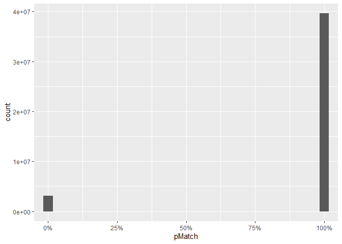

## QA check


```r
RU2duns<-RU2duns %>% filter(!is.na(TotalCount))

nrow(RU2duns %>% filter(TopDunsnumber=='' | is.na(TopDunsnumber)))
```

```
## [1] 47942
```

```r
nrow(RUh2duns %>% filter(TopDunsnumber=='' | is.na(TopDunsnumber)))
```

```
## [1] 244973
```

```r
if(any(RU2duns$TopDunsnumberCount>RU2duns$TotalCount))
  stop("Misaligned counts")

# 
# RU2duns <- RU2duns %>% mutate(
#   pCount=TopDunsnumberCount/TotalCount,
#   pDollar=TopDunsnumberAmount/TotalAmount,
#   pMatch=ifelse(!is.nan(pDollar)&!is.na(pDollar),pDollar,pCount)
# )

RU2duns <- RU2duns %>% mutate(
  DunsnumberNullCount=ifelse(is.na(DunsnumberNullCount),0,DunsnumberNullCount),
  DunsnumberNullAmount=ifelse(is.na(DunsnumberNullAmount),0,DunsnumberNullAmount),
  pCount=ifelse(TopDunsnumber=='' | is.na(TopDunsnumber),0,( TopDunsnumberCount+DunsnumberNullCount)/TotalCount),
  pDollar=ifelse(TopDunsnumber=='' | is.na(TopDunsnumber),0,( TopDunsnumberAmount+DunsnumberNullAmount)/TotalAmount),
  pMatch=ifelse(!is.nan(pDollar)&!is.na(pDollar),pDollar,pCount)
)


RUh2duns<-RUh2duns %>% filter(!is.na(TotalCount))

if(any(RUh2duns$TopDunsnumberCount>RUh2duns$TotalCount))
  stop("Misaligned counts")


RUh2duns <- RUh2duns %>% mutate(
  # DunsnumberNullCount=ifelse(is.na(DunsnumberNullCount),0,DunsnumberNullCount),
  # DunsnumberNullAmount=ifelse(is.na(DunsnumberNullAmount),0,DunsnumberNullCount),
  pCount=ifelse(TopDunsnumber=='' | is.na(TopDunsnumber),0,( TopDunsnumberCount)/TotalCount),#DunsnumberNullCount
  pDollar=ifelse(TopDunsnumber=='' | is.na(TopDunsnumber),0,( TopDunsnumberAmount)/TotalAmount),#+DunsnumberNullAmount
  pMatch=ifelse(!is.nan(pDollar)&!is.na(pDollar),pDollar,pCount)
)
```

## Recipient UEI alone

Percent of EntityIDs with an uncontroversial match `sum((RU2duns %>% filter(pMatch==1))$TotalCount)/sum(RU2duns$TotalCount)`
Percent of transactions with an uncontroversial match `sum((RU2duns %>% filter(pMatch==1))$TotalCount)/sum(RU2duns$TotalCount)`
Percent of dollars with an uncontroversial match `sum((RU2duns %>% filter(pMatch==1))$TotalAmount)/sum(RU2duns$TotalAmount)`


```r
nrow(RU2duns %>% filter(pMatch==1))/nrow(RU2duns)
```

```
## [1] 0.9342575
```

```r
sum((RU2duns %>% filter(pCount==1))$TotalCount)/sum(RU2duns$TotalCount)
```

```
## [1] 0.9305424
```

```r
sum((RU2duns %>% filter(pMatch==1))$TotalAmount)/sum(RU2duns$TotalAmount)
```

```
## [1] 0.8417633
```

```r
nrow(RU2duns %>% filter(abs(pMatch-1)<0.1))/nrow(RU2duns)
```

```
## [1] 0.9442716
```

```r
sum((RU2duns %>% filter(abs(pMatch-1)<0.1))$TotalCount)/sum(RU2duns$TotalCount)
```

```
## [1] 0.9305424
```

```r
sum((RU2duns %>% filter(abs(pMatch-1)<0.1))$TotalAmount)/sum(RU2duns$TotalAmount)
```

```
## [1] 0.9309447
```

```r
ggplot(RU2duns %>% filter(pMatch<=1&pMatch>=0 ),aes(x=pMatch))+geom_histogram()+coord_cartesian(xlim=c(0,1))+
  scale_x_continuous(labels=scales::percent)#scale_y_log10(label=scales::comma)+
```

```
## `stat_bin()` using `bins = 30`. Pick better value with `binwidth`.
```

<!-- -->

```r
ggplot(RU2duns %>% filter(pMatch<=1&pMatch>=0 ),aes(x=pMatch,weight=TotalCount))+geom_histogram()+coord_cartesian(xlim=c(0,1))+
  scale_x_continuous(labels=scales::percent)#scale_y_log10(label=scales::comma)
```

```
## `stat_bin()` using `bins = 30`. Pick better value with `binwidth`.
```

<!-- -->

```r
ggplot(RU2duns %>% filter(pMatch<=1&pMatch>=0 ),aes(x=pMatch,weight=TotalAmount))+geom_histogram()+coord_cartesian(xlim=c(0,1))+
  scale_x_continuous(labels=scales::percent)#scale_y_log10(label=scales::comma)
```

```
## `stat_bin()` using `bins = 30`. Pick better value with `binwidth`.
```

<!-- -->


## Recipient UEI and fiscal year

Percent of EntityIDs with an uncontroversial annual match `sum((RUh2duns %>% filter(pMatch==1))$TotalCount)/sum(RUh2duns$TotalCount)`
Percent of transactions with an uncontroversial annual match `sum((RUh2duns %>% filter(pMatch==1))$TotalCount)/sum(RUh2duns$TotalCount)`
Percent of dollars with an uncontroversial annual match `sum((RUh2duns %>% filter(pMatch==1))$TotalAmount)/sum(RUh2duns$TotalAmount)`


```r
nrow(RUh2duns %>% filter(pMatch==1))/nrow(RUh2duns)
```

```
## [1] 0.9076793
```

```r
sum((RUh2duns %>% filter(pMatch==1))$TotalCount)/sum(RUh2duns$TotalCount)
```

```
## [1] 0.8076555
```

```r
sum((RUh2duns %>% filter(pMatch==1))$TotalAmount)/sum(RUh2duns$TotalAmount)
```

```
## [1] 0.8426438
```

```r
nrow(RUh2duns %>% filter(abs(pMatch-1)<0.1))/nrow(RUh2duns)
```

```
## [1] 0.9084835
```

```r
sum((RUh2duns %>% filter(abs(pMatch-1)<0.1))$TotalCount)/sum(RUh2duns$TotalCount)
```

```
## [1] 0.8081471
```

```r
sum((RUh2duns %>% filter(abs(pMatch-1)<0.1))$TotalAmount)/sum(RUh2duns$TotalAmount)
```

```
## [1] 0.8438479
```

```r
ggplot(RUh2duns %>% filter(pMatch<=1&pMatch>=0 ),aes(x=pMatch))+geom_histogram()+coord_cartesian(xlim=c(0,1))+
  scale_x_continuous(labels=scales::percent)#scale_y_log10(label=scales::comma)
```

```
## `stat_bin()` using `bins = 30`. Pick better value with `binwidth`.
```

<!-- -->

```r
ggplot(RUh2duns %>% filter(pMatch<=1&pMatch>=0 ),aes(x=pMatch))+geom_histogram()+coord_cartesian(xlim=c(0,1))+
  scale_x_continuous(labels=scales::percent)+facet_wrap(~Fiscal_Year)
```

```
## `stat_bin()` using `bins = 30`. Pick better value with `binwidth`.
```

<!-- -->

```r
ggplot(RUh2duns %>% filter(pMatch<=1&pMatch>=0 ),aes(x=pMatch,weight=TotalCount))+geom_histogram()+coord_cartesian(xlim=c(0,1))+
  scale_x_continuous(labels=scales::percent)#scale_y_log10(label=scales::comma)+
```

```
## `stat_bin()` using `bins = 30`. Pick better value with `binwidth`.
```

<!-- -->

```r
ggplot(RUh2duns %>% filter(pMatch<=1&pMatch>=0 ),aes(x=pMatch,weight=TotalCount))+geom_histogram()+coord_cartesian(xlim=c(0,1))+
  scale_x_continuous(labels=scales::percent)+facet_wrap(~Fiscal_Year)
```

```
## `stat_bin()` using `bins = 30`. Pick better value with `binwidth`.
```

<!-- -->

```r
ggplot(RUh2duns %>% filter(pMatch<=1&pMatch>=0 ),aes(x=pMatch,weight=TotalAmount))+geom_histogram()+coord_cartesian(xlim=c(0,1))+
 scale_x_continuous(labels=scales::percent)# scale_y_log10(label=scales::comma)+
```

```
## `stat_bin()` using `bins = 30`. Pick better value with `binwidth`.
```

<!-- -->

```r
ggplot(RUh2duns %>% filter(pMatch<=1&pMatch>=0 ),aes(x=pMatch,weight=TotalAmount))+geom_histogram()+coord_cartesian(xlim=c(0,1))+
 scale_x_continuous(labels=scales::percent)+facet_wrap(~Fiscal_Year)
```

```
## `stat_bin()` using `bins = 30`. Pick better value with `binwidth`.
```

<!-- -->
