# Setup
First we load the data. The dataset used is a U.S. Defense Contracting dataset derived from FPDS.


```
## Warning: replacing previous import 'Hmisc::summarize' by 'dplyr::summarize' when
## loading 'csis360'
```

```
## Warning: replacing previous import 'Hmisc::src' by 'dplyr::src' when loading
## 'csis360'
```

```
## 
## Attaching package: 'dplyr'
```

```
## The following objects are masked from 'package:stats':
## 
##     filter, lag
```

```
## The following objects are masked from 'package:base':
## 
##     intersect, setdiff, setequal, union
```

```
## -- Attaching packages --------------------------------------- tidyverse 1.3.0 --
```

```
## v tibble  3.0.4     v purrr   0.3.4
## v tidyr   1.1.2     v stringr 1.4.0
## v readr   1.4.0     v forcats 0.5.0
```

```
## -- Conflicts ------------------------------------------ tidyverse_conflicts() --
## x dplyr::filter() masks stats::filter()
## x dplyr::lag()    masks stats::lag()
```

```
## 
## Attaching package: 'scales'
```

```
## The following object is masked from 'package:purrr':
## 
##     discard
```

```
## The following object is masked from 'package:readr':
## 
##     col_factor
```
# Preprocessing 
## Project

```r
summary(factor(platpsc$ProjectPlatform))
```

```
##                      Aircraft Electronics, Comms, & Sensors 
##                         51359                          7635 
##   Facilities and Construction                 Land Vehicles 
##                         10397                          7267 
##               Missile Defense         Ordnance and Missiles 
##                          6290                         10317 
##                Other Products Other R&D and Knowledge Based 
##                           102                             6 
##                Other Services            Ships & Submarines 
##                            15                          5510 
##                 Space Systems                          NA's 
##                          2276                        422405
```

```r
topplat<-platpsc %>% group_by (ProjectName,PlatformPortfolio) %>%
  summarise(Action_Obligation_OMB20_GDP20=sum(Action_Obligation_OMB20_GDP20),
            Action_Obligation_2020=sum(ifelse(fiscal_year==2020,Action_Obligation_OMB20_GDP20,0)))%>%
              group_by (PlatformPortfolio) %>%
    mutate(rank_total=rank(desc(Action_Obligation_OMB20_GDP20)),
                        rank_2020=rank(desc(Action_Obligation_2020)))
```

```
## `summarise()` regrouping output by 'ProjectName' (override with `.groups` argument)
```

```r
topplat %>% arrange(desc(Action_Obligation_OMB20_GDP20))
```

```
## # A tibble: 1,606 x 6
## # Groups:   PlatformPortfolio [12]
##    ProjectName PlatformPortfol~ Action_Obligati~ Action_Obligati~ rank_total
##    <chr>       <fct>                       <dbl>            <dbl>      <dbl>
##  1  <NA>       Electronics, Co~   1027909795881.          3.50e15          1
##  2  <NA>       Facilities and ~   1022894052979.          5.11e15          1
##  3  <NA>       Aircraft            834056696435.          2.18e15          1
##  4  <NA>       Other R&D and K~    763362869530.          1.39e15          1
##  5  <NA>       Other Products      621466359264.          7.37e14          1
##  6  <NA>       Other Services      596912001864.          5.35e14          1
##  7  <NA>       Ships & Submari~    302793991598.          3.65e14          1
##  8  <NA>       Land Vehicles       259395594777.          2.85e14          1
##  9  <NA>       Ordnance and Mi~    253657609312.          2.41e14          1
## 10 "JSF (F-35~ Aircraft            161797373660.          8.09e12          2
## # ... with 1,596 more rows, and 1 more variable: rank_2020 <dbl>
```

```r
topplat$TopProject<-
  ifelse(topplat$rank_2020<=7 | topplat$rank_total<=7,topplat$ProjectName,NA)

platpsc<-left_join(platpsc,topplat %>% select(-Action_Obligation_OMB20_GDP20,Action_Obligation_2020),
          by=c("ProjectName","PlatformPortfolio"))

platpsc$TopProject[is.na(platpsc$TopProject) & !is.na(platpsc$ProjectName)]<-
  "Other Labeled Project"


summary(factor(platpsc$TopProject))
```

```
##                                                                      443 
##                                                                       10 
##                                                                      466 
##                                                                        7 
##                                                                      505 
##                                                                        4 
##                                                          ABRAMS UPGRADE  
##                                                                      550 
##                                                                      ACC 
##                                                                       15 
##                                                                     ACWS 
##                                                                        1 
##                                                                   AEGIS  
##                                                                      170 
##                                                                    AEHF  
##                                                                       74 
##                                                      AF INT COM CTRL SYS 
##                                                                        5 
##                                                                  AMRAAM  
##                                                                      419 
##                                                                     ASM  
##                                                                        5 
##                                                            ATIRCMS/CMWS  
##                                                                      208 
##                                                BLACK HAWK UPGRADE (UH-60 
##                                                                     1260 
##                                                                    BMDS  
##                                                                      403 
##                                                          BRAC ACTIVITIES 
##                                                                     1189 
##                                                             BRADLEY FVS  
##                                                                      540 
##                                                                   C-17A  
##                                                                      710 
##                                                                  C130-J  
##                                                                     1276 
##                                                                    CBDP  
##                                                                       13 
##                                                                     CEC  
##                                                                      107 
##                                                         CHEM DEMIL-ACWA  
##                                                                       31 
##                                                                  CVN 21  
##                                                                      217 
##                                                                   DD(X)  
##                                                                      230 
##                                                                  DDG 51  
##                                                                      945 
## Department of Defense Healthcare Management System Modernization (DHMSM) 
##                                                                        9 
##                                                                     DERP 
##                                                                     1252 
##                                                                    DMLSS 
##                                                                       11 
##                                                                      DTS 
##                                                                       20 
##                                                   E-2C ADVANCED HAWKEYE  
##                                                                      436 
##                                                                    EELV  
##                                                                      151 
##                                                            EPA SUPERFUND 
##                                                                      694 
##                                                              F/A-18 E/F  
##                                                                      954 
##                                                                  F/A-22  
##                                                                      195 
##                                                                   FBCB2  
##                                                                      155 
##                                                                     FCS  
##                                                                      160 
##                                                                    FMTV  
##                                                                      390 
##                                                                    FSCS  
##                                                                       34 
##                                                                      GAJ 
##                                                                       36 
##                                                                 GCSS-AF  
##                                                                      292 
##                                                                   GMLRS  
##                                                                      193 
##                                                        HURRICANE KATRINA 
##                                                                     1323 
##                                                            ICBM FUZE MOD 
##                                                                        1 
##                                                                   JASSM  
##                                                                      126 
##                                                                    JDAM  
##                                                                      278 
##                    Joint Operational Medicine Information Systems (OMIS) 
##                                                                        4 
##                                                              JSF (F-35)  
##                                                                      558 
##                                                              LAV (NAVY)  
##                                                                      255 
##                                                                     LCS  
##                                                                      176 
##                                                                  LPD 17  
##                                                                      186 
##                                                     M1/M1A1 ABRAMS TANK  
##                                                                      841 
##                                        Massive Ordnance Penetrator (MOP) 
##                                                                        1 
##                                                                MIDS-LVT  
##                                                                      226 
##                                                                 MILSTAR  
##                                                                      143 
##                                                MISSILE DEFENSE AGENCY SU 
##                                                                     2565 
##                                                                     MMA  
##                                                                      437 
##                                                                     MSE  
##                                                                       10 
##                                                                    MUOS  
##                                                                       91 
##                                                              NAVSTAR GPS 
##                                                                      635 
##                                                                 NAVY ERP 
##                                                                       47 
##                                                OTHER ENVIRONMENTAL PROGR 
##                                                                     4590 
##                                                    Other Labeled Project 
##                                                                    71354 
##                                                                PAC-3 MSE 
##                                                                       67 
##                                                                 PATRIOT  
##                                                                      930 
##                                                           PATRIOT/MEADS  
##                                                                      222 
##                                                                     RCAS 
##                                                                        6 
##                                                               SBIRS HIGH 
##                                                                      348 
##                                                                SINCGARS  
##                                                                      228 
##                                                      SOLDIER ENHANCEMENT 
##                                                                       16 
##                                                                 SSN 774  
##                                                                      371 
##                                               STATUS OF FORCES AGREEMENT 
##                                                                      264 
##                                                           STRYKER (IAV)  
##                                                                      766 
##                                                                    T-400 
##                                                                       26 
##                                                       TACTICAL TOMAHAWK  
##                                                                      234 
##                                                THAAD-THEATER HIGH ALT AI 
##                                                                       27 
##                                                      TRACKWOLF HF SYSTEM 
##                                                                        1 
##                                                      TRIDENT II MISSILE  
##                                                                     2243 
##                                                                     V22  
##                                                                     1237 
##                                                 WATER PURIFICATION ROWPU 
##                                                                       33 
##                                                      WIDEBAND GAPFILLER  
##                                                                      118 
##                                                                   WIN-T  
##                                                                      132 
##                                                                      ZBL 
##                                                                      148 
##                                                                     NA's 
##                                                                   418944
```
## PSC

```r
summary(factor(platpsc$ProjectPlatform))
```

```
##                      Aircraft Electronics, Comms, & Sensors 
##                         51359                          7635 
##   Facilities and Construction                 Land Vehicles 
##                         10397                          7267 
##               Missile Defense         Ordnance and Missiles 
##                          6290                         10317 
##                Other Products Other R&D and Knowledge Based 
##                           102                             6 
##                Other Services            Ships & Submarines 
##                            15                          5510 
##                 Space Systems                          NA's 
##                          2276                        422405
```

```r
topPSC<-platpsc %>% group_by (ProductOrServiceCode,ProductOrServiceCodeText,PlatformPortfolio) %>%
  summarise(Action_Obligation_OMB20_GDP20=sum(Action_Obligation_OMB20_GDP20),
            Action_Obligation_2020=sum(ifelse(fiscal_year==2020,Action_Obligation_OMB20_GDP20,0)))%>%
              group_by (PlatformPortfolio) %>%
    mutate(rank_total=rank(desc(Action_Obligation_OMB20_GDP20)),
                        rank_2020=rank(desc(Action_Obligation_2020)))
```

```
## `summarise()` regrouping output by 'ProductOrServiceCode', 'ProductOrServiceCodeText' (override with `.groups` argument)
```

```r
topPSC %>% arrange(desc(Action_Obligation_OMB20_GDP20))
```

```
## # A tibble: 10,023 x 7
## # Groups:   PlatformPortfolio [12]
##    ProductOrServic~ ProductOrServic~ PlatformPortfol~ Action_Obligati~
##    <chr>            <chr>            <fct>                       <dbl>
##  1 1510             AIRCRAFT, FIXED~ Aircraft            528430043863.
##  2 Q201             GENERAL HEALTH ~ Other Services      221749457502.
##  3 9130             LIQUID PROPELLA~ Other Products      211269043211.
##  4 R425             ENGINEERING AND~ Other R&D and K~    177913166899.
##  5 R706             LOGISTICS SUPPO~ Other Services      145874993447.
##  6 D399             IT AND TELECOM-~ Electronics, Co~    128543461468.
##  7 1520             AIRCRAFT, ROTAR~ Aircraft            120207742063.
##  8 2840             GAS TURBINES & ~ Aircraft            117634677209.
##  9 1905             COMBAT SHIPS AN~ Ships & Submari~    116097896053.
## 10 R499             OTHER PROFESSIO~ Other R&D and K~     96258179781.
## # ... with 10,013 more rows, and 3 more variables:
## #   Action_Obligation_2020 <dbl>, rank_total <dbl>, rank_2020 <dbl>
```

```r
topPSC$TopPScode<-
  ifelse(topPSC$rank_2020<=7 | topPSC$rank_total<=7,topPSC$ProductOrServiceCode,NA)
topPSC$TopPStext<-
  ifelse(topPSC$rank_2020<=7 | topPSC$rank_total<=7,topPSC$ProductOrServiceCodeText,NA)


platpsc<-left_join(platpsc,topPSC %>% select(-Action_Obligation_OMB20_GDP20,Action_Obligation_2020),
          by=c("ProductOrServiceCode","PlatformPortfolio"))

platpsc$TopPScode[is.na(platpsc$TopPScode) & !is.na(platpsc$ProductOrServiceCode)]<-
  "Other Labeled PSC"
platpsc$TopPStext[is.na(platpsc$TopPStext) & !is.na(platpsc$ProductOrServiceCode)]<-
  "Other Labeled PSC"


summary(factor(platpsc$TopPStext))
```

```
##                                                   A/E SVCS. (INCL LANDSCAPING INTERIO 
##                                                                                   885 
##                                                                          ADP SOFTWARE 
##                                                                                  1781 
##                                                      ADP SVCS/TELECOMM & TRANSMISSION 
##                                                                                   718 
##                                                             ADPE SYSTEM CONFIGURATION 
##                                                                                  1347 
##                                                                AIR CHARTER FOR THINGS 
##                                                                                   168 
##                                                                     AIRCRAFT CARRIERS 
##                                                                                   100 
##                                                                  AIRCRAFT, FIXED WING 
##                                                                                  1528 
##                                                                 AIRCRAFT, ROTARY WING 
##                                                                                  1076 
##                                                        AIRFRAME STRUCTURAL COMPONENTS 
##                                                                                  2582 
##                                                             AMMUNITION, THROUGH 30 MM 
##                                                                                   265 
##                                                              AMPHIBIOUS ASSAULT SHIPS 
##                                                                                   103 
##                                             ARCHITECT AND ENGINEERING- GENERAL: OTHER 
##                                                                                   838 
##                                                     AUTOMATED INFORMATION SYSTEM SVCS 
##                                                                                   829 
##                                                                                 BOMBS 
##                                                                                   300 
##                                                             CLOTHING, SPECIAL PURPOSE 
##                                                                                   571 
##                                                         COMBAT ASSAULT & TACTICAL VEH 
##                                                                                   563 
##                                          COMBAT ASSAULT AND TACTICAL VEHICLES WHEELED 
##                                                                                   207 
##                                                      COMBAT SHIPS AND LANDING VESSELS 
##                                                                                   219 
##                                                                  CONSTRUCT/MISC BLDGS 
##                                                                                   322 
##                                               CONSTRUCTION OF MISCELLANEOUS BUILDINGS 
##                                                                                   139 
##                                                      CONTRUCT/ALL OTHER NON-BLDG FACS 
##                                                                                   318 
##                                                                  DAIRY FOODS AND EGGS 
##                                                                                   184 
##                                                        DEFENSE AIRCRAFT (OPERATIONAL) 
##                                                                                   739 
##                                                                            DESTROYERS 
##                                                                                    90 
##                                                                 DRUGS AND BIOLOGICALS 
##                                                                                   356 
##                                                             EDUCATION/TRAINING- OTHER 
##                                                                                   641 
##                                                   ELEC COUNTERMEASURE & QUICK REAC EQ 
##                                                                                   565 
##                                                    ENGINEERING AND TECHNICAL SERVICES 
##                                                                                  1631 
##                           ENVIRONMENTAL SYSTEMS PROTECTION- ENVIRONMENTAL REMEDIATION 
##                                                                                   720 
##                                                    FACILITIES OPERATIONS SUPPORT SVCS 
##                                                                                   562 
##                                                                             FUEL OILS 
##                                                                                   393 
##                                                   GAS TURBINES & JET ENGINES AIRCRAFT 
##                                                                                  1562 
##                                                          GENERAL HEALTH CARE SERVICES 
##                                                                                   276 
##                                                                GROUND EFFECT VEHICLES 
##                                                                                   355 
##                                                             GUIDED MISSILE COMPONENTS 
##                                                                                   772 
##                                                             GUIDED MISSILE SUBSYSTEMS 
##                                                                                   317 
##                                                                       GUIDED MISSILES 
##                                                                                  1015 
##                                                                   GUNS, THROUGH 30 MM 
##                                                                                   612 
##                                       IT AND TELECOM- OTHER IT AND TELECOMMUNICATIONS 
##                                                                                  1228 
##                                                    LIQUID PROPELLANTS -PETROLEUM BASE 
##                                                                                   405 
##                                                            LOGISTICS SUPPORT SERVICES 
##                                                                                   557 
##                                                              MAINT-REP-ALT/MISC BLDGS 
##                                                                                   428 
##                                                                 MAINT-REP OF AIRCRAFT 
##                                                                                  1205 
##                                                         MAINT-REP OF COMMUNICATION EQ 
##                                                                                   684 
##                                                                  MAINT-REP OF MISC EQ 
##                                                                                   705 
##                                                    MAINT-REP OF SHIPS-SML CRAFT-DOCKS 
##                                                                                   465 
##                                                    MAINT-REP OF TRAINING AIDS-DEVICES 
##                                                                                   209 
##                                                    MAINT-REP OF VEHICLES-TRAILERS-CYC 
##                                                                                   472 
##                                                             MARINE CHARTER FOR THINGS 
##                                                                                    81 
##                                                         MARINE LIFESAVING & DIVING EQ 
##                                                                                   319 
##                                                   MED & SURGICAL INSTRUMENTS,EQ & SUP 
##                                                                                   660 
##                                                                        MEDICAL- OTHER 
##                                                                                   408 
##                                                                 MISC COMMUNICATION EQ 
##                                                                                  1452 
##                                     MISCELLANEOUS AIRCRAFT ACCESSORIES AND COMPONENTS 
##                                                                                  3335 
##                                                                   MISCELLANEOUS ITEMS 
##                                                                                   538 
##                                                    MISCELLANEOUS VEHICULAR COMPONENTS 
##                                                                                   853 
##                                                                 MISCELLANEOUS WEAPONS 
##                                                                                   602 
##                                                        NON-NUCLEAR SHIP REPAIR (EAST) 
##                                                                                   241 
##                                                        NON-NUCLEAR SHIP REPAIR (WEST) 
##                                                                                   377 
##                                                                      NUCLEAR REACTORS 
##                                                                                   106 
##                                                                      OFFICE FURNITURE 
##                                                                                  1199 
##                                                     OTHER ADMINISTRATIVE SUPPORT SVCS 
##                                                                                   635 
##                                                   OTHER DEFENSE (APPLIED/EXPLORATORY) 
##                                                                                   427 
##                                                              OTHER ENVIR SVC/STUD/SUP 
##                                                                                   861 
##                                                                     Other Labeled PSC 
##                                                                                471313 
##                                                     OTHER MANAGEMENT SUPPORT SERVICES 
##                                                                                   810 
##                                                           OTHER PROFESSIONAL SERVICES 
##                                                                                   998 
##                                                         PASSENGER AIR CHARTER SERVICE 
##                                                                                   152 
##                                                   PROGRAM MANAGEMENT/SUPPORT SERVICES 
##                                                                                   740 
##                     R&D- DEFENSE SYSTEM: MISSILE/SPACE SYSTEMS (ADVANCED DEVELOPMENT) 
##                                                                                   504 
## R&D- DEFENSE SYSTEM: MISSILE/SPACE SYSTEMS (APPLIED RESEARCH/EXPLORATORY DEVELOPMENT) 
##                                                                                   347 
##                           R&D- DEFENSE SYSTEM: MISSILE/SPACE SYSTEMS (BASIC RESEARCH) 
##                                                                                   121 
##                  R&D- DEFENSE SYSTEM: MISSILE/SPACE SYSTEMS (ENGINEERING DEVELOPMENT) 
##                                                                                   302 
##          R&D- DEFENSE SYSTEM: MISSILE/SPACE SYSTEMS (OPERATIONAL SYSTEMS DEVELOPMENT) 
##                                                                                   274 
##        R&D- OTHER RESEARCH AND DEVELOPMENT (APPLIED RESEARCH/EXPLORATORY DEVELOPMENT) 
##                                                                                   220 
##                 R&D- OTHER RESEARCH AND DEVELOPMENT (OPERATIONAL SYSTEMS DEVELOPMENT) 
##                                                                                    20 
##                          R&D- SPACE: OTHER (APPLIED RESEARCH/EXPLORATORY DEVELOPMENT) 
##                                                                                    65 
##                    R&D- SPACE: SCIENCE/APPLICATIONS (OPERATIONAL SYSTEMS DEVELOPMENT) 
##                                                                                    21 
##                                                      RADAR EQUIPMENT, EXCEPT AIRBORNE 
##                                                                                   145 
##                                                   SHIP AND BOAT PROPULSION COMPONENTS 
##                                                                                   415 
##                                                                 SPACE TRANSP & LAUNCH 
##                                                                                    59 
##                                                                        SPACE VEHICLES 
##                                                                                   143 
##                                                                            SUBMARINES 
##                                                                                   213 
##                                                          SYSTEMS ENGINEERING SERVICES 
##                                                                                   392 
##                                                         TECH REP SVCS/GUIDED MISSILES 
##                                                                                   245 
##                                                                              TRAILERS 
##                                                                                   565 
##                                                                         TRAINING AIDS 
##                                                                                   592 
##                      TRANSPORTATION/TRAVEL/RELOCATION- TRANSPORTATION: VESSEL FREIGHT 
##                                                                                   114 
##                                                    TRUCKS AND TRUCK TRACTORS, WHEELED 
##                                                                                   708
```

# Platforms and Top Projects


## Aircraft System

```r
# summary(factor(platpsc$ProjectPlatform))
# platpsc$fiscal_year
# 
# topplat<-platpsc %>% filter(PlatformPortfolio=="Aircraft") %>% group_by (ProjectName) %>%
#   summarise(Action_Obligation_OMB20_GDP20=sum(Action_Obligation_OMB20_GDP20),
#             Action_Obligation_2020=sum(ifelse(fiscal_year==2020,Action_Obligation_OMB20_GDP20,0))
#             )%>% mutate(rank_total=rank(desc(Action_Obligation_OMB20_GDP20)),
#                         rank_2020=rank(desc(Action_Obligation_2020)))
# topplat %>% arrange(desc(Action_Obligation_OMB20_GDP20))
# 
# platpsc$TopAircraftProject<-
#   ifelse(platpsc$ProjectName %in% topplat$ProjectName[topplat$rank_2020<=7 | topplat$rank_total<=7],
#          platpsc$ProjectName,NA)
# platpsc$TopAircraftProject[is.na(platpsc$TopAircraftProject) & !is.na(platpsc$ProjectName)]<-
#   "Other Labeled Project"
# summary(factor(platpsc$TopAircraftProject))


(
Platform<-build_plot(
  data=platpsc %>% filter(PlatformPortfolio=="Aircraft"),
  chart_geom = "Line Chart",
  share = FALSE,
  # labels_and_colors=labels_and_colors,
  # NA, #VAR.ncol
  x_var="dFYear", #x_var
  y_var="Action_Obligation_OMB20_GDP20", #VAR.y.variable
  color_var="TopProject", #color_var
  facet_var="TopProject", #facet_var
  # column_key=column_key,
  format=TRUE,
  ytextposition=FALSE
)+scale_x_date("Fiscal Year",labels = date_format("'%y"))+
  # theme(strip.text.y = element_text(angle=0))+
 # theme(axis.text.x = element_text(angle=90))+
 #    scale_y_continuous("Percent of Obligations", labels = percent_format(accuracy=1))+
 #      facet_grid(.~Competition.sum ,scales="free_x", space="free_x"
 #             )+labs(title=NULL,
  # x="Fiscal Year",
  # y="Percent of Obligations",
  # color="Competition")+
  theme(legend.position = "none")+
  labs(y="Obligations (Constant 2020 $s)")
)
```

```
## Warning in if (is.na(breakout)) breakout <- NULL: the condition has length > 1
## and only the first element will be used
```

```
## Warning: `summarise_()` is deprecated as of dplyr 0.7.0.
## Please use `summarise()` instead.
## This warning is displayed once every 8 hours.
## Call `lifecycle::last_warnings()` to see where this warning was generated.
```

```
## Warning: `group_by_()` is deprecated as of dplyr 0.7.0.
## Please use `group_by()` instead.
## See vignette('programming') for more help
## This warning is displayed once every 8 hours.
## Call `lifecycle::last_warnings()` to see where this warning was generated.
```

```
## Warning in add_preassigned_scales(mainplot, labels_and_colors, var = color_var):
## TopProject not found in labels_and_colors
```

```
## Scale for 'x' is already present. Adding another scale for 'x', which will
## replace the existing scale.
```

```
## Warning in grid.Call(C_stringMetric, as.graphicsAnnot(x$label)): font family not
## found in Windows font database
```

```
## Warning in grid.Call(C_textBounds, as.graphicsAnnot(x$label), x$x, x$y, : font
## family not found in Windows font database
```

```
## Warning in grid.Call(C_stringMetric, as.graphicsAnnot(x$label)): font family not
## found in Windows font database

## Warning in grid.Call(C_stringMetric, as.graphicsAnnot(x$label)): font family not
## found in Windows font database
```

```
## Warning in grid.Call(C_textBounds, as.graphicsAnnot(x$label), x$x, x$y, : font
## family not found in Windows font database

## Warning in grid.Call(C_textBounds, as.graphicsAnnot(x$label), x$x, x$y, : font
## family not found in Windows font database

## Warning in grid.Call(C_textBounds, as.graphicsAnnot(x$label), x$x, x$y, : font
## family not found in Windows font database

## Warning in grid.Call(C_textBounds, as.graphicsAnnot(x$label), x$x, x$y, : font
## family not found in Windows font database

## Warning in grid.Call(C_textBounds, as.graphicsAnnot(x$label), x$x, x$y, : font
## family not found in Windows font database

## Warning in grid.Call(C_textBounds, as.graphicsAnnot(x$label), x$x, x$y, : font
## family not found in Windows font database
```

```
## Warning in grid.Call.graphics(C_text, as.graphicsAnnot(x$label), x$x, x$y, :
## font family not found in Windows font database
```

```
## Warning in grid.Call(C_textBounds, as.graphicsAnnot(x$label), x$x, x$y, : font
## family not found in Windows font database
```

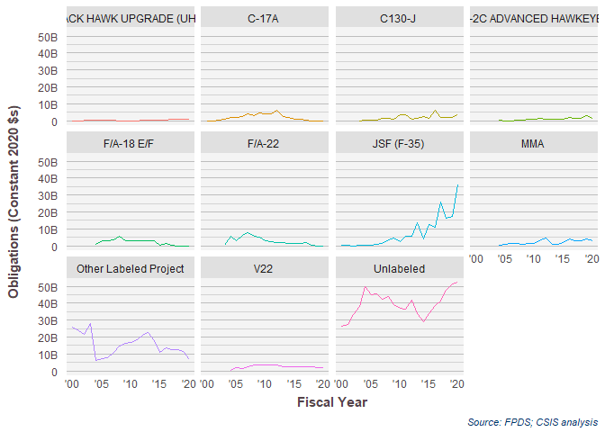<!-- -->

## Ships and Submarines

```r
# summary(factor(platpsc$ProjectPlatform))
# platpsc$fiscal_year
# 
# topplat<-platpsc %>% filter(PlatformPortfolio=="Ships & Submarines") %>% group_by (ProjectName) %>%
#   summarise(Action_Obligation_OMB20_GDP20=sum(Action_Obligation_OMB20_GDP20),
#             Action_Obligation_2020=sum(ifelse(fiscal_year==2020,Action_Obligation_OMB20_GDP20,0))
#             )%>% mutate(rank_total=rank(desc(Action_Obligation_OMB20_GDP20)),
#                         rank_2020=rank(desc(Action_Obligation_2020)))
# topplat %>% arrange(desc(Action_Obligation_OMB20_GDP20))
# 
# platpsc$TopShipProject<-
#   ifelse(platpsc$ProjectName %in% topplat$ProjectName[topplat$rank_2020<=7 | topplat$rank_total<=7],
#          platpsc$ProjectName,NA)
# platpsc$TopShipProject[is.na(platpsc$TopShipProject) & !is.na(platpsc$ProjectName)]<-
#   "Other Labeled Project"
# summary(factor(platpsc$TopShipProject))


(
Platform<-build_plot(
  data=platpsc %>% filter(PlatformPortfolio=="Ships & Submarines"),
  chart_geom = "Line Chart",
  share = FALSE,
  # labels_and_colors=labels_and_colors,
  # NA, #VAR.ncol
  x_var="dFYear", #x_var
  y_var="Action_Obligation_OMB20_GDP20", #VAR.y.variable
  color_var="TopProject", #color_var
  facet_var="TopProject", #facet_var
  # column_key=column_key,
  format=TRUE,
  ytextposition=FALSE
)+scale_x_date("Fiscal Year",labels = date_format("'%y"))+
  # theme(strip.text.y = element_text(angle=0))+
 # theme(axis.text.x = element_text(angle=90))+
 #    scale_y_continuous("Percent of Obligations", labels = percent_format(accuracy=1))+
 #      facet_grid(.~Competition.sum ,scales="free_x", space="free_x"
 #             )+labs(title=NULL,
  # x="Fiscal Year",
  # y="Percent of Obligations",
  # color="Competition")+
  theme(legend.position = "none")+
  labs(y="Obligations (Constant 2020 $s)")
)
```

```
## Warning in if (is.na(breakout)) breakout <- NULL: the condition has length > 1
## and only the first element will be used
```

```
## Warning in add_preassigned_scales(mainplot, labels_and_colors, var = color_var):
## TopProject not found in labels_and_colors
```

```
## Scale for 'x' is already present. Adding another scale for 'x', which will
## replace the existing scale.
```

```
## Warning in grid.Call(C_textBounds, as.graphicsAnnot(x$label), x$x, x$y, : font
## family not found in Windows font database
```

```
## Warning in grid.Call(C_textBounds, as.graphicsAnnot(x$label), x$x, x$y, : font
## family not found in Windows font database

## Warning in grid.Call(C_textBounds, as.graphicsAnnot(x$label), x$x, x$y, : font
## family not found in Windows font database

## Warning in grid.Call(C_textBounds, as.graphicsAnnot(x$label), x$x, x$y, : font
## family not found in Windows font database

## Warning in grid.Call(C_textBounds, as.graphicsAnnot(x$label), x$x, x$y, : font
## family not found in Windows font database

## Warning in grid.Call(C_textBounds, as.graphicsAnnot(x$label), x$x, x$y, : font
## family not found in Windows font database

## Warning in grid.Call(C_textBounds, as.graphicsAnnot(x$label), x$x, x$y, : font
## family not found in Windows font database
```

```
## Warning in grid.Call.graphics(C_text, as.graphicsAnnot(x$label), x$x, x$y, :
## font family not found in Windows font database
```

```
## Warning in grid.Call(C_textBounds, as.graphicsAnnot(x$label), x$x, x$y, : font
## family not found in Windows font database
```

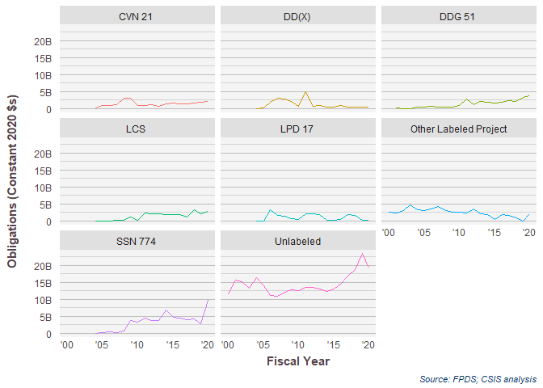<!-- -->


## Ordnance and Missiles

```r
summary(factor(platpsc$ProjectPlatform))
```

```
##                      Aircraft Electronics, Comms, & Sensors 
##                         51359                          7635 
##   Facilities and Construction                 Land Vehicles 
##                         10397                          7267 
##               Missile Defense         Ordnance and Missiles 
##                          6290                         10317 
##                Other Products Other R&D and Knowledge Based 
##                           102                             6 
##                Other Services            Ships & Submarines 
##                            15                          5510 
##                 Space Systems                          NA's 
##                          2276                        422405
```

```r
# platpsc$fiscal_year
# 
# topplat<-platpsc %>% filter(PlatformPortfolio=="Ships & Submarines") %>% group_by (ProjectName) %>%
#   summarise(Action_Obligation_OMB20_GDP20=sum(Action_Obligation_OMB20_GDP20),
#             Action_Obligation_2020=sum(ifelse(fiscal_year==2020,Action_Obligation_OMB20_GDP20,0))
#             )%>% mutate(rank_total=rank(desc(Action_Obligation_OMB20_GDP20)),
#                         rank_2020=rank(desc(Action_Obligation_2020)))
# topplat %>% arrange(desc(Action_Obligation_OMB20_GDP20))
# 
# platpsc$TopShipProject<-
#   ifelse(platpsc$ProjectName %in% topplat$ProjectName[topplat$rank_2020<=7 | topplat$rank_total<=7],
#          platpsc$ProjectName,NA)
# platpsc$TopShipProject[is.na(platpsc$TopShipProject) & !is.na(platpsc$ProjectName)]<-
#   "Other Labeled Project"
# summary(factor(platpsc$TopShipProject))


(
Platform<-build_plot(
  data=platpsc %>% filter(PlatformPortfolio=="Ordnance and Missiles"),
  chart_geom = "Line Chart",
  share = FALSE,
  # labels_and_colors=labels_and_colors,
  # NA, #VAR.ncol
  x_var="dFYear", #x_var
  y_var="Action_Obligation_OMB20_GDP20", #VAR.y.variable
  color_var="TopProject", #color_var
  facet_var="TopProject", #facet_var
  # column_key=column_key,
  format=TRUE,
  ytextposition=FALSE
)+scale_x_date("Fiscal Year",labels = date_format("'%y"))+
  # theme(strip.text.y = element_text(angle=0))+
 # theme(axis.text.x = element_text(angle=90))+
 #    scale_y_continuous("Percent of Obligations", labels = percent_format(accuracy=1))+
 #      facet_grid(.~Competition.sum ,scales="free_x", space="free_x"
 #             )+labs(title=NULL,
  # x="Fiscal Year",
  # y="Percent of Obligations",
  # color="Competition")+
  theme(legend.position = "none")+
  labs(y="Obligations (Constant 2020 $s)")
)
```

```
## Warning in if (is.na(breakout)) breakout <- NULL: the condition has length > 1
## and only the first element will be used
```

```
## Warning in add_preassigned_scales(mainplot, labels_and_colors, var = color_var):
## TopProject not found in labels_and_colors
```

```
## Scale for 'x' is already present. Adding another scale for 'x', which will
## replace the existing scale.
```

```
## Warning in grid.Call(C_textBounds, as.graphicsAnnot(x$label), x$x, x$y, : font
## family not found in Windows font database
```

```
## Warning in grid.Call(C_textBounds, as.graphicsAnnot(x$label), x$x, x$y, : font
## family not found in Windows font database

## Warning in grid.Call(C_textBounds, as.graphicsAnnot(x$label), x$x, x$y, : font
## family not found in Windows font database

## Warning in grid.Call(C_textBounds, as.graphicsAnnot(x$label), x$x, x$y, : font
## family not found in Windows font database

## Warning in grid.Call(C_textBounds, as.graphicsAnnot(x$label), x$x, x$y, : font
## family not found in Windows font database

## Warning in grid.Call(C_textBounds, as.graphicsAnnot(x$label), x$x, x$y, : font
## family not found in Windows font database

## Warning in grid.Call(C_textBounds, as.graphicsAnnot(x$label), x$x, x$y, : font
## family not found in Windows font database
```

```
## Warning in grid.Call.graphics(C_text, as.graphicsAnnot(x$label), x$x, x$y, :
## font family not found in Windows font database
```

```
## Warning in grid.Call(C_textBounds, as.graphicsAnnot(x$label), x$x, x$y, : font
## family not found in Windows font database
```

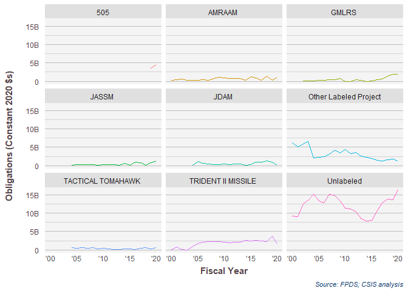<!-- -->

```r
(
PSC<-build_plot(
  data=platpsc %>% filter(PlatformPortfolio=="Ordnance and Missiles"),
  chart_geom = "Line Chart",
  share = FALSE,
  # labels_and_colors=labels_and_colors,
  # NA, #VAR.ncol
  x_var="dFYear", #x_var
  y_var="Action_Obligation_OMB20_GDP20", #VAR.y.variable
  color_var="TopPStext", #color_var
  facet_var="TopPStext", #facet_var
  # column_key=column_key,
  format=TRUE,
  ytextposition=FALSE
)+scale_x_date("Fiscal Year",labels = date_format("'%y"))+
  # theme(strip.text.y = element_text(angle=0))+
 # theme(axis.text.x = element_text(angle=90))+
 #    scale_y_continuous("Percent of Obligations", labels = percent_format(accuracy=1))+
 #      facet_grid(.~Competition.sum ,scales="free_x", space="free_x"
 #             )+labs(title=NULL,
  # x="Fiscal Year",
  # y="Percent of Obligations",
  # color="Competition")+
  theme(legend.position = "none")+
  labs(y="Obligations (Constant 2020 $s)")
)
```

```
## Warning in if (is.na(breakout)) breakout <- NULL: the condition has length > 1
## and only the first element will be used
```

```
## Warning in add_preassigned_scales(mainplot, labels_and_colors, var = color_var):
## TopPStext not found in labels_and_colors
```

```
## Scale for 'x' is already present. Adding another scale for 'x', which will
## replace the existing scale.
```

```
## Warning in grid.Call(C_textBounds, as.graphicsAnnot(x$label), x$x, x$y, : font
## family not found in Windows font database
```

```
## Warning in grid.Call(C_textBounds, as.graphicsAnnot(x$label), x$x, x$y, : font
## family not found in Windows font database

## Warning in grid.Call(C_textBounds, as.graphicsAnnot(x$label), x$x, x$y, : font
## family not found in Windows font database

## Warning in grid.Call(C_textBounds, as.graphicsAnnot(x$label), x$x, x$y, : font
## family not found in Windows font database

## Warning in grid.Call(C_textBounds, as.graphicsAnnot(x$label), x$x, x$y, : font
## family not found in Windows font database

## Warning in grid.Call(C_textBounds, as.graphicsAnnot(x$label), x$x, x$y, : font
## family not found in Windows font database

## Warning in grid.Call(C_textBounds, as.graphicsAnnot(x$label), x$x, x$y, : font
## family not found in Windows font database
```

```
## Warning in grid.Call.graphics(C_text, as.graphicsAnnot(x$label), x$x, x$y, :
## font family not found in Windows font database
```

```
## Warning in grid.Call(C_textBounds, as.graphicsAnnot(x$label), x$x, x$y, : font
## family not found in Windows font database
```

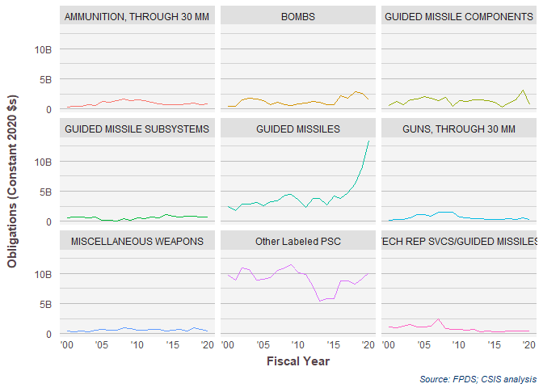<!-- -->

## Air and Missile Defesnse

```r
summary(factor(platpsc$ProjectPlatform))
```

```
##                      Aircraft Electronics, Comms, & Sensors 
##                         51359                          7635 
##   Facilities and Construction                 Land Vehicles 
##                         10397                          7267 
##               Missile Defense         Ordnance and Missiles 
##                          6290                         10317 
##                Other Products Other R&D and Knowledge Based 
##                           102                             6 
##                Other Services            Ships & Submarines 
##                            15                          5510 
##                 Space Systems                          NA's 
##                          2276                        422405
```

```r
# platpsc$fiscal_year
# 
# topplat<-platpsc %>% filter(PlatformPortfolio=="Ships & Submarines") %>% group_by (ProjectName) %>%
#   summarise(Action_Obligation_OMB20_GDP20=sum(Action_Obligation_OMB20_GDP20),
#             Action_Obligation_2020=sum(ifelse(fiscal_year==2020,Action_Obligation_OMB20_GDP20,0))
#             )%>% mutate(rank_total=rank(desc(Action_Obligation_OMB20_GDP20)),
#                         rank_2020=rank(desc(Action_Obligation_2020)))
# topplat %>% arrange(desc(Action_Obligation_OMB20_GDP20))
# 
# platpsc$TopShipProject<-
#   ifelse(platpsc$ProjectName %in% topplat$ProjectName[topplat$rank_2020<=7 | topplat$rank_total<=7],
#          platpsc$ProjectName,NA)
# platpsc$TopShipProject[is.na(platpsc$TopShipProject) & !is.na(platpsc$ProjectName)]<-
#   "Other Labeled Project"
# summary(factor(platpsc$TopShipProject))


(
Platform<-build_plot(
  data=platpsc %>% filter(PlatformPortfolio=="Missile Defense"),
  chart_geom = "Line Chart",
  share = FALSE,
  # labels_and_colors=labels_and_colors,
  # NA, #VAR.ncol
  x_var="dFYear", #x_var
  y_var="Action_Obligation_OMB20_GDP20", #VAR.y.variable
  color_var="TopProject", #color_var
  facet_var="TopProject", #facet_var
  # column_key=column_key,
  format=TRUE,
  ytextposition=FALSE
)+scale_x_date("Fiscal Year",labels = date_format("'%y"))+
  # theme(strip.text.y = element_text(angle=0))+
 # theme(axis.text.x = element_text(angle=90))+
 #    scale_y_continuous("Percent of Obligations", labels = percent_format(accuracy=1))+
 #      facet_grid(.~Competition.sum ,scales="free_x", space="free_x"
 #             )+labs(title=NULL,
  # x="Fiscal Year",
  # y="Percent of Obligations",
  # color="Competition")+
  theme(legend.position = "none")+
  labs(y="Obligations (Constant 2020 $s)")
)
```

```
## Warning in if (is.na(breakout)) breakout <- NULL: the condition has length > 1
## and only the first element will be used
```

```
## Warning in add_preassigned_scales(mainplot, labels_and_colors, var = color_var):
## TopProject not found in labels_and_colors
```

```
## Scale for 'x' is already present. Adding another scale for 'x', which will
## replace the existing scale.
```

```
## Warning in grid.Call(C_textBounds, as.graphicsAnnot(x$label), x$x, x$y, : font
## family not found in Windows font database
```

```
## Warning in grid.Call(C_textBounds, as.graphicsAnnot(x$label), x$x, x$y, : font
## family not found in Windows font database

## Warning in grid.Call(C_textBounds, as.graphicsAnnot(x$label), x$x, x$y, : font
## family not found in Windows font database

## Warning in grid.Call(C_textBounds, as.graphicsAnnot(x$label), x$x, x$y, : font
## family not found in Windows font database

## Warning in grid.Call(C_textBounds, as.graphicsAnnot(x$label), x$x, x$y, : font
## family not found in Windows font database

## Warning in grid.Call(C_textBounds, as.graphicsAnnot(x$label), x$x, x$y, : font
## family not found in Windows font database

## Warning in grid.Call(C_textBounds, as.graphicsAnnot(x$label), x$x, x$y, : font
## family not found in Windows font database
```

```
## Warning in grid.Call.graphics(C_text, as.graphicsAnnot(x$label), x$x, x$y, :
## font family not found in Windows font database
```

```
## Warning in grid.Call(C_textBounds, as.graphicsAnnot(x$label), x$x, x$y, : font
## family not found in Windows font database
```

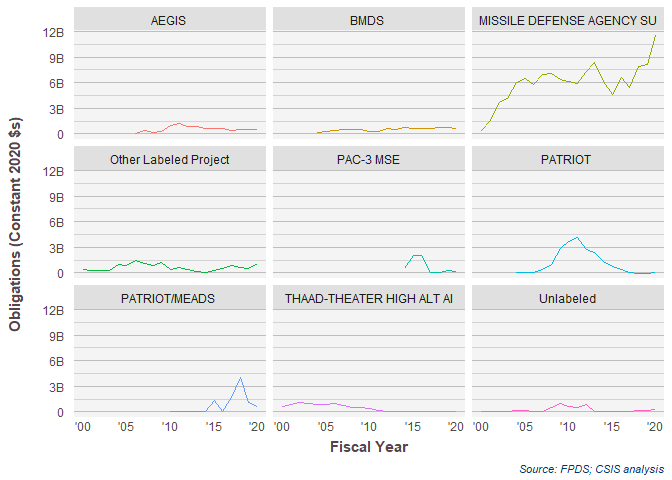<!-- -->

```r
(
PSC<-build_plot(
  data=platpsc %>% filter(PlatformPortfolio=="Missile Defense"),
  chart_geom = "Line Chart",
  share = FALSE,
  # labels_and_colors=labels_and_colors,
  # NA, #VAR.ncol
  x_var="dFYear", #x_var
  y_var="Action_Obligation_OMB20_GDP20", #VAR.y.variable
  color_var="TopPStext", #color_var
  facet_var="TopPStext", #facet_var
  # column_key=column_key,
  format=TRUE,
  ytextposition=FALSE
)+scale_x_date("Fiscal Year",labels = date_format("'%y"))+
  # theme(strip.text.y = element_text(angle=0))+
 # theme(axis.text.x = element_text(angle=90))+
 #    scale_y_continuous("Percent of Obligations", labels = percent_format(accuracy=1))+
 #      facet_grid(.~Competition.sum ,scales="free_x", space="free_x"
 #             )+labs(title=NULL,
  # x="Fiscal Year",
  # y="Percent of Obligations",
  # color="Competition")+
  theme(legend.position = "none")+
  labs(y="Obligations (Constant 2020 $s)")
)
```

```
## Warning in if (is.na(breakout)) breakout <- NULL: the condition has length > 1
## and only the first element will be used
```

```
## Warning in add_preassigned_scales(mainplot, labels_and_colors, var = color_var):
## TopPStext not found in labels_and_colors
```

```
## Scale for 'x' is already present. Adding another scale for 'x', which will
## replace the existing scale.
```

```
## Warning in grid.Call(C_textBounds, as.graphicsAnnot(x$label), x$x, x$y, : font
## family not found in Windows font database
```

```
## Warning in grid.Call(C_textBounds, as.graphicsAnnot(x$label), x$x, x$y, : font
## family not found in Windows font database

## Warning in grid.Call(C_textBounds, as.graphicsAnnot(x$label), x$x, x$y, : font
## family not found in Windows font database

## Warning in grid.Call(C_textBounds, as.graphicsAnnot(x$label), x$x, x$y, : font
## family not found in Windows font database

## Warning in grid.Call(C_textBounds, as.graphicsAnnot(x$label), x$x, x$y, : font
## family not found in Windows font database

## Warning in grid.Call(C_textBounds, as.graphicsAnnot(x$label), x$x, x$y, : font
## family not found in Windows font database

## Warning in grid.Call(C_textBounds, as.graphicsAnnot(x$label), x$x, x$y, : font
## family not found in Windows font database
```

```
## Warning in grid.Call.graphics(C_text, as.graphicsAnnot(x$label), x$x, x$y, :
## font family not found in Windows font database
```

```
## Warning in grid.Call(C_textBounds, as.graphicsAnnot(x$label), x$x, x$y, : font
## family not found in Windows font database
```

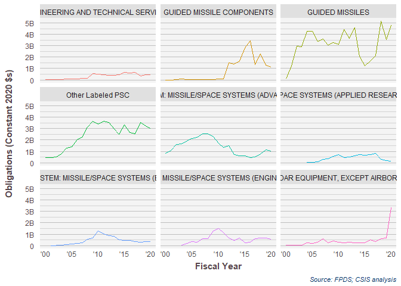<!-- -->

## Electronics Comms and Sensors

```r
summary(factor(platpsc$ProjectPlatform))
```

```
##                      Aircraft Electronics, Comms, & Sensors 
##                         51359                          7635 
##   Facilities and Construction                 Land Vehicles 
##                         10397                          7267 
##               Missile Defense         Ordnance and Missiles 
##                          6290                         10317 
##                Other Products Other R&D and Knowledge Based 
##                           102                             6 
##                Other Services            Ships & Submarines 
##                            15                          5510 
##                 Space Systems                          NA's 
##                          2276                        422405
```

```r
# platpsc$fiscal_year
# 
# topplat<-platpsc %>% filter(PlatformPortfolio=="Ships & Submarines") %>% group_by (ProjectName) %>%
#   summarise(Action_Obligation_OMB20_GDP20=sum(Action_Obligation_OMB20_GDP20),
#             Action_Obligation_2020=sum(ifelse(fiscal_year==2020,Action_Obligation_OMB20_GDP20,0))
#             )%>% mutate(rank_total=rank(desc(Action_Obligation_OMB20_GDP20)),
#                         rank_2020=rank(desc(Action_Obligation_2020)))
# topplat %>% arrange(desc(Action_Obligation_OMB20_GDP20))
# 
# platpsc$TopShipProject<-
#   ifelse(platpsc$ProjectName %in% topplat$ProjectName[topplat$rank_2020<=7 | topplat$rank_total<=7],
#          platpsc$ProjectName,NA)
# platpsc$TopShipProject[is.na(platpsc$TopShipProject) & !is.na(platpsc$ProjectName)]<-
#   "Other Labeled Project"
# summary(factor(platpsc$TopShipProject))


(
Platform<-build_plot(
  data=platpsc %>% filter(PlatformPortfolio=="Electronics, Comms, & Sensors"),
  chart_geom = "Line Chart",
  share = FALSE,
  # labels_and_colors=labels_and_colors,
  # NA, #VAR.ncol
  x_var="dFYear", #x_var
  y_var="Action_Obligation_OMB20_GDP20", #VAR.y.variable
  color_var="TopProject", #color_var
  facet_var="TopProject", #facet_var
  # column_key=column_key,
  format=TRUE,
  ytextposition=FALSE
)+scale_x_date("Fiscal Year",labels = date_format("'%y"))+
  # theme(strip.text.y = element_text(angle=0))+
 # theme(axis.text.x = element_text(angle=90))+
 #    scale_y_continuous("Percent of Obligations", labels = percent_format(accuracy=1))+
 #      facet_grid(.~Competition.sum ,scales="free_x", space="free_x"
 #             )+labs(title=NULL,
  # x="Fiscal Year",
  # y="Percent of Obligations",
  # color="Competition")+
  theme(legend.position = "none")+
  labs(y="Obligations (Constant 2020 $s)")
)
```

```
## Warning in if (is.na(breakout)) breakout <- NULL: the condition has length > 1
## and only the first element will be used
```

```
## Warning in add_preassigned_scales(mainplot, labels_and_colors, var = color_var):
## TopProject not found in labels_and_colors
```

```
## Scale for 'x' is already present. Adding another scale for 'x', which will
## replace the existing scale.
```

```
## Warning in grid.Call(C_textBounds, as.graphicsAnnot(x$label), x$x, x$y, : font
## family not found in Windows font database
```

```
## Warning in grid.Call(C_textBounds, as.graphicsAnnot(x$label), x$x, x$y, : font
## family not found in Windows font database

## Warning in grid.Call(C_textBounds, as.graphicsAnnot(x$label), x$x, x$y, : font
## family not found in Windows font database

## Warning in grid.Call(C_textBounds, as.graphicsAnnot(x$label), x$x, x$y, : font
## family not found in Windows font database

## Warning in grid.Call(C_textBounds, as.graphicsAnnot(x$label), x$x, x$y, : font
## family not found in Windows font database

## Warning in grid.Call(C_textBounds, as.graphicsAnnot(x$label), x$x, x$y, : font
## family not found in Windows font database

## Warning in grid.Call(C_textBounds, as.graphicsAnnot(x$label), x$x, x$y, : font
## family not found in Windows font database
```

```
## Warning in grid.Call.graphics(C_text, as.graphicsAnnot(x$label), x$x, x$y, :
## font family not found in Windows font database
```

```
## Warning in grid.Call(C_textBounds, as.graphicsAnnot(x$label), x$x, x$y, : font
## family not found in Windows font database
```

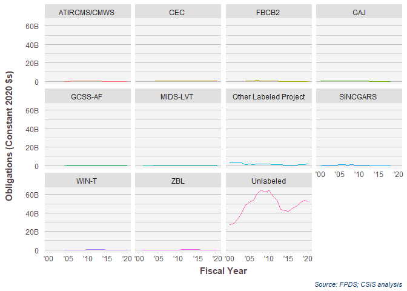<!-- -->

```r
(
PSC<-build_plot(
  data=platpsc %>% filter(PlatformPortfolio=="Electronics, Comms, & Sensors"),
  chart_geom = "Line Chart",
  share = FALSE,
  # labels_and_colors=labels_and_colors,
  # NA, #VAR.ncol
  x_var="dFYear", #x_var
  y_var="Action_Obligation_OMB20_GDP20", #VAR.y.variable
  color_var="TopPStext", #color_var
  facet_var="TopPStext", #facet_var
  # column_key=column_key,
  format=TRUE,
  ytextposition=FALSE
)+scale_x_date("Fiscal Year",labels = date_format("'%y"))+
  # theme(strip.text.y = element_text(angle=0))+
 # theme(axis.text.x = element_text(angle=90))+
 #    scale_y_continuous("Percent of Obligations", labels = percent_format(accuracy=1))+
 #      facet_grid(.~Competition.sum ,scales="free_x", space="free_x"
 #             )+labs(title=NULL,
  # x="Fiscal Year",
  # y="Percent of Obligations",
  # color="Competition")+
  theme(legend.position = "none")+
  labs(y="Obligations (Constant 2020 $s)")
)
```

```
## Warning in if (is.na(breakout)) breakout <- NULL: the condition has length > 1
## and only the first element will be used
```

```
## Warning in add_preassigned_scales(mainplot, labels_and_colors, var = color_var):
## TopPStext not found in labels_and_colors
```

```
## Scale for 'x' is already present. Adding another scale for 'x', which will
## replace the existing scale.
```

```
## Warning in grid.Call(C_textBounds, as.graphicsAnnot(x$label), x$x, x$y, : font
## family not found in Windows font database
```

```
## Warning in grid.Call(C_textBounds, as.graphicsAnnot(x$label), x$x, x$y, : font
## family not found in Windows font database

## Warning in grid.Call(C_textBounds, as.graphicsAnnot(x$label), x$x, x$y, : font
## family not found in Windows font database

## Warning in grid.Call(C_textBounds, as.graphicsAnnot(x$label), x$x, x$y, : font
## family not found in Windows font database

## Warning in grid.Call(C_textBounds, as.graphicsAnnot(x$label), x$x, x$y, : font
## family not found in Windows font database

## Warning in grid.Call(C_textBounds, as.graphicsAnnot(x$label), x$x, x$y, : font
## family not found in Windows font database

## Warning in grid.Call(C_textBounds, as.graphicsAnnot(x$label), x$x, x$y, : font
## family not found in Windows font database
```

```
## Warning in grid.Call.graphics(C_text, as.graphicsAnnot(x$label), x$x, x$y, :
## font family not found in Windows font database
```

```
## Warning in grid.Call(C_textBounds, as.graphicsAnnot(x$label), x$x, x$y, : font
## family not found in Windows font database
```

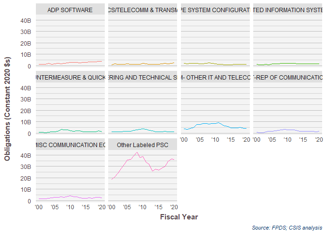<!-- -->


## Space Systems

```r
summary(factor(platpsc$ProjectPlatform))
```

```
##                      Aircraft Electronics, Comms, & Sensors 
##                         51359                          7635 
##   Facilities and Construction                 Land Vehicles 
##                         10397                          7267 
##               Missile Defense         Ordnance and Missiles 
##                          6290                         10317 
##                Other Products Other R&D and Knowledge Based 
##                           102                             6 
##                Other Services            Ships & Submarines 
##                            15                          5510 
##                 Space Systems                          NA's 
##                          2276                        422405
```

```r
# platpsc$fiscal_year
# 
# topplat<-platpsc %>% filter(PlatformPortfolio=="Ships & Submarines") %>% group_by (ProjectName) %>%
#   summarise(Action_Obligation_OMB20_GDP20=sum(Action_Obligation_OMB20_GDP20),
#             Action_Obligation_2020=sum(ifelse(fiscal_year==2020,Action_Obligation_OMB20_GDP20,0))
#             )%>% mutate(rank_total=rank(desc(Action_Obligation_OMB20_GDP20)),
#                         rank_2020=rank(desc(Action_Obligation_2020)))
# topplat %>% arrange(desc(Action_Obligation_OMB20_GDP20))
# 
# platpsc$TopShipProject<-
#   ifelse(platpsc$ProjectName %in% topplat$ProjectName[topplat$rank_2020<=7 | topplat$rank_total<=7],
#          platpsc$ProjectName,NA)
# platpsc$TopShipProject[is.na(platpsc$TopShipProject) & !is.na(platpsc$ProjectName)]<-
#   "Other Labeled Project"
# summary(factor(platpsc$TopShipProject))


(
Platform<-build_plot(
  data=platpsc %>% filter(PlatformPortfolio=="Space Systems"),
  chart_geom = "Line Chart",
  share = FALSE,
  # labels_and_colors=labels_and_colors,
  # NA, #VAR.ncol
  x_var="dFYear", #x_var
  y_var="Action_Obligation_OMB20_GDP20", #VAR.y.variable
  color_var="TopProject", #color_var
  facet_var="TopProject", #facet_var
  # column_key=column_key,
  format=TRUE,
  ytextposition=FALSE
)+scale_x_date("Fiscal Year",labels = date_format("'%y"))+
  # theme(strip.text.y = element_text(angle=0))+
 # theme(axis.text.x = element_text(angle=90))+
 #    scale_y_continuous("Percent of Obligations", labels = percent_format(accuracy=1))+
 #      facet_grid(.~Competition.sum ,scales="free_x", space="free_x"
 #             )+labs(title=NULL,
  # x="Fiscal Year",
  # y="Percent of Obligations",
  # color="Competition")+
  theme(legend.position = "none")+
  labs(y="Obligations (Constant 2020 $s)")
)
```

```
## Warning in if (is.na(breakout)) breakout <- NULL: the condition has length > 1
## and only the first element will be used
```

```
## Warning in add_preassigned_scales(mainplot, labels_and_colors, var = color_var):
## TopProject not found in labels_and_colors
```

```
## Scale for 'x' is already present. Adding another scale for 'x', which will
## replace the existing scale.
```

```
## Warning in grid.Call(C_textBounds, as.graphicsAnnot(x$label), x$x, x$y, : font
## family not found in Windows font database
```

```
## Warning in grid.Call(C_textBounds, as.graphicsAnnot(x$label), x$x, x$y, : font
## family not found in Windows font database

## Warning in grid.Call(C_textBounds, as.graphicsAnnot(x$label), x$x, x$y, : font
## family not found in Windows font database

## Warning in grid.Call(C_textBounds, as.graphicsAnnot(x$label), x$x, x$y, : font
## family not found in Windows font database

## Warning in grid.Call(C_textBounds, as.graphicsAnnot(x$label), x$x, x$y, : font
## family not found in Windows font database

## Warning in grid.Call(C_textBounds, as.graphicsAnnot(x$label), x$x, x$y, : font
## family not found in Windows font database

## Warning in grid.Call(C_textBounds, as.graphicsAnnot(x$label), x$x, x$y, : font
## family not found in Windows font database
```

```
## Warning in grid.Call.graphics(C_text, as.graphicsAnnot(x$label), x$x, x$y, :
## font family not found in Windows font database
```

```
## Warning in grid.Call(C_textBounds, as.graphicsAnnot(x$label), x$x, x$y, : font
## family not found in Windows font database
```

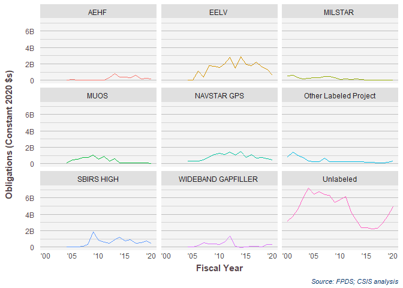<!-- -->

```r
(
PSC<-build_plot(
  data=platpsc %>% filter(PlatformPortfolio=="Space Systems"),
  chart_geom = "Line Chart",
  share = FALSE,
  # labels_and_colors=labels_and_colors,
  # NA, #VAR.ncol
  x_var="dFYear", #x_var
  y_var="Action_Obligation_OMB20_GDP20", #VAR.y.variable
  color_var="TopPStext", #color_var
  facet_var="TopPStext", #facet_var
  # column_key=column_key,
  format=TRUE,
  ytextposition=FALSE
)+scale_x_date("Fiscal Year",labels = date_format("'%y"))+
  # theme(strip.text.y = element_text(angle=0))+
 # theme(axis.text.x = element_text(angle=90))+
 #    scale_y_continuous("Percent of Obligations", labels = percent_format(accuracy=1))+
 #      facet_grid(.~Competition.sum ,scales="free_x", space="free_x"
 #             )+labs(title=NULL,
  # x="Fiscal Year",
  # y="Percent of Obligations",
  # color="Competition")+
  theme(legend.position = "none")+
  labs(y="Obligations (Constant 2020 $s)")
)
```

```
## Warning in if (is.na(breakout)) breakout <- NULL: the condition has length > 1
## and only the first element will be used
```

```
## Warning in add_preassigned_scales(mainplot, labels_and_colors, var = color_var):
## TopPStext not found in labels_and_colors
```

```
## Scale for 'x' is already present. Adding another scale for 'x', which will
## replace the existing scale.
```

```
## Warning in grid.Call(C_textBounds, as.graphicsAnnot(x$label), x$x, x$y, : font
## family not found in Windows font database
```

```
## Warning in grid.Call(C_textBounds, as.graphicsAnnot(x$label), x$x, x$y, : font
## family not found in Windows font database

## Warning in grid.Call(C_textBounds, as.graphicsAnnot(x$label), x$x, x$y, : font
## family not found in Windows font database

## Warning in grid.Call(C_textBounds, as.graphicsAnnot(x$label), x$x, x$y, : font
## family not found in Windows font database

## Warning in grid.Call(C_textBounds, as.graphicsAnnot(x$label), x$x, x$y, : font
## family not found in Windows font database

## Warning in grid.Call(C_textBounds, as.graphicsAnnot(x$label), x$x, x$y, : font
## family not found in Windows font database

## Warning in grid.Call(C_textBounds, as.graphicsAnnot(x$label), x$x, x$y, : font
## family not found in Windows font database
```

```
## Warning in grid.Call.graphics(C_text, as.graphicsAnnot(x$label), x$x, x$y, :
## font family not found in Windows font database
```

```
## Warning in grid.Call(C_textBounds, as.graphicsAnnot(x$label), x$x, x$y, : font
## family not found in Windows font database
```

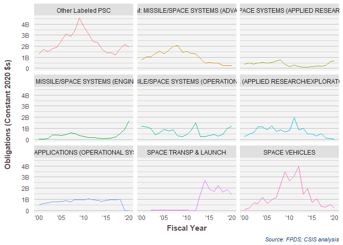<!-- -->

## Land Vehicles

```r
summary(factor(platpsc$ProjectPlatform))
```

```
##                      Aircraft Electronics, Comms, & Sensors 
##                         51359                          7635 
##   Facilities and Construction                 Land Vehicles 
##                         10397                          7267 
##               Missile Defense         Ordnance and Missiles 
##                          6290                         10317 
##                Other Products Other R&D and Knowledge Based 
##                           102                             6 
##                Other Services            Ships & Submarines 
##                            15                          5510 
##                 Space Systems                          NA's 
##                          2276                        422405
```

```r
# platpsc$fiscal_year
# 
# topplat<-platpsc %>% filter(PlatformPortfolio=="Ships & Submarines") %>% group_by (ProjectName) %>%
#   summarise(Action_Obligation_OMB20_GDP20=sum(Action_Obligation_OMB20_GDP20),
#             Action_Obligation_2020=sum(ifelse(fiscal_year==2020,Action_Obligation_OMB20_GDP20,0))
#             )%>% mutate(rank_total=rank(desc(Action_Obligation_OMB20_GDP20)),
#                         rank_2020=rank(desc(Action_Obligation_2020)))
# topplat %>% arrange(desc(Action_Obligation_OMB20_GDP20))
# 
# platpsc$TopShipProject<-
#   ifelse(platpsc$ProjectName %in% topplat$ProjectName[topplat$rank_2020<=7 | topplat$rank_total<=7],
#          platpsc$ProjectName,NA)
# platpsc$TopShipProject[is.na(platpsc$TopShipProject) & !is.na(platpsc$ProjectName)]<-
#   "Other Labeled Project"
# summary(factor(platpsc$TopShipProject))


(
Platform<-build_plot(
  data=platpsc %>% filter(PlatformPortfolio=="Land Vehicles"),
  chart_geom = "Line Chart",
  share = FALSE,
  # labels_and_colors=labels_and_colors,
  # NA, #VAR.ncol
  x_var="dFYear", #x_var
  y_var="Action_Obligation_OMB20_GDP20", #VAR.y.variable
  color_var="TopProject", #color_var
  facet_var="TopProject", #facet_var
  # column_key=column_key,
  format=TRUE,
  ytextposition=FALSE
)+scale_x_date("Fiscal Year",labels = date_format("'%y"))+
  # theme(strip.text.y = element_text(angle=0))+
 # theme(axis.text.x = element_text(angle=90))+
 #    scale_y_continuous("Percent of Obligations", labels = percent_format(accuracy=1))+
 #      facet_grid(.~Competition.sum ,scales="free_x", space="free_x"
 #             )+labs(title=NULL,
  # x="Fiscal Year",
  # y="Percent of Obligations",
  # color="Competition")+
  theme(legend.position = "none")+
  labs(y="Obligations (Constant 2020 $s)")
)
```

```
## Warning in if (is.na(breakout)) breakout <- NULL: the condition has length > 1
## and only the first element will be used
```

```
## Warning in add_preassigned_scales(mainplot, labels_and_colors, var = color_var):
## TopProject not found in labels_and_colors
```

```
## Scale for 'x' is already present. Adding another scale for 'x', which will
## replace the existing scale.
```

```
## Warning in grid.Call(C_textBounds, as.graphicsAnnot(x$label), x$x, x$y, : font
## family not found in Windows font database
```

```
## Warning in grid.Call(C_textBounds, as.graphicsAnnot(x$label), x$x, x$y, : font
## family not found in Windows font database

## Warning in grid.Call(C_textBounds, as.graphicsAnnot(x$label), x$x, x$y, : font
## family not found in Windows font database

## Warning in grid.Call(C_textBounds, as.graphicsAnnot(x$label), x$x, x$y, : font
## family not found in Windows font database

## Warning in grid.Call(C_textBounds, as.graphicsAnnot(x$label), x$x, x$y, : font
## family not found in Windows font database

## Warning in grid.Call(C_textBounds, as.graphicsAnnot(x$label), x$x, x$y, : font
## family not found in Windows font database

## Warning in grid.Call(C_textBounds, as.graphicsAnnot(x$label), x$x, x$y, : font
## family not found in Windows font database
```

```
## Warning in grid.Call.graphics(C_text, as.graphicsAnnot(x$label), x$x, x$y, :
## font family not found in Windows font database
```

```
## Warning in grid.Call(C_textBounds, as.graphicsAnnot(x$label), x$x, x$y, : font
## family not found in Windows font database
```

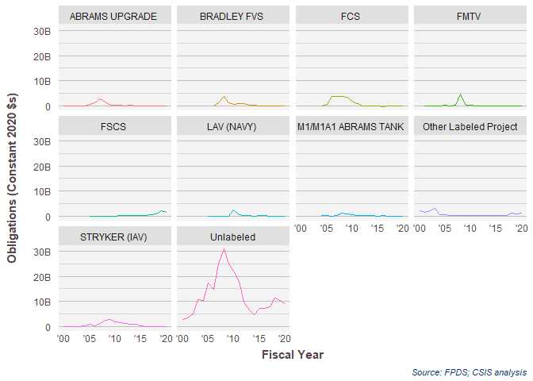<!-- -->

```r
(
PSC<-build_plot(
  data=platpsc %>% filter(PlatformPortfolio=="Land Vehicles"),
  chart_geom = "Line Chart",
  share = FALSE,
  # labels_and_colors=labels_and_colors,
  # NA, #VAR.ncol
  x_var="dFYear", #x_var
  y_var="Action_Obligation_OMB20_GDP20", #VAR.y.variable
  color_var="TopPStext", #color_var
  facet_var="TopPStext", #facet_var
  # column_key=column_key,
  format=TRUE,
  ytextposition=FALSE
)+scale_x_date("Fiscal Year",labels = date_format("'%y"))+
  # theme(strip.text.y = element_text(angle=0))+
 # theme(axis.text.x = element_text(angle=90))+
 #    scale_y_continuous("Percent of Obligations", labels = percent_format(accuracy=1))+
 #      facet_grid(.~Competition.sum ,scales="free_x", space="free_x"
 #             )+labs(title=NULL,
  # x="Fiscal Year",
  # y="Percent of Obligations",
  # color="Competition")+
  theme(legend.position = "none")+
  labs(y="Obligations (Constant 2020 $s)")
)
```

```
## Warning in if (is.na(breakout)) breakout <- NULL: the condition has length > 1
## and only the first element will be used
```

```
## Warning in add_preassigned_scales(mainplot, labels_and_colors, var = color_var):
## TopPStext not found in labels_and_colors
```

```
## Scale for 'x' is already present. Adding another scale for 'x', which will
## replace the existing scale.
```

```
## Warning in grid.Call(C_textBounds, as.graphicsAnnot(x$label), x$x, x$y, : font
## family not found in Windows font database
```

```
## Warning in grid.Call(C_textBounds, as.graphicsAnnot(x$label), x$x, x$y, : font
## family not found in Windows font database

## Warning in grid.Call(C_textBounds, as.graphicsAnnot(x$label), x$x, x$y, : font
## family not found in Windows font database

## Warning in grid.Call(C_textBounds, as.graphicsAnnot(x$label), x$x, x$y, : font
## family not found in Windows font database

## Warning in grid.Call(C_textBounds, as.graphicsAnnot(x$label), x$x, x$y, : font
## family not found in Windows font database

## Warning in grid.Call(C_textBounds, as.graphicsAnnot(x$label), x$x, x$y, : font
## family not found in Windows font database

## Warning in grid.Call(C_textBounds, as.graphicsAnnot(x$label), x$x, x$y, : font
## family not found in Windows font database
```

```
## Warning in grid.Call.graphics(C_text, as.graphicsAnnot(x$label), x$x, x$y, :
## font family not found in Windows font database
```

```
## Warning in grid.Call(C_textBounds, as.graphicsAnnot(x$label), x$x, x$y, : font
## family not found in Windows font database
```

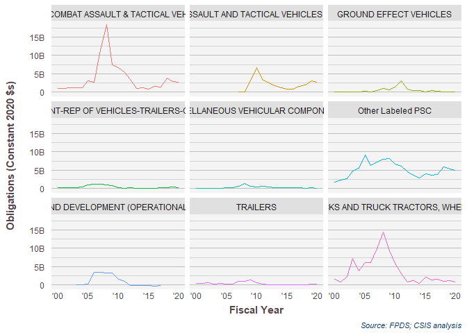<!-- -->
