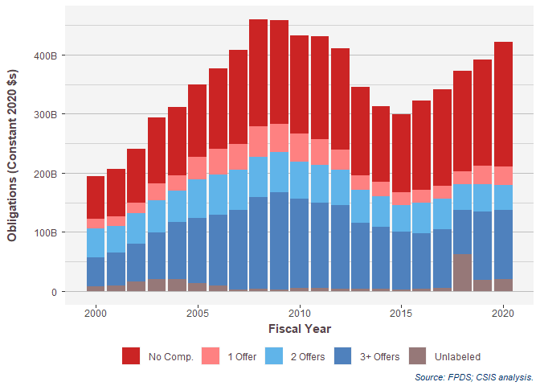
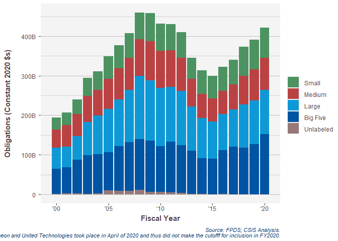
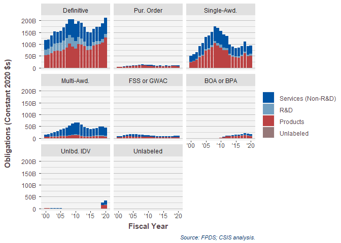
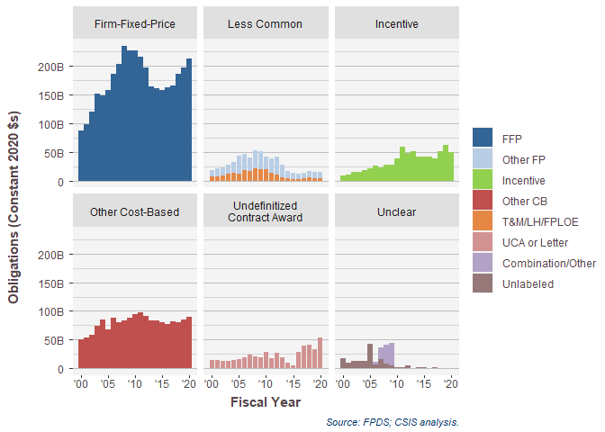
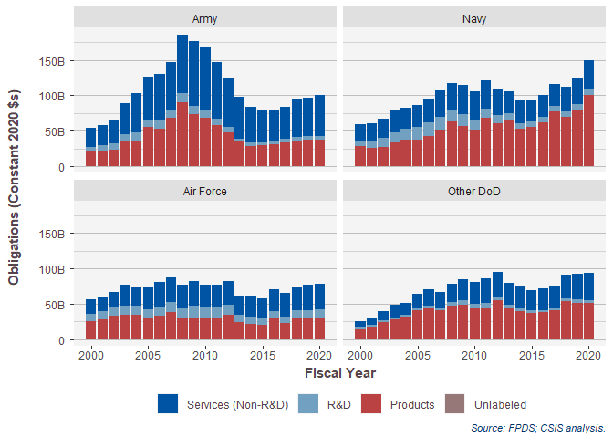
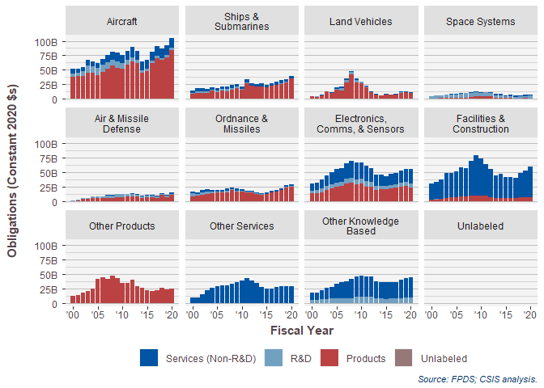
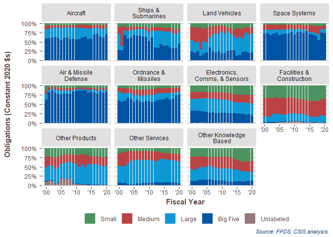

# Setup
First we load the data. The dataset used is a U.S. Defense Contracting dataset derived from   FPDS.


```
## Warning: replacing previous import 'Hmisc::summarize' by 'dplyr::summarize' when
## loading 'csis360'
```

```
## Warning: replacing previous import 'Hmisc::src' by 'dplyr::src' when loading
## 'csis360'
```

```
## 
## Attaching package: 'dplyr'
```

```
## The following objects are masked from 'package:stats':
## 
##     filter, lag
```

```
## The following objects are masked from 'package:base':
## 
##     intersect, setdiff, setequal, union
```

```
## -- Attaching packages --------------------------------------- tidyverse 1.3.0 --
```

```
## v tibble  3.0.4     v purrr   0.3.4
## v tidyr   1.1.2     v stringr 1.4.0
## v readr   1.4.0     v forcats 0.5.0
```

```
## -- Conflicts ------------------------------------------ tidyverse_conflicts() --
## x dplyr::filter() masks stats::filter()
## x dplyr::lag()    masks stats::lag()
```

```
## 
## Attaching package: 'scales'
```

```
## The following object is masked from 'package:purrr':
## 
##     discard
```

```
## The following object is masked from 'package:readr':
## 
##     col_factor
```

# Topline


## Topline Competition

```r
(
ToplineComp<-build_plot(
  data=full_data,
  chart_geom = "Bar Chart",
  share = FALSE,
  labels_and_colors=labels_and_colors,
  # NA, #VAR.ncol
  x_var="fiscal_year", #x_var
  y_var="Action_Obligation_OMB20_GDP20", #VAR.y.variable
  color_var="Competition.sum", #color_var
  # facet_var="Competition.sum", #facet_var
  column_key=column_key,
  format=TRUE,
  ytextposition=FALSE
)+
  # theme(strip.text.y = element_text(angle=0))+
 # theme(axis.text.x = element_text(angle=90))+
 #    scale_y_continuous("Percent of Obligations", labels = percent_format(accuracy=1))+
 #      facet_grid(.~Competition.sum ,scales="free_x", space="free_x"
 #             )+labs(title=NULL,
  # x="Fiscal Year",
  # y="Percent of Obligations",
  # color="Competition")+
  theme(legend.position = "bottom")+
  labs(y="Obligations (Constant 2020 $s)")
)
```

```
## Warning: `summarise_()` is deprecated as of dplyr 0.7.0.
## Please use `summarise()` instead.
## This warning is displayed once every 8 hours.
## Call `lifecycle::last_warnings()` to see where this warning was generated.
```

```
## Warning: `group_by_()` is deprecated as of dplyr 0.7.0.
## Please use `group_by()` instead.
## See vignette('programming') for more help
## This warning is displayed once every 8 hours.
## Call `lifecycle::last_warnings()` to see where this warning was generated.
```

```
## Warning in grid.Call(C_stringMetric, as.graphicsAnnot(x$label)): font family not
## found in Windows font database

## Warning in grid.Call(C_stringMetric, as.graphicsAnnot(x$label)): font family not
## found in Windows font database
```

```
## Warning in grid.Call(C_textBounds, as.graphicsAnnot(x$label), x$x, x$y, : font
## family not found in Windows font database
```

```
## Warning in grid.Call(C_stringMetric, as.graphicsAnnot(x$label)): font family not
## found in Windows font database
```

```
## Warning in grid.Call(C_textBounds, as.graphicsAnnot(x$label), x$x, x$y, : font
## family not found in Windows font database

## Warning in grid.Call(C_textBounds, as.graphicsAnnot(x$label), x$x, x$y, : font
## family not found in Windows font database

## Warning in grid.Call(C_textBounds, as.graphicsAnnot(x$label), x$x, x$y, : font
## family not found in Windows font database

## Warning in grid.Call(C_textBounds, as.graphicsAnnot(x$label), x$x, x$y, : font
## family not found in Windows font database

## Warning in grid.Call(C_textBounds, as.graphicsAnnot(x$label), x$x, x$y, : font
## family not found in Windows font database

## Warning in grid.Call(C_textBounds, as.graphicsAnnot(x$label), x$x, x$y, : font
## family not found in Windows font database

## Warning in grid.Call(C_textBounds, as.graphicsAnnot(x$label), x$x, x$y, : font
## family not found in Windows font database

## Warning in grid.Call(C_textBounds, as.graphicsAnnot(x$label), x$x, x$y, : font
## family not found in Windows font database

## Warning in grid.Call(C_textBounds, as.graphicsAnnot(x$label), x$x, x$y, : font
## family not found in Windows font database

## Warning in grid.Call(C_textBounds, as.graphicsAnnot(x$label), x$x, x$y, : font
## family not found in Windows font database
```

```
## Warning in grid.Call.graphics(C_text, as.graphicsAnnot(x$label), x$x, x$y, :
## font family not found in Windows font database
```

```
## Warning in grid.Call(C_textBounds, as.graphicsAnnot(x$label), x$x, x$y, : font
## family not found in Windows font database

## Warning in grid.Call(C_textBounds, as.graphicsAnnot(x$label), x$x, x$y, : font
## family not found in Windows font database
```

<!-- -->

```r
ggsave600dpi("..//Output//topline_comp.png", ToplineComp,  
             width=12, height= 6, units="in",size=11, lineheight=1.2
             )
```

```
## Warning in grid.Call(C_textBounds, as.graphicsAnnot(x$label), x$x, x$y, : font
## family not found in Windows font database
```

```
## Warning in grid.Call(C_stringMetric, as.graphicsAnnot(x$label)): font family not
## found in Windows font database
```

```
## Warning in grid.Call(C_textBounds, as.graphicsAnnot(x$label), x$x, x$y, : font
## family not found in Windows font database

## Warning in grid.Call(C_textBounds, as.graphicsAnnot(x$label), x$x, x$y, : font
## family not found in Windows font database

## Warning in grid.Call(C_textBounds, as.graphicsAnnot(x$label), x$x, x$y, : font
## family not found in Windows font database

## Warning in grid.Call(C_textBounds, as.graphicsAnnot(x$label), x$x, x$y, : font
## family not found in Windows font database

## Warning in grid.Call(C_textBounds, as.graphicsAnnot(x$label), x$x, x$y, : font
## family not found in Windows font database

## Warning in grid.Call(C_textBounds, as.graphicsAnnot(x$label), x$x, x$y, : font
## family not found in Windows font database

## Warning in grid.Call(C_textBounds, as.graphicsAnnot(x$label), x$x, x$y, : font
## family not found in Windows font database

## Warning in grid.Call(C_textBounds, as.graphicsAnnot(x$label), x$x, x$y, : font
## family not found in Windows font database

## Warning in grid.Call(C_textBounds, as.graphicsAnnot(x$label), x$x, x$y, : font
## family not found in Windows font database

## Warning in grid.Call(C_textBounds, as.graphicsAnnot(x$label), x$x, x$y, : font
## family not found in Windows font database
```

```
## Warning in grid.Call.graphics(C_text, as.graphicsAnnot(x$label), x$x, x$y, :
## font family not found in Windows font database
```

```
## Warning in grid.Call(C_textBounds, as.graphicsAnnot(x$label), x$x, x$y, : font
## family not found in Windows font database

## Warning in grid.Call(C_textBounds, as.graphicsAnnot(x$label), x$x, x$y, : font
## family not found in Windows font database
```

```r
View(ToplineComp$data)
write.csv(ToplineComp$data,file="..\\Output\\competition.csv")
```


## Topline Vendor Size

```r
(
ToplineVendor<-build_plot(
  data=full_data,
  chart_geom = "Bar Chart",
  share = FALSE,
  labels_and_colors=labels_and_colors,
  # NA, #VAR.ncol
  x_var="dFYear", #x_var
  y_var="Action_Obligation_OMB20_GDP20", #VAR.y.variable
  color_var="Shiny.VendorSize", #color_var
  # facet_var="Competition.sum", #facet_var
  column_key=column_key,
  format=TRUE,
  ytextposition=FALSE
)+scale_x_date("Fiscal Year",labels = date_format("'%y"))+
  # theme(strip.text.y = element_text(angle=0))+
 # theme(axis.text.x = element_text(angle=90))+
 #    scale_y_continuous("Percent of Obligations", labels = percent_format(accuracy=1))+
 #      facet_grid(.~Competition.sum ,scales="free_x", space="free_x"
 #             )+labs(title=NULL,
  # x="Fiscal Year",
  # y="Percent of Obligations",
  # color="Competition")+
  theme(legend.position = "right")+
  labs(y="Obligations (Constant 2020 $s)")
)
```

```
## Scale for 'x' is already present. Adding another scale for 'x', which will
## replace the existing scale.
```

```
## Warning in grid.Call(C_textBounds, as.graphicsAnnot(x$label), x$x, x$y, : font
## family not found in Windows font database

## Warning in grid.Call(C_textBounds, as.graphicsAnnot(x$label), x$x, x$y, : font
## family not found in Windows font database

## Warning in grid.Call(C_textBounds, as.graphicsAnnot(x$label), x$x, x$y, : font
## family not found in Windows font database

## Warning in grid.Call(C_textBounds, as.graphicsAnnot(x$label), x$x, x$y, : font
## family not found in Windows font database

## Warning in grid.Call(C_textBounds, as.graphicsAnnot(x$label), x$x, x$y, : font
## family not found in Windows font database

## Warning in grid.Call(C_textBounds, as.graphicsAnnot(x$label), x$x, x$y, : font
## family not found in Windows font database

## Warning in grid.Call(C_textBounds, as.graphicsAnnot(x$label), x$x, x$y, : font
## family not found in Windows font database

## Warning in grid.Call(C_textBounds, as.graphicsAnnot(x$label), x$x, x$y, : font
## family not found in Windows font database

## Warning in grid.Call(C_textBounds, as.graphicsAnnot(x$label), x$x, x$y, : font
## family not found in Windows font database

## Warning in grid.Call(C_textBounds, as.graphicsAnnot(x$label), x$x, x$y, : font
## family not found in Windows font database

## Warning in grid.Call(C_textBounds, as.graphicsAnnot(x$label), x$x, x$y, : font
## family not found in Windows font database
```

```
## Warning in grid.Call.graphics(C_text, as.graphicsAnnot(x$label), x$x, x$y, :
## font family not found in Windows font database
```

```
## Warning in grid.Call(C_textBounds, as.graphicsAnnot(x$label), x$x, x$y, : font
## family not found in Windows font database

## Warning in grid.Call(C_textBounds, as.graphicsAnnot(x$label), x$x, x$y, : font
## family not found in Windows font database
```

<!-- -->

```r
ggsave600dpi("..//Output//topline_vendor.png", ToplineVendor, 
             width=6.5, height= 4, units="in",size=11
             )
```

```
## Warning in grid.Call(C_textBounds, as.graphicsAnnot(x$label), x$x, x$y, : font
## family not found in Windows font database

## Warning in grid.Call(C_textBounds, as.graphicsAnnot(x$label), x$x, x$y, : font
## family not found in Windows font database

## Warning in grid.Call(C_textBounds, as.graphicsAnnot(x$label), x$x, x$y, : font
## family not found in Windows font database

## Warning in grid.Call(C_textBounds, as.graphicsAnnot(x$label), x$x, x$y, : font
## family not found in Windows font database

## Warning in grid.Call(C_textBounds, as.graphicsAnnot(x$label), x$x, x$y, : font
## family not found in Windows font database

## Warning in grid.Call(C_textBounds, as.graphicsAnnot(x$label), x$x, x$y, : font
## family not found in Windows font database

## Warning in grid.Call(C_textBounds, as.graphicsAnnot(x$label), x$x, x$y, : font
## family not found in Windows font database

## Warning in grid.Call(C_textBounds, as.graphicsAnnot(x$label), x$x, x$y, : font
## family not found in Windows font database

## Warning in grid.Call(C_textBounds, as.graphicsAnnot(x$label), x$x, x$y, : font
## family not found in Windows font database

## Warning in grid.Call(C_textBounds, as.graphicsAnnot(x$label), x$x, x$y, : font
## family not found in Windows font database

## Warning in grid.Call(C_textBounds, as.graphicsAnnot(x$label), x$x, x$y, : font
## family not found in Windows font database
```

```
## Warning in grid.Call.graphics(C_text, as.graphicsAnnot(x$label), x$x, x$y, :
## font family not found in Windows font database
```

```
## Warning in grid.Call(C_textBounds, as.graphicsAnnot(x$label), x$x, x$y, : font
## family not found in Windows font database

## Warning in grid.Call(C_textBounds, as.graphicsAnnot(x$label), x$x, x$y, : font
## family not found in Windows font database
```
## Topline Vehicle

```r
(
ToplineVehicle<-build_plot(
  data=full_data,
  chart_geom = "Bar Chart",
  share = FALSE,
  labels_and_colors=labels_and_colors,
  # NA, #VAR.ncol
  x_var="dFYear", #x_var
  y_var="Action_Obligation_OMB20_GDP20", #VAR.y.variable
  color_var="ProductServiceOrRnDarea.sum", #color_var
  facet_var="Vehicle.sum", #facet_var
  column_key=column_key,
  format=TRUE,
  ytextposition=FALSE
)+scale_x_date("Fiscal Year",labels = date_format("'%y"))+
  # theme(strip.text.y = element_text(angle=0))+
 # theme(axis.text.x = element_text(angle=90))+
 #    scale_y_continuous("Percent of Obligations", labels = percent_format(accuracy=1))+
 #      facet_grid(.~Competition.sum ,scales="free_x", space="free_x"
 #             )+labs(title=NULL,
  # x="Fiscal Year",
  # y="Percent of Obligations",
  # color="Competition")+
  theme(legend.position = "right")+
  labs(y="Obligations (Constant 2020 $s)")
)
```

```
## Warning in if (is.na(breakout)) breakout <- NULL: the condition has length > 1
## and only the first element will be used
```

```
## Scale for 'x' is already present. Adding another scale for 'x', which will
## replace the existing scale.
```

```
## Warning in grid.Call(C_textBounds, as.graphicsAnnot(x$label), x$x, x$y, : font
## family not found in Windows font database
```

```
## Warning in grid.Call(C_textBounds, as.graphicsAnnot(x$label), x$x, x$y, : font
## family not found in Windows font database

## Warning in grid.Call(C_textBounds, as.graphicsAnnot(x$label), x$x, x$y, : font
## family not found in Windows font database

## Warning in grid.Call(C_textBounds, as.graphicsAnnot(x$label), x$x, x$y, : font
## family not found in Windows font database

## Warning in grid.Call(C_textBounds, as.graphicsAnnot(x$label), x$x, x$y, : font
## family not found in Windows font database

## Warning in grid.Call(C_textBounds, as.graphicsAnnot(x$label), x$x, x$y, : font
## family not found in Windows font database

## Warning in grid.Call(C_textBounds, as.graphicsAnnot(x$label), x$x, x$y, : font
## family not found in Windows font database
```

```
## Warning in grid.Call.graphics(C_text, as.graphicsAnnot(x$label), x$x, x$y, :
## font family not found in Windows font database
```

```
## Warning in grid.Call(C_textBounds, as.graphicsAnnot(x$label), x$x, x$y, : font
## family not found in Windows font database

## Warning in grid.Call(C_textBounds, as.graphicsAnnot(x$label), x$x, x$y, : font
## family not found in Windows font database
```

<!-- -->

```r
(
ToplineVehicle<-build_plot(
  data=full_data %>% filter(!is.na(Vehicle.AwardTask)),
  chart_geom = "Bar Chart",
  share = FALSE,
  labels_and_colors=labels_and_colors,
  # NA, #VAR.ncol
  x_var="dFYear", #x_var
  y_var="Action_Obligation_OMB20_GDP20", #VAR.y.variable
  color_var="Vehicle.sum", #color_var
  facet_var="Vehicle.AwardTask", #facet_var
  column_key=column_key,
  format=TRUE,
  ytextposition=FALSE
)+scale_x_date("Fiscal Year",labels = date_format("'%y"))+
  # theme(strip.text.y = element_text(angle=0))+
 # theme(axis.text.x = element_text(angle=90))+
 #    scale_y_continuous("Percent of Obligations", labels = percent_format(accuracy=1))+
 #      facet_grid(.~Competition.sum ,scales="free_x", space="free_x"
 #             )+labs(title=NULL,
  # x="Fiscal Year",
  # y="Percent of Obligations",
  # color="Competition")+
  theme(legend.position = "right")+
  labs(y="Obligations (Constant 2020 $s)",
       caption="Note: Unlabeled not shown. Source: FPDS; CSIS analysis")
)
```

```
## Warning in if (is.na(breakout)) breakout <- NULL: the condition has length > 1
## and only the first element will be used
```

```
## Scale for 'x' is already present. Adding another scale for 'x', which will
## replace the existing scale.
```

```
## Warning in grid.Call(C_textBounds, as.graphicsAnnot(x$label), x$x, x$y, : font
## family not found in Windows font database

## Warning in grid.Call(C_textBounds, as.graphicsAnnot(x$label), x$x, x$y, : font
## family not found in Windows font database

## Warning in grid.Call(C_textBounds, as.graphicsAnnot(x$label), x$x, x$y, : font
## family not found in Windows font database

## Warning in grid.Call(C_textBounds, as.graphicsAnnot(x$label), x$x, x$y, : font
## family not found in Windows font database

## Warning in grid.Call(C_textBounds, as.graphicsAnnot(x$label), x$x, x$y, : font
## family not found in Windows font database

## Warning in grid.Call(C_textBounds, as.graphicsAnnot(x$label), x$x, x$y, : font
## family not found in Windows font database

## Warning in grid.Call(C_textBounds, as.graphicsAnnot(x$label), x$x, x$y, : font
## family not found in Windows font database
```

```
## Warning in grid.Call.graphics(C_text, as.graphicsAnnot(x$label), x$x, x$y, :
## font family not found in Windows font database
```

```
## Warning in grid.Call(C_textBounds, as.graphicsAnnot(x$label), x$x, x$y, : font
## family not found in Windows font database

## Warning in grid.Call(C_textBounds, as.graphicsAnnot(x$label), x$x, x$y, : font
## family not found in Windows font database
```

<!-- -->

```r
summary(full_data$Vehicle)
```

```
##                    Basic Ordering Agreement (BOA) 
##                                             16959 
##                  Blanket Purchase Agreement (BPA) 
##                                             17256 
##                                          BPA CALL 
##                                                10 
##                               DEFINITIVE CONTRACT 
##                                            174997 
##                                    DELIVERY ORDER 
##                                              4275 
##                     Federal Supply Schedule (FSS) 
##                                             65177 
##        Governmentwide Acquisition Contract (GWAC) 
##                                             11678 
## MULTIPLE AWARD Indefinite Delivery Contract (IDC) 
##                                             87668 
##                                    PURCHASE ORDER 
##                                            143292 
##   SINGLE AWARD Indefinite Delivery Contract (IDC) 
##                                            161432 
##      Unlabeled Indefinite Delivery Contract (IDC) 
##                                              6317 
##                                              NA's 
##                                            106317
```

```r
ggsave600dpi("..//Output//topline_vehicle.png", ToplineVehicle, 
             width=13, height= 4.5, units="in",size=11
             )
```

```
## Warning in grid.Call(C_textBounds, as.graphicsAnnot(x$label), x$x, x$y, : font
## family not found in Windows font database

## Warning in grid.Call(C_textBounds, as.graphicsAnnot(x$label), x$x, x$y, : font
## family not found in Windows font database

## Warning in grid.Call(C_textBounds, as.graphicsAnnot(x$label), x$x, x$y, : font
## family not found in Windows font database

## Warning in grid.Call(C_textBounds, as.graphicsAnnot(x$label), x$x, x$y, : font
## family not found in Windows font database

## Warning in grid.Call(C_textBounds, as.graphicsAnnot(x$label), x$x, x$y, : font
## family not found in Windows font database

## Warning in grid.Call(C_textBounds, as.graphicsAnnot(x$label), x$x, x$y, : font
## family not found in Windows font database

## Warning in grid.Call(C_textBounds, as.graphicsAnnot(x$label), x$x, x$y, : font
## family not found in Windows font database
```

```
## Warning in grid.Call.graphics(C_text, as.graphicsAnnot(x$label), x$x, x$y, :
## font family not found in Windows font database
```

```
## Warning in grid.Call(C_textBounds, as.graphicsAnnot(x$label), x$x, x$y, : font
## family not found in Windows font database

## Warning in grid.Call(C_textBounds, as.graphicsAnnot(x$label), x$x, x$y, : font
## family not found in Windows font database
```


## Topline Pricing

```r
full_data$PricingUCA.sumlong<-full_data$PricingUCA.sum
levels(full_data$PricingUCA.sumlong)<-list("Firm-Fixed-Price"="FFP",
                                           "Less Common"="Less Common",
                                           "Incentive"="Incentive",
                                           "Other Cost-Based"="Other CB",
                                           "Undefinitized\nContract Award"="UCA",
                                           "Unclear"="Unclear"   )
(
ToplinePricing<-build_plot(
  data=full_data,
  chart_geom = "Bar Chart",
  share = FALSE,
  labels_and_colors=labels_and_colors,
  # NA, #VAR.ncol
  x_var="dFYear", #x_var
  y_var="Action_Obligation_OMB20_GDP20", #VAR.y.variable
  color_var="PricingUCA", #color_var
  facet_var="PricingUCA.sumlong", #facet_var
  column_key=column_key,
  format=TRUE,
  ytextposition=FALSE
)+scale_x_date("Fiscal Year",labels = date_format("'%y"))+
  # theme(strip.text.y = element_text(angle=0))+
 # theme(axis.text.x = element_text(angle=90))+
 #    scale_y_continuous("Percent of Obligations", labels = percent_format(accuracy=1))+
 #      facet_grid(.~Competition.sum ,scales="free_x", space="free_x"
 #             )+labs(title=NULL,
  # x="Fiscal Year",
  # y="Percent of Obligations",
  # color="Competition")+
  theme(legend.position = "right")+
  labs(y="Obligations (Constant 2020 $s)")
)
```

```
## Warning in if (is.na(breakout)) breakout <- NULL: the condition has length > 1
## and only the first element will be used
```

```
## Warning in format_data_for_plot(data = data, share = share, fy_var = x_var, :
## facet_var missing from labels_and_colors
```

```
## Scale for 'x' is already present. Adding another scale for 'x', which will
## replace the existing scale.
```

```
## Warning in grid.Call(C_textBounds, as.graphicsAnnot(x$label), x$x, x$y, : font
## family not found in Windows font database
```

```
## Warning in grid.Call(C_textBounds, as.graphicsAnnot(x$label), x$x, x$y, : font
## family not found in Windows font database

## Warning in grid.Call(C_textBounds, as.graphicsAnnot(x$label), x$x, x$y, : font
## family not found in Windows font database

## Warning in grid.Call(C_textBounds, as.graphicsAnnot(x$label), x$x, x$y, : font
## family not found in Windows font database

## Warning in grid.Call(C_textBounds, as.graphicsAnnot(x$label), x$x, x$y, : font
## family not found in Windows font database

## Warning in grid.Call(C_textBounds, as.graphicsAnnot(x$label), x$x, x$y, : font
## family not found in Windows font database

## Warning in grid.Call(C_textBounds, as.graphicsAnnot(x$label), x$x, x$y, : font
## family not found in Windows font database
```

```
## Warning in grid.Call.graphics(C_text, as.graphicsAnnot(x$label), x$x, x$y, :
## font family not found in Windows font database
```

```
## Warning in grid.Call(C_textBounds, as.graphicsAnnot(x$label), x$x, x$y, : font
## family not found in Windows font database

## Warning in grid.Call(C_textBounds, as.graphicsAnnot(x$label), x$x, x$y, : font
## family not found in Windows font database
```

<!-- -->

```r
# ggsave600dpi("..//Output//topline_pricing.png", ToplinePricing, 
#              width=6.5, height= 4, units="in",size=11
#              )


ggsave600dpi("..//Output//topline_pricing.png", ToplinePricing,  
             width=12, height= 6, units="in",size=11, lineheight=1.2
             )
```

```
## Warning in grid.Call(C_textBounds, as.graphicsAnnot(x$label), x$x, x$y, : font
## family not found in Windows font database

## Warning in grid.Call(C_textBounds, as.graphicsAnnot(x$label), x$x, x$y, : font
## family not found in Windows font database

## Warning in grid.Call(C_textBounds, as.graphicsAnnot(x$label), x$x, x$y, : font
## family not found in Windows font database

## Warning in grid.Call(C_textBounds, as.graphicsAnnot(x$label), x$x, x$y, : font
## family not found in Windows font database

## Warning in grid.Call(C_textBounds, as.graphicsAnnot(x$label), x$x, x$y, : font
## family not found in Windows font database

## Warning in grid.Call(C_textBounds, as.graphicsAnnot(x$label), x$x, x$y, : font
## family not found in Windows font database

## Warning in grid.Call(C_textBounds, as.graphicsAnnot(x$label), x$x, x$y, : font
## family not found in Windows font database
```

```
## Warning in grid.Call.graphics(C_text, as.graphicsAnnot(x$label), x$x, x$y, :
## font family not found in Windows font database
```

```
## Warning in grid.Call(C_textBounds, as.graphicsAnnot(x$label), x$x, x$y, : font
## family not found in Windows font database

## Warning in grid.Call(C_textBounds, as.graphicsAnnot(x$label), x$x, x$y, : font
## family not found in Windows font database
```

```r
write.csv(file="..//Output//topline_pricing.csv",row.names = FALSE,
          pivot_wider(ToplinePricing$data,id_cols=c(PricingUCA,PricingUCA.sumlong),names_from=dFYear,values_from=Action_Obligation_OMB20_GDP20))
```

#Product/Service/R&D

## Topline Product/Service/R&D

```r
(
ToplinePSR<-build_plot(
  data=full_data,
  chart_geom = "Bar Chart",
  share = FALSE,
  labels_and_colors=labels_and_colors,
  # NA, #VAR.ncol
  x_var="fiscal_year", #x_var
  y_var="Action_Obligation_OMB20_GDP20", #VAR.y.variable
  color_var="ProductServiceOrRnDarea.sum", #color_var
  # facet_var="Competition.sum", #facet_var
  column_key=column_key,
  format=TRUE,
  ytextposition=FALSE
)+
  # theme(strip.text.y = element_text(angle=0))+
 # theme(axis.text.x = element_text(angle=90))+
 #    scale_y_continuous("Percent of Obligations", labels = percent_format(accuracy=1))+
 #      facet_grid(.~Competition.sum ,scales="free_x", space="free_x"
 #             )+labs(title=NULL,
  # x="Fiscal Year",
  # y="Percent of Obligations",
  # color="Competition")+
  theme(legend.position = "right")+
  labs(y="Obligations (Constant 2020 $s)")
)
```

```
## Warning in grid.Call(C_textBounds, as.graphicsAnnot(x$label), x$x, x$y, : font
## family not found in Windows font database

## Warning in grid.Call(C_textBounds, as.graphicsAnnot(x$label), x$x, x$y, : font
## family not found in Windows font database

## Warning in grid.Call(C_textBounds, as.graphicsAnnot(x$label), x$x, x$y, : font
## family not found in Windows font database

## Warning in grid.Call(C_textBounds, as.graphicsAnnot(x$label), x$x, x$y, : font
## family not found in Windows font database

## Warning in grid.Call(C_textBounds, as.graphicsAnnot(x$label), x$x, x$y, : font
## family not found in Windows font database

## Warning in grid.Call(C_textBounds, as.graphicsAnnot(x$label), x$x, x$y, : font
## family not found in Windows font database

## Warning in grid.Call(C_textBounds, as.graphicsAnnot(x$label), x$x, x$y, : font
## family not found in Windows font database

## Warning in grid.Call(C_textBounds, as.graphicsAnnot(x$label), x$x, x$y, : font
## family not found in Windows font database

## Warning in grid.Call(C_textBounds, as.graphicsAnnot(x$label), x$x, x$y, : font
## family not found in Windows font database

## Warning in grid.Call(C_textBounds, as.graphicsAnnot(x$label), x$x, x$y, : font
## family not found in Windows font database

## Warning in grid.Call(C_textBounds, as.graphicsAnnot(x$label), x$x, x$y, : font
## family not found in Windows font database
```

```
## Warning in grid.Call.graphics(C_text, as.graphicsAnnot(x$label), x$x, x$y, :
## font family not found in Windows font database
```

```
## Warning in grid.Call(C_textBounds, as.graphicsAnnot(x$label), x$x, x$y, : font
## family not found in Windows font database

## Warning in grid.Call(C_textBounds, as.graphicsAnnot(x$label), x$x, x$y, : font
## family not found in Windows font database
```

<!-- -->

```r
ggsave600dpi("..//Output//topline_psr.png", ToplinePSR, 
             width=12, height= 6, units="in",size=11, lineheight=1.2
             )
```

```
## Warning in grid.Call(C_textBounds, as.graphicsAnnot(x$label), x$x, x$y, : font
## family not found in Windows font database

## Warning in grid.Call(C_textBounds, as.graphicsAnnot(x$label), x$x, x$y, : font
## family not found in Windows font database

## Warning in grid.Call(C_textBounds, as.graphicsAnnot(x$label), x$x, x$y, : font
## family not found in Windows font database

## Warning in grid.Call(C_textBounds, as.graphicsAnnot(x$label), x$x, x$y, : font
## family not found in Windows font database

## Warning in grid.Call(C_textBounds, as.graphicsAnnot(x$label), x$x, x$y, : font
## family not found in Windows font database

## Warning in grid.Call(C_textBounds, as.graphicsAnnot(x$label), x$x, x$y, : font
## family not found in Windows font database

## Warning in grid.Call(C_textBounds, as.graphicsAnnot(x$label), x$x, x$y, : font
## family not found in Windows font database

## Warning in grid.Call(C_textBounds, as.graphicsAnnot(x$label), x$x, x$y, : font
## family not found in Windows font database

## Warning in grid.Call(C_textBounds, as.graphicsAnnot(x$label), x$x, x$y, : font
## family not found in Windows font database

## Warning in grid.Call(C_textBounds, as.graphicsAnnot(x$label), x$x, x$y, : font
## family not found in Windows font database

## Warning in grid.Call(C_textBounds, as.graphicsAnnot(x$label), x$x, x$y, : font
## family not found in Windows font database
```

```
## Warning in grid.Call.graphics(C_text, as.graphicsAnnot(x$label), x$x, x$y, :
## font family not found in Windows font database
```

```
## Warning in grid.Call(C_textBounds, as.graphicsAnnot(x$label), x$x, x$y, : font
## family not found in Windows font database

## Warning in grid.Call(C_textBounds, as.graphicsAnnot(x$label), x$x, x$y, : font
## family not found in Windows font database
```


#R&D
## R&D phase

```r
(
RnDphase<-build_plot(
  data=full_data %>% filter(ProductServiceOrRnDarea.sum=="R&D"),
  chart_geom = "Bar Chart",
  share = FALSE,
  labels_and_colors=labels_and_colors,
  # NA, #VAR.ncol
  x_var="fiscal_year", #x_var
  y_var="Action_Obligation_OMB20_GDP20", #VAR.y.variable
  color_var="ProductServiceOrRnDarea", #color_var
  # facet_var="Competition.sum", #facet_var
  column_key=column_key,
  format=TRUE,
  ytextposition=FALSE
)+
  # theme(strip.text.y = element_text(angle=0))+
 # theme(axis.text.x = element_text(angle=90))+
 #    scale_y_continuous("Percent of Obligations", labels = percent_format(accuracy=1))+
 #      facet_grid(.~Competition.sum ,scales="free_x", space="free_x"
 #             )+labs(title=NULL,
  # x="Fiscal Year",
  # y="Percent of Obligations",
  # color="Competition")+
  theme(legend.position = "right")+
  labs(y="Obligations (Constant 2020 $s)")
)
```

```
## Warning in grid.Call(C_textBounds, as.graphicsAnnot(x$label), x$x, x$y, : font
## family not found in Windows font database

## Warning in grid.Call(C_textBounds, as.graphicsAnnot(x$label), x$x, x$y, : font
## family not found in Windows font database

## Warning in grid.Call(C_textBounds, as.graphicsAnnot(x$label), x$x, x$y, : font
## family not found in Windows font database

## Warning in grid.Call(C_textBounds, as.graphicsAnnot(x$label), x$x, x$y, : font
## family not found in Windows font database

## Warning in grid.Call(C_textBounds, as.graphicsAnnot(x$label), x$x, x$y, : font
## family not found in Windows font database

## Warning in grid.Call(C_textBounds, as.graphicsAnnot(x$label), x$x, x$y, : font
## family not found in Windows font database

## Warning in grid.Call(C_textBounds, as.graphicsAnnot(x$label), x$x, x$y, : font
## family not found in Windows font database

## Warning in grid.Call(C_textBounds, as.graphicsAnnot(x$label), x$x, x$y, : font
## family not found in Windows font database

## Warning in grid.Call(C_textBounds, as.graphicsAnnot(x$label), x$x, x$y, : font
## family not found in Windows font database

## Warning in grid.Call(C_textBounds, as.graphicsAnnot(x$label), x$x, x$y, : font
## family not found in Windows font database

## Warning in grid.Call(C_textBounds, as.graphicsAnnot(x$label), x$x, x$y, : font
## family not found in Windows font database
```

```
## Warning in grid.Call.graphics(C_text, as.graphicsAnnot(x$label), x$x, x$y, :
## font family not found in Windows font database
```

```
## Warning in grid.Call(C_textBounds, as.graphicsAnnot(x$label), x$x, x$y, : font
## family not found in Windows font database

## Warning in grid.Call(C_textBounds, as.graphicsAnnot(x$label), x$x, x$y, : font
## family not found in Windows font database
```

<!-- -->

```r
ggsave600dpi("..//Output//psr_RnDPhase9.png", RnDphase, 
             width=12, height= 6, units="in",size=11, lineheight=1.2
             )
```

```
## Warning in grid.Call(C_textBounds, as.graphicsAnnot(x$label), x$x, x$y, : font
## family not found in Windows font database

## Warning in grid.Call(C_textBounds, as.graphicsAnnot(x$label), x$x, x$y, : font
## family not found in Windows font database

## Warning in grid.Call(C_textBounds, as.graphicsAnnot(x$label), x$x, x$y, : font
## family not found in Windows font database

## Warning in grid.Call(C_textBounds, as.graphicsAnnot(x$label), x$x, x$y, : font
## family not found in Windows font database

## Warning in grid.Call(C_textBounds, as.graphicsAnnot(x$label), x$x, x$y, : font
## family not found in Windows font database

## Warning in grid.Call(C_textBounds, as.graphicsAnnot(x$label), x$x, x$y, : font
## family not found in Windows font database

## Warning in grid.Call(C_textBounds, as.graphicsAnnot(x$label), x$x, x$y, : font
## family not found in Windows font database

## Warning in grid.Call(C_textBounds, as.graphicsAnnot(x$label), x$x, x$y, : font
## family not found in Windows font database

## Warning in grid.Call(C_textBounds, as.graphicsAnnot(x$label), x$x, x$y, : font
## family not found in Windows font database

## Warning in grid.Call(C_textBounds, as.graphicsAnnot(x$label), x$x, x$y, : font
## family not found in Windows font database

## Warning in grid.Call(C_textBounds, as.graphicsAnnot(x$label), x$x, x$y, : font
## family not found in Windows font database
```

```
## Warning in grid.Call.graphics(C_text, as.graphicsAnnot(x$label), x$x, x$y, :
## font family not found in Windows font database
```

```
## Warning in grid.Call(C_textBounds, as.graphicsAnnot(x$label), x$x, x$y, : font
## family not found in Windows font database

## Warning in grid.Call(C_textBounds, as.graphicsAnnot(x$label), x$x, x$y, : font
## family not found in Windows font database
```

# SubCustomer
## Topline SubCustomer 

```r
(
SubCustomer<-build_plot(
  data=full_data,
  chart_geom = "Bar Chart",
  share = FALSE,
  labels_and_colors=labels_and_colors,
  # NA, #VAR.ncol
  x_var="fiscal_year", #x_var
  y_var="Action_Obligation_OMB20_GDP20", #VAR.y.variable
  color_var="SubCustomer.platform", #color_var
  facet_var="SubCustomer.sum", #facet_var
  column_key=column_key,
  format=TRUE,
  ytextposition=FALSE
)+
  # theme(strip.text.y = element_text(angle=0))+
 # theme(axis.text.x = element_text(angle=90))+
 #    scale_y_continuous("Percent of Obligations", labels = percent_format(accuracy=1))+
 #      facet_grid(.~Competition.sum ,scales="free_x", space="free_x"
 #             )+labs(title=NULL,
  # x="Fiscal Year",
  # y="Percent of Obligations",
  # color="Competition")+
  theme(legend.position = "right")+
  labs(y="Obligations (Constant 2020 $s)")
)
```

```
## Warning in if (is.na(breakout)) breakout <- NULL: the condition has length > 1
## and only the first element will be used
```

```
## Warning in grid.Call(C_textBounds, as.graphicsAnnot(x$label), x$x, x$y, : font
## family not found in Windows font database

## Warning in grid.Call(C_textBounds, as.graphicsAnnot(x$label), x$x, x$y, : font
## family not found in Windows font database

## Warning in grid.Call(C_textBounds, as.graphicsAnnot(x$label), x$x, x$y, : font
## family not found in Windows font database

## Warning in grid.Call(C_textBounds, as.graphicsAnnot(x$label), x$x, x$y, : font
## family not found in Windows font database

## Warning in grid.Call(C_textBounds, as.graphicsAnnot(x$label), x$x, x$y, : font
## family not found in Windows font database

## Warning in grid.Call(C_textBounds, as.graphicsAnnot(x$label), x$x, x$y, : font
## family not found in Windows font database

## Warning in grid.Call(C_textBounds, as.graphicsAnnot(x$label), x$x, x$y, : font
## family not found in Windows font database
```

```
## Warning in grid.Call.graphics(C_text, as.graphicsAnnot(x$label), x$x, x$y, :
## font family not found in Windows font database
```

```
## Warning in grid.Call(C_textBounds, as.graphicsAnnot(x$label), x$x, x$y, : font
## family not found in Windows font database

## Warning in grid.Call(C_textBounds, as.graphicsAnnot(x$label), x$x, x$y, : font
## family not found in Windows font database
```

<!-- -->

```r
ggsave600dpi("..//Output//subcustomer.png", SubCustomer, 
             width=12, height= 6, units="in",size=11,lineheight = 1.2
             )
```

```
## Warning in grid.Call(C_textBounds, as.graphicsAnnot(x$label), x$x, x$y, : font
## family not found in Windows font database

## Warning in grid.Call(C_textBounds, as.graphicsAnnot(x$label), x$x, x$y, : font
## family not found in Windows font database

## Warning in grid.Call(C_textBounds, as.graphicsAnnot(x$label), x$x, x$y, : font
## family not found in Windows font database

## Warning in grid.Call(C_textBounds, as.graphicsAnnot(x$label), x$x, x$y, : font
## family not found in Windows font database

## Warning in grid.Call(C_textBounds, as.graphicsAnnot(x$label), x$x, x$y, : font
## family not found in Windows font database

## Warning in grid.Call(C_textBounds, as.graphicsAnnot(x$label), x$x, x$y, : font
## family not found in Windows font database

## Warning in grid.Call(C_textBounds, as.graphicsAnnot(x$label), x$x, x$y, : font
## family not found in Windows font database
```

```
## Warning in grid.Call.graphics(C_text, as.graphicsAnnot(x$label), x$x, x$y, :
## font family not found in Windows font database
```

```
## Warning in grid.Call(C_textBounds, as.graphicsAnnot(x$label), x$x, x$y, : font
## family not found in Windows font database

## Warning in grid.Call(C_textBounds, as.graphicsAnnot(x$label), x$x, x$y, : font
## family not found in Windows font database
```


## SubCustomer Product/Service/R&D

```r
(
SubCustomerPSR<-build_plot(
  data=full_data,
  chart_geom = "Bar Chart",
  share = FALSE,
  labels_and_colors=labels_and_colors,
  # NA, #VAR.ncol
  x_var="fiscal_year", #x_var
  y_var="Action_Obligation_OMB20_GDP20", #VAR.y.variable
  color_var="ProductServiceOrRnDarea.sum", #color_var
  facet_var="SubCustomer.sum", #facet_var
  column_key=column_key,
  format=TRUE,
  ytextposition=FALSE
)+
  # theme(strip.text.y = element_text(angle=0))+
 # theme(axis.text.x = element_text(angle=90))+
 #    scale_y_continuous("Percent of Obligations", labels = percent_format(accuracy=1))+
 #      facet_grid(.~Competition.sum ,scales="free_x", space="free_x"
 #             )+labs(title=NULL,
  # x="Fiscal Year",
  # y="Percent of Obligations",
  # color="Competition")+
  theme(legend.position = "bottom")+
  labs(y="Obligations (Constant 2020 $s)")
)
```

```
## Warning in if (is.na(breakout)) breakout <- NULL: the condition has length > 1
## and only the first element will be used
```

```
## Warning in grid.Call(C_textBounds, as.graphicsAnnot(x$label), x$x, x$y, : font
## family not found in Windows font database

## Warning in grid.Call(C_textBounds, as.graphicsAnnot(x$label), x$x, x$y, : font
## family not found in Windows font database

## Warning in grid.Call(C_textBounds, as.graphicsAnnot(x$label), x$x, x$y, : font
## family not found in Windows font database

## Warning in grid.Call(C_textBounds, as.graphicsAnnot(x$label), x$x, x$y, : font
## family not found in Windows font database

## Warning in grid.Call(C_textBounds, as.graphicsAnnot(x$label), x$x, x$y, : font
## family not found in Windows font database

## Warning in grid.Call(C_textBounds, as.graphicsAnnot(x$label), x$x, x$y, : font
## family not found in Windows font database

## Warning in grid.Call(C_textBounds, as.graphicsAnnot(x$label), x$x, x$y, : font
## family not found in Windows font database
```

```
## Warning in grid.Call.graphics(C_text, as.graphicsAnnot(x$label), x$x, x$y, :
## font family not found in Windows font database
```

```
## Warning in grid.Call(C_textBounds, as.graphicsAnnot(x$label), x$x, x$y, : font
## family not found in Windows font database

## Warning in grid.Call(C_textBounds, as.graphicsAnnot(x$label), x$x, x$y, : font
## family not found in Windows font database
```

<!-- -->

```r
# ggsave600dpi("..//Output//subcustomer_PSR.png", SubCustomerPSR, 
#              width=6.5, height= 4, units="in",size=11
#              )
ggsave600dpi("..//Output//subcustomer_PSR.png", SubCustomerPSR, 
             width=12, height= 6, units="in",size=11,lineheight = 1.2
             )
```

```
## Warning in grid.Call(C_textBounds, as.graphicsAnnot(x$label), x$x, x$y, : font
## family not found in Windows font database

## Warning in grid.Call(C_textBounds, as.graphicsAnnot(x$label), x$x, x$y, : font
## family not found in Windows font database

## Warning in grid.Call(C_textBounds, as.graphicsAnnot(x$label), x$x, x$y, : font
## family not found in Windows font database

## Warning in grid.Call(C_textBounds, as.graphicsAnnot(x$label), x$x, x$y, : font
## family not found in Windows font database

## Warning in grid.Call(C_textBounds, as.graphicsAnnot(x$label), x$x, x$y, : font
## family not found in Windows font database

## Warning in grid.Call(C_textBounds, as.graphicsAnnot(x$label), x$x, x$y, : font
## family not found in Windows font database

## Warning in grid.Call(C_textBounds, as.graphicsAnnot(x$label), x$x, x$y, : font
## family not found in Windows font database
```

```
## Warning in grid.Call.graphics(C_text, as.graphicsAnnot(x$label), x$x, x$y, :
## font family not found in Windows font database
```

```
## Warning in grid.Call(C_textBounds, as.graphicsAnnot(x$label), x$x, x$y, : font
## family not found in Windows font database

## Warning in grid.Call(C_textBounds, as.graphicsAnnot(x$label), x$x, x$y, : font
## family not found in Windows font database
```


# Platform
## Topline  Platform

```r
(
Platform<-build_plot(
  data=full_data,
  chart_geom = "Line Chart",
  share = FALSE,
  labels_and_colors=labels_and_colors,
  # NA, #VAR.ncol
  x_var="dFYear", #x_var
  y_var="Action_Obligation_OMB20_GDP20", #VAR.y.variable
  color_var="PlatformPortfolio", #color_var
  facet_var="PlatformPortfolio", #facet_var
  column_key=column_key,
  format=TRUE,
  ytextposition=FALSE
)+scale_x_date("Fiscal Year",labels = date_format("'%y"))+
  # theme(strip.text.y = element_text(angle=0))+
 # theme(axis.text.x = element_text(angle=90))+
 #    scale_y_continuous("Percent of Obligations", labels = percent_format(accuracy=1))+
 #      facet_grid(.~Competition.sum ,scales="free_x", space="free_x"
 #             )+labs(title=NULL,
  # x="Fiscal Year",
  # y="Percent of Obligations",
  # color="Competition")+
  theme(legend.position = "none")+
  labs(y="Obligations (Constant 2020 $s)")
)
```

```
## Warning in if (is.na(breakout)) breakout <- NULL: the condition has length > 1
## and only the first element will be used
```

```
## Scale for 'x' is already present. Adding another scale for 'x', which will
## replace the existing scale.
```

```
## Warning in grid.Call(C_textBounds, as.graphicsAnnot(x$label), x$x, x$y, : font
## family not found in Windows font database
```

```
## Warning in grid.Call(C_textBounds, as.graphicsAnnot(x$label), x$x, x$y, : font
## family not found in Windows font database

## Warning in grid.Call(C_textBounds, as.graphicsAnnot(x$label), x$x, x$y, : font
## family not found in Windows font database

## Warning in grid.Call(C_textBounds, as.graphicsAnnot(x$label), x$x, x$y, : font
## family not found in Windows font database

## Warning in grid.Call(C_textBounds, as.graphicsAnnot(x$label), x$x, x$y, : font
## family not found in Windows font database

## Warning in grid.Call(C_textBounds, as.graphicsAnnot(x$label), x$x, x$y, : font
## family not found in Windows font database

## Warning in grid.Call(C_textBounds, as.graphicsAnnot(x$label), x$x, x$y, : font
## family not found in Windows font database
```

```
## Warning in grid.Call.graphics(C_text, as.graphicsAnnot(x$label), x$x, x$y, :
## font family not found in Windows font database
```

```
## Warning in grid.Call(C_textBounds, as.graphicsAnnot(x$label), x$x, x$y, : font
## family not found in Windows font database
```

<!-- -->

```r
ggsave600dpi("..//Output//platform.png", Platform, 
             width=12, height= 6, units="in",size=11,lineheight = 1.2
             )
```

```
## Warning in grid.Call(C_textBounds, as.graphicsAnnot(x$label), x$x, x$y, : font
## family not found in Windows font database

## Warning in grid.Call(C_textBounds, as.graphicsAnnot(x$label), x$x, x$y, : font
## family not found in Windows font database

## Warning in grid.Call(C_textBounds, as.graphicsAnnot(x$label), x$x, x$y, : font
## family not found in Windows font database

## Warning in grid.Call(C_textBounds, as.graphicsAnnot(x$label), x$x, x$y, : font
## family not found in Windows font database

## Warning in grid.Call(C_textBounds, as.graphicsAnnot(x$label), x$x, x$y, : font
## family not found in Windows font database

## Warning in grid.Call(C_textBounds, as.graphicsAnnot(x$label), x$x, x$y, : font
## family not found in Windows font database

## Warning in grid.Call(C_textBounds, as.graphicsAnnot(x$label), x$x, x$y, : font
## family not found in Windows font database
```

```
## Warning in grid.Call.graphics(C_text, as.graphicsAnnot(x$label), x$x, x$y, :
## font family not found in Windows font database
```

```
## Warning in grid.Call(C_textBounds, as.graphicsAnnot(x$label), x$x, x$y, : font
## family not found in Windows font database
```


## Platform SubCustomer

```r
(
PlatformSubCustomer<-build_plot(
  data=full_data,
  chart_geom = "Bar Chart",
  share = FALSE,
  labels_and_colors=labels_and_colors,
  # NA, #VAR.ncol
  x_var="dFYear", #x_var
  y_var="Action_Obligation_OMB20_GDP20", #VAR.y.variable
  color_var="SubCustomer.platform", #color_var
  facet_var="PlatformPortfolio", #facet_var
  column_key=column_key,
  format=TRUE,
  ytextposition=FALSE
)+scale_x_date("Fiscal Year",labels = date_format("'%y"))+
  # theme(strip.text.y = element_text(angle=0))+
 # theme(axis.text.x = element_text(angle=90))+
 #    scale_y_continuous("Percent of Obligations", labels = percent_format(accuracy=1))+
 #      facet_grid(.~Competition.sum ,scales="free_x", space="free_x"
 #             )+labs(title=NULL,
  # x="Fiscal Year",
  # y="Percent of Obligations",
  # color="Competition")+
  theme(legend.position = "bottom")+
  labs(y="Obligations (Constant 2020 $s)")
)
```

```
## Warning in if (is.na(breakout)) breakout <- NULL: the condition has length > 1
## and only the first element will be used
```

```
## Scale for 'x' is already present. Adding another scale for 'x', which will
## replace the existing scale.
```

```
## Warning in grid.Call(C_textBounds, as.graphicsAnnot(x$label), x$x, x$y, : font
## family not found in Windows font database
```

```
## Warning in grid.Call(C_textBounds, as.graphicsAnnot(x$label), x$x, x$y, : font
## family not found in Windows font database

## Warning in grid.Call(C_textBounds, as.graphicsAnnot(x$label), x$x, x$y, : font
## family not found in Windows font database

## Warning in grid.Call(C_textBounds, as.graphicsAnnot(x$label), x$x, x$y, : font
## family not found in Windows font database

## Warning in grid.Call(C_textBounds, as.graphicsAnnot(x$label), x$x, x$y, : font
## family not found in Windows font database

## Warning in grid.Call(C_textBounds, as.graphicsAnnot(x$label), x$x, x$y, : font
## family not found in Windows font database

## Warning in grid.Call(C_textBounds, as.graphicsAnnot(x$label), x$x, x$y, : font
## family not found in Windows font database
```

```
## Warning in grid.Call.graphics(C_text, as.graphicsAnnot(x$label), x$x, x$y, :
## font family not found in Windows font database
```

```
## Warning in grid.Call(C_textBounds, as.graphicsAnnot(x$label), x$x, x$y, : font
## family not found in Windows font database

## Warning in grid.Call(C_textBounds, as.graphicsAnnot(x$label), x$x, x$y, : font
## family not found in Windows font database
```

<!-- -->

```r
ggsave600dpi("..//Output//platform_subcustomer.png", PlatformSubCustomer, 
             width=6.5, height= 4, units="in",size=11,lineheight = 0.75
             )
```

```
## Warning in grid.Call(C_textBounds, as.graphicsAnnot(x$label), x$x, x$y, : font
## family not found in Windows font database

## Warning in grid.Call(C_textBounds, as.graphicsAnnot(x$label), x$x, x$y, : font
## family not found in Windows font database

## Warning in grid.Call(C_textBounds, as.graphicsAnnot(x$label), x$x, x$y, : font
## family not found in Windows font database

## Warning in grid.Call(C_textBounds, as.graphicsAnnot(x$label), x$x, x$y, : font
## family not found in Windows font database

## Warning in grid.Call(C_textBounds, as.graphicsAnnot(x$label), x$x, x$y, : font
## family not found in Windows font database

## Warning in grid.Call(C_textBounds, as.graphicsAnnot(x$label), x$x, x$y, : font
## family not found in Windows font database

## Warning in grid.Call(C_textBounds, as.graphicsAnnot(x$label), x$x, x$y, : font
## family not found in Windows font database
```

```
## Warning in grid.Call.graphics(C_text, as.graphicsAnnot(x$label), x$x, x$y, :
## font family not found in Windows font database
```

```
## Warning in grid.Call(C_textBounds, as.graphicsAnnot(x$label), x$x, x$y, : font
## family not found in Windows font database

## Warning in grid.Call(C_textBounds, as.graphicsAnnot(x$label), x$x, x$y, : font
## family not found in Windows font database
```

## Platform PSR

```r
(
PlatformPSR<-build_plot(
  data=full_data,
  chart_geom = "Bar Chart",
  share = FALSE,
  labels_and_colors=labels_and_colors,
  # NA, #VAR.ncol
  x_var="dFYear", #x_var
  y_var="Action_Obligation_OMB20_GDP20", #VAR.y.variable
  color_var="ProductServiceOrRnDarea.sum", #color_var
  facet_var="PlatformPortfolio", #facet_var
  column_key=column_key,
  format=TRUE,
  ytextposition=FALSE
)+scale_x_date("Fiscal Year",labels = date_format("'%y"))+
  # theme(strip.text.y = element_text(angle=0))+
 # theme(axis.text.x = element_text(angle=90))+
 #    scale_y_continuous("Percent of Obligations", labels = percent_format(accuracy=1))+
 #      facet_grid(.~Competition.sum ,scales="free_x", space="free_x"
 #             )+labs(title=NULL,
  # x="Fiscal Year",
  # y="Percent of Obligations",
  # color="Competition")+
  theme(legend.position = "bottom")+
  labs(y="Obligations (Constant 2020 $s)")
)
```

```
## Warning in if (is.na(breakout)) breakout <- NULL: the condition has length > 1
## and only the first element will be used
```

```
## Scale for 'x' is already present. Adding another scale for 'x', which will
## replace the existing scale.
```

```
## Warning in grid.Call(C_textBounds, as.graphicsAnnot(x$label), x$x, x$y, : font
## family not found in Windows font database
```

```
## Warning in grid.Call(C_textBounds, as.graphicsAnnot(x$label), x$x, x$y, : font
## family not found in Windows font database

## Warning in grid.Call(C_textBounds, as.graphicsAnnot(x$label), x$x, x$y, : font
## family not found in Windows font database

## Warning in grid.Call(C_textBounds, as.graphicsAnnot(x$label), x$x, x$y, : font
## family not found in Windows font database

## Warning in grid.Call(C_textBounds, as.graphicsAnnot(x$label), x$x, x$y, : font
## family not found in Windows font database

## Warning in grid.Call(C_textBounds, as.graphicsAnnot(x$label), x$x, x$y, : font
## family not found in Windows font database

## Warning in grid.Call(C_textBounds, as.graphicsAnnot(x$label), x$x, x$y, : font
## family not found in Windows font database
```

```
## Warning in grid.Call.graphics(C_text, as.graphicsAnnot(x$label), x$x, x$y, :
## font family not found in Windows font database
```

```
## Warning in grid.Call(C_textBounds, as.graphicsAnnot(x$label), x$x, x$y, : font
## family not found in Windows font database

## Warning in grid.Call(C_textBounds, as.graphicsAnnot(x$label), x$x, x$y, : font
## family not found in Windows font database
```

<!-- -->

```r
ggsave600dpi("..//Output//platform_PSR.png", PlatformPSR, 
             width=6.5, height= 4, units="in",size=11,lineheight = 0.75
             )
```

```
## Warning in grid.Call(C_textBounds, as.graphicsAnnot(x$label), x$x, x$y, : font
## family not found in Windows font database

## Warning in grid.Call(C_textBounds, as.graphicsAnnot(x$label), x$x, x$y, : font
## family not found in Windows font database

## Warning in grid.Call(C_textBounds, as.graphicsAnnot(x$label), x$x, x$y, : font
## family not found in Windows font database

## Warning in grid.Call(C_textBounds, as.graphicsAnnot(x$label), x$x, x$y, : font
## family not found in Windows font database

## Warning in grid.Call(C_textBounds, as.graphicsAnnot(x$label), x$x, x$y, : font
## family not found in Windows font database

## Warning in grid.Call(C_textBounds, as.graphicsAnnot(x$label), x$x, x$y, : font
## family not found in Windows font database

## Warning in grid.Call(C_textBounds, as.graphicsAnnot(x$label), x$x, x$y, : font
## family not found in Windows font database
```

```
## Warning in grid.Call.graphics(C_text, as.graphicsAnnot(x$label), x$x, x$y, :
## font family not found in Windows font database
```

```
## Warning in grid.Call(C_textBounds, as.graphicsAnnot(x$label), x$x, x$y, : font
## family not found in Windows font database

## Warning in grid.Call(C_textBounds, as.graphicsAnnot(x$label), x$x, x$y, : font
## family not found in Windows font database
```


## Platform Vendor

```r
(
PlatformVendor<-build_plot(
  data=full_data %>% filter(PlatformPortfolio!="Unlabeled" ) ,
  chart_geom = "Bar Chart",
  share = TRUE,
  labels_and_colors=labels_and_colors,
  # NA, #VAR.ncol
  x_var="dFYear", #x_var
  y_var="Action_Obligation_OMB20_GDP20", #VAR.y.variable
  color_var="Shiny.VendorSize", #color_var
  facet_var="PlatformPortfolio", #facet_var
  column_key=column_key,
  format=TRUE,
  ytextposition=FALSE
)+scale_x_date("Fiscal Year",labels = date_format("'%y"))+
  # theme(strip.text.y = element_text(angle=0))+
 # theme(axis.text.x = element_text(angle=90))+
 #    scale_y_continuous("Percent of Obligations", labels = percent_format(accuracy=1))+
 #      facet_grid(.~Competition.sum ,scales="free_x", space="free_x"
 #             )+labs(title=NULL,
  # x="Fiscal Year",
  # y="Percent of Obligations",
  # color="Competition")+
  theme(legend.position = "bottom")+
  labs(y="Obligations (Constant 2020 $s)")
)
```

```
## Warning in if (is.na(breakout)) breakout <- NULL: the condition has length > 1
## and only the first element will be used
```

```
## Warning: `mutate_()` is deprecated as of dplyr 0.7.0.
## Please use `mutate()` instead.
## See vignette('programming') for more help
## This warning is displayed once every 8 hours.
## Call `lifecycle::last_warnings()` to see where this warning was generated.
```

```
## Scale for 'x' is already present. Adding another scale for 'x', which will
## replace the existing scale.
```

```
## Warning in grid.Call(C_textBounds, as.graphicsAnnot(x$label), x$x, x$y, : font
## family not found in Windows font database
```

```
## Warning in grid.Call(C_textBounds, as.graphicsAnnot(x$label), x$x, x$y, : font
## family not found in Windows font database

## Warning in grid.Call(C_textBounds, as.graphicsAnnot(x$label), x$x, x$y, : font
## family not found in Windows font database

## Warning in grid.Call(C_textBounds, as.graphicsAnnot(x$label), x$x, x$y, : font
## family not found in Windows font database

## Warning in grid.Call(C_textBounds, as.graphicsAnnot(x$label), x$x, x$y, : font
## family not found in Windows font database

## Warning in grid.Call(C_textBounds, as.graphicsAnnot(x$label), x$x, x$y, : font
## family not found in Windows font database

## Warning in grid.Call(C_textBounds, as.graphicsAnnot(x$label), x$x, x$y, : font
## family not found in Windows font database
```

```
## Warning in grid.Call.graphics(C_text, as.graphicsAnnot(x$label), x$x, x$y, :
## font family not found in Windows font database
```

```
## Warning in grid.Call(C_textBounds, as.graphicsAnnot(x$label), x$x, x$y, : font
## family not found in Windows font database

## Warning in grid.Call(C_textBounds, as.graphicsAnnot(x$label), x$x, x$y, : font
## family not found in Windows font database
```

<!-- -->

```r
ggsave600dpi("..//Output//platform_vendor.png", PlatformVendor, 
             width=6.5, height= 4, units="in",size=11,lineheight = 0.75
             )
```

```
## Warning in grid.Call(C_textBounds, as.graphicsAnnot(x$label), x$x, x$y, : font
## family not found in Windows font database

## Warning in grid.Call(C_textBounds, as.graphicsAnnot(x$label), x$x, x$y, : font
## family not found in Windows font database

## Warning in grid.Call(C_textBounds, as.graphicsAnnot(x$label), x$x, x$y, : font
## family not found in Windows font database

## Warning in grid.Call(C_textBounds, as.graphicsAnnot(x$label), x$x, x$y, : font
## family not found in Windows font database

## Warning in grid.Call(C_textBounds, as.graphicsAnnot(x$label), x$x, x$y, : font
## family not found in Windows font database

## Warning in grid.Call(C_textBounds, as.graphicsAnnot(x$label), x$x, x$y, : font
## family not found in Windows font database

## Warning in grid.Call(C_textBounds, as.graphicsAnnot(x$label), x$x, x$y, : font
## family not found in Windows font database
```

```
## Warning in grid.Call.graphics(C_text, as.graphicsAnnot(x$label), x$x, x$y, :
## font family not found in Windows font database
```

```
## Warning in grid.Call(C_textBounds, as.graphicsAnnot(x$label), x$x, x$y, : font
## family not found in Windows font database

## Warning in grid.Call(C_textBounds, as.graphicsAnnot(x$label), x$x, x$y, : font
## family not found in Windows font database
```


## Platform Comp

```r
(
PlatformComp<-build_plot(
  data=full_data %>% filter(PlatformPortfolio!="Unlabeled" ),
  chart_geom = "Bar Chart",
  share = TRUE,
  labels_and_colors=labels_and_colors,
  # NA, #VAR.ncol
  x_var="dFYear", #x_var
  y_var="Action_Obligation_OMB20_GDP20", #VAR.y.variable
  color_var="Competition.multisum", #color_var
  facet_var="PlatformPortfolio", #facet_var
  column_key=column_key,
  format=TRUE,
  ytextposition=FALSE
)+scale_x_date("Fiscal Year",labels = date_format("'%y"))+
  # theme(strip.text.y = element_text(angle=0))+
 # theme(axis.text.x = element_text(angle=90))+
 #    scale_y_continuous("Percent of Obligations", labels = percent_format(accuracy=1))+
 #      facet_grid(.~Competition.sum ,scales="free_x", space="free_x"
 #             )+labs(title=NULL,
  # x="Fiscal Year",
  # y="Percent of Obligations",
  # color="Competition")+
  theme(legend.position = "bottom")+
  labs(y="Obligations (Constant 2020 $s)")
)
```

```
## Warning in if (is.na(breakout)) breakout <- NULL: the condition has length > 1
## and only the first element will be used
```

```
## Scale for 'x' is already present. Adding another scale for 'x', which will
## replace the existing scale.
```

```
## Warning in grid.Call(C_textBounds, as.graphicsAnnot(x$label), x$x, x$y, : font
## family not found in Windows font database
```

```
## Warning in grid.Call(C_textBounds, as.graphicsAnnot(x$label), x$x, x$y, : font
## family not found in Windows font database

## Warning in grid.Call(C_textBounds, as.graphicsAnnot(x$label), x$x, x$y, : font
## family not found in Windows font database

## Warning in grid.Call(C_textBounds, as.graphicsAnnot(x$label), x$x, x$y, : font
## family not found in Windows font database

## Warning in grid.Call(C_textBounds, as.graphicsAnnot(x$label), x$x, x$y, : font
## family not found in Windows font database

## Warning in grid.Call(C_textBounds, as.graphicsAnnot(x$label), x$x, x$y, : font
## family not found in Windows font database

## Warning in grid.Call(C_textBounds, as.graphicsAnnot(x$label), x$x, x$y, : font
## family not found in Windows font database
```

```
## Warning in grid.Call.graphics(C_text, as.graphicsAnnot(x$label), x$x, x$y, :
## font family not found in Windows font database
```

```
## Warning in grid.Call(C_textBounds, as.graphicsAnnot(x$label), x$x, x$y, : font
## family not found in Windows font database

## Warning in grid.Call(C_textBounds, as.graphicsAnnot(x$label), x$x, x$y, : font
## family not found in Windows font database
```

<!-- -->

```r
ggsave600dpi("..//Output//platform_comp.png", PlatformComp, 
             width=6.5, height= 4, units="in",size=11,lineheight = 0.75
             )
```

```
## Warning in grid.Call(C_textBounds, as.graphicsAnnot(x$label), x$x, x$y, : font
## family not found in Windows font database

## Warning in grid.Call(C_textBounds, as.graphicsAnnot(x$label), x$x, x$y, : font
## family not found in Windows font database

## Warning in grid.Call(C_textBounds, as.graphicsAnnot(x$label), x$x, x$y, : font
## family not found in Windows font database

## Warning in grid.Call(C_textBounds, as.graphicsAnnot(x$label), x$x, x$y, : font
## family not found in Windows font database

## Warning in grid.Call(C_textBounds, as.graphicsAnnot(x$label), x$x, x$y, : font
## family not found in Windows font database

## Warning in grid.Call(C_textBounds, as.graphicsAnnot(x$label), x$x, x$y, : font
## family not found in Windows font database

## Warning in grid.Call(C_textBounds, as.graphicsAnnot(x$label), x$x, x$y, : font
## family not found in Windows font database
```

```
## Warning in grid.Call.graphics(C_text, as.graphicsAnnot(x$label), x$x, x$y, :
## font family not found in Windows font database
```

```
## Warning in grid.Call(C_textBounds, as.graphicsAnnot(x$label), x$x, x$y, : font
## family not found in Windows font database

## Warning in grid.Call(C_textBounds, as.graphicsAnnot(x$label), x$x, x$y, : font
## family not found in Windows font database
```
