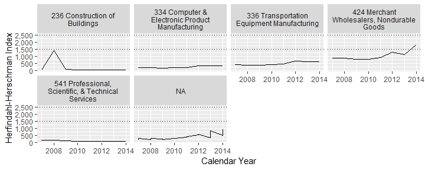
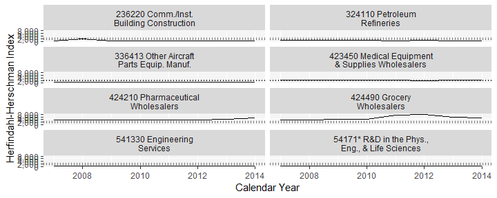
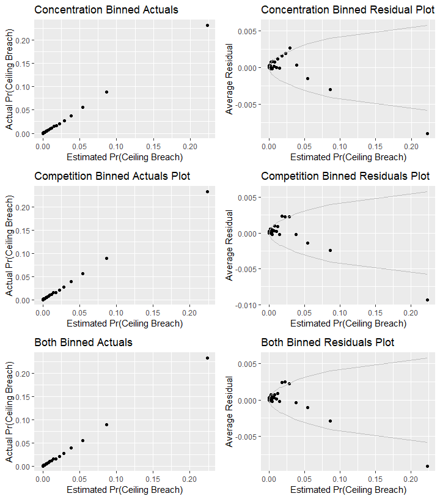

#Setup
First we load the data. The dataset used is a U.S. Defense Contracting dataset derived from   FPDS.


```
## Warning: replacing previous import 'Hmisc::summarize' by 'dplyr::summarize'
## when loading 'csis360'
```

```
## Warning: replacing previous import 'Hmisc::src' by 'dplyr::src' when
## loading 'csis360'
```

```
## Warning: replacing previous import 'dplyr::intersect' by
## 'lubridate::intersect' when loading 'csis360'
```

```
## Warning: replacing previous import 'dplyr::union' by 'lubridate::union'
## when loading 'csis360'
```

```
## Warning: replacing previous import 'dplyr::setdiff' by 'lubridate::setdiff'
## when loading 'csis360'
```

```
## 
## Attaching package: 'dplyr'
```

```
## The following objects are masked from 'package:stats':
## 
##     filter, lag
```

```
## The following objects are masked from 'package:base':
## 
##     intersect, setdiff, setequal, union
```

```
## Loading required package: MASS
```

```
## 
## Attaching package: 'MASS'
```

```
## The following object is masked from 'package:dplyr':
## 
##     select
```

```
## Loading required package: Matrix
```

```
## Loading required package: lme4
```

```
## 
## arm (Version 1.10-1, built: 2018-4-12)
```

```
## Working directory is C:/Users/gsand/Repositories/Vendor/analysis
```

```
## 
## Please cite as:
```

```
##  Hlavac, Marek (2018). stargazer: Well-Formatted Regression and Summary Statistics Tables.
```

```
##  R package version 5.2.2. https://CRAN.R-project.org/package=stargazer
```

```
## Version:  1.36.23
## Date:     2017-03-03
## Author:   Philip Leifeld (University of Glasgow)
## 
## Please cite the JSS article in your publications -- see citation("texreg").
```

```
## 
## Attaching package: 'texreg'
```

```
## The following object is masked from 'package:arm':
## 
##     coefplot
```

```
## Warning: package 'svglite' was built under R version 3.6.3
```

```
## Loading required package: carData
```

```
## Registered S3 methods overwritten by 'car':
##   method                          from
##   influence.merMod                lme4
##   cooks.distance.influence.merMod lme4
##   dfbeta.influence.merMod         lme4
##   dfbetas.influence.merMod        lme4
```

```
## 
## Attaching package: 'car'
```

```
## The following object is masked from 'package:arm':
## 
##     logit
```

```
## The following object is masked from 'package:dplyr':
## 
##     recode
```

```
## 
## Attaching package: 'scales'
```

```
## The following object is masked from 'package:arm':
## 
##     rescale
```

```
## [1] 56000
```


## Data Exploration

### Economic
#### NAICS 2


```r
#Prepare data for plot
NAICS2_Freq <- as.data.frame(table(def$NAICS2))
NAICS2_Freq$Percent_Freq <- round(NAICS2_Freq$Freq/sum(NAICS2_Freq$Freq),4)*100
colnames(NAICS2_Freq) <- c("NAICS_Code", "Count_Freq", "Percent_Freq")

#Get detail description for NAICS2 code
NAICS2_Freq<-read_and_join_experiment(NAICS2_Freq,
                                           lookup_file = "Lookup_PrincipalNAICScode.csv",
                                      path="https://raw.githubusercontent.com/CSISdefense/Lookup-Tables/master/",
                                      dir="economic\\",
                                      by=c("NAICS_Code"="principalnaicscode"),
                                      add_var = "principalnaicscodeText"
                                      )
```

```
## Parsed with column specification:
## cols(
##   principalnaicscode = col_character(),
##   principalnaicscodeText = col_character(),
##   principalNAICS2DigitCode = col_double(),
##   principalNAICS3DigitCode = col_double(),
##   principalNAICS4DigitCode = col_double(),
##   NAICS_shorthand = col_character()
## )
```

```
## Warning: Column `NAICS_Code`/`principalnaicscode` joining factor and
## character vector, coercing into character vector
```

```r
Percent_Obli <- c()
Total_Obli <- sum(def$Action_Obligation_Then_Year, na.rm = TRUE)
for (i in NAICS2_Freq$NAICS_Code) {
  Percent_Obligation <- round(sum(def$Action_Obligation_Then_Year[def$NAICS2 == i], na.rm = TRUE)/Total_Obli,5)
  Percent_Obli <- c(Percent_Obli, Percent_Obligation)
}

NAICS2_Freq$Percent_Obli <- Percent_Obli * 100
NAICS2_Freq <- NAICS2_Freq[order(-NAICS2_Freq$Percent_Obli),]
NAICS2_Freq[,c(1,3)] <- lapply(NAICS2_Freq[,c(1,3)], function(x) as.character(x))
NAICS2_Freq$principalnaicscodeText <- paste(NAICS2_Freq$NAICS_Code, " - ", NAICS2_Freq$principalnaicscodeText)
NAICS2_Freq$principalnaicscodeText <- factor(NAICS2_Freq$principalnaicscodeText, levels = rev(NAICS2_Freq$principalnaicscodeText))
NAICS2_Freq <- melt(NAICS2_Freq, id = c("NAICS_Code", "Count_Freq","principalnaicscodeText"))
NAICS2_Freq$value <- as.numeric(NAICS2_Freq$value)

NAICS2_barplot <- ggplot(data = NAICS2_Freq,
                          aes(x = principalnaicscodeText, 
                              y = value,
                              fill = factor(variable))) +
                   geom_bar(stat = "identity", 
                            position = "dodge", 
                            width = 0.8) + 
                   coord_flip() +
                   xlab("") + 
                   ylab("") + 
                   theme_grey() + 
                   scale_fill_grey(labels = c("% records", "% obligation"),
                                  guide = guide_legend(reverse = TRUE)) + 
                   ggtitle("Percent of Frequency and obligation for NAICS2") +
                   theme(text = element_text(size = 10), 
                         legend.title = element_blank(),
                         legend.position = "bottom",
                         legend.margin = margin(t=-0.8, r=0, b=0.5, l=0, unit = "cm"),
                         legend.text = element_text(margin = margin(r=0.5, unit = "cm")),
                         plot.margin = margin(t=0.3, r=0.5, b=0, l=0.5, unit = "cm"))
NAICS2_barplot
```

<!-- -->

#### NAICS 3


```r
NAICS_summary<-def %>% group_by(NAICS3,StartCY,def3_HHI_lag1,def3_obl_lag1,def3_ratio_lag1,US3_avg_sal_lag1) %>%
  dplyr::summarise(annual_action_obligation=sum(Action_Obligation_Then_Year),
                   annual_count=length(StartCY)) 

top_NAICS <- NAICS_summary %>% group_by(NAICS3) %>% 
  dplyr::summarise(naics_action_obligation=sum(annual_action_obligation),
                   naics_count=sum(annual_count)) 
top_NAICS$naics_dollar_rank<-rank(-top_NAICS$naics_action_obligation)
top_NAICS$naics_count_rank<-rank(-top_NAICS$naics_count)

#If statement there to prevent adding it a second time in  reruns.
if(!"naics_dollar_rank" %in% colnames(NAICS_summary))
  NAICS_summary<-left_join(NAICS_summary,top_NAICS, by="NAICS3")


NAICS_summary<-as.data.frame(NAICS_summary)
NAICS_summary$NAICS3<-as.character(NAICS_summary$NAICS3)
NAICS_summary<-read_and_join_experiment(NAICS_summary,
                                      lookup_file = "Lookup_PrincipalNAICScode.csv",
                                      path="https://raw.githubusercontent.com/CSISdefense/Lookup-Tables/master/",
                                      dir="economic\\",
                                      by=c("NAICS3"="principalnaicscode"),
                                      skip_check_var=c("principalnaicscodeText",
                                                       "NAICS_shorthand",
                                                       "principalNAICS4DigitCode")
                                      )
```

```
## Parsed with column specification:
## cols(
##   principalnaicscode = col_character(),
##   principalnaicscodeText = col_character(),
##   principalNAICS2DigitCode = col_double(),
##   principalNAICS3DigitCode = col_double(),
##   principalNAICS4DigitCode = col_double(),
##   NAICS_shorthand = col_character()
## )
```

```r
# https://stackoverflow.com/questions/37174316/how-to-fit-long-text-into-ggplot2-facet-titles


# Helper function for string wrapping. 
#  20 character target width.
swr <- function(string, nwrap=20) {
  paste(strwrap(string, width=nwrap), collapse="\n")
}
swr <- Vectorize(swr)
summary(NAICS_summary$NAICS_shorthand)
```

```
##    Length     Class      Mode 
##       828 character character
```

```r
# View(NAICS_summary)
NAICS_summary$NAICS_shorthand<-swr(NAICS_summary$NAICS_shorthand,nwrap = 25)
NAICS_summary$CY<-NAICS_summary$StartCY-1
NAICS3top<-ggplot(subset(NAICS_summary,naics_dollar_rank<=4 |
                          naics_count_rank<=4),
       aes(x=CY,y=def3_HHI_lag1))+#color=NAICS_Code
  geom_line()+
  scale_y_continuous(label=scales::comma)+ 
  # scale_x_continuous(breaks=c(2006,2009,2011,2014))+
  labs(x="Calendar Year",y="Herfindahl-Herschman Index")+ 
  geom_hline(yintercept=c(1500,2500),linetype="dotted")

NAICS3top_paper<-NAICS3top+ facet_wrap(~NAICS_shorthand,ncol=2)
ggsave(NAICS3top_paper,file="..//Output\\NAICS3top.png",width=4,height=8,dpi=600)
ggsave(NAICS3top_paper,file="..//Output\\NAICS3top.eps",width=4,height=8,dpi=600)

NAICS3top_pp<-NAICS3top+ facet_wrap(~NAICS_shorthand,ncol=4)
NAICS3top_pp
```

<!-- -->

```r
ggsave(NAICS3top_pp,file="..//Output\\NAICS3top_pp.png",width=10.5,height=5.5,dpi=600)
ggsave(NAICS3top_pp,file="..//Output\\NAICS3top_pp.eps",width=10.5,height=5.5,dpi=600)

summary(NAICS_summary$naics_count_rank)
```

```
##    Min. 1st Qu.  Median    Mean 3rd Qu.    Max. 
##    1.00   26.00   52.00   52.47   78.00  109.00
```

```r
NAICS_summary$NAICS_shorthand<-swr(NAICS_summary$NAICS_shorthand,nwrap = 14)
# NAICS_summary$CY<-factor(paste("'",substring(as.character(NAICS_summary$CY),3,4),sep=""))

NAICS3top8<-ggplot(subset(NAICS_summary,naics_dollar_rank<=8),
       aes(x=CY,y=def3_HHI_lag1))+#color=NAICS_Code
  geom_line()+
  scale_y_continuous(label=scales::comma)+ 
  scale_x_continuous(breaks=c(2007,2012))+
  labs(x="Calendar Year",y="Herfindahl-Herschman Index")+ 
  geom_hline(yintercept=c(1500,2500),linetype="dotted")

NAICS3top8_wide<-NAICS3top8+ facet_grid(.~NAICS_shorthand)
ggsave(NAICS3top8_wide,file="..//Output\\NAICS3top8.png",width=9.5,height=4,dpi=600)
ggsave(NAICS3top8_wide,file="..//Output\\NAICS3top8.eps",width=9.5,height=4,dpi=600)

colnames(NAICS_summary)
```

```
##  [1] "NAICS3"                   "StartCY"                 
##  [3] "def3_HHI_lag1"            "def3_obl_lag1"           
##  [5] "def3_ratio_lag1"          "US3_avg_sal_lag1"        
##  [7] "annual_action_obligation" "annual_count"            
##  [9] "naics_action_obligation"  "naics_count"             
## [11] "naics_dollar_rank"        "naics_count_rank"        
## [13] "principalnaicscodeText"   "principalNAICS2DigitCode"
## [15] "principalNAICS3DigitCode" "principalNAICS4DigitCode"
## [17] "NAICS_shorthand"          "CY"
```

```r
NAICS_long<-NAICS_summary[,colnames(NAICS_summary) %in% c( "NAICS3",
                                                    "def3_HHI_lag1",
                                                    "def3_obl_lag1",
                                                    "def3_ratio_lag1",
                                                    # "US3_avg_sal_lag1",
                                                    "naics_dollar_rank" ,
                                                    "naics_count_rank",
                                                    "principalnaicscodeText",
                                                     "NAICS_shorthand",
                                                    "CY")]
NAICS_long<-melt(NAICS_long, id=c("NAICS3","naics_dollar_rank","naics_count_rank","principalnaicscodeText","CY", "NAICS_shorthand"))


#Drop the ratios and average salaries w/ unique values
# NAICS_long<-NAICS_long[NAICS_long$variable %in% c(),]

NAICS_long$value[NAICS_long$variable=="def3_obl_lag1"]<-NAICS_long$value[NAICS_long$variable=="def3_obl_lag1"]/1e9
NAICS_long$value[NAICS_long$variable=="def3_ratio_lag1"]<-NAICS_long$value[NAICS_long$variable=="def3_ratio_lag1"]*1e2

levels(NAICS_long$variable)<- list("Herfindahl-\nHerschman Index"=c("def3_HHI_lag1"),
                                   "Defense Obligations\n(Billions)"=c("def3_obl_lag1"),
                                   "Def. Obligations to\nU.S. Revenue Ratio\n(Percent)"=c("def3_ratio_lag1"))

NAICS_long$high<-2500
NAICS_long$high[NAICS_long$variable!="Herfindahl-\nHerschman Index"]<-NA
NAICS_long$low<-1500
NAICS_long$low[NAICS_long$variable!="Herfindahl-\nHerschman Index"]<-NA

(
NAICS3long_wide<-ggplot(subset(NAICS_long,naics_dollar_rank<=8),
       aes(x=CY,y=value))+#color=NAICS_Code
  geom_line()+
  scale_y_continuous(label=scales::comma)+ 
  scale_x_continuous(breaks=c(2007,2012))+
  labs(x="Calendar Year",y="Detailed Industry Metric")+
  geom_hline(aes(
           yintercept=high),linetype="dotted")+
  geom_hline(aes(
           yintercept=low),linetype="dotted") + 
  facet_grid(variable~NAICS_shorthand,scales="free_y")   
)
```

```
## Warning: Removed 128 rows containing missing values (geom_hline).

## Warning: Removed 128 rows containing missing values (geom_hline).
```

<!-- -->

```r
ggsave(NAICS3long_wide+theme(text=element_text(size=13)),file="..//Output\\JSCAN\\Figure2.png",width=9.5,height=6,dpi=600)
```

```
## Warning: Removed 128 rows containing missing values (geom_hline).

## Warning: Removed 128 rows containing missing values (geom_hline).
```

```r
ggsave(NAICS3long_wide+theme(text=element_text(size=13)),file="..//Output\\JSCAN\\Figure2.eps",width=9.5,height=6,dpi=600)
```

```
## Warning: Removed 128 rows containing missing values (geom_hline).

## Warning: Removed 128 rows containing missing values (geom_hline).
```

```r
ggsave(NAICS3long_wide+theme(text=element_text(size=13)),file="..//Output\\JSCAN\\Figure2.svg",width=9.5,height=6,dpi=600)
```

```
## Warning: package 'gdtools' was built under R version 3.6.3

## Warning: Removed 128 rows containing missing values (geom_hline).

## Warning: Removed 128 rows containing missing values (geom_hline).
```

```r
write.csv(NAICS_summary,file="..//Output/NAICS3_summary.csv",row.names = FALSE)
```


#### NAICS 6


```r
NAICS_summary<-def %>% group_by(NAICS,StartCY,def6_HHI_lag1,def6_obl_lag1,def6_ratio_lag1,US6_avg_sal_lag1) %>%
  dplyr::summarise(annual_action_obligation=sum(Action_Obligation_Then_Year),
                   annual_count=length(StartCY)) 

top_NAICS <- NAICS_summary %>% group_by(NAICS) %>% 
  dplyr::summarise(naics_action_obligation=sum(annual_action_obligation),
                   naics_count=sum(annual_count)) 
top_NAICS$naics_dollar_rank<-rank(-top_NAICS$naics_action_obligation)
top_NAICS$naics_count_rank<-rank(-top_NAICS$naics_count)


NAICS_summary<-left_join(NAICS_summary,top_NAICS, by="NAICS")

colnames(NAICS_summary)[colnames(NAICS_summary)=="NAICS"]<-"principalnaicscode"

NAICS_summary$principalnaicscode<-as.character(NAICS_summary$principalnaicscode)
NAICS_summary<-as.data.frame(NAICS_summary)

NAICS_summary<-read_and_join(NAICS_summary,
                        lookup_file = "Lookup_PrincipalNAICScode.csv",
                        path="https://raw.githubusercontent.com/CSISdefense/Lookup-Tables/master/",
                                      dir="economic\\",
                        by="principalnaicscode",
                        skip_check_var=c("principalnaicscodeText",
                                         "NAICS_shorthand")
               )


summary(NAICS_summary$NAICS_shorthand)
```

```
##    Length     Class      Mode 
##      8520 character character
```

```r
# View(NAICS_summary)
NAICS_summary$NAICS_shorthand<-swr(NAICS_summary$NAICS_shorthand,nwrap = 25)
NAICS_summary$CY<-NAICS_summary$StartCY-1
NAICS6top<-ggplot(subset(NAICS_summary,naics_dollar_rank<=4 |
                          naics_count_rank<=4),
       aes(x=CY,y=def6_HHI_lag1))+#color=NAICS_Code
  geom_line()+
  scale_y_continuous(label=scales::comma)+ 
  # scale_x_continuous(breaks=c(2006,2009,2011,2014))+
  labs(x="Calendar Year",y="Herfindahl-Herschman Index")+ 
  geom_hline(yintercept=c(1500,2500),linetype="dotted")

(NAICS6top_paper<-NAICS6top+ facet_wrap(~NAICS_shorthand,ncol=2))
```

<!-- -->

```r
ggsave(NAICS6top_paper,file="..//Output\\NAICS6top.png",width=4,height=8,dpi=600)
ggsave(NAICS6top_paper,file="..//Output\\NAICS6top.eps",width=4,height=8,dpi=600)

(NAICS6top_pp<-NAICS6top+ facet_wrap(~NAICS_shorthand,ncol=4))
```

<!-- -->

```r
ggsave(NAICS6top_pp,file="..//Output\\NAICS6top_pp.png",width=10.5,height=5.5,dpi=600)
ggsave(NAICS6top_pp,file="..//Output\\NAICS6top_pp.eps",width=10.5,height=5.5,dpi=600)

summary(NAICS_summary$naics_count_rank)
```

```
##    Min. 1st Qu.  Median    Mean 3rd Qu.    Max. 
##     1.0   271.0   548.0   559.4   836.5  1252.0
```

```r
NAICS_summary$NAICS_shorthand<-swr(NAICS_summary$NAICS_shorthand,nwrap = 14)
# NAICS_summary$CY<-factor(paste("'",substring(as.character(NAICS_summary$CY),3,4),sep=""))

NAICS6top8<-ggplot(subset(NAICS_summary,naics_dollar_rank<=8),
       aes(x=CY,y=def6_HHI_lag1))+#color=NAICS_Code
  geom_line()+
  scale_y_continuous(label=scales::comma)+ 
  scale_x_continuous(breaks=c(2007,2012))+
  labs(x="Calendar Year",y="Herfindahl-Herschman Index")+ 
  geom_hline(yintercept=c(1500,2500),linetype="dotted")

NAICS6top8_wide<-NAICS6top8+ facet_grid(.~NAICS_shorthand)
ggsave(NAICS6top8_wide,file="..//Output\\NAICS6top8.png",width=9.5,height=4,dpi=600)
ggsave(NAICS6top8_wide,file="..//Output\\NAICS6top8.eps",width=9.5,height=4,dpi=600)


colnames(NAICS_summary)
```

```
##  [1] "principalnaicscode"       "StartCY"                 
##  [3] "def6_HHI_lag1"            "def6_obl_lag1"           
##  [5] "def6_ratio_lag1"          "US6_avg_sal_lag1"        
##  [7] "annual_action_obligation" "annual_count"            
##  [9] "naics_action_obligation"  "naics_count"             
## [11] "naics_dollar_rank"        "naics_count_rank"        
## [13] "principalnaicscodeText"   "principalNAICS2DigitCode"
## [15] "principalNAICS3DigitCode" "principalNAICS4DigitCode"
## [17] "NAICS_shorthand"          "CY"
```

```r
NAICS_long<-NAICS_summary[,colnames(NAICS_summary) %in% c( "principalnaicscode",
                                                    "def6_HHI_lag1",
                                                    "def6_obl_lag1",
                                                    "def6_ratio_lag1",
                                                    # "US6_avg_sal_lag1",
                                                    "naics_dollar_rank" ,
                                                    "naics_count_rank",
                                                    "principalnaicscodeText",
                                                     "NAICS_shorthand",
                                                    "CY")]
NAICS_long<-melt(NAICS_long, id=c("principalnaicscode","naics_dollar_rank","naics_count_rank","principalnaicscodeText","CY", "NAICS_shorthand"))


#Drop the ratios and average salaries w/ unique values
# NAICS_long<-NAICS_long[NAICS_long$variable %in% c(),]
NAICS_long$value[NAICS_long$variable=="def6_obl_lag1"]<-NAICS_long$value[NAICS_long$variable=="def6_obl_lag1"]/1e9
NAICS_long$value[NAICS_long$variable=="def6_ratio_lag1"]<-NAICS_long$value[NAICS_long$variable=="def6_ratio_lag1"]*1e2


levels(NAICS_long$variable)<- list("Herfindahl-\nHerschman Index"=c("def6_HHI_lag1"),
                                   "Defense Obligations\n(Billions)"=c("def6_obl_lag1"),
                                   "Def. Obligations to\nU.S. Revenue Ratio\n(Percent)"=c("def6_ratio_lag1"))

NAICS_long$high<-2500
NAICS_long$high[NAICS_long$variable!="Herfindahl-\nHerschman Index"]<-NA
NAICS_long$low<-1500
NAICS_long$low[NAICS_long$variable!="Herfindahl-\nHerschman Index"]<-NA

(

NAICS6long_wide<-ggplot(subset(NAICS_long,naics_dollar_rank<=8),
       aes(x=CY,y=value))+#color=NAICS_Code
  geom_line()+
  scale_y_continuous(label=scales::comma)+ 
  scale_x_continuous(breaks=c(2007,2012))+
  labs(x="Calendar Year",y="Detailed Industry Metric")+
  geom_hline(aes(
           yintercept=high),linetype="dotted")+
  geom_hline(aes(
           yintercept=low),linetype="dotted")    + 
    facet_grid(variable~NAICS_shorthand,scales="free_y")

)
```

```
## Warning: Removed 128 rows containing missing values (geom_hline).

## Warning: Removed 128 rows containing missing values (geom_hline).
```

<!-- -->

```r
ggsave(NAICS6long_wide+theme(text=element_text(size=13)),file="..//Output\\JSCAN\\Figure3.png",width=9.5,height=6,dpi=600)
```

```
## Warning: Removed 128 rows containing missing values (geom_hline).

## Warning: Removed 128 rows containing missing values (geom_hline).
```

```r
ggsave(NAICS6long_wide+theme(text=element_text(size=13)),file="..//Output\\JSCAN\\Figure3.eps",width=9.5,height=6,dpi=600)
```

```
## Warning: Removed 128 rows containing missing values (geom_hline).

## Warning: Removed 128 rows containing missing values (geom_hline).
```

```r
ggsave(NAICS6long_wide+theme(text=element_text(size=13)),file="..//Output\\JSCAN\\Figure3.svg",width=9.5,height=6,dpi=600)
```

```
## Warning: Removed 128 rows containing missing values (geom_hline).

## Warning: Removed 128 rows containing missing values (geom_hline).
```

```r
write.csv(NAICS_summary,file="..//Output/NAICS6_summary.csv",row.names = FALSE)
```


### Office

```r
#grouped bar plot for variable Office
#Perpare data for plot
Office_Freq <- def %>% group_by(Agency, Office) %>%
  dplyr::summarise(
    Count_Freq=length(CSIScontractID),
    Action_Obligation_Then_Year=sum(Action_Obligation_Then_Year,na.rm=TRUE)
  )
```

```
## Warning: Factor `Agency` contains implicit NA, consider using
## `forcats::fct_explicit_na`
```

```
## Warning: Factor `Office` contains implicit NA, consider using
## `forcats::fct_explicit_na`
```

```r
Office_Freq$Percent_Obligation <- Office_Freq$Action_Obligation_Then_Year/
                                          sum(Office_Freq$Action_Obligation_Then_Year,na.rm=TRUE)

Office_Freq$Percent_Freq <- Office_Freq$Count_Freq/
                                          sum(Office_Freq$Count_Freq,na.rm=TRUE)

#get the detailed desceription for Office by AgencyID and OfficeID

Office_Freq<-read_and_join_experiment(Office_Freq,
                                      lookup_file = "Office.ContractingOfficeCode.txt",
                                      path="https://raw.githubusercontent.com/CSISdefense/Lookup-Tables/master/",
                                      dir="office/",
                                      by=c("Agency"="AgencyID",
                                       "Office"="ContractingOfficeCode"   
                                      ),
                                      add_var = "ContractingOfficeName",
                                      skip_check_var = "ContractingOfficeName")
```

```
## Parsed with column specification:
## cols(
##   .default = col_character(),
##   DepartmentID = col_double(),
##   StartDate = col_datetime(format = ""),
##   EndDate = col_datetime(format = ""),
##   Depot = col_logical(),
##   FISC = col_logical(),
##   TFBSOrelated = col_logical(),
##   CSIScreatedDate = col_datetime(format = ""),
##   CSISmodifieddDate = col_datetime(format = ""),
##   OCOcrisisScore = col_double(),
##   OCOcrisisPercent = col_double(),
##   CrisisPercent = col_double(),
##   PlaceIntlPercent = col_double()
## )
```

```
## See spec(...) for full column specifications.
```

```
## Warning: 3 parsing failures.
##   row          col               expected actual                                                                                                         file
## 16006 DepartmentID no trailing characters     AF 'https://raw.githubusercontent.com/CSISdefense/Lookup-Tables/master/office/Office.ContractingOfficeCode.txt'
## 16808 DepartmentID no trailing characters     F  'https://raw.githubusercontent.com/CSISdefense/Lookup-Tables/master/office/Office.ContractingOfficeCode.txt'
## 46333 DepartmentID no trailing characters     AF 'https://raw.githubusercontent.com/CSISdefense/Lookup-Tables/master/office/Office.ContractingOfficeCode.txt'
```

```
## Warning in read_and_join_experiment(Office_Freq, lookup_file =
## "Office.ContractingOfficeCode.txt", : NAs found in by variable. Filtering
## them out.
```

```
## Warning: Column `Agency`/`AgencyID` joining factor and character vector,
## coercing into character vector
```

```
## Warning: Column `Office`/`ContractingOfficeCode` joining factor and
## character vector, coercing into character vector
```

```r
colnames(Office_Freq)[colnames(Office_Freq)=="ContractingOfficeName"] <- "OfficeName"

# Office_Freq[,1:2] <- lapply(Office_Freq[,1:2], function(x) as.character(x))
#Generate a new name column by Combining Office and officeName
Office_Freq$Office_Full <- ifelse(is.na(Office_Freq$OfficeName), Office_Freq$Office, 
                                  paste(Office_Freq$Office, 
                                            sep=" - ", Office_Freq$OfficeName))


# Office_Freq$Percent_Obli <- Percent_Obli * 100

Office_Freq_top10Freq <- Office_Freq[order(-Office_Freq$Percent_Freq),]
Office_Freq_top10Freq <- Office_Freq_top10Freq[1:10, ]  #including NULL category
Office_Freq_top10Obli <- Office_Freq[order(-Office_Freq$Percent_Obligation),]
Office_Freq_top10Obli <- Office_Freq_top10Obli[1:10, ]  #including NULL category

Office_Freq_TOP <- rbind(Office_Freq_top10Obli, Office_Freq_top10Freq)
Office_Freq_TOP <- unique(Office_Freq_TOP)  #17 records in total

Office_Freq_TOP$Office_Full <- factor(Office_Freq_TOP$Office_Full, 
                                      levels = rev(Office_Freq_TOP$Office_Full))
Office_Freq_TOP <- melt(Office_Freq_TOP, 
                        id = c("Agency","Office", "OfficeName", "Office_Full", "Count_Freq", "Action_Obligation_Then_Year"))

Office_barplot <- ggplot(data = Office_Freq_TOP,
                         aes(x = Office_Full, 
                             y = value,
                             fill = factor(variable))) +
                  geom_bar(stat = "identity", 
                  position = "dodge", 
                  width = 0.8) + 
                  coord_flip() +
                  xlab("") + 
                  ylab("") + 
                  theme_grey() + 
                  scale_fill_grey(labels = c("% of records", "% of obligation"),
                                  guide = guide_legend(reverse = TRUE)) + 
                  ggtitle("Percent of Frequency and obligation for Office") +
                  theme(text = element_text(size = 10), 
                        legend.title = element_blank(),
                        legend.position = "bottom",
                        legend.margin = margin(t=-0.8, r=0, b=0.5, l=0, unit = "cm"),
                        legend.text = element_text(margin = margin(r=0.5, unit = "cm")), 
                        plot.margin = margin(t=0.3, r=0.5, b=0, l=0.5, unit = "cm"))
Office_barplot
```

<!-- -->


### Platform Portfolio

```r
library(readr)
```

```
## 
## Attaching package: 'readr'
```

```
## The following object is masked from 'package:scales':
## 
##     col_factor
```

```r
annual_platform_summary<-read_csv(file="..//Output//annual_platform_summary.csv")
```

```
## Parsed with column specification:
## cols(
##   platformPortfolio = col_character(),
##   Fiscal.Year = col_double(),
##   Action_Obligation = col_double(),
##   vendor_count = col_double(),
##   hh_index = col_double(),
##   top4 = col_double(),
##   top8 = col_double(),
##   top12 = col_double(),
##   top20 = col_double(),
##   top50 = col_double()
## )
```

```r
colnames(annual_platform_summary)[colnames(annual_platform_summary)=="platformPortfolio"]<-"PlatformPortfolio"

platform_no_na<-subset(annual_platform_summary,!is.na(PlatformPortfolio))
labels_and_colors<-csis360::prepare_labels_and_colors(platform_no_na,"PlatformPortfolio")
```

```
## Parsed with column specification:
## cols(
##   column = col_character(),
##   coloration.key = col_character(),
##   title = col_character(),
##   share.title = col_character(),
##   period.title = col_logical(),
##   is.colon.split = col_logical()
## )
```

```
## Warning in csis360::prepare_labels_and_colors(platform_no_na,
## "PlatformPortfolio"): PlatformPortfolio
```

```r
platform_no_na$plat_short <-swr(platform_no_na$PlatformPortfolio,nwrap = 21)
platform_no_na<-subset(platform_no_na,Fiscal.Year>=2000 & Fiscal.Year<=2017)

 

# plat<-ggplot(platform_no_na,
#        aes(x=Fiscal.Year,y=hh_index))+#color=NAICS_Code
#   geom_line()+
#   scale_y_continuous(label=scales::comma)+ 
#   # scale_x_continuous(breaks=c(2006,2009,2011,2014))+
#   labs(x="Fiscal Year",y="Herfindahl-Herschman Index")+ 
#   geom_hline(yintercept=c(1500,2500),linetype="dotted")+
#   facet_wrap(~plat_short)
# add_preassigned_scales(plat,labels_and_colors = labels_and_colors)

# str(platform_no_na)
# summary(platform_no_na$Fiscal.Year)
#
# undebug(add_preassigned_scales)
plat<-build_plot(
  data=platform_no_na,
  chart_geom = "Line Chart",
  share = FALSE,
  x_var="Fiscal.Year",
  y_var="hh_index", #Name of variable to plot on y-axis
  color_var="PlatformPortfolio",       # name of coloration variable, as string
  facet_var="PlatformPortfolio",        # name of facet variable, as string
  legend=FALSE, #Include a legend
  caption=FALSE, #Include a source caption
  labels_and_colors=labels_and_colors,
  column_key=NULL
)


# add_preassigned_scales(plat, labels_and_colors,  var="PlatformPortfolio"

plat<-plat+geom_hline(yintercept=c(1500,2500),linetype="dotted")+
  labs(x="Fiscal Year",y="Herfindahl-Herschman Indetx")
plat
```

```
## Warning in grid.Call(C_stringMetric, as.graphicsAnnot(x$label)): font
## family not found in Windows font database
```

```
## Warning in grid.Call(C_textBounds, as.graphicsAnnot(x$label), x$x, x$y, :
## font family not found in Windows font database
```

```
## Warning in grid.Call(C_stringMetric, as.graphicsAnnot(x$label)): font
## family not found in Windows font database
```

```
## Warning in grid.Call(C_textBounds, as.graphicsAnnot(x$label), x$x, x$y, :
## font family not found in Windows font database

## Warning in grid.Call(C_textBounds, as.graphicsAnnot(x$label), x$x, x$y, :
## font family not found in Windows font database

## Warning in grid.Call(C_textBounds, as.graphicsAnnot(x$label), x$x, x$y, :
## font family not found in Windows font database
```

```
## Warning in grid.Call.graphics(C_text, as.graphicsAnnot(x$label), x$x,
## x$y, : font family not found in Windows font database
```

<!-- -->

```r
ggsave(plat+geom_line(aes(x=Fiscal.Year,y=hh_index,color=PlatformPortfolio),size=1),filename="..//Output//platform_hhi.png",height=3.25, width=6.5)
```

```
## Warning in grid.Call(C_textBounds, as.graphicsAnnot(x$label), x$x, x$y, :
## font family not found in Windows font database
```

```
## Warning in grid.Call(C_textBounds, as.graphicsAnnot(x$label), x$x, x$y, :
## font family not found in Windows font database

## Warning in grid.Call(C_textBounds, as.graphicsAnnot(x$label), x$x, x$y, :
## font family not found in Windows font database

## Warning in grid.Call(C_textBounds, as.graphicsAnnot(x$label), x$x, x$y, :
## font family not found in Windows font database
```

```
## Warning in grid.Call.graphics(C_text, as.graphicsAnnot(x$label), x$x,
## x$y, : font family not found in Windows font database
```

```r
ggsave(plat+geom_line(aes(x=Fiscal.Year,y=hh_index)),filename="..//Output//platform_hhi_bw.png",height=3.25, width=6.5)
```

```
## Warning in grid.Call(C_textBounds, as.graphicsAnnot(x$label), x$x, x$y, :
## font family not found in Windows font database
```

```
## Warning in grid.Call(C_textBounds, as.graphicsAnnot(x$label), x$x, x$y, :
## font family not found in Windows font database

## Warning in grid.Call(C_textBounds, as.graphicsAnnot(x$label), x$x, x$y, :
## font family not found in Windows font database

## Warning in grid.Call(C_textBounds, as.graphicsAnnot(x$label), x$x, x$y, :
## font family not found in Windows font database
```

```
## Warning in grid.Call.graphics(C_text, as.graphicsAnnot(x$label), x$x,
## x$y, : font family not found in Windows font database
```

```r
ggsave(plat+geom_line(aes(x=Fiscal.Year,y=hh_index,color=PlatformPortfolio),size=1),filename="..//Output//platform_hhi.eps",height=3.25, width=6.5)
```

```
## Warning in grid.Call(C_stringMetric, as.graphicsAnnot(x$label)): font
## family 'Open Sans' not found in PostScript font database
```

```
## Warning in grid.Call(C_stringMetric, as.graphicsAnnot(x$label)): font
## family 'Open Sans' not found in PostScript font database

## Warning in grid.Call(C_stringMetric, as.graphicsAnnot(x$label)): font
## family 'Open Sans' not found in PostScript font database

## Warning in grid.Call(C_stringMetric, as.graphicsAnnot(x$label)): font
## family 'Open Sans' not found in PostScript font database

## Warning in grid.Call(C_stringMetric, as.graphicsAnnot(x$label)): font
## family 'Open Sans' not found in PostScript font database

## Warning in grid.Call(C_stringMetric, as.graphicsAnnot(x$label)): font
## family 'Open Sans' not found in PostScript font database

## Warning in grid.Call(C_stringMetric, as.graphicsAnnot(x$label)): font
## family 'Open Sans' not found in PostScript font database

## Warning in grid.Call(C_stringMetric, as.graphicsAnnot(x$label)): font
## family 'Open Sans' not found in PostScript font database

## Warning in grid.Call(C_stringMetric, as.graphicsAnnot(x$label)): font
## family 'Open Sans' not found in PostScript font database

## Warning in grid.Call(C_stringMetric, as.graphicsAnnot(x$label)): font
## family 'Open Sans' not found in PostScript font database

## Warning in grid.Call(C_stringMetric, as.graphicsAnnot(x$label)): font
## family 'Open Sans' not found in PostScript font database

## Warning in grid.Call(C_stringMetric, as.graphicsAnnot(x$label)): font
## family 'Open Sans' not found in PostScript font database

## Warning in grid.Call(C_stringMetric, as.graphicsAnnot(x$label)): font
## family 'Open Sans' not found in PostScript font database

## Warning in grid.Call(C_stringMetric, as.graphicsAnnot(x$label)): font
## family 'Open Sans' not found in PostScript font database
```

```
## Warning in grid.Call(C_textBounds, as.graphicsAnnot(x$label), x$x, x$y, :
## font family 'Open Sans' not found in PostScript font database

## Warning in grid.Call(C_textBounds, as.graphicsAnnot(x$label), x$x, x$y, :
## font family 'Open Sans' not found in PostScript font database

## Warning in grid.Call(C_textBounds, as.graphicsAnnot(x$label), x$x, x$y, :
## font family 'Open Sans' not found in PostScript font database

## Warning in grid.Call(C_textBounds, as.graphicsAnnot(x$label), x$x, x$y, :
## font family 'Open Sans' not found in PostScript font database

## Warning in grid.Call(C_textBounds, as.graphicsAnnot(x$label), x$x, x$y, :
## font family 'Open Sans' not found in PostScript font database

## Warning in grid.Call(C_textBounds, as.graphicsAnnot(x$label), x$x, x$y, :
## font family 'Open Sans' not found in PostScript font database

## Warning in grid.Call(C_textBounds, as.graphicsAnnot(x$label), x$x, x$y, :
## font family 'Open Sans' not found in PostScript font database

## Warning in grid.Call(C_textBounds, as.graphicsAnnot(x$label), x$x, x$y, :
## font family 'Open Sans' not found in PostScript font database

## Warning in grid.Call(C_textBounds, as.graphicsAnnot(x$label), x$x, x$y, :
## font family 'Open Sans' not found in PostScript font database

## Warning in grid.Call(C_textBounds, as.graphicsAnnot(x$label), x$x, x$y, :
## font family 'Open Sans' not found in PostScript font database

## Warning in grid.Call(C_textBounds, as.graphicsAnnot(x$label), x$x, x$y, :
## font family 'Open Sans' not found in PostScript font database

## Warning in grid.Call(C_textBounds, as.graphicsAnnot(x$label), x$x, x$y, :
## font family 'Open Sans' not found in PostScript font database

## Warning in grid.Call(C_textBounds, as.graphicsAnnot(x$label), x$x, x$y, :
## font family 'Open Sans' not found in PostScript font database

## Warning in grid.Call(C_textBounds, as.graphicsAnnot(x$label), x$x, x$y, :
## font family 'Open Sans' not found in PostScript font database

## Warning in grid.Call(C_textBounds, as.graphicsAnnot(x$label), x$x, x$y, :
## font family 'Open Sans' not found in PostScript font database

## Warning in grid.Call(C_textBounds, as.graphicsAnnot(x$label), x$x, x$y, :
## font family 'Open Sans' not found in PostScript font database

## Warning in grid.Call(C_textBounds, as.graphicsAnnot(x$label), x$x, x$y, :
## font family 'Open Sans' not found in PostScript font database

## Warning in grid.Call(C_textBounds, as.graphicsAnnot(x$label), x$x, x$y, :
## font family 'Open Sans' not found in PostScript font database

## Warning in grid.Call(C_textBounds, as.graphicsAnnot(x$label), x$x, x$y, :
## font family 'Open Sans' not found in PostScript font database

## Warning in grid.Call(C_textBounds, as.graphicsAnnot(x$label), x$x, x$y, :
## font family 'Open Sans' not found in PostScript font database

## Warning in grid.Call(C_textBounds, as.graphicsAnnot(x$label), x$x, x$y, :
## font family 'Open Sans' not found in PostScript font database

## Warning in grid.Call(C_textBounds, as.graphicsAnnot(x$label), x$x, x$y, :
## font family 'Open Sans' not found in PostScript font database

## Warning in grid.Call(C_textBounds, as.graphicsAnnot(x$label), x$x, x$y, :
## font family 'Open Sans' not found in PostScript font database

## Warning in grid.Call(C_textBounds, as.graphicsAnnot(x$label), x$x, x$y, :
## font family 'Open Sans' not found in PostScript font database

## Warning in grid.Call(C_textBounds, as.graphicsAnnot(x$label), x$x, x$y, :
## font family 'Open Sans' not found in PostScript font database

## Warning in grid.Call(C_textBounds, as.graphicsAnnot(x$label), x$x, x$y, :
## font family 'Open Sans' not found in PostScript font database

## Warning in grid.Call(C_textBounds, as.graphicsAnnot(x$label), x$x, x$y, :
## font family 'Open Sans' not found in PostScript font database

## Warning in grid.Call(C_textBounds, as.graphicsAnnot(x$label), x$x, x$y, :
## font family 'Open Sans' not found in PostScript font database

## Warning in grid.Call(C_textBounds, as.graphicsAnnot(x$label), x$x, x$y, :
## font family 'Open Sans' not found in PostScript font database

## Warning in grid.Call(C_textBounds, as.graphicsAnnot(x$label), x$x, x$y, :
## font family 'Open Sans' not found in PostScript font database

## Warning in grid.Call(C_textBounds, as.graphicsAnnot(x$label), x$x, x$y, :
## font family 'Open Sans' not found in PostScript font database

## Warning in grid.Call(C_textBounds, as.graphicsAnnot(x$label), x$x, x$y, :
## font family 'Open Sans' not found in PostScript font database

## Warning in grid.Call(C_textBounds, as.graphicsAnnot(x$label), x$x, x$y, :
## font family 'Open Sans' not found in PostScript font database

## Warning in grid.Call(C_textBounds, as.graphicsAnnot(x$label), x$x, x$y, :
## font family 'Open Sans' not found in PostScript font database

## Warning in grid.Call(C_textBounds, as.graphicsAnnot(x$label), x$x, x$y, :
## font family 'Open Sans' not found in PostScript font database

## Warning in grid.Call(C_textBounds, as.graphicsAnnot(x$label), x$x, x$y, :
## font family 'Open Sans' not found in PostScript font database

## Warning in grid.Call(C_textBounds, as.graphicsAnnot(x$label), x$x, x$y, :
## font family 'Open Sans' not found in PostScript font database

## Warning in grid.Call(C_textBounds, as.graphicsAnnot(x$label), x$x, x$y, :
## font family 'Open Sans' not found in PostScript font database

## Warning in grid.Call(C_textBounds, as.graphicsAnnot(x$label), x$x, x$y, :
## font family 'Open Sans' not found in PostScript font database

## Warning in grid.Call(C_textBounds, as.graphicsAnnot(x$label), x$x, x$y, :
## font family 'Open Sans' not found in PostScript font database

## Warning in grid.Call(C_textBounds, as.graphicsAnnot(x$label), x$x, x$y, :
## font family 'Open Sans' not found in PostScript font database

## Warning in grid.Call(C_textBounds, as.graphicsAnnot(x$label), x$x, x$y, :
## font family 'Open Sans' not found in PostScript font database

## Warning in grid.Call(C_textBounds, as.graphicsAnnot(x$label), x$x, x$y, :
## font family 'Open Sans' not found in PostScript font database

## Warning in grid.Call(C_textBounds, as.graphicsAnnot(x$label), x$x, x$y, :
## font family 'Open Sans' not found in PostScript font database

## Warning in grid.Call(C_textBounds, as.graphicsAnnot(x$label), x$x, x$y, :
## font family 'Open Sans' not found in PostScript font database

## Warning in grid.Call(C_textBounds, as.graphicsAnnot(x$label), x$x, x$y, :
## font family 'Open Sans' not found in PostScript font database

## Warning in grid.Call(C_textBounds, as.graphicsAnnot(x$label), x$x, x$y, :
## font family 'Open Sans' not found in PostScript font database

## Warning in grid.Call(C_textBounds, as.graphicsAnnot(x$label), x$x, x$y, :
## font family 'Open Sans' not found in PostScript font database

## Warning in grid.Call(C_textBounds, as.graphicsAnnot(x$label), x$x, x$y, :
## font family 'Open Sans' not found in PostScript font database

## Warning in grid.Call(C_textBounds, as.graphicsAnnot(x$label), x$x, x$y, :
## font family 'Open Sans' not found in PostScript font database

## Warning in grid.Call(C_textBounds, as.graphicsAnnot(x$label), x$x, x$y, :
## font family 'Open Sans' not found in PostScript font database

## Warning in grid.Call(C_textBounds, as.graphicsAnnot(x$label), x$x, x$y, :
## font family 'Open Sans' not found in PostScript font database

## Warning in grid.Call(C_textBounds, as.graphicsAnnot(x$label), x$x, x$y, :
## font family 'Open Sans' not found in PostScript font database

## Warning in grid.Call(C_textBounds, as.graphicsAnnot(x$label), x$x, x$y, :
## font family 'Open Sans' not found in PostScript font database

## Warning in grid.Call(C_textBounds, as.graphicsAnnot(x$label), x$x, x$y, :
## font family 'Open Sans' not found in PostScript font database

## Warning in grid.Call(C_textBounds, as.graphicsAnnot(x$label), x$x, x$y, :
## font family 'Open Sans' not found in PostScript font database

## Warning in grid.Call(C_textBounds, as.graphicsAnnot(x$label), x$x, x$y, :
## font family 'Open Sans' not found in PostScript font database

## Warning in grid.Call(C_textBounds, as.graphicsAnnot(x$label), x$x, x$y, :
## font family 'Open Sans' not found in PostScript font database

## Warning in grid.Call(C_textBounds, as.graphicsAnnot(x$label), x$x, x$y, :
## font family 'Open Sans' not found in PostScript font database

## Warning in grid.Call(C_textBounds, as.graphicsAnnot(x$label), x$x, x$y, :
## font family 'Open Sans' not found in PostScript font database

## Warning in grid.Call(C_textBounds, as.graphicsAnnot(x$label), x$x, x$y, :
## font family 'Open Sans' not found in PostScript font database

## Warning in grid.Call(C_textBounds, as.graphicsAnnot(x$label), x$x, x$y, :
## font family 'Open Sans' not found in PostScript font database

## Warning in grid.Call(C_textBounds, as.graphicsAnnot(x$label), x$x, x$y, :
## font family 'Open Sans' not found in PostScript font database

## Warning in grid.Call(C_textBounds, as.graphicsAnnot(x$label), x$x, x$y, :
## font family 'Open Sans' not found in PostScript font database

## Warning in grid.Call(C_textBounds, as.graphicsAnnot(x$label), x$x, x$y, :
## font family 'Open Sans' not found in PostScript font database

## Warning in grid.Call(C_textBounds, as.graphicsAnnot(x$label), x$x, x$y, :
## font family 'Open Sans' not found in PostScript font database

## Warning in grid.Call(C_textBounds, as.graphicsAnnot(x$label), x$x, x$y, :
## font family 'Open Sans' not found in PostScript font database

## Warning in grid.Call(C_textBounds, as.graphicsAnnot(x$label), x$x, x$y, :
## font family 'Open Sans' not found in PostScript font database

## Warning in grid.Call(C_textBounds, as.graphicsAnnot(x$label), x$x, x$y, :
## font family 'Open Sans' not found in PostScript font database

## Warning in grid.Call(C_textBounds, as.graphicsAnnot(x$label), x$x, x$y, :
## font family 'Open Sans' not found in PostScript font database

## Warning in grid.Call(C_textBounds, as.graphicsAnnot(x$label), x$x, x$y, :
## font family 'Open Sans' not found in PostScript font database

## Warning in grid.Call(C_textBounds, as.graphicsAnnot(x$label), x$x, x$y, :
## font family 'Open Sans' not found in PostScript font database

## Warning in grid.Call(C_textBounds, as.graphicsAnnot(x$label), x$x, x$y, :
## font family 'Open Sans' not found in PostScript font database

## Warning in grid.Call(C_textBounds, as.graphicsAnnot(x$label), x$x, x$y, :
## font family 'Open Sans' not found in PostScript font database

## Warning in grid.Call(C_textBounds, as.graphicsAnnot(x$label), x$x, x$y, :
## font family 'Open Sans' not found in PostScript font database

## Warning in grid.Call(C_textBounds, as.graphicsAnnot(x$label), x$x, x$y, :
## font family 'Open Sans' not found in PostScript font database

## Warning in grid.Call(C_textBounds, as.graphicsAnnot(x$label), x$x, x$y, :
## font family 'Open Sans' not found in PostScript font database

## Warning in grid.Call(C_textBounds, as.graphicsAnnot(x$label), x$x, x$y, :
## font family 'Open Sans' not found in PostScript font database

## Warning in grid.Call(C_textBounds, as.graphicsAnnot(x$label), x$x, x$y, :
## font family 'Open Sans' not found in PostScript font database

## Warning in grid.Call(C_textBounds, as.graphicsAnnot(x$label), x$x, x$y, :
## font family 'Open Sans' not found in PostScript font database

## Warning in grid.Call(C_textBounds, as.graphicsAnnot(x$label), x$x, x$y, :
## font family 'Open Sans' not found in PostScript font database

## Warning in grid.Call(C_textBounds, as.graphicsAnnot(x$label), x$x, x$y, :
## font family 'Open Sans' not found in PostScript font database
```

```
## Warning in grid.Call(C_stringMetric, as.graphicsAnnot(x$label)): font
## family 'Open Sans' not found in PostScript font database

## Warning in grid.Call(C_stringMetric, as.graphicsAnnot(x$label)): font
## family 'Open Sans' not found in PostScript font database

## Warning in grid.Call(C_stringMetric, as.graphicsAnnot(x$label)): font
## family 'Open Sans' not found in PostScript font database

## Warning in grid.Call(C_stringMetric, as.graphicsAnnot(x$label)): font
## family 'Open Sans' not found in PostScript font database

## Warning in grid.Call(C_stringMetric, as.graphicsAnnot(x$label)): font
## family 'Open Sans' not found in PostScript font database

## Warning in grid.Call(C_stringMetric, as.graphicsAnnot(x$label)): font
## family 'Open Sans' not found in PostScript font database

## Warning in grid.Call(C_stringMetric, as.graphicsAnnot(x$label)): font
## family 'Open Sans' not found in PostScript font database

## Warning in grid.Call(C_stringMetric, as.graphicsAnnot(x$label)): font
## family 'Open Sans' not found in PostScript font database

## Warning in grid.Call(C_stringMetric, as.graphicsAnnot(x$label)): font
## family 'Open Sans' not found in PostScript font database

## Warning in grid.Call(C_stringMetric, as.graphicsAnnot(x$label)): font
## family 'Open Sans' not found in PostScript font database

## Warning in grid.Call(C_stringMetric, as.graphicsAnnot(x$label)): font
## family 'Open Sans' not found in PostScript font database

## Warning in grid.Call(C_stringMetric, as.graphicsAnnot(x$label)): font
## family 'Open Sans' not found in PostScript font database

## Warning in grid.Call(C_stringMetric, as.graphicsAnnot(x$label)): font
## family 'Open Sans' not found in PostScript font database

## Warning in grid.Call(C_stringMetric, as.graphicsAnnot(x$label)): font
## family 'Open Sans' not found in PostScript font database
```

```
## Warning in grid.Call(C_textBounds, as.graphicsAnnot(x$label), x$x, x$y, :
## font family 'Open Sans' not found in PostScript font database

## Warning in grid.Call(C_textBounds, as.graphicsAnnot(x$label), x$x, x$y, :
## font family 'Open Sans' not found in PostScript font database

## Warning in grid.Call(C_textBounds, as.graphicsAnnot(x$label), x$x, x$y, :
## font family 'Open Sans' not found in PostScript font database

## Warning in grid.Call(C_textBounds, as.graphicsAnnot(x$label), x$x, x$y, :
## font family 'Open Sans' not found in PostScript font database

## Warning in grid.Call(C_textBounds, as.graphicsAnnot(x$label), x$x, x$y, :
## font family 'Open Sans' not found in PostScript font database

## Warning in grid.Call(C_textBounds, as.graphicsAnnot(x$label), x$x, x$y, :
## font family 'Open Sans' not found in PostScript font database

## Warning in grid.Call(C_textBounds, as.graphicsAnnot(x$label), x$x, x$y, :
## font family 'Open Sans' not found in PostScript font database

## Warning in grid.Call(C_textBounds, as.graphicsAnnot(x$label), x$x, x$y, :
## font family 'Open Sans' not found in PostScript font database

## Warning in grid.Call(C_textBounds, as.graphicsAnnot(x$label), x$x, x$y, :
## font family 'Open Sans' not found in PostScript font database

## Warning in grid.Call(C_textBounds, as.graphicsAnnot(x$label), x$x, x$y, :
## font family 'Open Sans' not found in PostScript font database

## Warning in grid.Call(C_textBounds, as.graphicsAnnot(x$label), x$x, x$y, :
## font family 'Open Sans' not found in PostScript font database

## Warning in grid.Call(C_textBounds, as.graphicsAnnot(x$label), x$x, x$y, :
## font family 'Open Sans' not found in PostScript font database

## Warning in grid.Call(C_textBounds, as.graphicsAnnot(x$label), x$x, x$y, :
## font family 'Open Sans' not found in PostScript font database

## Warning in grid.Call(C_textBounds, as.graphicsAnnot(x$label), x$x, x$y, :
## font family 'Open Sans' not found in PostScript font database

## Warning in grid.Call(C_textBounds, as.graphicsAnnot(x$label), x$x, x$y, :
## font family 'Open Sans' not found in PostScript font database

## Warning in grid.Call(C_textBounds, as.graphicsAnnot(x$label), x$x, x$y, :
## font family 'Open Sans' not found in PostScript font database

## Warning in grid.Call(C_textBounds, as.graphicsAnnot(x$label), x$x, x$y, :
## font family 'Open Sans' not found in PostScript font database

## Warning in grid.Call(C_textBounds, as.graphicsAnnot(x$label), x$x, x$y, :
## font family 'Open Sans' not found in PostScript font database

## Warning in grid.Call(C_textBounds, as.graphicsAnnot(x$label), x$x, x$y, :
## font family 'Open Sans' not found in PostScript font database

## Warning in grid.Call(C_textBounds, as.graphicsAnnot(x$label), x$x, x$y, :
## font family 'Open Sans' not found in PostScript font database

## Warning in grid.Call(C_textBounds, as.graphicsAnnot(x$label), x$x, x$y, :
## font family 'Open Sans' not found in PostScript font database

## Warning in grid.Call(C_textBounds, as.graphicsAnnot(x$label), x$x, x$y, :
## font family 'Open Sans' not found in PostScript font database

## Warning in grid.Call(C_textBounds, as.graphicsAnnot(x$label), x$x, x$y, :
## font family 'Open Sans' not found in PostScript font database

## Warning in grid.Call(C_textBounds, as.graphicsAnnot(x$label), x$x, x$y, :
## font family 'Open Sans' not found in PostScript font database

## Warning in grid.Call(C_textBounds, as.graphicsAnnot(x$label), x$x, x$y, :
## font family 'Open Sans' not found in PostScript font database

## Warning in grid.Call(C_textBounds, as.graphicsAnnot(x$label), x$x, x$y, :
## font family 'Open Sans' not found in PostScript font database

## Warning in grid.Call(C_textBounds, as.graphicsAnnot(x$label), x$x, x$y, :
## font family 'Open Sans' not found in PostScript font database

## Warning in grid.Call(C_textBounds, as.graphicsAnnot(x$label), x$x, x$y, :
## font family 'Open Sans' not found in PostScript font database

## Warning in grid.Call(C_textBounds, as.graphicsAnnot(x$label), x$x, x$y, :
## font family 'Open Sans' not found in PostScript font database

## Warning in grid.Call(C_textBounds, as.graphicsAnnot(x$label), x$x, x$y, :
## font family 'Open Sans' not found in PostScript font database

## Warning in grid.Call(C_textBounds, as.graphicsAnnot(x$label), x$x, x$y, :
## font family 'Open Sans' not found in PostScript font database

## Warning in grid.Call(C_textBounds, as.graphicsAnnot(x$label), x$x, x$y, :
## font family 'Open Sans' not found in PostScript font database

## Warning in grid.Call(C_textBounds, as.graphicsAnnot(x$label), x$x, x$y, :
## font family 'Open Sans' not found in PostScript font database

## Warning in grid.Call(C_textBounds, as.graphicsAnnot(x$label), x$x, x$y, :
## font family 'Open Sans' not found in PostScript font database

## Warning in grid.Call(C_textBounds, as.graphicsAnnot(x$label), x$x, x$y, :
## font family 'Open Sans' not found in PostScript font database

## Warning in grid.Call(C_textBounds, as.graphicsAnnot(x$label), x$x, x$y, :
## font family 'Open Sans' not found in PostScript font database

## Warning in grid.Call(C_textBounds, as.graphicsAnnot(x$label), x$x, x$y, :
## font family 'Open Sans' not found in PostScript font database

## Warning in grid.Call(C_textBounds, as.graphicsAnnot(x$label), x$x, x$y, :
## font family 'Open Sans' not found in PostScript font database

## Warning in grid.Call(C_textBounds, as.graphicsAnnot(x$label), x$x, x$y, :
## font family 'Open Sans' not found in PostScript font database

## Warning in grid.Call(C_textBounds, as.graphicsAnnot(x$label), x$x, x$y, :
## font family 'Open Sans' not found in PostScript font database

## Warning in grid.Call(C_textBounds, as.graphicsAnnot(x$label), x$x, x$y, :
## font family 'Open Sans' not found in PostScript font database

## Warning in grid.Call(C_textBounds, as.graphicsAnnot(x$label), x$x, x$y, :
## font family 'Open Sans' not found in PostScript font database

## Warning in grid.Call(C_textBounds, as.graphicsAnnot(x$label), x$x, x$y, :
## font family 'Open Sans' not found in PostScript font database

## Warning in grid.Call(C_textBounds, as.graphicsAnnot(x$label), x$x, x$y, :
## font family 'Open Sans' not found in PostScript font database

## Warning in grid.Call(C_textBounds, as.graphicsAnnot(x$label), x$x, x$y, :
## font family 'Open Sans' not found in PostScript font database

## Warning in grid.Call(C_textBounds, as.graphicsAnnot(x$label), x$x, x$y, :
## font family 'Open Sans' not found in PostScript font database

## Warning in grid.Call(C_textBounds, as.graphicsAnnot(x$label), x$x, x$y, :
## font family 'Open Sans' not found in PostScript font database

## Warning in grid.Call(C_textBounds, as.graphicsAnnot(x$label), x$x, x$y, :
## font family 'Open Sans' not found in PostScript font database

## Warning in grid.Call(C_textBounds, as.graphicsAnnot(x$label), x$x, x$y, :
## font family 'Open Sans' not found in PostScript font database

## Warning in grid.Call(C_textBounds, as.graphicsAnnot(x$label), x$x, x$y, :
## font family 'Open Sans' not found in PostScript font database

## Warning in grid.Call(C_textBounds, as.graphicsAnnot(x$label), x$x, x$y, :
## font family 'Open Sans' not found in PostScript font database

## Warning in grid.Call(C_textBounds, as.graphicsAnnot(x$label), x$x, x$y, :
## font family 'Open Sans' not found in PostScript font database
```

```
## Warning in grid.Call.graphics(C_text, as.graphicsAnnot(x$label), x$x,
## x$y, : font family 'Open Sans' not found in PostScript font database

## Warning in grid.Call.graphics(C_text, as.graphicsAnnot(x$label), x$x,
## x$y, : font family 'Open Sans' not found in PostScript font database
```

```
## Warning in grid.Call.graphics(C_text, as.graphicsAnnot(x$label), x$x,
## x$y, : family 'Open Sans' not included in postscript() device
```

```
## Warning in grid.Call.graphics(C_text, as.graphicsAnnot(x$label), x$x,
## x$y, : font family 'Open Sans' not found in PostScript font database

## Warning in grid.Call.graphics(C_text, as.graphicsAnnot(x$label), x$x,
## x$y, : font family 'Open Sans' not found in PostScript font database

## Warning in grid.Call.graphics(C_text, as.graphicsAnnot(x$label), x$x,
## x$y, : font family 'Open Sans' not found in PostScript font database
```

```
## Warning in grid.Call.graphics(C_text, as.graphicsAnnot(x$label), x$x,
## x$y, : family 'Open Sans' not included in postscript() device
```

```
## Warning in grid.Call.graphics(C_text, as.graphicsAnnot(x$label), x$x,
## x$y, : font family 'Open Sans' not found in PostScript font database

## Warning in grid.Call.graphics(C_text, as.graphicsAnnot(x$label), x$x,
## x$y, : font family 'Open Sans' not found in PostScript font database

## Warning in grid.Call.graphics(C_text, as.graphicsAnnot(x$label), x$x,
## x$y, : font family 'Open Sans' not found in PostScript font database
```

```
## Warning in grid.Call.graphics(C_text, as.graphicsAnnot(x$label), x$x,
## x$y, : family 'Open Sans' not included in postscript() device
```

```
## Warning in grid.Call.graphics(C_text, as.graphicsAnnot(x$label), x$x,
## x$y, : font family 'Open Sans' not found in PostScript font database

## Warning in grid.Call.graphics(C_text, as.graphicsAnnot(x$label), x$x,
## x$y, : font family 'Open Sans' not found in PostScript font database

## Warning in grid.Call.graphics(C_text, as.graphicsAnnot(x$label), x$x,
## x$y, : font family 'Open Sans' not found in PostScript font database
```

```
## Warning in grid.Call.graphics(C_text, as.graphicsAnnot(x$label), x$x,
## x$y, : family 'Open Sans' not included in postscript() device
```

```
## Warning in grid.Call.graphics(C_text, as.graphicsAnnot(x$label), x$x,
## x$y, : font family 'Open Sans' not found in PostScript font database
```

```
## Warning in grid.Call(C_textBounds, as.graphicsAnnot(x$label), x$x, x$y, :
## font family 'Open Sans' not found in PostScript font database

## Warning in grid.Call(C_textBounds, as.graphicsAnnot(x$label), x$x, x$y, :
## font family 'Open Sans' not found in PostScript font database

## Warning in grid.Call(C_textBounds, as.graphicsAnnot(x$label), x$x, x$y, :
## font family 'Open Sans' not found in PostScript font database

## Warning in grid.Call(C_textBounds, as.graphicsAnnot(x$label), x$x, x$y, :
## font family 'Open Sans' not found in PostScript font database

## Warning in grid.Call(C_textBounds, as.graphicsAnnot(x$label), x$x, x$y, :
## font family 'Open Sans' not found in PostScript font database

## Warning in grid.Call(C_textBounds, as.graphicsAnnot(x$label), x$x, x$y, :
## font family 'Open Sans' not found in PostScript font database

## Warning in grid.Call(C_textBounds, as.graphicsAnnot(x$label), x$x, x$y, :
## font family 'Open Sans' not found in PostScript font database

## Warning in grid.Call(C_textBounds, as.graphicsAnnot(x$label), x$x, x$y, :
## font family 'Open Sans' not found in PostScript font database

## Warning in grid.Call(C_textBounds, as.graphicsAnnot(x$label), x$x, x$y, :
## font family 'Open Sans' not found in PostScript font database

## Warning in grid.Call(C_textBounds, as.graphicsAnnot(x$label), x$x, x$y, :
## font family 'Open Sans' not found in PostScript font database

## Warning in grid.Call(C_textBounds, as.graphicsAnnot(x$label), x$x, x$y, :
## font family 'Open Sans' not found in PostScript font database

## Warning in grid.Call(C_textBounds, as.graphicsAnnot(x$label), x$x, x$y, :
## font family 'Open Sans' not found in PostScript font database

## Warning in grid.Call(C_textBounds, as.graphicsAnnot(x$label), x$x, x$y, :
## font family 'Open Sans' not found in PostScript font database

## Warning in grid.Call(C_textBounds, as.graphicsAnnot(x$label), x$x, x$y, :
## font family 'Open Sans' not found in PostScript font database

## Warning in grid.Call(C_textBounds, as.graphicsAnnot(x$label), x$x, x$y, :
## font family 'Open Sans' not found in PostScript font database

## Warning in grid.Call(C_textBounds, as.graphicsAnnot(x$label), x$x, x$y, :
## font family 'Open Sans' not found in PostScript font database

## Warning in grid.Call(C_textBounds, as.graphicsAnnot(x$label), x$x, x$y, :
## font family 'Open Sans' not found in PostScript font database

## Warning in grid.Call(C_textBounds, as.graphicsAnnot(x$label), x$x, x$y, :
## font family 'Open Sans' not found in PostScript font database

## Warning in grid.Call(C_textBounds, as.graphicsAnnot(x$label), x$x, x$y, :
## font family 'Open Sans' not found in PostScript font database

## Warning in grid.Call(C_textBounds, as.graphicsAnnot(x$label), x$x, x$y, :
## font family 'Open Sans' not found in PostScript font database

## Warning in grid.Call(C_textBounds, as.graphicsAnnot(x$label), x$x, x$y, :
## font family 'Open Sans' not found in PostScript font database

## Warning in grid.Call(C_textBounds, as.graphicsAnnot(x$label), x$x, x$y, :
## font family 'Open Sans' not found in PostScript font database

## Warning in grid.Call(C_textBounds, as.graphicsAnnot(x$label), x$x, x$y, :
## font family 'Open Sans' not found in PostScript font database

## Warning in grid.Call(C_textBounds, as.graphicsAnnot(x$label), x$x, x$y, :
## font family 'Open Sans' not found in PostScript font database

## Warning in grid.Call(C_textBounds, as.graphicsAnnot(x$label), x$x, x$y, :
## font family 'Open Sans' not found in PostScript font database

## Warning in grid.Call(C_textBounds, as.graphicsAnnot(x$label), x$x, x$y, :
## font family 'Open Sans' not found in PostScript font database

## Warning in grid.Call(C_textBounds, as.graphicsAnnot(x$label), x$x, x$y, :
## font family 'Open Sans' not found in PostScript font database

## Warning in grid.Call(C_textBounds, as.graphicsAnnot(x$label), x$x, x$y, :
## font family 'Open Sans' not found in PostScript font database

## Warning in grid.Call(C_textBounds, as.graphicsAnnot(x$label), x$x, x$y, :
## font family 'Open Sans' not found in PostScript font database

## Warning in grid.Call(C_textBounds, as.graphicsAnnot(x$label), x$x, x$y, :
## font family 'Open Sans' not found in PostScript font database

## Warning in grid.Call(C_textBounds, as.graphicsAnnot(x$label), x$x, x$y, :
## font family 'Open Sans' not found in PostScript font database

## Warning in grid.Call(C_textBounds, as.graphicsAnnot(x$label), x$x, x$y, :
## font family 'Open Sans' not found in PostScript font database

## Warning in grid.Call(C_textBounds, as.graphicsAnnot(x$label), x$x, x$y, :
## font family 'Open Sans' not found in PostScript font database

## Warning in grid.Call(C_textBounds, as.graphicsAnnot(x$label), x$x, x$y, :
## font family 'Open Sans' not found in PostScript font database

## Warning in grid.Call(C_textBounds, as.graphicsAnnot(x$label), x$x, x$y, :
## font family 'Open Sans' not found in PostScript font database

## Warning in grid.Call(C_textBounds, as.graphicsAnnot(x$label), x$x, x$y, :
## font family 'Open Sans' not found in PostScript font database

## Warning in grid.Call(C_textBounds, as.graphicsAnnot(x$label), x$x, x$y, :
## font family 'Open Sans' not found in PostScript font database

## Warning in grid.Call(C_textBounds, as.graphicsAnnot(x$label), x$x, x$y, :
## font family 'Open Sans' not found in PostScript font database

## Warning in grid.Call(C_textBounds, as.graphicsAnnot(x$label), x$x, x$y, :
## font family 'Open Sans' not found in PostScript font database

## Warning in grid.Call(C_textBounds, as.graphicsAnnot(x$label), x$x, x$y, :
## font family 'Open Sans' not found in PostScript font database
```

```
## Warning in grid.Call.graphics(C_text, as.graphicsAnnot(x$label), x$x,
## x$y, : font family 'Open Sans' not found in PostScript font database

## Warning in grid.Call.graphics(C_text, as.graphicsAnnot(x$label), x$x,
## x$y, : font family 'Open Sans' not found in PostScript font database
```

```
## Warning in grid.Call.graphics(C_text, as.graphicsAnnot(x$label), x$x,
## x$y, : family 'Open Sans' not included in postscript() device
```

```
## Warning in grid.Call.graphics(C_text, as.graphicsAnnot(x$label), x$x,
## x$y, : font family 'Open Sans' not found in PostScript font database

## Warning in grid.Call.graphics(C_text, as.graphicsAnnot(x$label), x$x,
## x$y, : font family 'Open Sans' not found in PostScript font database

## Warning in grid.Call.graphics(C_text, as.graphicsAnnot(x$label), x$x,
## x$y, : font family 'Open Sans' not found in PostScript font database
```

```
## Warning in grid.Call.graphics(C_text, as.graphicsAnnot(x$label), x$x,
## x$y, : family 'Open Sans' not included in postscript() device
```

```
## Warning in grid.Call.graphics(C_text, as.graphicsAnnot(x$label), x$x,
## x$y, : font family 'Open Sans' not found in PostScript font database

## Warning in grid.Call.graphics(C_text, as.graphicsAnnot(x$label), x$x,
## x$y, : font family 'Open Sans' not found in PostScript font database

## Warning in grid.Call.graphics(C_text, as.graphicsAnnot(x$label), x$x,
## x$y, : font family 'Open Sans' not found in PostScript font database
```

```
## Warning in grid.Call.graphics(C_text, as.graphicsAnnot(x$label), x$x,
## x$y, : family 'Open Sans' not included in postscript() device
```

```
## Warning in grid.Call.graphics(C_text, as.graphicsAnnot(x$label), x$x,
## x$y, : font family 'Open Sans' not found in PostScript font database

## Warning in grid.Call.graphics(C_text, as.graphicsAnnot(x$label), x$x,
## x$y, : font family 'Open Sans' not found in PostScript font database

## Warning in grid.Call.graphics(C_text, as.graphicsAnnot(x$label), x$x,
## x$y, : font family 'Open Sans' not found in PostScript font database
```

```
## Warning in grid.Call.graphics(C_text, as.graphicsAnnot(x$label), x$x,
## x$y, : family 'Open Sans' not included in postscript() device
```

```
## Warning in grid.Call.graphics(C_text, as.graphicsAnnot(x$label), x$x,
## x$y, : font family 'Open Sans' not found in PostScript font database
```

```
## Warning in grid.Call(C_textBounds, as.graphicsAnnot(x$label), x$x, x$y, :
## font family 'Open Sans' not found in PostScript font database

## Warning in grid.Call(C_textBounds, as.graphicsAnnot(x$label), x$x, x$y, :
## font family 'Open Sans' not found in PostScript font database

## Warning in grid.Call(C_textBounds, as.graphicsAnnot(x$label), x$x, x$y, :
## font family 'Open Sans' not found in PostScript font database

## Warning in grid.Call(C_textBounds, as.graphicsAnnot(x$label), x$x, x$y, :
## font family 'Open Sans' not found in PostScript font database

## Warning in grid.Call(C_textBounds, as.graphicsAnnot(x$label), x$x, x$y, :
## font family 'Open Sans' not found in PostScript font database

## Warning in grid.Call(C_textBounds, as.graphicsAnnot(x$label), x$x, x$y, :
## font family 'Open Sans' not found in PostScript font database

## Warning in grid.Call(C_textBounds, as.graphicsAnnot(x$label), x$x, x$y, :
## font family 'Open Sans' not found in PostScript font database

## Warning in grid.Call(C_textBounds, as.graphicsAnnot(x$label), x$x, x$y, :
## font family 'Open Sans' not found in PostScript font database

## Warning in grid.Call(C_textBounds, as.graphicsAnnot(x$label), x$x, x$y, :
## font family 'Open Sans' not found in PostScript font database

## Warning in grid.Call(C_textBounds, as.graphicsAnnot(x$label), x$x, x$y, :
## font family 'Open Sans' not found in PostScript font database

## Warning in grid.Call(C_textBounds, as.graphicsAnnot(x$label), x$x, x$y, :
## font family 'Open Sans' not found in PostScript font database

## Warning in grid.Call(C_textBounds, as.graphicsAnnot(x$label), x$x, x$y, :
## font family 'Open Sans' not found in PostScript font database

## Warning in grid.Call(C_textBounds, as.graphicsAnnot(x$label), x$x, x$y, :
## font family 'Open Sans' not found in PostScript font database

## Warning in grid.Call(C_textBounds, as.graphicsAnnot(x$label), x$x, x$y, :
## font family 'Open Sans' not found in PostScript font database

## Warning in grid.Call(C_textBounds, as.graphicsAnnot(x$label), x$x, x$y, :
## font family 'Open Sans' not found in PostScript font database

## Warning in grid.Call(C_textBounds, as.graphicsAnnot(x$label), x$x, x$y, :
## font family 'Open Sans' not found in PostScript font database

## Warning in grid.Call(C_textBounds, as.graphicsAnnot(x$label), x$x, x$y, :
## font family 'Open Sans' not found in PostScript font database

## Warning in grid.Call(C_textBounds, as.graphicsAnnot(x$label), x$x, x$y, :
## font family 'Open Sans' not found in PostScript font database

## Warning in grid.Call(C_textBounds, as.graphicsAnnot(x$label), x$x, x$y, :
## font family 'Open Sans' not found in PostScript font database

## Warning in grid.Call(C_textBounds, as.graphicsAnnot(x$label), x$x, x$y, :
## font family 'Open Sans' not found in PostScript font database

## Warning in grid.Call(C_textBounds, as.graphicsAnnot(x$label), x$x, x$y, :
## font family 'Open Sans' not found in PostScript font database

## Warning in grid.Call(C_textBounds, as.graphicsAnnot(x$label), x$x, x$y, :
## font family 'Open Sans' not found in PostScript font database

## Warning in grid.Call(C_textBounds, as.graphicsAnnot(x$label), x$x, x$y, :
## font family 'Open Sans' not found in PostScript font database

## Warning in grid.Call(C_textBounds, as.graphicsAnnot(x$label), x$x, x$y, :
## font family 'Open Sans' not found in PostScript font database

## Warning in grid.Call(C_textBounds, as.graphicsAnnot(x$label), x$x, x$y, :
## font family 'Open Sans' not found in PostScript font database

## Warning in grid.Call(C_textBounds, as.graphicsAnnot(x$label), x$x, x$y, :
## font family 'Open Sans' not found in PostScript font database

## Warning in grid.Call(C_textBounds, as.graphicsAnnot(x$label), x$x, x$y, :
## font family 'Open Sans' not found in PostScript font database

## Warning in grid.Call(C_textBounds, as.graphicsAnnot(x$label), x$x, x$y, :
## font family 'Open Sans' not found in PostScript font database

## Warning in grid.Call(C_textBounds, as.graphicsAnnot(x$label), x$x, x$y, :
## font family 'Open Sans' not found in PostScript font database

## Warning in grid.Call(C_textBounds, as.graphicsAnnot(x$label), x$x, x$y, :
## font family 'Open Sans' not found in PostScript font database

## Warning in grid.Call(C_textBounds, as.graphicsAnnot(x$label), x$x, x$y, :
## font family 'Open Sans' not found in PostScript font database

## Warning in grid.Call(C_textBounds, as.graphicsAnnot(x$label), x$x, x$y, :
## font family 'Open Sans' not found in PostScript font database

## Warning in grid.Call(C_textBounds, as.graphicsAnnot(x$label), x$x, x$y, :
## font family 'Open Sans' not found in PostScript font database

## Warning in grid.Call(C_textBounds, as.graphicsAnnot(x$label), x$x, x$y, :
## font family 'Open Sans' not found in PostScript font database

## Warning in grid.Call(C_textBounds, as.graphicsAnnot(x$label), x$x, x$y, :
## font family 'Open Sans' not found in PostScript font database

## Warning in grid.Call(C_textBounds, as.graphicsAnnot(x$label), x$x, x$y, :
## font family 'Open Sans' not found in PostScript font database

## Warning in grid.Call(C_textBounds, as.graphicsAnnot(x$label), x$x, x$y, :
## font family 'Open Sans' not found in PostScript font database

## Warning in grid.Call(C_textBounds, as.graphicsAnnot(x$label), x$x, x$y, :
## font family 'Open Sans' not found in PostScript font database

## Warning in grid.Call(C_textBounds, as.graphicsAnnot(x$label), x$x, x$y, :
## font family 'Open Sans' not found in PostScript font database

## Warning in grid.Call(C_textBounds, as.graphicsAnnot(x$label), x$x, x$y, :
## font family 'Open Sans' not found in PostScript font database
```

```
## Warning in grid.Call.graphics(C_text, as.graphicsAnnot(x$label), x$x,
## x$y, : font family 'Open Sans' not found in PostScript font database

## Warning in grid.Call.graphics(C_text, as.graphicsAnnot(x$label), x$x,
## x$y, : font family 'Open Sans' not found in PostScript font database
```

```
## Warning in grid.Call.graphics(C_text, as.graphicsAnnot(x$label), x$x,
## x$y, : family 'Open Sans' not included in postscript() device
```

```
## Warning in grid.Call.graphics(C_text, as.graphicsAnnot(x$label), x$x,
## x$y, : font family 'Open Sans' not found in PostScript font database

## Warning in grid.Call.graphics(C_text, as.graphicsAnnot(x$label), x$x,
## x$y, : font family 'Open Sans' not found in PostScript font database

## Warning in grid.Call.graphics(C_text, as.graphicsAnnot(x$label), x$x,
## x$y, : font family 'Open Sans' not found in PostScript font database
```

```
## Warning in grid.Call.graphics(C_text, as.graphicsAnnot(x$label), x$x,
## x$y, : family 'Open Sans' not included in postscript() device
```

```
## Warning in grid.Call.graphics(C_text, as.graphicsAnnot(x$label), x$x,
## x$y, : font family 'Open Sans' not found in PostScript font database

## Warning in grid.Call.graphics(C_text, as.graphicsAnnot(x$label), x$x,
## x$y, : font family 'Open Sans' not found in PostScript font database

## Warning in grid.Call.graphics(C_text, as.graphicsAnnot(x$label), x$x,
## x$y, : font family 'Open Sans' not found in PostScript font database
```

```
## Warning in grid.Call.graphics(C_text, as.graphicsAnnot(x$label), x$x,
## x$y, : family 'Open Sans' not included in postscript() device
```

```
## Warning in grid.Call.graphics(C_text, as.graphicsAnnot(x$label), x$x,
## x$y, : font family 'Open Sans' not found in PostScript font database

## Warning in grid.Call.graphics(C_text, as.graphicsAnnot(x$label), x$x,
## x$y, : font family 'Open Sans' not found in PostScript font database

## Warning in grid.Call.graphics(C_text, as.graphicsAnnot(x$label), x$x,
## x$y, : font family 'Open Sans' not found in PostScript font database
```

```
## Warning in grid.Call.graphics(C_text, as.graphicsAnnot(x$label), x$x,
## x$y, : family 'Open Sans' not included in postscript() device
```

```
## Warning in grid.Call.graphics(C_text, as.graphicsAnnot(x$label), x$x,
## x$y, : font family 'Open Sans' not found in PostScript font database
```

```
## Warning in grid.Call(C_textBounds, as.graphicsAnnot(x$label), x$x, x$y, :
## font family 'Open Sans' not found in PostScript font database

## Warning in grid.Call(C_textBounds, as.graphicsAnnot(x$label), x$x, x$y, :
## font family 'Open Sans' not found in PostScript font database

## Warning in grid.Call(C_textBounds, as.graphicsAnnot(x$label), x$x, x$y, :
## font family 'Open Sans' not found in PostScript font database

## Warning in grid.Call(C_textBounds, as.graphicsAnnot(x$label), x$x, x$y, :
## font family 'Open Sans' not found in PostScript font database

## Warning in grid.Call(C_textBounds, as.graphicsAnnot(x$label), x$x, x$y, :
## font family 'Open Sans' not found in PostScript font database

## Warning in grid.Call(C_textBounds, as.graphicsAnnot(x$label), x$x, x$y, :
## font family 'Open Sans' not found in PostScript font database

## Warning in grid.Call(C_textBounds, as.graphicsAnnot(x$label), x$x, x$y, :
## font family 'Open Sans' not found in PostScript font database

## Warning in grid.Call(C_textBounds, as.graphicsAnnot(x$label), x$x, x$y, :
## font family 'Open Sans' not found in PostScript font database

## Warning in grid.Call(C_textBounds, as.graphicsAnnot(x$label), x$x, x$y, :
## font family 'Open Sans' not found in PostScript font database

## Warning in grid.Call(C_textBounds, as.graphicsAnnot(x$label), x$x, x$y, :
## font family 'Open Sans' not found in PostScript font database

## Warning in grid.Call(C_textBounds, as.graphicsAnnot(x$label), x$x, x$y, :
## font family 'Open Sans' not found in PostScript font database

## Warning in grid.Call(C_textBounds, as.graphicsAnnot(x$label), x$x, x$y, :
## font family 'Open Sans' not found in PostScript font database

## Warning in grid.Call(C_textBounds, as.graphicsAnnot(x$label), x$x, x$y, :
## font family 'Open Sans' not found in PostScript font database

## Warning in grid.Call(C_textBounds, as.graphicsAnnot(x$label), x$x, x$y, :
## font family 'Open Sans' not found in PostScript font database

## Warning in grid.Call(C_textBounds, as.graphicsAnnot(x$label), x$x, x$y, :
## font family 'Open Sans' not found in PostScript font database

## Warning in grid.Call(C_textBounds, as.graphicsAnnot(x$label), x$x, x$y, :
## font family 'Open Sans' not found in PostScript font database

## Warning in grid.Call(C_textBounds, as.graphicsAnnot(x$label), x$x, x$y, :
## font family 'Open Sans' not found in PostScript font database

## Warning in grid.Call(C_textBounds, as.graphicsAnnot(x$label), x$x, x$y, :
## font family 'Open Sans' not found in PostScript font database

## Warning in grid.Call(C_textBounds, as.graphicsAnnot(x$label), x$x, x$y, :
## font family 'Open Sans' not found in PostScript font database

## Warning in grid.Call(C_textBounds, as.graphicsAnnot(x$label), x$x, x$y, :
## font family 'Open Sans' not found in PostScript font database

## Warning in grid.Call(C_textBounds, as.graphicsAnnot(x$label), x$x, x$y, :
## font family 'Open Sans' not found in PostScript font database

## Warning in grid.Call(C_textBounds, as.graphicsAnnot(x$label), x$x, x$y, :
## font family 'Open Sans' not found in PostScript font database

## Warning in grid.Call(C_textBounds, as.graphicsAnnot(x$label), x$x, x$y, :
## font family 'Open Sans' not found in PostScript font database

## Warning in grid.Call(C_textBounds, as.graphicsAnnot(x$label), x$x, x$y, :
## font family 'Open Sans' not found in PostScript font database

## Warning in grid.Call(C_textBounds, as.graphicsAnnot(x$label), x$x, x$y, :
## font family 'Open Sans' not found in PostScript font database

## Warning in grid.Call(C_textBounds, as.graphicsAnnot(x$label), x$x, x$y, :
## font family 'Open Sans' not found in PostScript font database

## Warning in grid.Call(C_textBounds, as.graphicsAnnot(x$label), x$x, x$y, :
## font family 'Open Sans' not found in PostScript font database

## Warning in grid.Call(C_textBounds, as.graphicsAnnot(x$label), x$x, x$y, :
## font family 'Open Sans' not found in PostScript font database

## Warning in grid.Call(C_textBounds, as.graphicsAnnot(x$label), x$x, x$y, :
## font family 'Open Sans' not found in PostScript font database

## Warning in grid.Call(C_textBounds, as.graphicsAnnot(x$label), x$x, x$y, :
## font family 'Open Sans' not found in PostScript font database

## Warning in grid.Call(C_textBounds, as.graphicsAnnot(x$label), x$x, x$y, :
## font family 'Open Sans' not found in PostScript font database

## Warning in grid.Call(C_textBounds, as.graphicsAnnot(x$label), x$x, x$y, :
## font family 'Open Sans' not found in PostScript font database

## Warning in grid.Call(C_textBounds, as.graphicsAnnot(x$label), x$x, x$y, :
## font family 'Open Sans' not found in PostScript font database

## Warning in grid.Call(C_textBounds, as.graphicsAnnot(x$label), x$x, x$y, :
## font family 'Open Sans' not found in PostScript font database

## Warning in grid.Call(C_textBounds, as.graphicsAnnot(x$label), x$x, x$y, :
## font family 'Open Sans' not found in PostScript font database

## Warning in grid.Call(C_textBounds, as.graphicsAnnot(x$label), x$x, x$y, :
## font family 'Open Sans' not found in PostScript font database

## Warning in grid.Call(C_textBounds, as.graphicsAnnot(x$label), x$x, x$y, :
## font family 'Open Sans' not found in PostScript font database

## Warning in grid.Call(C_textBounds, as.graphicsAnnot(x$label), x$x, x$y, :
## font family 'Open Sans' not found in PostScript font database

## Warning in grid.Call(C_textBounds, as.graphicsAnnot(x$label), x$x, x$y, :
## font family 'Open Sans' not found in PostScript font database

## Warning in grid.Call(C_textBounds, as.graphicsAnnot(x$label), x$x, x$y, :
## font family 'Open Sans' not found in PostScript font database
```

```
## Warning in grid.Call.graphics(C_text, as.graphicsAnnot(x$label), x$x,
## x$y, : font family 'Open Sans' not found in PostScript font database

## Warning in grid.Call.graphics(C_text, as.graphicsAnnot(x$label), x$x,
## x$y, : font family 'Open Sans' not found in PostScript font database
```

```
## Warning in grid.Call.graphics(C_text, as.graphicsAnnot(x$label), x$x,
## x$y, : family 'Open Sans' not included in postscript() device
```

```
## Warning in grid.Call.graphics(C_text, as.graphicsAnnot(x$label), x$x,
## x$y, : font family 'Open Sans' not found in PostScript font database

## Warning in grid.Call.graphics(C_text, as.graphicsAnnot(x$label), x$x,
## x$y, : font family 'Open Sans' not found in PostScript font database

## Warning in grid.Call.graphics(C_text, as.graphicsAnnot(x$label), x$x,
## x$y, : font family 'Open Sans' not found in PostScript font database
```

```
## Warning in grid.Call.graphics(C_text, as.graphicsAnnot(x$label), x$x,
## x$y, : family 'Open Sans' not included in postscript() device
```

```
## Warning in grid.Call.graphics(C_text, as.graphicsAnnot(x$label), x$x,
## x$y, : font family 'Open Sans' not found in PostScript font database

## Warning in grid.Call.graphics(C_text, as.graphicsAnnot(x$label), x$x,
## x$y, : font family 'Open Sans' not found in PostScript font database

## Warning in grid.Call.graphics(C_text, as.graphicsAnnot(x$label), x$x,
## x$y, : font family 'Open Sans' not found in PostScript font database
```

```
## Warning in grid.Call.graphics(C_text, as.graphicsAnnot(x$label), x$x,
## x$y, : family 'Open Sans' not included in postscript() device
```

```
## Warning in grid.Call.graphics(C_text, as.graphicsAnnot(x$label), x$x,
## x$y, : font family 'Open Sans' not found in PostScript font database

## Warning in grid.Call.graphics(C_text, as.graphicsAnnot(x$label), x$x,
## x$y, : font family 'Open Sans' not found in PostScript font database

## Warning in grid.Call.graphics(C_text, as.graphicsAnnot(x$label), x$x,
## x$y, : font family 'Open Sans' not found in PostScript font database
```

```
## Warning in grid.Call.graphics(C_text, as.graphicsAnnot(x$label), x$x,
## x$y, : family 'Open Sans' not included in postscript() device
```

```
## Warning in grid.Call.graphics(C_text, as.graphicsAnnot(x$label), x$x,
## x$y, : font family 'Open Sans' not found in PostScript font database
```

```
## Warning in grid.Call(C_textBounds, as.graphicsAnnot(x$label), x$x, x$y, :
## font family 'Open Sans' not found in PostScript font database

## Warning in grid.Call(C_textBounds, as.graphicsAnnot(x$label), x$x, x$y, :
## font family 'Open Sans' not found in PostScript font database

## Warning in grid.Call(C_textBounds, as.graphicsAnnot(x$label), x$x, x$y, :
## font family 'Open Sans' not found in PostScript font database

## Warning in grid.Call(C_textBounds, as.graphicsAnnot(x$label), x$x, x$y, :
## font family 'Open Sans' not found in PostScript font database

## Warning in grid.Call(C_textBounds, as.graphicsAnnot(x$label), x$x, x$y, :
## font family 'Open Sans' not found in PostScript font database

## Warning in grid.Call(C_textBounds, as.graphicsAnnot(x$label), x$x, x$y, :
## font family 'Open Sans' not found in PostScript font database

## Warning in grid.Call(C_textBounds, as.graphicsAnnot(x$label), x$x, x$y, :
## font family 'Open Sans' not found in PostScript font database

## Warning in grid.Call(C_textBounds, as.graphicsAnnot(x$label), x$x, x$y, :
## font family 'Open Sans' not found in PostScript font database

## Warning in grid.Call(C_textBounds, as.graphicsAnnot(x$label), x$x, x$y, :
## font family 'Open Sans' not found in PostScript font database

## Warning in grid.Call(C_textBounds, as.graphicsAnnot(x$label), x$x, x$y, :
## font family 'Open Sans' not found in PostScript font database

## Warning in grid.Call(C_textBounds, as.graphicsAnnot(x$label), x$x, x$y, :
## font family 'Open Sans' not found in PostScript font database

## Warning in grid.Call(C_textBounds, as.graphicsAnnot(x$label), x$x, x$y, :
## font family 'Open Sans' not found in PostScript font database

## Warning in grid.Call(C_textBounds, as.graphicsAnnot(x$label), x$x, x$y, :
## font family 'Open Sans' not found in PostScript font database

## Warning in grid.Call(C_textBounds, as.graphicsAnnot(x$label), x$x, x$y, :
## font family 'Open Sans' not found in PostScript font database

## Warning in grid.Call(C_textBounds, as.graphicsAnnot(x$label), x$x, x$y, :
## font family 'Open Sans' not found in PostScript font database

## Warning in grid.Call(C_textBounds, as.graphicsAnnot(x$label), x$x, x$y, :
## font family 'Open Sans' not found in PostScript font database

## Warning in grid.Call(C_textBounds, as.graphicsAnnot(x$label), x$x, x$y, :
## font family 'Open Sans' not found in PostScript font database

## Warning in grid.Call(C_textBounds, as.graphicsAnnot(x$label), x$x, x$y, :
## font family 'Open Sans' not found in PostScript font database

## Warning in grid.Call(C_textBounds, as.graphicsAnnot(x$label), x$x, x$y, :
## font family 'Open Sans' not found in PostScript font database

## Warning in grid.Call(C_textBounds, as.graphicsAnnot(x$label), x$x, x$y, :
## font family 'Open Sans' not found in PostScript font database

## Warning in grid.Call(C_textBounds, as.graphicsAnnot(x$label), x$x, x$y, :
## font family 'Open Sans' not found in PostScript font database

## Warning in grid.Call(C_textBounds, as.graphicsAnnot(x$label), x$x, x$y, :
## font family 'Open Sans' not found in PostScript font database

## Warning in grid.Call(C_textBounds, as.graphicsAnnot(x$label), x$x, x$y, :
## font family 'Open Sans' not found in PostScript font database

## Warning in grid.Call(C_textBounds, as.graphicsAnnot(x$label), x$x, x$y, :
## font family 'Open Sans' not found in PostScript font database

## Warning in grid.Call(C_textBounds, as.graphicsAnnot(x$label), x$x, x$y, :
## font family 'Open Sans' not found in PostScript font database

## Warning in grid.Call(C_textBounds, as.graphicsAnnot(x$label), x$x, x$y, :
## font family 'Open Sans' not found in PostScript font database

## Warning in grid.Call(C_textBounds, as.graphicsAnnot(x$label), x$x, x$y, :
## font family 'Open Sans' not found in PostScript font database

## Warning in grid.Call(C_textBounds, as.graphicsAnnot(x$label), x$x, x$y, :
## font family 'Open Sans' not found in PostScript font database

## Warning in grid.Call(C_textBounds, as.graphicsAnnot(x$label), x$x, x$y, :
## font family 'Open Sans' not found in PostScript font database

## Warning in grid.Call(C_textBounds, as.graphicsAnnot(x$label), x$x, x$y, :
## font family 'Open Sans' not found in PostScript font database

## Warning in grid.Call(C_textBounds, as.graphicsAnnot(x$label), x$x, x$y, :
## font family 'Open Sans' not found in PostScript font database

## Warning in grid.Call(C_textBounds, as.graphicsAnnot(x$label), x$x, x$y, :
## font family 'Open Sans' not found in PostScript font database

## Warning in grid.Call(C_textBounds, as.graphicsAnnot(x$label), x$x, x$y, :
## font family 'Open Sans' not found in PostScript font database

## Warning in grid.Call(C_textBounds, as.graphicsAnnot(x$label), x$x, x$y, :
## font family 'Open Sans' not found in PostScript font database

## Warning in grid.Call(C_textBounds, as.graphicsAnnot(x$label), x$x, x$y, :
## font family 'Open Sans' not found in PostScript font database

## Warning in grid.Call(C_textBounds, as.graphicsAnnot(x$label), x$x, x$y, :
## font family 'Open Sans' not found in PostScript font database

## Warning in grid.Call(C_textBounds, as.graphicsAnnot(x$label), x$x, x$y, :
## font family 'Open Sans' not found in PostScript font database

## Warning in grid.Call(C_textBounds, as.graphicsAnnot(x$label), x$x, x$y, :
## font family 'Open Sans' not found in PostScript font database

## Warning in grid.Call(C_textBounds, as.graphicsAnnot(x$label), x$x, x$y, :
## font family 'Open Sans' not found in PostScript font database

## Warning in grid.Call(C_textBounds, as.graphicsAnnot(x$label), x$x, x$y, :
## font family 'Open Sans' not found in PostScript font database

## Warning in grid.Call(C_textBounds, as.graphicsAnnot(x$label), x$x, x$y, :
## font family 'Open Sans' not found in PostScript font database

## Warning in grid.Call(C_textBounds, as.graphicsAnnot(x$label), x$x, x$y, :
## font family 'Open Sans' not found in PostScript font database

## Warning in grid.Call(C_textBounds, as.graphicsAnnot(x$label), x$x, x$y, :
## font family 'Open Sans' not found in PostScript font database

## Warning in grid.Call(C_textBounds, as.graphicsAnnot(x$label), x$x, x$y, :
## font family 'Open Sans' not found in PostScript font database

## Warning in grid.Call(C_textBounds, as.graphicsAnnot(x$label), x$x, x$y, :
## font family 'Open Sans' not found in PostScript font database

## Warning in grid.Call(C_textBounds, as.graphicsAnnot(x$label), x$x, x$y, :
## font family 'Open Sans' not found in PostScript font database

## Warning in grid.Call(C_textBounds, as.graphicsAnnot(x$label), x$x, x$y, :
## font family 'Open Sans' not found in PostScript font database

## Warning in grid.Call(C_textBounds, as.graphicsAnnot(x$label), x$x, x$y, :
## font family 'Open Sans' not found in PostScript font database

## Warning in grid.Call(C_textBounds, as.graphicsAnnot(x$label), x$x, x$y, :
## font family 'Open Sans' not found in PostScript font database

## Warning in grid.Call(C_textBounds, as.graphicsAnnot(x$label), x$x, x$y, :
## font family 'Open Sans' not found in PostScript font database
```

```
## Warning in grid.Call.graphics(C_text, as.graphicsAnnot(x$label), x$x,
## x$y, : font family 'Open Sans' not found in PostScript font database

## Warning in grid.Call.graphics(C_text, as.graphicsAnnot(x$label), x$x,
## x$y, : font family 'Open Sans' not found in PostScript font database
```

```
## Warning in grid.Call.graphics(C_text, as.graphicsAnnot(x$label), x$x,
## x$y, : family 'Open Sans' not included in postscript() device
```

```
## Warning in grid.Call.graphics(C_text, as.graphicsAnnot(x$label), x$x,
## x$y, : font family 'Open Sans' not found in PostScript font database

## Warning in grid.Call.graphics(C_text, as.graphicsAnnot(x$label), x$x,
## x$y, : font family 'Open Sans' not found in PostScript font database

## Warning in grid.Call.graphics(C_text, as.graphicsAnnot(x$label), x$x,
## x$y, : font family 'Open Sans' not found in PostScript font database
```

```
## Warning in grid.Call.graphics(C_text, as.graphicsAnnot(x$label), x$x,
## x$y, : family 'Open Sans' not included in postscript() device
```

```
## Warning in grid.Call.graphics(C_text, as.graphicsAnnot(x$label), x$x,
## x$y, : font family 'Open Sans' not found in PostScript font database

## Warning in grid.Call.graphics(C_text, as.graphicsAnnot(x$label), x$x,
## x$y, : font family 'Open Sans' not found in PostScript font database

## Warning in grid.Call.graphics(C_text, as.graphicsAnnot(x$label), x$x,
## x$y, : font family 'Open Sans' not found in PostScript font database
```

```
## Warning in grid.Call.graphics(C_text, as.graphicsAnnot(x$label), x$x,
## x$y, : family 'Open Sans' not included in postscript() device
```

```
## Warning in grid.Call.graphics(C_text, as.graphicsAnnot(x$label), x$x,
## x$y, : font family 'Open Sans' not found in PostScript font database

## Warning in grid.Call.graphics(C_text, as.graphicsAnnot(x$label), x$x,
## x$y, : font family 'Open Sans' not found in PostScript font database

## Warning in grid.Call.graphics(C_text, as.graphicsAnnot(x$label), x$x,
## x$y, : font family 'Open Sans' not found in PostScript font database
```

```
## Warning in grid.Call.graphics(C_text, as.graphicsAnnot(x$label), x$x,
## x$y, : family 'Open Sans' not included in postscript() device
```

```
## Warning in grid.Call.graphics(C_text, as.graphicsAnnot(x$label), x$x,
## x$y, : font family 'Open Sans' not found in PostScript font database

## Warning in grid.Call.graphics(C_text, as.graphicsAnnot(x$label), x$x,
## x$y, : font family 'Open Sans' not found in PostScript font database

## Warning in grid.Call.graphics(C_text, as.graphicsAnnot(x$label), x$x,
## x$y, : font family 'Open Sans' not found in PostScript font database
```

```
## Warning in grid.Call.graphics(C_text, as.graphicsAnnot(x$label), x$x,
## x$y, : family 'Open Sans' not included in postscript() device
```

```
## Warning in grid.Call.graphics(C_text, as.graphicsAnnot(x$label), x$x,
## x$y, : font family 'Open Sans' not found in PostScript font database
```

```
## Warning in grid.Call(C_textBounds, as.graphicsAnnot(x$label), x$x, x$y, :
## font family 'Open Sans' not found in PostScript font database

## Warning in grid.Call(C_textBounds, as.graphicsAnnot(x$label), x$x, x$y, :
## font family 'Open Sans' not found in PostScript font database

## Warning in grid.Call(C_textBounds, as.graphicsAnnot(x$label), x$x, x$y, :
## font family 'Open Sans' not found in PostScript font database

## Warning in grid.Call(C_textBounds, as.graphicsAnnot(x$label), x$x, x$y, :
## font family 'Open Sans' not found in PostScript font database

## Warning in grid.Call(C_textBounds, as.graphicsAnnot(x$label), x$x, x$y, :
## font family 'Open Sans' not found in PostScript font database

## Warning in grid.Call(C_textBounds, as.graphicsAnnot(x$label), x$x, x$y, :
## font family 'Open Sans' not found in PostScript font database

## Warning in grid.Call(C_textBounds, as.graphicsAnnot(x$label), x$x, x$y, :
## font family 'Open Sans' not found in PostScript font database

## Warning in grid.Call(C_textBounds, as.graphicsAnnot(x$label), x$x, x$y, :
## font family 'Open Sans' not found in PostScript font database

## Warning in grid.Call(C_textBounds, as.graphicsAnnot(x$label), x$x, x$y, :
## font family 'Open Sans' not found in PostScript font database

## Warning in grid.Call(C_textBounds, as.graphicsAnnot(x$label), x$x, x$y, :
## font family 'Open Sans' not found in PostScript font database

## Warning in grid.Call(C_textBounds, as.graphicsAnnot(x$label), x$x, x$y, :
## font family 'Open Sans' not found in PostScript font database

## Warning in grid.Call(C_textBounds, as.graphicsAnnot(x$label), x$x, x$y, :
## font family 'Open Sans' not found in PostScript font database

## Warning in grid.Call(C_textBounds, as.graphicsAnnot(x$label), x$x, x$y, :
## font family 'Open Sans' not found in PostScript font database

## Warning in grid.Call(C_textBounds, as.graphicsAnnot(x$label), x$x, x$y, :
## font family 'Open Sans' not found in PostScript font database

## Warning in grid.Call(C_textBounds, as.graphicsAnnot(x$label), x$x, x$y, :
## font family 'Open Sans' not found in PostScript font database

## Warning in grid.Call(C_textBounds, as.graphicsAnnot(x$label), x$x, x$y, :
## font family 'Open Sans' not found in PostScript font database

## Warning in grid.Call(C_textBounds, as.graphicsAnnot(x$label), x$x, x$y, :
## font family 'Open Sans' not found in PostScript font database

## Warning in grid.Call(C_textBounds, as.graphicsAnnot(x$label), x$x, x$y, :
## font family 'Open Sans' not found in PostScript font database

## Warning in grid.Call(C_textBounds, as.graphicsAnnot(x$label), x$x, x$y, :
## font family 'Open Sans' not found in PostScript font database

## Warning in grid.Call(C_textBounds, as.graphicsAnnot(x$label), x$x, x$y, :
## font family 'Open Sans' not found in PostScript font database

## Warning in grid.Call(C_textBounds, as.graphicsAnnot(x$label), x$x, x$y, :
## font family 'Open Sans' not found in PostScript font database

## Warning in grid.Call(C_textBounds, as.graphicsAnnot(x$label), x$x, x$y, :
## font family 'Open Sans' not found in PostScript font database

## Warning in grid.Call(C_textBounds, as.graphicsAnnot(x$label), x$x, x$y, :
## font family 'Open Sans' not found in PostScript font database

## Warning in grid.Call(C_textBounds, as.graphicsAnnot(x$label), x$x, x$y, :
## font family 'Open Sans' not found in PostScript font database

## Warning in grid.Call(C_textBounds, as.graphicsAnnot(x$label), x$x, x$y, :
## font family 'Open Sans' not found in PostScript font database

## Warning in grid.Call(C_textBounds, as.graphicsAnnot(x$label), x$x, x$y, :
## font family 'Open Sans' not found in PostScript font database

## Warning in grid.Call(C_textBounds, as.graphicsAnnot(x$label), x$x, x$y, :
## font family 'Open Sans' not found in PostScript font database

## Warning in grid.Call(C_textBounds, as.graphicsAnnot(x$label), x$x, x$y, :
## font family 'Open Sans' not found in PostScript font database

## Warning in grid.Call(C_textBounds, as.graphicsAnnot(x$label), x$x, x$y, :
## font family 'Open Sans' not found in PostScript font database

## Warning in grid.Call(C_textBounds, as.graphicsAnnot(x$label), x$x, x$y, :
## font family 'Open Sans' not found in PostScript font database

## Warning in grid.Call(C_textBounds, as.graphicsAnnot(x$label), x$x, x$y, :
## font family 'Open Sans' not found in PostScript font database

## Warning in grid.Call(C_textBounds, as.graphicsAnnot(x$label), x$x, x$y, :
## font family 'Open Sans' not found in PostScript font database

## Warning in grid.Call(C_textBounds, as.graphicsAnnot(x$label), x$x, x$y, :
## font family 'Open Sans' not found in PostScript font database

## Warning in grid.Call(C_textBounds, as.graphicsAnnot(x$label), x$x, x$y, :
## font family 'Open Sans' not found in PostScript font database

## Warning in grid.Call(C_textBounds, as.graphicsAnnot(x$label), x$x, x$y, :
## font family 'Open Sans' not found in PostScript font database

## Warning in grid.Call(C_textBounds, as.graphicsAnnot(x$label), x$x, x$y, :
## font family 'Open Sans' not found in PostScript font database

## Warning in grid.Call(C_textBounds, as.graphicsAnnot(x$label), x$x, x$y, :
## font family 'Open Sans' not found in PostScript font database

## Warning in grid.Call(C_textBounds, as.graphicsAnnot(x$label), x$x, x$y, :
## font family 'Open Sans' not found in PostScript font database

## Warning in grid.Call(C_textBounds, as.graphicsAnnot(x$label), x$x, x$y, :
## font family 'Open Sans' not found in PostScript font database

## Warning in grid.Call(C_textBounds, as.graphicsAnnot(x$label), x$x, x$y, :
## font family 'Open Sans' not found in PostScript font database

## Warning in grid.Call(C_textBounds, as.graphicsAnnot(x$label), x$x, x$y, :
## font family 'Open Sans' not found in PostScript font database

## Warning in grid.Call(C_textBounds, as.graphicsAnnot(x$label), x$x, x$y, :
## font family 'Open Sans' not found in PostScript font database

## Warning in grid.Call(C_textBounds, as.graphicsAnnot(x$label), x$x, x$y, :
## font family 'Open Sans' not found in PostScript font database

## Warning in grid.Call(C_textBounds, as.graphicsAnnot(x$label), x$x, x$y, :
## font family 'Open Sans' not found in PostScript font database

## Warning in grid.Call(C_textBounds, as.graphicsAnnot(x$label), x$x, x$y, :
## font family 'Open Sans' not found in PostScript font database

## Warning in grid.Call(C_textBounds, as.graphicsAnnot(x$label), x$x, x$y, :
## font family 'Open Sans' not found in PostScript font database

## Warning in grid.Call(C_textBounds, as.graphicsAnnot(x$label), x$x, x$y, :
## font family 'Open Sans' not found in PostScript font database

## Warning in grid.Call(C_textBounds, as.graphicsAnnot(x$label), x$x, x$y, :
## font family 'Open Sans' not found in PostScript font database

## Warning in grid.Call(C_textBounds, as.graphicsAnnot(x$label), x$x, x$y, :
## font family 'Open Sans' not found in PostScript font database

## Warning in grid.Call(C_textBounds, as.graphicsAnnot(x$label), x$x, x$y, :
## font family 'Open Sans' not found in PostScript font database
```

```
## Warning in grid.Call.graphics(C_text, as.graphicsAnnot(x$label), x$x,
## x$y, : font family 'Open Sans' not found in PostScript font database

## Warning in grid.Call.graphics(C_text, as.graphicsAnnot(x$label), x$x,
## x$y, : font family 'Open Sans' not found in PostScript font database
```

```
## Warning in grid.Call.graphics(C_text, as.graphicsAnnot(x$label), x$x,
## x$y, : family 'Open Sans' not included in postscript() device
```

```
## Warning in grid.Call.graphics(C_text, as.graphicsAnnot(x$label), x$x,
## x$y, : font family 'Open Sans' not found in PostScript font database

## Warning in grid.Call.graphics(C_text, as.graphicsAnnot(x$label), x$x,
## x$y, : font family 'Open Sans' not found in PostScript font database

## Warning in grid.Call.graphics(C_text, as.graphicsAnnot(x$label), x$x,
## x$y, : font family 'Open Sans' not found in PostScript font database
```

```
## Warning in grid.Call.graphics(C_text, as.graphicsAnnot(x$label), x$x,
## x$y, : family 'Open Sans' not included in postscript() device
```

```
## Warning in grid.Call.graphics(C_text, as.graphicsAnnot(x$label), x$x,
## x$y, : font family 'Open Sans' not found in PostScript font database

## Warning in grid.Call.graphics(C_text, as.graphicsAnnot(x$label), x$x,
## x$y, : font family 'Open Sans' not found in PostScript font database

## Warning in grid.Call.graphics(C_text, as.graphicsAnnot(x$label), x$x,
## x$y, : font family 'Open Sans' not found in PostScript font database
```

```
## Warning in grid.Call.graphics(C_text, as.graphicsAnnot(x$label), x$x,
## x$y, : family 'Open Sans' not included in postscript() device
```

```
## Warning in grid.Call.graphics(C_text, as.graphicsAnnot(x$label), x$x,
## x$y, : font family 'Open Sans' not found in PostScript font database

## Warning in grid.Call.graphics(C_text, as.graphicsAnnot(x$label), x$x,
## x$y, : font family 'Open Sans' not found in PostScript font database

## Warning in grid.Call.graphics(C_text, as.graphicsAnnot(x$label), x$x,
## x$y, : font family 'Open Sans' not found in PostScript font database
```

```
## Warning in grid.Call.graphics(C_text, as.graphicsAnnot(x$label), x$x,
## x$y, : family 'Open Sans' not included in postscript() device
```

```
## Warning in grid.Call.graphics(C_text, as.graphicsAnnot(x$label), x$x,
## x$y, : font family 'Open Sans' not found in PostScript font database

## Warning in grid.Call.graphics(C_text, as.graphicsAnnot(x$label), x$x,
## x$y, : font family 'Open Sans' not found in PostScript font database

## Warning in grid.Call.graphics(C_text, as.graphicsAnnot(x$label), x$x,
## x$y, : font family 'Open Sans' not found in PostScript font database
```

```
## Warning in grid.Call.graphics(C_text, as.graphicsAnnot(x$label), x$x,
## x$y, : family 'Open Sans' not included in postscript() device
```

```
## Warning in grid.Call.graphics(C_text, as.graphicsAnnot(x$label), x$x,
## x$y, : font family 'Open Sans' not found in PostScript font database
```

```
## Warning in grid.Call(C_textBounds, as.graphicsAnnot(x$label), x$x, x$y, :
## font family 'Open Sans' not found in PostScript font database

## Warning in grid.Call(C_textBounds, as.graphicsAnnot(x$label), x$x, x$y, :
## font family 'Open Sans' not found in PostScript font database

## Warning in grid.Call(C_textBounds, as.graphicsAnnot(x$label), x$x, x$y, :
## font family 'Open Sans' not found in PostScript font database

## Warning in grid.Call(C_textBounds, as.graphicsAnnot(x$label), x$x, x$y, :
## font family 'Open Sans' not found in PostScript font database

## Warning in grid.Call(C_textBounds, as.graphicsAnnot(x$label), x$x, x$y, :
## font family 'Open Sans' not found in PostScript font database

## Warning in grid.Call(C_textBounds, as.graphicsAnnot(x$label), x$x, x$y, :
## font family 'Open Sans' not found in PostScript font database

## Warning in grid.Call(C_textBounds, as.graphicsAnnot(x$label), x$x, x$y, :
## font family 'Open Sans' not found in PostScript font database

## Warning in grid.Call(C_textBounds, as.graphicsAnnot(x$label), x$x, x$y, :
## font family 'Open Sans' not found in PostScript font database

## Warning in grid.Call(C_textBounds, as.graphicsAnnot(x$label), x$x, x$y, :
## font family 'Open Sans' not found in PostScript font database

## Warning in grid.Call(C_textBounds, as.graphicsAnnot(x$label), x$x, x$y, :
## font family 'Open Sans' not found in PostScript font database

## Warning in grid.Call(C_textBounds, as.graphicsAnnot(x$label), x$x, x$y, :
## font family 'Open Sans' not found in PostScript font database

## Warning in grid.Call(C_textBounds, as.graphicsAnnot(x$label), x$x, x$y, :
## font family 'Open Sans' not found in PostScript font database

## Warning in grid.Call(C_textBounds, as.graphicsAnnot(x$label), x$x, x$y, :
## font family 'Open Sans' not found in PostScript font database

## Warning in grid.Call(C_textBounds, as.graphicsAnnot(x$label), x$x, x$y, :
## font family 'Open Sans' not found in PostScript font database

## Warning in grid.Call(C_textBounds, as.graphicsAnnot(x$label), x$x, x$y, :
## font family 'Open Sans' not found in PostScript font database

## Warning in grid.Call(C_textBounds, as.graphicsAnnot(x$label), x$x, x$y, :
## font family 'Open Sans' not found in PostScript font database

## Warning in grid.Call(C_textBounds, as.graphicsAnnot(x$label), x$x, x$y, :
## font family 'Open Sans' not found in PostScript font database

## Warning in grid.Call(C_textBounds, as.graphicsAnnot(x$label), x$x, x$y, :
## font family 'Open Sans' not found in PostScript font database

## Warning in grid.Call(C_textBounds, as.graphicsAnnot(x$label), x$x, x$y, :
## font family 'Open Sans' not found in PostScript font database

## Warning in grid.Call(C_textBounds, as.graphicsAnnot(x$label), x$x, x$y, :
## font family 'Open Sans' not found in PostScript font database

## Warning in grid.Call(C_textBounds, as.graphicsAnnot(x$label), x$x, x$y, :
## font family 'Open Sans' not found in PostScript font database

## Warning in grid.Call(C_textBounds, as.graphicsAnnot(x$label), x$x, x$y, :
## font family 'Open Sans' not found in PostScript font database

## Warning in grid.Call(C_textBounds, as.graphicsAnnot(x$label), x$x, x$y, :
## font family 'Open Sans' not found in PostScript font database

## Warning in grid.Call(C_textBounds, as.graphicsAnnot(x$label), x$x, x$y, :
## font family 'Open Sans' not found in PostScript font database

## Warning in grid.Call(C_textBounds, as.graphicsAnnot(x$label), x$x, x$y, :
## font family 'Open Sans' not found in PostScript font database

## Warning in grid.Call(C_textBounds, as.graphicsAnnot(x$label), x$x, x$y, :
## font family 'Open Sans' not found in PostScript font database

## Warning in grid.Call(C_textBounds, as.graphicsAnnot(x$label), x$x, x$y, :
## font family 'Open Sans' not found in PostScript font database

## Warning in grid.Call(C_textBounds, as.graphicsAnnot(x$label), x$x, x$y, :
## font family 'Open Sans' not found in PostScript font database

## Warning in grid.Call(C_textBounds, as.graphicsAnnot(x$label), x$x, x$y, :
## font family 'Open Sans' not found in PostScript font database

## Warning in grid.Call(C_textBounds, as.graphicsAnnot(x$label), x$x, x$y, :
## font family 'Open Sans' not found in PostScript font database

## Warning in grid.Call(C_textBounds, as.graphicsAnnot(x$label), x$x, x$y, :
## font family 'Open Sans' not found in PostScript font database

## Warning in grid.Call(C_textBounds, as.graphicsAnnot(x$label), x$x, x$y, :
## font family 'Open Sans' not found in PostScript font database

## Warning in grid.Call(C_textBounds, as.graphicsAnnot(x$label), x$x, x$y, :
## font family 'Open Sans' not found in PostScript font database

## Warning in grid.Call(C_textBounds, as.graphicsAnnot(x$label), x$x, x$y, :
## font family 'Open Sans' not found in PostScript font database

## Warning in grid.Call(C_textBounds, as.graphicsAnnot(x$label), x$x, x$y, :
## font family 'Open Sans' not found in PostScript font database

## Warning in grid.Call(C_textBounds, as.graphicsAnnot(x$label), x$x, x$y, :
## font family 'Open Sans' not found in PostScript font database

## Warning in grid.Call(C_textBounds, as.graphicsAnnot(x$label), x$x, x$y, :
## font family 'Open Sans' not found in PostScript font database

## Warning in grid.Call(C_textBounds, as.graphicsAnnot(x$label), x$x, x$y, :
## font family 'Open Sans' not found in PostScript font database

## Warning in grid.Call(C_textBounds, as.graphicsAnnot(x$label), x$x, x$y, :
## font family 'Open Sans' not found in PostScript font database

## Warning in grid.Call(C_textBounds, as.graphicsAnnot(x$label), x$x, x$y, :
## font family 'Open Sans' not found in PostScript font database

## Warning in grid.Call(C_textBounds, as.graphicsAnnot(x$label), x$x, x$y, :
## font family 'Open Sans' not found in PostScript font database

## Warning in grid.Call(C_textBounds, as.graphicsAnnot(x$label), x$x, x$y, :
## font family 'Open Sans' not found in PostScript font database

## Warning in grid.Call(C_textBounds, as.graphicsAnnot(x$label), x$x, x$y, :
## font family 'Open Sans' not found in PostScript font database

## Warning in grid.Call(C_textBounds, as.graphicsAnnot(x$label), x$x, x$y, :
## font family 'Open Sans' not found in PostScript font database

## Warning in grid.Call(C_textBounds, as.graphicsAnnot(x$label), x$x, x$y, :
## font family 'Open Sans' not found in PostScript font database

## Warning in grid.Call(C_textBounds, as.graphicsAnnot(x$label), x$x, x$y, :
## font family 'Open Sans' not found in PostScript font database

## Warning in grid.Call(C_textBounds, as.graphicsAnnot(x$label), x$x, x$y, :
## font family 'Open Sans' not found in PostScript font database

## Warning in grid.Call(C_textBounds, as.graphicsAnnot(x$label), x$x, x$y, :
## font family 'Open Sans' not found in PostScript font database

## Warning in grid.Call(C_textBounds, as.graphicsAnnot(x$label), x$x, x$y, :
## font family 'Open Sans' not found in PostScript font database

## Warning in grid.Call(C_textBounds, as.graphicsAnnot(x$label), x$x, x$y, :
## font family 'Open Sans' not found in PostScript font database
```

```
## Warning in grid.Call.graphics(C_text, as.graphicsAnnot(x$label), x$x,
## x$y, : font family 'Open Sans' not found in PostScript font database

## Warning in grid.Call.graphics(C_text, as.graphicsAnnot(x$label), x$x,
## x$y, : font family 'Open Sans' not found in PostScript font database
```

```
## Warning in grid.Call.graphics(C_text, as.graphicsAnnot(x$label), x$x,
## x$y, : family 'Open Sans' not included in postscript() device
```

```
## Warning in grid.Call.graphics(C_text, as.graphicsAnnot(x$label), x$x,
## x$y, : font family 'Open Sans' not found in PostScript font database

## Warning in grid.Call.graphics(C_text, as.graphicsAnnot(x$label), x$x,
## x$y, : font family 'Open Sans' not found in PostScript font database

## Warning in grid.Call.graphics(C_text, as.graphicsAnnot(x$label), x$x,
## x$y, : font family 'Open Sans' not found in PostScript font database
```

```
## Warning in grid.Call.graphics(C_text, as.graphicsAnnot(x$label), x$x,
## x$y, : family 'Open Sans' not included in postscript() device
```

```
## Warning in grid.Call.graphics(C_text, as.graphicsAnnot(x$label), x$x,
## x$y, : font family 'Open Sans' not found in PostScript font database

## Warning in grid.Call.graphics(C_text, as.graphicsAnnot(x$label), x$x,
## x$y, : font family 'Open Sans' not found in PostScript font database

## Warning in grid.Call.graphics(C_text, as.graphicsAnnot(x$label), x$x,
## x$y, : font family 'Open Sans' not found in PostScript font database
```

```
## Warning in grid.Call.graphics(C_text, as.graphicsAnnot(x$label), x$x,
## x$y, : family 'Open Sans' not included in postscript() device
```

```
## Warning in grid.Call.graphics(C_text, as.graphicsAnnot(x$label), x$x,
## x$y, : font family 'Open Sans' not found in PostScript font database

## Warning in grid.Call.graphics(C_text, as.graphicsAnnot(x$label), x$x,
## x$y, : font family 'Open Sans' not found in PostScript font database

## Warning in grid.Call.graphics(C_text, as.graphicsAnnot(x$label), x$x,
## x$y, : font family 'Open Sans' not found in PostScript font database
```

```
## Warning in grid.Call.graphics(C_text, as.graphicsAnnot(x$label), x$x,
## x$y, : family 'Open Sans' not included in postscript() device
```

```
## Warning in grid.Call.graphics(C_text, as.graphicsAnnot(x$label), x$x,
## x$y, : font family 'Open Sans' not found in PostScript font database

## Warning in grid.Call.graphics(C_text, as.graphicsAnnot(x$label), x$x,
## x$y, : font family 'Open Sans' not found in PostScript font database

## Warning in grid.Call.graphics(C_text, as.graphicsAnnot(x$label), x$x,
## x$y, : font family 'Open Sans' not found in PostScript font database
```

```
## Warning in grid.Call.graphics(C_text, as.graphicsAnnot(x$label), x$x,
## x$y, : family 'Open Sans' not included in postscript() device
```

```
## Warning in grid.Call.graphics(C_text, as.graphicsAnnot(x$label), x$x,
## x$y, : font family 'Open Sans' not found in PostScript font database
```

```
## Warning in grid.Call(C_textBounds, as.graphicsAnnot(x$label), x$x, x$y, :
## font family 'Open Sans' not found in PostScript font database

## Warning in grid.Call(C_textBounds, as.graphicsAnnot(x$label), x$x, x$y, :
## font family 'Open Sans' not found in PostScript font database

## Warning in grid.Call(C_textBounds, as.graphicsAnnot(x$label), x$x, x$y, :
## font family 'Open Sans' not found in PostScript font database
```

```
## Warning in grid.Call.graphics(C_text, as.graphicsAnnot(x$label), x$x,
## x$y, : font family 'Open Sans' not found in PostScript font database

## Warning in grid.Call.graphics(C_text, as.graphicsAnnot(x$label), x$x,
## x$y, : font family 'Open Sans' not found in PostScript font database
```

```
## Warning in grid.Call.graphics(C_text, as.graphicsAnnot(x$label), x$x,
## x$y, : family 'Open Sans' not included in postscript() device
```

```
## Warning in grid.Call.graphics(C_text, as.graphicsAnnot(x$label), x$x,
## x$y, : font family 'Open Sans' not found in PostScript font database
```

```
## Warning in grid.Call(C_textBounds, as.graphicsAnnot(x$label), x$x, x$y, :
## font family 'Open Sans' not found in PostScript font database

## Warning in grid.Call(C_textBounds, as.graphicsAnnot(x$label), x$x, x$y, :
## font family 'Open Sans' not found in PostScript font database
```

```
## Warning in grid.Call.graphics(C_text, as.graphicsAnnot(x$label), x$x,
## x$y, : font family 'Open Sans' not found in PostScript font database

## Warning in grid.Call.graphics(C_text, as.graphicsAnnot(x$label), x$x,
## x$y, : font family 'Open Sans' not found in PostScript font database
```

```
## Warning in grid.Call.graphics(C_text, as.graphicsAnnot(x$label), x$x,
## x$y, : family 'Open Sans' not included in postscript() device
```

```
## Warning in grid.Call.graphics(C_text, as.graphicsAnnot(x$label), x$x,
## x$y, : font family 'Open Sans' not found in PostScript font database
```

```r
ggsave(plat+geom_line(aes(x=Fiscal.Year,y=hh_index)),filename="..//Output//platform_hhi_bw.eps",height=3.25, width=6.5)
```

```
## Warning in grid.Call(C_textBounds, as.graphicsAnnot(x$label), x$x, x$y, :
## font family 'Open Sans' not found in PostScript font database
```

```
## Warning in grid.Call(C_textBounds, as.graphicsAnnot(x$label), x$x, x$y, :
## font family 'Open Sans' not found in PostScript font database

## Warning in grid.Call(C_textBounds, as.graphicsAnnot(x$label), x$x, x$y, :
## font family 'Open Sans' not found in PostScript font database

## Warning in grid.Call(C_textBounds, as.graphicsAnnot(x$label), x$x, x$y, :
## font family 'Open Sans' not found in PostScript font database

## Warning in grid.Call(C_textBounds, as.graphicsAnnot(x$label), x$x, x$y, :
## font family 'Open Sans' not found in PostScript font database

## Warning in grid.Call(C_textBounds, as.graphicsAnnot(x$label), x$x, x$y, :
## font family 'Open Sans' not found in PostScript font database

## Warning in grid.Call(C_textBounds, as.graphicsAnnot(x$label), x$x, x$y, :
## font family 'Open Sans' not found in PostScript font database

## Warning in grid.Call(C_textBounds, as.graphicsAnnot(x$label), x$x, x$y, :
## font family 'Open Sans' not found in PostScript font database

## Warning in grid.Call(C_textBounds, as.graphicsAnnot(x$label), x$x, x$y, :
## font family 'Open Sans' not found in PostScript font database

## Warning in grid.Call(C_textBounds, as.graphicsAnnot(x$label), x$x, x$y, :
## font family 'Open Sans' not found in PostScript font database

## Warning in grid.Call(C_textBounds, as.graphicsAnnot(x$label), x$x, x$y, :
## font family 'Open Sans' not found in PostScript font database

## Warning in grid.Call(C_textBounds, as.graphicsAnnot(x$label), x$x, x$y, :
## font family 'Open Sans' not found in PostScript font database

## Warning in grid.Call(C_textBounds, as.graphicsAnnot(x$label), x$x, x$y, :
## font family 'Open Sans' not found in PostScript font database

## Warning in grid.Call(C_textBounds, as.graphicsAnnot(x$label), x$x, x$y, :
## font family 'Open Sans' not found in PostScript font database

## Warning in grid.Call(C_textBounds, as.graphicsAnnot(x$label), x$x, x$y, :
## font family 'Open Sans' not found in PostScript font database

## Warning in grid.Call(C_textBounds, as.graphicsAnnot(x$label), x$x, x$y, :
## font family 'Open Sans' not found in PostScript font database

## Warning in grid.Call(C_textBounds, as.graphicsAnnot(x$label), x$x, x$y, :
## font family 'Open Sans' not found in PostScript font database

## Warning in grid.Call(C_textBounds, as.graphicsAnnot(x$label), x$x, x$y, :
## font family 'Open Sans' not found in PostScript font database

## Warning in grid.Call(C_textBounds, as.graphicsAnnot(x$label), x$x, x$y, :
## font family 'Open Sans' not found in PostScript font database

## Warning in grid.Call(C_textBounds, as.graphicsAnnot(x$label), x$x, x$y, :
## font family 'Open Sans' not found in PostScript font database

## Warning in grid.Call(C_textBounds, as.graphicsAnnot(x$label), x$x, x$y, :
## font family 'Open Sans' not found in PostScript font database

## Warning in grid.Call(C_textBounds, as.graphicsAnnot(x$label), x$x, x$y, :
## font family 'Open Sans' not found in PostScript font database

## Warning in grid.Call(C_textBounds, as.graphicsAnnot(x$label), x$x, x$y, :
## font family 'Open Sans' not found in PostScript font database

## Warning in grid.Call(C_textBounds, as.graphicsAnnot(x$label), x$x, x$y, :
## font family 'Open Sans' not found in PostScript font database

## Warning in grid.Call(C_textBounds, as.graphicsAnnot(x$label), x$x, x$y, :
## font family 'Open Sans' not found in PostScript font database

## Warning in grid.Call(C_textBounds, as.graphicsAnnot(x$label), x$x, x$y, :
## font family 'Open Sans' not found in PostScript font database

## Warning in grid.Call(C_textBounds, as.graphicsAnnot(x$label), x$x, x$y, :
## font family 'Open Sans' not found in PostScript font database

## Warning in grid.Call(C_textBounds, as.graphicsAnnot(x$label), x$x, x$y, :
## font family 'Open Sans' not found in PostScript font database

## Warning in grid.Call(C_textBounds, as.graphicsAnnot(x$label), x$x, x$y, :
## font family 'Open Sans' not found in PostScript font database

## Warning in grid.Call(C_textBounds, as.graphicsAnnot(x$label), x$x, x$y, :
## font family 'Open Sans' not found in PostScript font database

## Warning in grid.Call(C_textBounds, as.graphicsAnnot(x$label), x$x, x$y, :
## font family 'Open Sans' not found in PostScript font database

## Warning in grid.Call(C_textBounds, as.graphicsAnnot(x$label), x$x, x$y, :
## font family 'Open Sans' not found in PostScript font database

## Warning in grid.Call(C_textBounds, as.graphicsAnnot(x$label), x$x, x$y, :
## font family 'Open Sans' not found in PostScript font database

## Warning in grid.Call(C_textBounds, as.graphicsAnnot(x$label), x$x, x$y, :
## font family 'Open Sans' not found in PostScript font database

## Warning in grid.Call(C_textBounds, as.graphicsAnnot(x$label), x$x, x$y, :
## font family 'Open Sans' not found in PostScript font database

## Warning in grid.Call(C_textBounds, as.graphicsAnnot(x$label), x$x, x$y, :
## font family 'Open Sans' not found in PostScript font database

## Warning in grid.Call(C_textBounds, as.graphicsAnnot(x$label), x$x, x$y, :
## font family 'Open Sans' not found in PostScript font database

## Warning in grid.Call(C_textBounds, as.graphicsAnnot(x$label), x$x, x$y, :
## font family 'Open Sans' not found in PostScript font database

## Warning in grid.Call(C_textBounds, as.graphicsAnnot(x$label), x$x, x$y, :
## font family 'Open Sans' not found in PostScript font database

## Warning in grid.Call(C_textBounds, as.graphicsAnnot(x$label), x$x, x$y, :
## font family 'Open Sans' not found in PostScript font database

## Warning in grid.Call(C_textBounds, as.graphicsAnnot(x$label), x$x, x$y, :
## font family 'Open Sans' not found in PostScript font database

## Warning in grid.Call(C_textBounds, as.graphicsAnnot(x$label), x$x, x$y, :
## font family 'Open Sans' not found in PostScript font database

## Warning in grid.Call(C_textBounds, as.graphicsAnnot(x$label), x$x, x$y, :
## font family 'Open Sans' not found in PostScript font database

## Warning in grid.Call(C_textBounds, as.graphicsAnnot(x$label), x$x, x$y, :
## font family 'Open Sans' not found in PostScript font database

## Warning in grid.Call(C_textBounds, as.graphicsAnnot(x$label), x$x, x$y, :
## font family 'Open Sans' not found in PostScript font database

## Warning in grid.Call(C_textBounds, as.graphicsAnnot(x$label), x$x, x$y, :
## font family 'Open Sans' not found in PostScript font database

## Warning in grid.Call(C_textBounds, as.graphicsAnnot(x$label), x$x, x$y, :
## font family 'Open Sans' not found in PostScript font database

## Warning in grid.Call(C_textBounds, as.graphicsAnnot(x$label), x$x, x$y, :
## font family 'Open Sans' not found in PostScript font database

## Warning in grid.Call(C_textBounds, as.graphicsAnnot(x$label), x$x, x$y, :
## font family 'Open Sans' not found in PostScript font database

## Warning in grid.Call(C_textBounds, as.graphicsAnnot(x$label), x$x, x$y, :
## font family 'Open Sans' not found in PostScript font database

## Warning in grid.Call(C_textBounds, as.graphicsAnnot(x$label), x$x, x$y, :
## font family 'Open Sans' not found in PostScript font database

## Warning in grid.Call(C_textBounds, as.graphicsAnnot(x$label), x$x, x$y, :
## font family 'Open Sans' not found in PostScript font database

## Warning in grid.Call(C_textBounds, as.graphicsAnnot(x$label), x$x, x$y, :
## font family 'Open Sans' not found in PostScript font database

## Warning in grid.Call(C_textBounds, as.graphicsAnnot(x$label), x$x, x$y, :
## font family 'Open Sans' not found in PostScript font database

## Warning in grid.Call(C_textBounds, as.graphicsAnnot(x$label), x$x, x$y, :
## font family 'Open Sans' not found in PostScript font database

## Warning in grid.Call(C_textBounds, as.graphicsAnnot(x$label), x$x, x$y, :
## font family 'Open Sans' not found in PostScript font database

## Warning in grid.Call(C_textBounds, as.graphicsAnnot(x$label), x$x, x$y, :
## font family 'Open Sans' not found in PostScript font database

## Warning in grid.Call(C_textBounds, as.graphicsAnnot(x$label), x$x, x$y, :
## font family 'Open Sans' not found in PostScript font database

## Warning in grid.Call(C_textBounds, as.graphicsAnnot(x$label), x$x, x$y, :
## font family 'Open Sans' not found in PostScript font database

## Warning in grid.Call(C_textBounds, as.graphicsAnnot(x$label), x$x, x$y, :
## font family 'Open Sans' not found in PostScript font database

## Warning in grid.Call(C_textBounds, as.graphicsAnnot(x$label), x$x, x$y, :
## font family 'Open Sans' not found in PostScript font database

## Warning in grid.Call(C_textBounds, as.graphicsAnnot(x$label), x$x, x$y, :
## font family 'Open Sans' not found in PostScript font database

## Warning in grid.Call(C_textBounds, as.graphicsAnnot(x$label), x$x, x$y, :
## font family 'Open Sans' not found in PostScript font database

## Warning in grid.Call(C_textBounds, as.graphicsAnnot(x$label), x$x, x$y, :
## font family 'Open Sans' not found in PostScript font database

## Warning in grid.Call(C_textBounds, as.graphicsAnnot(x$label), x$x, x$y, :
## font family 'Open Sans' not found in PostScript font database

## Warning in grid.Call(C_textBounds, as.graphicsAnnot(x$label), x$x, x$y, :
## font family 'Open Sans' not found in PostScript font database

## Warning in grid.Call(C_textBounds, as.graphicsAnnot(x$label), x$x, x$y, :
## font family 'Open Sans' not found in PostScript font database

## Warning in grid.Call(C_textBounds, as.graphicsAnnot(x$label), x$x, x$y, :
## font family 'Open Sans' not found in PostScript font database

## Warning in grid.Call(C_textBounds, as.graphicsAnnot(x$label), x$x, x$y, :
## font family 'Open Sans' not found in PostScript font database

## Warning in grid.Call(C_textBounds, as.graphicsAnnot(x$label), x$x, x$y, :
## font family 'Open Sans' not found in PostScript font database

## Warning in grid.Call(C_textBounds, as.graphicsAnnot(x$label), x$x, x$y, :
## font family 'Open Sans' not found in PostScript font database

## Warning in grid.Call(C_textBounds, as.graphicsAnnot(x$label), x$x, x$y, :
## font family 'Open Sans' not found in PostScript font database

## Warning in grid.Call(C_textBounds, as.graphicsAnnot(x$label), x$x, x$y, :
## font family 'Open Sans' not found in PostScript font database

## Warning in grid.Call(C_textBounds, as.graphicsAnnot(x$label), x$x, x$y, :
## font family 'Open Sans' not found in PostScript font database

## Warning in grid.Call(C_textBounds, as.graphicsAnnot(x$label), x$x, x$y, :
## font family 'Open Sans' not found in PostScript font database

## Warning in grid.Call(C_textBounds, as.graphicsAnnot(x$label), x$x, x$y, :
## font family 'Open Sans' not found in PostScript font database

## Warning in grid.Call(C_textBounds, as.graphicsAnnot(x$label), x$x, x$y, :
## font family 'Open Sans' not found in PostScript font database

## Warning in grid.Call(C_textBounds, as.graphicsAnnot(x$label), x$x, x$y, :
## font family 'Open Sans' not found in PostScript font database

## Warning in grid.Call(C_textBounds, as.graphicsAnnot(x$label), x$x, x$y, :
## font family 'Open Sans' not found in PostScript font database

## Warning in grid.Call(C_textBounds, as.graphicsAnnot(x$label), x$x, x$y, :
## font family 'Open Sans' not found in PostScript font database

## Warning in grid.Call(C_textBounds, as.graphicsAnnot(x$label), x$x, x$y, :
## font family 'Open Sans' not found in PostScript font database

## Warning in grid.Call(C_textBounds, as.graphicsAnnot(x$label), x$x, x$y, :
## font family 'Open Sans' not found in PostScript font database

## Warning in grid.Call(C_textBounds, as.graphicsAnnot(x$label), x$x, x$y, :
## font family 'Open Sans' not found in PostScript font database

## Warning in grid.Call(C_textBounds, as.graphicsAnnot(x$label), x$x, x$y, :
## font family 'Open Sans' not found in PostScript font database

## Warning in grid.Call(C_textBounds, as.graphicsAnnot(x$label), x$x, x$y, :
## font family 'Open Sans' not found in PostScript font database

## Warning in grid.Call(C_textBounds, as.graphicsAnnot(x$label), x$x, x$y, :
## font family 'Open Sans' not found in PostScript font database

## Warning in grid.Call(C_textBounds, as.graphicsAnnot(x$label), x$x, x$y, :
## font family 'Open Sans' not found in PostScript font database

## Warning in grid.Call(C_textBounds, as.graphicsAnnot(x$label), x$x, x$y, :
## font family 'Open Sans' not found in PostScript font database

## Warning in grid.Call(C_textBounds, as.graphicsAnnot(x$label), x$x, x$y, :
## font family 'Open Sans' not found in PostScript font database

## Warning in grid.Call(C_textBounds, as.graphicsAnnot(x$label), x$x, x$y, :
## font family 'Open Sans' not found in PostScript font database

## Warning in grid.Call(C_textBounds, as.graphicsAnnot(x$label), x$x, x$y, :
## font family 'Open Sans' not found in PostScript font database

## Warning in grid.Call(C_textBounds, as.graphicsAnnot(x$label), x$x, x$y, :
## font family 'Open Sans' not found in PostScript font database

## Warning in grid.Call(C_textBounds, as.graphicsAnnot(x$label), x$x, x$y, :
## font family 'Open Sans' not found in PostScript font database

## Warning in grid.Call(C_textBounds, as.graphicsAnnot(x$label), x$x, x$y, :
## font family 'Open Sans' not found in PostScript font database

## Warning in grid.Call(C_textBounds, as.graphicsAnnot(x$label), x$x, x$y, :
## font family 'Open Sans' not found in PostScript font database

## Warning in grid.Call(C_textBounds, as.graphicsAnnot(x$label), x$x, x$y, :
## font family 'Open Sans' not found in PostScript font database

## Warning in grid.Call(C_textBounds, as.graphicsAnnot(x$label), x$x, x$y, :
## font family 'Open Sans' not found in PostScript font database

## Warning in grid.Call(C_textBounds, as.graphicsAnnot(x$label), x$x, x$y, :
## font family 'Open Sans' not found in PostScript font database

## Warning in grid.Call(C_textBounds, as.graphicsAnnot(x$label), x$x, x$y, :
## font family 'Open Sans' not found in PostScript font database

## Warning in grid.Call(C_textBounds, as.graphicsAnnot(x$label), x$x, x$y, :
## font family 'Open Sans' not found in PostScript font database

## Warning in grid.Call(C_textBounds, as.graphicsAnnot(x$label), x$x, x$y, :
## font family 'Open Sans' not found in PostScript font database

## Warning in grid.Call(C_textBounds, as.graphicsAnnot(x$label), x$x, x$y, :
## font family 'Open Sans' not found in PostScript font database

## Warning in grid.Call(C_textBounds, as.graphicsAnnot(x$label), x$x, x$y, :
## font family 'Open Sans' not found in PostScript font database

## Warning in grid.Call(C_textBounds, as.graphicsAnnot(x$label), x$x, x$y, :
## font family 'Open Sans' not found in PostScript font database

## Warning in grid.Call(C_textBounds, as.graphicsAnnot(x$label), x$x, x$y, :
## font family 'Open Sans' not found in PostScript font database

## Warning in grid.Call(C_textBounds, as.graphicsAnnot(x$label), x$x, x$y, :
## font family 'Open Sans' not found in PostScript font database

## Warning in grid.Call(C_textBounds, as.graphicsAnnot(x$label), x$x, x$y, :
## font family 'Open Sans' not found in PostScript font database

## Warning in grid.Call(C_textBounds, as.graphicsAnnot(x$label), x$x, x$y, :
## font family 'Open Sans' not found in PostScript font database

## Warning in grid.Call(C_textBounds, as.graphicsAnnot(x$label), x$x, x$y, :
## font family 'Open Sans' not found in PostScript font database

## Warning in grid.Call(C_textBounds, as.graphicsAnnot(x$label), x$x, x$y, :
## font family 'Open Sans' not found in PostScript font database

## Warning in grid.Call(C_textBounds, as.graphicsAnnot(x$label), x$x, x$y, :
## font family 'Open Sans' not found in PostScript font database

## Warning in grid.Call(C_textBounds, as.graphicsAnnot(x$label), x$x, x$y, :
## font family 'Open Sans' not found in PostScript font database

## Warning in grid.Call(C_textBounds, as.graphicsAnnot(x$label), x$x, x$y, :
## font family 'Open Sans' not found in PostScript font database

## Warning in grid.Call(C_textBounds, as.graphicsAnnot(x$label), x$x, x$y, :
## font family 'Open Sans' not found in PostScript font database

## Warning in grid.Call(C_textBounds, as.graphicsAnnot(x$label), x$x, x$y, :
## font family 'Open Sans' not found in PostScript font database

## Warning in grid.Call(C_textBounds, as.graphicsAnnot(x$label), x$x, x$y, :
## font family 'Open Sans' not found in PostScript font database

## Warning in grid.Call(C_textBounds, as.graphicsAnnot(x$label), x$x, x$y, :
## font family 'Open Sans' not found in PostScript font database

## Warning in grid.Call(C_textBounds, as.graphicsAnnot(x$label), x$x, x$y, :
## font family 'Open Sans' not found in PostScript font database

## Warning in grid.Call(C_textBounds, as.graphicsAnnot(x$label), x$x, x$y, :
## font family 'Open Sans' not found in PostScript font database

## Warning in grid.Call(C_textBounds, as.graphicsAnnot(x$label), x$x, x$y, :
## font family 'Open Sans' not found in PostScript font database

## Warning in grid.Call(C_textBounds, as.graphicsAnnot(x$label), x$x, x$y, :
## font family 'Open Sans' not found in PostScript font database

## Warning in grid.Call(C_textBounds, as.graphicsAnnot(x$label), x$x, x$y, :
## font family 'Open Sans' not found in PostScript font database

## Warning in grid.Call(C_textBounds, as.graphicsAnnot(x$label), x$x, x$y, :
## font family 'Open Sans' not found in PostScript font database

## Warning in grid.Call(C_textBounds, as.graphicsAnnot(x$label), x$x, x$y, :
## font family 'Open Sans' not found in PostScript font database

## Warning in grid.Call(C_textBounds, as.graphicsAnnot(x$label), x$x, x$y, :
## font family 'Open Sans' not found in PostScript font database

## Warning in grid.Call(C_textBounds, as.graphicsAnnot(x$label), x$x, x$y, :
## font family 'Open Sans' not found in PostScript font database

## Warning in grid.Call(C_textBounds, as.graphicsAnnot(x$label), x$x, x$y, :
## font family 'Open Sans' not found in PostScript font database

## Warning in grid.Call(C_textBounds, as.graphicsAnnot(x$label), x$x, x$y, :
## font family 'Open Sans' not found in PostScript font database

## Warning in grid.Call(C_textBounds, as.graphicsAnnot(x$label), x$x, x$y, :
## font family 'Open Sans' not found in PostScript font database

## Warning in grid.Call(C_textBounds, as.graphicsAnnot(x$label), x$x, x$y, :
## font family 'Open Sans' not found in PostScript font database

## Warning in grid.Call(C_textBounds, as.graphicsAnnot(x$label), x$x, x$y, :
## font family 'Open Sans' not found in PostScript font database

## Warning in grid.Call(C_textBounds, as.graphicsAnnot(x$label), x$x, x$y, :
## font family 'Open Sans' not found in PostScript font database

## Warning in grid.Call(C_textBounds, as.graphicsAnnot(x$label), x$x, x$y, :
## font family 'Open Sans' not found in PostScript font database

## Warning in grid.Call(C_textBounds, as.graphicsAnnot(x$label), x$x, x$y, :
## font family 'Open Sans' not found in PostScript font database
```

```
## Warning in grid.Call.graphics(C_text, as.graphicsAnnot(x$label), x$x,
## x$y, : font family 'Open Sans' not found in PostScript font database

## Warning in grid.Call.graphics(C_text, as.graphicsAnnot(x$label), x$x,
## x$y, : font family 'Open Sans' not found in PostScript font database
```

```
## Warning in grid.Call.graphics(C_text, as.graphicsAnnot(x$label), x$x,
## x$y, : family 'Open Sans' not included in postscript() device
```

```
## Warning in grid.Call.graphics(C_text, as.graphicsAnnot(x$label), x$x,
## x$y, : font family 'Open Sans' not found in PostScript font database

## Warning in grid.Call.graphics(C_text, as.graphicsAnnot(x$label), x$x,
## x$y, : font family 'Open Sans' not found in PostScript font database

## Warning in grid.Call.graphics(C_text, as.graphicsAnnot(x$label), x$x,
## x$y, : font family 'Open Sans' not found in PostScript font database
```

```
## Warning in grid.Call.graphics(C_text, as.graphicsAnnot(x$label), x$x,
## x$y, : family 'Open Sans' not included in postscript() device
```

```
## Warning in grid.Call.graphics(C_text, as.graphicsAnnot(x$label), x$x,
## x$y, : font family 'Open Sans' not found in PostScript font database

## Warning in grid.Call.graphics(C_text, as.graphicsAnnot(x$label), x$x,
## x$y, : font family 'Open Sans' not found in PostScript font database

## Warning in grid.Call.graphics(C_text, as.graphicsAnnot(x$label), x$x,
## x$y, : font family 'Open Sans' not found in PostScript font database
```

```
## Warning in grid.Call.graphics(C_text, as.graphicsAnnot(x$label), x$x,
## x$y, : family 'Open Sans' not included in postscript() device
```

```
## Warning in grid.Call.graphics(C_text, as.graphicsAnnot(x$label), x$x,
## x$y, : font family 'Open Sans' not found in PostScript font database

## Warning in grid.Call.graphics(C_text, as.graphicsAnnot(x$label), x$x,
## x$y, : font family 'Open Sans' not found in PostScript font database

## Warning in grid.Call.graphics(C_text, as.graphicsAnnot(x$label), x$x,
## x$y, : font family 'Open Sans' not found in PostScript font database
```

```
## Warning in grid.Call.graphics(C_text, as.graphicsAnnot(x$label), x$x,
## x$y, : family 'Open Sans' not included in postscript() device
```

```
## Warning in grid.Call.graphics(C_text, as.graphicsAnnot(x$label), x$x,
## x$y, : font family 'Open Sans' not found in PostScript font database
```

```
## Warning in grid.Call(C_textBounds, as.graphicsAnnot(x$label), x$x, x$y, :
## font family 'Open Sans' not found in PostScript font database

## Warning in grid.Call(C_textBounds, as.graphicsAnnot(x$label), x$x, x$y, :
## font family 'Open Sans' not found in PostScript font database

## Warning in grid.Call(C_textBounds, as.graphicsAnnot(x$label), x$x, x$y, :
## font family 'Open Sans' not found in PostScript font database

## Warning in grid.Call(C_textBounds, as.graphicsAnnot(x$label), x$x, x$y, :
## font family 'Open Sans' not found in PostScript font database

## Warning in grid.Call(C_textBounds, as.graphicsAnnot(x$label), x$x, x$y, :
## font family 'Open Sans' not found in PostScript font database

## Warning in grid.Call(C_textBounds, as.graphicsAnnot(x$label), x$x, x$y, :
## font family 'Open Sans' not found in PostScript font database

## Warning in grid.Call(C_textBounds, as.graphicsAnnot(x$label), x$x, x$y, :
## font family 'Open Sans' not found in PostScript font database

## Warning in grid.Call(C_textBounds, as.graphicsAnnot(x$label), x$x, x$y, :
## font family 'Open Sans' not found in PostScript font database

## Warning in grid.Call(C_textBounds, as.graphicsAnnot(x$label), x$x, x$y, :
## font family 'Open Sans' not found in PostScript font database

## Warning in grid.Call(C_textBounds, as.graphicsAnnot(x$label), x$x, x$y, :
## font family 'Open Sans' not found in PostScript font database

## Warning in grid.Call(C_textBounds, as.graphicsAnnot(x$label), x$x, x$y, :
## font family 'Open Sans' not found in PostScript font database

## Warning in grid.Call(C_textBounds, as.graphicsAnnot(x$label), x$x, x$y, :
## font family 'Open Sans' not found in PostScript font database

## Warning in grid.Call(C_textBounds, as.graphicsAnnot(x$label), x$x, x$y, :
## font family 'Open Sans' not found in PostScript font database

## Warning in grid.Call(C_textBounds, as.graphicsAnnot(x$label), x$x, x$y, :
## font family 'Open Sans' not found in PostScript font database

## Warning in grid.Call(C_textBounds, as.graphicsAnnot(x$label), x$x, x$y, :
## font family 'Open Sans' not found in PostScript font database

## Warning in grid.Call(C_textBounds, as.graphicsAnnot(x$label), x$x, x$y, :
## font family 'Open Sans' not found in PostScript font database

## Warning in grid.Call(C_textBounds, as.graphicsAnnot(x$label), x$x, x$y, :
## font family 'Open Sans' not found in PostScript font database

## Warning in grid.Call(C_textBounds, as.graphicsAnnot(x$label), x$x, x$y, :
## font family 'Open Sans' not found in PostScript font database

## Warning in grid.Call(C_textBounds, as.graphicsAnnot(x$label), x$x, x$y, :
## font family 'Open Sans' not found in PostScript font database

## Warning in grid.Call(C_textBounds, as.graphicsAnnot(x$label), x$x, x$y, :
## font family 'Open Sans' not found in PostScript font database

## Warning in grid.Call(C_textBounds, as.graphicsAnnot(x$label), x$x, x$y, :
## font family 'Open Sans' not found in PostScript font database

## Warning in grid.Call(C_textBounds, as.graphicsAnnot(x$label), x$x, x$y, :
## font family 'Open Sans' not found in PostScript font database

## Warning in grid.Call(C_textBounds, as.graphicsAnnot(x$label), x$x, x$y, :
## font family 'Open Sans' not found in PostScript font database

## Warning in grid.Call(C_textBounds, as.graphicsAnnot(x$label), x$x, x$y, :
## font family 'Open Sans' not found in PostScript font database

## Warning in grid.Call(C_textBounds, as.graphicsAnnot(x$label), x$x, x$y, :
## font family 'Open Sans' not found in PostScript font database

## Warning in grid.Call(C_textBounds, as.graphicsAnnot(x$label), x$x, x$y, :
## font family 'Open Sans' not found in PostScript font database

## Warning in grid.Call(C_textBounds, as.graphicsAnnot(x$label), x$x, x$y, :
## font family 'Open Sans' not found in PostScript font database

## Warning in grid.Call(C_textBounds, as.graphicsAnnot(x$label), x$x, x$y, :
## font family 'Open Sans' not found in PostScript font database

## Warning in grid.Call(C_textBounds, as.graphicsAnnot(x$label), x$x, x$y, :
## font family 'Open Sans' not found in PostScript font database

## Warning in grid.Call(C_textBounds, as.graphicsAnnot(x$label), x$x, x$y, :
## font family 'Open Sans' not found in PostScript font database

## Warning in grid.Call(C_textBounds, as.graphicsAnnot(x$label), x$x, x$y, :
## font family 'Open Sans' not found in PostScript font database

## Warning in grid.Call(C_textBounds, as.graphicsAnnot(x$label), x$x, x$y, :
## font family 'Open Sans' not found in PostScript font database

## Warning in grid.Call(C_textBounds, as.graphicsAnnot(x$label), x$x, x$y, :
## font family 'Open Sans' not found in PostScript font database

## Warning in grid.Call(C_textBounds, as.graphicsAnnot(x$label), x$x, x$y, :
## font family 'Open Sans' not found in PostScript font database

## Warning in grid.Call(C_textBounds, as.graphicsAnnot(x$label), x$x, x$y, :
## font family 'Open Sans' not found in PostScript font database

## Warning in grid.Call(C_textBounds, as.graphicsAnnot(x$label), x$x, x$y, :
## font family 'Open Sans' not found in PostScript font database

## Warning in grid.Call(C_textBounds, as.graphicsAnnot(x$label), x$x, x$y, :
## font family 'Open Sans' not found in PostScript font database

## Warning in grid.Call(C_textBounds, as.graphicsAnnot(x$label), x$x, x$y, :
## font family 'Open Sans' not found in PostScript font database

## Warning in grid.Call(C_textBounds, as.graphicsAnnot(x$label), x$x, x$y, :
## font family 'Open Sans' not found in PostScript font database

## Warning in grid.Call(C_textBounds, as.graphicsAnnot(x$label), x$x, x$y, :
## font family 'Open Sans' not found in PostScript font database
```

```
## Warning in grid.Call.graphics(C_text, as.graphicsAnnot(x$label), x$x,
## x$y, : font family 'Open Sans' not found in PostScript font database

## Warning in grid.Call.graphics(C_text, as.graphicsAnnot(x$label), x$x,
## x$y, : font family 'Open Sans' not found in PostScript font database
```

```
## Warning in grid.Call.graphics(C_text, as.graphicsAnnot(x$label), x$x,
## x$y, : family 'Open Sans' not included in postscript() device
```

```
## Warning in grid.Call.graphics(C_text, as.graphicsAnnot(x$label), x$x,
## x$y, : font family 'Open Sans' not found in PostScript font database

## Warning in grid.Call.graphics(C_text, as.graphicsAnnot(x$label), x$x,
## x$y, : font family 'Open Sans' not found in PostScript font database

## Warning in grid.Call.graphics(C_text, as.graphicsAnnot(x$label), x$x,
## x$y, : font family 'Open Sans' not found in PostScript font database
```

```
## Warning in grid.Call.graphics(C_text, as.graphicsAnnot(x$label), x$x,
## x$y, : family 'Open Sans' not included in postscript() device
```

```
## Warning in grid.Call.graphics(C_text, as.graphicsAnnot(x$label), x$x,
## x$y, : font family 'Open Sans' not found in PostScript font database

## Warning in grid.Call.graphics(C_text, as.graphicsAnnot(x$label), x$x,
## x$y, : font family 'Open Sans' not found in PostScript font database

## Warning in grid.Call.graphics(C_text, as.graphicsAnnot(x$label), x$x,
## x$y, : font family 'Open Sans' not found in PostScript font database
```

```
## Warning in grid.Call.graphics(C_text, as.graphicsAnnot(x$label), x$x,
## x$y, : family 'Open Sans' not included in postscript() device
```

```
## Warning in grid.Call.graphics(C_text, as.graphicsAnnot(x$label), x$x,
## x$y, : font family 'Open Sans' not found in PostScript font database

## Warning in grid.Call.graphics(C_text, as.graphicsAnnot(x$label), x$x,
## x$y, : font family 'Open Sans' not found in PostScript font database

## Warning in grid.Call.graphics(C_text, as.graphicsAnnot(x$label), x$x,
## x$y, : font family 'Open Sans' not found in PostScript font database
```

```
## Warning in grid.Call.graphics(C_text, as.graphicsAnnot(x$label), x$x,
## x$y, : family 'Open Sans' not included in postscript() device
```

```
## Warning in grid.Call.graphics(C_text, as.graphicsAnnot(x$label), x$x,
## x$y, : font family 'Open Sans' not found in PostScript font database
```

```
## Warning in grid.Call(C_textBounds, as.graphicsAnnot(x$label), x$x, x$y, :
## font family 'Open Sans' not found in PostScript font database

## Warning in grid.Call(C_textBounds, as.graphicsAnnot(x$label), x$x, x$y, :
## font family 'Open Sans' not found in PostScript font database

## Warning in grid.Call(C_textBounds, as.graphicsAnnot(x$label), x$x, x$y, :
## font family 'Open Sans' not found in PostScript font database

## Warning in grid.Call(C_textBounds, as.graphicsAnnot(x$label), x$x, x$y, :
## font family 'Open Sans' not found in PostScript font database

## Warning in grid.Call(C_textBounds, as.graphicsAnnot(x$label), x$x, x$y, :
## font family 'Open Sans' not found in PostScript font database

## Warning in grid.Call(C_textBounds, as.graphicsAnnot(x$label), x$x, x$y, :
## font family 'Open Sans' not found in PostScript font database

## Warning in grid.Call(C_textBounds, as.graphicsAnnot(x$label), x$x, x$y, :
## font family 'Open Sans' not found in PostScript font database

## Warning in grid.Call(C_textBounds, as.graphicsAnnot(x$label), x$x, x$y, :
## font family 'Open Sans' not found in PostScript font database

## Warning in grid.Call(C_textBounds, as.graphicsAnnot(x$label), x$x, x$y, :
## font family 'Open Sans' not found in PostScript font database

## Warning in grid.Call(C_textBounds, as.graphicsAnnot(x$label), x$x, x$y, :
## font family 'Open Sans' not found in PostScript font database

## Warning in grid.Call(C_textBounds, as.graphicsAnnot(x$label), x$x, x$y, :
## font family 'Open Sans' not found in PostScript font database

## Warning in grid.Call(C_textBounds, as.graphicsAnnot(x$label), x$x, x$y, :
## font family 'Open Sans' not found in PostScript font database

## Warning in grid.Call(C_textBounds, as.graphicsAnnot(x$label), x$x, x$y, :
## font family 'Open Sans' not found in PostScript font database

## Warning in grid.Call(C_textBounds, as.graphicsAnnot(x$label), x$x, x$y, :
## font family 'Open Sans' not found in PostScript font database

## Warning in grid.Call(C_textBounds, as.graphicsAnnot(x$label), x$x, x$y, :
## font family 'Open Sans' not found in PostScript font database

## Warning in grid.Call(C_textBounds, as.graphicsAnnot(x$label), x$x, x$y, :
## font family 'Open Sans' not found in PostScript font database

## Warning in grid.Call(C_textBounds, as.graphicsAnnot(x$label), x$x, x$y, :
## font family 'Open Sans' not found in PostScript font database

## Warning in grid.Call(C_textBounds, as.graphicsAnnot(x$label), x$x, x$y, :
## font family 'Open Sans' not found in PostScript font database

## Warning in grid.Call(C_textBounds, as.graphicsAnnot(x$label), x$x, x$y, :
## font family 'Open Sans' not found in PostScript font database

## Warning in grid.Call(C_textBounds, as.graphicsAnnot(x$label), x$x, x$y, :
## font family 'Open Sans' not found in PostScript font database

## Warning in grid.Call(C_textBounds, as.graphicsAnnot(x$label), x$x, x$y, :
## font family 'Open Sans' not found in PostScript font database

## Warning in grid.Call(C_textBounds, as.graphicsAnnot(x$label), x$x, x$y, :
## font family 'Open Sans' not found in PostScript font database

## Warning in grid.Call(C_textBounds, as.graphicsAnnot(x$label), x$x, x$y, :
## font family 'Open Sans' not found in PostScript font database

## Warning in grid.Call(C_textBounds, as.graphicsAnnot(x$label), x$x, x$y, :
## font family 'Open Sans' not found in PostScript font database

## Warning in grid.Call(C_textBounds, as.graphicsAnnot(x$label), x$x, x$y, :
## font family 'Open Sans' not found in PostScript font database

## Warning in grid.Call(C_textBounds, as.graphicsAnnot(x$label), x$x, x$y, :
## font family 'Open Sans' not found in PostScript font database

## Warning in grid.Call(C_textBounds, as.graphicsAnnot(x$label), x$x, x$y, :
## font family 'Open Sans' not found in PostScript font database

## Warning in grid.Call(C_textBounds, as.graphicsAnnot(x$label), x$x, x$y, :
## font family 'Open Sans' not found in PostScript font database

## Warning in grid.Call(C_textBounds, as.graphicsAnnot(x$label), x$x, x$y, :
## font family 'Open Sans' not found in PostScript font database

## Warning in grid.Call(C_textBounds, as.graphicsAnnot(x$label), x$x, x$y, :
## font family 'Open Sans' not found in PostScript font database

## Warning in grid.Call(C_textBounds, as.graphicsAnnot(x$label), x$x, x$y, :
## font family 'Open Sans' not found in PostScript font database

## Warning in grid.Call(C_textBounds, as.graphicsAnnot(x$label), x$x, x$y, :
## font family 'Open Sans' not found in PostScript font database

## Warning in grid.Call(C_textBounds, as.graphicsAnnot(x$label), x$x, x$y, :
## font family 'Open Sans' not found in PostScript font database

## Warning in grid.Call(C_textBounds, as.graphicsAnnot(x$label), x$x, x$y, :
## font family 'Open Sans' not found in PostScript font database

## Warning in grid.Call(C_textBounds, as.graphicsAnnot(x$label), x$x, x$y, :
## font family 'Open Sans' not found in PostScript font database

## Warning in grid.Call(C_textBounds, as.graphicsAnnot(x$label), x$x, x$y, :
## font family 'Open Sans' not found in PostScript font database

## Warning in grid.Call(C_textBounds, as.graphicsAnnot(x$label), x$x, x$y, :
## font family 'Open Sans' not found in PostScript font database

## Warning in grid.Call(C_textBounds, as.graphicsAnnot(x$label), x$x, x$y, :
## font family 'Open Sans' not found in PostScript font database

## Warning in grid.Call(C_textBounds, as.graphicsAnnot(x$label), x$x, x$y, :
## font family 'Open Sans' not found in PostScript font database

## Warning in grid.Call(C_textBounds, as.graphicsAnnot(x$label), x$x, x$y, :
## font family 'Open Sans' not found in PostScript font database
```

```
## Warning in grid.Call.graphics(C_text, as.graphicsAnnot(x$label), x$x,
## x$y, : font family 'Open Sans' not found in PostScript font database

## Warning in grid.Call.graphics(C_text, as.graphicsAnnot(x$label), x$x,
## x$y, : font family 'Open Sans' not found in PostScript font database
```

```
## Warning in grid.Call.graphics(C_text, as.graphicsAnnot(x$label), x$x,
## x$y, : family 'Open Sans' not included in postscript() device
```

```
## Warning in grid.Call.graphics(C_text, as.graphicsAnnot(x$label), x$x,
## x$y, : font family 'Open Sans' not found in PostScript font database

## Warning in grid.Call.graphics(C_text, as.graphicsAnnot(x$label), x$x,
## x$y, : font family 'Open Sans' not found in PostScript font database

## Warning in grid.Call.graphics(C_text, as.graphicsAnnot(x$label), x$x,
## x$y, : font family 'Open Sans' not found in PostScript font database
```

```
## Warning in grid.Call.graphics(C_text, as.graphicsAnnot(x$label), x$x,
## x$y, : family 'Open Sans' not included in postscript() device
```

```
## Warning in grid.Call.graphics(C_text, as.graphicsAnnot(x$label), x$x,
## x$y, : font family 'Open Sans' not found in PostScript font database

## Warning in grid.Call.graphics(C_text, as.graphicsAnnot(x$label), x$x,
## x$y, : font family 'Open Sans' not found in PostScript font database

## Warning in grid.Call.graphics(C_text, as.graphicsAnnot(x$label), x$x,
## x$y, : font family 'Open Sans' not found in PostScript font database
```

```
## Warning in grid.Call.graphics(C_text, as.graphicsAnnot(x$label), x$x,
## x$y, : family 'Open Sans' not included in postscript() device
```

```
## Warning in grid.Call.graphics(C_text, as.graphicsAnnot(x$label), x$x,
## x$y, : font family 'Open Sans' not found in PostScript font database

## Warning in grid.Call.graphics(C_text, as.graphicsAnnot(x$label), x$x,
## x$y, : font family 'Open Sans' not found in PostScript font database

## Warning in grid.Call.graphics(C_text, as.graphicsAnnot(x$label), x$x,
## x$y, : font family 'Open Sans' not found in PostScript font database
```

```
## Warning in grid.Call.graphics(C_text, as.graphicsAnnot(x$label), x$x,
## x$y, : family 'Open Sans' not included in postscript() device
```

```
## Warning in grid.Call.graphics(C_text, as.graphicsAnnot(x$label), x$x,
## x$y, : font family 'Open Sans' not found in PostScript font database
```

```
## Warning in grid.Call(C_textBounds, as.graphicsAnnot(x$label), x$x, x$y, :
## font family 'Open Sans' not found in PostScript font database

## Warning in grid.Call(C_textBounds, as.graphicsAnnot(x$label), x$x, x$y, :
## font family 'Open Sans' not found in PostScript font database

## Warning in grid.Call(C_textBounds, as.graphicsAnnot(x$label), x$x, x$y, :
## font family 'Open Sans' not found in PostScript font database

## Warning in grid.Call(C_textBounds, as.graphicsAnnot(x$label), x$x, x$y, :
## font family 'Open Sans' not found in PostScript font database

## Warning in grid.Call(C_textBounds, as.graphicsAnnot(x$label), x$x, x$y, :
## font family 'Open Sans' not found in PostScript font database

## Warning in grid.Call(C_textBounds, as.graphicsAnnot(x$label), x$x, x$y, :
## font family 'Open Sans' not found in PostScript font database

## Warning in grid.Call(C_textBounds, as.graphicsAnnot(x$label), x$x, x$y, :
## font family 'Open Sans' not found in PostScript font database

## Warning in grid.Call(C_textBounds, as.graphicsAnnot(x$label), x$x, x$y, :
## font family 'Open Sans' not found in PostScript font database

## Warning in grid.Call(C_textBounds, as.graphicsAnnot(x$label), x$x, x$y, :
## font family 'Open Sans' not found in PostScript font database

## Warning in grid.Call(C_textBounds, as.graphicsAnnot(x$label), x$x, x$y, :
## font family 'Open Sans' not found in PostScript font database

## Warning in grid.Call(C_textBounds, as.graphicsAnnot(x$label), x$x, x$y, :
## font family 'Open Sans' not found in PostScript font database

## Warning in grid.Call(C_textBounds, as.graphicsAnnot(x$label), x$x, x$y, :
## font family 'Open Sans' not found in PostScript font database

## Warning in grid.Call(C_textBounds, as.graphicsAnnot(x$label), x$x, x$y, :
## font family 'Open Sans' not found in PostScript font database

## Warning in grid.Call(C_textBounds, as.graphicsAnnot(x$label), x$x, x$y, :
## font family 'Open Sans' not found in PostScript font database

## Warning in grid.Call(C_textBounds, as.graphicsAnnot(x$label), x$x, x$y, :
## font family 'Open Sans' not found in PostScript font database

## Warning in grid.Call(C_textBounds, as.graphicsAnnot(x$label), x$x, x$y, :
## font family 'Open Sans' not found in PostScript font database

## Warning in grid.Call(C_textBounds, as.graphicsAnnot(x$label), x$x, x$y, :
## font family 'Open Sans' not found in PostScript font database

## Warning in grid.Call(C_textBounds, as.graphicsAnnot(x$label), x$x, x$y, :
## font family 'Open Sans' not found in PostScript font database

## Warning in grid.Call(C_textBounds, as.graphicsAnnot(x$label), x$x, x$y, :
## font family 'Open Sans' not found in PostScript font database

## Warning in grid.Call(C_textBounds, as.graphicsAnnot(x$label), x$x, x$y, :
## font family 'Open Sans' not found in PostScript font database

## Warning in grid.Call(C_textBounds, as.graphicsAnnot(x$label), x$x, x$y, :
## font family 'Open Sans' not found in PostScript font database

## Warning in grid.Call(C_textBounds, as.graphicsAnnot(x$label), x$x, x$y, :
## font family 'Open Sans' not found in PostScript font database

## Warning in grid.Call(C_textBounds, as.graphicsAnnot(x$label), x$x, x$y, :
## font family 'Open Sans' not found in PostScript font database

## Warning in grid.Call(C_textBounds, as.graphicsAnnot(x$label), x$x, x$y, :
## font family 'Open Sans' not found in PostScript font database

## Warning in grid.Call(C_textBounds, as.graphicsAnnot(x$label), x$x, x$y, :
## font family 'Open Sans' not found in PostScript font database

## Warning in grid.Call(C_textBounds, as.graphicsAnnot(x$label), x$x, x$y, :
## font family 'Open Sans' not found in PostScript font database

## Warning in grid.Call(C_textBounds, as.graphicsAnnot(x$label), x$x, x$y, :
## font family 'Open Sans' not found in PostScript font database

## Warning in grid.Call(C_textBounds, as.graphicsAnnot(x$label), x$x, x$y, :
## font family 'Open Sans' not found in PostScript font database

## Warning in grid.Call(C_textBounds, as.graphicsAnnot(x$label), x$x, x$y, :
## font family 'Open Sans' not found in PostScript font database

## Warning in grid.Call(C_textBounds, as.graphicsAnnot(x$label), x$x, x$y, :
## font family 'Open Sans' not found in PostScript font database

## Warning in grid.Call(C_textBounds, as.graphicsAnnot(x$label), x$x, x$y, :
## font family 'Open Sans' not found in PostScript font database

## Warning in grid.Call(C_textBounds, as.graphicsAnnot(x$label), x$x, x$y, :
## font family 'Open Sans' not found in PostScript font database

## Warning in grid.Call(C_textBounds, as.graphicsAnnot(x$label), x$x, x$y, :
## font family 'Open Sans' not found in PostScript font database

## Warning in grid.Call(C_textBounds, as.graphicsAnnot(x$label), x$x, x$y, :
## font family 'Open Sans' not found in PostScript font database

## Warning in grid.Call(C_textBounds, as.graphicsAnnot(x$label), x$x, x$y, :
## font family 'Open Sans' not found in PostScript font database

## Warning in grid.Call(C_textBounds, as.graphicsAnnot(x$label), x$x, x$y, :
## font family 'Open Sans' not found in PostScript font database

## Warning in grid.Call(C_textBounds, as.graphicsAnnot(x$label), x$x, x$y, :
## font family 'Open Sans' not found in PostScript font database

## Warning in grid.Call(C_textBounds, as.graphicsAnnot(x$label), x$x, x$y, :
## font family 'Open Sans' not found in PostScript font database

## Warning in grid.Call(C_textBounds, as.graphicsAnnot(x$label), x$x, x$y, :
## font family 'Open Sans' not found in PostScript font database

## Warning in grid.Call(C_textBounds, as.graphicsAnnot(x$label), x$x, x$y, :
## font family 'Open Sans' not found in PostScript font database
```

```
## Warning in grid.Call.graphics(C_text, as.graphicsAnnot(x$label), x$x,
## x$y, : font family 'Open Sans' not found in PostScript font database

## Warning in grid.Call.graphics(C_text, as.graphicsAnnot(x$label), x$x,
## x$y, : font family 'Open Sans' not found in PostScript font database
```

```
## Warning in grid.Call.graphics(C_text, as.graphicsAnnot(x$label), x$x,
## x$y, : family 'Open Sans' not included in postscript() device
```

```
## Warning in grid.Call.graphics(C_text, as.graphicsAnnot(x$label), x$x,
## x$y, : font family 'Open Sans' not found in PostScript font database

## Warning in grid.Call.graphics(C_text, as.graphicsAnnot(x$label), x$x,
## x$y, : font family 'Open Sans' not found in PostScript font database

## Warning in grid.Call.graphics(C_text, as.graphicsAnnot(x$label), x$x,
## x$y, : font family 'Open Sans' not found in PostScript font database
```

```
## Warning in grid.Call.graphics(C_text, as.graphicsAnnot(x$label), x$x,
## x$y, : family 'Open Sans' not included in postscript() device
```

```
## Warning in grid.Call.graphics(C_text, as.graphicsAnnot(x$label), x$x,
## x$y, : font family 'Open Sans' not found in PostScript font database

## Warning in grid.Call.graphics(C_text, as.graphicsAnnot(x$label), x$x,
## x$y, : font family 'Open Sans' not found in PostScript font database

## Warning in grid.Call.graphics(C_text, as.graphicsAnnot(x$label), x$x,
## x$y, : font family 'Open Sans' not found in PostScript font database
```

```
## Warning in grid.Call.graphics(C_text, as.graphicsAnnot(x$label), x$x,
## x$y, : family 'Open Sans' not included in postscript() device
```

```
## Warning in grid.Call.graphics(C_text, as.graphicsAnnot(x$label), x$x,
## x$y, : font family 'Open Sans' not found in PostScript font database

## Warning in grid.Call.graphics(C_text, as.graphicsAnnot(x$label), x$x,
## x$y, : font family 'Open Sans' not found in PostScript font database

## Warning in grid.Call.graphics(C_text, as.graphicsAnnot(x$label), x$x,
## x$y, : font family 'Open Sans' not found in PostScript font database
```

```
## Warning in grid.Call.graphics(C_text, as.graphicsAnnot(x$label), x$x,
## x$y, : family 'Open Sans' not included in postscript() device
```

```
## Warning in grid.Call.graphics(C_text, as.graphicsAnnot(x$label), x$x,
## x$y, : font family 'Open Sans' not found in PostScript font database
```

```
## Warning in grid.Call(C_textBounds, as.graphicsAnnot(x$label), x$x, x$y, :
## font family 'Open Sans' not found in PostScript font database

## Warning in grid.Call(C_textBounds, as.graphicsAnnot(x$label), x$x, x$y, :
## font family 'Open Sans' not found in PostScript font database

## Warning in grid.Call(C_textBounds, as.graphicsAnnot(x$label), x$x, x$y, :
## font family 'Open Sans' not found in PostScript font database

## Warning in grid.Call(C_textBounds, as.graphicsAnnot(x$label), x$x, x$y, :
## font family 'Open Sans' not found in PostScript font database

## Warning in grid.Call(C_textBounds, as.graphicsAnnot(x$label), x$x, x$y, :
## font family 'Open Sans' not found in PostScript font database

## Warning in grid.Call(C_textBounds, as.graphicsAnnot(x$label), x$x, x$y, :
## font family 'Open Sans' not found in PostScript font database

## Warning in grid.Call(C_textBounds, as.graphicsAnnot(x$label), x$x, x$y, :
## font family 'Open Sans' not found in PostScript font database

## Warning in grid.Call(C_textBounds, as.graphicsAnnot(x$label), x$x, x$y, :
## font family 'Open Sans' not found in PostScript font database

## Warning in grid.Call(C_textBounds, as.graphicsAnnot(x$label), x$x, x$y, :
## font family 'Open Sans' not found in PostScript font database

## Warning in grid.Call(C_textBounds, as.graphicsAnnot(x$label), x$x, x$y, :
## font family 'Open Sans' not found in PostScript font database

## Warning in grid.Call(C_textBounds, as.graphicsAnnot(x$label), x$x, x$y, :
## font family 'Open Sans' not found in PostScript font database

## Warning in grid.Call(C_textBounds, as.graphicsAnnot(x$label), x$x, x$y, :
## font family 'Open Sans' not found in PostScript font database

## Warning in grid.Call(C_textBounds, as.graphicsAnnot(x$label), x$x, x$y, :
## font family 'Open Sans' not found in PostScript font database

## Warning in grid.Call(C_textBounds, as.graphicsAnnot(x$label), x$x, x$y, :
## font family 'Open Sans' not found in PostScript font database

## Warning in grid.Call(C_textBounds, as.graphicsAnnot(x$label), x$x, x$y, :
## font family 'Open Sans' not found in PostScript font database

## Warning in grid.Call(C_textBounds, as.graphicsAnnot(x$label), x$x, x$y, :
## font family 'Open Sans' not found in PostScript font database

## Warning in grid.Call(C_textBounds, as.graphicsAnnot(x$label), x$x, x$y, :
## font family 'Open Sans' not found in PostScript font database

## Warning in grid.Call(C_textBounds, as.graphicsAnnot(x$label), x$x, x$y, :
## font family 'Open Sans' not found in PostScript font database

## Warning in grid.Call(C_textBounds, as.graphicsAnnot(x$label), x$x, x$y, :
## font family 'Open Sans' not found in PostScript font database

## Warning in grid.Call(C_textBounds, as.graphicsAnnot(x$label), x$x, x$y, :
## font family 'Open Sans' not found in PostScript font database

## Warning in grid.Call(C_textBounds, as.graphicsAnnot(x$label), x$x, x$y, :
## font family 'Open Sans' not found in PostScript font database

## Warning in grid.Call(C_textBounds, as.graphicsAnnot(x$label), x$x, x$y, :
## font family 'Open Sans' not found in PostScript font database

## Warning in grid.Call(C_textBounds, as.graphicsAnnot(x$label), x$x, x$y, :
## font family 'Open Sans' not found in PostScript font database

## Warning in grid.Call(C_textBounds, as.graphicsAnnot(x$label), x$x, x$y, :
## font family 'Open Sans' not found in PostScript font database

## Warning in grid.Call(C_textBounds, as.graphicsAnnot(x$label), x$x, x$y, :
## font family 'Open Sans' not found in PostScript font database

## Warning in grid.Call(C_textBounds, as.graphicsAnnot(x$label), x$x, x$y, :
## font family 'Open Sans' not found in PostScript font database

## Warning in grid.Call(C_textBounds, as.graphicsAnnot(x$label), x$x, x$y, :
## font family 'Open Sans' not found in PostScript font database

## Warning in grid.Call(C_textBounds, as.graphicsAnnot(x$label), x$x, x$y, :
## font family 'Open Sans' not found in PostScript font database

## Warning in grid.Call(C_textBounds, as.graphicsAnnot(x$label), x$x, x$y, :
## font family 'Open Sans' not found in PostScript font database

## Warning in grid.Call(C_textBounds, as.graphicsAnnot(x$label), x$x, x$y, :
## font family 'Open Sans' not found in PostScript font database

## Warning in grid.Call(C_textBounds, as.graphicsAnnot(x$label), x$x, x$y, :
## font family 'Open Sans' not found in PostScript font database

## Warning in grid.Call(C_textBounds, as.graphicsAnnot(x$label), x$x, x$y, :
## font family 'Open Sans' not found in PostScript font database

## Warning in grid.Call(C_textBounds, as.graphicsAnnot(x$label), x$x, x$y, :
## font family 'Open Sans' not found in PostScript font database

## Warning in grid.Call(C_textBounds, as.graphicsAnnot(x$label), x$x, x$y, :
## font family 'Open Sans' not found in PostScript font database

## Warning in grid.Call(C_textBounds, as.graphicsAnnot(x$label), x$x, x$y, :
## font family 'Open Sans' not found in PostScript font database

## Warning in grid.Call(C_textBounds, as.graphicsAnnot(x$label), x$x, x$y, :
## font family 'Open Sans' not found in PostScript font database

## Warning in grid.Call(C_textBounds, as.graphicsAnnot(x$label), x$x, x$y, :
## font family 'Open Sans' not found in PostScript font database

## Warning in grid.Call(C_textBounds, as.graphicsAnnot(x$label), x$x, x$y, :
## font family 'Open Sans' not found in PostScript font database

## Warning in grid.Call(C_textBounds, as.graphicsAnnot(x$label), x$x, x$y, :
## font family 'Open Sans' not found in PostScript font database

## Warning in grid.Call(C_textBounds, as.graphicsAnnot(x$label), x$x, x$y, :
## font family 'Open Sans' not found in PostScript font database

## Warning in grid.Call(C_textBounds, as.graphicsAnnot(x$label), x$x, x$y, :
## font family 'Open Sans' not found in PostScript font database

## Warning in grid.Call(C_textBounds, as.graphicsAnnot(x$label), x$x, x$y, :
## font family 'Open Sans' not found in PostScript font database

## Warning in grid.Call(C_textBounds, as.graphicsAnnot(x$label), x$x, x$y, :
## font family 'Open Sans' not found in PostScript font database

## Warning in grid.Call(C_textBounds, as.graphicsAnnot(x$label), x$x, x$y, :
## font family 'Open Sans' not found in PostScript font database

## Warning in grid.Call(C_textBounds, as.graphicsAnnot(x$label), x$x, x$y, :
## font family 'Open Sans' not found in PostScript font database

## Warning in grid.Call(C_textBounds, as.graphicsAnnot(x$label), x$x, x$y, :
## font family 'Open Sans' not found in PostScript font database

## Warning in grid.Call(C_textBounds, as.graphicsAnnot(x$label), x$x, x$y, :
## font family 'Open Sans' not found in PostScript font database

## Warning in grid.Call(C_textBounds, as.graphicsAnnot(x$label), x$x, x$y, :
## font family 'Open Sans' not found in PostScript font database

## Warning in grid.Call(C_textBounds, as.graphicsAnnot(x$label), x$x, x$y, :
## font family 'Open Sans' not found in PostScript font database

## Warning in grid.Call(C_textBounds, as.graphicsAnnot(x$label), x$x, x$y, :
## font family 'Open Sans' not found in PostScript font database
```

```
## Warning in grid.Call.graphics(C_text, as.graphicsAnnot(x$label), x$x,
## x$y, : font family 'Open Sans' not found in PostScript font database

## Warning in grid.Call.graphics(C_text, as.graphicsAnnot(x$label), x$x,
## x$y, : font family 'Open Sans' not found in PostScript font database
```

```
## Warning in grid.Call.graphics(C_text, as.graphicsAnnot(x$label), x$x,
## x$y, : family 'Open Sans' not included in postscript() device
```

```
## Warning in grid.Call.graphics(C_text, as.graphicsAnnot(x$label), x$x,
## x$y, : font family 'Open Sans' not found in PostScript font database

## Warning in grid.Call.graphics(C_text, as.graphicsAnnot(x$label), x$x,
## x$y, : font family 'Open Sans' not found in PostScript font database

## Warning in grid.Call.graphics(C_text, as.graphicsAnnot(x$label), x$x,
## x$y, : font family 'Open Sans' not found in PostScript font database
```

```
## Warning in grid.Call.graphics(C_text, as.graphicsAnnot(x$label), x$x,
## x$y, : family 'Open Sans' not included in postscript() device
```

```
## Warning in grid.Call.graphics(C_text, as.graphicsAnnot(x$label), x$x,
## x$y, : font family 'Open Sans' not found in PostScript font database

## Warning in grid.Call.graphics(C_text, as.graphicsAnnot(x$label), x$x,
## x$y, : font family 'Open Sans' not found in PostScript font database

## Warning in grid.Call.graphics(C_text, as.graphicsAnnot(x$label), x$x,
## x$y, : font family 'Open Sans' not found in PostScript font database
```

```
## Warning in grid.Call.graphics(C_text, as.graphicsAnnot(x$label), x$x,
## x$y, : family 'Open Sans' not included in postscript() device
```

```
## Warning in grid.Call.graphics(C_text, as.graphicsAnnot(x$label), x$x,
## x$y, : font family 'Open Sans' not found in PostScript font database

## Warning in grid.Call.graphics(C_text, as.graphicsAnnot(x$label), x$x,
## x$y, : font family 'Open Sans' not found in PostScript font database

## Warning in grid.Call.graphics(C_text, as.graphicsAnnot(x$label), x$x,
## x$y, : font family 'Open Sans' not found in PostScript font database
```

```
## Warning in grid.Call.graphics(C_text, as.graphicsAnnot(x$label), x$x,
## x$y, : family 'Open Sans' not included in postscript() device
```

```
## Warning in grid.Call.graphics(C_text, as.graphicsAnnot(x$label), x$x,
## x$y, : font family 'Open Sans' not found in PostScript font database

## Warning in grid.Call.graphics(C_text, as.graphicsAnnot(x$label), x$x,
## x$y, : font family 'Open Sans' not found in PostScript font database

## Warning in grid.Call.graphics(C_text, as.graphicsAnnot(x$label), x$x,
## x$y, : font family 'Open Sans' not found in PostScript font database
```

```
## Warning in grid.Call.graphics(C_text, as.graphicsAnnot(x$label), x$x,
## x$y, : family 'Open Sans' not included in postscript() device
```

```
## Warning in grid.Call.graphics(C_text, as.graphicsAnnot(x$label), x$x,
## x$y, : font family 'Open Sans' not found in PostScript font database
```

```
## Warning in grid.Call(C_textBounds, as.graphicsAnnot(x$label), x$x, x$y, :
## font family 'Open Sans' not found in PostScript font database

## Warning in grid.Call(C_textBounds, as.graphicsAnnot(x$label), x$x, x$y, :
## font family 'Open Sans' not found in PostScript font database

## Warning in grid.Call(C_textBounds, as.graphicsAnnot(x$label), x$x, x$y, :
## font family 'Open Sans' not found in PostScript font database

## Warning in grid.Call(C_textBounds, as.graphicsAnnot(x$label), x$x, x$y, :
## font family 'Open Sans' not found in PostScript font database

## Warning in grid.Call(C_textBounds, as.graphicsAnnot(x$label), x$x, x$y, :
## font family 'Open Sans' not found in PostScript font database

## Warning in grid.Call(C_textBounds, as.graphicsAnnot(x$label), x$x, x$y, :
## font family 'Open Sans' not found in PostScript font database

## Warning in grid.Call(C_textBounds, as.graphicsAnnot(x$label), x$x, x$y, :
## font family 'Open Sans' not found in PostScript font database

## Warning in grid.Call(C_textBounds, as.graphicsAnnot(x$label), x$x, x$y, :
## font family 'Open Sans' not found in PostScript font database

## Warning in grid.Call(C_textBounds, as.graphicsAnnot(x$label), x$x, x$y, :
## font family 'Open Sans' not found in PostScript font database

## Warning in grid.Call(C_textBounds, as.graphicsAnnot(x$label), x$x, x$y, :
## font family 'Open Sans' not found in PostScript font database

## Warning in grid.Call(C_textBounds, as.graphicsAnnot(x$label), x$x, x$y, :
## font family 'Open Sans' not found in PostScript font database

## Warning in grid.Call(C_textBounds, as.graphicsAnnot(x$label), x$x, x$y, :
## font family 'Open Sans' not found in PostScript font database

## Warning in grid.Call(C_textBounds, as.graphicsAnnot(x$label), x$x, x$y, :
## font family 'Open Sans' not found in PostScript font database

## Warning in grid.Call(C_textBounds, as.graphicsAnnot(x$label), x$x, x$y, :
## font family 'Open Sans' not found in PostScript font database

## Warning in grid.Call(C_textBounds, as.graphicsAnnot(x$label), x$x, x$y, :
## font family 'Open Sans' not found in PostScript font database

## Warning in grid.Call(C_textBounds, as.graphicsAnnot(x$label), x$x, x$y, :
## font family 'Open Sans' not found in PostScript font database

## Warning in grid.Call(C_textBounds, as.graphicsAnnot(x$label), x$x, x$y, :
## font family 'Open Sans' not found in PostScript font database

## Warning in grid.Call(C_textBounds, as.graphicsAnnot(x$label), x$x, x$y, :
## font family 'Open Sans' not found in PostScript font database

## Warning in grid.Call(C_textBounds, as.graphicsAnnot(x$label), x$x, x$y, :
## font family 'Open Sans' not found in PostScript font database

## Warning in grid.Call(C_textBounds, as.graphicsAnnot(x$label), x$x, x$y, :
## font family 'Open Sans' not found in PostScript font database

## Warning in grid.Call(C_textBounds, as.graphicsAnnot(x$label), x$x, x$y, :
## font family 'Open Sans' not found in PostScript font database

## Warning in grid.Call(C_textBounds, as.graphicsAnnot(x$label), x$x, x$y, :
## font family 'Open Sans' not found in PostScript font database

## Warning in grid.Call(C_textBounds, as.graphicsAnnot(x$label), x$x, x$y, :
## font family 'Open Sans' not found in PostScript font database

## Warning in grid.Call(C_textBounds, as.graphicsAnnot(x$label), x$x, x$y, :
## font family 'Open Sans' not found in PostScript font database

## Warning in grid.Call(C_textBounds, as.graphicsAnnot(x$label), x$x, x$y, :
## font family 'Open Sans' not found in PostScript font database

## Warning in grid.Call(C_textBounds, as.graphicsAnnot(x$label), x$x, x$y, :
## font family 'Open Sans' not found in PostScript font database

## Warning in grid.Call(C_textBounds, as.graphicsAnnot(x$label), x$x, x$y, :
## font family 'Open Sans' not found in PostScript font database

## Warning in grid.Call(C_textBounds, as.graphicsAnnot(x$label), x$x, x$y, :
## font family 'Open Sans' not found in PostScript font database

## Warning in grid.Call(C_textBounds, as.graphicsAnnot(x$label), x$x, x$y, :
## font family 'Open Sans' not found in PostScript font database

## Warning in grid.Call(C_textBounds, as.graphicsAnnot(x$label), x$x, x$y, :
## font family 'Open Sans' not found in PostScript font database

## Warning in grid.Call(C_textBounds, as.graphicsAnnot(x$label), x$x, x$y, :
## font family 'Open Sans' not found in PostScript font database

## Warning in grid.Call(C_textBounds, as.graphicsAnnot(x$label), x$x, x$y, :
## font family 'Open Sans' not found in PostScript font database

## Warning in grid.Call(C_textBounds, as.graphicsAnnot(x$label), x$x, x$y, :
## font family 'Open Sans' not found in PostScript font database

## Warning in grid.Call(C_textBounds, as.graphicsAnnot(x$label), x$x, x$y, :
## font family 'Open Sans' not found in PostScript font database

## Warning in grid.Call(C_textBounds, as.graphicsAnnot(x$label), x$x, x$y, :
## font family 'Open Sans' not found in PostScript font database

## Warning in grid.Call(C_textBounds, as.graphicsAnnot(x$label), x$x, x$y, :
## font family 'Open Sans' not found in PostScript font database

## Warning in grid.Call(C_textBounds, as.graphicsAnnot(x$label), x$x, x$y, :
## font family 'Open Sans' not found in PostScript font database

## Warning in grid.Call(C_textBounds, as.graphicsAnnot(x$label), x$x, x$y, :
## font family 'Open Sans' not found in PostScript font database

## Warning in grid.Call(C_textBounds, as.graphicsAnnot(x$label), x$x, x$y, :
## font family 'Open Sans' not found in PostScript font database

## Warning in grid.Call(C_textBounds, as.graphicsAnnot(x$label), x$x, x$y, :
## font family 'Open Sans' not found in PostScript font database

## Warning in grid.Call(C_textBounds, as.graphicsAnnot(x$label), x$x, x$y, :
## font family 'Open Sans' not found in PostScript font database

## Warning in grid.Call(C_textBounds, as.graphicsAnnot(x$label), x$x, x$y, :
## font family 'Open Sans' not found in PostScript font database

## Warning in grid.Call(C_textBounds, as.graphicsAnnot(x$label), x$x, x$y, :
## font family 'Open Sans' not found in PostScript font database

## Warning in grid.Call(C_textBounds, as.graphicsAnnot(x$label), x$x, x$y, :
## font family 'Open Sans' not found in PostScript font database

## Warning in grid.Call(C_textBounds, as.graphicsAnnot(x$label), x$x, x$y, :
## font family 'Open Sans' not found in PostScript font database

## Warning in grid.Call(C_textBounds, as.graphicsAnnot(x$label), x$x, x$y, :
## font family 'Open Sans' not found in PostScript font database

## Warning in grid.Call(C_textBounds, as.graphicsAnnot(x$label), x$x, x$y, :
## font family 'Open Sans' not found in PostScript font database

## Warning in grid.Call(C_textBounds, as.graphicsAnnot(x$label), x$x, x$y, :
## font family 'Open Sans' not found in PostScript font database

## Warning in grid.Call(C_textBounds, as.graphicsAnnot(x$label), x$x, x$y, :
## font family 'Open Sans' not found in PostScript font database

## Warning in grid.Call(C_textBounds, as.graphicsAnnot(x$label), x$x, x$y, :
## font family 'Open Sans' not found in PostScript font database
```

```
## Warning in grid.Call.graphics(C_text, as.graphicsAnnot(x$label), x$x,
## x$y, : font family 'Open Sans' not found in PostScript font database

## Warning in grid.Call.graphics(C_text, as.graphicsAnnot(x$label), x$x,
## x$y, : font family 'Open Sans' not found in PostScript font database
```

```
## Warning in grid.Call.graphics(C_text, as.graphicsAnnot(x$label), x$x,
## x$y, : family 'Open Sans' not included in postscript() device
```

```
## Warning in grid.Call.graphics(C_text, as.graphicsAnnot(x$label), x$x,
## x$y, : font family 'Open Sans' not found in PostScript font database

## Warning in grid.Call.graphics(C_text, as.graphicsAnnot(x$label), x$x,
## x$y, : font family 'Open Sans' not found in PostScript font database

## Warning in grid.Call.graphics(C_text, as.graphicsAnnot(x$label), x$x,
## x$y, : font family 'Open Sans' not found in PostScript font database
```

```
## Warning in grid.Call.graphics(C_text, as.graphicsAnnot(x$label), x$x,
## x$y, : family 'Open Sans' not included in postscript() device
```

```
## Warning in grid.Call.graphics(C_text, as.graphicsAnnot(x$label), x$x,
## x$y, : font family 'Open Sans' not found in PostScript font database

## Warning in grid.Call.graphics(C_text, as.graphicsAnnot(x$label), x$x,
## x$y, : font family 'Open Sans' not found in PostScript font database

## Warning in grid.Call.graphics(C_text, as.graphicsAnnot(x$label), x$x,
## x$y, : font family 'Open Sans' not found in PostScript font database
```

```
## Warning in grid.Call.graphics(C_text, as.graphicsAnnot(x$label), x$x,
## x$y, : family 'Open Sans' not included in postscript() device
```

```
## Warning in grid.Call.graphics(C_text, as.graphicsAnnot(x$label), x$x,
## x$y, : font family 'Open Sans' not found in PostScript font database

## Warning in grid.Call.graphics(C_text, as.graphicsAnnot(x$label), x$x,
## x$y, : font family 'Open Sans' not found in PostScript font database

## Warning in grid.Call.graphics(C_text, as.graphicsAnnot(x$label), x$x,
## x$y, : font family 'Open Sans' not found in PostScript font database
```

```
## Warning in grid.Call.graphics(C_text, as.graphicsAnnot(x$label), x$x,
## x$y, : family 'Open Sans' not included in postscript() device
```

```
## Warning in grid.Call.graphics(C_text, as.graphicsAnnot(x$label), x$x,
## x$y, : font family 'Open Sans' not found in PostScript font database

## Warning in grid.Call.graphics(C_text, as.graphicsAnnot(x$label), x$x,
## x$y, : font family 'Open Sans' not found in PostScript font database

## Warning in grid.Call.graphics(C_text, as.graphicsAnnot(x$label), x$x,
## x$y, : font family 'Open Sans' not found in PostScript font database
```

```
## Warning in grid.Call.graphics(C_text, as.graphicsAnnot(x$label), x$x,
## x$y, : family 'Open Sans' not included in postscript() device
```

```
## Warning in grid.Call.graphics(C_text, as.graphicsAnnot(x$label), x$x,
## x$y, : font family 'Open Sans' not found in PostScript font database
```

```
## Warning in grid.Call(C_textBounds, as.graphicsAnnot(x$label), x$x, x$y, :
## font family 'Open Sans' not found in PostScript font database

## Warning in grid.Call(C_textBounds, as.graphicsAnnot(x$label), x$x, x$y, :
## font family 'Open Sans' not found in PostScript font database

## Warning in grid.Call(C_textBounds, as.graphicsAnnot(x$label), x$x, x$y, :
## font family 'Open Sans' not found in PostScript font database

## Warning in grid.Call(C_textBounds, as.graphicsAnnot(x$label), x$x, x$y, :
## font family 'Open Sans' not found in PostScript font database

## Warning in grid.Call(C_textBounds, as.graphicsAnnot(x$label), x$x, x$y, :
## font family 'Open Sans' not found in PostScript font database

## Warning in grid.Call(C_textBounds, as.graphicsAnnot(x$label), x$x, x$y, :
## font family 'Open Sans' not found in PostScript font database

## Warning in grid.Call(C_textBounds, as.graphicsAnnot(x$label), x$x, x$y, :
## font family 'Open Sans' not found in PostScript font database

## Warning in grid.Call(C_textBounds, as.graphicsAnnot(x$label), x$x, x$y, :
## font family 'Open Sans' not found in PostScript font database

## Warning in grid.Call(C_textBounds, as.graphicsAnnot(x$label), x$x, x$y, :
## font family 'Open Sans' not found in PostScript font database

## Warning in grid.Call(C_textBounds, as.graphicsAnnot(x$label), x$x, x$y, :
## font family 'Open Sans' not found in PostScript font database

## Warning in grid.Call(C_textBounds, as.graphicsAnnot(x$label), x$x, x$y, :
## font family 'Open Sans' not found in PostScript font database

## Warning in grid.Call(C_textBounds, as.graphicsAnnot(x$label), x$x, x$y, :
## font family 'Open Sans' not found in PostScript font database

## Warning in grid.Call(C_textBounds, as.graphicsAnnot(x$label), x$x, x$y, :
## font family 'Open Sans' not found in PostScript font database

## Warning in grid.Call(C_textBounds, as.graphicsAnnot(x$label), x$x, x$y, :
## font family 'Open Sans' not found in PostScript font database

## Warning in grid.Call(C_textBounds, as.graphicsAnnot(x$label), x$x, x$y, :
## font family 'Open Sans' not found in PostScript font database

## Warning in grid.Call(C_textBounds, as.graphicsAnnot(x$label), x$x, x$y, :
## font family 'Open Sans' not found in PostScript font database

## Warning in grid.Call(C_textBounds, as.graphicsAnnot(x$label), x$x, x$y, :
## font family 'Open Sans' not found in PostScript font database

## Warning in grid.Call(C_textBounds, as.graphicsAnnot(x$label), x$x, x$y, :
## font family 'Open Sans' not found in PostScript font database

## Warning in grid.Call(C_textBounds, as.graphicsAnnot(x$label), x$x, x$y, :
## font family 'Open Sans' not found in PostScript font database

## Warning in grid.Call(C_textBounds, as.graphicsAnnot(x$label), x$x, x$y, :
## font family 'Open Sans' not found in PostScript font database

## Warning in grid.Call(C_textBounds, as.graphicsAnnot(x$label), x$x, x$y, :
## font family 'Open Sans' not found in PostScript font database

## Warning in grid.Call(C_textBounds, as.graphicsAnnot(x$label), x$x, x$y, :
## font family 'Open Sans' not found in PostScript font database

## Warning in grid.Call(C_textBounds, as.graphicsAnnot(x$label), x$x, x$y, :
## font family 'Open Sans' not found in PostScript font database

## Warning in grid.Call(C_textBounds, as.graphicsAnnot(x$label), x$x, x$y, :
## font family 'Open Sans' not found in PostScript font database

## Warning in grid.Call(C_textBounds, as.graphicsAnnot(x$label), x$x, x$y, :
## font family 'Open Sans' not found in PostScript font database

## Warning in grid.Call(C_textBounds, as.graphicsAnnot(x$label), x$x, x$y, :
## font family 'Open Sans' not found in PostScript font database

## Warning in grid.Call(C_textBounds, as.graphicsAnnot(x$label), x$x, x$y, :
## font family 'Open Sans' not found in PostScript font database

## Warning in grid.Call(C_textBounds, as.graphicsAnnot(x$label), x$x, x$y, :
## font family 'Open Sans' not found in PostScript font database

## Warning in grid.Call(C_textBounds, as.graphicsAnnot(x$label), x$x, x$y, :
## font family 'Open Sans' not found in PostScript font database

## Warning in grid.Call(C_textBounds, as.graphicsAnnot(x$label), x$x, x$y, :
## font family 'Open Sans' not found in PostScript font database

## Warning in grid.Call(C_textBounds, as.graphicsAnnot(x$label), x$x, x$y, :
## font family 'Open Sans' not found in PostScript font database

## Warning in grid.Call(C_textBounds, as.graphicsAnnot(x$label), x$x, x$y, :
## font family 'Open Sans' not found in PostScript font database

## Warning in grid.Call(C_textBounds, as.graphicsAnnot(x$label), x$x, x$y, :
## font family 'Open Sans' not found in PostScript font database

## Warning in grid.Call(C_textBounds, as.graphicsAnnot(x$label), x$x, x$y, :
## font family 'Open Sans' not found in PostScript font database

## Warning in grid.Call(C_textBounds, as.graphicsAnnot(x$label), x$x, x$y, :
## font family 'Open Sans' not found in PostScript font database

## Warning in grid.Call(C_textBounds, as.graphicsAnnot(x$label), x$x, x$y, :
## font family 'Open Sans' not found in PostScript font database

## Warning in grid.Call(C_textBounds, as.graphicsAnnot(x$label), x$x, x$y, :
## font family 'Open Sans' not found in PostScript font database

## Warning in grid.Call(C_textBounds, as.graphicsAnnot(x$label), x$x, x$y, :
## font family 'Open Sans' not found in PostScript font database

## Warning in grid.Call(C_textBounds, as.graphicsAnnot(x$label), x$x, x$y, :
## font family 'Open Sans' not found in PostScript font database

## Warning in grid.Call(C_textBounds, as.graphicsAnnot(x$label), x$x, x$y, :
## font family 'Open Sans' not found in PostScript font database

## Warning in grid.Call(C_textBounds, as.graphicsAnnot(x$label), x$x, x$y, :
## font family 'Open Sans' not found in PostScript font database

## Warning in grid.Call(C_textBounds, as.graphicsAnnot(x$label), x$x, x$y, :
## font family 'Open Sans' not found in PostScript font database

## Warning in grid.Call(C_textBounds, as.graphicsAnnot(x$label), x$x, x$y, :
## font family 'Open Sans' not found in PostScript font database

## Warning in grid.Call(C_textBounds, as.graphicsAnnot(x$label), x$x, x$y, :
## font family 'Open Sans' not found in PostScript font database

## Warning in grid.Call(C_textBounds, as.graphicsAnnot(x$label), x$x, x$y, :
## font family 'Open Sans' not found in PostScript font database

## Warning in grid.Call(C_textBounds, as.graphicsAnnot(x$label), x$x, x$y, :
## font family 'Open Sans' not found in PostScript font database

## Warning in grid.Call(C_textBounds, as.graphicsAnnot(x$label), x$x, x$y, :
## font family 'Open Sans' not found in PostScript font database

## Warning in grid.Call(C_textBounds, as.graphicsAnnot(x$label), x$x, x$y, :
## font family 'Open Sans' not found in PostScript font database

## Warning in grid.Call(C_textBounds, as.graphicsAnnot(x$label), x$x, x$y, :
## font family 'Open Sans' not found in PostScript font database

## Warning in grid.Call(C_textBounds, as.graphicsAnnot(x$label), x$x, x$y, :
## font family 'Open Sans' not found in PostScript font database
```

```
## Warning in grid.Call.graphics(C_text, as.graphicsAnnot(x$label), x$x,
## x$y, : font family 'Open Sans' not found in PostScript font database

## Warning in grid.Call.graphics(C_text, as.graphicsAnnot(x$label), x$x,
## x$y, : font family 'Open Sans' not found in PostScript font database
```

```
## Warning in grid.Call.graphics(C_text, as.graphicsAnnot(x$label), x$x,
## x$y, : family 'Open Sans' not included in postscript() device
```

```
## Warning in grid.Call.graphics(C_text, as.graphicsAnnot(x$label), x$x,
## x$y, : font family 'Open Sans' not found in PostScript font database

## Warning in grid.Call.graphics(C_text, as.graphicsAnnot(x$label), x$x,
## x$y, : font family 'Open Sans' not found in PostScript font database

## Warning in grid.Call.graphics(C_text, as.graphicsAnnot(x$label), x$x,
## x$y, : font family 'Open Sans' not found in PostScript font database
```

```
## Warning in grid.Call.graphics(C_text, as.graphicsAnnot(x$label), x$x,
## x$y, : family 'Open Sans' not included in postscript() device
```

```
## Warning in grid.Call.graphics(C_text, as.graphicsAnnot(x$label), x$x,
## x$y, : font family 'Open Sans' not found in PostScript font database

## Warning in grid.Call.graphics(C_text, as.graphicsAnnot(x$label), x$x,
## x$y, : font family 'Open Sans' not found in PostScript font database

## Warning in grid.Call.graphics(C_text, as.graphicsAnnot(x$label), x$x,
## x$y, : font family 'Open Sans' not found in PostScript font database
```

```
## Warning in grid.Call.graphics(C_text, as.graphicsAnnot(x$label), x$x,
## x$y, : family 'Open Sans' not included in postscript() device
```

```
## Warning in grid.Call.graphics(C_text, as.graphicsAnnot(x$label), x$x,
## x$y, : font family 'Open Sans' not found in PostScript font database

## Warning in grid.Call.graphics(C_text, as.graphicsAnnot(x$label), x$x,
## x$y, : font family 'Open Sans' not found in PostScript font database

## Warning in grid.Call.graphics(C_text, as.graphicsAnnot(x$label), x$x,
## x$y, : font family 'Open Sans' not found in PostScript font database
```

```
## Warning in grid.Call.graphics(C_text, as.graphicsAnnot(x$label), x$x,
## x$y, : family 'Open Sans' not included in postscript() device
```

```
## Warning in grid.Call.graphics(C_text, as.graphicsAnnot(x$label), x$x,
## x$y, : font family 'Open Sans' not found in PostScript font database

## Warning in grid.Call.graphics(C_text, as.graphicsAnnot(x$label), x$x,
## x$y, : font family 'Open Sans' not found in PostScript font database

## Warning in grid.Call.graphics(C_text, as.graphicsAnnot(x$label), x$x,
## x$y, : font family 'Open Sans' not found in PostScript font database
```

```
## Warning in grid.Call.graphics(C_text, as.graphicsAnnot(x$label), x$x,
## x$y, : family 'Open Sans' not included in postscript() device
```

```
## Warning in grid.Call.graphics(C_text, as.graphicsAnnot(x$label), x$x,
## x$y, : font family 'Open Sans' not found in PostScript font database
```

```
## Warning in grid.Call(C_textBounds, as.graphicsAnnot(x$label), x$x, x$y, :
## font family 'Open Sans' not found in PostScript font database

## Warning in grid.Call(C_textBounds, as.graphicsAnnot(x$label), x$x, x$y, :
## font family 'Open Sans' not found in PostScript font database

## Warning in grid.Call(C_textBounds, as.graphicsAnnot(x$label), x$x, x$y, :
## font family 'Open Sans' not found in PostScript font database
```

```
## Warning in grid.Call.graphics(C_text, as.graphicsAnnot(x$label), x$x,
## x$y, : font family 'Open Sans' not found in PostScript font database

## Warning in grid.Call.graphics(C_text, as.graphicsAnnot(x$label), x$x,
## x$y, : font family 'Open Sans' not found in PostScript font database
```

```
## Warning in grid.Call.graphics(C_text, as.graphicsAnnot(x$label), x$x,
## x$y, : family 'Open Sans' not included in postscript() device
```

```
## Warning in grid.Call.graphics(C_text, as.graphicsAnnot(x$label), x$x,
## x$y, : font family 'Open Sans' not found in PostScript font database
```

```
## Warning in grid.Call(C_textBounds, as.graphicsAnnot(x$label), x$x, x$y, :
## font family 'Open Sans' not found in PostScript font database

## Warning in grid.Call(C_textBounds, as.graphicsAnnot(x$label), x$x, x$y, :
## font family 'Open Sans' not found in PostScript font database
```

```
## Warning in grid.Call.graphics(C_text, as.graphicsAnnot(x$label), x$x,
## x$y, : font family 'Open Sans' not found in PostScript font database

## Warning in grid.Call.graphics(C_text, as.graphicsAnnot(x$label), x$x,
## x$y, : font family 'Open Sans' not found in PostScript font database
```

```
## Warning in grid.Call.graphics(C_text, as.graphicsAnnot(x$label), x$x,
## x$y, : family 'Open Sans' not included in postscript() device
```

```
## Warning in grid.Call.graphics(C_text, as.graphicsAnnot(x$label), x$x,
## x$y, : font family 'Open Sans' not found in PostScript font database
```

### Variable examination

```r
HH1plot<-freq_continuous_plot(def,"def6_HHI_lag1",bins=50)
HH1plot<-HH1plot+geom_vline(xintercept=c(1500,2500))+labs(x="Annual Herfindahl-Hirschman Index (HHI) for NAICS-6 Sector",y="Contract or Task Order Count")
HH1plot
```

```
## Warning: Removed 193733 rows containing non-finite values (stat_bin).
```

<!-- -->

```r
ggsave(HH1plot,file="..//Output//HH1freq.png",width=5.5,height=5.5,dpi=600)
```

```
## Warning: Removed 193733 rows containing non-finite values (stat_bin).
```

```r
ggsave(HH1plot,file="..//Output//HH1freq.eps",width=5.5,height=5.5,dpi=600)
```

```
## Warning: Removed 193733 rows containing non-finite values (stat_bin).
```

```r
sum(def$Action_Obligation_Then_Year[def$EffComp=="No Comp."],na.rm=TRUE)/sum(def$Action_Obligation_Then_Year,na.rm=TRUE)
```

```
## [1] 0.342629
```

```r
sum(def$Action_Obligation_Then_Year[def$EffComp=="1 Offer"],na.rm=TRUE)/sum(def$Action_Obligation_Then_Year,na.rm=TRUE)
```

```
## [1] 0.1180339
```

```r
sum(def$Action_Obligation_Then_Year[def$EffComp=="2+ Offers"],na.rm=TRUE)/sum(def$Action_Obligation_Then_Year,na.rm=TRUE)
```

```
## [1] 0.5297323
```

```r
nrow(def[def$EffComp=="No Comp.",])/nrow(def)
```

```
## [1] 0.1804076
```

```r
sum(def$Action_Obligation_Then_Year[is.na(def$EffComp)],na.rm=TRUE)/sum(def$Action_Obligation_Then_Year,na.rm=TRUE)
```

```
## [1] 0.009604821
```

```r
# Effplot<-freq_discrete_plot(subset(def,"EffComp"))
# Effplot<-Effplot+labs(x="Effective Competition",y="Contract or Task Order Count")
# ggsave(Effplot,file="..//Output//EffFreq.png",width=5.5,height=5.5,dpi=600)
```


## Data Exploration Cleanp

```r
rm(def)
```


# Loading Models
## Output: Offers

### Consolidation and Number of Offers


```r
load("..//Output//Archives//2018_Models//Comp_Cons_15D.rdata")

stargazer::stargazer(Comp_Cons_15D,Comp_Cons_15D_1m,type="text",
                       digits=2)
```

```
## 
## ===========================================================
##                                    Dependent variable:     
##                                ----------------------------
##                                           l_Offr           
##                                     (1)            (2)     
## -----------------------------------------------------------
## cl_def3_HHI_lag1                  -0.13***      -0.14***   
##                                    (0.01)        (0.004)   
##                                                            
## cl_def3_ratio_lag1                  0.02         -0.03**   
##                                    (0.02)        (0.01)    
##                                                            
## cl_def6_HHI_lag1                  -0.0003         0.002    
##                                    (0.01)        (0.004)   
##                                                            
## cl_def6_ratio_lag1                  0.02         0.03***   
##                                    (0.01)        (0.01)    
##                                                            
## cl_def6_obl_lag1                  0.17***        0.21***   
##                                    (0.01)        (0.01)    
##                                                            
## cl_US6_avg_sal_lag1               0.05***        0.10***   
##                                    (0.02)        (0.01)    
##                                                            
## cl_Ceil                           -0.01***      -0.01***   
##                                   (0.004)        (0.002)   
##                                                            
## cl_Days                           0.05***        0.04***   
##                                   (0.005)        (0.002)   
##                                                            
## VehS-IDC                          -0.03***      -0.02***   
##                                    (0.01)        (0.003)   
##                                                            
## VehM-IDC                          -0.05***      -0.06***   
##                                    (0.01)        (0.01)    
##                                                            
## VehFSS/GWAC                        0.02*         0.02***   
##                                    (0.01)        (0.005)   
##                                                            
## VehBPA/BOA                        -0.13***      -0.12***   
##                                    (0.01)        (0.01)    
##                                                            
## PricingFeeOther FP                0.39***        0.38***   
##                                    (0.01)        (0.004)   
##                                                            
## PricingFeeIncentive                -0.02        -0.05***   
##                                    (0.03)        (0.01)    
##                                                            
## PricingFeeCombination or Other     -0.04        -0.05***   
##                                    (0.02)        (0.01)    
##                                                            
## PricingFeeOther CB                -0.25***      -0.28***   
##                                    (0.02)        (0.01)    
##                                                            
## PricingFeeT&M/LH/FPLOE             -0.03          -0.01    
##                                    (0.02)        (0.01)    
##                                                            
## UCAUCA                            -0.18***      -0.18***   
##                                    (0.02)        (0.01)    
##                                                            
## b_Intl                            -0.21***      -0.21***   
##                                    (0.01)        (0.01)    
##                                                            
## cl_def6_HHI_lag1:b_UCA             -0.08        -0.10***   
##                                    (0.05)        (0.03)    
##                                                            
## VehS-IDC:b_Intl                   0.29***        0.29***   
##                                    (0.01)        (0.01)    
##                                                            
## VehM-IDC:b_Intl                   0.18***        0.17***   
##                                    (0.03)        (0.02)    
##                                                            
## VehFSS/GWAC:b_Intl                 0.08**        0.05***   
##                                    (0.03)        (0.02)    
##                                                            
## VehBPA/BOA:b_Intl                 0.14***        0.11***   
##                                    (0.03)        (0.02)    
##                                                            
## Constant                          0.98***        1.03***   
##                                    (0.09)        (0.08)    
##                                                            
## -----------------------------------------------------------
## Observations                      250,000       1,000,000  
## Log Likelihood                  -268,224.10   -1,065,589.00
## Akaike Inf. Crit.                536,510.20   2,131,241.00 
## Bayesian Inf. Crit.              536,833.60   2,131,607.00 
## ===========================================================
## Note:                           *p<0.1; **p<0.05; ***p<0.01
```

```r
#Considering 
write.csv(exp(summary(Comp_Cons_15D_1m)$coefficients[,1])-1,file="..//Output/exp_Comp_Cons_15D_1m.csv")
# Comp_Cons_15D_exp<-log_analysis(Comp_Cons_15D)

glmer_examine(Comp_Cons_15D,display=TRUE)
```

```
## lmer(formula = l_Offr ~ cl_def3_HHI_lag1 + cl_def3_ratio_lag1 + 
##     cl_def6_HHI_lag1 + cl_def6_ratio_lag1 + cl_def6_obl_lag1 + 
##     cl_US6_avg_sal_lag1 + cl_Ceil + cl_Days + Veh + PricingFee + 
##     UCA + b_Intl + b_UCA:cl_def6_HHI_lag1 + b_Intl:Veh + (1 | 
##     NAICS3/NAICS) + (1 | Agency/Office) + (1 | StartCY), data = smp, 
##     verbose = 1)
##                                coef.est coef.se
## (Intercept)                     0.98     0.09  
## cl_def3_HHI_lag1               -0.13     0.01  
## cl_def3_ratio_lag1              0.02     0.02  
## cl_def6_HHI_lag1                0.00     0.01  
## cl_def6_ratio_lag1              0.02     0.01  
## cl_def6_obl_lag1                0.17     0.01  
## cl_US6_avg_sal_lag1             0.05     0.02  
## cl_Ceil                        -0.01     0.00  
## cl_Days                         0.05     0.00  
## VehS-IDC                       -0.03     0.01  
## VehM-IDC                       -0.05     0.01  
## VehFSS/GWAC                     0.02     0.01  
## VehBPA/BOA                     -0.13     0.01  
## PricingFeeOther FP              0.39     0.01  
## PricingFeeIncentive            -0.02     0.03  
## PricingFeeCombination or Other -0.04     0.02  
## PricingFeeOther CB             -0.25     0.02  
## PricingFeeT&M/LH/FPLOE         -0.03     0.02  
## UCAUCA                         -0.18     0.02  
## b_Intl                         -0.21     0.01  
## cl_def6_HHI_lag1:b_UCA         -0.08     0.05  
## VehS-IDC:b_Intl                 0.29     0.01  
## VehM-IDC:b_Intl                 0.18     0.03  
## VehFSS/GWAC:b_Intl              0.08     0.03  
## VehBPA/BOA:b_Intl               0.14     0.03  
## 
## Error terms:
##  Groups        Name        Std.Dev.
##  Office:Agency (Intercept) 0.40    
##  NAICS:NAICS3  (Intercept) 0.27    
##  NAICS3        (Intercept) 0.16    
##  Agency        (Intercept) 0.31    
##  StartCY       (Intercept) 0.03    
##  Residual                  0.70    
## ---
## number of obs: 250000, groups: Office:Agency, 1305; NAICS:NAICS3, 891; NAICS3, 80; Agency, 24; StartCY, 8
## AIC = 536510, DIC = 536121.2
## deviance = 536284.7
```

```
## Warning: 'icc' is deprecated.
## Use 'performance::icc()' instead.
## See help("Deprecated")
```

```
## [[1]]
##                            GVIF Df GVIF^(1/(2*Df))
## cl_def3_HHI_lag1       1.136171  1        1.065913
## cl_def3_ratio_lag1     1.022818  1        1.011344
## cl_def6_HHI_lag1       1.149596  1        1.072192
## cl_def6_ratio_lag1     1.039005  1        1.019316
## cl_def6_obl_lag1       1.064695  1        1.031841
## cl_US6_avg_sal_lag1    1.024444  1        1.012148
## cl_Ceil                1.070559  1        1.034678
## cl_Days                1.064248  1        1.031624
## Veh                    1.475465  4        1.049823
## PricingFee             1.057716  5        1.005627
## UCA                    1.242781  1        1.114801
## b_Intl                 2.480887  1        1.575083
## cl_def6_HHI_lag1:b_UCA 1.243122  1        1.114954
## Veh:b_Intl             3.367848  4        1.163909
## 
## [[2]]
## # Intraclass Correlation Coefficient
## 
##      Adjusted ICC: 0.418
##   Conditional ICC: 0.405
## 
## [[3]]
## Office:Agency.(Intercept)  NAICS:NAICS3.(Intercept) 
##                0.57086823                0.38670319 
##        NAICS3.(Intercept)        Agency.(Intercept) 
##                0.22299373                0.43798210 
##       StartCY.(Intercept) 
##                0.03866773
```

```r
get_icc(Comp_Cons_15D)
```

```
## Warning: 'icc' is deprecated.
## Use 'performance::icc()' instead.
## See help("Deprecated")
```

```
## # Intraclass Correlation Coefficient
## 
##      Adjusted ICC: 0.418
##   Conditional ICC: 0.405
```
No failure to converge.

## Output: Ceiling Breach
### Consolidation and Ceiling Breaches


```r
# load("..//Output//CBre_Cons_13B.rdata") Missing
load("..//Output//Archives//2018_Models//CBre_Cons_13B_1m.rdata")


car::vif(CBre_Cons_13B_1m)
```

```
##                                       GVIF Df GVIF^(1/(2*Df))
## cl_def3_HHI_lag1                  1.970736  1        1.403829
## cl_def3_ratio_lag1                1.073270  1        1.035988
## cl_def6_HHI_lag1                  1.567846  1        1.252137
## cl_def6_obl_lag1                  1.153934  1        1.074213
## cl_def6_ratio_lag1                1.095107  1        1.046473
## cl_US6_avg_sal_lag1               1.114296  1        1.055602
## cl_Ceil                           1.198614  1        1.094812
## cl_Days                           1.145328  1        1.070200
## Veh                               1.049107  4        1.006010
## PricingFee                        1.047137  5        1.004617
## b_UCA                             2.043947  1        1.429667
## b_Intl                            1.005421  1        1.002707
## cl_def6_HHI_lag1:b_UCA            1.207110  1        1.098686
## cl_Ceil:b_UCA                     1.928775  1        1.388803
## cl_def6_HHI_lag1:cl_def6_obl_lag1 1.371691  1        1.171192
```

```r
stargazer::stargazer(CBre_Cons_13B_1m,type="text", #CBre_Cons_13B
                       digits=2)
```

```
## 
## =============================================================
##                                       Dependent variable:    
##                                   ---------------------------
##                                             b_CBre           
## -------------------------------------------------------------
## cl_def3_HHI_lag1                             -0.01           
##                                             (0.05)           
##                                                              
## cl_def3_ratio_lag1                         -0.39***          
##                                             (0.13)           
##                                                              
## cl_def6_HHI_lag1                             0.05            
##                                             (0.04)           
##                                                              
## cl_def6_obl_lag1                             0.08            
##                                             (0.05)           
##                                                              
## cl_def6_ratio_lag1                          -0.003           
##                                             (0.03)           
##                                                              
## cl_US6_avg_sal_lag1                        -0.38***          
##                                             (0.06)           
##                                                              
## cl_Ceil                                     1.39***          
##                                             (0.03)           
##                                                              
## cl_Days                                     0.52***          
##                                             (0.03)           
##                                                              
## VehS-IDC                                   -0.39***          
##                                             (0.03)           
##                                                              
## VehM-IDC                                     -0.02           
##                                             (0.04)           
##                                                              
## VehFSS/GWAC                                -0.24***          
##                                             (0.05)           
##                                                              
## VehBPA/BOA                                 -0.47***          
##                                             (0.07)           
##                                                              
## PricingFeeOther FP                           0.09            
##                                             (0.14)           
##                                                              
## PricingFeeIncentive                         1.88***          
##                                             (0.14)           
##                                                              
## PricingFeeCombination or Other              0.72***          
##                                             (0.10)           
##                                                              
## PricingFeeOther CB                           0.13*           
##                                             (0.07)           
##                                                              
## PricingFeeT&M/LH/FPLOE                      0.38***          
##                                             (0.10)           
##                                                              
## b_UCA                                       1.71***          
##                                             (0.09)           
##                                                              
## b_Intl                                       -0.01           
##                                             (0.07)           
##                                                              
## cl_def6_HHI_lag1:b_UCA                      0.33**           
##                                             (0.13)           
##                                                              
## cl_Ceil:b_UCA                              -1.34***          
##                                             (0.13)           
##                                                              
## cl_def6_HHI_lag1:cl_def6_obl_lag1            0.04            
##                                             (0.06)           
##                                                              
## Constant                                   -5.57***          
##                                             (0.24)           
##                                                              
## -------------------------------------------------------------
## Observations                               1,000,000         
## Log Likelihood                            -40,169.06         
## Akaike Inf. Crit.                          80,392.13         
## Bayesian Inf. Crit.                        80,711.14         
## =============================================================
## Note:                             *p<0.1; **p<0.05; ***p<0.01
```

```r
glmer_examine(CBre_Cons_13B_1m,display=TRUE)
```

```
## glmer(formula = b_CBre ~ cl_def3_HHI_lag1 + cl_def3_ratio_lag1 + 
##     cl_def6_HHI_lag1 + cl_def6_obl_lag1 + cl_def6_ratio_lag1 + 
##     cl_US6_avg_sal_lag1 + cl_Ceil + cl_Days + Veh + PricingFee + 
##     b_UCA + b_Intl + b_UCA:cl_def6_HHI_lag1 + b_UCA:cl_Ceil + 
##     cl_def6_HHI_lag1:cl_def6_obl_lag1 + (1 | NAICS3/NAICS) + 
##     (1 | Agency/Office), data = smp1m, family = binomial(link = "logit"), 
##     verbose = 1)
##                                   coef.est coef.se
## (Intercept)                       -5.57     0.24  
## cl_def3_HHI_lag1                  -0.01     0.05  
## cl_def3_ratio_lag1                -0.39     0.13  
## cl_def6_HHI_lag1                   0.05     0.04  
## cl_def6_obl_lag1                   0.08     0.05  
## cl_def6_ratio_lag1                 0.00     0.03  
## cl_US6_avg_sal_lag1               -0.38     0.06  
## cl_Ceil                            1.39     0.03  
## cl_Days                            0.52     0.03  
## VehS-IDC                          -0.39     0.03  
## VehM-IDC                          -0.02     0.04  
## VehFSS/GWAC                       -0.24     0.05  
## VehBPA/BOA                        -0.47     0.07  
## PricingFeeOther FP                 0.09     0.14  
## PricingFeeIncentive                1.88     0.14  
## PricingFeeCombination or Other     0.72     0.10  
## PricingFeeOther CB                 0.13     0.07  
## PricingFeeT&M/LH/FPLOE             0.38     0.10  
## b_UCA                              1.71     0.09  
## b_Intl                            -0.01     0.07  
## cl_def6_HHI_lag1:b_UCA             0.33     0.13  
## cl_Ceil:b_UCA                     -1.34     0.13  
## cl_def6_HHI_lag1:cl_def6_obl_lag1  0.04     0.06  
## 
## Error terms:
##  Groups        Name        Std.Dev.
##  Office:Agency (Intercept) 1.22    
##  NAICS:NAICS3  (Intercept) 0.42    
##  NAICS3        (Intercept) 0.46    
##  Agency        (Intercept) 0.77    
##  Residual                  1.00    
## ---
## number of obs: 1000000, groups: Office:Agency, 1462; NAICS:NAICS3, 973; NAICS3, 82; Agency, 24
## AIC = 80392.1, DIC = 74206
## deviance = 77272.0
```

```
## Warning: 'icc' is deprecated.
## Use 'performance::icc()' instead.
## See help("Deprecated")
```

```
## [[1]]
##                                       GVIF Df GVIF^(1/(2*Df))
## cl_def3_HHI_lag1                  1.970736  1        1.403829
## cl_def3_ratio_lag1                1.073270  1        1.035988
## cl_def6_HHI_lag1                  1.567846  1        1.252137
## cl_def6_obl_lag1                  1.153934  1        1.074213
## cl_def6_ratio_lag1                1.095107  1        1.046473
## cl_US6_avg_sal_lag1               1.114296  1        1.055602
## cl_Ceil                           1.198614  1        1.094812
## cl_Days                           1.145328  1        1.070200
## Veh                               1.049107  4        1.006010
## PricingFee                        1.047137  5        1.004617
## b_UCA                             2.043947  1        1.429667
## b_Intl                            1.005421  1        1.002707
## cl_def6_HHI_lag1:b_UCA            1.207110  1        1.098686
## cl_Ceil:b_UCA                     1.928775  1        1.388803
## cl_def6_HHI_lag1:cl_def6_obl_lag1 1.371691  1        1.171192
## 
## [[2]]
## # Intraclass Correlation Coefficient
## 
##      Adjusted ICC: 0.430
##   Conditional ICC: 0.381
## 
## [[3]]
## [1] "Model failed to converge with max|grad| = 0.035645 (tol = 0.001, component 1)"
## 
## [[4]]
## Office:Agency.(Intercept)  NAICS:NAICS3.(Intercept) 
##                 1.2246421                 0.4220541 
##        NAICS3.(Intercept)        Agency.(Intercept) 
##                 0.4613598                 0.7719464
```
"Model failed to converge with max|grad| = 0.00750942 (tol = 0.001, component 1)"


### Competition and Ceiling Breach

```r
load(file="..//Output//Archives//2018_Models//CBre_Comp_13C.rdata")

glmer_examine(CBre_Comp_13C)
```

```
## Warning: 'icc' is deprecated.
## Use 'performance::icc()' instead.
## See help("Deprecated")
```

```
## [[1]]
##                         GVIF Df GVIF^(1/(2*Df))
## CompOffr            1.144020  4        1.016961
## cl_def3_ratio_lag1  1.048055  1        1.023746
## cl_def6_ratio_lag1  1.776298  1        1.332778
## cl_def6_obl_lag1    1.118263  1        1.057480
## cl_US6_avg_sal_lag1 1.813120  1        1.346521
## cl_Ceil             1.217525  1        1.103415
## cl_Days             1.158463  1        1.076319
## Veh                 1.116577  4        1.013879
## PricingFee          1.056910  5        1.005550
## b_UCA               2.271457  1        1.507135
## b_Intl              1.017144  1        1.008536
## CompOffr:b_UCA      1.487295  4        1.050872
## cl_Ceil:b_UCA       1.919182  1        1.385345
## 
## [[2]]
## # Intraclass Correlation Coefficient
## 
##      Adjusted ICC: 0.408
##   Conditional ICC: 0.358
## 
## [[3]]
## [1] "Model failed to converge with max|grad| = 0.0209168 (tol = 0.001, component 1)"
## 
## [[4]]
## Office:Agency.(Intercept)  NAICS:NAICS3.(Intercept) 
##                 1.0399275                 0.5440344 
##        NAICS3.(Intercept)        Agency.(Intercept) 
##                 0.4969990                 0.8034998
```

```r
glmer_examine(CBre_Comp_13C,display=TRUE)
```

```
## glmer(formula = b_CBre ~ CompOffr + cl_def3_ratio_lag1 + cl_def6_ratio_lag1 + 
##     cl_def6_obl_lag1 + cl_US6_avg_sal_lag1 + cl_Ceil + cl_Days + 
##     Veh + PricingFee + b_UCA + b_Intl + b_UCA:CompOffr + b_UCA:cl_Ceil + 
##     (1 | NAICS3/NAICS) + (1 | Agency/Office), data = smp, family = binomial(link = "logit"), 
##     verbose = 1)
##                                coef.est coef.se
## (Intercept)                    -5.24     0.27  
## CompOffr1 offer                -0.27     0.08  
## CompOffr2 offers               -0.02     0.08  
## CompOffr3-4 offers             -0.09     0.07  
## CompOffr5+ offers              -0.01     0.07  
## cl_def3_ratio_lag1             -0.49     0.20  
## cl_def6_ratio_lag1             -0.02     0.04  
## cl_def6_obl_lag1                0.20     0.09  
## cl_US6_avg_sal_lag1            -0.16     0.07  
## cl_Ceil                         1.44     0.07  
## cl_Days                         0.49     0.07  
## VehS-IDC                       -0.30     0.06  
## VehM-IDC                        0.08     0.08  
## VehFSS/GWAC                    -0.15     0.10  
## VehBPA/BOA                     -0.42     0.14  
## PricingFeeOther FP             -0.17     0.27  
## PricingFeeIncentive             2.27     0.30  
## PricingFeeCombination or Other  0.60     0.21  
## PricingFeeOther CB             -0.09     0.15  
## PricingFeeT&M/LH/FPLOE         -0.08     0.23  
## b_UCA                           2.47     0.22  
## b_Intl                         -0.18     0.12  
## CompOffr1 offer:b_UCA          -0.58     0.43  
## CompOffr2 offers:b_UCA         -2.28     1.00  
## CompOffr3-4 offers:b_UCA       -0.99     0.46  
## CompOffr5+ offers:b_UCA        -2.08     0.74  
## cl_Ceil:b_UCA                  -1.87     0.32  
## 
## Error terms:
##  Groups        Name        Std.Dev.
##  Office:Agency (Intercept) 1.04    
##  NAICS:NAICS3  (Intercept) 0.54    
##  NAICS3        (Intercept) 0.50    
##  Agency        (Intercept) 0.80    
##  Residual                  1.00    
## ---
## number of obs: 249855, groups: Office:Agency, 1296; NAICS:NAICS3, 886; NAICS3, 79; Agency, 24
## AIC = 18121.5, DIC = 14982.5
## deviance = 16521.0
```

```
## Warning: 'icc' is deprecated.
## Use 'performance::icc()' instead.
## See help("Deprecated")
```

```
## [[1]]
##                         GVIF Df GVIF^(1/(2*Df))
## CompOffr            1.144020  4        1.016961
## cl_def3_ratio_lag1  1.048055  1        1.023746
## cl_def6_ratio_lag1  1.776298  1        1.332778
## cl_def6_obl_lag1    1.118263  1        1.057480
## cl_US6_avg_sal_lag1 1.813120  1        1.346521
## cl_Ceil             1.217525  1        1.103415
## cl_Days             1.158463  1        1.076319
## Veh                 1.116577  4        1.013879
## PricingFee          1.056910  5        1.005550
## b_UCA               2.271457  1        1.507135
## b_Intl              1.017144  1        1.008536
## CompOffr:b_UCA      1.487295  4        1.050872
## cl_Ceil:b_UCA       1.919182  1        1.385345
## 
## [[2]]
## # Intraclass Correlation Coefficient
## 
##      Adjusted ICC: 0.408
##   Conditional ICC: 0.358
## 
## [[3]]
## [1] "Model failed to converge with max|grad| = 0.0209168 (tol = 0.001, component 1)"
## 
## [[4]]
## Office:Agency.(Intercept)  NAICS:NAICS3.(Intercept) 
##                 1.0399275                 0.5440344 
##        NAICS3.(Intercept)        Agency.(Intercept) 
##                 0.4969990                 0.8034998
```

```r
glmer_examine(CBre_Comp_13C_1m,display=TRUE)
```

```
## glmer(formula = b_CBre ~ CompOffr + cl_def3_ratio_lag1 + cl_def6_ratio_lag1 + 
##     cl_def6_obl_lag1 + cl_US6_avg_sal_lag1 + cl_Ceil + cl_Days + 
##     Veh + PricingFee + b_UCA + b_Intl + b_UCA:CompOffr + b_UCA:cl_Ceil + 
##     (1 | NAICS3/NAICS) + (1 | Agency/Office), data = smp1m, family = binomial(link = "logit"), 
##     verbose = 1)
##                                coef.est coef.se
## (Intercept)                    -5.55     0.25  
## CompOffr1 offer                -0.13     0.04  
## CompOffr2 offers               -0.02     0.04  
## CompOffr3-4 offers              0.02     0.03  
## CompOffr5+ offers               0.08     0.03  
## cl_def3_ratio_lag1             -0.43     0.13  
## cl_def6_ratio_lag1             -0.01     0.03  
## cl_def6_obl_lag1                0.10     0.05  
## cl_US6_avg_sal_lag1            -0.39     0.06  
## cl_Ceil                         1.38     0.03  
## cl_Days                         0.51     0.03  
## VehS-IDC                       -0.41     0.03  
## VehM-IDC                       -0.01     0.04  
## VehFSS/GWAC                    -0.23     0.05  
## VehBPA/BOA                     -0.46     0.07  
## PricingFeeOther FP              0.11     0.14  
## PricingFeeIncentive             1.88     0.14  
## PricingFeeCombination or Other  0.72     0.10  
## PricingFeeOther CB              0.15     0.07  
## PricingFeeT&M/LH/FPLOE          0.39     0.10  
## b_UCA                           1.97     0.10  
## b_Intl                         -0.01     0.07  
## CompOffr1 offer:b_UCA          -0.79     0.20  
## CompOffr2 offers:b_UCA         -0.74     0.25  
## CompOffr3-4 offers:b_UCA       -1.26     0.24  
## CompOffr5+ offers:b_UCA        -1.19     0.24  
## cl_Ceil:b_UCA                  -1.16     0.13  
## 
## Error terms:
##  Groups        Name        Std.Dev.
##  Office:Agency (Intercept) 1.22    
##  NAICS:NAICS3  (Intercept) 0.43    
##  NAICS3        (Intercept) 0.46    
##  Agency        (Intercept) 0.78    
##  Residual                  1.00    
## ---
## number of obs: 1000000, groups: Office:Agency, 1462; NAICS:NAICS3, 973; NAICS3, 82; Agency, 24
## AIC = 80316.5, DIC = 74129.6
## deviance = 77192.1
```

```
## Warning: 'icc' is deprecated.
## Use 'performance::icc()' instead.
## See help("Deprecated")
```

```
## [[1]]
##                         GVIF Df GVIF^(1/(2*Df))
## CompOffr            1.143548  4        1.016908
## cl_def3_ratio_lag1  1.070496  1        1.034648
## cl_def6_ratio_lag1  1.090891  1        1.044457
## cl_def6_obl_lag1    1.123922  1        1.060152
## cl_US6_avg_sal_lag1 1.111335  1        1.054199
## cl_Ceil             1.204158  1        1.097341
## cl_Days             1.148349  1        1.071610
## Veh                 1.103762  4        1.012417
## PricingFee          1.051352  5        1.005020
## b_UCA               2.301659  1        1.517122
## b_Intl              1.007280  1        1.003633
## CompOffr:b_UCA      1.700285  4        1.068600
## cl_Ceil:b_UCA       1.977556  1        1.406256
## 
## [[2]]
## # Intraclass Correlation Coefficient
## 
##      Adjusted ICC: 0.430
##   Conditional ICC: 0.380
## 
## [[3]]
## [1] "Model failed to converge with max|grad| = 0.0104685 (tol = 0.001, component 1)"
## 
## [[4]]
## Office:Agency.(Intercept)  NAICS:NAICS3.(Intercept) 
##                 1.2183842                 0.4259300 
##        NAICS3.(Intercept)        Agency.(Intercept) 
##                 0.4599183                 0.7783819
```
"Model failed to converge with max|grad| = 0.0209168 (tol = 0.001, component 1)"
No restart yet.
### Both and Ceiling Breach

```r
load("..//Output//Archives//2018_Models//CBre_Cons_Comp_15A.rdata")

stargazer::stargazer(CBre_Cons_Comp_15A_1m,type="text",
                       digits=2)
```

```
## 
## =============================================================
##                                       Dependent variable:    
##                                   ---------------------------
##                                             b_CBre           
## -------------------------------------------------------------
## cl_def3_HHI_lag1                             -0.01           
##                                             (0.05)           
##                                                              
## cl_def3_ratio_lag1                         -0.41***          
##                                             (0.13)           
##                                                              
## cl_def6_HHI_lag1                             0.06            
##                                             (0.04)           
##                                                              
## cl_def6_obl_lag1                             0.09*           
##                                             (0.05)           
##                                                              
## cl_def6_ratio_lag1                           -0.01           
##                                             (0.03)           
##                                                              
## cl_US6_avg_sal_lag1                        -0.38***          
##                                             (0.06)           
##                                                              
## CompOffr1 offer                            -0.13***          
##                                             (0.04)           
##                                                              
## CompOffr2 offers                             -0.02           
##                                             (0.04)           
##                                                              
## CompOffr3-4 offers                           0.02            
##                                             (0.03)           
##                                                              
## CompOffr5+ offers                           0.08**           
##                                             (0.03)           
##                                                              
## cl_Ceil                                     1.38***          
##                                             (0.03)           
##                                                              
## cl_Days                                     0.51***          
##                                             (0.03)           
##                                                              
## VehS-IDC                                   -0.41***          
##                                             (0.03)           
##                                                              
## VehM-IDC                                     -0.01           
##                                             (0.04)           
##                                                              
## VehFSS/GWAC                                -0.23***          
##                                             (0.05)           
##                                                              
## VehBPA/BOA                                 -0.46***          
##                                             (0.07)           
##                                                              
## PricingFeeOther FP                           0.11            
##                                             (0.14)           
##                                                              
## PricingFeeIncentive                         1.88***          
##                                             (0.14)           
##                                                              
## PricingFeeCombination or Other              0.72***          
##                                             (0.10)           
##                                                              
## PricingFeeOther CB                          0.15**           
##                                             (0.07)           
##                                                              
## PricingFeeT&M/LH/FPLOE                      0.38***          
##                                             (0.10)           
##                                                              
## b_UCA                                       1.99***          
##                                             (0.10)           
##                                                              
## b_Intl                                       -0.01           
##                                             (0.07)           
##                                                              
## CompOffr1 offer:b_UCA                      -0.80***          
##                                             (0.20)           
##                                                              
## CompOffr2 offers:b_UCA                     -0.70***          
##                                             (0.25)           
##                                                              
## CompOffr3-4 offers:b_UCA                   -1.25***          
##                                             (0.25)           
##                                                              
## CompOffr5+ offers:b_UCA                    -1.15***          
##                                             (0.24)           
##                                                              
## cl_def6_HHI_lag1:b_UCA                       0.13            
##                                             (0.14)           
##                                                              
## cl_Ceil:b_UCA                              -1.16***          
##                                             (0.13)           
##                                                              
## cl_def6_HHI_lag1:cl_def6_obl_lag1            0.05            
##                                             (0.06)           
##                                                              
## Constant                                   -5.55***          
##                                             (0.24)           
##                                                              
## -------------------------------------------------------------
## Observations                                999,993          
## Log Likelihood                            -40,124.91         
## Akaike Inf. Crit.                          80,319.82         
## Bayesian Inf. Crit.                        80,733.36         
## =============================================================
## Note:                             *p<0.1; **p<0.05; ***p<0.01
```

```r
# source(system.file("utils", "allFit.R", package="lme4"))
# CBre_Cons_Comp_15C_1m.all <- allFit(CBre_Cons_Comp_15C_1m)
# CBre_Cons_Comp_15C_1m_ss_cons <- summary(CBre_Cons_Comp_15C_1m.all)


glmer_examine(CBre_Cons_Comp_15A_1m,display=TRUE)
```

```
## glmer(formula = b_CBre ~ cl_def3_HHI_lag1 + cl_def3_ratio_lag1 + 
##     cl_def6_HHI_lag1 + cl_def6_obl_lag1 + cl_def6_ratio_lag1 + 
##     cl_US6_avg_sal_lag1 + CompOffr + cl_Ceil + cl_Days + Veh + 
##     PricingFee + b_UCA + b_Intl + b_UCA:CompOffr + b_UCA:cl_def6_HHI_lag1 + 
##     b_UCA:cl_Ceil + cl_def6_HHI_lag1:cl_def6_obl_lag1 + (1 | 
##     NAICS3/NAICS) + (1 | Agency/Office), data = smp1m, family = binomial(link = "logit"), 
##     verbose = 1)
##                                   coef.est coef.se
## (Intercept)                       -5.55     0.24  
## cl_def3_HHI_lag1                  -0.01     0.05  
## cl_def3_ratio_lag1                -0.41     0.13  
## cl_def6_HHI_lag1                   0.06     0.04  
## cl_def6_obl_lag1                   0.09     0.05  
## cl_def6_ratio_lag1                -0.01     0.03  
## cl_US6_avg_sal_lag1               -0.38     0.06  
## CompOffr1 offer                   -0.13     0.04  
## CompOffr2 offers                  -0.02     0.04  
## CompOffr3-4 offers                 0.02     0.03  
## CompOffr5+ offers                  0.08     0.03  
## cl_Ceil                            1.38     0.03  
## cl_Days                            0.51     0.03  
## VehS-IDC                          -0.41     0.03  
## VehM-IDC                          -0.01     0.04  
## VehFSS/GWAC                       -0.23     0.05  
## VehBPA/BOA                        -0.46     0.07  
## PricingFeeOther FP                 0.11     0.14  
## PricingFeeIncentive                1.88     0.14  
## PricingFeeCombination or Other     0.72     0.10  
## PricingFeeOther CB                 0.15     0.07  
## PricingFeeT&M/LH/FPLOE             0.38     0.10  
## b_UCA                              1.99     0.10  
## b_Intl                            -0.01     0.07  
## CompOffr1 offer:b_UCA             -0.80     0.20  
## CompOffr2 offers:b_UCA            -0.70     0.25  
## CompOffr3-4 offers:b_UCA          -1.25     0.25  
## CompOffr5+ offers:b_UCA           -1.15     0.24  
## cl_def6_HHI_lag1:b_UCA             0.13     0.14  
## cl_Ceil:b_UCA                     -1.16     0.13  
## cl_def6_HHI_lag1:cl_def6_obl_lag1  0.05     0.06  
## 
## Error terms:
##  Groups        Name        Std.Dev.
##  Office:Agency (Intercept) 1.22    
##  NAICS:NAICS3  (Intercept) 0.42    
##  NAICS3        (Intercept) 0.46    
##  Agency        (Intercept) 0.78    
##  Residual                  1.00    
## ---
## number of obs: 999993, groups: Office:Agency, 1462; NAICS:NAICS3, 973; NAICS3, 82; Agency, 24
## AIC = 80319.8, DIC = 74134.5
## deviance = 77192.1
```

```
## Warning: 'icc' is deprecated.
## Use 'performance::icc()' instead.
## See help("Deprecated")
```

```
## [[1]]
##                                       GVIF Df GVIF^(1/(2*Df))
## cl_def3_HHI_lag1                  1.971660  1        1.404158
## cl_def3_ratio_lag1                1.072972  1        1.035843
## cl_def6_HHI_lag1                  1.569279  1        1.252709
## cl_def6_obl_lag1                  1.154002  1        1.074245
## cl_def6_ratio_lag1                1.094064  1        1.045975
## cl_US6_avg_sal_lag1               1.114963  1        1.055918
## CompOffr                          1.143530  4        1.016906
## cl_Ceil                           1.204463  1        1.097480
## cl_Days                           1.148733  1        1.071790
## Veh                               1.106749  4        1.012759
## PricingFee                        1.055096  5        1.005378
## b_UCA                             2.395382  1        1.547702
## b_Intl                            1.007546  1        1.003766
## CompOffr:b_UCA                    1.812598  4        1.077179
## cl_def6_HHI_lag1:b_UCA            1.297689  1        1.139161
## cl_Ceil:b_UCA                     1.973018  1        1.404642
## cl_def6_HHI_lag1:cl_def6_obl_lag1 1.372219  1        1.171417
## 
## [[2]]
## # Intraclass Correlation Coefficient
## 
##      Adjusted ICC: 0.430
##   Conditional ICC: 0.381
## 
## [[3]]
## [1] "Model failed to converge with max|grad| = 0.00901903 (tol = 0.001, component 1)"
## 
## [[4]]
## Office:Agency.(Intercept)  NAICS:NAICS3.(Intercept) 
##                 1.2190635                 0.4216812 
##        NAICS3.(Intercept)        Agency.(Intercept) 
##                 0.4635726                 0.7794636
```

```r
CBre_Cons_Comp_15A_1m_odds_ratio<-odds_ratio(CBre_Cons_Comp_15A_1m,"CBre_Cons_Comp_15A_1m",walds = TRUE)
get_icc(CBre_Cons_Comp_15A_1m)
```

```
## Warning: 'icc' is deprecated.
## Use 'performance::icc()' instead.
## See help("Deprecated")
```

```
## [[1]]
## # Intraclass Correlation Coefficient
## 
##      Adjusted ICC: 0.430
##   Conditional ICC: 0.381
## 
## [[2]]
## [1] "Model failed to converge with max|grad| = 0.00901903 (tol = 0.001, component 1)"
```
[1] "Model failed to converge with max|grad| = 0.0395392 (tol = 0.001, component 1)"

failure to converge in 10000 evaluationsModel failed to converge with max|grad| = 0.00901903 (tol = 0.001, component 1)

### Updated Ceiling Breach

```r
load("..//Output//CBre_Cons_Comp_15C.rdata")

stargazer::stargazer(CBre_Cons_Comp_15A_1m,CBre_Cons_Comp_15C_1m,type="text",
                       digits=2)
```

```
## 
## ==============================================================
##                                       Dependent variable:     
##                                   ----------------------------
##                                              b_CBre           
##                                        (1)            (2)     
## --------------------------------------------------------------
## cl_def3_HHI_lag1                      -0.01          0.01     
##                                       (0.05)        (0.06)    
##                                                               
## cl_def3_ratio_lag1                   -0.41***        -0.13    
##                                       (0.13)        (0.11)    
##                                                               
## cl_def6_HHI_lag1                       0.06          -0.04    
##                                       (0.04)        (0.05)    
##                                                               
## cl_def6_obl_lag1                      0.09*         0.25***   
##                                       (0.05)        (0.08)    
##                                                               
## cl_def6_ratio_lag1                    -0.01         -0.13*    
##                                       (0.03)        (0.08)    
##                                                               
## cl_US6_avg_sal_lag1                  -0.38***      -0.37***   
##                                       (0.06)        (0.07)    
##                                                               
## CompOffr1 offer                      -0.13***       -0.09**   
##                                       (0.04)        (0.04)    
##                                                               
## CompOffr2 offers                      -0.02         -0.005    
##                                       (0.04)        (0.04)    
##                                                               
## CompOffr3-4 offers                     0.02         -0.001    
##                                       (0.03)        (0.03)    
##                                                               
## CompOffr5+ offers                     0.08**         0.01     
##                                       (0.03)        (0.03)    
##                                                               
## cl_Ceil                              1.38***                  
##                                       (0.03)                  
##                                                               
## cl_Ceil_Then_Year                                   1.50***   
##                                                     (0.03)    
##                                                               
## cl_Days                              0.51***        0.52***   
##                                       (0.03)        (0.03)    
##                                                               
## VehS-IDC                             -0.41***      -0.36***   
##                                       (0.03)        (0.03)    
##                                                               
## VehM-IDC                              -0.01          -0.01    
##                                       (0.04)        (0.04)    
##                                                               
## VehFSS/GWAC                          -0.23***      -0.24***   
##                                       (0.05)        (0.05)    
##                                                               
## VehBPA/BOA                           -0.46***      -0.65***   
##                                       (0.07)        (0.07)    
##                                                               
## PricingFeeOther FP                     0.11        -0.50***   
##                                       (0.14)        (0.13)    
##                                                               
## PricingFeeIncentive                  1.88***        1.85***   
##                                       (0.14)        (0.16)    
##                                                               
## PricingFeeCombination or Other       0.72***        0.50***   
##                                       (0.10)        (0.11)    
##                                                               
## PricingFeeOther CB                    0.15**         0.04     
##                                       (0.07)        (0.07)    
##                                                               
## PricingFeeT&M/LH/FPLOE               0.38***        0.34***   
##                                       (0.10)        (0.10)    
##                                                               
## b_UCA                                1.99***        1.75***   
##                                       (0.10)        (0.11)    
##                                                               
## b_Intl                                -0.01          -0.09    
##                                       (0.07)        (0.07)    
##                                                               
## CompOffr1 offer:b_UCA                -0.80***      -0.88***   
##                                       (0.20)        (0.23)    
##                                                               
## CompOffr2 offers:b_UCA               -0.70***      -0.96***   
##                                       (0.25)        (0.32)    
##                                                               
## CompOffr3-4 offers:b_UCA             -1.25***      -0.68***   
##                                       (0.25)        (0.23)    
##                                                               
## CompOffr5+ offers:b_UCA              -1.15***      -0.81***   
##                                       (0.24)        (0.25)    
##                                                               
## cl_def6_HHI_lag1:b_UCA                 0.13          0.14     
##                                       (0.14)        (0.15)    
##                                                               
## cl_Ceil:b_UCA                        -1.16***                 
##                                       (0.13)                  
##                                                               
## cl_Ceil_Then_Year:b_UCA                            -1.09***   
##                                                     (0.15)    
##                                                               
## cl_def6_HHI_lag1:cl_def6_obl_lag1      0.05          0.03     
##                                       (0.06)        (0.08)    
##                                                               
## Constant                             -5.55***      -5.46***   
##                                       (0.24)        (0.25)    
##                                                               
## --------------------------------------------------------------
## Observations                         999,993       1,000,000  
## Log Likelihood                      -40,124.91    -38,521.88  
## Akaike Inf. Crit.                   80,319.82      77,113.77  
## Bayesian Inf. Crit.                 80,733.36      77,527.31  
## ==============================================================
## Note:                              *p<0.1; **p<0.05; ***p<0.01
```

```r
# source(system.file("utils", "allFit.R", package="lme4"))
# CBre_Cons_Comp_15C_1m.all <- allFit(CBre_Cons_Comp_15C_1m)
# CBre_Cons_Comp_15C_1m_ss_cons <- summary(CBre_Cons_Comp_15C_1m.all)


glmer_examine(CBre_Cons_Comp_15C_1m,display=TRUE)
```

```
## glmer(formula = b_CBre ~ cl_def3_HHI_lag1 + cl_def3_ratio_lag1 + 
##     cl_def6_HHI_lag1 + cl_def6_obl_lag1 + cl_def6_ratio_lag1 + 
##     cl_US6_avg_sal_lag1 + CompOffr + cl_Ceil_Then_Year + cl_Days + 
##     Veh + PricingFee + b_UCA + b_Intl + b_UCA:CompOffr + b_UCA:cl_def6_HHI_lag1 + 
##     b_UCA:cl_Ceil_Then_Year + cl_def6_HHI_lag1:cl_def6_obl_lag1 + 
##     (1 | NAICS3/NAICS) + (1 | Agency/Office), data = smp1m, family = binomial(link = "logit"), 
##     verbose = 1)
##                                   coef.est coef.se
## (Intercept)                       -5.46     0.25  
## cl_def3_HHI_lag1                   0.01     0.06  
## cl_def3_ratio_lag1                -0.13     0.11  
## cl_def6_HHI_lag1                  -0.04     0.05  
## cl_def6_obl_lag1                   0.25     0.08  
## cl_def6_ratio_lag1                -0.13     0.08  
## cl_US6_avg_sal_lag1               -0.37     0.07  
## CompOffr1 offer                   -0.09     0.04  
## CompOffr2 offers                   0.00     0.04  
## CompOffr3-4 offers                 0.00     0.03  
## CompOffr5+ offers                  0.01     0.03  
## cl_Ceil_Then_Year                  1.50     0.03  
## cl_Days                            0.52     0.03  
## VehS-IDC                          -0.36     0.03  
## VehM-IDC                          -0.01     0.04  
## VehFSS/GWAC                       -0.24     0.05  
## VehBPA/BOA                        -0.65     0.07  
## PricingFeeOther FP                -0.50     0.13  
## PricingFeeIncentive                1.85     0.16  
## PricingFeeCombination or Other     0.50     0.11  
## PricingFeeOther CB                 0.04     0.07  
## PricingFeeT&M/LH/FPLOE             0.34     0.10  
## b_UCA                              1.75     0.11  
## b_Intl                            -0.09     0.07  
## CompOffr1 offer:b_UCA             -0.88     0.23  
## CompOffr2 offers:b_UCA            -0.96     0.32  
## CompOffr3-4 offers:b_UCA          -0.68     0.23  
## CompOffr5+ offers:b_UCA           -0.81     0.25  
## cl_def6_HHI_lag1:b_UCA             0.14     0.15  
## cl_Ceil_Then_Year:b_UCA           -1.09     0.15  
## cl_def6_HHI_lag1:cl_def6_obl_lag1  0.03     0.08  
## 
## Error terms:
##  Groups        Name        Std.Dev.
##  Office:Agency (Intercept) 1.31    
##  NAICS:NAICS3  (Intercept) 0.50    
##  NAICS3        (Intercept) 0.53    
##  Agency        (Intercept) 0.80    
##  Residual                  1.00    
## ---
## number of obs: 1000000, groups: Office:Agency, 1450; NAICS:NAICS3, 956; NAICS3, 80; Agency, 24
## AIC = 77113.8, DIC = 70601.4
## deviance = 73822.6
```

```
## Warning: 'icc' is deprecated.
## Use 'performance::icc()' instead.
## See help("Deprecated")
```

```
## [[1]]
##                                       GVIF Df GVIF^(1/(2*Df))
## cl_def3_HHI_lag1                  1.257578  1        1.121418
## cl_def3_ratio_lag1                1.195491  1        1.093385
## cl_def6_HHI_lag1                  1.368039  1        1.169632
## cl_def6_obl_lag1                  1.933722  1        1.390583
## cl_def6_ratio_lag1                2.057204  1        1.434296
## cl_US6_avg_sal_lag1               1.080151  1        1.039303
## CompOffr                          1.139034  4        1.016406
## cl_Ceil_Then_Year                 1.181478  1        1.086958
## cl_Days                           1.147256  1        1.071101
## Veh                               1.100701  4        1.012066
## PricingFee                        1.078618  5        1.007597
## b_UCA                             2.317113  1        1.522207
## b_Intl                            1.005915  1        1.002953
## CompOffr:b_UCA                    1.825458  4        1.078131
## cl_def6_HHI_lag1:b_UCA            1.335821  1        1.155777
## cl_Ceil_Then_Year:b_UCA           1.971287  1        1.404025
## cl_def6_HHI_lag1:cl_def6_obl_lag1 1.195553  1        1.093413
## 
## [[2]]
## # Intraclass Correlation Coefficient
## 
##      Adjusted ICC: 0.468
##   Conditional ICC: 0.400
## 
## [[3]]
## [1] "Model failed to converge with max|grad| = 0.0471071 (tol = 0.001, component 1)"
## 
## [[4]]
## Office:Agency.(Intercept)  NAICS:NAICS3.(Intercept) 
##                 1.3132766                 0.4951773 
##        NAICS3.(Intercept)        Agency.(Intercept) 
##                 0.5313690                 0.8025606
```

```r
CBre_Cons_Comp_15C_odds_ratio<-odds_ratio(CBre_Cons_Comp_15C_1m,"CBre_Cons_Comp_15C_1m",walds = TRUE)
get_icc(CBre_Cons_Comp_15C_1m)
```

```
## Warning: 'icc' is deprecated.
## Use 'performance::icc()' instead.
## See help("Deprecated")
```

```
## [[1]]
## # Intraclass Correlation Coefficient
## 
##      Adjusted ICC: 0.468
##   Conditional ICC: 0.400
## 
## [[2]]
## [1] "Model failed to converge with max|grad| = 0.0471071 (tol = 0.001, component 1)"
```

## Output Size Of Breach

### Organically Developed

```r
load(file="..//Output//Archives//2019_Models//ln_CBre_15A.rdata")

glmer_examine(ln_CBre_Cons_15A)
```

```
## Warning: 'icc' is deprecated.
## Use 'performance::icc()' instead.
## See help("Deprecated")
```

```
## [[1]]
##                                    GVIF Df GVIF^(1/(2*Df))
## cl_def6_HHI_lag1               1.866188  1        1.366085
## cl_def6_ratio_lag1             1.093662  1        1.045783
## cl_def6_obl_lag1               1.116152  1        1.056481
## cl_US6_avg_sal_lag1            1.098176  1        1.047939
## cl_def3_HHI_lag1               1.843232  1        1.357657
## cl_def3_ratio_lag1             1.102737  1        1.050113
## cl_Ceil_Then_Year              1.190223  1        1.090973
## cl_Days                        1.165671  1        1.079662
## Veh                            1.062913  4        1.007656
## PricingFee                     2.358044  5        1.089570
## b_UCA                          1.193423  1        1.092439
## b_Intl                         1.004197  1        1.002096
## cl_def6_HHI_lag1:b_UCA         1.201556  1        1.096155
## cl_US6_avg_sal_lag1:PricingFee 2.303291  5        1.087013
## 
## [[2]]
## # Intraclass Correlation Coefficient
## 
##      Adjusted ICC: 0.160
##   Conditional ICC: 0.091
## 
## [[3]]
## Office:Agency.(Intercept)  NAICS:NAICS3.(Intercept) 
##                 0.2772078                 0.2437307 
##        NAICS3.(Intercept)        Agency.(Intercept) 
##                 0.1842569                 0.1446188
```

```r
glmer_examine(ln_CBre_Comp_15A)
```

```
## Warning: 'icc' is deprecated.
## Use 'performance::icc()' instead.
## See help("Deprecated")
```

```
## [[1]]
##                                    GVIF Df GVIF^(1/(2*Df))
## CompOffr                       1.144301  4        1.016992
## cl_def6_ratio_lag1             1.093292  1        1.045606
## cl_def6_obl_lag1               1.090491  1        1.044266
## cl_US6_avg_sal_lag1            1.098979  1        1.048322
## cl_def3_ratio_lag1             1.098380  1        1.048036
## cl_Ceil_Then_Year              1.197962  1        1.094515
## cl_Days                        1.166709  1        1.080143
## Veh                            1.130828  4        1.015487
## PricingFee                     2.362965  5        1.089797
## b_UCA                          1.646713  1        1.283243
## b_Intl                         1.006676  1        1.003332
## CompOffr:b_UCA                 1.735993  4        1.071380
## cl_US6_avg_sal_lag1:PricingFee 2.306915  5        1.087184
## 
## [[2]]
## # Intraclass Correlation Coefficient
## 
##      Adjusted ICC: 0.156
##   Conditional ICC: 0.087
## 
## [[3]]
## Office:Agency.(Intercept)  NAICS:NAICS3.(Intercept) 
##                 0.2744023                 0.2396891 
##        NAICS3.(Intercept)        Agency.(Intercept) 
##                 0.1776295                 0.1438226
```

```r
glmer_examine(ln_CBre_Cons_Comp_15A)
```

```
## Warning: 'icc' is deprecated.
## Use 'performance::icc()' instead.
## See help("Deprecated")
```

```
## [[1]]
##                                    GVIF Df GVIF^(1/(2*Df))
## CompOffr                       1.145524  4        1.017128
## cl_def6_HHI_lag1               1.865011  1        1.365654
## cl_def6_ratio_lag1             1.093869  1        1.045882
## cl_def6_obl_lag1               1.118126  1        1.057415
## cl_US6_avg_sal_lag1            1.099372  1        1.048510
## cl_def3_HHI_lag1               1.840475  1        1.356641
## cl_def3_ratio_lag1             1.102823  1        1.050154
## cl_Ceil_Then_Year              1.198355  1        1.094694
## cl_Days                        1.168233  1        1.080848
## Veh                            1.133983  4        1.015841
## PricingFee                     2.368683  5        1.090061
## b_UCA                          1.725890  1        1.313731
## b_Intl                         1.006784  1        1.003386
## CompOffr:b_UCA                 1.938951  4        1.086290
## cl_def6_HHI_lag1:b_UCA         1.341044  1        1.158034
## cl_US6_avg_sal_lag1:PricingFee 2.309086  5        1.087287
## 
## [[2]]
## # Intraclass Correlation Coefficient
## 
##      Adjusted ICC: 0.157
##   Conditional ICC: 0.088
## 
## [[3]]
## Office:Agency.(Intercept)  NAICS:NAICS3.(Intercept) 
##                 0.2741146                 0.2399769 
##        NAICS3.(Intercept)        Agency.(Intercept) 
##                 0.1809029                 0.1429476
```

### Logit Match
Second model, exactly matching the model used in ceiling breach logit.


```r
 load(file="..//Output//Archives//2019_Models//ln_CBre_15B.rdata")

glmer_examine(ln_CBre_Cons_15B)
```

```
## Warning: 'icc' is deprecated.
## Use 'performance::icc()' instead.
## See help("Deprecated")
```

```
## [[1]]
##                                       GVIF Df GVIF^(1/(2*Df))
## cl_def6_HHI_lag1                  1.868937  1        1.367091
## cl_def6_ratio_lag1                1.093987  1        1.045938
## cl_def6_obl_lag1                  1.152979  1        1.073768
## cl_US6_avg_sal_lag1               1.097368  1        1.047553
## cl_def3_HHI_lag1                  2.459544  1        1.568293
## cl_def3_ratio_lag1                1.101310  1        1.049433
## cl_Ceil_Then_Year                 1.202628  1        1.096644
## cl_Days                           1.165087  1        1.079392
## Veh                               1.059687  4        1.007273
## PricingFee                        1.039840  5        1.003914
## b_UCA                             1.988647  1        1.410194
## b_Intl                            1.003874  1        1.001935
## cl_def6_HHI_lag1:b_UCA            1.218896  1        1.104036
## cl_Ceil_Then_Year:b_UCA           1.933976  1        1.390675
## cl_def6_HHI_lag1:cl_def6_obl_lag1 1.599268  1        1.264622
## 
## [[2]]
## # Intraclass Correlation Coefficient
## 
##      Adjusted ICC: 0.156
##   Conditional ICC: 0.089
## 
## [[3]]
## Office:Agency.(Intercept)  NAICS:NAICS3.(Intercept) 
##                 0.2727158                 0.2366370 
##        NAICS3.(Intercept)        Agency.(Intercept) 
##                 0.1853797                 0.1403704
```

```r
glmer_examine(ln_CBre_Comp_15B)
```

```
## Warning: 'icc' is deprecated.
## Use 'performance::icc()' instead.
## See help("Deprecated")
```

```
## [[1]]
##                             GVIF Df GVIF^(1/(2*Df))
## CompOffr                1.143269  4        1.016877
## cl_def6_ratio_lag1      1.092462  1        1.045209
## cl_def6_obl_lag1        1.092019  1        1.044997
## cl_US6_avg_sal_lag1     1.095268  1        1.046550
## cl_def3_ratio_lag1      1.096865  1        1.047313
## cl_Ceil_Then_Year       1.213547  1        1.101611
## cl_Days                 1.166144  1        1.079881
## Veh                     1.126111  4        1.014957
## PricingFee              1.042483  5        1.004169
## b_UCA                   2.189198  1        1.479594
## b_Intl                  1.006283  1        1.003137
## CompOffr:b_UCA          1.998390  4        1.090398
## cl_Ceil_Then_Year:b_UCA 2.194605  1        1.481420
## 
## [[2]]
## # Intraclass Correlation Coefficient
## 
##      Adjusted ICC: 0.152
##   Conditional ICC: 0.086
## 
## [[3]]
## [1] "Model failed to converge with max|grad| = 0.00219261 (tol = 0.002, component 1)"
## 
## [[4]]
## Office:Agency.(Intercept)  NAICS:NAICS3.(Intercept) 
##                 0.2697888                 0.2342975 
##        NAICS3.(Intercept)        Agency.(Intercept) 
##                 0.1771768                 0.1399361
```

```r
glmer_examine(ln_CBre_Cons_Comp_15B)
```

```
## Warning: 'icc' is deprecated.
## Use 'performance::icc()' instead.
## See help("Deprecated")
```

```
## [[1]]
##                                       GVIF Df GVIF^(1/(2*Df))
## CompOffr                          1.145053  4        1.017076
## cl_def6_HHI_lag1                  1.868056  1        1.366768
## cl_def6_ratio_lag1                1.094300  1        1.046088
## cl_def6_obl_lag1                  1.155284  1        1.074841
## cl_US6_avg_sal_lag1               1.098517  1        1.048102
## cl_def3_HHI_lag1                  2.454163  1        1.566577
## cl_def3_ratio_lag1                1.101475  1        1.049512
## cl_Ceil_Then_Year                 1.213931  1        1.101786
## cl_Days                           1.167679  1        1.080592
## Veh                               1.130075  4        1.015403
## PricingFee                        1.045147  5        1.004425
## b_UCA                             2.263016  1        1.504333
## b_Intl                            1.006513  1        1.003251
## CompOffr:b_UCA                    2.200087  4        1.103583
## cl_def6_HHI_lag1:b_UCA            1.340832  1        1.157943
## cl_Ceil_Then_Year:b_UCA           2.195518  1        1.481728
## cl_def6_HHI_lag1:cl_def6_obl_lag1 1.596331  1        1.263460
## 
## [[2]]
## # Intraclass Correlation Coefficient
## 
##      Adjusted ICC: 0.152
##   Conditional ICC: 0.086
## 
## [[3]]
## Office:Agency.(Intercept)  NAICS:NAICS3.(Intercept) 
##                 0.2698308                 0.2333137 
##        NAICS3.(Intercept)        Agency.(Intercept) 
##                 0.1817460                 0.1390986
```

```r
stargazer::stargazer(ln_CBre_Cons_15B,ln_CBre_Comp_15B,ln_CBre_Cons_Comp_15B,type="text",
                       digits=2)
```

```
## 
## =====================================================================
##                                           Dependent variable:        
##                                   -----------------------------------
##                                            ln_CBre_Then_Year         
##                                       (1)         (2)         (3)    
## ---------------------------------------------------------------------
## cl_def6_HHI_lag1                     -0.03                   -0.03   
##                                     (0.03)                  (0.03)   
##                                                                      
## CompOffr1 offer                                -0.08***    -0.08***  
##                                                 (0.02)      (0.02)   
##                                                                      
## CompOffr2 offers                               -0.09***    -0.09***  
##                                                 (0.02)      (0.02)   
##                                                                      
## CompOffr3-4 offers                             -0.20***    -0.21***  
##                                                 (0.02)      (0.02)   
##                                                                      
## CompOffr5+ offers                              -0.13***    -0.13***  
##                                                 (0.02)      (0.02)   
##                                                                      
## cl_def6_ratio_lag1                   -0.02       -0.01       -0.01   
##                                     (0.03)      (0.03)      (0.03)   
##                                                                      
## cl_def6_obl_lag1                    0.16***     0.16***     0.16***  
##                                     (0.04)      (0.04)      (0.04)   
##                                                                      
## cl_US6_avg_sal_lag1                -0.16***    -0.16***    -0.16***  
##                                     (0.05)      (0.05)      (0.05)   
##                                                                      
## cl_def3_HHI_lag1                    0.08**                  0.08***  
##                                     (0.03)                  (0.03)   
##                                                                      
## cl_def3_ratio_lag1                   0.08        0.08        0.09    
##                                     (0.09)      (0.09)      (0.09)   
##                                                                      
## cl_Ceil_Then_Year                   3.07***     3.08***     3.08***  
##                                     (0.02)      (0.02)      (0.02)   
##                                                                      
## cl_Days                             0.19***     0.19***     0.19***  
##                                     (0.02)      (0.02)      (0.02)   
##                                                                      
## VehS-IDC                            0.11***     0.12***     0.12***  
##                                     (0.02)      (0.02)      (0.02)   
##                                                                      
## VehM-IDC                            0.07***     0.10***     0.10***  
##                                     (0.02)      (0.02)      (0.02)   
##                                                                      
## VehFSS/GWAC                         -0.07*       -0.05       -0.05   
##                                     (0.03)      (0.03)      (0.03)   
##                                                                      
## VehBPA/BOA                           -0.03       -0.01       -0.01   
##                                     (0.05)      (0.05)      (0.05)   
##                                                                      
## PricingFeeOther FP                   -0.10       -0.12       -0.12   
##                                     (0.10)      (0.10)      (0.10)   
##                                                                      
## PricingFeeIncentive                 0.76***     0.77***     0.77***  
##                                     (0.10)      (0.10)      (0.10)   
##                                                                      
## PricingFeeCombination or Other      0.46***     0.46***     0.46***  
##                                     (0.06)      (0.06)      (0.06)   
##                                                                      
## PricingFeeOther CB                  0.83***     0.83***     0.83***  
##                                     (0.04)      (0.04)      (0.04)   
##                                                                      
## PricingFeeT&M/LH/FPLOE              0.74***     0.73***     0.74***  
##                                     (0.06)      (0.06)      (0.06)   
##                                                                      
## b_UCA                                0.12*       0.04        0.06    
##                                     (0.06)      (0.07)      (0.07)   
##                                                                      
## b_Intl                               0.08*      0.09**      0.09**   
##                                     (0.04)      (0.04)      (0.04)   
##                                                                      
## cl_def6_HHI_lag1:b_UCA               0.17*                  0.20**   
##                                     (0.09)                  (0.09)   
##                                                                      
## CompOffr1 offer:b_UCA                            0.17        0.16    
##                                                 (0.12)      (0.12)   
##                                                                      
## CompOffr2 offers:b_UCA                           -0.13       -0.08   
##                                                 (0.18)      (0.18)   
##                                                                      
## CompOffr3-4 offers:b_UCA                        0.57***     0.62***  
##                                                 (0.15)      (0.15)   
##                                                                      
## CompOffr5+ offers:b_UCA                          0.05        0.13    
##                                                 (0.15)      (0.15)   
##                                                                      
## cl_Ceil_Then_Year:b_UCA              -0.04       -0.11       -0.11   
##                                     (0.07)      (0.08)      (0.08)   
##                                                                      
## cl_def6_HHI_lag1:cl_def6_obl_lag1   -0.06*                   -0.06   
##                                     (0.04)                  (0.04)   
##                                                                      
## Constant                            7.35***     7.44***     7.43***  
##                                     (0.10)      (0.10)      (0.10)   
##                                                                      
## ---------------------------------------------------------------------
## Observations                        83,706      83,706      83,706   
## Log Likelihood                    -167,511.50 -167,464.30 -167,467.70
## Akaike Inf. Crit.                 335,079.00  334,992.60  335,007.50 
## Bayesian Inf. Crit.               335,340.30  335,291.30  335,343.50 
## =====================================================================
## Note:                                     *p<0.1; **p<0.05; ***p<0.01
```

```r
# save(ln_CBre_Cons_15B,ln_CBre_Comp_15B,ln_CBre_Cons_Comp_15B,file="..//Output//ln_CBre_15B.rdata")```
```

### Updated Breach

```r
 load(file="..//Output//ln_CBre_15C.rdata")

glmer_examine(ln_CBre_Cons_15C)
```

```
## Warning: 'icc' is deprecated.
## Use 'performance::icc()' instead.
## See help("Deprecated")
```

```
## [[1]]
##                                    GVIF Df GVIF^(1/(2*Df))
## cl_def6_HHI_lag1               1.211222  1        1.100555
## cl_def6_ratio_lag1             2.019104  1        1.420952
## cl_def6_obl_lag1               1.816175  1        1.347655
## cl_US6_avg_sal_lag1            1.068302  1        1.033587
## cl_def3_HHI_lag1               1.213362  1        1.101527
## cl_def3_ratio_lag1             1.225603  1        1.107069
## cl_Ceil_Then_Year              1.175366  1        1.084143
## cl_Days                        1.166723  1        1.080149
## Veh                            1.053313  4        1.006514
## PricingFee                     2.225667  5        1.083293
## b_UCA                          1.236994  1        1.112203
## b_Intl                         1.003780  1        1.001888
## cl_def6_HHI_lag1:b_UCA         1.244854  1        1.115730
## cl_US6_avg_sal_lag1:PricingFee 2.153197  5        1.079713
## 
## [[2]]
## # Intraclass Correlation Coefficient
## 
##      Adjusted ICC: 0.157
##   Conditional ICC: 0.089
## 
## [[3]]
## Office:Agency.(Intercept)  NAICS:NAICS3.(Intercept) 
##                 0.2803109                 0.2356382 
##        NAICS3.(Intercept)        Agency.(Intercept) 
##                 0.1832630                 0.1353067
```

```r
glmer_examine(ln_CBre_Comp_15C)
```

```
## Warning: 'icc' is deprecated.
## Use 'performance::icc()' instead.
## See help("Deprecated")
```

```
## [[1]]
##                                    GVIF Df GVIF^(1/(2*Df))
## CompOffr                       1.151095  4        1.017745
## cl_def6_ratio_lag1             2.017280  1        1.420310
## cl_def6_obl_lag1               1.809272  1        1.345092
## cl_US6_avg_sal_lag1            1.069440  1        1.034138
## cl_def3_ratio_lag1             1.218476  1        1.103846
## cl_Ceil_Then_Year              1.182613  1        1.087480
## cl_Days                        1.163896  1        1.078840
## Veh                            1.130504  4        1.015451
## PricingFee                     2.227627  5        1.083389
## b_UCA                          1.619281  1        1.272510
## b_Intl                         1.006404  1        1.003197
## CompOffr:b_UCA                 1.697787  4        1.068404
## cl_US6_avg_sal_lag1:PricingFee 2.153723  5        1.079739
## 
## [[2]]
## # Intraclass Correlation Coefficient
## 
##      Adjusted ICC: 0.152
##   Conditional ICC: 0.085
## 
## [[3]]
## Office:Agency.(Intercept)  NAICS:NAICS3.(Intercept) 
##                 0.2772604                 0.2316300 
##        NAICS3.(Intercept)        Agency.(Intercept) 
##                 0.1755918                 0.1345518
```

```r
glmer_examine(ln_CBre_Cons_Comp_15C)
```

```
## Warning: 'icc' is deprecated.
## Use 'performance::icc()' instead.
## See help("Deprecated")
```

```
## [[1]]
##                                    GVIF Df GVIF^(1/(2*Df))
## CompOffr                       1.152427  4        1.017892
## cl_def6_HHI_lag1               1.212992  1        1.101359
## cl_def6_ratio_lag1             2.026061  1        1.423398
## cl_def6_obl_lag1               1.824378  1        1.350696
## cl_US6_avg_sal_lag1            1.069613  1        1.034221
## cl_def3_HHI_lag1               1.214136  1        1.101879
## cl_def3_ratio_lag1             1.227754  1        1.108041
## cl_Ceil_Then_Year              1.183990  1        1.088113
## cl_Days                        1.168851  1        1.081134
## Veh                            1.132253  4        1.015647
## PricingFee                     2.243773  5        1.084171
## b_UCA                          1.705566  1        1.305973
## b_Intl                         1.006525  1        1.003257
## CompOffr:b_UCA                 2.026738  4        1.092320
## cl_def6_HHI_lag1:b_UCA         1.486487  1        1.219216
## cl_US6_avg_sal_lag1:PricingFee 2.159466  5        1.080027
## 
## [[2]]
## # Intraclass Correlation Coefficient
## 
##      Adjusted ICC: 0.153
##   Conditional ICC: 0.087
## 
## [[3]]
## Office:Agency.(Intercept)  NAICS:NAICS3.(Intercept) 
##                 0.2771772                 0.2321314 
##        NAICS3.(Intercept)        Agency.(Intercept) 
##                 0.1797362                 0.1337677
```

```r
stargazer::stargazer(ln_CBre_Cons_Comp_15A,ln_CBre_Cons_Comp_15B,ln_CBre_Cons_Comp_15C,type="text",
                       digits=2)
```

```
## 
## ======================================================================================
##                                                            Dependent variable:        
##                                                    -----------------------------------
##                                                             ln_CBre_Then_Year         
##                                                        (1)         (2)         (3)    
## --------------------------------------------------------------------------------------
## CompOffr1 offer                                     -0.08***    -0.08***     -0.04*   
##                                                      (0.02)      (0.02)      (0.02)   
##                                                                                       
## CompOffr2 offers                                    -0.09***    -0.09***    -0.08***  
##                                                      (0.02)      (0.02)      (0.02)   
##                                                                                       
## CompOffr3-4 offers                                  -0.21***    -0.21***    -0.19***  
##                                                      (0.02)      (0.02)      (0.02)   
##                                                                                       
## CompOffr5+ offers                                   -0.13***    -0.13***    -0.12***  
##                                                      (0.02)      (0.02)      (0.02)   
##                                                                                       
## cl_def6_HHI_lag1                                      -0.02       -0.03       -0.03   
##                                                      (0.03)      (0.03)      (0.03)   
##                                                                                       
## cl_def6_ratio_lag1                                    -0.01       -0.01       0.05    
##                                                      (0.03)      (0.03)      (0.05)   
##                                                                                       
## cl_def6_obl_lag1                                     0.15***     0.16***     0.11**   
##                                                      (0.04)      (0.04)      (0.05)   
##                                                                                       
## cl_US6_avg_sal_lag1                                 -0.13***    -0.16***     -0.11**  
##                                                      (0.05)      (0.05)      (0.04)   
##                                                                                       
## cl_def3_HHI_lag1                                     0.06**      0.08***     0.10***  
##                                                      (0.03)      (0.03)      (0.03)   
##                                                                                       
## cl_def3_ratio_lag1                                    0.08        0.09        0.07    
##                                                      (0.09)      (0.09)      (0.07)   
##                                                                                       
## cl_Ceil_Then_Year                                    3.06***     3.08***     3.09***  
##                                                      (0.02)      (0.02)      (0.02)   
##                                                                                       
## cl_Days                                              0.19***     0.19***     0.20***  
##                                                      (0.02)      (0.02)      (0.02)   
##                                                                                       
## VehS-IDC                                             0.12***     0.12***     0.13***  
##                                                      (0.02)      (0.02)      (0.02)   
##                                                                                       
## VehM-IDC                                             0.10***     0.10***     0.09***  
##                                                      (0.02)      (0.02)      (0.02)   
##                                                                                       
## VehFSS/GWAC                                          -0.06*       -0.05      -0.06*   
##                                                      (0.03)      (0.03)      (0.03)   
##                                                                                       
## VehBPA/BOA                                            -0.01       -0.01       -0.02   
##                                                      (0.05)      (0.05)      (0.04)   
##                                                                                       
## PricingFeeOther FP                                    -0.05       -0.12     -0.43***  
##                                                      (0.11)      (0.10)      (0.08)   
##                                                                                       
## PricingFeeIncentive                                  0.91***     0.77***     0.95***  
##                                                      (0.13)      (0.10)      (0.12)   
##                                                                                       
## PricingFeeCombination or Other                       0.41***     0.46***     0.46***  
##                                                      (0.06)      (0.06)      (0.06)   
##                                                                                       
## PricingFeeOther CB                                   0.89***     0.83***     0.95***  
##                                                      (0.04)      (0.04)      (0.04)   
##                                                                                       
## PricingFeeT&M/LH/FPLOE                               0.73***     0.74***     0.72***  
##                                                      (0.06)      (0.06)      (0.06)   
##                                                                                       
## b_UCA                                                 0.01        0.06        -0.01   
##                                                      (0.06)      (0.07)      (0.06)   
##                                                                                       
## b_Intl                                               0.09**      0.09**      0.12***  
##                                                      (0.04)      (0.04)      (0.04)   
##                                                                                       
## CompOffr1 offer:b_UCA                                 0.13        0.16        0.18    
##                                                      (0.12)      (0.12)      (0.12)   
##                                                                                       
## CompOffr2 offers:b_UCA                                -0.14       -0.08       -0.13   
##                                                      (0.18)      (0.18)      (0.19)   
##                                                                                       
## CompOffr3-4 offers:b_UCA                             0.55***     0.62***     0.51***  
##                                                      (0.14)      (0.15)      (0.14)   
##                                                                                       
## CompOffr5+ offers:b_UCA                               0.06        0.13        0.001   
##                                                      (0.14)      (0.15)      (0.15)   
##                                                                                       
## cl_def6_HHI_lag1:b_UCA                               0.18**      0.20**       0.07    
##                                                      (0.09)      (0.09)      (0.09)   
##                                                                                       
## cl_US6_avg_sal_lag1:PricingFeeOther FP                0.33*                   0.10    
##                                                      (0.20)                  (0.19)   
##                                                                                       
## cl_US6_avg_sal_lag1:PricingFeeIncentive             -0.92***                -1.02***  
##                                                      (0.33)                  (0.31)   
##                                                                                       
## cl_US6_avg_sal_lag1:PricingFeeCombination or Other  -0.33***                -0.32***  
##                                                      (0.11)                  (0.11)   
##                                                                                       
## cl_US6_avg_sal_lag1:PricingFeeOther CB              -0.58***                -0.62***  
##                                                      (0.10)                  (0.09)   
##                                                                                       
## cl_US6_avg_sal_lag1:PricingFeeT&M/LH/FPLOE          -0.41***                -0.44***  
##                                                      (0.12)                  (0.12)   
##                                                                                       
## cl_Ceil_Then_Year:b_UCA                                           -0.11               
##                                                                  (0.08)               
##                                                                                       
## cl_def6_HHI_lag1:cl_def6_obl_lag1                                 -0.06               
##                                                                  (0.04)               
##                                                                                       
## Constant                                             7.46***     7.43***     7.43***  
##                                                      (0.10)      (0.10)      (0.10)   
##                                                                                       
## --------------------------------------------------------------------------------------
## Observations                                         83,706      83,706      94,097   
## Log Likelihood                                     -165,669.50 -167,467.70 -188,833.80
## Akaike Inf. Crit.                                  331,416.90  335,007.50  377,745.50 
## Bayesian Inf. Crit.                                331,781.00  335,343.50  378,114.20 
## ======================================================================================
## Note:                                                      *p<0.1; **p<0.05; ***p<0.01
```

```r
# save(ln_CBre_Cons_15B,ln_CBre_Comp_15B,ln_CBre_Cons_Comp_15B,file="..//Output//ln_CBre_15B.rdata")```
```
## Output: Termination

### Consolidation and Termination


```r
load("..//Output//Archives//2018_Models//Term_Cons_13E_2018_12_31.rdata")


glmer_examine(Term_Cons_13E_1m,display=TRUE)
```

```
## glmer(formula = b_Term ~ cl_def3_HHI_lag1 + cl_def3_ratio_lag1 + 
##     cl_def6_HHI_lag1 + cl_def6_obl_lag1 + cl_def6_ratio_lag1 + 
##     cl_US6_avg_sal_lag1 + cl_Ceil + cl_Days + Veh + PricingFee + 
##     b_UCA + b_Intl + b_UCA:cl_Ceil + cl_def6_HHI_lag1:cl_def6_obl_lag1 + 
##     cl_def3_HHI_lag1:cl_def3_ratio_lag1 + (1 | NAICS3/NAICS) + 
##     (1 | Agency/Office), data = smp1m, family = binomial(link = "logit"), 
##     verbose = 1)
##                                     coef.est coef.se
## (Intercept)                         -5.14     0.16  
## cl_def3_HHI_lag1                     0.24     0.05  
## cl_def3_ratio_lag1                  -0.09     0.11  
## cl_def6_HHI_lag1                    -0.02     0.05  
## cl_def6_obl_lag1                    -0.05     0.05  
## cl_def6_ratio_lag1                  -0.08     0.05  
## cl_US6_avg_sal_lag1                 -0.05     0.06  
## cl_Ceil                              0.64     0.03  
## cl_Days                              0.84     0.04  
## VehS-IDC                            -0.61     0.03  
## VehM-IDC                            -0.37     0.06  
## VehFSS/GWAC                         -0.28     0.05  
## VehBPA/BOA                          -0.66     0.08  
## PricingFeeOther FP                  -0.98     0.08  
## PricingFeeIncentive                 -0.20     0.21  
## PricingFeeCombination or Other      -0.67     0.22  
## PricingFeeOther CB                  -0.70     0.14  
## PricingFeeT&M/LH/FPLOE              -1.02     0.22  
## b_UCA                                0.96     0.09  
## b_Intl                               0.07     0.06  
## cl_Ceil:b_UCA                       -1.06     0.19  
## cl_def6_HHI_lag1:cl_def6_obl_lag1    0.12     0.07  
## cl_def3_HHI_lag1:cl_def3_ratio_lag1  0.58     0.15  
## 
## Error terms:
##  Groups        Name        Std.Dev.
##  Office:Agency (Intercept) 0.88    
##  NAICS:NAICS3  (Intercept) 0.36    
##  NAICS3        (Intercept) 0.28    
##  Agency        (Intercept) 0.33    
##  Residual                  1.00    
## ---
## number of obs: 1000000, groups: Office:Agency, 1462; NAICS:NAICS3, 973; NAICS3, 82; Agency, 24
## AIC = 94883.9, DIC = 89549.1
## deviance = 92189.5
```

```
## Warning: 'icc' is deprecated.
## Use 'performance::icc()' instead.
## See help("Deprecated")
```

```
## [[1]]
##                                         GVIF Df GVIF^(1/(2*Df))
## cl_def3_HHI_lag1                    1.340128  1        1.157639
## cl_def3_ratio_lag1                  1.414046  1        1.189137
## cl_def6_HHI_lag1                    1.457489  1        1.207265
## cl_def6_obl_lag1                    1.214842  1        1.102199
## cl_def6_ratio_lag1                  1.170604  1        1.081944
## cl_US6_avg_sal_lag1                 1.112547  1        1.054773
## cl_Ceil                             1.150942  1        1.072820
## cl_Days                             1.117863  1        1.057290
## Veh                                 1.056743  4        1.006923
## PricingFee                          1.028652  5        1.002829
## b_UCA                               1.433593  1        1.197327
## b_Intl                              1.003873  1        1.001935
## cl_Ceil:b_UCA                       1.444202  1        1.201749
## cl_def6_HHI_lag1:cl_def6_obl_lag1   1.382683  1        1.175876
## cl_def3_HHI_lag1:cl_def3_ratio_lag1 1.455064  1        1.206260
## 
## [[2]]
## # Intraclass Correlation Coefficient
## 
##      Adjusted ICC: 0.249
##   Conditional ICC: 0.215
## 
## [[3]]
## [1] "Model failed to converge with max|grad| = 0.041759 (tol = 0.001, component 1)"
## 
## [[4]]
## Office:Agency.(Intercept)  NAICS:NAICS3.(Intercept) 
##                 0.8789563                 0.3642574 
##        NAICS3.(Intercept)        Agency.(Intercept) 
##                 0.2806716                 0.3289500
```

```r
odds_ratio(Term_Cons_13E_1m,"Term_Cons_13E",walds = TRUE)
```

```
##                                                                variable
## (Intercept)                                                 (Intercept)
## cl_def3_HHI_lag1                                       cl_def3_HHI_lag1
## cl_def3_ratio_lag1                                   cl_def3_ratio_lag1
## cl_def6_HHI_lag1                                       cl_def6_HHI_lag1
## cl_def6_obl_lag1                                       cl_def6_obl_lag1
## cl_def6_ratio_lag1                                   cl_def6_ratio_lag1
## cl_US6_avg_sal_lag1                                 cl_US6_avg_sal_lag1
## cl_Ceil                                                         cl_Ceil
## cl_Days                                                         cl_Days
## VehS-IDC                                                       VehS-IDC
## VehM-IDC                                                       VehM-IDC
## VehFSS/GWAC                                                 VehFSS/GWAC
## VehBPA/BOA                                                   VehBPA/BOA
## PricingFeeOther FP                                   PricingFeeOther FP
## PricingFeeIncentive                                 PricingFeeIncentive
## PricingFeeCombination or Other           PricingFeeCombination or Other
## PricingFeeOther CB                                   PricingFeeOther CB
## PricingFeeT&M/LH/FPLOE                           PricingFeeT&M/LH/FPLOE
## b_UCA                                                             b_UCA
## b_Intl                                                           b_Intl
## cl_Ceil:b_UCA                                             cl_Ceil:b_UCA
## cl_def6_HHI_lag1:cl_def6_obl_lag1     cl_def6_HHI_lag1:cl_def6_obl_lag1
## cl_def3_HHI_lag1:cl_def3_ratio_lag1 cl_def3_HHI_lag1:cl_def3_ratio_lag1
##                                              OR       2.5 %      97.5 %
## (Intercept)                         0.005848433 0.004284497 0.007983241
## cl_def3_HHI_lag1                    1.270989394 1.146127916 1.409453533
## cl_def3_ratio_lag1                  0.909868216 0.731895913 1.131117357
## cl_def6_HHI_lag1                    0.981649267 0.897848526 1.073271555
## cl_def6_obl_lag1                    0.954367738 0.866650245 1.050963506
## cl_def6_ratio_lag1                  0.924271411 0.843260351 1.013065111
## cl_US6_avg_sal_lag1                 0.955139621 0.851936935 1.070844166
## cl_Ceil                             1.894708132 1.778636771 2.018354149
## cl_Days                             2.311878603 2.151196351 2.484562914
## VehS-IDC                            0.542184642 0.507835285 0.578857347
## VehM-IDC                            0.689790762 0.616273116 0.772078617
## VehFSS/GWAC                         0.757753765 0.682548831 0.841244967
## VehBPA/BOA                          0.519416967 0.446310329 0.604498639
## PricingFeeOther FP                  0.375653216 0.320158209 0.440767518
## PricingFeeIncentive                 0.816174585 0.537589526 1.239125619
## PricingFeeCombination or Other      0.510461901 0.334759354 0.778384082
## PricingFeeOther CB                  0.497619711 0.380534296 0.650730773
## PricingFeeT&M/LH/FPLOE              0.359901304 0.233864129 0.553864115
## b_UCA                               2.610943865 2.200420984 3.098056197
## b_Intl                              1.074722482 0.958308486 1.205278291
## cl_Ceil:b_UCA                       0.346406863 0.237961307 0.504274062
## cl_def6_HHI_lag1:cl_def6_obl_lag1   1.122576700 0.980085079 1.285784750
## cl_def3_HHI_lag1:cl_def3_ratio_lag1 1.783929246 1.326584499 2.398945229
```

"Model failed to converge with max|grad| = 0.0498057 (tol = 0.001, component 1)"

### Competition and Terminations


```r
load(file="..//Output//Archives//2018_Models//Term_Comp_13F_2018_12_31.rdata")

stargazer::stargazer(Term_Comp_13F_1m,type="text",
                       digits=2)
```

```
## 
## ==========================================================
##                                    Dependent variable:    
##                                ---------------------------
##                                          b_Term           
## ----------------------------------------------------------
## CompOffr1 offer                           0.07*           
##                                          (0.04)           
##                                                           
## CompOffr2 offers                         0.21***          
##                                          (0.04)           
##                                                           
## CompOffr3-4 offers                       0.39***          
##                                          (0.04)           
##                                                           
## CompOffr5+ offers                        0.73***          
##                                          (0.04)           
##                                                           
## cl_def3_ratio_lag1                        0.09            
##                                          (0.09)           
##                                                           
## cl_def6_ratio_lag1                        -0.07           
##                                          (0.05)           
##                                                           
## cl_def6_obl_lag1                         -0.08*           
##                                          (0.05)           
##                                                           
## cl_US6_avg_sal_lag1                       -0.01           
##                                          (0.06)           
##                                                           
## cl_Ceil                                  0.62***          
##                                          (0.03)           
##                                                           
## cl_Days                                  0.82***          
##                                          (0.04)           
##                                                           
## VehS-IDC                                -0.65***          
##                                          (0.03)           
##                                                           
## VehM-IDC                                -0.39***          
##                                          (0.06)           
##                                                           
## VehFSS/GWAC                             -0.31***          
##                                          (0.05)           
##                                                           
## VehBPA/BOA                              -0.61***          
##                                          (0.08)           
##                                                           
## PricingFeeOther FP                      -0.95***          
##                                          (0.08)           
##                                                           
## PricingFeeIncentive                       -0.14           
##                                          (0.22)           
##                                                           
## PricingFeeCombination or Other          -0.62***          
##                                          (0.22)           
##                                                           
## PricingFeeOther CB                      -0.64***          
##                                          (0.14)           
##                                                           
## PricingFeeT&M/LH/FPLOE                  -1.00***          
##                                          (0.23)           
##                                                           
## b_UCA                                    1.08***          
##                                          (0.09)           
##                                                           
## b_Intl                                   0.12**           
##                                          (0.06)           
##                                                           
## cl_Ceil:b_UCA                           -1.09***          
##                                          (0.20)           
##                                                           
## Constant                                -5.38***          
##                                          (0.16)           
##                                                           
## ----------------------------------------------------------
## Observations                            1,000,000         
## Log Likelihood                         -47,141.85         
## Akaike Inf. Crit.                       94,337.71         
## Bayesian Inf. Crit.                     94,656.73         
## ==========================================================
## Note:                          *p<0.1; **p<0.05; ***p<0.01
```

```r
glmer_examine(Term_Comp_13F_1m,display=TRUE)
```

```
## glmer(formula = b_Term ~ CompOffr + cl_def3_ratio_lag1 + cl_def6_ratio_lag1 + 
##     cl_def6_obl_lag1 + cl_US6_avg_sal_lag1 + cl_Ceil + cl_Days + 
##     Veh + PricingFee + b_UCA + b_Intl + b_UCA:cl_Ceil + (1 | 
##     NAICS3/NAICS) + (1 | Agency/Office), data = smp1m, family = binomial(link = "logit"), 
##     verbose = 1)
##                                coef.est coef.se
## (Intercept)                    -5.38     0.16  
## CompOffr1 offer                 0.07     0.04  
## CompOffr2 offers                0.21     0.04  
## CompOffr3-4 offers              0.39     0.04  
## CompOffr5+ offers               0.73     0.04  
## cl_def3_ratio_lag1              0.09     0.09  
## cl_def6_ratio_lag1             -0.07     0.05  
## cl_def6_obl_lag1               -0.08     0.05  
## cl_US6_avg_sal_lag1            -0.01     0.06  
## cl_Ceil                         0.62     0.03  
## cl_Days                         0.82     0.04  
## VehS-IDC                       -0.65     0.03  
## VehM-IDC                       -0.39     0.06  
## VehFSS/GWAC                    -0.31     0.05  
## VehBPA/BOA                     -0.61     0.08  
## PricingFeeOther FP             -0.95     0.08  
## PricingFeeIncentive            -0.14     0.22  
## PricingFeeCombination or Other -0.62     0.22  
## PricingFeeOther CB             -0.64     0.14  
## PricingFeeT&M/LH/FPLOE         -1.00     0.23  
## b_UCA                           1.08     0.09  
## b_Intl                          0.12     0.06  
## cl_Ceil:b_UCA                  -1.09     0.20  
## 
## Error terms:
##  Groups        Name        Std.Dev.
##  Office:Agency (Intercept) 0.89    
##  NAICS:NAICS3  (Intercept) 0.37    
##  NAICS3        (Intercept) 0.26    
##  Agency        (Intercept) 0.25    
##  Residual                  1.00    
## ---
## number of obs: 1000000, groups: Office:Agency, 1462; NAICS:NAICS3, 973; NAICS3, 82; Agency, 24
## AIC = 94337.7, DIC = 88979.4
## deviance = 91631.6
```

```
## Warning: 'icc' is deprecated.
## Use 'performance::icc()' instead.
## See help("Deprecated")
```

```
## [[1]]
##                         GVIF Df GVIF^(1/(2*Df))
## CompOffr            1.046299  4        1.005673
## cl_def3_ratio_lag1  1.085065  1        1.041665
## cl_def6_ratio_lag1  1.159938  1        1.077004
## cl_def6_obl_lag1    1.192797  1        1.092152
## cl_US6_avg_sal_lag1 1.093134  1        1.045531
## cl_Ceil             1.154029  1        1.074257
## cl_Days             1.118339  1        1.057516
## Veh                 1.062430  4        1.007599
## PricingFee          1.029128  5        1.002875
## b_UCA               1.476896  1        1.215276
## b_Intl              1.005400  1        1.002696
## cl_Ceil:b_UCA       1.462421  1        1.209306
## 
## [[2]]
## # Intraclass Correlation Coefficient
## 
##      Adjusted ICC: 0.243
##   Conditional ICC: 0.208
## 
## [[3]]
## [1] "Model failed to converge with max|grad| = 0.050932 (tol = 0.001, component 1)"
## 
## [[4]]
## Office:Agency.(Intercept)  NAICS:NAICS3.(Intercept) 
##                 0.8888023                 0.3685665 
##        NAICS3.(Intercept)        Agency.(Intercept) 
##                 0.2648968                 0.2499652
```

```r
odds_ratio(Term_Comp_13F_1m,"Term_Comp_13F_1m",walds = TRUE)
```

```
##                                                      variable         OR
## (Intercept)                                       (Intercept) 0.00458536
## CompOffr1 offer                               CompOffr1 offer 1.06910629
## CompOffr2 offers                             CompOffr2 offers 1.22773434
## CompOffr3-4 offers                         CompOffr3-4 offers 1.48155707
## CompOffr5+ offers                           CompOffr5+ offers 2.07212787
## cl_def3_ratio_lag1                         cl_def3_ratio_lag1 1.09185838
## cl_def6_ratio_lag1                         cl_def6_ratio_lag1 0.92823694
## cl_def6_obl_lag1                             cl_def6_obl_lag1 0.92042966
## cl_US6_avg_sal_lag1                       cl_US6_avg_sal_lag1 0.98780019
## cl_Ceil                                               cl_Ceil 1.85780209
## cl_Days                                               cl_Days 2.27373670
## VehS-IDC                                             VehS-IDC 0.52228860
## VehM-IDC                                             VehM-IDC 0.67682311
## VehFSS/GWAC                                       VehFSS/GWAC 0.73230911
## VehBPA/BOA                                         VehBPA/BOA 0.54470524
## PricingFeeOther FP                         PricingFeeOther FP 0.38685959
## PricingFeeIncentive                       PricingFeeIncentive 0.86747556
## PricingFeeCombination or Other PricingFeeCombination or Other 0.53772322
## PricingFeeOther CB                         PricingFeeOther CB 0.52488047
## PricingFeeT&M/LH/FPLOE                 PricingFeeT&M/LH/FPLOE 0.36650794
## b_UCA                                                   b_UCA 2.94830977
## b_Intl                                                 b_Intl 1.12329847
## cl_Ceil:b_UCA                                   cl_Ceil:b_UCA 0.33618997
##                                      2.5 %      97.5 %
## (Intercept)                    0.003323623 0.006326085
## CompOffr1 offer                0.991975421 1.152234462
## CompOffr2 offers               1.133280622 1.330060341
## CompOffr3-4 offers             1.377030619 1.594017816
## CompOffr5+ offers              1.932272370 2.222105946
## cl_def3_ratio_lag1             0.907311609 1.313941878
## cl_def6_ratio_lag1             0.846404208 1.017981493
## cl_def6_obl_lag1               0.836299212 1.013023511
## cl_US6_avg_sal_lag1            0.881190822 1.107307509
## cl_Ceil                        1.743078379 1.980076540
## cl_Days                        2.113240976 2.446421706
## VehS-IDC                       0.488597618 0.558302728
## VehM-IDC                       0.603991610 0.758436890
## VehFSS/GWAC                    0.659025465 0.813741891
## VehBPA/BOA                     0.467429983 0.634755588
## PricingFeeOther FP             0.328576889 0.455480424
## PricingFeeIncentive            0.563438170 1.335574837
## PricingFeeCombination or Other 0.349251855 0.827901862
## PricingFeeOther CB             0.400800924 0.687372427
## PricingFeeT&M/LH/FPLOE         0.235240713 0.571023911
## b_UCA                          2.475981782 3.510740891
## b_Intl                         1.000142259 1.261619981
## cl_Ceil:b_UCA                  0.229062987 0.493417549
```

[1] "Model failed to converge with max|grad| = 0.046442 (tol = 0.001, component 1)"


### Both and Terminations


```r
load(file="..//Output//Archives///2018_Models//Term_Cons_Comp_14C.rdata")
# load(file="..//Output//Archives///2018_Models//Term_Cons_Comp_14B_1m.rdata")

stargazer(Term_Cons_13E_1m,Term_Comp_13F_1m,Term_Cons_Comp_14C_1m,type="text",
                         digits=2)
```

```
## 
## ====================================================================
##                                           Dependent variable:       
##                                     --------------------------------
##                                                  b_Term             
##                                        (1)        (2)        (3)    
## --------------------------------------------------------------------
## cl_def3_HHI_lag1                     0.24***               0.24***  
##                                       (0.05)                (0.05)  
##                                                                     
## CompOffr1 offer                                  0.07*      0.07*   
##                                                  (0.04)     (0.04)  
##                                                                     
## CompOffr2 offers                                0.21***    0.21***  
##                                                  (0.04)     (0.04)  
##                                                                     
## CompOffr3-4 offers                              0.39***    0.39***  
##                                                  (0.04)     (0.04)  
##                                                                     
## CompOffr5+ offers                               0.73***    0.73***  
##                                                  (0.04)     (0.04)  
##                                                                     
## cl_def3_ratio_lag1                    -0.09       0.09      -0.10   
##                                       (0.11)     (0.09)     (0.11)  
##                                                                     
## cl_def6_HHI_lag1                      -0.02                 -0.01   
##                                       (0.05)                (0.05)  
##                                                                     
## cl_def6_obl_lag1                      -0.05      -0.08*     -0.05   
##                                       (0.05)     (0.05)     (0.05)  
##                                                                     
## cl_def6_ratio_lag1                    -0.08*     -0.07      -0.07   
##                                       (0.05)     (0.05)     (0.05)  
##                                                                     
## cl_US6_avg_sal_lag1                   -0.05      -0.01      -0.03   
##                                       (0.06)     (0.06)     (0.06)  
##                                                                     
## cl_Ceil                              0.64***    0.62***    0.62***  
##                                       (0.03)     (0.03)     (0.03)  
##                                                                     
## cl_Days                              0.84***    0.82***    0.82***  
##                                       (0.04)     (0.04)     (0.04)  
##                                                                     
## VehS-IDC                             -0.61***   -0.65***   -0.64*** 
##                                       (0.03)     (0.03)     (0.03)  
##                                                                     
## VehM-IDC                             -0.37***   -0.39***   -0.38*** 
##                                       (0.06)     (0.06)     (0.06)  
##                                                                     
## VehFSS/GWAC                          -0.28***   -0.31***   -0.30*** 
##                                       (0.05)     (0.05)     (0.05)  
##                                                                     
## VehBPA/BOA                           -0.66***   -0.61***   -0.63*** 
##                                       (0.08)     (0.08)     (0.08)  
##                                                                     
## PricingFeeOther FP                   -0.98***   -0.95***   -0.95*** 
##                                       (0.08)     (0.08)     (0.08)  
##                                                                     
## PricingFeeIncentive                   -0.20      -0.14      -0.16   
##                                       (0.21)     (0.22)     (0.22)  
##                                                                     
## PricingFeeCombination or Other       -0.67***   -0.62***   -0.65*** 
##                                       (0.22)     (0.22)     (0.22)  
##                                                                     
## PricingFeeOther CB                   -0.70***   -0.64***   -0.65*** 
##                                       (0.14)     (0.14)     (0.14)  
##                                                                     
## PricingFeeT&M/LH/FPLOE               -1.02***   -1.00***   -1.01*** 
##                                       (0.22)     (0.23)     (0.23)  
##                                                                     
## b_UCA                                0.96***    1.08***    1.09***  
##                                       (0.09)     (0.09)     (0.09)  
##                                                                     
## b_Intl                                 0.07      0.12**     0.12*   
##                                       (0.06)     (0.06)     (0.06)  
##                                                                     
## cl_Ceil:b_UCA                        -1.06***   -1.09***   -1.10*** 
##                                       (0.19)     (0.20)     (0.20)  
##                                                                     
## cl_def6_HHI_lag1:cl_def6_obl_lag1     0.12*                 0.12*   
##                                       (0.07)                (0.07)  
##                                                                     
## cl_def3_HHI_lag1:cl_def3_ratio_lag1  0.58***               0.58***  
##                                       (0.15)                (0.15)  
##                                                                     
## Constant                             -5.14***   -5.38***   -5.37*** 
##                                       (0.16)     (0.16)     (0.16)  
##                                                                     
## --------------------------------------------------------------------
## Observations                        1,000,000  1,000,000  1,000,000 
## Log Likelihood                      -47,414.96 -47,141.85 -47,123.20
## Akaike Inf. Crit.                   94,883.92  94,337.71  94,308.40 
## Bayesian Inf. Crit.                 95,202.94  94,656.73  94,674.68 
## ====================================================================
## Note:                                    *p<0.1; **p<0.05; ***p<0.01
```

```r
glmer_examine(Term_Cons_Comp_14C_1m)
```

```
## Warning: 'icc' is deprecated.
## Use 'performance::icc()' instead.
## See help("Deprecated")
```

```
## [[1]]
##                                         GVIF Df GVIF^(1/(2*Df))
## cl_def3_HHI_lag1                    1.343166  1        1.158950
## cl_def3_ratio_lag1                  1.419937  1        1.191611
## cl_def6_HHI_lag1                    1.460191  1        1.208383
## cl_def6_obl_lag1                    1.219199  1        1.104173
## cl_def6_ratio_lag1                  1.173450  1        1.083259
## cl_US6_avg_sal_lag1                 1.114300  1        1.055604
## CompOffr                            1.047296  4        1.005793
## cl_Ceil                             1.155656  1        1.075014
## cl_Days                             1.118653  1        1.057664
## Veh                                 1.073295  4        1.008881
## PricingFee                          1.032110  5        1.003165
## b_UCA                               1.492410  1        1.221642
## b_Intl                              1.005538  1        1.002765
## cl_def6_HHI_lag1:cl_def6_obl_lag1   1.385793  1        1.177197
## cl_def3_HHI_lag1:cl_def3_ratio_lag1 1.459262  1        1.207999
## cl_Ceil:b_UCA                       1.477495  1        1.215523
## 
## [[2]]
## # Intraclass Correlation Coefficient
## 
##      Adjusted ICC: 0.242
##   Conditional ICC: 0.209
## 
## [[3]]
## [1] "Model failed to converge with max|grad| = 0.109529 (tol = 0.001, component 1)"
## 
## [[4]]
## Office:Agency.(Intercept)  NAICS:NAICS3.(Intercept) 
##                 0.8834713                 0.3578768 
##        NAICS3.(Intercept)        Agency.(Intercept) 
##                 0.2754281                 0.2517187
```

```r
odds_ratio(Term_Cons_Comp_14C_1m,"Term_Cons_Comp_14D_1m",walds = TRUE)
```

```
##                                                                variable
## (Intercept)                                                 (Intercept)
## cl_def3_HHI_lag1                                       cl_def3_HHI_lag1
## cl_def3_ratio_lag1                                   cl_def3_ratio_lag1
## cl_def6_HHI_lag1                                       cl_def6_HHI_lag1
## cl_def6_obl_lag1                                       cl_def6_obl_lag1
## cl_def6_ratio_lag1                                   cl_def6_ratio_lag1
## cl_US6_avg_sal_lag1                                 cl_US6_avg_sal_lag1
## CompOffr1 offer                                         CompOffr1 offer
## CompOffr2 offers                                       CompOffr2 offers
## CompOffr3-4 offers                                   CompOffr3-4 offers
## CompOffr5+ offers                                     CompOffr5+ offers
## cl_Ceil                                                         cl_Ceil
## cl_Days                                                         cl_Days
## VehS-IDC                                                       VehS-IDC
## VehM-IDC                                                       VehM-IDC
## VehFSS/GWAC                                                 VehFSS/GWAC
## VehBPA/BOA                                                   VehBPA/BOA
## PricingFeeOther FP                                   PricingFeeOther FP
## PricingFeeIncentive                                 PricingFeeIncentive
## PricingFeeCombination or Other           PricingFeeCombination or Other
## PricingFeeOther CB                                   PricingFeeOther CB
## PricingFeeT&M/LH/FPLOE                           PricingFeeT&M/LH/FPLOE
## b_UCA                                                             b_UCA
## b_Intl                                                           b_Intl
## cl_def6_HHI_lag1:cl_def6_obl_lag1     cl_def6_HHI_lag1:cl_def6_obl_lag1
## cl_def3_HHI_lag1:cl_def3_ratio_lag1 cl_def3_HHI_lag1:cl_def3_ratio_lag1
## cl_Ceil:b_UCA                                             cl_Ceil:b_UCA
##                                              OR       2.5 %      97.5 %
## (Intercept)                         0.004656415 0.003379238 0.006416299
## cl_def3_HHI_lag1                    1.277113382 1.151468526 1.416468236
## cl_def3_ratio_lag1                  0.907279194 0.729574264 1.128268329
## cl_def6_HHI_lag1                    0.994917777 0.910032096 1.087721398
## cl_def6_obl_lag1                    0.948964236 0.861858668 1.044873312
## cl_def6_ratio_lag1                  0.930769455 0.849835085 1.019411641
## cl_US6_avg_sal_lag1                 0.972018430 0.867087179 1.089648021
## CompOffr1 offer                     1.072911972 0.995402739 1.156456631
## CompOffr2 offers                    1.229555483 1.134878076 1.332131370
## CompOffr3-4 offers                  1.483318568 1.378541649 1.596059123
## CompOffr5+ offers                   2.079703688 1.939151136 2.230443697
## cl_Ceil                             1.864910232 1.749752839 1.987646539
## cl_Days                             2.281063173 2.119922281 2.454452809
## VehS-IDC                            0.525577737 0.491635107 0.561863775
## VehM-IDC                            0.683111496 0.609565895 0.765530552
## VehFSS/GWAC                         0.738797629 0.664897631 0.820911237
## VehBPA/BOA                          0.530439594 0.454951695 0.618452828
## PricingFeeOther FP                  0.387061749 0.328867504 0.455553668
## PricingFeeIncentive                 0.853599962 0.554954529 1.312959633
## PricingFeeCombination or Other      0.520281336 0.336619015 0.804151447
## PricingFeeOther CB                  0.520729178 0.397358625 0.682403401
## PricingFeeT&M/LH/FPLOE              0.365475080 0.233787526 0.571339441
## b_UCA                               2.979620750 2.499437663 3.552054906
## b_Intl                              1.122208980 0.999156447 1.260416223
## cl_def6_HHI_lag1:cl_def6_obl_lag1   1.126887040 0.983540936 1.291125113
## cl_def3_HHI_lag1:cl_def3_ratio_lag1 1.785141205 1.324728405 2.405571670
## cl_Ceil:b_UCA                       0.332084677 0.225201507 0.489695803
```

```r
get_icc(Term_Cons_Comp_14C_1m)
```

```
## Warning: 'icc' is deprecated.
## Use 'performance::icc()' instead.
## See help("Deprecated")
```

```
## [[1]]
## # Intraclass Correlation Coefficient
## 
##      Adjusted ICC: 0.242
##   Conditional ICC: 0.209
## 
## [[2]]
## [1] "Model failed to converge with max|grad| = 0.109529 (tol = 0.001, component 1)"
```
[1] "Model failed to converge with max|grad| = 0.0782055 (tol = 0.001, component 1)"

### Updated Terminations


```r
load(file="..//Output//Term_Cons_Comp_14D.rdata") 
stargazer(Term_Cons_Comp_14C_1m,Term_Cons_Comp_14D_1m,type="text",
                         digits=2)
```

```
## 
## ================================================================
##                                         Dependent variable:     
##                                     ----------------------------
##                                                b_Term           
##                                          (1)            (2)     
## ----------------------------------------------------------------
## cl_def3_HHI_lag1                       0.24***        0.16***   
##                                         (0.05)        (0.05)    
##                                                                 
## cl_def3_ratio_lag1                      -0.10          -0.03    
##                                         (0.11)        (0.10)    
##                                                                 
## cl_def6_HHI_lag1                        -0.01          -0.03    
##                                         (0.05)        (0.05)    
##                                                                 
## cl_def6_obl_lag1                        -0.05          -0.06    
##                                         (0.05)        (0.07)    
##                                                                 
## cl_def6_ratio_lag1                      -0.07          -0.10    
##                                         (0.05)        (0.07)    
##                                                                 
## cl_US6_avg_sal_lag1                     -0.03          -0.03    
##                                         (0.06)        (0.06)    
##                                                                 
## CompOffr1 offer                         0.07*         0.16***   
##                                         (0.04)        (0.04)    
##                                                                 
## CompOffr2 offers                       0.21***        0.28***   
##                                         (0.04)        (0.04)    
##                                                                 
## CompOffr3-4 offers                     0.39***        0.46***   
##                                         (0.04)        (0.04)    
##                                                                 
## CompOffr5+ offers                      0.73***        0.83***   
##                                         (0.04)        (0.04)    
##                                                                 
## cl_Ceil                                0.62***                  
##                                         (0.03)                  
##                                                                 
## cl_Ceil_Then_Year                                     0.70***   
##                                                       (0.03)    
##                                                                 
## cl_Days                                0.82***        0.80***   
##                                         (0.04)        (0.04)    
##                                                                 
## VehS-IDC                               -0.64***      -0.60***   
##                                         (0.03)        (0.03)    
##                                                                 
## VehM-IDC                               -0.38***      -0.60***   
##                                         (0.06)        (0.06)    
##                                                                 
## VehFSS/GWAC                            -0.30***      -0.20***   
##                                         (0.05)        (0.06)    
##                                                                 
## VehBPA/BOA                             -0.63***      -0.67***   
##                                         (0.08)        (0.07)    
##                                                                 
## PricingFeeOther FP                     -0.95***      -1.38***   
##                                         (0.08)        (0.07)    
##                                                                 
## PricingFeeIncentive                     -0.16          0.20     
##                                         (0.22)        (0.22)    
##                                                                 
## PricingFeeCombination or Other         -0.65***       -0.33*    
##                                         (0.22)        (0.20)    
##                                                                 
## PricingFeeOther CB                     -0.65***      -0.35***   
##                                         (0.14)        (0.14)    
##                                                                 
## PricingFeeT&M/LH/FPLOE                 -1.01***      -0.60***   
##                                         (0.23)        (0.20)    
##                                                                 
## b_UCA                                  1.09***        1.10***   
##                                         (0.09)        (0.09)    
##                                                                 
## b_Intl                                  0.12*         0.31***   
##                                         (0.06)        (0.06)    
##                                                                 
## cl_Ceil_Then_Year:b_UCA                              -0.84***   
##                                                       (0.20)    
##                                                                 
## cl_def6_HHI_lag1:cl_def6_obl_lag1       0.12*          0.12     
##                                         (0.07)        (0.08)    
##                                                                 
## cl_def3_HHI_lag1:cl_def3_ratio_lag1    0.58***        0.57***   
##                                         (0.15)        (0.10)    
##                                                                 
## cl_Ceil:b_UCA                          -1.10***                 
##                                         (0.20)                  
##                                                                 
## Constant                               -5.37***      -5.44***   
##                                         (0.16)        (0.12)    
##                                                                 
## ----------------------------------------------------------------
## Observations                          1,000,000      1,000,000  
## Log Likelihood                        -47,123.20    -43,172.52  
## Akaike Inf. Crit.                     94,308.40      86,407.04  
## Bayesian Inf. Crit.                   94,674.68      86,773.32  
## ================================================================
## Note:                                *p<0.1; **p<0.05; ***p<0.01
```

```r
glmer_examine(Term_Cons_Comp_14D_1m)
```

```
## Warning: 'icc' is deprecated.
## Use 'performance::icc()' instead.
## See help("Deprecated")
```

```
## [[1]]
##                                         GVIF Df GVIF^(1/(2*Df))
## cl_def3_HHI_lag1                    1.135721  1        1.065702
## cl_def3_ratio_lag1                  1.277205  1        1.130135
## cl_def6_HHI_lag1                    1.567738  1        1.252094
## cl_def6_obl_lag1                    2.156816  1        1.468610
## cl_def6_ratio_lag1                  2.263427  1        1.504469
## cl_US6_avg_sal_lag1                 1.108034  1        1.052632
## CompOffr                            1.068074  4        1.008266
## cl_Ceil_Then_Year                   1.151487  1        1.073074
## cl_Days                             1.134676  1        1.065212
## Veh                                 1.105882  4        1.012660
## PricingFee                          1.081085  5        1.007827
## b_UCA                               1.484965  1        1.218591
## b_Intl                              1.007206  1        1.003596
## cl_Ceil_Then_Year:b_UCA             1.469535  1        1.212244
## cl_def6_HHI_lag1:cl_def6_obl_lag1   1.506482  1        1.227388
## cl_def3_HHI_lag1:cl_def3_ratio_lag1 1.088391  1        1.043260
## 
## [[2]]
## # Intraclass Correlation Coefficient
## 
##      Adjusted ICC: 0.245
##   Conditional ICC: 0.203
## 
## [[3]]
## [1] "Model failed to converge with max|grad| = 0.0359297 (tol = 0.001, component 1)"
## 
## [[4]]
## Office:Agency.(Intercept)  NAICS:NAICS3.(Intercept) 
##                 0.9009916                 0.3727179 
##        NAICS3.(Intercept)        Agency.(Intercept) 
##                 0.2726277                 0.2084252
```

```r
odds_ratio(Term_Cons_Comp_14D_1m,"Term_Cons_Comp_14D_1m",walds = TRUE)
```

```
##                                                                variable
## (Intercept)                                                 (Intercept)
## cl_def3_HHI_lag1                                       cl_def3_HHI_lag1
## cl_def3_ratio_lag1                                   cl_def3_ratio_lag1
## cl_def6_HHI_lag1                                       cl_def6_HHI_lag1
## cl_def6_obl_lag1                                       cl_def6_obl_lag1
## cl_def6_ratio_lag1                                   cl_def6_ratio_lag1
## cl_US6_avg_sal_lag1                                 cl_US6_avg_sal_lag1
## CompOffr1 offer                                         CompOffr1 offer
## CompOffr2 offers                                       CompOffr2 offers
## CompOffr3-4 offers                                   CompOffr3-4 offers
## CompOffr5+ offers                                     CompOffr5+ offers
## cl_Ceil_Then_Year                                     cl_Ceil_Then_Year
## cl_Days                                                         cl_Days
## VehS-IDC                                                       VehS-IDC
## VehM-IDC                                                       VehM-IDC
## VehFSS/GWAC                                                 VehFSS/GWAC
## VehBPA/BOA                                                   VehBPA/BOA
## PricingFeeOther FP                                   PricingFeeOther FP
## PricingFeeIncentive                                 PricingFeeIncentive
## PricingFeeCombination or Other           PricingFeeCombination or Other
## PricingFeeOther CB                                   PricingFeeOther CB
## PricingFeeT&M/LH/FPLOE                           PricingFeeT&M/LH/FPLOE
## b_UCA                                                             b_UCA
## b_Intl                                                           b_Intl
## cl_Ceil_Then_Year:b_UCA                         cl_Ceil_Then_Year:b_UCA
## cl_def6_HHI_lag1:cl_def6_obl_lag1     cl_def6_HHI_lag1:cl_def6_obl_lag1
## cl_def3_HHI_lag1:cl_def3_ratio_lag1 cl_def3_HHI_lag1:cl_def3_ratio_lag1
##                                              OR       2.5 %     97.5 %
## (Intercept)                         0.004333248 0.003397581 0.00552659
## cl_def3_HHI_lag1                    1.176863413 1.060452535 1.30605326
## cl_def3_ratio_lag1                  0.974869628 0.808901204 1.17489106
## cl_def6_HHI_lag1                    0.970119477 0.879609221 1.06994308
## cl_def6_obl_lag1                    0.939144179 0.822073693 1.07288653
## cl_def6_ratio_lag1                  0.906152250 0.789074790 1.04060085
## cl_US6_avg_sal_lag1                 0.968081362 0.860779956 1.08875854
## CompOffr1 offer                     1.179236200 1.089264073 1.27663994
## CompOffr2 offers                    1.324479767 1.216752515 1.44174483
## CompOffr3-4 offers                  1.588959526 1.469952616 1.71760120
## CompOffr5+ offers                   2.287319732 2.123549552 2.46372003
## cl_Ceil_Then_Year                   2.018697032 1.891109369 2.15489266
## cl_Days                             2.224326979 2.063405814 2.39779809
## VehS-IDC                            0.549983297 0.513791541 0.58872442
## VehM-IDC                            0.546323267 0.486030971 0.61409484
## VehFSS/GWAC                         0.815714568 0.728955199 0.91279993
## VehBPA/BOA                          0.510178695 0.441054074 0.59013694
## PricingFeeOther FP                  0.251702677 0.217421052 0.29138962
## PricingFeeIncentive                 1.227223409 0.801201831 1.87977266
## PricingFeeCombination or Other      0.718451001 0.487392968 1.05904655
## PricingFeeOther CB                  0.703079386 0.539564835 0.91614685
## PricingFeeT&M/LH/FPLOE              0.550449140 0.369291429 0.82047465
## b_UCA                               2.998695233 2.498334601 3.59926693
## b_Intl                              1.370085574 1.224983732 1.53237503
## cl_Ceil_Then_Year:b_UCA             0.432958624 0.294197817 0.63716710
## cl_def6_HHI_lag1:cl_def6_obl_lag1   1.132912034 0.971643727 1.32094680
## cl_def3_HHI_lag1:cl_def3_ratio_lag1 1.773884103 1.447074473 2.17450095
```

```r
get_icc(Term_Cons_Comp_14D_1m)
```

```
## Warning: 'icc' is deprecated.
## Use 'performance::icc()' instead.
## See help("Deprecated")
```

```
## [[1]]
## # Intraclass Correlation Coefficient
## 
##      Adjusted ICC: 0.245
##   Conditional ICC: 0.203
## 
## [[2]]
## [1] "Model failed to converge with max|grad| = 0.0359297 (tol = 0.001, component 1)"
```

# Tables for Paper

## Models and Dep Var OR
### Competition Model

```r
# texreg::htmlreg(list(Term_Cons_08A3,
#                   CBre_Cons_08C),#CBre_Cons_08B2
#                 file="..//Output//ConsModel.html",single.row = TRUE,
#                 custom.model.name=c("Termination",
#                                     "Ceiling Breach"),
#                         stars=c(0.05))


# texreg::htmlreg(list(Comp_Cons_15D),file="..//Output//Offr_Model.html",
#                 single.row = TRUE,
#                 custom.model.name=c("Concentration"),
#                 stars=c(0.1,0.05,0.01,0.001),
#                 groups = list("Study Variables" = 2:3,
#                               "NAICS Characteristics" =4:7,
#                               "Contract Characteristics"=8:19,
#                               "Interactions" = 20:24),
#                 custom.coef.map=list("(Intercept)"="(Intercept)",
#                                      "cl_def3_HHI_lag1"="Log(Subsector HHI)",
#                                      "cl_def6_HHI_lag1"="Log(Det. Ind. HHI)",
#                                      "CompOffr1 offer"="Comp=1 offer",
#                                      "CompOffr2 offers"="Comp=2 offers",
#                                      "CompOffr3-4 offers"="Comp=3-4 offers",
#                                      "CompOffr5+ offers"="Comp=5+ offers",
#                                      "cl_def3_ratio_lag1"="Log(Subsector Ratio)",
#                                      "cl_def6_obl_lag1"="Log(Det. Ind. DoD Obl.)",
#                                      "cl_def6_ratio_lag1"="Log(Det. Ind. Ratio)",
#                                      "cl_US6_avg_sal_lag1"="Log(Det. Ind. U.S. Avg. Salary)",
#                                      "cl_Ceil"="Log(Init. Ceiling)",
#                                      "cl_Ceil_Then_Year"="Log(Init. Ceiling)",
#                                      "cl_Days"="Log(Init. Days)",
#                                      "VehS-IDC"="Vehicle=S-IDC",
#                                      "VehM-IDC"="Vehicle=M-IDC",
#                                      "VehFSS/GWAC"="Vehicle=FSS/GWAC",
#                                      "VehBPA/BOA"="Vehicle=BPA/BOA",
#                                      "PricingFeeOther FP"="Pricing=Other FP",
#                                      "PricingFeeIncentive"="Pricing=Incentive Fee",
#                                      "PricingFeeCombination or Other"="Pricing=Combination or Other",
#                                      "PricingFeeOther CB"="Pricing=Other CB",
#                                      "PricingFeeT&M/LH/FPLOE"="Pricing=T&M/LH/FP:LoE",
#                                      "b_UCA"="UCA",
#                                      "b_Intl"="Performed Abroad",
#                                      # # "cl_def6_HHI_lag1:cl_Days"="Log(Det. Ind. HHI):Log(Init. Days)",
#                                      # "cl_def6_HHI_lag1:cl_def6_obl_lag1"="Log(Det. Ind. HHI):Log(Det. Ind. DoD Obl.)",
#                                      # # "cl_def3_HHI_lag1:cl_def3_ratio_lag1"="Log(Subsector HHI):Log(Subsector Ratio)"),
#                                      "cl_def6_HHI_lag1:b_UCA"="Log(Det. Ind. HHI):UCA",
#                                      # "cl_Ceil:b_UCA"="Log(Init. Ceiling):UCA",
#                                      # "cl_Ceil_Then_Year:b_UCA"="Log(Init. Ceiling):UCA",
#                                      # "CompOffr1 offer:b_UCA"="Comp=1 offer:UCA",
#                                      # "CompOffr2 offers:b_UCA"="Comp=2 offers:UCA",
#                                      # "CompOffr3-4 offers:b_UCA"="Comp=3-4 offers:UCA",
#                                      # "CompOffr5+ offers:b_UCA"="Comp=5+ offers:UCA"
#                                      "VehS-IDC:b_Intl"="Vehicle=S-IDC:Performed Abroad",
#                                      "VehM-IDC:b_Intl"="Vehicle=M-IDC:Performed Abroad",
#                                      "VehFSS/GWAC:b_Intl"="Vehicle=FSS/GWAC:Performed Abroad",
#                                      "VehBPA/BOA:b_Intl"="Vehicle=BPA/BOA:Performed Abroad",
#                                      "cl_US6_avg_sal_lag1:PricingFeeOther FP"="Pricing=Other FP:Log(Det. Ind. U.S. Avg. Salary)",
#                                      "cl_US6_avg_sal_lag1:PricingFeeIncentive"="Pricing=Incentive Fee:Log(Det. Ind. U.S. Avg. Salary)",
#                                      "cl_US6_avg_sal_lag1:PricingFeeCombination or Other"="Pricing=Comb./or Other:Log(Det. Ind. U.S. Avg. Salary)",
#                                      "cl_US6_avg_sal_lag1:PricingFeeOther CB"="Pricing=Other CB:Log(Det. Ind. U.S. Avg. Salary)",
#                                      "cl_US6_avg_sal_lag1:PricingFeeT&M/LH/FPLOE"="Pricing=T&M/LH/FP:LoE:Log(Det. Ind. U.S. Avg. Salary)"
#                                      
#                 ),
#                 bold=0.05,
#                 custom.note="%stars. Logged inputs are rescaled. For this model, sole source contracts and task orders are treated as having 1 offer.",
#                 caption="Table 1: Regression Model of Log(Number of Offfers)",
#                 caption.above=TRUE)


texreg::htmlreg(list(Comp_Cons_15D_1m),file="..//Output//Offr_Model_1m.html",
                single.row = TRUE,
                custom.model.name=c("Concentration"),
                stars=c(0.1,0.05,0.01,0.001),
                groups = list("Study Variables" = 2:3,
                              "NAICS Characteristics" =4:7,
                              "Contract Characteristics"=8:20,
                              "Interactions" = 21:25),
                custom.coef.map=list("(Intercept)"="(Intercept)",
                                     "cl_def3_HHI_lag1"="Log(Subsector HHI)",
                                     "cl_def6_HHI_lag1"="Log(Det. Ind. HHI)",
                                     "CompOffr1 offer"="Comp=1 offer",
                                     "CompOffr2 offers"="Comp=2 offers",
                                     "CompOffr3-4 offers"="Comp=3-4 offers",
                                     "CompOffr5+ offers"="Comp=5+ offers",
                                     "cl_def3_ratio_lag1"="Log(Subsector Ratio)",
                                     "cl_def6_obl_lag1"="Log(Det. Ind. DoD Obl.)",
                                     "cl_def6_ratio_lag1"="Log(Det. Ind. Ratio)",
                                     "cl_US6_avg_sal_lag1"="Log(Det. Ind. U.S. Avg. Salary)",
                                     "cl_Ceil"="Log(Init. Ceiling)",
                                     "cl_Ceil_Then_Year"="Log(Init. Ceiling)",
                                     "cl_Days"="Log(Init. Days)",
                                     "VehS-IDC"="Vehicle=S-IDC",
                                     "VehM-IDC"="Vehicle=M-IDC",
                                     "VehFSS/GWAC"="Vehicle=FSS/GWAC",
                                     "VehBPA/BOA"="Vehicle=BPA/BOA",
                                     "PricingFeeOther FP"="Pricing=Other FP",
                                     "PricingFeeIncentive"="Pricing=Incentive Fee",
                                     "PricingFeeCombination or Other"="Pricing=Combination or Other",
                                     "PricingFeeOther CB"="Pricing=Other CB",
                                     "PricingFeeT&M/LH/FPLOE"="Pricing=T&M/LH/FP:LoE",
                                     "b_UCA"="UCA",
                                     "UCAUCA"="UCA",
                                     "b_Intl"="Performed Abroad",
                                     # # "cl_def6_HHI_lag1:cl_Days"="Log(Det. Ind. HHI):Log(Init. Days)",
                                     # "cl_def6_HHI_lag1:cl_def6_obl_lag1"="Log(Det. Ind. HHI):Log(Det. Ind. DoD Obl.)",
                                     # # "cl_def3_HHI_lag1:cl_def3_ratio_lag1"="Log(Subsector HHI):Log(Subsector Ratio)"),
                                     "cl_def6_HHI_lag1:b_UCA"="Log(Det. Ind. HHI):UCA",
                                     # "cl_Ceil:b_UCA"="Log(Init. Ceiling):UCA",                                     
                                     # "cl_Ceil_Then_Year:b_UCA"="Log(Init. Ceiling):UCA",
                                     # "CompOffr1 offer:b_UCA"="Comp=1 offer:UCA",
                                     # "CompOffr2 offers:b_UCA"="Comp=2 offers:UCA",
                                     # "CompOffr3-4 offers:b_UCA"="Comp=3-4 offers:UCA",
                                     # "CompOffr5+ offers:b_UCA"="Comp=5+ offers:UCA"
                                     "VehS-IDC:b_Intl"="Vehicle=S-IDC:Performed Abroad",
                                     "VehM-IDC:b_Intl"="Vehicle=M-IDC:Performed Abroad",
                                     "VehFSS/GWAC:b_Intl"="Vehicle=FSS/GWAC:Performed Abroad",
                                     "VehBPA/BOA:b_Intl"="Vehicle=BPA/BOA:Performed Abroad",
                                     "cl_US6_avg_sal_lag1:PricingFeeOther FP"="Pricing=Other FP:Log(Det. Ind. U.S. Avg. Salary)",
                                     "cl_US6_avg_sal_lag1:PricingFeeIncentive"="Pricing=Incentive Fee:Log(Det. Ind. U.S. Avg. Salary)",
                                     "cl_US6_avg_sal_lag1:PricingFeeCombination or Other"="Pricing=Comb./or Other:Log(Det. Ind. U.S. Avg. Salary)",
                                     "cl_US6_avg_sal_lag1:PricingFeeOther CB"="Pricing=Other CB:Log(Det. Ind. U.S. Avg. Salary)",
                                     "cl_US6_avg_sal_lag1:PricingFeeT&M/LH/FPLOE"="Pricing=T&M/LH/FP:LoE:Log(Det. Ind. U.S. Avg. Salary)"
                                     
                ),
                bold=0.05,
                custom.note="%stars. Logged inputs are rescaled. For this model, sole source contracts and task orders are treated as having 1 offer.",
                caption="Table 1: Regression Model of Log(Number of Offfers)",
                caption.above=TRUE)
```

```
## The table was written to the file '..//Output//Offr_Model_1m.html'.
```

```r
get_icc(Comp_Cons_15D_1m)
```

```
## Warning: 'icc' is deprecated.
## Use 'performance::icc()' instead.
## See help("Deprecated")
```

```
## # Intraclass Correlation Coefficient
## 
##      Adjusted ICC: 0.431
##   Conditional ICC: 0.416
```

```r
# OR_m1SD <- exp(fixef(FM_m1SD))
# CI_m1SD <- exp(confint(FM_m1SD,parm="beta_")) 
# 
# OR_p1SD <- exp(fixef(FM_p1SD))
# CI_p1SD <- exp(confint(FM_p1SD,parm="beta_")) 
# 
# OR.CI<-rbind(cbind(OR,CI), cbind(OR_m1SD,CI_m1SD)[3,], cbind(OR_p1SD,CI_p1SD)[3,])
# rownames(OR.CI)<-c(rownames(cbind(OR,CI)), "teacher_fan_c_m1SD", "teacher_fan_c_p1SD")
# OR.CI


# gridExtra::grid.arrange(dotplot(ranef(Comp_Cons_15D, condVar = T), strip = T, scales=list(relation='free'))$Agency,
#                         nrow=1)
```

### Likelihood Ceiling Breach Model

```r
stargazer::stargazer(CBre_Cons_13B_1m,CBre_Comp_13C_1m,CBre_Cons_Comp_15A_1m,type="text",
                       digits=2)
```

```
## 
## ==================================================================
##                                         Dependent variable:       
##                                   --------------------------------
##                                                b_CBre             
##                                      (1)        (2)        (3)    
## ------------------------------------------------------------------
## cl_def3_HHI_lag1                    -0.01                 -0.01   
##                                     (0.05)                (0.05)  
##                                                                   
## CompOffr1 offer                               -0.13***   -0.13*** 
##                                                (0.04)     (0.04)  
##                                                                   
## CompOffr2 offers                               -0.02      -0.02   
##                                                (0.04)     (0.04)  
##                                                                   
## CompOffr3-4 offers                              0.02       0.02   
##                                                (0.03)     (0.03)  
##                                                                   
## CompOffr5+ offers                              0.08**     0.08**  
##                                                (0.03)     (0.03)  
##                                                                   
## cl_def3_ratio_lag1                 -0.39***   -0.43***   -0.41*** 
##                                     (0.13)     (0.13)     (0.13)  
##                                                                   
## cl_def6_HHI_lag1                     0.05                  0.06   
##                                     (0.04)                (0.04)  
##                                                                   
## cl_def6_obl_lag1                     0.08      0.10*      0.09*   
##                                     (0.05)     (0.05)     (0.05)  
##                                                                   
## cl_def6_ratio_lag1                  -0.003     -0.01      -0.01   
##                                     (0.03)     (0.03)     (0.03)  
##                                                                   
## cl_US6_avg_sal_lag1                -0.38***   -0.39***   -0.38*** 
##                                     (0.06)     (0.06)     (0.06)  
##                                                                   
## cl_Ceil                            1.39***    1.38***    1.38***  
##                                     (0.03)     (0.03)     (0.03)  
##                                                                   
## cl_Days                            0.52***    0.51***    0.51***  
##                                     (0.03)     (0.03)     (0.03)  
##                                                                   
## VehS-IDC                           -0.39***   -0.41***   -0.41*** 
##                                     (0.03)     (0.03)     (0.03)  
##                                                                   
## VehM-IDC                            -0.02      -0.01      -0.01   
##                                     (0.04)     (0.04)     (0.04)  
##                                                                   
## VehFSS/GWAC                        -0.24***   -0.23***   -0.23*** 
##                                     (0.05)     (0.05)     (0.05)  
##                                                                   
## VehBPA/BOA                         -0.47***   -0.46***   -0.46*** 
##                                     (0.07)     (0.07)     (0.07)  
##                                                                   
## PricingFeeOther FP                   0.09       0.11       0.11   
##                                     (0.14)     (0.14)     (0.14)  
##                                                                   
## PricingFeeIncentive                1.88***    1.88***    1.88***  
##                                     (0.14)     (0.14)     (0.14)  
##                                                                   
## PricingFeeCombination or Other     0.72***    0.72***    0.72***  
##                                     (0.10)     (0.10)     (0.10)  
##                                                                   
## PricingFeeOther CB                  0.13*      0.15**     0.15**  
##                                     (0.07)     (0.07)     (0.07)  
##                                                                   
## PricingFeeT&M/LH/FPLOE             0.38***    0.39***    0.38***  
##                                     (0.10)     (0.10)     (0.10)  
##                                                                   
## b_UCA                              1.71***    1.97***    1.99***  
##                                     (0.09)     (0.10)     (0.10)  
##                                                                   
## b_Intl                              -0.01      -0.01      -0.01   
##                                     (0.07)     (0.07)     (0.07)  
##                                                                   
## cl_def6_HHI_lag1:b_UCA              0.33**                 0.13   
##                                     (0.13)                (0.14)  
##                                                                   
## CompOffr1 offer:b_UCA                         -0.79***   -0.80*** 
##                                                (0.20)     (0.20)  
##                                                                   
## CompOffr2 offers:b_UCA                        -0.74***   -0.70*** 
##                                                (0.25)     (0.25)  
##                                                                   
## CompOffr3-4 offers:b_UCA                      -1.26***   -1.25*** 
##                                                (0.24)     (0.25)  
##                                                                   
## CompOffr5+ offers:b_UCA                       -1.19***   -1.15*** 
##                                                (0.24)     (0.24)  
##                                                                   
## cl_Ceil:b_UCA                      -1.34***   -1.16***   -1.16*** 
##                                     (0.13)     (0.13)     (0.13)  
##                                                                   
## cl_def6_HHI_lag1:cl_def6_obl_lag1    0.04                  0.05   
##                                     (0.06)                (0.06)  
##                                                                   
## Constant                           -5.57***   -5.55***   -5.55*** 
##                                     (0.24)     (0.25)     (0.24)  
##                                                                   
## ------------------------------------------------------------------
## Observations                      1,000,000  1,000,000   999,993  
## Log Likelihood                    -40,169.06 -40,127.25 -40,124.91
## Akaike Inf. Crit.                 80,392.13  80,316.50  80,319.82 
## Bayesian Inf. Crit.               80,711.14  80,682.78  80,733.36 
## ==================================================================
## Note:                                  *p<0.1; **p<0.05; ***p<0.01
```

```r
# texreg::htmlreg(list(Term_Cons_08A3,
#                   CBre_Cons_08C),#CBre_Cons_08B2
#                 file="..//Output//ConsModel.html",single.row = TRUE,
#                 custom.model.name=c("Termination",
#                                     "Ceiling Breach"),
#                         stars=c(0.05))


# texreg::htmlreg(list(CBre_Cons_13B,CBre_Comp_13C,CBre_Cons_Comp_15A),file="..//Output//CBre_Model.html",single.row = TRUE,
#                 custom.model.name=c("Consolidation",
#                                     "Competition",
#                                     "Both"),
#                         stars=c(0.05,0.01,0.001))


# texreg::htmlreg(list(CBre_Cons_13B.restart,CBre_Comp_13C,CBre_Cons_Comp_15A),file="..//Output//CBre_Model.html",
#                 single.row = TRUE,
#                 custom.model.name=c("Concentration",
#                                     "Competition",
#                                     "Both"),
#                         stars=c(0.1,0.05,0.01,0.001),
#                 groups = list("Study Variables" = 2:7,
#                               "NAICS Characteristics" = 8:11,
#                               "Contract Characteristics"=12:24,
# "Interactions" = 25:31),
#                 custom.coef.map=list("(Intercept)"="(Intercept)",
#                 "cl_def3_HHI_lag1"="Log(Subsector HHI)",
# "cl_def6_HHI_lag1"="Log(Det. Ind. HHI)",
# "CompOffr1 offer"="Comp=1 offer",
# "CompOffr2 offers"="Comp=2 offers",
# "CompOffr3-4 offers"="Comp=3-4 offers",
# "CompOffr5+ offers"="Comp=5+ offers",
# "cl_def3_ratio_lag1"="Log(Subsector Ratio)",
# "cl_def6_obl_lag1"="Log(Det. Ind. DoD Obl.)",
# "cl_def6_ratio_lag1"="Log(Det. Ind. Ratio)",
# "cl_US6_avg_sal_lag1"="Log(Det. Ind. U.S. Avg. Salary)",
# "cl_Ceil"="Log(Init. Ceiling)",
# "cl_Ceil_Then_Year"="Log(Init. Ceiling)",
# "cl_Days"="Log(Init. Days)",
# "VehS-IDC"="Vehicle=S-IDC",
# "VehM-IDC"="Vehicle=M-IDC",
# "VehFSS/GWAC"="Vehicle=FSS/GWAC",
# "VehBPA/BOA"="Vehicle=BPA/BOA",
# "PricingFeeOther FP"="Pricing=Other FP",
# "PricingFeeIncentive"="Pricing=Incentive Fee",
# "PricingFeeCombination or Other"="Pricing=Combination or Other",
# "PricingFeeOther CB"="Pricing=Other CB",
# "PricingFeeT&M/LH/FPLOE"="Pricing=T&M/LH/FP:LoE",
# "b_UCA"="UCA",
# "b_Intl"="Performed Abroad",
# # "cl_def6_HHI_lag1:cl_Days"="Log(Det. Ind. HHI):Log(Init. Days)",
# "cl_def6_HHI_lag1:cl_def6_obl_lag1"="Log(Det. Ind. HHI):Log(Det. Ind. DoD Obl.)",
# # "cl_def3_HHI_lag1:cl_def3_ratio_lag1"="Log(Subsector HHI):Log(Subsector Ratio)"),
# "cl_def6_HHI_lag1:b_UCA"="Log(Det. Ind. HHI):UCA",
# "cl_Ceil:b_UCA"="Log(Init. Ceiling):UCA",
# "cl_Ceil_Then_Year:b_UCA"="Log(Init. Ceiling):UCA",
# "CompOffr1 offer:b_UCA"="Comp=1 offer:UCA",
# "CompOffr2 offers:b_UCA"="Comp=2 offers:UCA",
# "CompOffr3-4 offers:b_UCA"="Comp=3-4 offers:UCA",
# "CompOffr5+ offers:b_UCA"="Comp=5+ offers:UCA"
# ),
#                 bold=0.05,
# custom.note="%stars. Logged inputs are rescaled.",
# caption="Table 2: Logit Model Results for Ceiling Breaches",
# caption.above=TRUE)


texreg::htmlreg(list(CBre_Cons_13B_1m,CBre_Comp_13C_1m,CBre_Cons_Comp_15A_1m),file="..//Output//CBre_Model_1m.html",
                single.row = TRUE,
                custom.model.name=c("Concentration",
                                    "Competition",
                                    "Both"),
                        stars=c(0.1,0.05,0.01,0.001),
                groups = list("Study Variables" = 2:7,
                              "NAICS Characteristics" = 8:11,
                              "Contract Characteristics"=12:24,
                              "Interactions" = 25:31),
                custom.coef.map=list("(Intercept)"="(Intercept)",
                "cl_def3_HHI_lag1"="Log(Subsector HHI)",
"cl_def6_HHI_lag1"="Log(Det. Ind. HHI)",
"CompOffr1 offer"="Comp=1 offer",
"CompOffr2 offers"="Comp=2 offers",
"CompOffr3-4 offers"="Comp=3-4 offers",
"CompOffr5+ offers"="Comp=5+ offers",
"cl_def3_ratio_lag1"="Log(Subsector Ratio)",
"cl_def6_obl_lag1"="Log(Det. Ind. DoD Obl.)",
"cl_def6_ratio_lag1"="Log(Det. Ind. Ratio)",
"cl_US6_avg_sal_lag1"="Log(Det. Ind. U.S. Avg. Salary)",
"cl_Ceil"="Log(Init. Ceiling)",
"cl_Ceil_Then_Year"="Log(Init. Ceiling)",
"cl_Days"="Log(Init. Days)",
"VehS-IDC"="Vehicle=S-IDC",
"VehM-IDC"="Vehicle=M-IDC",
"VehFSS/GWAC"="Vehicle=FSS/GWAC",
"VehBPA/BOA"="Vehicle=BPA/BOA",
"PricingFeeOther FP"="Pricing=Other FP",
"PricingFeeIncentive"="Pricing=Incentive Fee",
"PricingFeeCombination or Other"="Pricing=Combination or Other",
"PricingFeeOther CB"="Pricing=Other CB",
"PricingFeeT&M/LH/FPLOE"="Pricing=T&M/LH/FP:LoE",
"b_UCA"="UCA",
"b_Intl"="Performed Abroad",
# "cl_def6_HHI_lag1:cl_Days"="Log(Det. Ind. HHI):Log(Init. Days)",
"cl_def6_HHI_lag1:cl_def6_obl_lag1"="Log(Det. Ind. HHI):Log(Det. Ind. DoD Obl.)",
# "cl_def3_HHI_lag1:cl_def3_ratio_lag1"="Log(Subsector HHI):Log(Subsector Ratio)"),
"cl_def6_HHI_lag1:b_UCA"="Log(Det. Ind. HHI):UCA",
"cl_Ceil:b_UCA"="Log(Init. Ceiling):UCA",
"cl_Ceil_Then_Year:b_UCA"="Log(Init. Ceiling):UCA",
"CompOffr1 offer:b_UCA"="Comp=1 offer:UCA",
"CompOffr2 offers:b_UCA"="Comp=2 offers:UCA",
"CompOffr3-4 offers:b_UCA"="Comp=3-4 offers:UCA",
"CompOffr5+ offers:b_UCA"="Comp=5+ offers:UCA"
),
                bold=0.05,
custom.note="%stars. Logged inputs are rescaled.",
caption="Table 2: Logit Model Results for Ceiling Breaches",
caption.above=TRUE)
```

```
## The table was written to the file '..//Output//CBre_Model_1m.html'.
```

```r
# or1<-odds_ratio(CBre_Cons_13B.restart,"CBre_Cons_13B","Concentration","Ceiling Breaches",walds = TRUE)
# or2<-odds_ratio(CBre_Comp_13C,"CBre_Comp_13C","Competition","Ceiling Breaches",walds = TRUE)
# or3<-odds_ratio(CBre_Cons_Comp_15A,"CBre_Cons_Comp_15A","Both","Ceiling Breaches",walds = TRUE)
# comp.or<-rbind(or1,or2,or3)

# write.csv(get_study_variables_odds_ratio(comp.or),file="..//Output//ceiling_breach_study_odds_ratio.csv",row.names=FALSE)


or1<-odds_ratio(CBre_Cons_13B_1m,"CBre_Cons_13B_1m","Concentration","Ceiling Breaches",walds = TRUE)
or2<-odds_ratio(CBre_Comp_13C_1m,"CBre_Comp_13C_1m","Competition","Ceiling Breaches",walds = TRUE)
or3<-odds_ratio(CBre_Cons_Comp_15A_1m,"CBre_Cons_Comp_15A_1m","Both","Ceiling Breaches",walds = TRUE)
comp.or<-rbind(or1,or2,or3)

write.csv(get_study_variables_odds_ratio(comp.or),file="..//Output//ceiling_breach_study_odds_ratio_1m.csv",row.names=FALSE)
```

```
## Warning in if (!is.na(study_coef_list)) levels(or.df$Variable) <-
## study_coef_list: the condition has length > 1 and only the first element
## will be used
```

```r
get_icc(CBre_Cons_Comp_15A_1m)
```

```
## Warning: 'icc' is deprecated.
## Use 'performance::icc()' instead.
## See help("Deprecated")
```

```
## [[1]]
## # Intraclass Correlation Coefficient
## 
##      Adjusted ICC: 0.430
##   Conditional ICC: 0.381
## 
## [[2]]
## [1] "Model failed to converge with max|grad| = 0.00901903 (tol = 0.001, component 1)"
```

```r
#https://www.lcampanelli.org/mixed-effects-modeling-lme4/
# gridExtra::grid.arrange(dotplot(ranef(CBre_Cons_13B.restart, condVar = T), strip = T, scales=list(relation='free'))$Agency,
#              dotplot(ranef(CBre_Comp_13C, condVar = T), strip = T, scales=list(relation='free'))$Agency,
#              dotplot(ranef(CBre_Cons_Comp_15A, condVar = T), strip = T, scales=list(relation='free'))$Agency,
#              nrow=1)
```

texreg::htmlreg(list(ln_CBre_Cons_15B,ln_CBre_Comp_15B,ln_CBre_Cons_Comp_15B),file="..//Output//Breach_Contract_Model_15B.html",
                single.row = TRUE)

### Size Ceiling Breach Model

```r
stargazer::stargazer(ln_CBre_Cons_15A,ln_CBre_Comp_15A,ln_CBre_Cons_Comp_15A,type="text",
                       digits=2)
```

```
## 
## ======================================================================================
##                                                            Dependent variable:        
##                                                    -----------------------------------
##                                                             ln_CBre_Then_Year         
##                                                        (1)         (2)         (3)    
## --------------------------------------------------------------------------------------
## cl_def6_HHI_lag1                                      -0.02                   -0.02   
##                                                      (0.03)                  (0.03)   
##                                                                                       
## CompOffr1 offer                                                 -0.08***    -0.08***  
##                                                                  (0.02)      (0.02)   
##                                                                                       
## CompOffr2 offers                                                -0.08***    -0.09***  
##                                                                  (0.02)      (0.02)   
##                                                                                       
## CompOffr3-4 offers                                              -0.20***    -0.21***  
##                                                                  (0.02)      (0.02)   
##                                                                                       
## CompOffr5+ offers                                               -0.13***    -0.13***  
##                                                                  (0.02)      (0.02)   
##                                                                                       
## cl_def6_ratio_lag1                                    -0.01       -0.01       -0.01   
##                                                      (0.03)      (0.03)      (0.03)   
##                                                                                       
## cl_def6_obl_lag1                                     0.15***     0.16***     0.15***  
##                                                      (0.04)      (0.04)      (0.04)   
##                                                                                       
## cl_US6_avg_sal_lag1                                 -0.13***    -0.13***    -0.13***  
##                                                      (0.05)      (0.05)      (0.05)   
##                                                                                       
## cl_def3_HHI_lag1                                     0.05**                  0.06**   
##                                                      (0.03)                  (0.03)   
##                                                                                       
## cl_def3_ratio_lag1                                    0.08        0.08        0.08    
##                                                      (0.09)      (0.09)      (0.09)   
##                                                                                       
## cl_Ceil_Then_Year                                    3.06***     3.06***     3.06***  
##                                                      (0.02)      (0.02)      (0.02)   
##                                                                                       
## cl_Days                                              0.19***     0.19***     0.19***  
##                                                      (0.02)      (0.02)      (0.02)   
##                                                                                       
## VehS-IDC                                             0.10***     0.12***     0.12***  
##                                                      (0.02)      (0.02)      (0.02)   
##                                                                                       
## VehM-IDC                                             0.07***     0.09***     0.10***  
##                                                      (0.02)      (0.02)      (0.02)   
##                                                                                       
## VehFSS/GWAC                                          -0.07**     -0.06*      -0.06*   
##                                                      (0.03)      (0.03)      (0.03)   
##                                                                                       
## VehBPA/BOA                                            -0.03       -0.01       -0.01   
##                                                      (0.05)      (0.05)      (0.05)   
##                                                                                       
## PricingFeeOther FP                                    -0.03       -0.05       -0.05   
##                                                      (0.11)      (0.11)      (0.11)   
##                                                                                       
## PricingFeeIncentive                                  0.91***     0.91***     0.91***  
##                                                      (0.13)      (0.13)      (0.13)   
##                                                                                       
## PricingFeeCombination or Other                       0.42***     0.42***     0.41***  
##                                                      (0.06)      (0.06)      (0.06)   
##                                                                                       
## PricingFeeOther CB                                   0.89***     0.89***     0.89***  
##                                                      (0.04)      (0.04)      (0.04)   
##                                                                                       
## PricingFeeT&M/LH/FPLOE                               0.73***     0.73***     0.73***  
##                                                      (0.06)      (0.06)      (0.06)   
##                                                                                       
## b_UCA                                                 0.09*       -0.01       0.01    
##                                                      (0.05)      (0.06)      (0.06)   
##                                                                                       
## b_Intl                                               0.08**      0.09**      0.09**   
##                                                      (0.04)      (0.04)      (0.04)   
##                                                                                       
## cl_def6_HHI_lag1:b_UCA                                0.15*                  0.18**   
##                                                      (0.09)                  (0.09)   
##                                                                                       
## CompOffr1 offer:b_UCA                                             0.14        0.13    
##                                                                  (0.12)      (0.12)   
##                                                                                       
## CompOffr2 offers:b_UCA                                            -0.19       -0.14   
##                                                                  (0.18)      (0.18)   
##                                                                                       
## CompOffr3-4 offers:b_UCA                                         0.51***     0.55***  
##                                                                  (0.14)      (0.14)   
##                                                                                       
## CompOffr5+ offers:b_UCA                                           -0.02       0.06    
##                                                                  (0.14)      (0.14)   
##                                                                                       
## cl_US6_avg_sal_lag1:PricingFeeOther FP                0.34*       0.34*       0.33*   
##                                                      (0.20)      (0.20)      (0.20)   
##                                                                                       
## cl_US6_avg_sal_lag1:PricingFeeIncentive             -0.94***    -0.92***    -0.92***  
##                                                      (0.33)      (0.33)      (0.33)   
##                                                                                       
## cl_US6_avg_sal_lag1:PricingFeeCombination or Other  -0.32***    -0.33***    -0.33***  
##                                                      (0.11)      (0.11)      (0.11)   
##                                                                                       
## cl_US6_avg_sal_lag1:PricingFeeOther CB              -0.56***    -0.58***    -0.58***  
##                                                      (0.10)      (0.10)      (0.10)   
##                                                                                       
## cl_US6_avg_sal_lag1:PricingFeeT&M/LH/FPLOE          -0.39***    -0.41***    -0.41***  
##                                                      (0.12)      (0.12)      (0.12)   
##                                                                                       
## Constant                                             7.38***     7.47***     7.46***  
##                                                      (0.10)      (0.10)      (0.10)   
##                                                                                       
## --------------------------------------------------------------------------------------
## Observations                                         83,706      83,706      83,706   
## Log Likelihood                                     -165,715.30 -165,666.80 -165,669.50
## Akaike Inf. Crit.                                  331,492.70  331,405.50  331,416.90 
## Bayesian Inf. Crit.                                331,782.10  331,741.60  331,781.00 
## ======================================================================================
## Note:                                                      *p<0.1; **p<0.05; ***p<0.01
```

```r
stargazer::stargazer(ln_CBre_Cons_15B,ln_CBre_Comp_15B,ln_CBre_Cons_Comp_15B,type="text",
                       digits=2)
```

```
## 
## =====================================================================
##                                           Dependent variable:        
##                                   -----------------------------------
##                                            ln_CBre_Then_Year         
##                                       (1)         (2)         (3)    
## ---------------------------------------------------------------------
## cl_def6_HHI_lag1                     -0.03                   -0.03   
##                                     (0.03)                  (0.03)   
##                                                                      
## CompOffr1 offer                                -0.08***    -0.08***  
##                                                 (0.02)      (0.02)   
##                                                                      
## CompOffr2 offers                               -0.09***    -0.09***  
##                                                 (0.02)      (0.02)   
##                                                                      
## CompOffr3-4 offers                             -0.20***    -0.21***  
##                                                 (0.02)      (0.02)   
##                                                                      
## CompOffr5+ offers                              -0.13***    -0.13***  
##                                                 (0.02)      (0.02)   
##                                                                      
## cl_def6_ratio_lag1                   -0.02       -0.01       -0.01   
##                                     (0.03)      (0.03)      (0.03)   
##                                                                      
## cl_def6_obl_lag1                    0.16***     0.16***     0.16***  
##                                     (0.04)      (0.04)      (0.04)   
##                                                                      
## cl_US6_avg_sal_lag1                -0.16***    -0.16***    -0.16***  
##                                     (0.05)      (0.05)      (0.05)   
##                                                                      
## cl_def3_HHI_lag1                    0.08**                  0.08***  
##                                     (0.03)                  (0.03)   
##                                                                      
## cl_def3_ratio_lag1                   0.08        0.08        0.09    
##                                     (0.09)      (0.09)      (0.09)   
##                                                                      
## cl_Ceil_Then_Year                   3.07***     3.08***     3.08***  
##                                     (0.02)      (0.02)      (0.02)   
##                                                                      
## cl_Days                             0.19***     0.19***     0.19***  
##                                     (0.02)      (0.02)      (0.02)   
##                                                                      
## VehS-IDC                            0.11***     0.12***     0.12***  
##                                     (0.02)      (0.02)      (0.02)   
##                                                                      
## VehM-IDC                            0.07***     0.10***     0.10***  
##                                     (0.02)      (0.02)      (0.02)   
##                                                                      
## VehFSS/GWAC                         -0.07*       -0.05       -0.05   
##                                     (0.03)      (0.03)      (0.03)   
##                                                                      
## VehBPA/BOA                           -0.03       -0.01       -0.01   
##                                     (0.05)      (0.05)      (0.05)   
##                                                                      
## PricingFeeOther FP                   -0.10       -0.12       -0.12   
##                                     (0.10)      (0.10)      (0.10)   
##                                                                      
## PricingFeeIncentive                 0.76***     0.77***     0.77***  
##                                     (0.10)      (0.10)      (0.10)   
##                                                                      
## PricingFeeCombination or Other      0.46***     0.46***     0.46***  
##                                     (0.06)      (0.06)      (0.06)   
##                                                                      
## PricingFeeOther CB                  0.83***     0.83***     0.83***  
##                                     (0.04)      (0.04)      (0.04)   
##                                                                      
## PricingFeeT&M/LH/FPLOE              0.74***     0.73***     0.74***  
##                                     (0.06)      (0.06)      (0.06)   
##                                                                      
## b_UCA                                0.12*       0.04        0.06    
##                                     (0.06)      (0.07)      (0.07)   
##                                                                      
## b_Intl                               0.08*      0.09**      0.09**   
##                                     (0.04)      (0.04)      (0.04)   
##                                                                      
## cl_def6_HHI_lag1:b_UCA               0.17*                  0.20**   
##                                     (0.09)                  (0.09)   
##                                                                      
## CompOffr1 offer:b_UCA                            0.17        0.16    
##                                                 (0.12)      (0.12)   
##                                                                      
## CompOffr2 offers:b_UCA                           -0.13       -0.08   
##                                                 (0.18)      (0.18)   
##                                                                      
## CompOffr3-4 offers:b_UCA                        0.57***     0.62***  
##                                                 (0.15)      (0.15)   
##                                                                      
## CompOffr5+ offers:b_UCA                          0.05        0.13    
##                                                 (0.15)      (0.15)   
##                                                                      
## cl_Ceil_Then_Year:b_UCA              -0.04       -0.11       -0.11   
##                                     (0.07)      (0.08)      (0.08)   
##                                                                      
## cl_def6_HHI_lag1:cl_def6_obl_lag1   -0.06*                   -0.06   
##                                     (0.04)                  (0.04)   
##                                                                      
## Constant                            7.35***     7.44***     7.43***  
##                                     (0.10)      (0.10)      (0.10)   
##                                                                      
## ---------------------------------------------------------------------
## Observations                        83,706      83,706      83,706   
## Log Likelihood                    -167,511.50 -167,464.30 -167,467.70
## Akaike Inf. Crit.                 335,079.00  334,992.60  335,007.50 
## Bayesian Inf. Crit.               335,340.30  335,291.30  335,343.50 
## =====================================================================
## Note:                                     *p<0.1; **p<0.05; ***p<0.01
```

```r
texreg::htmlreg(list(ln_CBre_Cons_15A,ln_CBre_Comp_15A,ln_CBre_Cons_Comp_15A),file="..//Output//Breach_Contract_Model_15A.html",
                single.row = TRUE,
                custom.model.name=c("Concentration",
                                    "Competition",
                                    "Both"),
                        stars=c(0.1,0.05,0.01,0.001),
                groups = list("Study Variables" = 2:7,
                              "NAICS Characteristics" = 8:11,
                              "Contract Characteristics"=12:24,
                              "Interactions" = 25:34),
                custom.coef.map=list("(Intercept)"="(Intercept)",
                "cl_def3_HHI_lag1"="Log(Subsector HHI)",
"cl_def6_HHI_lag1"="Log(Det. Ind. HHI)",
"CompOffr1 offer"="Comp=1 offer",
"CompOffr2 offers"="Comp=2 offers",
"CompOffr3-4 offers"="Comp=3-4 offers",
"CompOffr5+ offers"="Comp=5+ offers",
"cl_def3_ratio_lag1"="Log(Subsector Ratio)",
"cl_def6_obl_lag1"="Log(Det. Ind. DoD Obl.)",
"cl_def6_ratio_lag1"="Log(Det. Ind. Ratio)",
"cl_US6_avg_sal_lag1"="Log(Det. Ind. U.S. Avg. Salary)",
"cl_Ceil"="Log(Init. Ceiling)",
"cl_Ceil_Then_Year"="Log(Init. Ceiling)",
"cl_Days"="Log(Init. Days)",
"VehS-IDC"="Vehicle=S-IDC",
"VehM-IDC"="Vehicle=M-IDC",
"VehFSS/GWAC"="Vehicle=FSS/GWAC",
"VehBPA/BOA"="Vehicle=BPA/BOA",
"PricingFeeOther FP"="Pricing=Other FP",
"PricingFeeIncentive"="Pricing=Incentive Fee",
"PricingFeeCombination or Other"="Pricing=Combination or Other",
"PricingFeeOther CB"="Pricing=Other CB",
"PricingFeeT&M/LH/FPLOE"="Pricing=T&M/LH/FP:LoE",
"b_UCA"="UCA",
"b_Intl"="Performed Abroad",
# "cl_def6_HHI_lag1:cl_Days"="Log(Det. Ind. HHI):Log(Init. Days)",
"cl_def6_HHI_lag1:cl_def6_obl_lag1"="Log(Det. Ind. HHI):Log(Det. Ind. DoD Obl.)",
# "cl_def3_HHI_lag1:cl_def3_ratio_lag1"="Log(Subsector HHI):Log(Subsector Ratio)"),
"cl_def6_HHI_lag1:b_UCA"="Log(Det. Ind. HHI):UCA",
"cl_Ceil:b_UCA"="Log(Init. Ceiling):UCA",
"cl_Ceil_Then_Year:b_UCA"="Log(Init. Ceiling):UCA",
"CompOffr1 offer:b_UCA"="Comp=1 offer:UCA",
"CompOffr2 offers:b_UCA"="Comp=2 offers:UCA",
"CompOffr3-4 offers:b_UCA"="Comp=3-4 offers:UCA",
"CompOffr5+ offers:b_UCA"="Comp=5+ offers:UCA",
"cl_US6_avg_sal_lag1:PricingFeeOther FP"="Pricing=Other FP:Log(Det. Ind. U.S. Avg. Salary)",
"cl_US6_avg_sal_lag1:PricingFeeIncentive"="Pricing=Incentive Fee:Log(Det. Ind. U.S. Avg. Salary)",
"cl_US6_avg_sal_lag1:PricingFeeCombination or Other"=
"Pricing=Comb./or Other:Log(Det. Ind. U.S. Avg. Salary)",
"cl_US6_avg_sal_lag1:PricingFeeOther CB"="Pricing=Other CB:Log(Det. Ind. U.S. Avg. Salary)",
"cl_US6_avg_sal_lag1:PricingFeeT&M/LH/FPLOE"=
"Pricing=T&M/LH/FP:LoE:Log(Det. Ind. U.S. Avg. Salary)"

),
                bold=0.05,
custom.note="%stars. Logged inputs are rescaled.",
caption="Table 2: Logit Model Results for Ceiling Breaches",
caption.above=TRUE)
```

```
## The table was written to the file '..//Output//Breach_Contract_Model_15A.html'.
```

```r
texreg::htmlreg(list(ln_CBre_Cons_15B,ln_CBre_Comp_15B,ln_CBre_Cons_Comp_15B),file="..//Output//Breach_Contract_Model_15B.html",
                single.row = TRUE,
                custom.model.name=c("Concentration",
                                    "Competition",
                                    "Both"),
                        stars=c(0.1,0.05,0.01,0.001),
                groups = list("Study Variables" = 2:7,
                              "NAICS Characteristics" = 8:11,
                              "Contract Characteristics"=12:24,
                              "Interactions" = 25:31),
                custom.coef.map=list("(Intercept)"="(Intercept)",
                "cl_def3_HHI_lag1"="Log(Subsector HHI)",
"cl_def6_HHI_lag1"="Log(Det. Ind. HHI)",
"CompOffr1 offer"="Comp=1 offer",
"CompOffr2 offers"="Comp=2 offers",
"CompOffr3-4 offers"="Comp=3-4 offers",
"CompOffr5+ offers"="Comp=5+ offers",
"cl_def3_ratio_lag1"="Log(Subsector Ratio)",
"cl_def6_obl_lag1"="Log(Det. Ind. DoD Obl.)",
"cl_def6_ratio_lag1"="Log(Det. Ind. Ratio)",
"cl_US6_avg_sal_lag1"="Log(Det. Ind. U.S. Avg. Salary)",
"cl_Ceil"="Log(Init. Ceiling)",
"cl_Ceil_Then_Year"="Log(Init. Ceiling)",
"cl_Days"="Log(Init. Days)",
"VehS-IDC"="Vehicle=S-IDC",
"VehM-IDC"="Vehicle=M-IDC",
"VehFSS/GWAC"="Vehicle=FSS/GWAC",
"VehBPA/BOA"="Vehicle=BPA/BOA",
"PricingFeeOther FP"="Pricing=Other FP",
"PricingFeeIncentive"="Pricing=Incentive Fee",
"PricingFeeCombination or Other"="Pricing=Combination or Other",
"PricingFeeOther CB"="Pricing=Other CB",
"PricingFeeT&M/LH/FPLOE"="Pricing=T&M/LH/FP:LoE",
"b_UCA"="UCA",
"b_Intl"="Performed Abroad",
# "cl_def6_HHI_lag1:cl_Days"="Log(Det. Ind. HHI):Log(Init. Days)",
"cl_def6_HHI_lag1:cl_def6_obl_lag1"="Log(Det. Ind. HHI):Log(Det. Ind. DoD Obl.)",
# "cl_def3_HHI_lag1:cl_def3_ratio_lag1"="Log(Subsector HHI):Log(Subsector Ratio)"),
"cl_def6_HHI_lag1:b_UCA"="Log(Det. Ind. HHI):UCA",
"cl_Ceil:b_UCA"="Log(Init. Ceiling):UCA",
"cl_Ceil_Then_Year:b_UCA"="Log(Init. Ceiling):UCA",
"CompOffr1 offer:b_UCA"="Comp=1 offer:UCA",
"CompOffr2 offers:b_UCA"="Comp=2 offers:UCA",
"CompOffr3-4 offers:b_UCA"="Comp=3-4 offers:UCA",
"CompOffr5+ offers:b_UCA"="Comp=5+ offers:UCA"
),
                bold=0.05,
custom.note="%stars. Logged inputs are rescaled.",
caption="Table 2: Logit Model Results for Ceiling Breaches",
caption.above=TRUE)
```

```
## The table was written to the file '..//Output//Breach_Contract_Model_15B.html'.
```

```r
#https://www.lcampanelli.org/mixed-effects-modeling-lme4/
# gridExtra::grid.arrange(dotplot(ranef(CBre_Cons_13B.restart, condVar = T), strip = T, scales=list(relation='free'))$Agency,
#              dotplot(ranef(CBre_Comp_13C, condVar = T), strip = T, scales=list(relation='free'))$Agency,
#              dotplot(ranef(CBre_Cons_Comp_15A, condVar = T), strip = T, scales=list(relation='free'))$Agency,
#              nrow=1)
```

### Terminations Model

```r
# texreg::htmlreg(list(Term_Cons_08A3,
#                   CBre_Cons_08C),#CBre_Cons_08B2
#                 file="..//Output//ConsModel.html",single.row = TRUE,
#                 custom.model.name=c("Termination",
#                                     "Ceiling Breach"),
#                         stars=c(0.05))


# texreg::htmlreg(list(Term_Cons_13E,Term_Comp_13F,Term_Cons_Comp_14C),file="..//Output//Term_Model.html",
#                 single.row = TRUE,
#                 custom.model.name=c("Concentration",
#                                     "Competition",
#                                     "Both"
#                 ),
#                 stars=c(0.1,0.05,0.01,0.001),
#                 groups = list("Study Variables" = 2:7,
#                               "NAICS Characteristics" = 8:11,
#                               "Contract Characteristics"=12:24,
#                               # "Contract Initial Scope" = 12:13,
#                               # "Contract Vehicle (Baseline=Def. Award" = 14:18,
#                               # "Contract Pricing (Baseline=FFP)" = 19:24,
#                               # "Place of Performance" = 25,
#                               "Interactions" = 25:27),
#                 custom.coef.map=list(
#                   "(Intercept)"="(Intercept)",
#                   
#                   "cl_def3_HHI_lag1"="Log(Subsector HHI)",
#                   "cl_def6_HHI_lag1"="Log(Det. Ind. HHI)",
#                   
#                   "CompOffr1 offer"="Comp=1 offer",
#                   "CompOffr2 offers"="Comp=2 offers",
#                   "CompOffr3-4 offers"="Comp=3-4 offers",
#                   "CompOffr5+ offers"="Comp=5+ offers",
#                   "cl_def3_ratio_lag1"="Log(Subsector Ratio)",
#                   "cl_def6_obl_lag1"="Log(Det. Ind. DoD Obl.)",
#                   "cl_def6_ratio_lag1"="Log(Det. Ind. Ratio)",
#                   "cl_US6_avg_sal_lag1"="Log(Det. Ind. U.S. Avg. Salary)",
#                   "cl_Ceil"="Log(Init. Ceiling)",
#                   "cl_Ceil_Then_Year"="Log(Init. Ceiling)",
#                   "cl_Days"="Log(Init. Days)",
#                   "VehS-IDC"="Vehicle=S-IDC",
#                   "VehM-IDC"="Vehicle=M-IDC",
#                   "VehFSS/GWAC"="Vehicle=FSS/GWAC",
#                   "VehBPA/BOA"="Vehicle=BPA/BOA",
#                   "PricingFeeOther FP"="Pricing=Other FP",
#                   "PricingFeeIncentive"="Pricing=Incentive Fee",
#                   "PricingFeeCombination or Other"="Pricing=Combination or Other",
#                   "PricingFeeOther CB"="Pricing=Other CB",
#                   "PricingFeeT&M/LH/FPLOE"="Pricing=T&M/LH/FP:LoE",
#                   "b_UCA"="UCA",
#                   "b_Intl"="Performed Abroad",
#                   "cl_def6_HHI_lag1:b_UCA"="Log(Det. Ind. HHI):UCA",
#                   "cl_Ceil:b_UCA"="Log(Init. Ceiling):UCA",
#                   "cl_Ceil_Then_Year:b_UCA"="Log(Init. Ceiling):UCA",
#                   "cl_def6_HHI_lag1:cl_Days"="Log(Det. Ind. HHI):Log(Init. Days)",
#                   "cl_def6_HHI_lag1:cl_def6_obl_lag1"="Log(Det. Ind. HHI):Log(Det. Ind. DoD Obl.)",
#                   "cl_def3_HHI_lag1:cl_def3_ratio_lag1"="Log(Subsector HHI):Log(Subsector Ratio)",
#                   "cl_def6_HHI_lag1:cl_def6_ratio_lag1"="Log(Det. Ind. HHI):Log(Det. Ind. Ratio)",
#                   "cl_US6_avg_sal_lag1:PricingFeeOther FP"="Pricing=Other FP:Log(Det. Ind. U.S. Avg. Salary)",
#                   "cl_US6_avg_sal_lag1:PricingFeeIncentive"="Pricing=Incentive Fee:Log(Det. Ind. U.S. Avg. Salary)",
#                   "cl_US6_avg_sal_lag1:PricingFeeCombination or Other"=
#                     "Pricing=Comb./or Other:Log(Det. Ind. U.S. Avg. Salary)",
#                   "cl_US6_avg_sal_lag1:PricingFeeOther CB"="Pricing=Other CB:Log(Det. Ind. U.S. Avg. Salary)",
#                   "cl_US6_avg_sal_lag1:PricingFeeT&M/LH/FPLOE"=
#                     "Pricing=T&M/LH/FP:LoE:Log(Det. Ind. U.S. Avg. Salary)"
#                   
#                 ),
#                 bold=0.05,
#                 custom.note="%stars. Logged inputs are rescaled.",
#                 caption="Table 3: Logit Model Results for Terminations",
#                 caption.above=TRUE)

                       #  b_UCA:cl_Ceil_Then_Year+
                       #  b_UCA:cl_def6_HHI_lag1 +
                       # PricingFee:cl_US6_avg_sal_lag1+


# texreg::htmlreg(list(Term_Cons_13E,Term_Comp_13E2,Term_Cons_Comp_14C,Term_Cons_Comp_14C_1m),file="..//Output//Term_Model_1m.html",
#                 single.row = TRUE,
#                 custom.model.name=c("Concentration",
#                                     "Competition",
#                                     "Both",
#                                     "Both 1m"
texreg::htmlreg(list(Term_Cons_13E_1m,Term_Comp_13F_1m,Term_Cons_Comp_14C_1m),file="..//Output//Term_Model_1m.html",
                single.row = TRUE,
                custom.model.name=c("Concentration",
                                    "Competition",
                                    "Both"
                ),
                stars=c(0.1,0.05,0.01,0.001),
                groups = list("Study Variables" = 2:7,
                              "NAICS Characteristics" = 8:11,
                              "Contract Characteristics"=12:24,
                              # "Contract Initial Scope" = 12:13,
                              # "Contract Vehicle (Baseline=Def. Award" = 14:18,
                              # "Contract Pricing (Baseline=FFP)" = 19:24,
                              # "Place of Performance" = 25,
                              "Interactions" = 25:27),
                custom.coef.map=list(
                  "(Intercept)"="(Intercept)",
                  
                  "cl_def3_HHI_lag1"="Log(Subsector HHI)",
                  "cl_def6_HHI_lag1"="Log(Det. Ind. HHI)",
                  
                  "CompOffr1 offer"="Comp=1 offer",
                  "CompOffr2 offers"="Comp=2 offers",
                  "CompOffr3-4 offers"="Comp=3-4 offers",
                  "CompOffr5+ offers"="Comp=5+ offers",
                  "cl_def3_ratio_lag1"="Log(Subsector Ratio)",
                  "cl_def6_obl_lag1"="Log(Det. Ind. DoD Obl.)",
                  "cl_def6_ratio_lag1"="Log(Det. Ind. Ratio)",
                  "cl_US6_avg_sal_lag1"="Log(Det. Ind. U.S. Avg. Salary)",
                  "cl_Ceil"="Log(Init. Ceiling)",
                  "cl_Ceil_Then_Year"="Log(Init. Ceiling)",
                  "cl_Days"="Log(Init. Days)",
                  "VehS-IDC"="Vehicle=S-IDC",
                  "VehM-IDC"="Vehicle=M-IDC",
                  "VehFSS/GWAC"="Vehicle=FSS/GWAC",
                  "VehBPA/BOA"="Vehicle=BPA/BOA",
                  "PricingFeeOther FP"="Pricing=Other FP",
                  "PricingFeeIncentive"="Pricing=Incentive Fee",
                  "PricingFeeCombination or Other"="Pricing=Combination or Other",
                  "PricingFeeOther CB"="Pricing=Other CB",
                  "PricingFeeT&M/LH/FPLOE"="Pricing=T&M/LH/FP:LoE",
                  "b_UCA"="UCA",
                  "b_Intl"="Performed Abroad",
                  "cl_def6_HHI_lag1:b_UCA"="Log(Det. Ind. HHI):UCA",
                  "cl_Ceil:b_UCA"="Log(Init. Ceiling):UCA",
                  "cl_Ceil_Then_Year:b_UCA"="Log(Init. Ceiling):UCA",
                  "cl_def6_HHI_lag1:cl_Days"="Log(Det. Ind. HHI):Log(Init. Days)",
                  "cl_def6_HHI_lag1:cl_def6_obl_lag1"="Log(Det. Ind. HHI):Log(Det. Ind. DoD Obl.)",
                  "cl_def3_HHI_lag1:cl_def3_ratio_lag1"="Log(Subsector HHI):Log(Subsector Ratio)",
                  "cl_def6_HHI_lag1:cl_def6_ratio_lag1"="Log(Det. Ind. HHI):Log(Det. Ind. Ratio)",
                  "cl_US6_avg_sal_lag1:PricingFeeOther FP"="Pricing=Other FP:Log(Det. Ind. U.S. Avg. Salary)",
                  "cl_US6_avg_sal_lag1:PricingFeeIncentive"="Pricing=Incentive Fee:Log(Det. Ind. U.S. Avg. Salary)",
                  "cl_US6_avg_sal_lag1:PricingFeeCombination or Other"=
                    "Pricing=Comb./or Other:Log(Det. Ind. U.S. Avg. Salary)",
                  "cl_US6_avg_sal_lag1:PricingFeeOther CB"="Pricing=Other CB:Log(Det. Ind. U.S. Avg. Salary)",
                  "cl_US6_avg_sal_lag1:PricingFeeT&M/LH/FPLOE"=
                    "Pricing=T&M/LH/FP:LoE:Log(Det. Ind. U.S. Avg. Salary)"
                  
                ),
                bold=0.05,
                custom.note="%stars. Logged inputs are rescaled.",
                caption="Table 3: Logit Model Results for Terminations",
                caption.above=TRUE)
```

```
## The table was written to the file '..//Output//Term_Model_1m.html'.
```

```r
                       #  b_UCA:cl_Ceil_Then_Year+
                       #  b_UCA:cl_def6_HHI_lag1 +
                       # PricingFee:cl_US6_avg_sal_lag1+


# gridExtra::grid.arrange(dotplot(ranef(Term_Cons_13E, condVar = T), strip = T, scales=list(relation='free'))$Agency,
#              dotplot(ranef(Term_Comp_13E2, condVar = T), strip = T, scales=list(relation='free'))$Agency,
#              dotplot(ranef(Term_Cons_Comp_14A, condVar = T), strip = T, scales=list(relation='free'))$Agency,
#              nrow=1)
# dotplot(ranef(Term_Cons_13E, condVar = T), strip = T, scales=list(relation='free'))$NAICS3


# or1<-odds_ratio(Term_Cons_13E,"Term_Cons_13E","Concentration","Ceiling Breaches",walds = TRUE)
# or2<-odds_ratio(Term_Comp_13E2,"Term_Comp_13E2","Competition","Ceiling Breaches",walds = TRUE)
# or3<-odds_ratio(Term_Cons_Comp_14C,"Term_Cons_Comp_14C","Both","Ceiling Breaches",walds = TRUE)
# term.or<-rbind(or1,or2,or3)

# write.csv(get_study_variables_odds_ratio(term.or),file="..//Output//termination_study_odds_ratio.csv",row.names=FALSE)

or1<-odds_ratio(Term_Cons_13E_1m,"Term_Cons_13E_1m","Concentration","Ceiling Breaches",walds = TRUE)
or2<-odds_ratio(Term_Comp_13F_1m,"Term_Comp_13F_1m","Competition","Ceiling Breaches",walds = TRUE)
or3<-odds_ratio(Term_Cons_Comp_14C_1m,"Term_Cons_Comp_14C_1m","Both","Ceiling Breaches",walds = TRUE)
term.or<-rbind(or1,or2,or3)

write.csv(get_study_variables_odds_ratio(term.or),file="..//Output//termination_study_odds_ratio_1m.csv",row.names=FALSE)
```

```
## Warning in if (!is.na(study_coef_list)) levels(or.df$Variable) <-
## study_coef_list: the condition has length > 1 and only the first element
## will be used
```
## Odds Ratios by Hypothesis
### Consolidation Odds Ratios


```r
# or_ceil<-odds_ratio(CBre_Cons_Comp_15A,"CBre_Cons_Comp_15A","Both","Ceiling Breaches",walds = TRUE)
# or_term<-odds_ratio(Term_Cons_Comp_14B,"Term_Cons_Comp_14B","Both","Terminations",walds = TRUE)
# 
# cons.or<-rbind(or_ceil,or_term)
# 
# write.csv(get_study_variables_odds_ratio(subset(cons.or,variable %in% c("cl_def3_HHI_lag1","cl_def6_HHI_lag1"))),
#           file="..//Output//consolidation_odds_ratio.csv",row.names=FALSE)


or_ceil<-odds_ratio(CBre_Cons_Comp_15A_1m,"CBre_Cons_Comp_15A_1m","Both","Ceiling Breaches",walds = TRUE)
or_term<-odds_ratio(Term_Cons_Comp_14C_1m,"Term_Cons_Comp_14C_1m","Both","Terminations",walds = TRUE)

cons.or<-rbind(or_ceil,or_term)

write.csv(get_study_variables_odds_ratio(subset(cons.or,variable %in% c("cl_def3_HHI_lag1","cl_def6_HHI_lag1"))),
          file="..//Output//consolidation_odds_ratio_1m.csv",row.names=FALSE)
```

```
## Warning in if (!is.na(study_coef_list)) levels(or.df$Variable) <-
## study_coef_list: the condition has length > 1 and only the first element
## will be used
```

```r
# centered_description(smp1m$def6_HHI_lag1,"subsector HHI score")
# centered_log_description(smp1m$l_def6_HHI_lag1,"detailed industrial HHI score")
# 
# 
# centered_description(smp1m$def3_HHI_lag1,"subsector HHI score")
# centered_log_description(smp1m$l_def3_HHI_lag1,"detailed industrial HHI score")
```


### Competition Odds Ratios

```r
# or_ceil<-odds_ratio(CBre_Cons_Comp_15A,"CBre_Cons_Comp_15A","Both","Ceiling Breaches",walds = TRUE)
# or_term<-odds_ratio(Term_Cons_Comp_14B,"Term_Cons_Comp_14B","Both","Terminations",walds = TRUE)
# 
# cons.or<-rbind(or_ceil,or_term)
# 
# write.csv(get_study_variables_odds_ratio(subset(cons.or,variable %in% c("cl_def3_HHI_lag1","cl_def6_HHI_lag1"))),
#           file="..//Output//consolidation_odds_ratio.csv",row.names=FALSE)


or_ceil<-odds_ratio(CBre_Cons_Comp_15A_1m,"CBre_Cons_Comp_15A_1m","Both","Ceiling Breaches",walds = TRUE)
or_term<-odds_ratio(Term_Cons_Comp_14C_1m,"Term_Cons_Comp_14C_1m","Both","Terminations",walds = TRUE)

cons.or<-rbind(or_ceil,or_term)

write.csv(get_study_variables_odds_ratio(subset(cons.or,variable %in% c("CompOffr1 offer",
                                                                        "CompOffr2 offers",
                                                                        "CompOffr3-4 offers",
                                                                        "CompOffr5+ offers"))),
          file="..//Output//competition_odds_ratio_1m.csv",row.names=FALSE)
```

```
## Warning in if (!is.na(study_coef_list)) levels(or.df$Variable) <-
## study_coef_list: the condition has length > 1 and only the first element
## will be used
```

```r
# centered_description(smp1m$def6_HHI_lag1,"subsector HHI score")
# centered_log_description(smp1m$l_def6_HHI_lag1,"detailed industrial HHI score")
# 
# 
# centered_description(smp1m$def3_HHI_lag1,"subsector HHI score")
# centered_log_description(smp1m$l_def3_HHI_lag1,"detailed industrial HHI score")
```

### Both Odds Ratios

```r
# or_ceil<-odds_ratio(CBre_Cons_Comp_15A,"CBre_Cons_Comp_15A","Both","Ceiling Breaches",walds = TRUE)
# or_term<-odds_ratio(Term_Cons_Comp_14B,"CBre_Cons_Comp_15A","Both","Terminations",walds = TRUE)
# 
# comp.or<-rbind(or_ceil,or_term)
# 
# write.csv(get_study_variables_odds_ratio(subset(comp.or,!variable %in% c("cl_def3_HHI_lag1","cl_def6_HHI_lag1")),walds = TRUE),
#           file="..//Output//competition_odds_ratio.csv",row.names=FALSE)


or_ceil<-odds_ratio(CBre_Cons_Comp_15A_1m,"CBre_Cons_Comp_15A_1m","Both","Ceiling Breaches",walds = TRUE)
or_term<-odds_ratio(Term_Cons_Comp_14C_1m,"CBre_Cons_Comp_15A_1m","Both","Terminations",walds = TRUE)

comp.or<-rbind(or_ceil,or_term)

write.csv(get_study_variables_odds_ratio(subset(comp.or,!variable %in% c("cl_def3_HHI_lag1","cl_def6_HHI_lag1",
                                                                         "CompOffr1 offer",
                                                                        "CompOffr2 offers",
                                                                        "CompOffr3-4 offers",
                                                                        "CompOffr5+ offers"))),
          file="..//Output//competition_odds_ratio_1m.csv",row.names=FALSE)
```

```
## Warning in if (!is.na(study_coef_list)) levels(or.df$Variable) <-
## study_coef_list: the condition has length > 1 and only the first element
## will be used
```

```r
# dotplot(ranef(Term_Cons_13E, condVar = T), strip = T, scales=list(relation='free'))$NAICS3
```

## Residuals Plot


### Breach Likelihood

```r
residual_b_cbre<-gridExtra::grid.arrange(
  binned_fitted_versus_residuals(CBre_Cons_13B_1m,bins=50)+
    labs(title="Concentration Binned Actuals",caption=NULL,
         x="Estimated Pr(Ceiling Breach)",y="Actual Pr(Ceiling Breach)"),
  residuals_binned(CBre_Cons_13B_1m, bins=50)+labs(title="Concentration Binned Residual Plot",
                                                   x="Estimated Pr(Ceiling Breach)"),
  binned_fitted_versus_residuals(CBre_Comp_13C_1m,bins=50)+
    labs(title="Competition Binned Actuals Plot",caption=NULL,
         x="Estimated Pr(Ceiling Breach)",y="Actual Pr(Ceiling Breach)"),
residuals_binned(CBre_Comp_13C_1m, bins=50)+labs(title="Competition Binned Residuals Plot",
                                                 x="Estimated Pr(Ceiling Breach)"),
binned_fitted_versus_residuals(CBre_Cons_Comp_15A_1m,bins=50)+
  labs(title="Both Binned Actuals",
       caption=NULL,
         x="Estimated Pr(Ceiling Breach)",y="Actual Pr(Ceiling Breach)"),
residuals_binned(CBre_Cons_Comp_15A_1m, bins=50)+labs(title="Both Binned Residuals Plot",
                                                      x="Estimated Pr(Ceiling Breach)"),ncol=2)
```

```
## Warning in residuals_binned(CBre_Cons_13B_1m, bins = 50): Always uses Xlb
## Estimated Pr(Termination), should update.
```

```
## Warning in residuals_binned(CBre_Comp_13C_1m, bins = 50): Always uses Xlb
## Estimated Pr(Termination), should update.
```

```
## Warning in residuals_binned(CBre_Cons_Comp_15A_1m, bins = 50): Always uses
## Xlb Estimated Pr(Termination), should update.
```

<!-- -->

```r
residual_b_cbre
```

```
## TableGrob (3 x 2) "arrange": 6 grobs
##   z     cells    name           grob
## 1 1 (1-1,1-1) arrange gtable[layout]
## 2 2 (1-1,2-2) arrange gtable[layout]
## 3 3 (2-2,1-1) arrange gtable[layout]
## 4 4 (2-2,2-2) arrange gtable[layout]
## 5 5 (3-3,1-1) arrange gtable[layout]
## 6 6 (3-3,2-2) arrange gtable[layout]
```

```r
ggsave(residual_b_cbre,file="..//Output//JSCAN//FigureC-1.png",width=7.5, height=8.5)
ggsave(residual_b_cbre,file="..//Output//JSCAN//FigureC-1.eps",width=7.5, height=8.5)
```


### Breach Size

```r
if(file.exists("..//Output//residual_ln_cbre.rdata")) load("..//Output//residual_ln_cbre.rdata")

residual_ln_cbre<-gridExtra::grid.arrange(
    binned_fitted_versus_residuals(ln_CBre_Cons_15A,bins=50)+
    labs(title="Concentration Binned Actuals",caption=NULL,
           x="Estimated Mean(Log(Breach Size) | Breach)",y="Actual Mean(Log(Breach Size) | Breach)"),
    resid_plot(ln_CBre_Cons_15A,sample=25000)+labs(title="Sample of 25,000 Breach Size Residuals",
                                            x="Estimated Log(Breach Size) | Breach"),
    
    binned_fitted_versus_residuals(ln_CBre_Comp_15A,bins=50)+
    labs(title="Competition Binned Actuals Plot",caption=NULL,
           x="Estimated Mean(Log(Breach Size) | Breach)",y="Actual Mean(Log(Breach Size) | Breach)"),
    resid_plot(ln_CBre_Comp_15A,sample=25000)+labs(title="Sample of 25,000 Breach Size Residuals",
                                            x="Estimated Log(Breach Size) | Breach"),
    
    binned_fitted_versus_residuals(ln_CBre_Cons_Comp_15A,bins=50)+
    labs(title="Both Binned Actuals Plot",caption=NULL,
           x="Estimated Mean(Log(Breach Size) | Breach)",y="Actual Mean(Log(Breach Size) | Breach)"),
    resid_plot(ln_CBre_Cons_Comp_15A,sample=25000)+labs(title="Sample of 25,000 Breach Size Residuals",
                                            x="Estimated Log(Breach Size) | Breach")


)
```

```
## Warning: Computation failed in `stat_smooth()`:
## 'Calloc' could not allocate memory (937768800 of 8 bytes)
```

```
## Warning: Computation failed in `stat_smooth()`:
## 'Calloc' could not allocate memory (468950050 of 4 bytes)

## Warning: Computation failed in `stat_smooth()`:
## 'Calloc' could not allocate memory (468950050 of 4 bytes)
```

<!-- -->

```r
save(residual_ln_cbre,file="..//Output//residual_ln_cbre.rdata")
ggsave(residual_ln_cbre,file="..//Output//JSCAN//FigureC-2.png",width=7.5, height=8.5)
ggsave(residual_ln_cbre,file="..//Output//JSCAN//FigureC-2.eps",width=7.5, height=8.5)
```

### Term Residual

```r
residual_term<-gridExtra::grid.arrange(
  binned_fitted_versus_residuals(Term_Cons_13E_1m,bins=50)+
    labs(title="Concentration Binned Actuals",caption=NULL,
         x="Estimated Pr(Termination)",y="Actual Pr(Termination)"),
  residuals_binned(Term_Cons_13E_1m, bins=50)+labs(title="Binned Residual Plot"),
  binned_fitted_versus_residuals(Term_Comp_13F_1m,bins=50)+
    labs(title="Competition Binned Actuals Plot",caption=NULL,
         x="Estimated Pr(Termination)",y="Actual Pr(Termination)"),
residuals_binned(Term_Comp_13F_1m, bins=50)+labs(title="Binned Residuals Plot"),
binned_fitted_versus_residuals(Term_Cons_Comp_14C_1m,bins=50)+
  labs(title="Both Binned Actuals",
       caption=NULL,
         x="Estimated Pr(Termination)",y="Actual Pr(Termination)"),
residuals_binned(Term_Cons_Comp_14C_1m, bins=50)+labs(title="Binned Residuals Plot"),ncol=2)
```

```
## Warning in residuals_binned(Term_Cons_13E_1m, bins = 50): Always uses Xlb
## Estimated Pr(Termination), should update.
```

```
## Warning in residuals_binned(Term_Comp_13F_1m, bins = 50): Always uses Xlb
## Estimated Pr(Termination), should update.
```

```
## Warning in residuals_binned(Term_Cons_Comp_14C_1m, bins = 50): Always uses
## Xlb Estimated Pr(Termination), should update.
```

<!-- -->

```r
residual_term
```

```
## TableGrob (3 x 2) "arrange": 6 grobs
##   z     cells    name           grob
## 1 1 (1-1,1-1) arrange gtable[layout]
## 2 2 (1-1,2-2) arrange gtable[layout]
## 3 3 (2-2,1-1) arrange gtable[layout]
## 4 4 (2-2,2-2) arrange gtable[layout]
## 5 5 (3-3,1-1) arrange gtable[layout]
## 6 6 (3-3,2-2) arrange gtable[layout]
```

```r
ggsave(residual_term,file="..//Output//JSCAN//FigureC-3.png",width=7.5, height=8.5)
ggsave(residual_term,file="..//Output//JSCAN//FigureC-3.eps",width=7.5, height=8.5)


# debug(residuals_binned)
# gridExtra::grid.arrange(residuals_binned(Term_Cons_13E, bins=50)+labs(title="Concentration Binned Residuals Plot"),
# residuals_binned(Term_Comp_13E2, bins=50)+labs(title="Competition Binned Residuals Plot"),
# residuals_binned(Term_Cons_Comp_14B, bins=50)+labs(title="Both Binned Residuals Plot"),ncol=1)
```
