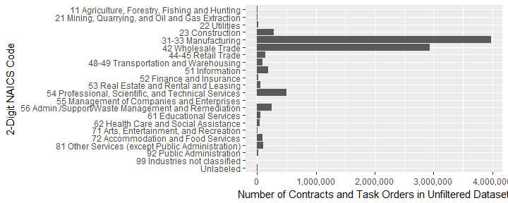
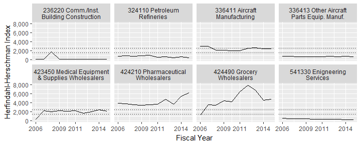
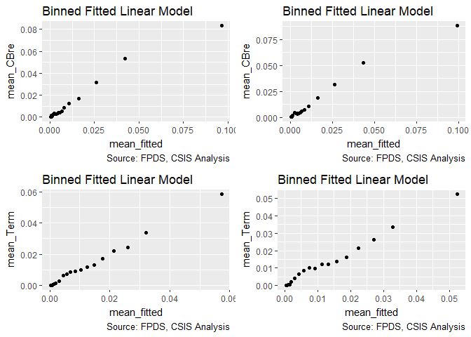
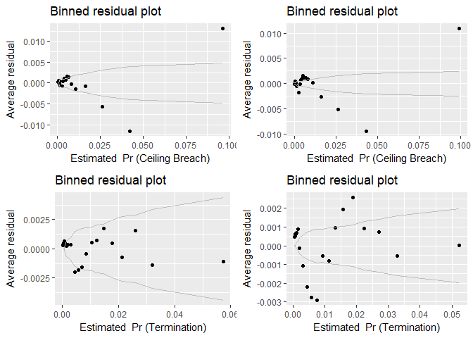
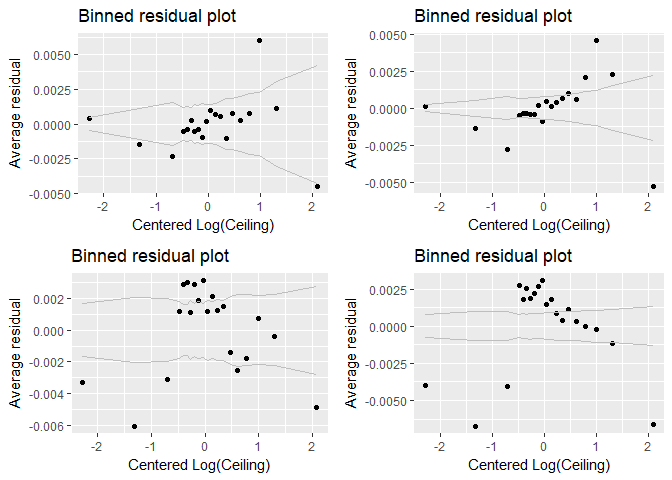

#Setup

```
## 
## Attaching package: 'dplyr'
```

```
## The following objects are masked from 'package:stats':
## 
##     filter, lag
```

```
## The following objects are masked from 'package:base':
## 
##     intersect, setdiff, setequal, union
```

```
## Loading required package: MASS
```

```
## 
## Attaching package: 'MASS'
```

```
## The following object is masked from 'package:dplyr':
## 
##     select
```

```
## Loading required package: Matrix
```

```
## Loading required package: lme4
```

```
## 
## arm (Version 1.10-1, built: 2018-4-12)
```

```
## Working directory is H:/Users/Greg/Repositories/Vendor
```

```
## Warning: package 'R2WinBUGS' was built under R version 3.5.1
```

```
## Loading required package: coda
```

```
## 
## Attaching package: 'coda'
```

```
## The following object is masked from 'package:arm':
## 
##     traceplot
```

```
## Loading required package: boot
```

```
## 
## Attaching package: 'boot'
```

```
## The following object is masked from 'package:arm':
## 
##     logit
```

```
## 
## Please cite as:
```

```
##  Hlavac, Marek (2018). stargazer: Well-Formatted Regression and Summary Statistics Tables.
```

```
##  R package version 5.2.2. https://CRAN.R-project.org/package=stargazer
```

```
## Warning: package 'texreg' was built under R version 3.5.1
```

```
## Version:  1.36.23
## Date:     2017-03-03
## Author:   Philip Leifeld (University of Glasgow)
## 
## Please cite the JSS article in your publications -- see citation("texreg").
```

```
## 
## Attaching package: 'texreg'
```

```
## The following object is masked from 'package:arm':
## 
##     coefplot
```

```
## Loading required package: carData
```

```
## 
## Attaching package: 'car'
```

```
## The following object is masked from 'package:boot':
## 
##     logit
```

```
## The following object is masked from 'package:arm':
## 
##     logit
```

```
## The following object is masked from 'package:dplyr':
## 
##     recode
```


Contracts are classified using a mix of numerical and categorical variables. While the changes in numerical variables are easy to grasp and summarize, a contract may have one line item that is competed and another that is not. As is detailed in the exploration on R&D, we are only considering information available prior to contract start. The percentage of contract obligations that were competed is a valuable benchmark, but is highly influenced by factors that occured after contract start..

## Contract Terminations

Contract terminations and the number of change orders can be calculated for the entire sample.  Contract termination is determined using the *Reason for Modification* field in FPDS.  A contract is considered to be terminated if it has at least one modification with the following values:

* "Terminate for Default (complete or partial)"
* "Terminate for Convenience (complete or partial)"
* "Terminate for Cause"
* "Legal Contract Cancellation"

These four catetegories and the "Close Out" category are used to mark a contract as closed.  Many contracts in FPDS and in the sample are never marked closed.  


##Prepare Data
First we load the data. The dataset used is a U.S. Defense Contracting dataset derived from   FPDS.


###Data Transformations and Summary


```r
#   load(file="Data/defense_contract_CSIScontractID_detail.Rdata")
# # head(def)
# def<-transform_contract(def)
# 
# 
# 
# save(file="Data/transformed_def.Rdata", def)
 load(file="Data/transformed_def.Rdata")
```


## Dependent Variables

NA_stats(def,"b_Term")
* b_Term is a binary variable that has a value of 1 for any contracts that have experienced a partial or complete termination, 0 otherwise. (0.0557253
* b_CBre is a binary variable that has a value of 1 for any contracts that have experienced a partial or complete termination, 0 otherwise. (Data is missing for 0 of records and 0 of obligated dollars.)

## Independent Variables

### Study Variables

* b_Comp is a binary variable based on competition. It has a value of 0 for uncompeted contracts and a value of 1 for competition, regardless of number of offers. Data is missing for 0.00136 of records and 0.0011 of obligated dollars.
* n_Comp is a binary variable based on competition. It has a value of 0 for uncompeted contracts and a value of 1 for competition, regardless of number of offers. 0.5425583
)

* c_HHI_lag1 is a numeric variable based on competition and number of offers. It has a value of 0 for uncompeted contracts and a value of 1 for single-offer competition, and a value of 2 for multi-offer competition. Data is missing for 0.000655 of records and 0.000177 of obligated dollars.

### Initial Contract Scope
* cl_Ceil is the natural log of the initial contract cost ceiling, in then-year dollars. Data is missing for 0.00239 of records and 0.00308 of obligated dollars.
* cl_Days is the natural log of the initial maximum duration of the contract, in days. The variable is centered, by subtracting its mean (Data is missing for 0.00983 of records and 2.41e-09 of obligated dollars. 

### Contract Vehicle
* SIDV, MIDV, and OIDV are dummy variables based on the contract vehicle. They correspond to Single-Award IDVs, Multi-Award IDVs, and Other IDVs, respectively, having a value of 1 when the task order has that vehicle type, and having a 0 other. The remaining types, definitive contracts and purchase orders, are intentionally left out. (Data is missing for 0.000935 of records and 0.000852 of obligated dollars.
* n_Fixed is a numeric variable based on contract pricing. It has a value of 0 for cost-based, 0.5 or "combination or other", 1 for any fixed price (excluding fixed-price level of effort which is classified as cost-based). (0.9666405)
* n_Incent is a numeric variable based on fee type. Ig has a value. 1 for incentive fee or cost sharing, 0.5 or "combination or other", 0 for all remaining types. (Data is missing for 0.00132 of records and 1.17e-06 of obligated dollars.)
* b_UCA is a binary variable with a value of 1 for contracts/task orders that begin as letter contracts or undefinitized contract awards (UCA) and a value of 0 otherwise. Data is missing for 0.0988 of records and 0.123 of obligated dollars.
* b_Intl is a binary variable with a value of 1 for contracts/task orders with any transactions performed internationally and a value of 0 otherwise. Data is missing for 1.93e-06 of records and 0.000814 of obligated dollars.
* NAICS is a factor reporting the top North American Industrial Classification Code of each contract. 
Data is missing for 0.000842 of records and 0.00264 of obligated dollars.
* Agency is a factor reporting the top Contracting Agency of each contract. 
Data is missing for 0.000157 of records and 2.21e-06 of obligated dollars.
* Office is a factor reporting the top Contracting office of each contract. 
Data is missing for 0.000375 of records and 3.8e-06 of obligated dollars.

### NAICS examination

```r
# Add NAICS title

def$NAICS_Code<-create_naics2(def$NAICS)

 def<-csis360::read_and_join(def,
                        lookup_file = "Lookup_NAICS_code.csv",
                        path="",
                        dir="Lookup\\",
                        by="NAICS_Code",
                        skip_check_var="NAICS_DESCRIPTION"
               )
```

```
## Warning: Column `NAICS_Code` joining factor and character vector, coercing
## into character vector
```

```r
def$NAICS_label<-paste(def$NAICS_Code,
                             def$NAICS_DESCRIPTION)

def$NAICS_label[
  def$NAICS_label==
    "56 Administrative and Support and Waste Management and Remediation Services"
  ]<-"56 Admin./Support/Waste Management and Remediation"
def$NAICS_label[def$NAICS_label==
                                    "NA NA"]<-"Unlabeled"

def$NAICS_label<-factor(def$NAICS_label)
order<-  rev(levels(def$NAICS_label))


NAICS2digit<-ggplot(def,
       aes(x=NAICS_label))+
  geom_bar()+coord_flip()+
  scale_y_continuous(label=scales::comma)+scale_x_discrete(limits=order)+
  labs(x="2-Digit NAICS Code",y="Number of Contracts and Task Orders in Unfiltered Dataset")
ggsave(NAICS2digit,file="NAICS2digitCount.png",width=10,height=6,dpi=600)

NAICS_summary<-def %>% group_by(NAICS,StartFY,HHI_lag1) %>%
  dplyr::summarise(annual_action_obligation=sum(Action.Obligation),
                   annual_count=length(StartFY)) 

top_NAICS <- NAICS_summary %>% group_by(NAICS) %>% 
  dplyr::summarise(naics_action_obligation=sum(annual_action_obligation),
                   naics_count=sum(annual_count)) 
top_NAICS$naics_dollar_rank<-rank(-top_NAICS$naics_action_obligation)
top_NAICS$naics_count_rank<-rank(-top_NAICS$naics_count)


NAICS_summary<-left_join(NAICS_summary,top_NAICS, by="NAICS")

colnames(NAICS_summary)[colnames(NAICS_summary)=="NAICS"]<-"principalnaicscode"

NAICS_summary$principalnaicscode<-as.character(NAICS_summary$principalnaicscode)
NAICS_summary<-as.data.frame(NAICS_summary)
NAICS_summary<-csis360::read_and_join(NAICS_summary,
                        lookup_file = "Lookup_PrincipalNAICScode.csv",
                        path="",
                        dir="Lookup\\",
                        by="principalnaicscode",
                        skip_check_var=c("principalnaicscodeText",
"NAICS_shorthand")
               )

# https://stackoverflow.com/questions/37174316/how-to-fit-long-text-into-ggplot2-facet-titles


# Helper function for string wrapping. 
# Default 20 character target width.
swr <- function(string, nwrap=20) {
  paste(strwrap(string, width=nwrap), collapse="\n")
}
swr <- Vectorize(swr)
summary(NAICS_summary$NAICS_shorthand)
```

```
##    Length     Class      Mode 
##     10178 character character
```

```r
# View(NAICS_summary)
NAICS_summary$NAICS_shorthand<-swr(NAICS_summary$NAICS_shorthand,nwrap = 25)
NAICS_summary$FY<-NAICS_summary$StartFY-1
NAICStop<-ggplot(subset(NAICS_summary,naics_dollar_rank<=4 |
                          naics_count_rank<=4),
       aes(x=FY,y=HHI_lag1))+#color=NAICS_Code
  geom_line()+
  scale_y_continuous(label=scales::comma)+ 
  scale_x_continuous(breaks=c(2006,2009,2011,2014))+
  labs(x="Fiscal Year",y="Herfindahl-Herschman Index")+ 
  geom_hline(yintercept=c(1500,2500),linetype="dotted")

NAICStop_paper<-NAICStop+ facet_wrap(~NAICS_shorthand,ncol=2)
NAICStop_paper
```

<!-- -->

```r
ggsave(NAICStop_paper,file="NAICStop.png",width=4,height=8,dpi=600)

NAICStop_pp<-NAICStop+ facet_wrap(~NAICS_shorthand,ncol=4)
NAICStop_pp
```

<!-- -->

```r
ggsave(NAICStop_pp,file="NAICStop_pp.png",width=10.5,height=5.5,dpi=600)

summary(NAICS_summary$naics_count_rank)
```

```
##    Min. 1st Qu.  Median    Mean 3rd Qu.    Max. 
##     1.0   259.0   531.0   551.8   827.0  1277.5
```

### Variable examination

```r
HH1plot<-freq_continuous_plot(def,"HHI_lag1",bins=50)
HH1plot<-HH1plot+geom_vline(xintercept=c(1500,2500))+labs(x="Annual Herfindahl-Hirschman Index (HHI) for NAICS-6 Sector",y="Contract or Task Order Count")
ggsave(HH1plot,file="HH1freq.png",width=5.5,height=5.5,dpi=600)
```

```
## Warning: Removed 5775 rows containing non-finite values (stat_bin).
```

```r
sum(def$Action.Obligation[def$EffComp=="No Comp."],na.rm=TRUE)/sum(def$Action.Obligation,na.rm=TRUE)
```

```
## [1] 0.3290178
```

```r
sum(def$Action.Obligation[def$EffComp=="1 Offer"],na.rm=TRUE)/sum(def$Action.Obligation,na.rm=TRUE)
```

```
## [1] 0.1208853
```

```r
sum(def$Action.Obligation[def$EffComp=="2+ Offers"],na.rm=TRUE)/sum(def$Action.Obligation,na.rm=TRUE)
```

```
## [1] 0.5425583
```

```r
nrow(def[def$EffComp=="No Comp.",])/nrow(def)
```

```
## [1] 0.1941018
```

```r
sum(def$Action.Obligation[is.na(def$EffComp)],na.rm=TRUE)/sum(def$Action.Obligation,na.rm=TRUE)
```

```
## [1] 0.007538656
```

```r
# Effplot<-freq_discrete_plot(subset(def,"EffComp"))
# Effplot<-Effplot+labs(x="Effective Competition",y="Contract or Task Order Count")

# ggsave(Effplot,file="EffFreq.png",width=5.5,height=5.5,dpi=600)
```

### Computational Sample Creation

```r
 load(file="data//def_sample.Rdata")
# save(smp,smp1m,file="def_sample.Rdata")


# complete<-!is.na(def$b_Term)&
#   !is.na(def$b_CBre)&
#   !is.na(def$n_Comp)&
#   !is.na(def$l_Ceil)&
#   !is.na(def$l_Days)&
#   !is.na(def$Veh) &
#   !is.na(def$n_Fixed)&
#   !is.na(def$b_Intl)&
#   !is.na(def$b_UCA)&
#   !is.na(def$NAICS)&
#   !is.na(def$NAICS2)&
#   !is.na(def$cl_HHI_lag1)
# 
# smp<-def[complete,]
# #8818392  to 8818392
# nrow(def[!complete,])/nrow(def)
# sum(def[!complete,]$Action.Obligation,na.rm=TRUE)/sum(def$Action.Obligation,na.rm=TRUE)
# 
# smp1m<-smp[sample(nrow(smp),1000000),]
# smp<-smp[sample(nrow(smp),250000),]
# save(file="def_sample.Rdata",smp,smp1m)
write.foreign(df=smp,
              datafile="Data//def_sample250k.dat",
              codefile="Data//def_sample250k_code.do",
              package = "Stata")
write.foreign(df=smp1m,
              datafile="Data//def_sample1m.dat",
              codefile="Data//def_sample1m_code.do",
              package = "Stata")

# levels(smp$Intl)<- list("Just U.S."=c("Just U.S."), 
#                                 "Any Intl."=c("Any International"))
# levels(smp1m$Intl)<- list("Just U.S."=c("Just U.S."), 
#                                 "Any Intl."=c("Any International"))
```
# Models

## Consolidation and Termination

```r
load("Output//Term_Cons.RData")


Term_Cons_05A <- glm(data=smp,
                       b_Term ~cl_HHI_lag1 +
                         cl_Ceil + cl_Days+
                         Veh+
                         # c_HHI_lag1:cl_Ceil  + cl_Ceil:cl_Days  +# c_HHI_lag1:cl_Days +
                         n_Fixed + b_UCA +
                         # b_Intl +
                         # Veh:cl_Days
                         # Veh:c_HHI_lag1+
                         b_UCA:c_HHI_lag1
                         # (1 | NAICS2)
                       , family=binomial(link="logit"))
display(Term_Cons_05A)
```

```
## glm(formula = b_Term ~ cl_HHI_lag1 + cl_Ceil + cl_Days + Veh + 
##     n_Fixed + b_UCA + b_UCA:c_HHI_lag1, family = binomial(link = "logit"), 
##     data = smp)
##                  coef.est coef.se
## (Intercept)      -6.06     0.20  
## cl_HHI_lag1      -0.15     0.02  
## cl_Ceil          -0.08     0.02  
## cl_Days           0.90     0.03  
## VehS-IDC         -0.91     0.05  
## VehM-IDC         -0.27     0.09  
## VehFSS/GWAC      -0.39     0.08  
## VehBPA/BOA       -0.28     0.13  
## n_Fixed           1.51     0.19  
## b_UCA             1.52     0.14  
## b_UCA:c_HHI_lag1  0.31     0.17  
## ---
##   n = 250000, k = 11
##   residual deviance = 28160.2, null deviance = 31009.2 (difference = 2849.1)
```

```r
glmer_examine(Term_Cons_05A)
```

```
## Warning in if (class(model) == "glmerMod") {: the condition has length > 1
## and only the first element will be used
```

```
##                      GVIF Df GVIF^(1/(2*Df))
## cl_HHI_lag1      1.073067  1        1.035890
## cl_Ceil          1.231174  1        1.109583
## cl_Days          1.242511  1        1.114680
## Veh              1.145756  4        1.017154
## n_Fixed          1.029413  1        1.014600
## b_UCA            1.341611  1        1.158279
## b_UCA:c_HHI_lag1 1.337608  1        1.156550
```

```r
display(Term_Cons_08A)
```

```
## glmer(formula = b_Term ~ c_HHI_lag1 + cl_Ceil + cl_Days + SIDV + 
##     MIDV + FSSGWAC + BPABOA + n_Fixed + b_UCA + SIDV:c_HHI_lag1 + 
##     MIDV:c_HHI_lag1 + FSSGWAC:c_HHI_lag1 + BPABOA:c_HHI_lag1 + 
##     b_UCA:c_HHI_lag1 + (1 | NAICS2), data = smp, family = binomial(link = "logit"))
##                    coef.est coef.se
## (Intercept)        -5.34     0.24  
## c_HHI_lag1         -0.23     0.04  
## cl_Ceil            -0.04     0.03  
## cl_Days             0.72     0.03  
## SIDV               -1.11     0.08  
## MIDV               -0.30     0.12  
## FSSGWAC            -0.19     0.13  
## BPABOA             -0.20     0.15  
## n_Fixed             0.83     0.19  
## b_UCA               1.82     0.14  
## c_HHI_lag1:SIDV    -0.56     0.09  
## c_HHI_lag1:MIDV     0.15     0.12  
## c_HHI_lag1:FSSGWAC  0.36     0.16  
## c_HHI_lag1:BPABOA   0.03     0.18  
## c_HHI_lag1:b_UCA    0.48     0.18  
## 
## Error terms:
##  Groups   Name        Std.Dev.
##  NAICS2   (Intercept) 0.62    
##  Residual             1.00    
## ---
## number of obs: 214201, groups: NAICS2, 24
## AIC = 23571.8, DIC = 23396.4
## deviance = 23468.1
```

```r
glmer_examine(Term_Cons_08A)
```

```
## [[1]]
##         c_HHI_lag1            cl_Ceil            cl_Days 
##           1.487933           1.177351           1.151363 
##               SIDV               MIDV            FSSGWAC 
##           2.266004           1.379559           1.843832 
##             BPABOA            n_Fixed              b_UCA 
##           1.387282           1.029413           1.427164 
##    c_HHI_lag1:SIDV    c_HHI_lag1:MIDV c_HHI_lag1:FSSGWAC 
##           2.457988           1.429596           1.886317 
##  c_HHI_lag1:BPABOA   c_HHI_lag1:b_UCA 
##           1.398063           1.430745 
## 
## [[2]]
## [1] "Model failed to converge with max|grad| = 0.0022039 (tol = 0.001, component 1)"
## 
## [[3]]
## NAICS2.(Intercept) 
##          0.6160247
```

```r
display(Term_Cons_08A2)
```

```
## glmer(formula = b_Term ~ c_HHI_lag1 + cl_Ceil + cl_Days + SIDV + 
##     MIDV + FSSGWAC + BPABOA + n_Fixed + b_UCA + b_UCA:c_HHI_lag1 + 
##     (1 | NAICS2), data = smp1m, family = binomial(link = "logit"))
##                  coef.est coef.se
## (Intercept)      -5.57     0.16  
## c_HHI_lag1       -0.23     0.02  
## cl_Ceil          -0.02     0.01  
## cl_Days           0.68     0.02  
## SIDV             -0.80     0.02  
## MIDV             -0.30     0.05  
## FSSGWAC          -0.38     0.04  
## BPABOA           -0.44     0.07  
## n_Fixed           1.04     0.09  
## b_UCA             1.59     0.07  
## c_HHI_lag1:b_UCA  0.30     0.09  
## 
## Error terms:
##  Groups   Name        Std.Dev.
##  NAICS2   (Intercept) 0.59    
##  Residual             1.00    
## ---
## number of obs: 1000000, groups: NAICS2, 24
## AIC = 112428, DIC = 112198.1
## deviance = 112301.0
```

```r
glmer_examine(Term_Cons_08A2)
```

```
## [[1]]
##       c_HHI_lag1          cl_Ceil          cl_Days             SIDV 
##         1.039738         1.163358         1.146305         1.080210 
##             MIDV          FSSGWAC           BPABOA          n_Fixed 
##         1.056791         1.039728         1.025776         1.023397 
##            b_UCA c_HHI_lag1:b_UCA 
##         1.424760         1.423739 
## 
## [[2]]
## NAICS2.(Intercept) 
##          0.5873092
```

```r
# Term_Cons_08A3 <- glmer(data=smp1m,
#                         b_Term ~c_HHI_lag1 +
#                           cl_Ceil + cl_Days+
#                           Veh+
#                           # c_HHI_lag1:cl_Ceil  + cl_Ceil:cl_Days  +
#                           # c_HHI_lag1:cl_Days +
#                           n_Fixed + b_UCA +
#                           # b_Intl +
#                           # Veh:cl_Days
#                           Veh:c_HHI_lag1+
#                           b_UCA:c_HHI_lag1 +
#                           (1 | NAICS2)
#                         , family=binomial(link="logit"))
display(Term_Cons_08A3)
```

```
## glmer(formula = b_Term ~ c_HHI_lag1 + cl_Ceil + cl_Days + Veh + 
##     n_Fixed + b_UCA + Veh:c_HHI_lag1 + b_UCA:c_HHI_lag1 + (1 | 
##     NAICS2), data = smp1m, family = binomial(link = "logit"))
##                        coef.est coef.se
## (Intercept)            -5.50     0.16  
## c_HHI_lag1             -0.15     0.02  
## cl_Ceil                -0.02     0.01  
## cl_Days                 0.67     0.02  
## VehS-IDC               -1.04     0.03  
## VehM-IDC               -0.22     0.05  
## VehFSS/GWAC            -0.28     0.05  
## VehBPA/BOA             -0.45     0.08  
## n_Fixed                 1.02     0.09  
## b_UCA                   1.64     0.07  
## c_HHI_lag1:VehS-IDC    -0.50     0.04  
## c_HHI_lag1:VehM-IDC     0.18     0.05  
## c_HHI_lag1:VehFSS/GWAC  0.21     0.05  
## c_HHI_lag1:VehBPA/BOA  -0.02     0.11  
## c_HHI_lag1:b_UCA        0.37     0.09  
## 
## Error terms:
##  Groups   Name        Std.Dev.
##  NAICS2   (Intercept) 0.57    
##  Residual             1.00    
## ---
## number of obs: 1000000, groups: NAICS2, 24
## AIC = 112213, DIC = 111978.4
## deviance = 112079.9
```

```r
glmer_examine(Term_Cons_08A3)
```

```
## [[1]]
##                      GVIF Df GVIF^(1/(2*Df))
## c_HHI_lag1       1.537346  1        1.239898
## cl_Ceil          1.167656  1        1.080581
## cl_Days          1.149156  1        1.071987
## Veh              4.392724  4        1.203211
## n_Fixed          1.023416  1        1.011640
## b_UCA            1.465208  1        1.210458
## c_HHI_lag1:Veh   5.673258  4        1.242307
## c_HHI_lag1:b_UCA 1.467646  1        1.211464
## 
## [[2]]
## NAICS2.(Intercept) 
##          0.5680622
```

```r
# Term_Cons_08B <- glmer(data=smp1m,
#                        b_Term ~cl_HHI_lag1 +
#                          cl_Ceil + cl_Days+
#                          Veh+
#                          c_HHI_lag1:cl_Ceil  + cl_Ceil:cl_Days  +# c_HHI_lag1:cl_Days +
#                          n_Fixed + b_UCA +
#                          b_Intl +
#                          Veh:cl_Days+
#                          Veh:c_HHI_lag1+
#                          b_UCA:c_HHI_lag1 +
#                          (1 | NAICS2)
#                        , family=binomial(link="logit"))
display(Term_Cons_08B)
```

```
## glmer(formula = b_Term ~ cl_HHI_lag1 + cl_Ceil + cl_Days + Veh + 
##     n_Fixed + b_UCA + b_UCA:c_HHI_lag1 + (1 | NAICS2), data = smp1m, 
##     family = binomial(link = "logit"))
##                  coef.est coef.se
## (Intercept)      -5.57     0.16  
## cl_HHI_lag1      -0.18     0.01  
## cl_Ceil          -0.02     0.01  
## cl_Days           0.68     0.02  
## VehS-IDC         -0.79     0.02  
## VehM-IDC         -0.30     0.05  
## VehFSS/GWAC      -0.36     0.04  
## VehBPA/BOA       -0.41     0.07  
## n_Fixed           1.02     0.09  
## b_UCA             1.59     0.07  
## b_UCA:c_HHI_lag1  0.24     0.09  
## 
## Error terms:
##  Groups   Name        Std.Dev.
##  NAICS2   (Intercept) 0.61    
##  Residual             1.00    
## ---
## number of obs: 1000000, groups: NAICS2, 24
## AIC = 112395, DIC = 112161.9
## deviance = 112266.4
```

```r
glmer_examine(Term_Cons_08B)
```

```
## [[1]]
##                      GVIF Df GVIF^(1/(2*Df))
## cl_HHI_lag1      1.031577  1        1.015666
## cl_Ceil          1.166248  1        1.079930
## cl_Days          1.147413  1        1.071174
## Veh              1.069572  4        1.008443
## n_Fixed          1.023054  1        1.011461
## b_UCA            1.385098  1        1.176902
## b_UCA:c_HHI_lag1 1.366452  1        1.168953
## 
## [[2]]
## NAICS2.(Intercept) 
##          0.6075797
```

```r
# Term_Cons_08B2 <- glmer(data=smp1m,
#                        b_Term ~cl_HHI_lag1 +
#                          cl_Ceil + cl_Days+
#                          Veh+
#                          c_HHI_lag1:cl_Ceil  + 
#                          # cl_Ceil:cl_Days  +# c_HHI_lag1:cl_Days +
#                          n_Fixed + b_UCA +
#                          b_Intl +
#                          Veh:cl_Days+
#                          Veh:c_HHI_lag1+
#                          b_UCA:c_HHI_lag1 +
#                          (1 | NAICS2)
#                        , family=binomial(link="logit"))
# Missing
# display(Term_Cons_08B2)
# glmer_examine(Term_Cons_08B2)


Term_Cons_08C <- glm(data=smp1m,
                       b_Term ~cl_HHI_lag1 + 
                         cl_Ceil + cl_Days+ 
                         Veh+
                         c_HHI_lag1:cl_Ceil  +
                         cl_Ceil:cl_Days  +
                         c_HHI_lag1:cl_Days +
                         n_Fixed + b_UCA +
                         b_Intl +
                         Veh:cl_Days+
                         Veh:c_HHI_lag1+
                         b_UCA:c_HHI_lag1 +
                         NAICS2
                       , family=binomial(link="logit"))
display(Term_Cons_08C)
```

```
## glm(formula = b_Term ~ cl_HHI_lag1 + cl_Ceil + cl_Days + Veh + 
##     c_HHI_lag1:cl_Ceil + cl_Ceil:cl_Days + c_HHI_lag1:cl_Days + 
##     n_Fixed + b_UCA + b_Intl + Veh:cl_Days + Veh:c_HHI_lag1 + 
##     b_UCA:c_HHI_lag1 + NAICS2, family = binomial(link = "logit"), 
##     data = smp1m)
##                        coef.est coef.se
## (Intercept)             -6.54     0.72 
## cl_HHI_lag1             -0.16     0.01 
## cl_Ceil                 -0.10     0.02 
## cl_Days                  0.59     0.02 
## VehS-IDC                -1.25     0.04 
## VehM-IDC                -0.49     0.09 
## VehFSS/GWAC             -0.09     0.06 
## VehBPA/BOA              -0.56     0.12 
## n_Fixed                  1.10     0.09 
## b_UCA                    1.61     0.07 
## b_Intl                   0.13     0.04 
## NAICS221                 0.99     0.79 
## NAICS222                -0.03     0.78 
## NAICS223                 0.62     0.71 
## NAICS231                 0.63     0.72 
## NAICS232                 1.56     0.71 
## NAICS233                 1.21     0.71 
## NAICS242                 0.14     0.71 
## NAICS244                 0.94     0.71 
## NAICS245                 0.77     0.74 
## NAICS248                 1.33     0.72 
## NAICS249                 1.05     0.78 
## NAICS251                 1.89     0.71 
## NAICS252                -0.57     1.05 
## NAICS253                 1.20     0.72 
## NAICS254                 0.47     0.71 
## NAICS255                -5.32   112.52 
## NAICS256                 1.19     0.71 
## NAICS261                 0.96     0.72 
## NAICS262                 2.57     0.71 
## NAICS271                 1.53     0.73 
## NAICS272                 1.03     0.72 
## NAICS281                 1.05     0.71 
## NAICS292                 0.90     0.74 
## cl_Ceil:c_HHI_lag1       0.06     0.02 
## cl_Ceil:cl_Days          0.12     0.01 
## cl_Days:c_HHI_lag1       0.03     0.02 
## cl_Days:VehS-IDC         0.27     0.03 
## cl_Days:VehM-IDC         0.20     0.07 
## cl_Days:VehFSS/GWAC     -0.33     0.06 
## cl_Days:VehBPA/BOA       0.15     0.09 
## VehS-IDC:c_HHI_lag1     -0.45     0.04 
## VehM-IDC:c_HHI_lag1      0.06     0.05 
## VehFSS/GWAC:c_HHI_lag1   0.15     0.05 
## VehBPA/BOA:c_HHI_lag1    0.00     0.11 
## c_HHI_lag1:b_UCA         0.30     0.09 
## ---
##   n = 1000000, k = 46
##   residual deviance = 111793.9, null deviance = 125945.6 (difference = 14151.7)
```

```r
glmer_examine(Term_Cons_08C)
```

```
## Warning in if (class(model) == "glmerMod") {: the condition has length > 1
## and only the first element will be used
```

```
##                         GVIF Df GVIF^(1/(2*Df))
## cl_HHI_lag1         1.992653  1        1.411614
## cl_Ceil             3.075921  1        1.753830
## cl_Days             2.668927  1        1.633685
## Veh                74.816787  4        1.714944
## n_Fixed             1.111477  1        1.054266
## b_UCA               1.458251  1        1.207581
## b_Intl              1.069601  1        1.034215
## NAICS2              3.595353 23        1.028209
## cl_Ceil:c_HHI_lag1  2.256209  1        1.502068
## cl_Ceil:cl_Days     2.384028  1        1.544030
## cl_Days:c_HHI_lag1  2.526143  1        1.589385
## cl_Days:Veh        48.633269  4        1.625050
## Veh:c_HHI_lag1      8.194423  4        1.300738
## c_HHI_lag1:b_UCA    1.464444  1        1.210142
```

```r
# save(file="Term_Cons.RData",Term_Cons_08A,Term_Cons_08A2,Term_Cons_08A3,
#      Term_Cons_08B,Term_Cons_08B2,Term_Cons_08C)

# Term_Cons_08D <- glmer(data=smp1m,
#                        b_Term ~cl_HHI_lag1 + 
#                          cl_Ceil + cl_Days+ 
#                          Veh+
#                          c_HHI_lag1:cl_Ceil  +
#                          # cl_Ceil:cl_Days  +
#                          # c_HHI_lag1:cl_Days +
#                          n_Fixed + b_UCA +
#                          b_Intl +
#                          Veh:cl_Days+
#                          Veh:c_HHI_lag1+
#                          b_UCA:c_HHI_lag1 +
#                          (1 | NAICS2) + (1 | NAICS)
#                        , family=binomial(link="logit"))
# Missing! display(Term_Cons_08D)
# glmer_examine(Term_Cons_08D)

# save(file="Term_Cons.RData",Term_Cons_08A,Term_Cons_08A2,Term_Cons_08A3,Term_Cons_08B,Term_Cons_08B2,Term_Cons_08C)
# 05A summary_residual_compare(CBre_Cons_05A,CBre_Cons_05A2,Term_Cons_08A3,Term_Cons_08B)
# 05A summary_residual_compare(CBre_Cons_05A,CBre_Cons_05A2,Term_Cons_08A3,Term_Cons_08C)
# 05A summary_residual_compare(CBre_Cons_05A,CBre_Cons_05A2,Term_Cons_08A3,Term_Cons_08B2)
```


## Consolidation and Ceiling Breach

```r
load("Output//CBre_Cons.RData")

CBre_Cons_05A <- glm(data=smp,
                       b_CBre ~ c_HHI_lag1 + 
                      cl_Ceil + cl_Days+ 
                      Veh+
                      n_Fixed + b_UCA +
                      c_HHI_lag1:cl_Ceil  + 
                      b_Intl +
                      Veh:cl_Ceil+
                      b_UCA:cl_Ceil+
                      b_UCA:c_HHI_lag1
                       , family=binomial(link="logit"))
display(CBre_Cons_05A)
```

```
## glm(formula = b_CBre ~ c_HHI_lag1 + cl_Ceil + cl_Days + Veh + 
##     n_Fixed + b_UCA + c_HHI_lag1:cl_Ceil + b_Intl + Veh:cl_Ceil + 
##     b_UCA:cl_Ceil + b_UCA:c_HHI_lag1, family = binomial(link = "logit"), 
##     data = smp)
##                     coef.est coef.se
## (Intercept)         -5.64     0.09  
## c_HHI_lag1          -0.06     0.03  
## cl_Ceil              0.88     0.04  
## cl_Days              0.44     0.03  
## VehS-IDC             0.19     0.06  
## VehM-IDC             1.08     0.10  
## VehFSS/GWAC          0.18     0.11  
## VehBPA/BOA           0.69     0.14  
## n_Fixed              0.47     0.08  
## b_UCA                1.96     0.15  
## b_Intl               0.28     0.06  
## c_HHI_lag1:cl_Ceil  -0.25     0.02  
## cl_Ceil:VehS-IDC    -0.27     0.04  
## cl_Ceil:VehM-IDC    -0.43     0.06  
## cl_Ceil:VehFSS/GWAC -0.12     0.09  
## cl_Ceil:VehBPA/BOA  -0.64     0.13  
## cl_Ceil:b_UCA       -0.54     0.10  
## c_HHI_lag1:b_UCA     0.51     0.14  
## ---
##   n = 250000, k = 18
##   residual deviance = 29337.9, null deviance = 33283.4 (difference = 3945.5)
```

```r
glmer_examine(CBre_Cons_05A)
```

```
## Warning in if (class(model) == "glmerMod") {: the condition has length > 1
## and only the first element will be used
```

```
##                         GVIF Df GVIF^(1/(2*Df))
## c_HHI_lag1          1.458190  1        1.207555
## cl_Ceil             4.104625  1        2.025987
## cl_Days             1.535715  1        1.239240
## Veh                12.820134  4        1.375582
## n_Fixed             1.107919  1        1.052577
## b_UCA               1.800779  1        1.341931
## b_Intl              1.047593  1        1.023520
## c_HHI_lag1:cl_Ceil  1.560968  1        1.249387
## cl_Ceil:Veh        26.981996  4        1.509678
## cl_Ceil:b_UCA       1.656496  1        1.287049
## c_HHI_lag1:b_UCA    1.239578  1        1.113363
```

```r
CBre_Cons_05A2 <- glm(data=smp,
                       b_CBre ~ c_HHI_lag1 + 
                      cl_Ceil + cl_Days+ 
                      Veh+
                      n_Fixed + b_UCA +
                      # c_HHI_lag1:cl_Ceil  + 
                      b_Intl +
                      Veh:cl_Ceil+
                      b_UCA:cl_Ceil+
                      b_UCA:c_HHI_lag1
                       , family=binomial(link="logit"))
display(CBre_Cons_05A2)
```

```
## glm(formula = b_CBre ~ c_HHI_lag1 + cl_Ceil + cl_Days + Veh + 
##     n_Fixed + b_UCA + b_Intl + Veh:cl_Ceil + b_UCA:cl_Ceil + 
##     b_UCA:c_HHI_lag1, family = binomial(link = "logit"), data = smp)
##                     coef.est coef.se
## (Intercept)         -5.66     0.09  
## c_HHI_lag1          -0.22     0.03  
## cl_Ceil              1.02     0.03  
## cl_Days              0.43     0.03  
## VehS-IDC             0.29     0.06  
## VehM-IDC             1.08     0.10  
## VehFSS/GWAC          0.18     0.11  
## VehBPA/BOA           0.72     0.14  
## n_Fixed              0.42     0.08  
## b_UCA                1.95     0.15  
## b_Intl               0.27     0.06  
## cl_Ceil:VehS-IDC    -0.35     0.04  
## cl_Ceil:VehM-IDC    -0.42     0.06  
## cl_Ceil:VehFSS/GWAC -0.12     0.09  
## cl_Ceil:VehBPA/BOA  -0.68     0.13  
## cl_Ceil:b_UCA       -0.59     0.11  
## c_HHI_lag1:b_UCA     0.48     0.15  
## ---
##   n = 250000, k = 17
##   residual deviance = 29455.3, null deviance = 33283.4 (difference = 3828.1)
```

```r
glmer_examine(CBre_Cons_05A2)
```

```
## Warning in if (class(model) == "glmerMod") {: the condition has length > 1
## and only the first element will be used
```

```
##                       GVIF Df GVIF^(1/(2*Df))
## c_HHI_lag1        1.226300  1        1.107384
## cl_Ceil           3.428993  1        1.851754
## cl_Days           1.478195  1        1.215810
## Veh              12.954517  4        1.377376
## n_Fixed           1.103474  1        1.050464
## b_UCA             1.911916  1        1.382720
## b_Intl            1.050900  1        1.025134
## cl_Ceil:Veh      25.951229  4        1.502345
## cl_Ceil:b_UCA     1.657005  1        1.287247
## c_HHI_lag1:b_UCA  1.253658  1        1.119669
```

```r
# CBre_Cons_08A <- glmer(data=smp1m,
#                        b_CBre ~ c_HHI_lag1 +
#                       cl_Ceil + cl_Days+
#                       Veh+
#                       n_Fixed + b_UCA +
#                       c_HHI_lag1:cl_Ceil  +
#                       b_Intl +
#                       Veh:cl_Ceil+
#                       b_UCA:cl_Ceil+
#                       b_UCA:c_HHI_lag1+
#                          (1 | NAICS2)
#                        , family=binomial(link="logit"))

display(CBre_Cons_08A)
```

```
## glmer(formula = b_CBre ~ c_HHI_lag1 + cl_Ceil + cl_Days + SIDV + 
##     MIDV + FSSGWAC + BPABOA + n_Fixed + b_UCA + c_HHI_lag1:cl_Ceil + 
##     b_Intl + SIDV:cl_Ceil + MIDV:cl_Ceil + FSSGWAC:cl_Ceil + 
##     BPABOA:cl_Ceil + b_UCA:cl_Ceil + b_UCA:c_HHI_lag1 + (1 | 
##     NAICS2), data = smp1m, family = binomial(link = "logit"))
##                    coef.est coef.se
## (Intercept)        -4.75     0.21  
## c_HHI_lag1          0.28     0.01  
## cl_Ceil             0.64     0.02  
## cl_Days             0.19     0.01  
## SIDV               -0.07     0.03  
## MIDV                0.37     0.05  
## FSSGWAC             0.16     0.06  
## BPABOA             -0.01     0.08  
## n_Fixed             0.30     0.04  
## b_UCA               2.01     0.07  
## b_Intl             -0.27     0.03  
## c_HHI_lag1:cl_Ceil -0.17     0.01  
## cl_Ceil:SIDV       -0.14     0.02  
## cl_Ceil:MIDV       -0.24     0.03  
## cl_Ceil:FSSGWAC     0.04     0.04  
## cl_Ceil:BPABOA     -0.32     0.08  
## cl_Ceil:b_UCA      -0.39     0.05  
## c_HHI_lag1:b_UCA    0.37     0.07  
## 
## Error terms:
##  Groups   Name        Std.Dev.
##  NAICS2   (Intercept) 0.99    
##  Residual             1.00    
## ---
## number of obs: 1000000, groups: NAICS2, 24
## AIC = 105873, DIC = 105561.1
## deviance = 105697.9
```

```r
glmer_examine(CBre_Cons_08A)
```

```
## [[1]]
##         c_HHI_lag1            cl_Ceil            cl_Days 
##           1.180268           3.121720           1.251757 
##               SIDV               MIDV            FSSGWAC 
##           2.215036           2.763564           2.130112 
##             BPABOA            n_Fixed              b_UCA 
##           1.227057           1.089761           1.901790 
##             b_Intl c_HHI_lag1:cl_Ceil       cl_Ceil:SIDV 
##           1.046122           1.299766           3.111352 
##       cl_Ceil:MIDV    cl_Ceil:FSSGWAC     cl_Ceil:BPABOA 
##           3.325945           2.208119           1.201171 
##      cl_Ceil:b_UCA   c_HHI_lag1:b_UCA 
##           1.711976           1.271999 
## 
## [[2]]
## NAICS2.(Intercept) 
##           0.990317
```

```r
CBre_Cons_08B <- glm(data=smp1m,
                       b_CBre ~ cl_HHI_lag1 +
                      cl_Ceil + cl_Days+
                      Veh+
                      n_Fixed + b_UCA +
                      c_HHI_lag1:cl_Ceil  +
                      b_Intl +
                      Veh:cl_Ceil+
                      b_UCA:cl_Ceil+
                      b_UCA:c_HHI_lag1+
                         NAICS2
                       , family=binomial(link="logit"))
display(CBre_Cons_08B)
```

```
## glm(formula = b_CBre ~ cl_HHI_lag1 + cl_Ceil + cl_Days + Veh + 
##     n_Fixed + b_UCA + c_HHI_lag1:cl_Ceil + b_Intl + Veh:cl_Ceil + 
##     b_UCA:cl_Ceil + b_UCA:c_HHI_lag1 + NAICS2, family = binomial(link = "logit"), 
##     data = smp1m)
##                     coef.est coef.se
## (Intercept)         -5.17     0.42  
## cl_HHI_lag1          0.23     0.01  
## cl_Ceil              0.62     0.02  
## cl_Days              0.19     0.01  
## VehS-IDC            -0.06     0.03  
## VehM-IDC             0.39     0.05  
## VehFSS/GWAC          0.13     0.06  
## VehBPA/BOA          -0.01     0.08  
## n_Fixed              0.32     0.04  
## b_UCA                2.01     0.08  
## b_Intl              -0.29     0.03  
## NAICS221             0.69     0.47  
## NAICS222             0.71     0.44  
## NAICS223             1.91     0.42  
## NAICS231            -0.89     0.43  
## NAICS232            -0.60     0.42  
## NAICS233            -0.41     0.42  
## NAICS242            -2.06     0.42  
## NAICS244            -0.05     0.43  
## NAICS245             0.04     0.45  
## NAICS248             0.30     0.42  
## NAICS249             0.63     0.48  
## NAICS251             0.64     0.42  
## NAICS252            -0.74     0.55  
## NAICS253             1.71     0.42  
## NAICS254             0.70     0.42  
## NAICS255            -5.98    68.92  
## NAICS256             1.92     0.42  
## NAICS261             1.58     0.42  
## NAICS262             0.25     0.43  
## NAICS271             0.37     0.50  
## NAICS272             1.41     0.42  
## NAICS281             0.95     0.42  
## NAICS292             1.05     0.43  
## cl_Ceil:c_HHI_lag1  -0.19     0.01  
## cl_Ceil:VehS-IDC    -0.15     0.02  
## cl_Ceil:VehM-IDC    -0.23     0.03  
## cl_Ceil:VehFSS/GWAC  0.04     0.04  
## cl_Ceil:VehBPA/BOA  -0.33     0.08  
## cl_Ceil:b_UCA       -0.39     0.05  
## b_UCA:c_HHI_lag1     0.44     0.07  
## ---
##   n = 1000000, k = 41
##   residual deviance = 105726.8, null deviance = 131712.0 (difference = 25985.3)
```

```r
glmer_examine(CBre_Cons_08B)
```

```
## Warning in if (class(model) == "glmerMod") {: the condition has length > 1
## and only the first element will be used
```

```
##                         GVIF Df GVIF^(1/(2*Df))
## cl_HHI_lag1         1.816226  1        1.347674
## cl_Ceil             3.865936  1        1.966198
## cl_Days             1.479621  1        1.216397
## Veh                13.314747  4        1.382107
## n_Fixed             1.312650  1        1.145710
## b_UCA               1.938743  1        1.392387
## b_Intl              1.091208  1        1.044609
## NAICS2              3.384512 23        1.026859
## cl_Ceil:c_HHI_lag1  1.745989  1        1.321359
## cl_Ceil:Veh        23.516368  4        1.483957
## cl_Ceil:b_UCA       1.727825  1        1.314468
## b_UCA:c_HHI_lag1    1.287048  1        1.134481
```

```r
# CBre_Cons_08C <- glmer(data=smp1m,
#                        b_CBre ~ c_HHI_lag1 +
#                       cl_Ceil + cl_Days+
#                       Veh+
#                       n_Fixed + b_UCA +
#                       c_HHI_lag1:cl_Ceil  +
#                       b_Intl +
#                       Veh:cl_Ceil+
#                       b_UCA:cl_Ceil+
#                       b_UCA:c_HHI_lag1+
#                          (1 | NAICS2)+(1 | NAICS3)
#                        , family=binomial(link="logit"))

# Missing display(CBre_Cons_08C)
# glmer_examine(CBre_Cons_08C)

# CBre_Cons_08D <- glmer(data=smp1m,
#                        b_CBre ~ c_HHI_lag1 +
#                       cl_Ceil + cl_Days+
#                       Veh+
#                       n_Fixed + b_UCA +
#                       c_HHI_lag1:cl_Ceil  +
#                       b_Intl +
#                       Veh:cl_Ceil+
#                       b_UCA:cl_Ceil+
#                       b_UCA:c_HHI_lag1+
#                          (1 | NAICS2)+(1 | NAICS4)
#                        , family=binomial(link="logit"))

# Missing display(CBre_Cons_08D)
# glmer_examine(CBre_Cons_08D)


# summary_residual_compare(CBre_Cons_08A,CBre_Cons_08A2,Term_Cons_08B,Term_Cons_08B2)
# summary_residual_compare(CBre_Cons_05A,CBre_Cons_08A,Term_Cons_08B,Term_Cons_08B2)
# summary_residual_compare(CBre_Cons_05A,CBre_Cons_08A,Term_Cons_08B,Term_Cons_08A7)


# summary_residual_compare(CBre_Cons_08A,CBre_Cons_08B2,Term_Cons_08B,Term_Cons_08B)
# summary_residual_compare(CBre_Cons_08A,CBre_Cons_08C,Term_Cons_08B,Term_Cons_08B)

# summary_residual_compare(CBre_Cons_08C,CBre_Cons_08D,Term_Cons_08B,Term_Cons_08B)

# save(file="CBre_Cons.RData",CBre_Cons_05A,CBre_Cons_08A,CBre_Cons_08B)#,CBre_Cons_08B
```
VIF for cl_ceil:Veh is over 2, and for cl_Ceil is over 8, necessitating removal of a ceiling interaction.

## Competition and Terminations


```r
load(file="Output//Comp_Term.Rdata")


#Create the model
Term_Comp_05A <- glm (data=smp1m,
                 b_Term ~n_Comp + 
                   cl_Ceil + cl_Days+ 
                   Veh+
                   n_Comp:cl_Ceil  + cl_Ceil:cl_Days  +# n_Comp:cl_Days +
                   n_Fixed + b_UCA +
                  # b_Intl + 
                   Veh:cl_Days+
                   Veh:n_Comp+
                   b_UCA:n_Comp
                    , family=binomial(link="logit"))
display(Term_Comp_05A)
```

```
## glm(formula = b_Term ~ n_Comp + cl_Ceil + cl_Days + Veh + n_Comp:cl_Ceil + 
##     cl_Ceil:cl_Days + n_Fixed + b_UCA + Veh:cl_Days + Veh:n_Comp + 
##     b_UCA:n_Comp, family = binomial(link = "logit"), data = smp1m)
##                     coef.est coef.se
## (Intercept)         -6.13     0.10  
## n_Comp               0.59     0.03  
## cl_Ceil             -0.22     0.02  
## cl_Days              0.64     0.02  
## VehS-IDC            -1.07     0.05  
## VehM-IDC            -0.22     0.10  
## VehFSS/GWAC         -0.12     0.08  
## VehBPA/BOA          -0.15     0.12  
## n_Fixed              1.51     0.09  
## b_UCA                1.81     0.06  
## n_Comp:cl_Ceil       0.10     0.02  
## cl_Ceil:cl_Days      0.12     0.01  
## cl_Days:VehS-IDC     0.55     0.03  
## cl_Days:VehM-IDC     0.29     0.07  
## cl_Days:VehFSS/GWAC -0.35     0.06  
## cl_Days:VehBPA/BOA   0.17     0.09  
## n_Comp:VehS-IDC     -0.61     0.05  
## n_Comp:VehM-IDC     -0.38     0.09  
## n_Comp:VehFSS/GWAC  -0.10     0.08  
## n_Comp:VehBPA/BOA   -0.77     0.15  
## n_Comp:b_UCA        -1.83     0.25  
## ---
##   n = 1000000, k = 21
##   residual deviance = 113463.9, null deviance = 125945.6 (difference = 12481.7)
```

```r
glmer_examine(Term_Comp_05A)
```

```
## Warning in if (class(model) == "glmerMod") {: the condition has length > 1
## and only the first element will be used
```

```
##                       GVIF Df GVIF^(1/(2*Df))
## n_Comp            1.707878  1        1.306858
## cl_Ceil           4.211679  1        2.052237
## cl_Days           2.348384  1        1.532444
## Veh             313.286915  4        2.051128
## n_Fixed           1.043313  1        1.021427
## b_UCA             1.149208  1        1.072011
## n_Comp:cl_Ceil    2.867615  1        1.693403
## cl_Ceil:cl_Days   2.470658  1        1.571833
## cl_Days:Veh      51.250453  4        1.635732
## n_Comp:Veh       45.684497  4        1.612394
## n_Comp:b_UCA      1.075333  1        1.036983
```

```r
Term_Comp_05A2 <- glm (data=smp1m,
                 b_Term ~n_Comp + 
                   cl_Ceil + cl_Days+ 
                   Veh+
                   n_Comp:cl_Ceil  + cl_Ceil:cl_Days  + n_Comp:cl_Days +
                   n_Fixed + b_UCA +
                   b_Intl +
                   Veh:cl_Days+
                   Veh:n_Comp+
                   b_UCA:n_Comp+
                     NAICS2, family=binomial(link="logit"))
display(Term_Comp_05A2)
```

```
## glm(formula = b_Term ~ n_Comp + cl_Ceil + cl_Days + Veh + n_Comp:cl_Ceil + 
##     cl_Ceil:cl_Days + n_Comp:cl_Days + n_Fixed + b_UCA + b_Intl + 
##     Veh:cl_Days + Veh:n_Comp + b_UCA:n_Comp + NAICS2, family = binomial(link = "logit"), 
##     data = smp1m)
##                     coef.est coef.se
## (Intercept)         -6.85     0.72  
## n_Comp               0.50     0.04  
## cl_Ceil             -0.15     0.02  
## cl_Days              0.44     0.03  
## VehS-IDC            -0.80     0.05  
## VehM-IDC            -0.36     0.10  
## VehFSS/GWAC         -0.15     0.08  
## VehBPA/BOA          -0.14     0.12  
## n_Fixed              1.15     0.09  
## b_UCA                1.86     0.06  
## b_Intl               0.09     0.04  
## NAICS221             0.90     0.79  
## NAICS222            -0.03     0.78  
## NAICS223             0.87     0.71  
## NAICS231             0.52     0.72  
## NAICS232             1.48     0.71  
## NAICS233             1.22     0.71  
## NAICS242            -0.10     0.71  
## NAICS244             0.96     0.72  
## NAICS245             0.61     0.74  
## NAICS248             1.33     0.72  
## NAICS249             1.10     0.78  
## NAICS251             2.05     0.71  
## NAICS252            -0.87     1.00  
## NAICS253             1.04     0.72  
## NAICS254             0.59     0.71  
## NAICS255            -4.51    68.80  
## NAICS256             1.29     0.71  
## NAICS261             1.17     0.72  
## NAICS262             2.66     0.71  
## NAICS271             1.72     0.73  
## NAICS272             1.29     0.72  
## NAICS281             1.19     0.71  
## NAICS292             0.87     0.74  
## n_Comp:cl_Ceil       0.02     0.03  
## cl_Ceil:cl_Days      0.13     0.01  
## n_Comp:cl_Days       0.19     0.03  
## cl_Days:VehS-IDC     0.35     0.03  
## cl_Days:VehM-IDC     0.20     0.07  
## cl_Days:VehFSS/GWAC -0.29     0.06  
## cl_Days:VehBPA/BOA   0.17     0.09  
## n_Comp:VehS-IDC     -0.52     0.05  
## n_Comp:VehM-IDC     -0.33     0.09  
## n_Comp:VehFSS/GWAC  -0.04     0.09  
## n_Comp:VehBPA/BOA   -0.92     0.15  
## n_Comp:b_UCA        -1.74     0.25  
## ---
##   n = 1000000, k = 46
##   residual deviance = 111433.4, null deviance = 125945.6 (difference = 14512.2)
```

```r
glmer_examine(Term_Comp_05A2)
```

```
## Warning in if (class(model) == "glmerMod") {: the condition has length > 1
## and only the first element will be used
```

```
##                       GVIF Df GVIF^(1/(2*Df))
## n_Comp            3.131594  1        1.769631
## cl_Ceil           4.476392  1        2.115749
## cl_Days           3.937385  1        1.984285
## Veh             265.249457  4        2.008893
## n_Fixed           1.106040  1        1.051684
## b_UCA             1.164134  1        1.078950
## b_Intl            1.076027  1        1.037317
## NAICS2            2.332696 23        1.018584
## n_Comp:cl_Ceil    3.419849  1        1.849283
## cl_Ceil:cl_Days   2.393202  1        1.546998
## n_Comp:cl_Days    4.790893  1        2.188811
## cl_Days:Veh      49.198793  4        1.627400
## n_Comp:Veh       45.690446  4        1.612420
## n_Comp:b_UCA      1.078420  1        1.038470
```

```r
Term_Comp_05A3 <- glm (data=smp1m,
                 b_Term ~n_Comp + 
                   cl_Ceil + cl_Days+ 
                   Veh+
                   n_Comp:cl_Ceil  + cl_Ceil:cl_Days  +# n_Comp:cl_Days + 
                   n_Fixed + b_UCA +
                   b_Intl +
                   Veh:cl_Days+
                   Veh:n_Comp+
                   b_UCA:n_Comp+
                     NAICS2, family=binomial(link="logit"))
display(Term_Comp_05A3)
```

```
## glm(formula = b_Term ~ n_Comp + cl_Ceil + cl_Days + Veh + n_Comp:cl_Ceil + 
##     cl_Ceil:cl_Days + n_Fixed + b_UCA + b_Intl + Veh:cl_Days + 
##     Veh:n_Comp + b_UCA:n_Comp + NAICS2, family = binomial(link = "logit"), 
##     data = smp1m)
##                     coef.est coef.se
## (Intercept)         -6.92     0.72  
## n_Comp               0.64     0.03  
## cl_Ceil             -0.20     0.02  
## cl_Days              0.55     0.02  
## VehS-IDC            -0.84     0.05  
## VehM-IDC            -0.39     0.11  
## VehFSS/GWAC         -0.13     0.08  
## VehBPA/BOA          -0.12     0.12  
## n_Fixed              1.14     0.09  
## b_UCA                1.85     0.06  
## b_Intl               0.10     0.04  
## NAICS221             0.89     0.79  
## NAICS222            -0.03     0.78  
## NAICS223             0.88     0.71  
## NAICS231             0.53     0.72  
## NAICS232             1.47     0.71  
## NAICS233             1.23     0.71  
## NAICS242            -0.13     0.71  
## NAICS244             0.96     0.72  
## NAICS245             0.60     0.74  
## NAICS248             1.32     0.72  
## NAICS249             1.10     0.78  
## NAICS251             2.05     0.71  
## NAICS252            -0.80     1.00  
## NAICS253             1.06     0.72  
## NAICS254             0.61     0.71  
## NAICS255            -4.35    68.78  
## NAICS256             1.29     0.71  
## NAICS261             1.18     0.72  
## NAICS262             2.66     0.71  
## NAICS271             1.72     0.73  
## NAICS272             1.28     0.72  
## NAICS281             1.19     0.71  
## NAICS292             0.85     0.74  
## n_Comp:cl_Ceil       0.08     0.02  
## cl_Ceil:cl_Days      0.14     0.01  
## cl_Days:VehS-IDC     0.37     0.03  
## cl_Days:VehM-IDC     0.22     0.07  
## cl_Days:VehFSS/GWAC -0.28     0.06  
## cl_Days:VehBPA/BOA   0.13     0.09  
## n_Comp:VehS-IDC     -0.51     0.05  
## n_Comp:VehM-IDC     -0.32     0.09  
## n_Comp:VehFSS/GWAC  -0.10     0.09  
## n_Comp:VehBPA/BOA   -0.91     0.15  
## n_Comp:b_UCA        -1.72     0.25  
## ---
##   n = 1000000, k = 45
##   residual deviance = 111470.0, null deviance = 125945.6 (difference = 14475.6)
```

```r
glmer_examine(Term_Comp_05A3)
```

```
## Warning in if (class(model) == "glmerMod") {: the condition has length > 1
## and only the first element will be used
```

```
##                       GVIF Df GVIF^(1/(2*Df))
## n_Comp            1.778551  1        1.333623
## cl_Ceil           4.176846  1        2.043733
## cl_Days           2.388338  1        1.545425
## Veh             304.887840  4        2.044172
## n_Fixed           1.106889  1        1.052088
## b_UCA             1.160934  1        1.077466
## b_Intl            1.072701  1        1.035713
## NAICS2            2.316463 23        1.018430
## n_Comp:cl_Ceil    2.877584  1        1.696344
## cl_Ceil:cl_Days   2.395990  1        1.547898
## cl_Days:Veh      50.562825  4        1.632973
## n_Comp:Veh       46.516446  4        1.616035
## n_Comp:b_UCA      1.078306  1        1.038415
```

```r
Term_Comp_05A4 <- glm (data=smp1m,
                 b_Term ~n_Comp + 
                   cl_Ceil + cl_Days+ 
                   Veh+
                   n_Comp:cl_Ceil  + cl_Ceil:cl_Days  +# n_Comp:cl_Days + 
                   n_Fixed + b_UCA +
                   b_Intl +
                   Veh:cl_Days+
                   #Veh:n_Comp+ 2.5 glmer_examine
                   b_UCA:n_Comp+
                     NAICS2, family=binomial(link="logit"))
display(Term_Comp_05A4)
```

```
## glm(formula = b_Term ~ n_Comp + cl_Ceil + cl_Days + Veh + n_Comp:cl_Ceil + 
##     cl_Ceil:cl_Days + n_Fixed + b_UCA + b_Intl + Veh:cl_Days + 
##     b_UCA:n_Comp + NAICS2, family = binomial(link = "logit"), 
##     data = smp1m)
##                     coef.est coef.se
## (Intercept)         -6.81     0.72  
## n_Comp               0.50     0.02  
## cl_Ceil             -0.18     0.02  
## cl_Days              0.55     0.02  
## VehS-IDC            -1.17     0.04  
## VehM-IDC            -0.59     0.08  
## VehFSS/GWAC         -0.19     0.05  
## VehBPA/BOA          -0.54     0.11  
## n_Fixed              1.13     0.09  
## b_UCA                1.88     0.06  
## b_Intl               0.09     0.04  
## NAICS221             0.88     0.79  
## NAICS222            -0.04     0.78  
## NAICS223             0.85     0.71  
## NAICS231             0.53     0.72  
## NAICS232             1.44     0.71  
## NAICS233             1.24     0.71  
## NAICS242            -0.19     0.71  
## NAICS244             0.96     0.72  
## NAICS245             0.58     0.74  
## NAICS248             1.31     0.72  
## NAICS249             1.07     0.78  
## NAICS251             1.99     0.71  
## NAICS252            -0.62     1.00  
## NAICS253             1.00     0.72  
## NAICS254             0.58     0.71  
## NAICS255            -4.44    68.78  
## NAICS256             1.25     0.71  
## NAICS261             1.17     0.72  
## NAICS262             2.64     0.71  
## NAICS271             1.69     0.73  
## NAICS272             1.28     0.72  
## NAICS281             1.16     0.71  
## NAICS292             0.85     0.74  
## n_Comp:cl_Ceil       0.06     0.02  
## cl_Ceil:cl_Days      0.13     0.01  
## cl_Days:VehS-IDC     0.40     0.03  
## cl_Days:VehM-IDC     0.23     0.07  
## cl_Days:VehFSS/GWAC -0.28     0.06  
## cl_Days:VehBPA/BOA   0.16     0.09  
## n_Comp:b_UCA        -1.84     0.25  
## ---
##   n = 1000000, k = 41
##   residual deviance = 111600.2, null deviance = 125945.6 (difference = 14345.4)
```

```r
glmer_examine(Term_Comp_05A4)
```

```
## Warning in if (class(model) == "glmerMod") {: the condition has length > 1
## and only the first element will be used
```

```
##                      GVIF Df GVIF^(1/(2*Df))
## n_Comp           1.183402  1        1.087843
## cl_Ceil          4.249054  1        2.061323
## cl_Days          2.372989  1        1.540451
## Veh             39.254812  4        1.582110
## n_Fixed          1.103469  1        1.050461
## b_UCA            1.150271  1        1.072507
## b_Intl           1.071860  1        1.035306
## NAICS2           2.193255 23        1.017220
## n_Comp:cl_Ceil   2.879795  1        1.696996
## cl_Ceil:cl_Days  2.389268  1        1.545726
## cl_Days:Veh     50.281820  4        1.631835
## n_Comp:b_UCA     1.075710  1        1.037165
```

```r
Term_Comp_05A5 <- glm (data=smp1m,
                 b_Term ~n_Comp + 
                   cl_Ceil + cl_Days+ 
                   Veh+
                   # n_Comp:cl_Ceil  + 
                   cl_Ceil:cl_Days  +# n_Comp:cl_Days + 
                   n_Fixed + b_UCA +
                   b_Intl +
                   Veh:cl_Days+#2.3 glmer_examine
                   #Veh:n_Comp+ 2.5 glmer_examine
                   b_UCA:n_Comp+
                     NAICS2, family=binomial(link="logit"))
display(Term_Comp_05A5)
```

```
## glm(formula = b_Term ~ n_Comp + cl_Ceil + cl_Days + Veh + cl_Ceil:cl_Days + 
##     n_Fixed + b_UCA + b_Intl + Veh:cl_Days + b_UCA:n_Comp + NAICS2, 
##     family = binomial(link = "logit"), data = smp1m)
##                     coef.est coef.se
## (Intercept)         -6.82     0.72  
## n_Comp               0.51     0.02  
## cl_Ceil             -0.14     0.02  
## cl_Days              0.55     0.02  
## VehS-IDC            -1.18     0.04  
## VehM-IDC            -0.59     0.08  
## VehFSS/GWAC         -0.19     0.05  
## VehBPA/BOA          -0.55     0.11  
## n_Fixed              1.14     0.09  
## b_UCA                1.87     0.06  
## b_Intl               0.09     0.04  
## NAICS221             0.88     0.79  
## NAICS222            -0.04     0.78  
## NAICS223             0.86     0.71  
## NAICS231             0.53     0.72  
## NAICS232             1.44     0.71  
## NAICS233             1.23     0.71  
## NAICS242            -0.19     0.71  
## NAICS244             0.96     0.72  
## NAICS245             0.58     0.74  
## NAICS248             1.32     0.72  
## NAICS249             1.08     0.78  
## NAICS251             1.99     0.71  
## NAICS252            -0.63     1.00  
## NAICS253             1.00     0.72  
## NAICS254             0.58     0.71  
## NAICS255            -4.43    68.72  
## NAICS256             1.25     0.71  
## NAICS261             1.17     0.72  
## NAICS262             2.64     0.71  
## NAICS271             1.69     0.73  
## NAICS272             1.27     0.72  
## NAICS281             1.16     0.71  
## NAICS292             0.86     0.74  
## cl_Ceil:cl_Days      0.13     0.01  
## cl_Days:VehS-IDC     0.41     0.03  
## cl_Days:VehM-IDC     0.24     0.07  
## cl_Days:VehFSS/GWAC -0.28     0.06  
## cl_Days:VehBPA/BOA   0.16     0.09  
## n_Comp:b_UCA        -1.82     0.25  
## ---
##   n = 1000000, k = 40
##   residual deviance = 111607.1, null deviance = 125945.6 (difference = 14338.5)
```

```r
glmer_examine(Term_Comp_05A5)
```

```
## Warning in if (class(model) == "glmerMod") {: the condition has length > 1
## and only the first element will be used
```

```
##                      GVIF Df GVIF^(1/(2*Df))
## n_Comp           1.092441  1        1.045199
## cl_Ceil          2.464885  1        1.569995
## cl_Days          2.370601  1        1.539676
## Veh             39.206747  4        1.581867
## n_Fixed          1.103279  1        1.050371
## b_UCA            1.146681  1        1.070832
## b_Intl           1.069821  1        1.034321
## NAICS2           2.168364 23        1.016968
## cl_Ceil:cl_Days  2.376583  1        1.541617
## cl_Days:Veh     50.043922  4        1.630868
## n_Comp:b_UCA     1.074805  1        1.036728
```

```r
Term_Comp_05A6 <- glm (data=smp1m,
                 b_Term ~n_Comp + 
                   cl_Ceil + cl_Days+ 
                   Veh+
                   n_Comp:cl_Ceil  + #cl_Ceil:cl_Days  +# n_Comp:cl_Days + 
                   n_Fixed + b_UCA +
                   b_Intl +
                   # Veh:cl_Days+ 2.3 glmer_examine
                   #Veh:n_Comp+ 2.5 glmer_examine
                   b_UCA:n_Comp+
                     NAICS2, family=binomial(link="logit"))
display(Term_Comp_05A6)
```

```
## glm(formula = b_Term ~ n_Comp + cl_Ceil + cl_Days + Veh + n_Comp:cl_Ceil + 
##     n_Fixed + b_UCA + b_Intl + b_UCA:n_Comp + NAICS2, family = binomial(link = "logit"), 
##     data = smp1m)
##                coef.est coef.se
## (Intercept)    -6.79     0.72  
## n_Comp          0.47     0.02  
## cl_Ceil        -0.06     0.02  
## cl_Days         0.71     0.02  
## VehS-IDC       -0.81     0.03  
## VehM-IDC       -0.36     0.05  
## VehFSS/GWAC    -0.35     0.04  
## VehBPA/BOA     -0.40     0.07  
## n_Fixed         1.02     0.09  
## b_UCA           1.89     0.06  
## b_Intl          0.09     0.04  
## NAICS221        0.84     0.79  
## NAICS222       -0.05     0.78  
## NAICS223        0.87     0.71  
## NAICS231        0.47     0.72  
## NAICS232        1.42     0.71  
## NAICS233        1.23     0.71  
## NAICS242       -0.37     0.71  
## NAICS244        0.98     0.72  
## NAICS245        0.60     0.74  
## NAICS248        1.32     0.72  
## NAICS249        1.04     0.78  
## NAICS251        1.97     0.71  
## NAICS252       -0.65     1.00  
## NAICS253        1.09     0.72  
## NAICS254        0.59     0.71  
## NAICS255       -4.23    68.52  
## NAICS256        1.23     0.71  
## NAICS261        1.13     0.72  
## NAICS262        2.67     0.71  
## NAICS271        1.64     0.73  
## NAICS272        1.27     0.72  
## NAICS281        1.13     0.71  
## NAICS292        0.84     0.74  
## n_Comp:cl_Ceil  0.07     0.02  
## n_Comp:b_UCA   -1.81     0.25  
## ---
##   n = 1000000, k = 36
##   residual deviance = 111902.7, null deviance = 125945.6 (difference = 14042.8)
```

```r
glmer_examine(Term_Comp_05A6)
```

```
## Warning in if (class(model) == "glmerMod") {: the condition has length > 1
## and only the first element will be used
```

```
##                    GVIF Df GVIF^(1/(2*Df))
## n_Comp         1.185131  1        1.088637
## cl_Ceil        2.989115  1        1.728906
## cl_Days        1.349912  1        1.161857
## Veh            1.462965  4        1.048707
## n_Fixed        1.094903  1        1.046376
## b_UCA          1.149303  1        1.072055
## b_Intl         1.071883  1        1.035318
## NAICS2         2.012989 23        1.015325
## n_Comp:cl_Ceil 2.868178  1        1.693570
## n_Comp:b_UCA   1.075710  1        1.037164
```

```r
#Plot the fitted values vs actual results
# binned_fitted_versus_residuals(Term_Comp_05A)

#Plot residuals versus fittedO
# residuals_term_plot(Term_Comp_05A)+
#   labs(x="Estimated  Pr (Termination)")


display(Term_Comp_08B)
```

```
## glmer(formula = b_Term ~ n_Comp + cl_Ceil + cl_Days + SIDV + 
##     MIDV + FSSGWAC + BPABOA + n_Fixed + (1 | NAICS5), data = smp, 
##     family = binomial(link = "logit"))
##             coef.est coef.se
## (Intercept) -5.33     0.18  
## n_Comp       0.29     0.04  
## cl_Ceil     -0.08     0.03  
## cl_Days      0.64     0.03  
## SIDV        -0.77     0.05  
## MIDV        -0.52     0.10  
## FSSGWAC     -0.50     0.10  
## BPABOA      -0.17     0.13  
## n_Fixed      0.67     0.17  
## 
## Error terms:
##  Groups   Name        Std.Dev.
##  NAICS5   (Intercept) 0.80    
##  Residual             1.00    
## ---
## number of obs: 250000, groups: NAICS5, 631
## AIC = 28027.7, DIC = 26847.8
## deviance = 27427.7
```

```r
glmer_examine(Term_Comp_08B)
```

```
## [[1]]
##   n_Comp  cl_Ceil  cl_Days     SIDV     MIDV  FSSGWAC   BPABOA  n_Fixed 
## 1.004669 1.137730 1.122057 1.078829 1.066477 1.027865 1.022408 1.025514 
## 
## [[2]]
## [1] "Model failed to converge with max|grad| = 0.0180026 (tol = 0.001, component 1)"
## 
## [[3]]
## NAICS5.(Intercept) 
##          0.7987733
```

```r
display(Term_Comp_08C)
```

```
## glmer(formula = b_Term ~ n_Comp + cl_Ceil + cl_Days + SIDV + 
##     MIDV + FSSGWAC + BPABOA + n_Fixed + b_Intl + (1 | NAICS4), 
##     data = smp, family = binomial(link = "logit"))
##             coef.est coef.se
## (Intercept) -5.25     0.18  
## n_Comp       0.29     0.04  
## cl_Ceil     -0.07     0.03  
## cl_Days      0.65     0.03  
## SIDV        -0.80     0.05  
## MIDV        -0.53     0.10  
## FSSGWAC     -0.49     0.10  
## BPABOA      -0.18     0.13  
## n_Fixed      0.66     0.17  
## b_Intl       0.07     0.08  
## 
## Error terms:
##  Groups   Name        Std.Dev.
##  NAICS4   (Intercept) 0.77    
##  Residual             1.00    
## ---
## number of obs: 250000, groups: NAICS4, 311
## AIC = 28066.3, DIC = 27193.3
## deviance = 27618.8
```

```r
glmer_examine(Term_Comp_08C)
```

```
## [[1]]
##   n_Comp  cl_Ceil  cl_Days     SIDV     MIDV  FSSGWAC   BPABOA  n_Fixed 
## 1.004799 1.149212 1.133627 1.079606 1.066283 1.028927 1.022225 1.027347 
##   b_Intl 
## 1.004528 
## 
## [[2]]
## [1] "Model failed to converge with max|grad| = 0.00345756 (tol = 0.001, component 1)"
## 
## [[3]]
## NAICS4.(Intercept) 
##          0.7713575
```

```r
display(Term_Comp_08D)
```

```
## glmer(formula = b_Term ~ n_Comp + cl_Ceil + cl_Days + SIDV + 
##     MIDV + FSSGWAC + BPABOA + n_Fixed + b_Intl + (1 | NAICS3), 
##     data = smp, family = binomial(link = "logit"))
##             coef.est coef.se
## (Intercept) -5.20     0.20  
## n_Comp       0.30     0.04  
## cl_Ceil     -0.07     0.03  
## cl_Days      0.69     0.03  
## SIDV        -0.84     0.05  
## MIDV        -0.67     0.10  
## FSSGWAC     -0.51     0.09  
## BPABOA      -0.45     0.13  
## n_Fixed      0.67     0.17  
## b_Intl       0.06     0.08  
## 
## Error terms:
##  Groups   Name        Std.Dev.
##  NAICS3   (Intercept) 0.75    
##  Residual             1.00    
## ---
## number of obs: 250000, groups: NAICS3, 102
## AIC = 28209.4, DIC = 27794.3
## deviance = 27990.8
```

```r
glmer_examine(Term_Comp_08D)
```

```
## [[1]]
##   n_Comp  cl_Ceil  cl_Days     SIDV     MIDV  FSSGWAC   BPABOA  n_Fixed 
## 1.003338 1.150616 1.138684 1.085160 1.056052 1.025962 1.024669 1.031564 
##   b_Intl 
## 1.005032 
## 
## [[2]]
## [1] "Model failed to converge with max|grad| = 0.0050393 (tol = 0.001, component 1)"
## 
## [[3]]
## NAICS3.(Intercept) 
##          0.7492549
```

```r
display(Term_Comp_08E)
```

```
## glmer(formula = b_Term ~ n_Comp + cl_Ceil + cl_Days + SIDV + 
##     MIDV + FSSGWAC + BPABOA + n_Fixed + b_UCA + b_Intl + (1 | 
##     NAICS3), data = smp, family = binomial(link = "logit"))
##             coef.est coef.se
## (Intercept) -5.25     0.20  
## n_Comp       0.36     0.04  
## cl_Ceil     -0.07     0.03  
## cl_Days      0.66     0.03  
## SIDV        -0.86     0.05  
## MIDV        -0.75     0.11  
## FSSGWAC     -0.50     0.10  
## BPABOA      -0.64     0.16  
## n_Fixed      0.64     0.17  
## b_UCA        1.82     0.11  
## b_Intl       0.02     0.09  
## 
## Error terms:
##  Groups   Name        Std.Dev.
##  NAICS3   (Intercept) 0.75    
##  Residual             1.00    
## ---
## number of obs: 225476, groups: NAICS3, 102
## AIC = 25485.8, DIC = 25084.6
## deviance = 25273.2
```

```r
glmer_examine(Term_Comp_08E)
```

```
## [[1]]
##   n_Comp  cl_Ceil  cl_Days     SIDV     MIDV  FSSGWAC   BPABOA  n_Fixed 
## 1.027135 1.159190 1.140350 1.081073 1.053832 1.025065 1.024435 1.034970 
##    b_UCA   b_Intl 
## 1.042097 1.007544 
## 
## [[2]]
## NAICS3.(Intercept) 
##          0.7502744
```

```r
display(Term_Comp_08F)
```

```
## glmer(formula = b_Term ~ n_Comp + cl_Ceil + cl_Days + SIDV + 
##     MIDV + FSSGWAC + BPABOA + n_Comp:cl_Ceil + cl_Ceil:cl_Days + 
##     n_Fixed + b_UCA + SIDV:cl_Days + MIDV:cl_Days + FSSGWAC:cl_Days + 
##     BPABOA:cl_Days + SIDV:n_Comp + MIDV:n_Comp + FSSGWAC:n_Comp + 
##     BPABOA:n_Comp + b_UCA:n_Comp + (1 | NAICS3), data = smp, 
##     family = binomial(link = "logit"))
##                 coef.est coef.se
## (Intercept)     -5.60     0.22  
## n_Comp           0.52     0.06  
## cl_Ceil         -0.23     0.05  
## cl_Days          0.55     0.04  
## SIDV            -0.93     0.10  
## MIDV            -0.56     0.23  
## FSSGWAC         -0.09     0.17  
## BPABOA          -0.04     0.23  
## n_Fixed          0.95     0.18  
## b_UCA            1.96     0.13  
## n_Comp:cl_Ceil   0.12     0.05  
## cl_Ceil:cl_Days  0.15     0.03  
## cl_Days:SIDV     0.32     0.07  
## cl_Days:MIDV     0.12     0.15  
## cl_Days:FSSGWAC -0.23     0.12  
## cl_Days:BPABOA   0.17     0.17  
## n_Comp:SIDV     -0.40     0.11  
## n_Comp:MIDV     -0.35     0.20  
## n_Comp:FSSGWAC  -0.05     0.17  
## n_Comp:BPABOA   -0.99     0.29  
## n_Comp:b_UCA    -2.11     0.60  
## 
## Error terms:
##  Groups   Name        Std.Dev.
##  NAICS3   (Intercept) 0.77    
##  Residual             1.00    
## ---
## number of obs: 225281, groups: NAICS3, 106
## AIC = 24729.2, DIC = 24297.7
## deviance = 24491.4
```

```r
glmer_examine(Term_Comp_08F)
```

```
## [[1]]
##          n_Comp         cl_Ceil         cl_Days            SIDV 
##        1.712340        3.490146        1.973871        4.099521 
##            MIDV         FSSGWAC          BPABOA         n_Fixed 
##        5.089959        3.322230        3.079202        1.039978 
##           b_UCA  n_Comp:cl_Ceil cl_Ceil:cl_Days    cl_Days:SIDV 
##        1.134968        2.454843        2.087760        2.899420 
##    cl_Days:MIDV cl_Days:FSSGWAC  cl_Days:BPABOA     n_Comp:SIDV 
##        3.537041        1.675631        2.572464        2.795277 
##     n_Comp:MIDV  n_Comp:FSSGWAC   n_Comp:BPABOA    n_Comp:b_UCA 
##        2.615130        2.671506        1.483925        1.052351 
## 
## [[2]]
## [1] "Model failed to converge with max|grad| = 0.00298864 (tol = 0.001, component 1)"
## 
## [[3]]
## NAICS3.(Intercept) 
##          0.7679941
```

```r
display(Term_Comp_08F)
```

```
## glmer(formula = b_Term ~ n_Comp + cl_Ceil + cl_Days + SIDV + 
##     MIDV + FSSGWAC + BPABOA + n_Comp:cl_Ceil + cl_Ceil:cl_Days + 
##     n_Fixed + b_UCA + SIDV:cl_Days + MIDV:cl_Days + FSSGWAC:cl_Days + 
##     BPABOA:cl_Days + SIDV:n_Comp + MIDV:n_Comp + FSSGWAC:n_Comp + 
##     BPABOA:n_Comp + b_UCA:n_Comp + (1 | NAICS3), data = smp, 
##     family = binomial(link = "logit"))
##                 coef.est coef.se
## (Intercept)     -5.60     0.22  
## n_Comp           0.52     0.06  
## cl_Ceil         -0.23     0.05  
## cl_Days          0.55     0.04  
## SIDV            -0.93     0.10  
## MIDV            -0.56     0.23  
## FSSGWAC         -0.09     0.17  
## BPABOA          -0.04     0.23  
## n_Fixed          0.95     0.18  
## b_UCA            1.96     0.13  
## n_Comp:cl_Ceil   0.12     0.05  
## cl_Ceil:cl_Days  0.15     0.03  
## cl_Days:SIDV     0.32     0.07  
## cl_Days:MIDV     0.12     0.15  
## cl_Days:FSSGWAC -0.23     0.12  
## cl_Days:BPABOA   0.17     0.17  
## n_Comp:SIDV     -0.40     0.11  
## n_Comp:MIDV     -0.35     0.20  
## n_Comp:FSSGWAC  -0.05     0.17  
## n_Comp:BPABOA   -0.99     0.29  
## n_Comp:b_UCA    -2.11     0.60  
## 
## Error terms:
##  Groups   Name        Std.Dev.
##  NAICS3   (Intercept) 0.77    
##  Residual             1.00    
## ---
## number of obs: 225281, groups: NAICS3, 106
## AIC = 24729.2, DIC = 24297.7
## deviance = 24491.4
```

```r
glmer_examine(Term_Comp_08F)
```

```
## [[1]]
##          n_Comp         cl_Ceil         cl_Days            SIDV 
##        1.712340        3.490146        1.973871        4.099521 
##            MIDV         FSSGWAC          BPABOA         n_Fixed 
##        5.089959        3.322230        3.079202        1.039978 
##           b_UCA  n_Comp:cl_Ceil cl_Ceil:cl_Days    cl_Days:SIDV 
##        1.134968        2.454843        2.087760        2.899420 
##    cl_Days:MIDV cl_Days:FSSGWAC  cl_Days:BPABOA     n_Comp:SIDV 
##        3.537041        1.675631        2.572464        2.795277 
##     n_Comp:MIDV  n_Comp:FSSGWAC   n_Comp:BPABOA    n_Comp:b_UCA 
##        2.615130        2.671506        1.483925        1.052351 
## 
## [[2]]
## [1] "Model failed to converge with max|grad| = 0.00298864 (tol = 0.001, component 1)"
## 
## [[3]]
## NAICS3.(Intercept) 
##          0.7679941
```

```r
display(Term_Comp_08G)
```

```
## glmer(formula = b_Term ~ n_Comp + cl_Ceil + cl_Days + SIDV + 
##     MIDV + FSSGWAC + BPABOA + n_Comp:cl_Ceil + cl_Ceil:cl_Days + 
##     n_Fixed + b_UCA + SIDV:n_Comp + MIDV:n_Comp + FSSGWAC:n_Comp + 
##     BPABOA:n_Comp + b_UCA:n_Comp + (1 | NAICS3), data = smp, 
##     family = binomial(link = "logit"))
##                 coef.est coef.se
## (Intercept)     -5.64     0.22  
## n_Comp           0.51     0.06  
## cl_Ceil         -0.21     0.05  
## cl_Days          0.64     0.03  
## SIDV            -0.63     0.08  
## MIDV            -0.47     0.16  
## FSSGWAC         -0.25     0.15  
## BPABOA           0.11     0.16  
## n_Fixed          0.91     0.18  
## b_UCA            1.96     0.13  
## n_Comp:cl_Ceil   0.13     0.05  
## cl_Ceil:cl_Days  0.13     0.03  
## n_Comp:SIDV     -0.46     0.11  
## n_Comp:MIDV     -0.36     0.20  
## n_Comp:FSSGWAC   0.01     0.17  
## n_Comp:BPABOA   -0.99     0.29  
## n_Comp:b_UCA    -2.10     0.60  
## 
## Error terms:
##  Groups   Name        Std.Dev.
##  NAICS3   (Intercept) 0.79    
##  Residual             1.00    
## ---
## number of obs: 225281, groups: NAICS3, 106
## AIC = 24752.4, DIC = 24320.1
## deviance = 24518.2
```

```r
glmer_examine(Term_Comp_08G)
```

```
## [[1]]
##          n_Comp         cl_Ceil         cl_Days            SIDV 
##        1.719925        3.357904        1.213218        2.500204 
##            MIDV         FSSGWAC          BPABOA         n_Fixed 
##        2.490265        2.554371        1.529466        1.038072 
##           b_UCA  n_Comp:cl_Ceil cl_Ceil:cl_Days     n_Comp:SIDV 
##        1.134491        2.439794        1.931174        2.717075 
##     n_Comp:MIDV  n_Comp:FSSGWAC   n_Comp:BPABOA    n_Comp:b_UCA 
##        2.593371        2.653533        1.481484        1.052064 
## 
## [[2]]
## [1] "Model failed to converge with max|grad| = 0.00300333 (tol = 0.001, component 1)"
## 
## [[3]]
## NAICS3.(Intercept) 
##          0.7946898
```

```r
# 
# Term_Comp_08H <- glmer(data=smp1m,
#                        b_Term ~n_Comp +
#                          cl_Ceil + cl_Days+
#                          Veh+
#                          # n_Comp:cl_Ceil  + cl_Ceil:cl_Days  +# n_Comp:cl_Days +
#                          n_Fixed + b_UCA +
#                          # b_Intl +
#                          # Veh:cl_Days +
#                          Veh:n_Comp
#                          b_UCA:n_Comp +
#                          (1 | NAICS2)
#                        , family=binomial(link="logit"))
# Missing display(Term_Comp_08H)
# glmer_examine(Term_Comp_08H)


Term_Comp_08H2 <- glm(data=smp1m,
                       b_Term ~n_Comp +
                         cl_Ceil + cl_Days+
                         Veh+
                         # n_Comp:cl_Ceil  + cl_Ceil:cl_Days  +# n_Comp:cl_Days +
                         n_Fixed + b_UCA +
                         # b_Intl +
                         # Veh:cl_Days +
                         Veh:n_Comp+
                         b_UCA:n_Comp +
                         NAICS2, family=binomial(link="logit"))
display(Term_Comp_08H2)
```

```
## glm(formula = b_Term ~ n_Comp + cl_Ceil + cl_Days + Veh + n_Fixed + 
##     b_UCA + Veh:n_Comp + b_UCA:n_Comp + NAICS2, family = binomial(link = "logit"), 
##     data = smp1m)
##                    coef.est coef.se
## (Intercept)        -6.90     0.72  
## n_Comp              0.64     0.03  
## cl_Ceil            -0.02     0.01  
## cl_Days             0.68     0.02  
## VehS-IDC           -0.48     0.04  
## VehM-IDC           -0.22     0.07  
## VehFSS/GWAC        -0.35     0.07  
## VehBPA/BOA         -0.01     0.09  
## n_Fixed             1.05     0.09  
## b_UCA               1.84     0.06  
## NAICS221            0.86     0.79  
## NAICS222           -0.03     0.78  
## NAICS223            0.91     0.71  
## NAICS231            0.46     0.72  
## NAICS232            1.45     0.71  
## NAICS233            1.21     0.71  
## NAICS242           -0.29     0.71  
## NAICS244            0.98     0.72  
## NAICS245            0.63     0.74  
## NAICS248            1.35     0.72  
## NAICS249            1.11     0.78  
## NAICS251            2.03     0.71  
## NAICS252           -0.76     1.00  
## NAICS253            1.16     0.72  
## NAICS254            0.63     0.71  
## NAICS255           -4.17    68.50  
## NAICS256            1.29     0.71  
## NAICS261            1.14     0.72  
## NAICS262            2.70     0.71  
## NAICS271            1.68     0.73  
## NAICS272            1.27     0.72  
## NAICS281            1.17     0.71  
## NAICS292            0.85     0.74  
## n_Comp:VehS-IDC    -0.56     0.05  
## n_Comp:VehM-IDC    -0.24     0.09  
## n_Comp:VehFSS/GWAC -0.01     0.08  
## n_Comp:VehBPA/BOA  -0.91     0.15  
## n_Comp:b_UCA       -1.67     0.25  
## ---
##   n = 1000000, k = 38
##   residual deviance = 111763.4, null deviance = 125945.6 (difference = 14182.1)
```

```r
glmer_examine(Term_Comp_08H2)
```

```
## Warning in if (class(model) == "glmerMod") {: the condition has length > 1
## and only the first element will be used
```

```
##                   GVIF Df GVIF^(1/(2*Df))
## n_Comp        1.740078  1        1.319120
## cl_Ceil       1.345883  1        1.160122
## cl_Days       1.363435  1        1.167662
## Veh          37.626918  4        1.573756
## n_Fixed       1.097392  1        1.047565
## b_UCA         1.156863  1        1.075575
## NAICS2        2.035673 23        1.015573
## n_Comp:Veh   43.481029  4        1.602461
## n_Comp:b_UCA  1.077791  1        1.038167
```

```r
Term_Comp_08H3 <- glm(data=smp1m,
                       b_Term ~n_Comp +
                         cl_Ceil + cl_Days+
                         Veh+
                         n_Comp:cl_Ceil  + #cl_Ceil:cl_Days  +# n_Comp:cl_Days +
                         n_Fixed + b_UCA +
                         b_Intl +
                         # Veh:cl_Days+
                         # Veh:n_Comp+
                         b_UCA:n_Comp +
                         NAICS2, family=binomial(link="logit"))
display(Term_Comp_08H3)
```

```
## glm(formula = b_Term ~ n_Comp + cl_Ceil + cl_Days + Veh + n_Comp:cl_Ceil + 
##     n_Fixed + b_UCA + b_Intl + b_UCA:n_Comp + NAICS2, family = binomial(link = "logit"), 
##     data = smp1m)
##                coef.est coef.se
## (Intercept)    -6.79     0.72  
## n_Comp          0.47     0.02  
## cl_Ceil        -0.06     0.02  
## cl_Days         0.71     0.02  
## VehS-IDC       -0.81     0.03  
## VehM-IDC       -0.36     0.05  
## VehFSS/GWAC    -0.35     0.04  
## VehBPA/BOA     -0.40     0.07  
## n_Fixed         1.02     0.09  
## b_UCA           1.89     0.06  
## b_Intl          0.09     0.04  
## NAICS221        0.84     0.79  
## NAICS222       -0.05     0.78  
## NAICS223        0.87     0.71  
## NAICS231        0.47     0.72  
## NAICS232        1.42     0.71  
## NAICS233        1.23     0.71  
## NAICS242       -0.37     0.71  
## NAICS244        0.98     0.72  
## NAICS245        0.60     0.74  
## NAICS248        1.32     0.72  
## NAICS249        1.04     0.78  
## NAICS251        1.97     0.71  
## NAICS252       -0.65     1.00  
## NAICS253        1.09     0.72  
## NAICS254        0.59     0.71  
## NAICS255       -4.23    68.52  
## NAICS256        1.23     0.71  
## NAICS261        1.13     0.72  
## NAICS262        2.67     0.71  
## NAICS271        1.64     0.73  
## NAICS272        1.27     0.72  
## NAICS281        1.13     0.71  
## NAICS292        0.84     0.74  
## n_Comp:cl_Ceil  0.07     0.02  
## n_Comp:b_UCA   -1.81     0.25  
## ---
##   n = 1000000, k = 36
##   residual deviance = 111902.7, null deviance = 125945.6 (difference = 14042.8)
```

```r
glmer_examine(Term_Comp_08H3)
```

```
## Warning in if (class(model) == "glmerMod") {: the condition has length > 1
## and only the first element will be used
```

```
##                    GVIF Df GVIF^(1/(2*Df))
## n_Comp         1.185131  1        1.088637
## cl_Ceil        2.989115  1        1.728906
## cl_Days        1.349912  1        1.161857
## Veh            1.462965  4        1.048707
## n_Fixed        1.094903  1        1.046376
## b_UCA          1.149303  1        1.072055
## b_Intl         1.071883  1        1.035318
## NAICS2         2.012989 23        1.015325
## n_Comp:cl_Ceil 2.868178  1        1.693570
## n_Comp:b_UCA   1.075710  1        1.037164
```

```r
Term_Comp_08H3_25k <- glm(data=smp,
                       b_Term ~n_Comp +
                         cl_Ceil + cl_Days+
                         Veh+
                         n_Comp:cl_Ceil  + #cl_Ceil:cl_Days  +# n_Comp:cl_Days +
                         n_Fixed + b_UCA +
                         b_Intl +
                         # Veh:cl_Days+
                         # Veh:n_Comp+
                         b_UCA:n_Comp +
                         NAICS2, family=binomial(link="logit"))
display(Term_Comp_08H3_25k)
```

```
## glm(formula = b_Term ~ n_Comp + cl_Ceil + cl_Days + Veh + n_Comp:cl_Ceil + 
##     n_Fixed + b_UCA + b_Intl + b_UCA:n_Comp + NAICS2, family = binomial(link = "logit"), 
##     data = smp)
##                coef.est coef.se
## (Intercept)    -5.54     0.75  
## n_Comp          0.47     0.04  
## cl_Ceil        -0.08     0.04  
## cl_Days         0.74     0.03  
## VehS-IDC       -0.78     0.05  
## VehM-IDC       -0.48     0.10  
## VehFSS/GWAC    -0.38     0.09  
## VehBPA/BOA     -0.32     0.14  
## n_Fixed         1.13     0.20  
## b_UCA           1.83     0.13  
## b_Intl          0.06     0.08  
## NAICS221        0.10     0.88  
## NAICS222       -0.73     0.85  
## NAICS223       -0.64     0.73  
## NAICS231       -1.05     0.74  
## NAICS232       -0.19     0.72  
## NAICS233       -0.18     0.72  
## NAICS242       -1.64     0.72  
## NAICS244       -0.30     0.74  
## NAICS245       -0.29     0.79  
## NAICS248       -0.59     0.75  
## NAICS249       -0.63     1.01  
## NAICS251        0.62     0.72  
## NAICS252       -1.41     1.24  
## NAICS253       -0.20     0.74  
## NAICS254       -0.77     0.72  
## NAICS256       -0.08     0.72  
## NAICS261       -0.57     0.76  
## NAICS262        1.49     0.73  
## NAICS271       -0.13     0.81  
## NAICS272       -0.03     0.74  
## NAICS281       -0.26     0.73  
## NAICS292       -0.54     0.83  
## n_Comp:cl_Ceil  0.06     0.05  
## n_Comp:b_UCA   -1.90     0.52  
## ---
##   n = 250000, k = 35
##   residual deviance = 27514.8, null deviance = 31009.2 (difference = 3494.4)
```

```r
glmer_examine(Term_Comp_08H3_25k)
```

```
## Warning in if (class(model) == "glmerMod") {: the condition has length > 1
## and only the first element will be used
```

```
##                    GVIF Df GVIF^(1/(2*Df))
## n_Comp         1.181927  1        1.087165
## cl_Ceil        2.922686  1        1.709586
## cl_Days        1.355645  1        1.164322
## Veh            1.465523  4        1.048936
## n_Fixed        1.084208  1        1.041253
## b_UCA          1.137040  1        1.066321
## b_Intl         1.068865  1        1.033859
## NAICS2         2.029536 22        1.016217
## n_Comp:cl_Ceil 2.787433  1        1.669561
## n_Comp:b_UCA   1.072037  1        1.035392
```

```r
# Term_Comp_08I <- glmer(data=smp1m,
#                        b_Term ~n_Comp +
#                          cl_Ceil + cl_Days+
#                          Veh+
#                          n_Comp:cl_Ceil  + cl_Ceil:cl_Days  +# n_Comp:cl_Days +
#                          n_Fixed + b_UCA +
#                          b_Intl +
#                          Veh:cl_Days +
#                          Veh:n_Comp +
#                          b_UCA:n_Comp +
#                          (1 | NAICS2)
#                        , family=binomial(link="logit"))
# Missing display(Term_Comp_08I)
# glmer_examine(Term_Comp_08I)


#Plot the fitted values vs actual results
# binned_fitted_versus_residuals(Term_Comp_08H)

#Plot residuals versus fittedO
# residuals_term_plot(Term_Comp_08H)+
#   labs(x="Estimated  Pr (Termination)")

# save(file="Term_Comp.rdata",Term_Comp_05A,Term_Comp_08B,Term_Comp_08C,Term_Comp_08D,Term_Comp_08E,Term_Comp_08F,Term_Comp_08G,Term_Comp_08I)#Term_Comp_08H,
```

## Competition and Ceiling Breaches


```r
#Create the model
  load("Output//Comp_CBre.Rdata")

Comp_CBre_05A <- glm (data=smp,
                   b_CBre ~n_Comp + 
                     cl_Ceil + cl_Days+ 
                     Veh+
                     n_Fixed + b_UCA +
                     n_Comp:cl_Ceil  + 
                     b_Intl+
                     # Veh:cl_Days+
                     # Veh:n_Comp+
                     Veh:cl_Ceil+
                     b_UCA:cl_Ceil+
                     b_UCA:n_Comp
                   , family=binomial(link="logit"))
display(Comp_CBre_05A)
```

```
## glm(formula = b_CBre ~ n_Comp + cl_Ceil + cl_Days + Veh + n_Fixed + 
##     b_UCA + n_Comp:cl_Ceil + b_Intl + Veh:cl_Ceil + b_UCA:cl_Ceil + 
##     b_UCA:n_Comp, family = binomial(link = "logit"), data = smp)
##                     coef.est coef.se
## (Intercept)         -5.43     0.10  
## n_Comp              -0.19     0.05  
## cl_Ceil              0.90     0.04  
## cl_Days              0.49     0.02  
## VehS-IDC             0.24     0.06  
## VehM-IDC             1.11     0.10  
## VehFSS/GWAC          0.20     0.11  
## VehBPA/BOA           0.69     0.14  
## n_Fixed              0.37     0.08  
## b_UCA                1.74     0.15  
## b_Intl               0.18     0.06  
## n_Comp:cl_Ceil       0.22     0.04  
## cl_Ceil:VehS-IDC    -0.36     0.04  
## cl_Ceil:VehM-IDC    -0.49     0.06  
## cl_Ceil:VehFSS/GWAC -0.13     0.09  
## cl_Ceil:VehBPA/BOA  -0.68     0.13  
## cl_Ceil:b_UCA       -0.49     0.11  
## n_Comp:b_UCA        -0.36     0.28  
## ---
##   n = 250000, k = 18
##   residual deviance = 29498.9, null deviance = 33283.4 (difference = 3784.5)
```

```r
glmer_examine(Comp_CBre_05A)
```

```
## Warning in if (class(model) == "glmerMod") {: the condition has length > 1
## and only the first element will be used
```

```
##                     GVIF Df GVIF^(1/(2*Df))
## n_Comp          1.877513  1        1.370224
## cl_Ceil         4.562939  1        2.136104
## cl_Days         1.396731  1        1.181834
## Veh            12.661989  4        1.373450
## n_Fixed         1.103712  1        1.050577
## b_UCA           1.849112  1        1.359821
## b_Intl          1.043192  1        1.021368
## n_Comp:cl_Ceil  3.554103  1        1.885233
## cl_Ceil:Veh    26.432500  4        1.505800
## cl_Ceil:b_UCA   1.714783  1        1.309497
## n_Comp:b_UCA    1.281824  1        1.132177
```

```r
Comp_CBre_05A2 <- glm (data=smp,
                   b_CBre ~n_Comp + 
                     cl_Ceil + cl_Days+ 
                     Veh+
                     n_Fixed + b_UCA +
                     # n_Comp:cl_Ceil  + 
                     b_Intl+
                     # Veh:cl_Days+
                     # Veh:n_Comp
                     Veh:cl_Ceil+
                     b_UCA:cl_Ceil+
                     b_UCA:n_Comp
                   , family=binomial(link="logit"))
display(Comp_CBre_05A2)
```

```
## glm(formula = b_CBre ~ n_Comp + cl_Ceil + cl_Days + Veh + n_Fixed + 
##     b_UCA + b_Intl + Veh:cl_Ceil + b_UCA:cl_Ceil + b_UCA:n_Comp, 
##     family = binomial(link = "logit"), data = smp)
##                     coef.est coef.se
## (Intercept)         -5.58     0.09  
## n_Comp               0.01     0.04  
## cl_Ceil              1.01     0.03  
## cl_Days              0.49     0.02  
## VehS-IDC             0.22     0.06  
## VehM-IDC             1.08     0.10  
## VehFSS/GWAC          0.20     0.11  
## VehBPA/BOA           0.70     0.14  
## n_Fixed              0.39     0.08  
## b_UCA                1.82     0.15  
## b_Intl               0.20     0.06  
## cl_Ceil:VehS-IDC    -0.34     0.04  
## cl_Ceil:VehM-IDC    -0.44     0.06  
## cl_Ceil:VehFSS/GWAC -0.12     0.09  
## cl_Ceil:VehBPA/BOA  -0.71     0.13  
## cl_Ceil:b_UCA       -0.57     0.11  
## n_Comp:b_UCA        -0.37     0.28  
## ---
##   n = 250000, k = 17
##   residual deviance = 29534.5, null deviance = 33283.4 (difference = 3748.9)
```

```r
glmer_examine(Comp_CBre_05A2)
```

```
## Warning in if (class(model) == "glmerMod") {: the condition has length > 1
## and only the first element will be used
```

```
##                    GVIF Df GVIF^(1/(2*Df))
## n_Comp         1.102873  1        1.050177
## cl_Ceil        3.437444  1        1.854034
## cl_Days        1.408599  1        1.186844
## Veh           12.921768  4        1.376941
## n_Fixed        1.103267  1        1.050365
## b_UCA          1.887649  1        1.373917
## b_Intl         1.040502  1        1.020050
## cl_Ceil:Veh   26.328719  4        1.505060
## cl_Ceil:b_UCA  1.663421  1        1.289737
## n_Comp:b_UCA   1.267992  1        1.126052
```

```r
# Comp_CBre_08B<- glmer(data=smp1m,
#                     b_CBre ~n_Comp + 
#                       cl_Ceil + cl_Days+ 
#                       Veh+
#                       n_Fixed + b_UCA +
#                       n_Comp:cl_Ceil  + 
#                       b_Intl +
#                       Veh:cl_Ceil+
#                       b_UCA:cl_Ceil+
#                       b_UCA:n_Comp+
#                       (1 | NAICS2)
#                     , family=binomial(link="logit"))
display(Comp_CBre_08B)
```

```
## glmer(formula = b_CBre ~ n_Comp + cl_Ceil + cl_Days + SIDV + 
##     MIDV + FSSGWAC + BPABOA + n_Fixed + b_UCA + n_Comp:cl_Ceil + 
##     b_Intl + SIDV:cl_Ceil + MIDV:cl_Ceil + FSSGWAC:cl_Ceil + 
##     BPABOA:cl_Ceil + b_UCA:cl_Ceil + b_UCA:n_Comp + (1 | NAICS2), 
##     data = smp1m, family = binomial(link = "logit"))
##                 coef.est coef.se
## (Intercept)     -5.38     0.05  
## n_Comp          -0.25     0.03  
## cl_Ceil          0.87     0.02  
## cl_Days          0.47     0.01  
## SIDV             0.19     0.03  
## MIDV             1.11     0.05  
## FSSGWAC          0.24     0.05  
## BPABOA           0.45     0.08  
## n_Fixed          0.38     0.04  
## b_UCA            1.94     0.07  
## b_Intl           0.13     0.03  
## n_Comp:cl_Ceil   0.24     0.02  
## cl_Ceil:SIDV    -0.33     0.02  
## cl_Ceil:MIDV    -0.53     0.03  
## cl_Ceil:FSSGWAC -0.18     0.04  
## cl_Ceil:BPABOA  -0.64     0.08  
## cl_Ceil:b_UCA   -0.64     0.06  
## n_Comp:b_UCA    -0.35     0.14  
## 
## Error terms:
##  Groups   Name        Std.Dev.
##  NAICS2   (Intercept) 0.00    
##  Residual             1.00    
## ---
## number of obs: 1000000, groups: NAICS2, 24
## AIC = 115669, DIC = 115630.2
## deviance = 115630.7
```

```r
glmer_examine(Comp_CBre_08B)
```

```
## [[1]]
##          n_Comp         cl_Ceil         cl_Days            SIDV 
##        1.849977        4.605865        1.392292        2.216364 
##            MIDV         FSSGWAC          BPABOA         n_Fixed 
##        2.786796        2.210000        1.300119        1.111964 
##           b_UCA          b_Intl  n_Comp:cl_Ceil    cl_Ceil:SIDV 
##        1.733135        1.046364        3.580700        3.171994 
##    cl_Ceil:MIDV cl_Ceil:FSSGWAC  cl_Ceil:BPABOA   cl_Ceil:b_UCA 
##        3.544483        2.253809        1.282900        1.610928 
##    n_Comp:b_UCA 
##        1.276404 
## 
## [[2]]
## NAICS2.(Intercept) 
##        0.004381977
```

```r
Comp_CBre_08B2<- glm(data=smp1m,
                    b_CBre ~n_Comp + 
                      cl_Ceil + cl_Days+ 
                      Veh+
                      n_Fixed + b_UCA +
                      # n_Comp:cl_Ceil  + 
                      b_Intl +
                      Veh:cl_Ceil+
                      b_UCA:cl_Ceil+
                      b_UCA:n_Comp+
                    NAICS2, family=binomial(link="logit"))
display(Comp_CBre_08B2)
```

```
## glm(formula = b_CBre ~ n_Comp + cl_Ceil + cl_Days + Veh + n_Fixed + 
##     b_UCA + b_Intl + Veh:cl_Ceil + b_UCA:cl_Ceil + b_UCA:n_Comp + 
##     NAICS2, family = binomial(link = "logit"), data = smp1m)
##                     coef.est coef.se
## (Intercept)         -4.90     0.42  
## n_Comp               0.06     0.02  
## cl_Ceil              0.72     0.02  
## cl_Days              0.17     0.01  
## VehS-IDC            -0.01     0.03  
## VehM-IDC             0.34     0.05  
## VehFSS/GWAC          0.13     0.06  
## VehBPA/BOA           0.00     0.08  
## n_Fixed              0.29     0.04  
## b_UCA                2.21     0.08  
## b_Intl              -0.25     0.03  
## NAICS221             0.38     0.46  
## NAICS222             0.40     0.44  
## NAICS223             1.40     0.41  
## NAICS231            -1.15     0.42  
## NAICS232            -0.76     0.42  
## NAICS233            -0.77     0.41  
## NAICS242            -2.28     0.42  
## NAICS244            -0.44     0.42  
## NAICS245            -0.18     0.45  
## NAICS248            -0.18     0.42  
## NAICS249             0.37     0.47  
## NAICS251             0.32     0.42  
## NAICS252            -0.94     0.55  
## NAICS253             1.41     0.42  
## NAICS254             0.34     0.41  
## NAICS255            -5.91    68.28  
## NAICS256             1.56     0.41  
## NAICS261             1.20     0.42  
## NAICS262            -0.06     0.42  
## NAICS271             0.04     0.50  
## NAICS272             0.81     0.42  
## NAICS281             0.62     0.42  
## NAICS292             0.68     0.43  
## cl_Ceil:VehS-IDC    -0.19     0.02  
## cl_Ceil:VehM-IDC    -0.22     0.03  
## cl_Ceil:VehFSS/GWAC  0.05     0.04  
## cl_Ceil:VehBPA/BOA  -0.37     0.08  
## cl_Ceil:b_UCA       -0.34     0.05  
## n_Comp:b_UCA        -1.42     0.13  
## ---
##   n = 1000000, k = 40
##   residual deviance = 106074.9, null deviance = 131712.0 (difference = 25637.1)
```

```r
glmer_examine(Comp_CBre_08B2)
```

```
## Warning in if (class(model) == "glmerMod") {: the condition has length > 1
## and only the first element will be used
```

```
##                    GVIF Df GVIF^(1/(2*Df))
## n_Comp         1.108367  1        1.052790
## cl_Ceil        3.439639  1        1.854626
## cl_Days        1.430761  1        1.196144
## Veh           13.669082  4        1.386652
## n_Fixed        1.305922  1        1.142769
## b_UCA          1.975059  1        1.405368
## b_Intl         1.083015  1        1.040680
## NAICS2         2.331745 23        1.018575
## cl_Ceil:Veh   23.543541  4        1.484171
## cl_Ceil:b_UCA  1.737677  1        1.318210
## n_Comp:b_UCA   1.288459  1        1.135103
```

```r
?htmlreg
```

```
## starting httpd help server ... done
```

```r
# 


glmer_examine(Comp_CBre_08B2)
```

```
## Warning in if (class(model) == "glmerMod") {: the condition has length > 1
## and only the first element will be used
```

```
##                    GVIF Df GVIF^(1/(2*Df))
## n_Comp         1.108367  1        1.052790
## cl_Ceil        3.439639  1        1.854626
## cl_Days        1.430761  1        1.196144
## Veh           13.669082  4        1.386652
## n_Fixed        1.305922  1        1.142769
## b_UCA          1.975059  1        1.405368
## b_Intl         1.083015  1        1.040680
## NAICS2         2.331745 23        1.018575
## cl_Ceil:Veh   23.543541  4        1.484171
## cl_Ceil:b_UCA  1.737677  1        1.318210
## n_Comp:b_UCA   1.288459  1        1.135103
```

```r
summary_residual_compare(Comp_CBre_08A,Comp_CBre_08B2,Term_Comp_08G,Term_Comp_08H3)
```

```
## Warning in if (class(model) == "glmerMod") {: the condition has length > 1
## and only the first element will be used
```

```
## Warning in if (class(model) == "glmerMod") {: the condition has length > 1
## and only the first element will be used
```

<!-- -->

```
## Warning in if (class(model) == "glmerMod") {: the condition has length > 1
## and only the first element will be used
```

```
## Warning in if (class(model) == "glmerMod") {: the condition has length > 1
## and only the first element will be used
```

```
## Warning in if (class(model) == "glmerMod") {: the condition has length > 1
## and only the first element will be used
```

<!-- -->

```
## Warning in if (class(model) == "glmerMod") {: the condition has length > 1
## and only the first element will be used
```

```
## Warning in if (class(model) == "glmerMod") {: the condition has length > 1
## and only the first element will be used
```

```
## Warning in if (class(model) == "glmerMod") {: the condition has length > 1
## and only the first element will be used
```

<!-- -->

```
## Warning in if (class(model) == "glmerMod") {: the condition has length > 1
## and only the first element will be used
```

```
## Warning in if (class(model) == "glmerMod") {: the condition has length > 1
## and only the first element will be used
```

```
## Warning in if (class(cbre_new) == "glmerMod" & class(term_new) ==
## "glmerMod") {: the condition has length > 1 and only the first element will
## be used
```

```
## Warning in if ((class(cbre_new) != "glmerMod" & class(term_new) !=
## "glmerMod") & : the condition has length > 1 and only the first element
## will be used
```

<!-- -->

```
## NULL
```

```r
stargazer(Comp_CBre_05A,Term_Cons_08A,type="html",out="Output//  Term_2.html")
```

```
## 
## <table style="text-align:center"><tr><td colspan="3" style="border-bottom: 1px solid black"></td></tr><tr><td style="text-align:left"></td><td colspan="2"><em>Dependent variable:</em></td></tr>
## <tr><td></td><td colspan="2" style="border-bottom: 1px solid black"></td></tr>
## <tr><td style="text-align:left"></td><td>b_CBre</td><td>b_Term</td></tr>
## <tr><td style="text-align:left"></td><td><em>logistic</em></td><td><em>generalized linear</em></td></tr>
## <tr><td style="text-align:left"></td><td><em></em></td><td><em>mixed-effects</em></td></tr>
## <tr><td style="text-align:left"></td><td>(1)</td><td>(2)</td></tr>
## <tr><td colspan="3" style="border-bottom: 1px solid black"></td></tr><tr><td style="text-align:left">n_Comp</td><td>-0.187<sup>***</sup></td><td></td></tr>
## <tr><td style="text-align:left"></td><td>(0.051)</td><td></td></tr>
## <tr><td style="text-align:left"></td><td></td><td></td></tr>
## <tr><td style="text-align:left">c_HHI_lag1</td><td></td><td>-0.229<sup>***</sup></td></tr>
## <tr><td style="text-align:left"></td><td></td><td>(0.043)</td></tr>
## <tr><td style="text-align:left"></td><td></td><td></td></tr>
## <tr><td style="text-align:left">cl_Ceil</td><td>0.899<sup>***</sup></td><td>-0.040</td></tr>
## <tr><td style="text-align:left"></td><td>(0.038)</td><td>(0.028)</td></tr>
## <tr><td style="text-align:left"></td><td></td><td></td></tr>
## <tr><td style="text-align:left">cl_Days</td><td>0.486<sup>***</sup></td><td>0.721<sup>***</sup></td></tr>
## <tr><td style="text-align:left"></td><td>(0.024)</td><td>(0.034)</td></tr>
## <tr><td style="text-align:left"></td><td></td><td></td></tr>
## <tr><td style="text-align:left">VehS-IDC</td><td>0.242<sup>***</sup></td><td></td></tr>
## <tr><td style="text-align:left"></td><td>(0.056)</td><td></td></tr>
## <tr><td style="text-align:left"></td><td></td><td></td></tr>
## <tr><td style="text-align:left">VehM-IDC</td><td>1.109<sup>***</sup></td><td></td></tr>
## <tr><td style="text-align:left"></td><td>(0.098)</td><td></td></tr>
## <tr><td style="text-align:left"></td><td></td><td></td></tr>
## <tr><td style="text-align:left">VehFSS/GWAC</td><td>0.196<sup>*</sup></td><td></td></tr>
## <tr><td style="text-align:left"></td><td>(0.111)</td><td></td></tr>
## <tr><td style="text-align:left"></td><td></td><td></td></tr>
## <tr><td style="text-align:left">VehBPA/BOA</td><td>0.691<sup>***</sup></td><td></td></tr>
## <tr><td style="text-align:left"></td><td>(0.140)</td><td></td></tr>
## <tr><td style="text-align:left"></td><td></td><td></td></tr>
## <tr><td style="text-align:left">SIDV</td><td></td><td>-1.109<sup>***</sup></td></tr>
## <tr><td style="text-align:left"></td><td></td><td>(0.076)</td></tr>
## <tr><td style="text-align:left"></td><td></td><td></td></tr>
## <tr><td style="text-align:left">MIDV</td><td></td><td>-0.305<sup>***</sup></td></tr>
## <tr><td style="text-align:left"></td><td></td><td>(0.116)</td></tr>
## <tr><td style="text-align:left"></td><td></td><td></td></tr>
## <tr><td style="text-align:left">FSSGWAC</td><td></td><td>-0.192</td></tr>
## <tr><td style="text-align:left"></td><td></td><td>(0.127)</td></tr>
## <tr><td style="text-align:left"></td><td></td><td></td></tr>
## <tr><td style="text-align:left">BPABOA</td><td></td><td>-0.201</td></tr>
## <tr><td style="text-align:left"></td><td></td><td>(0.153)</td></tr>
## <tr><td style="text-align:left"></td><td></td><td></td></tr>
## <tr><td style="text-align:left">n_Fixed</td><td>0.369<sup>***</sup></td><td>0.832<sup>***</sup></td></tr>
## <tr><td style="text-align:left"></td><td>(0.076)</td><td>(0.185)</td></tr>
## <tr><td style="text-align:left"></td><td></td><td></td></tr>
## <tr><td style="text-align:left">b_UCA</td><td>1.735<sup>***</sup></td><td>1.820<sup>***</sup></td></tr>
## <tr><td style="text-align:left"></td><td>(0.149)</td><td>(0.141)</td></tr>
## <tr><td style="text-align:left"></td><td></td><td></td></tr>
## <tr><td style="text-align:left">b_Intl</td><td>0.179<sup>***</sup></td><td></td></tr>
## <tr><td style="text-align:left"></td><td>(0.060)</td><td></td></tr>
## <tr><td style="text-align:left"></td><td></td><td></td></tr>
## <tr><td style="text-align:left">n_Comp:cl_Ceil</td><td>0.223<sup>***</sup></td><td></td></tr>
## <tr><td style="text-align:left"></td><td>(0.037)</td><td></td></tr>
## <tr><td style="text-align:left"></td><td></td><td></td></tr>
## <tr><td style="text-align:left">cl_Ceil:VehS-IDC</td><td>-0.362<sup>***</sup></td><td></td></tr>
## <tr><td style="text-align:left"></td><td>(0.042)</td><td></td></tr>
## <tr><td style="text-align:left"></td><td></td><td></td></tr>
## <tr><td style="text-align:left">cl_Ceil:VehM-IDC</td><td>-0.491<sup>***</sup></td><td></td></tr>
## <tr><td style="text-align:left"></td><td>(0.059)</td><td></td></tr>
## <tr><td style="text-align:left"></td><td></td><td></td></tr>
## <tr><td style="text-align:left">cl_Ceil:VehFSS/GWAC</td><td>-0.128</td><td></td></tr>
## <tr><td style="text-align:left"></td><td>(0.091)</td><td></td></tr>
## <tr><td style="text-align:left"></td><td></td><td></td></tr>
## <tr><td style="text-align:left">cl_Ceil:VehBPA/BOA</td><td>-0.684<sup>***</sup></td><td></td></tr>
## <tr><td style="text-align:left"></td><td>(0.131)</td><td></td></tr>
## <tr><td style="text-align:left"></td><td></td><td></td></tr>
## <tr><td style="text-align:left">cl_Ceil:b_UCA</td><td>-0.493<sup>***</sup></td><td></td></tr>
## <tr><td style="text-align:left"></td><td>(0.107)</td><td></td></tr>
## <tr><td style="text-align:left"></td><td></td><td></td></tr>
## <tr><td style="text-align:left">n_Comp:b_UCA</td><td>-0.361</td><td></td></tr>
## <tr><td style="text-align:left"></td><td>(0.280)</td><td></td></tr>
## <tr><td style="text-align:left"></td><td></td><td></td></tr>
## <tr><td style="text-align:left">c_HHI_lag1:SIDV</td><td></td><td>-0.561<sup>***</sup></td></tr>
## <tr><td style="text-align:left"></td><td></td><td>(0.095)</td></tr>
## <tr><td style="text-align:left"></td><td></td><td></td></tr>
## <tr><td style="text-align:left">c_HHI_lag1:MIDV</td><td></td><td>0.155</td></tr>
## <tr><td style="text-align:left"></td><td></td><td>(0.123)</td></tr>
## <tr><td style="text-align:left"></td><td></td><td></td></tr>
## <tr><td style="text-align:left">c_HHI_lag1:FSSGWAC</td><td></td><td>0.356<sup>**</sup></td></tr>
## <tr><td style="text-align:left"></td><td></td><td>(0.161)</td></tr>
## <tr><td style="text-align:left"></td><td></td><td></td></tr>
## <tr><td style="text-align:left">c_HHI_lag1:BPABOA</td><td></td><td>0.032</td></tr>
## <tr><td style="text-align:left"></td><td></td><td>(0.182)</td></tr>
## <tr><td style="text-align:left"></td><td></td><td></td></tr>
## <tr><td style="text-align:left">c_HHI_lag1:b_UCA</td><td></td><td>0.477<sup>***</sup></td></tr>
## <tr><td style="text-align:left"></td><td></td><td>(0.181)</td></tr>
## <tr><td style="text-align:left"></td><td></td><td></td></tr>
## <tr><td style="text-align:left">Constant</td><td>-5.434<sup>***</sup></td><td>-5.335<sup>***</sup></td></tr>
## <tr><td style="text-align:left"></td><td>(0.096)</td><td>(0.239)</td></tr>
## <tr><td style="text-align:left"></td><td></td><td></td></tr>
## <tr><td colspan="3" style="border-bottom: 1px solid black"></td></tr><tr><td style="text-align:left">Observations</td><td>250,000</td><td>214,201</td></tr>
## <tr><td style="text-align:left">Log Likelihood</td><td>-14,749.470</td><td>-11,769.920</td></tr>
## <tr><td style="text-align:left">Akaike Inf. Crit.</td><td>29,534.930</td><td>23,571.830</td></tr>
## <tr><td style="text-align:left">Bayesian Inf. Crit.</td><td></td><td>23,736.230</td></tr>
## <tr><td colspan="3" style="border-bottom: 1px solid black"></td></tr><tr><td style="text-align:left"><em>Note:</em></td><td colspan="2" style="text-align:right"><sup>*</sup>p<0.1; <sup>**</sup>p<0.05; <sup>***</sup>p<0.01</td></tr>
## </table>
```

```r
# save(file="Comp_CBre.rdata",Comp_CBre_05A,Comp_CBre_08A,Comp_CBre_08B)
```

## Everything


```r
# CBre_Cons_Comp_08B <- glmer(data=smp1m,
#                        b_CBre ~ c_HHI_lag1 + 
#                       cl_Ceil + cl_Days+ 
#                       Veh+
#                       n_Fixed + b_UCA +
#                       c_HHI_lag1:cl_Ceil  + 
#                       b_Intl +
#                       Veh:cl_Ceil+
#                       b_UCA:cl_Ceil+
#                       b_UCA:c_HHI_lag1+
#                          (1 | NAICS2)
#                        , family=binomial(link="logit"))
```


# Output 

```r
# texreg::htmlreg(list(Term_Cons_08A3,
#                      CBre_Cons_08B2),file="ConsModel.html",single.row = TRUE,
#                 custom.model.name=c("Termination",
#                                     "Ceiling Breach"),
#                         stars=c(0.05))


texreg::htmlreg(list(Term_Comp_08G,
                     Comp_CBre_08B2),file="Output//CompModel.html",single.row = TRUE,
                custom.model.name=c("Termination",
                                    "Ceiling Breach"),
                        stars=c(0.05))
```

```
## The table was written to the file 'Output//CompModel.html'.
```

```r
# texreg::htmlreg(list(Comp_CBre_08B,Term_Cons_08A),file="Hypothesis1.html")


# htmlreg(list(EuropeModel$fixed[[1]],EuropeModel$fixed[[2]],EuropeModel$fixed[[3]]),
#         file="Output\\Hypothesis1.html",
#         custom.model.name=c(as.character(EuropeModel$name[1:3])),
#         digits=3,
#         stars=c(0.001,0.01,0.05,0.1),
#         custom.coef.names = c("More Def. Spending",#Dlog(NGDPPC_eu2014)
#                               "Log(GDP), (2014 Euros)", #log(NGDP_eu2014)
#                               "EU27-wide Debt, (Percent of EU 27 GDP)",# EUdebt_NGDP
#                               "Deficit, (Percent of GDP)",# Dfc_NGDP
#                               "International Terrorism, (Number of Incidents)", #IntAt
#                               "Log(Global Civil War Battle-Related Deaths)", # log(GCivilWarBRD)
#                               "Cabinet Liberty/Authority, (GAL=0, TAN=10)", #Cab_liberty_authority
#                               "Liberty/Authority Polarization", #liberty_authority_ls_spread
#                               "Cabinet Anti/Pro EU, (Anti=0, Pro=10)"), #Cab_liberty_authority)
#         groups = list("Public Net Support for (year T-2)" = 1,"Macroeconomics (year T-1)" = 2:4,"Security (year T-1)" = 5:6,"Parliamentary (year T-1)" = 7:9),
#         custom.note="%stars.",
#             bold=0.05
# )
```
